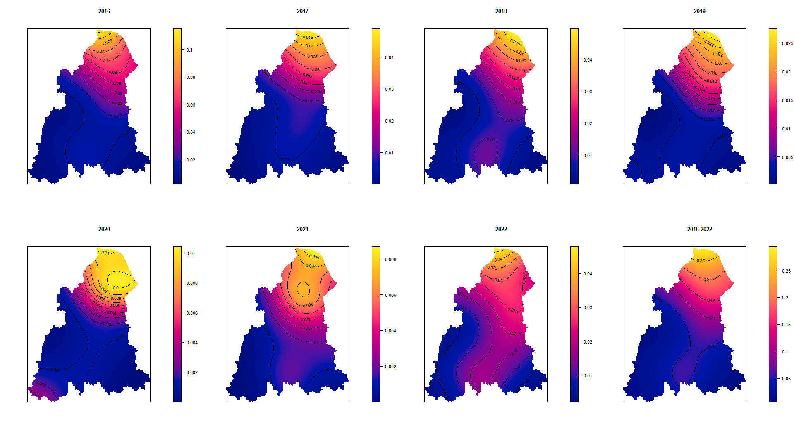

## Load library


```r
library(sf)
```

```
## Linking to GEOS 3.9.3, GDAL 3.5.2, PROJ 8.2.1; sf_use_s2() is TRUE
```

```r
library(tidyverse)
```

```
## ── Attaching core tidyverse packages ──────────────────────── tidyverse 2.0.0 ──
## ✔ dplyr     1.1.1     ✔ readr     2.1.4
## ✔ forcats   1.0.0     ✔ stringr   1.5.0
## ✔ ggplot2   3.4.1     ✔ tibble    3.2.1
## ✔ lubridate 1.9.2     ✔ tidyr     1.3.0
## ✔ purrr     1.0.1
```

```
## ── Conflicts ────────────────────────────────────────── tidyverse_conflicts() ──
## ✖ dplyr::filter() masks stats::filter()
## ✖ dplyr::lag()    masks stats::lag()
## ℹ Use the ]8;;http://conflicted.r-lib.org/conflicted package]8;; to force all conflicts to become errors
```

```r
library(here)
```

```
## here() starts at C:/Users/MY PC/OneDrive - Universiti Sains Malaysia/R MPH Spatial Analysis/spatialMPH
```

```r
library(janitor)
```

```
## 
## Attaching package: 'janitor'
## 
## The following objects are masked from 'package:stats':
## 
##     chisq.test, fisher.test
```

```r
library(gtsummary)
library(DT)
library(stringr)
library(readxl)
library(broom)
library(tmap)
library(mapview)
library(lubridate)
library(maptools)
```

```
## Loading required package: sp
## Checking rgeos availability: TRUE
## Please note that 'maptools' will be retired during 2023,
## plan transition at your earliest convenience;
## some functionality will be moved to 'sp'.
```

```r
library(spatstat)
```

```
## Loading required package: spatstat.data
## Loading required package: spatstat.geom
## spatstat.geom 3.1-0
## Loading required package: spatstat.random
## spatstat.random 3.1-4
## Loading required package: spatstat.explore
## Loading required package: nlme
## 
## Attaching package: 'nlme'
## 
## The following object is masked from 'package:dplyr':
## 
##     collapse
## 
## spatstat.explore 3.1-0
## Loading required package: spatstat.model
## Loading required package: rpart
## spatstat.model 3.2-1
## Loading required package: spatstat.linnet
## spatstat.linnet 3.0-6
## 
## spatstat 3.0-3 
## For an introduction to spatstat, type 'beginner'
```

```r
library(spdep)
```

```
## Loading required package: spData
## To access larger datasets in this package, install the spDataLarge
## package with: `install.packages('spDataLarge',
## repos='https://nowosad.github.io/drat/', type='source')`
```

```r
library(gridExtra)
```

```
## 
## Attaching package: 'gridExtra'
## 
## The following object is masked from 'package:dplyr':
## 
##     combine
```

```r
library(grid)
```

```
## 
## Attaching package: 'grid'
## 
## The following object is masked from 'package:spatstat.geom':
## 
##     as.mask
```


## Prepare data

read polygon data


```r
kel <- st_read(here("Map",
                    "kelantan.shp"))
```

```
## Reading layer `kelantan' from data source 
##   `C:\Users\MY PC\OneDrive - Universiti Sains Malaysia\R MPH Spatial Analysis\spatialMPH\Map\kelantan.shp' 
##   using driver `ESRI Shapefile'
## Simple feature collection with 66 features and 6 fields
## Geometry type: POLYGON
## Dimension:     XY
## Bounding box:  xmin: 371629.6 ymin: 503028.2 xmax: 519479.6 ymax: 690232.8
## Projected CRS: Kertau (RSO) / RSO Malaya (m)
```


read population data per mukim per year


```r
kel_mukim <- read_xlsx(here ("mukim.xlsx"))
```


merge population data to polygon


```r
kel_map <- merge(kel,kel_mukim,by.x="MUKIM", by.y="MUKIM", all.x=T, sort=F)
dim(kel_map)
```

```
## [1] 66 49
```

```r
class(kel_map)
```

```
## [1] "sf"         "data.frame"
```

```r
st_crs(kel_map)
```

```
## Coordinate Reference System:
##   User input: Kertau (RSO) / RSO Malaya (m) 
##   wkt:
## PROJCRS["Kertau (RSO) / RSO Malaya (m)",
##     BASEGEOGCRS["Kertau (RSO)",
##         DATUM["Kertau (RSO)",
##             ELLIPSOID["Everest 1830 (RSO 1969)",6377295.664,300.8017,
##                 LENGTHUNIT["metre",1]]],
##         PRIMEM["Greenwich",0,
##             ANGLEUNIT["degree",0.0174532925199433]],
##         ID["EPSG",4751]],
##     CONVERSION["Rectified Skew Orthomorphic Malaya Grid (metres)",
##         METHOD["Hotine Oblique Mercator (variant A)",
##             ID["EPSG",9812]],
##         PARAMETER["Latitude of projection centre",4,
##             ANGLEUNIT["degree",0.0174532925199433],
##             ID["EPSG",8811]],
##         PARAMETER["Longitude of projection centre",102.25,
##             ANGLEUNIT["degree",0.0174532925199433],
##             ID["EPSG",8812]],
##         PARAMETER["Azimuth of initial line",323.0257905,
##             ANGLEUNIT["degree",0.0174532925199433],
##             ID["EPSG",8813]],
##         PARAMETER["Angle from Rectified to Skew Grid",323.130102361111,
##             ANGLEUNIT["degree",0.0174532925199433],
##             ID["EPSG",8814]],
##         PARAMETER["Scale factor on initial line",0.99984,
##             SCALEUNIT["unity",1],
##             ID["EPSG",8815]],
##         PARAMETER["False easting",804670.24,
##             LENGTHUNIT["metre",1],
##             ID["EPSG",8806]],
##         PARAMETER["False northing",0,
##             LENGTHUNIT["metre",1],
##             ID["EPSG",8807]]],
##     CS[Cartesian,2],
##         AXIS["(E)",east,
##             ORDER[1],
##             LENGTHUNIT["metre",1]],
##         AXIS["(N)",north,
##             ORDER[2],
##             LENGTHUNIT["metre",1]],
##     USAGE[
##         SCOPE["Engineering survey, topographic mapping."],
##         AREA["Malaysia - West Malaysia onshore."],
##         BBOX[1.21,99.59,6.72,104.6]],
##     ID["EPSG",3168]]
```

load disease data in xlxs


```r
linelist <- read_xlsx(here ("linelist.xlsx")) %>% clean_names()
glimpse(linelist)
```

```
## Rows: 1,318
## Columns: 26
## $ diagnosis                                  <chr> "Leptospirosis", "Leptospir…
## $ notifikasi_no                              <dbl> 2685725, 2728504, 2739963, …
## $ tahun_daftar                               <dbl> 2016, 2016, 2016, 2016, 201…
## $ epid_daftar                                <dbl> 6, 9, 11, 12, 18, 18, 19, 1…
## $ age                                        <dbl> 30, 23, 39, 43, 31, 34, 48,…
## $ alamat_semasa_kejadian                     <chr> "FELDA ARING", "LADANG U&I …
## $ poskod                                     <dbl> 18300, 18300, 18300, 18300,…
## $ latitude_rso                               <dbl> 478031, 459494, 441802, 488…
## $ longitude_rso                              <dbl> 548141, 564966, 547551, 547…
## $ latitude_wgs                               <dbl> 4.944824, 5.034372, 4.89743…
## $ longitude_wgs                              <dbl> 102.3491, 102.1477, 101.960…
## $ notifikasi_status                          <chr> "Daftar Kes", "Daftar Kes",…
## $ race                                       <chr> "Foreigner", "Foreigner", "…
## $ kewarganegaraan                            <chr> "Bukan Warganegara", "Bukan…
## $ gender                                     <chr> "Male", "Male", "Male", "Ma…
## $ nationality                                <chr> "INDONESIA", "INDONESIA", "…
## $ klasifikasi_kes                            <chr> "Sporadic", "Sporadic", "Sp…
## $ cara_pengesanan_kes                        <chr> "Pasif", "Pasif", "Pasif", …
## $ jenis_rawatan                              <chr> "Wad Perubatan", "Jabatan K…
## $ daerah                                     <chr> "GUA MUSANG", "GUA MUSANG",…
## $ mukim                                      <chr> "CHIKU", "CHIKU", "GALAS", …
## $ lokaliti                                   <chr> NA, "LADANG U & I, CIKU", "…
## $ diagnosis2                                 <chr> "LEPTOSPIROSIS", "LEPTOSPIR…
## $ sub_diagnosis                              <chr> NA, NA, NA, NA, NA, NA, NA,…
## $ negeri                                     <chr> "KELANTAN", "KELANTAN", "KE…
## $ jenis_import_jangkitan_dalam_negara_negeri <chr> NA, NA, NA, NA, NA, NA, NA,…
```


remove na coordinate


```r
#disease data all - list all is all leptospirosis and enteric fever cases
listALL <- linelist %>% 
  filter(!is.na(latitude_wgs),
         !is.na(longitude_wgs))
```


convert all disease data to spatial data


```r
loc_ALL <- st_as_sf(listALL, 
                    coords = c("longitude_wgs", "latitude_wgs"), 
                    crs = 4326)
```


convert CRS to RSO


```r
loc_ALL2 <- st_transform(loc_ALL, 3168)
```


## Point Pattern Analysis

# Transform data

convert data to spatial format


```r
kel_map.sp <- as(kel_map, "Spatial")
class(kel_map.sp)
```

```
## [1] "SpatialPolygonsDataFrame"
## attr(,"package")
## [1] "sp"
```


```r
plot(kel_map.sp)
```

<!-- -->

convert point to spatial


```r
loc_ALL2.sp <- as(loc_ALL2, "Spatial")
class(loc_ALL2.sp)
```

```
## [1] "SpatialPointsDataFrame"
## attr(,"package")
## [1] "sp"
```

select point only in Kelantan


```r
all_kel <- loc_ALL2 %>% 
  mutate(within_kel_map = lengths(st_within(loc_ALL2, kel_map)))
all_kel2 <- all_kel %>% 
  filter(within_kel_map == 1)
```


split data by diagnosis


```r
Enteric_kel <- all_kel2 %>% 
  filter(diagnosis == "Enteric_fever") 
lepto_kel <- all_kel2 %>% 
  filter(diagnosis == "Leptospirosis") 
```


## point pattern analysis for enteric fever

extract enteric fever by year


```r
loc_ent16 <- subset(Enteric_kel, tahun_daftar=="2016")
loc_ent17 <- subset(Enteric_kel, tahun_daftar=="2017")
loc_ent18 <- subset(Enteric_kel, tahun_daftar=="2018")
loc_ent19 <- subset(Enteric_kel, tahun_daftar=="2019")
loc_ent20 <- subset(Enteric_kel, tahun_daftar=="2020")
loc_ent21 <- subset(Enteric_kel, tahun_daftar=="2021")
loc_ent22 <- subset(Enteric_kel, tahun_daftar=="2022")
```


convert point to spatial


```r
loc_ent16.sp <- as(loc_ent16, "Spatial")
loc_ent17.sp <- as(loc_ent17, "Spatial")
loc_ent18.sp <- as(loc_ent18, "Spatial")
loc_ent19.sp <- as(loc_ent19, "Spatial")
loc_ent20.sp <- as(loc_ent20, "Spatial")
loc_ent21.sp <- as(loc_ent21, "Spatial")
loc_ent22.sp <- as(loc_ent22, "Spatial")
```


convert point spatial data to ppp format


```r
loc_ALL2.ppp <- as(loc_ALL2.sp, 'ppp')
class(loc_ALL2.ppp)
```

```
## [1] "ppp"
```

```r
loc_ent16.ppp <- as(loc_ent16.sp, 'ppp')
loc_ent17.ppp <- as(loc_ent17.sp, 'ppp')
loc_ent18.ppp <- as(loc_ent18.sp, 'ppp')
loc_ent19.ppp <- as(loc_ent19.sp, 'ppp')
loc_ent20.ppp <- as(loc_ent20.sp, 'ppp')
loc_ent21.ppp <- as(loc_ent21.sp, 'ppp')
loc_ent22.ppp <- as(loc_ent22.sp, 'ppp')
```

transform to owin format


```r
kel_map.owin <- as(kel_map.sp, "owin")
class(kel_map.owin)
```

```
## [1] "owin"
```


plot ppp object with window 


```r
# plot ALL
plot(kel_map.owin)
points(loc_ALL2.ppp)
```

<!-- -->

convert enteric fever and lepto pint data to spatial to ppp


```r
Enteric_kel.sp <- as(Enteric_kel, "Spatial")
Enteric_kel.ppp <- as(Enteric_kel.sp, 'ppp')
lepto_kel.sp <- as(lepto_kel, "Spatial")
lepto_kel.ppp <- as(lepto_kel.sp, 'ppp')
```


plot enteric fever with window


```r
# plot Enteric Fever 2016-2022
plot(kel_map.owin)
points(Enteric_kel.ppp)
```

<!-- -->

Remove marks


```r
# remove marks enteric fever 2016-2022
Enteric_kel.ppp2 <- Enteric_kel.ppp
marks(Enteric_kel.ppp2) <- NULL

# remove marks (year)
loc_ent16.ppp2 <- loc_ent16.ppp
marks(loc_ent16.ppp2) <- NULL
loc_ent17.ppp2 <- loc_ent17.ppp
marks(loc_ent17.ppp2) <- NULL
loc_ent18.ppp2 <- loc_ent18.ppp
marks(loc_ent18.ppp2) <- NULL
loc_ent19.ppp2 <- loc_ent19.ppp
marks(loc_ent19.ppp2) <- NULL
loc_ent20.ppp2 <- loc_ent20.ppp
marks(loc_ent20.ppp2) <- NULL
loc_ent21.ppp2 <- loc_ent21.ppp
marks(loc_ent21.ppp2) <- NULL
loc_ent22.ppp2 <- loc_ent22.ppp
marks(loc_ent22.ppp2) <- NULL
```


```r
# generate window
Window(Enteric_kel.ppp2) <- kel_map.owin

# generate window (year)
Window(loc_ent16.ppp2) <- kel_map.owin
Window(loc_ent17.ppp2) <- kel_map.owin
Window(loc_ent18.ppp2) <- kel_map.owin
Window(loc_ent19.ppp2) <- kel_map.owin
Window(loc_ent20.ppp2) <- kel_map.owin
Window(loc_ent21.ppp2) <- kel_map.owin
Window(loc_ent22.ppp2) <- kel_map.owin
```


Plot enteric fever by year


```r
par(mfrow=c(2,4))
plot(loc_ent16.ppp2, main = 2016, cols=rgb(0,0,0,.2), pch=20)
plot(loc_ent17.ppp2, main = 2017, cols=rgb(0,0,0,.2), pch=20)
plot(loc_ent18.ppp2, main = 2018, cols=rgb(0,0,0,.2), pch=20)
plot(loc_ent19.ppp2, main = 2019, cols=rgb(0,0,0,.2), pch=20)
plot(loc_ent20.ppp2, main = 2020, cols=rgb(0,0,0,.2), pch=20)
plot(loc_ent21.ppp2, main = 2021, cols=rgb(0,0,0,.2), pch=20)
plot(loc_ent22.ppp2, main = 2022, cols=rgb(0,0,0,.2), pch=20)
plot(Enteric_kel.ppp2, main = "2016-2022", cols=rgb(0,0,0,.2), pch=20)
```

<!-- -->

# density analysis for enteric fever

quadrat count + plot


```r
par( mfrow= c(2,4) )
# 2016
quadr_count_ent16 <- quadratcount(loc_ent16.ppp2, 
                                  nx = 10,
                                  ny = 14)
plot(loc_ent16.ppp2, pch = 20, cex = 0.1, main = "2016")
plot(quadr_count_ent16, add = TRUE, cex = 2)

# 2017
quadr_count_ent17 <- quadratcount(loc_ent17.ppp2, 
                                  nx = 10,
                                  ny = 14)
plot(loc_ent17.ppp2, pch = 20, cex = 0.1, main = "2017")
plot(quadr_count_ent17, add = TRUE, cex = 2)

# 2018
quadr_count_ent18 <- quadratcount(loc_ent18.ppp2, 
                                  nx = 10,
                                  ny = 14)
plot(loc_ent18.ppp2, pch = 20, cex = 0.1, main = "2018")
plot(quadr_count_ent18, add = TRUE, cex = 2)

# 2019
quadr_count_ent19 <- quadratcount(loc_ent19.ppp2, 
                                  nx = 10,
                                  ny = 14)
plot(loc_ent19.ppp2, pch = 20, cex = 0.1, main = "2019")
plot(quadr_count_ent19, add = TRUE, cex = 2)

# 2020
quadr_count_ent20 <- quadratcount(loc_ent20.ppp2, 
                                  nx = 10,
                                  ny = 14)
plot(loc_ent20.ppp2, pch = 20, cex = 0.1, main = "2020")
plot(quadr_count_ent20, add = TRUE, cex = 2)

# 2021
quadr_count_ent21 <- quadratcount(loc_ent21.ppp2, 
                                  nx = 10,
                                  ny = 14)
plot(loc_ent21.ppp2, pch = 20, cex = 0.1, main = "2021")
plot(quadr_count_ent21, add = TRUE, cex = 2)

# 2022
quadr_count_ent22 <- quadratcount(loc_ent22.ppp2, 
                                  nx = 10,
                                  ny = 14)
plot(loc_ent22.ppp2, pch = 20, cex = 0.1, main = "2022")
plot(quadr_count_ent22, add = TRUE, cex = 2)

# cumulative cases 2016-2022
quadr_count_ent <- quadratcount(Enteric_kel.ppp2, 
                                nx = 10,
                                ny = 14)
plot(Enteric_kel.ppp2, pch = 20, cex = 0.1, main = "2016-2022")
plot(quadr_count_ent, add = TRUE, cex = 2)

mtext("Point Density Maps of Enteric Fever Cases in Kelantan 2016-2022", side = 1, line = -1, cex = 2, outer = TRUE)
```

<!-- -->


calculate VMR (Variance-to-Mean Ratio) enteric fever

- VMR greater than 1 indicates spatial clustering.
- Enteric Fever not uniformly distributed and may be clustered in certain areas.


```r
#2016-2022
Qcountent<-data.frame(quadr_count_ent)
var(Qcountent$Freq)/mean(Qcountent$Freq)
```

```
## [1] 14.01175
```

```r
#2016
Qcountent16<-data.frame(quadr_count_ent16)
var(Qcountent16$Freq)/mean(Qcountent16$Freq)
```

```
## [1] 6.952671
```

```r
#2017
Qcountent17<-data.frame(quadr_count_ent17)
var(Qcountent17$Freq)/mean(Qcountent17$Freq)
```

```
## [1] 3.772962
```

```r
#2018
Qcountent18<-data.frame(quadr_count_ent18)
var(Qcountent18$Freq)/mean(Qcountent18$Freq)
```

```
## [1] 6.133769
```

```r
#2019
Qcountent19<-data.frame(quadr_count_ent19)
var(Qcountent19$Freq)/mean(Qcountent19$Freq)
```

```
## [1] 2.170868
```

```r
#2020
Qcountent20<-data.frame(quadr_count_ent20)
var(Qcountent20$Freq)/mean(Qcountent20$Freq)
```

```
## [1] 1.659125
```

```r
#2021
Qcountent21<-data.frame(quadr_count_ent21)
var(Qcountent21$Freq)/mean(Qcountent21$Freq)
```

```
## [1] 1.364706
```

```r
#2022
Qcountent22<-data.frame(quadr_count_ent22)
var(Qcountent22$Freq)/mean(Qcountent22$Freq)
```

```
## [1] 6.686275
```
calculate Chi-square test for spatial randomnes - enteric fever

- a high VMR score and a significant chi-square test result would indicate that the points are clustered and non-randomly distributed, suggesting the presence of spatial processes such as spatial contagion, spatial dependence, or spatial interaction.


```r
chi_ent <- quadrat.test(Enteric_kel.ppp2, nx= 30, ny=15)
```

```
## Warning: Some expected counts are small; chi^2 approximation may be inaccurate
```

```r
chi_ent16 <- quadrat.test(loc_ent16.ppp2, nx= 30, ny=15)
```

```
## Warning: Some expected counts are small; chi^2 approximation may be inaccurate
```

```r
chi_ent17 <- quadrat.test(loc_ent17.ppp2, nx= 30, ny=15)
```

```
## Warning: Some expected counts are small; chi^2 approximation may be inaccurate
```

```r
chi_ent18 <- quadrat.test(loc_ent18.ppp2, nx= 30, ny=15)
```

```
## Warning: Some expected counts are small; chi^2 approximation may be inaccurate
```

```r
chi_ent19 <- quadrat.test(loc_ent19.ppp2, nx= 30, ny=15)
```

```
## Warning: Some expected counts are small; chi^2 approximation may be inaccurate
```

```r
chi_ent20 <- quadrat.test(loc_ent20.ppp2, nx= 30, ny=15)
```

```
## Warning: Some expected counts are small; chi^2 approximation may be inaccurate
```

```r
chi_ent21 <- quadrat.test(loc_ent21.ppp2, nx= 30, ny=15)
```

```
## Warning: Some expected counts are small; chi^2 approximation may be inaccurate
```

```r
chi_ent22 <- quadrat.test(loc_ent22.ppp2, nx= 30, ny=15)
```

```
## Warning: Some expected counts are small; chi^2 approximation may be inaccurate
```
result chi square for enteric fever


```r
chi_ent.df <- data.frame(Dataset = "Enteric_kel.ppp2",
                       TestStatistic = chi_ent$statistic,
                       PValue = chi_ent$p.value)
chi_ent16.df <- data.frame(Dataset = "loc_ent16.ppp2",
                       TestStatistic = chi_ent16$statistic,
                       PValue = chi_ent16$p.value)
chi_ent17.df <- data.frame(Dataset = "loc_ent17.ppp2",
                       TestStatistic = chi_ent17$statistic,
                       PValue = chi_ent17$p.value)
chi_ent18.df <- data.frame(Dataset = "loc_ent18.ppp2",
                       TestStatistic = chi_ent18$statistic,
                       PValue = chi_ent18$p.value)
chi_ent19.df <- data.frame(Dataset = "loc_ent19.ppp2",
                       TestStatistic = chi_ent19$statistic,
                       PValue = chi_ent19$p.value)
chi_ent20.df <- data.frame(Dataset = "loc_ent20.ppp2",
                       TestStatistic = chi_ent20$statistic,
                       PValue = chi_ent20$p.value)
chi_ent21.df <- data.frame(Dataset = "loc_ent21.ppp2",
                       TestStatistic = chi_ent21$statistic,
                       PValue = chi_ent21$p.value)
chi_ent22.df <- data.frame(Dataset = "loc_ent22.ppp2",
                       TestStatistic = chi_ent22$statistic,
                       PValue = chi_ent22$p.value)
chi_quadENT <- bind_rows(
  data.frame(Dataset = "2016", chi_ent16.df), 
  data.frame(Dataset = "2017", chi_ent17.df), 
  data.frame(Dataset = "2018", chi_ent18.df), 
  data.frame(Dataset = "2019", chi_ent19.df), 
  data.frame(Dataset = "2020", chi_ent20.df), 
  data.frame(Dataset = "2021", chi_ent21.df), 
  data.frame(Dataset = "2022", chi_ent22.df), 
  data.frame(Dataset = "2016-2022", chi_ent.df))
chi_quadENT
```

```
##          Dataset        Dataset.1 TestStatistic        PValue
## X2...1      2016   loc_ent16.ppp2     1143.9794  1.452763e-97
## X2...2      2017   loc_ent17.ppp2      873.8220  1.856638e-56
## X2...3      2018   loc_ent18.ppp2     1019.6091  4.628008e-78
## X2...4      2019   loc_ent19.ppp2      380.9758  3.105928e-03
## X2...5      2020   loc_ent20.ppp2      346.2724  8.777291e-02
## X2...6      2021   loc_ent21.ppp2      339.1451  1.497286e-01
## X2...7      2022   loc_ent22.ppp2     1948.9720 1.332311e-237
## X2...8 2016-2022 Enteric_kel.ppp2     2125.9199 2.368050e-270
```


Monte Carlo permutation for spatial randomnes - enteric fever (chi square assumption not met)


```r
# calculate monte carlo
mc_qent <- quadrat.test(Enteric_kel.ppp2, nx= 30, ny=15, method = "MonteCarlo")
mc_qent16 <- quadrat.test(loc_ent16.ppp2, nx= 30, ny=15, method = "MonteCarlo")
mc_qent17 <- quadrat.test(loc_ent17.ppp2, nx= 30, ny=15, method = "MonteCarlo")
mc_qent18 <- quadrat.test(loc_ent18.ppp2, nx= 30, ny=15, method = "MonteCarlo")
mc_qent19 <- quadrat.test(loc_ent19.ppp2, nx= 30, ny=15, method = "MonteCarlo")
mc_qent20 <- quadrat.test(loc_ent20.ppp2, nx= 30, ny=15, method = "MonteCarlo")
mc_qent21 <- quadrat.test(loc_ent21.ppp2, nx= 30, ny=15, method = "MonteCarlo")
mc_qent22 <- quadrat.test(loc_ent22.ppp2, nx= 30, ny=15, method = "MonteCarlo")

# convert to data frame
mc_qent.df <- data.frame(Dataset = "Enteric_kel.ppp2",
                       TestStatistic = mc_qent$statistic,
                       PValue = mc_qent$p.value)
mc_qent16.df <- data.frame(Dataset = "loc_ent16.ppp2",
                       TestStatistic = mc_qent16$statistic,
                       PValue = mc_qent16$p.value)
mc_qent17.df <- data.frame(Dataset = "loc_ent17.ppp2",
                       TestStatistic = mc_qent17$statistic,
                       PValue = mc_qent17$p.value)
mc_qent18.df <- data.frame(Dataset = "loc_ent18.ppp2",
                       TestStatistic = mc_qent18$statistic,
                       PValue = mc_qent18$p.value)
mc_qent19.df <- data.frame(Dataset = "loc_ent19.ppp2",
                       TestStatistic = mc_qent19$statistic,
                       PValue = mc_qent19$p.value)
mc_qent20.df <- data.frame(Dataset = "loc_ent20.ppp2",
                       TestStatistic = mc_qent20$statistic,
                       PValue = mc_qent20$p.value)
mc_qent21.df <- data.frame(Dataset = "loc_ent21.ppp2",
                       TestStatistic = mc_qent21$statistic,
                       PValue = mc_qent21$p.value)
mc_qent22.df <- data.frame(Dataset = "loc_ent22.ppp2",
                       TestStatistic = mc_qent22$statistic,
                       PValue = mc_qent22$p.value)

# combine rows
mc_qENT <- bind_rows(
  data.frame(Dataset = "2016", mc_qent16.df), 
  data.frame(Dataset = "2017", mc_qent17.df), 
  data.frame(Dataset = "2018", mc_qent18.df), 
  data.frame(Dataset = "2019", mc_qent19.df), 
  data.frame(Dataset = "2020", mc_qent20.df), 
  data.frame(Dataset = "2021", mc_qent21.df), 
  data.frame(Dataset = "2022", mc_qent22.df), 
  data.frame(Dataset = "2016-2022", mc_qent.df))
mc_qENT
```

```
##          Dataset        Dataset.1 TestStatistic PValue
## X2...1      2016   loc_ent16.ppp2     1143.9794  0.005
## X2...2      2017   loc_ent17.ppp2      873.8220  0.010
## X2...3      2018   loc_ent18.ppp2     1019.6091  0.011
## X2...4      2019   loc_ent19.ppp2      380.9758  0.199
## X2...5      2020   loc_ent20.ppp2      346.2724  0.294
## X2...6      2021   loc_ent21.ppp2      339.1451  0.285
## X2...7      2022   loc_ent22.ppp2     1948.9720  0.001
## X2...8 2016-2022 Enteric_kel.ppp2     2125.9199  0.002
```

# Intensity analysis for enteric fever


```r
par( mfrow= c(2,4) )

inten_ent16 <-intensity(quadr_count_ent16)
plot(intensity(quadr_count_ent16, image = TRUE), main = "2016", las = 1)
plot(loc_ent16, pch = 20, cex = 0.6, add = TRUE)
```

```
## Warning in plot.sf(loc_ent16, pch = 20, cex = 0.6, add = TRUE): ignoring all
## but the first attribute
```

```r
inten_ent17 <-intensity(quadr_count_ent17)
plot(intensity(quadr_count_ent17, image = TRUE), main = "2017", las = 1)
plot(loc_ent17, pch = 20, cex = 0.6, add = TRUE)
```

```
## Warning in plot.sf(loc_ent17, pch = 20, cex = 0.6, add = TRUE): ignoring all
## but the first attribute
```

```r
inten_ent18 <-intensity(quadr_count_ent18)
plot(intensity(quadr_count_ent18, image = TRUE), main = "2018", las = 1)
plot(loc_ent18, pch = 20, cex = 0.6, add = TRUE)
```

```
## Warning in plot.sf(loc_ent18, pch = 20, cex = 0.6, add = TRUE): ignoring all
## but the first attribute
```

```r
inten_ent19 <-intensity(quadr_count_ent19)
plot(intensity(quadr_count_ent19, image = TRUE), main = "2019", las = 1)
plot(loc_ent19, pch = 20, cex = 0.6, add = TRUE)
```

```
## Warning in plot.sf(loc_ent19, pch = 20, cex = 0.6, add = TRUE): ignoring all
## but the first attribute
```

```r
inten_ent20 <-intensity(quadr_count_ent20)
plot(intensity(quadr_count_ent20, image = TRUE), main = "2020", las = 1)
plot(loc_ent20, pch = 20, cex = 0.6, add = TRUE)
```

```
## Warning in plot.sf(loc_ent20, pch = 20, cex = 0.6, add = TRUE): ignoring all
## but the first attribute
```

```r
inten_ent21 <-intensity(quadr_count_ent21)
plot(intensity(quadr_count_ent21, image = TRUE), main = "2021", las = 1)
plot(loc_ent21, pch = 20, cex = 0.6, add = TRUE)
```

```
## Warning in plot.sf(loc_ent21, pch = 20, cex = 0.6, add = TRUE): ignoring all
## but the first attribute
```

```r
inten_ent22 <-intensity(quadr_count_ent22)
plot(intensity(quadr_count_ent22, image = TRUE), main = "2022", las = 1)
plot(loc_ent22, pch = 20, cex = 0.6, add = TRUE)
```

```
## Warning in plot.sf(loc_ent22, pch = 20, cex = 0.6, add = TRUE): ignoring all
## but the first attribute
```

```r
inten_ent <-intensity(quadr_count_ent)
plot(intensity(quadr_count_ent, image = TRUE), main = "2016-2022", las = 1)
plot(Enteric_kel.ppp2, pch = 20, cex = 0.6, add = TRUE)

mtext("Intensity Maps of Enteric Fever Cases in Kelantan 2016-2022", side = 1, line = -1, cex = 1.5, outer = TRUE)
```

<!-- -->

# Kernel density raster for enteric fever

rescale to km


```r
# point
Enteric_kel.ppp2.km <- rescale(Enteric_kel.ppp2, 1000, 'km') #cumulative
loc_ent16.ppp2.km <- rescale(loc_ent16.ppp2, 1000, 'km') #2016
loc_ent17.ppp2.km <- rescale(loc_ent17.ppp2, 1000, 'km') #2017
loc_ent18.ppp2.km <- rescale(loc_ent18.ppp2, 1000, 'km') #2018
loc_ent19.ppp2.km <- rescale(loc_ent19.ppp2, 1000, 'km') #2019
loc_ent20.ppp2.km <- rescale(loc_ent20.ppp2, 1000, 'km') #2020
loc_ent21.ppp2.km <- rescale(loc_ent21.ppp2, 1000, 'km') #2021
loc_ent22.ppp2.km <- rescale(loc_ent22.ppp2, 1000, 'km') #2022

# map
kel_map.owin.km <- rescale(kel_map.owin, 1000, 'km') 
```


calculate kernel density estimate (kde) for Enteric Fever


```r
kde.ent <- density(Enteric_kel.ppp2.km) #2016 - 2022
kde.ent16 <- density(loc_ent16.ppp2.km) #2016
kde.ent17 <- density(loc_ent17.ppp2.km) #2017
kde.ent18 <- density(loc_ent18.ppp2.km) #2018
kde.ent19 <- density(loc_ent19.ppp2.km) #2019
kde.ent20 <- density(loc_ent20.ppp2.km) #2020
kde.ent21 <- density(loc_ent21.ppp2.km) #2021
kde.ent22 <- density(loc_ent22.ppp2.km) #2022
```


plot kde Enteric fever


```r
par(mfrow=c(2,4))
plot(kde.ent16, main = 2016, las = 1) #2016
plot(kde.ent17, main = 2017, las = 1) #2017
plot(kde.ent18, main = 2018, las = 1) #2018
plot(kde.ent19, main = 2019, las = 1) #2019
plot(kde.ent20, main = 2020, las = 1) #2020
plot(kde.ent21, main = 2021, las = 1) #2021
plot(kde.ent22, main = 2022, las = 1) #2022
plot(kde.ent, main = "2016-2022", las = 1) #2016-2022
```

<!-- -->

kde 20km bandwith for enteric fever


```r
kde.ent.20km <- density(Enteric_kel.ppp2.km, sigma = 20) #2016-2022
kde.ent16.20km <- density(loc_ent16.ppp2.km, sigma = 20) #2016
kde.ent17.20km <- density(loc_ent17.ppp2.km, sigma = 20) #2017
kde.ent18.20km <- density(loc_ent18.ppp2.km, sigma = 20) #2018
kde.ent19.20km <- density(loc_ent19.ppp2.km, sigma = 20) #2019
kde.ent20.20km <- density(loc_ent20.ppp2.km, sigma = 20) #2020
kde.ent21.20km <- density(loc_ent21.ppp2.km, sigma = 20) #2021
kde.ent22.20km <- density(loc_ent22.ppp2.km, sigma = 20) #2022

# plot kde 20km

par(mfrow=c(2,4))
# 2016
plot(kde.ent16.20km, main = 2016, las = 1)
contour(kde.ent16.20km, add = TRUE)
# 2017
plot(kde.ent17.20km, main = 2017, las = 1)
contour(kde.ent17.20km, add = TRUE)
# 2018
plot(kde.ent18.20km, main = 2018, las = 1)
contour(kde.ent18.20km, add = TRUE)
# 2019
plot(kde.ent19.20km, main = 2019, las = 1)
contour(kde.ent19.20km, add = TRUE)
# 2020
plot(kde.ent20.20km, main = 2020, las = 1)
contour(kde.ent20.20km, add = TRUE)
# 2021
plot(kde.ent21.20km, main = 2021, las = 1)
contour(kde.ent21.20km, add = TRUE)
# 2022
plot(kde.ent22.20km, main = 2022, las = 1)
contour(kde.ent22.20km, add = TRUE)
# 2016-2022
plot(kde.ent.20km, main = "2016-2022", las = 1)
contour(kde.ent.20km, add = TRUE)
```

<!-- -->


calculate kde 5km bandwith enteric fever


```r
kde.ent.5km <- density(Enteric_kel.ppp2.km, sigma = 5) #2016-2022
kde.ent16.5km <- density(loc_ent16.ppp2.km, sigma = 5) #2016
kde.ent17.5km <- density(loc_ent17.ppp2.km, sigma = 5) #2017
kde.ent18.5km <- density(loc_ent18.ppp2.km, sigma = 5) #2018
kde.ent19.5km <- density(loc_ent19.ppp2.km, sigma = 5) #2019
kde.ent20.5km <- density(loc_ent20.ppp2.km, sigma = 5) #2020
kde.ent21.5km <- density(loc_ent21.ppp2.km, sigma = 5) #2021
kde.ent22.5km <- density(loc_ent22.ppp2.km, sigma = 5) #2022
```


plot kde 5km bandwith enteric fever


```r
# plot all KDE enteric fever in one view
par( mfrow= c(2,4) )
plot(kde.ent16.5km, main = "2016", cex.main = 1.5, font.main = 2, las = 1)
contour(kde.ent16.5km, add = TRUE)
plot(kde.ent17.5km, main = "2017", cex.main = 1.5, font.main = 2, las = 1)
contour(kde.ent17.5km, add = TRUE)
plot(kde.ent18.5km, main = "2018", cex.main = 1.5, font.main = 2, las = 1)
contour(kde.ent18.5km, add = TRUE)
plot(kde.ent19.5km, main = "2019", cex.main = 1.5, font.main = 2, las = 1)
contour(kde.ent19.5km, add = TRUE)
plot(kde.ent20.5km, main = "2020", cex.main = 1.5, font.main = 2, las = 1)
contour(kde.ent20.5km, add = TRUE)
plot(kde.ent21.5km, main = "2021", cex.main = 1.5, font.main = 2, las = 1)
contour(kde.ent21.5km, add = TRUE)
plot(kde.ent22.5km, main = "2022", cex.main = 1.5, font.main = 2, las = 1)
contour(kde.ent22.5km, add = TRUE)
plot(kde.ent.5km, main = "2016-2022", cex.main = 1.5, font.main = 2, las = 1)
contour(kde.ent.5km, add = TRUE)

mtext("Kernel Density Estimate (KDE) Heatmaps of Enteric Fever Cases in Kelantan 2016-2022", side = 1, line = -1, cex = 2, outer = TRUE)
```

<!-- -->


## point pattern analysis for Leptospirosis

prepare data for leptospirosis


```r
plot(kel_map.owin)
points(lepto_kel.ppp)
```

<!-- -->


extract leptospirosis by year, convert to ppp


```r
loc_lep16 <- subset(lepto_kel, tahun_daftar=="2016")
loc_lep17 <- subset(lepto_kel, tahun_daftar=="2017")
loc_lep18 <- subset(lepto_kel, tahun_daftar=="2018")
loc_lep19 <- subset(lepto_kel, tahun_daftar=="2019")
loc_lep20 <- subset(lepto_kel, tahun_daftar=="2020")
loc_lep21 <- subset(lepto_kel, tahun_daftar=="2021")
loc_lep22 <- subset(lepto_kel, tahun_daftar=="2022")
```


convert point to spatial


```r
loc_lep16.sp <- as(loc_lep16, "Spatial")
```


```r
loc_lep17.sp <- as(loc_lep17, "Spatial")
```


```r
loc_lep18.sp <- as(loc_lep18, "Spatial")
```


```r
loc_lep19.sp <- as(loc_lep19, "Spatial")
```


```r
loc_lep20.sp <- as(loc_lep20, "Spatial")
```


```r
loc_lep21.sp <- as(loc_lep21, "Spatial")
```


```r
loc_lep22.sp <- as(loc_lep22, "Spatial")
```


convert point spatial data to ppp format


```r
loc_lep16.ppp <- as(loc_lep16.sp, 'ppp')
loc_lep17.ppp <- as(loc_lep17.sp, 'ppp')
loc_lep18.ppp <- as(loc_lep18.sp, 'ppp')
loc_lep19.ppp <- as(loc_lep19.sp, 'ppp')
loc_lep20.ppp <- as(loc_lep20.sp, 'ppp')
loc_lep21.ppp <- as(loc_lep21.sp, 'ppp')
loc_lep22.ppp <- as(loc_lep22.sp, 'ppp')
```


remove marks


```r
#remove marks leptospirosis 2016-2022
lepto_kel.ppp2 <- lepto_kel.ppp
marks(lepto_kel.ppp2) <- NULL

#remove marks (year)
loc_lep16.ppp2 <- loc_lep16.ppp
marks(loc_lep16.ppp2) <- NULL
loc_lep17.ppp2 <- loc_lep17.ppp
marks(loc_lep17.ppp2) <- NULL
loc_lep18.ppp2 <- loc_lep18.ppp
marks(loc_lep18.ppp2) <- NULL
loc_lep19.ppp2 <- loc_lep19.ppp
marks(loc_lep19.ppp2) <- NULL
loc_lep20.ppp2 <- loc_lep20.ppp
marks(loc_lep20.ppp2) <- NULL
loc_lep21.ppp2 <- loc_lep21.ppp
marks(loc_lep21.ppp2) <- NULL
loc_lep22.ppp2 <- loc_lep22.ppp
marks(loc_lep22.ppp2) <- NULL
```


generate window


```r
Window(lepto_kel.ppp2) <- kel_map.owin
Window(loc_lep16.ppp2) <- kel_map.owin
Window(loc_lep17.ppp2) <- kel_map.owin
Window(loc_lep18.ppp2) <- kel_map.owin
Window(loc_lep19.ppp2) <- kel_map.owin
Window(loc_lep20.ppp2) <- kel_map.owin
Window(loc_lep21.ppp2) <- kel_map.owin
Window(loc_lep22.ppp2) <- kel_map.owin
```


plot leptospirosis cases


```r
par(mfrow=c(2,4))
plot(loc_lep16.ppp2, main = 2016, cols=rgb(0,0,0,.2), pch=20) #2016
plot(loc_lep17.ppp2, main = 2017, cols=rgb(0,0,0,.2), pch=20) #2017
plot(loc_lep18.ppp2, main = 2018, cols=rgb(0,0,0,.2), pch=20) #2018
plot(loc_lep19.ppp2, main = 2019, cols=rgb(0,0,0,.2), pch=20) #2019
plot(loc_lep20.ppp2, main = 2020, cols=rgb(0,0,0,.2), pch=20) #2020
plot(loc_lep21.ppp2, main = 2021, cols=rgb(0,0,0,.2), pch=20) #2021
plot(loc_lep22.ppp2, main = 2022, cols=rgb(0,0,0,.2), pch=20) #2022
plot(lepto_kel.ppp2, main = "2016-2022", cols=rgb(0,0,0,.2), pch=20) #2016-2022
```

<!-- -->


# density analysis for leptospirosis

calculate quadrat count 


```r
quadr_count_lep <- quadratcount(lepto_kel.ppp2, nx = 10,ny = 14) #2016-2022
quadr_count_lep16 <- quadratcount(loc_lep16.ppp2, nx = 10,ny = 14) #2016
quadr_count_lep17 <- quadratcount(loc_lep17.ppp2, nx = 10,ny = 14) #2017
quadr_count_lep18 <- quadratcount(loc_lep18.ppp2, nx = 10,ny = 14) #2018
quadr_count_lep19 <- quadratcount(loc_lep19.ppp2, nx = 10,ny = 14) #2019
quadr_count_lep20 <- quadratcount(loc_lep20.ppp2, nx = 10,ny = 14) #2020
quadr_count_lep21 <- quadratcount(loc_lep21.ppp2, nx = 10,ny = 14) #2021
quadr_count_lep22 <- quadratcount(loc_lep22.ppp2, nx = 10,ny = 14) #2022
```


plot quadrat count


```r
par( mfrow= c(2,4) )
#2016
plot(loc_lep16.ppp2, pch = 20, cex = 0.1, main = "2016")
plot(quadr_count_lep16, add = TRUE, cex = 2)
#2017
plot(loc_lep17.ppp2, pch = 20, cex = 0.1, main = "2017")
plot(quadr_count_lep17, add = TRUE, cex = 2)
#2018
plot(loc_lep18.ppp2, pch = 20, cex = 0.1, main = "2018")
plot(quadr_count_lep18, add = TRUE, cex = 2)
#2019
plot(loc_lep19.ppp2, pch = 20, cex = 0.1, main = "2019")
plot(quadr_count_lep19, add = TRUE, cex = 2)
#2020
plot(loc_lep20.ppp2, pch = 20, cex = 0.1, main = "2020")
plot(quadr_count_lep20, add = TRUE, cex = 2)
#2021
plot(loc_lep21.ppp2, pch = 20, cex = 0.1, main = "2021")
plot(quadr_count_lep21, add = TRUE, cex = 2)
#2022
plot(loc_lep22.ppp2, pch = 20, cex = 0.1, main = "2022")
plot(quadr_count_lep22, add = TRUE, cex = 2)
#2016-2022
plot(lepto_kel.ppp2, pch = 20, cex = 0.1, main = "2016-2022")
plot(quadr_count_lep, add = TRUE, cex = 2) 

mtext("Point Density Maps of Leptospirosis Cases in Kelantan 2016-2022", side = 1, line = -1, cex = 2, outer = TRUE)
```

<!-- -->


calculate VMR (Variance-to-Mean Ratio) Leptospirosis
- VMR greater than 1 indicates spatial clustering.
- leptospirosis not uniformly distributed and may be clustered in certain areas.


```r
#2016-2022
Qcountlep<-data.frame(quadr_count_lep)
var(Qcountlep$Freq)/mean(Qcountlep$Freq)
```

```
## [1] 28.60678
```

```r
#2016
Qcountlep16<-data.frame(quadr_count_lep16)
var(Qcountlep16$Freq)/mean(Qcountlep16$Freq)
```

```
## [1] 12.75471
```

```r
#2017
Qcountlep17<-data.frame(quadr_count_lep17)
var(Qcountlep17$Freq)/mean(Qcountlep17$Freq)
```

```
## [1] 5.545172
```

```r
#2018
Qcountlep18<-data.frame(quadr_count_lep18)
var(Qcountlep18$Freq)/mean(Qcountlep18$Freq)
```

```
## [1] 6.052177
```

```r
#2019
Qcountlep19<-data.frame(quadr_count_lep19)
var(Qcountlep19$Freq)/mean(Qcountlep19$Freq)
```

```
## [1] 3.723267
```

```r
#2020
Qcountlep20<-data.frame(quadr_count_lep20)
var(Qcountlep20$Freq)/mean(Qcountlep20$Freq)
```

```
## [1] 2.617647
```

```r
#2021
Qcountlep21<-data.frame(quadr_count_lep21)
var(Qcountlep21$Freq)/mean(Qcountlep21$Freq)
```

```
## [1] 2.28483
```

```r
#2022
Qcountlep22<-data.frame(quadr_count_lep22)
var(Qcountlep22$Freq)/mean(Qcountlep22$Freq)
```

```
## [1] 5.382395
```

calculate Chi-square test for spatial randomnes - leptospirosis

- a high VMR score and a significant chi-square test result would indicate that the points are clustered and non-randomly distributed, suggesting the presence of spatial processes such as spatial contagion, spatial dependence, or spatial interaction.


```r
chi_lep <- quadrat.test(lepto_kel.ppp2, nx= 30, ny=15)
```

```
## Warning: Some expected counts are small; chi^2 approximation may be inaccurate
```

```r
chi_lep16 <- quadrat.test(loc_lep16.ppp2, nx= 30, ny=15)
```

```
## Warning: Some expected counts are small; chi^2 approximation may be inaccurate
```

```r
chi_lep17 <- quadrat.test(loc_lep17.ppp2, nx= 30, ny=15)
```

```
## Warning: Some expected counts are small; chi^2 approximation may be inaccurate
```

```r
chi_lep18 <- quadrat.test(loc_lep18.ppp2, nx= 30, ny=15)
```

```
## Warning: Some expected counts are small; chi^2 approximation may be inaccurate
```

```r
chi_lep19 <- quadrat.test(loc_lep19.ppp2, nx= 30, ny=15)
```

```
## Warning: Some expected counts are small; chi^2 approximation may be inaccurate
```

```r
chi_lep20 <- quadrat.test(loc_lep20.ppp2, nx= 30, ny=15)
```

```
## Warning: Some expected counts are small; chi^2 approximation may be inaccurate
```

```r
chi_lep21 <- quadrat.test(loc_lep21.ppp2, nx= 30, ny=15)
```

```
## Warning: Some expected counts are small; chi^2 approximation may be inaccurate
```

```r
chi_lep22 <- quadrat.test(loc_lep22.ppp2, nx= 30, ny=15)
```

```
## Warning: Some expected counts are small; chi^2 approximation may be inaccurate
```

result chi square for enteric fever


```r
chi_lep.df <- data.frame(Dataset = "lepto_kel.ppp2",
                       TestStatistic = chi_lep$statistic,
                       PValue = chi_lep$p.value)
chi_lep16.df <- data.frame(Dataset = "loc_lep16.ppp2",
                       TestStatistic = chi_lep16$statistic,
                       PValue = chi_lep16$p.value)
chi_lep17.df <- data.frame(Dataset = "loc_lep17.ppp2",
                       TestStatistic = chi_lep17$statistic,
                       PValue = chi_lep17$p.value)
chi_lep18.df <- data.frame(Dataset = "loc_lep18.ppp2",
                       TestStatistic = chi_lep18$statistic,
                       PValue = chi_lep18$p.value)
chi_lep19.df <- data.frame(Dataset = "loc_lep19.ppp2",
                       TestStatistic = chi_lep19$statistic,
                       PValue = chi_lep19$p.value)
chi_lep20.df <- data.frame(Dataset = "loc_lep20.ppp2",
                       TestStatistic = chi_lep20$statistic,
                       PValue = chi_lep20$p.value)
chi_lep21.df <- data.frame(Dataset = "loc_lep21.ppp2",
                       TestStatistic = chi_lep21$statistic,
                       PValue = chi_lep21$p.value)
chi_lep22.df <- data.frame(Dataset = "loc_lep22.ppp2",
                       TestStatistic = chi_lep22$statistic,
                       PValue = chi_lep22$p.value)
chi_quadLEP <- bind_rows(
  data.frame(Dataset = "2016", chi_lep16.df), 
  data.frame(Dataset = "2017", chi_lep17.df), 
  data.frame(Dataset = "2018", chi_lep18.df), 
  data.frame(Dataset = "2019", chi_lep19.df), 
  data.frame(Dataset = "2020", chi_lep20.df), 
  data.frame(Dataset = "2021", chi_lep21.df), 
  data.frame(Dataset = "2022", chi_lep22.df), 
  data.frame(Dataset = "2016-2022", chi_lep.df))
chi_quadLEP
```

```
##          Dataset      Dataset.1 TestStatistic        PValue
## X2...1      2016 loc_lep16.ppp2     1542.5046 1.323050e-164
## X2...2      2017 loc_lep17.ppp2      705.0282  8.920041e-34
## X2...3      2018 loc_lep18.ppp2      784.7535  4.067253e-44
## X2...4      2019 loc_lep19.ppp2      618.7198  1.597615e-23
## X2...5      2020 loc_lep20.ppp2      400.2916  2.939252e-04
## X2...6      2021 loc_lep21.ppp2      512.3557  1.155780e-12
## X2...7      2022 loc_lep22.ppp2      766.0118  1.275444e-41
## X2...8 2016-2022 lepto_kel.ppp2     3114.0614  0.000000e+00
```


Monte Carlo permutation for spatial randomnes - leptospirosis (chi square assumption not met)


```r
# calculate monte carlo
#| cache = TRUE
mc_qlep <- quadrat.test(lepto_kel.ppp2, nx= 30, ny=15, method = "MonteCarlo")
mc_qlep16 <- quadrat.test(loc_lep16.ppp2, nx= 30, ny=15, method = "MonteCarlo")
mc_qlep17 <- quadrat.test(loc_lep17.ppp2, nx= 30, ny=15, method = "MonteCarlo")
mc_qlep18 <- quadrat.test(loc_lep18.ppp2, nx= 30, ny=15, method = "MonteCarlo")
mc_qlep19 <- quadrat.test(loc_lep19.ppp2, nx= 30, ny=15, method = "MonteCarlo")
mc_qlep20 <- quadrat.test(loc_lep20.ppp2, nx= 30, ny=15, method = "MonteCarlo")
mc_qlep21 <- quadrat.test(loc_lep21.ppp2, nx= 30, ny=15, method = "MonteCarlo")
mc_qlep22 <- quadrat.test(loc_lep22.ppp2, nx= 30, ny=15, method = "MonteCarlo")
```


convert to data frame


```r
mc_qlep.df <- data.frame(Dataset = "lepto_kel.ppp2",
                       TestStatistic = mc_qlep$statistic,
                       PValue = mc_qlep$p.value)
mc_qlep16.df <- data.frame(Dataset = "loc_lep16.ppp2",
                       TestStatistic = mc_qlep16$statistic,
                       PValue = mc_qlep16$p.value)
mc_qlep17.df <- data.frame(Dataset = "loc_lep17.ppp2",
                       TestStatistic = mc_qlep17$statistic,
                       PValue = mc_qlep17$p.value)
mc_qlep18.df <- data.frame(Dataset = "loc_lep18.ppp2",
                       TestStatistic = mc_qlep18$statistic,
                       PValue = mc_qlep18$p.value)
mc_qlep19.df <- data.frame(Dataset = "loc_lep19.ppp2",
                       TestStatistic = mc_qlep19$statistic,
                       PValue = mc_qlep19$p.value)
mc_qlep20.df <- data.frame(Dataset = "loc_lep20.ppp2",
                       TestStatistic = mc_qlep20$statistic,
                       PValue = mc_qlep20$p.value)
mc_qlep21.df <- data.frame(Dataset = "loc_lep21.ppp2",
                       TestStatistic = mc_qlep21$statistic,
                       PValue = mc_qlep21$p.value)
mc_qlep22.df <- data.frame(Dataset = "loc_lep22.ppp2",
                       TestStatistic = mc_qlep22$statistic,
                       PValue = mc_qlep22$p.value)
```


Display quadrat test with Monte Carlo permutation


```r
mc_qLEP <- bind_rows(
  data.frame(Dataset = "2016", mc_qlep16.df), 
  data.frame(Dataset = "2017", mc_qlep17.df), 
  data.frame(Dataset = "2018", mc_qlep18.df), 
  data.frame(Dataset = "2019", mc_qlep19.df), 
  data.frame(Dataset = "2020", mc_qlep20.df), 
  data.frame(Dataset = "2021", mc_qlep21.df), 
  data.frame(Dataset = "2022", mc_qlep22.df), 
  data.frame(Dataset = "2016-2022", mc_qlep.df))
mc_qLEP
```

```
##          Dataset      Dataset.1 TestStatistic PValue
## X2...1      2016 loc_lep16.ppp2     1542.5046  0.003
## X2...2      2017 loc_lep17.ppp2      705.0282  0.006
## X2...3      2018 loc_lep18.ppp2      784.7535  0.004
## X2...4      2019 loc_lep19.ppp2      618.7198  0.014
## X2...5      2020 loc_lep20.ppp2      400.2916  0.064
## X2...6      2021 loc_lep21.ppp2      512.3557  0.021
## X2...7      2022 loc_lep22.ppp2      766.0118  0.002
## X2...8 2016-2022 lepto_kel.ppp2     3114.0614  0.001
```


# intensity analysis for leptospirosis

Plot intensity


```r
par( mfrow= c(2,4) )
inten_lep16 <-intensity(quadr_count_lep16)
plot(intensity(quadr_count_lep16, image = TRUE), main = 2016, las = 1)
plot(loc_lep16, pch = 20, cex = 0.6, add = TRUE)
```

```
## Warning in plot.sf(loc_lep16, pch = 20, cex = 0.6, add = TRUE): ignoring all
## but the first attribute
```

```r
inten_lep17 <-intensity(quadr_count_lep17)
plot(intensity(quadr_count_lep17, image = TRUE), main = 2017, las = 1)
plot(loc_lep17, pch = 20, cex = 0.6, add = TRUE)
```

```
## Warning in plot.sf(loc_lep17, pch = 20, cex = 0.6, add = TRUE): ignoring all
## but the first attribute
```

```r
inten_lep18 <-intensity(quadr_count_lep18)
plot(intensity(quadr_count_lep18, image = TRUE), main = 2018, las = 1)
plot(loc_lep18, pch = 20, cex = 0.6, add = TRUE)
```

```
## Warning in plot.sf(loc_lep18, pch = 20, cex = 0.6, add = TRUE): ignoring all
## but the first attribute
```

```r
inten_lep19 <-intensity(quadr_count_lep19)
plot(intensity(quadr_count_lep19, image = TRUE), main = 2019, las = 1)
plot(loc_lep19, pch = 20, cex = 0.6, add = TRUE)
```

```
## Warning in plot.sf(loc_lep19, pch = 20, cex = 0.6, add = TRUE): ignoring all
## but the first attribute
```

```r
inten_lep20 <-intensity(quadr_count_lep20)
plot(intensity(quadr_count_lep20, image = TRUE), main = 2020, las = 1)
plot(loc_lep20, pch = 20, cex = 0.6, add = TRUE)
```

```
## Warning in plot.sf(loc_lep20, pch = 20, cex = 0.6, add = TRUE): ignoring all
## but the first attribute
```

```r
inten_lep21 <-intensity(quadr_count_lep21)
plot(intensity(quadr_count_lep21, image = TRUE), main = 2021, las = 1)
plot(loc_lep21, pch = 20, cex = 0.6, add = TRUE)
```

```
## Warning in plot.sf(loc_lep21, pch = 20, cex = 0.6, add = TRUE): ignoring all
## but the first attribute
```

```r
inten_lep22 <-intensity(quadr_count_lep22)
plot(intensity(quadr_count_lep22, image = TRUE), main = 2022, las = 1)
plot(loc_lep22, pch = 20, cex = 0.6, add = TRUE)
```

```
## Warning in plot.sf(loc_lep22, pch = 20, cex = 0.6, add = TRUE): ignoring all
## but the first attribute
```

```r
inten_lep <-intensity(quadr_count_lep)
plot(intensity(quadr_count_lep, image = TRUE), main = "2016-2022" , las = 1)
plot(lepto_kel.ppp2, pch = 20, cex = 0.6, add = TRUE)

mtext("Intensity Maps of Leptospirosis Cases in Kelantan 2016-2022", side = 1, line = -1, cex = 1.5, outer = TRUE)
```

<!-- -->

# Kernel density raster for leptospirosis

rescale to km


```r
#point
lepto_kel.ppp2.km <- rescale(lepto_kel.ppp2, 1000, 'km') #cumulative
loc_lep16.ppp2.km <- rescale(loc_lep16.ppp2, 1000, 'km') #2016
loc_lep17.ppp2.km <- rescale(loc_lep17.ppp2, 1000, 'km') #2017
loc_lep18.ppp2.km <- rescale(loc_lep18.ppp2, 1000, 'km') #2018
loc_lep19.ppp2.km <- rescale(loc_lep19.ppp2, 1000, 'km') #2019
loc_lep20.ppp2.km <- rescale(loc_lep20.ppp2, 1000, 'km') #2020
loc_lep21.ppp2.km <- rescale(loc_lep21.ppp2, 1000, 'km') #2021
loc_lep22.ppp2.km <- rescale(loc_lep22.ppp2, 1000, 'km') #2022

#map
kel_map.owin.km <- rescale(kel_map.owin, 1000, 'km') 
```


calculate kernel density raster (kde) for Leptospirosis 2016 - 2022


```r
kde.lep <- density(lepto_kel.ppp2.km) #2016 - 2022
kde.lep16 <- density(loc_lep16.ppp2.km) #2016
kde.lep17 <- density(loc_lep17.ppp2.km) #2017
kde.lep18 <- density(loc_lep18.ppp2.km) #2018
kde.lep19 <- density(loc_lep19.ppp2.km) #2019
kde.lep20 <- density(loc_lep20.ppp2.km) #2020
kde.lep21 <- density(loc_lep21.ppp2.km) #2021
kde.lep22 <- density(loc_lep22.ppp2.km) #2022
```


plot KDE leptospirosis


```r
par(mfrow=c(2,4))
plot(kde.lep16, main = 2016, las = 1) 
plot(kde.lep17, main = 2017, las = 1) 
plot(kde.lep18, main = 2018, las = 1) 
plot(kde.lep19, main = 2019, las = 1) 
plot(kde.lep20, main = 2020, las = 1) 
plot(kde.lep21, main = 2021, las = 1) 
plot(kde.lep22, main = 2022, las = 1) 
plot(kde.lep, main = "2016-2022", las = 1)
```

<!-- -->

plot kde 20km bandwith leptospirosis


```r
kde.lep.20km <- density(lepto_kel.ppp2.km, sigma = 20) #2016 - 2022
kde.lep16.20km <- density(loc_lep16.ppp2.km, sigma = 20) #2016
kde.lep17.20km <- density(loc_lep17.ppp2.km, sigma = 20) #2017
kde.lep18.20km <- density(loc_lep18.ppp2.km, sigma = 20) #2018
kde.lep19.20km <- density(loc_lep19.ppp2.km, sigma = 20) #2019
kde.lep20.20km <- density(loc_lep20.ppp2.km, sigma = 20) #2020
kde.lep21.20km <- density(loc_lep21.ppp2.km, sigma = 20) #2021
kde.lep22.20km <- density(loc_lep22.ppp2.km, sigma = 20) #2022

#plot KDE leptospirosis 20km bandwith
par(mfrow=c(2,4))
#2016
plot(kde.lep16.20km, main = 2016, las = 1)
contour(kde.lep16.20km, add = TRUE)
#2017
plot(kde.lep17.20km, main = 2017, las = 1)
contour(kde.lep17.20km, add = TRUE)
#2018
plot(kde.lep18.20km, main = 2018, las = 1)
contour(kde.lep18.20km, add = TRUE)
#2019
plot(kde.lep19.20km, main = 2019, las = 1)
contour(kde.lep19.20km, add = TRUE)
#2020
plot(kde.lep20.20km, main = 2020, las = 1)
contour(kde.lep20.20km, add = TRUE)
#2021
plot(kde.lep21.20km, main = 2021, las = 1)
contour(kde.lep21.20km, add = TRUE)
#2022
plot(kde.lep22.20km, main = 2022, las = 1)
contour(kde.lep22.20km, add = TRUE)
#2016-2022
plot(kde.lep.20km, main = "2016-2022", las = 1)
contour(kde.lep.20km, add = TRUE)
```

<!-- -->

kde 5km bandwith leptospirosis


```r
kde.lep.5km <- density(lepto_kel.ppp2.km, sigma = 5) #2016 - 2022
kde.lep16.5km <- density(loc_lep16.ppp2.km, sigma = 5) #2016
kde.lep17.5km <- density(loc_lep17.ppp2.km, sigma = 5) #2017
kde.lep18.5km <- density(loc_lep18.ppp2.km, sigma = 5) #2018
kde.lep19.5km <- density(loc_lep19.ppp2.km, sigma = 5) #2019
kde.lep20.5km <- density(loc_lep20.ppp2.km, sigma = 5) #2020
kde.lep21.5km <- density(loc_lep21.ppp2.km, sigma = 5) #2021
kde.lep22.5km <- density(loc_lep22.ppp2.km, sigma = 5) #2022
```


plot kde 5km bandwith leptospirosis


```r
par( mfrow= c(2,4) )
plot(kde.lep16.5km, main = "2016", cex.main = 1.5, font.main = 2, las = 1)
contour(kde.lep16.5km, add = TRUE)
plot(kde.lep17.5km, main = "2017", cex.main = 1.5, font.main = 2, las = 1)
contour(kde.lep17.5km, add = TRUE)
plot(kde.lep18.5km, main = "2018", cex.main = 1.5, font.main = 2, las = 1)
contour(kde.lep18.5km, add = TRUE)
plot(kde.lep19.5km, main = "2019", cex.main = 1.5, font.main = 2, las = 1)
contour(kde.lep19.5km, add = TRUE)
plot(kde.lep20.5km, main = "2020", cex.main = 1.5, font.main = 2, las = 1)
contour(kde.lep20.5km, add = TRUE)
plot(kde.lep21.5km, main = "2021", cex.main = 1.5, font.main = 2, las = 1)
contour(kde.lep21.5km, add = TRUE)
plot(kde.lep22.5km, main = "2022", cex.main = 1.5, font.main = 2, las = 1)
contour(kde.lep22.5km, add = TRUE)
plot(kde.lep.5km, main = "2016-2022", cex.main = 1.5, font.main = 2, las = 1)
contour(kde.lep.5km, add = TRUE)

#add title to the plot
mtext("Kernel Density Estimate (KDE) Heatmaps of Leptospirosis Cases in Kelantan 2016-2022", side = 1, line = -1, cex = 2, outer = TRUE)
```

<!-- -->


