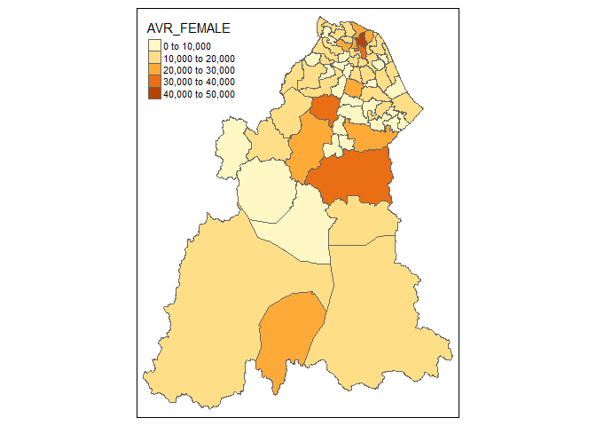

## Prepare environment

Required packages 


```r
# install.packages("sf")
# install.packages("tidyverse")
# install.packages("here") #working directory
# install.packages("janitor")
# install.packages("gtsummary")
# install.packages("DT")
# install.packages("stringr")
# install.packages("readxl")
# install.packages("broom")
# install.packages("tmap")
# install.packages("mapview")
# install.packages("lubridate")
# install.packages("vctrs")
# install.packages("spatialECO") for NNI
```

Load packages 


```r
library(sf)
```

```
## Linking to GEOS 3.9.3, GDAL 3.5.2, PROJ 8.2.1; sf_use_s2() is TRUE
```

```r
library(tidyverse)
```

```
## ── Attaching core tidyverse packages ──────────────────────── tidyverse 2.0.0 ──
## ✔ dplyr     1.1.1     ✔ readr     2.1.4
## ✔ forcats   1.0.0     ✔ stringr   1.5.0
## ✔ ggplot2   3.4.1     ✔ tibble    3.2.1
## ✔ lubridate 1.9.2     ✔ tidyr     1.3.0
## ✔ purrr     1.0.1
```

```
## ── Conflicts ────────────────────────────────────────── tidyverse_conflicts() ──
## ✖ dplyr::filter() masks stats::filter()
## ✖ dplyr::lag()    masks stats::lag()
## ℹ Use the ]8;;http://conflicted.r-lib.org/conflicted package]8;; to force all conflicts to become errors
```

```r
library(here)
```

```
## here() starts at C:/Users/MY PC/OneDrive - Universiti Sains Malaysia/R MPH Spatial Analysis/spatialMPH
```

```r
library(janitor)
```

```
## 
## Attaching package: 'janitor'
## 
## The following objects are masked from 'package:stats':
## 
##     chisq.test, fisher.test
```

```r
library(gtsummary)
library(DT)
library(stringr)
library(readxl)
library(broom)
library(tmap)
library(mapview)
library(lubridate)
library(maptools)
```

```
## Loading required package: sp
## Checking rgeos availability: TRUE
## Please note that 'maptools' will be retired during 2023,
## plan transition at your earliest convenience;
## some functionality will be moved to 'sp'.
```

```r
library(spatstat)
```

```
## Loading required package: spatstat.data
## Loading required package: spatstat.geom
## spatstat.geom 3.1-0
## Loading required package: spatstat.random
## spatstat.random 3.1-4
## Loading required package: spatstat.explore
## Loading required package: nlme
## 
## Attaching package: 'nlme'
## 
## The following object is masked from 'package:dplyr':
## 
##     collapse
## 
## spatstat.explore 3.1-0
## Loading required package: spatstat.model
## Loading required package: rpart
## spatstat.model 3.2-1
## Loading required package: spatstat.linnet
## spatstat.linnet 3.0-6
## 
## spatstat 3.0-3 
## For an introduction to spatstat, type 'beginner'
```

```r
library(spdep)
```

```
## Loading required package: spData
## To access larger datasets in this package, install the spDataLarge
## package with: `install.packages('spDataLarge',
## repos='https://nowosad.github.io/drat/', type='source')`
```

```r
library(gridExtra)
```

```
## 
## Attaching package: 'gridExtra'
## 
## The following object is masked from 'package:dplyr':
## 
##     combine
```

```r
library(sparr)
```

```
## 
## 
## Welcome to
##    _____ ___  ____  ____  ____         
##   / ___// _ \/ _  \/ __ \/ __ \        
##   \__ \/ ___/ __  /  ___/  ___/        
##  ___/ / /  / / / / /\ \/ /\ \          
## /____/_/  /_/ /_/_/  \__/  \_\   v2.3-10
## 
## - type news(package="sparr") for an overview
## - type help("sparr") for documentation
## - type citation("sparr") for how to cite
```

```r
library(grid)
```

```
## 
## Attaching package: 'grid'
## 
## The following object is masked from 'package:spatstat.geom':
## 
##     as.mask
```

```r
library(spatialEco)
```

```
## 
## Attaching package: 'spatialEco'
## 
## The following object is masked from 'package:grid':
## 
##     explode
## 
## The following object is masked from 'package:gridExtra':
## 
##     combine
## 
## The following objects are masked from 'package:spatstat.geom':
## 
##     is.empty, quadrats, shift
## 
## The following object is masked from 'package:spatstat.data':
## 
##     ants
## 
## The following object is masked from 'package:dplyr':
## 
##     combine
```

## Load polygon data

read polygon data - kelantan map


```r
kel <- st_read(here("Map",
                    "kelantan.shp"))
```

```
## Reading layer `kelantan' from data source 
##   `C:\Users\MY PC\OneDrive - Universiti Sains Malaysia\R MPH Spatial Analysis\spatialMPH\Map\kelantan.shp' 
##   using driver `ESRI Shapefile'
## Simple feature collection with 66 features and 6 fields
## Geometry type: POLYGON
## Dimension:     XY
## Bounding box:  xmin: 371629.6 ymin: 503028.2 xmax: 519479.6 ymax: 690232.8
## Projected CRS: Kertau (RSO) / RSO Malaya (m)
```


```r
st_geometry(kel)
```

```
## Geometry set for 66 features 
## Geometry type: POLYGON
## Dimension:     XY
## Bounding box:  xmin: 371629.6 ymin: 503028.2 xmax: 519479.6 ymax: 690232.8
## Projected CRS: Kertau (RSO) / RSO Malaya (m)
## First 5 geometries:
```

```
## POLYGON ((485501.8 669698.8, 485717.3 669694.6,...
```

```
## POLYGON ((487716.5 665649.5, 487615.4 665445.1,...
```

```
## POLYGON ((482744.8 660223.4, 482823.6 660137.8,...
```

```
## POLYGON ((486936.9 677358.5, 486990.5 677333.7,...
```

```
## POLYGON ((490841.7 668783.4, 490906.1 668691, 4...
```

read population data per mukim per year


```r
kel_mukim <- read_xlsx(here ("mukim.xlsx"))
kel_mukim %>% datatable()
```

```{=html}
<div class="datatables html-widget html-fill-item-overflow-hidden html-fill-item" id="htmlwidget-1a4f50b598073bbd54e1" style="width:100%;height:auto;"></div>
<script type="application/json" data-for="htmlwidget-1a4f50b598073bbd54e1">{"x":{"filter":"none","vertical":false,"data":[["1","2","3","4","5","6","7","8","9","10","11","12","13","14","15","16","17","18","19","20","21","22","23","24","25","26","27","28","29","30","31","32","33","34","35","36","37","38","39","40","41","42","43","44","45","46","47","48","49","50","51","52","53","54","55","56","57","58","59","60","61","62","63","64","65","66","67","68","69","70","71","72","73","74","75","76","77","78","79","80","81","82","83","84","85","86","87","88","89","90","91","92","93","94","95","96","97","98","99","100","101","102","103","104","105","106","107","108","109","110","111","112","113","114","115","116","117","118","119","120","121","122","123","124","125","126","127","128","129","130","131","132","133","134","135","136","137","138","139","140","141","142","143","144","145","146","147","148","149","150","151","152","153","154","155","156","157","158","159","160","161","162","163","164","165","166","167","168","169","170","171","172","173","174","175","176","177","178","179","180","181","182","183","184","185","186","187","188","189","190","191"],["BEKLAM","GUNONG (GUNONG TIMOR)","MAHLIGAI","PERUPOK","MELAWI (REPEK)","TAWANG (MENTUAN)","TELONG","TANJONG PAUH","BADANG","BANGGU","BETA","KADOK","KEMUMIN","KOTA","LIMBAT","KUBANG KERIAN (LUNDANG)","KETEREH (PANGKAL KALONG)","PANJI","PENDEK","PERINGAT","SALOR","SERING","KOTA BHARU","LABOK","PANYIT","PULAI CHONDONG","PANGKAL MELERET","TEMANGAN","ULU SAT","ALOR PASIR","BUNUT SUSU","CHETOK","GUAL PERIOK","KANGKONG","KUALA LEMAL","KUBANG GADONG","KUBANG SEPAT","PASIR MAS","RANTAU PANJANG","PADANG PAK AMAT","BUKIT ABAL","BUKIT AWANG","BUKIT JAWA","GONG DATOK","JERAM","LIMBONGAN","SEMERAK","KUSIAL","JEDOK","ULU KUSIAL","JAL BESAR","KEBAKAT","PENGKALAN KUBOR","SUNGAI PINANG","TERBOK","TUMPAT","WAKAF BHARU","GALAS","BERTAM","CHIKU","BATU MENGKEBANG","OLAK JERAM","DABONG","BATU MELINTANG (BELIMBING)","JELI","KUALA BALAH",null,null,null,null,null,null,null,null,null,null,null,null,null,null,null,null,null,null,null,null,null,null,null,null,null,null,null,null,null,null,null,null,null,null,null,null,null,null,null,null,null,null,null,null,null,null,null,null,null,null,null,null,null,null,null,null,null,null,null,null,null,null,null,null,null,null,null,null,null,null,null,null,null,null,null,null,null,null,null,null,null,null,null,null,null,null,null,null,null,null,null,null,null,null,null,null,null,null,null,null,null,null,null,null,null,null,null,null,null,null,null,null,null,null,null,null,null,null,null,null,null,null,"Nota:","1. Unjuran Penduduk (Semakan Semula) berasaskan data Banci Penduduk dan Perumahan Malaysia 2010","2. Hasil tambah mungkin berbeza kerana pembundaran"],[5200,12000,4900,9500,9900,15200,6300,5300,19400,12500,6000,10400,23000,13000,10200,29700,23100,38900,9200,13100,6000,13300,22700,7800,5600,6900,7100,3100,16700,5500,9200,7500,11500,9500,6700,13100,8400,11900,14700,8600,5800,4100,11900,4800,5000,7700,12300,31300,15000,17400,7200,9400,11800,9300,9400,12200,20000,21700,13300,16200,35500,15400,7500,4800,11500,5700,null,null,null,null,null,null,null,null,null,null,null,null,null,null,null,null,null,null,null,null,null,null,null,null,null,null,null,null,null,null,null,null,null,null,null,null,null,null,null,null,null,null,null,null,null,null,null,null,null,null,null,null,null,null,null,null,null,null,null,null,null,null,null,null,null,null,null,null,null,null,null,null,null,null,null,null,null,null,null,null,null,null,null,null,null,null,null,null,null,null,null,null,null,null,null,null,null,null,null,null,null,null,null,null,null,null,null,null,null,null,null,null,null,null,null,null,null,null,null,null,null,null,null,null,null],[5300,11900,5000,9400,9500,14900,7300,5500,19300,12300,6000,10700,21600,13300,10000,32000,22000,40100,9400,13000,6200,12900,25500,7700,5700,7000,6000,3100,19300,5500,9100,7500,10800,9500,6700,13300,8400,12300,14700,8800,5800,3900,11900,5000,5100,7600,12400,30800,14400,17000,7100,9100,11600,9400,9200,12400,20400,18800,12100,12400,34000,14700,6900,4400,10500,5500,null,null,null,null,null,null,null,null,null,null,null,null,null,null,null,null,null,null,null,null,null,null,null,null,null,null,null,null,null,null,null,null,null,null,null,null,null,null,null,null,null,null,null,null,null,null,null,null,null,null,null,null,null,null,null,null,null,null,null,null,null,null,null,null,null,null,null,null,null,null,null,null,null,null,null,null,null,null,null,null,null,null,null,null,null,null,null,null,null,null,null,null,null,null,null,null,null,null,null,null,null,null,null,null,null,null,null,null,null,null,null,null,null,null,null,null,null,null,null,null,null,null,null,null,null],[10500,23900,10000,18900,19400,30200,13600,10800,38800,24800,12100,21100,44600,26300,20300,61700,45100,79000,18600,26000,12100,26200,48200,15400,11300,13900,13100,6200,36000,10900,18300,15000,22400,19000,13400,26300,16800,24100,29500,17400,11600,8000,23900,9800,10200,15300,24600,62100,29300,34400,14300,18600,23400,18700,18600,24600,40400,40500,25300,28600,69500,30100,14400,9200,22100,11300,null,null,null,null,null,null,null,null,null,null,null,null,null,null,null,null,null,null,null,null,null,null,null,null,null,null,null,null,null,null,null,null,null,null,null,null,null,null,null,null,null,null,null,null,null,null,null,null,null,null,null,null,null,null,null,null,null,null,null,null,null,null,null,null,null,null,null,null,null,null,null,null,null,null,null,null,null,null,null,null,null,null,null,null,null,null,null,null,null,null,null,null,null,null,null,null,null,null,null,null,null,null,null,null,null,null,null,null,null,null,null,null,null,null,null,null,null,null,null,null,null,null,null,null,null],[5300,12200,5000,9600,10200,15600,6500,5400,19900,12900,6200,10600,23700,13300,10500,30400,23700,39900,9400,13400,6100,13600,23000,8000,5700,7000,7300,3200,17200,5600,9400,7700,11900,9700,6800,13400,8600,12100,15100,8800,5900,4100,12300,4900,5200,7900,12500,32200,15200,17900,7300,9700,12000,9400,9600,12500,20600,22400,13800,16600,36400,15800,7700,4900,11900,5800,null,null,null,null,null,null,null,null,null,null,null,null,null,null,null,null,null,null,null,null,null,null,null,null,null,null,null,null,null,null,null,null,null,null,null,null,null,null,null,null,null,null,null,null,null,null,null,null,null,null,null,null,null,null,null,null,null,null,null,null,null,null,null,null,null,null,null,null,null,null,null,null,null,null,null,null,null,null,null,null,null,null,null,null,null,null,null,null,null,null,null,null,null,null,null,null,null,null,null,null,null,null,null,null,null,null,null,null,null,null,null,null,null,null,null,null,null,null,null,null,null,null,null,null,null],[5400,12100,5100,9600,9700,15300,7500,5600,19700,12600,6200,10900,22100,13500,10300,32700,22500,41100,9600,13200,6300,13300,25800,7800,5800,7100,6100,3200,19800,5600,9300,7700,11200,9700,6900,13500,8600,12500,15100,9000,5900,4000,12200,5100,5200,7800,12600,31600,14600,17400,7300,9300,11800,9600,9400,12700,21000,19300,12500,12500,34800,15000,7000,4500,10800,5700,null,null,null,null,null,null,null,null,null,null,null,null,null,null,null,null,null,null,null,null,null,null,null,null,null,null,null,null,null,null,null,null,null,null,null,null,null,null,null,null,null,null,null,null,null,null,null,null,null,null,null,null,null,null,null,null,null,null,null,null,null,null,null,null,null,null,null,null,null,null,null,null,null,null,null,null,null,null,null,null,null,null,null,null,null,null,null,null,null,null,null,null,null,null,null,null,null,null,null,null,null,null,null,null,null,null,null,null,null,null,null,null,null,null,null,null,null,null,null,null,null,null,null,null,null],[10700,24300,10100,19200,20000,30900,14100,11100,39700,25500,12400,21500,45800,26800,20800,63100,46200,81000,19000,26600,12400,26900,48800,15800,11500,14100,13400,6300,37000,11200,18700,15400,23100,19400,13700,26900,17200,24600,30200,17800,11800,8100,24500,10000,10400,15600,25200,63800,29800,35300,14600,19000,23800,19000,19000,25200,41500,41600,26300,29200,71200,30800,14800,9400,22700,11500,null,null,null,null,null,null,null,null,null,null,null,null,null,null,null,null,null,null,null,null,null,null,null,null,null,null,null,null,null,null,null,null,null,null,null,null,null,null,null,null,null,null,null,null,null,null,null,null,null,null,null,null,null,null,null,null,null,null,null,null,null,null,null,null,null,null,null,null,null,null,null,null,null,null,null,null,null,null,null,null,null,null,null,null,null,null,null,null,null,null,null,null,null,null,null,null,null,null,null,null,null,null,null,null,null,null,null,null,null,null,null,null,null,null,null,null,null,null,null,null,null,null,null,null,null],[5400,12500,5100,9800,10500,16000,6700,5600,20400,13300,6300,10800,24300,13500,10800,31100,24200,40900,9600,13700,6200,14000,23200,8200,5800,7100,7600,3200,17600,5700,9600,7900,12300,9900,7000,13600,8800,12300,15500,9100,6000,4200,12600,5000,5300,8000,12800,33100,15500,18300,7400,9900,12200,9600,9800,12800,21100,23000,14300,17000,37300,16200,8000,5000,12200,6000,null,null,null,null,null,null,null,null,null,null,null,null,null,null,null,null,null,null,null,null,null,null,null,null,null,null,null,null,null,null,null,null,null,null,null,null,null,null,null,null,null,null,null,null,null,null,null,null,null,null,null,null,null,null,null,null,null,null,null,null,null,null,null,null,null,null,null,null,null,null,null,null,null,null,null,null,null,null,null,null,null,null,null,null,null,null,null,null,null,null,null,null,null,null,null,null,null,null,null,null,null,null,null,null,null,null,null,null,null,null,null,null,null,null,null,null,null,null,null,null,null,null,null,null,null],[5500,12400,5200,9700,9900,15600,7800,5800,20100,13000,6300,11200,22700,13800,10600,33400,23100,42100,9700,13500,6400,13600,26100,8000,5900,7200,6200,3200,20300,5700,9500,7800,11500,9900,7000,13800,8800,12700,15400,9300,6000,4000,12500,5200,5400,7900,12900,32400,14800,17800,7400,9500,12000,9700,9600,13000,21500,19700,12900,12700,35500,15300,7200,4600,11100,5800,null,null,null,null,null,null,null,null,null,null,null,null,null,null,null,null,null,null,null,null,null,null,null,null,null,null,null,null,null,null,null,null,null,null,null,null,null,null,null,null,null,null,null,null,null,null,null,null,null,null,null,null,null,null,null,null,null,null,null,null,null,null,null,null,null,null,null,null,null,null,null,null,null,null,null,null,null,null,null,null,null,null,null,null,null,null,null,null,null,null,null,null,null,null,null,null,null,null,null,null,null,null,null,null,null,null,null,null,null,null,null,null,null,null,null,null,null,null,null,null,null,null,null,null,null],[10900,24800,10300,19500,20500,31600,14600,11300,40600,26200,12700,22000,47000,27300,21300,64500,47300,83000,19300,27200,12700,27600,49300,16200,11700,14300,13700,6400,37900,11400,19100,15700,23900,19700,14000,27400,17500,25000,30900,18400,12100,8200,25100,10300,10700,15900,25700,65400,30300,36100,14900,19500,24300,19400,19400,25800,42700,42700,27200,29700,72900,31400,15200,9600,23300,11800,null,null,null,null,null,null,null,null,null,null,null,null,null,null,null,null,null,null,null,null,null,null,null,null,null,null,null,null,null,null,null,null,null,null,null,null,null,null,null,null,null,null,null,null,null,null,null,null,null,null,null,null,null,null,null,null,null,null,null,null,null,null,null,null,null,null,null,null,null,null,null,null,null,null,null,null,null,null,null,null,null,null,null,null,null,null,null,null,null,null,null,null,null,null,null,null,null,null,null,null,null,null,null,null,null,null,null,null,null,null,null,null,null,null,null,null,null,null,null,null,null,null,null,null,null],[5500,12700,5200,10000,10800,16400,6900,5700,20900,13600,6500,11000,25000,13800,11000,31800,24800,41900,9800,14000,6400,14400,23500,8400,5900,7300,7800,3300,18000,5800,9900,8100,12800,10100,7200,13900,8900,12600,15800,9300,6100,4300,12900,5100,5400,8200,13100,34000,15700,18800,7600,10200,12500,9800,10000,13100,21700,23600,14800,17300,38200,16500,8200,5100,12500,6100,null,null,null,null,null,null,null,null,null,null,null,null,null,null,null,null,null,null,null,null,null,null,null,null,null,null,null,null,null,null,null,null,null,null,null,null,null,null,null,null,null,null,null,null,null,null,null,null,null,null,null,null,null,null,null,null,null,null,null,null,null,null,null,null,null,null,null,null,null,null,null,null,null,null,null,null,null,null,null,null,null,null,null,null,null,null,null,null,null,null,null,null,null,null,null,null,null,null,null,null,null,null,null,null,null,null,null,null,null,null,null,null,null,null,null,null,null,null,null,null,null,null,null,null,null],[5500,12600,5300,9900,10200,16000,8100,5900,20500,13300,6500,11400,23200,14000,10800,34100,23600,43100,9900,13700,6500,13900,26400,8200,6000,7300,6300,3200,20900,5800,9700,8000,11900,10000,7200,14000,8900,12900,15800,9500,6100,4100,12800,5300,5500,8000,13100,33200,15000,18100,7500,9800,12200,9900,9700,13200,22100,20200,13300,12900,36300,15600,7400,4700,11300,5900,null,null,null,null,null,null,null,null,null,null,null,null,null,null,null,null,null,null,null,null,null,null,null,null,null,null,null,null,null,null,null,null,null,null,null,null,null,null,null,null,null,null,null,null,null,null,null,null,null,null,null,null,null,null,null,null,null,null,null,null,null,null,null,null,null,null,null,null,null,null,null,null,null,null,null,null,null,null,null,null,null,null,null,null,null,null,null,null,null,null,null,null,null,null,null,null,null,null,null,null,null,null,null,null,null,null,null,null,null,null,null,null,null,null,null,null,null,null,null,null,null,null,null,null,null],[11100,25300,10400,19800,21000,32400,15100,11600,41500,26900,12900,22400,48200,27800,21900,65900,48400,85000,19700,27700,12900,28300,49800,16600,11900,14600,14000,6500,38900,11600,19500,16000,24600,20100,14300,28000,17900,25500,31600,18900,12300,8300,25700,10500,10900,16200,26200,67100,30700,36900,15100,19900,24700,19700,19700,26300,43800,43700,28100,30200,74500,32100,15500,9800,23900,12000,null,null,null,null,null,null,null,null,null,null,null,null,null,null,null,null,null,null,null,null,null,null,null,null,null,null,null,null,null,null,null,null,null,null,null,null,null,null,null,null,null,null,null,null,null,null,null,null,null,null,null,null,null,null,null,null,null,null,null,null,null,null,null,null,null,null,null,null,null,null,null,null,null,null,null,null,null,null,null,null,null,null,null,null,null,null,null,null,null,null,null,null,null,null,null,null,null,null,null,null,null,null,null,null,null,null,null,null,null,null,null,null,null,null,null,null,null,null,null,null,null,null,null,null,null],[5700,13000,5200,10100,11100,16800,7100,5800,21400,14000,6600,11300,25700,14100,11300,32500,25400,42900,10000,14300,6500,14800,23700,8600,6000,7400,8000,3400,18500,6000,10100,8200,13200,10300,7300,14200,9100,12800,16200,9600,6300,4300,13200,5300,5600,8300,13300,34800,16000,19200,7700,10400,12700,10000,10200,13400,22300,24200,15300,17600,39100,16900,8400,5200,12900,6200,null,null,null,null,null,null,null,null,null,null,null,null,null,null,null,null,null,null,null,null,null,null,null,null,null,null,null,null,null,null,null,null,null,null,null,null,null,null,null,null,null,null,null,null,null,null,null,null,null,null,null,null,null,null,null,null,null,null,null,null,null,null,null,null,null,null,null,null,null,null,null,null,null,null,null,null,null,null,null,null,null,null,null,null,null,null,null,null,null,null,null,null,null,null,null,null,null,null,null,null,null,null,null,null,null,null,null,null,null,null,null,null,null,null,null,null,null,null,null,null,null,null,null,null,null],[5600,12800,5300,10000,10400,16300,8400,6000,21000,13600,6600,11600,23800,14300,11100,34800,24100,44100,10100,14000,6600,14200,26600,8400,6000,7400,6400,3300,21400,5900,9900,8100,12200,10200,7300,14300,9100,13100,16100,9800,6300,4100,13200,5400,5600,8200,13400,33900,15200,18500,7700,10000,12400,10100,9900,13500,22600,20600,13700,13100,37000,15900,7500,4800,11600,6000,null,null,null,null,null,null,null,null,null,null,null,null,null,null,null,null,null,null,null,null,null,null,null,null,null,null,null,null,null,null,null,null,null,null,null,null,null,null,null,null,null,null,null,null,null,null,null,null,null,null,null,null,null,null,null,null,null,null,null,null,null,null,null,null,null,null,null,null,null,null,null,null,null,null,null,null,null,null,null,null,null,null,null,null,null,null,null,null,null,null,null,null,null,null,null,null,null,null,null,null,null,null,null,null,null,null,null,null,null,null,null,null,null,null,null,null,null,null,null,null,null,null,null,null,null],[11300,25700,10600,20200,21500,33200,15600,11800,42300,27600,13200,22900,49400,28300,22400,67300,49500,87000,20000,28300,13200,29000,50300,16900,12100,14800,14400,6700,39900,11900,20000,16400,25400,20500,14700,28500,18200,25900,32300,19400,12500,8500,26400,10700,11200,16500,26800,68800,31100,37700,15400,20400,25100,20000,20100,26900,44900,44800,29000,30700,76100,32800,15900,10000,24500,12200,null,null,null,null,null,null,null,null,null,null,null,null,null,null,null,null,null,null,null,null,null,null,null,null,null,null,null,null,null,null,null,null,null,null,null,null,null,null,null,null,null,null,null,null,null,null,null,null,null,null,null,null,null,null,null,null,null,null,null,null,null,null,null,null,null,null,null,null,null,null,null,null,null,null,null,null,null,null,null,null,null,null,null,null,null,null,null,null,null,null,null,null,null,null,null,null,null,null,null,null,null,null,null,null,null,null,null,null,null,null,null,null,null,null,null,null,null,null,null,null,null,null,null,null,null],[5800,13200,5300,10300,11400,17200,7300,5900,21900,14400,6800,11500,26400,14300,11600,33100,26000,43900,10200,14600,6700,15200,23900,8800,6100,7500,8200,3400,18900,6100,10300,8400,13600,10500,7500,14500,9300,13000,16600,9900,6400,4400,13600,5400,5700,8500,13600,35700,16200,19700,7900,10700,12900,10100,10400,13700,22900,24700,15800,17900,40000,17200,8600,5400,13200,6300,null,null,null,null,null,null,null,null,null,null,null,null,null,null,null,null,null,null,null,null,null,null,null,null,null,null,null,null,null,null,null,null,null,null,null,null,null,null,null,null,null,null,null,null,null,null,null,null,null,null,null,null,null,null,null,null,null,null,null,null,null,null,null,null,null,null,null,null,null,null,null,null,null,null,null,null,null,null,null,null,null,null,null,null,null,null,null,null,null,null,null,null,null,null,null,null,null,null,null,null,null,null,null,null,null,null,null,null,null,null,null,null,null,null,null,null,null,null,null,null,null,null,null,null,null],[5700,13000,5400,10200,10600,16700,8800,6100,21400,14000,6700,11800,24300,14500,11400,35500,24600,45100,10200,14200,6800,14500,26900,8500,6100,7500,6500,3300,22000,6000,10100,8300,12600,10400,7500,14500,9300,13300,16500,10000,6400,4200,13500,5500,5700,8300,13700,34700,15400,18900,7800,10200,12600,10200,10100,13800,23200,21100,14100,13200,37800,16200,7700,4900,11900,6100,null,null,null,null,null,null,null,null,null,null,null,null,null,null,null,null,null,null,null,null,null,null,null,null,null,null,null,null,null,null,null,null,null,null,null,null,null,null,null,null,null,null,null,null,null,null,null,null,null,null,null,null,null,null,null,null,null,null,null,null,null,null,null,null,null,null,null,null,null,null,null,null,null,null,null,null,null,null,null,null,null,null,null,null,null,null,null,null,null,null,null,null,null,null,null,null,null,null,null,null,null,null,null,null,null,null,null,null,null,null,null,null,null,null,null,null,null,null,null,null,null,null,null,null,null],[11500,26200,10700,20500,22000,33900,16100,12100,43200,28300,13500,23300,50700,28800,23000,68600,50600,89000,20400,28900,13400,29700,50800,17300,12200,15000,14700,6800,40900,12100,20400,16700,26200,20900,15000,29000,18600,26300,33100,19900,12700,8600,27000,10900,11400,16800,27300,70500,31500,38600,15600,20900,25500,20300,20500,27500,46100,45800,29900,31200,77700,33400,16300,10200,25100,12400,null,null,null,null,null,null,null,null,null,null,null,null,null,null,null,null,null,null,null,null,null,null,null,null,null,null,null,null,null,null,null,null,null,null,null,null,null,null,null,null,null,null,null,null,null,null,null,null,null,null,null,null,null,null,null,null,null,null,null,null,null,null,null,null,null,null,null,null,null,null,null,null,null,null,null,null,null,null,null,null,null,null,null,null,null,null,null,null,null,null,null,null,null,null,null,null,null,null,null,null,null,null,null,null,null,null,null,null,null,null,null,null,null,null,null,null,null,null,null,null,null,null,null,null,null],[5900,13400,5400,10500,11800,17600,7600,6000,22400,14800,6900,11700,27000,14600,11900,33800,26600,44900,10300,15000,6800,15600,24100,9000,6200,7600,8500,3500,19400,6200,10500,8600,14000,10700,7700,14700,9500,13300,16900,10100,6500,4500,13900,5500,5800,8700,13900,36600,16400,20100,8000,10900,13100,10300,10600,14000,23500,25300,16300,18200,40800,17600,8800,5500,13500,6400,null,null,null,null,null,null,null,null,null,null,null,null,null,null,null,null,null,null,null,null,null,null,null,null,null,null,null,null,null,null,null,null,null,null,null,null,null,null,null,null,null,null,null,null,null,null,null,null,null,null,null,null,null,null,null,null,null,null,null,null,null,null,null,null,null,null,null,null,null,null,null,null,null,null,null,null,null,null,null,null,null,null,null,null,null,null,null,null,null,null,null,null,null,null,null,null,null,null,null,null,null,null,null,null,null,null,null,null,null,null,null,null,null,null,null,null,null,null,null,null,null,null,null,null,null],[5800,13200,5500,10300,10800,17000,9100,6300,21800,14300,6900,12000,24900,14700,11700,36200,25100,46100,10400,14500,6900,14900,27100,8700,6200,7600,6600,3400,22600,6100,10300,8500,13000,10600,7700,14800,9400,13500,16800,10300,6500,4200,13800,5600,5800,8400,14000,35500,15500,19300,7900,10400,12800,10400,10200,14100,23800,21500,14500,13400,38500,16500,7900,4900,12200,6200,null,null,null,null,null,null,null,null,null,null,null,null,null,null,null,null,null,null,null,null,null,null,null,null,null,null,null,null,null,null,null,null,null,null,null,null,null,null,null,null,null,null,null,null,null,null,null,null,null,null,null,null,null,null,null,null,null,null,null,null,null,null,null,null,null,null,null,null,null,null,null,null,null,null,null,null,null,null,null,null,null,null,null,null,null,null,null,null,null,null,null,null,null,null,null,null,null,null,null,null,null,null,null,null,null,null,null,null,null,null,null,null,null,null,null,null,null,null,null,null,null,null,null,null,null],[11700,26600,10800,20800,22600,34700,16600,12300,44100,29100,13800,23700,51900,29300,23500,70000,51700,91000,20700,29400,13700,30500,51200,17700,12400,15200,15000,6900,41900,12300,20800,17000,27000,21300,15300,29500,18900,26800,33800,20400,13000,8700,27700,11100,11700,17100,27800,72100,31900,39400,15900,21300,26000,20700,20800,28100,47300,46800,30800,31600,79300,34100,16600,10400,25700,12700,null,null,null,null,null,null,null,null,null,null,null,null,null,null,null,null,null,null,null,null,null,null,null,null,null,null,null,null,null,null,null,null,null,null,null,null,null,null,null,null,null,null,null,null,null,null,null,null,null,null,null,null,null,null,null,null,null,null,null,null,null,null,null,null,null,null,null,null,null,null,null,null,null,null,null,null,null,null,null,null,null,null,null,null,null,null,null,null,null,null,null,null,null,null,null,null,null,null,null,null,null,null,null,null,null,null,null,null,null,null,null,null,null,null,null,null,null,null,null,null,null,null,null,null,null],[6000,13700,5500,10600,12100,18000,7800,6200,22800,15200,7100,11900,27700,14900,12200,34400,27200,45900,10500,15300,6900,16000,24300,9200,6300,7700,8700,3500,19800,6300,10700,8800,14500,10900,7800,15000,9600,13500,17300,10400,6600,4500,14200,5600,6000,8800,14100,37500,16600,20500,8100,11200,13400,10500,10800,14300,24100,25800,16700,18500,41700,17900,9000,5600,13900,6600,null,null,null,null,null,null,null,null,null,null,null,null,null,null,null,null,null,null,null,null,null,null,null,null,null,null,null,null,null,null,null,null,null,null,null,null,null,null,null,null,null,null,null,null,null,null,null,null,null,null,null,null,null,null,null,null,null,null,null,null,null,null,null,null,null,null,null,null,null,null,null,null,null,null,null,null,null,null,null,null,null,null,null,null,null,null,null,null,null,null,null,null,null,null,null,null,null,null,null,null,null,null,null,null,null,null,null,null,null,null,null,null,null,null,null,null,null,null,null,null,null,null,null,null,null],[5900,13400,5500,10400,11000,17400,9400,6400,22200,14600,7000,12200,25400,15000,11900,36900,25600,47100,10600,14700,7000,15200,27400,8900,6300,7700,6700,3400,23100,6300,10500,8600,13300,10800,7800,15000,9600,13700,17200,10600,6600,4300,14100,5700,5900,8600,14200,36300,15700,19600,8000,10600,13000,10500,10400,14400,24400,22000,15000,13600,39200,16800,8000,5000,12400,6300,null,null,null,null,null,null,null,null,null,null,null,null,null,null,null,null,null,null,null,null,null,null,null,null,null,null,null,null,null,null,null,null,null,null,null,null,null,null,null,null,null,null,null,null,null,null,null,null,null,null,null,null,null,null,null,null,null,null,null,null,null,null,null,null,null,null,null,null,null,null,null,null,null,null,null,null,null,null,null,null,null,null,null,null,null,null,null,null,null,null,null,null,null,null,null,null,null,null,null,null,null,null,null,null,null,null,null,null,null,null,null,null,null,null,null,null,null,null,null,null,null,null,null,null,null],[11800,27100,11000,21100,23100,35400,17200,12500,45000,29800,14100,24200,53100,29800,24100,71400,52800,93100,21100,30000,13900,31200,51700,18100,12600,15400,15400,7000,42900,12600,21200,17400,27800,21600,15700,30000,19200,27200,34500,21000,13200,8800,28300,11300,11900,17400,28400,73800,32300,40200,16200,21800,26400,21000,21200,28600,48500,47800,31700,32000,80900,34700,17000,10600,26300,12900,null,null,null,null,null,null,null,null,null,null,null,null,null,null,null,null,null,null,null,null,null,null,null,null,null,null,null,null,null,null,null,null,null,null,null,null,null,null,null,null,null,null,null,null,null,null,null,null,null,null,null,null,null,null,null,null,null,null,null,null,null,null,null,null,null,null,null,null,null,null,null,null,null,null,null,null,null,null,null,null,null,null,null,null,null,null,null,null,null,null,null,null,null,null,null,null,null,null,null,null,null,null,null,null,null,null,null,null,null,null,null,null,null,null,null,null,null,null,null,null,null,null,null,null,null],[6100,13900,5500,10800,12400,18400,8000,6300,23300,15500,7200,12100,28400,15100,12400,35100,27700,47000,10700,15600,7100,16400,24500,9400,6400,7900,9000,3600,20200,6400,11000,8900,14900,11100,8000,15300,9800,13700,17700,10700,6800,4600,14600,5700,6100,9000,14400,38400,16800,21000,8300,11400,13600,10600,11000,14600,24700,26300,17200,18700,42500,18300,9200,5700,14200,6700,null,null,null,null,null,null,null,null,null,null,null,null,null,null,null,null,null,null,null,null,null,null,null,null,null,null,null,null,null,null,null,null,null,null,null,null,null,null,null,null,null,null,null,null,null,null,null,null,null,null,null,null,null,null,null,null,null,null,null,null,null,null,null,null,null,null,null,null,null,null,null,null,null,null,null,null,null,null,null,null,null,null,null,null,null,null,null,null,null,null,null,null,null,null,null,null,null,null,null,null,null,null,null,null,null,null,null,null,null,null,null,null,null,null,null,null,null,null,null,null,null,null,null,null,null],[6000,13600,5600,10600,11300,17800,9800,6500,22600,15000,7200,12500,26000,15200,12200,37700,26100,48200,10700,15000,7100,15500,27600,9100,6400,7800,6800,3500,23700,6400,10700,8800,13700,10900,8000,15300,9800,13900,17600,10800,6700,4300,14400,5800,6100,8700,14500,37100,15900,20000,8200,10800,13200,10700,10600,14600,25000,22400,15400,13700,40000,17100,8200,5100,12700,6400,null,null,null,null,null,null,null,null,null,null,null,null,null,null,null,null,null,null,null,null,null,null,null,null,null,null,null,null,null,null,null,null,null,null,null,null,null,null,null,null,null,null,null,null,null,null,null,null,null,null,null,null,null,null,null,null,null,null,null,null,null,null,null,null,null,null,null,null,null,null,null,null,null,null,null,null,null,null,null,null,null,null,null,null,null,null,null,null,null,null,null,null,null,null,null,null,null,null,null,null,null,null,null,null,null,null,null,null,null,null,null,null,null,null,null,null,null,null,null,null,null,null,null,null,null],[12000,27500,11100,21400,23700,36200,17800,12800,45900,30500,14400,24600,54400,30300,24700,72800,53900,95100,21400,30600,14200,31900,52200,18400,12800,15700,15700,7100,44000,12800,21700,17700,28700,22000,16000,30600,19600,27600,35200,21500,13400,8900,29000,11500,12200,17700,28900,75500,32700,41000,16400,22300,26800,21300,21500,29200,49700,48800,32700,32500,82500,35400,17400,10800,26900,13100,null,null,null,null,null,null,null,null,null,null,null,null,null,null,null,null,null,null,null,null,null,null,null,null,null,null,null,null,null,null,null,null,null,null,null,null,null,null,null,null,null,null,null,null,null,null,null,null,null,null,null,null,null,null,null,null,null,null,null,null,null,null,null,null,null,null,null,null,null,null,null,null,null,null,null,null,null,null,null,null,null,null,null,null,null,null,null,null,null,null,null,null,null,null,null,null,null,null,null,null,null,null,null,null,null,null,null,null,null,null,null,null,null,null,null,null,null,null,null,null,null,null,null,null,null],[6200,14200,5600,11000,12700,18900,8200,6400,23800,15900,7400,12400,29100,15400,12700,35800,28300,48000,10900,15900,7200,16800,24800,9600,6500,8000,9200,3600,20700,6500,11200,9100,15400,11300,8200,15500,10000,14000,18100,11000,6900,4700,14900,5800,6300,9100,14700,39200,17000,21400,8400,11700,13800,10800,11200,14900,25300,26900,17800,19000,43300,18600,9400,5800,14500,6800,null,null,null,null,null,null,null,null,null,null,null,null,null,null,null,null,null,null,null,null,null,null,null,null,null,null,null,null,null,null,null,null,null,null,null,null,null,null,null,null,null,null,null,null,null,null,null,null,null,null,null,null,null,null,null,null,null,null,null,null,null,null,null,null,null,null,null,null,null,null,null,null,null,null,null,null,null,null,null,null,null,null,null,null,null,null,null,null,null,null,null,null,null,null,null,null,null,null,null,null,null,null,null,null,null,null,null,null,null,null,null,null,null,null,null,null,null,null,null,null,null,null,null,null,null],[6100,13800,5600,10700,11500,18100,10100,6600,23000,15300,7300,12700,26600,15500,12500,38400,26700,49200,10900,15300,7200,15900,27900,9300,6400,7900,6900,3500,24300,6500,10900,8900,14100,11100,8200,15600,9900,14100,17900,11100,6800,4300,14700,5900,6200,8800,14800,38000,16100,20400,8300,11000,13400,10900,10700,14900,25600,22900,15900,13900,40700,17400,8400,5200,13000,6600,null,null,null,null,null,null,null,null,null,null,null,null,null,null,null,null,null,null,null,null,null,null,null,null,null,null,null,null,null,null,null,null,null,null,null,null,null,null,null,null,null,null,null,null,null,null,null,null,null,null,null,null,null,null,null,null,null,null,null,null,null,null,null,null,null,null,null,null,null,null,null,null,null,null,null,null,null,null,null,null,null,null,null,null,null,null,null,null,null,null,null,null,null,null,null,null,null,null,null,null,null,null,null,null,null,null,null,null,null,null,null,null,null,null,null,null,null,null,null,null,null,null,null,null,null],[12200,28000,11300,21700,24200,37000,18400,13000,46800,31300,14700,25000,55600,30900,25200,74200,55000,97200,21800,31200,14400,32700,52600,18800,12900,15900,16100,7200,45000,13000,22100,18100,29500,22400,16300,31100,19900,28100,36000,22100,13600,9000,29700,11700,12400,18000,29400,77200,33100,41800,16700,22700,27200,21700,21900,29800,50900,49800,33600,32900,84100,36000,17700,11000,27500,13300,null,null,null,null,null,null,null,null,null,null,null,null,null,null,null,null,null,null,null,null,null,null,null,null,null,null,null,null,null,null,null,null,null,null,null,null,null,null,null,null,null,null,null,null,null,null,null,null,null,null,null,null,null,null,null,null,null,null,null,null,null,null,null,null,null,null,null,null,null,null,null,null,null,null,null,null,null,null,null,null,null,null,null,null,null,null,null,null,null,null,null,null,null,null,null,null,null,null,null,null,null,null,null,null,null,null,null,null,null,null,null,null,null,null,null,null,null,null,null,null,null,null,null,null,null],[6300,14400,5700,11100,13100,19300,8500,6500,24300,16300,7500,12600,29800,15600,13000,36500,28900,49000,11100,16200,7300,17200,25000,9800,6600,8100,9500,3700,21100,6700,11400,9300,15900,11500,8300,15800,10200,14200,18400,11200,7000,4700,15300,5900,6400,9300,14900,40200,17200,21800,8500,11900,14000,11000,11400,15200,26000,27400,18300,19300,44200,19000,9600,5900,14900,6900,null,null,null,null,null,null,null,null,null,null,null,null,null,null,null,null,null,null,null,null,null,null,null,null,null,null,null,null,null,null,null,null,null,null,null,null,null,null,null,null,null,null,null,null,null,null,null,null,null,null,null,null,null,null,null,null,null,null,null,null,null,null,null,null,null,null,null,null,null,null,null,null,null,null,null,null,null,null,null,null,null,null,null,null,null,null,null,null,null,null,null,null,null,null,null,null,null,null,null,null,null,null,null,null,null,null,null,null,null,null,null,null,null,null,null,null,null,null,null,null,null,null,null,null,null],[6100,14000,5700,10900,11700,18500,10500,6700,23400,15700,7400,12900,27100,15700,12800,39100,27200,50300,11100,15500,7400,16200,28100,9400,6500,8000,7000,3600,24900,6600,11100,9100,14500,11300,8300,15800,10100,14300,18300,11400,6900,4400,15100,6000,6300,9000,15100,38800,16300,20800,8400,11300,13600,11000,10900,15200,26200,23400,16300,14100,41500,17700,8600,5300,13300,6700,null,null,null,null,null,null,null,null,null,null,null,null,null,null,null,null,null,null,null,null,null,null,null,null,null,null,null,null,null,null,null,null,null,null,null,null,null,null,null,null,null,null,null,null,null,null,null,null,null,null,null,null,null,null,null,null,null,null,null,null,null,null,null,null,null,null,null,null,null,null,null,null,null,null,null,null,null,null,null,null,null,null,null,null,null,null,null,null,null,null,null,null,null,null,null,null,null,null,null,null,null,null,null,null,null,null,null,null,null,null,null,null,null,null,null,null,null,null,null,null,null,null,null,null,null],[12400,28400,11400,22000,24800,37800,19000,13300,47800,32000,15000,25500,56900,31400,25800,75600,56200,99300,22100,31700,14700,33400,53100,19200,13100,16100,16400,7300,46100,13200,22500,18400,30400,22800,16700,31600,20300,28500,36700,22600,13900,9100,30300,11900,12700,18300,30000,79000,33500,42600,16900,23200,27700,22000,22300,30400,52200,50800,34600,33300,85700,36700,18100,11200,28200,13600,null,null,null,null,null,null,null,null,null,null,null,null,null,null,null,null,null,null,null,null,null,null,null,null,null,null,null,null,null,null,null,null,null,null,null,null,null,null,null,null,null,null,null,null,null,null,null,null,null,null,null,null,null,null,null,null,null,null,null,null,null,null,null,null,null,null,null,null,null,null,null,null,null,null,null,null,null,null,null,null,null,null,null,null,null,null,null,null,null,null,null,null,null,null,null,null,null,null,null,null,null,null,null,null,null,null,null,null,null,null,null,null,null,null,null,null,null,null,null,null,null,null,null,null,null],[6300,14400,5700,11100,13100,19300,8500,6500,24300,16300,7500,12600,29800,15600,13000,36500,28900,49000,11100,16200,7300,17200,25000,9800,6600,8100,9500,3700,21100,6700,11400,9300,15900,11500,8300,15800,10200,14200,18400,11200,7000,4700,15300,5900,6400,9300,14900,40200,17200,21800,8500,11900,14000,11000,11400,15200,26000,27400,18300,19300,44200,19000,9600,5900,14900,6900,null,null,null,null,null,null,null,null,null,null,null,null,null,null,null,null,null,null,null,null,null,null,null,null,null,null,null,null,null,null,null,null,null,null,null,null,null,null,null,null,null,null,null,null,null,null,null,null,null,null,null,null,null,null,null,null,null,null,null,null,null,null,null,null,null,null,null,null,null,null,null,null,null,null,null,null,null,null,null,null,null,null,null,null,null,null,null,null,null,null,null,null,null,null,null,null,null,null,null,null,null,null,null,null,null,null,null,null,null,null,null,null,null,null,null,null,null,null,null,null,null,null,null,null,null],[6100,14000,5700,10900,11700,18500,10500,6700,23400,15700,7400,12900,27100,15700,12800,39100,27200,50300,11100,15500,7400,16200,28100,9400,6500,8000,7000,3600,24900,6600,11100,9100,14500,11300,8300,15800,10100,14300,18300,11400,6900,4400,15100,6000,6300,9000,15100,38800,16300,20800,8400,11300,13600,11000,10900,15200,26200,23400,16300,14100,41500,17700,8600,5300,13300,6700,null,null,null,null,null,null,null,null,null,null,null,null,null,null,null,null,null,null,null,null,null,null,null,null,null,null,null,null,null,null,null,null,null,null,null,null,null,null,null,null,null,null,null,null,null,null,null,null,null,null,null,null,null,null,null,null,null,null,null,null,null,null,null,null,null,null,null,null,null,null,null,null,null,null,null,null,null,null,null,null,null,null,null,null,null,null,null,null,null,null,null,null,null,null,null,null,null,null,null,null,null,null,null,null,null,null,null,null,null,null,null,null,null,null,null,null,null,null,null,null,null,null,null,null,null],[12400,28400,11400,22000,24800,37800,19000,13300,47800,32000,15000,25500,56900,31400,25800,75600,56200,99300,22100,31700,14700,33400,53100,19200,13100,16100,16400,7300,46100,13200,22500,18400,30400,22800,16700,31600,20300,28500,36700,22600,13900,9100,30300,11900,12700,18300,30000,79000,33500,42600,16900,23200,27700,22000,22300,30400,52200,50800,34600,33300,85700,36700,18100,11200,28200,13600,null,null,null,null,null,null,null,null,null,null,null,null,null,null,null,null,null,null,null,null,null,null,null,null,null,null,null,null,null,null,null,null,null,null,null,null,null,null,null,null,null,null,null,null,null,null,null,null,null,null,null,null,null,null,null,null,null,null,null,null,null,null,null,null,null,null,null,null,null,null,null,null,null,null,null,null,null,null,null,null,null,null,null,null,null,null,null,null,null,null,null,null,null,null,null,null,null,null,null,null,null,null,null,null,null,null,null,null,null,null,null,null,null,null,null,null,null,null,null,null,null,null,null,null,null],[6300,14400,5700,11100,13100,19300,8500,6500,24300,16300,7500,12600,29800,15600,13000,36500,28900,49000,11100,16200,7300,17200,25000,9800,6600,8100,9500,3700,21100,6700,11400,9300,15900,11500,8300,15800,10200,14200,18400,11200,7000,4700,15300,5900,6400,9300,14900,40200,17200,21800,8500,11900,14000,11000,11400,15200,26000,27400,18300,19300,44200,19000,9600,5900,14900,6900,null,null,null,null,null,null,null,null,null,null,null,null,null,null,null,null,null,null,null,null,null,null,null,null,null,null,null,null,null,null,null,null,null,null,null,null,null,null,null,null,null,null,null,null,null,null,null,null,null,null,null,null,null,null,null,null,null,null,null,null,null,null,null,null,null,null,null,null,null,null,null,null,null,null,null,null,null,null,null,null,null,null,null,null,null,null,null,null,null,null,null,null,null,null,null,null,null,null,null,null,null,null,null,null,null,null,null,null,null,null,null,null,null,null,null,null,null,null,null,null,null,null,null,null,null],[6100,14000,5700,10900,11700,18500,10500,6700,23400,15700,7400,12900,27100,15700,12800,39100,27200,50300,11100,15500,7400,16200,28100,9400,6500,8000,7000,3600,24900,6600,11100,9100,14500,11300,8300,15800,10100,14300,18300,11400,6900,4400,15100,6000,6300,9000,15100,38800,16300,20800,8400,11300,13600,11000,10900,15200,26200,23400,16300,14100,41500,17700,8600,5300,13300,6700,null,null,null,null,null,null,null,null,null,null,null,null,null,null,null,null,null,null,null,null,null,null,null,null,null,null,null,null,null,null,null,null,null,null,null,null,null,null,null,null,null,null,null,null,null,null,null,null,null,null,null,null,null,null,null,null,null,null,null,null,null,null,null,null,null,null,null,null,null,null,null,null,null,null,null,null,null,null,null,null,null,null,null,null,null,null,null,null,null,null,null,null,null,null,null,null,null,null,null,null,null,null,null,null,null,null,null,null,null,null,null,null,null,null,null,null,null,null,null,null,null,null,null,null,null],[12400,28400,11400,22000,24800,37800,19000,13300,47800,32000,15000,25500,56900,31400,25800,75600,56200,99300,22100,31700,14700,33400,53100,19200,13100,16100,16400,7300,46100,13200,22500,18400,30400,22800,16700,31600,20300,28500,36700,22600,13900,9100,30300,11900,12700,18300,30000,79000,33500,42600,16900,23200,27700,22000,22300,30400,52200,50800,34600,33300,85700,36700,18100,11200,28200,13600,null,null,null,null,null,null,null,null,null,null,null,null,null,null,null,null,null,null,null,null,null,null,null,null,null,null,null,null,null,null,null,null,null,null,null,null,null,null,null,null,null,null,null,null,null,null,null,null,null,null,null,null,null,null,null,null,null,null,null,null,null,null,null,null,null,null,null,null,null,null,null,null,null,null,null,null,null,null,null,null,null,null,null,null,null,null,null,null,null,null,null,null,null,null,null,null,null,null,null,null,null,null,null,null,null,null,null,null,null,null,null,null,null,null,null,null,null,null,null,null,null,null,null,null,null],[6100,13920,5540,10800,12420,18440,8020,6280,23320,15540,7220,12140,28400,15120,12440,35120,27740,46960,10700,15600,7060,16400,24540,9400,6400,7860,8980,3580,20240,6420,10960,8940,14940,11100,8000,15260,9820,13740,17680,10680,6760,4600,14580,5700,6120,8980,14400,38380,16800,20960,8260,11420,13580,10640,11000,14600,24720,26340,17260,18740,42500,18280,9200,5700,14200,6680,null,null,null,null,null,null,null,null,null,null,null,null,null,null,null,null,null,null,null,null,null,null,null,null,null,null,null,null,null,null,null,null,null,null,null,null,null,null,null,null,null,null,null,null,null,null,null,null,null,null,null,null,null,null,null,null,null,null,null,null,null,null,null,null,null,null,null,null,null,null,null,null,null,null,null,null,null,null,null,null,null,null,null,null,null,null,null,null,null,null,null,null,null,null,null,null,null,null,null,null,null,null,null,null,null,null,null,null,null,null,null,null,null,null,null,null,null,null,null,null,null,null,null,null,null],[5980,13600,5580,10580,11260,17760,9780,6500,22600,14980,7160,12460,26000,15220,12220,37660,26140,48180,10740,15000,7120,15540,27620,9080,6360,7800,6800,3480,23720,6380,10700,8780,13720,10940,8000,15300,9760,13900,17560,10840,6700,4300,14420,5800,6060,8700,14520,37140,15900,20020,8160,10820,13200,10700,10560,14640,25000,22440,15420,13740,39980,17100,8220,5100,12720,6440,null,null,null,null,null,null,null,null,null,null,null,null,null,null,null,null,null,null,null,null,null,null,null,null,null,null,null,null,null,null,null,null,null,null,null,null,null,null,null,null,null,null,null,null,null,null,null,null,null,null,null,null,null,null,null,null,null,null,null,null,null,null,null,null,null,null,null,null,null,null,null,null,null,null,null,null,null,null,null,null,null,null,null,null,null,null,null,null,null,null,null,null,null,null,null,null,null,null,null,null,null,null,null,null,null,null,null,null,null,null,null,null,null,null,null,null,null,null,null,null,null,null,null,null,null],[12020,27704,11184,21520,23896,36524,18040,12876,46284,30828,14520,24780,54876,30548,24892,73360,54364,95968,21564,30816,14276,32228,52352,18588,12832,15752,15864,7140,44396,12876,21832,17864,29016,22164,16140,30772,19716,27808,35528,21744,13504,8940,29260,11580,12276,17820,29120,76204,32860,41320,16524,22452,26984,21468,21688,29444,50204,49200,33056,32632,83140,35636,17512,10880,27164,13204,null,null,null,null,null,null,null,null,null,null,null,null,null,null,null,null,null,null,null,null,null,null,null,null,null,null,null,null,null,null,null,null,null,null,null,null,null,null,null,null,null,null,null,null,null,null,null,null,null,null,null,null,null,null,null,null,null,null,null,null,null,null,null,null,null,null,null,null,null,null,null,null,null,null,null,null,null,null,null,null,null,null,null,null,null,null,null,null,null,null,null,null,null,null,null,null,null,null,null,null,null,null,null,null,null,null,null,null,null,null,null,null,null,null,null,null,null,null,null,null,null,null,null,null,null]],"container":"<table class=\"display\">\n  <thead>\n    <tr>\n      <th> <\/th>\n      <th>MUKIM<\/th>\n      <th>MALE_2010<\/th>\n      <th>FEMALE_2010<\/th>\n      <th>JUMLAH_2010<\/th>\n      <th>MALE_2011<\/th>\n      <th>FEMALE_2011<\/th>\n      <th>JUMLAH_2011<\/th>\n      <th>MALE_2012<\/th>\n      <th>FEMALE_2012<\/th>\n      <th>JUMLAH_2012<\/th>\n      <th>MALE_2013<\/th>\n      <th>FEMALE_2013<\/th>\n      <th>JUMLAH_2013<\/th>\n      <th>MALE_2014<\/th>\n      <th>FEMALE_2014<\/th>\n      <th>JUMLAH_2014<\/th>\n      <th>MALE_2015<\/th>\n      <th>FEMALE_2015<\/th>\n      <th>JUMLAH_2015<\/th>\n      <th>MALE_2016<\/th>\n      <th>FEMALE_2016<\/th>\n      <th>JUMLAH_2016<\/th>\n      <th>MALE_2017<\/th>\n      <th>FEMALE_2017<\/th>\n      <th>JUMLAH_2017<\/th>\n      <th>MALE_2018<\/th>\n      <th>FEMALE_2018<\/th>\n      <th>JUMLAH_2018<\/th>\n      <th>MALE_2019<\/th>\n      <th>FEMALE_2019<\/th>\n      <th>JUMLAH_2019<\/th>\n      <th>MALE_2020<\/th>\n      <th>FEMALE_2020<\/th>\n      <th>JUMLAH_2020<\/th>\n      <th>MALE_2021<\/th>\n      <th>FEMALE_2021<\/th>\n      <th>JUMLAH_2021<\/th>\n      <th>MALE_2022<\/th>\n      <th>FEMALE_2022<\/th>\n      <th>JUMLAH_2022<\/th>\n      <th>AVR_MALE<\/th>\n      <th>AVR_FEMALE<\/th>\n      <th>AVR<\/th>\n    <\/tr>\n  <\/thead>\n<\/table>","options":{"columnDefs":[{"className":"dt-right","targets":[2,3,4,5,6,7,8,9,10,11,12,13,14,15,16,17,18,19,20,21,22,23,24,25,26,27,28,29,30,31,32,33,34,35,36,37,38,39,40,41,42,43]},{"orderable":false,"targets":0}],"order":[],"autoWidth":false,"orderClasses":false}},"evals":[],"jsHooks":[]}</script>
```

merge population data to polygon


```r
kel_map <- merge(kel,kel_mukim,by.x="MUKIM", by.y="MUKIM", all.x=T, sort=F)
dim(kel_map)
```

```
## [1] 66 49
```

```r
class(kel_map)
```

```
## [1] "sf"         "data.frame"
```

```r
st_crs(kel_map)
```

```
## Coordinate Reference System:
##   User input: Kertau (RSO) / RSO Malaya (m) 
##   wkt:
## PROJCRS["Kertau (RSO) / RSO Malaya (m)",
##     BASEGEOGCRS["Kertau (RSO)",
##         DATUM["Kertau (RSO)",
##             ELLIPSOID["Everest 1830 (RSO 1969)",6377295.664,300.8017,
##                 LENGTHUNIT["metre",1]]],
##         PRIMEM["Greenwich",0,
##             ANGLEUNIT["degree",0.0174532925199433]],
##         ID["EPSG",4751]],
##     CONVERSION["Rectified Skew Orthomorphic Malaya Grid (metres)",
##         METHOD["Hotine Oblique Mercator (variant A)",
##             ID["EPSG",9812]],
##         PARAMETER["Latitude of projection centre",4,
##             ANGLEUNIT["degree",0.0174532925199433],
##             ID["EPSG",8811]],
##         PARAMETER["Longitude of projection centre",102.25,
##             ANGLEUNIT["degree",0.0174532925199433],
##             ID["EPSG",8812]],
##         PARAMETER["Azimuth of initial line",323.0257905,
##             ANGLEUNIT["degree",0.0174532925199433],
##             ID["EPSG",8813]],
##         PARAMETER["Angle from Rectified to Skew Grid",323.130102361111,
##             ANGLEUNIT["degree",0.0174532925199433],
##             ID["EPSG",8814]],
##         PARAMETER["Scale factor on initial line",0.99984,
##             SCALEUNIT["unity",1],
##             ID["EPSG",8815]],
##         PARAMETER["False easting",804670.24,
##             LENGTHUNIT["metre",1],
##             ID["EPSG",8806]],
##         PARAMETER["False northing",0,
##             LENGTHUNIT["metre",1],
##             ID["EPSG",8807]]],
##     CS[Cartesian,2],
##         AXIS["(E)",east,
##             ORDER[1],
##             LENGTHUNIT["metre",1]],
##         AXIS["(N)",north,
##             ORDER[2],
##             LENGTHUNIT["metre",1]],
##     USAGE[
##         SCOPE["Engineering survey, topographic mapping."],
##         AREA["Malaysia - West Malaysia onshore."],
##         BBOX[1.21,99.59,6.72,104.6]],
##     ID["EPSG",3168]]
```

Make plot


```r
st_geometry(kel_map)
```

```
## Geometry set for 66 features 
## Geometry type: POLYGON
## Dimension:     XY
## Bounding box:  xmin: 371629.6 ymin: 503028.2 xmax: 519479.6 ymax: 690232.8
## Projected CRS: Kertau (RSO) / RSO Malaya (m)
## First 5 geometries:
```

```
## POLYGON ((485501.8 669698.8, 485717.3 669694.6,...
```

```
## POLYGON ((487716.5 665649.5, 487615.4 665445.1,...
```

```
## POLYGON ((482744.8 660223.4, 482823.6 660137.8,...
```

```
## POLYGON ((486936.9 677358.5, 486990.5 677333.7,...
```

```
## POLYGON ((490841.7 668783.4, 490906.1 668691, 4...
```

```r
plot(kel_map[,2]) # negeri
```

<!-- -->

```r
plot(kel_map[,3]) # daerah
```

<!-- -->

```r
plot(kel_map[,1]) # mukim
```

<!-- -->


Adding facet 


```r
kel_map %>% ggplot() + geom_sf(aes(fill = DAERAH)) +ggtitle('Population by district') + theme_bw()
```

<!-- -->

```r
kel_map %>% ggplot() + geom_sf(aes(fill = MUKIM)) +ggtitle('Population by subdistrict') + theme_bw() + theme(legend.position = "none")
```

<!-- -->

```r
tm_shape(kel_map) + tm_polygons("AVR_FEMALE") + tm_layout(legend.width = 0.50)
```

<!-- -->

```r
tm_shape(kel_map) + tm_polygons("AVR")
```

<!-- -->

```r
tm_shape(kel_map) +
  tm_polygons(c("MUKIM", "DAERAH", "AVR_MALE")) +
  tm_facets(ncol = 3)
```

```
## Warning: Number of levels of the variable "MUKIM" is 66, which is larger than
## max.categories (which is 30), so levels are combined. Set
## tmap_options(max.categories = 66) in the layer function to show all levels.
```

```
## Some legend labels were too wide. These labels have been resized to 0.16, 0.30, 0.29, 0.21, 0.22, 0.29, 0.24, 0.18, 0.26, 0.20, 0.26, 0.27, 0.33, 0.22, 0.29. Increase legend.width (argument of tm_layout) to make the legend wider and therefore the labels larger.
```

<!-- -->

```r
tm_shape(kel_map) +
  tm_polygons(c("MUKIM", "DAERAH", "AVR_MALE")) +
  tm_facets(nrow = 3)
```

```
## Warning: Number of levels of the variable "MUKIM" is 66, which is larger than
## max.categories (which is 30), so levels are combined. Set
## tmap_options(max.categories = 66) in the layer function to show all levels.
```

```
## Some legend labels were too wide. These labels have been resized to 0.19, 0.08, 0.16, 0.15, 0.11, 0.19, 0.12, 0.15, 0.13, 0.09, 0.14, 0.10, 0.14, 0.14, 0.17, 0.11, 0.15. Increase legend.width (argument of tm_layout) to make the legend wider and therefore the labels larger.
```

```
## Some legend labels were too wide. These labels have been resized to 0.28, 0.30, 0.32, 0.37, 0.35, 0.29, 0.26. Increase legend.width (argument of tm_layout) to make the legend wider and therefore the labels larger.
```

```
## Legend labels were too wide. The labels have been resized to 0.38, 0.25, 0.25, 0.25, 0.25. Increase legend.width (argument of tm_layout) to make the legend wider and therefore the labels larger.
```

<!-- -->


## load disease data

read linelisting in .xlsx format


```r
linelist <- read_xlsx(here ("linelist.xlsx")) %>% clean_names()
glimpse(linelist)
```

```
## Rows: 1,318
## Columns: 26
## $ diagnosis                                  <chr> "Leptospirosis", "Leptospir…
## $ notifikasi_no                              <dbl> 2685725, 2728504, 2739963, …
## $ tahun_daftar                               <dbl> 2016, 2016, 2016, 2016, 201…
## $ epid_daftar                                <dbl> 6, 9, 11, 12, 18, 18, 19, 1…
## $ age                                        <dbl> 30, 23, 39, 43, 31, 34, 48,…
## $ alamat_semasa_kejadian                     <chr> "FELDA ARING", "LADANG U&I …
## $ poskod                                     <dbl> 18300, 18300, 18300, 18300,…
## $ latitude_rso                               <dbl> 478031, 459494, 441802, 488…
## $ longitude_rso                              <dbl> 548141, 564966, 547551, 547…
## $ latitude_wgs                               <dbl> 4.944824, 5.034372, 4.89743…
## $ longitude_wgs                              <dbl> 102.3491, 102.1477, 101.960…
## $ notifikasi_status                          <chr> "Daftar Kes", "Daftar Kes",…
## $ race                                       <chr> "Foreigner", "Foreigner", "…
## $ kewarganegaraan                            <chr> "Bukan Warganegara", "Bukan…
## $ gender                                     <chr> "Male", "Male", "Male", "Ma…
## $ nationality                                <chr> "INDONESIA", "INDONESIA", "…
## $ klasifikasi_kes                            <chr> "Sporadic", "Sporadic", "Sp…
## $ cara_pengesanan_kes                        <chr> "Pasif", "Pasif", "Pasif", …
## $ jenis_rawatan                              <chr> "Wad Perubatan", "Jabatan K…
## $ daerah                                     <chr> "GUA MUSANG", "GUA MUSANG",…
## $ mukim                                      <chr> "CHIKU", "CHIKU", "GALAS", …
## $ lokaliti                                   <chr> NA, "LADANG U & I, CIKU", "…
## $ diagnosis2                                 <chr> "LEPTOSPIROSIS", "LEPTOSPIR…
## $ sub_diagnosis                              <chr> NA, NA, NA, NA, NA, NA, NA,…
## $ negeri                                     <chr> "KELANTAN", "KELANTAN", "KE…
## $ jenis_import_jangkitan_dalam_negara_negeri <chr> NA, NA, NA, NA, NA, NA, NA,…
```


remove na coordinate


```r
#disease data all - list all is all leptospirosis and enteric fever cases
listALL <- linelist %>% 
  filter(!is.na(latitude_wgs),
         !is.na(longitude_wgs))
glimpse(listALL)
```

```
## Rows: 1,318
## Columns: 26
## $ diagnosis                                  <chr> "Leptospirosis", "Leptospir…
## $ notifikasi_no                              <dbl> 2685725, 2728504, 2739963, …
## $ tahun_daftar                               <dbl> 2016, 2016, 2016, 2016, 201…
## $ epid_daftar                                <dbl> 6, 9, 11, 12, 18, 18, 19, 1…
## $ age                                        <dbl> 30, 23, 39, 43, 31, 34, 48,…
## $ alamat_semasa_kejadian                     <chr> "FELDA ARING", "LADANG U&I …
## $ poskod                                     <dbl> 18300, 18300, 18300, 18300,…
## $ latitude_rso                               <dbl> 478031, 459494, 441802, 488…
## $ longitude_rso                              <dbl> 548141, 564966, 547551, 547…
## $ latitude_wgs                               <dbl> 4.944824, 5.034372, 4.89743…
## $ longitude_wgs                              <dbl> 102.3491, 102.1477, 101.960…
## $ notifikasi_status                          <chr> "Daftar Kes", "Daftar Kes",…
## $ race                                       <chr> "Foreigner", "Foreigner", "…
## $ kewarganegaraan                            <chr> "Bukan Warganegara", "Bukan…
## $ gender                                     <chr> "Male", "Male", "Male", "Ma…
## $ nationality                                <chr> "INDONESIA", "INDONESIA", "…
## $ klasifikasi_kes                            <chr> "Sporadic", "Sporadic", "Sp…
## $ cara_pengesanan_kes                        <chr> "Pasif", "Pasif", "Pasif", …
## $ jenis_rawatan                              <chr> "Wad Perubatan", "Jabatan K…
## $ daerah                                     <chr> "GUA MUSANG", "GUA MUSANG",…
## $ mukim                                      <chr> "CHIKU", "CHIKU", "GALAS", …
## $ lokaliti                                   <chr> NA, "LADANG U & I, CIKU", "…
## $ diagnosis2                                 <chr> "LEPTOSPIROSIS", "LEPTOSPIR…
## $ sub_diagnosis                              <chr> NA, NA, NA, NA, NA, NA, NA,…
## $ negeri                                     <chr> "KELANTAN", "KELANTAN", "KE…
## $ jenis_import_jangkitan_dalam_negara_negeri <chr> NA, NA, NA, NA, NA, NA, NA,…
```


## convert all disease data to spatial data


```r
loc_ALL <- st_as_sf(listALL, 
                    coords = c("longitude_wgs", "latitude_wgs"), 
                    crs = 4326)
loc_ALL %>% datatable()
```

```{=html}
<div class="datatables html-widget html-fill-item-overflow-hidden html-fill-item" id="htmlwidget-3774f4d528199481c515" style="width:100%;height:auto;"></div>
<script type="application/json" data-for="htmlwidget-3774f4d528199481c515">{"x":{"filter":"none","vertical":false,"data":[["1","2","3","4","5","6","7","8","9","10","11","12","13","14","15","16","17","18","19","20","21","22","23","24","25","26","27","28","29","30","31","32","33","34","35","36","37","38","39","40","41","42","43","44","45","46","47","48","49","50","51","52","53","54","55","56","57","58","59","60","61","62","63","64","65","66","67","68","69","70","71","72","73","74","75","76","77","78","79","80","81","82","83","84","85","86","87","88","89","90","91","92","93","94","95","96","97","98","99","100","101","102","103","104","105","106","107","108","109","110","111","112","113","114","115","116","117","118","119","120","121","122","123","124","125","126","127","128","129","130","131","132","133","134","135","136","137","138","139","140","141","142","143","144","145","146","147","148","149","150","151","152","153","154","155","156","157","158","159","160","161","162","163","164","165","166","167","168","169","170","171","172","173","174","175","176","177","178","179","180","181","182","183","184","185","186","187","188","189","190","191","192","193","194","195","196","197","198","199","200","201","202","203","204","205","206","207","208","209","210","211","212","213","214","215","216","217","218","219","220","221","222","223","224","225","226","227","228","229","230","231","232","233","234","235","236","237","238","239","240","241","242","243","244","245","246","247","248","249","250","251","252","253","254","255","256","257","258","259","260","261","262","263","264","265","266","267","268","269","270","271","272","273","274","275","276","277","278","279","280","281","282","283","284","285","286","287","288","289","290","291","292","293","294","295","296","297","298","299","300","301","302","303","304","305","306","307","308","309","310","311","312","313","314","315","316","317","318","319","320","321","322","323","324","325","326","327","328","329","330","331","332","333","334","335","336","337","338","339","340","341","342","343","344","345","346","347","348","349","350","351","352","353","354","355","356","357","358","359","360","361","362","363","364","365","366","367","368","369","370","371","372","373","374","375","376","377","378","379","380","381","382","383","384","385","386","387","388","389","390","391","392","393","394","395","396","397","398","399","400","401","402","403","404","405","406","407","408","409","410","411","412","413","414","415","416","417","418","419","420","421","422","423","424","425","426","427","428","429","430","431","432","433","434","435","436","437","438","439","440","441","442","443","444","445","446","447","448","449","450","451","452","453","454","455","456","457","458","459","460","461","462","463","464","465","466","467","468","469","470","471","472","473","474","475","476","477","478","479","480","481","482","483","484","485","486","487","488","489","490","491","492","493","494","495","496","497","498","499","500","501","502","503","504","505","506","507","508","509","510","511","512","513","514","515","516","517","518","519","520","521","522","523","524","525","526","527","528","529","530","531","532","533","534","535","536","537","538","539","540","541","542","543","544","545","546","547","548","549","550","551","552","553","554","555","556","557","558","559","560","561","562","563","564","565","566","567","568","569","570","571","572","573","574","575","576","577","578","579","580","581","582","583","584","585","586","587","588","589","590","591","592","593","594","595","596","597","598","599","600","601","602","603","604","605","606","607","608","609","610","611","612","613","614","615","616","617","618","619","620","621","622","623","624","625","626","627","628","629","630","631","632","633","634","635","636","637","638","639","640","641","642","643","644","645","646","647","648","649","650","651","652","653","654","655","656","657","658","659","660","661","662","663","664","665","666","667","668","669","670","671","672","673","674","675","676","677","678","679","680","681","682","683","684","685","686","687","688","689","690","691","692","693","694","695","696","697","698","699","700","701","702","703","704","705","706","707","708","709","710","711","712","713","714","715","716","717","718","719","720","721","722","723","724","725","726","727","728","729","730","731","732","733","734","735","736","737","738","739","740","741","742","743","744","745","746","747","748","749","750","751","752","753","754","755","756","757","758","759","760","761","762","763","764","765","766","767","768","769","770","771","772","773","774","775","776","777","778","779","780","781","782","783","784","785","786","787","788","789","790","791","792","793","794","795","796","797","798","799","800","801","802","803","804","805","806","807","808","809","810","811","812","813","814","815","816","817","818","819","820","821","822","823","824","825","826","827","828","829","830","831","832","833","834","835","836","837","838","839","840","841","842","843","844","845","846","847","848","849","850","851","852","853","854","855","856","857","858","859","860","861","862","863","864","865","866","867","868","869","870","871","872","873","874","875","876","877","878","879","880","881","882","883","884","885","886","887","888","889","890","891","892","893","894","895","896","897","898","899","900","901","902","903","904","905","906","907","908","909","910","911","912","913","914","915","916","917","918","919","920","921","922","923","924","925","926","927","928","929","930","931","932","933","934","935","936","937","938","939","940","941","942","943","944","945","946","947","948","949","950","951","952","953","954","955","956","957","958","959","960","961","962","963","964","965","966","967","968","969","970","971","972","973","974","975","976","977","978","979","980","981","982","983","984","985","986","987","988","989","990","991","992","993","994","995","996","997","998","999","1000","1001","1002","1003","1004","1005","1006","1007","1008","1009","1010","1011","1012","1013","1014","1015","1016","1017","1018","1019","1020","1021","1022","1023","1024","1025","1026","1027","1028","1029","1030","1031","1032","1033","1034","1035","1036","1037","1038","1039","1040","1041","1042","1043","1044","1045","1046","1047","1048","1049","1050","1051","1052","1053","1054","1055","1056","1057","1058","1059","1060","1061","1062","1063","1064","1065","1066","1067","1068","1069","1070","1071","1072","1073","1074","1075","1076","1077","1078","1079","1080","1081","1082","1083","1084","1085","1086","1087","1088","1089","1090","1091","1092","1093","1094","1095","1096","1097","1098","1099","1100","1101","1102","1103","1104","1105","1106","1107","1108","1109","1110","1111","1112","1113","1114","1115","1116","1117","1118","1119","1120","1121","1122","1123","1124","1125","1126","1127","1128","1129","1130","1131","1132","1133","1134","1135","1136","1137","1138","1139","1140","1141","1142","1143","1144","1145","1146","1147","1148","1149","1150","1151","1152","1153","1154","1155","1156","1157","1158","1159","1160","1161","1162","1163","1164","1165","1166","1167","1168","1169","1170","1171","1172","1173","1174","1175","1176","1177","1178","1179","1180","1181","1182","1183","1184","1185","1186","1187","1188","1189","1190","1191","1192","1193","1194","1195","1196","1197","1198","1199","1200","1201","1202","1203","1204","1205","1206","1207","1208","1209","1210","1211","1212","1213","1214","1215","1216","1217","1218","1219","1220","1221","1222","1223","1224","1225","1226","1227","1228","1229","1230","1231","1232","1233","1234","1235","1236","1237","1238","1239","1240","1241","1242","1243","1244","1245","1246","1247","1248","1249","1250","1251","1252","1253","1254","1255","1256","1257","1258","1259","1260","1261","1262","1263","1264","1265","1266","1267","1268","1269","1270","1271","1272","1273","1274","1275","1276","1277","1278","1279","1280","1281","1282","1283","1284","1285","1286","1287","1288","1289","1290","1291","1292","1293","1294","1295","1296","1297","1298","1299","1300","1301","1302","1303","1304","1305","1306","1307","1308","1309","1310","1311","1312","1313","1314","1315","1316","1317","1318"],["Leptospirosis","Leptospirosis","Leptospirosis","Leptospirosis","Leptospirosis","Leptospirosis","Leptospirosis","Leptospirosis","Leptospirosis","Leptospirosis","Leptospirosis","Leptospirosis","Leptospirosis","Leptospirosis","Leptospirosis","Leptospirosis","Leptospirosis","Leptospirosis","Leptospirosis","Leptospirosis","Leptospirosis","Leptospirosis","Leptospirosis","Leptospirosis","Leptospirosis","Leptospirosis","Leptospirosis","Leptospirosis","Leptospirosis","Enteric_fever","Leptospirosis","Leptospirosis","Leptospirosis","Leptospirosis","Leptospirosis","Leptospirosis","Enteric_fever","Enteric_fever","Enteric_fever","Leptospirosis","Enteric_fever","Enteric_fever","Enteric_fever","Enteric_fever","Enteric_fever","Enteric_fever","Enteric_fever","Enteric_fever","Enteric_fever","Enteric_fever","Enteric_fever","Enteric_fever","Enteric_fever","Enteric_fever","Leptospirosis","Leptospirosis","Leptospirosis","Enteric_fever","Enteric_fever","Leptospirosis","Enteric_fever","Enteric_fever","Enteric_fever","Leptospirosis","Leptospirosis","Leptospirosis","Leptospirosis","Leptospirosis","Leptospirosis","Leptospirosis","Leptospirosis","Leptospirosis","Leptospirosis","Leptospirosis","Leptospirosis","Leptospirosis","Leptospirosis","Leptospirosis","Leptospirosis","Leptospirosis","Leptospirosis","Leptospirosis","Leptospirosis","Leptospirosis","Leptospirosis","Leptospirosis","Leptospirosis","Leptospirosis","Leptospirosis","Leptospirosis","Leptospirosis","Leptospirosis","Leptospirosis","Leptospirosis","Leptospirosis","Leptospirosis","Enteric_fever","Leptospirosis","Leptospirosis","Leptospirosis","Leptospirosis","Leptospirosis","Leptospirosis","Leptospirosis","Leptospirosis","Leptospirosis","Leptospirosis","Leptospirosis","Leptospirosis","Leptospirosis","Leptospirosis","Enteric_fever","Enteric_fever","Enteric_fever","Leptospirosis","Leptospirosis","Leptospirosis","Leptospirosis","Enteric_fever","Leptospirosis","Leptospirosis","Leptospirosis","Leptospirosis","Leptospirosis","Leptospirosis","Leptospirosis","Leptospirosis","Enteric_fever","Leptospirosis","Leptospirosis","Leptospirosis","Leptospirosis","Leptospirosis","Leptospirosis","Leptospirosis","Leptospirosis","Leptospirosis","Leptospirosis","Leptospirosis","Leptospirosis","Enteric_fever","Leptospirosis","Leptospirosis","Enteric_fever","Leptospirosis","Leptospirosis","Leptospirosis","Leptospirosis","Leptospirosis","Enteric_fever","Enteric_fever","Leptospirosis","Enteric_fever","Leptospirosis","Leptospirosis","Enteric_fever","Leptospirosis","Leptospirosis","Leptospirosis","Leptospirosis","Leptospirosis","Enteric_fever","Leptospirosis","Enteric_fever","Leptospirosis","Leptospirosis","Leptospirosis","Leptospirosis","Leptospirosis","Leptospirosis","Leptospirosis","Leptospirosis","Leptospirosis","Leptospirosis","Leptospirosis","Leptospirosis","Leptospirosis","Leptospirosis","Leptospirosis","Leptospirosis","Leptospirosis","Leptospirosis","Leptospirosis","Leptospirosis","Leptospirosis","Leptospirosis","Leptospirosis","Leptospirosis","Leptospirosis","Leptospirosis","Leptospirosis","Enteric_fever","Leptospirosis","Leptospirosis","Leptospirosis","Leptospirosis","Leptospirosis","Leptospirosis","Enteric_fever","Leptospirosis","Enteric_fever","Leptospirosis","Leptospirosis","Leptospirosis","Leptospirosis","Leptospirosis","Leptospirosis","Leptospirosis","Enteric_fever","Leptospirosis","Leptospirosis","Leptospirosis","Leptospirosis","Leptospirosis","Leptospirosis","Leptospirosis","Leptospirosis","Leptospirosis","Leptospirosis","Leptospirosis","Leptospirosis","Enteric_fever","Enteric_fever","Leptospirosis","Leptospirosis","Leptospirosis","Leptospirosis","Leptospirosis","Enteric_fever","Leptospirosis","Leptospirosis","Leptospirosis","Leptospirosis","Leptospirosis","Leptospirosis","Leptospirosis","Leptospirosis","Leptospirosis","Leptospirosis","Enteric_fever","Leptospirosis","Leptospirosis","Enteric_fever","Leptospirosis","Enteric_fever","Leptospirosis","Enteric_fever","Leptospirosis","Leptospirosis","Leptospirosis","Leptospirosis","Leptospirosis","Leptospirosis","Leptospirosis","Leptospirosis","Enteric_fever","Leptospirosis","Leptospirosis","Enteric_fever","Leptospirosis","Leptospirosis","Leptospirosis","Leptospirosis","Enteric_fever","Enteric_fever","Leptospirosis","Leptospirosis","Leptospirosis","Leptospirosis","Enteric_fever","Enteric_fever","Leptospirosis","Leptospirosis","Leptospirosis","Leptospirosis","Leptospirosis","Leptospirosis","Enteric_fever","Enteric_fever","Enteric_fever","Enteric_fever","Leptospirosis","Enteric_fever","Leptospirosis","Enteric_fever","Leptospirosis","Enteric_fever","Leptospirosis","Leptospirosis","Enteric_fever","Enteric_fever","Enteric_fever","Enteric_fever","Leptospirosis","Leptospirosis","Leptospirosis","Leptospirosis","Leptospirosis","Leptospirosis","Leptospirosis","Leptospirosis","Leptospirosis","Leptospirosis","Leptospirosis","Leptospirosis","Leptospirosis","Leptospirosis","Leptospirosis","Leptospirosis","Leptospirosis","Leptospirosis","Leptospirosis","Enteric_fever","Leptospirosis","Leptospirosis","Leptospirosis","Leptospirosis","Enteric_fever","Enteric_fever","Leptospirosis","Leptospirosis","Leptospirosis","Leptospirosis","Leptospirosis","Leptospirosis","Leptospirosis","Leptospirosis","Leptospirosis","Leptospirosis","Leptospirosis","Leptospirosis","Leptospirosis","Leptospirosis","Leptospirosis","Leptospirosis","Leptospirosis","Leptospirosis","Leptospirosis","Leptospirosis","Leptospirosis","Leptospirosis","Leptospirosis","Leptospirosis","Leptospirosis","Leptospirosis","Leptospirosis","Leptospirosis","Enteric_fever","Leptospirosis","Leptospirosis","Leptospirosis","Leptospirosis","Leptospirosis","Leptospirosis","Leptospirosis","Enteric_fever","Leptospirosis","Leptospirosis","Leptospirosis","Leptospirosis","Leptospirosis","Leptospirosis","Enteric_fever","Leptospirosis","Leptospirosis","Enteric_fever","Leptospirosis","Leptospirosis","Enteric_fever","Leptospirosis","Leptospirosis","Leptospirosis","Enteric_fever","Leptospirosis","Leptospirosis","Enteric_fever","Leptospirosis","Leptospirosis","Leptospirosis","Leptospirosis","Leptospirosis","Leptospirosis","Enteric_fever","Leptospirosis","Leptospirosis","Leptospirosis","Leptospirosis","Leptospirosis","Leptospirosis","Leptospirosis","Leptospirosis","Enteric_fever","Leptospirosis","Leptospirosis","Leptospirosis","Leptospirosis","Leptospirosis","Leptospirosis","Leptospirosis","Leptospirosis","Leptospirosis","Leptospirosis","Leptospirosis","Leptospirosis","Leptospirosis","Leptospirosis","Leptospirosis","Leptospirosis","Leptospirosis","Leptospirosis","Leptospirosis","Enteric_fever","Leptospirosis","Leptospirosis","Leptospirosis","Enteric_fever","Leptospirosis","Leptospirosis","Leptospirosis","Leptospirosis","Leptospirosis","Leptospirosis","Leptospirosis","Leptospirosis","Leptospirosis","Leptospirosis","Leptospirosis","Leptospirosis","Leptospirosis","Leptospirosis","Leptospirosis","Leptospirosis","Leptospirosis","Leptospirosis","Leptospirosis","Leptospirosis","Leptospirosis","Leptospirosis","Leptospirosis","Leptospirosis","Leptospirosis","Leptospirosis","Leptospirosis","Leptospirosis","Leptospirosis","Leptospirosis","Leptospirosis","Leptospirosis","Leptospirosis","Leptospirosis","Leptospirosis","Leptospirosis","Leptospirosis","Leptospirosis","Leptospirosis","Leptospirosis","Leptospirosis","Leptospirosis","Leptospirosis","Leptospirosis","Leptospirosis","Leptospirosis","Leptospirosis","Leptospirosis","Leptospirosis","Leptospirosis","Leptospirosis","Leptospirosis","Enteric_fever","Enteric_fever","Leptospirosis","Enteric_fever","Enteric_fever","Leptospirosis","Enteric_fever","Leptospirosis","Leptospirosis","Leptospirosis","Enteric_fever","Leptospirosis","Enteric_fever","Leptospirosis","Leptospirosis","Enteric_fever","Leptospirosis","Leptospirosis","Leptospirosis","Leptospirosis","Leptospirosis","Leptospirosis","Enteric_fever","Leptospirosis","Leptospirosis","Leptospirosis","Leptospirosis","Leptospirosis","Leptospirosis","Leptospirosis","Enteric_fever","Leptospirosis","Leptospirosis","Leptospirosis","Leptospirosis","Leptospirosis","Leptospirosis","Enteric_fever","Leptospirosis","Leptospirosis","Leptospirosis","Leptospirosis","Leptospirosis","Enteric_fever","Leptospirosis","Leptospirosis","Leptospirosis","Enteric_fever","Leptospirosis","Leptospirosis","Leptospirosis","Enteric_fever","Leptospirosis","Enteric_fever","Leptospirosis","Leptospirosis","Leptospirosis","Leptospirosis","Leptospirosis","Leptospirosis","Leptospirosis","Leptospirosis","Leptospirosis","Leptospirosis","Leptospirosis","Leptospirosis","Leptospirosis","Leptospirosis","Leptospirosis","Leptospirosis","Leptospirosis","Leptospirosis","Leptospirosis","Leptospirosis","Leptospirosis","Leptospirosis","Leptospirosis","Leptospirosis","Leptospirosis","Leptospirosis","Leptospirosis","Leptospirosis","Leptospirosis","Leptospirosis","Leptospirosis","Leptospirosis","Leptospirosis","Leptospirosis","Leptospirosis","Leptospirosis","Leptospirosis","Enteric_fever","Leptospirosis","Leptospirosis","Leptospirosis","Leptospirosis","Leptospirosis","Leptospirosis","Enteric_fever","Leptospirosis","Leptospirosis","Leptospirosis","Leptospirosis","Leptospirosis","Leptospirosis","Leptospirosis","Leptospirosis","Leptospirosis","Leptospirosis","Leptospirosis","Leptospirosis","Leptospirosis","Enteric_fever","Leptospirosis","Leptospirosis","Enteric_fever","Leptospirosis","Leptospirosis","Enteric_fever","Leptospirosis","Leptospirosis","Enteric_fever","Enteric_fever","Leptospirosis","Leptospirosis","Leptospirosis","Enteric_fever","Leptospirosis","Leptospirosis","Leptospirosis","Leptospirosis","Leptospirosis","Leptospirosis","Leptospirosis","Leptospirosis","Leptospirosis","Leptospirosis","Leptospirosis","Leptospirosis","Leptospirosis","Leptospirosis","Leptospirosis","Leptospirosis","Leptospirosis","Enteric_fever","Enteric_fever","Leptospirosis","Leptospirosis","Leptospirosis","Enteric_fever","Enteric_fever","Leptospirosis","Leptospirosis","Leptospirosis","Leptospirosis","Enteric_fever","Enteric_fever","Leptospirosis","Leptospirosis","Enteric_fever","Leptospirosis","Leptospirosis","Leptospirosis","Enteric_fever","Leptospirosis","Leptospirosis","Enteric_fever","Leptospirosis","Leptospirosis","Leptospirosis","Leptospirosis","Leptospirosis","Leptospirosis","Leptospirosis","Enteric_fever","Enteric_fever","Leptospirosis","Enteric_fever","Leptospirosis","Leptospirosis","Enteric_fever","Enteric_fever","Leptospirosis","Leptospirosis","Leptospirosis","Leptospirosis","Leptospirosis","Enteric_fever","Leptospirosis","Leptospirosis","Enteric_fever","Leptospirosis","Leptospirosis","Enteric_fever","Leptospirosis","Leptospirosis","Leptospirosis","Enteric_fever","Leptospirosis","Leptospirosis","Leptospirosis","Leptospirosis","Leptospirosis","Leptospirosis","Enteric_fever","Leptospirosis","Leptospirosis","Leptospirosis","Leptospirosis","Leptospirosis","Leptospirosis","Leptospirosis","Leptospirosis","Leptospirosis","Enteric_fever","Enteric_fever","Leptospirosis","Leptospirosis","Leptospirosis","Leptospirosis","Leptospirosis","Leptospirosis","Leptospirosis","Leptospirosis","Leptospirosis","Leptospirosis","Leptospirosis","Leptospirosis","Leptospirosis","Leptospirosis","Leptospirosis","Leptospirosis","Leptospirosis","Leptospirosis","Leptospirosis","Leptospirosis","Leptospirosis","Leptospirosis","Leptospirosis","Leptospirosis","Leptospirosis","Leptospirosis","Leptospirosis","Leptospirosis","Leptospirosis","Leptospirosis","Leptospirosis","Leptospirosis","Leptospirosis","Leptospirosis","Leptospirosis","Leptospirosis","Leptospirosis","Leptospirosis","Leptospirosis","Leptospirosis","Leptospirosis","Leptospirosis","Leptospirosis","Leptospirosis","Leptospirosis","Leptospirosis","Leptospirosis","Leptospirosis","Leptospirosis","Leptospirosis","Leptospirosis","Leptospirosis","Leptospirosis","Leptospirosis","Leptospirosis","Leptospirosis","Leptospirosis","Leptospirosis","Leptospirosis","Leptospirosis","Enteric_fever","Leptospirosis","Leptospirosis","Leptospirosis","Leptospirosis","Leptospirosis","Leptospirosis","Leptospirosis","Leptospirosis","Leptospirosis","Leptospirosis","Leptospirosis","Leptospirosis","Leptospirosis","Leptospirosis","Leptospirosis","Leptospirosis","Leptospirosis","Leptospirosis","Leptospirosis","Leptospirosis","Enteric_fever","Leptospirosis","Enteric_fever","Enteric_fever","Leptospirosis","Leptospirosis","Enteric_fever","Leptospirosis","Leptospirosis","Leptospirosis","Leptospirosis","Leptospirosis","Leptospirosis","Leptospirosis","Leptospirosis","Leptospirosis","Leptospirosis","Leptospirosis","Enteric_fever","Leptospirosis","Enteric_fever","Leptospirosis","Leptospirosis","Enteric_fever","Leptospirosis","Enteric_fever","Enteric_fever","Leptospirosis","Enteric_fever","Enteric_fever","Enteric_fever","Leptospirosis","Enteric_fever","Enteric_fever","Enteric_fever","Enteric_fever","Enteric_fever","Enteric_fever","Leptospirosis","Leptospirosis","Enteric_fever","Leptospirosis","Leptospirosis","Leptospirosis","Leptospirosis","Leptospirosis","Leptospirosis","Leptospirosis","Enteric_fever","Leptospirosis","Leptospirosis","Enteric_fever","Leptospirosis","Leptospirosis","Leptospirosis","Enteric_fever","Leptospirosis","Leptospirosis","Leptospirosis","Enteric_fever","Leptospirosis","Leptospirosis","Leptospirosis","Enteric_fever","Leptospirosis","Leptospirosis","Leptospirosis","Enteric_fever","Enteric_fever","Enteric_fever","Enteric_fever","Leptospirosis","Enteric_fever","Enteric_fever","Enteric_fever","Enteric_fever","Enteric_fever","Enteric_fever","Enteric_fever","Leptospirosis","Leptospirosis","Enteric_fever","Leptospirosis","Leptospirosis","Leptospirosis","Enteric_fever","Enteric_fever","Leptospirosis","Leptospirosis","Enteric_fever","Leptospirosis","Leptospirosis","Leptospirosis","Leptospirosis","Leptospirosis","Leptospirosis","Leptospirosis","Leptospirosis","Leptospirosis","Leptospirosis","Leptospirosis","Leptospirosis","Leptospirosis","Leptospirosis","Leptospirosis","Leptospirosis","Leptospirosis","Leptospirosis","Leptospirosis","Leptospirosis","Leptospirosis","Leptospirosis","Leptospirosis","Leptospirosis","Leptospirosis","Leptospirosis","Leptospirosis","Leptospirosis","Leptospirosis","Leptospirosis","Leptospirosis","Leptospirosis","Leptospirosis","Enteric_fever","Leptospirosis","Leptospirosis","Leptospirosis","Leptospirosis","Leptospirosis","Leptospirosis","Enteric_fever","Leptospirosis","Leptospirosis","Leptospirosis","Leptospirosis","Leptospirosis","Leptospirosis","Leptospirosis","Leptospirosis","Leptospirosis","Leptospirosis","Leptospirosis","Leptospirosis","Leptospirosis","Enteric_fever","Leptospirosis","Enteric_fever","Leptospirosis","Enteric_fever","Leptospirosis","Leptospirosis","Leptospirosis","Enteric_fever","Leptospirosis","Leptospirosis","Leptospirosis","Leptospirosis","Leptospirosis","Leptospirosis","Leptospirosis","Leptospirosis","Leptospirosis","Leptospirosis","Leptospirosis","Leptospirosis","Leptospirosis","Enteric_fever","Leptospirosis","Leptospirosis","Enteric_fever","Leptospirosis","Leptospirosis","Leptospirosis","Leptospirosis","Enteric_fever","Enteric_fever","Leptospirosis","Leptospirosis","Leptospirosis","Leptospirosis","Enteric_fever","Leptospirosis","Leptospirosis","Enteric_fever","Leptospirosis","Leptospirosis","Leptospirosis","Leptospirosis","Leptospirosis","Leptospirosis","Leptospirosis","Leptospirosis","Leptospirosis","Leptospirosis","Leptospirosis","Leptospirosis","Leptospirosis","Enteric_fever","Leptospirosis","Leptospirosis","Leptospirosis","Enteric_fever","Leptospirosis","Leptospirosis","Leptospirosis","Leptospirosis","Leptospirosis","Leptospirosis","Leptospirosis","Leptospirosis","Leptospirosis","Leptospirosis","Leptospirosis","Leptospirosis","Leptospirosis","Leptospirosis","Leptospirosis","Leptospirosis","Leptospirosis","Leptospirosis","Leptospirosis","Leptospirosis","Enteric_fever","Enteric_fever","Leptospirosis","Leptospirosis","Leptospirosis","Leptospirosis","Leptospirosis","Leptospirosis","Leptospirosis","Leptospirosis","Leptospirosis","Leptospirosis","Leptospirosis","Enteric_fever","Leptospirosis","Enteric_fever","Enteric_fever","Leptospirosis","Enteric_fever","Enteric_fever","Leptospirosis","Leptospirosis","Leptospirosis","Leptospirosis","Leptospirosis","Leptospirosis","Leptospirosis","Leptospirosis","Leptospirosis","Leptospirosis","Leptospirosis","Leptospirosis","Leptospirosis","Enteric_fever","Enteric_fever","Leptospirosis","Leptospirosis","Leptospirosis","Leptospirosis","Enteric_fever","Leptospirosis","Enteric_fever","Enteric_fever","Leptospirosis","Leptospirosis","Leptospirosis","Leptospirosis","Enteric_fever","Leptospirosis","Leptospirosis","Leptospirosis","Leptospirosis","Leptospirosis","Leptospirosis","Leptospirosis","Enteric_fever","Leptospirosis","Enteric_fever","Leptospirosis","Leptospirosis","Leptospirosis","Leptospirosis","Leptospirosis","Enteric_fever","Leptospirosis","Leptospirosis","Leptospirosis","Leptospirosis","Leptospirosis","Leptospirosis","Leptospirosis","Leptospirosis","Enteric_fever","Enteric_fever","Leptospirosis","Leptospirosis","Leptospirosis","Leptospirosis","Leptospirosis","Leptospirosis","Leptospirosis","Leptospirosis","Leptospirosis","Leptospirosis","Leptospirosis","Leptospirosis","Leptospirosis","Leptospirosis","Leptospirosis","Leptospirosis","Leptospirosis","Leptospirosis","Leptospirosis","Leptospirosis","Leptospirosis","Leptospirosis","Leptospirosis","Leptospirosis","Leptospirosis","Leptospirosis","Enteric_fever","Leptospirosis","Leptospirosis","Leptospirosis","Leptospirosis","Leptospirosis","Enteric_fever","Leptospirosis","Leptospirosis","Leptospirosis","Leptospirosis","Leptospirosis","Leptospirosis","Leptospirosis","Leptospirosis","Leptospirosis","Leptospirosis","Leptospirosis","Leptospirosis","Leptospirosis","Leptospirosis","Leptospirosis","Leptospirosis","Leptospirosis","Leptospirosis","Leptospirosis","Leptospirosis","Leptospirosis","Leptospirosis","Leptospirosis","Leptospirosis","Leptospirosis","Leptospirosis","Leptospirosis","Leptospirosis","Leptospirosis","Leptospirosis","Leptospirosis","Leptospirosis","Leptospirosis","Leptospirosis","Leptospirosis","Leptospirosis","Leptospirosis","Enteric_fever","Leptospirosis","Leptospirosis","Leptospirosis","Enteric_fever","Leptospirosis","Leptospirosis","Leptospirosis","Leptospirosis","Leptospirosis","Leptospirosis","Leptospirosis","Leptospirosis","Leptospirosis","Leptospirosis","Leptospirosis","Leptospirosis","Leptospirosis","Leptospirosis","Leptospirosis","Leptospirosis","Leptospirosis","Leptospirosis","Leptospirosis","Leptospirosis","Leptospirosis","Leptospirosis","Leptospirosis","Leptospirosis","Leptospirosis","Leptospirosis","Leptospirosis","Leptospirosis","Leptospirosis","Leptospirosis","Leptospirosis","Leptospirosis","Leptospirosis","Leptospirosis","Leptospirosis","Leptospirosis","Leptospirosis","Leptospirosis","Leptospirosis","Leptospirosis","Leptospirosis","Leptospirosis","Leptospirosis","Leptospirosis","Leptospirosis","Leptospirosis","Leptospirosis","Leptospirosis","Leptospirosis","Leptospirosis","Enteric_fever","Leptospirosis","Enteric_fever","Enteric_fever","Leptospirosis","Enteric_fever","Leptospirosis","Leptospirosis","Leptospirosis","Enteric_fever","Leptospirosis","Leptospirosis","Leptospirosis","Enteric_fever","Leptospirosis","Enteric_fever","Leptospirosis","Leptospirosis","Leptospirosis","Leptospirosis","Leptospirosis","Leptospirosis","Enteric_fever","Leptospirosis","Leptospirosis","Leptospirosis","Leptospirosis","Leptospirosis","Enteric_fever","Leptospirosis","Leptospirosis","Leptospirosis","Leptospirosis","Leptospirosis","Leptospirosis","Leptospirosis","Leptospirosis","Leptospirosis","Leptospirosis","Enteric_fever","Leptospirosis","Leptospirosis","Leptospirosis","Leptospirosis","Leptospirosis","Leptospirosis","Leptospirosis","Enteric_fever","Leptospirosis","Leptospirosis","Leptospirosis","Leptospirosis","Leptospirosis","Leptospirosis","Leptospirosis","Leptospirosis","Leptospirosis","Leptospirosis","Leptospirosis","Leptospirosis","Leptospirosis","Leptospirosis","Leptospirosis","Leptospirosis","Leptospirosis","Leptospirosis","Leptospirosis","Leptospirosis","Leptospirosis","Leptospirosis","Leptospirosis","Leptospirosis","Leptospirosis","Leptospirosis","Leptospirosis","Leptospirosis","Leptospirosis","Leptospirosis","Leptospirosis","Leptospirosis","Leptospirosis","Leptospirosis","Leptospirosis","Leptospirosis","Leptospirosis","Leptospirosis","Leptospirosis","Leptospirosis","Leptospirosis","Leptospirosis","Leptospirosis","Leptospirosis","Leptospirosis","Leptospirosis","Leptospirosis","Leptospirosis","Leptospirosis","Leptospirosis","Leptospirosis","Leptospirosis","Leptospirosis","Leptospirosis","Leptospirosis","Leptospirosis","Leptospirosis","Enteric_fever","Leptospirosis","Leptospirosis","Leptospirosis","Leptospirosis","Leptospirosis","Leptospirosis","Leptospirosis","Leptospirosis","Enteric_fever","Leptospirosis","Leptospirosis","Leptospirosis","Leptospirosis","Leptospirosis","Leptospirosis","Leptospirosis","Leptospirosis","Leptospirosis","Leptospirosis","Leptospirosis","Leptospirosis","Leptospirosis","Leptospirosis","Leptospirosis","Leptospirosis","Leptospirosis"],[2685725,2728504,2739963,2754040,2811959,2812684,2818819,2822542,2831749,2847139,2934656,2945090,2954422,2993314,3046253,3057572,3060781,3063394,3096018,3157136,3186159,3230101,3289875,3460074,3502306,3598802,3601941,3742508,3833540,3857722,3868063,4581541,4850531,7207708,7299549,9228665,9240533,9243427,9244731,9249409,9261885,9265022,9265381,9265587,9265590,9265593,9265594,9265598,9265599,9267870,9269421,9272788,9274368,9275487,9279588,9295136,9295339,9302290,9327979,9347692,9366013,9376346,9382407,9415554,9466439,9518274,9524202,9565000,2662339,2662641,2662817,2663462,2664366,2664853,2665214,2667478,2667697,2668211,2668556,2668580,2668906,2668913,2669893,2670025,2672483,2672918,2673167,2675181,2675288,2676117,2676222,2677546,2677677,2678696,2679953,2680070,2682770,2682899,2684321,2689273,2690503,2690746,2696841,2696858,2699862,2699880,2700145,2701667,2702794,2711770,2713791,2715592,2726339,2727981,2730023,2730339,2730641,2730783,2735960,2736081,2738505,2739042,2739687,2743331,2743591,2743635,2744005,2744320,2746107,2751314,2752025,2752031,2754098,2754170,2756484,2757109,2757721,2760673,2760679,2760830,2761043,2761162,2761453,2761605,2761681,2767533,2767821,2770761,2772393,2773962,2774746,2775478,2778699,2779188,2779766,2780060,2780205,2781622,2782690,2784177,2786361,2786481,2787872,2788024,2788444,2788500,2789586,2790161,2791157,2791446,2792375,2793455,2793656,2793672,2795952,2796639,2796713,2797162,2798061,2800235,2800505,2800873,2801442,2801447,2801537,2801969,2804027,2804105,2804816,2805295,2805971,2806978,2808958,2811790,2811970,2811991,2811993,2812163,2812733,2814684,2814905,2815524,2815824,2815971,2816088,2816814,2817713,2818607,2818613,2818768,2818796,2819363,2821839,2822274,2824061,2824084,2825024,2825667,2826205,2827480,2827859,2829551,2830806,2833637,2834026,2838423,2840346,2840720,2841799,2845743,2845977,2852229,2853034,2854982,2858674,2859622,2859626,2860456,2860477,2864627,2865293,2865805,2866844,2867428,2869027,2869049,2869401,2870876,2871425,2872098,2873677,2873919,2875832,2876135,2877444,2877521,2880275,2880596,2881283,2881310,2883113,2886294,2887655,2888306,2888840,2889420,2890145,2890565,2891250,2893130,2893628,2893846,2894086,2896357,2896420,2897007,2899046,2902020,2902101,2903931,2904666,2909312,2915437,2916268,2917016,2917154,2918698,2921159,2923865,2924915,2927146,2929233,2929776,2932420,2933628,2933797,2938868,2939072,2939093,2939570,2939629,2939791,2940003,2940393,2942743,2942768,2942834,2942852,2945576,2953404,2955923,2959393,2959740,2959841,2959963,2960327,2961937,2963921,2964445,2965483,2966801,2968185,2969423,2969616,2970300,2970576,2970587,2970607,2971110,2971818,2972209,2973009,2973054,2973357,2973624,2974421,2974577,2977359,2980110,2980259,2980296,2981039,2981576,2981628,2981654,2981658,2981859,2983715,2984341,2984458,2984572,2984574,2985031,2985109,2985559,2985650,2985868,2986836,2986866,2988541,2988693,2988754,2989557,2989758,2992068,2992076,2992945,2993296,2994217,2994752,2995205,2995370,2995433,2996145,2996809,2996822,2998895,2998988,3001549,3002102,3002354,3002459,3004606,3005054,3008706,3009475,3009859,3010299,3010509,3012266,3013207,3013261,3014638,3015094,3015666,3015855,3018651,3021044,3021053,3021112,3022472,3023021,3023328,3025381,3026881,3028386,3029513,3030445,3030485,3030501,3031382,3031633,3031756,3032512,3033432,3033851,3036546,3037368,3037696,3038231,3038241,3039363,3039581,3041192,3042695,3043376,3043754,3043815,3043906,3043909,3043931,3045412,3046895,3046954,3047181,3048308,3048326,3049446,3049646,3049664,3049671,3049735,3050750,3051520,3055779,3056475,3056587,3056809,3056940,3058169,3060243,3060895,3062186,3063055,3063227,3063346,3063615,3064608,3065799,3067178,3071028,3073502,3073562,3073897,3075132,3078191,3078618,3078834,3078959,3083410,3083548,3084424,3088517,3090234,3090445,3091699,3095275,3096109,3097663,3097814,3098167,3100163,3101049,3101856,3105648,3112503,3112987,3114986,3116071,3116122,3119145,3120557,3122251,3122536,3123334,3125202,3125393,3129689,3129760,3129954,3130331,3133481,3133909,3134143,3134690,3137662,3139481,3139936,3140071,3142648,3144029,3146925,3148913,3149762,3150251,3151112,3151236,3161670,3169541,3174512,3174535,3184376,3185045,3185713,3187557,3190736,3192318,3192356,3198372,3200545,3203275,3203841,3213456,3214807,3217026,3217510,3221129,3228198,3228393,3232105,3232169,3232888,3234251,3237602,3238043,3240487,3241109,3253881,3254630,3256054,3260884,3264737,3267422,3272148,3272361,3273146,3273521,3274427,3276325,3277094,3280779,3280879,3281407,3281413,3281986,3283105,3283827,3284064,3285830,3288378,3289449,3292783,3300314,3301002,3301065,3301441,3302146,3305289,3305840,3307492,3326104,3329161,3329433,3334341,3334938,3337932,3340107,3340367,3341001,3342069,3343537,3343808,3348785,3354378,3355548,3356683,3361282,3363196,3363552,3364345,3368417,3369481,3370782,3374492,3376096,3376707,3377111,3378043,3379512,3387959,3388648,3389742,3391318,3392230,3394199,3394550,3394889,3397206,3400975,3401840,3401884,3402374,3403627,3404466,3406080,3406396,3407048,3407398,3411078,3411448,3411542,3411613,3412199,3414151,3419128,3419483,3432040,3432095,3432627,3434449,3434467,3437862,3439568,3440047,3440868,3442075,3443505,3445014,3449715,3451055,3451465,3452593,3457450,3458008,3458212,3459142,3459284,3461645,3462666,3463210,3463431,3463926,3464309,3464949,3467437,3468974,3472074,3472151,3472398,3473484,3474324,3475183,3476656,3481443,3484026,3486008,3490829,3496407,3497085,3498521,3498666,3498819,3499273,3499883,3502648,3502688,3504508,3504552,3504846,3505276,3505771,3506586,3507249,3509104,3509870,3510483,3510782,3511153,3511459,3511625,3512464,3512617,3513422,3513472,3515877,3519411,3520790,3521579,3521605,3521656,3522040,3522062,3522144,3522619,3525398,3526391,3526624,3527408,3528852,3530252,3530827,3533796,3538131,3542523,3548042,3552896,3553281,3559468,3559666,3560804,3562015,3563070,3563130,3566477,3566854,3567350,3568554,3569035,3569304,3571353,3571359,3572117,3574124,3574148,3574317,3574837,3575300,3576136,3576298,3576300,3579495,3583193,3584755,3585475,3585478,3585522,3587967,3589736,3590369,3590930,3592334,3596025,3600170,3616781,3619444,3620165,3620575,3622667,3623377,3624488,3624490,3625458,3627410,3628538,3629094,3632877,3633411,3636458,3637010,3637950,3638316,3639715,3643136,3644675,3645692,3646615,3649321,3651276,3652398,3653379,3655829,3656446,3660554,3677781,3678209,3681062,3683193,3684973,3689104,3694564,3697417,3706072,3709408,3711169,3711658,3717682,3721806,3724178,3724406,3730072,3731342,3731983,3733817,3737274,3737540,3738710,3739618,3742373,3742428,3744197,3747887,3747946,3748730,3749167,3750307,3752129,3752579,3753331,3755215,3759882,3761030,3767579,3768860,3768939,3769181,3770547,3772063,3774167,3777211,3777253,3778971,3779066,3783786,3784064,3795425,3803428,3806393,3810850,3818622,3819960,3822726,3829707,3831774,3832058,3838918,3847644,3856757,3858117,3860352,3865079,3868160,3868487,3870899,3870906,3872559,3875239,3875835,3876437,3878446,3879137,3881058,3885688,3898265,3919140,3939636,3939724,3941206,3943397,3947047,3949700,3951032,3954663,3954968,3955777,3957592,3958996,3959810,3960245,3962623,3963882,3967840,3967860,3969901,3970419,3989482,4022816,4030929,4034145,4037538,4057388,4062972,4068023,4069031,4072152,4090981,4095156,4107693,4118075,4144687,4146983,4148507,4154177,4158912,4162957,4166276,4175820,4186094,4188686,4190252,4193106,4193619,4202415,4203065,4203415,4206507,4207214,4208273,4211432,4214243,4219088,4224543,4233771,4235292,4241692,4243554,4255986,4256954,4279527,4291252,4294724,4298391,4299955,4300072,4307167,4312586,4327553,4341265,4346097,4346515,4354921,4354942,4355689,4357670,4359666,4367819,4374665,4375686,4378144,4378896,4388675,4391060,4406680,4414177,4416911,4416974,4420727,4423824,4428464,4442841,4446324,4447179,4461103,4463273,4466467,4469871,4469988,4470946,4472676,4474442,4477593,4504069,4511086,4513382,4515672,4516076,4541886,4558213,4581249,4590540,4598644,4601067,4651452,4656225,4659397,4667974,4669978,4688500,4694659,4698724,4702754,4710652,4733773,4759492,4809561,4829437,4834047,4860767,4867528,4871726,4872546,4873338,4879996,4905626,4916320,4918129,4923149,4926083,4950135,4956387,4958023,4966397,4986245,4997763,5005158,5006916,5008423,5015070,5017029,5020465,5020735,5024701,5048404,5049539,5079350,5113320,5129278,5170318,5254127,5282199,5285545,5292198,5374988,5489263,5541839,5911875,6049720,6049757,6187034,6350743,6560486,6632707,6638006,6644091,6652869,6652993,7104341,7193281,7246506,7259874,7264379,7276957,7277383,7278226,7297363,7297671,7298657,7299026,7311723,7329750,7341110,7347345,7357150,7369259,7375230,7432604,7477989,7504024,7504031,7504107,7512941,7514954,7527531,7548268,7562321,7582157,7590362,7609179,7611523,7612804,7619946,7626967,7632837,7636747,7654612,7745645,7801950,7848819,7866252,7968030,7968104,7974118,8200929,8283193,8421872,8530499,8543473,8561050,8568250,8639311,8642287,8642499,8657533,8702063,8706481,8738142,8748086,8804375,8823324,8825287,8830153,8842187,8873755,8903702,8918086,8918431,8933243,8933733,8945714,8946646,8947953,8956971,8968772,8970389,8981624,8981734,8981987,8986208,8986590,8988433,8988678,8991840,8992082,8994187,9007583,9017498,9034890,9035920,9038170,9040605,9040615,9040844,9052577,9062761,9062900,9063619,9063726,9081431,9090701,9099052,9101217,9102961,9110701,9113122,9118982,9122936,9148558,9164713,9169540,9179705,9198501,9202895,9202930,9205497,9210338,9227733,9227837,9237989,9238074,9241755,9250179,9250262,9254167,9255808,9256336,9258366,9259376,9261165,9261353,9261582,9261640,9262938,9265614,9266123,9268274,9269242,9270126,9278115,9287690,9288634,9289814,9293575,9295384,9295682,9295696,9295718,9296548,9301252,9301701,9310708,9319056,9321270,9324681,9324786,9325834,9331622,9332039,9332453,9335359,9340576,9342500,9354147,9355530,9356463,9356478,9357868,9358652,9363243,9373487,9373864,9379358,9380582,9381909,9382027,9382477,9383149,9386404,9387041,9390487,9391573,9393511,9397273,9398790,9400637,9403009,9404306,9405383,9405636,9405644,9407828,9408039,9410874,9411658,9415039,9416696,9425757,9429861,9434756,9436271,9437727,9440320,9441125,9441479,9442954,9444990,9447841,9450440,9452301,9456105,9457338,9459840,9461283,9463389,9465048,9467863,9471092,9471443,9472281,9485725,9486918,9489225,9492683,9494448,9496517,9499423,9501230,9504470,9505073,9506816,9510925,9512174,9514461,9514595,9515151,9522802,9524367,9529905,9532001,9532207,9534040,9540831,9542883,9545846,9546187,9547591,9548193,9548439,9555313,9560161,9560262,9560843,9563093,9563465,9563705,9566118,9566486,9568788,9569425,9573673],[2016,2016,2016,2016,2016,2016,2016,2016,2016,2016,2016,2016,2016,2016,2016,2016,2016,2016,2017,2017,2017,2017,2017,2018,2018,2018,2018,2018,2018,2018,2018,2020,2020,2021,2021,2022,2022,2022,2022,2022,2022,2022,2022,2022,2022,2022,2022,2022,2022,2022,2022,2022,2022,2022,2022,2022,2022,2022,2022,2022,2022,2022,2022,2022,2022,2022,2022,2022,2016,2016,2016,2016,2016,2016,2016,2016,2016,2016,2016,2016,2016,2016,2016,2016,2016,2016,2016,2016,2016,2016,2016,2016,2016,2016,2016,2016,2016,2016,2016,2016,2016,2016,2016,2016,2016,2016,2016,2016,2016,2016,2016,2016,2016,2016,2016,2016,2016,2016,2016,2016,2016,2016,2016,2016,2016,2016,2016,2016,2016,2016,2016,2016,2016,2016,2016,2016,2016,2016,2016,2016,2016,2016,2016,2016,2016,2016,2016,2017,2016,2016,2016,2016,2016,2016,2016,2016,2016,2016,2016,2016,2016,2016,2016,2016,2016,2016,2016,2016,2016,2016,2016,2016,2016,2016,2016,2016,2016,2016,2016,2016,2016,2016,2016,2016,2016,2016,2016,2016,2016,2016,2016,2016,2016,2016,2016,2016,2016,2016,2016,2016,2016,2016,2016,2016,2016,2016,2016,2016,2016,2016,2016,2016,2016,2016,2016,2016,2016,2016,2016,2016,2016,2016,2016,2016,2016,2016,2016,2016,2016,2016,2016,2016,2016,2016,2016,2016,2016,2016,2016,2016,2016,2016,2016,2016,2016,2016,2016,2016,2016,2016,2016,2016,2016,2016,2016,2016,2016,2016,2016,2016,2016,2016,2016,2016,2016,2016,2016,2016,2016,2016,2016,2016,2016,2016,2016,2016,2016,2016,2016,2016,2016,2016,2016,2016,2016,2016,2016,2016,2016,2016,2016,2016,2016,2016,2016,2016,2016,2016,2016,2016,2016,2016,2016,2016,2016,2016,2016,2016,2016,2016,2016,2016,2016,2016,2016,2016,2016,2016,2016,2016,2016,2016,2016,2016,2016,2016,2016,2016,2016,2016,2016,2016,2016,2016,2016,2016,2016,2016,2016,2016,2016,2016,2016,2016,2016,2016,2016,2016,2016,2016,2016,2016,2016,2016,2016,2016,2016,2016,2016,2016,2016,2016,2016,2016,2016,2016,2016,2016,2016,2016,2016,2016,2016,2016,2016,2016,2016,2016,2016,2016,2016,2016,2016,2016,2016,2016,2016,2016,2016,2016,2016,2016,2016,2016,2016,2016,2016,2016,2016,2016,2016,2016,2016,2016,2016,2016,2016,2016,2016,2016,2016,2016,2016,2016,2016,2016,2016,2016,2016,2016,2016,2016,2016,2016,2016,2016,2016,2016,2016,2016,2016,2016,2016,2016,2016,2016,2016,2016,2016,2016,2016,2016,2016,2016,2016,2016,2016,2016,2016,2016,2016,2016,2016,2016,2016,2016,2016,2016,2016,2016,2016,2016,2016,2016,2016,2016,2016,2016,2016,2016,2017,2017,2017,2017,2017,2017,2017,2017,2017,2017,2017,2017,2017,2017,2017,2017,2017,2017,2017,2017,2017,2017,2017,2017,2017,2017,2017,2017,2017,2017,2017,2017,2017,2017,2017,2017,2017,2017,2017,2017,2017,2017,2017,2017,2017,2017,2017,2017,2017,2017,2017,2017,2017,2017,2017,2017,2017,2017,2017,2017,2017,2017,2017,2017,2017,2017,2017,2017,2017,2017,2017,2017,2017,2017,2017,2017,2017,2017,2017,2017,2017,2017,2017,2017,2017,2017,2017,2017,2017,2017,2017,2017,2017,2017,2017,2017,2017,2017,2017,2017,2017,2017,2017,2017,2017,2017,2017,2017,2017,2017,2017,2017,2017,2017,2017,2017,2017,2017,2017,2017,2017,2017,2017,2017,2017,2017,2017,2017,2017,2017,2017,2017,2017,2017,2017,2017,2017,2017,2017,2017,2017,2017,2017,2017,2017,2017,2017,2017,2017,2017,2017,2017,2017,2017,2017,2017,2017,2017,2017,2017,2017,2017,2017,2017,2017,2017,2017,2017,2017,2017,2017,2017,2017,2017,2017,2017,2017,2017,2017,2017,2017,2017,2017,2017,2017,2017,2017,2018,2017,2018,2018,2017,2018,2017,2018,2018,2018,2018,2018,2018,2018,2018,2018,2018,2018,2018,2018,2018,2018,2018,2018,2018,2018,2018,2018,2018,2018,2018,2018,2018,2018,2018,2018,2018,2018,2018,2018,2018,2018,2018,2018,2018,2018,2018,2018,2018,2018,2018,2018,2018,2018,2018,2018,2018,2018,2018,2018,2018,2018,2018,2018,2018,2018,2018,2018,2018,2018,2018,2018,2018,2018,2018,2018,2018,2018,2018,2018,2018,2018,2018,2018,2018,2018,2018,2018,2018,2018,2018,2018,2018,2018,2018,2018,2018,2018,2018,2018,2018,2018,2018,2018,2018,2018,2018,2018,2018,2018,2018,2018,2018,2018,2018,2018,2018,2018,2018,2018,2018,2018,2018,2018,2018,2018,2018,2018,2018,2018,2018,2018,2018,2018,2018,2018,2018,2018,2018,2018,2018,2018,2018,2018,2018,2018,2018,2018,2018,2018,2018,2018,2018,2018,2018,2018,2018,2018,2018,2018,2018,2018,2018,2018,2018,2018,2018,2018,2018,2018,2018,2018,2018,2018,2018,2018,2018,2018,2018,2018,2018,2018,2018,2018,2018,2018,2018,2018,2018,2018,2018,2018,2018,2018,2018,2018,2018,2018,2018,2018,2018,2018,2018,2018,2018,2018,2018,2018,2018,2018,2018,2018,2018,2018,2018,2018,2018,2019,2019,2019,2019,2019,2019,2019,2019,2019,2019,2019,2019,2019,2019,2019,2019,2019,2019,2019,2019,2019,2019,2019,2019,2019,2019,2019,2019,2019,2019,2019,2019,2019,2019,2019,2019,2019,2019,2019,2019,2019,2019,2019,2019,2019,2019,2019,2019,2019,2019,2019,2019,2019,2019,2019,2019,2019,2019,2019,2019,2019,2019,2019,2019,2019,2019,2019,2019,2019,2019,2019,2019,2019,2019,2019,2019,2019,2019,2019,2019,2019,2019,2019,2019,2019,2019,2019,2019,2019,2019,2019,2019,2019,2019,2019,2019,2019,2019,2019,2019,2019,2019,2019,2019,2019,2019,2019,2019,2019,2019,2019,2020,2020,2020,2020,2020,2020,2020,2020,2020,2020,2020,2020,2020,2020,2020,2020,2020,2020,2020,2020,2020,2020,2020,2020,2020,2020,2020,2020,2020,2020,2020,2020,2020,2020,2020,2020,2020,2020,2020,2020,2020,2020,2020,2020,2020,2020,2020,2020,2021,2020,2020,2020,2020,2020,2021,2021,2021,2021,2021,2021,2021,2021,2021,2021,2021,2021,2021,2021,2021,2021,2021,2021,2021,2021,2021,2021,2021,2021,2021,2021,2021,2021,2021,2021,2021,2021,2022,2021,2021,2021,2022,2021,2021,2021,2021,2022,2021,2022,2022,2022,2022,2022,2022,2022,2022,2022,2022,2022,2022,2022,2022,2022,2022,2022,2022,2022,2022,2022,2022,2022,2022,2022,2022,2022,2022,2022,2022,2022,2022,2022,2022,2022,2022,2022,2022,2022,2022,2022,2022,2022,2022,2022,2022,2022,2022,2022,2022,2022,2022,2022,2022,2022,2022,2022,2022,2022,2022,2022,2022,2022,2022,2022,2022,2022,2022,2022,2022,2022,2022,2022,2022,2022,2022,2022,2022,2022,2022,2022,2022,2022,2022,2022,2022,2022,2022,2022,2022,2022,2022,2022,2022,2022,2022,2022,2022,2022,2022,2022,2022,2022,2022,2022,2022,2022,2022,2022,2022,2022,2022,2022,2022,2022,2022,2022,2022,2022,2022,2022,2022,2022,2022,2022,2022,2022,2022,2022,2022,2022,2022,2022,2022,2022,2022,2022,2022,2022,2022,2022,2022,2022,2022,2022,2022,2022,2022,2022,2022,2022,2022,2022,2022,2022,2022,2022,2022,2022,2022,2022,2022,2022,2022,2022,2022,2022,2022,2022,2022,2022,2022,2022,2022,2022,2022,2022,2022,2022,2022,2022,2022,2022,2022,2022,2022,2022,2022,2022,2022,2022,2022,2022,2022,2022,2022,2022,2022,2022,2022,2022,2022,2022,2022,2022,2022,2022,2022,2022,2022,2022,2022,2022,2022,2022,2022,2022,2022,2022,2022,2022,2022,2022,2022,2022,2022,2022,2022,2022,2022,2022,2022,2022,2022,2022,2022],[6,9,11,12,18,18,19,17,21,23,34,34,36,41,48,49,50,49,3,12,15,20,25,1,8,20,19,38,44,45,48,5,28,46,49,33,32,34,33,33,33,33,34,34,35,34,34,34,34,33,35,35,35,35,36,36,36,36,38,40,41,42,43,45,48,50,50,52,2,3,2,3,3,1,2,2,1,3,1,1,3,3,3,3,2,4,2,3,3,3,3,3,2,3,3,3,2,3,6,5,10,4,6,6,5,7,6,4,4,7,7,6,7,7,9,9,7,8,8,9,9,9,9,8,11,11,9,8,8,11,12,12,12,12,9,10,10,12,10,10,10,13,11,10,11,10,11,4,14,11,12,11,12,13,12,12,13,15,12,13,14,12,14,13,15,13,14,14,14,14,13,14,15,15,15,15,15,15,15,15,16,16,16,16,15,16,15,16,17,16,17,16,16,18,18,17,17,17,16,18,17,19,17,19,17,17,17,18,17,18,19,17,18,20,19,19,20,18,19,19,20,18,19,22,20,20,23,22,20,21,21,23,23,25,24,24,23,24,24,23,26,24,24,26,24,25,24,28,25,26,26,25,25,25,26,26,30,26,26,26,30,28,28,28,27,28,27,28,28,28,28,28,30,31,30,31,29,29,29,30,29,30,31,31,31,30,31,33,33,32,33,32,32,33,33,33,34,33,36,34,33,34,36,36,34,34,36,34,34,36,36,37,37,36,35,36,35,35,35,37,37,38,38,38,38,36,38,38,36,38,38,38,38,38,38,38,39,37,40,39,38,39,39,39,38,38,40,39,38,40,40,40,40,39,40,38,40,40,41,40,40,40,39,40,39,39,40,41,39,40,40,39,40,39,41,39,41,41,41,41,40,41,40,43,42,42,42,42,44,43,43,42,42,43,42,43,44,45,43,43,43,43,44,45,45,45,45,44,44,45,45,44,45,44,45,45,46,45,45,46,46,45,45,47,47,48,46,46,47,47,47,48,47,48,48,47,47,48,48,49,48,49,48,48,48,48,49,49,49,49,49,49,49,50,49,51,49,51,49,51,51,52,52,52,51,51,52,51,51,52,1,1,1,2,1,3,3,3,2,3,2,4,4,2,4,4,4,5,4,5,4,6,6,5,5,7,8,8,6,6,7,6,7,7,8,7,8,9,9,8,8,7,12,9,9,8,10,10,13,11,11,13,15,12,15,13,14,14,15,15,15,16,15,16,18,16,17,18,18,19,19,18,18,21,20,18,20,22,21,22,22,22,23,23,23,23,23,24,25,23,24,24,25,24,24,25,24,25,26,25,25,27,27,27,27,27,28,28,27,28,29,31,31,31,31,33,31,31,32,32,33,33,33,34,34,35,34,35,35,14,37,38,36,36,38,37,39,40,37,39,40,41,40,40,40,41,41,41,41,42,42,42,42,42,43,42,43,42,43,44,44,43,43,45,44,45,46,47,47,48,48,50,47,48,50,48,50,49,50,51,51,52,52,51,51,52,52,1,52,2,1,52,2,52,1,2,2,1,2,2,2,3,3,4,5,4,5,6,6,5,7,7,6,6,6,7,7,7,6,7,7,7,9,7,7,9,8,9,8,7,7,7,8,10,10,10,10,10,10,10,10,10,10,9,10,10,10,11,9,11,12,10,11,11,11,15,13,13,13,16,15,17,16,14,16,15,16,17,16,17,17,16,15,15,15,16,16,16,17,16,17,18,17,21,22,17,17,19,18,25,17,18,19,23,24,21,27,22,22,24,24,22,27,24,27,23,23,27,24,27,27,23,26,24,27,24,26,25,26,26,26,26,27,29,29,29,29,29,29,31,30,31,31,32,32,31,33,32,33,33,33,38,33,33,34,35,32,34,38,33,33,34,35,35,34,35,35,33,33,36,35,36,35,35,35,35,36,35,36,36,36,36,36,37,39,39,39,43,40,43,42,42,43,43,43,46,46,48,46,48,48,49,49,49,49,48,49,49,48,47,49,48,52,52,1,1,3,3,2,1,3,3,3,2,3,3,3,2,2,4,4,4,4,5,5,8,8,8,9,11,13,11,13,13,16,12,14,16,19,19,19,19,20,19,21,21,23,22,23,23,25,25,25,25,25,26,26,27,25,26,28,27,28,28,27,30,28,30,32,31,31,32,32,32,32,34,36,35,36,36,36,37,37,36,39,40,38,38,39,40,41,42,42,43,43,43,42,44,47,45,45,47,47,48,48,48,47,47,48,49,50,51,52,52,52,1,3,3,5,5,7,11,11,10,11,11,13,16,15,18,15,20,19,23,26,25,28,27,29,28,29,29,31,32,32,32,33,35,35,36,36,38,39,40,40,40,40,43,41,41,41,44,43,1,46,47,49,53,53,3,3,4,6,8,21,25,25,28,31,32,33,33,32,40,32,52,46,42,44,44,47,44,44,52,45,46,47,46,52,52,46,1,48,48,49,2,52,50,52,52,2,52,2,1,2,3,4,3,4,3,4,13,4,4,8,8,8,9,10,10,10,10,11,12,13,12,13,12,15,14,13,15,15,16,16,15,19,21,19,21,20,20,21,23,22,22,21,22,22,22,24,27,24,24,24,23,24,24,24,24,24,24,24,24,24,43,26,25,25,26,26,26,26,26,26,27,27,27,27,27,27,29,29,29,28,29,30,31,30,31,32,31,31,32,40,52,33,32,33,34,33,34,34,35,34,34,33,34,34,34,35,34,33,34,34,36,35,35,37,35,35,35,35,35,36,36,36,36,36,37,38,38,42,38,38,38,39,38,39,39,40,40,41,40,40,40,41,42,42,42,44,43,42,43,44,43,42,43,43,44,44,44,44,44,45,44,44,44,44,44,45,44,45,45,45,46,45,45,45,46,45,45,45,45,46,45,46,46,46,46,47,47,47,47,47,47,47,48,49,49,47,48,48,49,48,48,48,48,49,50,50,48,48,50,50,50,50,50,50,51,50,51,50,52,51,51,51,1,51,1,1,52,52,52,1,52,52,1],[30,23,39,43,31,34,48,55,48,39,24,45,38,26,41,47,36,28,27,34,20,23,37,46,33,35,43,31,3,45,30,39,30,31,32,19,22,22,31,32,29,27,38,25,21,22,22,23,29,32,22,41,29,25,31,45,30,24,30,28,25,22,22,21,34,65,39,22,45,46,7,27,10,18,16,43,12,16,8,34,11,49,46,53,38,47,30,21,19,31,53,44,18,9,11,17,9,4,25,57,32,1,50,17,41,25,16,71,43,4,6,14,13,11,32,13,21,15,10,2,60,2,6,22,39,21,27,9,7,59,39,32,26,13,12,13,13,39,13,65,13,23,12,12,18,47,2,17,23,6,24,51,22,25,22,9,35,55,27,46,20,25,52,3,19,18,9,49,15,73,63,28,5,7,37,9,60,35,52,72,27,30,29,18,37,6,59,24,1,11,49,9,2,69,5,6,5,1,20,22,18,29,14,9,22,9,25,32,13,18,6,67,77,22,26,23,25,13,28,5,22,5,5,17,35,5,8,37,28,40,9,15,39,4,15,29,42,33,5,14,14,53,13,53,33,24,52,31,69,72,16,67,42,50,69,13,6,46,8,2,5,17,44,8,8,49,71,64,53,9,26,37,42,26,1,55,1,13,26,46,28,8,28,68,46,14,12,16,13,5,15,12,4,5,6,5,4,25,8,47,41,27,13,4,52,20,18,57,12,14,25,5,8,18,27,32,29,4,3,68,25,16,59,22,14,63,26,28,15,2,63,61,26,7,23,27,12,30,13,62,47,67,68,22,19,48,14,35,49,25,53,62,35,68,80,10,67,8,19,9,34,23,29,42,52,8,17,27,32,14,69,69,27,50,42,9,14,15,16,37,4,17,0.25,39,32,43,37,51,7,24,30,8,12,17,1,12,37,21,70,20,54,20,68,39,11,29,40,27,13,25,50,14,18,1,44,10,54,23,5,34,58,17,17,10,12,11,19,23,11,20,17,24,45,52,50,16,28,2,11,5,34,79,4,9,63,38,14,13,9,0.42,14,2,19,29,15,81,33,1,3,21,19,9,20,15,64,64,17,35,38,18,27,50,25,62,13,37,37,19,7,23,20,55,59,32,54,14,76,23,53,46,23,23,15,7,0.83,17,15,18,12,11,21,20,42,4,13,8,10,59,7,74,12,40,21,27,6,4,34,10,24,12,52,12,55,19,43,39,42,13,19,7,16,12,1,22,41,22,42,66,27,58,4,36,19,10,27,34,14,47,19,4,17,35,32,28,23,51,49,36,12,13,6,34,56,31,34,33,24,62,38,8,16,11,36,32,38,16,28,47,29,58,42,17,19,9,10,7,12,13,11,8,34,21,9,58,23,15,1,5,7,20,5,15,53,7,23,20,20,40,21,2,9,53,8,3,4,54,37,52,23,18,47,74,15,70,17,59,11,38,27,14,36,3,31,21,27,31,14,11,15,15,30,52,25,10,7,17,3,75,26,60,10,18,34,71,11,28,26,5,25,34,55,12,69,34,67,25,54,14,60,39,20,59,25,66,37,43,95,70,9,3,21,3,0.5,79,24,13,6,54,72,4,23,70,50,7,8,37,21,75,15,27,9,7,45,24,7,40,7,38,22,31,42,29,47,27,48,31,24,17,44,14,19,20,9,3,55,57,3,32,5,3,49,13,10,16,28,9,46,26,61,32,30,51,51,18,62,18,5,60,5,31,21,37,63,52,3,15,4,44,19,71,4,55,2,8,11,10,22,4,44,32,73,17,43,39,64,8,19,27,19,23,53,51,52,56,45,12,26,74,4,46,8,6,40,14,25,22,13,27,16,18,19,8,38,6,44,52,46,18,63,42,32,16,18,17,32,53,5,30,28,34,28,28,42,45,42,31,32,28,9,32,17,38,10,9,11,12,21,11,11,32,9,8,8,31,60,9,26,27,3,58,54,5,26,26,8,7,18,17,8,19,41,35,25,13,25,16,24,21,19,8,35,15,21,27,69,43,63,68,3,34,29,4,28,44,23,17,17,3,24,13,12,26,27,5,33,16,62,2,67,12,26,14,5,73,27,3,55,12,38,24,29,3,5,33,60,32,2,18,36,47,12,28,28,7,38,16,21,26,29,5,48,19,73,26,72,7,26,66,40,3,28,22,15,22,21,20,2,28,32,47,50,59,6,52,43,16,22,73,46,68,46,54,1,4,8,19,22,15,29,11,33,3,2,14,22,7,21,14,42,26,30,16,9,32,13,47,60,0.75,12,48,20,28,24,39,23,60,64,54,36,21,17,38,12,3,28,34,24,17,56,2,50,41,25,59,61,10,7,48,48,63,24,23,40,23,27,8,22,43,9,29,16,75,57,45,64,31,43,54,25,29,22,1,45,71,18,61,77,17,24,67,28,19,16,17,28,68,37,18,18,42,0.67,28,24,26,7,35,58,24,64,17,58,13,69,17,28,22,26,37,44,67,21,30,16,24,55,49,27,14,72,6,17,50,22,1,37,35,30,14,28,59,3,59,63,45,59,65,48,43,23,62,51,60,26,69,24,23,4,59,30,19,51,49,38,52,43,21,45,31,47,12,49,12,19,24,53,4,45,47,11,3,36,22,28,36,13,52,77,37,34,11,57,28,62,39,39,6,63,23,47,30,59,41,66,13,52,28,57,20,50,35,45,31,50,47,44,25,13,43,32,66,24,40,30,13,23,68,13,13,1,1,39,35,17,12,10,2,51,27,18,27,32,4,55,39,44,11,46,21,34,34,11,4,28,68,35,30,11,41,60,16,22,22,17,30,25,25,16,27,59,56,16,28,21,30,52,60,73,15,2,68,61,27,74,35,52,35,70,23,29,45,19,46,13,72,74,74,62,20,12,12,35,51,50,26,36,48,56,42,59,34,61,8,50,29,48,33,7,37,30,61,12,15,22,54,25,32,9,24,22,22,19,66,22,72,60,18,51,51,48,31,40,21,30,53,42,15,10,16,30,22,54,42,39,13,37,37,24,27],["FELDA ARING","LADANG U&amp;I CIKU 8","SYARIKAT SUNGAI TERAH","FELDA ARING 6","LADANG ARING 11","LDG NENGGIRI","LADANG BARU POS PASIK","KAMPUNG TELAGA LANAS","JIWA IDEAL SG OM","LADANG SAWIT POS BROKEE","FIRST NATIONWIDE KEL SDN BHD ( LADANG UTAMA 2)","KONGSI LADANG CABANG TONGKAT","KG BATANG MERBAU","RPT TEMALIT , KUALA KRAI","FELDA ARING 08","MEE LAN ENT \r\nNO. 49, TINGKAT ATAS, JALAN BESAR","KG TELAGA BIJIH","PUBLIC SUPPLIES TRADING, RKT KESEDAR RENOK BARU B","KG KEDAI LALAT","SYKT LADANG SUNGAI TERAH","LADANG PGC, ARING 5,","RKT KESEDAR CHALIL","KG. KEDONDONG, PASIR MAS","FELDA ARING","LADANG KEBUN PISANG BLAU","KUATERS PEKERJA SAWMILL BONANZA","HO BROTHER TIMBER TRADING","LOT PTD, 6019, KAWASAN PERINDUSTRIAN GM","KAMPUNG PAKU GUAL IPOH","RUMAH KONGSI LADANG AKAR PRESTIJ,\r\nHUTAN SIMPAN BERANGKAT,","LADANG ARING 10","KEBUN AIR PANAS, LOJING","KEBUN SAYUR POS BROOKE, GUA MUSANG","ESTET TROKA TUAH, ARING 8,","KM 133, JALAN GUA MUSANG,","TAMAN DAMAR GUA MUSANG","PENJARA PENGKALAN CHEPA","BLOK A6, PENJARA SATELIT LUBOK JONG PASIR MAS","PENJARA PENGKALAN CHEPA","JALAN HALIMAH GUCHIL 1, 18020 KUALA KRAI","PENJARA PENGKALAN CHEPA","PENJARA SATELIT BUKUT TUKU PASIR MAS","BLOK INSAF, PUSAT PEMULIHAN AKHLAK","BLOK A 5 PENJARA  SATELIT PASIR MAS","BLOK A 5, PENJARA SATELITE PASIR MAS","BLOK A6 PENJARA  SATELIT PASIR MAS","BLOK A 5 PENJARA SATELITE PASIR MAS","BLOK A3 PENJARA  SATELIT PASIR MAS","BLOK A6 PENJARA  SATELIT PASIR MAS","PENJARA PENGKALAN CHEPA","BLOK TABAH PUSAT PEMULIHAN AKHLAK MACHANG","PENJARA PENGKALAN CHEPA","PENJARA PENGKALAN CHEPA","PENJARA MACHANG","FIRST NATIONWIDE LADANG ARING 5","KG TANAH PUTEH 18300 GUA MUSANG","KONGSI LADANG NEGGIRI","PPA MACHANG","BLOK INSAF PPA MACHANG","NO 3 KEDAI MDGM BANDAR LAMA, GUA MUSANG","BLOK TABAH BILIK 2-17\r\nPPA MACHANG","BLOK  AMANAH 1-31 PPA MACHANG","PPA MACHANG","DEPOT TAHANAN IMIGRESEN","LADANG SERASA","KG KUNDUR","RPT MENGKEBANG\r\n18000 KUALA KRAI KELANTAN","R&amp;R LOJING POS BROOKE","KG SELIGI TOK HARUN","PT 255 TMN SRI DALAM RHU","KG PADANG SELISING .","KG BKT CINA KOK LANAS KB","KG PADANG SELISING","LOT 1475 KG LUBOK TAPAH JALAN LATI","KG PAK JAK,ALOR PASIR","NO 1815, TAMAN KUALA KRAI, KELANTAN","1831, KUATERS KLINIK KESIHATAN SUNGAI PINANG","N0 20 BLOK P TAMAN SERI \r\nPENGKALAN CHEPA","LOT 415 JLN GUCHIL BAYAM KG GUCHIL TELUK BARU","KG TANJUNG KUALA, TUMPAT","PT872 TAMAN DESA ANNUR","KG KUBANG KIAT KETEREH KELANTAN","KAMPUNG PEK","LOT PT549 TAMAN ANGGERIK BUKIT CINA,KETEREH,KELANTAN","KG BUKIT TENGAH","43, CABANG 4 KUNDUR","LOT 140 KG SALOR KB","KAMPUNG JOH, LABOK","KG SIMPUL BELUBANG","KG PAUH LIMA BACHOK KELANTAN","KG SLOW TEMIANG","KG BELANGA , PAHI","KG GONG KALA","KG KUBUR DATU KUALA BALAH","KAMPUNG PEMBERIAN,","LOT 309 TAMAN AISYAH\r\nKG SEDAR","KG. KUBANG BUNUT","LOT 870 KG. BAWAH LEMBAH, BUNUT PAYONG,","SAWMILL  TANAH PUTEH","CHEKOK MENGKUDU MACHANG KELANTAN","JALAN MASJID PASIR GOLOK KETEREH KELANTAN","DEKAT MASJID BUNUT SUSU,BUNUT SUSU","KG PENAT, POS SIMPOL","KG BATU PAPAN","LORONG PAUN PENGKALAN PASIR","NO 122 KG AIR PAPAN BATU MELINTANG","NO 114 KG BUKIT SIRIH KUALA KRAI","LOT 2004 KG BERANGAN TUMPAT","PT 2063 TAMAN EDORA KG LEPAN RAMBUTAN","KG PERMATANG RAMBAI","NO 2375 TMN PUTERI JLN PASIR PUTEH KUBANG KERIAN","KG PADANG MANDOL","KG SEMAT JAL TUMPAT","KG CABANG 3 TOK PELANDUK","KUARTERS KKBGM","KG. PANTAI GETING","KG. CHERANG BUKIT TIU","KG TOK BILAL","KG SEMAT JAL TUMPAT","KG KOK KELI 2","KG INGIN MAJU","TAMAN BERINGIN, JLN SLOW MACHANG","KG KOK KIAK MACHANG","PT 2412,TMN DESA BAKTI \r\nLABOK,\r\nMACHANG","KG REK-REK POS HENDROP","PPMS TANAH PUTIH","KG KEMUNING","KG BANGGOL PAK ESAH","LOT 353 LORONG PAK CIK HIM,MACHANG","BT 2 1/2, KG BUKIT MERAH","KAMPONG SERIAN, GUA MUSANG","KG. LALANG","BATU 5, CHEGAR BINGOR","BLOK B, KUARTES GURU, SMK PALOH","TMN DESA ARIF LABOK","KG PONDOK LATI,LATI","KG LEMAL","POS JKR KG GUAL TOK DEH","JLN LUBOK STOL,RANTAU PANJANG","KG BARU BECHAH LAUT","KG BANGGOL LAHA, GUAL IPOH","FELDA ARING 2","KG SELIGI TOK HARUN","KG BANGGOL LAHAR, KUSIAL LAMA, GUAL IPOH","KG MANEK URAI LAMA","KG. HUTAN JAMBU","NO 6 BELAKANG PEJABAT KEBAJIKAN MASYARAKAT, JALAN PENGKALAN PASIR","18, KG. PALOH RAWA, MACHANG","NO 10 JALAN FELCRA PANGGUNG LALAT","481KG PASIR PEKAN TENGAH\r\nWAKAF BHARU","904, JALAN PEKAN LAMA, 17200, RANTAU PANJANG, PASIR MAS, KELANTAN","LOT 2389 TAMAN BECHAH PULAI\r\nULU SAT\r\nMACHANG\r\nKELANTAN","KG PAK JAH \r\n16200 TUMPAT","KAMPUNG KULIM","KG ALOR TAR TUMPAT","KG KEPULAU TUMPAT","LOT 929 KAMPUNG AIR DERAS, WAKAF CHE YEH","KAMPUNG JEREK KALING BERTAM","KG KEPAS APAM","KGKUBANG PUYU LATA REK BERDEKATAN MADRASAH HIJAU,LALOH KUALA KRAI","KAMPUNG RPK GUAL IPOH","KG. BELIMBING","KG JAKAR","KG KUBANG BATANG,WAKAF BHARU","NO, 157 KAMPUNG BATU PAPAN LUAR","LOT 4361 LORONG MENARA 2 KG. KIJANG 15350 KOTA BHARU","KG BAHAGIA","PT 1133 TAMAN MADANI MACHANG","PARIT AIR, RANTAU PANJANG","ADD KG PENGKALAN KUBUR, SALOR","LOT 182, JALAN SK SRI KIAMBANG REPEK","NO 79 KB BANGGOL PETALING","BT 3 REPEK, REPEK","KG BANGGOL PETALING, PASIR MAS","LOT 1992, KG GENDANG 5, LABOK.","LOT3451 KG GAUNG PKL MELERET","KG PAK ROMAN MACHANG KELANTAN","23, KG KEROH, KUALA KRAI","KG DALAM PARIT, MERANTI","KG ATAS PINGGIR,TENDONG","ARING 5 FIRST NATION WIDE","KG STAR BERTAM 18300 GUA MUSANG","ALAM MUHIBAH","NO 129 FELDA CIKU 01","KG BANGGOL GAJAH MATI","LOT 1131 JALAN MERANTI KG.TALAK","LOT PT 311 KG KUBANG TERAP,PASIR MAS","KG PENGKALAN PASIR, PASIR MAS","KAMPUNG MOYAK POS HAU","KG BENDANG PAUH, CHETOK","KAMPONG TENDRIK, POS BIHAI","LOT 550 \r\nKG SARAH \r\n16150 KOTA BHARU \r\nKELANTAN","GUAL IPOH","KG BATAL, CHICHI TINGGI","NO 49 JALAN SEJAHTERA FELDA CHIKU 7","KG SUNGAI TIAS , KUALA KRAI","NO 64 RKT KESEDAR RENOK BARU","KAMPUNG DEWAN BESAR LABOK MACHANG","BLOK H 93\r\nTAMAN RANTAU MAS","KG LIMAU NIPIS","KG.BARU, PALOH RAWA","KAMPUNG AIR BOL","KG KOK PASIR, SUNGAI PINANG","KG BELAHAT","KG JEJAWI,","KG LABOK","KG JUBAKAR PANTAI","LOT 1256 KG BINJAL PULAI","LOT 741, KG GUAL SITOK","KG BARUI JELKIS LATA REK","KG NIBONG","NO 5,BLKG SK PANGKAL KALA","594 ,  GUCHIL 7, KUALA KRAI","KG TASEK BERANGAN, REPEK","KG KALA STAR","KG KUALA BETIS","LOT 633 BANGGOL KULIM MACHANG","PT 5766,TAMAN LATI MURNI,PASIR MAS","KG LEPAN BOLA,\r\nBATU GAJAH","NO 2263 ,  RPT BATU MENGKEBANG","KG PULAU STELU","KAMPUNG WAKAF","NO. 2260 RPT BATU MENGKEBANG","JALAN PULAI","KG GETING","NO 80 LADANG KUALA PERTANG","KG JEREK","KG BUNOHAN","LOT  882  KG  KUTAN  WAKAF  BHARU","NO 9,KG TANJUNG KUALA,TUMPAT","PT 2568, JLN. BAKAWALI 2, BANDAR BARU PASIR PEKAN","KG BELUKAR","LOT 1780,BLOK E, TAMAN MEKASAR,PASIR MAS","KG LAMBOK RPS KUALA BETIS","NO 21 KG CHEGAL BEDIL, JELI","KAMPUNG HUTAN PUTIH MACHANG","PT 815 KG. WAKAF KING\r\nBERANGAN","KG TANJUNG KALA KUALA PERTANG","RPT CHUCHOH PUTERI B","RUMAH KETUA WARDEN, MRSM PASIR TUMBOH,\r\nKOTA BHARU, KELANTAN","KAMPUNG MANIK URAI LAMA 18050 KUALA KRAI KELANTAN","NO 25 KUAL LAMA, PENG.KUBOR","LOT 1727 KG KUTAN TENGAH 16250 WAKAF BHARU","KG GUAL TOK DEH, RANTAU PANJANG","736 JLN HULU STESEN,WAKAF BHARU","PT 3471 BLOK 9 TAMAN WARISAN","LOT 882 KG KUTAN HILIR","KG TUALANG KELIKIR","KG BENDANG KUBANG RAJA\r\nCHENDERONG BATU","KG BANGGOL, TAMAN SRI JIAS","RUMAH REHAT FELDA,KG BARU","SEBELAH SAWMILL BLOK ULU KUSIAL TANAH MERAH","RPT SUNGAI PAS","LOT 993 LORONG MASJID AL-HUSNA, KG WAKAF SENA, KOTA","KG TEBING PENGKALAN KUBUR","5612-B KAMPUNG SUNGAI KELADI","KG POS SIMPOR","W3/23 JLN LEMAL","5612B KG SUNGAI KELADI KOTA BHARU","280 KG KUTAN HILIR","KG BARU POS TOHOI","KG SURAU PASIR PEKAN","KG MUKA BUKIT","LOT 1727 KG KUTAN TENGAH WAKAF BHARU","KG. CHAWAS","KG PAK JAK","884 JLN BUNGA RAYA","KG. BANGGOL JUDAH","KG MACHANG GOCHOH","LOT 3616,KG KUTAN TENGAH,WAKAF BHARU","KG KOK PASIR PALEKBANG TUMPAT KEL","PT 596, TAMAN SRI SATRIA, KOK LANAS","KG GUAL BUNUT,GUAL PERIOK","NO 8 FELDA CHIKU 6","KG SIMPANG POS PASIK","KG JEREK KALING, JEREK, GUA MUSANG","JALAN PARIT AIR,KG LATI","KG GETING TENGAH TUMPAT KELANTAN","NO 1716,KG KELING","KG KETIL P/KUBOR","KG KUTAN HILIR W.BHARU","KG GUNTUNG, ULU SAT","LOT 280,KG KUTAN HILIR WAKAF BHARU","KG PERIA LAMA,","KG AIR KAYAN, JEDOK","KAMPONG BERANGAN","PT 900 TAMAN KURNIA JAYA PADANG GOLF","KG POS BELATING","SMK KG DANGAR , PASIR MAS","4077-B JALAN MERICAN, KOTA BHARU","LOT 1 KG LEPAN RAMBAI 16800 PASIR PUTEH","KAMPUNG PADANG KIAT SERING","KG KELONG,TUMPAT","NO 7, BLOK PASIR MAS, AYER LANAS","LOT 829 KG BKT PAK MUD JELI KELANTAN","KG PERMATANG RAMBAI","NO 19 TAMAN SOKOR ESTATE","KG BARU,LEMAL","W3/284 JLN BOMBA,PASIR MAS","KG PERALLA 2, GUAL IPOH","KG SELIMBAR,MUKA BUKIT","KG PADANG MALA, ULU SAT","KG SIMPANG 4 KUNDUR","KG HANIR POS TUEL","LADANG SUNGAI TAKU, BUKIT ABU","KG GAJAH, MANEK URAI","SG BAYU","KG CHENERAI,ALOR PASIR","NO 22 DEPAN TMN SL KSN JAYA KG GAUNG","DESA REBANA MACHANG","KG RAHMAT,RANTAU PANJANG","NO. 12, BLOK 2, FELDA KEMAHANG 3","KG DLM PUPOH LIMBAT KOTA BHARU","KAMPUNG BINJAL, KANGKONG 17040 PASIR MAS","KG BELUKAR,KUBANG GADONG","KG ALOR LENGGOK, ALOR PASIR","D/A PERUMAHAN AZHAR MOHAMAD, SRI BUYUNG, BUKIT BUNGA","NO.248 TINGKATAN 3 KUARTERS SEKOLAH KEBANGSAAN LUBOK BONGOR","KAMPUNG PULAU GAGAK","KG. GAAL HILIR","KEM SEMOR GUA MUSANG","KG SUNGAI SAM LUAR","KG TELEKONG","KEM SEMOR","KUARTERS POLIS MACHANG","KG KUBANG AGOL, CHETOK","KEM SEMOR GUA MUSANG","KEM SEMOR","KG JERUS","PT. 1586, TAMAN SYUHADAH, JLN. JERAM PASU","KG GONG GARU","KG PERIA KUALA KRAI, KELANTAN","KAMPUNG LEPAN MERANTI, KARANGAN, KUALA KRAI","BLOK F 1 KUARTRS  HOSPITAL TG ANIS","KG SG CHONG SG SOK","KAMPUNG BECHAH SALAK, 18000 KUALA KRAI","LOT 109, KG SG SATAN AYER LANAS","KG PANCHOR","MADRASAH AL AULET, DABONG","KG GELUNG GAJAH, CABANG EMPAT SALAM","KG PANGLIMA BAYU","KAMPUNG SLOW, TEMIANG","KG SG SOK","LADANG LEPAN KABU PAHI","KG GUAL TUALANG","TEPI SUNGAI TENDONG HILIR","PONDOK SERI PERMAI, SELIGI","KG PA ELONG KANDIS 16050 BACHOK KELANTAN","KG LALANG PEPUYU","NO 1 BELAKANG TAMAN SRI ELLA","KAMPUNG LATA REK, KUALA KRAI","NO 5, PADANG LANAS, KAMPUNG BELANGA","KG PONDOK SIMPOL","KG MUKA BUKIT","KG PONDOK GAAL","KG PANGKAL BERANGAN MACHANG","BATU HITAM","CABANG 3 BANGGOL KULIM","NO 35 FASA 2,TAMAN KIFAYAH  BANDAR BARU JELI","RPT SUNGAI PERIA  KUALA KRAI (BLOK PANGKAL KALONG)","KAMPUNG BATU  LATA REK, KUALA KRAI","KG. BUKIT BERAPIT, LAWANG","LOT 880\r\nKG KUTAN HILIR\r\n16250 \r\nKELANTAN.","PT 194 KG GUAL NERING,RANTAU PANJANG","LOT PT 2781 KG BUKIT KELEDANG GUAL IPOH","KG SETOL BUKIT JAWA SELINSING","KG CHERANG, JLN MERANTI","RPT TAKU, PAHI, KUALA KRAI","LOT 143,LORONG KAMPUNG GU DEMIT,KUBANG KERIAN, 16150 KOTA BHARU,KELANTAN","309B, KUARTERS HOSPITAL MACHANG","50A JALAN MASJID KG MORAK","KG SAKAR SUNGAI","LOT 2352 KG LIMAU NIPIS TELONG 16310","RPT KESEDAR, SUNGAI PAS, KUALA KRAI","KAMPUNG BATU BALAI, 18000 KUALA KRAI","KAMPUNG LALOH","KG KEPAS, MACHANG","KG PISANG ,PANYIT,MACHANG","PT 6068 TAMAN MUHIBBAH JELI","70, KAMPUNG SLOW MACHANG, SUNGAI SOK, 18000 KUALA KRAI","PT 1153 TAMAN TANJUNG MAS JALAN PANJI","KG BUNUT RENDANG","LOT 4051KAMPUNG KELING LIMBAT, KOTA BHARU","KG BERDANG, JELI","KG. TULANG KELIKIR","KAMPUNG HAJI SAMAN","LOT 2, KAMPUNG LALOH , KUALA KRAI","KAMPUNG SUNGAI REK, KUALA KRAI","QRTS MASJID FAIZ PETRA","KAMPUNG LATA REK, KUALA KRAI","W1/65 KAMPUNG PENGKALAN","KGHUTAI PETAI, PASIR MAS","B 202 JALAN BAHAGIA MACHANG","KG. GONG GENOR","KG. PULAI CHONDONG","NO 92 KAMPUNG KALAI BATU MELINTANG","KG BULUH GUAL IPOH\r\nTANAH MERAH","KG BATU JONG","KG GAUNG PANGKAL MELERET","KG FELCRA TERATAK BATU","KG PANGKAL MELERET","KG GETING","KG JAL KECHIK","KAMPUNG PERMATANG SUNGKAI\r\nPASIR PUTEH","BLKG MADRASAH KG SG PETAI\r\nPASIR PUTEH","B 611 JALAN JEDOK,TANAH MERAH,KELANTAN\r\nSAMARCO","NO 135 KG GUNONG BT MELINTANG","LOT 103 JLN MASJID LUNDANG\r\nLUNDANG","KG GONG SERAPAT","KG BATU PAPAN","KG BATU BERENDAM","LOT 3616 KAMPUNG KUTAN TENGAH WAKAF BHARU","KG JELOR HULU","KG BATU 6 1/2 JALAN SABAK","KG PRAK STAR","KG. BERANGAN APAM","KG GAUNG, LATI","4310 N JALAN KEBUN SULTAN","4378 TAMAN WADI IMAN, KOK LANAS","BT 1 1/4 KG KASAR","23 JALAN PERSIARAN RAHMAT, BELAKANG SEKOLAH RENDAH HAMZAH, MACHANG","KAMPUNG PEROL, TO'UBAN,\r\nPASIR MAS","PT 1142 TAMAN TANJUNG MAS JALAN PENGKALAN CHEPA","KG PERTOK TEMANGAN","B-5 TAMAN SRI PAUH, TEMANGAN","KG BANGGOL UBI KELING,GUAL PERIOK PASIR MAS","KG. REPEK,GUAL PERIOK","POS TENTERA JERAM PERDAH","KAMPUNG BEDAL KUALA KRAI, KELANTAN","KAMPUNG PASIR KELANG BARU, KUALA KRAI","NO 64 , KAMPUNG ENGGONG","KG CERMIN GUAL IPOH\r\nTANAH MERAH","KG BUKIT PERAKSI","BATU 06, RENOK","PT 9130, TAMAN BELIMBING","KG AIR BOL JELI","NO 42 KG KALAI JELI","LOT 2152, BELAKANG MASJID BUNOHAN","KG MIA TELEKONG","KAMPUNG PERIA LAMA, KUALA KRAI","KAMPUNG PERIA LUAR, KUALA KRAI","PONDOK LEPAN BOLA DARUL NAIM JLN LWANG BATU GAJAH 17510 TANAH MERAH KELANTAN","KG SUNGAI HALA","NO 15 KG DEWAN KECIL LABOK MACHANG","KG SUNGAI HALA","KG.TASIK BAKONG, RANTAU PANJANG, PASIR MAS","KG BUKIT DURIAN GUAL IPOH\r\nTANAH MERAH","KG JERAM","KG PANGGUNG","LOT 916 KG KOK PASIR, PALEKBANG,","KG PADANG SELISING MACHANG","KAMPUNG BUKIT BATU, BATU BALAI, KUALA KRAI","UMK JELI","LADANG SUNGAI TEKU, BUKIT ABU","246 KG PADANG ROKMA HULU","KG BAROH PIAL","KG KELABORAN, TUMPAT","70 KG PASIR PEKAN WAKAF BHARU","PT 1198,TMN MUTTAQIN,JLN DATO' LUNDANG KOTA BHARU","KG ENGGONG","KG TAKEL LUAR, LABOK","KG JERAM","CHUCHUH PUTERI A","LOT 59 KAMPUNG SARING","KG CHERANG MELINTANG","BLOCK L-116 PERUMAHAN JPN PADANG 16100 KOTA BHARU","PONDOK JAL BESAR,TUMPAT","KAMPUNG TUKUL, PERINGAT","BELAKANG SMK KETEREH","NO 10, LORONG TITIAN DATO,\r\nJALAN SULTAN YAHYA PETRA","KAMPUNG SUNGAI TIAS, KUALA KRAI","LOT 3616 KG KUTAN TENGAH,WAKAF BHARU","LOT 3522 A KG KUTAN TENGAH \r\nWAKAF BHARU","NO 1718 KG BALOH RAJA KUBANG KERIAN","LOT 3616 KAMPUNG KUTAN TENGAH","NO 81, TAMAN BUKIT SIREH","KG AIR NAGA ,\r\nAYER CHANAL,\r\nTANAH MERAH","KG BECHAH SALAK","PT 3010\r\nTAMAN FIRDAUS SBJ\r\nPANJI 15100 KOTA BHARU\r\nKELANTAN","KG BANGGOL PETAI","LOT 3616 KAMPUNG KUTAN TENGAH 16250 WAKAF BHARU","KG WAKAF BUNUT","KG. MERANTI, PASIR MAS","LOT 3522 A KG KUTAN TENGAH","KG ULU SAT MACHANG","KG GELANG MAS,BUNUT SUSU, 17000 PASIR MAS","KG PKL KETEREH MACHANG KELANTAN","BUKIT ABU ESTATE DABONG","KG PANTAI GETING","LOT 1074 KG KUTAN TENGAH \r\nWAKAF BHARU","TAMAN SRI MUHIBBAH\r\nESTET BUKIT ABU","NO 3 KAMPUNG GONG DEPU JALAN SEMERAK","NO 38 KG GALANG","676.BELAKANG TAMAN BAHAGIA ,\r\nWAKAF MEK ZAINAB,","KG KUIN MERAH,GUAL PERIOK","MRSM JELI","241, JLN HARMUNI, FELDA CIKU 7","KG JEREK TENGAH","KAMPUNG AUR","PT 487 TAMAN HJ RAMLI KG PATEK","KG RAJA","KG JINTAN CHETOK","KEDAI MELOR","KG KULIM DALAM","KG PAKU TANAH MERAH","KAMPUNG AUR","KG REPAH LAWANG","KG STAR BARU","KG SERIAN BATU 11","KG PANGLIMA BAYU","RPT SG PAS","KAMPUNG AUR","KG SERIAN BATU 11","LOT 235, KG BUKIT TIU","LOT 1240, KAMPUNG GUNTONG, MUKA BUKIT","KAMPUNG AUR","KG KUALA AYER MERAH","RPT PRIA BARU,","TAMAN KESEDAR INN","LOT 2109 KG JERAT PAUH BADANG","C24 PERUMAHAN SEMUT API, BADANG","PT 958 KG BECHAH HANGUS\r\nKETEREH","NO 24 RPT KESEDAR MERANTO,GUA MUSANG KELANTAN","KG ATAS PENGGET 15200 KOTA BHARU","RPS KUALA BETIS","KG SELOR, TELIAR, BUNUT SUSU","KG SUNGAI MAS","PT 3672 TAMAN SRI MEDAN","LORONG AMAN 1 JALAN BAHAGIA MACHANG","PT 4617 TAMAN KOTA HARMONI\r\nTANAH MERAH\r\nKELANTAN","NO 7 KG DEWAN KECHIL","NO. 11 PERUMAHAN FELCRA PANGGONG LALAT","PT 748 TMN WIRA JAYA KOK LANAS","PT 138 LRG BALAI RAYA ,CHABANG EMPAT 17010 PASIR MAS","KG BARU SUNGAI LAKIT","KEM DESA PAHLAWAN","KG SELIMBAR MUKA BUKIT","LOT 1400 KAMPUNG BERANGAN KADOK 16010 KOTA BHARU","KG LAKLOK","KAMPUNG AYER MERAH BUKIT BAKA","KG BUKIT MERBAU GUAL IPOH","LOT 17, MANAL 3","KAMPUNG LUBOK KAWAH\r\nBATU BALAI","KG. KUALA BALAH, 17000 JELI KELANTAN","NO 22, FELDA ARING 1","PONDOK HAJI HAMAT KG GETING","JALAN HADAPAN SEK REN SELISING","POS BLAU","KG PADANG LENGKUAS MELOR","KG LUBUK BUNUT","PUSAT PENGAJIAN PONDOK","FELCRA TERATAK BATU","KG SRI PAUH TEMANGAN KELANTAN","KG TELOK PANJI","KG DLM RHU SEMERAK","KG PENGKALAN CHENGAL BERIS KUBOR 16050 BACHOK","KG BUKIT DURIAN","KG WAKAF BATA","FELDA CIKU 1","BLOK MACHANG, AYER LANAS","KRISTAL BONDA,JLN JAYA SETIA PCB,\r\nKOTA BHARU,KELANTAN.","LOT 1617 KG DESA BARU KEDAI MULONG\r\nKOTA BHARU","LOT 1136 KG KUBANG SIPUT KELANTAN","KG NERING","RPT PERIA BARU","KG PADANG TEMANGAN","KAMPUNG PAK ELONG 16300 BACHOK","KAMPUNG BARU SLOW MENGKUANG","KAMPUNG SUNGAI HALA MACHANG","BOX 10 KAMPUNG KELEDANG SALOR","KG MANJOR","KAMPUNG HALAK POS SIMPOR","KG GAAL HILIR PASIR PUTEH","PONDOK NOO 2/178 BELAKANG SEKOLAH, ZAINAB, 15150 KOTA BHARU,\r\nKELANTAN","LOT 99 KG PULAU GAJAH KOTA BHARU KELANTAN","KG TELAGA MAS\r\nRANTAU PANJANG","NO. 48, BLOK 18, FELDA KEMAHANG 1","LOT 538,KG CABANG EMPAT","NO 205 KG JELI LAMA","KG KEMAHANG LABOK","LOT 1468, KELAR GODEL, KANGKUNG PASIR MAS","KG. JEGOR, BATANG MERBAU","KG RAHMAT, BUKIT BUNGA","KG MAHLIGAI MELOR","KG SIMPANG TIGA, PASIR BANDAR PULAI CHONDONG","KG INGIN MAJU, KEMUBU","PT 1610,TAMAN HIDAYAH,FJ","KG. POHON TANJONG, PASIR MAS KELANTAN","KG BUKIT PAGAR,SG MENGKUANG","KAMPUNG KUAH , BACHOK","NO 11 KG WAKAF","KG DALAM KELAB TELEKONG KUALA KRAI","PT 2000 KG PONDOK HJ HASSAN KETEREH","NO 2478 TAMAN MIMI WAKAF BAHRU 16250 TUMPAT","DM2 KAMPUS KESHIATAN USM KUBANG KERIAN","KG PANGLIMA BAYU","NO 21, DEPAN PELADANG SUNGAI PINANG,PALEKBANG","405 LORONG HJ HAMZAH, KAMPUNG PANGKAL CHUIT.","LOT 838, KG PANGKAL GENA\r\nBATU 31 JALAN KUALA KRAI","1540 KG SRI PADANG DEMIT","KAMPUNG BATU 30 MACHANG","LOT 430 KG BUKIT ABAL","NO 65 TAMAN PUTERI, LUBOK JONG","KG TELAGA LANAS","KG MANAL 4","KG PULAU GAJAH PENGKALAN CHEPA","NO 25 KG TELOSAN","KUARTERS SAWMILL, KAWASAN PERINDUSTRIAN GM","KG BUKIT GADING","NO 67 KG.BUKIT JERING KUALA BALAH","LOT 490 BATU 34 KAMPUNG TELEKONG","KG DEWAN KECHIK MACHANG","KG. MENGKIRIM, BANGGOL SETOL","KG SERDANG MUDA  MELOR KOTA BHARU","KG SG KELADI KOTA BHARU","NO 326 BLOK PANGKAL KALONG","KG BUKIT PERAH, TOK UBAN","19771  KAMPUNG SERDANG MUDA MELOR","SERDANG MUDA","KG KETEREH TUGAL","165. KG PADANG TEMANGAN MACHANG","KG KUBANG PAK AMIN","KG BANIR BELIKONG","KG WAKAF PASIR PUTEH KELANTAN","SERDANG MUDA","LOT 1846,LRG RAJA ABDULLAH,PINTU GENG,KB","BATU 9, KG JEDOK","KG SERDANG MUDA\r\nMELOR","LOT 867-N BATU 2 JALAN KUALA KRAI","254, RKT JERAM TEKOH","KAMPUNG SRI BINTANG","KG. WAKAF","SEKSYEN 25, JLN KUBUR LANGGAR KG LANGGAR","KG.MANOK SG.RUAL OA","NO 20 KG TERUSAN PASIR TUMBOH","KG SUNGAI TENDONG, KUBANG SEPAT,PASIR MAS","KG SG.REK","PT 596, TAMAN JINTAN, CHETOK, PASIR MAS, KELANTAN.","LOT 4375 KAMPUNG WAKAF ZIN HULU 16320 BACHOK KELANTAN","NO 482, KG TAL TUJUH, PASIR MAS KELANTAN","BATALION 8,PGA PENGKALAN CHEPA KELANTAN","KG MANOK, SUNGAI RUAL","NO 20 KG TERUSAN LIMBAT ,PASIR TUMBOH KOTA BHARU KELANTAN","NO 20 KG TERUSAN PASIR TUMBOH KELANTAN","KUATERS BOMBA","NO 123, RKT KESEDAR JERAM TEKOH ZON 1","KG. TOK DERPAH, ALOR PASIR,PASIR MAS","KG KELABORAN \r\n16200 TUMPAT\r\nKELANTAN","LOT 454, KAMPUNG WAKAF","LOT 454 KG WAKAF","KG TEMILA","KG SURAU","KG PADANG","BATU 1 1/2,JALAN MERANTI,KG BELUKAR, PASIR MAS","CHABANG TIGA GETING","KG AUR TELONG BACHOK","KG BARU KOK PAUH PENGKALAN KUBOR","LOT 35, KAMPUNG KUBANG PANJANG, LEMAL,","KG. NILAM PURI","KG. LIMAU KASTURI","KAMPUNG TEMILA","KG AUR TELONG BACHOK","KG. JEREK BARU","KG TANJUNG CHE MAS, TUMPAT","KG TELAGA GAYONG","LOT 883,JALAN KUBANG BUNUT,KAMPUNG KASAR 17000 PASIR MAS KELANTAN","KG PANGKAL MELERET","BLOK H 87 PERUMAHAN JPN PENGKALAN CHEPA","KG LEPAH","NO 746 - M LORONG KUBUR TANJUNG JLN ABD KADIR ADABI 15400 KOTA BHARU","LOT 9461 KG KUBANG KERANJI\r\nPASIR TUMBUH","BUKIT GADING","NO. 157 RPT KESEDAR SUNGAI TERAH","KG SG BATU, JELAWANG DABONG","KG KELUBI JLAN KOTA BHARU","KG.RETOK ANAK BUAYA, BANGGOL KULIM, RANTAU PANJANG","LOT 1383 KG DURIAN AUR PANJI","LOT 179 KG CHEPA KOTA BHARU","KG SIMPOL BELUBANG, MACHANG","LOT 596 KG KUBANG TUMAN JLN PENGKALAN 15300 KOTA BHARU","JALAN TERATAI, FELDA KEMAHANG 3,","KG BUKIT DURIAN, GUAL IPOH","LOT 394 KG BATU SEBUTIR P. PUTEH","NO12 KAMPUNG WAKAF","LOT 843 /A JALAN LONG YUNUS ,KOTA BHARU","NO 1 KG TOK UBAN LATA REK","KAMPUNG BELIMBING, TANAH MERAH","NO. 78, KG. JEREK","NO 245 BLOK TANAH MERAH 17700 AYER LANAS","LOT 437, KG PANGKAL CHUIT","DA/8 DEPAN JKR\r\nBACHOK -RMH BATU CAT GREY","DEKAT KD KG KUAU\r\nKG KUAU BACHOK","BLOK PERIA TEMALIR","LOT 79, KG GUAL NIBONG, RANTAU PANJANG","BELAKANG SEKOLAH KEBANGSAAN SEBERANG PASIR MAS","RPT CHENULANG,","HADAPAN POLITEKNIK KOTA BHARU KOK LANAS KELANTAN","KG LALOH KUALA KRAI","KG SOKOR","KG PULAU KUNDUR","HADAPAN MASJID KAMPUNG BUNUT  PAYONG","LOT 480,KG. POHON BULOH, PASIR MAS","KG KEMAYANG\r\nTAWANG","KG.PERIA KUALA KRAI","KG DALAM KELAB, TELEKONG,","NO 193","KG KUBANG PUYU, LATA REK","NO. 170, RPT KESEDAR SUNGAI TERAH","KG. POS BELATIM","KG. PEMANOK","NO 56 BELAKANG PERPADUAN PAHI","NO. 174, RKT KESEDAR PALOH 01","RKT KESEDAR MERANTO","LOT 3509 KG TERUSAN PASIR TUMBUH KOTA BHARU KELANTAN","JALAN KUBUR JELAWAT, BACHOK","1285 KAMPUNG PENGKALAN CHENGAL PERUPOK, BACHOK","KG RAJA PANYIT","KG PUYU LATA REK","KG. LUBOK STOL, RANTAU PANJANG","PT 7834 TAMAN SALAM HIDAYAH","KG MANEK URAI BARU","5571-J TAMAN NOR MANSOR TELIPOT KOTA BHARU","KG CHICHI MENYABONG SERING","LOT 636, KAMPUNG PAUH PANJI","LOT 343 BT 7 1/4 , JLN SABAK \r\nKOTA BHARU ,","NO. 41, PERUMAHAN PPRT, RKT KES. SG. ASAP B","LOT 87 JALAN SEKOLAH MENENGAH KAMIL\r\n16800 PASIR PUTEH, KELANTAN.","PT 2556 TAMAN SUMAIYAH JLN GONG DERMIN PASIR TUMBOH","KAMPUNG KUBANG BUNUT, PASIR MAS","NO. 123, ZON 01, RKT KES. JERAM TEKOH","RPT SG PAS","BATU 2, KUALA NERUS","BLOK H 03 NO-10 PPR BELAKANG BOMBA,\r\nGUA MUSANG.","KG MANEK URAI LAMA","KG. LALANG RPS KUALA BETIS","ATAS GUAL, GUAL PERIOK, RANTAU PANJANG.","LADANG TKPM LOJING","PEJABAT PERTAHANAN AWAM GUA MUSANG","KG WAKAF RAJA","LADANG SAWIT SUNGAI TERAH","KG. BATU 06, RENOK","KAMPUNG PEK MACHANG","KG LALOH","PONDOK MUHAMMADIAH BETA HILIR NILAM PURI\r\n\r\nPT 3071 TAMAN DESA LONG GAFAR , KOTA BHARU","KAMPUNG KUALA GEL REPEK","LOT 1713, KG BATU BERENDAM","KG KARANGAN","TAMAN SRI WALI BUKIT SIREH","KG GUAL BULOH AKAR","LOT 207 JLN MASJID KG PAUH 9","TELIPOT","KG HUTAN PUTEH","KAMPUNG BATU 11 SERIAN","KG. KALA STAR","NO. 233, BLOK 9, FELDA PERASU","KG. JELI DALAM","1292-A JLN SULTANAH ZAINAB","KG KALAI LAMA,  BATU MELINTANG","LOT 517, JALAN MASJID LUNDANG, KOTA BHARU","KESEDAR JERAM TEKOH","PT 3730, TAMAN ROSTAM, KG KEDEMIT","LT 1408 KG TEMPOYAK BEKELAM,BACHOK","KG. MORKEL, TO'UBAN, PASIR MAS","LORONG HJ NIK, KELUBI JALAN KOTA BHARU","KG WAKAF","KG. WAKAF","PT 4692, BELAKANG JPJ TANAH PUTIH","NO 11 KG. WAKAF","NO 11 KG WAKAF","NO 141, KG. KALAI, BATU MELINTANG, JELI","KG JELAWANG, DABONG","NO.6 TINGKAT 3 BLOK3 FLAT SEDC JLN BAYAM,15200 KOTA BHARU, KELANTAN","KUARTES SK BALAR GUA MUSANG","LOT 5671 KG HUTAN REBANA","BELAKANG LOT 215, KG BARU","NO.61 KG. SIRAM,ALOR PASIR \r\nPASIR MAS","PT 814-B, KG DEMIT, KUBANG KERIAN","NO. 20, KG. TANAH PUTIH","NO.22 KG. BANGGOL, KULIM RANTAU PANJANG","NO. 376, RPT KES SG. TERAH","KG. STAR","KAMPUNG JELKIS, LATA REK","KG GEMANG BARU AYER LANAS","LOT 1276 JLN TMN SRI AMAN","BATU 12, KG SG SERIAN","LOT 985 KAMPUNG WAKAF PASIR PUTEH KELANTAN","KG BAHAGIA","LOT 1703 JLN LONG YUNUS TAMAN JAYA TELAGA NIBONG 15300 KOTA BHARU","LOT 983,KG WAKAF","KG ALOR PASIR","LOT 985 KG WAKAF","NO985 KG WAKAF","KG TOK JUNOH MAHLIGAI MELOR","KG DARAM BUAYA, PASIR PUTEH","KG BANGGOL TELIPOT","KAMPUNG DARAM BUAYA","KG RENGAS LABOK MACHANG","KG BANGGOL TELIPOT","4499-E LORONG TOK GADING,JALAN HOSPITAL","KG BUKIT BIDANG SELISING","PT 2131, TAMAN ALIA, KG BANGSOL KUIN","970H JALAN HOSPITAL KOTA BHARU KELANTAN","1874, BELAKANG SEKOLAH ZAINAB\r\nJALAN TELIPOT","NO 78A KAMPUNG TOK BOK SUNGAI DURIAN","KG KERILLA TEMANGAN","5387-H JALAN RAJA DEWA","RPT BATU MENGKEBANG","KPTM LEMBAH SIREH","JLN HALIMAH","KG BUKIT","KG KUALA MERABANG","KESEDAR CHIN TECK","NO. 107, JALAN SETIA PPMS KESEDAR SEJAHTERA","KG WAKAF","KG. BATU KARANG, PASIR MAS","KG TERSOH POS TUEL, GUA MUSANG","DEPAN MASJID JAMBU, KG CHEMPAKA","NO.9, TMN BUKIT SIREH","KG. POS BIHAI","KG TUNJUNG BATU 7 JALAN KUALA  KRAI 15100 KOTA BHARU","KG. BIAT, CHICHA TINGGI, PASIR MAS","KG. PERAH, SLOW MACHANG, PASIR MAS","SG SOK","KG MUKA BUKIT","KG WAKAF PASIR PUTEH","KG. JERAM, PASIR PUTEH, KELANTAN","231 KG KELUBI JLN KOTA BHARU","KG GONG TENGAH\r\nPENGKALAN CHEPA\r\nKOTA BHARU","KG SERUNGGA, GUAL PERIOK","KG TEBING TINGGI KUSIAL BHARU","TAMAN DESA MELOR PAK BADOL","TAMAN SERI ELLA","LOT 2558, KG. KENJING,  PASIR MAS","LOT 762, JALAN ENGKU MUDA SYED DAUD,\r\nKG. REPEK","KG. SEBERANG MERBAU, PASIR MAS","JALAN SK SERI KIAMBANG, SERENDAH BUNGA","KEM SG DURIAN","LOT 6718, KG. REPEK","W3/303A-8,JALAN JKR,PASIR MAS","KG. BIAT CHICHA TINGGI","PT 1276, PERUMAHAN TAMAN REPEK, LUBOK JONG, PASIR MAS","SIMPANG 3, LUBOK JONG, PASIR MAS","KG. REPEK, PASIR MAS","PT 467, JALAN SULTAN OMAR, KOTA JEMBAL, SERING","KG BUKIT TEMALONG GUNUNG","KG ALOR JAMBU, PAUH 9","W2/341 A, LORONG PAK NIK MAN, PASIR MAS\r\nKELANTAN.","KG BARU SLOW TEMIANG","5211 JALAN POST OFFICE LAMA KOTA BHARU KELANTAN","NO. 196, RKT KES. CHALIL","QUARTERS MASJID \r\nBANDAR BARU JELI","LOT 825, KG JEJULUK, JALAN BACHOK, BANGGU","NO 169,KG KOR,\r\nBATU 8 1/4","151-C KG KELUBI,JLN MACHANG","KAMPUNG PADANG SIAM","NO 40 LEPAN KABU ESTATE","KG. BAWIK, RPS KUALA BETIS","KG. TIONG, GUA MUSANG, KELANTAN","LOT 2135 TMN SRI MAKMUR JLN PASIR PUTEH","W 2/144-A3 KG DANGAR, PASIR MAS","NO 84, KG BT. JONG","KG. BERTAM LAMA","LOT 2 KG BENDANG PASIR PUTEH","LOT 428 KG PERMATANG SUNGKAI","356 KAMPUNG TASEK PAUH","LOT 27, KAMPONG KUBANG BERULAT, GONG BARU, GUNUNG,16090 BACHOK, KELANTAN","NO. 145, RKT KESEDAR JERAM TEKOH","KEDAI MENANTI","LOT 1098, KG. DESA HARAPAN A","LOT 914, KG DUSUN PINANG ,SALOR","KAMPUNG PAUH TEMANGAN","NO 527, KG BARU LUAR, PASIR PEKAN, 16250, WAKAF BHARU","KAMPUNG TEMANGAN LAMA","NO 101, KG AYER CHANAL TANAH MERAH","LOT 453 KEDIAMAN AL-WARITHU DEPAN HUSM OFF JLN RPZ 2 KUBANG KERIAN","LOT 311 HADAPAN TAMAN SRI PERINGAT","NO 468,KG GETING TENGAH","BLOK LL 343 PERUMAHAN PADANG TEMBAK KOTA BHARU","KG GONG MENGKELEH","KG BUNOHAN CHABANG EMPAT TUMPAT KELANTAN","LOT 2347,KUBANG LEBOR","LOT447 KAMPONG TELONG KANDIS","KG BUKIT ARANG SUNGAI DURIAN","W1/359 JALAN MERANTI 17000 PASIR MAS","KG BUKIT TIU, MACHANG, KELANTAN","KG GERTAK CHABANG TANAH MERAH","2047,JALAN PENGKALAN DATU,KG TOK KU,KOTA JEMBAL,KOTA BHARU,KELANTAN","LOT 42A, KG KESENG, JALAN KUALA","LOT. 3188, JALAN LEBAI SENIK, KG. KADOK, 16450, KOTA BHARU, KELANTAN.","LOT 1442 KG WAKAF RAJA PASIR P[UTEH","ASRAMA SEK. AGAMA RAHMANIAH","KG PASIR LINGGI,POS LEBIR","KG PASIR SENOR","KAMPUNG PALOH RAWA,","PT 128 KG JELUTONG KOK LANAS","PWS NO. 4 KG. LUBOK JAMBU,  KEDAI MULUNG, 16010, KOTA BHARU, KELANTAN.","1449, KG PADANG KECHIK, GHUCIL BAYAM,","LOT 1556, TAMAN JAYA MURNI, TANAH MERAH","RPT LIMAU KASTURI","ESTATE SUNGAI BAGAN\r\nLABOK MACHANG","KG SLOW MACHANG","37 KG LANDAR JLN SLOW MANCHANG","422, BLOK 18, FELDA KEMAHANG 3","NO.31, PPRT SUNGAI ASAP","PEJABAT PERHILITAN KUALA KOH","LADANG SOKOR","SIMPANG 3 SERI MAHLIGAI BUKIT MAS","KG.TELAGA PAPAN SEMERAK","LOT 410, KAMPUNG SG. DURIAN","KG. MANOK,  SUNGAI RUAL ORANG ASLI","PUSAT PEMULIHAN AKHLAK\r\nMACHANG","LOT 32, KG WAKAF TANJONG, JALAN SULTAN OMAR, KOTA JEMBAL.","KAMPUNG TELUK MERBAU PERUPOK 16300 BACHOK KELANTAN","PT 6197, TAMAN JINTAN GEMILANG 4, KG. PANGKAL CHANGGONG","LORONG KAMPUNG GATAL","KAMPUNG KOK JERING","KG AIR RALIK, JEDOK","KG AUR KANDIS","RPT SG PAS","KG. BAHAGIA","KG BENDANG BUKIT ABAL","375 JALAN MUSTAPHA PENAMBANG","KONGSI BALAK KLC PADANG MALIM","LOT 47, KG. BARU STAR,","KG. JEREK BARU,","SEKOLAH MENENGAH PERSENDIRIAN CHUNG HWA LOT 1641 KOK LANAS","KG BAKAT","NO 86 FELDA PERASU","KG PAK JINTAN,MERANTI,PASIR MAS","KG TELAGA MAS","KG MANEK URAI BARU","KAMPUNG PADANG LATI","KG WAKAF BUNUT, JLN JERTEH","KG PAUH SEMBILAN BERIS KUBUR BESAR BACHOK","101 D, KAMPUNG AMAN, JALAN MASJID LUNDANG, 15050, KOTA BHARU, KELANTAN.","KG DEMIT DARAT, KUBANG KERIAN","PT 1095, TAMAN WIRA PERDANA,","NO 28 HUJUNG TANJUNG 18000 KUALA KRAI","LORONG 25, TAMAN MERANTI,\r\nKUALA KRAI","BLOK G, NO. 84\r\nTAMAN RANTAU MAS,\r\n RANTAU PANJANG.","LOT 926 DESA SRI KEMUNTING GUNUNG","NO.BILIK 332, BLOK PUTERA, DESA NURANI HUSM KUBANG KERIAN","NO.153, KAMPUNG TINI JALAN PASIR HOR","LOT 1354 TAMAN KOPERASI SUNGAI DURIAN 18000 KUALA KRAI","PT 844,JLN PADANG GOLF, TAMAN KURNIA \r\n JAYA,PENGKALAN CHEPA","LOT 529,LRG. MAT TOK MUDIM\r\nKG. KUBANG BEMBAN","NO 74 JALAN HADAPAN PHB BATIK, KG SUNGAI 16300 BACHOK","GUCHIL 1, K.KRAI","PT 2501 BANDAR BARU PASIR PEKAN WAKAF BHARU","KG BULOH, IPOH","KAMPUNG PASIR BESAR","KAMPUNG  BERANGAN","KG KULIM BERIS KUBUR BESAR","LOT 1079, CABANG TIGA BUKIT TEBU","KG GAAL HILIR","KAMPUNG POS TUEL","KG ALOR BEMBAN ALOR PASIR","KG LAWANG, BATU GAJAH","KAMPUNG TASEK HULU, RANTAU PANJANG","KG BULUH GUAL IPOH TANAH MERAH","NO. 40, RUMAH KAKITANGAN JHEOA, RPS KUALA BETIS,","KG.PANJI, KOTA BHARU","N0 179, KEDAI KOK LANAS,","KG KUALA NAL","POS BALAR,GUA MUSANG","KAMPUNG TOK BELIAN TAWANG BACHOK KELANTAN","RKB SG RUAL,JELI,KELANTAN.","KAMPUNG BENDANG","POS BROOKE","NO 60, KESEDAR PALOH 2.\r\nGUA MUSANG","LOT 1666 BUNUT RENDANG, JALAN PAK BADOL","KG BANGGOL CHE WAN,KG JAKAR PASIR MAS KELANTAN","KAMPUNG POHON CHELAGI, PASIR MAS","KG KEMUDU BONGKOK","NO. 142. JALAN PERAK, KG MANIK URAI BARU","KG LALOK PANYIT,\r\nMACHANG","NO 87 CABANG TIGA BATU JONG","KG JERANGAU","KG. TIONG,","NO 5 KG KALAI JELI","B224 JALAN WAN AHMAD","KG KETIL PENGKALAN KUBOR","KG PANJANG","KG PAUH LIMA KOTA BHARU","KG LAKLOK","KG MACHANG GOCHOH,KUBANG GADONG, PASIR MAS","QUARTERS ESTATE SOKOR","NO. 51, KG. BAROH PIAL","KG BANGGOL PAK ESAH","KAMPUNG KUALA SEMERAK","UITM MACHANG KELANTAN","KAMPUNG POS HANDROP, GUA MUSANG","KAMPUNG WAKAF BATA","KG JELAWANG\r\nDABONG","LOT 1385 KAMPUNG KELUBI JALAN KOTA BHARU","KG. MERKEL, MACHANG","PTP 875 LORONG 1, BELAKANG HOSPITAL MACHANG","LOT 4460 KAMPUNG RUPEK, JALAN PASIR HOR","BATU 2, KUALA NERUS,","KG. DALAM HUMA, LABOK","KG. BATU PAPAN","KG. KUALA BETIS,","LOT 758 KG TASEK BERANGAN","LOT 5152, KG KELEWEK, JALAN REPOH JAGUNG","KG PANGKAL JETIK","PT 8881, TAMAN TEGUH ARIF, KAMPUNG CHAWAS","KEDAI BATU 8, JALAN KUALA KRAI, 16010,\r\nKOTA BHARU, KELANTAN.","KG BUKIT KELIDANG, GUAL IPOH","LOT 145,KG BUNUT SARANG BURUNG,WAKAF BHARU","KG KELEWEK","KAMPUNG TEBING PENGKALAN KUBOR","KAMPUNG BENDANG BESAR","KAMPUNG CITA JAYA 6","KG SAT HULU","KAMPUNG PULAI CHICHA TINGGI","KG LEBUR LALOH","RPT LIMAU KASTURI","KG. PALOH RAWA , 18500 MACHANG","KAMPUNG PENAKAH KEMUNING","KG LIMAU HANTU KG PANGKAL MELERET\r\n\r\n5.737669, 102.187622","LOT 760, KAMPUNG TALANG, KADOK, 16450, KETEREH, KELANTAN.","LOT 1333 KAMPONG KOR BATU 8 1/4","KG BUKIT ABAL","KAMPUNG PINTU PUPUH SARING","KAMPONG KULIM,","KAMPUNG JELOR","KG BUKIT MAK  LIPAH, MAHLIGAI","KG. TELUK KEMUNTING, JALAN PAUH 9,","LOT 2376, KAMPUNG PADANG BONGOR, BINJAI, 16150, KOTA BHARU, KELANTAN.","KAMPUNG BUKIT MAK LIPAH MAHLIGAI , BACHOK KELANTAN","LOT 444 KG. SUNGAI HALA","RPT BAHAGIA","1232 B JALAN SULTANAH ZAINAB","PT.511, LORONG LANGGAR, TAPANG,KB.","KG  KETING GUNONG","KG BECHAH PALAS BUNUT SUSU\r\nP MAS","NO 195 JALAN MASJID TO' UBAN  17050 PASIR MAS,KELANTAN","DEPAN SEKOLAH KEBANGSAAN MORAK,KAMPUNG MORAK PALEKBANG","KG SELIMBAR ULU SAT MACHANG","KG KERILLA TEMANGAN","NO. 21, BLOK 2, FELDA PERASU,","KG. PEK","LOT 102, JALAN SK KOR, BATU 8, JALAN KUALA KRAI, 16010, KOTA BHARU, KELANTAN.","LOT PT (B) 918 TAMAN SRI ELLA MACHANG","BATU 7, JALAN JEDOK","LOT 680 KG KELEPAR \r\nKEDAI LALAT","KAMPUNG PANGKAL PETAI","RPT KESEDAR BIAK DABONG","KG TUANKU ABDUL RAHMAN KUALA BALAH","KAMPUNG PERTOK","BELAKANG SEKOLAH KEBANGSAAN KOR, JALAN KUALA KRAI, 16010, KOTA BHARU, KELANTAN.","KG TELOSAN","LOT 1854 KG PANGKAL DURIAN 18500 \r\nMACHANG KELANTAN","RUMAH RAKIT KUALA KRAI KELANTAN","29 A KAMPUNG RAJA HILIR PANYIT 18500 MACHANG KELANTAN","LOT 108 KAMPUNG BINJAI MANIS BANGGU","BATU 2,","KG LALOH","NO 170 JALAN MASJID TO'UBAN","LOT 594, LORONG CALTEX, KG CHICHA, KUBANG KERIAN, 16150, KOTA BHARU, KELANTAN.","PT 7643 TAMAN DESA AR RAHMAN","KG RAMBAI TOK CHE DOL","LOT 1400 KG. PADANG ROKMA WAKAF BHARU","1196 \r\nJALAN RELA KUBANG KERIAN","KAMPUNG PANGKAL CHANGGONG","KG GOBEK","NO 26 A KAMPUNG CHATEL LALOH 18000 KUALA KRAI KELANTAN","NO. 196, CABANG 3, KG BUKIT DURIAN, GUAL IPOH","PT 35 LORONG IKHWAN MUKIM CHICHA KOTA BHARU","LOT 622  KG MASAR DEWAN BETA","LOT 2037 KG.BERANGAN PONDOK","KG. LEBUR JAYA, KUALA BETIS,","NO 145 RKT KESEDAR PALOH 1 GUA MUSANG","KG BUKIT LANGSAT GUAL IPOH","KG. KUALA TOL,","KG. JEREK TENGAH,","KG KUALA GRIS KUALA KRAI","RPT MENGKEBANG","137 KAMPUNG TUALANG 1800 KUALA KRAI KELANTAN","KAMPUNG GUAL JEDOK","KG TERNANG GUAL IPOH","389 FELDA KEMAHANG 1","KG BLOK ULU KUSIAL, GUAL IPOH","LOT 1285 KAMPUNG BELUKAR WAKAF BHARU","LOT 2436 KG BECHAH TENDONG 17030 P.MAS KELANTAN","KAMPUNG PANGKAL MELERET","NO 76 JALAN BATU JONG 18000 KUALA KRAI","LOT 377, BELAKANG MASJID DEMIT, KUBANG KERIAN, 16150, KOTA BHARU, KELANTAN.","G5 PERUMAHAN BANJIR KEKAL BATU 2","174 JALAN BOUSTEAD","KG SRI JAYA KEMUBU 18000 KUALA KRAI","PENJARA PENGKALAN CHEPA","RPT BATU MENGKEBANG 18000 KUALA KRAI","KAMPUNG SUNGAI SAM","PENJARA SATELIT","LOT 1771 KG SIPOL,TOK UBAN","KG PASIR LINGGI POS LEBIR","110, KESEDAR RENOK BARU","RPT KG CHUCHUH PUTERI B 18000 KUALA KRAI","KG MANEK URAI BARU KUALA KRAI","N0 170 RPT KESEDAR SUNGAI TERAH","339 GUCHIL 3 KUALA KRAI","LOT  2651 KAWASAN DUSUN NYIOR, KG. TUNKU ABD. RAHMAN PETRA, KUALA BALAH","LOT 3215 JALAN TALIAIR, KG. DELIMA","BLOCK G 983 TAMAN RANTAU MAS,RANTAU PANJANG","KG PANGGONG ( JALAN KUBUR )","KAMPUNG SUNGAI DURIAN, BUKIT ABAL","KAMPUNG KUALA HAU","LOT 976 KG PADANG EMBUN","KG CHERANG MERANTI","RPT KESEDAR BAHAGIA KUALA KRAI","LOT 1974 TAMAN PADANG BONGOR JALAN 15400 KOTA BHARU KELANTAN","LOT 900 KG KELUAT TANJONG PAUH 16300 BACHOK KELANTAN.","KAMPUNG SEBERANG PASIR MAS SALOR","259, KAMPUNG MANEK URAI LAMA","KG. KEMAHANG, LABOK","LOT 1970 BUNUT SUSU 17020 PASIR MAS KELANTAN","KG. LEBUR JAYA K. BETIS","KG MENJUAL CHABANG EMPAT","2390, TAMAN DAMAR,GUA MUSANG","170-B KG BESUT","KG JERAM PANJANG  18000 K.KRAI","168 JALAN AH SANG 18000 KUALA KRAI","KG BERING RPS, POS PASIK","KG POS SIMPOR","LOT 3279 KG KUTAN TENGAH","KG BANGGOL GELANG MAS BUNUT SUSU","KG JELKIS LATA REK  18000 KUALA KRAI","PT 727 HILIR HUSM KAMPUNG DEMIT KUBANG KERIAN","LOT M 119, TAMAN MAKMUR, KOK LANAS","TAMAM BAIDURI KUBANG KERIAN KB","KG PANGGONG","KG SUNGAI LAKIT 18300 GUA MUSANG","POS PULAT","KG KUALA NERUS, BATU 2","1143,JALAN 10 TAMAN PERISAI WIRA","KUARTERS BAITUL TABAH, JALAN JERAM PASU","LOT 2438 SIMPANG TIGA LEPAN BOLA BATU GAJAH","PPR GUA MUSANG","KG GELUGOR","KAMPUNG SUSU DARA CHALIL","LOT 2969 KG MUKA BUKIT","KG KAABAH","KG PADANG 2, SG DURIAN","NO 3, KAMPUNG SUNGAI GUA KESEDAR PALOH 1","KG BATU BALAI KUALA KRAI","KAMPUNG GONG GENOR 18000 KUALA KRAI","KG. KUSIAL LAMA, TANAH MERAH","KG. NIBONG, 17500 TANAH MERAH","PERUMAHAN FGV FELDA CHIKU 8","54 RKT, KESEDAR CHALIL","TAMAN NEGARA KUALA KOH","NO 19, JALAN LONG LANE PERUMAHAN MDJ RUNSING, JELI","KG BUKIT IPOH, BUKIT MELINTANG","NO. 251, FELDA CHIKU 02","RPT SG SOK","KG JEREK LUAR","24, FELDA CHIKU 2,","NO  20 BPMS KESEDAR SEJAHTERA CHINTECK 18300 GUA MUSANG","KG LIMAU KASTURI 01","FELCRA TERATAK BATU","KG PULAU SETELU","KAMPUNG PAYA DEWAN BETA 15100 KOTA BHARU","KG SUNGAI MENGKUANG 18050 KUALA KRAI","KAMPUNG BENDANG","RPT CHUCHUH PUTERI A","NO 122 KAMPUNG JAKAR","KG PARIT KUALA BETIS 18300 GUA MUSANG KELANTAN","1158 JALAN HULU PASAR, TUMPAT","KG KUBANG PANJANG","RPS KUALA BETIS,","NO 59 PPRT TANAH PUTIH","PT 1947 JALAN DAMAI 2, TAMAN SRI BAYU, JUBAKAR PANTAI","KG BUKIT BUDU LATA REK KUALA KRAI","NO 26, JALAN MASJID KAMPUNG MANJOR","NO 97,FELDA ARING 1","KG. LEPAN RAMBUTAN","KG SLOW TEMIANG 18000 KUALA KRAI","POS BLAU","BATU 4 KENJONG","KG CHUCUH PUTERI A","KG SUNGAI RAYA LOJING","JALAN TAMN ADABI TANAH MERAH","KG. LIMAU NIPIS\r\nMACHANG","KUARTES FGV ARING 11","KAMPUNG PANGKAL JETAS LABOK","KAMPUNG LUBOK PUKOL, KEDAI BARU, BANGGU, 16150, KOTA BHARU, KELANTAN.","KG JEREK BARU","KAMPUNG SUNGAI EMBAK","PT 4483 TAMAN SRI DAMAI,BUKIT SIREH","KAMPUNG BANGGOL","PUSAT PEMULIHAN AKHLAK","PT 98 KAMPUNG TANJUNG KUALA SABAK 16100 KOTA BHARU","KG AIR RELEK JEDOK","BLOK B PPR GUA MUSANG","PERUMAHAN KILANG , SUNGAI TERAH, 18300 GUA MUSANG","LOT 155-158,SAWMILL PAN YONG","KAMPUNG LUBUK PUKUL BANGGU","NO  86B JALAN NARA","KAMPUNG LUBOK PUKOL, KEDAI BARU, BANGGU, 16150, KOTA BHARU, KELANTAN.","CABANG 3 PANGKAL KALONG","KAMPUNG SUNGAI PETAI","RPT SG SOK 18000 KUALA KRAI","KG NGANGOH 18000 KUALA KRAI","KG SG SAM 18000 KUALA KRAI","KG. JELAPING, PANGGONG LALAT","KAMPUNG BARU , SUNGAI LAKIT  \r\n183000 GUA MUSANG, KELANTAN","LOT 99, KAMPUNG PASIR PEKAN","PENJARA PENGKALAN CHEPA","293, KG. BARU PAHI,","KG LAMBOK KPS KUALA BETIS","NO 1C KG LAWAR","KG.PERAWAS POS BALAR","BELAKANG KLINIK  DESA REPEK 17000 PASIR MAS","LOT 1761-3 TAMAN ASIAH KG BELUKAR","PPA MACHANG","KG GAUNG LEMAL","KG SERUNGGA GUAL PERIOK  PASIR MAS","KAMPUNG INGIN MAJU KEMUBU 18000 KUALA KRAI","KG. CHERANG HANGUS\r\nMACHANG","KAMPUNG DANGAR","KG AIR BATU TANAH MERAH","NO 266J RKT KESEDAR PALOH 18300 GUA MUSANG","RPT SUNGAI PAS 18000 KUALA KRAI","PENJARA PENGKALAN CHEPA","PENJARA PENGKALAN CHEPA","NO 44 FELDA KEMAHANG 1","KG  BUKIT MAS,TANAH MERAH,","LOT PT 3798 TMN DESA MELATI K.KRAI","KG KUSIAL LAMA, IPOH","RPT CHENULANG   \r\n180000 KUALA KRAI, KELANTAN","KG KEMUNCHUP","KAMPUNG KUBANG SIPUT,LIMBAT, KOTA BHARU, KELANTAN.","PPA MACHANG","QRTS KESEDAR PERKILANGAN PALOH 3","RPT CHUCHUH PUTERI B 18000 KUALA KRAI","NO 125, RKT KESEDAR LEBIR, GUA MUSANG","LOT 515KG BATU HITAM","KG KAYU TINGGI BUNUT SUSU \r\nPASIR MAS","KAMPUNG MANIK URAI LAMA KUALA KRAI","KG KELISAR BATU GAJAH","KAMPUNG TEMALIR   \r\n18000 KUALA KRAI, KELANTAN","KUALA BETIS","LADANG SERASA","RKT LEBIR SATU","PENJARA PC","KG SG LAKIT GUA MUSANG","KG BUKIT ABU DABONG KUALA KRAI","FASA 1, TAMAN AGROPOLITAN RANTAU MANIS","KG BECHAH PULAI, BATU MELINTANG","KG LALANG JALAN KUALA BETIS","KG TERBAK","LOT 21 KAMPUNG PEK\r\n18000 MACHANG\r\nKELANTAN","SINDIYAN PLANTATTION 62KM LOJING GUA MUSANG","KG BANGGOL PETALING","RPT CHUCHOH PUTERI A","KG BUKIT DURIAN, GUAL IPOH","KG TERBAK","NO 55, KG BARU SUNGAI RUAL","KAMPUNG LALOK POS BIHAI","NO 15 KG KIAT LATI LEMAL","LOT 403, BETA HULU, KOTA BHARU","KAMPUNG BARU, WAKAF RAJA LOT 335A","KG BATU BALAI 18000 KUALA KRAI","KG BANGGOL MANOK","KG PAKU, GUAL IPOH","RPT KESEDAR BAHAGIA 18000 KUALA KRAI","KG ALOR BATU SELISING","RPT KESEDAR LIMAU KASTURI","NO 102 KG KALAI BATU MELINTANG ,176","KONGSI BALAK HUTAN PANGGUNG LALAT, JALAN KUALA BETIS","KG KENJIR REPEK","KG KELAWAR ALOR PASIR","PPR BELAKANG BALAI BOMBA","KG ATAS PINGGIR SAKAR TENDONG","NO 11B KAMPUNG JALAN MALAYSIA","KG BETAR, POS PASIK, GUA MUSANG","W1/641 LORONG KUBUR JALAN MERANTI PASIR MAS","KG CEMAR, POS BALAR","NO 660 JLN MASJID KG BATU PAPAN","NO 200  JALAN TIONG TAMAN BUKIT SIREH","NO 53 KAMPUNG BARU KEROH KUALA KRAI","KAMPUNG PEK 18500 MACHANG, KELANTAN","NO 166 PPRT KESEDAR SUNGAI ASAP B","KG BENDANG BESAR JEDOK","KG PASIR JAYA , PASIR HOR 15100 KOTA BHARU KELANTAN","NO 1418 KG RAHMAT","RPT SUNGAI SOK 18000 KULA KRAI KELANTAN","SUNGAI BAYU","LADANG KUALA BETIS","PERUMAHAN PEKERJA LADANG LIZIZ 1","KG PANGKAL PERAHU PULAI CHONDONG MACHANG","KG MATA AYER 16600 PULAI CHONDONG","KG BARU MURNI PANYIT","JALAN BESAR","KG SLOW PAK LONG LUAR, 18000 KUALA KRAI, KELANTAN","LOT 1802 KG. JAL KECHIL","KG SUNGAI MENGKUANG 18000","NO 16, KG PASIR DUSUN","LOT 1943, KAMPUNG BUKIT JERING KUALA BALAH","PUSAT PEMULIHAN AKHLAK MACHANG BLOK AMANAH 2-26","KG CHABANG TIGA BERANGAN\r\nTUMPAT","LOT 647, CABANG TIGA SUNGAI SOK, 18000 KUALA KRAI, KELANTAN","SUNGAI TAKU","PADANG MALIM, HULU GALAS","78, KG SAT TENGAH","NO 34, KG JELI DALAM","KAMPUNG BERANGAN , JELAWANG  \r\n182000 KUALA KRAI, KELANTAN","KG PANGKAL BINJAI","JKR 11A, BALAI POLIS BERTAM","NO 185, KG KUBANG PALAS, WAKAF BHARU","KG KWENG HITAM","LOT 940,LORONG SURAU DALAM,OFF JALAN, KOTA BHARU, KELANTAN.","KG JERIMBONG KUALA BALAH","NO 56 FELDA CHIKU 5","CHIKU 5,","NO345 KUARTES PAM AIR MACHANG","KG BARU PASIR PEKAN"],[18300,18300,18300,18300,18300,18300,18300,16080,18300,18300,18300,null,17500,null,18300,18300,17510,18300,null,18300,18300,18300,null,18300,18300,18000,18000,18300,17500,18300,18300,18300,18300,18300,18300,18300,16100,17000,16100,18020,16100,17000,18500,null,null,null,null,null,null,null,18500,16100,null,18500,18300,18300,18300,18500,18500,18300,18500,null,null,17500,18300,18300,18000,18300,16800,16200,18500,null,18500,17000,17000,18000,16040,16100,15200,16200,16100,16450,18500,16450,null,18300,null,18500,18500,null,18000,18000,16800,null,18000,16200,17010,15150,18300,18500,16450,17020,18300,18300,null,null,18500,16200,18500,16800,15150,null,null,17000,18300,16080,18500,18500,16200,16040,18300,17000,18500,18500,18300,18300,18500,16800,18500,17500,18300,18300,18300,18300,18500,17000,17000,17200,17200,17500,17500,18300,16800,17500,null,16210,17000,18500,18300,16250,17200,18500,16200,17500,16200,16200,15100,18300,17000,18000,17500,17500,18500,null,18300,15350,18000,18500,17200,15100,17000,17000,17000,17000,18500,18500,18500,null,null,17000,18300,18300,18300,18300,null,16210,17000,17000,18300,17000,18300,16150,17500,17000,18300,18000,18300,18500,17200,18500,18500,null,16040,17600,17000,18500,16200,17000,17200,null,17510,17020,null,null,18300,18300,18500,17000,17500,18000,18300,16800,18000,18300,16080,null,18300,16210,null,16200,16250,16600,17000,18300,17600,18500,16200,18000,18000,16150,18050,16080,16250,17200,16250,18000,16250,18500,16200,17000,18300,17500,18000,null,16080,15350,18300,17000,null,16250,18300,16250,18500,null,17500,17000,17200,18500,17000,null,16040,16540,17000,18300,18300,18300,17000,16200,16150,null,16200,18500,16250,18000,17500,16800,16100,18300,null,null,null,16150,null,null,17600,16800,17500,17000,17000,17500,18500,18500,18300,18300,null,null,18300,17000,17000,18500,17200,null,16150,null,17000,17000,17500,17600,null,16800,16540,18000,18500,18300,18500,17000,18300,18300,16800,16800,16800,null,null,16800,18000,18000,17700,16100,18200,17200,17500,null,18300,18000,17000,17000,16800,16050,17500,18500,null,null,17050,18500,16800,18500,null,17200,17600,18000,null,17500,null,17200,17500,null,17010,null,16150,18500,16250,null,null,null,null,18000,18500,18050,17600,null,null,16800,16150,17600,18500,16800,null,null,18300,null,17000,17500,18500,16800,18500,17600,null,17510,18500,null,18500,16080,16210,16800,16800,17500,17600,15150,16800,18300,16800,16250,16800,16100,18300,17000,17000,15350,16540,17000,18500,17050,null,18400,18400,17000,17000,null,null,18000,18000,null,16800,18300,17500,17600,17600,16200,18000,null,null,17510,18500,18500,18500,null,null,16800,16800,16040,18500,null,17500,null,16250,17000,16200,16250,null,18000,18500,16800,null,16800,16210,null,16210,null,16450,15150,null,null,15200,15000,16250,18000,17500,18000,15100,18500,null,16800,null,null,18500,null,18500,18200,16080,16250,18000,16800,16600,null,17200,17500,18300,18300,null,16100,16800,17060,null,17500,17500,16310,17500,18300,18300,17500,18000,null,18300,18500,15800,16300,18500,18000,18300,15150,15350,16450,18300,null,18300,17000,18500,18500,18500,17500,18500,18300,null,null,18300,16540,18500,null,18500,null,17500,17500,18000,17000,18300,16080,16800,18300,15400,18500,18300,16800,18400,15150,16700,null,17500,18500,18300,null,15350,16010,null,16800,18000,18400,16300,18000,18500,15100,18000,18300,16800,15150,null,17200,17500,16210,17600,18500,null,17500,null,null,18500,18300,16310,17000,null,16300,16800,null,null,16200,16150,17510,16040,18500,18500,16150,18500,16800,17000,16080,17500,null,16800,18300,17500,17610,18000,18500,null,16400,null,18000,17000,null,null,16700,18400,17000,16800,16800,null,null,17500,16400,15150,18300,18200,16800,15150,17600,16150,17030,null,null,null,17030,null,null,null,16150,18300,18300,null,16200,16800,16800,16800,16800,18400,17000,16200,null,16200,null,18500,18300,16800,16310,18300,16200,16800,17000,18500,16200,16800,null,null,null,18300,18200,16800,null,16150,null,null,null,17500,17500,16800,16800,15200,18000,null,18300,17700,18500,16300,16300,18000,16150,15100,18000,15200,null,16450,null,15150,17000,16300,null,18500,18300,18000,18300,18300,null,18000,18300,18300,16150,16070,16300,18500,18000,null,17500,18000,null,null,16100,16100,18300,16800,16150,null,18300,18000,18300,18300,18000,18300,null,18300,18300,16800,18300,18300,18500,18000,null,16310,16800,18000,18000,17040,16200,null,null,18300,18300,18300,17600,15050,17600,15150,18300,16250,16070,null,16800,16800,16800,18300,16800,16800,17600,18000,null,18300,18500,18300,null,16150,18300,17200,18300,18300,18000,null,null,18300,16800,18000,15300,16800,17500,null,16800,16400,15100,16800,16800,18500,16800,15400,16810,18500,15200,null,18000,18400,null,18000,null,18000,16800,16600,18300,18300,16800,null,18300,16100,18000,18300,null,17000,null,18000,18500,16800,16800,16800,null,null,17500,16400,18500,null,null,null,null,18000,null,null,null,null,null,null,null,16090,16300,null,18000,null,18300,17600,16450,16010,16800,17500,18000,18300,18300,null,17000,18000,18300,16800,16800,16800,16090,18300,16800,18500,15100,18400,null,18400,17700,16150,16400,16250,16100,16800,16210,18000,16310,18000,17000,18500,17500,16150,15350,16450,18500,18000,18300,null,18500,16450,16010,null,17500,18300,null,18000,17000,17500,18300,16450,17500,17500,16700,16800,17600,18500,16150,16300,18500,18000,16800,17500,16500,18000,18000,16810,null,18300,18300,18300,16450,18500,18300,null,null,18000,16150,16800,16350,15050,15300,18300,null,null,17200,16090,16150,15100,18000,16100,17000,16300,null,16250,17500,17500,16800,16150,17500,16800,18300,17500,17500,17200,17500,18300,15000,16450,null,18300,null,17600,16800,18300,18300,16800,17010,17000,16800,null,18500,18000,17500,18300,17600,40200,16080,17500,null,18500,17000,17500,17200,27200,16700,null,18300,18500,18200,16800,18500,18500,15150,18300,18500,18300,18300,17070,17500,18500,17500,16010,17500,16200,17500,16080,17500,17500,17500,17000,18000,18300,18000,18500,18500,16450,16010,16800,16800,16800,16800,null,null,16150,16400,18500,18000,16150,null,16090,17000,null,16040,17500,18400,18300,18500,16010,18500,17500,null,18500,18200,17600,18500,16010,16800,18500,18000,18500,null,18300,18000,17050,16150,18000,17500,16250,16150,18500,17500,18000,17500,16150,15100,16200,18300,null,17500,18300,18300,18000,18000,null,17500,17500,17500,17500,16250,null,18500,18000,16150,18300,16200,18000,null,18000,18000,17000,17200,18300,18300,18000,18000,18300,18000,17610,16250,null,16800,16800,18400,null,17010,18000,15400,16300,15100,18000,18500,17020,18300,16250,18300,16200,18000,18000,18300,18300,16250,17000,18000,16150,16450,null,16800,18300,18300,18300,18000,16800,17500,18300,17500,18300,18500,18500,18000,18300,18000,18000,17500,17500,18300,18300,18300,17600,17600,18300,18000,18300,18300,18300,18300,16800,18300,null,18050,16810,18000,17500,18300,16200,17000,18300,18300,16200,18000,18000,18300,18500,18000,18300,17040,18000,18300,17500,18500,18300,18300,16150,18300,18000,18000,18500,18500,null,17500,18300,18300,18300,null,16800,16150,16500,16800,18000,18000,18000,18300,18300,16250,16210,18000,18300,17600,18300,17000,18500,18500,17200,17200,18000,18500,17000,17500,18300,18000,null,16100,17500,17500,18000,17500,18000,18500,16150,18500,18300,18000,18300,17500,17000,18000,17500,18000,18300,18300,18300,null,18300,18000,18300,17600,18300,16200,18000,18300,17000,18000,17500,16200,17600,18300,17000,11510,16800,18000,17000,17500,null,16800,18300,17600,18300,17000,17000,18300,null,17600,18300,null,18300,18300,18000,18000,18500,18300,17510,15100,17700,18000,18300,18300,18300,16600,16600,18500,17200,18000,16210,18000,17600,17600,18500,16200,18000,18000,18300,17500,17600,18200,18500,18300,16250,18500,16100,17600,18300,18300,18500,16250],[478031,459494,441802,488502,496760,441782,432873,456718,481829,426915,428179,481002,450146,474936,494094,441869,440689,453164,null,null,null,null,null,null,null,null,null,null,null,null,null,null,null,null,null,null,null,null,null,null,null,null,null,null,null,null,null,null,null,null,null,null,null,null,null,null,null,null,null,null,null,null,null,null,null,null,null,null,479159,463241,470788,472874,470780,461078,457759,468075,471520,478136,476439,465137,477972,471092,469088,473183,453598,440392,468143,464992,465990,485795,462544,471431,496341,433566,472876,464922,464264,473531,442793,462641,471701,462917,406438,439631,462318,415953,465800,467150,471520,484211,475888,461823,469114,452569,441661,458772,471720,466508,469100,468524,448662,462433,472887,470463,396338,442169,469240,480127,469408,463100,451117,424238,446291,475501,470928,459957,461441,442779,442714,454916,450714,401474,484075,450714,471576,470268,462257,null,429936,470900,443305,478199,465752,456095,465901,469853,473654,446129,457841,479524,451766,463630,466254,465532,439394,473840,463039,468618,443222,465844,456062,456358,456563,456380,471499,466710,467873,467553,456692,467248,476351,442142,442465,464181,456467,462705,460864,462219,402581,467406,404502,479368,451320,460255,477609,468094,452712,473065,444065,473385,463496,425464,468850,429508,451208,472083,461032,451954,445856,481158,436125,460885,467569,455840,442460,422359,469496,458457,442404,475978,443275,483810,475766,439120,458042,472267,446160,459095,469385,465406,470012,468834,463893,419630,432423,470211,468384,473403,481135,477328,471057,458334,469281,446072,467929,466551,469359,470588,467494,462953,442258,449005,479475,470748,456891,472424,406579,461164,472478,469393,418093,470280,479467,469281,460065,456754,443044,478714,454876,469267,468473,472186,445882,461110,419588,446284,460158,458421,474543,456504,469412,476886,469393,474822,440575,480435,480243,392438,459876,473145,486345,482214,466347,433082,424087,482554,456953,456768,461459,449578,478988,470170,446788,424587,454518,471583,469555,452183,458565,470432,438173,446226,474952,463913,460355,455265,434107,432473,468548,494390,444818,473643,470267,444818,469600,463731,444818,444818,479580,484923,487031,472952,474618,488249,475710,474924,434449,479793,443144,448198,441499,460865,475785,470634,440904,469469,480541,491529,439799,470263,479519,471112,462471,479477,491676,463571,488256,442618,428352,474028,481137,441202,469369,446592,451138,483074,457830,459081,479293,470607,469370,467536,493916,478262,472003,475585,468475,468839,428133,474947,475369,494289,474051,429089,470578,491872,476162,475779,441325,481009,462808,463746,470533,484313,471399,417437,450245,442274,466860,483161,470574,457649,462705,482735,496430,460198,416860,474619,502469,439752,486506,469267,488229,479019,442502,457527,459086,472989,471840,466093,469688,462914,475389,465406,464331,462874,456134,451626,463492,461118,475618,448731,497162,446476,463996,426525,417363,459136,472585,473509,474610,442634,470496,475255,470372,445065,451479,486695,484138,468413,471370,473923,430734,456003,467180,445779,462484,470098,475347,475184,474996,486768,481273,488799,460583,478644,461847,475963,473366,475320,468260,null,null,null,null,466571,437385,476066,null,null,null,null,457737,null,null,null,472420,454321,null,null,454559,null,null,null,null,null,null,null,492883,null,null,null,null,null,null,492883,null,null,null,null,null,null,null,null,null,null,null,null,null,null,null,null,null,null,null,null,null,null,null,null,null,null,null,null,null,null,null,null,null,null,null,null,null,null,null,null,null,null,null,null,null,null,null,null,null,null,null,null,null,null,null,null,null,null,null,null,null,null,null,null,null,null,null,null,null,null,null,null,null,null,null,null,null,null,null,null,null,null,null,null,null,null,null,null,null,null,null,null,null,null,null,null,null,null,null,null,null,null,null,null,null,null,null,null,null,null,null,null,null,null,null,null,null,null,null,null,null,null,null,null,null,null,null,421500,null,null,null,null,null,null,null,null,null,null,null,null,null,null,null,null,null,null,null,null,null,null,null,null,null,null,null,null,null,null,null,null,null,null,null,null,null,null,null,null,null,null,null,null,null,null,null,null,null,null,null,null,null,null,null,null,null,null,null,null,null,null,null,null,null,null,null,null,null,null,null,null,null,null,null,null,null,null,null,null,null,null,null,null,null,null,null,null,null,null,null,null,null,null,null,null,null,null,null,null,null,null,null,null,null,null,null,null,null,null,null,null,null,null,null,null,null,null,null,null,null,null,null,null,null,null,null,null,null,null,null,null,null,null,null,null,null,null,null,null,null,null,null,null,null,null,null,null,null,null,null,null,null,null,null,null,null,null,null,null,null,null,null,null,null,null,null,null,null,null,null,null,null,null,null,null,null,null,null,null,null,null,null,null,null,null,null,null,null,null,null,null,null,null,null,null,null,null,null,null,null,null,null,null,null,null,null,null,null,null,null,null,null,null,null,null,null,null,null,null,null,null,null,null,null,null,null,null,null,null,null,null,null,null,null,null,null,null,null,null,null,null,null,null,null,null,null,null,null,null,null,null,null,null,null,null,null,null,null,null,null,null,null,null,null,null,null,null,null,null,null,null,null,null,null,null,null,null,null,null,null,null,null,null,null,null,null,null,null,null,null,null,null,null,null,null,null,null,null,null,null,null,null,null,null,null,null,null,null,null,null,null,null,null,null,null,null,null,null,null,null,null,null,null,null,null,null,null,null,null,null,null,null,null,null,null,null,null,null,null,null,null,null,null,null,null,null,null,null,null,null,null,null,null,null,null,null,null,null,null,null,null,null,null,null,null,null,null,null,null,null,null,null,null,null,null,null,null,null,null,null,null,null,null,null,null,null,null,null,null,null,null,null,null,null,null,null,null,null,null,null,null,null,null,null,null,null,null,null,null,null,null,null,null,null,null,null,null,null,null,null,null,null,null,null,null,null,null,null,null,null,null,null,null,null,null,null,null,null,null,null,null,null,null,null,null,null,null,null,null,null,null,null,null,null,null,null,null,null,null,6.0195,null,null,null,null,null,null,null,null,null,null,null,null,null,null,null,null,null,null,null,null,null,null,null,null,null,null,null,null,null,null,null,null,null,null,null,null,null,null,null,null,null,null,null,null,null,null,null,null,null,null,null,null,null,null,null,null,null,null,null,null,null,null,null,null,null,null,null,null,null,null,null,null,null,null,null,null,null,null,null,null,null,null,null,null,null,null,null,null,null,null,null,null,null,null,null,null,null,null,null,null,null,null,null,null,null,null,null,null,null,null,null,null,null,null,null,null,null,null,null,null,null,null,null,null,null,null,null,null,null,null,null,null,null,null,null,null,null,null,null,null,null,null,null,null,null,null,null,null,null,null,null,null,null,null,null,null,null,null,null,null,null,null,null,null,null,null,null,null,null,null,null,null,null,null,null,null,null,null,null,null,null,null,null,null,null,null,null,null,null,null,null,null,null,null,null,null,null,null,null,null,null,null,null,null,null,null,null,null,null,null,null,null,null,null,null,null,null,null,null,null,null,null,null],[548141,564966,547551,547701,539072,547566,574970,688574,551930,540264,540245,638662,643225,606711,500359,540303,638458,548247,null,null,null,null,null,null,null,null,null,null,null,null,null,null,null,null,null,null,null,null,null,null,null,null,null,null,null,null,null,null,null,null,null,null,null,null,null,null,null,null,null,null,null,null,null,null,null,null,null,null,646579,685555,636920,653220,637136,665967,673971,612369,683349,682474,675817,685753,678439,661098,629427,652261,628501,538974,668242,645470,641136,658723,586342,606372,641851,609659,590056,683487,670134,674428,535819,639493,659674,675342,564364,535593,668635,631506,621476,682316,641954,648321,673452,677725,677848,659970,539717,688424,637128,629432,677802,682844,576311,670182,635292,642015,521870,532562,635291,647818,637086,645535,556758,542459,543982,553390,641752,665762,666682,665010,665221,638967,635226,524121,648202,635266,595862,681630,669080,null,540367,677258,665999,636747,684962,637969,680777,679204,673234,570281,664936,587694,634955,646511,632762,678101,535826,682913,603977,638770,664950,665237,666451,669778,667031,670009,643985,636394,634608,621899,672777,669500,528903,562681,562691,543025,669523,679882,668367,668648,535668,658401,554171,674515,636076,663085,548502,533494,548191,643302,665051,634291,634655,631106,682190,626301,668096,644533,686676,668119,665384,587929,645777,675607,614053,667861,562693,542640,627327,665199,638268,611248,563404,646740,611241,529842,688026,621879,570451,683577,675243,685880,677177,648699,668988,541010,621293,637824,680592,621906,594296,669902,595855,688181,674904,668262,676174,620522,675211,629357,679183,669226,541173,634719,605906,671678,688120,679166,564300,666018,679166,675142,556236,676926,636885,674904,644437,665421,665076,637070,665321,674876,682122,654621,660831,558138,577335,570702,666066,688077,668233,689186,675219,638938,675142,598471,642935,649580,681263,553229,669617,675896,637266,679299,684419,639347,631870,647010,625956,662182,667874,628165,636112,634938,550785,542670,593886,593810,563321,670170,666211,639192,654488,652136,667331,664469,670005,668418,641977,614766,685698,641643,544014,581002,625341,544014,639239,654538,544014,544014,655698,644647,640033,600330,588179,644979,596757,613768,633746,678796,584703,663664,644960,585257,595027,604844,660444,670644,646657,661298,649698,637773,587310,606118,659389,63494,640650,639285,640374,665057,629361,601158,590187,640528,675283,663999,637451,654167,673696,620796,681345,637700,678808,669194,662097,607452,613818,586699,639752,629402,629300,595522,678545,641411,668097,627654,629546,650310,585411,585554,538289,589908,668905,653374,637285,637200,649228,635971,636893,639176,636313,636429,629514,688251,677111,647429,643003,642813,632551,674576,648773,535440,639006,674876,652225,682270,565614,665651,666535,678300,654004,669039,638018,657281,678594,631000,631824,662956,666873,672239,622191,618948,617496,636475,649289,548113,648008,630816,636079,683202,623212,601283,598485,637918,636646,640978,636856,664909,633353,641617,648177,681843,637124,613913,635272,592514,677327,657975,684909,677397,675614,616796,641003,641077,596803,643078,680663,679455,678896,665849,657427,674277,583972,null,null,null,null,620586,634747,613554,null,null,null,null,675237,null,null,null,634563,594266,null,null,594260,null,null,null,null,null,null,null,661402,null,null,null,null,null,null,661402,null,null,null,null,null,null,null,null,null,null,null,null,null,null,null,null,null,null,null,null,null,null,null,null,null,null,null,null,null,null,null,null,null,null,null,null,null,null,null,null,null,null,null,null,null,null,null,null,null,null,null,null,null,null,null,null,null,null,null,null,null,null,null,null,null,null,null,null,null,null,null,null,null,null,null,null,null,null,null,null,null,null,null,null,null,null,null,null,null,null,null,null,null,null,null,null,null,null,null,null,null,null,null,null,null,null,null,null,null,null,null,null,null,null,null,null,null,null,null,null,null,null,null,null,null,null,null,624503,null,null,null,null,null,null,null,null,null,null,null,null,null,null,null,null,null,null,null,null,null,null,null,null,null,null,null,null,null,null,null,null,null,null,null,null,null,null,null,null,null,null,null,null,null,null,null,null,null,null,null,null,null,null,null,null,null,null,null,null,null,null,null,null,null,null,null,null,null,null,null,null,null,null,null,null,null,null,null,null,null,null,null,null,null,null,null,null,null,null,null,null,null,null,null,null,null,null,null,null,null,null,null,null,null,null,null,null,null,null,null,null,null,null,null,null,null,null,null,null,null,null,null,null,null,null,null,null,null,null,null,null,null,null,null,null,null,null,null,null,null,null,null,null,null,null,null,null,null,null,null,null,null,null,null,null,null,null,null,null,null,null,null,null,null,null,null,null,null,null,null,null,null,null,null,null,null,null,null,null,null,null,null,null,null,null,null,null,null,null,null,null,null,null,null,null,null,null,null,null,null,null,null,null,null,null,null,null,null,null,null,null,null,null,null,null,null,null,null,null,null,null,null,null,null,null,null,null,null,null,null,null,null,null,null,null,null,null,null,null,null,null,null,null,null,null,null,null,null,null,null,null,null,null,null,null,null,null,null,null,null,null,null,null,null,null,null,null,null,null,null,null,null,null,null,null,null,null,null,null,null,null,null,null,null,null,null,null,null,null,null,null,null,null,null,null,null,null,null,null,null,null,null,null,null,null,null,null,null,null,null,null,null,null,null,null,null,null,null,null,null,null,null,null,null,null,null,null,null,null,null,null,null,null,null,null,null,null,null,null,null,null,null,null,null,null,null,null,null,null,null,null,null,null,null,null,null,null,null,null,null,null,null,null,null,null,null,null,null,null,null,null,null,null,null,null,null,null,null,null,null,null,null,null,null,null,null,null,null,null,null,null,null,null,null,null,null,null,null,null,null,null,null,null,null,null,null,null,null,null,null,null,null,null,null,null,null,null,null,null,null,null,null,null,null,null,null,null,null,null,null,null,null,null,null,null,null,null,null,null,null,null,null,null,null,null,null,null,null,null,null,null,null,null,null,null,null,null,null,null,null,null,null,null,null,null,null,null,null,null,null,null,null,null,null,null,null,null,null,null,null,null,null,null,null,null,null,null,null,null,null,null,null,null,null,null,null,null,null,null,null,null,null,null,null,null,null,null,null,null,null,null,null,null,null,null,null,null,null,null,null,null,null,null,null,null,null,null,null,null,null,null,null,null,null,null,null,null,null,null,null,null,null,null,null,null,null,null,null,null,null,null,null,null,null,null,null,null,null,null,null,null,null,null,null,null,null,null,null,null,null,null,null,null,null,null,null,null,null,null,null,null,null,null,null,null,null,null,null,null,null,null,null,null,null,null,null,null,null,null,null,null,null,null,null,null,null,null,null,null,null,null,null,null,null,null,null,null,null,null,null,null,null,null,null,null,null,null,null,null,null,null,null,null,null,null,null,null,null,null,null,null,null,null,null,null,null,null,null,null,null,null,null,null,null,null,null,null,null,null,null,null,null,null,null,null,null,null,null,null,null,null,null,null,null,null,null,null,null,null,null,null,null,null],["Daftar Kes","Daftar Kes","Daftar Kes","Daftar Kes","Daftar Kes","Daftar Kes","Daftar Kes","Daftar Kes","Daftar Kes","Daftar Kes","Daftar Kes","Daftar Kes","Daftar Kes","Daftar Kes","Daftar Kes","Daftar Kes","Daftar Kes","Daftar Kes","Daftar Kes","Daftar Kes","Daftar Kes","Daftar Kes","Daftar Kes","Daftar Kes","Daftar Kes","Daftar Kes","Daftar Kes","Daftar Kes","Daftar Kes","Daftar Kes","Daftar Kes","Daftar Kes","Daftar Kes","Daftar Kes","Daftar Kes","Daftar Kes","Daftar Kes","Daftar Kes","Daftar Kes","Daftar Kes","Daftar Kes","Daftar Kes","Daftar Kes","Daftar Kes","Daftar Kes","Daftar Kes","Daftar Kes","Daftar Kes","Daftar Kes","Daftar Kes","Daftar Kes","Daftar Kes","Daftar Kes","Daftar Kes","Daftar Kes","Daftar Kes","Daftar Kes","Daftar Kes","Daftar Kes","Daftar Kes","Daftar Kes","Daftar Kes","Daftar Kes","Daftar Kes","Daftar Kes","Daftar Kes","Daftar Kes","Daftar Kes","Daftar Kes","Daftar Kes","Daftar Kes","Daftar Kes","Daftar Kes","Daftar Kes","Daftar Kes","Daftar Kes","Daftar Kes","Daftar Kes","Daftar Kes","Daftar Kes","Daftar Kes","Daftar Kes","Daftar Kes","Daftar Kes","Daftar Kes","Daftar Kes","Daftar Kes","Daftar Kes","Daftar Kes","Daftar Kes","Daftar Kes","Daftar Kes","Daftar Kes","Daftar Kes","Daftar Kes","Daftar Kes","Daftar Kes","Daftar Kes","Daftar Kes","Daftar Kes","Daftar Kes","Daftar Kes","Daftar Kes","Daftar Kes","Daftar Kes","Daftar Kes","Daftar Kes","Daftar Kes","Daftar Kes","Daftar Kes","Daftar Kes","Daftar Kes","Daftar Kes","Daftar Kes","Daftar Kes","Daftar Kes","Daftar Kes","Daftar Kes","Daftar Kes","Daftar Kes","Daftar Kes","Daftar Kes","Daftar Kes","Daftar Kes","Daftar Kes","Daftar Kes","Daftar Kes","Daftar Kes","Daftar Kes","Daftar Kes","Daftar Kes","Daftar Kes","Daftar Kes","Daftar Kes","Daftar Kes","Daftar Kes","Daftar Kes","Daftar Kes","Daftar Kes","Daftar Kes","Daftar Kes","Daftar Kes","Daftar Kes","Daftar Kes","Daftar Kes","Daftar Kes","Daftar Kes","Daftar Kes","Daftar Kes","Daftar Kes","Daftar Kes","Daftar Kes","Daftar Kes","Daftar Kes","Daftar Kes","Daftar Kes","Daftar Kes","Daftar Kes","Daftar Kes","Daftar Kes","Daftar Kes","Daftar Kes","Daftar Kes","Daftar Kes","Daftar Kes","Daftar Kes","Daftar Kes","Daftar Kes","Daftar Kes","Daftar Kes","Daftar Kes","Daftar Kes","Daftar Kes","Daftar Kes","Daftar Kes","Daftar Kes","Daftar Kes","Daftar Kes","Daftar Kes","Daftar Kes","Daftar Kes","Daftar Kes","Daftar Kes","Daftar Kes","Daftar Kes","Daftar Kes","Daftar Kes","Daftar Kes","Daftar Kes","Daftar Kes","Daftar Kes","Daftar Kes","Daftar Kes","Daftar Kes","Daftar Kes","Daftar Kes","Daftar Kes","Daftar Kes","Daftar Kes","Daftar Kes","Daftar Kes","Daftar Kes","Daftar Kes","Daftar Kes","Daftar Kes","Daftar Kes","Daftar Kes","Daftar Kes","Daftar Kes","Daftar Kes","Daftar Kes","Daftar Kes","Daftar Kes","Daftar Kes","Daftar Kes","Daftar Kes","Daftar Kes","Daftar Kes","Daftar Kes","Daftar Kes","Daftar Kes","Daftar Kes","Daftar Kes","Daftar Kes","Daftar Kes","Daftar Kes","Daftar Kes","Daftar Kes","Daftar Kes","Daftar Kes","Daftar Kes","Daftar Kes","Daftar Kes","Daftar Kes","Daftar Kes","Daftar Kes","Daftar Kes","Daftar Kes","Daftar Kes","Daftar Kes","Daftar Kes","Daftar Kes","Daftar Kes","Daftar Kes","Daftar Kes","Daftar Kes","Daftar Kes","Daftar Kes","Daftar Kes","Daftar Kes","Daftar Kes","Daftar Kes","Daftar Kes","Daftar Kes","Daftar Kes","Daftar Kes","Daftar Kes","Daftar Kes","Daftar Kes","Daftar Kes","Daftar Kes","Daftar Kes","Daftar Kes","Daftar Kes","Daftar Kes","Daftar Kes","Daftar Kes","Daftar Kes","Daftar Kes","Daftar Kes","Daftar Kes","Daftar Kes","Daftar Kes","Daftar Kes","Daftar Kes","Daftar Kes","Daftar Kes","Daftar Kes","Daftar Kes","Daftar Kes","Daftar Kes","Daftar Kes","Daftar Kes","Daftar Kes","Daftar Kes","Daftar Kes","Daftar Kes","Daftar Kes","Daftar Kes","Daftar Kes","Daftar Kes","Daftar Kes","Daftar Kes","Daftar Kes","Daftar Kes","Daftar Kes","Daftar Kes","Daftar Kes","Daftar Kes","Daftar Kes","Daftar Kes","Daftar Kes","Daftar Kes","Daftar Kes","Daftar Kes","Daftar Kes","Daftar Kes","Daftar Kes","Daftar Kes","Daftar Kes","Daftar Kes","Daftar Kes","Daftar Kes","Daftar Kes","Daftar Kes","Daftar Kes","Daftar Kes","Daftar Kes","Daftar Kes","Daftar Kes","Daftar Kes","Daftar Kes","Daftar Kes","Daftar Kes","Daftar Kes","Daftar Kes","Daftar Kes","Daftar Kes","Daftar Kes","Daftar Kes","Daftar Kes","Daftar Kes","Daftar Kes","Daftar Kes","Daftar Kes","Daftar Kes","Daftar Kes","Daftar Kes","Daftar Kes","Daftar Kes","Daftar Kes","Daftar Kes","Daftar Kes","Daftar Kes","Daftar Kes","Daftar Kes","Daftar Kes","Daftar Kes","Daftar Kes","Daftar Kes","Daftar Kes","Daftar Kes","Daftar Kes","Daftar Kes","Daftar Kes","Daftar Kes","Daftar Kes","Daftar Kes","Daftar Kes","Daftar Kes","Daftar Kes","Daftar Kes","Daftar Kes","Daftar Kes","Daftar Kes","Daftar Kes","Daftar Kes","Daftar Kes","Daftar Kes","Daftar Kes","Daftar Kes","Daftar Kes","Daftar Kes","Daftar Kes","Daftar Kes","Daftar Kes","Daftar Kes","Daftar Kes","Daftar Kes","Daftar Kes","Daftar Kes","Daftar Kes","Daftar Kes","Daftar Kes","Daftar Kes","Daftar Kes","Daftar Kes","Daftar Kes","Daftar Kes","Daftar Kes","Daftar Kes","Daftar Kes","Daftar Kes","Daftar Kes","Daftar Kes","Daftar Kes","Daftar Kes","Daftar Kes","Daftar Kes","Daftar Kes","Daftar Kes","Daftar Kes","Daftar Kes","Daftar Kes","Daftar Kes","Daftar Kes","Daftar Kes","Daftar Kes","Daftar Kes","Daftar Kes","Daftar Kes","Daftar Kes","Daftar Kes","Daftar Kes","Daftar Kes","Daftar Kes","Daftar Kes","Daftar Kes","Daftar Kes","Daftar Kes","Daftar Kes","Daftar Kes","Daftar Kes","Daftar Kes","Daftar Kes","Daftar Kes","Daftar Kes","Daftar Kes","Daftar Kes","Daftar Kes","Daftar Kes","Daftar Kes","Daftar Kes","Daftar Kes","Daftar Kes","Daftar Kes","Daftar Kes","Daftar Kes","Daftar Kes","Daftar Kes","Daftar Kes","Daftar Kes","Daftar Kes","Daftar Kes","Daftar Kes","Daftar Kes","Daftar Kes","Daftar Kes","Daftar Kes","Daftar Kes","Daftar Kes","Daftar Kes","Daftar Kes","Daftar Kes","Daftar Kes","Daftar Kes","Daftar Kes","Daftar Kes","Daftar Kes","Daftar Kes","Daftar Kes","Daftar Kes","Daftar Kes","Daftar Kes","Daftar Kes","Daftar Kes","Daftar Kes","Daftar Kes","Daftar Kes","Daftar Kes","Daftar Kes","Daftar Kes","Daftar Kes","Daftar Kes","Daftar Kes","Daftar Kes","Daftar Kes","Daftar Kes","Daftar Kes","Daftar Kes","Daftar Kes","Daftar Kes","Daftar Kes","Daftar Kes","Daftar Kes","Daftar Kes","Daftar Kes","Daftar Kes","Daftar Kes","Daftar Kes","Daftar Kes","Daftar Kes","Daftar Kes","Daftar Kes","Daftar Kes","Daftar Kes","Daftar Kes","Daftar Kes","Daftar Kes","Daftar Kes","Daftar Kes","Daftar Kes","Daftar Kes","Daftar Kes","Daftar Kes","Daftar Kes","Daftar Kes","Daftar Kes","Daftar Kes","Daftar Kes","Daftar Kes","Daftar Kes","Daftar Kes","Daftar Kes","Daftar Kes","Daftar Kes","Daftar Kes","Daftar Kes","Daftar Kes","Daftar Kes","Daftar Kes","Daftar Kes","Daftar Kes","Daftar Kes","Daftar Kes","Daftar Kes","Daftar Kes","Daftar Kes","Daftar Kes","Daftar Kes","Daftar Kes","Daftar Kes","Daftar Kes","Daftar Kes","Daftar Kes","Daftar Kes","Daftar Kes","Daftar Kes","Daftar Kes","Daftar Kes","Daftar Kes","Daftar Kes","Daftar Kes","Daftar Kes","Daftar Kes","Daftar Kes","Daftar Kes","Daftar Kes","Daftar Kes","Daftar Kes","Daftar Kes","Daftar Kes","Daftar Kes","Daftar Kes","Daftar Kes","Daftar Kes","Daftar Kes","Daftar Kes","Daftar Kes","Daftar Kes","Daftar Kes","Daftar Kes","Daftar Kes","Daftar Kes","Daftar Kes","Daftar Kes","Daftar Kes","Daftar Kes","Daftar Kes","Daftar Kes","Daftar Kes","Daftar Kes","Daftar Kes","Daftar Kes","Daftar Kes","Daftar Kes","Daftar Kes","Daftar Kes","Daftar Kes","Daftar Kes","Daftar Kes","Daftar Kes","Daftar Kes","Daftar Kes","Daftar Kes","Daftar Kes","Daftar Kes","Daftar Kes","Daftar Kes","Daftar Kes","Daftar Kes","Daftar Kes","Daftar Kes","Daftar Kes","Daftar Kes","Daftar Kes","Daftar Kes","Daftar Kes","Daftar Kes","Abai Notifikasi","Daftar Kes","Daftar Kes","Daftar Kes","Daftar Kes","Daftar Kes","Daftar Kes","Daftar Kes","Daftar Kes","Daftar Kes","Daftar Kes","Daftar Kes","Daftar Kes","Daftar Kes","Daftar Kes","Daftar Kes","Daftar Kes","Daftar Kes","Daftar Kes","Daftar Kes","Daftar Kes","Daftar Kes","Daftar Kes","Daftar Kes","Daftar Kes","Daftar Kes","Daftar Kes","Daftar Kes","Daftar Kes","Daftar Kes","Daftar Kes","Daftar Kes","Daftar Kes","Daftar Kes","Daftar Kes","Daftar Kes","Daftar Kes","Daftar Kes","Daftar Kes","Daftar Kes","Daftar Kes","Daftar Kes","Daftar Kes","Daftar Kes","Daftar Kes","Daftar Kes","Daftar Kes","Daftar Kes","Daftar Kes","Daftar Kes","Daftar Kes","Daftar Kes","Daftar Kes","Daftar Kes","Daftar Kes","Daftar Kes","Daftar Kes","Daftar Kes","Daftar Kes","Daftar Kes","Daftar Kes","Daftar Kes","Daftar Kes","Daftar Kes","Daftar Kes","Daftar Kes","Daftar Kes","Daftar Kes","Daftar Kes","Daftar Kes","Daftar Kes","Daftar Kes","Daftar Kes","Daftar Kes","Daftar Kes","Daftar Kes","Daftar Kes","Daftar Kes","Daftar Kes","Daftar Kes","Daftar Kes","Daftar Kes","Daftar Kes","Daftar Kes","Daftar Kes","Daftar Kes","Daftar Kes","Daftar Kes","Daftar Kes","Daftar Kes","Daftar Kes","Daftar Kes","Daftar Kes","Daftar Kes","Daftar Kes","Daftar Kes","Daftar Kes","Daftar Kes","Daftar Kes","Daftar Kes","Daftar Kes","Daftar Kes","Daftar Kes","Daftar Kes","Daftar Kes","Daftar Kes","Daftar Kes","Daftar Kes","Daftar Kes","Daftar Kes","Daftar Kes","Daftar Kes","Daftar Kes","Daftar Kes","Daftar Kes","Daftar Kes","Daftar Kes","Daftar Kes","Daftar Kes","Daftar Kes","Daftar Kes","Daftar Kes","Daftar Kes","Daftar Kes","Daftar Kes","Daftar Kes","Daftar Kes","Daftar Kes","Daftar Kes","Daftar Kes","Daftar Kes","Daftar Kes","Daftar Kes","Daftar Kes","Daftar Kes","Daftar Kes","Daftar Kes","Daftar Kes","Daftar Kes","Daftar Kes","Daftar Kes","Daftar Kes","Daftar Kes","Daftar Kes","Daftar Kes","Daftar Kes","Daftar Kes","Daftar Kes","Daftar Kes","Daftar Kes","Daftar Kes","Daftar Kes","Daftar Kes","Daftar Kes","Daftar Kes","Daftar Kes","Daftar Kes","Daftar Kes","Daftar Kes","Daftar Kes","Daftar Kes","Daftar Kes","Daftar Kes","Daftar Kes","Daftar Kes","Daftar Kes","Daftar Kes","Daftar Kes","Daftar Kes","Daftar Kes","Daftar Kes","Daftar Kes","Daftar Kes","Daftar Kes","Daftar Kes","Daftar Kes","Daftar Kes","Daftar Kes","Daftar Kes","Daftar Kes","Daftar Kes","Daftar Kes","Daftar Kes","Daftar Kes","Daftar Kes","Daftar Kes","Daftar Kes","Daftar Kes","Daftar Kes","Daftar Kes","Daftar Kes","Daftar Kes","Daftar Kes","Daftar Kes","Daftar Kes","Daftar Kes","Daftar Kes","Daftar Kes","Daftar Kes","Daftar Kes","Daftar Kes","Daftar Kes","Daftar Kes","Daftar Kes","Daftar Kes","Daftar Kes","Daftar Kes","Daftar Kes","Daftar Kes","Daftar Kes","Daftar Kes","Daftar Kes","Daftar Kes","Daftar Kes","Daftar Kes","Daftar Kes","Daftar Kes","Daftar Kes","Daftar Kes","Daftar Kes","Daftar Kes","Daftar Kes","Daftar Kes","Daftar Kes","Daftar Kes","Daftar Kes","Daftar Kes","Daftar Kes","Daftar Kes","Daftar Kes","Daftar Kes","Daftar Kes","Daftar Kes","Daftar Kes","Daftar Kes","Daftar Kes","Daftar Kes","Daftar Kes","Daftar Kes","Daftar Kes","Daftar Kes","Daftar Kes","Daftar Kes","Daftar Kes","Daftar Kes","Daftar Kes","Daftar Kes","Daftar Kes","Daftar Kes","Daftar Kes","Daftar Kes","Daftar Kes","Daftar Kes","Daftar Kes","Daftar Kes","Daftar Kes","Daftar Kes","Daftar Kes","Daftar Kes","Daftar Kes","Daftar Kes","Daftar Kes","Daftar Kes","Daftar Kes","Daftar Kes","Daftar Kes","Daftar Kes","Daftar Kes","Daftar Kes","Daftar Kes","Daftar Kes","Daftar Kes","Daftar Kes","Daftar Kes","Daftar Kes","Daftar Kes","Daftar Kes","Daftar Kes","Daftar Kes","Daftar Kes","Daftar Kes","Daftar Kes","Daftar Kes","Daftar Kes","Daftar Kes","Daftar Kes","Daftar Kes","Daftar Kes","Daftar Kes","Daftar Kes","Daftar Kes","Daftar Kes","Daftar Kes","Daftar Kes","Daftar Kes","Daftar Kes","Daftar Kes","Daftar Kes","Daftar Kes","Daftar Kes","Daftar Kes","Daftar Kes","Daftar Kes","Daftar Kes","Daftar Kes","Daftar Kes","Daftar Kes","Daftar Kes","Daftar Kes","Daftar Kes","Daftar Kes","Daftar Kes","Daftar Kes","Daftar Kes","Daftar Kes","Daftar Kes","Daftar Kes","Daftar Kes","Daftar Kes","Daftar Kes","Daftar Kes","Daftar Kes","Daftar Kes","Daftar Kes","Daftar Kes","Daftar Kes","Daftar Kes","Daftar Kes","Daftar Kes","Daftar Kes","Daftar Kes","Daftar Kes","Daftar Kes","Daftar Kes","Daftar Kes","Daftar Kes","Daftar Kes","Daftar Kes","Daftar Kes","Daftar Kes","Daftar Kes","Daftar Kes","Daftar Kes","Daftar Kes","Daftar Kes","Daftar Kes","Daftar Kes","Daftar Kes","Daftar Kes","Daftar Kes","Daftar Kes","Daftar Kes","Daftar Kes","Daftar Kes","Daftar Kes","Daftar Kes","Daftar Kes","Daftar Kes","Daftar Kes","Daftar Kes","Daftar Kes","Daftar Kes","Daftar Kes","Daftar Kes","Daftar Kes","Daftar Kes","Daftar Kes","Daftar Kes","Daftar Kes","Daftar Kes","Daftar Kes","Daftar Kes","Daftar Kes","Daftar Kes","Daftar Kes","Daftar Kes","Daftar Kes","Daftar Kes","Daftar Kes","Daftar Kes","Daftar Kes","Daftar Kes","Daftar Kes","Daftar Kes","Daftar Kes","Daftar Kes","Daftar Kes","Daftar Kes","Daftar Kes","Daftar Kes","Daftar Kes","Daftar Kes","Daftar Kes","Daftar Kes","Daftar Kes","Daftar Kes","Daftar Kes","Daftar Kes","Daftar Kes","Daftar Kes","Daftar Kes","Daftar Kes","Daftar Kes","Daftar Kes","Daftar Kes","Daftar Kes","Daftar Kes","Daftar Kes","Daftar Kes","Daftar Kes","Daftar Kes","Daftar Kes","Daftar Kes","Daftar Kes","Daftar Kes","Daftar Kes","Daftar Kes","Daftar Kes","Daftar Kes","Daftar Kes","Daftar Kes","Daftar Kes","Daftar Kes","Daftar Kes","Daftar Kes","Daftar Kes","Daftar Kes","Daftar Kes","Daftar Kes","Daftar Kes","Daftar Kes","Daftar Kes","Daftar Kes","Daftar Kes","Daftar Kes","Daftar Kes","Daftar Kes","Daftar Kes","Daftar Kes","Daftar Kes","Daftar Kes","Daftar Kes","Daftar Kes","Daftar Kes","Daftar Kes","Daftar Kes","Daftar Kes","Daftar Kes","Daftar Kes","Daftar Kes","Daftar Kes","Daftar Kes","Daftar Kes","Daftar Kes","Daftar Kes","Daftar Kes","Daftar Kes","Daftar Kes","Daftar Kes","Daftar Kes","Daftar Kes","Daftar Kes","Daftar Kes","Daftar Kes","Daftar Kes","Daftar Kes","Daftar Kes","Daftar Kes","Daftar Kes","Daftar Kes","Daftar Kes","Daftar Kes","Daftar Kes","Daftar Kes","Daftar Kes","Daftar Kes","Daftar Kes","Daftar Kes","Abai Notifikasi","Daftar Kes","Daftar Kes","Daftar Kes","Daftar Kes","Daftar Kes","Daftar Kes","Daftar Kes","Daftar Kes","Daftar Kes","Daftar Kes","Daftar Kes","Daftar Kes","Daftar Kes","Daftar Kes","Daftar Kes","Daftar Kes","Daftar Kes","Daftar Kes","Daftar Kes","Daftar Kes","Daftar Kes","Daftar Kes","Daftar Kes","Daftar Kes","Daftar Kes","Daftar Kes","Daftar Kes","Daftar Kes","Daftar Kes","Daftar Kes","Daftar Kes","Daftar Kes","Daftar Kes","Daftar Kes","Daftar Kes","Daftar Kes","Daftar Kes","Daftar Kes","Daftar Kes","Daftar Kes","Daftar Kes","Daftar Kes","Daftar Kes","Daftar Kes","Daftar Kes","Daftar Kes","Daftar Kes","Daftar Kes","Daftar Kes","Daftar Kes","Daftar Kes","Daftar Kes","Daftar Kes","Daftar Kes","Daftar Kes","Daftar Kes","Daftar Kes","Daftar Kes","Daftar Kes","Daftar Kes","Daftar Kes","Daftar Kes","Daftar Kes","Daftar Kes","Daftar Kes","Daftar Kes","Daftar Kes","Daftar Kes","Daftar Kes","Daftar Kes","Daftar Kes","Daftar Kes","Daftar Kes","Daftar Kes","Daftar Kes","Daftar Kes","Daftar Kes","Daftar Kes","Daftar Kes","Daftar Kes","Daftar Kes","Daftar Kes","Daftar Kes","Daftar Kes","Daftar Kes","Daftar Kes","Daftar Kes","Daftar Kes","Daftar Kes","Daftar Kes","Daftar Kes","Daftar Kes","Daftar Kes","Daftar Kes","Daftar Kes","Daftar Kes","Daftar Kes","Daftar Kes","Daftar Kes","Daftar Kes","Daftar Kes","Daftar Kes","Daftar Kes","Daftar Kes","Daftar Kes","Daftar Kes","Daftar Kes","Daftar Kes","Daftar Kes","Daftar Kes","Daftar Kes","Daftar Kes","Daftar Kes","Daftar Kes","Daftar Kes","Daftar Kes","Daftar Kes","Daftar Kes","Daftar Kes","Daftar Kes","Daftar Kes","Daftar Kes","Daftar Kes","Daftar Kes","Daftar Kes","Daftar Kes","Daftar Kes","Daftar Kes","Daftar Kes","Daftar Kes","Daftar Kes","Daftar Kes","Daftar Kes","Daftar Kes","Daftar Kes","Daftar Kes","Daftar Kes","Daftar Kes","Daftar Kes","Daftar Kes","Daftar Kes","Daftar Kes","Daftar Kes","Daftar Kes","Daftar Kes","Daftar Kes","Abai Notifikasi","Daftar Kes","Daftar Kes","Daftar Kes","Daftar Kes","Daftar Kes","Daftar Kes","Daftar Kes","Daftar Kes","Daftar Kes","Daftar Kes","Daftar Kes","Daftar Kes","Daftar Kes","Daftar Kes","Daftar Kes","Daftar Kes","Daftar Kes","Daftar Kes","Daftar Kes","Daftar Kes","Daftar Kes","Daftar Kes","Daftar Kes","Daftar Kes","Daftar Kes","Daftar Kes","Daftar Kes","Daftar Kes","Daftar Kes","Daftar Kes","Daftar Kes","Daftar Kes","Daftar Kes","Daftar Kes","Daftar Kes","Daftar Kes","Daftar Kes","Abai Notifikasi","Daftar Kes","Daftar Kes","Daftar Kes","Daftar Kes","Daftar Kes","Daftar Kes","Daftar Kes","Daftar Kes","Daftar Kes","Daftar Kes","Daftar Kes","Daftar Kes","Daftar Kes","Daftar Kes","Daftar Kes","Daftar Kes","Daftar Kes","Daftar Kes","Daftar Kes","Daftar Kes","Daftar Kes","Daftar Kes","Daftar Kes","Daftar Kes","Daftar Kes","Daftar Kes","Daftar Kes","Daftar Kes","Daftar Kes","Daftar Kes","Daftar Kes","Daftar Kes","Daftar Kes","Daftar Kes","Daftar Kes","Daftar Kes","Daftar Kes","Daftar Kes","Daftar Kes","Daftar Kes","Daftar Kes","Daftar Kes","Daftar Kes","Daftar Kes","Daftar Kes","Daftar Kes","Daftar Kes","Daftar Kes","Daftar Kes","Daftar Kes","Daftar Kes","Daftar Kes","Abai Notifikasi","Daftar Kes","Daftar Kes"],["Foreigner","Foreigner","Foreigner","Foreigner","Foreigner","Foreigner","Foreigner","Foreigner","Foreigner","Foreigner","Foreigner","Foreigner","Foreigner","Foreigner","Foreigner","Foreigner","Foreigner","Foreigner","Foreigner","Foreigner","Foreigner","Foreigner","Foreigner","Foreigner","Foreigner","Foreigner","Foreigner","Foreigner","Foreigner","Foreigner","Foreigner","Foreigner","Foreigner","Foreigner","Foreigner","Foreigner","Foreigner","Foreigner","Foreigner","Foreigner","Foreigner","Foreigner","Foreigner","Foreigner","Foreigner","Foreigner","Foreigner","Foreigner","Foreigner","Foreigner","Foreigner","Foreigner","Foreigner","Foreigner","Foreigner","Foreigner","Foreigner","Foreigner","Foreigner","Foreigner","Foreigner","Foreigner","Foreigner","Foreigner","Foreigner","Foreigner","Foreigner","Foreigner","Malay","Malay","Malay","Malay","Malay","Malay","Malay","Chinese","Malay","Malay","Malay","Malay","Malay","Malay","Malay","Malay","Malay","Malay","Malay","Malay","Malay","Malay","Malay","Malay","Malay","Malay","Malay","Malay","Malay","Malay","Malay","Chinese","Malay","Malay","Aborigines","Malay","Malay","Malay","Malay","Malay","Malay","Malay","Malay","Malay","Malay","Malay","Malay","Malay","Malay","Malay","Malay","Malay","Malay","Malay","Malay","Malay","Aborigines","Malay","Malay","Malay","Malay","Malay","Malay","Malay","Malay","Malay","Malay","Malay","Malay","Malay","Malay","Malay","Malay","Malay","Malay","Malay","Malay","Malay","Malay","Malay","Malay","Malay","Malay","Malay","Malay","Malay","Malay","Malay","Malay","Malay","Malay","Malay","Malay","Malay","Malay","Malay","Malay","Malay","Malay","Malay","Malay","Malay","Malay","Malay","Malay","Malay","Malay","Malay","Malay","Malay","Malay","Malay","Others","Malay","Malay","Malay","Malay","Malay","Malay","Malay","Aborigines","Malay","Aborigines","Malay","Malay","Malay","Malay","Malay","Malay","Malay","Malay","Malay","Malay","Malay","Malay","Malay","Malay","Malay","Malay","Malay","Malay","Malay","Malay","Malay","Malay","Malay","Malay","Malay","Malay","Malay","Malay","Malay","Malay","Malay","Malay","Malay","Malay","Malay","Malay","Malay","Malay","Malay","Malay","Malay","Malay","Aborigines","Malay","Malay","Malay","Malay","Malay","Malay","Malay","Malay","Malay","Malay","Malay","Malay","Malay","Malay","Malay","Malay","Malay","Malay","Malay","Malay","Malay","Malay","Aborigines","Malay","Malay","Malay","Aborigines","Malay","Malay","Malay","Malay","Malay","Malay","Malay","Malay","Malay","Malay","Malay","Malay","Malay","Aborigines","Malay","Malay","Malay","Malay","Malay","Malay","Malay","Malay","Malay","Malay","Malay","Malay","Aborigines","Malay","Malay","Malay","Malay","Malay","Malay","Malay","Malay","Malay","Malay","Malay","Malay","Malay","Malay","Malay","Malay","Malay","Malay","Malay","Malay","Malay","Malay","Malay","Malay","Malay","Malay","Malay","Malay","Malay","Malay","Malay","Malay","Malay","Malay","Malay","Malay","Malay","Malay","Malay","Malay","Malay","Malay","Malay","Malay","Malay","Malay","Malay","Malay","Malay","Malay","Malay","Malay","Malay","Malay","Malay","Malay","Malay","Malay","Malay","Malay","Malay","Malay","Malay","Malay","Malay","Malay","Malay","Malay","Malay","Malay","Malay","Malay","Malay","Malay","Malay","Malay","Malay","Malay","Malay","Malay","Malay","Malay","Malay","Malay","Malay","Malay","Malay","Malay","Malay","Malay","Malay","Malay","Malay","Malay","Malay","Malay","Malay","Malay","Malay","Malay","Malay","Malay","Malay","Malay","Malay","Malay","Malay","Malay","Malay","Malay","Malay","Malay","Malay","Malay","Malay","Malay","Malay","Chinese","Malay","Malay","Malay","Malay","Malay","Malay","Malay","Malay","Malay","Malay","Malay","Malay","Malay","Malay","Malay","Malay","Malay","Malay","Malay","Malay","Malay","Malay","Malay","Malay","Malay","Malay","Malay","Malay","Chinese","Malay","Malay","Malay","Malay","Malay","Malay","Malay","Malay","Malay","Malay","Malay","Malay","Malay","Malay","Malay","Malay","Malay","Malay","Malay","Malay","Malay","Malay","Malay","Malay","Malay","Malay","Malay","Malay","Malay","Malay","Malay","Malay","Malay","Malay","Malay","Malay","Malay","Malay","Malay","Malay","Malay","Malay","Malay","Malay","Malay","Malay","Malay","Malay","Malay","Malay","Malay","Malay","Malay","Malay","Malay","Malay","Malay","Malay","Malay","Malay","Malay","Malay","Malay","Malay","Malay","Malay","Malay","Malay","Malay","Malay","Malay","Malay","Malay","Malay","Malay","Malay","Malay","Malay","Malay","Malay","Malay","Malay","Malay","Malay","Malay","Malay","Malay","Malay","Malay","Malay","Malay","Malay","Malay","Malay","Malay","Malay","Malay","Malay","Malay","Malay","Malay","Malay","Malay","Malay","Malay","Malay","Malay","Malay","Malay","Malay","Malay","Malay","Aborigines","Malay","Malay","Malay","Malay","Malay","Malay","Malay","Malay","Malay","Malay","Malay","Malay","Malay","Malay","Malay","Malay","Malay","Malay","Malay","Malay","Malay","Malay","Malay","Malay","Malay","Malay","Malay","Malay","Malay","Malay","Malay","Malay","Malay","Malay","Malay","Malay","Malay","Malay","Malay","Malay","Malay","Malay","Malay","Malay","Malay","Malay","Chinese","Malay","Malay","Malay","Malay","Malay","Malay","Malay","Malay","Malay","Malay","Malay","Malay","Malay","Malay","Malay","Malay","Malay","Malay","Malay","Malay","Malay","Malay","Malay","Malay","Malay","Malay","Malay","Malay","Malay","Malay","Malay","Malay","Malay","Malay","Malay","Malay","Malay","Malay","Aborigines","Malay","Malay","Malay","Malay","Malay","Malay","Malay","Aborigines","Malay","Malay","Malay","Malay","Malay","Malay","Malay","Malay","Malay","Malay","Malay","Malay","Malay","Malay","Malay","Malay","Others","Malay","Malay","Malay","Malay","Malay","Malay","Malay","Malay","Malay","Malay","Malay","Malay","Chinese","Malay","Malay","Malay","Malay","Malay","Malay","Malay","Malay","Malay","Malay","Malay","Malay","Malay","Malay","Malay","Malay","Malay","Malay","Malay","Malay","Malay","Malay","Malay","Malay","Malay","Malay","Malay","Malay","Malay","Malay","Malay","Malay","Malay","Malay","Malay","Malay","Aborigines","Malay","Malay","Malay","Malay","Malay","Malay","Malay","Malay","Malay","Malay","Malay","Malay","Malay","Malay","Malay","Malay","Malay","Malay","Malay","Malay","Malay","Malay","Malay","Malay","Malay","Malay","Malay","Malay","Malay","Malay","Indian","Malay","Malay","Malay","Malay","Malay","Malay","Malay","Indian","Malay","Malay","Malay","Malay","Malay","Malay","Malay","Malay","Malay","Malay","Malay","Malay","Malay","Malay","Malay","Malay","Malay","Malay","Indian","Malay","Malay","Malay","Malay","Malay","Malay","Malay","Malay","Malay","Malay","Malay","Malay","Malay","Malay","Malay","Malay","Malay","Malay","Malay","Malay","Malay","Malay","Malay","Malay","Malay","Malay","Malay","Malay","Malay","Malay","Malay","Malay","Malay","Malay","Malay","Malay","Malay","Malay","Malay","Malay","Malay","Malay","Malay","Malay","Malay","Malay","Malay","Malay","Malay","Malay","Malay","Aborigines","Malay","Malay","Malay","Malay","Malay","Malay","Malay","Malay","Malay","Malay","Malay","Malay","Malay","Malay","Malay","Malay","Malay","Malay","Malay","Malay","Malay","Malay","Malay","Malay","Malay","Malay","Malay","Malay","Malay","Malay","Malay","Malay","Malay","Malay","Malay","Malay","Malay","Aborigines","Malay","Malay","Malay","Malay","Malay","Malay","Malay","Malay","Malay","Malay","Malay","Malay","Malay","Chinese","Malay","Malay","Malay","Malay","Malay","Malay","Malay","Malay","Malay","Malay","Malay","Malay","Malay","Malay","Malay","Malay","Malay","Malay","Malay","Malay","Aborigines","Malay","Malay","Malay","Malay","Malay","Malay","Malay","Malay","Malay","Malay","Malay","Malay","Malay","Indian","Malay","Malay","Malay","Malay","Malay","Malay","Malay","Malay","Malay","Malay","Malay","Malay","Malay","Malay","Malay","Malay","Aborigines","Malay","Malay","Malay","Malay","Malay","Malay","Malay","Malay","Malay","Malay","Malay","Malay","Malay","Malay","Malay","Malay","Malay","Malay","Malay","Malay","Malay","Malay","Malay","Malay","Malay","Malay","Malay","Malay","Malay","Malay","Malay","Malay","Aborigines","Malay","Malay","Malay","Malay","Malay","Malay","Malay","Malay","Aborigines","Malay","Aborigines","Malay","Malay","Malay","Malay","Malay","Malay","Malay","Malay","Malay","Malay","Malay","Malay","Malay","Malay","Malay","Malay","Malay","Malay","Malay","Malay","Malay","Malay","Malay","Malay","Aborigines","Malay","Malay","Malay","Malay","Malay","Malay","Malay","Malay","Malay","Malay","Malay","Malay","Malay","Malay","Malay","Malay","Malay","Malay","Malay","Malay","Malay","Malay","Malay","Malay","Malay","Malay","Malay","Malay","Malay","Malay","Malay","Malay","Malay","Malay","Malay","Malay","Malay","Malay","Malay","Malay","Malay","Malay","Malay","Malay","Malay","Malay","Malay","Malay","Malay","Malay","Malay","Malay","Malay","Malay","Malay","Malay","Malay","Malay","Malay","Malay","Malay","Malay","Malay","Malay","Malay","Malay","Malay","Malay","Malay","Malay","Malay","Malay","Malay","Malay","Malay","Malay","Malay","Malay","Malay","Malay","Malay","Malay","Malay","Malay","Malay","Malay","Malay","Malay","Malay","Malay","Malay","Malay","Malay","Malay","Malay","Malay","Malay","Malay","Malay","Chinese","Malay","Malay","Malay","Malay","Malay","Malay","Malay","Malay","Malay","Malay","Malay","Malay","Malay","Malay","Malay","Malay","Malay","Malay","Malay","Malay","Malay","Malay","Malay","Malay","Malay","Malay","Malay","Malay","Malay","Malay","Malay","Malay","Aborigines","Malay","Malay","Malay","Malay","Malay","Malay","Malay","Malay","Aborigines","Malay","Malay","Malay","Malay","Malay","Malay","Malay","Malay","Malay","Malay","Malay","Malay","Malay","Indian","Malay","Malay","Malay","Malay","Malay","Malay","Malay","Malay","Malay","Malay","Malay","Malay","Malay","Malay","Malay","Malay","Malay","Malay","Malay","Aborigines","Chinese","Malay","Malay","Malay","Malay","Malay","Malay","Malay","Malay","Malay","Malay","Malay","Malay","Malay","Malay","Malay","Malay","Malay","Malay","Malay","Malay","Malay","Malay","Malay","Malay","Malay","Malay","Malay","Malay","Malay","Malay","Malay","Malay","Malay","Malay","Malay","Malay","Malay","Malay","Malay","Malay","Malay","Aborigines","Malay","Aborigines","Malay","Malay","Malay","Malay","Malay","Malay","Malay","Malay","Malay","Malay","Malay","Malay","Malay","Malay","Malay","Malay","Malay","Malay","Malay","Malay","Malay","Malay","Malay","Malay","Malay","Malay","Malay","Malay","Malay","Malay","Others","Malay","Malay","Malay","Malay","Malay","Malay","Malay","Others","Malay","Chinese","Malay","Malay","Malay","Others","Malay","Aborigines","Malay","Malay","Malay","Malay","Malay","Malay","Malay","Malay","Malay","Malay","Malay","Malay","Malay","Malay","Malay","Malay","Aborigines","Malay","Malay","Malay","Malay","Malay","Malay","Malay","Malay","Malay","Malay","Malay","Malay","Malay","Malay","Malay","Malay","Malay","Malay","Malay","Malay","Malay","Malay","Malay","Malay","Malay","Malay","Malay","Malay","Malay","Malay","Malay","Malay","Malay","Malay","Malay","Malay","Malay","Malay","Malay","Malay","Malay"],["Bukan Warganegara","Bukan Warganegara","Bukan Warganegara","Bukan Warganegara","Bukan Warganegara","Bukan Warganegara","Bukan Warganegara","Bukan Warganegara","Bukan Warganegara","Bukan Warganegara","Bukan Warganegara","Bukan Warganegara","Bukan Warganegara","Bukan Warganegara","Bukan Warganegara","Bukan Warganegara","Bukan Warganegara","Bukan Warganegara","Bukan Warganegara","Bukan Warganegara","Bukan Warganegara","Bukan Warganegara","Bukan Warganegara","Bukan Warganegara","Bukan Warganegara","Bukan Warganegara","Bukan Warganegara","Bukan Warganegara","Bukan Warganegara","Bukan Warganegara","Bukan Warganegara","Bukan Warganegara","Bukan Warganegara","Bukan Warganegara","Bukan Warganegara","Bukan Warganegara","Bukan Warganegara","Bukan Warganegara","Bukan Warganegara","Bukan Warganegara","Bukan Warganegara","Bukan Warganegara","Bukan Warganegara","Bukan Warganegara","Bukan Warganegara","Bukan Warganegara","Bukan Warganegara","Bukan Warganegara","Bukan Warganegara","Bukan Warganegara","Bukan Warganegara","Bukan Warganegara","Bukan Warganegara","Bukan Warganegara","Bukan Warganegara","Bukan Warganegara","Bukan Warganegara","Bukan Warganegara","Bukan Warganegara","Bukan Warganegara","Bukan Warganegara","Bukan Warganegara","Bukan Warganegara","Bukan Warganegara","Bukan Warganegara","Bukan Warganegara","Bukan Warganegara","Bukan Warganegara","Warganegara","Warganegara","Warganegara","Warganegara","Warganegara","Warganegara","Warganegara","Warganegara","Warganegara","Warganegara","Warganegara","Warganegara","Warganegara","Warganegara","Warganegara","Warganegara","Warganegara","Warganegara","Warganegara","Warganegara","Warganegara","Warganegara","Warganegara","Warganegara","Warganegara","Warganegara","Warganegara","Warganegara","Warganegara","Warganegara","Warganegara","Warganegara","Warganegara","Warganegara","Warganegara","Warganegara","Warganegara","Warganegara","Warganegara","Warganegara","Warganegara","Warganegara","Warganegara","Warganegara","Warganegara","Warganegara","Warganegara","Warganegara","Warganegara","Warganegara","Warganegara","Warganegara","Warganegara","Warganegara","Warganegara","Warganegara","Warganegara","Warganegara","Warganegara","Warganegara","Warganegara","Warganegara","Warganegara","Warganegara","Warganegara","Warganegara","Warganegara","Warganegara","Warganegara","Warganegara","Warganegara","Warganegara","Warganegara","Warganegara","Warganegara","Warganegara","Warganegara","Warganegara","Warganegara","Warganegara","Warganegara","Warganegara","Warganegara","Warganegara","Warganegara","Warganegara","Warganegara","Warganegara","Warganegara","Warganegara","Warganegara","Warganegara","Warganegara","Warganegara","Warganegara","Warganegara","Warganegara","Warganegara","Warganegara","Warganegara","Warganegara","Warganegara","Warganegara","Warganegara","Warganegara","Warganegara","Warganegara","Warganegara","Warganegara","Warganegara","Warganegara","Warganegara","Warganegara","Warganegara","Warganegara","Warganegara","Warganegara","Warganegara","Warganegara","Warganegara","Warganegara","Warganegara","Warganegara","Warganegara","Warganegara","Warganegara","Warganegara","Warganegara","Warganegara","Warganegara","Warganegara","Warganegara","Warganegara","Warganegara","Warganegara","Warganegara","Warganegara","Warganegara","Warganegara","Warganegara","Warganegara","Warganegara","Warganegara","Warganegara","Warganegara","Warganegara","Warganegara","Warganegara","Warganegara","Warganegara","Warganegara","Warganegara","Warganegara","Warganegara","Warganegara","Warganegara","Warganegara","Warganegara","Warganegara","Warganegara","Warganegara","Warganegara","Warganegara","Warganegara","Warganegara","Warganegara","Warganegara","Warganegara","Warganegara","Warganegara","Warganegara","Warganegara","Warganegara","Warganegara","Warganegara","Warganegara","Warganegara","Warganegara","Warganegara","Warganegara","Warganegara","Warganegara","Warganegara","Warganegara","Warganegara","Warganegara","Warganegara","Warganegara","Warganegara","Warganegara","Warganegara","Warganegara","Warganegara","Warganegara","Warganegara","Warganegara","Warganegara","Warganegara","Warganegara","Warganegara","Warganegara","Warganegara","Warganegara","Warganegara","Warganegara","Warganegara","Warganegara","Warganegara","Warganegara","Warganegara","Warganegara","Warganegara","Warganegara","Warganegara","Warganegara","Warganegara","Warganegara","Warganegara","Warganegara","Warganegara","Warganegara","Warganegara","Warganegara","Warganegara","Warganegara","Warganegara","Warganegara","Warganegara","Warganegara","Warganegara","Warganegara","Warganegara","Warganegara","Warganegara","Warganegara","Warganegara","Warganegara","Warganegara","Warganegara","Warganegara","Warganegara","Warganegara","Warganegara","Warganegara","Warganegara","Warganegara","Warganegara","Warganegara","Warganegara","Warganegara","Warganegara","Warganegara","Warganegara","Warganegara","Warganegara","Warganegara","Warganegara","Warganegara","Warganegara","Warganegara","Warganegara","Warganegara","Warganegara","Warganegara","Warganegara","Warganegara","Warganegara","Warganegara","Warganegara","Warganegara","Warganegara","Warganegara","Warganegara","Warganegara","Warganegara","Warganegara","Warganegara","Warganegara","Warganegara","Warganegara","Warganegara","Warganegara","Warganegara","Warganegara","Warganegara","Warganegara","Warganegara","Warganegara","Warganegara","Warganegara","Warganegara","Warganegara","Warganegara","Warganegara","Warganegara","Warganegara","Warganegara","Warganegara","Warganegara","Warganegara","Warganegara","Warganegara","Warganegara","Warganegara","Warganegara","Warganegara","Warganegara","Warganegara","Warganegara","Warganegara","Warganegara","Warganegara","Warganegara","Warganegara","Warganegara","Warganegara","Warganegara","Warganegara","Warganegara","Warganegara","Warganegara","Warganegara","Warganegara","Warganegara","Warganegara","Warganegara","Warganegara","Warganegara","Warganegara","Warganegara","Warganegara","Warganegara","Warganegara","Warganegara","Warganegara","Warganegara","Warganegara","Warganegara","Warganegara","Warganegara","Warganegara","Warganegara","Warganegara","Warganegara","Warganegara","Warganegara","Warganegara","Warganegara","Warganegara","Warganegara","Warganegara","Warganegara","Warganegara","Warganegara","Warganegara","Warganegara","Warganegara","Warganegara","Warganegara","Warganegara","Warganegara","Warganegara","Warganegara","Warganegara","Warganegara","Warganegara","Warganegara","Warganegara","Warganegara","Warganegara","Warganegara","Warganegara","Warganegara","Warganegara","Warganegara","Warganegara","Warganegara","Warganegara","Warganegara","Warganegara","Warganegara","Warganegara","Warganegara","Warganegara","Warganegara","Warganegara","Warganegara","Warganegara","Warganegara","Warganegara","Warganegara","Warganegara","Warganegara","Warganegara","Warganegara","Warganegara","Warganegara","Warganegara","Warganegara","Warganegara","Warganegara","Warganegara","Warganegara","Warganegara","Warganegara","Warganegara","Warganegara","Warganegara","Warganegara","Warganegara","Warganegara","Warganegara","Warganegara","Warganegara","Warganegara","Warganegara","Warganegara","Warganegara","Warganegara","Warganegara","Warganegara","Warganegara","Warganegara","Warganegara","Warganegara","Warganegara","Warganegara","Warganegara","Warganegara","Warganegara","Warganegara","Warganegara","Warganegara","Warganegara","Warganegara","Warganegara","Warganegara","Warganegara","Warganegara","Warganegara","Warganegara","Warganegara","Warganegara","Warganegara","Warganegara","Warganegara","Warganegara","Warganegara","Warganegara","Warganegara","Warganegara","Warganegara","Warganegara","Warganegara","Warganegara","Warganegara","Warganegara","Warganegara","Warganegara","Warganegara","Warganegara","Warganegara","Warganegara","Warganegara","Warganegara","Warganegara","Warganegara","Warganegara","Warganegara","Warganegara","Warganegara","Warganegara","Warganegara","Warganegara","Warganegara","Warganegara","Warganegara","Warganegara","Warganegara","Warganegara","Warganegara","Warganegara","Warganegara","Warganegara","Warganegara","Warganegara","Warganegara","Warganegara","Warganegara","Warganegara","Warganegara","Warganegara","Warganegara","Warganegara","Warganegara","Warganegara","Warganegara","Warganegara","Warganegara","Warganegara","Warganegara","Warganegara","Warganegara","Warganegara","Warganegara","Warganegara","Warganegara","Warganegara","Warganegara","Warganegara","Warganegara","Warganegara","Warganegara","Warganegara","Warganegara","Warganegara","Warganegara","Warganegara","Warganegara","Warganegara","Warganegara","Warganegara","Warganegara","Warganegara","Warganegara","Warganegara","Warganegara","Warganegara","Warganegara","Warganegara","Warganegara","Warganegara","Warganegara","Warganegara","Warganegara","Warganegara","Warganegara","Warganegara","Warganegara","Warganegara","Warganegara","Warganegara","Warganegara","Warganegara","Warganegara","Warganegara","Warganegara","Warganegara","Warganegara","Warganegara","Warganegara","Warganegara","Warganegara","Warganegara","Warganegara","Warganegara","Warganegara","Warganegara","Warganegara","Warganegara","Warganegara","Warganegara","Warganegara","Warganegara","Warganegara","Warganegara","Warganegara","Warganegara","Warganegara","Warganegara","Warganegara","Warganegara","Warganegara","Warganegara","Warganegara","Warganegara","Warganegara","Warganegara","Warganegara","Warganegara","Warganegara","Warganegara","Warganegara","Warganegara","Warganegara","Warganegara","Warganegara","Warganegara","Warganegara","Warganegara","Warganegara","Warganegara","Warganegara","Warganegara","Warganegara","Warganegara","Warganegara","Warganegara","Warganegara","Warganegara","Warganegara","Warganegara","Warganegara","Warganegara","Warganegara","Warganegara","Warganegara","Warganegara","Warganegara","Warganegara","Warganegara","Warganegara","Warganegara","Warganegara","Warganegara","Warganegara","Warganegara","Warganegara","Warganegara","Warganegara","Warganegara","Warganegara","Warganegara","Warganegara","Warganegara","Warganegara","Warganegara","Warganegara","Warganegara","Warganegara","Warganegara","Warganegara","Warganegara","Warganegara","Warganegara","Warganegara","Warganegara","Warganegara","Warganegara","Warganegara","Warganegara","Warganegara","Warganegara","Warganegara","Warganegara","Warganegara","Warganegara","Warganegara","Warganegara","Warganegara","Warganegara","Warganegara","Warganegara","Warganegara","Warganegara","Warganegara","Warganegara","Warganegara","Warganegara","Warganegara","Warganegara","Warganegara","Warganegara","Warganegara","Warganegara","Warganegara","Warganegara","Warganegara","Warganegara","Warganegara","Warganegara","Warganegara","Warganegara","Warganegara","Warganegara","Warganegara","Warganegara","Warganegara","Warganegara","Warganegara","Warganegara","Warganegara","Warganegara","Warganegara","Warganegara","Warganegara","Warganegara","Warganegara","Warganegara","Warganegara","Warganegara","Warganegara","Warganegara","Warganegara","Warganegara","Warganegara","Warganegara","Warganegara","Warganegara","Warganegara","Warganegara","Warganegara","Warganegara","Warganegara","Warganegara","Warganegara","Warganegara","Warganegara","Warganegara","Warganegara","Warganegara","Warganegara","Warganegara","Warganegara","Warganegara","Warganegara","Warganegara","Warganegara","Warganegara","Warganegara","Warganegara","Warganegara","Warganegara","Warganegara","Warganegara","Warganegara","Warganegara","Warganegara","Warganegara","Warganegara","Warganegara","Warganegara","Warganegara","Warganegara","Warganegara","Warganegara","Warganegara","Warganegara","Warganegara","Warganegara","Warganegara","Warganegara","Warganegara","Warganegara","Warganegara","Warganegara","Warganegara","Warganegara","Warganegara","Warganegara","Warganegara","Warganegara","Warganegara","Warganegara","Warganegara","Warganegara","Warganegara","Warganegara","Warganegara","Warganegara","Warganegara","Warganegara","Warganegara","Warganegara","Warganegara","Warganegara","Warganegara","Warganegara","Warganegara","Warganegara","Warganegara","Warganegara","Warganegara","Warganegara","Warganegara","Warganegara","Warganegara","Warganegara","Warganegara","Warganegara","Warganegara","Warganegara","Warganegara","Warganegara","Warganegara","Warganegara","Warganegara","Warganegara","Warganegara","Warganegara","Warganegara","Warganegara","Warganegara","Warganegara","Warganegara","Warganegara","Warganegara","Warganegara","Warganegara","Warganegara","Warganegara","Warganegara","Warganegara","Warganegara","Warganegara","Warganegara","Warganegara","Warganegara","Warganegara","Warganegara","Warganegara","Warganegara","Warganegara","Warganegara","Warganegara","Warganegara","Warganegara","Warganegara","Warganegara","Warganegara","Warganegara","Warganegara","Warganegara","Warganegara","Warganegara","Warganegara","Warganegara","Warganegara","Warganegara","Warganegara","Warganegara","Warganegara","Warganegara","Warganegara","Warganegara","Warganegara","Warganegara","Warganegara","Warganegara","Warganegara","Warganegara","Warganegara","Warganegara","Warganegara","Warganegara","Warganegara","Warganegara","Warganegara","Warganegara","Warganegara","Warganegara","Warganegara","Warganegara","Warganegara","Warganegara","Warganegara","Warganegara","Warganegara","Warganegara","Warganegara","Warganegara","Warganegara","Warganegara","Warganegara","Warganegara","Warganegara","Warganegara","Warganegara","Warganegara","Warganegara","Warganegara","Warganegara","Warganegara","Warganegara","Warganegara","Warganegara","Warganegara","Warganegara","Warganegara","Warganegara","Warganegara","Warganegara","Warganegara","Warganegara","Warganegara","Warganegara","Warganegara","Warganegara","Warganegara","Warganegara","Warganegara","Warganegara","Warganegara","Warganegara","Warganegara","Warganegara","Warganegara","Warganegara","Warganegara","Warganegara","Warganegara","Warganegara","Warganegara","Warganegara","Warganegara","Warganegara","Warganegara","Warganegara","Warganegara","Warganegara","Warganegara","Warganegara","Warganegara","Warganegara","Warganegara","Warganegara","Warganegara","Warganegara","Warganegara","Warganegara","Warganegara","Warganegara","Warganegara","Warganegara","Warganegara","Warganegara","Warganegara","Warganegara","Warganegara","Warganegara","Warganegara","Warganegara","Warganegara","Warganegara","Warganegara","Warganegara","Warganegara","Warganegara","Warganegara","Warganegara","Warganegara","Warganegara","Warganegara","Warganegara","Warganegara","Warganegara","Warganegara","Warganegara","Warganegara","Warganegara","Warganegara","Warganegara","Warganegara","Warganegara","Warganegara","Warganegara","Warganegara","Warganegara","Warganegara","Warganegara","Warganegara","Warganegara","Warganegara","Warganegara","Warganegara","Warganegara","Warganegara","Warganegara","Warganegara","Warganegara","Warganegara","Warganegara","Warganegara","Warganegara","Warganegara","Warganegara","Warganegara","Warganegara","Warganegara","Warganegara","Warganegara","Warganegara","Warganegara","Warganegara","Warganegara","Warganegara","Warganegara","Warganegara","Warganegara","Warganegara","Warganegara","Warganegara","Warganegara","Warganegara","Warganegara","Warganegara","Warganegara","Warganegara","Warganegara","Warganegara","Warganegara","Warganegara","Warganegara","Warganegara","Warganegara","Warganegara","Warganegara","Warganegara","Warganegara","Warganegara","Warganegara","Warganegara","Warganegara","Warganegara","Warganegara","Warganegara","Warganegara","Warganegara","Warganegara","Warganegara","Warganegara","Warganegara","Warganegara","Warganegara","Warganegara","Warganegara","Warganegara","Warganegara","Warganegara","Warganegara","Warganegara","Warganegara","Warganegara","Warganegara","Warganegara","Warganegara","Warganegara","Warganegara","Warganegara","Warganegara","Warganegara","Warganegara","Warganegara","Warganegara","Warganegara","Warganegara","Warganegara","Warganegara","Warganegara","Warganegara","Warganegara","Warganegara","Warganegara","Warganegara","Warganegara","Warganegara","Warganegara","Warganegara","Warganegara","Warganegara","Warganegara","Warganegara","Warganegara","Warganegara","Warganegara","Warganegara","Warganegara","Warganegara","Warganegara","Warganegara","Warganegara","Warganegara","Warganegara","Warganegara","Warganegara","Warganegara","Warganegara","Warganegara","Warganegara","Warganegara","Warganegara","Warganegara","Warganegara","Warganegara","Warganegara","Warganegara","Warganegara","Warganegara","Warganegara","Warganegara","Warganegara","Warganegara","Warganegara","Warganegara","Warganegara","Warganegara","Warganegara","Warganegara","Warganegara","Warganegara","Warganegara","Warganegara","Warganegara","Warganegara","Warganegara","Warganegara","Warganegara","Warganegara","Warganegara","Warganegara","Warganegara","Warganegara","Warganegara","Warganegara","Warganegara","Warganegara","Warganegara","Warganegara","Warganegara","Warganegara","Warganegara","Warganegara","Warganegara","Warganegara","Warganegara","Warganegara","Warganegara","Warganegara","Warganegara","Warganegara","Warganegara","Warganegara","Warganegara","Warganegara","Warganegara","Warganegara","Warganegara","Warganegara","Warganegara","Warganegara","Warganegara","Warganegara","Warganegara","Warganegara","Warganegara","Warganegara","Warganegara","Warganegara","Warganegara","Warganegara","Warganegara","Warganegara","Warganegara","Warganegara","Warganegara","Warganegara","Warganegara","Warganegara","Warganegara","Warganegara","Warganegara","Warganegara","Warganegara","Warganegara","Warganegara","Warganegara","Warganegara","Warganegara","Warganegara","Warganegara","Warganegara","Warganegara","Warganegara","Warganegara","Warganegara","Warganegara","Warganegara","Warganegara","Warganegara","Warganegara","Warganegara","Warganegara","Warganegara","Warganegara","Warganegara","Warganegara","Warganegara","Warganegara","Warganegara","Warganegara","Warganegara","Warganegara","Warganegara","Warganegara","Warganegara","Warganegara","Warganegara","Warganegara","Warganegara","Warganegara","Warganegara","Warganegara","Warganegara","Warganegara","Warganegara","Warganegara","Warganegara","Warganegara","Warganegara","Warganegara","Warganegara","Warganegara","Warganegara","Warganegara","Warganegara","Warganegara","Warganegara","Warganegara","Warganegara","Warganegara","Warganegara","Warganegara","Warganegara","Warganegara","Warganegara","Warganegara","Warganegara","Warganegara","Warganegara","Warganegara","Warganegara","Warganegara","Warganegara","Warganegara","Warganegara","Warganegara","Warganegara","Warganegara","Warganegara","Warganegara","Warganegara","Warganegara","Warganegara","Warganegara","Warganegara","Warganegara","Warganegara","Warganegara","Warganegara","Warganegara"],["Male","Male","Male","Male","Male","Male","Male","Female","Male","Female","Male","Male","Male","Female","Male","Male","Female","Male","Male","Male","Male","Male","Female","Male","Male","Male","Male","Male","Male","Male","Male","Male","Male","Male","Male","Male","Male","Male","Male","Male","Male","Male","Male","Male","Male","Male","Male","Male","Male","Male","Male","Male","Male","Male","Male","Male","Male","Male","Male","Male","Male","Male","Male","Male","Male","Male","Male","Female","Male","Male","Male","Male","Male","Female","Female","Male","Male","Female","Female","Female","Female","Male","Male","Male","Female","Male","Male","Male","Male","Male","Female","Male","Female","Female","Male","Male","Female","Female","Male","Male","Female","Male","Male","Female","Male","Female","Male","Male","Male","Male","Female","Male","Male","Female","Male","Female","Male","Male","Female","Female","Male","Male","Male","Female","Female","Female","Male","Male","Male","Male","Female","Female","Male","Female","Male","Male","Male","Female","Male","Female","Male","Male","Male","Female","Male","Male","Male","Male","Male","Female","Male","Female","Male","Female","Male","Male","Female","Female","Female","Female","Female","Female","Male","Male","Male","Female","Male","Male","Male","Male","Female","Male","Female","Female","Male","Male","Female","Male","Female","Male","Male","Female","Male","Male","Female","Male","Female","Male","Female","Male","Male","Male","Female","Female","Male","Male","Male","Male","Male","Female","Female","Male","Male","Male","Female","Male","Male","Female","Male","Female","Female","Male","Male","Male","Female","Male","Female","Male","Female","Female","Male","Male","Female","Male","Male","Male","Female","Female","Male","Male","Female","Male","Female","Female","Male","Male","Male","Male","Male","Male","Male","Male","Male","Male","Female","Female","Female","Female","Female","Male","Female","Male","Male","Female","Female","Female","Male","Male","Female","Male","Male","Male","Male","Female","Female","Female","Male","Female","Male","Female","Male","Female","Male","Female","Male","Female","Female","Male","Female","Male","Female","Male","Male","Female","Male","Male","Male","Male","Male","Female","Female","Female","Male","Male","Male","Male","Female","Female","Female","Male","Male","Female","Male","Female","Female","Male","Male","Female","Female","Male","Male","Male","Female","Female","Female","Male","Male","Female","Female","Male","Male","Male","Male","Male","Female","Male","Male","Male","Male","Female","Male","Male","Male","Male","Male","Male","Female","Female","Male","Female","Female","Female","Male","Female","Male","Male","Male","Female","Female","Female","Female","Female","Male","Female","Female","Male","Male","Female","Male","Male","Female","Male","Male","Female","Male","Male","Female","Male","Female","Male","Female","Female","Male","Male","Male","Male","Male","Male","Male","Male","Male","Male","Male","Male","Male","Male","Male","Male","Male","Female","Female","Male","Male","Female","Female","Female","Male","Male","Male","Male","Male","Male","Female","Female","Male","Female","Male","Female","Female","Male","Male","Male","Male","Male","Male","Female","Female","Female","Female","Female","Female","Male","Female","Female","Male","Female","Female","Male","Male","Female","Male","Female","Male","Female","Male","Male","Male","Male","Male","Male","Male","Female","Female","Male","Female","Female","Female","Male","Female","Male","Male","Male","Male","Female","Male","Male","Female","Male","Male","Male","Male","Male","Male","Male","Female","Male","Male","Male","Male","Female","Male","Male","Male","Male","Male","Male","Male","Male","Female","Female","Male","Male","Female","Female","Female","Male","Female","Female","Male","Male","Female","Male","Male","Female","Male","Male","Male","Female","Male","Male","Male","Female","Male","Male","Male","Male","Male","Female","Male","Female","Female","Male","Female","Male","Male","Female","Male","Male","Male","Female","Female","Female","Male","Male","Male","Male","Male","Female","Female","Male","Female","Male","Male","Female","Male","Male","Male","Male","Female","Female","Female","Male","Male","Female","Male","Male","Female","Male","Male","Female","Male","Male","Male","Female","Male","Male","Male","Female","Male","Male","Male","Male","Male","Male","Female","Male","Female","Male","Male","Female","Male","Male","Male","Male","Male","Male","Male","Male","Male","Female","Female","Female","Female","Male","Male","Female","Male","Male","Male","Male","Female","Female","Female","Male","Male","Male","Female","Male","Male","Male","Male","Male","Male","Female","Male","Female","Male","Male","Male","Female","Male","Female","Male","Female","Female","Male","Female","Female","Male","Male","Female","Male","Female","Female","Male","Male","Female","Female","Female","Male","Male","Male","Female","Female","Male","Male","Male","Male","Male","Male","Male","Female","Female","Male","Female","Female","Female","Male","Female","Female","Male","Male","Female","Male","Male","Male","Male","Female","Male","Male","Male","Male","Male","Male","Male","Female","Male","Male","Male","Male","Male","Male","Female","Female","Male","Female","Male","Male","Male","Male","Male","Male","Male","Male","Female","Male","Female","Male","Male","Male","Male","Female","Male","Male","Female","Male","Female","Female","Female","Female","Female","Male","Female","Male","Female","Male","Female","Male","Male","Female","Male","Male","Male","Female","Male","Male","Male","Male","Female","Male","Female","Male","Female","Female","Male","Male","Male","Female","Male","Female","Male","Male","Female","Male","Female","Female","Male","Male","Female","Male","Male","Male","Male","Female","Female","Male","Female","Male","Female","Male","Male","Female","Female","Female","Female","Male","Female","Female","Male","Male","Male","Female","Female","Female","Female","Female","Male","Female","Male","Male","Male","Male","Male","Male","Male","Female","Male","Male","Male","Female","Female","Female","Male","Male","Male","Male","Male","Male","Male","Female","Male","Male","Male","Female","Female","Male","Male","Male","Female","Female","Female","Female","Male","Female","Male","Female","Male","Female","Female","Male","Male","Male","Female","Female","Male","Male","Female","Female","Male","Male","Female","Male","Male","Female","Male","Female","Male","Male","Male","Male","Male","Male","Female","Female","Male","Male","Male","Female","Female","Male","Male","Male","Male","Female","Female","Male","Male","Male","Male","Female","Male","Female","Male","Male","Male","Male","Male","Female","Female","Female","Male","Male","Female","Male","Male","Male","Male","Male","Male","Male","Male","Male","Male","Male","Male","Male","Male","Female","Female","Male","Male","Male","Male","Female","Male","Male","Male","Female","Male","Male","Female","Female","Male","Male","Male","Male","Female","Male","Male","Male","Female","Male","Female","Male","Male","Female","Male","Male","Female","Male","Male","Female","Male","Male","Male","Male","Male","Male","Male","Male","Male","Male","Male","Female","Male","Male","Male","Female","Male","Male","Male","Male","Female","Female","Male","Female","Male","Female","Male","Male","Female","Male","Female","Male","Male","Male","Female","Female","Female","Male","Female","Male","Male","Male","Male","Male","Male","Male","Female","Female","Male","Male","Male","Female","Female","Male","Male","Male","Male","Male","Male","Male","Female","Male","Male","Male","Female","Male","Male","Female","Male","Male","Male","Male","Female","Male","Female","Male","Male","Female","Male","Male","Male","Male","Female","Male","Male","Male","Female","Male","Male","Male","Male","Male","Female","Female","Female","Female","Male","Male","Female","Female","Female","Female","Female","Male","Male","Female","Female","Female","Male","Female","Male","Male","Female","Female","Female","Male","Male","Male","Male","Male","Male","Female","Male","Male","Male","Female","Male","Male","Male","Female","Female","Male","Male","Male","Female","Male","Male","Male","Female","Male","Male","Male","Male","Female","Male","Male","Male","Male","Male","Male","Male","Male","Male","Female","Male","Female","Male","Male","Female","Male","Female","Male","Male","Male","Female","Male","Female","Female","Male","Male","Female","Male","Male","Female","Male","Male","Male","Female","Male","Male","Female","Female","Male","Female","Female","Male","Female","Male","Male","Male","Male","Female","Male","Female","Male","Male","Male","Male","Male","Female","Male","Male","Male","Male","Female","Male","Male","Male","Male","Female","Male","Female","Female","Male","Male","Female","Male","Female","Male","Female","Male","Male","Male","Female","Male","Female","Female","Male","Female","Male","Male","Male","Female","Female","Female","Male","Male","Male","Female","Male","Female","Male","Female","Female","Male","Male","Female","Male","Male","Male","Male","Female","Male","Female","Male","Female","Female","Female","Male","Male","Male","Female","Male","Male","Male","Male","Male","Male","Male","Male","Male","Male","Male","Male","Male","Male","Male","Male","Male","Male","Female","Male","Male","Female","Male","Female","Male","Female","Male","Female","Male","Female","Male","Male","Male","Female","Male","Male","Female","Male","Male","Female","Male","Male","Male","Male","Male","Male","Male","Male","Female","Male","Male","Male","Female","Male","Male","Female","Male","Male","Female","Male","Male","Female","Female","Female","Female","Male","Female","Male","Female","Male","Male","Male","Female","Male","Male","Male","Male","Male","Female","Male","Male","Female","Male","Male","Male","Female","Male","Male","Female","Female","Male","Male","Male","Male","Male","Female","Male","Male","Female","Male","Male","Male","Male","Male","Male","Male","Male","Male","Male","Male","Male","Male","Female","Male","Female","Male","Male","Male","Male","Female","Male","Male","Male","Female","Female","Male","Male","Male","Male","Male","Male","Male","Male","Female","Male","Female","Male","Male","Male","Male","Male","Male","Male","Male"],["INDONESIA","INDONESIA","INDONESIA","INDONESIA","INDIA","INDIA","INDIA","THAILAND","INDONESIA","MYANMAR","NEPAL","CAMBODIA","INDONESIA","THAILAND","BANGLADESH","INDONESIA","THAILAND","MYANMAR","CAMBODIA","INDONESIA","MYANMAR","MYANMAR","THAILAND","INDONESIA","MYANMAR","INDONESIA","INDONESIA","BANGLADESH","THAILAND","INDONESIA","BANGLADESH","BANGLADESH","BANGLADESH","MYANMAR","MYANMAR","INDONESIA","MYANMAR","MYANMAR","VIETNAM","MYANMAR","MYANMAR","MYANMAR","THAILAND","MYANMAR","MYANMAR","MYANMAR","MYANMAR","MYANMAR","MYANMAR","MYANMAR","MYANMAR","MYANMAR","THAILAND","MYANMAR","INDONESIA","INDONESIA","INDONESIA","THAILAND","MYANMAR","THAILAND","MYANMAR","MYANMAR","MYANMAR","MYANMAR","BANGLADESH","INDONESIA","INDONESIA","THAILAND","MALAYSIA","MALAYSIA","MALAYSIA","MALAYSIA","MALAYSIA","MALAYSIA","MALAYSIA","MALAYSIA","MALAYSIA","MALAYSIA","MALAYSIA","MALAYSIA","MALAYSIA","MALAYSIA","MALAYSIA","MALAYSIA","MALAYSIA","MALAYSIA","MALAYSIA","MALAYSIA","MALAYSIA","MALAYSIA","MALAYSIA","MALAYSIA","MALAYSIA","MALAYSIA","MALAYSIA","MALAYSIA","MALAYSIA","MALAYSIA","MALAYSIA","MALAYSIA","MALAYSIA","MALAYSIA","MALAYSIA","MALAYSIA","MALAYSIA","MALAYSIA","MALAYSIA","MALAYSIA","MALAYSIA","MALAYSIA","MALAYSIA","MALAYSIA","MALAYSIA","MALAYSIA","MALAYSIA","MALAYSIA","MALAYSIA","MALAYSIA","MALAYSIA","MALAYSIA","MALAYSIA","MALAYSIA","MALAYSIA","MALAYSIA","MALAYSIA","MALAYSIA","MALAYSIA","MALAYSIA","MALAYSIA","MALAYSIA","MALAYSIA","MALAYSIA","MALAYSIA","MALAYSIA","MALAYSIA","MALAYSIA","MALAYSIA","MALAYSIA","MALAYSIA","MALAYSIA","MALAYSIA","MALAYSIA","MALAYSIA","MALAYSIA","MALAYSIA","MALAYSIA","MALAYSIA","MALAYSIA","MALAYSIA","MALAYSIA","MALAYSIA","MALAYSIA","MALAYSIA","MALAYSIA","MALAYSIA","MALAYSIA","MALAYSIA","MALAYSIA","MALAYSIA","MALAYSIA","MALAYSIA","MALAYSIA","MALAYSIA","MALAYSIA","MALAYSIA","MALAYSIA","MALAYSIA","MALAYSIA","MALAYSIA","MALAYSIA","MALAYSIA","MALAYSIA","MALAYSIA","MALAYSIA","MALAYSIA","MALAYSIA","MALAYSIA","MALAYSIA","MALAYSIA","MALAYSIA","MALAYSIA","MALAYSIA","MALAYSIA","MALAYSIA","MALAYSIA","MALAYSIA","MALAYSIA","MALAYSIA","MALAYSIA","MALAYSIA","MALAYSIA","MALAYSIA","MALAYSIA","MALAYSIA","MALAYSIA","MALAYSIA","MALAYSIA","MALAYSIA","MALAYSIA","MALAYSIA","MALAYSIA","MALAYSIA","MALAYSIA","MALAYSIA","MALAYSIA","MALAYSIA","MALAYSIA","MALAYSIA","MALAYSIA","MALAYSIA","MALAYSIA","MALAYSIA","MALAYSIA","MALAYSIA","MALAYSIA","MALAYSIA","MALAYSIA","MALAYSIA","MALAYSIA","MALAYSIA","MALAYSIA","MALAYSIA","MALAYSIA","MALAYSIA","MALAYSIA","MALAYSIA","MALAYSIA","MALAYSIA","MALAYSIA","MALAYSIA","MALAYSIA","MALAYSIA","MALAYSIA","MALAYSIA","MALAYSIA","MALAYSIA","MALAYSIA","MALAYSIA","MALAYSIA","MALAYSIA","MALAYSIA","MALAYSIA","MALAYSIA","MALAYSIA","MALAYSIA","MALAYSIA","MALAYSIA","MALAYSIA","MALAYSIA","MALAYSIA","MALAYSIA","MALAYSIA","MALAYSIA","MALAYSIA","MALAYSIA","MALAYSIA","MALAYSIA","MALAYSIA","MALAYSIA","MALAYSIA","MALAYSIA","MALAYSIA","MALAYSIA","MALAYSIA","MALAYSIA","MALAYSIA","MALAYSIA","MALAYSIA","MALAYSIA","MALAYSIA","MALAYSIA","MALAYSIA","MALAYSIA","MALAYSIA","MALAYSIA","MALAYSIA","MALAYSIA","MALAYSIA","MALAYSIA","MALAYSIA","MALAYSIA","MALAYSIA","MALAYSIA","MALAYSIA","MALAYSIA","MALAYSIA","MALAYSIA","MALAYSIA","MALAYSIA","MALAYSIA","MALAYSIA","MALAYSIA","MALAYSIA","MALAYSIA","MALAYSIA","MALAYSIA","MALAYSIA","MALAYSIA","MALAYSIA","MALAYSIA","MALAYSIA","MALAYSIA","MALAYSIA","MALAYSIA","MALAYSIA","MALAYSIA","MALAYSIA","MALAYSIA","MALAYSIA","MALAYSIA","MALAYSIA","MALAYSIA","MALAYSIA","MALAYSIA","MALAYSIA","MALAYSIA","MALAYSIA","MALAYSIA","MALAYSIA","MALAYSIA","MALAYSIA","MALAYSIA","MALAYSIA","MALAYSIA","MALAYSIA","MALAYSIA","MALAYSIA","MALAYSIA","MALAYSIA","MALAYSIA","MALAYSIA","MALAYSIA","MALAYSIA","MALAYSIA","MALAYSIA","MALAYSIA","MALAYSIA","MALAYSIA","MALAYSIA","MALAYSIA","MALAYSIA","MALAYSIA","MALAYSIA","MALAYSIA","MALAYSIA","MALAYSIA","MALAYSIA","MALAYSIA","MALAYSIA","MALAYSIA","MALAYSIA","MALAYSIA","MALAYSIA","MALAYSIA","MALAYSIA","MALAYSIA","MALAYSIA","MALAYSIA","MALAYSIA","MALAYSIA","MALAYSIA","MALAYSIA","MALAYSIA","MALAYSIA","MALAYSIA","MALAYSIA","MALAYSIA","MALAYSIA","MALAYSIA","MALAYSIA","MALAYSIA","MALAYSIA","MALAYSIA","MALAYSIA","MALAYSIA","MALAYSIA","MALAYSIA","MALAYSIA","MALAYSIA","MALAYSIA","MALAYSIA","MALAYSIA","MALAYSIA","MALAYSIA","MALAYSIA","MALAYSIA","MALAYSIA","MALAYSIA","MALAYSIA","MALAYSIA","MALAYSIA","MALAYSIA","MALAYSIA","MALAYSIA","MALAYSIA","MALAYSIA","MALAYSIA","MALAYSIA","MALAYSIA","MALAYSIA","MALAYSIA","MALAYSIA","MALAYSIA","MALAYSIA","MALAYSIA","MALAYSIA","MALAYSIA","MALAYSIA","MALAYSIA","MALAYSIA","MALAYSIA","MALAYSIA","MALAYSIA","MALAYSIA","MALAYSIA","MALAYSIA","MALAYSIA","MALAYSIA","MALAYSIA","MALAYSIA","MALAYSIA","MALAYSIA","MALAYSIA","MALAYSIA","MALAYSIA","MALAYSIA","MALAYSIA","MALAYSIA","MALAYSIA","MALAYSIA","MALAYSIA","MALAYSIA","MALAYSIA","MALAYSIA","MALAYSIA","MALAYSIA","MALAYSIA","MALAYSIA","MALAYSIA","MALAYSIA","MALAYSIA","MALAYSIA","MALAYSIA","MALAYSIA","MALAYSIA","MALAYSIA","MALAYSIA","MALAYSIA","MALAYSIA","MALAYSIA","MALAYSIA","MALAYSIA","MALAYSIA","MALAYSIA","MALAYSIA","MALAYSIA","MALAYSIA","MALAYSIA","MALAYSIA","MALAYSIA","MALAYSIA","MALAYSIA","MALAYSIA","MALAYSIA","MALAYSIA","MALAYSIA","MALAYSIA","MALAYSIA","MALAYSIA","MALAYSIA","MALAYSIA","MALAYSIA","MALAYSIA","MALAYSIA","MALAYSIA","MALAYSIA","MALAYSIA","MALAYSIA","MALAYSIA","MALAYSIA","MALAYSIA","MALAYSIA","MALAYSIA","MALAYSIA","MALAYSIA","MALAYSIA","MALAYSIA","MALAYSIA","MALAYSIA","MALAYSIA","MALAYSIA","MALAYSIA","MALAYSIA","MALAYSIA","MALAYSIA","MALAYSIA","MALAYSIA","MALAYSIA","MALAYSIA","MALAYSIA","MALAYSIA","MALAYSIA","MALAYSIA","MALAYSIA","MALAYSIA","MALAYSIA","MALAYSIA","MALAYSIA","MALAYSIA","MALAYSIA","MALAYSIA","MALAYSIA","MALAYSIA","MALAYSIA","MALAYSIA","MALAYSIA","MALAYSIA","MALAYSIA","MALAYSIA","MALAYSIA","MALAYSIA","MALAYSIA","MALAYSIA","MALAYSIA","MALAYSIA","MALAYSIA","MALAYSIA","MALAYSIA","MALAYSIA","MALAYSIA","MALAYSIA","MALAYSIA","MALAYSIA","MALAYSIA","MALAYSIA","MALAYSIA","MALAYSIA","MALAYSIA","MALAYSIA","MALAYSIA","MALAYSIA","MALAYSIA","MALAYSIA","MALAYSIA","MALAYSIA","MALAYSIA","MALAYSIA","MALAYSIA","MALAYSIA","MALAYSIA","MALAYSIA","MALAYSIA","MALAYSIA","MALAYSIA","MALAYSIA","MALAYSIA","MALAYSIA","MALAYSIA","MALAYSIA","MALAYSIA","MALAYSIA","MALAYSIA","MALAYSIA","MALAYSIA","MALAYSIA","MALAYSIA","MALAYSIA","MALAYSIA","MALAYSIA","MALAYSIA","MALAYSIA","MALAYSIA","MALAYSIA","MALAYSIA","MALAYSIA","MALAYSIA","MALAYSIA","MALAYSIA","MALAYSIA","MALAYSIA","MALAYSIA","MALAYSIA","MALAYSIA","MALAYSIA","MALAYSIA","MALAYSIA","MALAYSIA","MALAYSIA","MALAYSIA","MALAYSIA","MALAYSIA","MALAYSIA","MALAYSIA","MALAYSIA","MALAYSIA","MALAYSIA","MALAYSIA","MALAYSIA","MALAYSIA","MALAYSIA","MALAYSIA","MALAYSIA","MALAYSIA","MALAYSIA","MALAYSIA","MALAYSIA","MALAYSIA","MALAYSIA","MALAYSIA","MALAYSIA","MALAYSIA","MALAYSIA","MALAYSIA","MALAYSIA","MALAYSIA","MALAYSIA","MALAYSIA","MALAYSIA","MALAYSIA","MALAYSIA","MALAYSIA","MALAYSIA","MALAYSIA","MALAYSIA","MALAYSIA","MALAYSIA","MALAYSIA","MALAYSIA","MALAYSIA","MALAYSIA","MALAYSIA","MALAYSIA","MALAYSIA","MALAYSIA","MALAYSIA","MALAYSIA","MALAYSIA","MALAYSIA","MALAYSIA","MALAYSIA","MALAYSIA","MALAYSIA","MALAYSIA","MALAYSIA","MALAYSIA","MALAYSIA","MALAYSIA","MALAYSIA","MALAYSIA","MALAYSIA","MALAYSIA","MALAYSIA","MALAYSIA","MALAYSIA","MALAYSIA","MALAYSIA","MALAYSIA","MALAYSIA","MALAYSIA","MALAYSIA","MALAYSIA","MALAYSIA","MALAYSIA","MALAYSIA","MALAYSIA","MALAYSIA","MALAYSIA","MALAYSIA","MALAYSIA","MALAYSIA","MALAYSIA","MALAYSIA","MALAYSIA","MALAYSIA","MALAYSIA","MALAYSIA","MALAYSIA","MALAYSIA","MALAYSIA","MALAYSIA","MALAYSIA","MALAYSIA","MALAYSIA","MALAYSIA","MALAYSIA","MALAYSIA","MALAYSIA","MALAYSIA","MALAYSIA","MALAYSIA","MALAYSIA","MALAYSIA","MALAYSIA","MALAYSIA","MALAYSIA","MALAYSIA","MALAYSIA","MALAYSIA","MALAYSIA","MALAYSIA","MALAYSIA","MALAYSIA","MALAYSIA","MALAYSIA","MALAYSIA","MALAYSIA","MALAYSIA","MALAYSIA","MALAYSIA","MALAYSIA","MALAYSIA","MALAYSIA","MALAYSIA","MALAYSIA","MALAYSIA","MALAYSIA","MALAYSIA","MALAYSIA","MALAYSIA","MALAYSIA","MALAYSIA","MALAYSIA","MALAYSIA","MALAYSIA","MALAYSIA","MALAYSIA","MALAYSIA","MALAYSIA","MALAYSIA","MALAYSIA","MALAYSIA","MALAYSIA","MALAYSIA","MALAYSIA","MALAYSIA","MALAYSIA","MALAYSIA","MALAYSIA","MALAYSIA","MALAYSIA","MALAYSIA","MALAYSIA","MALAYSIA","MALAYSIA","MALAYSIA","MALAYSIA","MALAYSIA","MALAYSIA","MALAYSIA","MALAYSIA","MALAYSIA","MALAYSIA","MALAYSIA","MALAYSIA","MALAYSIA","MALAYSIA","MALAYSIA","MALAYSIA","MALAYSIA","MALAYSIA","MALAYSIA","MALAYSIA","MALAYSIA","MALAYSIA","MALAYSIA","MALAYSIA","MALAYSIA","MALAYSIA","MALAYSIA","MALAYSIA","MALAYSIA","MALAYSIA","MALAYSIA","MALAYSIA","MALAYSIA","MALAYSIA","MALAYSIA","MALAYSIA","MALAYSIA","MALAYSIA","MALAYSIA","MALAYSIA","MALAYSIA","MALAYSIA","MALAYSIA","MALAYSIA","MALAYSIA","MALAYSIA","MALAYSIA","MALAYSIA","MALAYSIA","MALAYSIA","MALAYSIA","MALAYSIA","MALAYSIA","MALAYSIA","MALAYSIA","MALAYSIA","MALAYSIA","MALAYSIA","MALAYSIA","MALAYSIA","MALAYSIA","MALAYSIA","MALAYSIA","MALAYSIA","MALAYSIA","MALAYSIA","MALAYSIA","MALAYSIA","MALAYSIA","MALAYSIA","MALAYSIA","MALAYSIA","MALAYSIA","MALAYSIA","MALAYSIA","MALAYSIA","MALAYSIA","MALAYSIA","MALAYSIA","MALAYSIA","MALAYSIA","MALAYSIA","MALAYSIA","MALAYSIA","MALAYSIA","MALAYSIA","MALAYSIA","MALAYSIA","MALAYSIA","MALAYSIA","MALAYSIA","MALAYSIA","MALAYSIA","MALAYSIA","MALAYSIA","MALAYSIA","MALAYSIA","MALAYSIA","MALAYSIA","MALAYSIA","MALAYSIA","MALAYSIA","MALAYSIA","MALAYSIA","MALAYSIA","MALAYSIA","MALAYSIA","MALAYSIA","MALAYSIA","MALAYSIA","MALAYSIA","MALAYSIA","MALAYSIA","MALAYSIA","MALAYSIA","MALAYSIA","MALAYSIA","MALAYSIA","MALAYSIA","MALAYSIA","MALAYSIA","MALAYSIA","MALAYSIA","MALAYSIA","MALAYSIA","MALAYSIA","MALAYSIA","MALAYSIA","MALAYSIA","MALAYSIA","MALAYSIA","MALAYSIA","MALAYSIA","MALAYSIA","MALAYSIA","MALAYSIA","MALAYSIA","MALAYSIA","MALAYSIA","MALAYSIA","MALAYSIA","MALAYSIA","MALAYSIA","MALAYSIA","MALAYSIA","MALAYSIA","MALAYSIA","MALAYSIA","MALAYSIA","MALAYSIA","MALAYSIA","MALAYSIA","MALAYSIA","MALAYSIA","MALAYSIA","MALAYSIA","MALAYSIA","MALAYSIA","MALAYSIA","MALAYSIA","MALAYSIA","MALAYSIA","MALAYSIA","MALAYSIA","MALAYSIA","MALAYSIA","MALAYSIA","MALAYSIA","MALAYSIA","MALAYSIA","MALAYSIA","MALAYSIA","MALAYSIA","MALAYSIA","MALAYSIA","MALAYSIA","MALAYSIA","MALAYSIA","MALAYSIA","MALAYSIA","MALAYSIA","MALAYSIA","MALAYSIA","MALAYSIA","MALAYSIA","MALAYSIA","MALAYSIA","MALAYSIA","MALAYSIA","MALAYSIA","MALAYSIA","MALAYSIA","MALAYSIA","MALAYSIA","MALAYSIA","MALAYSIA","MALAYSIA","MALAYSIA","MALAYSIA","MALAYSIA","MALAYSIA","MALAYSIA","MALAYSIA","MALAYSIA","MALAYSIA","MALAYSIA","MALAYSIA","MALAYSIA","MALAYSIA","MALAYSIA","MALAYSIA","MALAYSIA","MALAYSIA","MALAYSIA","MALAYSIA","MALAYSIA","MALAYSIA","MALAYSIA","MALAYSIA","MALAYSIA","MALAYSIA","MALAYSIA","MALAYSIA","MALAYSIA","MALAYSIA","MALAYSIA","MALAYSIA","MALAYSIA","MALAYSIA","MALAYSIA","MALAYSIA","MALAYSIA","MALAYSIA","MALAYSIA","MALAYSIA","MALAYSIA","MALAYSIA","MALAYSIA","MALAYSIA","MALAYSIA","MALAYSIA","MALAYSIA","MALAYSIA","MALAYSIA","MALAYSIA","MALAYSIA","MALAYSIA","MALAYSIA","MALAYSIA","MALAYSIA","MALAYSIA","MALAYSIA","MALAYSIA","MALAYSIA","MALAYSIA","MALAYSIA","MALAYSIA","MALAYSIA","MALAYSIA","MALAYSIA","MALAYSIA","MALAYSIA","MALAYSIA","MALAYSIA","MALAYSIA","MALAYSIA","MALAYSIA","MALAYSIA","MALAYSIA","MALAYSIA","MALAYSIA","MALAYSIA","MALAYSIA","MALAYSIA","MALAYSIA","MALAYSIA","MALAYSIA","MALAYSIA","MALAYSIA","MALAYSIA","MALAYSIA","MALAYSIA","MALAYSIA","MALAYSIA","MALAYSIA","MALAYSIA","MALAYSIA","MALAYSIA","MALAYSIA","MALAYSIA","MALAYSIA","MALAYSIA","MALAYSIA","MALAYSIA","MALAYSIA","MALAYSIA","MALAYSIA","MALAYSIA","MALAYSIA","MALAYSIA","MALAYSIA","MALAYSIA","MALAYSIA","MALAYSIA","MALAYSIA","MALAYSIA","MALAYSIA","MALAYSIA","MALAYSIA","MALAYSIA","MALAYSIA","MALAYSIA","MALAYSIA","MALAYSIA","MALAYSIA","MALAYSIA","MALAYSIA","MALAYSIA","MALAYSIA","MALAYSIA","MALAYSIA","MALAYSIA","MALAYSIA","MALAYSIA","MALAYSIA","MALAYSIA","MALAYSIA","MALAYSIA","MALAYSIA","MALAYSIA","MALAYSIA","MALAYSIA","MALAYSIA","MALAYSIA","MALAYSIA","MALAYSIA","MALAYSIA","MALAYSIA","MALAYSIA","MALAYSIA","MALAYSIA","MALAYSIA","MALAYSIA","MALAYSIA","MALAYSIA","MALAYSIA","MALAYSIA","MALAYSIA","MALAYSIA","MALAYSIA","MALAYSIA","MALAYSIA","MALAYSIA","MALAYSIA","MALAYSIA","MALAYSIA","MALAYSIA","MALAYSIA","MALAYSIA","MALAYSIA","MALAYSIA","MALAYSIA","MALAYSIA","MALAYSIA","MALAYSIA","MALAYSIA","MALAYSIA","MALAYSIA","MALAYSIA","MALAYSIA","MALAYSIA","MALAYSIA","MALAYSIA","MALAYSIA","MALAYSIA","MALAYSIA","MALAYSIA","MALAYSIA","MALAYSIA","MALAYSIA","MALAYSIA","MALAYSIA","MALAYSIA","MALAYSIA","MALAYSIA","MALAYSIA","MALAYSIA","MALAYSIA","MALAYSIA","MALAYSIA","MALAYSIA","MALAYSIA","MALAYSIA","MALAYSIA","MALAYSIA","MALAYSIA","MALAYSIA","MALAYSIA","MALAYSIA","MALAYSIA","MALAYSIA","MALAYSIA","MALAYSIA","MALAYSIA","MALAYSIA","MALAYSIA","MALAYSIA","MALAYSIA","MALAYSIA","MALAYSIA","MALAYSIA","MALAYSIA","MALAYSIA","MALAYSIA","MALAYSIA","MALAYSIA","MALAYSIA","MALAYSIA","MALAYSIA","MALAYSIA","MALAYSIA","MALAYSIA","MALAYSIA","MALAYSIA","MALAYSIA","MALAYSIA","MALAYSIA","MALAYSIA","MALAYSIA","MALAYSIA","MALAYSIA","MALAYSIA","MALAYSIA","MALAYSIA","MALAYSIA","MALAYSIA","MALAYSIA","MALAYSIA","MALAYSIA","MALAYSIA","MALAYSIA","MALAYSIA","MALAYSIA","MALAYSIA","MALAYSIA","MALAYSIA","MALAYSIA","MALAYSIA","MALAYSIA","MALAYSIA","MALAYSIA","MALAYSIA","MALAYSIA","MALAYSIA","MALAYSIA","MALAYSIA","MALAYSIA","MALAYSIA","MALAYSIA","MALAYSIA","MALAYSIA","MALAYSIA","MALAYSIA","MALAYSIA","MALAYSIA","MALAYSIA","MALAYSIA","MALAYSIA","MALAYSIA","MALAYSIA","MALAYSIA","MALAYSIA","MALAYSIA","MALAYSIA","MALAYSIA","MALAYSIA","MALAYSIA","MALAYSIA","MALAYSIA","MALAYSIA","MALAYSIA","MALAYSIA","MALAYSIA","MALAYSIA","MALAYSIA","MALAYSIA","MALAYSIA","MALAYSIA","MALAYSIA","MALAYSIA","MALAYSIA","MALAYSIA","MALAYSIA","MALAYSIA","MALAYSIA","MALAYSIA","MALAYSIA","MALAYSIA","MALAYSIA","MALAYSIA","MALAYSIA","MALAYSIA","MALAYSIA","MALAYSIA","MALAYSIA","MALAYSIA","MALAYSIA","MALAYSIA","MALAYSIA","MALAYSIA","MALAYSIA","MALAYSIA","MALAYSIA","MALAYSIA","MALAYSIA","MALAYSIA","MALAYSIA","MALAYSIA","MALAYSIA","MALAYSIA","MALAYSIA","MALAYSIA","MALAYSIA","MALAYSIA","MALAYSIA","MALAYSIA","MALAYSIA","MALAYSIA","MALAYSIA","MALAYSIA","MALAYSIA","MALAYSIA","MALAYSIA","MALAYSIA","MALAYSIA","MALAYSIA","MALAYSIA","MALAYSIA","MALAYSIA","MALAYSIA","MALAYSIA","MALAYSIA","MALAYSIA","MALAYSIA","MALAYSIA","MALAYSIA","MALAYSIA","MALAYSIA","MALAYSIA","MALAYSIA","MALAYSIA","MALAYSIA","MALAYSIA","MALAYSIA","MALAYSIA","MALAYSIA","MALAYSIA","MALAYSIA","MALAYSIA","MALAYSIA","MALAYSIA","MALAYSIA","MALAYSIA","MALAYSIA","MALAYSIA","MALAYSIA","MALAYSIA","MALAYSIA","MALAYSIA","MALAYSIA","MALAYSIA","MALAYSIA","MALAYSIA","MALAYSIA","MALAYSIA","MALAYSIA"],["Sporadic","Sporadic","Sporadic","Sporadic","Sporadic","Sporadic","Sporadic","Sporadic","Sporadic","Sporadic","Sporadic","Sporadic","Sporadic","Sporadic","Sporadic","Sporadic","Sporadic","Sporadic","Sporadic","Sporadic","Sporadic","Sporadic","Sporadic","Sporadic","Sporadic","Sporadic","Sporadic","Sporadic","Sporadic","Sporadic","Sporadic","Sporadic","Sporadic","Sporadic","Sporadic","Sporadic","Outbreak","Outbreak","Outbreak","Sporadic","Outbreak","Sporadic","Sporadic","Outbreak","Outbreak","Outbreak","Outbreak","Outbreak","Outbreak","Outbreak","Sporadic","Outbreak","Sporadic","Sporadic","Sporadic","Sporadic","Sporadic","Sporadic","Sporadic","Sporadic","Sporadic","Sporadic","Sporadic","Sporadic","Sporadic","Sporadic","Sporadic","Sporadic","Sporadic","Sporadic","Sporadic","Sporadic","Sporadic","Sporadic","Sporadic","Sporadic","Sporadic","Sporadic","Sporadic","Sporadic","Sporadic","Sporadic","Sporadic","Sporadic","Sporadic","Sporadic","Sporadic","Sporadic","Sporadic","Sporadic","Sporadic","Sporadic","Sporadic","Sporadic","Sporadic","Sporadic","Sporadic","Sporadic","Sporadic","Sporadic","Sporadic","Sporadic","Sporadic","Sporadic","Sporadic","Sporadic","Sporadic","Sporadic","Sporadic","Sporadic","Sporadic","Sporadic","Outbreak","Sporadic","Sporadic","Sporadic","Sporadic","Sporadic","Outbreak","Sporadic","Sporadic","Sporadic","Sporadic","Sporadic","Sporadic","Sporadic","Sporadic","Sporadic","Sporadic","Sporadic","Sporadic","Sporadic","Sporadic","Sporadic","Sporadic","Sporadic","Sporadic","Sporadic","Sporadic","Sporadic","Outbreak","Sporadic","Sporadic","Outbreak","Sporadic","Sporadic","Sporadic","Sporadic","Sporadic","Sporadic","Sporadic","Sporadic","Sporadic","Sporadic","Sporadic","Sporadic","Sporadic","Sporadic","Sporadic","Sporadic","Sporadic","Sporadic","Sporadic","Sporadic","Sporadic","Sporadic","Sporadic","Sporadic","Sporadic","Sporadic","Sporadic","Sporadic","Sporadic","Sporadic","Sporadic","Sporadic","Sporadic","Sporadic","Sporadic","Sporadic","Sporadic","Sporadic","Sporadic","Sporadic","Sporadic","Sporadic","Sporadic","Sporadic","Sporadic","Sporadic","Sporadic","Sporadic","Sporadic","Sporadic","Sporadic","Sporadic","Sporadic","Sporadic","Sporadic","Sporadic","Sporadic","Sporadic","Sporadic","Sporadic","Sporadic","Sporadic","Sporadic","Sporadic","Sporadic","Sporadic","Sporadic","Sporadic","Sporadic","Sporadic","Sporadic","Sporadic","Sporadic","Sporadic","Sporadic","Sporadic","Sporadic","Sporadic","Sporadic","Sporadic","Sporadic","Sporadic","Sporadic","Sporadic","Sporadic","Sporadic","Sporadic","Sporadic","Sporadic","Sporadic","Sporadic","Sporadic","Sporadic","Sporadic","Sporadic","Sporadic","Sporadic","Sporadic","Sporadic","Sporadic","Sporadic","Sporadic","Sporadic","Sporadic","Sporadic","Sporadic","Sporadic","Sporadic","Sporadic","Sporadic","Sporadic","Sporadic","Sporadic","Sporadic","Sporadic","Sporadic","Sporadic","Sporadic","Sporadic","Outbreak","Sporadic","Sporadic","Sporadic","Sporadic","Sporadic","Outbreak","Sporadic","Sporadic","Sporadic","Sporadic","Sporadic","Sporadic","Sporadic","Sporadic","Sporadic","Sporadic","Sporadic","Sporadic","Sporadic","Sporadic","Sporadic","Sporadic","Sporadic","Sporadic","Outbreak","Sporadic","Sporadic","Sporadic","Sporadic","Sporadic","Sporadic","Sporadic","Sporadic","Sporadic","Sporadic","Sporadic","Sporadic","Sporadic","Sporadic","Sporadic","Sporadic","Sporadic","Sporadic","Sporadic","Sporadic","Sporadic","Sporadic","Sporadic","Sporadic","Sporadic","Sporadic","Sporadic","Sporadic","Sporadic","Sporadic","Sporadic","Outbreak","Sporadic","Sporadic","Outbreak","Sporadic","Sporadic","Outbreak","Outbreak","Sporadic","Sporadic","Sporadic","Sporadic","Sporadic","Sporadic","Sporadic","Sporadic","Sporadic","Sporadic","Sporadic","Sporadic","Sporadic","Sporadic","Sporadic","Sporadic","Sporadic","Sporadic","Sporadic","Sporadic","Sporadic","Sporadic","Sporadic","Sporadic","Sporadic","Sporadic","Sporadic","Sporadic","Sporadic","Sporadic","Sporadic","Sporadic","Sporadic","Sporadic","Sporadic","Sporadic","Sporadic","Sporadic","Sporadic","Sporadic","Sporadic","Sporadic","Sporadic","Sporadic","Sporadic","Sporadic","Sporadic","Sporadic","Sporadic","Sporadic","Sporadic","Sporadic","Sporadic","Sporadic","Sporadic","Sporadic","Sporadic","Sporadic","Sporadic","Sporadic","Sporadic","Sporadic","Sporadic","Sporadic","Sporadic","Sporadic","Sporadic","Sporadic","Sporadic","Sporadic","Sporadic","Sporadic","Sporadic","Sporadic","Sporadic","Sporadic","Sporadic","Sporadic","Sporadic","Sporadic","Sporadic","Sporadic","Sporadic","Sporadic","Sporadic","Sporadic","Sporadic","Sporadic","Sporadic","Sporadic","Sporadic","Sporadic","Sporadic","Sporadic","Sporadic","Sporadic","Sporadic","Sporadic","Sporadic","Sporadic","Sporadic","Sporadic","Sporadic","Sporadic","Sporadic","Sporadic","Sporadic","Sporadic","Sporadic","Sporadic","Sporadic","Sporadic","Sporadic","Sporadic","Sporadic","Sporadic","Sporadic","Sporadic","Sporadic","Sporadic","Sporadic","Sporadic","Sporadic","Sporadic","Sporadic","Sporadic","Sporadic","Sporadic","Sporadic","Sporadic","Sporadic","Sporadic","Sporadic","Sporadic","Sporadic","Sporadic","Sporadic","Sporadic","Sporadic","Sporadic","Sporadic","Sporadic","Sporadic","Sporadic","Sporadic","Sporadic","Sporadic","Sporadic","Sporadic","Sporadic","Sporadic","Sporadic","Outbreak","Sporadic","Sporadic","Outbreak","Sporadic","Sporadic","Sporadic","Sporadic","Sporadic","Sporadic","Sporadic","Sporadic","Sporadic","Sporadic","Sporadic","Sporadic","Sporadic","Sporadic","Outbreak","Sporadic","Sporadic","Sporadic","Sporadic","Sporadic","Sporadic","Outbreak","Sporadic","Sporadic","Sporadic","Sporadic","Sporadic","Outbreak","Sporadic","Sporadic","Sporadic","Outbreak","Sporadic","Sporadic","Sporadic","Sporadic","Sporadic","Sporadic","Sporadic","Sporadic","Sporadic","Sporadic","Sporadic","Sporadic","Sporadic","Sporadic","Sporadic","Sporadic","Sporadic","Sporadic","Sporadic","Sporadic","Sporadic","Sporadic","Sporadic","Sporadic","Sporadic","Sporadic","Sporadic","Sporadic","Sporadic","Sporadic","Sporadic","Sporadic","Sporadic","Sporadic","Sporadic","Sporadic","Sporadic","Sporadic","Sporadic","Sporadic","Sporadic","Sporadic","Sporadic","Sporadic","Sporadic","Sporadic","Sporadic","Sporadic","Sporadic","Sporadic","Sporadic","Sporadic","Sporadic","Sporadic","Sporadic","Sporadic","Sporadic","Sporadic","Sporadic","Sporadic","Sporadic","Sporadic","Sporadic","Sporadic","Sporadic","Sporadic","Sporadic","Sporadic","Sporadic","Sporadic","Sporadic","Sporadic","Sporadic","Sporadic","Sporadic","Sporadic","Sporadic","Sporadic","Sporadic","Sporadic","Sporadic","Sporadic","Sporadic","Sporadic","Sporadic","Sporadic","Sporadic","Sporadic","Sporadic","Sporadic","Sporadic","Sporadic","Sporadic","Sporadic","Sporadic","Sporadic","Sporadic","Sporadic","Sporadic","Sporadic","Sporadic","Sporadic","Outbreak","Sporadic","Sporadic","Sporadic","Sporadic","Sporadic","Outbreak","Sporadic","Sporadic","Outbreak","Sporadic","Sporadic","Sporadic","Sporadic","Sporadic","Sporadic","Outbreak","Sporadic","Sporadic","Sporadic","Sporadic","Sporadic","Sporadic","Sporadic","Outbreak","Sporadic","Sporadic","Sporadic","Sporadic","Sporadic","Sporadic","Sporadic","Sporadic","Sporadic","Sporadic","Sporadic","Sporadic","Sporadic","Sporadic","Sporadic","Sporadic","Sporadic","Sporadic","Sporadic","Sporadic","Sporadic","Sporadic","Sporadic","Sporadic","Sporadic","Sporadic","Sporadic","Sporadic","Sporadic","Sporadic","Sporadic","Sporadic","Sporadic","Sporadic","Sporadic","Sporadic","Sporadic","Sporadic","Sporadic","Sporadic","Sporadic","Sporadic","Sporadic","Sporadic","Sporadic","Sporadic","Sporadic","Sporadic","Sporadic","Sporadic","Sporadic","Sporadic","Sporadic","Sporadic","Sporadic","Sporadic","Sporadic","Sporadic","Sporadic","Sporadic","Sporadic","Sporadic","Sporadic","Sporadic","Sporadic","Sporadic","Sporadic","Sporadic","Sporadic","Sporadic","Sporadic","Sporadic","Sporadic","Sporadic","Sporadic","Sporadic","Sporadic","Sporadic","Sporadic","Sporadic","Sporadic","Sporadic","Sporadic","Sporadic","Sporadic","Sporadic","Sporadic","Sporadic","Sporadic","Sporadic","Sporadic","Sporadic","Sporadic","Sporadic","Sporadic","Sporadic","Sporadic","Sporadic","Sporadic","Sporadic","Sporadic","Sporadic","Sporadic","Sporadic","Sporadic","Sporadic","Sporadic","Sporadic","Sporadic","Sporadic","Sporadic","Sporadic","Sporadic","Sporadic","Sporadic","Sporadic","Sporadic","Sporadic","Sporadic","Sporadic","Sporadic","Sporadic","Sporadic","Sporadic","Sporadic","Sporadic","Sporadic","Sporadic","Sporadic","Sporadic","Sporadic","Sporadic","Sporadic","Sporadic","Sporadic","Sporadic","Sporadic","Sporadic","Sporadic","Sporadic","Sporadic","Sporadic","Sporadic","Sporadic","Sporadic","Sporadic","Sporadic","Sporadic","Sporadic","Sporadic","Sporadic","Sporadic","Sporadic","Sporadic","Sporadic","Sporadic","Sporadic","Sporadic","Sporadic","Sporadic","Sporadic","Sporadic","Sporadic","Sporadic","Sporadic","Sporadic","Sporadic","Sporadic","Sporadic","Sporadic","Sporadic","Sporadic","Sporadic","Sporadic","Sporadic","Sporadic","Sporadic","Sporadic","Sporadic","Sporadic","Sporadic","Sporadic","Sporadic","Sporadic","Sporadic","Sporadic","Sporadic","Sporadic","Sporadic","Outbreak","Outbreak","Outbreak","Outbreak","Sporadic","Outbreak","Outbreak","Outbreak","Outbreak","Outbreak","Outbreak","Sporadic","Sporadic","Sporadic","Sporadic","Sporadic","Sporadic","Sporadic","Sporadic","Sporadic","Sporadic","Sporadic","Sporadic","Sporadic","Sporadic","Sporadic","Sporadic","Sporadic","Sporadic","Sporadic","Sporadic","Sporadic","Sporadic","Sporadic","Sporadic","Sporadic","Sporadic","Sporadic","Sporadic","Sporadic","Sporadic","Sporadic","Sporadic","Sporadic","Sporadic","Sporadic","Sporadic","Sporadic","Sporadic","Sporadic","Sporadic","Sporadic","Sporadic","Sporadic","Sporadic","Sporadic","Sporadic","Sporadic","Sporadic","Sporadic","Sporadic","Sporadic","Sporadic","Sporadic","Sporadic","Sporadic","Sporadic","Sporadic","Sporadic","Sporadic","Sporadic","Sporadic","Sporadic","Sporadic","Sporadic","Sporadic","Sporadic","Sporadic","Sporadic","Sporadic","Sporadic","Sporadic","Sporadic","Sporadic","Sporadic","Sporadic","Sporadic","Sporadic","Sporadic","Sporadic","Sporadic","Sporadic","Sporadic","Sporadic","Sporadic","Sporadic","Sporadic","Sporadic","Sporadic","Sporadic","Sporadic","Sporadic","Sporadic","Sporadic","Sporadic","Sporadic","Sporadic","Sporadic","Sporadic","Sporadic","Sporadic","Sporadic","Sporadic","Sporadic","Sporadic","Sporadic","Sporadic","Sporadic","Sporadic","Sporadic","Sporadic","Sporadic","Sporadic","Sporadic","Sporadic","Sporadic","Sporadic","Sporadic","Sporadic","Sporadic","Sporadic","Sporadic","Sporadic","Sporadic","Sporadic","Sporadic","Sporadic","Sporadic","Sporadic","Sporadic","Sporadic","Sporadic","Sporadic","Sporadic","Sporadic","Sporadic","Sporadic","Sporadic","Sporadic","Sporadic","Sporadic","Sporadic","Sporadic","Sporadic","Sporadic","Sporadic","Sporadic","Sporadic","Sporadic","Sporadic","Sporadic","Sporadic","Sporadic","Sporadic","Sporadic","Sporadic","Sporadic","Sporadic","Sporadic","Sporadic","Sporadic","Sporadic","Sporadic","Sporadic","Sporadic","Sporadic","Sporadic","Sporadic","Sporadic","Sporadic","Sporadic","Sporadic","Sporadic","Sporadic","Sporadic","Sporadic","Sporadic","Sporadic","Sporadic","Sporadic","Sporadic","Sporadic","Sporadic","Sporadic","Sporadic","Sporadic","Sporadic","Sporadic","Sporadic","Sporadic","Sporadic","Sporadic","Sporadic","Sporadic","Sporadic","Sporadic","Sporadic","Sporadic","Sporadic","Sporadic","Sporadic","Sporadic","Sporadic","Sporadic","Sporadic","Sporadic","Sporadic","Sporadic","Sporadic","Sporadic","Sporadic","Sporadic","Sporadic","Sporadic","Sporadic","Sporadic","Sporadic","Sporadic","Sporadic","Sporadic","Sporadic","Sporadic","Sporadic","Sporadic","Sporadic","Sporadic","Sporadic","Sporadic","Sporadic","Sporadic","Sporadic","Sporadic","Sporadic","Sporadic","Sporadic","Sporadic","Sporadic","Sporadic","Sporadic","Sporadic","Sporadic","Sporadic","Sporadic","Sporadic","Sporadic","Sporadic","Sporadic","Sporadic","Sporadic","Sporadic","Sporadic","Sporadic","Sporadic","Sporadic","Sporadic","Sporadic","Sporadic","Sporadic","Sporadic","Sporadic","Sporadic","Sporadic","Sporadic","Sporadic","Sporadic","Sporadic","Sporadic","Sporadic","Sporadic","Sporadic","Sporadic","Sporadic","Sporadic","Sporadic","Sporadic","Sporadic","Sporadic","Sporadic","Sporadic","Sporadic","Sporadic","Sporadic","Sporadic","Sporadic","Sporadic","Sporadic","Sporadic","Sporadic","Sporadic","Sporadic","Sporadic","Sporadic","Sporadic","Sporadic","Sporadic","Sporadic","Sporadic","Sporadic","Sporadic","Sporadic","Sporadic","Sporadic","Sporadic","Sporadic","Sporadic","Sporadic","Sporadic","Sporadic","Sporadic","Sporadic","Sporadic","Sporadic","Sporadic","Sporadic","Sporadic","Sporadic","Sporadic","Sporadic","Sporadic","Sporadic","Sporadic","Sporadic","Sporadic","Sporadic","Sporadic","Sporadic","Sporadic","Sporadic","Sporadic","Sporadic","Sporadic","Sporadic","Sporadic","Sporadic","Sporadic","Sporadic","Sporadic","Sporadic","Sporadic","Sporadic","Sporadic","Sporadic","Sporadic","Sporadic","Outbreak","Sporadic","Sporadic","Sporadic","Sporadic","Sporadic","Sporadic","Sporadic","Sporadic","Sporadic","Sporadic","Sporadic","Sporadic","Outbreak","Sporadic","Sporadic","Sporadic","Sporadic","Sporadic","Sporadic","Sporadic","Sporadic","Sporadic","Sporadic","Sporadic","Sporadic","Sporadic","Sporadic","Sporadic","Sporadic","Sporadic","Sporadic","Sporadic","Sporadic","Sporadic","Sporadic","Sporadic","Sporadic","Sporadic","Sporadic","Sporadic","Sporadic","Sporadic","Sporadic","Sporadic","Sporadic","Sporadic","Sporadic","Sporadic","Sporadic","Sporadic","Sporadic","Sporadic","Sporadic","Sporadic","Sporadic","Sporadic","Sporadic","Sporadic","Sporadic","Sporadic","Sporadic","Sporadic","Sporadic","Sporadic","Sporadic","Sporadic","Sporadic","Sporadic","Sporadic","Sporadic","Sporadic","Sporadic","Sporadic","Sporadic","Sporadic","Sporadic","Sporadic","Sporadic","Sporadic","Sporadic","Sporadic","Sporadic","Sporadic","Sporadic","Sporadic","Sporadic","Sporadic","Sporadic","Sporadic","Sporadic","Sporadic","Sporadic","Sporadic","Sporadic","Sporadic","Sporadic","Sporadic","Sporadic","Sporadic","Sporadic","Sporadic","Sporadic","Sporadic","Sporadic","Sporadic","Sporadic","Sporadic","Sporadic","Sporadic","Sporadic","Sporadic","Sporadic","Sporadic","Sporadic","Sporadic","Sporadic","Sporadic","Sporadic","Sporadic","Sporadic","Sporadic","Sporadic","Sporadic","Sporadic","Sporadic","Sporadic","Sporadic","Sporadic","Sporadic","Sporadic","Sporadic"],["Pasif","Pasif","Pasif","Pasif","Pasif","Pasif","Pasif","Pasif","Pasif","Pasif","Pasif","Pasif","Pasif","Pasif","Pasif","Pasif","Pasif","Pasif","Pasif","Pasif","Pasif","Pasif","Pasif","Pasif","Pasif","Pasif","Pasif","Pasif","Pasif","Pasif","Pasif","Pasif","Pasif","Pasif","Pasif","Pasif","Pasif","Pasif","Aktif","Pasif","Pasif","Pasif","Pasif","Aktif","Aktif","Aktif","Aktif","Aktif","Aktif","Aktif","Pasif","Aktif","Pasif","Pasif","Pasif","Pasif","Pasif","Pasif","Pasif","Pasif","Pasif","Pasif","Pasif","Pasif","Pasif","Pasif","Pasif","Pasif","Pasif","Pasif","Pasif","Pasif","Pasif","Pasif","Pasif","Pasif","Pasif","Pasif","Pasif","Pasif","Pasif","Pasif","Pasif","Pasif","Pasif","Pasif","Pasif","Pasif","Pasif","Pasif","Pasif","Pasif","Pasif","Pasif","Pasif","Pasif","Pasif","Pasif","Pasif","Pasif","Pasif","Pasif","Pasif","Pasif","Pasif","Pasif","Pasif","Pasif","Pasif","Pasif","Pasif","Pasif","Pasif","Pasif","Pasif","Pasif","Pasif","Pasif","Pasif","Pasif","Pasif","Pasif","Pasif","Pasif","Pasif","Pasif","Pasif","Pasif","Pasif","Pasif","Pasif","Pasif","Pasif","Pasif","Pasif","Pasif","Pasif","Pasif","Pasif","Pasif","Pasif","Pasif","Pasif","Pasif","Pasif","Pasif","Pasif","Pasif","Pasif","Pasif","Pasif","Pasif","Pasif","Pasif","Pasif","Pasif","Pasif","Pasif","Pasif","Pasif","Pasif","Pasif","Pasif","Pasif","Pasif","Pasif","Pasif","Pasif","Pasif","Pasif","Pasif","Pasif","Pasif","Pasif","Pasif","Pasif","Pasif","Pasif","Pasif","Pasif","Pasif","Pasif","Pasif","Pasif","Pasif","Pasif","Pasif","Pasif","Pasif","Pasif","Pasif","Pasif","Pasif","Pasif","Pasif","Pasif","Pasif","Pasif","Pasif","Pasif","Pasif","Pasif","Pasif","Pasif","Pasif","Pasif","Pasif","Pasif","Pasif","Pasif","Pasif","Pasif","Pasif","Pasif","Pasif","Pasif","Pasif","Pasif","Pasif","Pasif","Pasif","Pasif","Pasif","Pasif","Pasif","Pasif","Pasif","Pasif","Pasif","Pasif","Pasif","Pasif","Pasif","Pasif","Pasif","Pasif","Pasif","Pasif","Pasif","Pasif","Pasif","Pasif","Pasif","Pasif","Pasif","Pasif","Pasif","Pasif","Pasif","Pasif","Pasif","Pasif","Pasif","Pasif","Pasif","Pasif","Pasif","Pasif","Pasif","Pasif","Pasif","Pasif","Pasif","Pasif","Pasif","Pasif","Pasif","Pasif","Pasif","Pasif","Pasif","Pasif","Pasif","Pasif","Pasif","Pasif","Pasif","Pasif","Pasif","Pasif","Pasif","Pasif","Pasif","Pasif","Pasif","Pasif","Pasif","Pasif","Pasif","Pasif","Pasif","Pasif","Pasif","Pasif","Pasif","Pasif","Pasif","Pasif","Pasif","Pasif","Pasif","Pasif","Pasif","Pasif","Pasif","Pasif","Pasif","Pasif","Pasif","Pasif","Pasif","Pasif","Pasif","Pasif","Pasif","Pasif","Pasif","Pasif","Pasif","Pasif","Pasif","Pasif","Pasif","Pasif","Pasif","Pasif","Pasif","Pasif","Pasif","Pasif","Pasif","Pasif","Pasif","Pasif","Pasif","Pasif","Pasif","Pasif","Pasif","Pasif","Pasif","Pasif","Pasif","Pasif","Pasif","Pasif","Pasif","Pasif","Pasif","Pasif","Pasif","Pasif","Pasif","Pasif","Pasif","Pasif","Pasif","Pasif","Pasif","Pasif","Pasif","Pasif","Pasif","Pasif","Pasif","Pasif","Pasif","Pasif","Pasif","Pasif","Pasif","Pasif","Pasif","Pasif","Pasif","Pasif","Pasif","Pasif","Pasif","Pasif","Pasif","Pasif","Pasif","Pasif","Pasif","Pasif","Pasif","Pasif","Pasif","Pasif","Pasif","Pasif","Pasif","Pasif","Pasif","Pasif","Pasif","Pasif","Pasif","Pasif","Pasif","Pasif","Pasif","Pasif","Pasif","Pasif","Pasif","Pasif","Pasif","Pasif","Pasif","Pasif","Pasif","Pasif","Pasif","Pasif","Pasif","Pasif","Pasif","Pasif","Pasif","Pasif","Pasif","Pasif","Pasif","Pasif","Pasif","Pasif","Pasif","Pasif","Pasif","Pasif","Pasif","Pasif","Pasif","Pasif","Pasif","Pasif","Pasif","Pasif","Pasif","Pasif","Pasif","Pasif","Pasif","Pasif","Pasif","Pasif","Pasif","Pasif","Pasif","Pasif","Pasif","Pasif","Pasif","Pasif","Pasif","Pasif","Pasif","Pasif","Pasif","Pasif","Pasif","Pasif","Pasif","Pasif","Pasif","Pasif","Pasif","Pasif","Pasif","Pasif","Pasif","Pasif","Pasif","Pasif","Pasif","Pasif","Pasif","Pasif","Aktif","Pasif","Pasif","Aktif","Pasif","Pasif","Pasif","Pasif","Pasif","Pasif","Pasif","Pasif","Pasif","Pasif","Pasif","Pasif","Pasif","Pasif","Pasif","Pasif","Pasif","Pasif","Pasif","Pasif","Pasif","Pasif","Pasif","Pasif","Pasif","Aktif","Pasif","Pasif","Pasif","Pasif","Pasif","Pasif","Pasif","Pasif","Pasif","Pasif","Pasif","Pasif","Pasif","Pasif","Pasif","Pasif","Pasif","Pasif","Pasif","Pasif","Pasif","Pasif","Pasif","Pasif","Pasif","Pasif","Pasif","Pasif","Pasif","Pasif","Pasif","Pasif","Pasif","Pasif","Pasif","Pasif","Pasif","Pasif","Pasif","Pasif","Pasif","Pasif","Pasif","Pasif","Pasif","Pasif","Pasif","Pasif","Pasif","Pasif","Pasif","Pasif","Pasif","Pasif","Pasif","Pasif","Pasif","Pasif","Pasif","Pasif","Pasif","Pasif","Pasif","Pasif","Pasif","Pasif","Pasif","Pasif","Pasif","Pasif","Pasif","Pasif","Pasif","Pasif","Pasif","Pasif","Pasif","Pasif","Pasif","Pasif","Pasif","Pasif","Pasif","Pasif","Pasif","Pasif","Pasif","Pasif","Pasif","Pasif","Pasif","Pasif","Pasif","Pasif","Pasif","Pasif","Pasif","Pasif","Pasif","Pasif","Pasif","Pasif","Pasif","Pasif","Pasif","Pasif","Pasif","Pasif","Pasif","Pasif","Pasif","Pasif","Pasif","Pasif","Aktif","Pasif","Pasif","Pasif","Pasif","Pasif","Pasif","Pasif","Pasif","Pasif","Pasif","Pasif","Pasif","Pasif","Pasif","Pasif","Pasif","Pasif","Pasif","Pasif","Pasif","Pasif","Pasif","Pasif","Pasif","Pasif","Pasif","Pasif","Pasif","Pasif","Pasif","Pasif","Pasif","Pasif","Pasif","Pasif","Pasif","Pasif","Pasif","Pasif","Pasif","Pasif","Pasif","Pasif","Pasif","Pasif","Pasif","Pasif","Pasif","Pasif","Pasif","Pasif","Pasif","Pasif","Pasif","Pasif","Pasif","Pasif","Pasif","Pasif","Pasif","Pasif","Pasif","Pasif","Pasif","Pasif","Pasif","Pasif","Pasif","Pasif","Pasif","Pasif","Pasif","Pasif","Pasif","Pasif","Pasif","Pasif","Pasif","Pasif","Pasif","Pasif","Pasif","Pasif","Pasif","Pasif","Pasif","Pasif","Pasif","Pasif","Pasif","Pasif","Pasif","Pasif","Pasif","Pasif","Pasif","Pasif","Pasif","Pasif","Pasif","Pasif","Pasif","Pasif","Pasif","Pasif","Pasif","Pasif","Pasif","Pasif","Pasif","Pasif","Pasif","Pasif","Pasif","Pasif","Pasif","Pasif","Pasif","Pasif","Pasif","Pasif","Pasif","Pasif","Pasif","Pasif","Pasif","Pasif","Pasif","Pasif","Pasif","Pasif","Pasif","Pasif","Pasif","Pasif","Pasif","Pasif","Pasif","Pasif","Pasif","Pasif","Pasif","Pasif","Pasif","Pasif","Pasif","Pasif","Pasif","Pasif","Aktif","Pasif","Pasif","Aktif","Pasif","Aktif","Aktif","Pasif","Pasif","Pasif","Aktif","Pasif","Pasif","Pasif","Pasif","Pasif","Pasif","Pasif","Pasif","Pasif","Pasif","Pasif","Pasif","Pasif","Pasif","Pasif","Pasif","Pasif","Pasif","Pasif","Pasif","Pasif","Pasif","Pasif","Pasif","Pasif","Pasif","Pasif","Pasif","Pasif","Pasif","Pasif","Pasif","Pasif","Pasif","Pasif","Pasif","Pasif","Pasif","Pasif","Pasif","Pasif","Pasif","Pasif","Pasif","Pasif","Pasif","Pasif","Pasif","Pasif","Pasif","Pasif","Pasif","Pasif","Pasif","Pasif","Pasif","Pasif","Pasif","Pasif","Pasif","Pasif","Pasif","Pasif","Pasif","Pasif","Pasif","Pasif","Pasif","Pasif","Pasif","Pasif","Pasif","Pasif","Pasif","Pasif","Pasif","Pasif","Pasif","Pasif","Pasif","Pasif","Pasif","Pasif","Pasif","Pasif","Pasif","Pasif","Pasif","Pasif","Pasif","Pasif","Pasif","Pasif","Pasif","Pasif","Pasif","Pasif","Pasif","Pasif","Pasif","Pasif","Pasif","Pasif","Pasif","Pasif","Pasif","Pasif","Pasif","Pasif","Pasif","Pasif","Pasif","Pasif","Pasif","Pasif","Pasif","Pasif","Pasif","Pasif","Pasif","Pasif","Pasif","Pasif","Pasif","Pasif","Pasif","Pasif","Pasif","Pasif","Pasif","Pasif","Pasif","Pasif","Pasif","Pasif","Pasif","Pasif","Pasif","Pasif","Pasif","Pasif","Pasif","Pasif","Pasif","Pasif","Pasif","Pasif","Pasif","Pasif","Pasif","Pasif","Pasif","Pasif","Pasif","Pasif","Pasif","Pasif","Pasif","Pasif","Pasif","Pasif","Pasif","Pasif","Pasif","Pasif","Pasif","Pasif","Pasif","Pasif","Pasif","Pasif","Pasif","Pasif","Pasif","Pasif","Pasif","Pasif","Pasif","Pasif","Pasif","Pasif","Pasif","Pasif","Pasif","Pasif","Pasif","Pasif","Pasif","Pasif","Pasif","Pasif","Pasif","Pasif","Pasif","Pasif","Pasif","Pasif","Pasif","Pasif","Pasif","Pasif","Pasif","Pasif","Pasif","Pasif","Pasif","Pasif","Pasif","Pasif","Pasif","Pasif","Pasif","Pasif","Pasif","Pasif","Pasif","Pasif","Pasif","Pasif","Pasif","Pasif","Pasif","Pasif","Pasif","Pasif","Pasif","Pasif","Pasif","Pasif","Pasif","Pasif","Pasif","Pasif","Pasif","Pasif","Pasif","Pasif","Pasif","Pasif","Pasif","Pasif","Pasif","Pasif","Pasif","Pasif","Pasif","Pasif","Pasif","Pasif","Pasif","Pasif","Pasif","Pasif","Pasif","Pasif","Pasif","Pasif","Pasif","Pasif","Pasif","Pasif","Pasif","Pasif","Pasif","Pasif","Pasif","Pasif","Pasif","Pasif","Pasif","Pasif","Pasif","Pasif","Pasif","Pasif","Pasif","Pasif","Pasif","Pasif","Pasif","Pasif","Pasif","Pasif","Pasif","Pasif","Pasif","Pasif","Pasif","Pasif","Pasif","Pasif","Pasif","Pasif","Pasif","Pasif","Pasif","Pasif","Pasif","Pasif","Pasif","Pasif","Pasif","Pasif","Pasif","Pasif","Pasif","Pasif","Pasif","Pasif","Pasif","Pasif","Pasif","Pasif","Pasif","Pasif","Pasif","Pasif","Pasif","Pasif","Pasif","Pasif","Pasif","Pasif","Pasif","Pasif","Pasif","Pasif","Pasif","Pasif","Pasif","Pasif","Pasif","Pasif","Pasif","Pasif","Pasif","Pasif","Pasif","Pasif","Pasif","Pasif","Pasif","Pasif","Pasif","Pasif","Pasif","Pasif","Pasif","Pasif","Pasif","Pasif","Pasif","Pasif","Pasif","Pasif","Pasif","Pasif","Pasif","Pasif","Pasif","Pasif","Pasif","Pasif","Pasif","Pasif","Pasif","Pasif","Pasif","Pasif","Pasif","Pasif","Pasif","Pasif","Pasif","Pasif","Pasif","Pasif","Pasif","Pasif","Pasif","Pasif","Pasif","Pasif","Pasif","Pasif","Pasif","Pasif","Pasif","Pasif","Pasif","Pasif","Pasif","Pasif","Pasif","Pasif","Pasif","Pasif","Pasif","Pasif","Pasif","Pasif","Pasif","Pasif","Pasif","Pasif","Pasif","Pasif","Pasif","Pasif","Pasif","Aktif","Pasif","Pasif","Pasif","Aktif","Pasif","Pasif","Pasif","Pasif","Pasif","Pasif","Pasif","Pasif","Aktif","Pasif","Pasif","Pasif","Pasif","Pasif","Pasif","Pasif","Pasif","Pasif","Pasif","Pasif","Pasif","Pasif","Pasif","Pasif","Pasif","Pasif","Pasif","Pasif","Pasif","Pasif","Pasif","Pasif","Pasif","Pasif","Pasif","Pasif","Pasif","Pasif","Pasif","Pasif","Pasif","Pasif","Pasif","Pasif","Pasif","Pasif","Pasif","Pasif","Pasif","Pasif","Pasif","Pasif","Pasif","Pasif","Pasif","Pasif","Pasif","Pasif","Pasif","Pasif","Pasif","Pasif","Pasif","Pasif","Pasif","Pasif","Pasif","Pasif","Pasif","Pasif","Pasif","Pasif","Pasif","Pasif","Pasif","Pasif","Pasif","Pasif","Pasif","Pasif","Pasif","Pasif","Pasif","Pasif","Pasif","Pasif","Pasif","Pasif","Pasif","Pasif","Pasif","Pasif","Pasif","Pasif","Pasif","Pasif","Pasif","Pasif","Pasif","Pasif","Pasif","Pasif","Pasif","Pasif","Pasif","Pasif","Pasif","Pasif","Pasif","Pasif","Pasif","Pasif","Pasif","Pasif","Pasif","Pasif","Pasif","Pasif"],["Wad Perubatan","Jabatan Kecemasan &amp; Kemalangan","Wad Perubatan","Wad Perubatan","Wad Perubatan","Wad Perubatan","Wad Perubatan","Wad Perubatan","Wad Perubatan","Wad Perubatan","Wad Perubatan","Jabatan Kecemasan &amp; Kemalangan","Wad Perubatan","Jabatan Kecemasan &amp; Kemalangan","Wad Perubatan","Wad Perubatan","Jabatan Pesakit Luar","Wad Perubatan","ICU","Wad Perubatan","Jabatan Kecemasan &amp; Kemalangan","Wad Perubatan","Wad Perubatan","Wad Perubatan","Wad Perubatan","Jabatan Kecemasan &amp; Kemalangan","Lain-lain","Jabatan Kecemasan &amp; Kemalangan","ICU","ICU","Wad Perubatan","Wad Perubatan","Wad Perubatan","Wad Perubatan","Jabatan Kecemasan &amp; Kemalangan","Wad Perubatan","Wad Perubatan","Wad Perubatan","Wad Perubatan","Jabatan Kecemasan &amp; Kemalangan","Wad Perubatan","Wad Perubatan","Jabatan Kecemasan &amp; Kemalangan","Wad Perubatan","Wad Perubatan","Wad Perubatan","Wad Perubatan","Wad Perubatan","Wad Perubatan","Wad Perubatan","Jabatan Kecemasan &amp; Kemalangan","Wad Perubatan","Wad Perubatan","Wad Perubatan","Jabatan Kecemasan &amp; Kemalangan","Wad Perubatan","Jabatan Kecemasan &amp; Kemalangan","Lain-lain","Wad Perubatan","Jabatan Kecemasan &amp; Kemalangan","Wad Perubatan","Jabatan Kecemasan &amp; Kemalangan","Jabatan Kecemasan &amp; Kemalangan","Wad Perubatan","Wad Perubatan","Wad Perubatan","Jabatan Kecemasan &amp; Kemalangan","Jabatan Kecemasan &amp; Kemalangan","Jabatan Kecemasan &amp; Kemalangan","Wad Perubatan","Wad Kanak-kanak","Wad Perubatan","Jabatan Pesakit Luar","Jabatan Kecemasan &amp; Kemalangan","Jabatan Pesakit Luar","Jabatan Kecemasan &amp; Kemalangan","Jabatan Pesakit Luar","Jabatan Kecemasan &amp; Kemalangan","ICU","Wad Perubatan","Jabatan Kecemasan &amp; Kemalangan","Jabatan Kecemasan &amp; Kemalangan","Jabatan Kecemasan &amp; Kemalangan","Wad Perubatan","Jabatan Pesakit Luar","Wad Perubatan","Wad Perubatan","Jabatan Kecemasan &amp; Kemalangan","Jabatan Kecemasan &amp; Kemalangan","Jabatan Kecemasan &amp; Kemalangan","Jabatan Pesakit Luar","Jabatan Pesakit Luar","Jabatan Pesakit Luar","Jabatan Pesakit Luar","Wad Kanak-kanak","Wad Perubatan","Wad Perubatan","Wad Kanak-kanak","Wad Perubatan","Jabatan Pesakit Luar","Wad Perubatan","Wad Kanak-kanak","Wad Perubatan","Wad Perubatan","Jabatan Pesakit Luar","Jabatan Kecemasan &amp; Kemalangan","Jabatan Kecemasan &amp; Kemalangan","Wad Perubatan","ICU","Wad Kanak-kanak","Wad Kanak-kanak","Wad Perubatan","Wad Perubatan","Wad Kanak-kanak","Jabatan Pesakit Luar","Jabatan Pesakit Luar","Jabatan Kecemasan &amp; Kemalangan","Jabatan Kecemasan &amp; Kemalangan","Wad Kanak-kanak","Wad Kanak-kanak","Wad Perubatan","Wad Kanak-kanak","Jabatan Kecemasan &amp; Kemalangan","Jabatan Kecemasan &amp; Kemalangan","Wad Perubatan","Wad Perubatan","Jabatan Kecemasan &amp; Kemalangan","Wad Perubatan","Wad Kanak-kanak","Jabatan Kecemasan &amp; Kemalangan","Wad Perubatan","Wad Perubatan","Wad Perubatan","Wad Perubatan","Jabatan Kecemasan &amp; Kemalangan","Wad Perubatan","Wad Perubatan","Wad Perubatan","Wad Perubatan","Jabatan Kecemasan &amp; Kemalangan","Wad Perubatan","Wad Perubatan","Wad Perubatan","Wad Kanak-kanak","Wad Perubatan","Wad Perubatan","Wad Kanak-kanak","Jabatan Kecemasan &amp; Kemalangan","Wad Perubatan","Wad Kanak-kanak","Wad Perubatan","Jabatan Pesakit Luar","Wad Perubatan","ICU","Wad Perubatan","Wad Kanak-kanak","Wad Perubatan","Wad Perubatan","Wad Perubatan","Jabatan Pesakit Luar","Jabatan Pesakit Luar","Wad Perubatan","Jabatan Kecemasan &amp; Kemalangan","Wad Kanak-kanak","Wad Perubatan","Jabatan Kecemasan &amp; Kemalangan","Wad Kanak-kanak","Jabatan Kecemasan &amp; Kemalangan","Wad Perubatan","ICU","Wad Perubatan","Wad Perubatan","Wad Kanak-kanak","Wad Kanak-kanak","Jabatan Kecemasan &amp; Kemalangan","Jabatan Kecemasan &amp; Kemalangan","Jabatan Kecemasan &amp; Kemalangan","Wad Perubatan","Jabatan Pesakit Luar","Wad Perubatan","Wad Perubatan","Jabatan Pesakit Luar","Wad Perubatan","Wad Perubatan","Jabatan Pesakit Luar","Wad Kanak-kanak","Wad Perubatan","Wad Perubatan","Wad Kanak-kanak","Wad Kanak-kanak","Wad Perubatan","Wad Kanak-kanak","Wad Kanak-kanak","Wad Perubatan","Wad Perubatan","Wad Kanak-kanak","Wad Kanak-kanak","Wad Kanak-kanak","Wad Perubatan","Jabatan Kecemasan &amp; Kemalangan","Wad Perubatan","Wad Perubatan","Wad Perubatan","Wad Kanak-kanak","Wad Perubatan","Wad Kanak-kanak","Wad Perubatan","Wad Perubatan","Wad Perubatan","Jabatan Kecemasan &amp; Kemalangan","Jabatan Pesakit Luar","Wad Perubatan","Lain-lain","Jabatan Pesakit Luar","Wad Perubatan","Wad Perubatan","Jabatan Kecemasan &amp; Kemalangan","Wad Perubatan","Jabatan Kecemasan &amp; Kemalangan","Wad Kanak-kanak","Wad Perubatan","Wad Kanak-kanak","Wad Kanak-kanak","Wad Perubatan","Wad Perubatan","Wad Kanak-kanak","Wad Perubatan","Wad Perubatan","Wad Perubatan","ICU","Wad Kanak-kanak","Jabatan Kecemasan &amp; Kemalangan","Jabatan Pesakit Luar","Wad Kanak-kanak","Jabatan Kecemasan &amp; Kemalangan","Jabatan Kecemasan &amp; Kemalangan","Jabatan Kecemasan &amp; Kemalangan","Jabatan Kecemasan &amp; Kemalangan","Wad Kanak-kanak","Wad Perubatan","Jabatan Pesakit Luar","Jabatan Pesakit Luar","ICU","Wad Perubatan","Wad Perubatan","ICU","Wad Perubatan","Jabatan Kecemasan &amp; Kemalangan","Wad Perubatan","Jabatan Kecemasan &amp; Kemalangan","Jabatan Kecemasan &amp; Kemalangan","Jabatan Pesakit Luar","ICU","Jabatan Pesakit Luar","Wad Perubatan","Jabatan Pesakit Luar","Wad Perubatan","Wad Perubatan","Wad Kanak-kanak","Wad Kanak-kanak","ICU","Jabatan Kecemasan &amp; Kemalangan","Jabatan Kecemasan &amp; Kemalangan","Jabatan Pesakit Luar","Wad Kanak-kanak","Wad Perubatan","Wad Perubatan","Jabatan Kecemasan &amp; Kemalangan","Wad Perubatan","Wad Kanak-kanak","Wad Perubatan","Jabatan Kecemasan &amp; Kemalangan","Wad Perubatan","Wad Perubatan","Wad Kanak-kanak","Jabatan Pesakit Luar","Wad Kanak-kanak","Wad Perubatan","Wad Perubatan","Jabatan Kecemasan &amp; Kemalangan","Wad Perubatan","Jabatan Kecemasan &amp; Kemalangan","Wad Perubatan","Jabatan Kecemasan &amp; Kemalangan","Wad Perubatan","Jabatan Kecemasan &amp; Kemalangan","Wad Perubatan","Jabatan Kecemasan &amp; Kemalangan","Jabatan Pesakit Luar","Wad Kanak-kanak","Wad Perubatan","Wad Perubatan","Wad Kanak-kanak","Wad Kanak-kanak","Jabatan Pesakit Luar","Wad Kanak-kanak","Jabatan Kecemasan &amp; Kemalangan","Wad Perubatan","Wad Kanak-kanak","Jabatan Kecemasan &amp; Kemalangan","Jabatan Pesakit Luar","Jabatan Kecemasan &amp; Kemalangan","Wad Perubatan","Wad Kanak-kanak","Wad Perubatan","Jabatan Kecemasan &amp; Kemalangan","Wad Perubatan","Jabatan Pesakit Luar","Wad Perubatan","Jabatan Kecemasan &amp; Kemalangan","Jabatan Pesakit Luar","Jabatan Pesakit Luar","Wad Kanak-kanak","Wad Perubatan","Wad Perubatan","Jabatan Kecemasan &amp; Kemalangan","Jabatan Pesakit Luar","Wad Kanak-kanak","Wad Kanak-kanak","Wad Perubatan","Jabatan Kecemasan &amp; Kemalangan","Jabatan Pesakit Luar","Jabatan Kecemasan &amp; Kemalangan","Jabatan Kecemasan &amp; Kemalangan","Jabatan Kecemasan &amp; Kemalangan","Wad Perubatan","Wad Perubatan","Wad Perubatan","Jabatan Kecemasan &amp; Kemalangan","Wad Kanak-kanak","Wad Perubatan","Jabatan Kecemasan &amp; Kemalangan","Jabatan Kecemasan &amp; Kemalangan","Wad Kanak-kanak","Jabatan Pesakit Luar","Jabatan Kecemasan &amp; Kemalangan","Lain-lain","Jabatan Kecemasan &amp; Kemalangan","Wad Perubatan","Wad Perubatan","Wad Perubatan","Jabatan Kecemasan &amp; Kemalangan","Wad Perubatan","Wad Perubatan","Wad Perubatan","Wad Perubatan","Wad Perubatan","Wad Perubatan","Wad Perubatan","Jabatan Kecemasan &amp; Kemalangan","Jabatan Kecemasan &amp; Kemalangan","Jabatan Kecemasan &amp; Kemalangan","Wad Perubatan","Jabatan Kecemasan &amp; Kemalangan","Wad Perubatan","Wad Kanak-kanak","Jabatan Pesakit Luar","Wad Kanak-kanak","Wad Perubatan","ICU","Jabatan Kecemasan &amp; Kemalangan","Jabatan Pesakit Luar","Wad Perubatan","Wad Perubatan","Wad Perubatan","Wad Kanak-kanak","Wad Perubatan","Jabatan Kecemasan &amp; Kemalangan","Jabatan Kecemasan &amp; Kemalangan","Lain-lain","Wad Perubatan","Wad Perubatan","Wad Perubatan","Jabatan Kecemasan &amp; Kemalangan","Lain-lain","Wad Kanak-kanak","Jabatan Pesakit Luar","Wad Perubatan","Jabatan Kecemasan &amp; Kemalangan","Jabatan Kecemasan &amp; Kemalangan","Wad Kanak-kanak","Wad Perubatan","Wad Perubatan","Wad Perubatan","Jabatan Kecemasan &amp; Kemalangan","Wad Perubatan","Wad Perubatan","Jabatan Kecemasan &amp; Kemalangan","Wad Kanak-kanak","Jabatan Kecemasan &amp; Kemalangan","Wad Perubatan","Wad Kanak-kanak","Jabatan Kecemasan &amp; Kemalangan","Jabatan Kecemasan &amp; Kemalangan","Jabatan Kecemasan &amp; Kemalangan","ICU","Jabatan Pesakit Luar","Jabatan Pesakit Luar","Jabatan Kecemasan &amp; Kemalangan","Wad Perubatan","Jabatan Kecemasan &amp; Kemalangan","Wad Perubatan","Wad Perubatan","Jabatan Pesakit Luar","Wad Kanak-kanak","Jabatan Kecemasan &amp; Kemalangan","Wad Perubatan","Wad Perubatan","Wad Perubatan","Wad Perubatan","Wad Perubatan","ICU","Jabatan Kecemasan &amp; Kemalangan","Wad Kanak-kanak","Wad Perubatan","Wad Kanak-kanak","Jabatan Pesakit Luar","Wad Perubatan","Jabatan Kecemasan &amp; Kemalangan","Wad Perubatan","Wad Perubatan","Wad Perubatan","Wad Perubatan","Jabatan Kecemasan &amp; Kemalangan","Jabatan Kecemasan &amp; Kemalangan","ICU","Wad Perubatan","Wad Perubatan","Wad Kanak-kanak","Jabatan Kecemasan &amp; Kemalangan","Jabatan Kecemasan &amp; Kemalangan","Jabatan Pesakit Luar","Wad Perubatan","Wad Perubatan","Wad Perubatan","Wad Perubatan","Jabatan Kecemasan &amp; Kemalangan","Wad Kanak-kanak","Jabatan Kecemasan &amp; Kemalangan","Jabatan Kecemasan &amp; Kemalangan","Wad Perubatan","Jabatan Kecemasan &amp; Kemalangan","Wad Kanak-kanak","Wad Kanak-kanak","Jabatan Kecemasan &amp; Kemalangan","Wad Perubatan","Jabatan Pesakit Luar","Wad Perubatan","Jabatan Kecemasan &amp; Kemalangan","Wad Kanak-kanak","Wad Perubatan","Lain-lain","Wad Perubatan","ICU","Jabatan Pesakit Luar","Jabatan Kecemasan &amp; Kemalangan","Jabatan Pesakit Luar","Wad Kanak-kanak","Wad Kanak-kanak","Jabatan Kecemasan &amp; Kemalangan","Jabatan Kecemasan &amp; Kemalangan","Jabatan Pesakit Luar","Jabatan Pesakit Luar","Wad Perubatan","Wad Perubatan","Wad Perubatan","Jabatan Pesakit Luar","Jabatan Kecemasan &amp; Kemalangan","Wad Perubatan","ICU","Jabatan Kecemasan &amp; Kemalangan","Jabatan Pesakit Luar","Wad Perubatan","Wad Perubatan","Wad Perubatan","Jabatan Kecemasan &amp; Kemalangan","Jabatan Kecemasan &amp; Kemalangan","Jabatan Kecemasan &amp; Kemalangan","Wad Kanak-kanak","Jabatan Kecemasan &amp; Kemalangan","Jabatan Kecemasan &amp; Kemalangan","Wad Perubatan","Wad Perubatan","Wad Perubatan","Jabatan Kecemasan &amp; Kemalangan","Jabatan Kecemasan &amp; Kemalangan","Wad Perubatan","Wad Perubatan","Wad Perubatan","Wad Perubatan","Wad Perubatan","Wad Perubatan","Jabatan Kecemasan &amp; Kemalangan","Wad Kanak-kanak","Wad Kanak-kanak","Jabatan Pesakit Luar","Wad Perubatan","Jabatan Pesakit Luar","Wad Kanak-kanak","Jabatan Kecemasan &amp; Kemalangan","Wad Perubatan","Wad Perubatan","Jabatan Pesakit Luar","Wad Kanak-kanak","Jabatan Pesakit Luar","Wad Kanak-kanak","Jabatan Pesakit Luar","Wad Perubatan","Wad Kanak-kanak","Jabatan Pesakit Luar","Jabatan Kecemasan &amp; Kemalangan","Jabatan Pesakit Luar","Jabatan Kecemasan &amp; Kemalangan","Wad Perubatan","Wad Kanak-kanak","Wad Kanak-kanak","Jabatan Kecemasan &amp; Kemalangan","Wad Kanak-kanak","Wad Perubatan","Wad Perubatan","Wad Perubatan","Jabatan Kecemasan &amp; Kemalangan","Jabatan Kecemasan &amp; Kemalangan","Jabatan Kecemasan &amp; Kemalangan","Lain-lain","Wad Perubatan","Wad Perubatan","Jabatan Pesakit Luar","Jabatan Kecemasan &amp; Kemalangan","Jabatan Pesakit Luar","Jabatan Kecemasan &amp; Kemalangan","Wad Perubatan","Jabatan Pesakit Luar","Jabatan Kecemasan &amp; Kemalangan","Wad Perubatan","Jabatan Kecemasan &amp; Kemalangan","Jabatan Kecemasan &amp; Kemalangan","Jabatan Kecemasan &amp; Kemalangan","Jabatan Kecemasan &amp; Kemalangan","Jabatan Kecemasan &amp; Kemalangan","Jabatan Kecemasan &amp; Kemalangan","Jabatan Kecemasan &amp; Kemalangan","Jabatan Kecemasan &amp; Kemalangan","ICU","Jabatan Kecemasan &amp; Kemalangan","Wad Perubatan","Jabatan Pesakit Luar","Wad Perubatan","ICU","Jabatan Kecemasan &amp; Kemalangan","Jabatan Pesakit Luar","Jabatan Kecemasan &amp; Kemalangan","Wad Perubatan","Jabatan Kecemasan &amp; Kemalangan","Wad Perubatan","Jabatan Kecemasan &amp; Kemalangan","Jabatan Kecemasan &amp; Kemalangan","Jabatan Pesakit Luar","Wad Kanak-kanak","Wad Perubatan","Wad Kanak-kanak","Wad Perubatan","Wad Perubatan","Wad Perubatan","Wad Perubatan","Jabatan Kecemasan &amp; Kemalangan","Wad Perubatan","Wad Perubatan","Jabatan Kecemasan &amp; Kemalangan","Wad Kanak-kanak","Wad Perubatan","Wad Kanak-kanak","Jabatan Kecemasan &amp; Kemalangan","Jabatan Kecemasan &amp; Kemalangan","Jabatan Kecemasan &amp; Kemalangan","ICU","Jabatan Pesakit Luar","Wad Perubatan","Jabatan Pesakit Luar","Jabatan Kecemasan &amp; Kemalangan","Wad Perubatan","Jabatan Pesakit Luar","Wad Perubatan","Wad Kanak-kanak","Wad Kanak-kanak","Wad Kanak-kanak","Wad Perubatan","Wad Perubatan","Jabatan Pesakit Luar","Wad Kanak-kanak","Wad Perubatan","Jabatan Kecemasan &amp; Kemalangan","Wad Kanak-kanak","Jabatan Kecemasan &amp; Kemalangan","Wad Perubatan","Jabatan Pesakit Luar","Wad Kanak-kanak","Wad Kanak-kanak","Jabatan Kecemasan &amp; Kemalangan","ICU","Wad Kanak-kanak","Jabatan Pesakit Luar","Lain-lain","Wad Perubatan","Jabatan Kecemasan &amp; Kemalangan","Wad Perubatan","Jabatan Kecemasan &amp; Kemalangan","Wad Perubatan","Jabatan Kecemasan &amp; Kemalangan","ICU","Jabatan Kecemasan &amp; Kemalangan","Wad Perubatan","Wad Perubatan","Wad Kanak-kanak","Jabatan Kecemasan &amp; Kemalangan","Jabatan Kecemasan &amp; Kemalangan","Wad Perubatan","Jabatan Kecemasan &amp; Kemalangan","Jabatan Pesakit Luar","Jabatan Pesakit Luar","Wad Perubatan","Wad Perubatan","Wad Perubatan","Wad Perubatan","Jabatan Pesakit Luar","Jabatan Kecemasan &amp; Kemalangan","Jabatan Kecemasan &amp; Kemalangan","Wad Perubatan","Lain-lain","Wad Perubatan","Wad Perubatan","Wad Kanak-kanak","Wad Perubatan","Wad Perubatan","Jabatan Kecemasan &amp; Kemalangan","Wad Perubatan","Jabatan Pesakit Luar","Wad Kanak-kanak","Jabatan Kecemasan &amp; Kemalangan","Jabatan Kecemasan &amp; Kemalangan","Jabatan Kecemasan &amp; Kemalangan","Wad Perubatan","Wad Perubatan","Jabatan Kecemasan &amp; Kemalangan","Wad Kanak-kanak","Wad Perubatan","Wad Kanak-kanak","Wad Perubatan","Wad Perubatan","Wad Perubatan","Wad Kanak-kanak","Jabatan Pesakit Luar","Jabatan Pesakit Luar","Wad Perubatan","Wad Kanak-kanak","Wad Perubatan","Wad Perubatan","Wad Kanak-kanak","Wad Perubatan","Wad Perubatan","Lain-lain","Wad Perubatan","Wad Perubatan","Wad Perubatan","Wad Perubatan","Jabatan Kecemasan &amp; Kemalangan","Lain-lain","Jabatan Pesakit Luar","Wad Perubatan","Wad Perubatan","Jabatan Kecemasan &amp; Kemalangan","Jabatan Kecemasan &amp; Kemalangan","Wad Perubatan","Wad Perubatan","Wad Perubatan","Wad Perubatan","Wad Perubatan","Wad Perubatan","Wad Kanak-kanak","Wad Kanak-kanak","Jabatan Kecemasan &amp; Kemalangan","Wad Kanak-kanak","Wad Kanak-kanak","Wad Perubatan","Jabatan Kecemasan &amp; Kemalangan","Jabatan Kecemasan &amp; Kemalangan","Wad Kanak-kanak","Wad Perubatan","Wad Perubatan","Wad Kanak-kanak","Jabatan Pesakit Luar","Jabatan Pesakit Luar","Jabatan Kecemasan &amp; Kemalangan","ICU","ICU","Jabatan Kecemasan &amp; Kemalangan","Jabatan Kecemasan &amp; Kemalangan","Jabatan Pesakit Luar","Jabatan Pesakit Luar","Jabatan Kecemasan &amp; Kemalangan","Jabatan Kecemasan &amp; Kemalangan","Wad Kanak-kanak","Jabatan Pesakit Luar","Jabatan Pesakit Luar","Wad Kanak-kanak","Jabatan Pesakit Luar","Wad Kanak-kanak","Wad Perubatan","Wad Perubatan","Jabatan Pesakit Luar","Wad Perubatan","Wad Perubatan","Wad Perubatan","Jabatan Kecemasan &amp; Kemalangan","Jabatan Kecemasan &amp; Kemalangan","Wad Perubatan","Jabatan Kecemasan &amp; Kemalangan","Wad Perubatan","Wad Perubatan","Jabatan Pesakit Luar","Lain-lain","Wad Perubatan","Wad Kanak-kanak","Wad Perubatan","Jabatan Pesakit Luar","Wad Perubatan","ICU","Jabatan Kecemasan &amp; Kemalangan","Wad Kanak-kanak","Wad Kanak-kanak","Jabatan Kecemasan &amp; Kemalangan","Jabatan Pesakit Luar","Jabatan Pesakit Luar","Wad Perubatan","Wad Perubatan","Wad Kanak-kanak","Wad Perubatan","Jabatan Kecemasan &amp; Kemalangan","Wad Perubatan","Wad Perubatan","Wad Perubatan","Wad Perubatan","Jabatan Kecemasan &amp; Kemalangan","Lain-lain","Lain-lain","Jabatan Pesakit Luar","Wad Perubatan","Jabatan Pesakit Luar","Jabatan Kecemasan &amp; Kemalangan","Jabatan Pesakit Luar","Jabatan Kecemasan &amp; Kemalangan","Jabatan Kecemasan &amp; Kemalangan","ICU","Wad Perubatan","Wad Kanak-kanak","Wad Perubatan","Wad Kanak-kanak","Wad Perubatan","Wad Perubatan","Wad Perubatan","Wad Kanak-kanak","ICU","Jabatan Pesakit Luar","Wad Kanak-kanak","Wad Kanak-kanak","Wad Kanak-kanak","Wad Perubatan","Wad Kanak-kanak","Wad Perubatan","Jabatan Kecemasan &amp; Kemalangan","Wad Perubatan","Wad Perubatan","Jabatan Kecemasan &amp; Kemalangan","Jabatan Pesakit Luar","Wad Perubatan","Wad Kanak-kanak","Wad Perubatan","Wad Perubatan","Wad Perubatan","Jabatan Kecemasan &amp; Kemalangan","Wad Perubatan","Wad Perubatan","Wad Perubatan","Wad Perubatan","Wad Perubatan","Jabatan Pesakit Luar","Wad Perubatan","Wad Perubatan","Wad Kanak-kanak","Jabatan Pesakit Luar","Jabatan Pesakit Luar","Wad Kanak-kanak","Lain-lain","ICU","Wad Perubatan","Wad Perubatan","Jabatan Kecemasan &amp; Kemalangan","Jabatan Pesakit Luar","Wad Perubatan","Lain-lain","Lain-lain","Wad Kanak-kanak","Jabatan Kecemasan &amp; Kemalangan","Jabatan Pesakit Luar","ICU","Wad Perubatan","Jabatan Kecemasan &amp; Kemalangan","Jabatan Kecemasan &amp; Kemalangan","ICU","Wad Perubatan","Jabatan Kecemasan &amp; Kemalangan","Wad Perubatan","Jabatan Kecemasan &amp; Kemalangan","Wad Perubatan","Wad Perubatan","Jabatan Kecemasan &amp; Kemalangan","Wad Kanak-kanak","Wad Perubatan","Wad Perubatan","Wad Perubatan","Wad Perubatan","Wad Perubatan","Wad Perubatan","Jabatan Pesakit Luar","Wad Perubatan","Jabatan Pesakit Luar","Wad Perubatan","Wad Perubatan","Wad Kanak-kanak","Jabatan Pesakit Luar","Jabatan Pesakit Luar","Jabatan Kecemasan &amp; Kemalangan","Wad Kanak-kanak","Wad Kanak-kanak","Wad Kanak-kanak","Wad Perubatan","Jabatan Kecemasan &amp; Kemalangan","Wad Kanak-kanak","Wad Kanak-kanak","Wad Perubatan","Wad Kanak-kanak","Wad Kanak-kanak","Wad Kanak-kanak","Jabatan Kecemasan &amp; Kemalangan","Jabatan Kecemasan &amp; Kemalangan","Wad Kanak-kanak","Wad Perubatan","Jabatan Kecemasan &amp; Kemalangan","Jabatan Kecemasan &amp; Kemalangan","Wad Perubatan","Wad Perubatan","Wad Perubatan","Jabatan Pesakit Luar","ICU","Wad Kanak-kanak","Lain-lain","Wad Perubatan","Wad Perubatan","Lain-lain","Jabatan Kecemasan &amp; Kemalangan","Jabatan Kecemasan &amp; Kemalangan","Wad Perubatan","Wad Perubatan","Wad Perubatan","Wad Perubatan","Wad Perubatan","Wad Perubatan","Wad Perubatan","Jabatan Kecemasan &amp; Kemalangan","Jabatan Kecemasan &amp; Kemalangan","Jabatan Kecemasan &amp; Kemalangan","ICU","Jabatan Pesakit Luar","Jabatan Kecemasan &amp; Kemalangan","Jabatan Kecemasan &amp; Kemalangan","Jabatan Kecemasan &amp; Kemalangan","Wad Perubatan","Jabatan Kecemasan &amp; Kemalangan","Wad Kanak-kanak","Jabatan Kecemasan &amp; Kemalangan","Jabatan Kecemasan &amp; Kemalangan","Wad Kanak-kanak","Jabatan Kecemasan &amp; Kemalangan","Jabatan Kecemasan &amp; Kemalangan","Wad Perubatan","Jabatan Pesakit Luar","ICU","Wad Kanak-kanak","Wad Perubatan","Jabatan Pesakit Luar","Wad Perubatan","Jabatan Kecemasan &amp; Kemalangan","Jabatan Pesakit Luar","Wad Kanak-kanak","Jabatan Kecemasan &amp; Kemalangan","ICU","Jabatan Kecemasan &amp; Kemalangan","Wad Kanak-kanak","Wad Perubatan","Jabatan Kecemasan &amp; Kemalangan","Wad Perubatan","Wad Perubatan","Jabatan Pesakit Luar","Wad Perubatan","Wad Perubatan","Jabatan Kecemasan &amp; Kemalangan","Jabatan Pesakit Luar","Wad Perubatan","Wad Perubatan","Jabatan Kecemasan &amp; Kemalangan","Jabatan Kecemasan &amp; Kemalangan","Wad Kanak-kanak","Wad Kanak-kanak","Wad Perubatan","ICU","Wad Perubatan","Wad Kanak-kanak","ICU","Jabatan Kecemasan &amp; Kemalangan","Jabatan Kecemasan &amp; Kemalangan","Wad Perubatan","Jabatan Kecemasan &amp; Kemalangan","Wad Perubatan","Wad Kanak-kanak","Wad Perubatan","Jabatan Kecemasan &amp; Kemalangan","Jabatan Kecemasan &amp; Kemalangan","ICU","Wad Perubatan","Wad Kanak-kanak","Wad Perubatan","Wad Perubatan","Wad Perubatan","Wad Perubatan","Wad Perubatan","Wad Kanak-kanak","Jabatan Kecemasan &amp; Kemalangan","Jabatan Kecemasan &amp; Kemalangan","Jabatan Kecemasan &amp; Kemalangan","Wad Kanak-kanak","Wad Perubatan","Jabatan Kecemasan &amp; Kemalangan","Jabatan Kecemasan &amp; Kemalangan","Wad Perubatan","Wad Perubatan","Wad Perubatan","Wad Kanak-kanak","ICU","Wad Perubatan","Jabatan Kecemasan &amp; Kemalangan","ICU","Wad Perubatan","Jabatan Kecemasan &amp; Kemalangan","Wad Perubatan","ICU","Wad Perubatan","Jabatan Kecemasan &amp; Kemalangan","Jabatan Kecemasan &amp; Kemalangan","Wad Perubatan","Jabatan Kecemasan &amp; Kemalangan","Jabatan Kecemasan &amp; Kemalangan","Wad Perubatan","Wad Kanak-kanak","Jabatan Kecemasan &amp; Kemalangan","Wad Kanak-kanak","Jabatan Kecemasan &amp; Kemalangan","ICU","Jabatan Pesakit Luar","Lain-lain","Jabatan Kecemasan &amp; Kemalangan","Jabatan Pesakit Luar","Jabatan Kecemasan &amp; Kemalangan","Wad Kanak-kanak","Wad Perubatan","Jabatan Pesakit Luar","Jabatan Pesakit Luar","Jabatan Kecemasan &amp; Kemalangan","Jabatan Kecemasan &amp; Kemalangan","Wad Perubatan","Jabatan Kecemasan &amp; Kemalangan","Jabatan Kecemasan &amp; Kemalangan","ICU","Jabatan Kecemasan &amp; Kemalangan","Jabatan Kecemasan &amp; Kemalangan","Jabatan Pesakit Luar","Wad Perubatan","Wad Perubatan","Wad Kanak-kanak","Wad Perubatan","Jabatan Kecemasan &amp; Kemalangan","ICU","ICU","Jabatan Kecemasan &amp; Kemalangan","Jabatan Pesakit Luar","Wad Perubatan","Jabatan Kecemasan &amp; Kemalangan","Lain-lain","Wad Perubatan","Jabatan Kecemasan &amp; Kemalangan","Jabatan Kecemasan &amp; Kemalangan","Wad Perubatan","Wad Perubatan","Wad Perubatan","Wad Kanak-kanak","Wad Perubatan","Wad Perubatan","Wad Perubatan","Wad Perubatan","Wad Perubatan","Wad Kanak-kanak","Jabatan Kecemasan &amp; Kemalangan","Wad Perubatan","Jabatan Kecemasan &amp; Kemalangan","ICU","Wad Perubatan","Wad Kanak-kanak","Jabatan Kecemasan &amp; Kemalangan","ICU","ICU","Wad Perubatan","Jabatan Kecemasan &amp; Kemalangan","Wad Perubatan","Wad Perubatan","Jabatan Kecemasan &amp; Kemalangan","Jabatan Kecemasan &amp; Kemalangan","Jabatan Pesakit Luar","ICU","Jabatan Kecemasan &amp; Kemalangan","Jabatan Kecemasan &amp; Kemalangan","ICU","Jabatan Kecemasan &amp; Kemalangan","Jabatan Kecemasan &amp; Kemalangan","Jabatan Pesakit Luar","Jabatan Kecemasan &amp; Kemalangan","Wad Perubatan","Jabatan Kecemasan &amp; Kemalangan","Wad Perubatan","Wad Perubatan","Wad Kanak-kanak","Jabatan Kecemasan &amp; Kemalangan","Wad Perubatan","Wad Kanak-kanak","ICU","Wad Perubatan","Jabatan Kecemasan &amp; Kemalangan","Jabatan Kecemasan &amp; Kemalangan","Wad Perubatan","Wad Perubatan","Jabatan Kecemasan &amp; Kemalangan","ICU","Wad Perubatan","Wad Perubatan","Wad Perubatan","Jabatan Kecemasan &amp; Kemalangan","Jabatan Kecemasan &amp; Kemalangan","Wad Perubatan","Wad Perubatan","Wad Perubatan","Wad Perubatan","Wad Perubatan","Wad Kanak-kanak","Jabatan Pesakit Luar","Jabatan Kecemasan &amp; Kemalangan","Jabatan Kecemasan &amp; Kemalangan","Wad Kanak-kanak","Jabatan Kecemasan &amp; Kemalangan","Jabatan Kecemasan &amp; Kemalangan","Wad Perubatan","ICU","Wad Kanak-kanak","Jabatan Kecemasan &amp; Kemalangan","Wad Perubatan","Jabatan Kecemasan &amp; Kemalangan","Jabatan Pesakit Luar","Wad Perubatan","Wad Perubatan","Jabatan Kecemasan &amp; Kemalangan","Jabatan Kecemasan &amp; Kemalangan","Jabatan Kecemasan &amp; Kemalangan","Jabatan Kecemasan &amp; Kemalangan","Jabatan Kecemasan &amp; Kemalangan","Jabatan Kecemasan &amp; Kemalangan","Wad Perubatan","Wad Perubatan","Jabatan Kecemasan &amp; Kemalangan","ICU","Jabatan Kecemasan &amp; Kemalangan","Wad Perubatan","Wad Perubatan","Jabatan Kecemasan &amp; Kemalangan","ICU","Jabatan Kecemasan &amp; Kemalangan","Jabatan Kecemasan &amp; Kemalangan","Wad Kanak-kanak","Jabatan Kecemasan &amp; Kemalangan","Jabatan Kecemasan &amp; Kemalangan","ICU","Jabatan Kecemasan &amp; Kemalangan","Jabatan Kecemasan &amp; Kemalangan","Jabatan Kecemasan &amp; Kemalangan","Wad Kanak-kanak","Wad Perubatan","ICU","Wad Perubatan","Wad Perubatan","Jabatan Kecemasan &amp; Kemalangan","ICU","Jabatan Pesakit Luar","Wad Perubatan","Jabatan Kecemasan &amp; Kemalangan","Jabatan Kecemasan &amp; Kemalangan","Wad Perubatan","Jabatan Kecemasan &amp; Kemalangan","Wad Perubatan","Wad Perubatan","Jabatan Kecemasan &amp; Kemalangan","Wad Kanak-kanak","Wad Perubatan","Wad Perubatan","Jabatan Kecemasan &amp; Kemalangan","Wad Perubatan","Jabatan Kecemasan &amp; Kemalangan","Wad Perubatan","Wad Perubatan","Wad Perubatan","Wad Perubatan","Wad Perubatan","Jabatan Kecemasan &amp; Kemalangan","Jabatan Kecemasan &amp; Kemalangan","ICU","Jabatan Kecemasan &amp; Kemalangan","Wad Perubatan","Jabatan Kecemasan &amp; Kemalangan","Wad Perubatan","Wad Perubatan","Wad Kanak-kanak","Wad Perubatan","Jabatan Kecemasan &amp; Kemalangan","Jabatan Kecemasan &amp; Kemalangan","Wad Kanak-kanak","Jabatan Kecemasan &amp; Kemalangan","Jabatan Kecemasan &amp; Kemalangan","Lain-lain","Jabatan Kecemasan &amp; Kemalangan","Wad Perubatan","Jabatan Kecemasan &amp; Kemalangan","Jabatan Kecemasan &amp; Kemalangan","Jabatan Kecemasan &amp; Kemalangan","Jabatan Kecemasan &amp; Kemalangan","Jabatan Kecemasan &amp; Kemalangan","Wad Perubatan","Wad Perubatan","Jabatan Kecemasan &amp; Kemalangan","Jabatan Kecemasan &amp; Kemalangan","Jabatan Pesakit Luar","Wad Kanak-kanak","Wad Perubatan","Wad Perubatan","ICU","Wad Perubatan","Jabatan Kecemasan &amp; Kemalangan","Wad Perubatan","Jabatan Kecemasan &amp; Kemalangan","Jabatan Kecemasan &amp; Kemalangan","ICU","Jabatan Kecemasan &amp; Kemalangan","Wad Perubatan","Wad Perubatan","Wad Perubatan","Jabatan Kecemasan &amp; Kemalangan","Wad Perubatan","Wad Perubatan","Wad Perubatan","Jabatan Kecemasan &amp; Kemalangan","Jabatan Kecemasan &amp; Kemalangan","Jabatan Pesakit Luar","Jabatan Kecemasan &amp; Kemalangan","Jabatan Kecemasan &amp; Kemalangan","Jabatan Kecemasan &amp; Kemalangan","Wad Perubatan","Jabatan Kecemasan &amp; Kemalangan","Jabatan Kecemasan &amp; Kemalangan","Jabatan Kecemasan &amp; Kemalangan","Jabatan Kecemasan &amp; Kemalangan","Wad Perubatan","Jabatan Kecemasan &amp; Kemalangan","Wad Perubatan","Wad Perubatan","Wad Kanak-kanak","Wad Kanak-kanak","Lain-lain","Jabatan Kecemasan &amp; Kemalangan","Jabatan Kecemasan &amp; Kemalangan","Jabatan Kecemasan &amp; Kemalangan","Wad Kanak-kanak","Wad Kanak-kanak","ICU","Jabatan Kecemasan &amp; Kemalangan","Jabatan Kecemasan &amp; Kemalangan","Wad Perubatan","Jabatan Kecemasan &amp; Kemalangan","Wad Kanak-kanak","Jabatan Kecemasan &amp; Kemalangan","Jabatan Kecemasan &amp; Kemalangan","Jabatan Kecemasan &amp; Kemalangan","Wad Kanak-kanak","Jabatan Kecemasan &amp; Kemalangan","Wad Perubatan","Wad Perubatan","Jabatan Kecemasan &amp; Kemalangan","Jabatan Kecemasan &amp; Kemalangan","Wad Kanak-kanak","Wad Perubatan","Wad Kanak-kanak","Wad Perubatan","Jabatan Kecemasan &amp; Kemalangan","Wad Kanak-kanak","Wad Perubatan","Wad Perubatan","Jabatan Kecemasan &amp; Kemalangan","Jabatan Kecemasan &amp; Kemalangan","Wad Perubatan","Jabatan Kecemasan &amp; Kemalangan","Jabatan Kecemasan &amp; Kemalangan","ICU","ICU","Jabatan Kecemasan &amp; Kemalangan","Jabatan Kecemasan &amp; Kemalangan","Jabatan Kecemasan &amp; Kemalangan","Jabatan Kecemasan &amp; Kemalangan","Jabatan Kecemasan &amp; Kemalangan","Jabatan Kecemasan &amp; Kemalangan","Jabatan Kecemasan &amp; Kemalangan","Jabatan Kecemasan &amp; Kemalangan","Jabatan Kecemasan &amp; Kemalangan","Jabatan Kecemasan &amp; Kemalangan","Lain-lain","Jabatan Kecemasan &amp; Kemalangan","Lain-lain","Jabatan Kecemasan &amp; Kemalangan","Jabatan Kecemasan &amp; Kemalangan","Jabatan Kecemasan &amp; Kemalangan","Wad Perubatan","Jabatan Kecemasan &amp; Kemalangan","Jabatan Kecemasan &amp; Kemalangan","Wad Perubatan","Jabatan Kecemasan &amp; Kemalangan","Jabatan Kecemasan &amp; Kemalangan","Jabatan Kecemasan &amp; Kemalangan","Jabatan Kecemasan &amp; Kemalangan","Wad Perubatan","Wad Perubatan","Jabatan Kecemasan &amp; Kemalangan","Jabatan Kecemasan &amp; Kemalangan","Wad Perubatan","Jabatan Kecemasan &amp; Kemalangan","Wad Perubatan","Wad Perubatan","Jabatan Kecemasan &amp; Kemalangan","Wad Kanak-kanak","Jabatan Kecemasan &amp; Kemalangan","Wad Perubatan","ICU","Jabatan Kecemasan &amp; Kemalangan","Wad Perubatan","ICU","Lain-lain","Jabatan Kecemasan &amp; Kemalangan","Jabatan Kecemasan &amp; Kemalangan","ICU","Wad Perubatan","Wad Kanak-kanak","Wad Perubatan","Wad Perubatan","Jabatan Kecemasan &amp; Kemalangan","Wad Perubatan","Wad Kanak-kanak","Jabatan Kecemasan &amp; Kemalangan","Wad Perubatan","Wad Perubatan","Wad Kanak-kanak","Jabatan Kecemasan &amp; Kemalangan","Wad Perubatan","Wad Perubatan","Jabatan Kecemasan &amp; Kemalangan","Jabatan Kecemasan &amp; Kemalangan","Jabatan Kecemasan &amp; Kemalangan","Wad Perubatan","Jabatan Kecemasan &amp; Kemalangan","Wad Perubatan","Wad Perubatan","Wad Perubatan","Jabatan Kecemasan &amp; Kemalangan","Jabatan Kecemasan &amp; Kemalangan","Wad Perubatan","Jabatan Kecemasan &amp; Kemalangan","Wad Perubatan","Jabatan Kecemasan &amp; Kemalangan","Jabatan Kecemasan &amp; Kemalangan","Jabatan Kecemasan &amp; Kemalangan","Jabatan Kecemasan &amp; Kemalangan","ICU","ICU","ICU","Jabatan Pesakit Luar","Wad Kanak-kanak","Jabatan Kecemasan &amp; Kemalangan","Jabatan Kecemasan &amp; Kemalangan","Jabatan Kecemasan &amp; Kemalangan","Jabatan Kecemasan &amp; Kemalangan","Jabatan Kecemasan &amp; Kemalangan","Jabatan Kecemasan &amp; Kemalangan","Jabatan Kecemasan &amp; Kemalangan","Jabatan Kecemasan &amp; Kemalangan","Wad Perubatan","Wad Perubatan","Jabatan Kecemasan &amp; Kemalangan","Wad Perubatan"],["GUA MUSANG","GUA MUSANG","GUA MUSANG","GUA MUSANG","GUA MUSANG","GUA MUSANG","GUA MUSANG","TUMPAT","GUA MUSANG","GUA MUSANG","GUA MUSANG","PASIR PUTEH","TANAH MERAH","KUALA KRAI","GUA MUSANG","GUA MUSANG","TANAH MERAH","GUA MUSANG","KOTA BHARU","GUA MUSANG","GUA MUSANG","GUA MUSANG","PASIR MAS","GUA MUSANG","GUA MUSANG","KUALA KRAI","KUALA KRAI","GUA MUSANG","TANAH MERAH","GUA MUSANG","GUA MUSANG","GUA MUSANG","GUA MUSANG","GUA MUSANG","GUA MUSANG","GUA MUSANG","KOTA BHARU","PASIR MAS","KOTA BHARU","KUALA KRAI","KOTA BHARU","PASIR MAS","MACHANG","PASIR MAS","PASIR MAS","PASIR MAS","PASIR MAS","PASIR MAS","PASIR MAS","KOTA BHARU","MACHANG","KOTA BHARU","KOTA BHARU","MACHANG","GUA MUSANG","GUA MUSANG","GUA MUSANG","MACHANG","MACHANG","GUA MUSANG","MACHANG","MACHANG","MACHANG","TANAH MERAH","GUA MUSANG","GUA MUSANG","KUALA KRAI","GUA MUSANG","PASIR PUTEH","TUMPAT","MACHANG","KOTA BHARU","MACHANG","PASIR MAS","PASIR MAS","KUALA KRAI","TUMPAT","KOTA BHARU","KOTA BHARU","TUMPAT","KOTA BHARU","KOTA BHARU","MACHANG","KOTA BHARU","TANAH MERAH","GUA MUSANG","KOTA BHARU","MACHANG","MACHANG","BACHOK","KUALA KRAI","KUALA KRAI","PASIR PUTEH","JELI","KUALA KRAI","TUMPAT","PASIR MAS","KOTA BHARU","GUA MUSANG","MACHANG","KOTA BHARU","PASIR MAS","GUA MUSANG","GUA MUSANG","PASIR MAS","JELI","KUALA KRAI","TUMPAT","MACHANG","PASIR PUTEH","KOTA BHARU","TUMPAT","TUMPAT","PASIR MAS","GUA MUSANG","TUMPAT","MACHANG","MACHANG","TUMPAT","TUMPAT","KUALA KRAI","PASIR MAS","MACHANG","MACHANG","GUA MUSANG","GUA MUSANG","MACHANG","PASIR PUTEH","MACHANG","TANAH MERAH","GUA MUSANG","GUA MUSANG","GUA MUSANG","GUA MUSANG","MACHANG","PASIR MAS","PASIR MAS","PASIR MAS","PASIR MAS","TANAH MERAH","TANAH MERAH","GUA MUSANG","PASIR PUTEH","TANAH MERAH","KUALA KRAI","TUMPAT","PASIR MAS","MACHANG","GUA MUSANG","TUMPAT","PASIR MAS","MACHANG","TUMPAT","TANAH MERAH","TUMPAT","TUMPAT","KOTA BHARU","GUA MUSANG","PASIR MAS","KUALA KRAI","TANAH MERAH","TANAH MERAH","MACHANG","TUMPAT","GUA MUSANG","KOTA BHARU","KUALA KRAI","MACHANG","PASIR MAS","KOTA BHARU","PASIR MAS","PASIR MAS","PASIR MAS","PASIR MAS","MACHANG","MACHANG","MACHANG","KUALA KRAI","PASIR MAS","PASIR MAS","GUA MUSANG","GUA MUSANG","GUA MUSANG","GUA MUSANG","PASIR MAS","TUMPAT","PASIR MAS","PASIR MAS","GUA MUSANG","PASIR MAS","GUA MUSANG","KOTA BHARU","TANAH MERAH","PASIR MAS","GUA MUSANG","KUALA KRAI","GUA MUSANG","MACHANG","PASIR MAS","MACHANG","MACHANG","JELI","TUMPAT","JELI","PASIR MAS","MACHANG","TUMPAT","PASIR MAS","PASIR MAS","KUALA KRAI","TANAH MERAH","PASIR MAS","KUALA KRAI","PASIR MAS","GUA MUSANG","GUA MUSANG","MACHANG","PASIR MAS","TANAH MERAH","KUALA KRAI","GUA MUSANG","PASIR PUTEH","KUALA KRAI","GUA MUSANG","TUMPAT","KUALA KRAI","GUA MUSANG","TUMPAT","TUMPAT","TUMPAT","TUMPAT","MACHANG","PASIR MAS","GUA MUSANG","JELI","MACHANG","TUMPAT","KUALA KRAI","KUALA KRAI","KOTA BHARU","KUALA KRAI","TUMPAT","TUMPAT","PASIR MAS","TUMPAT","KUALA KRAI","TUMPAT","MACHANG","TUMPAT","PASIR MAS","GUA MUSANG","TANAH MERAH","KUALA KRAI","KOTA BHARU","TUMPAT","KOTA BHARU","GUA MUSANG","PASIR MAS","KOTA BHARU","TUMPAT","GUA MUSANG","TUMPAT","MACHANG","TUMPAT","TANAH MERAH","PASIR MAS","PASIR MAS","MACHANG","PASIR MAS","TUMPAT","TUMPAT","KOTA BHARU","PASIR MAS","GUA MUSANG","GUA MUSANG","GUA MUSANG","PASIR MAS","TUMPAT","KOTA BHARU","TUMPAT","TUMPAT","MACHANG","TUMPAT","KUALA KRAI","TANAH MERAH","PASIR PUTEH","KOTA BHARU","GUA MUSANG","PASIR MAS","KOTA BHARU","PASIR PUTEH","KOTA BHARU","TUMPAT","JELI","JELI","PASIR PUTEH","TANAH MERAH","PASIR MAS","PASIR MAS","TANAH MERAH","MACHANG","MACHANG","GUA MUSANG","GUA MUSANG","KUALA KRAI","KUALA KRAI","GUA MUSANG","PASIR MAS","PASIR MAS","MACHANG","PASIR MAS","TANAH MERAH","KOTA BHARU","PASIR MAS","PASIR MAS","PASIR MAS","TANAH MERAH","JELI","TUMPAT","PASIR PUTEH","GUA MUSANG","KUALA KRAI","KUALA KRAI","GUA MUSANG","MACHANG","PASIR MAS","GUA MUSANG","GUA MUSANG","PASIR PUTEH","PASIR PUTEH","PASIR PUTEH","KUALA KRAI","KUALA KRAI","PASIR PUTEH","KUALA KRAI","KUALA KRAI","JELI","KOTA BHARU","KUALA KRAI","PASIR MAS","TANAH MERAH","KUALA KRAI","KUALA KRAI","KUALA KRAI","PASIR MAS","PASIR MAS","PASIR PUTEH","BACHOK","TANAH MERAH","MACHANG","KUALA KRAI","KUALA KRAI","PASIR MAS","MACHANG","PASIR PUTEH","MACHANG","PASIR PUTEH","PASIR MAS","JELI","KUALA KRAI","KUALA KRAI","TANAH MERAH","TUMPAT","PASIR MAS","TANAH MERAH","PASIR PUTEH","PASIR MAS","KUALA KRAI","KOTA BHARU","MACHANG","TUMPAT","PASIR MAS","BACHOK","KUALA KRAI","KUALA KRAI","KUALA KRAI","MACHANG","MACHANG","JELI","KUALA KRAI","KOTA BHARU","PASIR PUTEH","KOTA BHARU","JELI","MACHANG","PASIR PUTEH","KUALA KRAI","KUALA KRAI","GUA MUSANG","KUALA KRAI","PASIR MAS","PASIR MAS","MACHANG","PASIR PUTEH","MACHANG","JELI","TANAH MERAH","TANAH MERAH","MACHANG","PASIR PUTEH","MACHANG","TUMPAT","TUMPAT","PASIR PUTEH","PASIR PUTEH","TANAH MERAH","JELI","KOTA BHARU","PASIR PUTEH","GUA MUSANG","PASIR PUTEH","TUMPAT","PASIR PUTEH","KOTA BHARU","GUA MUSANG","PASIR MAS","PASIR MAS","KOTA BHARU","KOTA BHARU","PASIR MAS","MACHANG","PASIR MAS","KOTA BHARU","MACHANG","MACHANG","PASIR MAS","PASIR MAS","PASIR MAS","KUALA KRAI","KUALA KRAI","KUALA KRAI","TANAH MERAH","PASIR PUTEH","GUA MUSANG","TANAH MERAH","JELI","JELI","TUMPAT","KUALA KRAI","KUALA KRAI","KUALA KRAI","TANAH MERAH","MACHANG","MACHANG","MACHANG","PASIR MAS","TANAH MERAH","PASIR PUTEH","PASIR PUTEH","TUMPAT","MACHANG","KUALA KRAI","JELI","KUALA KRAI","TUMPAT","PASIR MAS","TUMPAT","TUMPAT","KOTA BHARU","KUALA KRAI","MACHANG","PASIR PUTEH","KUALA KRAI","PASIR PUTEH","TUMPAT","KOTA BHARU","TUMPAT","KOTA BHARU","KOTA BHARU","KOTA BHARU","KUALA KRAI","TUMPAT","TUMPAT","KOTA BHARU","TUMPAT","KUALA KRAI","TANAH MERAH","KUALA KRAI","KOTA BHARU","MACHANG","TUMPAT","PASIR PUTEH","PASIR MAS","TUMPAT","MACHANG","PASIR MAS","MACHANG","KUALA KRAI","TUMPAT","TUMPAT","KUALA KRAI","PASIR PUTEH","MACHANG","KOTA BHARU","PASIR MAS","JELI","GUA MUSANG","GUA MUSANG","BACHOK","KOTA BHARU","PASIR PUTEH","PASIR MAS","KOTA BHARU","TANAH MERAH","TANAH MERAH","BACHOK","TANAH MERAH","GUA MUSANG","GUA MUSANG","TANAH MERAH","KUALA KRAI","BACHOK","GUA MUSANG","MACHANG","MACHANG","BACHOK","MACHANG","KUALA KRAI","GUA MUSANG","KOTA BHARU","KOTA BHARU","KOTA BHARU","GUA MUSANG","KOTA BHARU","GUA MUSANG","PASIR MAS","MACHANG","MACHANG","MACHANG","TANAH MERAH","MACHANG","GUA MUSANG","KOTA BHARU","PASIR MAS","GUA MUSANG","KOTA BHARU","MACHANG","KOTA BHARU","MACHANG","MACHANG","TANAH MERAH","TANAH MERAH","KUALA KRAI","JELI","GUA MUSANG","TUMPAT","PASIR PUTEH","GUA MUSANG","KOTA BHARU","MACHANG","BACHOK","PASIR PUTEH","MACHANG","KOTA BHARU","PASIR PUTEH","BACHOK","TANAH MERAH","MACHANG","GUA MUSANG","JELI","KOTA BHARU","KOTA BHARU","KOTA BHARU","PASIR PUTEH","KUALA KRAI","MACHANG","BACHOK","KUALA KRAI","MACHANG","KOTA BHARU","KUALA KRAI","GUA MUSANG","PASIR PUTEH","KOTA BHARU","KOTA BHARU","PASIR MAS","TANAH MERAH","TUMPAT","JELI","MACHANG","PASIR MAS","TANAH MERAH","TANAH MERAH","BACHOK","MACHANG","KUALA KRAI","BACHOK","PASIR MAS","KUALA KRAI","BACHOK","PASIR PUTEH","KUALA KRAI","KOTA BHARU","TUMPAT","KOTA BHARU","TANAH MERAH","TUMPAT","MACHANG","MACHANG","KOTA BHARU","MACHANG","PASIR PUTEH","PASIR MAS","TUMPAT","TANAH MERAH","KOTA BHARU","PASIR PUTEH","GUA MUSANG","TANAH MERAH","JELI","KUALA KRAI","MACHANG","PASIR MAS","BACHOK","KOTA BHARU","KUALA KRAI","PASIR MAS","BACHOK","BACHOK","PASIR PUTEH","MACHANG","PASIR MAS","PASIR PUTEH","PASIR PUTEH","BACHOK","KOTA BHARU","TANAH MERAH","BACHOK","KOTA BHARU","GUA MUSANG","KUALA KRAI","PASIR PUTEH","KOTA BHARU","JELI","KOTA BHARU","PASIR MAS","KUALA KRAI","PASIR MAS","BACHOK","PASIR MAS","KOTA BHARU","JELI","KOTA BHARU","KOTA BHARU","GUA MUSANG","GUA MUSANG","PASIR MAS","TUMPAT","PASIR PUTEH","PASIR PUTEH","PASIR PUTEH","PASIR PUTEH","MACHANG","PASIR MAS","TUMPAT","BACHOK","TUMPAT","PASIR MAS","KOTA BHARU","GUA MUSANG","PASIR PUTEH","BACHOK","GUA MUSANG","TUMPAT","PASIR PUTEH","PASIR MAS","MACHANG","KOTA BHARU","PASIR PUTEH","KOTA BHARU","KOTA BHARU","TANAH MERAH","GUA MUSANG","KUALA KRAI","PASIR PUTEH","PASIR MAS","KOTA BHARU","KOTA BHARU","MACHANG","KOTA BHARU","TANAH MERAH","TANAH MERAH","PASIR PUTEH","PASIR PUTEH","KOTA BHARU","KUALA KRAI","TANAH MERAH","GUA MUSANG","JELI","MACHANG","BACHOK","BACHOK","KUALA KRAI","PASIR MAS","KOTA BHARU","KUALA KRAI","KOTA BHARU","KUALA KRAI","KOTA BHARU","KOTA BHARU","KOTA BHARU","PASIR MAS","BACHOK","KUALA KRAI","KUALA KRAI","GUA MUSANG","KUALA KRAI","GUA MUSANG","GUA MUSANG","MACHANG","KUALA KRAI","GUA MUSANG","GUA MUSANG","KOTA BHARU","BACHOK","BACHOK","MACHANG","KUALA KRAI","PASIR MAS","TANAH MERAH","KUALA KRAI","KOTA BHARU","KOTA BHARU","KOTA BHARU","KOTA BHARU","GUA MUSANG","PASIR PUTEH","KOTA BHARU","PASIR MAS","GUA MUSANG","KUALA KRAI","GUA MUSANG","GUA MUSANG","KUALA KRAI","GUA MUSANG","PASIR MAS","GUA MUSANG","GUA MUSANG","PASIR PUTEH","GUA MUSANG","GUA MUSANG","MACHANG","KUALA KRAI","KOTA BHARU","BACHOK","PASIR PUTEH","KUALA KRAI","KUALA KRAI","PASIR MAS","BACHOK","KOTA BHARU","MACHANG","GUA MUSANG","GUA MUSANG","GUA MUSANG","JELI","KOTA BHARU","JELI","KOTA BHARU","GUA MUSANG","TUMPAT","BACHOK","PASIR MAS","PASIR PUTEH","PASIR PUTEH","PASIR PUTEH","GUA MUSANG","PASIR PUTEH","PASIR PUTEH","JELI","KUALA KRAI","KOTA BHARU","GUA MUSANG","MACHANG","GUA MUSANG","PASIR MAS","KOTA BHARU","GUA MUSANG","PASIR MAS","GUA MUSANG","GUA MUSANG","KUALA KRAI","JELI","KOTA BHARU","GUA MUSANG","PASIR PUTEH","KUALA KRAI","KOTA BHARU","PASIR PUTEH","TANAH MERAH","PASIR PUTEH","PASIR PUTEH","BACHOK","PASIR PUTEH","PASIR PUTEH","PASIR PUTEH","MACHANG","PASIR PUTEH","KOTA BHARU","PASIR PUTEH","MACHANG","KOTA BHARU","KOTA BHARU","KUALA KRAI","MACHANG","KOTA BHARU","KUALA KRAI","KOTA BHARU","KUALA KRAI","PASIR PUTEH","MACHANG","GUA MUSANG","GUA MUSANG","PASIR PUTEH","PASIR MAS","GUA MUSANG","KOTA BHARU","KUALA KRAI","GUA MUSANG","KOTA BHARU","PASIR MAS","PASIR MAS","KUALA KRAI","MACHANG","PASIR PUTEH","PASIR PUTEH","PASIR PUTEH","KOTA BHARU","PASIR MAS","TANAH MERAH","BACHOK","MACHANG","PASIR MAS","PASIR MAS","PASIR MAS","PASIR MAS","KUALA KRAI","PASIR MAS","PASIR MAS","PASIR MAS","PASIR MAS","PASIR MAS","PASIR MAS","KOTA BHARU","BACHOK","BACHOK","PASIR MAS","KUALA KRAI","KOTA BHARU","GUA MUSANG","JELI","KOTA BHARU","KOTA BHARU","PASIR PUTEH","TANAH MERAH","KUALA KRAI","GUA MUSANG","GUA MUSANG","MACHANG","PASIR MAS","KUALA KRAI","GUA MUSANG","PASIR PUTEH","PASIR PUTEH","PASIR PUTEH","BACHOK","GUA MUSANG","PASIR PUTEH","MACHANG","KOTA BHARU","MACHANG","TUMPAT","MACHANG","TANAH MERAH","KOTA BHARU","KOTA BHARU","TUMPAT","KOTA BHARU","PASIR PUTEH","TUMPAT","KUALA KRAI","BACHOK","KUALA KRAI","PASIR MAS","MACHANG","TANAH MERAH","KOTA BHARU","KOTA BHARU","KOTA BHARU","PASIR PUTEH","KUALA KRAI","GUA MUSANG","MACHANG","MACHANG","KOTA BHARU","KOTA BHARU","KOTA BHARU","TANAH MERAH","GUA MUSANG","MACHANG","KUALA KRAI","PASIR MAS","TANAH MERAH","GUA MUSANG","GUA MUSANG","TANAH MERAH","TANAH MERAH","PASIR PUTEH","PASIR PUTEH","JELI","MACHANG","KOTA BHARU","BACHOK","MACHANG","KUALA KRAI","PASIR PUTEH","TANAH MERAH","BACHOK","KUALA KRAI","KUALA KRAI","PASIR PUTEH","KOTA BHARU","GUA MUSANG","GUA MUSANG","GUA MUSANG","KOTA BHARU","MACHANG","GUA MUSANG","PASIR MAS","PASIR MAS","KUALA KRAI","BACHOK","PASIR PUTEH","BACHOK","KOTA BHARU","KOTA BHARU","GUA MUSANG","KUALA KRAI","KUALA KRAI","PASIR MAS","BACHOK","KOTA BHARU","KOTA BHARU","KUALA KRAI","KOTA BHARU","PASIR MAS","BACHOK","KUALA KRAI","TUMPAT","TANAH MERAH","TANAH MERAH","PASIR PUTEH","BACHOK","TANAH MERAH","PASIR PUTEH","GUA MUSANG","TANAH MERAH","TANAH MERAH","PASIR MAS","TANAH MERAH","GUA MUSANG","KOTA BHARU","KOTA BHARU","KUALA KRAI","GUA MUSANG","BACHOK","JELI","PASIR PUTEH","GUA MUSANG","GUA MUSANG","KOTA BHARU","PASIR MAS","PASIR MAS","PASIR PUTEH","KUALA KRAI","MACHANG","KUALA KRAI","TANAH MERAH","GUA MUSANG","JELI","TANAH MERAH","TUMPAT","TANAH MERAH","KOTA BHARU","MACHANG","PASIR MAS","TANAH MERAH","PASIR MAS","PASIR PUTEH","PASIR PUTEH","MACHANG","GUA MUSANG","MACHANG","KUALA KRAI","PASIR PUTEH","MACHANG","MACHANG","KOTA BHARU","GUA MUSANG","MACHANG","GUA MUSANG","GUA MUSANG","PASIR MAS","TANAH MERAH","MACHANG","TANAH MERAH","KOTA BHARU","TANAH MERAH","TUMPAT","TANAH MERAH","TUMPAT","TANAH MERAH","TANAH MERAH","TANAH MERAH","PASIR MAS","KUALA KRAI","GUA MUSANG","MACHANG","MACHANG","MACHANG","KOTA BHARU","KOTA BHARU","PASIR PUTEH","PASIR PUTEH","PASIR PUTEH","PASIR PUTEH","BACHOK","BACHOK","KOTA BHARU","BACHOK","MACHANG","KUALA KRAI","KOTA BHARU","KOTA BHARU","BACHOK","PASIR MAS","PASIR MAS","TUMPAT","MACHANG","MACHANG","GUA MUSANG","MACHANG","KOTA BHARU","MACHANG","TANAH MERAH","KOTA BHARU","MACHANG","KUALA KRAI","JELI","MACHANG","KOTA BHARU","PASIR PUTEH","MACHANG","KUALA KRAI","MACHANG","KOTA BHARU","GUA MUSANG","KUALA KRAI","PASIR MAS","KOTA BHARU","KUALA KRAI","TANAH MERAH","TUMPAT","KOTA BHARU","MACHANG","TANAH MERAH","KUALA KRAI","TANAH MERAH","KOTA BHARU","KOTA BHARU","TUMPAT","GUA MUSANG","GUA MUSANG","TANAH MERAH","GUA MUSANG","GUA MUSANG","KUALA KRAI","KUALA KRAI","KUALA KRAI","TANAH MERAH","TANAH MERAH","TANAH MERAH","TANAH MERAH","TUMPAT","PASIR MAS","MACHANG","KUALA KRAI","KOTA BHARU","GUA MUSANG","TUMPAT","KUALA KRAI","KOTA BHARU","KUALA KRAI","KUALA KRAI","PASIR MAS","PASIR MAS","GUA MUSANG","GUA MUSANG","KUALA KRAI","KUALA KRAI","GUA MUSANG","KUALA KRAI","JELI","TUMPAT","PASIR MAS","PASIR PUTEH","PASIR PUTEH","MACHANG","PASIR MAS","PASIR MAS","KUALA KRAI","KOTA BHARU","BACHOK","KOTA BHARU","KUALA KRAI","MACHANG","PASIR MAS","GUA MUSANG","TUMPAT","GUA MUSANG","TUMPAT","KUALA KRAI","KUALA KRAI","GUA MUSANG","GUA MUSANG","TUMPAT","PASIR MAS","KUALA KRAI","KOTA BHARU","KOTA BHARU","KOTA BHARU","PASIR PUTEH","GUA MUSANG","GUA MUSANG","GUA MUSANG","KUALA KRAI","PASIR PUTEH","TANAH MERAH","GUA MUSANG","TANAH MERAH","GUA MUSANG","MACHANG","MACHANG","KUALA KRAI","GUA MUSANG","KUALA KRAI","KUALA KRAI","TANAH MERAH","TANAH MERAH","GUA MUSANG","GUA MUSANG","GUA MUSANG","JELI","JELI","GUA MUSANG","KUALA KRAI","GUA MUSANG","GUA MUSANG","GUA MUSANG","GUA MUSANG","PASIR PUTEH","GUA MUSANG","KOTA BHARU","KUALA KRAI","PASIR PUTEH","KUALA KRAI","TANAH MERAH","GUA MUSANG","TUMPAT","PASIR MAS","GUA MUSANG","GUA MUSANG","TUMPAT","KUALA KRAI","KUALA KRAI","GUA MUSANG","MACHANG","KUALA KRAI","GUA MUSANG","PASIR MAS","KUALA KRAI","GUA MUSANG","TANAH MERAH","MACHANG","GUA MUSANG","MACHANG","KOTA BHARU","GUA MUSANG","KUALA KRAI","KUALA KRAI","MACHANG","MACHANG","KOTA BHARU","TANAH MERAH","GUA MUSANG","GUA MUSANG","GUA MUSANG","KOTA BHARU","PASIR PUTEH","KOTA BHARU","KOTA BHARU","PASIR PUTEH","KUALA KRAI","KUALA KRAI","KUALA KRAI","GUA MUSANG","GUA MUSANG","TUMPAT","KOTA BHARU","KUALA KRAI","GUA MUSANG","JELI","GUA MUSANG","PASIR MAS","MACHANG","MACHANG","PASIR MAS","PASIR MAS","KUALA KRAI","MACHANG","PASIR MAS","TANAH MERAH","GUA MUSANG","KUALA KRAI","KOTA BHARU","KOTA BHARU","TANAH MERAH","TANAH MERAH","KUALA KRAI","TANAH MERAH","KUALA KRAI","MACHANG","KOTA BHARU","MACHANG","GUA MUSANG","KUALA KRAI","GUA MUSANG","TANAH MERAH","PASIR MAS","KUALA KRAI","TANAH MERAH","KUALA KRAI","GUA MUSANG","GUA MUSANG","GUA MUSANG","KOTA BHARU","GUA MUSANG","KUALA KRAI","GUA MUSANG","JELI","GUA MUSANG","TUMPAT","MACHANG","GUA MUSANG","PASIR MAS","KUALA KRAI","TANAH MERAH","TUMPAT","JELI","GUA MUSANG","PASIR MAS","KOTA BHARU","PASIR PUTEH","KUALA KRAI","PASIR MAS","TANAH MERAH","KUALA KRAI","PASIR PUTEH","GUA MUSANG","JELI","GUA MUSANG","PASIR MAS","PASIR MAS","GUA MUSANG","PASIR MAS","JELI","GUA MUSANG","PASIR MAS","GUA MUSANG","GUA MUSANG","KUALA KRAI","KUALA KRAI","MACHANG","GUA MUSANG","TANAH MERAH","KOTA BHARU","TANAH MERAH","KUALA KRAI","GUA MUSANG","GUA MUSANG","GUA MUSANG","MACHANG","MACHANG","MACHANG","PASIR MAS","KUALA KRAI","TUMPAT","KUALA KRAI","JELI","JELI","MACHANG","TUMPAT","KUALA KRAI","KUALA KRAI","GUA MUSANG","TANAH MERAH","JELI","KUALA KRAI","MACHANG","GUA MUSANG","TUMPAT","MACHANG","KOTA BHARU","JELI","GUA MUSANG","GUA MUSANG","MACHANG","TUMPAT"],["CHIKU","CHIKU","GALAS","CHIKU","CHIKU","BERTAM","BERTAM","PENGKALAN KUBOR","CHIKU","BERTAM","CHIKU","JERAM","ULU KUSIAL","BATU MENGKEBANG","CHIKU","GALAS","JEDOK","GALAS","SERING","GALAS","GALAS","CHIKU","KUBANG GADONG","CHIKU","BERTAM","OLAK JERAM","BATU MENGKEBANG","GALAS","ULU KUSIAL","BERTAM","CHIKU","BERTAM","BERTAM","CHIKU","GALAS","GALAS","KEMUMIN","KANGKONG","KEMUMIN","BATU MENGKEBANG","KEMUMIN","KANGKONG","PANGKAL MELERET","KANGKONG","KANGKONG","KANGKONG","KANGKONG","KANGKONG","KANGKONG","KEMUMIN","PANGKAL MELERET","KEMUMIN","KEMUMIN","PANGKAL MELERET","CHIKU","GALAS","BERTAM","PANGKAL MELERET","PANGKAL MELERET","GALAS","PANGKAL MELERET","PANGKAL MELERET","PANGKAL MELERET","KUSIAL","CHIKU","GALAS","BATU MENGKEBANG","BERTAM","BUKIT ABAL","TUMPAT","ULU SAT","KETEREH (PANGKAL KALONG)","ULU SAT","KUALA LEMAL","ALOR PASIR","BATU MENGKEBANG","SUNGAI PINANG","KEMUMIN","KUBANG KERIAN (LUNDANG)","TUMPAT","PANJI","KADOK","PANYIT","KETEREH (PANGKAL KALONG)","ULU KUSIAL","GALAS","SALOR","LABOK","PANGKAL MELERET","GUNONG (GUNONG TIMOR)","OLAK JERAM","BATU MENGKEBANG","BUKIT AWANG","KUALA BALAH","OLAK JERAM","TERBOK","KUBANG GADONG","KOTA","GALAS","PANGKAL MELERET","KETEREH (PANGKAL KALONG)","BUNUT SUSU","BERTAM","GALAS","PASIR MAS","BATU MELINTANG (BELIMBING)","BATU MENGKEBANG","TERBOK","ULU SAT","BUKIT ABAL","KUBANG KERIAN (LUNDANG)","JAL BESAR","KEBAKAT","GUAL PERIOK","GALAS","PENGKALAN KUBOR","ULU SAT","PANYIT","KEBAKAT","SUNGAI PINANG","DABONG","KUBANG GADONG","ULU SAT","LABOK","BERTAM","GALAS","ULU SAT","BUKIT ABAL","ULU SAT","KUSIAL","BERTAM","GALAS","BERTAM","CHIKU","LABOK","KUALA LEMAL","KUALA LEMAL","RANTAU PANJANG","RANTAU PANJANG","ULU KUSIAL","ULU KUSIAL","CHIKU","BUKIT ABAL","ULU KUSIAL","OLAK JERAM","SUNGAI PINANG","PASIR MAS","PANGKAL MELERET","BERTAM","WAKAF BHARU","RANTAU PANJANG","ULU SAT","TUMPAT","ULU KUSIAL","TERBOK","KEBAKAT","KOTA","BERTAM","GUAL PERIOK","OLAK JERAM","ULU KUSIAL","KUSIAL","PANYIT","WAKAF BHARU","GALAS","BADANG","BATU MENGKEBANG","ULU SAT","RANTAU PANJANG","SALOR","GUAL PERIOK","PASIR MAS","GUAL PERIOK","PASIR MAS","LABOK","PANGKAL MELERET","PANGKAL MELERET","BATU MENGKEBANG","KUBANG GADONG","KUBANG SEPAT","CHIKU","BERTAM","BERTAM","CHIKU","PASIR MAS","JAL BESAR","PASIR MAS","PASIR MAS","BERTAM","CHETOK","BERTAM","SERING","ULU KUSIAL","KUALA LEMAL","CHIKU","OLAK JERAM","GALAS","LABOK","RANTAU PANJANG","ULU SAT","TEMANGAN","JELI","SUNGAI PINANG","JELI","ALOR PASIR","LABOK","TUMPAT","ALOR PASIR","RANTAU PANJANG","OLAK JERAM","JEDOK","BUNUT SUSU","BATU MENGKEBANG","GUAL PERIOK","BERTAM","BERTAM","PANYIT","KUALA LEMAL","JEDOK","BATU MENGKEBANG","BERTAM","PADANG PAK AMAT","BATU MENGKEBANG","GALAS","PENGKALAN KUBOR","BATU MENGKEBANG","BERTAM","JAL BESAR","WAKAF BHARU","TUMPAT","WAKAF BHARU","PULAI CHONDONG","KUBANG GADONG","BERTAM","JELI","ULU SAT","TERBOK","BATU MENGKEBANG","OLAK JERAM","LIMBAT","OLAK JERAM","PENGKALAN KUBOR","WAKAF BHARU","RANTAU PANJANG","WAKAF BHARU","BATU MENGKEBANG","WAKAF BHARU","PANYIT","WAKAF BHARU","KUBANG GADONG","GALAS","ULU KUSIAL","BATU MENGKEBANG","PENDEK","PENGKALAN KUBOR","KOTA BHARU","BERTAM","KUALA LEMAL","KOTA BHARU","WAKAF BHARU","BERTAM","WAKAF BHARU","ULU SAT","WAKAF BHARU","KUSIAL","ALOR PASIR","RANTAU PANJANG","ULU SAT","KUBANG GADONG","WAKAF BHARU","SUNGAI PINANG","KETEREH (PANGKAL KALONG)","GUAL PERIOK","CHIKU","BERTAM","BERTAM","KUALA LEMAL","PENGKALAN KUBOR","LIMBAT","PENGKALAN KUBOR","WAKAF BHARU","ULU SAT","WAKAF BHARU","BATU MENGKEBANG","JEDOK","BUKIT ABAL","KEMUMIN","BERTAM","PASIR MAS","KOTA BHARU","LIMBONGAN","SERING","TUMPAT","JELI","JELI","BUKIT ABAL","ULU KUSIAL","KANGKONG","PASIR MAS","ULU KUSIAL","ULU SAT","ULU SAT","GALAS","BERTAM","DABONG","OLAK JERAM","CHIKU","ALOR PASIR","KUALA LEMAL","ULU SAT","RANTAU PANJANG","JEDOK","LIMBAT","KANGKONG","KUBANG GADONG","ALOR PASIR","JEDOK","KUALA BALAH","SUNGAI PINANG","GONG DATOK","GALAS","OLAK JERAM","BATU MENGKEBANG","GALAS","ULU SAT","CHETOK","GALAS","GALAS","BUKIT JAWA","PADANG PAK AMAT","GONG DATOK","BATU MENGKEBANG","OLAK JERAM","LIMBONGAN","OLAK JERAM","BATU MENGKEBANG","JELI","KEMUMIN","DABONG","RANTAU PANJANG","JEDOK","OLAK JERAM","OLAK JERAM","BATU MENGKEBANG","RANTAU PANJANG","KUBANG SEPAT","BUKIT ABAL","TELONG","JEDOK","ULU SAT","OLAK JERAM","BATU MENGKEBANG","KANGKONG","ULU SAT","GONG DATOK","PANGKAL MELERET","GONG DATOK","RANTAU PANJANG","JELI","BATU MENGKEBANG","OLAK JERAM","JEDOK","WAKAF BHARU","RANTAU PANJANG","ULU KUSIAL","BUKIT JAWA","KUBANG GADONG","BATU MENGKEBANG","KUBANG KERIAN (LUNDANG)","ULU SAT","KEBAKAT","KUBANG SEPAT","TELONG","BATU MENGKEBANG","BATU MENGKEBANG","OLAK JERAM","ULU SAT","PANYIT","JELI","OLAK JERAM","PANJI","BUKIT AWANG","LIMBAT","JELI","PANYIT","SEMERAK","OLAK JERAM","OLAK JERAM","GALAS","OLAK JERAM","PASIR MAS","CHETOK","ULU SAT","JERAM","PULAI CHONDONG","BATU MELINTANG (BELIMBING)","ULU KUSIAL","JEDOK","PANGKAL MELERET","JERAM","PANGKAL MELERET","PENGKALAN KUBOR","JAL BESAR","BUKIT ABAL","SEMERAK","KUSIAL","BATU MELINTANG (BELIMBING)","KUBANG KERIAN (LUNDANG)","LIMBONGAN","GALAS","JERAM","WAKAF BHARU","BUKIT JAWA","KEMUMIN","BERTAM","GUAL PERIOK","KUALA LEMAL","KOTA BHARU","KETEREH (PANGKAL KALONG)","KUBANG GADONG","ULU SAT","KANGKONG","PANJI","TEMANGAN","TEMANGAN","GUAL PERIOK","GUAL PERIOK","ALOR PASIR","BATU MENGKEBANG","BATU MENGKEBANG","BATU MENGKEBANG","ULU KUSIAL","SEMERAK","GALAS","KUSIAL","JELI","BATU MELINTANG (BELIMBING)","JAL BESAR","BATU MENGKEBANG","BATU MENGKEBANG","BATU MENGKEBANG","JEDOK","ULU SAT","LABOK","ULU SAT","GUAL PERIOK","ULU KUSIAL","JERAM","PADANG PAK AMAT","SUNGAI PINANG","ULU SAT","BATU MENGKEBANG","JELI","DABONG","WAKAF BHARU","KANGKONG","TUMPAT","WAKAF BHARU","KUBANG KERIAN (LUNDANG)","BATU MENGKEBANG","LABOK","JERAM","OLAK JERAM","JERAM","JAL BESAR","KEMUMIN","JAL BESAR","PERINGAT","KETEREH (PANGKAL KALONG)","KUBANG KERIAN (LUNDANG)","OLAK JERAM","WAKAF BHARU","WAKAF BHARU","KUBANG KERIAN (LUNDANG)","WAKAF BHARU","BATU MENGKEBANG","JEDOK","BATU MENGKEBANG","PANJI","ULU SAT","WAKAF BHARU","LIMBONGAN","KUBANG GADONG","WAKAF BHARU","ULU SAT","BUNUT SUSU","ULU SAT","DABONG","PENGKALAN KUBOR","WAKAF BHARU","DABONG","SEMERAK","PULAI CHONDONG","PANJI","GUAL PERIOK","JELI","CHIKU","BERTAM","TELONG","KADOK","LIMBONGAN","CHETOK","PERINGAT","ULU KUSIAL","ULU KUSIAL","TELONG","JEDOK","BERTAM","GALAS","JEDOK","BATU MENGKEBANG","TELONG","GALAS","ULU SAT","ULU SAT","TELONG","ULU SAT","BATU MENGKEBANG","GALAS","BADANG","BADANG","KETEREH (PANGKAL KALONG)","BERTAM","BETA","BERTAM","BUNUT SUSU","ULU SAT","ULU SAT","ULU SAT","KUSIAL","LABOK","GALAS","KETEREH (PANGKAL KALONG)","KUBANG SEPAT","CHIKU","KETEREH (PANGKAL KALONG)","ULU SAT","KADOK","PANYIT","ULU SAT","ULU KUSIAL","KUSIAL","BATU MENGKEBANG","KUALA BALAH","CHIKU","PENGKALAN KUBOR","BUKIT JAWA","BERTAM","PERINGAT","PANYIT","TELONG","JERAM","TEMANGAN","PANJI","SEMERAK","TANJONG PAUH","ULU KUSIAL","PANGKAL MELERET","CHIKU","JELI","BADANG","PENDEK","LIMBAT","JERAM","BATU MENGKEBANG","TEMANGAN","MELAWI (REPEK)","OLAK JERAM","ULU SAT","SALOR","OLAK JERAM","BERTAM","GONG DATOK","KUBANG KERIAN (LUNDANG)","SERING","RANTAU PANJANG","JEDOK","TERBOK","JELI","LABOK","KANGKONG","ULU KUSIAL","JEDOK","MAHLIGAI","PULAI CHONDONG","DABONG","MELAWI (REPEK)","ALOR PASIR","OLAK JERAM","TANJONG PAUH","PADANG PAK AMAT","BATU MENGKEBANG","KETEREH (PANGKAL KALONG)","WAKAF BHARU","KUBANG KERIAN (LUNDANG)","JEDOK","SUNGAI PINANG","PANYIT","PANYIT","KUBANG KERIAN (LUNDANG)","PANYIT","BUKIT ABAL","GUAL PERIOK","PENGKALAN KUBOR","KUSIAL","SERING","JERAM","GALAS","KUSIAL","KUALA BALAH","BATU MENGKEBANG","LABOK","ALOR PASIR","PERINGAT","KOTA BHARU","OLAK JERAM","KANGKONG","MAHLIGAI","MAHLIGAI","SEMERAK","TEMANGAN","KUBANG SEPAT","BUKIT JAWA","PADANG PAK AMAT","PERINGAT","KOTA","ULU KUSIAL","PERINGAT","KOTA","GALAS","DABONG","PADANG PAK AMAT","KOTA BHARU","JELI","LIMBAT","KUBANG SEPAT","OLAK JERAM","CHETOK","TAWANG (MENTUAN)","KUBANG SEPAT","KEMUMIN","BATU MELINTANG (BELIMBING)","LIMBAT","LIMBAT","GALAS","GALAS","ALOR PASIR","TUMPAT","PADANG PAK AMAT","PADANG PAK AMAT","LIMBONGAN","LIMBONGAN","TEMANGAN","KUBANG GADONG","PENGKALAN KUBOR","TELONG","PENGKALAN KUBOR","KUALA LEMAL","PENDEK","BERTAM","LIMBONGAN","TELONG","BERTAM","TUMPAT","PADANG PAK AMAT","KUBANG GADONG","PANGKAL MELERET","KEMUMIN","BUKIT JAWA","PANJI","LIMBAT","KUSIAL","GALAS","DABONG","LIMBONGAN","RANTAU PANJANG","PANJI","SERING","ULU SAT","PANJI","JEDOK","ULU KUSIAL","PADANG PAK AMAT","PADANG PAK AMAT","KOTA BHARU","OLAK JERAM","KUSIAL","BERTAM","JELI","PANYIT","PERUPOK","TANJONG PAUH","OLAK JERAM","RANTAU PANJANG","SALOR","BATU MENGKEBANG","KETEREH (PANGKAL KALONG)","OLAK JERAM","KETEREH (PANGKAL KALONG)","BADANG","KOTA","KUBANG GADONG","TAWANG (MENTUAN)","OLAK JERAM","BATU MENGKEBANG","CHIKU","OLAK JERAM","GALAS","GALAS","PANYIT","BATU MENGKEBANG","CHIKU","BERTAM","LIMBAT","GUNONG (GUNONG TIMOR)","PERUPOK","PANYIT","OLAK JERAM","RANTAU PANJANG","KUSIAL","OLAK JERAM","KOTA BHARU","SERING","PANJI","KEMUMIN","BERTAM","LIMBONGAN","LIMBAT","KUBANG GADONG","BERTAM","BATU MENGKEBANG","GALAS","GALAS","OLAK JERAM","BERTAM","GUAL PERIOK","BERTAM","GALAS","BUKIT AWANG","GALAS","GALAS","PANYIT","OLAK JERAM","BETA","MELAWI (REPEK)","JERAM","OLAK JERAM","BATU MENGKEBANG","GUAL PERIOK","TAWANG (MENTUAN)","KOTA BHARU","ULU SAT","BERTAM","BERTAM","GALAS","JELI","KOTA BHARU","BATU MELINTANG (BELIMBING)","KUBANG KERIAN (LUNDANG)","BERTAM","WAKAF BHARU","BEKLAM","KANGKONG","LIMBONGAN","PADANG PAK AMAT","PADANG PAK AMAT","GALAS","PADANG PAK AMAT","PADANG PAK AMAT","BATU MELINTANG (BELIMBING)","DABONG","KOTA BHARU","BERTAM","ULU SAT","GALAS","ALOR PASIR","KUBANG KERIAN (LUNDANG)","GALAS","RANTAU PANJANG","GALAS","BERTAM","OLAK JERAM","JELI","KUBANG KERIAN (LUNDANG)","GALAS","PADANG PAK AMAT","BATU MENGKEBANG","PANJI","PADANG PAK AMAT","KUSIAL","PADANG PAK AMAT","PADANG PAK AMAT","MAHLIGAI","JERAM","JERAM","JERAM","LABOK","JERAM","KOTA BHARU","BUKIT JAWA","ULU SAT","KOTA BHARU","KUBANG KERIAN (LUNDANG)","BATU MENGKEBANG","TEMANGAN","KOTA BHARU","BATU MENGKEBANG","KOTA BHARU","BATU MENGKEBANG","JERAM","PULAI CHONDONG","GALAS","GALAS","PADANG PAK AMAT","GUAL PERIOK","BERTAM","PANJI","BATU MENGKEBANG","BERTAM","PENDEK","KUALA LEMAL","KUBANG GADONG","OLAK JERAM","ULU SAT","PADANG PAK AMAT","JERAM","LIMBONGAN","KEMUMIN","GUAL PERIOK","KUSIAL","MAHLIGAI","ULU SAT","GUAL PERIOK","GUAL PERIOK","GUAL PERIOK","GUAL PERIOK","BATU MENGKEBANG","GUAL PERIOK","PASIR MAS","KUALA LEMAL","GUAL PERIOK","GUAL PERIOK","GUAL PERIOK","SERING","GUNONG (GUNONG TIMOR)","TAWANG (MENTUAN)","PASIR MAS","OLAK JERAM","KOTA BHARU","CHIKU","JELI","BANGGU","BETA","LIMBONGAN","KUSIAL","BATU MENGKEBANG","BERTAM","GALAS","ULU SAT","PASIR MAS","BATU MENGKEBANG","BERTAM","BUKIT ABAL","BUKIT ABAL","BUKIT JAWA","GUNONG (GUNONG TIMOR)","GALAS","BUKIT JAWA","ULU SAT","SALOR","TEMANGAN","WAKAF BHARU","TEMANGAN","JEDOK","KUBANG KERIAN (LUNDANG)","PERINGAT","PENGKALAN KUBOR","KEMUMIN","JERAM","JAL BESAR","BATU MENGKEBANG","TELONG","BATU MENGKEBANG","PASIR MAS","ULU SAT","KUSIAL","SERING","BADANG","KADOK","BUKIT AWANG","BATU MENGKEBANG","CHIKU","TEMANGAN","PANGKAL MELERET","KETEREH (PANGKAL KALONG)","KADOK","KUBANG KERIAN (LUNDANG)","KUSIAL","BERTAM","LABOK","OLAK JERAM","KUBANG GADONG","JEDOK","GALAS","CHIKU","ULU KUSIAL","KUSIAL","SEMERAK","BUKIT ABAL","JELI","PANGKAL MELERET","SERING","PERUPOK","PANGKAL MELERET","BATU MENGKEBANG","LIMBONGAN","JEDOK","TELONG","BATU MENGKEBANG","BATU MENGKEBANG","BUKIT ABAL","KOTA BHARU","GALAS","BERTAM","BERTAM","KETEREH (PANGKAL KALONG)","ULU SAT","GALAS","KUBANG GADONG","RANTAU PANJANG","OLAK JERAM","BEKLAM","LIMBONGAN","TAWANG (MENTUAN)","KUBANG KERIAN (LUNDANG)","KUBANG KERIAN (LUNDANG)","GALAS","BATU MENGKEBANG","BATU MENGKEBANG","RANTAU PANJANG","GUNONG (GUNONG TIMOR)","KUBANG KERIAN (LUNDANG)","KOTA","BATU MENGKEBANG","KEMUMIN","KUBANG GADONG","PERUPOK","BATU MENGKEBANG","WAKAF BHARU","ULU KUSIAL","ULU KUSIAL","BUKIT ABAL","TANJONG PAUH","KUSIAL","GONG DATOK","BERTAM","KUSIAL","JEDOK","RANTAU PANJANG","ULU KUSIAL","BERTAM","PANJI","KETEREH (PANGKAL KALONG)","BATU MENGKEBANG","BERTAM","TAWANG (MENTUAN)","JELI","BUKIT ABAL","BERTAM","CHIKU","PERINGAT","KUBANG GADONG","PASIR MAS","GONG DATOK","OLAK JERAM","PANYIT","BATU MENGKEBANG","ULU KUSIAL","GALAS","BATU MELINTANG (BELIMBING)","KUSIAL","PENGKALAN KUBOR","ULU KUSIAL","BANGGU","PANYIT","KUBANG GADONG","ULU KUSIAL","KANGKONG","BUKIT ABAL","SEMERAK","ULU SAT","BERTAM","PANGKAL MELERET","DABONG","LIMBONGAN","PANYIT","ULU SAT","PENDEK","GALAS","LABOK","GALAS","BERTAM","GUAL PERIOK","KUSIAL","PANGKAL MELERET","KUSIAL","KADOK","ULU KUSIAL","KEBAKAT","KUSIAL","PENGKALAN KUBOR","JEDOK","ULU KUSIAL","KUSIAL","KUALA LEMAL","OLAK JERAM","BERTAM","PANGKAL MELERET","ULU SAT","PANGKAL MELERET","KADOK","BETA","BUKIT ABAL","JERAM","SEMERAK","BUKIT JAWA","MAHLIGAI","TAWANG (MENTUAN)","BANGGU","MAHLIGAI","ULU SAT","BATU MENGKEBANG","KOTA BHARU","PANJI","GUNONG (GUNONG TIMOR)","BUNUT SUSU","KANGKONG","KEBAKAT","ULU SAT","TEMANGAN","GALAS","PANYIT","KADOK","ULU SAT","ULU KUSIAL","SERING","PANYIT","DABONG","KUALA BALAH","TEMANGAN","BETA","JERAM","ULU SAT","BATU MENGKEBANG","PANYIT","BANGGU","GALAS","OLAK JERAM","KANGKONG","KUBANG KERIAN (LUNDANG)","BATU MENGKEBANG","ULU KUSIAL","WAKAF BHARU","KUBANG KERIAN (LUNDANG)","PANGKAL MELERET","ULU KUSIAL","OLAK JERAM","ULU KUSIAL","KUBANG KERIAN (LUNDANG)","BETA","TERBOK","BERTAM","CHIKU","ULU KUSIAL","BERTAM","BERTAM","DABONG","BATU MENGKEBANG","BATU MENGKEBANG","JEDOK","ULU KUSIAL","JEDOK","ULU KUSIAL","WAKAF BHARU","KUBANG SEPAT","PANGKAL MELERET","BATU MENGKEBANG","KUBANG KERIAN (LUNDANG)","GALAS","TUMPAT","DABONG","KEMUMIN","BATU MENGKEBANG","OLAK JERAM","KANGKONG","KANGKONG","CHIKU","GALAS","OLAK JERAM","OLAK JERAM","GALAS","BATU MENGKEBANG","KUALA BALAH","WAKAF BHARU","RANTAU PANJANG","PADANG PAK AMAT","BUKIT ABAL","TEMANGAN","KUBANG SEPAT","KUBANG GADONG","BATU MENGKEBANG","PANJI","TANJONG PAUH","SALOR","OLAK JERAM","LABOK","BUNUT SUSU","BERTAM","TERBOK","GALAS","TUMPAT","OLAK JERAM","BATU MENGKEBANG","BERTAM","BERTAM","WAKAF BHARU","BUNUT SUSU","OLAK JERAM","KUBANG KERIAN (LUNDANG)","KETEREH (PANGKAL KALONG)","LIMBAT","PADANG PAK AMAT","CHIKU","BERTAM","GALAS","BATU MENGKEBANG","PADANG PAK AMAT","JEDOK","GALAS","ULU KUSIAL","CHIKU","ULU SAT","PANGKAL MELERET","BATU MENGKEBANG","CHIKU","BATU MENGKEBANG","OLAK JERAM","ULU KUSIAL","JEDOK","CHIKU","CHIKU","CHIKU","JELI","BATU MELINTANG (BELIMBING)","CHIKU","OLAK JERAM","BERTAM","CHIKU","GALAS","BERTAM","JERAM","BERTAM","BETA","OLAK JERAM","BUKIT ABAL","OLAK JERAM","JEDOK","BERTAM","TUMPAT","KUALA LEMAL","BERTAM","GALAS","TUMPAT","OLAK JERAM","OLAK JERAM","CHIKU","ULU SAT","OLAK JERAM","BERTAM","KANGKONG","OLAK JERAM","BERTAM","KUSIAL","ULU SAT","CHIKU","LABOK","BANGGU","BERTAM","BATU MENGKEBANG","BATU MENGKEBANG","ULU SAT","PANGKAL MELERET","SERING","JEDOK","GALAS","GALAS","GALAS","BANGGU","LIMBONGAN","BANGGU","KETEREH (PANGKAL KALONG)","SEMERAK","OLAK JERAM","BATU MENGKEBANG","OLAK JERAM","GALAS","CHIKU","WAKAF BHARU","KEMUMIN","BATU MENGKEBANG","BERTAM","BATU MELINTANG (BELIMBING)","BERTAM","GUAL PERIOK","ULU SAT","PANGKAL MELERET","KUALA LEMAL","GUAL PERIOK","DABONG","ULU SAT","PASIR MAS","JEDOK","CHIKU","BATU MENGKEBANG","KEMUMIN","KEMUMIN","JEDOK","KUSIAL","BATU MENGKEBANG","ULU KUSIAL","BATU MENGKEBANG","PANYIT","LIMBAT","PANGKAL MELERET","CHIKU","OLAK JERAM","CHIKU","KUSIAL","BUNUT SUSU","OLAK JERAM","JEDOK","BATU MENGKEBANG","GALAS","CHIKU","CHIKU","KEMUMIN","CHIKU","DABONG","GALAS","BATU MELINTANG (BELIMBING)","BERTAM","TERBOK","PANYIT","BERTAM","PASIR MAS","OLAK JERAM","ULU KUSIAL","TERBOK","JELI","BERTAM","KUALA LEMAL","BETA","BUKIT AWANG","BATU MENGKEBANG","GUAL PERIOK","ULU KUSIAL","BATU MENGKEBANG","BUKIT ABAL","BERTAM","BATU MELINTANG (BELIMBING)","GALAS","GUAL PERIOK","ALOR PASIR","GALAS","KUBANG SEPAT","JELI","BERTAM","KUBANG GADONG","BERTAM","GALAS","BATU MENGKEBANG","BATU MENGKEBANG","PANYIT","GALAS","JEDOK","KOTA","JEDOK","OLAK JERAM","CHIKU","BERTAM","BERTAM","PULAI CHONDONG","PULAI CHONDONG","PANYIT","RANTAU PANJANG","DABONG","JAL BESAR","OLAK JERAM","JELI","KUALA BALAH","PANGKAL MELERET","TERBOK","BATU MENGKEBANG","BATU MENGKEBANG","GALAS","KUSIAL","JELI","DABONG","PANYIT","BERTAM","WAKAF BHARU","ULU SAT","PANJI","KUALA BALAH","CHIKU","CHIKU","ULU SAT","WAKAF BHARU"],[null,"LADANG U &amp; I, CIKU","SUNGAI TERAH ESTATE","FELDA ARING 06",null,null,null,"TELAGA LANAS","KESEDAR LEBIR",null,"LADANG F. NATIONWIDE","FELCRA TERATAK BATU","BATANG MERBAU","RPT TEMALIR","FELDA ARING 08","BANDAR LAMA GUA MUSANG","TELAGA BIJEH","KESEDAR RENOK BARU B","KEDAI LALAT","LADANG SG TERAH A",null,"KESEDAR CHALIL","KEDONDONG",null,"BLAU","LALOH","STAPONAL","KG PERINDUSTRIAN","PAKU","LADANG AKAR PRESTIJ A JALAN POS PASIK *517","FELDA ARING 10","LOJING","BROOKE","FELDA ARING 08","BANDAR BARU","TAMAN DAMAR","PENJARA P.CHEPA","BUKIT TUKU","PENJARA P.CHEPA","JALAN HALIMAH","PENJARA P.CHEPA","BUKIT TUKU","GELONG GAJAH","BUKIT TUKU","BUKIT TUKU","BUKIT TUKU","BUKIT TUKU","BUKIT TUKU","BUKIT TUKU","PENJARA P.CHEPA","GELONG GAJAH","PENJARA P.CHEPA","PENJARA P.CHEPA","GELONG GAJAH","LADANG FIRST NATIONWIDE","TANAH PUTIH","KONGSI NENGGIRI BLOK A (LADANG NENGGIRI 2 BLOK A)","GELONG GAJAH","GELONG GAJAH","BANDAR LAMA GUA MUSANG","GELONG GAJAH","GELONG GAJAH","GELONG GAJAH","MANAL JAYA","LADANG SERASA","KUNDUR","RPT MENGKEBANG","LOJING","SELIGI HILIR","DALAM RHU","PADANG SELISING","BUKIT CHINA","KG PADANG SELISING","LUBUK TAPAH SELATAN","PAK JAK","TAMAN KRAI","SUNGAI PINANG","TAMAN SERI","GUCHIL","TANJONG KUALA","TAMAN DESA AN-NUR","KUBANG KIAT","KG PEK BARAT","TAMAN ANGGERIK","TENGAH","KUNDUR","SALOR","JOH","SIMPOL BERLUBANG","PAUH LIMA","SLOW TEMIANG","BELANGA","GONG KALA","KUBUR DATU","PEMBERIAN","SEDAR","KUBANG BUNUT","BAWAH LEMBAH","TANAH PUTIH","CHEKOK MENGKUDU","PASIR GOLOK","BUNUT SUSU","SIMPOR","BATU PAPAN","PENGKALAN PASIR","BATU MELINTANG","BUKIT SIREH","BELUKAR","LEPAN RAMBUTAN","PERMATANG RAMBAI","TAMAN PUTERI","PANDANG MANDOL","SEMAT JAL","GUAL TOK PELANDUK",null,"GETING PANTAI","CHERANG","KG TOK BILAL","SEMAT JAL","KOK KELI 2","INGIN MAJU","SLOW MACHANG","KOK KIAK","TMN DESA BAKTI","HENDROP","TANAH PUTIH","KEMUNING","BANGGOL PAK ESAH","ULU SAT","BUKIT MERAH",null,"KG LALANG",null,"KESEDAR PALOH 02","TAMAN DESA ARIF","LATI","LEMAL","GUAL TOK DEH","JLN. LUBUK SETOL","BARU BECHAN LAUT","GUAL IPOH","FELDA  ARING 02","SELIGI TENGAH","GUAL IPOH","MANIK URAI LAMA","HUTAN JAMBU","PENGKALAN PASIR","PALOH RAWA",null,null,null,"BECHAH PULAI","PAK JAH","KULIM","ALOR TAR","KEPULAU","AIR DERAS","JEREK KALING","APAM","KUBANG PUYU","RPK GUAL IPOH","BELIMBING","KG JAKAR",null,"BATU PAPAN","KIJANG","RPT BAHAGIA","TMN. MADANI","PARIT AIR","PENGKALAN KUBOR","REPEK","BANGGOL PETALING","REPEK","BANGGOL PETALING","KEDAI LABOK","KG GAUNG","PAK ROMAN","KEROH","DALAM PARIT","ATAS PINGGIR","FELDA ARING 05",null,null,null,"GAJAH MATI","JLN MERANTI","KUBANG TERAP","PENGKALAN PASIR",null,"BENDANG PAUH","BIHAI","SARAH","GUAL IPOH","BATAL","FELDA CIKU 07","SUNGAI TIAS",null,"DEWAN BESAR","TAMAN RANTAU MAS","LIMAU NIPIS","TEMANGAN","AIR BOL","KOK PASIR","BELAHAT","JEJAWI","LABOK","JUBAKAR PANTAI","BINJAL","GUAL SITOK","JELKIS","NIBONG","PANGKAL KALA","GUCHIL 7","TASIK BERANGAN","KALA",null,"KG BANGGOL KULIM TIMUR","LATI","LEPAN BOLA","BATU MENGKEBANG","STULU","WAKAF HULU","BATU MENGKEBANG","PULAI","GETING KEDAI","KUALA PERTANG BARU","JEREK BARU","BUNOHAN","KUTAN HILIR","JALAN KG TANJUNG KUALA","BANDAR BARU PASIR PEKAN","BELUKAR","TMN. MEKASAR",null,"CEGAR BEDIL","HUTAN PUTEH","KG WAKAF KING","TANJONG KALA","CHUCHUH PUTERI B","PASIR TUMBOH","MANIK URAI LAMA","KUAL LAMA","KUTAN TENGAH","GUAL TOK DEH","MULONG","TAMAN WARISAN","KUTAN HILIR","KG TUALANG KELIKIR","CENERONG BATU","JIAS","BANDAR LAMA GUA MUSANG","CERMIN","RPT SG PAS","PENDEK","TEBING","SUNGAI KELADI (JGN GUNA)","SIMPOR","LEMAL","SUNGAI KELADI (JGN GUNA)","KUTAN HILIR",null,"KG SURAU PASIR PEKAN","MUKA BUKIT","KUTAN TENGAH","CHAWAS","PAK JAK","KOMPLEK KASTAM","BANGGOL JUDAH","MACHANG GOCHOH","KUTAN TENGAH","KOK PASIR","KOK LANAS","GUAL BUNUT","FELDA CIKU 06","PASIK","JEREK KALING","LATI","GETING TENGAH","KELING","KETIL","KUTAN HILIR","ULU SAT","KUTAN HILIR","PERIA","AYER KAYAN","BERANGAN","TAMAN KURNIA JAYA 1","BELATIM","DANGAR","JALAN MERICAN",null,"PADANG KIAT","KELONG","BLOK PASIR MAS","BUKIT PAK MOD","PERMATANG RAMBAI","SOKOR ESTATE","BARU","JLN TANGKI AIR LEMAL","PERALLA 2","SELIMBAR","ULU SAT","KUNDUR","HANIR","LADANG SG TEKU","GAJAH","SUNGAI BAYU","CHENERAI","GAUNG","DESA REBANA","RAHMAT HILIR","KAMAHANG 3","DALAM PUPOH","BINJAL","BELUKAR, KBG. BEMBAN","ALOR LENGGAK","BUYUNG","LUBOK BONGOR","PULAU GAGAK","GAAL HILIR","KEM SEMOR","SUNGAI SAM LUAR","TELEKONG","KEM SEMOR","QUARTERS IPD","KUBANG AGOL","KEM SEMOR","KEM SEMOR","JERUS","JLN JERAM PASU","GONG GARU","PERIA","KARANGAN","KELUBI JLN.KOTA BHARU","SUNGAI CHONG","BECAH SALAK","KONGSI KESEDAR SG. SATAN","PANCHOR","DABONG","CABANG TIGA","PANGLIMA BAYU","SLOW TEMIANG","RPT SUNGAI SOK","LEPAN KABU","GUAL TUALANG","TENDONG","SELIGI HILIR",null,"LALANG PEPUYU","TAMAN SRI ELLA","LATA REK","PADANG NENAS","SIMPOL","MUKA BUKIT","GAAL HULU","PANGKAL BERANGAN","BATU HITAM","CBG.3 BANGGOL KULIM",null,"PERIA","LATA REK","BUKIT BERAPIT",null,"GUAL NERING","BUKIT KELIDANG","SETOL","CHERANG","LADANG TAKU","DEMIT","QUARTERS HOSPITAL MACHANG","MORAK","SAKAR","LIMAU NIPIS","RPT SG PAS","BATU BALAI","LALOH","KEPAS","PISANG","JELI PEKAN","SLOW MACHANG","TAMAN TANJUNG MAS","BUNUT RENDANG","KELING","BERDANG","KG TUALANG KELIKIR","GONG KULIM","LALOH","RPT SUNGAI REK",null,"LATA REK","PENGKALAN PASIR","HUTAN PETAI","JALAN BAHAGIA","GONG GENOR","PULAI CHONDONG","KALAI LAMA","KG BULUH","BATU JONG","KG GAUNG","FELCRA TERATAK BATU","PANGKAL MELERET","GETING MASJID","JAL KECHIL","PERMATANG SUNGKAI HILIR","SUNGAI PETAI","JALAN JEDOK","GUNONG","LORONG MASJID LUNDANG","GONG SERAPAT","BATU PAPAN","BATU BERENDAM","KUTAN TENGAH","JELOR HULU","BATU 6","STAR","BERANGAN","GAUNG","JALAN KEBUN SULTAN","TAMAN WADI IMAN","KASAR","ULU SAT","PEROL","TAMAN TANJUNG MAS","PERTOK BARU","SRI PAUH","BANGGOL UBI KELING","REPEK","JERAM PERDAH","BEDAL","PASIR KELANG BARU","ENGGONG","CERMIN","BUKIT PERAKSI","BATU 6","BELIMBING","AIR BOL","KALAI LAMA","BUNOHAN","MIA","PERIA","PERIA","LEPAN BOLA","SG. HALA","BUKIT KECHIK","SG. HALA","TASIK BAKONG","BUKIT DURIAN","JERAM BARU","PANGGONG","KOK PASIR","PADANG SELISING","BATU BALAI","GEMANG BARU","SUNGAI TEKU","PADANG ROKMA HULU","BAROH PIAL SATU","KELABORAN","PASIR PEKAN","TAMAN MUSTAQIM","ENGGONG","TAKIL LUAR","JERAM A SELATAN","CUCUH PUTERI A","SARING","CERANG MELINTANG","PERUMAHAN JPN","JAL BESAR","TUKUL","DENDANG","LUNDANG 2","SUNGAI TIAS","KUTAN TENGAH","KUTAN TENGAH","BALOH RAJA","KUTAN TENGAH","BUKIT SIREH","AYER CHANAL","BECAH SALAK","TAMAN FIRDAUS","BANGGOL PETAI","KUTAN TENGAH","WAKAF BUNUT","MERANTI KECHIL","KUTAN TENGAH","ULU SAT","GELANG MAS","PANGKAL KETEREH","BUKIT ABU","GETING PANTAI","KUTAN TENGAH","BUKIT ABU","GONG DEPU","GALANG","TAMAN BAHAGIA","KUIN MERAH","GEMANG BARU","FELDA CIKU 07","JEREK TENGAH","AUR","TAMAN HJ RAMLI","RAJA","JINTAN","KEDAI MELOR","KULIM DALAM","PAKU","AUR","REPAH","STAR","BATU 11","PANGLIMA BAYU","RPT SG PAS","AUR","BATU 11","BUKIT TIU","GUTONG","AUR","BAKA","PERIA",null,"BADANG","SEMUT API","BECHAH HANGUS",null,"ATAS PENGGET",null,"TELIAR","BANDAR MACHANG",null,"BANDAR MACHANG","TAMAN KOTA SRI HARMONI",null,"KUARTES FELCRA PG.LALAT","TAMAN WIRA JAYA","CABANG EMPAT",null,"KEM DESA PAHLAWAN",null,"BERANGAN",null,null,"BUKIT MERBAU","MANAL 3","BATU BALAI","BLOK BUKIT SERAYA",null,"GETING MASJID","SELISING TIMOR","BLAU","PADANG LENGKUAS",null,"PONDOK MODEN KANDIS","FELCRA TERATAK BATU",null,null,"DALAM RHU DARAT","PENGKALAN CHENGAL","BUKIT DURIAN",null,"FELDA CIKU 01","BLOK MACHANG","JAYA SETIA","DESA BARU","KUBANG SIPUT","NERING","PERIA",null,"PAK ELONG","SLOW MENGKUANG",null,"KELEDANG MUDA","MANJOR",null,"GAAL HILIR","KAMPUNG AMAN","PULAU GAJAH","TELAGA MAS","KEMAHANG 1","CABANG EMPAT","JELI LAMA",null,"KELAR GODEL","JEGOR","RAHMAT",null,null,"KEMUBU","LORONG KUBOR REPEK","POHON TANJUNG","SLOW MENGKUANG","KUAU","WAKAF HULU","TELEKONG","KETEREH","TAMAN MIMI","DESASISWA HUSM","KAMPUNG PANGLIMA BAYU","SUNGAI PINANG MASJID",null,null,"PADANG DEMIT","BATU 30","BUKIT ABAL","LUBUK JONG","TELAGA LANAS","MANAL 4","PULAU GAJAH","TELOSAN",null,"BUKIT GADING","BUKIT JERING","TELEKONG",null,"BANGGOL KIRIM",null,"SUNGAI KELADI (JGN GUNA)","RPT PERIA LAMA","BUKIT PERAH","SERDANG MUDA","SERDANG MUDA","KETEREH TUGAL",null,"KUBANG PAK AMIN","BANIR BELIKONG","WAKAF HULU",null,"PINTU GENG","BATU 9",null,"BATU 2","KESEDAR JERAM TEKOH ( ZON 2)","DABONG","WAKAF HULU","LANGGAR","SUNGAI RUAL JHOA","TERUSAN","TENDONG HULU","RPT SUNGAI REK","JINTAN","WAKAF ZIN","TAL TUJUH HILIR",null,null,"TERUSAN","TERUSAN",null,"KESEDAR JERAM TEKOH (ZON 1)","TOK DERPAH","KELABORAN","WAKAF HULU","WAKAF HULU","TEMILA","SURAU",null,"BELUKAR, KBG. BEMBAN","GETING",null,"KOK PAUH","KUBANG PANJANG","NILAM PURI","LIMAU KASTURI","TEMILA","AUR",null,"TANJONG CHE MAS","TELAGA GAYONG","KASAR","PANGKAL MELERET","PERUMAHAN JPN","SELISING BARAT","KUBUR TANJUNG","KUBANG KERANJI 1","BUKIT GADING","RPT SUNGAI TERAH","JELAWANG","KELUBI JLN.KOTA BHARU","BANGGOL KULIM","DURIAN AUR","CHEPA","SIMPOL","KUBANG TUMAN","KAMAHANG 3","BUKIT DURIAN","BATU SEBUTIR","WAKAF HULU","JALAN LONG YUNUS","LATA REK","BELIMBING",null,"BLOK TANAH MERAH","PANGKAL CHUIT","TELOK","KUAU","TEMALIR BLOK C","GUAL NIBONG","SEBERANG PASIR MAS","RPT CHENULANG","TAMAN PINGGIRAN ATIRA","LALOH","SOKOR","PULAU KUNDUR","BUNUT PAYUNG","POHON BULOH","KEMAYAN","RPT PERIA","TELEKONG","KESEDAR PALOH 03","LATA REK","KESEDAR SG TERAH",null,"KG PEMANOK","PAHI",null,null,"TERUSAN","JELAWAT","PENGKALAN CHENGAL","KG RAJA","LATA REK","LUBOK SETOL","CHAWAS","MANIK URAI BARU","DESA TELIPOT","CHICHA MENYABONG","PAUH (PANJI)","TEBING TINGGI",null,"KAMIL","PASIR TUMBOH","KUBANG BUNUT",null,"RPT SG PAS",null,null,"MANIK URAI LAMA",null,"GUAL PERIOK",null,"BANDAR BARU","WAKAF RAJA","LADANG SG TERAH A","KESEDAR RENOK BARU B","KG PEK BARAT","LALOH","BETA HILIR","KUALA GEL","BATU BERENDAM","KARANGAN","TAMAN SRI WALI","GUAL BELAH","PAUH SEMBILAN MASJID","JALAN SULTAN IBRAHIM","HUTAN PUTEH",null,null,null,"JELI DALAM","JALAN SULTANAH ZAINAB","KALAI LAMA","LORONG MASJID LUNDANG",null,"KG KEDEMIT LUAR","TEMPOYAK","MOKEL","KAMIL","WAKAF HILIR","WAKAF HULU","TANAH PUTIH","WAKAF HULU","WAKAF HULU","KALAI LAMA","DABONG","FLAT JALAN BAYAM","BALAR","HUTAN REBANA","KG BARU","SIRAM","DEMIT","TANAH PUTIH","BANGGOL KULIM","RPT SUNGAI TERAH","STAR","LATA REK","GEMANG BARU","TAMAN SRI AMAN","BATU 12","WAKAF HULU","RPT BAHAGIA","TELAGA NIBONG","WAKAF HULU","ALOR PASIR","WAKAF HULU","WAKAF HULU","TOK JUNOH","DARAM BUAYA","BANGGOL TELIPUT","DARAM BUAYA","RENGAS","BANGGOL TELIPUT","LORONG TOK GADING","BUKIT BIDANG","BANGGOL KUIN","KUBUR TANJUNG","KAMPUNG AMAN","TOK BOK","KERILLA","JALAN RAJA DEWA HILIR","RPT MENGKEBANG","LEMBAH SIREH","JALAN HALIMAH","BUKIT","KUALA MERABANG","CHIN TECK ESTATE","KESEDAR SEJAHTERA","KAMPUNG WAKAF","BATU KARANG","TERSOH","CHEMPAKA","TAMAN BUKIT SIREH","BIHAI","TUNJONG LUAR","BIAT","PERAH","RPT SUNGAI SOK","MUKA BUKIT","KAMPUNG WAKAF","JERAM B","KELUBI JLN.KOTA BHARU","GONG TENGAH","SERUNGGA","TEBING TINGGI","MAHLIGAI","TAMAN SRI ELLA","KENJING","REPEK","SEBERANG MERBAU","SERENDAH BUNGA","SG DURIAN","REPEK","JALAN JKR","BIAT","REPEK","LUBUK JONG","SERENDAH BUNGA","CHINA","BUKIT TEMALONG","ALOR JAMBU","LORONG POK NIK MAN","SLOW TEMIANG","JALAN POST OFFICE LAMA","KESEDAR CHALIL","JELI PEKAN","JEJULOK","KOR","KELUBI JALAN MACHANG","PADANG SIAM","LEPAN KABU","BAWIK","TIONG","TAMAN SRI MAKMUR","DANGAR","BATU JONG","BERTAM LAMA","BENDANG","PERMATANG SUNGKAI HULU","TASIK PAUH","KUBANG BERULAT","KESEDAR JERAM TEKOH (ZON 1)","JERUS","DESA HARAPAN A","DUSUN PINANG","PAUH","KG BARU LUAR PASIR PEKAN","TEMANGAN LAMA","AYER CHANAL","KUBANG KERIAN","TAMAN DESA PERINGAT","GETING TENGAH","PERUMAHAN JPN","GONG KELIH","BUNOHAN DALAM","KUBANG LEBUR","KANDIS","BUKIT ARANG","JALAN KAW. MASJID","BUKIT TIU","GERTAK CABANG","TOK KU","PULAU KESENG","KADOK DALAM","WAKAF RAJA","LADANG TAKU","PASIR LINGGI","PASIR SENOR","PALOH RAWA","JELUTUNG","LUBOK JAMBU","TAMAN GUCHIL BARU","TAMAN JAYA MURNI","LIMAU KASTURI","BAGAN","SLOW MACHANG","LANDAR","KAMAHANG 3","KESEDAR SG. ASAP A","KUALA KOH","SOKOR ESTATE","BUKIT MAS","TELAGA PAPAN A",null,"SUNGAI RUAL JHOA","GELONG GAJAH","WAKAF TANJUNG","TELOK MERBAU","PANGKAL CHANGONG","KG GATAL","KOK JERING","AYER RALIK","AUR","RPT SG PAS","MAMBONG KANAN","BENDANG","JALAN MUSTAPHA (JGN GUNA)","PADANG MALIM","STAR","JEREK BARU","ASRAMA SM CHUNG HWA","BAKAT","BLOK 1 FELDA PERASU","PAK JINTAN","TELAGA MAS","MANIK URAI BARU","PADANG LATI","WAKAF BUNUT","PAUH SEMBILAN","LORONG MASJID LUNDANG","DEMIT DARAT","TAMAN WIRA PERDANA","SG DURIAN","JALAN JIRAT","TAMAN RANTAU MAS","SERI KEMUNTING","DESASISWA HUSM","TINI","SG DURIAN","TAMAN KURNIA JAYA 1","KUBANG BEMBAN","SUNGAI","GUCHIL 1","BANDAR BARU PASIR PEKAN","KG BULUH","KG PASIR BESAR","BERANGAN","KULIM","BUKIT TEBU","GAAL HILIR","TUEL","ALOR BEMBAN","LAWANG","TASIK HULU","KG BULUH","RPS KUALA BETIS OA","PANJI","KOK LANAS","PASIR KELANG BARU","BALAR","TOK  BELIAN","SUNGAI RUAL JHOA","BENDANG","BROOKE","KESEDAR PALOH 02","MELOR","BANGGOL CHE WAN","JLN POHON CELAGI","KEMUDU BONGKOK","MANIK URAI BARU","LAKLOK","BATU JONG","JERANGAU","TIONG","KALAI SEBERANG","JALAN WAN AHMAD 1","KETIL","PANJANG","PAUH LIMA","LAKLOK","MACHANG GOCHOH","SOKOR ESTATE","BAROH PIAL SATU","BANGGOL PAK ESAH","KUALA SEMERAK HILIR","UITM MACHANG","HENDROP","KG WAKAF BATA","JELAWANG","KELUBI JLN.KOTA BHARU","BATU 30","JALAN HOSPITAL","RUPEK","BATU 02 KUAL NEROH","KG DALAM HUMA","BATU PAPAN",null,"TASIK BERANGAN","KELEWEK","PANGKAL JENTIK","TAMAN TEGUH","BATU 8","GUAL IPOH","BUNUT SARANG BURONG","KELEWEK","TEBING","BENDANG BESAR A","KG CITA JAYA","SAT HULU","CHICHA TINGGI","LEBUR","LIMAU KASTURI","PALOH RAWA","PENAKAH","LIMAU HANTU","TALANG","KOR","BUKIT ABAL","PINTU PUPUH","GONG KULIM","JELOR HILIR","MAK LIPAH","TELOK KEMUNTING","PADANG BONGOR","MAK LIPAH","SG. HALA","RPT BAHAGIA","JALAN SULTANAH ZAINAB","TAPANG","BUKIT TEMALONG","BECHAH PALAS HULU","TOK UBAN","MORAK","SELIMBAR","KERILLA","PERASU","KG PEK BARAT","BATU 8","TAMAN SRI ELLA","BATU 7","LEPAR","PANGKAL PETAI","BIAK A","BLOK KELAPA SAWIT","PERTOK BARU","KOR","TELOSAN","PANGKAL DURIAN","TAG KERAI","KG RAJA","BINJAI MANIS","BATU 02 KUAL NEROH","LALOH","TOK UBAN","CHICHA","SG DURIAN","TOK CHE DOL","PADANG ROKMA","KUBANG KERIAN","PANGKAL CHANGONG","GOBEK","CHATEL","BUKIT DURIAN","CHICHA","MASAR","BERANGAN PONDOK","KG LEBUR JAYA","KESEDAR PALOH 01","BUKIT LANGSAT","KUALA TOL","JEREK TENGAH","KUALA GRIS",null,"TUALANG","GUAL JEDOK","TERNANG LUAR","KEMAHANG 1","BLOK ULU KUSIAL","JLN BESAR BARU WAKAF BHARU","TENDONG","PANGKAL MELERET","BATU JONG","LORONG MASJID DEMIT","BATU  PAPAN 2","JLN BOUSTED","SRI JAYA","PENJARA P.CHEPA","RPT MENGKEBANG","SUNGAI SAM KESEDAR","BUKIT TUKU","TOK UBAN","KESEDAR LEBIR","KESEDAR RENOK BARU A","CHUCHUH PUTERI B","MANIK URAI BARU","KESEDAR SG TERAH","GUCHIL","BLOK DUSUN NYIOR","DELIMA","TAMAN RANTAU MAS","PANGGONG",null,"KUALA HAU","PADANG EMBUN","CHERANG","RPT BAHAGIA","PADANG BONGOR","KELUAT","SEBERANG PASIR MAS","MANIK URAI LAMA","KEMAHANG","BUNUT SUSU","KG LEBUR JAYA","MENJUAL","TAMAN DAMAR","KG BESUT","JERAM PANJANG","JALAN AH SAN","PASIK","SIMPOR","KUTAN TENGAH","GELANG MAS","JELKIS","DEMIT","KOK LANAS","TAMAN BAIDURI","PANGGONG","KG SG LAKIT","RPS KUALA BETIS","BATU 02 KUAL NEROH","TAMAN PERISAI WIRA","JLN JERAM PASU","LEPAN BOLA","PPR GUA MUSANG ZON 1","GELUGOR","KESEDAR CHALIL","MUKA BUKIT","KAABAH","PERUMAHAN BANJIR SUNGAI DURIAN","KESEDAR PALOH 01","BATU BALAI","GONG GENOR","KG ULU KUSIAL","NIBONG","FELDA CIKU 08","KESEDAR CHALIL","KUALA KOH","ROSING","BUKIT IPOH","FELDA CIKU 02","RPT SUNGAI SOK","JEREK LUAR","FELDA CIKU 02","KESEDAR SEJAHTERA","LIMAU KASTURI 01","FELCRA TERATAK BATU","KUALA TOL","PAYA","SLOW MENGKUANG","BENDANG","CUCUH PUTERI A","KG JAKAR 1","RPS KUALA BETIS","JLN PASAR TUMPAT","KUBANG PANJANG","RPS KUALA BETIS","TANAH PUTIH","TAMAN SRI BAYU","BUKIT BUDU","MANJOR","FELDA ARING 01","LEPAN RAMBUTAN","SLOW TEMIANG","BLAU","KENJONG","CUCUH PUTERI A","KONGSI SG RAYA","TAMAN ADABI","LIMAU NIPIS","FELDA ARING 11","PANGKAL JETAS","LUBOK PUKUL","JEREK BARU","SUNGAI EMBAK","BUKIT SIREH","BANGGOL","GELONG GAJAH","TANJUNG KUALA","AYER RALIK","PPR GUA MUSANG ZON 1","LADANG SG TERAH A","SAWMILL INDUSTRI","LUBOK PUKUL","BANDAR PASIR PUTIH JALAN NARA","LUBOK PUKUL","PANGKAL KALONG","SUNGAI PETAI","RPT SUNGAI SOK","NGANGOH","SUNGAI SAM KESEDAR","JELAPING","KG SG LAKIT","PASIR PEKAN","PENJARA P.CHEPA","KG BARU PAHI","LAMBOK","LAWAR","BALAR","REPEK","BELUKAR","GELONG GAJAH","GAUNG","SERUNGGA","INGIN MAJU","CHERANG HANGUS","DANGAR","AYER BATU","KESEDAR PALOH 01","RPT SG PAS","PENJARA P.CHEPA","PENJARA P.CHEPA","KEMAHANG 1","BUKIT MAS","SEDEK","KG ULU KUSIAL","RPT CHENULANG","KG KEMUNCHUP","KUBANG SIPUT","GELONG GAJAH","KESEDAR PALOH 03","CHUCHUH PUTERI B","KESEDAR LEBIR","BATU HITAM","KAYU TINGGI","MANIK URAI LAMA","KELISAR","TEMALIR LAMA","BANDAR UTAMA","LADANG SERASA","KESEDAR LEBIR","PENJARA P.CHEPA","KG SG LAKIT","BUKIT ABU","RANTAU MANIS ZON 1","BECAH PULAI","LALANG","TERBAK","KG PEK BARAT","LOJING","BANGGOL PETALING","CUCUH PUTERI A","BUKIT DURIAN","TERBAK","SUNGAI RUAL MELAYU","BIHAI","LATI","BETA HULU",null,"BATU BALAI","BANGGOL MANOK","PAKU","RPT BAHAGIA","ALOR BATU","LIMAU KASTURI","KALAI BARU","FELCRA PANGGONG LALAT","REPEK","KELAWAR","PPR GUA MUSANG ZON 1","TENDONG","JALAN MALAYSIA","PASIK","MERANTI KECHIL","BALAR","BATU PAPAN","TAMAN BUKIT SIREH","KG BARU KEROH","KG PEK BARAT","KESEDAR SG.ASAP B","BENDANG BESAR A","PASIR HOR","RAHMAT","RPT SUNGAI SOK","SUNGAI BAYU","RPS KUALA BETIS","LADANG LIZIZ KUALA BETIS","PANGKAL PERAHU","MATA AYER","KG BARU MURNI","JLN. BESAR","SLOW PAK LONG","JAL KECHIL","CABANG 3 SG MENGKUANG","PASIR DUSUN","BUKIT JERING","GELONG GAJAH","CABANG TIGA BERANGAN","BANDAR KUALA KRAI","TAKU BAWAH","TANAH PUTIH","KAMPUNG SAT TENGAH","JELI DALAM","JELAWANG","PANGKAL BINJAI","BERTAM LAMA","KUBANG PALAS","KWENG HITAM","BAUNG","JERIMBONG","FELDA CIKU 05",null,"JALAN TOK KEMUNING","KG BARU PASIR PEKAN"],["LEPTOSPIROSIS","LEPTOSPIROSIS","LEPTOSPIROSIS","LEPTOSPIROSIS","LEPTOSPIROSIS","LEPTOSPIROSIS","LEPTOSPIROSIS","LEPTOSPIROSIS","LEPTOSPIROSIS","LEPTOSPIROSIS","LEPTOSPIROSIS","LEPTOSPIROSIS","LEPTOSPIROSIS","LEPTOSPIROSIS","LEPTOSPIROSIS","LEPTOSPIROSIS","LEPTOSPIROSIS","LEPTOSPIROSIS","LEPTOSPIROSIS","LEPTOSPIROSIS","LEPTOSPIROSIS","LEPTOSPIROSIS","LEPTOSPIROSIS","LEPTOSPIROSIS","LEPTOSPIROSIS","LEPTOSPIROSIS","LEPTOSPIROSIS","LEPTOSPIROSIS","LEPTOSPIROSIS","TYPHOID/PARATYPHOID","LEPTOSPIROSIS","LEPTOSPIROSIS","LEPTOSPIROSIS","LEPTOSPIROSIS","LEPTOSPIROSIS","LEPTOSPIROSIS","TYPHOID/PARATYPHOID","TYPHOID/PARATYPHOID","TYPHOID/PARATYPHOID","LEPTOSPIROSIS","TYPHOID/PARATYPHOID","TYPHOID/PARATYPHOID","TYPHOID/PARATYPHOID","TYPHOID/PARATYPHOID","TYPHOID/PARATYPHOID","TYPHOID/PARATYPHOID","TYPHOID/PARATYPHOID","TYPHOID/PARATYPHOID","TYPHOID/PARATYPHOID","TYPHOID/PARATYPHOID","TYPHOID/PARATYPHOID","TYPHOID/PARATYPHOID","TYPHOID/PARATYPHOID","TYPHOID/PARATYPHOID","LEPTOSPIROSIS","LEPTOSPIROSIS","LEPTOSPIROSIS","TYPHOID/PARATYPHOID","TYPHOID/PARATYPHOID","LEPTOSPIROSIS","TYPHOID/PARATYPHOID","TYPHOID/PARATYPHOID","TYPHOID/PARATYPHOID","LEPTOSPIROSIS","LEPTOSPIROSIS","LEPTOSPIROSIS","LEPTOSPIROSIS","LEPTOSPIROSIS","LEPTOSPIROSIS","LEPTOSPIROSIS","LEPTOSPIROSIS","LEPTOSPIROSIS","LEPTOSPIROSIS","LEPTOSPIROSIS","LEPTOSPIROSIS","LEPTOSPIROSIS","LEPTOSPIROSIS","LEPTOSPIROSIS","LEPTOSPIROSIS","LEPTOSPIROSIS","LEPTOSPIROSIS","LEPTOSPIROSIS","LEPTOSPIROSIS","LEPTOSPIROSIS","LEPTOSPIROSIS","LEPTOSPIROSIS","LEPTOSPIROSIS","LEPTOSPIROSIS","LEPTOSPIROSIS","LEPTOSPIROSIS","LEPTOSPIROSIS","LEPTOSPIROSIS","LEPTOSPIROSIS","LEPTOSPIROSIS","LEPTOSPIROSIS","LEPTOSPIROSIS","TYPHOID/PARATYPHOID","LEPTOSPIROSIS","LEPTOSPIROSIS","LEPTOSPIROSIS","LEPTOSPIROSIS","LEPTOSPIROSIS","LEPTOSPIROSIS","LEPTOSPIROSIS","LEPTOSPIROSIS","LEPTOSPIROSIS","LEPTOSPIROSIS","LEPTOSPIROSIS","LEPTOSPIROSIS","LEPTOSPIROSIS","LEPTOSPIROSIS","TYPHOID/PARATYPHOID","TYPHOID/PARATYPHOID","TYPHOID/PARATYPHOID","LEPTOSPIROSIS","LEPTOSPIROSIS","LEPTOSPIROSIS","LEPTOSPIROSIS","TYPHOID/PARATYPHOID","LEPTOSPIROSIS","LEPTOSPIROSIS","LEPTOSPIROSIS","LEPTOSPIROSIS","LEPTOSPIROSIS","LEPTOSPIROSIS","LEPTOSPIROSIS","LEPTOSPIROSIS","TYPHOID/PARATYPHOID","LEPTOSPIROSIS","LEPTOSPIROSIS","LEPTOSPIROSIS","LEPTOSPIROSIS","LEPTOSPIROSIS","LEPTOSPIROSIS","LEPTOSPIROSIS","LEPTOSPIROSIS","LEPTOSPIROSIS","LEPTOSPIROSIS","LEPTOSPIROSIS","LEPTOSPIROSIS","TYPHOID/PARATYPHOID","LEPTOSPIROSIS","LEPTOSPIROSIS","TYPHOID/PARATYPHOID","LEPTOSPIROSIS","LEPTOSPIROSIS","LEPTOSPIROSIS","LEPTOSPIROSIS","LEPTOSPIROSIS","TYPHOID/PARATYPHOID","TYPHOID/PARATYPHOID","LEPTOSPIROSIS","TYPHOID/PARATYPHOID","LEPTOSPIROSIS","LEPTOSPIROSIS","TYPHOID/PARATYPHOID","LEPTOSPIROSIS","LEPTOSPIROSIS","LEPTOSPIROSIS","LEPTOSPIROSIS","LEPTOSPIROSIS","TYPHOID/PARATYPHOID","LEPTOSPIROSIS","TYPHOID/PARATYPHOID","LEPTOSPIROSIS","LEPTOSPIROSIS","LEPTOSPIROSIS","LEPTOSPIROSIS","LEPTOSPIROSIS","LEPTOSPIROSIS","LEPTOSPIROSIS","LEPTOSPIROSIS","LEPTOSPIROSIS","LEPTOSPIROSIS","LEPTOSPIROSIS","LEPTOSPIROSIS","LEPTOSPIROSIS","LEPTOSPIROSIS","LEPTOSPIROSIS","LEPTOSPIROSIS","LEPTOSPIROSIS","LEPTOSPIROSIS","LEPTOSPIROSIS","LEPTOSPIROSIS","LEPTOSPIROSIS","LEPTOSPIROSIS","LEPTOSPIROSIS","LEPTOSPIROSIS","LEPTOSPIROSIS","LEPTOSPIROSIS","LEPTOSPIROSIS","TYPHOID/PARATYPHOID","LEPTOSPIROSIS","LEPTOSPIROSIS","LEPTOSPIROSIS","LEPTOSPIROSIS","LEPTOSPIROSIS","LEPTOSPIROSIS","TYPHOID/PARATYPHOID","LEPTOSPIROSIS","TYPHOID/PARATYPHOID","LEPTOSPIROSIS","LEPTOSPIROSIS","LEPTOSPIROSIS","LEPTOSPIROSIS","LEPTOSPIROSIS","LEPTOSPIROSIS","LEPTOSPIROSIS","TYPHOID/PARATYPHOID","LEPTOSPIROSIS","LEPTOSPIROSIS","LEPTOSPIROSIS","LEPTOSPIROSIS","LEPTOSPIROSIS","LEPTOSPIROSIS","LEPTOSPIROSIS","LEPTOSPIROSIS","LEPTOSPIROSIS","LEPTOSPIROSIS","LEPTOSPIROSIS","LEPTOSPIROSIS","TYPHOID/PARATYPHOID","TYPHOID/PARATYPHOID","LEPTOSPIROSIS","LEPTOSPIROSIS","LEPTOSPIROSIS","LEPTOSPIROSIS","LEPTOSPIROSIS","TYPHOID/PARATYPHOID","LEPTOSPIROSIS","LEPTOSPIROSIS","LEPTOSPIROSIS","LEPTOSPIROSIS","LEPTOSPIROSIS","LEPTOSPIROSIS","LEPTOSPIROSIS","LEPTOSPIROSIS","LEPTOSPIROSIS","LEPTOSPIROSIS","TYPHOID/PARATYPHOID","LEPTOSPIROSIS","LEPTOSPIROSIS","TYPHOID/PARATYPHOID","LEPTOSPIROSIS","TYPHOID/PARATYPHOID","LEPTOSPIROSIS","TYPHOID/PARATYPHOID","LEPTOSPIROSIS","LEPTOSPIROSIS","LEPTOSPIROSIS","LEPTOSPIROSIS","LEPTOSPIROSIS","LEPTOSPIROSIS","LEPTOSPIROSIS","LEPTOSPIROSIS","TYPHOID/PARATYPHOID","LEPTOSPIROSIS","LEPTOSPIROSIS","TYPHOID/PARATYPHOID","LEPTOSPIROSIS","LEPTOSPIROSIS","LEPTOSPIROSIS","LEPTOSPIROSIS","TYPHOID/PARATYPHOID","TYPHOID/PARATYPHOID","LEPTOSPIROSIS","LEPTOSPIROSIS","LEPTOSPIROSIS","LEPTOSPIROSIS","TYPHOID/PARATYPHOID","TYPHOID/PARATYPHOID","LEPTOSPIROSIS","LEPTOSPIROSIS","LEPTOSPIROSIS","LEPTOSPIROSIS","LEPTOSPIROSIS","LEPTOSPIROSIS","TYPHOID/PARATYPHOID","TYPHOID/PARATYPHOID","TYPHOID/PARATYPHOID","TYPHOID/PARATYPHOID","LEPTOSPIROSIS","TYPHOID/PARATYPHOID","LEPTOSPIROSIS","TYPHOID/PARATYPHOID","LEPTOSPIROSIS","TYPHOID/PARATYPHOID","LEPTOSPIROSIS","LEPTOSPIROSIS","TYPHOID/PARATYPHOID","TYPHOID/PARATYPHOID","TYPHOID/PARATYPHOID","TYPHOID/PARATYPHOID","LEPTOSPIROSIS","LEPTOSPIROSIS","LEPTOSPIROSIS","LEPTOSPIROSIS","LEPTOSPIROSIS","LEPTOSPIROSIS","LEPTOSPIROSIS","LEPTOSPIROSIS","LEPTOSPIROSIS","LEPTOSPIROSIS","LEPTOSPIROSIS","LEPTOSPIROSIS","LEPTOSPIROSIS","LEPTOSPIROSIS","LEPTOSPIROSIS","LEPTOSPIROSIS","LEPTOSPIROSIS","LEPTOSPIROSIS","LEPTOSPIROSIS","TYPHOID/PARATYPHOID","LEPTOSPIROSIS","LEPTOSPIROSIS","LEPTOSPIROSIS","LEPTOSPIROSIS","TYPHOID/PARATYPHOID","TYPHOID/PARATYPHOID","LEPTOSPIROSIS","LEPTOSPIROSIS","LEPTOSPIROSIS","LEPTOSPIROSIS","LEPTOSPIROSIS","LEPTOSPIROSIS","LEPTOSPIROSIS","LEPTOSPIROSIS","LEPTOSPIROSIS","LEPTOSPIROSIS","LEPTOSPIROSIS","LEPTOSPIROSIS","LEPTOSPIROSIS","LEPTOSPIROSIS","LEPTOSPIROSIS","LEPTOSPIROSIS","LEPTOSPIROSIS","LEPTOSPIROSIS","LEPTOSPIROSIS","LEPTOSPIROSIS","LEPTOSPIROSIS","LEPTOSPIROSIS","LEPTOSPIROSIS","LEPTOSPIROSIS","LEPTOSPIROSIS","LEPTOSPIROSIS","LEPTOSPIROSIS","LEPTOSPIROSIS","TYPHOID/PARATYPHOID","LEPTOSPIROSIS","LEPTOSPIROSIS","LEPTOSPIROSIS","LEPTOSPIROSIS","LEPTOSPIROSIS","LEPTOSPIROSIS","LEPTOSPIROSIS","TYPHOID/PARATYPHOID","LEPTOSPIROSIS","LEPTOSPIROSIS","LEPTOSPIROSIS","LEPTOSPIROSIS","LEPTOSPIROSIS","LEPTOSPIROSIS","TYPHOID/PARATYPHOID","LEPTOSPIROSIS","LEPTOSPIROSIS","TYPHOID/PARATYPHOID","LEPTOSPIROSIS","LEPTOSPIROSIS","TYPHOID/PARATYPHOID","LEPTOSPIROSIS","LEPTOSPIROSIS","LEPTOSPIROSIS","TYPHOID/PARATYPHOID","LEPTOSPIROSIS","LEPTOSPIROSIS","TYPHOID/PARATYPHOID","LEPTOSPIROSIS","LEPTOSPIROSIS","LEPTOSPIROSIS","LEPTOSPIROSIS","LEPTOSPIROSIS","LEPTOSPIROSIS","TYPHOID/PARATYPHOID","LEPTOSPIROSIS","LEPTOSPIROSIS","LEPTOSPIROSIS","LEPTOSPIROSIS","LEPTOSPIROSIS","LEPTOSPIROSIS","LEPTOSPIROSIS","LEPTOSPIROSIS","TYPHOID/PARATYPHOID","LEPTOSPIROSIS","LEPTOSPIROSIS","LEPTOSPIROSIS","LEPTOSPIROSIS","LEPTOSPIROSIS","LEPTOSPIROSIS","LEPTOSPIROSIS","LEPTOSPIROSIS","LEPTOSPIROSIS","LEPTOSPIROSIS","LEPTOSPIROSIS","LEPTOSPIROSIS","LEPTOSPIROSIS","LEPTOSPIROSIS","LEPTOSPIROSIS","LEPTOSPIROSIS","LEPTOSPIROSIS","LEPTOSPIROSIS","LEPTOSPIROSIS","TYPHOID/PARATYPHOID","LEPTOSPIROSIS","LEPTOSPIROSIS","LEPTOSPIROSIS","TYPHOID/PARATYPHOID","LEPTOSPIROSIS","LEPTOSPIROSIS","LEPTOSPIROSIS","LEPTOSPIROSIS","LEPTOSPIROSIS","LEPTOSPIROSIS","LEPTOSPIROSIS","LEPTOSPIROSIS","LEPTOSPIROSIS","LEPTOSPIROSIS","LEPTOSPIROSIS","LEPTOSPIROSIS","LEPTOSPIROSIS","LEPTOSPIROSIS","LEPTOSPIROSIS","LEPTOSPIROSIS","LEPTOSPIROSIS","LEPTOSPIROSIS","LEPTOSPIROSIS","LEPTOSPIROSIS","LEPTOSPIROSIS","LEPTOSPIROSIS","LEPTOSPIROSIS","LEPTOSPIROSIS","LEPTOSPIROSIS","LEPTOSPIROSIS","LEPTOSPIROSIS","LEPTOSPIROSIS","LEPTOSPIROSIS","LEPTOSPIROSIS","LEPTOSPIROSIS","LEPTOSPIROSIS","LEPTOSPIROSIS","LEPTOSPIROSIS","LEPTOSPIROSIS","LEPTOSPIROSIS","LEPTOSPIROSIS","LEPTOSPIROSIS","LEPTOSPIROSIS","LEPTOSPIROSIS","LEPTOSPIROSIS","LEPTOSPIROSIS","LEPTOSPIROSIS","LEPTOSPIROSIS","LEPTOSPIROSIS","LEPTOSPIROSIS","LEPTOSPIROSIS","LEPTOSPIROSIS","LEPTOSPIROSIS","LEPTOSPIROSIS","LEPTOSPIROSIS","LEPTOSPIROSIS","TYPHOID/PARATYPHOID","TYPHOID/PARATYPHOID","LEPTOSPIROSIS","TYPHOID/PARATYPHOID","TYPHOID/PARATYPHOID","LEPTOSPIROSIS","TYPHOID/PARATYPHOID","LEPTOSPIROSIS","LEPTOSPIROSIS","LEPTOSPIROSIS","TYPHOID/PARATYPHOID","LEPTOSPIROSIS","TYPHOID/PARATYPHOID","LEPTOSPIROSIS","LEPTOSPIROSIS","TYPHOID/PARATYPHOID","LEPTOSPIROSIS","LEPTOSPIROSIS","LEPTOSPIROSIS","LEPTOSPIROSIS","LEPTOSPIROSIS","LEPTOSPIROSIS","TYPHOID/PARATYPHOID","LEPTOSPIROSIS","LEPTOSPIROSIS","LEPTOSPIROSIS","LEPTOSPIROSIS","LEPTOSPIROSIS","LEPTOSPIROSIS","LEPTOSPIROSIS","TYPHOID/PARATYPHOID","LEPTOSPIROSIS","LEPTOSPIROSIS","LEPTOSPIROSIS","LEPTOSPIROSIS","LEPTOSPIROSIS","LEPTOSPIROSIS","TYPHOID/PARATYPHOID","LEPTOSPIROSIS","LEPTOSPIROSIS","LEPTOSPIROSIS","LEPTOSPIROSIS","LEPTOSPIROSIS","TYPHOID/PARATYPHOID","LEPTOSPIROSIS","LEPTOSPIROSIS","LEPTOSPIROSIS","TYPHOID/PARATYPHOID","LEPTOSPIROSIS","LEPTOSPIROSIS","LEPTOSPIROSIS","TYPHOID/PARATYPHOID","LEPTOSPIROSIS","TYPHOID/PARATYPHOID","LEPTOSPIROSIS","LEPTOSPIROSIS","LEPTOSPIROSIS","LEPTOSPIROSIS","LEPTOSPIROSIS","LEPTOSPIROSIS","LEPTOSPIROSIS","LEPTOSPIROSIS","LEPTOSPIROSIS","LEPTOSPIROSIS","LEPTOSPIROSIS","LEPTOSPIROSIS","LEPTOSPIROSIS","LEPTOSPIROSIS","LEPTOSPIROSIS","LEPTOSPIROSIS","LEPTOSPIROSIS","LEPTOSPIROSIS","LEPTOSPIROSIS","LEPTOSPIROSIS","LEPTOSPIROSIS","LEPTOSPIROSIS","LEPTOSPIROSIS","LEPTOSPIROSIS","LEPTOSPIROSIS","LEPTOSPIROSIS","LEPTOSPIROSIS","LEPTOSPIROSIS","LEPTOSPIROSIS","LEPTOSPIROSIS","LEPTOSPIROSIS","LEPTOSPIROSIS","LEPTOSPIROSIS","LEPTOSPIROSIS","LEPTOSPIROSIS","LEPTOSPIROSIS","LEPTOSPIROSIS","TYPHOID/PARATYPHOID","LEPTOSPIROSIS","LEPTOSPIROSIS","LEPTOSPIROSIS","LEPTOSPIROSIS","LEPTOSPIROSIS","LEPTOSPIROSIS","TYPHOID/PARATYPHOID","LEPTOSPIROSIS","LEPTOSPIROSIS","LEPTOSPIROSIS","LEPTOSPIROSIS","LEPTOSPIROSIS","LEPTOSPIROSIS","LEPTOSPIROSIS","LEPTOSPIROSIS","LEPTOSPIROSIS","LEPTOSPIROSIS","LEPTOSPIROSIS","LEPTOSPIROSIS","LEPTOSPIROSIS","TYPHOID/PARATYPHOID","LEPTOSPIROSIS","LEPTOSPIROSIS","TYPHOID/PARATYPHOID","LEPTOSPIROSIS","LEPTOSPIROSIS","TYPHOID/PARATYPHOID","LEPTOSPIROSIS","LEPTOSPIROSIS","TYPHOID/PARATYPHOID","TYPHOID/PARATYPHOID","LEPTOSPIROSIS","LEPTOSPIROSIS","LEPTOSPIROSIS","TYPHOID/PARATYPHOID","LEPTOSPIROSIS","LEPTOSPIROSIS","LEPTOSPIROSIS","LEPTOSPIROSIS","LEPTOSPIROSIS","LEPTOSPIROSIS","LEPTOSPIROSIS","LEPTOSPIROSIS","LEPTOSPIROSIS","LEPTOSPIROSIS","LEPTOSPIROSIS","LEPTOSPIROSIS","LEPTOSPIROSIS","LEPTOSPIROSIS","LEPTOSPIROSIS","LEPTOSPIROSIS","LEPTOSPIROSIS","TYPHOID/PARATYPHOID","TYPHOID/PARATYPHOID","LEPTOSPIROSIS","LEPTOSPIROSIS","LEPTOSPIROSIS","TYPHOID/PARATYPHOID","TYPHOID/PARATYPHOID","LEPTOSPIROSIS","LEPTOSPIROSIS","LEPTOSPIROSIS","LEPTOSPIROSIS","TYPHOID/PARATYPHOID","TYPHOID/PARATYPHOID","LEPTOSPIROSIS","LEPTOSPIROSIS","TYPHOID/PARATYPHOID","LEPTOSPIROSIS","LEPTOSPIROSIS","LEPTOSPIROSIS","TYPHOID/PARATYPHOID","LEPTOSPIROSIS","LEPTOSPIROSIS","TYPHOID/PARATYPHOID","LEPTOSPIROSIS","LEPTOSPIROSIS","LEPTOSPIROSIS","LEPTOSPIROSIS","LEPTOSPIROSIS","LEPTOSPIROSIS","LEPTOSPIROSIS","TYPHOID/PARATYPHOID","TYPHOID/PARATYPHOID","LEPTOSPIROSIS","TYPHOID/PARATYPHOID","LEPTOSPIROSIS","LEPTOSPIROSIS","TYPHOID/PARATYPHOID","TYPHOID/PARATYPHOID","LEPTOSPIROSIS","LEPTOSPIROSIS","LEPTOSPIROSIS","LEPTOSPIROSIS","LEPTOSPIROSIS","TYPHOID/PARATYPHOID","LEPTOSPIROSIS","LEPTOSPIROSIS","TYPHOID/PARATYPHOID","LEPTOSPIROSIS","LEPTOSPIROSIS","TYPHOID/PARATYPHOID","LEPTOSPIROSIS","LEPTOSPIROSIS","LEPTOSPIROSIS","TYPHOID/PARATYPHOID","LEPTOSPIROSIS","LEPTOSPIROSIS","LEPTOSPIROSIS","LEPTOSPIROSIS","LEPTOSPIROSIS","LEPTOSPIROSIS","TYPHOID/PARATYPHOID","LEPTOSPIROSIS","LEPTOSPIROSIS","LEPTOSPIROSIS","LEPTOSPIROSIS","LEPTOSPIROSIS","LEPTOSPIROSIS","LEPTOSPIROSIS","LEPTOSPIROSIS","LEPTOSPIROSIS","TYPHOID/PARATYPHOID","TYPHOID/PARATYPHOID","LEPTOSPIROSIS","LEPTOSPIROSIS","LEPTOSPIROSIS","LEPTOSPIROSIS","LEPTOSPIROSIS","LEPTOSPIROSIS","LEPTOSPIROSIS","LEPTOSPIROSIS","LEPTOSPIROSIS","LEPTOSPIROSIS","LEPTOSPIROSIS","LEPTOSPIROSIS","LEPTOSPIROSIS","LEPTOSPIROSIS","LEPTOSPIROSIS","LEPTOSPIROSIS","LEPTOSPIROSIS","LEPTOSPIROSIS","LEPTOSPIROSIS","LEPTOSPIROSIS","LEPTOSPIROSIS","LEPTOSPIROSIS","LEPTOSPIROSIS","LEPTOSPIROSIS","LEPTOSPIROSIS","LEPTOSPIROSIS","LEPTOSPIROSIS","LEPTOSPIROSIS","LEPTOSPIROSIS","LEPTOSPIROSIS","LEPTOSPIROSIS","LEPTOSPIROSIS","LEPTOSPIROSIS","LEPTOSPIROSIS","LEPTOSPIROSIS","LEPTOSPIROSIS","LEPTOSPIROSIS","LEPTOSPIROSIS","LEPTOSPIROSIS","LEPTOSPIROSIS","LEPTOSPIROSIS","LEPTOSPIROSIS","LEPTOSPIROSIS","LEPTOSPIROSIS","LEPTOSPIROSIS","LEPTOSPIROSIS","LEPTOSPIROSIS","LEPTOSPIROSIS","LEPTOSPIROSIS","LEPTOSPIROSIS","LEPTOSPIROSIS","LEPTOSPIROSIS","LEPTOSPIROSIS","LEPTOSPIROSIS","LEPTOSPIROSIS","LEPTOSPIROSIS","LEPTOSPIROSIS","LEPTOSPIROSIS","LEPTOSPIROSIS","LEPTOSPIROSIS","TYPHOID/PARATYPHOID","LEPTOSPIROSIS","LEPTOSPIROSIS","LEPTOSPIROSIS","LEPTOSPIROSIS","LEPTOSPIROSIS","LEPTOSPIROSIS","LEPTOSPIROSIS","LEPTOSPIROSIS","LEPTOSPIROSIS","LEPTOSPIROSIS","LEPTOSPIROSIS","LEPTOSPIROSIS","LEPTOSPIROSIS","LEPTOSPIROSIS","LEPTOSPIROSIS","LEPTOSPIROSIS","LEPTOSPIROSIS","LEPTOSPIROSIS","LEPTOSPIROSIS","LEPTOSPIROSIS","TYPHOID/PARATYPHOID","LEPTOSPIROSIS","TYPHOID/PARATYPHOID","TYPHOID/PARATYPHOID","LEPTOSPIROSIS","LEPTOSPIROSIS","TYPHOID/PARATYPHOID","LEPTOSPIROSIS","LEPTOSPIROSIS","LEPTOSPIROSIS","LEPTOSPIROSIS","LEPTOSPIROSIS","LEPTOSPIROSIS","LEPTOSPIROSIS","LEPTOSPIROSIS","LEPTOSPIROSIS","LEPTOSPIROSIS","LEPTOSPIROSIS","TYPHOID/PARATYPHOID","LEPTOSPIROSIS","TYPHOID/PARATYPHOID","LEPTOSPIROSIS","LEPTOSPIROSIS","TYPHOID/PARATYPHOID","LEPTOSPIROSIS","TYPHOID/PARATYPHOID","TYPHOID/PARATYPHOID","LEPTOSPIROSIS","TYPHOID/PARATYPHOID","TYPHOID/PARATYPHOID","TYPHOID/PARATYPHOID","LEPTOSPIROSIS","TYPHOID/PARATYPHOID","TYPHOID/PARATYPHOID","TYPHOID/PARATYPHOID","TYPHOID/PARATYPHOID","TYPHOID/PARATYPHOID","TYPHOID/PARATYPHOID","LEPTOSPIROSIS","LEPTOSPIROSIS","TYPHOID/PARATYPHOID","LEPTOSPIROSIS","LEPTOSPIROSIS","LEPTOSPIROSIS","LEPTOSPIROSIS","LEPTOSPIROSIS","LEPTOSPIROSIS","LEPTOSPIROSIS","TYPHOID/PARATYPHOID","LEPTOSPIROSIS","LEPTOSPIROSIS","TYPHOID/PARATYPHOID","LEPTOSPIROSIS","LEPTOSPIROSIS","LEPTOSPIROSIS","TYPHOID/PARATYPHOID","LEPTOSPIROSIS","LEPTOSPIROSIS","LEPTOSPIROSIS","TYPHOID/PARATYPHOID","LEPTOSPIROSIS","LEPTOSPIROSIS","LEPTOSPIROSIS","TYPHOID/PARATYPHOID","LEPTOSPIROSIS","LEPTOSPIROSIS","LEPTOSPIROSIS","TYPHOID/PARATYPHOID","TYPHOID/PARATYPHOID","TYPHOID/PARATYPHOID","TYPHOID/PARATYPHOID","LEPTOSPIROSIS","TYPHOID/PARATYPHOID","TYPHOID/PARATYPHOID","TYPHOID/PARATYPHOID","TYPHOID/PARATYPHOID","TYPHOID/PARATYPHOID","TYPHOID/PARATYPHOID","TYPHOID/PARATYPHOID","LEPTOSPIROSIS","LEPTOSPIROSIS","TYPHOID/PARATYPHOID","LEPTOSPIROSIS","LEPTOSPIROSIS","LEPTOSPIROSIS","TYPHOID/PARATYPHOID","TYPHOID/PARATYPHOID","LEPTOSPIROSIS","LEPTOSPIROSIS","TYPHOID/PARATYPHOID","LEPTOSPIROSIS","LEPTOSPIROSIS","LEPTOSPIROSIS","LEPTOSPIROSIS","LEPTOSPIROSIS","LEPTOSPIROSIS","LEPTOSPIROSIS","LEPTOSPIROSIS","LEPTOSPIROSIS","LEPTOSPIROSIS","LEPTOSPIROSIS","LEPTOSPIROSIS","LEPTOSPIROSIS","LEPTOSPIROSIS","LEPTOSPIROSIS","LEPTOSPIROSIS","LEPTOSPIROSIS","LEPTOSPIROSIS","LEPTOSPIROSIS","LEPTOSPIROSIS","LEPTOSPIROSIS","LEPTOSPIROSIS","LEPTOSPIROSIS","LEPTOSPIROSIS","LEPTOSPIROSIS","LEPTOSPIROSIS","LEPTOSPIROSIS","LEPTOSPIROSIS","LEPTOSPIROSIS","LEPTOSPIROSIS","LEPTOSPIROSIS","LEPTOSPIROSIS","LEPTOSPIROSIS","TYPHOID/PARATYPHOID","LEPTOSPIROSIS","LEPTOSPIROSIS","LEPTOSPIROSIS","LEPTOSPIROSIS","LEPTOSPIROSIS","LEPTOSPIROSIS","TYPHOID/PARATYPHOID","LEPTOSPIROSIS","LEPTOSPIROSIS","LEPTOSPIROSIS","LEPTOSPIROSIS","LEPTOSPIROSIS","LEPTOSPIROSIS","LEPTOSPIROSIS","LEPTOSPIROSIS","LEPTOSPIROSIS","LEPTOSPIROSIS","LEPTOSPIROSIS","LEPTOSPIROSIS","LEPTOSPIROSIS","TYPHOID/PARATYPHOID","LEPTOSPIROSIS","TYPHOID/PARATYPHOID","LEPTOSPIROSIS","TYPHOID/PARATYPHOID","LEPTOSPIROSIS","LEPTOSPIROSIS","LEPTOSPIROSIS","TYPHOID/PARATYPHOID","LEPTOSPIROSIS","LEPTOSPIROSIS","LEPTOSPIROSIS","LEPTOSPIROSIS","LEPTOSPIROSIS","LEPTOSPIROSIS","LEPTOSPIROSIS","LEPTOSPIROSIS","LEPTOSPIROSIS","LEPTOSPIROSIS","LEPTOSPIROSIS","LEPTOSPIROSIS","LEPTOSPIROSIS","TYPHOID/PARATYPHOID","LEPTOSPIROSIS","LEPTOSPIROSIS","TYPHOID/PARATYPHOID","LEPTOSPIROSIS","LEPTOSPIROSIS","LEPTOSPIROSIS","LEPTOSPIROSIS","TYPHOID/PARATYPHOID","TYPHOID/PARATYPHOID","LEPTOSPIROSIS","LEPTOSPIROSIS","LEPTOSPIROSIS","LEPTOSPIROSIS","TYPHOID/PARATYPHOID","LEPTOSPIROSIS","LEPTOSPIROSIS","TYPHOID/PARATYPHOID","LEPTOSPIROSIS","LEPTOSPIROSIS","LEPTOSPIROSIS","LEPTOSPIROSIS","LEPTOSPIROSIS","LEPTOSPIROSIS","LEPTOSPIROSIS","LEPTOSPIROSIS","LEPTOSPIROSIS","LEPTOSPIROSIS","LEPTOSPIROSIS","LEPTOSPIROSIS","LEPTOSPIROSIS","TYPHOID/PARATYPHOID","LEPTOSPIROSIS","LEPTOSPIROSIS","LEPTOSPIROSIS","TYPHOID/PARATYPHOID","LEPTOSPIROSIS","LEPTOSPIROSIS","LEPTOSPIROSIS","LEPTOSPIROSIS","LEPTOSPIROSIS","LEPTOSPIROSIS","LEPTOSPIROSIS","LEPTOSPIROSIS","LEPTOSPIROSIS","LEPTOSPIROSIS","LEPTOSPIROSIS","LEPTOSPIROSIS","LEPTOSPIROSIS","LEPTOSPIROSIS","LEPTOSPIROSIS","LEPTOSPIROSIS","LEPTOSPIROSIS","LEPTOSPIROSIS","LEPTOSPIROSIS","LEPTOSPIROSIS","TYPHOID/PARATYPHOID","TYPHOID/PARATYPHOID","LEPTOSPIROSIS","LEPTOSPIROSIS","LEPTOSPIROSIS","LEPTOSPIROSIS","LEPTOSPIROSIS","LEPTOSPIROSIS","LEPTOSPIROSIS","LEPTOSPIROSIS","LEPTOSPIROSIS","LEPTOSPIROSIS","LEPTOSPIROSIS","TYPHOID/PARATYPHOID","LEPTOSPIROSIS","TYPHOID/PARATYPHOID","TYPHOID/PARATYPHOID","LEPTOSPIROSIS","TYPHOID/PARATYPHOID","TYPHOID/PARATYPHOID","LEPTOSPIROSIS","LEPTOSPIROSIS","LEPTOSPIROSIS","LEPTOSPIROSIS","LEPTOSPIROSIS","LEPTOSPIROSIS","LEPTOSPIROSIS","LEPTOSPIROSIS","LEPTOSPIROSIS","LEPTOSPIROSIS","LEPTOSPIROSIS","LEPTOSPIROSIS","LEPTOSPIROSIS","TYPHOID/PARATYPHOID","TYPHOID/PARATYPHOID","LEPTOSPIROSIS","LEPTOSPIROSIS","LEPTOSPIROSIS","LEPTOSPIROSIS","TYPHOID/PARATYPHOID","LEPTOSPIROSIS","TYPHOID/PARATYPHOID","TYPHOID/PARATYPHOID","LEPTOSPIROSIS","LEPTOSPIROSIS","LEPTOSPIROSIS","LEPTOSPIROSIS","TYPHOID/PARATYPHOID","LEPTOSPIROSIS","LEPTOSPIROSIS","LEPTOSPIROSIS","LEPTOSPIROSIS","LEPTOSPIROSIS","LEPTOSPIROSIS","LEPTOSPIROSIS","TYPHOID/PARATYPHOID","LEPTOSPIROSIS","TYPHOID/PARATYPHOID","LEPTOSPIROSIS","LEPTOSPIROSIS","LEPTOSPIROSIS","LEPTOSPIROSIS","LEPTOSPIROSIS","TYPHOID/PARATYPHOID","LEPTOSPIROSIS","LEPTOSPIROSIS","LEPTOSPIROSIS","LEPTOSPIROSIS","LEPTOSPIROSIS","LEPTOSPIROSIS","LEPTOSPIROSIS","LEPTOSPIROSIS","TYPHOID/PARATYPHOID","TYPHOID/PARATYPHOID","LEPTOSPIROSIS","LEPTOSPIROSIS","LEPTOSPIROSIS","LEPTOSPIROSIS","LEPTOSPIROSIS","LEPTOSPIROSIS","LEPTOSPIROSIS","LEPTOSPIROSIS","LEPTOSPIROSIS","LEPTOSPIROSIS","LEPTOSPIROSIS","LEPTOSPIROSIS","LEPTOSPIROSIS","LEPTOSPIROSIS","LEPTOSPIROSIS","LEPTOSPIROSIS","LEPTOSPIROSIS","LEPTOSPIROSIS","LEPTOSPIROSIS","LEPTOSPIROSIS","LEPTOSPIROSIS","LEPTOSPIROSIS","LEPTOSPIROSIS","LEPTOSPIROSIS","LEPTOSPIROSIS","LEPTOSPIROSIS","TYPHOID/PARATYPHOID","LEPTOSPIROSIS","LEPTOSPIROSIS","LEPTOSPIROSIS","LEPTOSPIROSIS","LEPTOSPIROSIS","TYPHOID/PARATYPHOID","LEPTOSPIROSIS","LEPTOSPIROSIS","LEPTOSPIROSIS","LEPTOSPIROSIS","LEPTOSPIROSIS","LEPTOSPIROSIS","LEPTOSPIROSIS","LEPTOSPIROSIS","LEPTOSPIROSIS","LEPTOSPIROSIS","LEPTOSPIROSIS","LEPTOSPIROSIS","LEPTOSPIROSIS","LEPTOSPIROSIS","LEPTOSPIROSIS","LEPTOSPIROSIS","LEPTOSPIROSIS","LEPTOSPIROSIS","LEPTOSPIROSIS","LEPTOSPIROSIS","LEPTOSPIROSIS","LEPTOSPIROSIS","LEPTOSPIROSIS","LEPTOSPIROSIS","LEPTOSPIROSIS","LEPTOSPIROSIS","LEPTOSPIROSIS","LEPTOSPIROSIS","LEPTOSPIROSIS","LEPTOSPIROSIS","LEPTOSPIROSIS","LEPTOSPIROSIS","LEPTOSPIROSIS","LEPTOSPIROSIS","LEPTOSPIROSIS","LEPTOSPIROSIS","LEPTOSPIROSIS","TYPHOID/PARATYPHOID","LEPTOSPIROSIS","LEPTOSPIROSIS","LEPTOSPIROSIS","TYPHOID/PARATYPHOID","LEPTOSPIROSIS","LEPTOSPIROSIS","LEPTOSPIROSIS","LEPTOSPIROSIS","LEPTOSPIROSIS","LEPTOSPIROSIS","LEPTOSPIROSIS","LEPTOSPIROSIS","LEPTOSPIROSIS","LEPTOSPIROSIS","LEPTOSPIROSIS","LEPTOSPIROSIS","LEPTOSPIROSIS","LEPTOSPIROSIS","LEPTOSPIROSIS","LEPTOSPIROSIS","LEPTOSPIROSIS","LEPTOSPIROSIS","LEPTOSPIROSIS","LEPTOSPIROSIS","LEPTOSPIROSIS","LEPTOSPIROSIS","LEPTOSPIROSIS","LEPTOSPIROSIS","LEPTOSPIROSIS","LEPTOSPIROSIS","LEPTOSPIROSIS","LEPTOSPIROSIS","LEPTOSPIROSIS","LEPTOSPIROSIS","LEPTOSPIROSIS","LEPTOSPIROSIS","LEPTOSPIROSIS","LEPTOSPIROSIS","LEPTOSPIROSIS","LEPTOSPIROSIS","LEPTOSPIROSIS","LEPTOSPIROSIS","LEPTOSPIROSIS","LEPTOSPIROSIS","LEPTOSPIROSIS","LEPTOSPIROSIS","LEPTOSPIROSIS","LEPTOSPIROSIS","LEPTOSPIROSIS","LEPTOSPIROSIS","LEPTOSPIROSIS","LEPTOSPIROSIS","LEPTOSPIROSIS","LEPTOSPIROSIS","TYPHOID/PARATYPHOID","LEPTOSPIROSIS","TYPHOID/PARATYPHOID","TYPHOID/PARATYPHOID","LEPTOSPIROSIS","TYPHOID/PARATYPHOID","LEPTOSPIROSIS","LEPTOSPIROSIS","LEPTOSPIROSIS","TYPHOID/PARATYPHOID","LEPTOSPIROSIS","LEPTOSPIROSIS","LEPTOSPIROSIS","TYPHOID/PARATYPHOID","LEPTOSPIROSIS","TYPHOID/PARATYPHOID","LEPTOSPIROSIS","LEPTOSPIROSIS","LEPTOSPIROSIS","LEPTOSPIROSIS","LEPTOSPIROSIS","LEPTOSPIROSIS","TYPHOID/PARATYPHOID","LEPTOSPIROSIS","LEPTOSPIROSIS","LEPTOSPIROSIS","LEPTOSPIROSIS","LEPTOSPIROSIS","TYPHOID/PARATYPHOID","LEPTOSPIROSIS","LEPTOSPIROSIS","LEPTOSPIROSIS","LEPTOSPIROSIS","LEPTOSPIROSIS","LEPTOSPIROSIS","LEPTOSPIROSIS","LEPTOSPIROSIS","LEPTOSPIROSIS","LEPTOSPIROSIS","TYPHOID/PARATYPHOID","LEPTOSPIROSIS","LEPTOSPIROSIS","LEPTOSPIROSIS","LEPTOSPIROSIS","LEPTOSPIROSIS","LEPTOSPIROSIS","LEPTOSPIROSIS","TYPHOID/PARATYPHOID","LEPTOSPIROSIS","LEPTOSPIROSIS","LEPTOSPIROSIS","LEPTOSPIROSIS","LEPTOSPIROSIS","LEPTOSPIROSIS","LEPTOSPIROSIS","LEPTOSPIROSIS","LEPTOSPIROSIS","LEPTOSPIROSIS","LEPTOSPIROSIS","LEPTOSPIROSIS","LEPTOSPIROSIS","LEPTOSPIROSIS","LEPTOSPIROSIS","LEPTOSPIROSIS","LEPTOSPIROSIS","LEPTOSPIROSIS","LEPTOSPIROSIS","LEPTOSPIROSIS","LEPTOSPIROSIS","LEPTOSPIROSIS","LEPTOSPIROSIS","LEPTOSPIROSIS","LEPTOSPIROSIS","LEPTOSPIROSIS","LEPTOSPIROSIS","LEPTOSPIROSIS","LEPTOSPIROSIS","LEPTOSPIROSIS","LEPTOSPIROSIS","LEPTOSPIROSIS","LEPTOSPIROSIS","LEPTOSPIROSIS","LEPTOSPIROSIS","LEPTOSPIROSIS","LEPTOSPIROSIS","LEPTOSPIROSIS","LEPTOSPIROSIS","LEPTOSPIROSIS","LEPTOSPIROSIS","LEPTOSPIROSIS","LEPTOSPIROSIS","LEPTOSPIROSIS","LEPTOSPIROSIS","LEPTOSPIROSIS","LEPTOSPIROSIS","LEPTOSPIROSIS","LEPTOSPIROSIS","LEPTOSPIROSIS","LEPTOSPIROSIS","LEPTOSPIROSIS","LEPTOSPIROSIS","LEPTOSPIROSIS","LEPTOSPIROSIS","LEPTOSPIROSIS","LEPTOSPIROSIS","TYPHOID/PARATYPHOID","LEPTOSPIROSIS","LEPTOSPIROSIS","LEPTOSPIROSIS","LEPTOSPIROSIS","LEPTOSPIROSIS","LEPTOSPIROSIS","LEPTOSPIROSIS","LEPTOSPIROSIS","TYPHOID/PARATYPHOID","LEPTOSPIROSIS","LEPTOSPIROSIS","LEPTOSPIROSIS","LEPTOSPIROSIS","LEPTOSPIROSIS","LEPTOSPIROSIS","LEPTOSPIROSIS","LEPTOSPIROSIS","LEPTOSPIROSIS","LEPTOSPIROSIS","LEPTOSPIROSIS","LEPTOSPIROSIS","LEPTOSPIROSIS","LEPTOSPIROSIS","LEPTOSPIROSIS","LEPTOSPIROSIS","LEPTOSPIROSIS"],[null,null,null,null,null,null,null,null,null,null,null,null,null,null,null,null,null,null,null,null,null,null,null,null,null,null,null,null,null,"SALMONELLA TYPHI",null,null,null,null,null,null,"SALMONELLA TYPHI","SALMONELLA TYPHI","SALMONELLA TYPHI",null,"SALMONELLA TYPHI","SALMONELLA TYPHI","SALMONELLA TYPHI","SALMONELLA TYPHI","SALMONELLA TYPHI","SALMONELLA TYPHI","SALMONELLA TYPHI","SALMONELLA TYPHI","SALMONELLA TYPHI","SALMONELLA TYPHI","SALMONELLA TYPHI","SALMONELLA TYPHI","SALMONELLA TYPHI","SALMONELLA TYPHI",null,null,null,"SALMONELLA TYPHI","SALMONELLA TYPHI",null,"SALMONELLA TYPHI","SALMONELLA TYPHI","SALMONELLA TYPHI",null,null,null,null,null,null,null,null,null,null,null,null,null,null,null,null,null,null,null,null,null,null,null,null,null,null,null,null,null,null,null,null,null,"SALMONELLA TYPHI",null,null,null,null,null,null,null,null,null,null,null,null,null,null,"SALMONELLA TYPHI","SALMONELLA TYPHI","SALMONELLA TYPHI",null,null,null,null,"SALMONELLA TYPHI",null,null,null,null,null,null,null,null,"SALMONELLA TYPHI",null,null,null,null,null,null,null,null,null,null,null,null,"SALMONELLA TYPHI",null,null,"SALMONELLA TYPHI",null,null,null,null,null,"SALMONELLA TYPHI","SALMONELLA TYPHI",null,"SALMONELLA TYPHI",null,null,"SALMONELLA TYPHI",null,null,null,null,null,"SALMONELLA TYPHI",null,"SALMONELLA TYPHI",null,null,null,null,null,null,null,null,null,null,null,null,null,null,null,null,null,null,null,null,null,null,null,null,null,null,null,"SALMONELLA TYPHI",null,null,null,null,null,null,"SALMONELLA TYPHI",null,"SALMONELLA TYPHI",null,null,null,null,null,null,null,"SALMONELLA TYPHI",null,null,null,null,null,null,null,null,null,null,null,null,"SALMONELLA TYPHI","SALMONELLA TYPHI",null,null,null,null,null,"SALMONELLA TYPHI",null,null,null,null,null,null,null,null,null,null,"SALMONELLA TYPHI",null,null,"SALMONELLA TYPHI",null,"SALMONELLA TYPHI",null,"SALMONELLA TYPHI",null,null,null,null,null,null,null,null,"SALMONELLA TYPHI",null,null,"SALMONELLA TYPHI",null,null,null,null,"SALMONELLA TYPHI","SALMONELLA TYPHI",null,null,null,null,"SALMONELLA TYPHI","SALMONELLA TYPHI",null,null,null,null,null,null,"SALMONELLA TYPHI","SALMONELLA TYPHI","SALMONELLA TYPHI","SALMONELLA TYPHI",null,"SALMONELLA TYPHI",null,"SALMONELLA TYPHI",null,"SALMONELLA TYPHI",null,null,"SALMONELLA TYPHI","SALMONELLA TYPHI","SALMONELLA TYPHI","SALMONELLA TYPHI",null,null,null,null,null,null,null,null,null,null,null,null,null,null,null,null,null,null,null,"SALMONELLA TYPHI",null,null,null,null,"SALMONELLA TYPHI","SALMONELLA TYPHI",null,null,null,null,null,null,null,null,null,null,null,null,null,null,null,null,null,null,null,null,null,null,null,null,null,null,null,null,"SALMONELLA TYPHI",null,null,null,null,null,null,null,"SALMONELLA TYPHI",null,null,null,null,null,null,"SALMONELLA TYPHI",null,null,"SALMONELLA TYPHI",null,null,"SALMONELLA TYPHI",null,null,null,"SALMONELLA TYPHI",null,null,"SALMONELLA TYPHI",null,null,null,null,null,null,"SALMONELLA TYPHI",null,null,null,null,null,null,null,null,"SALMONELLA TYPHI",null,null,null,null,null,null,null,null,null,null,null,null,null,null,null,null,null,null,null,"SALMONELLA TYPHI",null,null,null,"SALMONELLA TYPHI",null,null,null,null,null,null,null,null,null,null,null,null,null,null,null,null,null,null,null,null,null,null,null,null,null,null,null,null,null,null,null,null,null,null,null,null,null,null,null,null,null,null,null,null,null,null,null,null,null,null,null,null,"SALMONELLA TYPHI","SALMONELLA TYPHI",null,"SALMONELLA TYPHI","SALMONELLA TYPHI",null,"SALMONELLA TYPHI",null,null,null,"SALMONELLA TYPHI",null,"SALMONELLA TYPHI",null,null,"SALMONELLA TYPHI",null,null,null,null,null,null,"SALMONELLA TYPHI",null,null,null,null,null,null,null,"SALMONELLA TYPHI",null,null,null,null,null,null,"SALMONELLA TYPHI",null,null,null,null,null,"SALMONELLA TYPHI",null,null,null,"SALMONELLA TYPHI",null,null,null,"SALMONELLA TYPHI",null,"SALMONELLA TYPHI",null,null,null,null,null,null,null,null,null,null,null,null,null,null,null,null,null,null,null,null,null,null,null,null,null,null,null,null,null,null,null,null,null,null,null,null,null,"SALMONELLA TYPHI",null,null,null,null,null,null,"SALMONELLA TYPHI",null,null,null,null,null,null,null,null,null,null,null,null,null,"SALMONELLA TYPHI",null,null,"SALMONELLA TYPHI",null,null,"SALMONELLA TYPHI",null,null,"SALMONELLA TYPHI","SALMONELLA TYPHI",null,null,null,"SALMONELLA TYPHI",null,null,null,null,null,null,null,null,null,null,null,null,null,null,null,null,null,"SALMONELLA TYPHI","SALMONELLA TYPHI",null,null,null,"SALMONELLA TYPHI","SALMONELLA TYPHI",null,null,null,null,"SALMONELLA TYPHI","SALMONELLA TYPHI",null,null,"SALMONELLA TYPHI",null,null,null,"SALMONELLA TYPHI",null,null,"SALMONELLA TYPHI",null,null,null,null,null,null,null,"SALMONELLA TYPHI","SALMONELLA TYPHI",null,"SALMONELLA TYPHI",null,null,"SALMONELLA TYPHI","SALMONELLA TYPHI",null,null,null,null,null,"SALMONELLA TYPHI",null,null,"PARATYPHI A",null,null,"SALMONELLA TYPHI",null,null,null,"SALMONELLA TYPHI",null,null,null,null,null,null,"SALMONELLA TYPHI",null,null,null,null,null,null,null,null,null,"SALMONELLA TYPHI","SALMONELLA TYPHI",null,null,null,null,null,null,null,null,null,null,null,null,null,null,null,null,null,null,null,null,null,null,null,null,null,null,null,null,null,null,null,null,null,null,null,null,null,null,null,null,null,null,null,null,null,null,null,null,null,null,null,null,null,null,null,null,null,null,null,null,"SALMONELLA TYPHI",null,null,null,null,null,null,null,null,null,null,null,null,null,null,null,null,null,null,null,null,"SALMONELLA TYPHI",null,"SALMONELLA TYPHI","SALMONELLA TYPHI",null,null,"SALMONELLA TYPHI",null,null,null,null,null,null,null,null,null,null,null,"SALMONELLA TYPHI",null,"SALMONELLA TYPHI",null,null,"SALMONELLA TYPHI",null,"SALMONELLA TYPHI","SALMONELLA TYPHI",null,"SALMONELLA TYPHI","SALMONELLA TYPHI","SALMONELLA TYPHI",null,"SALMONELLA TYPHI","SALMONELLA TYPHI","PARATYPHI B","SALMONELLA TYPHI","SALMONELLA TYPHI","SALMONELLA TYPHI",null,null,"SALMONELLA TYPHI",null,null,null,null,null,null,null,"SALMONELLA TYPHI",null,null,"SALMONELLA TYPHI",null,null,null,"SALMONELLA TYPHI",null,null,null,"SALMONELLA TYPHI",null,null,null,"SALMONELLA TYPHI",null,null,null,"SALMONELLA TYPHI","SALMONELLA TYPHI","SALMONELLA TYPHI","SALMONELLA TYPHI",null,"SALMONELLA TYPHI","SALMONELLA TYPHI","SALMONELLA TYPHI","SALMONELLA TYPHI","SALMONELLA TYPHI","SALMONELLA TYPHI","SALMONELLA TYPHI",null,null,"SALMONELLA TYPHI",null,null,null,"SALMONELLA TYPHI","SALMONELLA TYPHI",null,null,"SALMONELLA TYPHI",null,null,null,null,null,null,null,null,null,null,null,null,null,null,null,null,null,null,null,null,null,null,null,null,null,null,null,null,null,null,null,null,null,"SALMONELLA TYPHI",null,null,null,null,null,null,"SALMONELLA TYPHI",null,null,null,null,null,null,null,null,null,null,null,null,null,"SALMONELLA TYPHI",null,"SALMONELLA TYPHI",null,"SALMONELLA TYPHI",null,null,null,"SALMONELLA TYPHI",null,null,null,null,null,null,null,null,null,null,null,null,null,"SALMONELLA TYPHI",null,null,"SALMONELLA TYPHI",null,null,null,null,"SALMONELLA TYPHI","SALMONELLA TYPHI",null,null,null,null,"SALMONELLA TYPHI",null,null,"SALMONELLA TYPHI",null,null,null,null,null,null,null,null,null,null,null,null,null,"SALMONELLA TYPHI",null,null,null,"SALMONELLA TYPHI",null,null,null,null,null,null,null,null,null,null,null,null,null,null,null,null,null,null,null,null,"SALMONELLA TYPHI","SALMONELLA TYPHI",null,null,null,null,null,null,null,null,null,null,null,"SALMONELLA TYPHI",null,"SALMONELLA TYPHI","SALMONELLA TYPHI",null,"SALMONELLA TYPHI","SALMONELLA TYPHI",null,null,null,null,null,null,null,null,null,null,null,null,null,"SALMONELLA TYPHI","SALMONELLA TYPHI",null,null,null,null,"SALMONELLA TYPHI",null,"SALMONELLA TYPHI","SALMONELLA TYPHI",null,null,null,null,"SALMONELLA TYPHI",null,null,null,null,null,null,null,"SALMONELLA TYPHI",null,"SALMONELLA TYPHI",null,null,null,null,null,"SALMONELLA TYPHI",null,null,null,null,null,null,null,null,"SALMONELLA TYPHI","PARATYPHI B",null,null,null,null,null,null,null,null,null,null,null,null,null,null,null,null,null,null,null,null,null,null,null,null,null,null,"SALMONELLA TYPHI",null,null,null,null,null,"PARATYPHI C",null,null,null,null,null,null,null,null,null,null,null,null,null,null,null,null,null,null,null,null,null,null,null,null,null,null,null,null,null,null,null,null,null,null,null,null,null,"SALMONELLA TYPHI",null,null,null,"SALMONELLA TYPHI",null,null,null,null,null,null,null,null,null,null,null,null,null,null,null,null,null,null,null,null,null,null,null,null,null,null,null,null,null,null,null,null,null,null,null,null,null,null,null,null,null,null,null,null,null,null,null,null,null,null,"SALMONELLA TYPHI",null,"PARATYPHI B","PARATYPHI B",null,"SALMONELLA TYPHI",null,null,null,"PARATYPHI B",null,null,null,"SALMONELLA TYPHI",null,"SALMONELLA TYPHI",null,null,null,null,null,null,"SALMONELLA TYPHI",null,null,null,null,null,"SALMONELLA TYPHI",null,null,null,null,null,null,null,null,null,null,"SALMONELLA TYPHI",null,null,null,null,null,null,null,"SALMONELLA TYPHI",null,null,null,null,null,null,null,null,null,null,null,null,null,null,null,null,null,null,null,null,null,null,null,null,null,null,null,null,null,null,null,null,null,null,null,null,null,null,null,null,null,null,null,null,null,null,null,null,null,null,null,null,null,null,null,null,null,"SALMONELLA TYPHI",null,null,null,null,null,null,null,null,"SALMONELLA TYPHI",null,null,null,null,null,null,null,null,null,null,null,null,null,null,null,null,null],["KELANTAN","KELANTAN","KELANTAN","KELANTAN","KELANTAN","KELANTAN","KELANTAN","KELANTAN","KELANTAN","KELANTAN","KELANTAN","KELANTAN","KELANTAN","KELANTAN","KELANTAN","KELANTAN","KELANTAN","KELANTAN","KELANTAN","KELANTAN","KELANTAN","KELANTAN","KELANTAN","KELANTAN","KELANTAN","KELANTAN","KELANTAN","KELANTAN","KELANTAN","KELANTAN","KELANTAN","KELANTAN","KELANTAN","KELANTAN","KELANTAN","KELANTAN","KELANTAN","KELANTAN","KELANTAN","KELANTAN","KELANTAN","KELANTAN","KELANTAN","KELANTAN","KELANTAN","KELANTAN","KELANTAN","KELANTAN","KELANTAN","KELANTAN","KELANTAN","KELANTAN","KELANTAN","KELANTAN","KELANTAN","KELANTAN","KELANTAN","KELANTAN","KELANTAN","KELANTAN","KELANTAN","KELANTAN","KELANTAN","KELANTAN","KELANTAN","KELANTAN","KELANTAN","KELANTAN","KELANTAN","KELANTAN","KELANTAN","KELANTAN","KELANTAN","KELANTAN","KELANTAN","KELANTAN","KELANTAN","KELANTAN","KELANTAN","KELANTAN","KELANTAN","KELANTAN","KELANTAN","KELANTAN","KELANTAN","KELANTAN","KELANTAN","KELANTAN","KELANTAN","KELANTAN","KELANTAN","KELANTAN","KELANTAN","KELANTAN","KELANTAN","KELANTAN","KELANTAN","KELANTAN","KELANTAN","KELANTAN","KELANTAN","KELANTAN","KELANTAN","KELANTAN","KELANTAN","KELANTAN","KELANTAN","KELANTAN","KELANTAN","KELANTAN","KELANTAN","KELANTAN","KELANTAN","KELANTAN","KELANTAN","KELANTAN","KELANTAN","KELANTAN","KELANTAN","KELANTAN","KELANTAN","KELANTAN","KELANTAN","KELANTAN","KELANTAN","KELANTAN","KELANTAN","KELANTAN","KELANTAN","KELANTAN","KELANTAN","KELANTAN","KELANTAN","KELANTAN","KELANTAN","KELANTAN","KELANTAN","KELANTAN","KELANTAN","KELANTAN","KELANTAN","KELANTAN","KELANTAN","KELANTAN","KELANTAN","KELANTAN","KELANTAN","KELANTAN","KELANTAN","KELANTAN","KELANTAN","KELANTAN","KELANTAN","KELANTAN","KELANTAN","KELANTAN","KELANTAN","KELANTAN","KELANTAN","KELANTAN","KELANTAN","KELANTAN","KELANTAN","KELANTAN","KELANTAN","KELANTAN","KELANTAN","KELANTAN","KELANTAN","KELANTAN","KELANTAN","KELANTAN","KELANTAN","KELANTAN","KELANTAN","KELANTAN","KELANTAN","KELANTAN","KELANTAN","KELANTAN","KELANTAN","KELANTAN","KELANTAN","KELANTAN","KELANTAN","KELANTAN","KELANTAN","KELANTAN","KELANTAN","KELANTAN","KELANTAN","KELANTAN","KELANTAN","KELANTAN","KELANTAN","KELANTAN","KELANTAN","KELANTAN","KELANTAN","KELANTAN","KELANTAN","KELANTAN","KELANTAN","KELANTAN","KELANTAN","KELANTAN","KELANTAN","KELANTAN","KELANTAN","KELANTAN","KELANTAN","KELANTAN","KELANTAN","KELANTAN","KELANTAN","KELANTAN","KELANTAN","KELANTAN","KELANTAN","KELANTAN","KELANTAN","KELANTAN","KELANTAN","KELANTAN","KELANTAN","KELANTAN","KELANTAN","KELANTAN","KELANTAN","KELANTAN","KELANTAN","KELANTAN","KELANTAN","KELANTAN","KELANTAN","KELANTAN","KELANTAN","KELANTAN","KELANTAN","KELANTAN","KELANTAN","KELANTAN","KELANTAN","KELANTAN","KELANTAN","KELANTAN","KELANTAN","KELANTAN","KELANTAN","KELANTAN","KELANTAN","KELANTAN","KELANTAN","KELANTAN","KELANTAN","KELANTAN","KELANTAN","KELANTAN","KELANTAN","KELANTAN","KELANTAN","KELANTAN","KELANTAN","KELANTAN","KELANTAN","KELANTAN","KELANTAN","KELANTAN","KELANTAN","KELANTAN","KELANTAN","KELANTAN","KELANTAN","KELANTAN","KELANTAN","KELANTAN","KELANTAN","KELANTAN","KELANTAN","KELANTAN","KELANTAN","KELANTAN","KELANTAN","KELANTAN","KELANTAN","KELANTAN","KELANTAN","KELANTAN","KELANTAN","KELANTAN","KELANTAN","KELANTAN","KELANTAN","KELANTAN","KELANTAN","KELANTAN","KELANTAN","KELANTAN","KELANTAN","KELANTAN","KELANTAN","KELANTAN","KELANTAN","KELANTAN","KELANTAN","KELANTAN","KELANTAN","KELANTAN","KELANTAN","KELANTAN","KELANTAN","KELANTAN","KELANTAN","KELANTAN","KELANTAN","KELANTAN","KELANTAN","KELANTAN","KELANTAN","KELANTAN","KELANTAN","KELANTAN","KELANTAN","KELANTAN","KELANTAN","KELANTAN","KELANTAN","KELANTAN","KELANTAN","KELANTAN","KELANTAN","KELANTAN","KELANTAN","KELANTAN","KELANTAN","KELANTAN","KELANTAN","KELANTAN","KELANTAN","KELANTAN","KELANTAN","KELANTAN","KELANTAN","KELANTAN","KELANTAN","KELANTAN","KELANTAN","KELANTAN","KELANTAN","KELANTAN","KELANTAN","KELANTAN","KELANTAN","KELANTAN","KELANTAN","KELANTAN","KELANTAN","KELANTAN","KELANTAN","KELANTAN","KELANTAN","KELANTAN","KELANTAN","KELANTAN","KELANTAN","KELANTAN","KELANTAN","KELANTAN","KELANTAN","KELANTAN","KELANTAN","KELANTAN","KELANTAN","KELANTAN","KELANTAN","KELANTAN","KELANTAN","KELANTAN","KELANTAN","KELANTAN","KELANTAN","KELANTAN","KELANTAN","KELANTAN","KELANTAN","KELANTAN","KELANTAN","KELANTAN","KELANTAN","KELANTAN","KELANTAN","KELANTAN","KELANTAN","KELANTAN","KELANTAN","KELANTAN","KELANTAN","KELANTAN","KELANTAN","KELANTAN","KELANTAN","KELANTAN","KELANTAN","KELANTAN","KELANTAN","KELANTAN","KELANTAN","KELANTAN","KELANTAN","KELANTAN","KELANTAN","KELANTAN","KELANTAN","KELANTAN","KELANTAN","KELANTAN","KELANTAN","KELANTAN","KELANTAN","KELANTAN","KELANTAN","KELANTAN","KELANTAN","KELANTAN","KELANTAN","KELANTAN","KELANTAN","KELANTAN","KELANTAN","KELANTAN","KELANTAN","KELANTAN","KELANTAN","KELANTAN","KELANTAN","KELANTAN","KELANTAN","KELANTAN","KELANTAN","KELANTAN","KELANTAN","KELANTAN","KELANTAN","KELANTAN","KELANTAN","KELANTAN","KELANTAN","KELANTAN","KELANTAN","KELANTAN","KELANTAN","KELANTAN","KELANTAN","KELANTAN","KELANTAN","KELANTAN","KELANTAN","KELANTAN","KELANTAN","KELANTAN","KELANTAN","KELANTAN","KELANTAN","KELANTAN","KELANTAN","KELANTAN","KELANTAN","KELANTAN","KELANTAN","KELANTAN","KELANTAN","KELANTAN","KELANTAN","KELANTAN","KELANTAN","KELANTAN","KELANTAN","KELANTAN","KELANTAN","KELANTAN","KELANTAN","KELANTAN","KELANTAN","KELANTAN","KELANTAN","KELANTAN","KELANTAN","KELANTAN","KELANTAN","KELANTAN","KELANTAN","KELANTAN","KELANTAN","KELANTAN","KELANTAN","KELANTAN","KELANTAN","KELANTAN","KELANTAN","KELANTAN","KELANTAN","KELANTAN","KELANTAN","KELANTAN","KELANTAN","KELANTAN","KELANTAN","KELANTAN","KELANTAN","KELANTAN","KELANTAN","KELANTAN","KELANTAN","KELANTAN","KELANTAN","KELANTAN","KELANTAN","KELANTAN","KELANTAN","KELANTAN","KELANTAN","KELANTAN","KELANTAN","KELANTAN","KELANTAN","KELANTAN","KELANTAN","KELANTAN","KELANTAN","KELANTAN","KELANTAN","KELANTAN","KELANTAN","KELANTAN","KELANTAN","KELANTAN","KELANTAN","KELANTAN","KELANTAN","KELANTAN","KELANTAN","KELANTAN","KELANTAN","KELANTAN","KELANTAN","KELANTAN","KELANTAN","KELANTAN","KELANTAN","KELANTAN","KELANTAN","KELANTAN","KELANTAN","KELANTAN","KELANTAN","KELANTAN","KELANTAN","KELANTAN","KELANTAN","KELANTAN","KELANTAN","KELANTAN","KELANTAN","KELANTAN","KELANTAN","KELANTAN","KELANTAN","KELANTAN","KELANTAN","KELANTAN","KELANTAN","KELANTAN","KELANTAN","KELANTAN","KELANTAN","KELANTAN","KELANTAN","KELANTAN","KELANTAN","KELANTAN","KELANTAN","KELANTAN","KELANTAN","KELANTAN","KELANTAN","KELANTAN","KELANTAN","KELANTAN","KELANTAN","KELANTAN","KELANTAN","KELANTAN","KELANTAN","KELANTAN","KELANTAN","KELANTAN","KELANTAN","KELANTAN","KELANTAN","KELANTAN","KELANTAN","KELANTAN","KELANTAN","KELANTAN","KELANTAN","KELANTAN","KELANTAN","KELANTAN","KELANTAN","KELANTAN","KELANTAN","KELANTAN","KELANTAN","KELANTAN","KELANTAN","KELANTAN","KELANTAN","KELANTAN","KELANTAN","KELANTAN","KELANTAN","KELANTAN","KELANTAN","KELANTAN","KELANTAN","KELANTAN","KELANTAN","KELANTAN","KELANTAN","KELANTAN","KELANTAN","KELANTAN","KELANTAN","KELANTAN","KELANTAN","KELANTAN","KELANTAN","KELANTAN","KELANTAN","KELANTAN","KELANTAN","KELANTAN","KELANTAN","KELANTAN","KELANTAN","KELANTAN","KELANTAN","KELANTAN","KELANTAN","KELANTAN","KELANTAN","KELANTAN","KELANTAN","KELANTAN","KELANTAN","KELANTAN","KELANTAN","KELANTAN","KELANTAN","KELANTAN","KELANTAN","KELANTAN","KELANTAN","KELANTAN","KELANTAN","KELANTAN","KELANTAN","KELANTAN","KELANTAN","KELANTAN","KELANTAN","KELANTAN","KELANTAN","KELANTAN","KELANTAN","KELANTAN","KELANTAN","KELANTAN","KELANTAN","KELANTAN","KELANTAN","KELANTAN","KELANTAN","KELANTAN","KELANTAN","KELANTAN","KELANTAN","KELANTAN","KELANTAN","KELANTAN","KELANTAN","KELANTAN","KELANTAN","KELANTAN","KELANTAN","KELANTAN","KELANTAN","KELANTAN","KELANTAN","KELANTAN","KELANTAN","KELANTAN","KELANTAN","KELANTAN","KELANTAN","KELANTAN","KELANTAN","KELANTAN","KELANTAN","KELANTAN","KELANTAN","KELANTAN","KELANTAN","KELANTAN","KELANTAN","KELANTAN","KELANTAN","KELANTAN","KELANTAN","KELANTAN","KELANTAN","KELANTAN","KELANTAN","KELANTAN","KELANTAN","KELANTAN","KELANTAN","KELANTAN","KELANTAN","KELANTAN","KELANTAN","KELANTAN","KELANTAN","KELANTAN","KELANTAN","KELANTAN","KELANTAN","KELANTAN","KELANTAN","KELANTAN","KELANTAN","KELANTAN","KELANTAN","KELANTAN","KELANTAN","KELANTAN","KELANTAN","KELANTAN","KELANTAN","KELANTAN","KELANTAN","KELANTAN","KELANTAN","KELANTAN","KELANTAN","KELANTAN","KELANTAN","KELANTAN","KELANTAN","KELANTAN","KELANTAN","KELANTAN","KELANTAN","KELANTAN","KELANTAN","KELANTAN","KELANTAN","KELANTAN","KELANTAN","KELANTAN","KELANTAN","KELANTAN","KELANTAN","KELANTAN","KELANTAN","KELANTAN","KELANTAN","KELANTAN","KELANTAN","KELANTAN","KELANTAN","KELANTAN","KELANTAN","KELANTAN","KELANTAN","KELANTAN","KELANTAN","KELANTAN","KELANTAN","KELANTAN","KELANTAN","KELANTAN","KELANTAN","KELANTAN","KELANTAN","KELANTAN","KELANTAN","KELANTAN","KELANTAN","KELANTAN","KELANTAN","KELANTAN","KELANTAN","KELANTAN","KELANTAN","KELANTAN","KELANTAN","KELANTAN","KELANTAN","KELANTAN","KELANTAN","KELANTAN","KELANTAN","KELANTAN","KELANTAN","KELANTAN","KELANTAN","KELANTAN","KELANTAN","KELANTAN","KELANTAN","KELANTAN","KELANTAN","KELANTAN","KELANTAN","KELANTAN","KELANTAN","KELANTAN","KELANTAN","KELANTAN","KELANTAN","KELANTAN","KELANTAN","KELANTAN","KELANTAN","KELANTAN","KELANTAN","KELANTAN","KELANTAN","KELANTAN","KELANTAN","KELANTAN","KELANTAN","KELANTAN","KELANTAN","KELANTAN","KELANTAN","KELANTAN","KELANTAN","KELANTAN","KELANTAN","KELANTAN","KELANTAN","KELANTAN","KELANTAN","KELANTAN","KELANTAN","KELANTAN","KELANTAN","KELANTAN","KELANTAN","KELANTAN","KELANTAN","KELANTAN","KELANTAN","KELANTAN","KELANTAN","KELANTAN","KELANTAN","KELANTAN","KELANTAN","KELANTAN","KELANTAN","KELANTAN","KELANTAN","KELANTAN","KELANTAN","KELANTAN","KELANTAN","KELANTAN","KELANTAN","KELANTAN","KELANTAN","KELANTAN","KELANTAN","KELANTAN","KELANTAN","KELANTAN","KELANTAN","KELANTAN","KELANTAN","KELANTAN","KELANTAN","KELANTAN","KELANTAN","KELANTAN","KELANTAN","KELANTAN","KELANTAN","KELANTAN","KELANTAN","KELANTAN","KELANTAN","KELANTAN","KELANTAN","KELANTAN","KELANTAN","KELANTAN","KELANTAN","KELANTAN","KELANTAN","KELANTAN","KELANTAN","KELANTAN","KELANTAN","KELANTAN","KELANTAN","KELANTAN","KELANTAN","KELANTAN","KELANTAN","KELANTAN","KELANTAN","KELANTAN","KELANTAN","KELANTAN","KELANTAN","KELANTAN","KELANTAN","KELANTAN","KELANTAN","KELANTAN","KELANTAN","KELANTAN","KELANTAN","KELANTAN","KELANTAN","KELANTAN","KELANTAN","KELANTAN","KELANTAN","KELANTAN","KELANTAN","KELANTAN","KELANTAN","KELANTAN","KELANTAN","KELANTAN","KELANTAN","KELANTAN","KELANTAN","KELANTAN","KELANTAN","KELANTAN","KELANTAN","KELANTAN","KELANTAN","KELANTAN","KELANTAN","KELANTAN","KELANTAN","KELANTAN","KELANTAN","KELANTAN","KELANTAN","KELANTAN","KELANTAN","KELANTAN","KELANTAN","KELANTAN","KELANTAN","KELANTAN","KELANTAN","KELANTAN","KELANTAN","KELANTAN","KELANTAN","KELANTAN","KELANTAN","KELANTAN","KELANTAN","KELANTAN","KELANTAN","KELANTAN","KELANTAN","KELANTAN","KELANTAN","KELANTAN","KELANTAN","KELANTAN","KELANTAN","KELANTAN","KELANTAN","KELANTAN","KELANTAN","KELANTAN","KELANTAN","KELANTAN","KELANTAN","KELANTAN","KELANTAN","KELANTAN","KELANTAN","KELANTAN","KELANTAN","KELANTAN","KELANTAN","KELANTAN","KELANTAN","KELANTAN","KELANTAN","KELANTAN","KELANTAN","KELANTAN","KELANTAN","KELANTAN","KELANTAN","KELANTAN","KELANTAN","KELANTAN","KELANTAN","KELANTAN","KELANTAN","KELANTAN","KELANTAN","KELANTAN","KELANTAN","KELANTAN","KELANTAN","KELANTAN","KELANTAN","KELANTAN","KELANTAN","KELANTAN","KELANTAN","KELANTAN","KELANTAN","KELANTAN","KELANTAN","KELANTAN","KELANTAN","KELANTAN","KELANTAN","KELANTAN","KELANTAN","KELANTAN","KELANTAN","KELANTAN","KELANTAN","KELANTAN","KELANTAN","KELANTAN","KELANTAN","KELANTAN","KELANTAN","KELANTAN","KELANTAN","KELANTAN","KELANTAN","KELANTAN","KELANTAN","KELANTAN","KELANTAN","KELANTAN","KELANTAN","KELANTAN","KELANTAN","KELANTAN","KELANTAN","KELANTAN","KELANTAN","KELANTAN","KELANTAN","KELANTAN","KELANTAN","KELANTAN","KELANTAN","KELANTAN","KELANTAN","KELANTAN","KELANTAN","KELANTAN","KELANTAN","KELANTAN","KELANTAN","KELANTAN","KELANTAN","KELANTAN","KELANTAN","KELANTAN","KELANTAN","KELANTAN","KELANTAN","KELANTAN","KELANTAN","KELANTAN","KELANTAN","KELANTAN","KELANTAN","KELANTAN","KELANTAN","KELANTAN","KELANTAN","KELANTAN","KELANTAN","KELANTAN","KELANTAN","KELANTAN","KELANTAN","KELANTAN","KELANTAN","KELANTAN","KELANTAN","KELANTAN","KELANTAN","KELANTAN","KELANTAN","KELANTAN","KELANTAN","KELANTAN","KELANTAN","KELANTAN","KELANTAN","KELANTAN","KELANTAN","KELANTAN","KELANTAN","KELANTAN","KELANTAN","KELANTAN","KELANTAN","KELANTAN","KELANTAN","KELANTAN","KELANTAN","KELANTAN","KELANTAN","KELANTAN","KELANTAN","KELANTAN","KELANTAN","KELANTAN","KELANTAN","KELANTAN","KELANTAN","KELANTAN","KELANTAN","KELANTAN","KELANTAN","KELANTAN","KELANTAN","KELANTAN","KELANTAN","KELANTAN","KELANTAN","KELANTAN","KELANTAN","KELANTAN","KELANTAN","KELANTAN","KELANTAN","KELANTAN","KELANTAN","KELANTAN","KELANTAN","KELANTAN","KELANTAN","KELANTAN","KELANTAN","KELANTAN","KELANTAN","KELANTAN","KELANTAN","KELANTAN","KELANTAN","KELANTAN","KELANTAN","KELANTAN","KELANTAN","KELANTAN","KELANTAN","KELANTAN","KELANTAN","KELANTAN","KELANTAN","KELANTAN","KELANTAN","KELANTAN","KELANTAN","KELANTAN","KELANTAN","KELANTAN","KELANTAN","KELANTAN","KELANTAN","KELANTAN","KELANTAN","KELANTAN","KELANTAN","KELANTAN","KELANTAN","KELANTAN","KELANTAN","KELANTAN","KELANTAN","KELANTAN","KELANTAN","KELANTAN","KELANTAN","KELANTAN","KELANTAN","KELANTAN","KELANTAN","KELANTAN","KELANTAN","KELANTAN","KELANTAN","KELANTAN","KELANTAN","KELANTAN","KELANTAN","KELANTAN","KELANTAN","KELANTAN","KELANTAN","KELANTAN","KELANTAN","KELANTAN","KELANTAN","KELANTAN","KELANTAN","KELANTAN","KELANTAN","KELANTAN","KELANTAN","KELANTAN","KELANTAN","KELANTAN","KELANTAN","KELANTAN","KELANTAN","KELANTAN","KELANTAN","KELANTAN","KELANTAN","KELANTAN","KELANTAN","KELANTAN","KELANTAN","KELANTAN","KELANTAN","KELANTAN","KELANTAN","KELANTAN","KELANTAN","KELANTAN","KELANTAN","KELANTAN","KELANTAN","KELANTAN","KELANTAN","KELANTAN","KELANTAN","KELANTAN","KELANTAN","KELANTAN","KELANTAN","KELANTAN","KELANTAN","KELANTAN","KELANTAN","KELANTAN","KELANTAN","KELANTAN","KELANTAN","KELANTAN","KELANTAN","KELANTAN","KELANTAN","KELANTAN","KELANTAN","KELANTAN","KELANTAN","KELANTAN","KELANTAN","KELANTAN","KELANTAN","KELANTAN","KELANTAN","KELANTAN","KELANTAN","KELANTAN","KELANTAN","KELANTAN","KELANTAN","KELANTAN","KELANTAN","KELANTAN","KELANTAN","KELANTAN","KELANTAN","KELANTAN","KELANTAN","KELANTAN","KELANTAN","KELANTAN","KELANTAN","KELANTAN","KELANTAN","KELANTAN","KELANTAN","KELANTAN","KELANTAN","KELANTAN","KELANTAN","KELANTAN","KELANTAN","KELANTAN"],[null,null,null,null,null,null,null,null,null,null,null,null,null,null,null,null,null,null,null,null,null,null,null,null,null,null,null,null,null,null,null,null,null,null,null,null,null,null,null,null,null,null,null,null,null,null,null,null,null,null,null,null,null,null,null,null,null,null,null,null,null,null,null,null,null,null,null,null,null,null,null,null,null,null,null,null,null,null,null,null,null,null,null,null,null,null,null,null,null,null,null,null,null,null,null,null,null,null,null,null,null,null,null,null,null,null,null,null,null,null,null,null,null,null,null,null,null,null,null,null,null,null,null,null,null,null,null,null,null,null,null,null,null,null,null,null,null,null,null,null,null,null,null,null,null,null,null,null,null,null,null,null,null,null,null,null,null,null,null,null,null,null,null,null,null,null,null,null,null,null,null,null,null,null,null,null,null,null,null,null,null,null,null,null,null,null,null,null,null,null,null,null,null,null,null,null,null,null,null,null,null,null,null,null,null,null,null,null,null,null,null,null,null,null,null,null,null,null,null,null,null,null,null,null,null,null,null,null,null,null,null,null,null,null,null,null,null,null,null,null,null,null,null,null,null,null,null,null,null,null,null,null,null,null,null,null,null,null,null,null,null,null,null,null,null,null,null,null,null,null,null,null,null,null,null,null,null,null,null,null,null,null,null,null,null,null,null,null,null,null,null,null,null,null,null,null,null,null,null,null,null,null,null,null,null,null,null,null,null,null,null,null,null,null,null,null,null,null,null,null,null,null,null,null,null,null,null,null,null,null,null,null,null,null,null,null,null,null,null,null,null,null,null,null,null,null,null,null,null,null,null,null,null,null,null,null,null,null,null,null,null,null,null,null,null,null,null,null,null,null,null,null,null,null,null,null,null,null,null,null,null,null,null,null,null,null,null,null,null,null,null,null,null,null,null,null,null,null,null,null,null,null,null,null,null,null,null,null,null,null,null,null,null,null,null,null,null,null,null,null,null,null,null,null,null,null,null,null,null,null,null,null,null,null,null,null,null,null,null,null,null,null,null,null,null,null,null,null,null,null,null,null,null,null,null,null,null,null,null,null,null,null,null,null,null,null,null,null,null,null,null,null,null,null,null,null,null,null,null,null,null,null,null,null,null,null,null,null,null,null,null,null,null,null,null,null,null,null,null,null,null,null,null,null,null,null,null,null,null,null,null,null,null,null,null,null,null,null,null,null,null,null,null,null,null,null,null,null,null,null,null,null,null,null,null,null,null,null,null,null,null,null,null,null,null,null,null,null,null,null,null,null,null,null,null,null,null,null,null,null,null,null,null,"KELANTAN",null,null,null,null,null,null,null,null,null,null,null,null,null,null,null,null,null,null,null,null,null,null,null,null,null,null,null,null,null,null,null,null,null,null,null,null,null,null,null,null,null,null,null,null,null,null,null,null,null,null,null,null,null,null,null,null,null,null,null,null,null,null,null,null,null,null,null,null,null,null,null,null,null,null,null,null,null,null,null,null,null,null,null,null,null,null,null,null,null,null,null,null,null,null,null,null,null,null,null,null,null,null,null,null,"KELANTAN",null,null,null,null,null,null,null,null,null,null,null,null,null,null,null,null,null,null,null,null,null,null,null,null,null,null,null,null,null,null,null,null,null,null,null,null,null,null,null,null,null,null,null,null,null,null,null,null,null,null,null,null,null,null,null,null,null,null,null,null,null,null,null,null,null,null,null,null,null,null,null,null,null,null,null,null,null,null,null,null,null,null,null,null,null,null,null,null,null,null,null,null,null,null,null,null,null,null,null,null,null,null,null,"KELANTAN",null,null,null,null,null,null,null,null,null,null,null,null,null,null,null,null,null,null,null,null,null,null,null,null,null,null,null,null,null,null,null,null,null,null,null,null,null,null,null,null,null,null,null,null,null,null,null,null,null,null,null,null,null,null,null,null,null,null,null,null,null,null,null,null,null,null,null,null,null,null,null,null,null,null,null,null,null,null,null,null,null,null,null,null,null,null,null,null,null,null,null,null,null,null,null,null,null,null,null,null,null,null,null,null,null,null,null,null,null,null,null,null,null,null,null,null,null,null,null,null,null,null,null,null,null,null,null,null,null,null,null,null,null,null,null,null,null,null,null,null,null,null,null,null,null,null,null,null,null,null,null,null,null,null,null,null,null,null,null,null,null,null,null,null,null,null,null,null,null,null,null,null,null,null,null,null,null,null,null,null,null,null,null,null,null,null,null,null,null,null,null,null,null,null,null,null,null,null,null,null,null,null,null,null,null,null,null,null,null,null,null,null,null,null,null,"KELANTAN",null,null,null,null,null,null,null,null,null,null,null,null,null,null,null,null,null,null,null,null,null,null,null,null,null,null,null,null,null,null,null,null,null,null,null,null,null,null,null,null,null,null,null,null,null,null,null,null,null,null,null,null,null,null,null,null,null,null,null,null,null,null,null,null,null,null,null,null,null,null,null,null,null,null,null,null,null,null,null,null,null,null,null,null,null,null,null,null,null,null,null,null,null,null,null,null,null,null,null,null,null,null,null,null,null,null,null,null,null,null,null,null,null,null,null,null,null,null,null,null,null,null,null,null,null,null,null,null,null,null,null,null,null,null,null,null,null,null,null,null,null,null,null,null,null,null,null,null,null,null,null,null,null,null,null,null,null,null,null,null,null,null,null,null,null,null,null,null,null,null,null,null,null,null,null,null,null,null,null,null,null,null,null,null,null,null,null,null,null,null,null,null,null,null,null,null,null,null,null,null,null,null,null,null,null,null,null,null,null,null,null,null,null,null,null,null,null,null,null,null,null,null,null,null,null,null,null,null,null,null,null,null,null,null,null,null,null,null,null,null,null,null,null,null,null,null,null,null,null,null,null,null,null,null,null,null,null,null,null,null,null,null,null,null,null,null,null,null,null,null,null,null,null,null,null,null,null,null,null,null,null,null,null,null,null,null,null,null,null,null,null,null,null,null,null,null,null,null,null,null,null,null,null,null,null,null,null,null,null,null,null,null,null,null,null,null,null,null,null,null,null,null,null,null,null,null,null,null,null],[{"type":"Point","coordinates":[102.3491281,4.9448239]},{"type":"Point","coordinates":[102.147720556885,5.03437159538737]},{"type":"Point","coordinates":[101.9604614,4.897434]},{"type":"Point","coordinates":[102.349787923435,4.94554005624249]},{"type":"Point","coordinates":[102.45449151307,4.93648645604837]},{"type":"Point","coordinates":[101.978933191161,5.1310735392225]},{"type":"Point","coordinates":[101.762824994532,5.21592933954462]},{"type":"Point","coordinates":[102.0974159,6.230156]},{"type":"Point","coordinates":[102.3276245,4.9903351]},{"type":"Point","coordinates":[101.4893892,4.6741205]},{"type":"Point","coordinates":[101.8440431,4.8836887]},{"type":"Point","coordinates":[102.300609542858,5.82804155151015]},{"type":"Point","coordinates":[102.0402654,5.8154493]},{"type":"Point","coordinates":[102.2635254,5.4819554]},{"type":"Point","coordinates":[102.3491281,4.9448239]},{"type":"Point","coordinates":[101.9674848,4.8844919]},{"type":"Point","coordinates":[101.949059,5.768814]},{"type":"Point","coordinates":[102.069187,4.956553]},{"type":"Point","coordinates":[102.308833,6.113624]},{"type":"Point","coordinates":[101.93139,4.95299]},{"type":"Point","coordinates":[102.28827,4.79419]},{"type":"Point","coordinates":[102.28926,5.09103]},{"type":"Point","coordinates":[102.13557,6.09458]},{"type":"Point","coordinates":[102.31888,4.90056]},{"type":"Point","coordinates":[101.7496,4.74236]},{"type":"Point","coordinates":[102.274768,5.297638]},{"type":"Point","coordinates":[102.205168,5.606388]},{"type":"Point","coordinates":[101.98023,4.84374]},{"type":"Point","coordinates":[102.06725,5.7326]},{"type":"Point","coordinates":[101.8089,5.10059]},{"type":"Point","coordinates":[102.44951,4.930734]},{"type":"Point","coordinates":[101.444169,4.610976]},{"type":"Point","coordinates":[101.491354,4.661937]},{"type":"Point","coordinates":[102.449036,5.02934]},{"type":"Point","coordinates":[101.956115,4.849625]},{"type":"Point","coordinates":[101.966788,4.843679]},{"type":"Point","coordinates":[102.28494,6.15908]},{"type":"Point","coordinates":[102.072467,5.918106]},{"type":"Point","coordinates":[102.28494,6.15908]},{"type":"Point","coordinates":[102.19835,5.54037]},{"type":"Point","coordinates":[102.28494,6.15908]},{"type":"Point","coordinates":[102.072467,5.918106]},{"type":"Point","coordinates":[102.18714,5.77177]},{"type":"Point","coordinates":[102.072467,5.918106]},{"type":"Point","coordinates":[102.072467,5.918106]},{"type":"Point","coordinates":[102.072467,5.918106]},{"type":"Point","coordinates":[102.072467,5.918106]},{"type":"Point","coordinates":[102.072467,5.918106]},{"type":"Point","coordinates":[102.072467,5.918106]},{"type":"Point","coordinates":[102.28494,6.15908]},{"type":"Point","coordinates":[102.18714,5.77177]},{"type":"Point","coordinates":[102.28494,6.15908]},{"type":"Point","coordinates":[102.28494,6.15908]},{"type":"Point","coordinates":[102.18859,5.77204]},{"type":"Point","coordinates":[102.297965,4.837154]},{"type":"Point","coordinates":[101.972675,4.808436]},{"type":"Point","coordinates":[101.73351249,4.87662]},{"type":"Point","coordinates":[102.18859,5.77204]},{"type":"Point","coordinates":[102.18714,5.77177]},{"type":"Point","coordinates":[101.9667769,4.8847926]},{"type":"Point","coordinates":[102.18859,5.77204]},{"type":"Point","coordinates":[102.18859,5.77204]},{"type":"Point","coordinates":[102.18859,5.77204]},{"type":"Point","coordinates":[102.12918,5.81408]},{"type":"Point","coordinates":[102.17694,5.111863]},{"type":"Point","coordinates":[101.935751,4.877933]},{"type":"Point","coordinates":[102.173915,5.555117]},{"type":"Point","coordinates":[101.490254,4.670516]},{"type":"Point","coordinates":[102.30057,5.84374]},{"type":"Point","coordinates":[102.15667,6.19821]},{"type":"Point","coordinates":[102.2374,5.76737]},{"type":"Point","coordinates":[102.24917,5.8987]},{"type":"Point","coordinates":[102.23344,5.76454]},{"type":"Point","coordinates":[102.14367,6.01765]},{"type":"Point","coordinates":[102.07926,6.05897]},{"type":"Point","coordinates":[102.202656683318,5.53694632913607]},{"type":"Point","coordinates":[102.23339,6.17769]},{"type":"Point","coordinates":[102.294712899625,6.17232078366957]},{"type":"Point","coordinates":[102.275097291477,6.10865974233176]},{"type":"Point","coordinates":[102.176532704254,6.19973799129259]},{"type":"Point","coordinates":[102.2910475,6.1342896]},{"type":"Point","coordinates":[102.226938963723,5.97781036463393]},{"type":"Point","coordinates":[102.212906040638,5.69154142517155]},{"type":"Point","coordinates":[102.249251,5.8959488]},{"type":"Point","coordinates":[102.0716851,5.6823578]},{"type":"Point","coordinates":[101.93500493922,4.89552265420435]},{"type":"Point","coordinates":[102.1872605,6.0205931]},{"type":"Point","coordinates":[102.204274,5.827746]},{"type":"Point","coordinates":[102.225402066862,5.82663177784084]},{"type":"Point","coordinates":[102.2285812,5.860203]},{"type":"Point","coordinates":[102.152589603117,5.30117152320169]},{"type":"Point","coordinates":[102.2522301891,5.46820387889263]},{"type":"Point","coordinates":[102.460057269546,5.78560815371972]},{"type":"Point","coordinates":[101.8880438,5.526261]},{"type":"Point","coordinates":[102.255290123241,5.3359741371049]},{"type":"Point","coordinates":[102.174566044544,6.17725507362175]},{"type":"Point","coordinates":[102.167335,6.0590055]},{"type":"Point","coordinates":[102.2351277,6.1098549]},{"type":"Point","coordinates":[102.39024361335,5.93392282748244]},{"type":"Point","coordinates":[102.18604,5.921994]},{"type":"Point","coordinates":[102.332202,5.8959311]},{"type":"Point","coordinates":[102.1769861,6.0965782]},{"type":"Point","coordinates":[101.598743523241,5.12910261382677]},{"type":"Point","coordinates":[101.9473979,4.8418489]},{"type":"Point","coordinates":[102.241921303863,6.12268395824927]},{"type":"Point","coordinates":[101.7317637,5.7087981]},{"type":"Point","coordinates":[102.1801666,5.6238446]},{"type":"Point","coordinates":[102.1936759,6.164076]},{"type":"Point","coordinates":[102.237445233275,5.8058196284622]},{"type":"Point","coordinates":[102.3477815,5.8620431]},{"type":"Point","coordinates":[102.2828132,6.0741435]},{"type":"Point","coordinates":[102.1451711,6.1276084]},{"type":"Point","coordinates":[102.2110351,6.1288266]},{"type":"Point","coordinates":[102.0618626,5.9669133]},{"type":"Point","coordinates":[101.966316877999,4.87899982414997]},{"type":"Point","coordinates":[102.117176775927,6.22394036531472]},{"type":"Point","coordinates":[102.25436631335,6.20587215626745]},{"type":"Point","coordinates":[102.1882159,5.6909871]},{"type":"Point","coordinates":[102.2109092,6.1284105]},{"type":"Point","coordinates":[102.2101145,6.1746222]},{"type":"Point","coordinates":[102.014426382452,5.19351449584099]},{"type":"Point","coordinates":[102.2163564,5.779328]},{"type":"Point","coordinates":[102.216978994054,5.76863703409614]},{"type":"Point","coordinates":[102.2270085,5.8072095]},{"type":"Point","coordinates":[101.55644,4.7175265]},{"type":"Point","coordinates":[101.9703407,4.8144853]},{"type":"Point","coordinates":[102.212791,5.744011]},{"type":"Point","coordinates":[102.3109113,5.8574415]},{"type":"Point","coordinates":[102.2153872,5.767933]},{"type":"Point","coordinates":[102.159124016837,5.83828241672135]},{"type":"Point","coordinates":[101.968178,4.884279]},{"type":"Point","coordinates":[101.8084592,4.9036287]},{"type":"Point","coordinates":[102.007288,4.917851]},{"type":"Point","coordinates":[102.270536,5.003443]},{"type":"Point","coordinates":[102.2290328,5.8021242]},{"type":"Point","coordinates":[102.132543800645,6.019022010106]},{"type":"Point","coordinates":[102.1425474,6.0270891]},{"type":"Point","coordinates":[101.982515,6.016793]},{"type":"Point","coordinates":[101.9725466,6.0185536]},{"type":"Point","coordinates":[102.0833939,5.780537]},{"type":"Point","coordinates":[102.0455323,5.7431235]},{"type":"Point","coordinates":[102.3491281,4.9448239]},{"type":"Point","coordinates":[102.301488665712,5.84401898648112]},{"type":"Point","coordinates":[102.0455317,5.7434852]},{"type":"Point","coordinates":[102.2337213,5.3879944]},{"type":"Point","coordinates":[102.2190328,6.1609997]},{"type":"Point","coordinates":[102.1492221,6.0494448]},{"type":"Point","coordinates":[102.15542,5.75528]},{"type":"Point","coordinates":[101.852844749072,4.88672169147186]},{"type":"Point","coordinates":[102.2271775,6.1235168]},{"type":"Point","coordinates":[101.9780842,6.0212724]},{"type":"Point","coordinates":[102.2210801,5.76364]},{"type":"Point","coordinates":[102.1805609,6.1931032]},{"type":"Point","coordinates":[102.099569,5.760115]},{"type":"Point","coordinates":[102.169372,6.199069]},{"type":"Point","coordinates":[102.2176921,6.1410978]},{"type":"Point","coordinates":[102.2382968,6.087531]},{"type":"Point","coordinates":[102.0084901,5.171304]},{"type":"Point","coordinates":[102.107224297797,6.01262616615633]},{"type":"Point","coordinates":[102.2995004,5.3111664]},{"type":"Point","coordinates":[102.061671290877,5.75144202512875]},{"type":"Point","coordinates":[102.1619677,5.8453853]},{"type":"Point","coordinates":[102.1897951,5.718995]},{"type":"Point","coordinates":[102.1786723,6.131063]},{"type":"Point","coordinates":[101.949090954636,4.85015360540825]},{"type":"Point","coordinates":[102.2536271,6.168366]},{"type":"Point","coordinates":[102.160245160026,5.46395559737484]},{"type":"Point","coordinates":[102.2277594,5.7637116]},{"type":"Point","coordinates":[101.9783814,6.0115876]},{"type":"Point","coordinates":[102.1772665,6.0175363]},{"type":"Point","coordinates":[102.0921043,6.0244205]},{"type":"Point","coordinates":[102.0959264,6.0556646]},{"type":"Point","coordinates":[102.0975491,6.02971]},{"type":"Point","coordinates":[102.0961215,6.0577537]},{"type":"Point","coordinates":[102.2351803,5.8233478]},{"type":"Point","coordinates":[102.196022249123,5.76092725666232]},{"type":"Point","coordinates":[102.1984103,5.7363256]},{"type":"Point","coordinates":[102.2007409,5.621996]},{"type":"Point","coordinates":[102.0988959,6.082788]},{"type":"Point","coordinates":[102.196553024142,6.07336305843061]},{"type":"Point","coordinates":[102.1513099,4.9017438]},{"type":"Point","coordinates":[101.968178,4.884279]},{"type":"Point","coordinates":[101.996754899073,4.89148949475754]},{"type":"Point","coordinates":[102.3463875,4.8621161]},{"type":"Point","coordinates":[102.095487233806,6.05437066735999]},{"type":"Point","coordinates":[102.151301,6.144541]},{"type":"Point","coordinates":[102.13893,6.044591]},{"type":"Point","coordinates":[102.142782,6.042412]},{"type":"Point","coordinates":[101.718909733276,4.88276197266048]},{"type":"Point","coordinates":[102.1958803,5.9550081]},{"type":"Point","coordinates":[101.631936234886,5.00799745852042]},{"type":"Point","coordinates":[102.3037083,6.0988276]},{"type":"Point","coordinates":[102.05934344789,5.74748250411502]},{"type":"Point","coordinates":[102.135992426331,6.00048265584852]},{"type":"Point","coordinates":[102.149252006747,5.02458785705839]},{"type":"Point","coordinates":[102.2018512,5.530813]},{"type":"Point","coordinates":[101.963918794122,4.86034632719303]},{"type":"Point","coordinates":[102.2547592,5.798498]},{"type":"Point","coordinates":[101.9849659,6.0127133]},{"type":"Point","coordinates":[102.252209498307,5.73896457580654]},{"type":"Point","coordinates":[102.1609426,5.7381715]},{"type":"Point","coordinates":[101.81758,5.7065083]},{"type":"Point","coordinates":[102.2075924,6.1664619]},{"type":"Point","coordinates":[101.857824,5.661571]},{"type":"Point","coordinates":[102.0494343,6.0403711]},{"type":"Point","coordinates":[102.2319048,5.8277015]},{"type":"Point","coordinates":[102.110256771418,6.1859688220611]},{"type":"Point","coordinates":[102.163792469825,6.10313798743526]},{"type":"Point","coordinates":[102.0011374,6.015756]},{"type":"Point","coordinates":[102.2995004,5.3111664]},{"type":"Point","coordinates":[101.9136112,5.8382722]},{"type":"Point","coordinates":[102.137666,6.1077183]},{"type":"Point","coordinates":[102.1988346,5.5520021]},{"type":"Point","coordinates":[102.0975491,6.02971]},{"type":"Point","coordinates":[101.977984025781,5.06382498702784]},{"type":"Point","coordinates":[101.8073773,4.9035593]},{"type":"Point","coordinates":[102.213612,5.674303]},{"type":"Point","coordinates":[102.1117871,6.01321]},{"type":"Point","coordinates":[101.9704487,5.7704843]},{"type":"Point","coordinates":[102.2090224,5.5600441]},{"type":"Point","coordinates":[101.97496068444,5.09803124081922]},{"type":"Point","coordinates":[102.344181,5.8477422]},{"type":"Point","coordinates":[102.2720543,5.5266246]},{"type":"Point","coordinates":[101.9429046,4.7898243]},{"type":"Point","coordinates":[102.1118731,6.220513]},{"type":"Point","coordinates":[102.23721093457,5.64182320629479]},{"type":"Point","coordinates":[102.005617825356,5.15736732108022]},{"type":"Point","coordinates":[102.116948,6.183521]},{"type":"Point","coordinates":[102.2135198,6.105276]},{"type":"Point","coordinates":[102.0900293,6.2235267]},{"type":"Point","coordinates":[102.221451,6.119312]},{"type":"Point","coordinates":[102.286134,6.120698]},{"type":"Point","coordinates":[102.142782,6.042412]},{"type":"Point","coordinates":[101.786201,4.9014049]},{"type":"Point","coordinates":[101.8854619,5.627727]},{"type":"Point","coordinates":[102.1878484,5.8058892]},{"type":"Point","coordinates":[102.376753379308,5.85334306406772]},{"type":"Point","coordinates":[102.223698326494,5.64095452797708]},{"type":"Point","coordinates":[102.31754,5.40047]},{"type":"Point","coordinates":[102.2853412,6.057091]},{"type":"Point","coordinates":[102.2345952,5.3912245]},{"type":"Point","coordinates":[102.116842866205,6.22303147611298]},{"type":"Point","coordinates":[102.2125851,6.1022093]},{"type":"Point","coordinates":[101.982515,6.016793]},{"type":"Point","coordinates":[102.2003538,6.1136735]},{"type":"Point","coordinates":[102.188742,5.610414]},{"type":"Point","coordinates":[102.2132854,6.1049863]},{"type":"Point","coordinates":[102.194573,5.508463]},{"type":"Point","coordinates":[102.1963813,6.1408747]},{"type":"Point","coordinates":[102.1555067,6.0507755]},{"type":"Point","coordinates":[101.9709754,4.8923681]},{"type":"Point","coordinates":[102.025577,5.735743]},{"type":"Point","coordinates":[102.3019641,5.4842631]},{"type":"Point","coordinates":[102.226228860199,6.0741688697908]},{"type":"Point","coordinates":[102.1040057,6.2229214]},{"type":"Point","coordinates":[102.2409187,6.1407896]},{"type":"Point","coordinates":[101.59825,5.1288889]},{"type":"Point","coordinates":[102.143362523435,6.0392106779975]},{"type":"Point","coordinates":[102.2414066,6.1407903]},{"type":"Point","coordinates":[102.216877888149,6.10744979727838]},{"type":"Point","coordinates":[101.7514041,5.0290289]},{"type":"Point","coordinates":[102.221451,6.119312]},{"type":"Point","coordinates":[102.306523,5.761165]},{"type":"Point","coordinates":[102.2125851,6.1022093]},{"type":"Point","coordinates":[102.1298096,5.8265745]},{"type":"Point","coordinates":[102.0995729,6.016273]},{"type":"Point","coordinates":[101.977734306235,6.01352176778189]},{"type":"Point","coordinates":[102.2899882,5.761616]},{"type":"Point","coordinates":[102.1173491,6.083141]},{"type":"Point","coordinates":[102.212459,6.1019559]},{"type":"Point","coordinates":[102.2051842,6.1674628]},{"type":"Point","coordinates":[102.2391098,5.9188474]},{"type":"Point","coordinates":[101.9988654,5.958883]},{"type":"Point","coordinates":[102.1945097,4.985095]},{"type":"Point","coordinates":[101.750502933518,5.24450414104218]},{"type":"Point","coordinates":[102.0084901,5.171304]},{"type":"Point","coordinates":[102.02079768569,6.0177047861399]},{"type":"Point","coordinates":[102.1142786,6.2211604]},{"type":"Point","coordinates":[102.2602082,6.0419627]},{"type":"Point","coordinates":[102.0969405,6.2311586]},{"type":"Point","coordinates":[102.213764,6.1050594]},{"type":"Point","coordinates":[102.2920953,5.7493194]},{"type":"Point","coordinates":[102.2135935,6.1043629]},{"type":"Point","coordinates":[102.250683,5.419986]},{"type":"Point","coordinates":[101.9538478,5.8126552]},{"type":"Point","coordinates":[102.3136691,5.8733782]},{"type":"Point","coordinates":[102.3115274,6.159852]},{"type":"Point","coordinates":[101.521402310014,5.00058846043268]},{"type":"Point","coordinates":[102.1280716,6.0544765]},{"type":"Point","coordinates":[102.2474763,6.1112324]},{"type":"Point","coordinates":[102.3671902,5.7621076]},{"type":"Point","coordinates":[102.3293573,6.1421187]},{"type":"Point","coordinates":[102.1859443,6.188202]},{"type":"Point","coordinates":[101.8864221,5.7808694]},{"type":"Point","coordinates":[102.2385738,5.862401]},{"type":"Point","coordinates":[102.3328366,5.8501673]},{"type":"Point","coordinates":[102.101120406235,5.65592972569454]},{"type":"Point","coordinates":[102.0997512,5.9869843]},{"type":"Point","coordinates":[102.1420324,6.0385276]},{"type":"Point","coordinates":[102.033995,5.6665005]},{"type":"Point","coordinates":[102.300786,5.751575]},{"type":"Point","coordinates":[102.2210801,5.76364]},{"type":"Point","coordinates":[102.011689856916,4.98147310829223]},{"type":"Point","coordinates":[101.811537326987,4.90575839069377]},{"type":"Point","coordinates":[102.079206516759,5.37335025777329]},{"type":"Point","coordinates":[102.2345684,5.3689283]},{"type":"Point","coordinates":[102.216753,5.093164]},{"type":"Point","coordinates":[102.0603143,6.0610568]},{"type":"Point","coordinates":[102.200302544912,6.05867374038052]},{"type":"Point","coordinates":[102.2239606,5.7774373]},{"type":"Point","coordinates":[101.9316546,5.9169372]},{"type":"Point","coordinates":[102.0045532,5.89771]},{"type":"Point","coordinates":[102.2639146,6.0338123]},{"type":"Point","coordinates":[102.2268999,6.0416008]},{"type":"Point","coordinates":[102.1332481,6.063505]},{"type":"Point","coordinates":[102.060403,6.0490387]},{"type":"Point","coordinates":[101.9012749,5.835058]},{"type":"Point","coordinates":[101.8812464,5.5577533]},{"type":"Point","coordinates":[102.2058118,6.1997975]},{"type":"Point","coordinates":[102.4163897,5.7993952]},{"type":"Point","coordinates":[101.9941662,4.9136649]},{"type":"Point","coordinates":[102.2347699,5.259586312]},{"type":"Point","coordinates":[102.2126231,5.662394]},{"type":"Point","coordinates":[101.9941662,4.9136649]},{"type":"Point","coordinates":[102.2153872,5.767933]},{"type":"Point","coordinates":[102.1451221,6.0472872]},{"type":"Point","coordinates":[101.9941662,4.9136649]},{"type":"Point","coordinates":[101.9941662,4.9136649]},{"type":"Point","coordinates":[102.3116191,5.925514]},{"type":"Point","coordinates":[102.3493308,5.8249705]},{"type":"Point","coordinates":[102.375909358344,5.78802072766311]},{"type":"Point","coordinates":[102.250683,5.419986]},{"type":"Point","coordinates":[102.2018512,5.530813]},{"type":"Point","coordinates":[102.388642628998,5.83315459240683]},{"type":"Point","coordinates":[102.2511452,5.4092974]},{"type":"Point","coordinates":[102.2656863,5.5479569]},{"type":"Point","coordinates":[101.9017609,5.730959]},{"type":"Point","coordinates":[102.3074932,6.1375407]},{"type":"Point","coordinates":[102.009802,5.376864]},{"type":"Point","coordinates":[102.0223212,6.0002431]},{"type":"Point","coordinates":[101.962989,5.818349]},{"type":"Point","coordinates":[102.1528249,5.300381]},{"type":"Point","coordinates":[102.2511452,5.4092974]},{"type":"Point","coordinates":[102.2203598,5.4818754]},{"type":"Point","coordinates":[101.956290759689,5.96769575529124]},{"type":"Point","coordinates":[102.224189091752,6.06555850621915]},{"type":"Point","coordinates":[102.3212159,5.8363409]},{"type":"Point","coordinates":[102.4137074,5.9794702]},{"type":"Point","coordinates":[101.951194890784,5.87331242174276]},{"type":"Point","coordinates":[102.224099809944,5.76647394364139]},{"type":"Point","coordinates":[102.2990558,5.3231028]},{"type":"Point","coordinates":[102.234243687239,5.48019209698072]},{"type":"Point","coordinates":[102.145131197797,5.96968830542728]},{"type":"Point","coordinates":[102.306523,5.761165]},{"type":"Point","coordinates":[102.392827520212,5.79446019881732]},{"type":"Point","coordinates":[102.1615473,5.7800412]},{"type":"Point","coordinates":[102.384404,5.7902353]},{"type":"Point","coordinates":[101.9718956,6.0127418]},{"type":"Point","coordinates":[101.845560007672,5.69047704854446]},{"type":"Point","coordinates":[102.2511915,5.4375348]},{"type":"Point","coordinates":[102.2995004,5.3111664]},{"type":"Point","coordinates":[101.959554,5.7909]},{"type":"Point","coordinates":[102.2133747,6.1056375]},{"type":"Point","coordinates":[101.982515,6.016793]},{"type":"Point","coordinates":[102.049322,5.7632518]},{"type":"Point","coordinates":[102.3374398,5.9148892]},{"type":"Point","coordinates":[102.2728201,6.123938]},{"type":"Point","coordinates":[102.2256731,5.47039]},{"type":"Point","coordinates":[102.3029442,6.1605815]},{"type":"Point","coordinates":[102.2258299,5.7631889]},{"type":"Point","coordinates":[102.2115287,6.1379572]},{"type":"Point","coordinates":[102.177709763334,6.05090807506181]},{"type":"Point","coordinates":[102.433464281294,5.98664730341376]},{"type":"Point","coordinates":[102.1995449,5.5339237]},{"type":"Point","coordinates":[102.2090224,5.4777841]},{"type":"Point","coordinates":[102.2707849,5.3046813]},{"type":"Point","coordinates":[102.20656,5.7837379]},{"type":"Point","coordinates":[102.197583,5.6942125]},{"type":"Point","coordinates":[101.8434838,5.6886852]},{"type":"Point","coordinates":[102.2948735,5.38317952]},{"type":"Point","coordinates":[102.2678165,6.1352295]},{"type":"Point","coordinates":[102.371113404579,6.08621358576914]},{"type":"Point","coordinates":[102.2557661,6.0407263]},{"type":"Point","coordinates":[101.8545491,5.675496]},{"type":"Point","coordinates":[102.227928511288,5.69093133169964]},{"type":"Point","coordinates":[102.424328430877,5.88202544340064]},{"type":"Point","coordinates":[102.2759539,5.306287]},{"type":"Point","coordinates":[102.3349551,5.32645876]},{"type":"Point","coordinates":[101.9612702,4.8653854]},{"type":"Point","coordinates":[102.2990558,5.3231028]},{"type":"Point","coordinates":[102.145913115014,6.04394583765058]},{"type":"Point","coordinates":[102.1629096,5.9074468]},{"type":"Point","coordinates":[102.2208744,5.7701613]},{"type":"Point","coordinates":[102.185786136298,5.2724183943637]},{"type":"Point","coordinates":[102.2046491,5.862333]},{"type":"Point","coordinates":[101.7450651,5.7492106]},{"type":"Point","coordinates":[102.0421369,5.7779911]},{"type":"Point","coordinates":[102.1980571,5.592484]},{"type":"Point","coordinates":[102.190572,5.759561]},{"type":"Point","coordinates":[102.3376502,5.7567087]},{"type":"Point","coordinates":[102.190572,5.759561]},{"type":"Point","coordinates":[102.1118731,6.220513]},{"type":"Point","coordinates":[102.156889,6.1209623]},{"type":"Point","coordinates":[102.3290862,5.8432244]},{"type":"Point","coordinates":[102.460608,5.814897]},{"type":"Point","coordinates":[102.1311365,5.81186]},{"type":"Point","coordinates":[101.7399298,5.7182687]},{"type":"Point","coordinates":[102.2564407,6.1030854]},{"type":"Point","coordinates":[102.4053998,5.845081]},{"type":"Point","coordinates":[101.9484919,4.8404675]},{"type":"Point","coordinates":[102.3680549,5.774944]},{"type":"Point","coordinates":[102.212459,6.1019559]},{"type":"Point","coordinates":[102.15633260193,5.91114247694707]},{"type":"Point","coordinates":[102.3004572,6.168942]},{"type":"Point","coordinates":[101.972703,5.113423]},{"type":"Point","coordinates":[102.1065512,6.018365]},{"type":"Point","coordinates":[102.120365767709,6.02612329747485]},{"type":"Point","coordinates":[102.2433151,6.1308681]},{"type":"Point","coordinates":[102.2374118,5.9119109]},{"type":"Point","coordinates":[102.156393921673,6.05124645653642]},{"type":"Point","coordinates":[102.2186295,5.7681828]},{"type":"Point","coordinates":[102.143774,5.969763]},{"type":"Point","coordinates":[102.2678165,6.1352295]},{"type":"Point","coordinates":[102.1734123,5.7116268]},{"type":"Point","coordinates":[102.151007,5.6904294]},{"type":"Point","coordinates":[102.1559451,6.0567934]},{"type":"Point","coordinates":[102.0975491,6.02971]},{"type":"Point","coordinates":[102.0532974,6.0779717]},{"type":"Point","coordinates":[102.1834426,5.6212516]},{"type":"Point","coordinates":[102.1332326,5.5927826]},{"type":"Point","coordinates":[102.2618689,5.573825]},{"type":"Point","coordinates":[102.0421369,5.7779911]},{"type":"Point","coordinates":[102.4832045,5.8563607]},{"type":"Point","coordinates":[102.008878,4.955217]},{"type":"Point","coordinates":[102.16525,5.858928]},{"type":"Point","coordinates":[101.81758,5.7065083]},{"type":"Point","coordinates":[101.744395,5.750186]},{"type":"Point","coordinates":[102.119335165252,6.181148892813]},{"type":"Point","coordinates":[102.211926814163,5.65935368395246]},{"type":"Point","coordinates":[102.250683,5.419986]},{"type":"Point","coordinates":[102.250683,5.419986]},{"type":"Point","coordinates":[101.9710841,5.7675238]},{"type":"Point","coordinates":[102.304983687873,5.90614413268548]},{"type":"Point","coordinates":[102.2319048,5.8277015]},{"type":"Point","coordinates":[102.226050873748,5.75685984508496]},{"type":"Point","coordinates":[102.0399859,5.9909731]},{"type":"Point","coordinates":[102.0421369,5.7779911]},{"type":"Point","coordinates":[102.3702949,5.8014553]},{"type":"Point","coordinates":[102.227955650365,5.85215330775157]},{"type":"Point","coordinates":[102.2077568,6.1629923]},{"type":"Point","coordinates":[102.2289813,5.7614698]},{"type":"Point","coordinates":[102.2018512,5.530813]},{"type":"Point","coordinates":[102.2846742,6.1640081]},{"type":"Point","coordinates":[102.112159,5.354138]},{"type":"Point","coordinates":[102.1935712,6.1240883]},{"type":"Point","coordinates":[102.0056918,5.947946]},{"type":"Point","coordinates":[102.169372,6.199069]},{"type":"Point","coordinates":[102.221451,6.119312]},{"type":"Point","coordinates":[102.2671968,6.1146205]},{"type":"Point","coordinates":[102.2618689,5.573825]},{"type":"Point","coordinates":[102.2436337,5.8041195]},{"type":"Point","coordinates":[102.3709608,5.7965734]},{"type":"Point","coordinates":[102.3190588,5.38131]},{"type":"Point","coordinates":[102.3933881,5.818652]},{"type":"Point","coordinates":[102.1396205,6.1498993]},{"type":"Point","coordinates":[102.2543825,6.124785]},{"type":"Point","coordinates":[102.1447554,6.138785]},{"type":"Point","coordinates":[102.2861441,6.020314]},{"type":"Point","coordinates":[102.2497267,5.9442368]},{"type":"Point","coordinates":[102.2671454,6.0966228]},{"type":"Point","coordinates":[102.12,5.16]},{"type":"Point","coordinates":[102.212138619518,6.10509318219812]},{"type":"Point","coordinates":[102.21266,6.10205]},{"type":"Point","coordinates":[102.2786,6.08978]},{"type":"Point","coordinates":[102.21265,6.061111]},{"type":"Point","coordinates":[102.11,5.36]},{"type":"Point","coordinates":[101.92712,5.7385]},{"type":"Point","coordinates":[102.16,5.32]},{"type":"Point","coordinates":[102.2933,6.12972]},{"type":"Point","coordinates":[102.21358,5.79206]},{"type":"Point","coordinates":[102.21265,6.061111]},{"type":"Point","coordinates":[102.412741,5.810819]},{"type":"Point","coordinates":[102.10829,6.10504]},{"type":"Point","coordinates":[102.21266,6.10205]},{"type":"Point","coordinates":[102.27745,5.75121]},{"type":"Point","coordinates":[102.11848,6.12055]},{"type":"Point","coordinates":[102.24343,5.73742]},{"type":"Point","coordinates":[102.04,5.22]},{"type":"Point","coordinates":[102.11392,6.22544]},{"type":"Point","coordinates":[102.21141,6.10485]},{"type":"Point","coordinates":[102.08095,5.37271]},{"type":"Point","coordinates":[102.46299,5.811471]},{"type":"Point","coordinates":[102.23332,5.87553]},{"type":"Point","coordinates":[102.251897,6.137231]},{"type":"Point","coordinates":[102.03288,5.9555]},{"type":"Point","coordinates":[101.86137,5.7497]},{"type":"Point","coordinates":[102.20509,4.99093]},{"type":"Point","coordinates":[102.02619,5.17315]},{"type":"Point","coordinates":[102.42593,5.98042]},{"type":"Point","coordinates":[102.236926,5.987593]},{"type":"Point","coordinates":[102.39682,5.815085]},{"type":"Point","coordinates":[102.16961,5.93273]},{"type":"Point","coordinates":[102.299852,5.966033]},{"type":"Point","coordinates":[102.09487,5.76698]},{"type":"Point","coordinates":[102.0761,5.74579]},{"type":"Point","coordinates":[102.42593,5.98042]},{"type":"Point","coordinates":[101.97049,5.79333]},{"type":"Point","coordinates":[101.97729,5.00459]},{"type":"Point","coordinates":[101.97865,5.07038]},{"type":"Point","coordinates":[101.96751,5.8216]},{"type":"Point","coordinates":[102.30448,5.47493]},{"type":"Point","coordinates":[102.42593,5.96042]},{"type":"Point","coordinates":[101.77375,5.0611]},{"type":"Point","coordinates":[102.24373,5.76035]},{"type":"Point","coordinates":[102.30574,5.75624]},{"type":"Point","coordinates":[102.42593,5.98042]},{"type":"Point","coordinates":[102.24635,5.74046]},{"type":"Point","coordinates":[102.261793,5.465649]},{"type":"Point","coordinates":[101.96436,4.87238]},{"type":"Point","coordinates":[102.26089,6.17532]},{"type":"Point","coordinates":[102.277042,6.188905]},{"type":"Point","coordinates":[102.26691,5.93625]},{"type":"Point","coordinates":[101.95128,5.16638]},{"type":"Point","coordinates":[102.2319,6.0763]},{"type":"Point","coordinates":[101.85759,4.87829]},{"type":"Point","coordinates":[102.17056,6.1082]},{"type":"Point","coordinates":[102.25764,5.76324]},{"type":"Point","coordinates":[102.20898,5.77572]},{"type":"Point","coordinates":[102.22266,5.77155]},{"type":"Point","coordinates":[102.145213,5.778539]},{"type":"Point","coordinates":[102.27127,5.79447]},{"type":"Point","coordinates":[101.85797,4.88447]},{"type":"Point","coordinates":[102.244,5.9263]},{"type":"Point","coordinates":[102.197991,6.072017]},{"type":"Point","coordinates":[102.23117,5.12016]},{"type":"Point","coordinates":[102.23887,5.900433]},{"type":"Point","coordinates":[102.3027,5.75152]},{"type":"Point","coordinates":[102.241725,6.014167]},{"type":"Point","coordinates":[102.20152,5.70427]},{"type":"Point","coordinates":[102.2463,5.74037]},{"type":"Point","coordinates":[102.05817,5.72879]},{"type":"Point","coordinates":[102.12212,5.82222]},{"type":"Point","coordinates":[102.150406,5.324204]},{"type":"Point","coordinates":[101.90794,5.44059]},{"type":"Point","coordinates":[102.29559,4.95365]},{"type":"Point","coordinates":[102.11153,6.21974]},{"type":"Point","coordinates":[102.329711,5.892943]},{"type":"Point","coordinates":[101.80018,4.81572]},{"type":"Point","coordinates":[102.2718,5.9957]},{"type":"Point","coordinates":[102.21582,5.67683]},{"type":"Point","coordinates":[102.4367,5.9593]},{"type":"Point","coordinates":[102.338625,5.755717]},{"type":"Point","coordinates":[102.15165,5.69133]},{"type":"Point","coordinates":[102.29,6.128]},{"type":"Point","coordinates":[102.52308,5.85013]},{"type":"Point","coordinates":[102.374,6.0763]},{"type":"Point","coordinates":[102.05455,5.7194]},{"type":"Point","coordinates":[102.17441,5.77264]},{"type":"Point","coordinates":[102.17622,4.90937]},{"type":"Point","coordinates":[101.89069,5.77185]},{"type":"Point","coordinates":[102.2832,6.1846]},{"type":"Point","coordinates":[102.244,6.0377]},{"type":"Point","coordinates":[102.2736,6.0536]},{"type":"Point","coordinates":[102.39565,5.81488]},{"type":"Point","coordinates":[102.26386,5.46556]},{"type":"Point","coordinates":[102.15231,5.71524]},{"type":"Point","coordinates":[102.4137,5.9931]},{"type":"Point","coordinates":[102.123103,5.33716]},{"type":"Point","coordinates":[102.22701,5.75987]},{"type":"Point","coordinates":[102.1846,6.0131]},{"type":"Point","coordinates":[102.15912,5.195361]},{"type":"Point","coordinates":[101.62702,5.20862]},{"type":"Point","coordinates":[102.41625,5.79365]},{"type":"Point","coordinates":[102.254,6.102]},{"type":"Point","coordinates":[102.3296,6.1659]},{"type":"Point","coordinates":[101.95966,5.97055]},{"type":"Point","coordinates":[102.01351,5.84945]},{"type":"Point","coordinates":[102.15757,6.15438]},{"type":"Point","coordinates":[101.83386,5.6985]},{"type":"Point","coordinates":[102.25273,5.82564]},{"type":"Point","coordinates":[102.17762,5.99262]},{"type":"Point","coordinates":[102.02544,5.79935]},{"type":"Point","coordinates":[101.89559,5.78283]},{"type":"Point","coordinates":[102.29923,5.95613]},{"type":"Point","coordinates":[102.19574,5.89879]},{"type":"Point","coordinates":[102.14802,5.123688]},{"type":"Point","coordinates":[102.41568,6.01288]},{"type":"Point","coordinates":[102.079267,6.070634]},{"type":"Point","coordinates":[102.12536,5.192563]},{"type":"Point","coordinates":[102.38848,6.02059]},{"type":"Point","coordinates":[102.34426,5.84705]},{"type":"Point","coordinates":[102.132932,5.391052]},{"type":"Point","coordinates":[102.2582,5.955]},{"type":"Point","coordinates":[102.20923,6.11951]},{"type":"Point","coordinates":[102.28774,6.09832]},{"type":"Point","coordinates":[101.96801,5.8192]},{"type":"Point","coordinates":[102.23304,6.17457]},{"type":"Point","coordinates":[102.18897,5.71101]},{"type":"Point","coordinates":[102.21038,5.70615]},{"type":"Point","coordinates":[102.282457926985,6.1066087989916]},{"type":"Point","coordinates":[102.21193,5.71392]},{"type":"Point","coordinates":[102.34006,5.87174]},{"type":"Point","coordinates":[102.09692,6.00621]},{"type":"Point","coordinates":[102.09909,6.22918]},{"type":"Point","coordinates":[102.12149,5.81678]},{"type":"Point","coordinates":[102.33,6.15848]},{"type":"Point","coordinates":[102.3461,5.77166]},{"type":"Point","coordinates":[101.97241,4.83616]},{"type":"Point","coordinates":[102.12865,5.86278]},{"type":"Point","coordinates":[101.90911,5.47643]},{"type":"Point","coordinates":[102.124329,5.393227]},{"type":"Point","coordinates":[102.2657,5.79752]},{"type":"Point","coordinates":[102.07213,6.04581]},{"type":"Point","coordinates":[102.316617,5.962031]},{"type":"Point","coordinates":[102.24091,6.14077]},{"type":"Point","coordinates":[102.15316,5.261984]},{"type":"Point","coordinates":[102.10174,5.91828]},{"type":"Point","coordinates":[102.1843,5.5656]},{"type":"Point","coordinates":[102.1844,5.5656]},{"type":"Point","coordinates":[102.48302,5.86867]},{"type":"Point","coordinates":[102.15187,5.71582]},{"type":"Point","coordinates":[102.17624,6.0496]},{"type":"Point","coordinates":[102.34473,5.89001]},{"type":"Point","coordinates":[102.341616,5.846618]},{"type":"Point","coordinates":[102.3121,5.94917]},{"type":"Point","coordinates":[102.230437,6.091054]},{"type":"Point","coordinates":[102.02374,5.79893]},{"type":"Point","coordinates":[102.316617,5.962031]},{"type":"Point","coordinates":[102.23949,6.103625]},{"type":"Point","coordinates":[102.05962,5.00359]},{"type":"Point","coordinates":[102.011332,5.225385]},{"type":"Point","coordinates":[102.20346,5.50575]},{"type":"Point","coordinates":[102.248271,6.1159]},{"type":"Point","coordinates":[101.78346,5.64595]},{"type":"Point","coordinates":[102.28659,6.05506]},{"type":"Point","coordinates":[102.21416,6.06327]},{"type":"Point","coordinates":[102.27444,5.29523]},{"type":"Point","coordinates":[102.169657,5.918132]},{"type":"Point","coordinates":[102.2106,6.0638]},{"type":"Point","coordinates":[102.19936,6.05739]},{"type":"Point","coordinates":[102.29669,6.15382]},{"type":"Point","coordinates":[101.79908,5.656196]},{"type":"Point","coordinates":[102.28659,6.05506]},{"type":"Point","coordinates":[102.28659,6.05506]},{"type":"Point","coordinates":[101.96382,4.86231]},{"type":"Point","coordinates":[102.06722,5.00014]},{"type":"Point","coordinates":[102.06365,6.03769]},{"type":"Point","coordinates":[102.14922,6.19185]},{"type":"Point","coordinates":[102.344,5.85478]},{"type":"Point","coordinates":[102.344,5.85478]},{"type":"Point","coordinates":[102.4317,5.82823]},{"type":"Point","coordinates":[102.40356,5.82304]},{"type":"Point","coordinates":[102.15167,5.714]},{"type":"Point","coordinates":[102.13768,6.05937]},{"type":"Point","coordinates":[102.11229,6.21963]},{"type":"Point","coordinates":[102.43713,5.975527]},{"type":"Point","coordinates":[102.09143,6.22243]},{"type":"Point","coordinates":[102.13834,6.03647]},{"type":"Point","coordinates":[102.24298,6.02857]},{"type":"Point","coordinates":[102.06927,5.07154]},{"type":"Point","coordinates":[102.43008,5.83424]},{"type":"Point","coordinates":[102.25535,5.58263]},{"type":"Point","coordinates":[102.01037,5.17089]},{"type":"Point","coordinates":[102.17493,6.19558]},{"type":"Point","coordinates":[102.39187,5.84942]},{"type":"Point","coordinates":[102.16641,6.05125]},{"type":"Point","coordinates":[102.19401,5.75627]},{"type":"Point","coordinates":[102.2996,6.16008]},{"type":"Point","coordinates":[102.322619,5.890225]},{"type":"Point","coordinates":[102.253231,6.12542]},{"type":"Point","coordinates":[102.283285,6.04045]},{"type":"Point","coordinates":[102.12937,5.86144]},{"type":"Point","coordinates":[101.96841,4.8999]},{"type":"Point","coordinates":[101.97222,5.36633]},{"type":"Point","coordinates":[102.397604,5.836573]},{"type":"Point","coordinates":[101.987224,6.002381]},{"type":"Point","coordinates":[102.297278,6.1254]},{"type":"Point","coordinates":[102.295038,6.098882]},{"type":"Point","coordinates":[102.18517,5.79499]},{"type":"Point","coordinates":[102.254119,6.143336]},{"type":"Point","coordinates":[102.002427,5.897577]},{"type":"Point","coordinates":[102.048048,5.725569]},{"type":"Point","coordinates":[102.3611,5.8862]},{"type":"Point","coordinates":[102.34426,5.84705]},{"type":"Point","coordinates":[102.255142,6.128344]},{"type":"Point","coordinates":[102.326524,5.296041]},{"type":"Point","coordinates":[102.165372,5.853637]},{"type":"Point","coordinates":[102.01601,5.17029]},{"type":"Point","coordinates":[101.88893,5.77832]},{"type":"Point","coordinates":[102.18755,5.71264]},{"type":"Point","coordinates":[102.39222,6.0520837]},{"type":"Point","coordinates":[102.38731,6.03499]},{"type":"Point","coordinates":[102.275956,5.485777]},{"type":"Point","coordinates":[102.01897,6.03195]},{"type":"Point","coordinates":[102.151052,6.037811]},{"type":"Point","coordinates":[102.253953,5.619146]},{"type":"Point","coordinates":[102.23695,5.923513]},{"type":"Point","coordinates":[102.272378,5.309365]},{"type":"Point","coordinates":[102.255727,5.908054]},{"type":"Point","coordinates":[102.254029,6.196944]},{"type":"Point","coordinates":[102.241068,6.098039]},{"type":"Point","coordinates":[102.1284,6.07806]},{"type":"Point","coordinates":[102.35638,6.13249]},{"type":"Point","coordinates":[102.255364,5.411835]},{"type":"Point","coordinates":[102.23046,5.649426]},{"type":"Point","coordinates":[102.27391,5.00945]},{"type":"Point","coordinates":[102.309733,5.313668]},{"type":"Point","coordinates":[101.96855,4.90166]},{"type":"Point","coordinates":[101.596003003676,5.03209439022593]},{"type":"Point","coordinates":[102.20144,5.70366]},{"type":"Point","coordinates":[102.222995,5.484152]},{"type":"Point","coordinates":[102.23524,5.01307]},{"type":"Point","coordinates":[101.9453,5.1685]},{"type":"Point","coordinates":[102.296102,6.05499]},{"type":"Point","coordinates":[102.3744678,6.0106329]},{"type":"Point","coordinates":[102.38592,6.0719758]},{"type":"Point","coordinates":[102.20228,5.69406]},{"type":"Point","coordinates":[102.30738,5.30939]},{"type":"Point","coordinates":[101.94167,5.94907]},{"type":"Point","coordinates":[102.130396,5.839666]},{"type":"Point","coordinates":[102.239933,5.392319]},{"type":"Point","coordinates":[102.248661,6.107172]},{"type":"Point","coordinates":[102.32409,6.11785]},{"type":"Point","coordinates":[102.29124,6.11656]},{"type":"Point","coordinates":[102.32598,6.17339]},{"type":"Point","coordinates":[102.07994,4.95912]},{"type":"Point","coordinates":[102.394847,5.837561]},{"type":"Point","coordinates":[102.292135,6.053423]},{"type":"Point","coordinates":[102.16755,6.05838]},{"type":"Point","coordinates":[102.07129,5.00751]},{"type":"Point","coordinates":[102.304846,5.482153]},{"type":"Point","coordinates":[101.9804,4.92616]},{"type":"Point","coordinates":[101.96754,4.86017]},{"type":"Point","coordinates":[102.232634,5.3921]},{"type":"Point","coordinates":[101.79218,4.89864]},{"type":"Point","coordinates":[102.0052,6.01482]},{"type":"Point","coordinates":[101.459080086406,4.66621401847023]},{"type":"Point","coordinates":[101.95952,4.86506]},{"type":"Point","coordinates":[102.430526,5.769293]},{"type":"Point","coordinates":[101.95746,4.97881]},{"type":"Point","coordinates":[102.03319,4.92629]},{"type":"Point","coordinates":[102.21636,5.69156]},{"type":"Point","coordinates":[102.271255,5.309852]},{"type":"Point","coordinates":[102.213558,6.024286]},{"type":"Point","coordinates":[102.4289,5.9992]},{"type":"Point","coordinates":[102.365037,5.778538]},{"type":"Point","coordinates":[102.256542,5.313772]},{"type":"Point","coordinates":[102.188005,5.606559]},{"type":"Point","coordinates":[102.09306,5.9433]},{"type":"Point","coordinates":[102.36399,6.09052]},{"type":"Point","coordinates":[102.245296,6.114745]},{"type":"Point","coordinates":[102.19615,5.78947]},{"type":"Point","coordinates":[102.03451,5.02267]},{"type":"Point","coordinates":[101.93569,4.88092]},{"type":"Point","coordinates":[102.08589,4.9119]},{"type":"Point","coordinates":[101.84055,5.70133]},{"type":"Point","coordinates":[102.235641,6.119189]},{"type":"Point","coordinates":[101.73656,5.71781]},{"type":"Point","coordinates":[102.257207,6.101526]},{"type":"Point","coordinates":[102.07133,5.01297]},{"type":"Point","coordinates":[102.20681,6.12656]},{"type":"Point","coordinates":[102.20573,6.02338]},{"type":"Point","coordinates":[102.17064,5.97938]},{"type":"Point","coordinates":[102.393719,5.838107]},{"type":"Point","coordinates":[102.344053,5.847851]},{"type":"Point","coordinates":[102.34405,5.84785]},{"type":"Point","coordinates":[101.96762,4.81248]},{"type":"Point","coordinates":[102.344053,5.847851]},{"type":"Point","coordinates":[102.344053,5.847851]},{"type":"Point","coordinates":[101.74796,5.75054]},{"type":"Point","coordinates":[101.980495,5.344112]},{"type":"Point","coordinates":[102.24478,6.12078]},{"type":"Point","coordinates":[101.531248,4.938721]},{"type":"Point","coordinates":[102.22758,5.77957]},{"type":"Point","coordinates":[101.96299,4.8837]},{"type":"Point","coordinates":[102.0672,6.06976]},{"type":"Point","coordinates":[102.277784,6.106346]},{"type":"Point","coordinates":[101.97084,4.809074]},{"type":"Point","coordinates":[101.98239,6.01093]},{"type":"Point","coordinates":[101.96969,4.894883]},{"type":"Point","coordinates":[101.93569,4.88092]},{"type":"Point","coordinates":[102.326745,5.308644]},{"type":"Point","coordinates":[101.86457,5.76093]},{"type":"Point","coordinates":[102.2748,6.0857]},{"type":"Point","coordinates":[102.05059,5.032836]},{"type":"Point","coordinates":[102.34445,5.847227]},{"type":"Point","coordinates":[102.156006,5.469756]},{"type":"Point","coordinates":[102.252693,6.138226]},{"type":"Point","coordinates":[102.344063,5.854789]},{"type":"Point","coordinates":[102.128905,5.885058]},{"type":"Point","coordinates":[102.34458,5.847227]},{"type":"Point","coordinates":[102.34458,5.847227]},{"type":"Point","coordinates":[102.32484,5.94118]},{"type":"Point","coordinates":[102.22587,5.47403]},{"type":"Point","coordinates":[102.35821,5.783001]},{"type":"Point","coordinates":[102.22587,5.47403]},{"type":"Point","coordinates":[102.24538,5.83573]},{"type":"Point","coordinates":[102.358421,5.783001]},{"type":"Point","coordinates":[102.25085,6.12404]},{"type":"Point","coordinates":[102.300429,5.902232]},{"type":"Point","coordinates":[102.27538,5.75406]},{"type":"Point","coordinates":[102.25403,6.12938]},{"type":"Point","coordinates":[102.25368,6.10387]},{"type":"Point","coordinates":[102.206249,5.558366]},{"type":"Point","coordinates":[102.10943,5.67651]},{"type":"Point","coordinates":[102.24615,6.11262]},{"type":"Point","coordinates":[102.275372,5.513392]},{"type":"Point","coordinates":[102.2318,6.11201]},{"type":"Point","coordinates":[102.198406,5.540322]},{"type":"Point","coordinates":[102.359353,5.768012]},{"type":"Point","coordinates":[102.24777,5.85894]},{"type":"Point","coordinates":[102.00533,4.836717]},{"type":"Point","coordinates":[101.983113110291,4.83284307782975]},{"type":"Point","coordinates":[102.344294,5.847364]},{"type":"Point","coordinates":[102.0817919,5.955308]},{"type":"Point","coordinates":[101.57119,4.7319]},{"type":"Point","coordinates":[102.1614,6.0811]},{"type":"Point","coordinates":[102.19157,5.61051]},{"type":"Point","coordinates":[101.632236642278,5.00846238108149]},{"type":"Point","coordinates":[102.241614,6.057293]},{"type":"Point","coordinates":[102.13062,5.99873]},{"type":"Point","coordinates":[102.14878,6.06975]},{"type":"Point","coordinates":[102.27346,5.38124]},{"type":"Point","coordinates":[102.30309,5.76122]},{"type":"Point","coordinates":[102.344294,5.847364]},{"type":"Point","coordinates":[102.362251,5.796229]},{"type":"Point","coordinates":[102.397622,5.836578]},{"type":"Point","coordinates":[102.296749,6.172298]},{"type":"Point","coordinates":[102.07109,6.01558]},{"type":"Point","coordinates":[102.094087,5.880889]},{"type":"Point","coordinates":[102.300599,5.941764]},{"type":"Point","coordinates":[102.22322,5.7675]},{"type":"Point","coordinates":[102.09824,6.02378]},{"type":"Point","coordinates":[102.09812,6.034]},{"type":"Point","coordinates":[102.08217,6.01975]},{"type":"Point","coordinates":[102.09306,6.02674]},{"type":"Point","coordinates":[102.20408,5.56928]},{"type":"Point","coordinates":[102.09541,6.02463]},{"type":"Point","coordinates":[102.1396,6.04402]},{"type":"Point","coordinates":[102.13062,5.99873]},{"type":"Point","coordinates":[102.099586,6.014627]},{"type":"Point","coordinates":[102.06227,5.99474]},{"type":"Point","coordinates":[102.09373,6.02665]},{"type":"Point","coordinates":[102.29995,6.10377]},{"type":"Point","coordinates":[102.340575,5.966446]},{"type":"Point","coordinates":[102.358997933906,6.09660216436166]},{"type":"Point","coordinates":[102.14,6.04376]},{"type":"Point","coordinates":[102.153823,5.300178]},{"type":"Point","coordinates":[102.303248,6.131657]},{"type":"Point","coordinates":[102.28595,5.096336]},{"type":"Point","coordinates":[101.84644,5.695]},{"type":"Point","coordinates":[102.19493,6.04075]},{"type":"Point","coordinates":[102.22129,6.02002]},{"type":"Point","coordinates":[102.399515,5.831314]},{"type":"Point","coordinates":[102.127148,5.826112]},{"type":"Point","coordinates":[102.223997,5.48368]},{"type":"Point","coordinates":[101.78709,4.91435]},{"type":"Point","coordinates":[101.96693,4.890473]},{"type":"Point","coordinates":[102.23037,5.76083]},{"type":"Point","coordinates":[102.13529,6.04822]},{"type":"Point","coordinates":[102.177277,5.581349]},{"type":"Point","coordinates":[102.1433,5.1331]},{"type":"Point","coordinates":[102.30663,5.867549]},{"type":"Point","coordinates":[102.32434,5.84634]},{"type":"Point","coordinates":[102.35738,5.900388]},{"type":"Point","coordinates":[102.36088,5.946055]},{"type":"Point","coordinates":[102.063152,5.002595]},{"type":"Point","coordinates":[102.342735,5.929703]},{"type":"Point","coordinates":[102.27193,5.76114]},{"type":"Point","coordinates":[102.162518,6.033646]},{"type":"Point","coordinates":[102.15284,5.68698]},{"type":"Point","coordinates":[102.21471,6.11338]},{"type":"Point","coordinates":[102.15339,5.70218]},{"type":"Point","coordinates":[102.0929977,5.738881]},{"type":"Point","coordinates":[102.278211,6.096357]},{"type":"Point","coordinates":[102.252808,5.961576]},{"type":"Point","coordinates":[102.11369,6.22097]},{"type":"Point","coordinates":[102.2957376,6.144067]},{"type":"Point","coordinates":[102.333392,5.760761]},{"type":"Point","coordinates":[102.12302,6.17372]},{"type":"Point","coordinates":[102.195402,5.544668]},{"type":"Point","coordinates":[102.438652,5.959472]},{"type":"Point","coordinates":[102.271382,5.580576]},{"type":"Point","coordinates":[102.14124,6.04969]},{"type":"Point","coordinates":[102.24289,5.75678]},{"type":"Point","coordinates":[102.149144,5.799102]},{"type":"Point","coordinates":[102.308284,6.119052]},{"type":"Point","coordinates":[102.242737,6.19481]},{"type":"Point","coordinates":[102.2517823,6.0004393]},{"type":"Point","coordinates":[102.430797,5.762417]},{"type":"Point","coordinates":[102.217686,5.506664]},{"type":"Point","coordinates":[102.302625,5.212788]},{"type":"Point","coordinates":[102.11394,5.68705]},{"type":"Point","coordinates":[102.16056,5.74213]},{"type":"Point","coordinates":[102.243703,5.912667]},{"type":"Point","coordinates":[102.230789,6.026963]},{"type":"Point","coordinates":[102.27583,6.10812]},{"type":"Point","coordinates":[102.142814,5.80093]},{"type":"Point","coordinates":[102.04399,5.16868]},{"type":"Point","coordinates":[102.18283,5.84311]},{"type":"Point","coordinates":[102.262466,5.393059]},{"type":"Point","coordinates":[102.15863,6.054732]},{"type":"Point","coordinates":[102.006377,5.897502]},{"type":"Point","coordinates":[102.054,4.94955]},{"type":"Point","coordinates":[102.402516,4.945169]},{"type":"Point","coordinates":[102.10438,5.68426]},{"type":"Point","coordinates":[102.131184,5.879122]},{"type":"Point","coordinates":[102.512604,5.838271]},{"type":"Point","coordinates":[102.295065,5.847085]},{"type":"Point","coordinates":[101.78304,5.64516]},{"type":"Point","coordinates":[102.18686,5.77497]},{"type":"Point","coordinates":[102.296163,6.101343]},{"type":"Point","coordinates":[102.385401,6.088023]},{"type":"Point","coordinates":[102.2013,5.76154]},{"type":"Point","coordinates":[102.21036,5.52587]},{"type":"Point","coordinates":[102.415154,5.822711]},{"type":"Point","coordinates":[101.933262,5.858278]},{"type":"Point","coordinates":[102.433045,5.977377]},{"type":"Point","coordinates":[102.312894,5.453223]},{"type":"Point","coordinates":[102.193627,5.602335]},{"type":"Point","coordinates":[102.304141,5.857706]},{"type":"Point","coordinates":[102.238482,6.144288]},{"type":"Point","coordinates":[101.8956,4.72102]},{"type":"Point","coordinates":[101.977319,5.00243]},{"type":"Point","coordinates":[102.007592,5.168918]},{"type":"Point","coordinates":[102.2461385,5.9242066]},{"type":"Point","coordinates":[102.218836,5.763875]},{"type":"Point","coordinates":[102.078019,4.906768]},{"type":"Point","coordinates":[102.100799,6.090036]},{"type":"Point","coordinates":[101.95731,5.972839]},{"type":"Point","coordinates":[102.241911,5.376107]},{"type":"Point","coordinates":[102.325268,6.033032]},{"type":"Point","coordinates":[102.411027,5.816119]},{"type":"Point","coordinates":[102.352434,6.090675]},{"type":"Point","coordinates":[102.256874,6.103081]},{"type":"Point","coordinates":[102.2829458,6.1088905]},{"type":"Point","coordinates":[101.951481,4.858829]},{"type":"Point","coordinates":[102.206877,5.571604]},{"type":"Point","coordinates":[102.203719,5.523835]},{"type":"Point","coordinates":[101.98507,6.012626]},{"type":"Point","coordinates":[102.406534,5.905685]},{"type":"Point","coordinates":[102.2785003,6.095762]},{"type":"Point","coordinates":[102.255104,6.085195]},{"type":"Point","coordinates":[102.202511,5.560765]},{"type":"Point","coordinates":[102.30485,6.159948]},{"type":"Point","coordinates":[102.14286,6.05302]},{"type":"Point","coordinates":[102.38124,6.078272]},{"type":"Point","coordinates":[102.198883,5.540888]},{"type":"Point","coordinates":[102.21947,6.12223]},{"type":"Point","coordinates":[102.041071,5.75727]},{"type":"Point","coordinates":[102.10121,5.714294]},{"type":"Point","coordinates":[102.316054,5.872603]},{"type":"Point","coordinates":[102.372257,6.069736]},{"type":"Point","coordinates":[102.125447,5.80689]},{"type":"Point","coordinates":[102.41796,5.802007]},{"type":"Point","coordinates":[101.46895792732,4.77021938558945]},{"type":"Point","coordinates":[102.096734,5.893264]},{"type":"Point","coordinates":[101.968097,5.79109]},{"type":"Point","coordinates":[101.997018,6.013478]},{"type":"Point","coordinates":[102.043634,5.752736]},{"type":"Point","coordinates":[101.789616,4.900998]},{"type":"Point","coordinates":[102.2995439,6.1304389]},{"type":"Point","coordinates":[102.24196,5.91603]},{"type":"Point","coordinates":[102.15618,5.593873]},{"type":"Point","coordinates":[101.531412,4.938378]},{"type":"Point","coordinates":[102.369595,6.092841]},{"type":"Point","coordinates":[101.782633,5.6453]},{"type":"Point","coordinates":[102.306375,5.859319]},{"type":"Point","coordinates":[101.492957,4.66317]},{"type":"Point","coordinates":[102.232626,5.000266]},{"type":"Point","coordinates":[102.299963,5.954787]},{"type":"Point","coordinates":[102.097955,6.093351]},{"type":"Point","coordinates":[102.143538,6.040734]},{"type":"Point","coordinates":[102.423742,5.789686]},{"type":"Point","coordinates":[102.240012,5.381664]},{"type":"Point","coordinates":[102.20614,5.68121]},{"type":"Point","coordinates":[102.191762,5.590613]},{"type":"Point","coordinates":[102.11083,5.765004]},{"type":"Point","coordinates":[101.971538,4.889763]},{"type":"Point","coordinates":[101.74833,5.74942]},{"type":"Point","coordinates":[102.147707,5.816878]},{"type":"Point","coordinates":[102.097366,6.229427]},{"type":"Point","coordinates":[102.094187,5.705863]},{"type":"Point","coordinates":[102.3307887,6.0081952]},{"type":"Point","coordinates":[102.21147,5.6783]},{"type":"Point","coordinates":[102.1188134,6.0820322]},{"type":"Point","coordinates":[102.102511,5.659744]},{"type":"Point","coordinates":[102.02812,5.92401]},{"type":"Point","coordinates":[102.312034,5.857964]},{"type":"Point","coordinates":[102.494913,5.874935]},{"type":"Point","coordinates":[102.273,5.75998]},{"type":"Point","coordinates":[101.553497,4.722175]},{"type":"Point","coordinates":[102.1758,5.77506]},{"type":"Point","coordinates":[101.983383,5.346391]},{"type":"Point","coordinates":[102.393694,5.833954]},{"type":"Point","coordinates":[102.2186,5.71694]},{"type":"Point","coordinates":[102.22626,5.76765]},{"type":"Point","coordinates":[102.255634,6.079231]},{"type":"Point","coordinates":[101.979595,4.922829]},{"type":"Point","coordinates":[102.21656,5.81141]},{"type":"Point","coordinates":[101.947972,4.84162]},{"type":"Point","coordinates":[101.789237,4.900453]},{"type":"Point","coordinates":[102.089762,6.040777]},{"type":"Point","coordinates":[102.1053095,5.8182225]},{"type":"Point","coordinates":[102.18515,5.78029]},{"type":"Point","coordinates":[102.129259,5.839625]},{"type":"Point","coordinates":[102.2407806,6.0149479]},{"type":"Point","coordinates":[102.045452,5.772848]},{"type":"Point","coordinates":[102.183934,6.149087]},{"type":"Point","coordinates":[102.109619,5.812262]},{"type":"Point","coordinates":[102.102053,6.22107]},{"type":"Point","coordinates":[101.934404,5.847854]},{"type":"Point","coordinates":[102.064149,5.791781]},{"type":"Point","coordinates":[102.155663,5.791455]},{"type":"Point","coordinates":[102.145445,5.996966]},{"type":"Point","coordinates":[102.266779,5.278043]},{"type":"Point","coordinates":[102.069881,5.07241]},{"type":"Point","coordinates":[102.15935,5.7496]},{"type":"Point","coordinates":[102.2114,5.74727]},{"type":"Point","coordinates":[102.187622,5.737669]},{"type":"Point","coordinates":[102.2352595,5.998087]},{"type":"Point","coordinates":[102.23581,6.016912]},{"type":"Point","coordinates":[102.335648,5.864422]},{"type":"Point","coordinates":[102.385335,5.808776]},{"type":"Point","coordinates":[102.431345,5.860491]},{"type":"Point","coordinates":[102.381333,5.899589]},{"type":"Point","coordinates":[102.28899,5.949013]},{"type":"Point","coordinates":[102.351672,6.107165]},{"type":"Point","coordinates":[102.2979806,6.0602705]},{"type":"Point","coordinates":[102.28899,5.949013]},{"type":"Point","coordinates":[102.22606,5.75874]},{"type":"Point","coordinates":[102.15561,5.47719]},{"type":"Point","coordinates":[102.236894,6.132447]},{"type":"Point","coordinates":[102.28233,6.12843]},{"type":"Point","coordinates":[102.345504,5.959968]},{"type":"Point","coordinates":[102.16872,6.100633]},{"type":"Point","coordinates":[102.145162,5.965251]},{"type":"Point","coordinates":[102.2151,6.13871]},{"type":"Point","coordinates":[102.2523,5.76342]},{"type":"Point","coordinates":[102.1405,5.68582]},{"type":"Point","coordinates":[102.079729,4.91177329]},{"type":"Point","coordinates":[102.21271,5.6963]},{"type":"Point","coordinates":[102.2380517,6.0153466]},{"type":"Point","coordinates":[102.22325,5.76647]},{"type":"Point","coordinates":[102.050798,5.8112523]},{"type":"Point","coordinates":[102.3012971,6.1142433]},{"type":"Point","coordinates":[102.21415,5.728353]},{"type":"Point","coordinates":[101.9869,5.40817]},{"type":"Point","coordinates":[101.909,5.4503]},{"type":"Point","coordinates":[102.1727249,5.71196736]},{"type":"Point","coordinates":[102.2342168,6.0194245]},{"type":"Point","coordinates":[102.470258888115,5.88577535399678]},{"type":"Point","coordinates":[102.21703,5.737923]},{"type":"Point","coordinates":[102.196653,5.530337]},{"type":"Point","coordinates":[102.208597,5.695739]},{"type":"Point","coordinates":[102.3069617,6.0712323]},{"type":"Point","coordinates":[101.968954,4.894081]},{"type":"Point","coordinates":[102.278315,5.31128]},{"type":"Point","coordinates":[102.146717,5.972888]},{"type":"Point","coordinates":[102.2772529,6.0676586]},{"type":"Point","coordinates":[102.214557,5.570393]},{"type":"Point","coordinates":[102.04555,5.77273]},{"type":"Point","coordinates":[102.193835,6.125618]},{"type":"Point","coordinates":[102.2736451,6.0873889]},{"type":"Point","coordinates":[102.210407,5.761665]},{"type":"Point","coordinates":[102.10091,5.71976]},{"type":"Point","coordinates":[102.346403,5.31408]},{"type":"Point","coordinates":[102.05868,5.71448]},{"type":"Point","coordinates":[102.2734939,6.0795996]},{"type":"Point","coordinates":[102.2022432,6.0128922]},{"type":"Point","coordinates":[102.19817,6.170703]},{"type":"Point","coordinates":[101.858224,4.884825]},{"type":"Point","coordinates":[102.233505,5.012019]},{"type":"Point","coordinates":[102.06589,5.73521]},{"type":"Point","coordinates":[101.976564,5.104223]},{"type":"Point","coordinates":[102.010204,5.162159]},{"type":"Point","coordinates":[102.065915,5.388681]},{"type":"Point","coordinates":[102.2090224,5.5600441]},{"type":"Point","coordinates":[102.195452,5.506508]},{"type":"Point","coordinates":[101.98116,5.82459]},{"type":"Point","coordinates":[102.053934,5.768983]},{"type":"Point","coordinates":[102.00739,5.85402]},{"type":"Point","coordinates":[102.032012,5.74057]},{"type":"Point","coordinates":[102.181311,6.124986]},{"type":"Point","coordinates":[102.19109,6.06838]},{"type":"Point","coordinates":[102.17809,5.765132]},{"type":"Point","coordinates":[102.189831,5.58977]},{"type":"Point","coordinates":[102.2861176,6.1050059]},{"type":"Point","coordinates":[101.946745,4.842003]},{"type":"Point","coordinates":[102.1725,6.19889]},{"type":"Point","coordinates":[102.009311,5.271652]},{"type":"Point","coordinates":[102.2842323,6.1589462]},{"type":"Point","coordinates":[102.275716,5.521913]},{"type":"Point","coordinates":[102.253423,5.26258]},{"type":"Point","coordinates":[101.9741,6.01955]},{"type":"Point","coordinates":[102.0758029,6.016844]},{"type":"Point","coordinates":[102.302476,5.213036]},{"type":"Point","coordinates":[102.054066,4.94979]},{"type":"Point","coordinates":[102.3185,5.379153]},{"type":"Point","coordinates":[102.242104,5.382108]},{"type":"Point","coordinates":[101.969016,4.897896]},{"type":"Point","coordinates":[102.198937,5.546686]},{"type":"Point","coordinates":[101.907451,5.432923]},{"type":"Point","coordinates":[102.2913976,5.8292428]},{"type":"Point","coordinates":[101.985024,6.012544]},{"type":"Point","coordinates":[102.344085,5.835373]},{"type":"Point","coordinates":[102.293074,5.843978]},{"type":"Point","coordinates":[102.11365,5.65197]},{"type":"Point","coordinates":[102.2071532,6.0851331]},{"type":"Point","coordinates":[102.107836,6.090268]},{"type":"Point","coordinates":[102.156904,5.466782]},{"type":"Point","coordinates":[102.2636617,6.1289966]},{"type":"Point","coordinates":[102.385655,6.039928]},{"type":"Point","coordinates":[102.0182029,5.9587718]},{"type":"Point","coordinates":[102.234417,5.387497]},{"type":"Point","coordinates":[102.25602,5.8257]},{"type":"Point","coordinates":[102.10545,6.099778]},{"type":"Point","coordinates":[101.792984,4.896234]},{"type":"Point","coordinates":[102.175333,6.145103]},{"type":"Point","coordinates":[101.965787,4.845458]},{"type":"Point","coordinates":[102.17272,6.194441]},{"type":"Point","coordinates":[102.281035,5.255896]},{"type":"Point","coordinates":[102.200404,5.530539]},{"type":"Point","coordinates":[101.762207,5.21604]},{"type":"Point","coordinates":[101.647612,5.100176]},{"type":"Point","coordinates":[102.372729,5.7425357]},{"type":"Point","coordinates":[102.121335,6.121811]},{"type":"Point","coordinates":[102.326841,5.317828]},{"type":"Point","coordinates":[102.2829458,6.1088958]},{"type":"Point","coordinates":[102.2387613,5.918227]},{"type":"Point","coordinates":[102.267153,6.0483742]},{"type":"Point","coordinates":[102.34586,5.83813]},{"type":"Point","coordinates":[102.24054,5.155299]},{"type":"Point","coordinates":[101.876117,5.079133]},{"type":"Point","coordinates":[101.978444,4.915317]},{"type":"Point","coordinates":[102.216464,5.515468]},{"type":"Point","coordinates":[102.346944,5.814903]},{"type":"Point","coordinates":[102.13463,5.80675]},{"type":"Point","coordinates":[101.966561,4.862877]},{"type":"Point","coordinates":[102.092158,5.743305]},{"type":"Point","coordinates":[102.305779,5.207469]},{"type":"Point","coordinates":[102.30461,5.76072]},{"type":"Point","coordinates":[102.16325,5.78382]},{"type":"Point","coordinates":[102.207191,5.573204]},{"type":"Point","coordinates":[102.219971,5.068465]},{"type":"Point","coordinates":[102.234712,5.549477]},{"type":"Point","coordinates":[102.18552,5.2727]},{"type":"Point","coordinates":[102.0398,5.73889]},{"type":"Point","coordinates":[101.91786,5.83194]},{"type":"Point","coordinates":[102.14713,5.032352]},{"type":"Point","coordinates":[102.284691,5.09657]},{"type":"Point","coordinates":[102.440162,4.871557]},{"type":"Point","coordinates":[101.73645,5.71493]},{"type":"Point","coordinates":[101.710728,5.684174]},{"type":"Point","coordinates":[102.177056,4.918859]},{"type":"Point","coordinates":[102.273411,5.379239]},{"type":"Point","coordinates":[102.009027,5.174243]},{"type":"Point","coordinates":[102.170586,4.907532]},{"type":"Point","coordinates":[101.985992,4.82909]},{"type":"Point","coordinates":[102.071649,5.083151]},{"type":"Point","coordinates":[102.33796,5.758734]},{"type":"Point","coordinates":[101.975727,5.097688]},{"type":"Point","coordinates":[102.197565,6.010088]},{"type":"Point","coordinates":[102.206619,5.334908]},{"type":"Point","coordinates":[102.305644,5.859295]},{"type":"Point","coordinates":[102.320807,5.39987]},{"type":"Point","coordinates":[101.90815,5.82318]},{"type":"Point","coordinates":[101.761235,4.891166]},{"type":"Point","coordinates":[102.170848,6.198336]},{"type":"Point","coordinates":[102.1355839,6.0413352]},{"type":"Point","coordinates":[101.781113,4.895514]},{"type":"Point","coordinates":[101.967979,4.819917]},{"type":"Point","coordinates":[102.141387,6.205542]},{"type":"Point","coordinates":[102.319918,5.328246]},{"type":"Point","coordinates":[102.252349,5.331501]},{"type":"Point","coordinates":[102.289581,4.961065]},{"type":"Point","coordinates":[102.23636,5.80534]},{"type":"Point","coordinates":[102.158951,5.308952]},{"type":"Point","coordinates":[101.714034,4.729586]},{"type":"Point","coordinates":[102.176027,6.009439]},{"type":"Point","coordinates":[102.320793,5.400405]},{"type":"Point","coordinates":[101.795507,4.792933]},{"type":"Point","coordinates":[102.13596,5.82029]},{"type":"Point","coordinates":[102.252,5.73575]},{"type":"Point","coordinates":[102.36499,4.941424]},{"type":"Point","coordinates":[102.24601,5.81485]},{"type":"Point","coordinates":[102.3230807,6.084668]},{"type":"Point","coordinates":[102.009169,5.178197]},{"type":"Point","coordinates":[102.213946,5.580404]},{"type":"Point","coordinates":[102.193424,5.616271]},{"type":"Point","coordinates":[102.23493,5.73856]},{"type":"Point","coordinates":[102.186902,5.771952]},{"type":"Point","coordinates":[102.337375,6.166504]},{"type":"Point","coordinates":[101.93123,5.82973]},{"type":"Point","coordinates":[101.966937,4.861568]},{"type":"Point","coordinates":[102.1037254,4.9084766]},{"type":"Point","coordinates":[101.974755,4.841341]},{"type":"Point","coordinates":[102.3230807,6.084668]},{"type":"Point","coordinates":[102.404915,5.833217]},{"type":"Point","coordinates":[102.3230807,6.084668]},{"type":"Point","coordinates":[102.215775,5.952137]},{"type":"Point","coordinates":[102.455379,5.810695]},{"type":"Point","coordinates":[102.274514,5.377564]},{"type":"Point","coordinates":[102.223073,5.539152]},{"type":"Point","coordinates":[102.23741,5.283473]},{"type":"Point","coordinates":[101.859613,4.889956]},{"type":"Point","coordinates":[102.24618,5.158099]},{"type":"Point","coordinates":[102.2913976,5.8292428]},{"type":"Point","coordinates":[102.28494,6.15908]},{"type":"Point","coordinates":[102.22216,5.47188]},{"type":"Point","coordinates":[101.788958,4.905341]},{"type":"Point","coordinates":[101.702425,5.67772]},{"type":"Point","coordinates":[101.547549,4.931846]},{"type":"Point","coordinates":[102.0955903,6.0308088]},{"type":"Point","coordinates":[102.2747,5.7519]},{"type":"Point","coordinates":[102.18857,5.77206]},{"type":"Point","coordinates":[102.119787,6.030322]},{"type":"Point","coordinates":[102.0695763,6.019165]},{"type":"Point","coordinates":[102.01268,5.2138]},{"type":"Point","coordinates":[102.23006,5.7209]},{"type":"Point","coordinates":[102.1123927,6.069184]},{"type":"Point","coordinates":[101.976908,5.784324]},{"type":"Point","coordinates":[102.230622,5.002312]},{"type":"Point","coordinates":[102.301803,5.48307]},{"type":"Point","coordinates":[102.287440236179,6.15914356680194]},{"type":"Point","coordinates":[102.28494,6.15908]},{"type":"Point","coordinates":[102.00862,5.8489]},{"type":"Point","coordinates":[102.13029,5.87895]},{"type":"Point","coordinates":[102.204589,5.562088]},{"type":"Point","coordinates":[102.03864,5.73874]},{"type":"Point","coordinates":[102.278628,5.611601]},{"type":"Point","coordinates":[102.18924,5.69729]},{"type":"Point","coordinates":[102.247381,6.0648474]},{"type":"Point","coordinates":[102.18859,5.77204]},{"type":"Point","coordinates":[102.272346,5.003769]},{"type":"Point","coordinates":[102.32272,5.38165]},{"type":"Point","coordinates":[102.375211,5.002923]},{"type":"Point","coordinates":[102.14056,5.78001]},{"type":"Point","coordinates":[102.177617,6.0888155]},{"type":"Point","coordinates":[102.234538,5.392792]},{"type":"Point","coordinates":[101.9884,5.7834]},{"type":"Point","coordinates":[102.26151,5.481953]},{"type":"Point","coordinates":[101.763807,4.888843]},{"type":"Point","coordinates":[102.17694,5.111863]},{"type":"Point","coordinates":[102.376748,5.003371]},{"type":"Point","coordinates":[102.2842323,6.1589462]},{"type":"Point","coordinates":[102.241751,5.154143]},{"type":"Point","coordinates":[102.120681,5.330602]},{"type":"Point","coordinates":[102.091743,4.953335]},{"type":"Point","coordinates":[101.755543,5.716855]},{"type":"Point","coordinates":[101.818749,4.898311]},{"type":"Point","coordinates":[102.169917,6.184168]},{"type":"Point","coordinates":[102.20937,5.68815]},{"type":"Point","coordinates":[101.58686,4.718451]},{"type":"Point","coordinates":[102.098035,6.055463]},{"type":"Point","coordinates":[102.317638,5.399223]},{"type":"Point","coordinates":[102.04891,5.72491]},{"type":"Point","coordinates":[102.172637,6.182827]},{"type":"Point","coordinates":[101.836076,5.675073]},{"type":"Point","coordinates":[101.63091,5.013496]},{"type":"Point","coordinates":[102.1289715,6.0682601]},{"type":"Point","coordinates":[102.2500118,6.1220272]},{"type":"Point","coordinates":[102.459272860361,5.79350414238855]},{"type":"Point","coordinates":[102.244321,5.549336]},{"type":"Point","coordinates":[102.1194529,6.017124]},{"type":"Point","coordinates":[102.07138,5.74504]},{"type":"Point","coordinates":[102.154561,5.469171]},{"type":"Point","coordinates":[102.42813,5.749189]},{"type":"Point","coordinates":[102.052551,5.089198]},{"type":"Point","coordinates":[101.736701,5.708394]},{"type":"Point","coordinates":[101.854837,4.877698]},{"type":"Point","coordinates":[102.0977468,6.0241108]},{"type":"Point","coordinates":[102.0491645,6.0635108]},{"type":"Point","coordinates":[102.010652035595,4.89094591786589]},{"type":"Point","coordinates":[102.1986917,6.0575795]},{"type":"Point","coordinates":[101.849776,5.68695]},{"type":"Point","coordinates":[101.763394,5.218077]},{"type":"Point","coordinates":[102.10436,6.10511]},{"type":"Point","coordinates":[101.547859,4.931471]},{"type":"Point","coordinates":[101.946007,4.83986]},{"type":"Point","coordinates":[102.187178,5.612602]},{"type":"Point","coordinates":[102.207252,5.63284]},{"type":"Point","coordinates":[102.21106,5.68714]},{"type":"Point","coordinates":[102.081693,4.967739]},{"type":"Point","coordinates":[101.935948,5.85582]},{"type":"Point","coordinates":[101.929023,5.3364101]},{"type":"Point","coordinates":[101.89601,5.78595]},{"type":"Point","coordinates":[102.273367,5.381356]},{"type":"Point","coordinates":[102.229448,5.116494]},{"type":"Point","coordinates":[101.798282,4.904346]},{"type":"Point","coordinates":[101.804558,4.871785]},{"type":"Point","coordinates":[102.21999,5.88129]},{"type":"Point","coordinates":[102.18344,5.87159]},{"type":"Point","coordinates":[102.19415,5.67273]},{"type":"Point","coordinates":[101.9741654,6.020641]},{"type":"Point","coordinates":[102.12415,5.323654]},{"type":"Point","coordinates":[102.157149,6.115884]},{"type":"Point","coordinates":[102.212939,5.333839]},{"type":"Point","coordinates":[101.871124,5.649678]},{"type":"Point","coordinates":[101.87646,5.579148]},{"type":"Point","coordinates":[102.18714,5.77177]},{"type":"Point","coordinates":[102.186212,6.143436]},{"type":"Point","coordinates":[102.274175,5.382028]},{"type":"Point","coordinates":[102.14087,5.56181]},{"type":"Point","coordinates":[101.95965,4.826803]},{"type":"Point","coordinates":[102.16448,5.80067]},{"type":"Point","coordinates":[101.83675,5.69654627]},{"type":"Point","coordinates":[101.98869,5.327412]},{"type":"Point","coordinates":[102.20713,5.70246]},{"type":"Point","coordinates":[102.045406,5.146079]},{"type":"Point","coordinates":[102.21653,6.125544]},{"type":"Point","coordinates":[102.21505,5.77386]},{"type":"Point","coordinates":[102.277546,6.1659508]},{"type":"Point","coordinates":[101.930249,5.509594]},{"type":"Point","coordinates":[102.203875,4.990508]},{"type":"Point","coordinates":[102.201193359537,4.99450286431566]},{"type":"Point","coordinates":[102.21614,5.76946]},{"type":"Point","coordinates":[102.220569,6.114071]}]],"container":"<table class=\"display\">\n  <thead>\n    <tr>\n      <th> <\/th>\n      <th>diagnosis<\/th>\n      <th>notifikasi_no<\/th>\n      <th>tahun_daftar<\/th>\n      <th>epid_daftar<\/th>\n      <th>age<\/th>\n      <th>alamat_semasa_kejadian<\/th>\n      <th>poskod<\/th>\n      <th>latitude_rso<\/th>\n      <th>longitude_rso<\/th>\n      <th>notifikasi_status<\/th>\n      <th>race<\/th>\n      <th>kewarganegaraan<\/th>\n      <th>gender<\/th>\n      <th>nationality<\/th>\n      <th>klasifikasi_kes<\/th>\n      <th>cara_pengesanan_kes<\/th>\n      <th>jenis_rawatan<\/th>\n      <th>daerah<\/th>\n      <th>mukim<\/th>\n      <th>lokaliti<\/th>\n      <th>diagnosis2<\/th>\n      <th>sub_diagnosis<\/th>\n      <th>negeri<\/th>\n      <th>jenis_import_jangkitan_dalam_negara_negeri<\/th>\n      <th>geometry<\/th>\n    <\/tr>\n  <\/thead>\n<\/table>","options":{"columnDefs":[{"className":"dt-right","targets":[2,3,4,5,7,8,9]},{"orderable":false,"targets":0}],"order":[],"autoWidth":false,"orderClasses":false}},"evals":[],"jsHooks":[]}</script>
```


confirm CRS is wgs84


```r
st_crs(loc_ALL)
```

```
## Coordinate Reference System:
##   User input: EPSG:4326 
##   wkt:
## GEOGCRS["WGS 84",
##     ENSEMBLE["World Geodetic System 1984 ensemble",
##         MEMBER["World Geodetic System 1984 (Transit)"],
##         MEMBER["World Geodetic System 1984 (G730)"],
##         MEMBER["World Geodetic System 1984 (G873)"],
##         MEMBER["World Geodetic System 1984 (G1150)"],
##         MEMBER["World Geodetic System 1984 (G1674)"],
##         MEMBER["World Geodetic System 1984 (G1762)"],
##         MEMBER["World Geodetic System 1984 (G2139)"],
##         ELLIPSOID["WGS 84",6378137,298.257223563,
##             LENGTHUNIT["metre",1]],
##         ENSEMBLEACCURACY[2.0]],
##     PRIMEM["Greenwich",0,
##         ANGLEUNIT["degree",0.0174532925199433]],
##     CS[ellipsoidal,2],
##         AXIS["geodetic latitude (Lat)",north,
##             ORDER[1],
##             ANGLEUNIT["degree",0.0174532925199433]],
##         AXIS["geodetic longitude (Lon)",east,
##             ORDER[2],
##             ANGLEUNIT["degree",0.0174532925199433]],
##     USAGE[
##         SCOPE["Horizontal component of 3D system."],
##         AREA["World."],
##         BBOX[-90,-180,90,180]],
##     ID["EPSG",4326]]
```


plot map to see outlier


```r
ggplot() +
  geom_sf(data = loc_ALL) +
  ggtitle("Map of Leptospirosis and Enteric Fever") +
  theme_bw()
```

<!-- -->


## convert shapefile to RSO


```r
loc_ALL2 <- st_transform(loc_ALL, 3168)
loc_ALL2 %>% datatable()
```

```{=html}
<div class="datatables html-widget html-fill-item-overflow-hidden html-fill-item" id="htmlwidget-d1f732c912a1281b707d" style="width:100%;height:auto;"></div>
<script type="application/json" data-for="htmlwidget-d1f732c912a1281b707d">{"x":{"filter":"none","vertical":false,"data":[["1","2","3","4","5","6","7","8","9","10","11","12","13","14","15","16","17","18","19","20","21","22","23","24","25","26","27","28","29","30","31","32","33","34","35","36","37","38","39","40","41","42","43","44","45","46","47","48","49","50","51","52","53","54","55","56","57","58","59","60","61","62","63","64","65","66","67","68","69","70","71","72","73","74","75","76","77","78","79","80","81","82","83","84","85","86","87","88","89","90","91","92","93","94","95","96","97","98","99","100","101","102","103","104","105","106","107","108","109","110","111","112","113","114","115","116","117","118","119","120","121","122","123","124","125","126","127","128","129","130","131","132","133","134","135","136","137","138","139","140","141","142","143","144","145","146","147","148","149","150","151","152","153","154","155","156","157","158","159","160","161","162","163","164","165","166","167","168","169","170","171","172","173","174","175","176","177","178","179","180","181","182","183","184","185","186","187","188","189","190","191","192","193","194","195","196","197","198","199","200","201","202","203","204","205","206","207","208","209","210","211","212","213","214","215","216","217","218","219","220","221","222","223","224","225","226","227","228","229","230","231","232","233","234","235","236","237","238","239","240","241","242","243","244","245","246","247","248","249","250","251","252","253","254","255","256","257","258","259","260","261","262","263","264","265","266","267","268","269","270","271","272","273","274","275","276","277","278","279","280","281","282","283","284","285","286","287","288","289","290","291","292","293","294","295","296","297","298","299","300","301","302","303","304","305","306","307","308","309","310","311","312","313","314","315","316","317","318","319","320","321","322","323","324","325","326","327","328","329","330","331","332","333","334","335","336","337","338","339","340","341","342","343","344","345","346","347","348","349","350","351","352","353","354","355","356","357","358","359","360","361","362","363","364","365","366","367","368","369","370","371","372","373","374","375","376","377","378","379","380","381","382","383","384","385","386","387","388","389","390","391","392","393","394","395","396","397","398","399","400","401","402","403","404","405","406","407","408","409","410","411","412","413","414","415","416","417","418","419","420","421","422","423","424","425","426","427","428","429","430","431","432","433","434","435","436","437","438","439","440","441","442","443","444","445","446","447","448","449","450","451","452","453","454","455","456","457","458","459","460","461","462","463","464","465","466","467","468","469","470","471","472","473","474","475","476","477","478","479","480","481","482","483","484","485","486","487","488","489","490","491","492","493","494","495","496","497","498","499","500","501","502","503","504","505","506","507","508","509","510","511","512","513","514","515","516","517","518","519","520","521","522","523","524","525","526","527","528","529","530","531","532","533","534","535","536","537","538","539","540","541","542","543","544","545","546","547","548","549","550","551","552","553","554","555","556","557","558","559","560","561","562","563","564","565","566","567","568","569","570","571","572","573","574","575","576","577","578","579","580","581","582","583","584","585","586","587","588","589","590","591","592","593","594","595","596","597","598","599","600","601","602","603","604","605","606","607","608","609","610","611","612","613","614","615","616","617","618","619","620","621","622","623","624","625","626","627","628","629","630","631","632","633","634","635","636","637","638","639","640","641","642","643","644","645","646","647","648","649","650","651","652","653","654","655","656","657","658","659","660","661","662","663","664","665","666","667","668","669","670","671","672","673","674","675","676","677","678","679","680","681","682","683","684","685","686","687","688","689","690","691","692","693","694","695","696","697","698","699","700","701","702","703","704","705","706","707","708","709","710","711","712","713","714","715","716","717","718","719","720","721","722","723","724","725","726","727","728","729","730","731","732","733","734","735","736","737","738","739","740","741","742","743","744","745","746","747","748","749","750","751","752","753","754","755","756","757","758","759","760","761","762","763","764","765","766","767","768","769","770","771","772","773","774","775","776","777","778","779","780","781","782","783","784","785","786","787","788","789","790","791","792","793","794","795","796","797","798","799","800","801","802","803","804","805","806","807","808","809","810","811","812","813","814","815","816","817","818","819","820","821","822","823","824","825","826","827","828","829","830","831","832","833","834","835","836","837","838","839","840","841","842","843","844","845","846","847","848","849","850","851","852","853","854","855","856","857","858","859","860","861","862","863","864","865","866","867","868","869","870","871","872","873","874","875","876","877","878","879","880","881","882","883","884","885","886","887","888","889","890","891","892","893","894","895","896","897","898","899","900","901","902","903","904","905","906","907","908","909","910","911","912","913","914","915","916","917","918","919","920","921","922","923","924","925","926","927","928","929","930","931","932","933","934","935","936","937","938","939","940","941","942","943","944","945","946","947","948","949","950","951","952","953","954","955","956","957","958","959","960","961","962","963","964","965","966","967","968","969","970","971","972","973","974","975","976","977","978","979","980","981","982","983","984","985","986","987","988","989","990","991","992","993","994","995","996","997","998","999","1000","1001","1002","1003","1004","1005","1006","1007","1008","1009","1010","1011","1012","1013","1014","1015","1016","1017","1018","1019","1020","1021","1022","1023","1024","1025","1026","1027","1028","1029","1030","1031","1032","1033","1034","1035","1036","1037","1038","1039","1040","1041","1042","1043","1044","1045","1046","1047","1048","1049","1050","1051","1052","1053","1054","1055","1056","1057","1058","1059","1060","1061","1062","1063","1064","1065","1066","1067","1068","1069","1070","1071","1072","1073","1074","1075","1076","1077","1078","1079","1080","1081","1082","1083","1084","1085","1086","1087","1088","1089","1090","1091","1092","1093","1094","1095","1096","1097","1098","1099","1100","1101","1102","1103","1104","1105","1106","1107","1108","1109","1110","1111","1112","1113","1114","1115","1116","1117","1118","1119","1120","1121","1122","1123","1124","1125","1126","1127","1128","1129","1130","1131","1132","1133","1134","1135","1136","1137","1138","1139","1140","1141","1142","1143","1144","1145","1146","1147","1148","1149","1150","1151","1152","1153","1154","1155","1156","1157","1158","1159","1160","1161","1162","1163","1164","1165","1166","1167","1168","1169","1170","1171","1172","1173","1174","1175","1176","1177","1178","1179","1180","1181","1182","1183","1184","1185","1186","1187","1188","1189","1190","1191","1192","1193","1194","1195","1196","1197","1198","1199","1200","1201","1202","1203","1204","1205","1206","1207","1208","1209","1210","1211","1212","1213","1214","1215","1216","1217","1218","1219","1220","1221","1222","1223","1224","1225","1226","1227","1228","1229","1230","1231","1232","1233","1234","1235","1236","1237","1238","1239","1240","1241","1242","1243","1244","1245","1246","1247","1248","1249","1250","1251","1252","1253","1254","1255","1256","1257","1258","1259","1260","1261","1262","1263","1264","1265","1266","1267","1268","1269","1270","1271","1272","1273","1274","1275","1276","1277","1278","1279","1280","1281","1282","1283","1284","1285","1286","1287","1288","1289","1290","1291","1292","1293","1294","1295","1296","1297","1298","1299","1300","1301","1302","1303","1304","1305","1306","1307","1308","1309","1310","1311","1312","1313","1314","1315","1316","1317","1318"],["Leptospirosis","Leptospirosis","Leptospirosis","Leptospirosis","Leptospirosis","Leptospirosis","Leptospirosis","Leptospirosis","Leptospirosis","Leptospirosis","Leptospirosis","Leptospirosis","Leptospirosis","Leptospirosis","Leptospirosis","Leptospirosis","Leptospirosis","Leptospirosis","Leptospirosis","Leptospirosis","Leptospirosis","Leptospirosis","Leptospirosis","Leptospirosis","Leptospirosis","Leptospirosis","Leptospirosis","Leptospirosis","Leptospirosis","Enteric_fever","Leptospirosis","Leptospirosis","Leptospirosis","Leptospirosis","Leptospirosis","Leptospirosis","Enteric_fever","Enteric_fever","Enteric_fever","Leptospirosis","Enteric_fever","Enteric_fever","Enteric_fever","Enteric_fever","Enteric_fever","Enteric_fever","Enteric_fever","Enteric_fever","Enteric_fever","Enteric_fever","Enteric_fever","Enteric_fever","Enteric_fever","Enteric_fever","Leptospirosis","Leptospirosis","Leptospirosis","Enteric_fever","Enteric_fever","Leptospirosis","Enteric_fever","Enteric_fever","Enteric_fever","Leptospirosis","Leptospirosis","Leptospirosis","Leptospirosis","Leptospirosis","Leptospirosis","Leptospirosis","Leptospirosis","Leptospirosis","Leptospirosis","Leptospirosis","Leptospirosis","Leptospirosis","Leptospirosis","Leptospirosis","Leptospirosis","Leptospirosis","Leptospirosis","Leptospirosis","Leptospirosis","Leptospirosis","Leptospirosis","Leptospirosis","Leptospirosis","Leptospirosis","Leptospirosis","Leptospirosis","Leptospirosis","Leptospirosis","Leptospirosis","Leptospirosis","Leptospirosis","Leptospirosis","Enteric_fever","Leptospirosis","Leptospirosis","Leptospirosis","Leptospirosis","Leptospirosis","Leptospirosis","Leptospirosis","Leptospirosis","Leptospirosis","Leptospirosis","Leptospirosis","Leptospirosis","Leptospirosis","Leptospirosis","Enteric_fever","Enteric_fever","Enteric_fever","Leptospirosis","Leptospirosis","Leptospirosis","Leptospirosis","Enteric_fever","Leptospirosis","Leptospirosis","Leptospirosis","Leptospirosis","Leptospirosis","Leptospirosis","Leptospirosis","Leptospirosis","Enteric_fever","Leptospirosis","Leptospirosis","Leptospirosis","Leptospirosis","Leptospirosis","Leptospirosis","Leptospirosis","Leptospirosis","Leptospirosis","Leptospirosis","Leptospirosis","Leptospirosis","Enteric_fever","Leptospirosis","Leptospirosis","Enteric_fever","Leptospirosis","Leptospirosis","Leptospirosis","Leptospirosis","Leptospirosis","Enteric_fever","Enteric_fever","Leptospirosis","Enteric_fever","Leptospirosis","Leptospirosis","Enteric_fever","Leptospirosis","Leptospirosis","Leptospirosis","Leptospirosis","Leptospirosis","Enteric_fever","Leptospirosis","Enteric_fever","Leptospirosis","Leptospirosis","Leptospirosis","Leptospirosis","Leptospirosis","Leptospirosis","Leptospirosis","Leptospirosis","Leptospirosis","Leptospirosis","Leptospirosis","Leptospirosis","Leptospirosis","Leptospirosis","Leptospirosis","Leptospirosis","Leptospirosis","Leptospirosis","Leptospirosis","Leptospirosis","Leptospirosis","Leptospirosis","Leptospirosis","Leptospirosis","Leptospirosis","Leptospirosis","Leptospirosis","Enteric_fever","Leptospirosis","Leptospirosis","Leptospirosis","Leptospirosis","Leptospirosis","Leptospirosis","Enteric_fever","Leptospirosis","Enteric_fever","Leptospirosis","Leptospirosis","Leptospirosis","Leptospirosis","Leptospirosis","Leptospirosis","Leptospirosis","Enteric_fever","Leptospirosis","Leptospirosis","Leptospirosis","Leptospirosis","Leptospirosis","Leptospirosis","Leptospirosis","Leptospirosis","Leptospirosis","Leptospirosis","Leptospirosis","Leptospirosis","Enteric_fever","Enteric_fever","Leptospirosis","Leptospirosis","Leptospirosis","Leptospirosis","Leptospirosis","Enteric_fever","Leptospirosis","Leptospirosis","Leptospirosis","Leptospirosis","Leptospirosis","Leptospirosis","Leptospirosis","Leptospirosis","Leptospirosis","Leptospirosis","Enteric_fever","Leptospirosis","Leptospirosis","Enteric_fever","Leptospirosis","Enteric_fever","Leptospirosis","Enteric_fever","Leptospirosis","Leptospirosis","Leptospirosis","Leptospirosis","Leptospirosis","Leptospirosis","Leptospirosis","Leptospirosis","Enteric_fever","Leptospirosis","Leptospirosis","Enteric_fever","Leptospirosis","Leptospirosis","Leptospirosis","Leptospirosis","Enteric_fever","Enteric_fever","Leptospirosis","Leptospirosis","Leptospirosis","Leptospirosis","Enteric_fever","Enteric_fever","Leptospirosis","Leptospirosis","Leptospirosis","Leptospirosis","Leptospirosis","Leptospirosis","Enteric_fever","Enteric_fever","Enteric_fever","Enteric_fever","Leptospirosis","Enteric_fever","Leptospirosis","Enteric_fever","Leptospirosis","Enteric_fever","Leptospirosis","Leptospirosis","Enteric_fever","Enteric_fever","Enteric_fever","Enteric_fever","Leptospirosis","Leptospirosis","Leptospirosis","Leptospirosis","Leptospirosis","Leptospirosis","Leptospirosis","Leptospirosis","Leptospirosis","Leptospirosis","Leptospirosis","Leptospirosis","Leptospirosis","Leptospirosis","Leptospirosis","Leptospirosis","Leptospirosis","Leptospirosis","Leptospirosis","Enteric_fever","Leptospirosis","Leptospirosis","Leptospirosis","Leptospirosis","Enteric_fever","Enteric_fever","Leptospirosis","Leptospirosis","Leptospirosis","Leptospirosis","Leptospirosis","Leptospirosis","Leptospirosis","Leptospirosis","Leptospirosis","Leptospirosis","Leptospirosis","Leptospirosis","Leptospirosis","Leptospirosis","Leptospirosis","Leptospirosis","Leptospirosis","Leptospirosis","Leptospirosis","Leptospirosis","Leptospirosis","Leptospirosis","Leptospirosis","Leptospirosis","Leptospirosis","Leptospirosis","Leptospirosis","Leptospirosis","Enteric_fever","Leptospirosis","Leptospirosis","Leptospirosis","Leptospirosis","Leptospirosis","Leptospirosis","Leptospirosis","Enteric_fever","Leptospirosis","Leptospirosis","Leptospirosis","Leptospirosis","Leptospirosis","Leptospirosis","Enteric_fever","Leptospirosis","Leptospirosis","Enteric_fever","Leptospirosis","Leptospirosis","Enteric_fever","Leptospirosis","Leptospirosis","Leptospirosis","Enteric_fever","Leptospirosis","Leptospirosis","Enteric_fever","Leptospirosis","Leptospirosis","Leptospirosis","Leptospirosis","Leptospirosis","Leptospirosis","Enteric_fever","Leptospirosis","Leptospirosis","Leptospirosis","Leptospirosis","Leptospirosis","Leptospirosis","Leptospirosis","Leptospirosis","Enteric_fever","Leptospirosis","Leptospirosis","Leptospirosis","Leptospirosis","Leptospirosis","Leptospirosis","Leptospirosis","Leptospirosis","Leptospirosis","Leptospirosis","Leptospirosis","Leptospirosis","Leptospirosis","Leptospirosis","Leptospirosis","Leptospirosis","Leptospirosis","Leptospirosis","Leptospirosis","Enteric_fever","Leptospirosis","Leptospirosis","Leptospirosis","Enteric_fever","Leptospirosis","Leptospirosis","Leptospirosis","Leptospirosis","Leptospirosis","Leptospirosis","Leptospirosis","Leptospirosis","Leptospirosis","Leptospirosis","Leptospirosis","Leptospirosis","Leptospirosis","Leptospirosis","Leptospirosis","Leptospirosis","Leptospirosis","Leptospirosis","Leptospirosis","Leptospirosis","Leptospirosis","Leptospirosis","Leptospirosis","Leptospirosis","Leptospirosis","Leptospirosis","Leptospirosis","Leptospirosis","Leptospirosis","Leptospirosis","Leptospirosis","Leptospirosis","Leptospirosis","Leptospirosis","Leptospirosis","Leptospirosis","Leptospirosis","Leptospirosis","Leptospirosis","Leptospirosis","Leptospirosis","Leptospirosis","Leptospirosis","Leptospirosis","Leptospirosis","Leptospirosis","Leptospirosis","Leptospirosis","Leptospirosis","Leptospirosis","Leptospirosis","Leptospirosis","Enteric_fever","Enteric_fever","Leptospirosis","Enteric_fever","Enteric_fever","Leptospirosis","Enteric_fever","Leptospirosis","Leptospirosis","Leptospirosis","Enteric_fever","Leptospirosis","Enteric_fever","Leptospirosis","Leptospirosis","Enteric_fever","Leptospirosis","Leptospirosis","Leptospirosis","Leptospirosis","Leptospirosis","Leptospirosis","Enteric_fever","Leptospirosis","Leptospirosis","Leptospirosis","Leptospirosis","Leptospirosis","Leptospirosis","Leptospirosis","Enteric_fever","Leptospirosis","Leptospirosis","Leptospirosis","Leptospirosis","Leptospirosis","Leptospirosis","Enteric_fever","Leptospirosis","Leptospirosis","Leptospirosis","Leptospirosis","Leptospirosis","Enteric_fever","Leptospirosis","Leptospirosis","Leptospirosis","Enteric_fever","Leptospirosis","Leptospirosis","Leptospirosis","Enteric_fever","Leptospirosis","Enteric_fever","Leptospirosis","Leptospirosis","Leptospirosis","Leptospirosis","Leptospirosis","Leptospirosis","Leptospirosis","Leptospirosis","Leptospirosis","Leptospirosis","Leptospirosis","Leptospirosis","Leptospirosis","Leptospirosis","Leptospirosis","Leptospirosis","Leptospirosis","Leptospirosis","Leptospirosis","Leptospirosis","Leptospirosis","Leptospirosis","Leptospirosis","Leptospirosis","Leptospirosis","Leptospirosis","Leptospirosis","Leptospirosis","Leptospirosis","Leptospirosis","Leptospirosis","Leptospirosis","Leptospirosis","Leptospirosis","Leptospirosis","Leptospirosis","Leptospirosis","Enteric_fever","Leptospirosis","Leptospirosis","Leptospirosis","Leptospirosis","Leptospirosis","Leptospirosis","Enteric_fever","Leptospirosis","Leptospirosis","Leptospirosis","Leptospirosis","Leptospirosis","Leptospirosis","Leptospirosis","Leptospirosis","Leptospirosis","Leptospirosis","Leptospirosis","Leptospirosis","Leptospirosis","Enteric_fever","Leptospirosis","Leptospirosis","Enteric_fever","Leptospirosis","Leptospirosis","Enteric_fever","Leptospirosis","Leptospirosis","Enteric_fever","Enteric_fever","Leptospirosis","Leptospirosis","Leptospirosis","Enteric_fever","Leptospirosis","Leptospirosis","Leptospirosis","Leptospirosis","Leptospirosis","Leptospirosis","Leptospirosis","Leptospirosis","Leptospirosis","Leptospirosis","Leptospirosis","Leptospirosis","Leptospirosis","Leptospirosis","Leptospirosis","Leptospirosis","Leptospirosis","Enteric_fever","Enteric_fever","Leptospirosis","Leptospirosis","Leptospirosis","Enteric_fever","Enteric_fever","Leptospirosis","Leptospirosis","Leptospirosis","Leptospirosis","Enteric_fever","Enteric_fever","Leptospirosis","Leptospirosis","Enteric_fever","Leptospirosis","Leptospirosis","Leptospirosis","Enteric_fever","Leptospirosis","Leptospirosis","Enteric_fever","Leptospirosis","Leptospirosis","Leptospirosis","Leptospirosis","Leptospirosis","Leptospirosis","Leptospirosis","Enteric_fever","Enteric_fever","Leptospirosis","Enteric_fever","Leptospirosis","Leptospirosis","Enteric_fever","Enteric_fever","Leptospirosis","Leptospirosis","Leptospirosis","Leptospirosis","Leptospirosis","Enteric_fever","Leptospirosis","Leptospirosis","Enteric_fever","Leptospirosis","Leptospirosis","Enteric_fever","Leptospirosis","Leptospirosis","Leptospirosis","Enteric_fever","Leptospirosis","Leptospirosis","Leptospirosis","Leptospirosis","Leptospirosis","Leptospirosis","Enteric_fever","Leptospirosis","Leptospirosis","Leptospirosis","Leptospirosis","Leptospirosis","Leptospirosis","Leptospirosis","Leptospirosis","Leptospirosis","Enteric_fever","Enteric_fever","Leptospirosis","Leptospirosis","Leptospirosis","Leptospirosis","Leptospirosis","Leptospirosis","Leptospirosis","Leptospirosis","Leptospirosis","Leptospirosis","Leptospirosis","Leptospirosis","Leptospirosis","Leptospirosis","Leptospirosis","Leptospirosis","Leptospirosis","Leptospirosis","Leptospirosis","Leptospirosis","Leptospirosis","Leptospirosis","Leptospirosis","Leptospirosis","Leptospirosis","Leptospirosis","Leptospirosis","Leptospirosis","Leptospirosis","Leptospirosis","Leptospirosis","Leptospirosis","Leptospirosis","Leptospirosis","Leptospirosis","Leptospirosis","Leptospirosis","Leptospirosis","Leptospirosis","Leptospirosis","Leptospirosis","Leptospirosis","Leptospirosis","Leptospirosis","Leptospirosis","Leptospirosis","Leptospirosis","Leptospirosis","Leptospirosis","Leptospirosis","Leptospirosis","Leptospirosis","Leptospirosis","Leptospirosis","Leptospirosis","Leptospirosis","Leptospirosis","Leptospirosis","Leptospirosis","Leptospirosis","Enteric_fever","Leptospirosis","Leptospirosis","Leptospirosis","Leptospirosis","Leptospirosis","Leptospirosis","Leptospirosis","Leptospirosis","Leptospirosis","Leptospirosis","Leptospirosis","Leptospirosis","Leptospirosis","Leptospirosis","Leptospirosis","Leptospirosis","Leptospirosis","Leptospirosis","Leptospirosis","Leptospirosis","Enteric_fever","Leptospirosis","Enteric_fever","Enteric_fever","Leptospirosis","Leptospirosis","Enteric_fever","Leptospirosis","Leptospirosis","Leptospirosis","Leptospirosis","Leptospirosis","Leptospirosis","Leptospirosis","Leptospirosis","Leptospirosis","Leptospirosis","Leptospirosis","Enteric_fever","Leptospirosis","Enteric_fever","Leptospirosis","Leptospirosis","Enteric_fever","Leptospirosis","Enteric_fever","Enteric_fever","Leptospirosis","Enteric_fever","Enteric_fever","Enteric_fever","Leptospirosis","Enteric_fever","Enteric_fever","Enteric_fever","Enteric_fever","Enteric_fever","Enteric_fever","Leptospirosis","Leptospirosis","Enteric_fever","Leptospirosis","Leptospirosis","Leptospirosis","Leptospirosis","Leptospirosis","Leptospirosis","Leptospirosis","Enteric_fever","Leptospirosis","Leptospirosis","Enteric_fever","Leptospirosis","Leptospirosis","Leptospirosis","Enteric_fever","Leptospirosis","Leptospirosis","Leptospirosis","Enteric_fever","Leptospirosis","Leptospirosis","Leptospirosis","Enteric_fever","Leptospirosis","Leptospirosis","Leptospirosis","Enteric_fever","Enteric_fever","Enteric_fever","Enteric_fever","Leptospirosis","Enteric_fever","Enteric_fever","Enteric_fever","Enteric_fever","Enteric_fever","Enteric_fever","Enteric_fever","Leptospirosis","Leptospirosis","Enteric_fever","Leptospirosis","Leptospirosis","Leptospirosis","Enteric_fever","Enteric_fever","Leptospirosis","Leptospirosis","Enteric_fever","Leptospirosis","Leptospirosis","Leptospirosis","Leptospirosis","Leptospirosis","Leptospirosis","Leptospirosis","Leptospirosis","Leptospirosis","Leptospirosis","Leptospirosis","Leptospirosis","Leptospirosis","Leptospirosis","Leptospirosis","Leptospirosis","Leptospirosis","Leptospirosis","Leptospirosis","Leptospirosis","Leptospirosis","Leptospirosis","Leptospirosis","Leptospirosis","Leptospirosis","Leptospirosis","Leptospirosis","Leptospirosis","Leptospirosis","Leptospirosis","Leptospirosis","Leptospirosis","Leptospirosis","Enteric_fever","Leptospirosis","Leptospirosis","Leptospirosis","Leptospirosis","Leptospirosis","Leptospirosis","Enteric_fever","Leptospirosis","Leptospirosis","Leptospirosis","Leptospirosis","Leptospirosis","Leptospirosis","Leptospirosis","Leptospirosis","Leptospirosis","Leptospirosis","Leptospirosis","Leptospirosis","Leptospirosis","Enteric_fever","Leptospirosis","Enteric_fever","Leptospirosis","Enteric_fever","Leptospirosis","Leptospirosis","Leptospirosis","Enteric_fever","Leptospirosis","Leptospirosis","Leptospirosis","Leptospirosis","Leptospirosis","Leptospirosis","Leptospirosis","Leptospirosis","Leptospirosis","Leptospirosis","Leptospirosis","Leptospirosis","Leptospirosis","Enteric_fever","Leptospirosis","Leptospirosis","Enteric_fever","Leptospirosis","Leptospirosis","Leptospirosis","Leptospirosis","Enteric_fever","Enteric_fever","Leptospirosis","Leptospirosis","Leptospirosis","Leptospirosis","Enteric_fever","Leptospirosis","Leptospirosis","Enteric_fever","Leptospirosis","Leptospirosis","Leptospirosis","Leptospirosis","Leptospirosis","Leptospirosis","Leptospirosis","Leptospirosis","Leptospirosis","Leptospirosis","Leptospirosis","Leptospirosis","Leptospirosis","Enteric_fever","Leptospirosis","Leptospirosis","Leptospirosis","Enteric_fever","Leptospirosis","Leptospirosis","Leptospirosis","Leptospirosis","Leptospirosis","Leptospirosis","Leptospirosis","Leptospirosis","Leptospirosis","Leptospirosis","Leptospirosis","Leptospirosis","Leptospirosis","Leptospirosis","Leptospirosis","Leptospirosis","Leptospirosis","Leptospirosis","Leptospirosis","Leptospirosis","Enteric_fever","Enteric_fever","Leptospirosis","Leptospirosis","Leptospirosis","Leptospirosis","Leptospirosis","Leptospirosis","Leptospirosis","Leptospirosis","Leptospirosis","Leptospirosis","Leptospirosis","Enteric_fever","Leptospirosis","Enteric_fever","Enteric_fever","Leptospirosis","Enteric_fever","Enteric_fever","Leptospirosis","Leptospirosis","Leptospirosis","Leptospirosis","Leptospirosis","Leptospirosis","Leptospirosis","Leptospirosis","Leptospirosis","Leptospirosis","Leptospirosis","Leptospirosis","Leptospirosis","Enteric_fever","Enteric_fever","Leptospirosis","Leptospirosis","Leptospirosis","Leptospirosis","Enteric_fever","Leptospirosis","Enteric_fever","Enteric_fever","Leptospirosis","Leptospirosis","Leptospirosis","Leptospirosis","Enteric_fever","Leptospirosis","Leptospirosis","Leptospirosis","Leptospirosis","Leptospirosis","Leptospirosis","Leptospirosis","Enteric_fever","Leptospirosis","Enteric_fever","Leptospirosis","Leptospirosis","Leptospirosis","Leptospirosis","Leptospirosis","Enteric_fever","Leptospirosis","Leptospirosis","Leptospirosis","Leptospirosis","Leptospirosis","Leptospirosis","Leptospirosis","Leptospirosis","Enteric_fever","Enteric_fever","Leptospirosis","Leptospirosis","Leptospirosis","Leptospirosis","Leptospirosis","Leptospirosis","Leptospirosis","Leptospirosis","Leptospirosis","Leptospirosis","Leptospirosis","Leptospirosis","Leptospirosis","Leptospirosis","Leptospirosis","Leptospirosis","Leptospirosis","Leptospirosis","Leptospirosis","Leptospirosis","Leptospirosis","Leptospirosis","Leptospirosis","Leptospirosis","Leptospirosis","Leptospirosis","Enteric_fever","Leptospirosis","Leptospirosis","Leptospirosis","Leptospirosis","Leptospirosis","Enteric_fever","Leptospirosis","Leptospirosis","Leptospirosis","Leptospirosis","Leptospirosis","Leptospirosis","Leptospirosis","Leptospirosis","Leptospirosis","Leptospirosis","Leptospirosis","Leptospirosis","Leptospirosis","Leptospirosis","Leptospirosis","Leptospirosis","Leptospirosis","Leptospirosis","Leptospirosis","Leptospirosis","Leptospirosis","Leptospirosis","Leptospirosis","Leptospirosis","Leptospirosis","Leptospirosis","Leptospirosis","Leptospirosis","Leptospirosis","Leptospirosis","Leptospirosis","Leptospirosis","Leptospirosis","Leptospirosis","Leptospirosis","Leptospirosis","Leptospirosis","Enteric_fever","Leptospirosis","Leptospirosis","Leptospirosis","Enteric_fever","Leptospirosis","Leptospirosis","Leptospirosis","Leptospirosis","Leptospirosis","Leptospirosis","Leptospirosis","Leptospirosis","Leptospirosis","Leptospirosis","Leptospirosis","Leptospirosis","Leptospirosis","Leptospirosis","Leptospirosis","Leptospirosis","Leptospirosis","Leptospirosis","Leptospirosis","Leptospirosis","Leptospirosis","Leptospirosis","Leptospirosis","Leptospirosis","Leptospirosis","Leptospirosis","Leptospirosis","Leptospirosis","Leptospirosis","Leptospirosis","Leptospirosis","Leptospirosis","Leptospirosis","Leptospirosis","Leptospirosis","Leptospirosis","Leptospirosis","Leptospirosis","Leptospirosis","Leptospirosis","Leptospirosis","Leptospirosis","Leptospirosis","Leptospirosis","Leptospirosis","Leptospirosis","Leptospirosis","Leptospirosis","Leptospirosis","Leptospirosis","Enteric_fever","Leptospirosis","Enteric_fever","Enteric_fever","Leptospirosis","Enteric_fever","Leptospirosis","Leptospirosis","Leptospirosis","Enteric_fever","Leptospirosis","Leptospirosis","Leptospirosis","Enteric_fever","Leptospirosis","Enteric_fever","Leptospirosis","Leptospirosis","Leptospirosis","Leptospirosis","Leptospirosis","Leptospirosis","Enteric_fever","Leptospirosis","Leptospirosis","Leptospirosis","Leptospirosis","Leptospirosis","Enteric_fever","Leptospirosis","Leptospirosis","Leptospirosis","Leptospirosis","Leptospirosis","Leptospirosis","Leptospirosis","Leptospirosis","Leptospirosis","Leptospirosis","Enteric_fever","Leptospirosis","Leptospirosis","Leptospirosis","Leptospirosis","Leptospirosis","Leptospirosis","Leptospirosis","Enteric_fever","Leptospirosis","Leptospirosis","Leptospirosis","Leptospirosis","Leptospirosis","Leptospirosis","Leptospirosis","Leptospirosis","Leptospirosis","Leptospirosis","Leptospirosis","Leptospirosis","Leptospirosis","Leptospirosis","Leptospirosis","Leptospirosis","Leptospirosis","Leptospirosis","Leptospirosis","Leptospirosis","Leptospirosis","Leptospirosis","Leptospirosis","Leptospirosis","Leptospirosis","Leptospirosis","Leptospirosis","Leptospirosis","Leptospirosis","Leptospirosis","Leptospirosis","Leptospirosis","Leptospirosis","Leptospirosis","Leptospirosis","Leptospirosis","Leptospirosis","Leptospirosis","Leptospirosis","Leptospirosis","Leptospirosis","Leptospirosis","Leptospirosis","Leptospirosis","Leptospirosis","Leptospirosis","Leptospirosis","Leptospirosis","Leptospirosis","Leptospirosis","Leptospirosis","Leptospirosis","Leptospirosis","Leptospirosis","Leptospirosis","Leptospirosis","Leptospirosis","Enteric_fever","Leptospirosis","Leptospirosis","Leptospirosis","Leptospirosis","Leptospirosis","Leptospirosis","Leptospirosis","Leptospirosis","Enteric_fever","Leptospirosis","Leptospirosis","Leptospirosis","Leptospirosis","Leptospirosis","Leptospirosis","Leptospirosis","Leptospirosis","Leptospirosis","Leptospirosis","Leptospirosis","Leptospirosis","Leptospirosis","Leptospirosis","Leptospirosis","Leptospirosis","Leptospirosis"],[2685725,2728504,2739963,2754040,2811959,2812684,2818819,2822542,2831749,2847139,2934656,2945090,2954422,2993314,3046253,3057572,3060781,3063394,3096018,3157136,3186159,3230101,3289875,3460074,3502306,3598802,3601941,3742508,3833540,3857722,3868063,4581541,4850531,7207708,7299549,9228665,9240533,9243427,9244731,9249409,9261885,9265022,9265381,9265587,9265590,9265593,9265594,9265598,9265599,9267870,9269421,9272788,9274368,9275487,9279588,9295136,9295339,9302290,9327979,9347692,9366013,9376346,9382407,9415554,9466439,9518274,9524202,9565000,2662339,2662641,2662817,2663462,2664366,2664853,2665214,2667478,2667697,2668211,2668556,2668580,2668906,2668913,2669893,2670025,2672483,2672918,2673167,2675181,2675288,2676117,2676222,2677546,2677677,2678696,2679953,2680070,2682770,2682899,2684321,2689273,2690503,2690746,2696841,2696858,2699862,2699880,2700145,2701667,2702794,2711770,2713791,2715592,2726339,2727981,2730023,2730339,2730641,2730783,2735960,2736081,2738505,2739042,2739687,2743331,2743591,2743635,2744005,2744320,2746107,2751314,2752025,2752031,2754098,2754170,2756484,2757109,2757721,2760673,2760679,2760830,2761043,2761162,2761453,2761605,2761681,2767533,2767821,2770761,2772393,2773962,2774746,2775478,2778699,2779188,2779766,2780060,2780205,2781622,2782690,2784177,2786361,2786481,2787872,2788024,2788444,2788500,2789586,2790161,2791157,2791446,2792375,2793455,2793656,2793672,2795952,2796639,2796713,2797162,2798061,2800235,2800505,2800873,2801442,2801447,2801537,2801969,2804027,2804105,2804816,2805295,2805971,2806978,2808958,2811790,2811970,2811991,2811993,2812163,2812733,2814684,2814905,2815524,2815824,2815971,2816088,2816814,2817713,2818607,2818613,2818768,2818796,2819363,2821839,2822274,2824061,2824084,2825024,2825667,2826205,2827480,2827859,2829551,2830806,2833637,2834026,2838423,2840346,2840720,2841799,2845743,2845977,2852229,2853034,2854982,2858674,2859622,2859626,2860456,2860477,2864627,2865293,2865805,2866844,2867428,2869027,2869049,2869401,2870876,2871425,2872098,2873677,2873919,2875832,2876135,2877444,2877521,2880275,2880596,2881283,2881310,2883113,2886294,2887655,2888306,2888840,2889420,2890145,2890565,2891250,2893130,2893628,2893846,2894086,2896357,2896420,2897007,2899046,2902020,2902101,2903931,2904666,2909312,2915437,2916268,2917016,2917154,2918698,2921159,2923865,2924915,2927146,2929233,2929776,2932420,2933628,2933797,2938868,2939072,2939093,2939570,2939629,2939791,2940003,2940393,2942743,2942768,2942834,2942852,2945576,2953404,2955923,2959393,2959740,2959841,2959963,2960327,2961937,2963921,2964445,2965483,2966801,2968185,2969423,2969616,2970300,2970576,2970587,2970607,2971110,2971818,2972209,2973009,2973054,2973357,2973624,2974421,2974577,2977359,2980110,2980259,2980296,2981039,2981576,2981628,2981654,2981658,2981859,2983715,2984341,2984458,2984572,2984574,2985031,2985109,2985559,2985650,2985868,2986836,2986866,2988541,2988693,2988754,2989557,2989758,2992068,2992076,2992945,2993296,2994217,2994752,2995205,2995370,2995433,2996145,2996809,2996822,2998895,2998988,3001549,3002102,3002354,3002459,3004606,3005054,3008706,3009475,3009859,3010299,3010509,3012266,3013207,3013261,3014638,3015094,3015666,3015855,3018651,3021044,3021053,3021112,3022472,3023021,3023328,3025381,3026881,3028386,3029513,3030445,3030485,3030501,3031382,3031633,3031756,3032512,3033432,3033851,3036546,3037368,3037696,3038231,3038241,3039363,3039581,3041192,3042695,3043376,3043754,3043815,3043906,3043909,3043931,3045412,3046895,3046954,3047181,3048308,3048326,3049446,3049646,3049664,3049671,3049735,3050750,3051520,3055779,3056475,3056587,3056809,3056940,3058169,3060243,3060895,3062186,3063055,3063227,3063346,3063615,3064608,3065799,3067178,3071028,3073502,3073562,3073897,3075132,3078191,3078618,3078834,3078959,3083410,3083548,3084424,3088517,3090234,3090445,3091699,3095275,3096109,3097663,3097814,3098167,3100163,3101049,3101856,3105648,3112503,3112987,3114986,3116071,3116122,3119145,3120557,3122251,3122536,3123334,3125202,3125393,3129689,3129760,3129954,3130331,3133481,3133909,3134143,3134690,3137662,3139481,3139936,3140071,3142648,3144029,3146925,3148913,3149762,3150251,3151112,3151236,3161670,3169541,3174512,3174535,3184376,3185045,3185713,3187557,3190736,3192318,3192356,3198372,3200545,3203275,3203841,3213456,3214807,3217026,3217510,3221129,3228198,3228393,3232105,3232169,3232888,3234251,3237602,3238043,3240487,3241109,3253881,3254630,3256054,3260884,3264737,3267422,3272148,3272361,3273146,3273521,3274427,3276325,3277094,3280779,3280879,3281407,3281413,3281986,3283105,3283827,3284064,3285830,3288378,3289449,3292783,3300314,3301002,3301065,3301441,3302146,3305289,3305840,3307492,3326104,3329161,3329433,3334341,3334938,3337932,3340107,3340367,3341001,3342069,3343537,3343808,3348785,3354378,3355548,3356683,3361282,3363196,3363552,3364345,3368417,3369481,3370782,3374492,3376096,3376707,3377111,3378043,3379512,3387959,3388648,3389742,3391318,3392230,3394199,3394550,3394889,3397206,3400975,3401840,3401884,3402374,3403627,3404466,3406080,3406396,3407048,3407398,3411078,3411448,3411542,3411613,3412199,3414151,3419128,3419483,3432040,3432095,3432627,3434449,3434467,3437862,3439568,3440047,3440868,3442075,3443505,3445014,3449715,3451055,3451465,3452593,3457450,3458008,3458212,3459142,3459284,3461645,3462666,3463210,3463431,3463926,3464309,3464949,3467437,3468974,3472074,3472151,3472398,3473484,3474324,3475183,3476656,3481443,3484026,3486008,3490829,3496407,3497085,3498521,3498666,3498819,3499273,3499883,3502648,3502688,3504508,3504552,3504846,3505276,3505771,3506586,3507249,3509104,3509870,3510483,3510782,3511153,3511459,3511625,3512464,3512617,3513422,3513472,3515877,3519411,3520790,3521579,3521605,3521656,3522040,3522062,3522144,3522619,3525398,3526391,3526624,3527408,3528852,3530252,3530827,3533796,3538131,3542523,3548042,3552896,3553281,3559468,3559666,3560804,3562015,3563070,3563130,3566477,3566854,3567350,3568554,3569035,3569304,3571353,3571359,3572117,3574124,3574148,3574317,3574837,3575300,3576136,3576298,3576300,3579495,3583193,3584755,3585475,3585478,3585522,3587967,3589736,3590369,3590930,3592334,3596025,3600170,3616781,3619444,3620165,3620575,3622667,3623377,3624488,3624490,3625458,3627410,3628538,3629094,3632877,3633411,3636458,3637010,3637950,3638316,3639715,3643136,3644675,3645692,3646615,3649321,3651276,3652398,3653379,3655829,3656446,3660554,3677781,3678209,3681062,3683193,3684973,3689104,3694564,3697417,3706072,3709408,3711169,3711658,3717682,3721806,3724178,3724406,3730072,3731342,3731983,3733817,3737274,3737540,3738710,3739618,3742373,3742428,3744197,3747887,3747946,3748730,3749167,3750307,3752129,3752579,3753331,3755215,3759882,3761030,3767579,3768860,3768939,3769181,3770547,3772063,3774167,3777211,3777253,3778971,3779066,3783786,3784064,3795425,3803428,3806393,3810850,3818622,3819960,3822726,3829707,3831774,3832058,3838918,3847644,3856757,3858117,3860352,3865079,3868160,3868487,3870899,3870906,3872559,3875239,3875835,3876437,3878446,3879137,3881058,3885688,3898265,3919140,3939636,3939724,3941206,3943397,3947047,3949700,3951032,3954663,3954968,3955777,3957592,3958996,3959810,3960245,3962623,3963882,3967840,3967860,3969901,3970419,3989482,4022816,4030929,4034145,4037538,4057388,4062972,4068023,4069031,4072152,4090981,4095156,4107693,4118075,4144687,4146983,4148507,4154177,4158912,4162957,4166276,4175820,4186094,4188686,4190252,4193106,4193619,4202415,4203065,4203415,4206507,4207214,4208273,4211432,4214243,4219088,4224543,4233771,4235292,4241692,4243554,4255986,4256954,4279527,4291252,4294724,4298391,4299955,4300072,4307167,4312586,4327553,4341265,4346097,4346515,4354921,4354942,4355689,4357670,4359666,4367819,4374665,4375686,4378144,4378896,4388675,4391060,4406680,4414177,4416911,4416974,4420727,4423824,4428464,4442841,4446324,4447179,4461103,4463273,4466467,4469871,4469988,4470946,4472676,4474442,4477593,4504069,4511086,4513382,4515672,4516076,4541886,4558213,4581249,4590540,4598644,4601067,4651452,4656225,4659397,4667974,4669978,4688500,4694659,4698724,4702754,4710652,4733773,4759492,4809561,4829437,4834047,4860767,4867528,4871726,4872546,4873338,4879996,4905626,4916320,4918129,4923149,4926083,4950135,4956387,4958023,4966397,4986245,4997763,5005158,5006916,5008423,5015070,5017029,5020465,5020735,5024701,5048404,5049539,5079350,5113320,5129278,5170318,5254127,5282199,5285545,5292198,5374988,5489263,5541839,5911875,6049720,6049757,6187034,6350743,6560486,6632707,6638006,6644091,6652869,6652993,7104341,7193281,7246506,7259874,7264379,7276957,7277383,7278226,7297363,7297671,7298657,7299026,7311723,7329750,7341110,7347345,7357150,7369259,7375230,7432604,7477989,7504024,7504031,7504107,7512941,7514954,7527531,7548268,7562321,7582157,7590362,7609179,7611523,7612804,7619946,7626967,7632837,7636747,7654612,7745645,7801950,7848819,7866252,7968030,7968104,7974118,8200929,8283193,8421872,8530499,8543473,8561050,8568250,8639311,8642287,8642499,8657533,8702063,8706481,8738142,8748086,8804375,8823324,8825287,8830153,8842187,8873755,8903702,8918086,8918431,8933243,8933733,8945714,8946646,8947953,8956971,8968772,8970389,8981624,8981734,8981987,8986208,8986590,8988433,8988678,8991840,8992082,8994187,9007583,9017498,9034890,9035920,9038170,9040605,9040615,9040844,9052577,9062761,9062900,9063619,9063726,9081431,9090701,9099052,9101217,9102961,9110701,9113122,9118982,9122936,9148558,9164713,9169540,9179705,9198501,9202895,9202930,9205497,9210338,9227733,9227837,9237989,9238074,9241755,9250179,9250262,9254167,9255808,9256336,9258366,9259376,9261165,9261353,9261582,9261640,9262938,9265614,9266123,9268274,9269242,9270126,9278115,9287690,9288634,9289814,9293575,9295384,9295682,9295696,9295718,9296548,9301252,9301701,9310708,9319056,9321270,9324681,9324786,9325834,9331622,9332039,9332453,9335359,9340576,9342500,9354147,9355530,9356463,9356478,9357868,9358652,9363243,9373487,9373864,9379358,9380582,9381909,9382027,9382477,9383149,9386404,9387041,9390487,9391573,9393511,9397273,9398790,9400637,9403009,9404306,9405383,9405636,9405644,9407828,9408039,9410874,9411658,9415039,9416696,9425757,9429861,9434756,9436271,9437727,9440320,9441125,9441479,9442954,9444990,9447841,9450440,9452301,9456105,9457338,9459840,9461283,9463389,9465048,9467863,9471092,9471443,9472281,9485725,9486918,9489225,9492683,9494448,9496517,9499423,9501230,9504470,9505073,9506816,9510925,9512174,9514461,9514595,9515151,9522802,9524367,9529905,9532001,9532207,9534040,9540831,9542883,9545846,9546187,9547591,9548193,9548439,9555313,9560161,9560262,9560843,9563093,9563465,9563705,9566118,9566486,9568788,9569425,9573673],[2016,2016,2016,2016,2016,2016,2016,2016,2016,2016,2016,2016,2016,2016,2016,2016,2016,2016,2017,2017,2017,2017,2017,2018,2018,2018,2018,2018,2018,2018,2018,2020,2020,2021,2021,2022,2022,2022,2022,2022,2022,2022,2022,2022,2022,2022,2022,2022,2022,2022,2022,2022,2022,2022,2022,2022,2022,2022,2022,2022,2022,2022,2022,2022,2022,2022,2022,2022,2016,2016,2016,2016,2016,2016,2016,2016,2016,2016,2016,2016,2016,2016,2016,2016,2016,2016,2016,2016,2016,2016,2016,2016,2016,2016,2016,2016,2016,2016,2016,2016,2016,2016,2016,2016,2016,2016,2016,2016,2016,2016,2016,2016,2016,2016,2016,2016,2016,2016,2016,2016,2016,2016,2016,2016,2016,2016,2016,2016,2016,2016,2016,2016,2016,2016,2016,2016,2016,2016,2016,2016,2016,2016,2016,2016,2016,2016,2016,2017,2016,2016,2016,2016,2016,2016,2016,2016,2016,2016,2016,2016,2016,2016,2016,2016,2016,2016,2016,2016,2016,2016,2016,2016,2016,2016,2016,2016,2016,2016,2016,2016,2016,2016,2016,2016,2016,2016,2016,2016,2016,2016,2016,2016,2016,2016,2016,2016,2016,2016,2016,2016,2016,2016,2016,2016,2016,2016,2016,2016,2016,2016,2016,2016,2016,2016,2016,2016,2016,2016,2016,2016,2016,2016,2016,2016,2016,2016,2016,2016,2016,2016,2016,2016,2016,2016,2016,2016,2016,2016,2016,2016,2016,2016,2016,2016,2016,2016,2016,2016,2016,2016,2016,2016,2016,2016,2016,2016,2016,2016,2016,2016,2016,2016,2016,2016,2016,2016,2016,2016,2016,2016,2016,2016,2016,2016,2016,2016,2016,2016,2016,2016,2016,2016,2016,2016,2016,2016,2016,2016,2016,2016,2016,2016,2016,2016,2016,2016,2016,2016,2016,2016,2016,2016,2016,2016,2016,2016,2016,2016,2016,2016,2016,2016,2016,2016,2016,2016,2016,2016,2016,2016,2016,2016,2016,2016,2016,2016,2016,2016,2016,2016,2016,2016,2016,2016,2016,2016,2016,2016,2016,2016,2016,2016,2016,2016,2016,2016,2016,2016,2016,2016,2016,2016,2016,2016,2016,2016,2016,2016,2016,2016,2016,2016,2016,2016,2016,2016,2016,2016,2016,2016,2016,2016,2016,2016,2016,2016,2016,2016,2016,2016,2016,2016,2016,2016,2016,2016,2016,2016,2016,2016,2016,2016,2016,2016,2016,2016,2016,2016,2016,2016,2016,2016,2016,2016,2016,2016,2016,2016,2016,2016,2016,2016,2016,2016,2016,2016,2016,2016,2016,2016,2016,2016,2016,2016,2016,2016,2016,2016,2016,2016,2016,2016,2016,2016,2016,2016,2016,2016,2016,2016,2016,2016,2016,2016,2016,2016,2016,2016,2016,2016,2016,2016,2016,2016,2016,2016,2016,2016,2016,2016,2016,2016,2016,2016,2016,2016,2016,2016,2016,2016,2017,2017,2017,2017,2017,2017,2017,2017,2017,2017,2017,2017,2017,2017,2017,2017,2017,2017,2017,2017,2017,2017,2017,2017,2017,2017,2017,2017,2017,2017,2017,2017,2017,2017,2017,2017,2017,2017,2017,2017,2017,2017,2017,2017,2017,2017,2017,2017,2017,2017,2017,2017,2017,2017,2017,2017,2017,2017,2017,2017,2017,2017,2017,2017,2017,2017,2017,2017,2017,2017,2017,2017,2017,2017,2017,2017,2017,2017,2017,2017,2017,2017,2017,2017,2017,2017,2017,2017,2017,2017,2017,2017,2017,2017,2017,2017,2017,2017,2017,2017,2017,2017,2017,2017,2017,2017,2017,2017,2017,2017,2017,2017,2017,2017,2017,2017,2017,2017,2017,2017,2017,2017,2017,2017,2017,2017,2017,2017,2017,2017,2017,2017,2017,2017,2017,2017,2017,2017,2017,2017,2017,2017,2017,2017,2017,2017,2017,2017,2017,2017,2017,2017,2017,2017,2017,2017,2017,2017,2017,2017,2017,2017,2017,2017,2017,2017,2017,2017,2017,2017,2017,2017,2017,2017,2017,2017,2017,2017,2017,2017,2017,2017,2017,2017,2017,2017,2017,2018,2017,2018,2018,2017,2018,2017,2018,2018,2018,2018,2018,2018,2018,2018,2018,2018,2018,2018,2018,2018,2018,2018,2018,2018,2018,2018,2018,2018,2018,2018,2018,2018,2018,2018,2018,2018,2018,2018,2018,2018,2018,2018,2018,2018,2018,2018,2018,2018,2018,2018,2018,2018,2018,2018,2018,2018,2018,2018,2018,2018,2018,2018,2018,2018,2018,2018,2018,2018,2018,2018,2018,2018,2018,2018,2018,2018,2018,2018,2018,2018,2018,2018,2018,2018,2018,2018,2018,2018,2018,2018,2018,2018,2018,2018,2018,2018,2018,2018,2018,2018,2018,2018,2018,2018,2018,2018,2018,2018,2018,2018,2018,2018,2018,2018,2018,2018,2018,2018,2018,2018,2018,2018,2018,2018,2018,2018,2018,2018,2018,2018,2018,2018,2018,2018,2018,2018,2018,2018,2018,2018,2018,2018,2018,2018,2018,2018,2018,2018,2018,2018,2018,2018,2018,2018,2018,2018,2018,2018,2018,2018,2018,2018,2018,2018,2018,2018,2018,2018,2018,2018,2018,2018,2018,2018,2018,2018,2018,2018,2018,2018,2018,2018,2018,2018,2018,2018,2018,2018,2018,2018,2018,2018,2018,2018,2018,2018,2018,2018,2018,2018,2018,2018,2018,2018,2018,2018,2018,2018,2018,2018,2018,2018,2018,2018,2018,2018,2019,2019,2019,2019,2019,2019,2019,2019,2019,2019,2019,2019,2019,2019,2019,2019,2019,2019,2019,2019,2019,2019,2019,2019,2019,2019,2019,2019,2019,2019,2019,2019,2019,2019,2019,2019,2019,2019,2019,2019,2019,2019,2019,2019,2019,2019,2019,2019,2019,2019,2019,2019,2019,2019,2019,2019,2019,2019,2019,2019,2019,2019,2019,2019,2019,2019,2019,2019,2019,2019,2019,2019,2019,2019,2019,2019,2019,2019,2019,2019,2019,2019,2019,2019,2019,2019,2019,2019,2019,2019,2019,2019,2019,2019,2019,2019,2019,2019,2019,2019,2019,2019,2019,2019,2019,2019,2019,2019,2019,2019,2019,2020,2020,2020,2020,2020,2020,2020,2020,2020,2020,2020,2020,2020,2020,2020,2020,2020,2020,2020,2020,2020,2020,2020,2020,2020,2020,2020,2020,2020,2020,2020,2020,2020,2020,2020,2020,2020,2020,2020,2020,2020,2020,2020,2020,2020,2020,2020,2020,2021,2020,2020,2020,2020,2020,2021,2021,2021,2021,2021,2021,2021,2021,2021,2021,2021,2021,2021,2021,2021,2021,2021,2021,2021,2021,2021,2021,2021,2021,2021,2021,2021,2021,2021,2021,2021,2021,2022,2021,2021,2021,2022,2021,2021,2021,2021,2022,2021,2022,2022,2022,2022,2022,2022,2022,2022,2022,2022,2022,2022,2022,2022,2022,2022,2022,2022,2022,2022,2022,2022,2022,2022,2022,2022,2022,2022,2022,2022,2022,2022,2022,2022,2022,2022,2022,2022,2022,2022,2022,2022,2022,2022,2022,2022,2022,2022,2022,2022,2022,2022,2022,2022,2022,2022,2022,2022,2022,2022,2022,2022,2022,2022,2022,2022,2022,2022,2022,2022,2022,2022,2022,2022,2022,2022,2022,2022,2022,2022,2022,2022,2022,2022,2022,2022,2022,2022,2022,2022,2022,2022,2022,2022,2022,2022,2022,2022,2022,2022,2022,2022,2022,2022,2022,2022,2022,2022,2022,2022,2022,2022,2022,2022,2022,2022,2022,2022,2022,2022,2022,2022,2022,2022,2022,2022,2022,2022,2022,2022,2022,2022,2022,2022,2022,2022,2022,2022,2022,2022,2022,2022,2022,2022,2022,2022,2022,2022,2022,2022,2022,2022,2022,2022,2022,2022,2022,2022,2022,2022,2022,2022,2022,2022,2022,2022,2022,2022,2022,2022,2022,2022,2022,2022,2022,2022,2022,2022,2022,2022,2022,2022,2022,2022,2022,2022,2022,2022,2022,2022,2022,2022,2022,2022,2022,2022,2022,2022,2022,2022,2022,2022,2022,2022,2022,2022,2022,2022,2022,2022,2022,2022,2022,2022,2022,2022,2022,2022,2022,2022,2022,2022,2022,2022,2022,2022,2022,2022,2022,2022,2022,2022,2022,2022,2022,2022],[6,9,11,12,18,18,19,17,21,23,34,34,36,41,48,49,50,49,3,12,15,20,25,1,8,20,19,38,44,45,48,5,28,46,49,33,32,34,33,33,33,33,34,34,35,34,34,34,34,33,35,35,35,35,36,36,36,36,38,40,41,42,43,45,48,50,50,52,2,3,2,3,3,1,2,2,1,3,1,1,3,3,3,3,2,4,2,3,3,3,3,3,2,3,3,3,2,3,6,5,10,4,6,6,5,7,6,4,4,7,7,6,7,7,9,9,7,8,8,9,9,9,9,8,11,11,9,8,8,11,12,12,12,12,9,10,10,12,10,10,10,13,11,10,11,10,11,4,14,11,12,11,12,13,12,12,13,15,12,13,14,12,14,13,15,13,14,14,14,14,13,14,15,15,15,15,15,15,15,15,16,16,16,16,15,16,15,16,17,16,17,16,16,18,18,17,17,17,16,18,17,19,17,19,17,17,17,18,17,18,19,17,18,20,19,19,20,18,19,19,20,18,19,22,20,20,23,22,20,21,21,23,23,25,24,24,23,24,24,23,26,24,24,26,24,25,24,28,25,26,26,25,25,25,26,26,30,26,26,26,30,28,28,28,27,28,27,28,28,28,28,28,30,31,30,31,29,29,29,30,29,30,31,31,31,30,31,33,33,32,33,32,32,33,33,33,34,33,36,34,33,34,36,36,34,34,36,34,34,36,36,37,37,36,35,36,35,35,35,37,37,38,38,38,38,36,38,38,36,38,38,38,38,38,38,38,39,37,40,39,38,39,39,39,38,38,40,39,38,40,40,40,40,39,40,38,40,40,41,40,40,40,39,40,39,39,40,41,39,40,40,39,40,39,41,39,41,41,41,41,40,41,40,43,42,42,42,42,44,43,43,42,42,43,42,43,44,45,43,43,43,43,44,45,45,45,45,44,44,45,45,44,45,44,45,45,46,45,45,46,46,45,45,47,47,48,46,46,47,47,47,48,47,48,48,47,47,48,48,49,48,49,48,48,48,48,49,49,49,49,49,49,49,50,49,51,49,51,49,51,51,52,52,52,51,51,52,51,51,52,1,1,1,2,1,3,3,3,2,3,2,4,4,2,4,4,4,5,4,5,4,6,6,5,5,7,8,8,6,6,7,6,7,7,8,7,8,9,9,8,8,7,12,9,9,8,10,10,13,11,11,13,15,12,15,13,14,14,15,15,15,16,15,16,18,16,17,18,18,19,19,18,18,21,20,18,20,22,21,22,22,22,23,23,23,23,23,24,25,23,24,24,25,24,24,25,24,25,26,25,25,27,27,27,27,27,28,28,27,28,29,31,31,31,31,33,31,31,32,32,33,33,33,34,34,35,34,35,35,14,37,38,36,36,38,37,39,40,37,39,40,41,40,40,40,41,41,41,41,42,42,42,42,42,43,42,43,42,43,44,44,43,43,45,44,45,46,47,47,48,48,50,47,48,50,48,50,49,50,51,51,52,52,51,51,52,52,1,52,2,1,52,2,52,1,2,2,1,2,2,2,3,3,4,5,4,5,6,6,5,7,7,6,6,6,7,7,7,6,7,7,7,9,7,7,9,8,9,8,7,7,7,8,10,10,10,10,10,10,10,10,10,10,9,10,10,10,11,9,11,12,10,11,11,11,15,13,13,13,16,15,17,16,14,16,15,16,17,16,17,17,16,15,15,15,16,16,16,17,16,17,18,17,21,22,17,17,19,18,25,17,18,19,23,24,21,27,22,22,24,24,22,27,24,27,23,23,27,24,27,27,23,26,24,27,24,26,25,26,26,26,26,27,29,29,29,29,29,29,31,30,31,31,32,32,31,33,32,33,33,33,38,33,33,34,35,32,34,38,33,33,34,35,35,34,35,35,33,33,36,35,36,35,35,35,35,36,35,36,36,36,36,36,37,39,39,39,43,40,43,42,42,43,43,43,46,46,48,46,48,48,49,49,49,49,48,49,49,48,47,49,48,52,52,1,1,3,3,2,1,3,3,3,2,3,3,3,2,2,4,4,4,4,5,5,8,8,8,9,11,13,11,13,13,16,12,14,16,19,19,19,19,20,19,21,21,23,22,23,23,25,25,25,25,25,26,26,27,25,26,28,27,28,28,27,30,28,30,32,31,31,32,32,32,32,34,36,35,36,36,36,37,37,36,39,40,38,38,39,40,41,42,42,43,43,43,42,44,47,45,45,47,47,48,48,48,47,47,48,49,50,51,52,52,52,1,3,3,5,5,7,11,11,10,11,11,13,16,15,18,15,20,19,23,26,25,28,27,29,28,29,29,31,32,32,32,33,35,35,36,36,38,39,40,40,40,40,43,41,41,41,44,43,1,46,47,49,53,53,3,3,4,6,8,21,25,25,28,31,32,33,33,32,40,32,52,46,42,44,44,47,44,44,52,45,46,47,46,52,52,46,1,48,48,49,2,52,50,52,52,2,52,2,1,2,3,4,3,4,3,4,13,4,4,8,8,8,9,10,10,10,10,11,12,13,12,13,12,15,14,13,15,15,16,16,15,19,21,19,21,20,20,21,23,22,22,21,22,22,22,24,27,24,24,24,23,24,24,24,24,24,24,24,24,24,43,26,25,25,26,26,26,26,26,26,27,27,27,27,27,27,29,29,29,28,29,30,31,30,31,32,31,31,32,40,52,33,32,33,34,33,34,34,35,34,34,33,34,34,34,35,34,33,34,34,36,35,35,37,35,35,35,35,35,36,36,36,36,36,37,38,38,42,38,38,38,39,38,39,39,40,40,41,40,40,40,41,42,42,42,44,43,42,43,44,43,42,43,43,44,44,44,44,44,45,44,44,44,44,44,45,44,45,45,45,46,45,45,45,46,45,45,45,45,46,45,46,46,46,46,47,47,47,47,47,47,47,48,49,49,47,48,48,49,48,48,48,48,49,50,50,48,48,50,50,50,50,50,50,51,50,51,50,52,51,51,51,1,51,1,1,52,52,52,1,52,52,1],[30,23,39,43,31,34,48,55,48,39,24,45,38,26,41,47,36,28,27,34,20,23,37,46,33,35,43,31,3,45,30,39,30,31,32,19,22,22,31,32,29,27,38,25,21,22,22,23,29,32,22,41,29,25,31,45,30,24,30,28,25,22,22,21,34,65,39,22,45,46,7,27,10,18,16,43,12,16,8,34,11,49,46,53,38,47,30,21,19,31,53,44,18,9,11,17,9,4,25,57,32,1,50,17,41,25,16,71,43,4,6,14,13,11,32,13,21,15,10,2,60,2,6,22,39,21,27,9,7,59,39,32,26,13,12,13,13,39,13,65,13,23,12,12,18,47,2,17,23,6,24,51,22,25,22,9,35,55,27,46,20,25,52,3,19,18,9,49,15,73,63,28,5,7,37,9,60,35,52,72,27,30,29,18,37,6,59,24,1,11,49,9,2,69,5,6,5,1,20,22,18,29,14,9,22,9,25,32,13,18,6,67,77,22,26,23,25,13,28,5,22,5,5,17,35,5,8,37,28,40,9,15,39,4,15,29,42,33,5,14,14,53,13,53,33,24,52,31,69,72,16,67,42,50,69,13,6,46,8,2,5,17,44,8,8,49,71,64,53,9,26,37,42,26,1,55,1,13,26,46,28,8,28,68,46,14,12,16,13,5,15,12,4,5,6,5,4,25,8,47,41,27,13,4,52,20,18,57,12,14,25,5,8,18,27,32,29,4,3,68,25,16,59,22,14,63,26,28,15,2,63,61,26,7,23,27,12,30,13,62,47,67,68,22,19,48,14,35,49,25,53,62,35,68,80,10,67,8,19,9,34,23,29,42,52,8,17,27,32,14,69,69,27,50,42,9,14,15,16,37,4,17,0.25,39,32,43,37,51,7,24,30,8,12,17,1,12,37,21,70,20,54,20,68,39,11,29,40,27,13,25,50,14,18,1,44,10,54,23,5,34,58,17,17,10,12,11,19,23,11,20,17,24,45,52,50,16,28,2,11,5,34,79,4,9,63,38,14,13,9,0.42,14,2,19,29,15,81,33,1,3,21,19,9,20,15,64,64,17,35,38,18,27,50,25,62,13,37,37,19,7,23,20,55,59,32,54,14,76,23,53,46,23,23,15,7,0.83,17,15,18,12,11,21,20,42,4,13,8,10,59,7,74,12,40,21,27,6,4,34,10,24,12,52,12,55,19,43,39,42,13,19,7,16,12,1,22,41,22,42,66,27,58,4,36,19,10,27,34,14,47,19,4,17,35,32,28,23,51,49,36,12,13,6,34,56,31,34,33,24,62,38,8,16,11,36,32,38,16,28,47,29,58,42,17,19,9,10,7,12,13,11,8,34,21,9,58,23,15,1,5,7,20,5,15,53,7,23,20,20,40,21,2,9,53,8,3,4,54,37,52,23,18,47,74,15,70,17,59,11,38,27,14,36,3,31,21,27,31,14,11,15,15,30,52,25,10,7,17,3,75,26,60,10,18,34,71,11,28,26,5,25,34,55,12,69,34,67,25,54,14,60,39,20,59,25,66,37,43,95,70,9,3,21,3,0.5,79,24,13,6,54,72,4,23,70,50,7,8,37,21,75,15,27,9,7,45,24,7,40,7,38,22,31,42,29,47,27,48,31,24,17,44,14,19,20,9,3,55,57,3,32,5,3,49,13,10,16,28,9,46,26,61,32,30,51,51,18,62,18,5,60,5,31,21,37,63,52,3,15,4,44,19,71,4,55,2,8,11,10,22,4,44,32,73,17,43,39,64,8,19,27,19,23,53,51,52,56,45,12,26,74,4,46,8,6,40,14,25,22,13,27,16,18,19,8,38,6,44,52,46,18,63,42,32,16,18,17,32,53,5,30,28,34,28,28,42,45,42,31,32,28,9,32,17,38,10,9,11,12,21,11,11,32,9,8,8,31,60,9,26,27,3,58,54,5,26,26,8,7,18,17,8,19,41,35,25,13,25,16,24,21,19,8,35,15,21,27,69,43,63,68,3,34,29,4,28,44,23,17,17,3,24,13,12,26,27,5,33,16,62,2,67,12,26,14,5,73,27,3,55,12,38,24,29,3,5,33,60,32,2,18,36,47,12,28,28,7,38,16,21,26,29,5,48,19,73,26,72,7,26,66,40,3,28,22,15,22,21,20,2,28,32,47,50,59,6,52,43,16,22,73,46,68,46,54,1,4,8,19,22,15,29,11,33,3,2,14,22,7,21,14,42,26,30,16,9,32,13,47,60,0.75,12,48,20,28,24,39,23,60,64,54,36,21,17,38,12,3,28,34,24,17,56,2,50,41,25,59,61,10,7,48,48,63,24,23,40,23,27,8,22,43,9,29,16,75,57,45,64,31,43,54,25,29,22,1,45,71,18,61,77,17,24,67,28,19,16,17,28,68,37,18,18,42,0.67,28,24,26,7,35,58,24,64,17,58,13,69,17,28,22,26,37,44,67,21,30,16,24,55,49,27,14,72,6,17,50,22,1,37,35,30,14,28,59,3,59,63,45,59,65,48,43,23,62,51,60,26,69,24,23,4,59,30,19,51,49,38,52,43,21,45,31,47,12,49,12,19,24,53,4,45,47,11,3,36,22,28,36,13,52,77,37,34,11,57,28,62,39,39,6,63,23,47,30,59,41,66,13,52,28,57,20,50,35,45,31,50,47,44,25,13,43,32,66,24,40,30,13,23,68,13,13,1,1,39,35,17,12,10,2,51,27,18,27,32,4,55,39,44,11,46,21,34,34,11,4,28,68,35,30,11,41,60,16,22,22,17,30,25,25,16,27,59,56,16,28,21,30,52,60,73,15,2,68,61,27,74,35,52,35,70,23,29,45,19,46,13,72,74,74,62,20,12,12,35,51,50,26,36,48,56,42,59,34,61,8,50,29,48,33,7,37,30,61,12,15,22,54,25,32,9,24,22,22,19,66,22,72,60,18,51,51,48,31,40,21,30,53,42,15,10,16,30,22,54,42,39,13,37,37,24,27],["FELDA ARING","LADANG U&amp;I CIKU 8","SYARIKAT SUNGAI TERAH","FELDA ARING 6","LADANG ARING 11","LDG NENGGIRI","LADANG BARU POS PASIK","KAMPUNG TELAGA LANAS","JIWA IDEAL SG OM","LADANG SAWIT POS BROKEE","FIRST NATIONWIDE KEL SDN BHD ( LADANG UTAMA 2)","KONGSI LADANG CABANG TONGKAT","KG BATANG MERBAU","RPT TEMALIT , KUALA KRAI","FELDA ARING 08","MEE LAN ENT \r\nNO. 49, TINGKAT ATAS, JALAN BESAR","KG TELAGA BIJIH","PUBLIC SUPPLIES TRADING, RKT KESEDAR RENOK BARU B","KG KEDAI LALAT","SYKT LADANG SUNGAI TERAH","LADANG PGC, ARING 5,","RKT KESEDAR CHALIL","KG. KEDONDONG, PASIR MAS","FELDA ARING","LADANG KEBUN PISANG BLAU","KUATERS PEKERJA SAWMILL BONANZA","HO BROTHER TIMBER TRADING","LOT PTD, 6019, KAWASAN PERINDUSTRIAN GM","KAMPUNG PAKU GUAL IPOH","RUMAH KONGSI LADANG AKAR PRESTIJ,\r\nHUTAN SIMPAN BERANGKAT,","LADANG ARING 10","KEBUN AIR PANAS, LOJING","KEBUN SAYUR POS BROOKE, GUA MUSANG","ESTET TROKA TUAH, ARING 8,","KM 133, JALAN GUA MUSANG,","TAMAN DAMAR GUA MUSANG","PENJARA PENGKALAN CHEPA","BLOK A6, PENJARA SATELIT LUBOK JONG PASIR MAS","PENJARA PENGKALAN CHEPA","JALAN HALIMAH GUCHIL 1, 18020 KUALA KRAI","PENJARA PENGKALAN CHEPA","PENJARA SATELIT BUKUT TUKU PASIR MAS","BLOK INSAF, PUSAT PEMULIHAN AKHLAK","BLOK A 5 PENJARA  SATELIT PASIR MAS","BLOK A 5, PENJARA SATELITE PASIR MAS","BLOK A6 PENJARA  SATELIT PASIR MAS","BLOK A 5 PENJARA SATELITE PASIR MAS","BLOK A3 PENJARA  SATELIT PASIR MAS","BLOK A6 PENJARA  SATELIT PASIR MAS","PENJARA PENGKALAN CHEPA","BLOK TABAH PUSAT PEMULIHAN AKHLAK MACHANG","PENJARA PENGKALAN CHEPA","PENJARA PENGKALAN CHEPA","PENJARA MACHANG","FIRST NATIONWIDE LADANG ARING 5","KG TANAH PUTEH 18300 GUA MUSANG","KONGSI LADANG NEGGIRI","PPA MACHANG","BLOK INSAF PPA MACHANG","NO 3 KEDAI MDGM BANDAR LAMA, GUA MUSANG","BLOK TABAH BILIK 2-17\r\nPPA MACHANG","BLOK  AMANAH 1-31 PPA MACHANG","PPA MACHANG","DEPOT TAHANAN IMIGRESEN","LADANG SERASA","KG KUNDUR","RPT MENGKEBANG\r\n18000 KUALA KRAI KELANTAN","R&amp;R LOJING POS BROOKE","KG SELIGI TOK HARUN","PT 255 TMN SRI DALAM RHU","KG PADANG SELISING .","KG BKT CINA KOK LANAS KB","KG PADANG SELISING","LOT 1475 KG LUBOK TAPAH JALAN LATI","KG PAK JAK,ALOR PASIR","NO 1815, TAMAN KUALA KRAI, KELANTAN","1831, KUATERS KLINIK KESIHATAN SUNGAI PINANG","N0 20 BLOK P TAMAN SERI \r\nPENGKALAN CHEPA","LOT 415 JLN GUCHIL BAYAM KG GUCHIL TELUK BARU","KG TANJUNG KUALA, TUMPAT","PT872 TAMAN DESA ANNUR","KG KUBANG KIAT KETEREH KELANTAN","KAMPUNG PEK","LOT PT549 TAMAN ANGGERIK BUKIT CINA,KETEREH,KELANTAN","KG BUKIT TENGAH","43, CABANG 4 KUNDUR","LOT 140 KG SALOR KB","KAMPUNG JOH, LABOK","KG SIMPUL BELUBANG","KG PAUH LIMA BACHOK KELANTAN","KG SLOW TEMIANG","KG BELANGA , PAHI","KG GONG KALA","KG KUBUR DATU KUALA BALAH","KAMPUNG PEMBERIAN,","LOT 309 TAMAN AISYAH\r\nKG SEDAR","KG. KUBANG BUNUT","LOT 870 KG. BAWAH LEMBAH, BUNUT PAYONG,","SAWMILL  TANAH PUTEH","CHEKOK MENGKUDU MACHANG KELANTAN","JALAN MASJID PASIR GOLOK KETEREH KELANTAN","DEKAT MASJID BUNUT SUSU,BUNUT SUSU","KG PENAT, POS SIMPOL","KG BATU PAPAN","LORONG PAUN PENGKALAN PASIR","NO 122 KG AIR PAPAN BATU MELINTANG","NO 114 KG BUKIT SIRIH KUALA KRAI","LOT 2004 KG BERANGAN TUMPAT","PT 2063 TAMAN EDORA KG LEPAN RAMBUTAN","KG PERMATANG RAMBAI","NO 2375 TMN PUTERI JLN PASIR PUTEH KUBANG KERIAN","KG PADANG MANDOL","KG SEMAT JAL TUMPAT","KG CABANG 3 TOK PELANDUK","KUARTERS KKBGM","KG. PANTAI GETING","KG. CHERANG BUKIT TIU","KG TOK BILAL","KG SEMAT JAL TUMPAT","KG KOK KELI 2","KG INGIN MAJU","TAMAN BERINGIN, JLN SLOW MACHANG","KG KOK KIAK MACHANG","PT 2412,TMN DESA BAKTI \r\nLABOK,\r\nMACHANG","KG REK-REK POS HENDROP","PPMS TANAH PUTIH","KG KEMUNING","KG BANGGOL PAK ESAH","LOT 353 LORONG PAK CIK HIM,MACHANG","BT 2 1/2, KG BUKIT MERAH","KAMPONG SERIAN, GUA MUSANG","KG. LALANG","BATU 5, CHEGAR BINGOR","BLOK B, KUARTES GURU, SMK PALOH","TMN DESA ARIF LABOK","KG PONDOK LATI,LATI","KG LEMAL","POS JKR KG GUAL TOK DEH","JLN LUBOK STOL,RANTAU PANJANG","KG BARU BECHAH LAUT","KG BANGGOL LAHA, GUAL IPOH","FELDA ARING 2","KG SELIGI TOK HARUN","KG BANGGOL LAHAR, KUSIAL LAMA, GUAL IPOH","KG MANEK URAI LAMA","KG. HUTAN JAMBU","NO 6 BELAKANG PEJABAT KEBAJIKAN MASYARAKAT, JALAN PENGKALAN PASIR","18, KG. PALOH RAWA, MACHANG","NO 10 JALAN FELCRA PANGGUNG LALAT","481KG PASIR PEKAN TENGAH\r\nWAKAF BHARU","904, JALAN PEKAN LAMA, 17200, RANTAU PANJANG, PASIR MAS, KELANTAN","LOT 2389 TAMAN BECHAH PULAI\r\nULU SAT\r\nMACHANG\r\nKELANTAN","KG PAK JAH \r\n16200 TUMPAT","KAMPUNG KULIM","KG ALOR TAR TUMPAT","KG KEPULAU TUMPAT","LOT 929 KAMPUNG AIR DERAS, WAKAF CHE YEH","KAMPUNG JEREK KALING BERTAM","KG KEPAS APAM","KGKUBANG PUYU LATA REK BERDEKATAN MADRASAH HIJAU,LALOH KUALA KRAI","KAMPUNG RPK GUAL IPOH","KG. BELIMBING","KG JAKAR","KG KUBANG BATANG,WAKAF BHARU","NO, 157 KAMPUNG BATU PAPAN LUAR","LOT 4361 LORONG MENARA 2 KG. KIJANG 15350 KOTA BHARU","KG BAHAGIA","PT 1133 TAMAN MADANI MACHANG","PARIT AIR, RANTAU PANJANG","ADD KG PENGKALAN KUBUR, SALOR","LOT 182, JALAN SK SRI KIAMBANG REPEK","NO 79 KB BANGGOL PETALING","BT 3 REPEK, REPEK","KG BANGGOL PETALING, PASIR MAS","LOT 1992, KG GENDANG 5, LABOK.","LOT3451 KG GAUNG PKL MELERET","KG PAK ROMAN MACHANG KELANTAN","23, KG KEROH, KUALA KRAI","KG DALAM PARIT, MERANTI","KG ATAS PINGGIR,TENDONG","ARING 5 FIRST NATION WIDE","KG STAR BERTAM 18300 GUA MUSANG","ALAM MUHIBAH","NO 129 FELDA CIKU 01","KG BANGGOL GAJAH MATI","LOT 1131 JALAN MERANTI KG.TALAK","LOT PT 311 KG KUBANG TERAP,PASIR MAS","KG PENGKALAN PASIR, PASIR MAS","KAMPUNG MOYAK POS HAU","KG BENDANG PAUH, CHETOK","KAMPONG TENDRIK, POS BIHAI","LOT 550 \r\nKG SARAH \r\n16150 KOTA BHARU \r\nKELANTAN","GUAL IPOH","KG BATAL, CHICHI TINGGI","NO 49 JALAN SEJAHTERA FELDA CHIKU 7","KG SUNGAI TIAS , KUALA KRAI","NO 64 RKT KESEDAR RENOK BARU","KAMPUNG DEWAN BESAR LABOK MACHANG","BLOK H 93\r\nTAMAN RANTAU MAS","KG LIMAU NIPIS","KG.BARU, PALOH RAWA","KAMPUNG AIR BOL","KG KOK PASIR, SUNGAI PINANG","KG BELAHAT","KG JEJAWI,","KG LABOK","KG JUBAKAR PANTAI","LOT 1256 KG BINJAL PULAI","LOT 741, KG GUAL SITOK","KG BARUI JELKIS LATA REK","KG NIBONG","NO 5,BLKG SK PANGKAL KALA","594 ,  GUCHIL 7, KUALA KRAI","KG TASEK BERANGAN, REPEK","KG KALA STAR","KG KUALA BETIS","LOT 633 BANGGOL KULIM MACHANG","PT 5766,TAMAN LATI MURNI,PASIR MAS","KG LEPAN BOLA,\r\nBATU GAJAH","NO 2263 ,  RPT BATU MENGKEBANG","KG PULAU STELU","KAMPUNG WAKAF","NO. 2260 RPT BATU MENGKEBANG","JALAN PULAI","KG GETING","NO 80 LADANG KUALA PERTANG","KG JEREK","KG BUNOHAN","LOT  882  KG  KUTAN  WAKAF  BHARU","NO 9,KG TANJUNG KUALA,TUMPAT","PT 2568, JLN. BAKAWALI 2, BANDAR BARU PASIR PEKAN","KG BELUKAR","LOT 1780,BLOK E, TAMAN MEKASAR,PASIR MAS","KG LAMBOK RPS KUALA BETIS","NO 21 KG CHEGAL BEDIL, JELI","KAMPUNG HUTAN PUTIH MACHANG","PT 815 KG. WAKAF KING\r\nBERANGAN","KG TANJUNG KALA KUALA PERTANG","RPT CHUCHOH PUTERI B","RUMAH KETUA WARDEN, MRSM PASIR TUMBOH,\r\nKOTA BHARU, KELANTAN","KAMPUNG MANIK URAI LAMA 18050 KUALA KRAI KELANTAN","NO 25 KUAL LAMA, PENG.KUBOR","LOT 1727 KG KUTAN TENGAH 16250 WAKAF BHARU","KG GUAL TOK DEH, RANTAU PANJANG","736 JLN HULU STESEN,WAKAF BHARU","PT 3471 BLOK 9 TAMAN WARISAN","LOT 882 KG KUTAN HILIR","KG TUALANG KELIKIR","KG BENDANG KUBANG RAJA\r\nCHENDERONG BATU","KG BANGGOL, TAMAN SRI JIAS","RUMAH REHAT FELDA,KG BARU","SEBELAH SAWMILL BLOK ULU KUSIAL TANAH MERAH","RPT SUNGAI PAS","LOT 993 LORONG MASJID AL-HUSNA, KG WAKAF SENA, KOTA","KG TEBING PENGKALAN KUBUR","5612-B KAMPUNG SUNGAI KELADI","KG POS SIMPOR","W3/23 JLN LEMAL","5612B KG SUNGAI KELADI KOTA BHARU","280 KG KUTAN HILIR","KG BARU POS TOHOI","KG SURAU PASIR PEKAN","KG MUKA BUKIT","LOT 1727 KG KUTAN TENGAH WAKAF BHARU","KG. CHAWAS","KG PAK JAK","884 JLN BUNGA RAYA","KG. BANGGOL JUDAH","KG MACHANG GOCHOH","LOT 3616,KG KUTAN TENGAH,WAKAF BHARU","KG KOK PASIR PALEKBANG TUMPAT KEL","PT 596, TAMAN SRI SATRIA, KOK LANAS","KG GUAL BUNUT,GUAL PERIOK","NO 8 FELDA CHIKU 6","KG SIMPANG POS PASIK","KG JEREK KALING, JEREK, GUA MUSANG","JALAN PARIT AIR,KG LATI","KG GETING TENGAH TUMPAT KELANTAN","NO 1716,KG KELING","KG KETIL P/KUBOR","KG KUTAN HILIR W.BHARU","KG GUNTUNG, ULU SAT","LOT 280,KG KUTAN HILIR WAKAF BHARU","KG PERIA LAMA,","KG AIR KAYAN, JEDOK","KAMPONG BERANGAN","PT 900 TAMAN KURNIA JAYA PADANG GOLF","KG POS BELATING","SMK KG DANGAR , PASIR MAS","4077-B JALAN MERICAN, KOTA BHARU","LOT 1 KG LEPAN RAMBAI 16800 PASIR PUTEH","KAMPUNG PADANG KIAT SERING","KG KELONG,TUMPAT","NO 7, BLOK PASIR MAS, AYER LANAS","LOT 829 KG BKT PAK MUD JELI KELANTAN","KG PERMATANG RAMBAI","NO 19 TAMAN SOKOR ESTATE","KG BARU,LEMAL","W3/284 JLN BOMBA,PASIR MAS","KG PERALLA 2, GUAL IPOH","KG SELIMBAR,MUKA BUKIT","KG PADANG MALA, ULU SAT","KG SIMPANG 4 KUNDUR","KG HANIR POS TUEL","LADANG SUNGAI TAKU, BUKIT ABU","KG GAJAH, MANEK URAI","SG BAYU","KG CHENERAI,ALOR PASIR","NO 22 DEPAN TMN SL KSN JAYA KG GAUNG","DESA REBANA MACHANG","KG RAHMAT,RANTAU PANJANG","NO. 12, BLOK 2, FELDA KEMAHANG 3","KG DLM PUPOH LIMBAT KOTA BHARU","KAMPUNG BINJAL, KANGKONG 17040 PASIR MAS","KG BELUKAR,KUBANG GADONG","KG ALOR LENGGOK, ALOR PASIR","D/A PERUMAHAN AZHAR MOHAMAD, SRI BUYUNG, BUKIT BUNGA","NO.248 TINGKATAN 3 KUARTERS SEKOLAH KEBANGSAAN LUBOK BONGOR","KAMPUNG PULAU GAGAK","KG. GAAL HILIR","KEM SEMOR GUA MUSANG","KG SUNGAI SAM LUAR","KG TELEKONG","KEM SEMOR","KUARTERS POLIS MACHANG","KG KUBANG AGOL, CHETOK","KEM SEMOR GUA MUSANG","KEM SEMOR","KG JERUS","PT. 1586, TAMAN SYUHADAH, JLN. JERAM PASU","KG GONG GARU","KG PERIA KUALA KRAI, KELANTAN","KAMPUNG LEPAN MERANTI, KARANGAN, KUALA KRAI","BLOK F 1 KUARTRS  HOSPITAL TG ANIS","KG SG CHONG SG SOK","KAMPUNG BECHAH SALAK, 18000 KUALA KRAI","LOT 109, KG SG SATAN AYER LANAS","KG PANCHOR","MADRASAH AL AULET, DABONG","KG GELUNG GAJAH, CABANG EMPAT SALAM","KG PANGLIMA BAYU","KAMPUNG SLOW, TEMIANG","KG SG SOK","LADANG LEPAN KABU PAHI","KG GUAL TUALANG","TEPI SUNGAI TENDONG HILIR","PONDOK SERI PERMAI, SELIGI","KG PA ELONG KANDIS 16050 BACHOK KELANTAN","KG LALANG PEPUYU","NO 1 BELAKANG TAMAN SRI ELLA","KAMPUNG LATA REK, KUALA KRAI","NO 5, PADANG LANAS, KAMPUNG BELANGA","KG PONDOK SIMPOL","KG MUKA BUKIT","KG PONDOK GAAL","KG PANGKAL BERANGAN MACHANG","BATU HITAM","CABANG 3 BANGGOL KULIM","NO 35 FASA 2,TAMAN KIFAYAH  BANDAR BARU JELI","RPT SUNGAI PERIA  KUALA KRAI (BLOK PANGKAL KALONG)","KAMPUNG BATU  LATA REK, KUALA KRAI","KG. BUKIT BERAPIT, LAWANG","LOT 880\r\nKG KUTAN HILIR\r\n16250 \r\nKELANTAN.","PT 194 KG GUAL NERING,RANTAU PANJANG","LOT PT 2781 KG BUKIT KELEDANG GUAL IPOH","KG SETOL BUKIT JAWA SELINSING","KG CHERANG, JLN MERANTI","RPT TAKU, PAHI, KUALA KRAI","LOT 143,LORONG KAMPUNG GU DEMIT,KUBANG KERIAN, 16150 KOTA BHARU,KELANTAN","309B, KUARTERS HOSPITAL MACHANG","50A JALAN MASJID KG MORAK","KG SAKAR SUNGAI","LOT 2352 KG LIMAU NIPIS TELONG 16310","RPT KESEDAR, SUNGAI PAS, KUALA KRAI","KAMPUNG BATU BALAI, 18000 KUALA KRAI","KAMPUNG LALOH","KG KEPAS, MACHANG","KG PISANG ,PANYIT,MACHANG","PT 6068 TAMAN MUHIBBAH JELI","70, KAMPUNG SLOW MACHANG, SUNGAI SOK, 18000 KUALA KRAI","PT 1153 TAMAN TANJUNG MAS JALAN PANJI","KG BUNUT RENDANG","LOT 4051KAMPUNG KELING LIMBAT, KOTA BHARU","KG BERDANG, JELI","KG. TULANG KELIKIR","KAMPUNG HAJI SAMAN","LOT 2, KAMPUNG LALOH , KUALA KRAI","KAMPUNG SUNGAI REK, KUALA KRAI","QRTS MASJID FAIZ PETRA","KAMPUNG LATA REK, KUALA KRAI","W1/65 KAMPUNG PENGKALAN","KGHUTAI PETAI, PASIR MAS","B 202 JALAN BAHAGIA MACHANG","KG. GONG GENOR","KG. PULAI CHONDONG","NO 92 KAMPUNG KALAI BATU MELINTANG","KG BULUH GUAL IPOH\r\nTANAH MERAH","KG BATU JONG","KG GAUNG PANGKAL MELERET","KG FELCRA TERATAK BATU","KG PANGKAL MELERET","KG GETING","KG JAL KECHIK","KAMPUNG PERMATANG SUNGKAI\r\nPASIR PUTEH","BLKG MADRASAH KG SG PETAI\r\nPASIR PUTEH","B 611 JALAN JEDOK,TANAH MERAH,KELANTAN\r\nSAMARCO","NO 135 KG GUNONG BT MELINTANG","LOT 103 JLN MASJID LUNDANG\r\nLUNDANG","KG GONG SERAPAT","KG BATU PAPAN","KG BATU BERENDAM","LOT 3616 KAMPUNG KUTAN TENGAH WAKAF BHARU","KG JELOR HULU","KG BATU 6 1/2 JALAN SABAK","KG PRAK STAR","KG. BERANGAN APAM","KG GAUNG, LATI","4310 N JALAN KEBUN SULTAN","4378 TAMAN WADI IMAN, KOK LANAS","BT 1 1/4 KG KASAR","23 JALAN PERSIARAN RAHMAT, BELAKANG SEKOLAH RENDAH HAMZAH, MACHANG","KAMPUNG PEROL, TO'UBAN,\r\nPASIR MAS","PT 1142 TAMAN TANJUNG MAS JALAN PENGKALAN CHEPA","KG PERTOK TEMANGAN","B-5 TAMAN SRI PAUH, TEMANGAN","KG BANGGOL UBI KELING,GUAL PERIOK PASIR MAS","KG. REPEK,GUAL PERIOK","POS TENTERA JERAM PERDAH","KAMPUNG BEDAL KUALA KRAI, KELANTAN","KAMPUNG PASIR KELANG BARU, KUALA KRAI","NO 64 , KAMPUNG ENGGONG","KG CERMIN GUAL IPOH\r\nTANAH MERAH","KG BUKIT PERAKSI","BATU 06, RENOK","PT 9130, TAMAN BELIMBING","KG AIR BOL JELI","NO 42 KG KALAI JELI","LOT 2152, BELAKANG MASJID BUNOHAN","KG MIA TELEKONG","KAMPUNG PERIA LAMA, KUALA KRAI","KAMPUNG PERIA LUAR, KUALA KRAI","PONDOK LEPAN BOLA DARUL NAIM JLN LWANG BATU GAJAH 17510 TANAH MERAH KELANTAN","KG SUNGAI HALA","NO 15 KG DEWAN KECIL LABOK MACHANG","KG SUNGAI HALA","KG.TASIK BAKONG, RANTAU PANJANG, PASIR MAS","KG BUKIT DURIAN GUAL IPOH\r\nTANAH MERAH","KG JERAM","KG PANGGUNG","LOT 916 KG KOK PASIR, PALEKBANG,","KG PADANG SELISING MACHANG","KAMPUNG BUKIT BATU, BATU BALAI, KUALA KRAI","UMK JELI","LADANG SUNGAI TEKU, BUKIT ABU","246 KG PADANG ROKMA HULU","KG BAROH PIAL","KG KELABORAN, TUMPAT","70 KG PASIR PEKAN WAKAF BHARU","PT 1198,TMN MUTTAQIN,JLN DATO' LUNDANG KOTA BHARU","KG ENGGONG","KG TAKEL LUAR, LABOK","KG JERAM","CHUCHUH PUTERI A","LOT 59 KAMPUNG SARING","KG CHERANG MELINTANG","BLOCK L-116 PERUMAHAN JPN PADANG 16100 KOTA BHARU","PONDOK JAL BESAR,TUMPAT","KAMPUNG TUKUL, PERINGAT","BELAKANG SMK KETEREH","NO 10, LORONG TITIAN DATO,\r\nJALAN SULTAN YAHYA PETRA","KAMPUNG SUNGAI TIAS, KUALA KRAI","LOT 3616 KG KUTAN TENGAH,WAKAF BHARU","LOT 3522 A KG KUTAN TENGAH \r\nWAKAF BHARU","NO 1718 KG BALOH RAJA KUBANG KERIAN","LOT 3616 KAMPUNG KUTAN TENGAH","NO 81, TAMAN BUKIT SIREH","KG AIR NAGA ,\r\nAYER CHANAL,\r\nTANAH MERAH","KG BECHAH SALAK","PT 3010\r\nTAMAN FIRDAUS SBJ\r\nPANJI 15100 KOTA BHARU\r\nKELANTAN","KG BANGGOL PETAI","LOT 3616 KAMPUNG KUTAN TENGAH 16250 WAKAF BHARU","KG WAKAF BUNUT","KG. MERANTI, PASIR MAS","LOT 3522 A KG KUTAN TENGAH","KG ULU SAT MACHANG","KG GELANG MAS,BUNUT SUSU, 17000 PASIR MAS","KG PKL KETEREH MACHANG KELANTAN","BUKIT ABU ESTATE DABONG","KG PANTAI GETING","LOT 1074 KG KUTAN TENGAH \r\nWAKAF BHARU","TAMAN SRI MUHIBBAH\r\nESTET BUKIT ABU","NO 3 KAMPUNG GONG DEPU JALAN SEMERAK","NO 38 KG GALANG","676.BELAKANG TAMAN BAHAGIA ,\r\nWAKAF MEK ZAINAB,","KG KUIN MERAH,GUAL PERIOK","MRSM JELI","241, JLN HARMUNI, FELDA CIKU 7","KG JEREK TENGAH","KAMPUNG AUR","PT 487 TAMAN HJ RAMLI KG PATEK","KG RAJA","KG JINTAN CHETOK","KEDAI MELOR","KG KULIM DALAM","KG PAKU TANAH MERAH","KAMPUNG AUR","KG REPAH LAWANG","KG STAR BARU","KG SERIAN BATU 11","KG PANGLIMA BAYU","RPT SG PAS","KAMPUNG AUR","KG SERIAN BATU 11","LOT 235, KG BUKIT TIU","LOT 1240, KAMPUNG GUNTONG, MUKA BUKIT","KAMPUNG AUR","KG KUALA AYER MERAH","RPT PRIA BARU,","TAMAN KESEDAR INN","LOT 2109 KG JERAT PAUH BADANG","C24 PERUMAHAN SEMUT API, BADANG","PT 958 KG BECHAH HANGUS\r\nKETEREH","NO 24 RPT KESEDAR MERANTO,GUA MUSANG KELANTAN","KG ATAS PENGGET 15200 KOTA BHARU","RPS KUALA BETIS","KG SELOR, TELIAR, BUNUT SUSU","KG SUNGAI MAS","PT 3672 TAMAN SRI MEDAN","LORONG AMAN 1 JALAN BAHAGIA MACHANG","PT 4617 TAMAN KOTA HARMONI\r\nTANAH MERAH\r\nKELANTAN","NO 7 KG DEWAN KECHIL","NO. 11 PERUMAHAN FELCRA PANGGONG LALAT","PT 748 TMN WIRA JAYA KOK LANAS","PT 138 LRG BALAI RAYA ,CHABANG EMPAT 17010 PASIR MAS","KG BARU SUNGAI LAKIT","KEM DESA PAHLAWAN","KG SELIMBAR MUKA BUKIT","LOT 1400 KAMPUNG BERANGAN KADOK 16010 KOTA BHARU","KG LAKLOK","KAMPUNG AYER MERAH BUKIT BAKA","KG BUKIT MERBAU GUAL IPOH","LOT 17, MANAL 3","KAMPUNG LUBOK KAWAH\r\nBATU BALAI","KG. KUALA BALAH, 17000 JELI KELANTAN","NO 22, FELDA ARING 1","PONDOK HAJI HAMAT KG GETING","JALAN HADAPAN SEK REN SELISING","POS BLAU","KG PADANG LENGKUAS MELOR","KG LUBUK BUNUT","PUSAT PENGAJIAN PONDOK","FELCRA TERATAK BATU","KG SRI PAUH TEMANGAN KELANTAN","KG TELOK PANJI","KG DLM RHU SEMERAK","KG PENGKALAN CHENGAL BERIS KUBOR 16050 BACHOK","KG BUKIT DURIAN","KG WAKAF BATA","FELDA CIKU 1","BLOK MACHANG, AYER LANAS","KRISTAL BONDA,JLN JAYA SETIA PCB,\r\nKOTA BHARU,KELANTAN.","LOT 1617 KG DESA BARU KEDAI MULONG\r\nKOTA BHARU","LOT 1136 KG KUBANG SIPUT KELANTAN","KG NERING","RPT PERIA BARU","KG PADANG TEMANGAN","KAMPUNG PAK ELONG 16300 BACHOK","KAMPUNG BARU SLOW MENGKUANG","KAMPUNG SUNGAI HALA MACHANG","BOX 10 KAMPUNG KELEDANG SALOR","KG MANJOR","KAMPUNG HALAK POS SIMPOR","KG GAAL HILIR PASIR PUTEH","PONDOK NOO 2/178 BELAKANG SEKOLAH, ZAINAB, 15150 KOTA BHARU,\r\nKELANTAN","LOT 99 KG PULAU GAJAH KOTA BHARU KELANTAN","KG TELAGA MAS\r\nRANTAU PANJANG","NO. 48, BLOK 18, FELDA KEMAHANG 1","LOT 538,KG CABANG EMPAT","NO 205 KG JELI LAMA","KG KEMAHANG LABOK","LOT 1468, KELAR GODEL, KANGKUNG PASIR MAS","KG. JEGOR, BATANG MERBAU","KG RAHMAT, BUKIT BUNGA","KG MAHLIGAI MELOR","KG SIMPANG TIGA, PASIR BANDAR PULAI CHONDONG","KG INGIN MAJU, KEMUBU","PT 1610,TAMAN HIDAYAH,FJ","KG. POHON TANJONG, PASIR MAS KELANTAN","KG BUKIT PAGAR,SG MENGKUANG","KAMPUNG KUAH , BACHOK","NO 11 KG WAKAF","KG DALAM KELAB TELEKONG KUALA KRAI","PT 2000 KG PONDOK HJ HASSAN KETEREH","NO 2478 TAMAN MIMI WAKAF BAHRU 16250 TUMPAT","DM2 KAMPUS KESHIATAN USM KUBANG KERIAN","KG PANGLIMA BAYU","NO 21, DEPAN PELADANG SUNGAI PINANG,PALEKBANG","405 LORONG HJ HAMZAH, KAMPUNG PANGKAL CHUIT.","LOT 838, KG PANGKAL GENA\r\nBATU 31 JALAN KUALA KRAI","1540 KG SRI PADANG DEMIT","KAMPUNG BATU 30 MACHANG","LOT 430 KG BUKIT ABAL","NO 65 TAMAN PUTERI, LUBOK JONG","KG TELAGA LANAS","KG MANAL 4","KG PULAU GAJAH PENGKALAN CHEPA","NO 25 KG TELOSAN","KUARTERS SAWMILL, KAWASAN PERINDUSTRIAN GM","KG BUKIT GADING","NO 67 KG.BUKIT JERING KUALA BALAH","LOT 490 BATU 34 KAMPUNG TELEKONG","KG DEWAN KECHIK MACHANG","KG. MENGKIRIM, BANGGOL SETOL","KG SERDANG MUDA  MELOR KOTA BHARU","KG SG KELADI KOTA BHARU","NO 326 BLOK PANGKAL KALONG","KG BUKIT PERAH, TOK UBAN","19771  KAMPUNG SERDANG MUDA MELOR","SERDANG MUDA","KG KETEREH TUGAL","165. KG PADANG TEMANGAN MACHANG","KG KUBANG PAK AMIN","KG BANIR BELIKONG","KG WAKAF PASIR PUTEH KELANTAN","SERDANG MUDA","LOT 1846,LRG RAJA ABDULLAH,PINTU GENG,KB","BATU 9, KG JEDOK","KG SERDANG MUDA\r\nMELOR","LOT 867-N BATU 2 JALAN KUALA KRAI","254, RKT JERAM TEKOH","KAMPUNG SRI BINTANG","KG. WAKAF","SEKSYEN 25, JLN KUBUR LANGGAR KG LANGGAR","KG.MANOK SG.RUAL OA","NO 20 KG TERUSAN PASIR TUMBOH","KG SUNGAI TENDONG, KUBANG SEPAT,PASIR MAS","KG SG.REK","PT 596, TAMAN JINTAN, CHETOK, PASIR MAS, KELANTAN.","LOT 4375 KAMPUNG WAKAF ZIN HULU 16320 BACHOK KELANTAN","NO 482, KG TAL TUJUH, PASIR MAS KELANTAN","BATALION 8,PGA PENGKALAN CHEPA KELANTAN","KG MANOK, SUNGAI RUAL","NO 20 KG TERUSAN LIMBAT ,PASIR TUMBOH KOTA BHARU KELANTAN","NO 20 KG TERUSAN PASIR TUMBOH KELANTAN","KUATERS BOMBA","NO 123, RKT KESEDAR JERAM TEKOH ZON 1","KG. TOK DERPAH, ALOR PASIR,PASIR MAS","KG KELABORAN \r\n16200 TUMPAT\r\nKELANTAN","LOT 454, KAMPUNG WAKAF","LOT 454 KG WAKAF","KG TEMILA","KG SURAU","KG PADANG","BATU 1 1/2,JALAN MERANTI,KG BELUKAR, PASIR MAS","CHABANG TIGA GETING","KG AUR TELONG BACHOK","KG BARU KOK PAUH PENGKALAN KUBOR","LOT 35, KAMPUNG KUBANG PANJANG, LEMAL,","KG. NILAM PURI","KG. LIMAU KASTURI","KAMPUNG TEMILA","KG AUR TELONG BACHOK","KG. JEREK BARU","KG TANJUNG CHE MAS, TUMPAT","KG TELAGA GAYONG","LOT 883,JALAN KUBANG BUNUT,KAMPUNG KASAR 17000 PASIR MAS KELANTAN","KG PANGKAL MELERET","BLOK H 87 PERUMAHAN JPN PENGKALAN CHEPA","KG LEPAH","NO 746 - M LORONG KUBUR TANJUNG JLN ABD KADIR ADABI 15400 KOTA BHARU","LOT 9461 KG KUBANG KERANJI\r\nPASIR TUMBUH","BUKIT GADING","NO. 157 RPT KESEDAR SUNGAI TERAH","KG SG BATU, JELAWANG DABONG","KG KELUBI JLAN KOTA BHARU","KG.RETOK ANAK BUAYA, BANGGOL KULIM, RANTAU PANJANG","LOT 1383 KG DURIAN AUR PANJI","LOT 179 KG CHEPA KOTA BHARU","KG SIMPOL BELUBANG, MACHANG","LOT 596 KG KUBANG TUMAN JLN PENGKALAN 15300 KOTA BHARU","JALAN TERATAI, FELDA KEMAHANG 3,","KG BUKIT DURIAN, GUAL IPOH","LOT 394 KG BATU SEBUTIR P. PUTEH","NO12 KAMPUNG WAKAF","LOT 843 /A JALAN LONG YUNUS ,KOTA BHARU","NO 1 KG TOK UBAN LATA REK","KAMPUNG BELIMBING, TANAH MERAH","NO. 78, KG. JEREK","NO 245 BLOK TANAH MERAH 17700 AYER LANAS","LOT 437, KG PANGKAL CHUIT","DA/8 DEPAN JKR\r\nBACHOK -RMH BATU CAT GREY","DEKAT KD KG KUAU\r\nKG KUAU BACHOK","BLOK PERIA TEMALIR","LOT 79, KG GUAL NIBONG, RANTAU PANJANG","BELAKANG SEKOLAH KEBANGSAAN SEBERANG PASIR MAS","RPT CHENULANG,","HADAPAN POLITEKNIK KOTA BHARU KOK LANAS KELANTAN","KG LALOH KUALA KRAI","KG SOKOR","KG PULAU KUNDUR","HADAPAN MASJID KAMPUNG BUNUT  PAYONG","LOT 480,KG. POHON BULOH, PASIR MAS","KG KEMAYANG\r\nTAWANG","KG.PERIA KUALA KRAI","KG DALAM KELAB, TELEKONG,","NO 193","KG KUBANG PUYU, LATA REK","NO. 170, RPT KESEDAR SUNGAI TERAH","KG. POS BELATIM","KG. PEMANOK","NO 56 BELAKANG PERPADUAN PAHI","NO. 174, RKT KESEDAR PALOH 01","RKT KESEDAR MERANTO","LOT 3509 KG TERUSAN PASIR TUMBUH KOTA BHARU KELANTAN","JALAN KUBUR JELAWAT, BACHOK","1285 KAMPUNG PENGKALAN CHENGAL PERUPOK, BACHOK","KG RAJA PANYIT","KG PUYU LATA REK","KG. LUBOK STOL, RANTAU PANJANG","PT 7834 TAMAN SALAM HIDAYAH","KG MANEK URAI BARU","5571-J TAMAN NOR MANSOR TELIPOT KOTA BHARU","KG CHICHI MENYABONG SERING","LOT 636, KAMPUNG PAUH PANJI","LOT 343 BT 7 1/4 , JLN SABAK \r\nKOTA BHARU ,","NO. 41, PERUMAHAN PPRT, RKT KES. SG. ASAP B","LOT 87 JALAN SEKOLAH MENENGAH KAMIL\r\n16800 PASIR PUTEH, KELANTAN.","PT 2556 TAMAN SUMAIYAH JLN GONG DERMIN PASIR TUMBOH","KAMPUNG KUBANG BUNUT, PASIR MAS","NO. 123, ZON 01, RKT KES. JERAM TEKOH","RPT SG PAS","BATU 2, KUALA NERUS","BLOK H 03 NO-10 PPR BELAKANG BOMBA,\r\nGUA MUSANG.","KG MANEK URAI LAMA","KG. LALANG RPS KUALA BETIS","ATAS GUAL, GUAL PERIOK, RANTAU PANJANG.","LADANG TKPM LOJING","PEJABAT PERTAHANAN AWAM GUA MUSANG","KG WAKAF RAJA","LADANG SAWIT SUNGAI TERAH","KG. BATU 06, RENOK","KAMPUNG PEK MACHANG","KG LALOH","PONDOK MUHAMMADIAH BETA HILIR NILAM PURI\r\n\r\nPT 3071 TAMAN DESA LONG GAFAR , KOTA BHARU","KAMPUNG KUALA GEL REPEK","LOT 1713, KG BATU BERENDAM","KG KARANGAN","TAMAN SRI WALI BUKIT SIREH","KG GUAL BULOH AKAR","LOT 207 JLN MASJID KG PAUH 9","TELIPOT","KG HUTAN PUTEH","KAMPUNG BATU 11 SERIAN","KG. KALA STAR","NO. 233, BLOK 9, FELDA PERASU","KG. JELI DALAM","1292-A JLN SULTANAH ZAINAB","KG KALAI LAMA,  BATU MELINTANG","LOT 517, JALAN MASJID LUNDANG, KOTA BHARU","KESEDAR JERAM TEKOH","PT 3730, TAMAN ROSTAM, KG KEDEMIT","LT 1408 KG TEMPOYAK BEKELAM,BACHOK","KG. MORKEL, TO'UBAN, PASIR MAS","LORONG HJ NIK, KELUBI JALAN KOTA BHARU","KG WAKAF","KG. WAKAF","PT 4692, BELAKANG JPJ TANAH PUTIH","NO 11 KG. WAKAF","NO 11 KG WAKAF","NO 141, KG. KALAI, BATU MELINTANG, JELI","KG JELAWANG, DABONG","NO.6 TINGKAT 3 BLOK3 FLAT SEDC JLN BAYAM,15200 KOTA BHARU, KELANTAN","KUARTES SK BALAR GUA MUSANG","LOT 5671 KG HUTAN REBANA","BELAKANG LOT 215, KG BARU","NO.61 KG. SIRAM,ALOR PASIR \r\nPASIR MAS","PT 814-B, KG DEMIT, KUBANG KERIAN","NO. 20, KG. TANAH PUTIH","NO.22 KG. BANGGOL, KULIM RANTAU PANJANG","NO. 376, RPT KES SG. TERAH","KG. STAR","KAMPUNG JELKIS, LATA REK","KG GEMANG BARU AYER LANAS","LOT 1276 JLN TMN SRI AMAN","BATU 12, KG SG SERIAN","LOT 985 KAMPUNG WAKAF PASIR PUTEH KELANTAN","KG BAHAGIA","LOT 1703 JLN LONG YUNUS TAMAN JAYA TELAGA NIBONG 15300 KOTA BHARU","LOT 983,KG WAKAF","KG ALOR PASIR","LOT 985 KG WAKAF","NO985 KG WAKAF","KG TOK JUNOH MAHLIGAI MELOR","KG DARAM BUAYA, PASIR PUTEH","KG BANGGOL TELIPOT","KAMPUNG DARAM BUAYA","KG RENGAS LABOK MACHANG","KG BANGGOL TELIPOT","4499-E LORONG TOK GADING,JALAN HOSPITAL","KG BUKIT BIDANG SELISING","PT 2131, TAMAN ALIA, KG BANGSOL KUIN","970H JALAN HOSPITAL KOTA BHARU KELANTAN","1874, BELAKANG SEKOLAH ZAINAB\r\nJALAN TELIPOT","NO 78A KAMPUNG TOK BOK SUNGAI DURIAN","KG KERILLA TEMANGAN","5387-H JALAN RAJA DEWA","RPT BATU MENGKEBANG","KPTM LEMBAH SIREH","JLN HALIMAH","KG BUKIT","KG KUALA MERABANG","KESEDAR CHIN TECK","NO. 107, JALAN SETIA PPMS KESEDAR SEJAHTERA","KG WAKAF","KG. BATU KARANG, PASIR MAS","KG TERSOH POS TUEL, GUA MUSANG","DEPAN MASJID JAMBU, KG CHEMPAKA","NO.9, TMN BUKIT SIREH","KG. POS BIHAI","KG TUNJUNG BATU 7 JALAN KUALA  KRAI 15100 KOTA BHARU","KG. BIAT, CHICHA TINGGI, PASIR MAS","KG. PERAH, SLOW MACHANG, PASIR MAS","SG SOK","KG MUKA BUKIT","KG WAKAF PASIR PUTEH","KG. JERAM, PASIR PUTEH, KELANTAN","231 KG KELUBI JLN KOTA BHARU","KG GONG TENGAH\r\nPENGKALAN CHEPA\r\nKOTA BHARU","KG SERUNGGA, GUAL PERIOK","KG TEBING TINGGI KUSIAL BHARU","TAMAN DESA MELOR PAK BADOL","TAMAN SERI ELLA","LOT 2558, KG. KENJING,  PASIR MAS","LOT 762, JALAN ENGKU MUDA SYED DAUD,\r\nKG. REPEK","KG. SEBERANG MERBAU, PASIR MAS","JALAN SK SERI KIAMBANG, SERENDAH BUNGA","KEM SG DURIAN","LOT 6718, KG. REPEK","W3/303A-8,JALAN JKR,PASIR MAS","KG. BIAT CHICHA TINGGI","PT 1276, PERUMAHAN TAMAN REPEK, LUBOK JONG, PASIR MAS","SIMPANG 3, LUBOK JONG, PASIR MAS","KG. REPEK, PASIR MAS","PT 467, JALAN SULTAN OMAR, KOTA JEMBAL, SERING","KG BUKIT TEMALONG GUNUNG","KG ALOR JAMBU, PAUH 9","W2/341 A, LORONG PAK NIK MAN, PASIR MAS\r\nKELANTAN.","KG BARU SLOW TEMIANG","5211 JALAN POST OFFICE LAMA KOTA BHARU KELANTAN","NO. 196, RKT KES. CHALIL","QUARTERS MASJID \r\nBANDAR BARU JELI","LOT 825, KG JEJULUK, JALAN BACHOK, BANGGU","NO 169,KG KOR,\r\nBATU 8 1/4","151-C KG KELUBI,JLN MACHANG","KAMPUNG PADANG SIAM","NO 40 LEPAN KABU ESTATE","KG. BAWIK, RPS KUALA BETIS","KG. TIONG, GUA MUSANG, KELANTAN","LOT 2135 TMN SRI MAKMUR JLN PASIR PUTEH","W 2/144-A3 KG DANGAR, PASIR MAS","NO 84, KG BT. JONG","KG. BERTAM LAMA","LOT 2 KG BENDANG PASIR PUTEH","LOT 428 KG PERMATANG SUNGKAI","356 KAMPUNG TASEK PAUH","LOT 27, KAMPONG KUBANG BERULAT, GONG BARU, GUNUNG,16090 BACHOK, KELANTAN","NO. 145, RKT KESEDAR JERAM TEKOH","KEDAI MENANTI","LOT 1098, KG. DESA HARAPAN A","LOT 914, KG DUSUN PINANG ,SALOR","KAMPUNG PAUH TEMANGAN","NO 527, KG BARU LUAR, PASIR PEKAN, 16250, WAKAF BHARU","KAMPUNG TEMANGAN LAMA","NO 101, KG AYER CHANAL TANAH MERAH","LOT 453 KEDIAMAN AL-WARITHU DEPAN HUSM OFF JLN RPZ 2 KUBANG KERIAN","LOT 311 HADAPAN TAMAN SRI PERINGAT","NO 468,KG GETING TENGAH","BLOK LL 343 PERUMAHAN PADANG TEMBAK KOTA BHARU","KG GONG MENGKELEH","KG BUNOHAN CHABANG EMPAT TUMPAT KELANTAN","LOT 2347,KUBANG LEBOR","LOT447 KAMPONG TELONG KANDIS","KG BUKIT ARANG SUNGAI DURIAN","W1/359 JALAN MERANTI 17000 PASIR MAS","KG BUKIT TIU, MACHANG, KELANTAN","KG GERTAK CHABANG TANAH MERAH","2047,JALAN PENGKALAN DATU,KG TOK KU,KOTA JEMBAL,KOTA BHARU,KELANTAN","LOT 42A, KG KESENG, JALAN KUALA","LOT. 3188, JALAN LEBAI SENIK, KG. KADOK, 16450, KOTA BHARU, KELANTAN.","LOT 1442 KG WAKAF RAJA PASIR P[UTEH","ASRAMA SEK. AGAMA RAHMANIAH","KG PASIR LINGGI,POS LEBIR","KG PASIR SENOR","KAMPUNG PALOH RAWA,","PT 128 KG JELUTONG KOK LANAS","PWS NO. 4 KG. LUBOK JAMBU,  KEDAI MULUNG, 16010, KOTA BHARU, KELANTAN.","1449, KG PADANG KECHIK, GHUCIL BAYAM,","LOT 1556, TAMAN JAYA MURNI, TANAH MERAH","RPT LIMAU KASTURI","ESTATE SUNGAI BAGAN\r\nLABOK MACHANG","KG SLOW MACHANG","37 KG LANDAR JLN SLOW MANCHANG","422, BLOK 18, FELDA KEMAHANG 3","NO.31, PPRT SUNGAI ASAP","PEJABAT PERHILITAN KUALA KOH","LADANG SOKOR","SIMPANG 3 SERI MAHLIGAI BUKIT MAS","KG.TELAGA PAPAN SEMERAK","LOT 410, KAMPUNG SG. DURIAN","KG. MANOK,  SUNGAI RUAL ORANG ASLI","PUSAT PEMULIHAN AKHLAK\r\nMACHANG","LOT 32, KG WAKAF TANJONG, JALAN SULTAN OMAR, KOTA JEMBAL.","KAMPUNG TELUK MERBAU PERUPOK 16300 BACHOK KELANTAN","PT 6197, TAMAN JINTAN GEMILANG 4, KG. PANGKAL CHANGGONG","LORONG KAMPUNG GATAL","KAMPUNG KOK JERING","KG AIR RALIK, JEDOK","KG AUR KANDIS","RPT SG PAS","KG. BAHAGIA","KG BENDANG BUKIT ABAL","375 JALAN MUSTAPHA PENAMBANG","KONGSI BALAK KLC PADANG MALIM","LOT 47, KG. BARU STAR,","KG. JEREK BARU,","SEKOLAH MENENGAH PERSENDIRIAN CHUNG HWA LOT 1641 KOK LANAS","KG BAKAT","NO 86 FELDA PERASU","KG PAK JINTAN,MERANTI,PASIR MAS","KG TELAGA MAS","KG MANEK URAI BARU","KAMPUNG PADANG LATI","KG WAKAF BUNUT, JLN JERTEH","KG PAUH SEMBILAN BERIS KUBUR BESAR BACHOK","101 D, KAMPUNG AMAN, JALAN MASJID LUNDANG, 15050, KOTA BHARU, KELANTAN.","KG DEMIT DARAT, KUBANG KERIAN","PT 1095, TAMAN WIRA PERDANA,","NO 28 HUJUNG TANJUNG 18000 KUALA KRAI","LORONG 25, TAMAN MERANTI,\r\nKUALA KRAI","BLOK G, NO. 84\r\nTAMAN RANTAU MAS,\r\n RANTAU PANJANG.","LOT 926 DESA SRI KEMUNTING GUNUNG","NO.BILIK 332, BLOK PUTERA, DESA NURANI HUSM KUBANG KERIAN","NO.153, KAMPUNG TINI JALAN PASIR HOR","LOT 1354 TAMAN KOPERASI SUNGAI DURIAN 18000 KUALA KRAI","PT 844,JLN PADANG GOLF, TAMAN KURNIA \r\n JAYA,PENGKALAN CHEPA","LOT 529,LRG. MAT TOK MUDIM\r\nKG. KUBANG BEMBAN","NO 74 JALAN HADAPAN PHB BATIK, KG SUNGAI 16300 BACHOK","GUCHIL 1, K.KRAI","PT 2501 BANDAR BARU PASIR PEKAN WAKAF BHARU","KG BULOH, IPOH","KAMPUNG PASIR BESAR","KAMPUNG  BERANGAN","KG KULIM BERIS KUBUR BESAR","LOT 1079, CABANG TIGA BUKIT TEBU","KG GAAL HILIR","KAMPUNG POS TUEL","KG ALOR BEMBAN ALOR PASIR","KG LAWANG, BATU GAJAH","KAMPUNG TASEK HULU, RANTAU PANJANG","KG BULUH GUAL IPOH TANAH MERAH","NO. 40, RUMAH KAKITANGAN JHEOA, RPS KUALA BETIS,","KG.PANJI, KOTA BHARU","N0 179, KEDAI KOK LANAS,","KG KUALA NAL","POS BALAR,GUA MUSANG","KAMPUNG TOK BELIAN TAWANG BACHOK KELANTAN","RKB SG RUAL,JELI,KELANTAN.","KAMPUNG BENDANG","POS BROOKE","NO 60, KESEDAR PALOH 2.\r\nGUA MUSANG","LOT 1666 BUNUT RENDANG, JALAN PAK BADOL","KG BANGGOL CHE WAN,KG JAKAR PASIR MAS KELANTAN","KAMPUNG POHON CHELAGI, PASIR MAS","KG KEMUDU BONGKOK","NO. 142. JALAN PERAK, KG MANIK URAI BARU","KG LALOK PANYIT,\r\nMACHANG","NO 87 CABANG TIGA BATU JONG","KG JERANGAU","KG. TIONG,","NO 5 KG KALAI JELI","B224 JALAN WAN AHMAD","KG KETIL PENGKALAN KUBOR","KG PANJANG","KG PAUH LIMA KOTA BHARU","KG LAKLOK","KG MACHANG GOCHOH,KUBANG GADONG, PASIR MAS","QUARTERS ESTATE SOKOR","NO. 51, KG. BAROH PIAL","KG BANGGOL PAK ESAH","KAMPUNG KUALA SEMERAK","UITM MACHANG KELANTAN","KAMPUNG POS HANDROP, GUA MUSANG","KAMPUNG WAKAF BATA","KG JELAWANG\r\nDABONG","LOT 1385 KAMPUNG KELUBI JALAN KOTA BHARU","KG. MERKEL, MACHANG","PTP 875 LORONG 1, BELAKANG HOSPITAL MACHANG","LOT 4460 KAMPUNG RUPEK, JALAN PASIR HOR","BATU 2, KUALA NERUS,","KG. DALAM HUMA, LABOK","KG. BATU PAPAN","KG. KUALA BETIS,","LOT 758 KG TASEK BERANGAN","LOT 5152, KG KELEWEK, JALAN REPOH JAGUNG","KG PANGKAL JETIK","PT 8881, TAMAN TEGUH ARIF, KAMPUNG CHAWAS","KEDAI BATU 8, JALAN KUALA KRAI, 16010,\r\nKOTA BHARU, KELANTAN.","KG BUKIT KELIDANG, GUAL IPOH","LOT 145,KG BUNUT SARANG BURUNG,WAKAF BHARU","KG KELEWEK","KAMPUNG TEBING PENGKALAN KUBOR","KAMPUNG BENDANG BESAR","KAMPUNG CITA JAYA 6","KG SAT HULU","KAMPUNG PULAI CHICHA TINGGI","KG LEBUR LALOH","RPT LIMAU KASTURI","KG. PALOH RAWA , 18500 MACHANG","KAMPUNG PENAKAH KEMUNING","KG LIMAU HANTU KG PANGKAL MELERET\r\n\r\n5.737669, 102.187622","LOT 760, KAMPUNG TALANG, KADOK, 16450, KETEREH, KELANTAN.","LOT 1333 KAMPONG KOR BATU 8 1/4","KG BUKIT ABAL","KAMPUNG PINTU PUPUH SARING","KAMPONG KULIM,","KAMPUNG JELOR","KG BUKIT MAK  LIPAH, MAHLIGAI","KG. TELUK KEMUNTING, JALAN PAUH 9,","LOT 2376, KAMPUNG PADANG BONGOR, BINJAI, 16150, KOTA BHARU, KELANTAN.","KAMPUNG BUKIT MAK LIPAH MAHLIGAI , BACHOK KELANTAN","LOT 444 KG. SUNGAI HALA","RPT BAHAGIA","1232 B JALAN SULTANAH ZAINAB","PT.511, LORONG LANGGAR, TAPANG,KB.","KG  KETING GUNONG","KG BECHAH PALAS BUNUT SUSU\r\nP MAS","NO 195 JALAN MASJID TO' UBAN  17050 PASIR MAS,KELANTAN","DEPAN SEKOLAH KEBANGSAAN MORAK,KAMPUNG MORAK PALEKBANG","KG SELIMBAR ULU SAT MACHANG","KG KERILLA TEMANGAN","NO. 21, BLOK 2, FELDA PERASU,","KG. PEK","LOT 102, JALAN SK KOR, BATU 8, JALAN KUALA KRAI, 16010, KOTA BHARU, KELANTAN.","LOT PT (B) 918 TAMAN SRI ELLA MACHANG","BATU 7, JALAN JEDOK","LOT 680 KG KELEPAR \r\nKEDAI LALAT","KAMPUNG PANGKAL PETAI","RPT KESEDAR BIAK DABONG","KG TUANKU ABDUL RAHMAN KUALA BALAH","KAMPUNG PERTOK","BELAKANG SEKOLAH KEBANGSAAN KOR, JALAN KUALA KRAI, 16010, KOTA BHARU, KELANTAN.","KG TELOSAN","LOT 1854 KG PANGKAL DURIAN 18500 \r\nMACHANG KELANTAN","RUMAH RAKIT KUALA KRAI KELANTAN","29 A KAMPUNG RAJA HILIR PANYIT 18500 MACHANG KELANTAN","LOT 108 KAMPUNG BINJAI MANIS BANGGU","BATU 2,","KG LALOH","NO 170 JALAN MASJID TO'UBAN","LOT 594, LORONG CALTEX, KG CHICHA, KUBANG KERIAN, 16150, KOTA BHARU, KELANTAN.","PT 7643 TAMAN DESA AR RAHMAN","KG RAMBAI TOK CHE DOL","LOT 1400 KG. PADANG ROKMA WAKAF BHARU","1196 \r\nJALAN RELA KUBANG KERIAN","KAMPUNG PANGKAL CHANGGONG","KG GOBEK","NO 26 A KAMPUNG CHATEL LALOH 18000 KUALA KRAI KELANTAN","NO. 196, CABANG 3, KG BUKIT DURIAN, GUAL IPOH","PT 35 LORONG IKHWAN MUKIM CHICHA KOTA BHARU","LOT 622  KG MASAR DEWAN BETA","LOT 2037 KG.BERANGAN PONDOK","KG. LEBUR JAYA, KUALA BETIS,","NO 145 RKT KESEDAR PALOH 1 GUA MUSANG","KG BUKIT LANGSAT GUAL IPOH","KG. KUALA TOL,","KG. JEREK TENGAH,","KG KUALA GRIS KUALA KRAI","RPT MENGKEBANG","137 KAMPUNG TUALANG 1800 KUALA KRAI KELANTAN","KAMPUNG GUAL JEDOK","KG TERNANG GUAL IPOH","389 FELDA KEMAHANG 1","KG BLOK ULU KUSIAL, GUAL IPOH","LOT 1285 KAMPUNG BELUKAR WAKAF BHARU","LOT 2436 KG BECHAH TENDONG 17030 P.MAS KELANTAN","KAMPUNG PANGKAL MELERET","NO 76 JALAN BATU JONG 18000 KUALA KRAI","LOT 377, BELAKANG MASJID DEMIT, KUBANG KERIAN, 16150, KOTA BHARU, KELANTAN.","G5 PERUMAHAN BANJIR KEKAL BATU 2","174 JALAN BOUSTEAD","KG SRI JAYA KEMUBU 18000 KUALA KRAI","PENJARA PENGKALAN CHEPA","RPT BATU MENGKEBANG 18000 KUALA KRAI","KAMPUNG SUNGAI SAM","PENJARA SATELIT","LOT 1771 KG SIPOL,TOK UBAN","KG PASIR LINGGI POS LEBIR","110, KESEDAR RENOK BARU","RPT KG CHUCHUH PUTERI B 18000 KUALA KRAI","KG MANEK URAI BARU KUALA KRAI","N0 170 RPT KESEDAR SUNGAI TERAH","339 GUCHIL 3 KUALA KRAI","LOT  2651 KAWASAN DUSUN NYIOR, KG. TUNKU ABD. RAHMAN PETRA, KUALA BALAH","LOT 3215 JALAN TALIAIR, KG. DELIMA","BLOCK G 983 TAMAN RANTAU MAS,RANTAU PANJANG","KG PANGGONG ( JALAN KUBUR )","KAMPUNG SUNGAI DURIAN, BUKIT ABAL","KAMPUNG KUALA HAU","LOT 976 KG PADANG EMBUN","KG CHERANG MERANTI","RPT KESEDAR BAHAGIA KUALA KRAI","LOT 1974 TAMAN PADANG BONGOR JALAN 15400 KOTA BHARU KELANTAN","LOT 900 KG KELUAT TANJONG PAUH 16300 BACHOK KELANTAN.","KAMPUNG SEBERANG PASIR MAS SALOR","259, KAMPUNG MANEK URAI LAMA","KG. KEMAHANG, LABOK","LOT 1970 BUNUT SUSU 17020 PASIR MAS KELANTAN","KG. LEBUR JAYA K. BETIS","KG MENJUAL CHABANG EMPAT","2390, TAMAN DAMAR,GUA MUSANG","170-B KG BESUT","KG JERAM PANJANG  18000 K.KRAI","168 JALAN AH SANG 18000 KUALA KRAI","KG BERING RPS, POS PASIK","KG POS SIMPOR","LOT 3279 KG KUTAN TENGAH","KG BANGGOL GELANG MAS BUNUT SUSU","KG JELKIS LATA REK  18000 KUALA KRAI","PT 727 HILIR HUSM KAMPUNG DEMIT KUBANG KERIAN","LOT M 119, TAMAN MAKMUR, KOK LANAS","TAMAM BAIDURI KUBANG KERIAN KB","KG PANGGONG","KG SUNGAI LAKIT 18300 GUA MUSANG","POS PULAT","KG KUALA NERUS, BATU 2","1143,JALAN 10 TAMAN PERISAI WIRA","KUARTERS BAITUL TABAH, JALAN JERAM PASU","LOT 2438 SIMPANG TIGA LEPAN BOLA BATU GAJAH","PPR GUA MUSANG","KG GELUGOR","KAMPUNG SUSU DARA CHALIL","LOT 2969 KG MUKA BUKIT","KG KAABAH","KG PADANG 2, SG DURIAN","NO 3, KAMPUNG SUNGAI GUA KESEDAR PALOH 1","KG BATU BALAI KUALA KRAI","KAMPUNG GONG GENOR 18000 KUALA KRAI","KG. KUSIAL LAMA, TANAH MERAH","KG. NIBONG, 17500 TANAH MERAH","PERUMAHAN FGV FELDA CHIKU 8","54 RKT, KESEDAR CHALIL","TAMAN NEGARA KUALA KOH","NO 19, JALAN LONG LANE PERUMAHAN MDJ RUNSING, JELI","KG BUKIT IPOH, BUKIT MELINTANG","NO. 251, FELDA CHIKU 02","RPT SG SOK","KG JEREK LUAR","24, FELDA CHIKU 2,","NO  20 BPMS KESEDAR SEJAHTERA CHINTECK 18300 GUA MUSANG","KG LIMAU KASTURI 01","FELCRA TERATAK BATU","KG PULAU SETELU","KAMPUNG PAYA DEWAN BETA 15100 KOTA BHARU","KG SUNGAI MENGKUANG 18050 KUALA KRAI","KAMPUNG BENDANG","RPT CHUCHUH PUTERI A","NO 122 KAMPUNG JAKAR","KG PARIT KUALA BETIS 18300 GUA MUSANG KELANTAN","1158 JALAN HULU PASAR, TUMPAT","KG KUBANG PANJANG","RPS KUALA BETIS,","NO 59 PPRT TANAH PUTIH","PT 1947 JALAN DAMAI 2, TAMAN SRI BAYU, JUBAKAR PANTAI","KG BUKIT BUDU LATA REK KUALA KRAI","NO 26, JALAN MASJID KAMPUNG MANJOR","NO 97,FELDA ARING 1","KG. LEPAN RAMBUTAN","KG SLOW TEMIANG 18000 KUALA KRAI","POS BLAU","BATU 4 KENJONG","KG CHUCUH PUTERI A","KG SUNGAI RAYA LOJING","JALAN TAMN ADABI TANAH MERAH","KG. LIMAU NIPIS\r\nMACHANG","KUARTES FGV ARING 11","KAMPUNG PANGKAL JETAS LABOK","KAMPUNG LUBOK PUKOL, KEDAI BARU, BANGGU, 16150, KOTA BHARU, KELANTAN.","KG JEREK BARU","KAMPUNG SUNGAI EMBAK","PT 4483 TAMAN SRI DAMAI,BUKIT SIREH","KAMPUNG BANGGOL","PUSAT PEMULIHAN AKHLAK","PT 98 KAMPUNG TANJUNG KUALA SABAK 16100 KOTA BHARU","KG AIR RELEK JEDOK","BLOK B PPR GUA MUSANG","PERUMAHAN KILANG , SUNGAI TERAH, 18300 GUA MUSANG","LOT 155-158,SAWMILL PAN YONG","KAMPUNG LUBUK PUKUL BANGGU","NO  86B JALAN NARA","KAMPUNG LUBOK PUKOL, KEDAI BARU, BANGGU, 16150, KOTA BHARU, KELANTAN.","CABANG 3 PANGKAL KALONG","KAMPUNG SUNGAI PETAI","RPT SG SOK 18000 KUALA KRAI","KG NGANGOH 18000 KUALA KRAI","KG SG SAM 18000 KUALA KRAI","KG. JELAPING, PANGGONG LALAT","KAMPUNG BARU , SUNGAI LAKIT  \r\n183000 GUA MUSANG, KELANTAN","LOT 99, KAMPUNG PASIR PEKAN","PENJARA PENGKALAN CHEPA","293, KG. BARU PAHI,","KG LAMBOK KPS KUALA BETIS","NO 1C KG LAWAR","KG.PERAWAS POS BALAR","BELAKANG KLINIK  DESA REPEK 17000 PASIR MAS","LOT 1761-3 TAMAN ASIAH KG BELUKAR","PPA MACHANG","KG GAUNG LEMAL","KG SERUNGGA GUAL PERIOK  PASIR MAS","KAMPUNG INGIN MAJU KEMUBU 18000 KUALA KRAI","KG. CHERANG HANGUS\r\nMACHANG","KAMPUNG DANGAR","KG AIR BATU TANAH MERAH","NO 266J RKT KESEDAR PALOH 18300 GUA MUSANG","RPT SUNGAI PAS 18000 KUALA KRAI","PENJARA PENGKALAN CHEPA","PENJARA PENGKALAN CHEPA","NO 44 FELDA KEMAHANG 1","KG  BUKIT MAS,TANAH MERAH,","LOT PT 3798 TMN DESA MELATI K.KRAI","KG KUSIAL LAMA, IPOH","RPT CHENULANG   \r\n180000 KUALA KRAI, KELANTAN","KG KEMUNCHUP","KAMPUNG KUBANG SIPUT,LIMBAT, KOTA BHARU, KELANTAN.","PPA MACHANG","QRTS KESEDAR PERKILANGAN PALOH 3","RPT CHUCHUH PUTERI B 18000 KUALA KRAI","NO 125, RKT KESEDAR LEBIR, GUA MUSANG","LOT 515KG BATU HITAM","KG KAYU TINGGI BUNUT SUSU \r\nPASIR MAS","KAMPUNG MANIK URAI LAMA KUALA KRAI","KG KELISAR BATU GAJAH","KAMPUNG TEMALIR   \r\n18000 KUALA KRAI, KELANTAN","KUALA BETIS","LADANG SERASA","RKT LEBIR SATU","PENJARA PC","KG SG LAKIT GUA MUSANG","KG BUKIT ABU DABONG KUALA KRAI","FASA 1, TAMAN AGROPOLITAN RANTAU MANIS","KG BECHAH PULAI, BATU MELINTANG","KG LALANG JALAN KUALA BETIS","KG TERBAK","LOT 21 KAMPUNG PEK\r\n18000 MACHANG\r\nKELANTAN","SINDIYAN PLANTATTION 62KM LOJING GUA MUSANG","KG BANGGOL PETALING","RPT CHUCHOH PUTERI A","KG BUKIT DURIAN, GUAL IPOH","KG TERBAK","NO 55, KG BARU SUNGAI RUAL","KAMPUNG LALOK POS BIHAI","NO 15 KG KIAT LATI LEMAL","LOT 403, BETA HULU, KOTA BHARU","KAMPUNG BARU, WAKAF RAJA LOT 335A","KG BATU BALAI 18000 KUALA KRAI","KG BANGGOL MANOK","KG PAKU, GUAL IPOH","RPT KESEDAR BAHAGIA 18000 KUALA KRAI","KG ALOR BATU SELISING","RPT KESEDAR LIMAU KASTURI","NO 102 KG KALAI BATU MELINTANG ,176","KONGSI BALAK HUTAN PANGGUNG LALAT, JALAN KUALA BETIS","KG KENJIR REPEK","KG KELAWAR ALOR PASIR","PPR BELAKANG BALAI BOMBA","KG ATAS PINGGIR SAKAR TENDONG","NO 11B KAMPUNG JALAN MALAYSIA","KG BETAR, POS PASIK, GUA MUSANG","W1/641 LORONG KUBUR JALAN MERANTI PASIR MAS","KG CEMAR, POS BALAR","NO 660 JLN MASJID KG BATU PAPAN","NO 200  JALAN TIONG TAMAN BUKIT SIREH","NO 53 KAMPUNG BARU KEROH KUALA KRAI","KAMPUNG PEK 18500 MACHANG, KELANTAN","NO 166 PPRT KESEDAR SUNGAI ASAP B","KG BENDANG BESAR JEDOK","KG PASIR JAYA , PASIR HOR 15100 KOTA BHARU KELANTAN","NO 1418 KG RAHMAT","RPT SUNGAI SOK 18000 KULA KRAI KELANTAN","SUNGAI BAYU","LADANG KUALA BETIS","PERUMAHAN PEKERJA LADANG LIZIZ 1","KG PANGKAL PERAHU PULAI CHONDONG MACHANG","KG MATA AYER 16600 PULAI CHONDONG","KG BARU MURNI PANYIT","JALAN BESAR","KG SLOW PAK LONG LUAR, 18000 KUALA KRAI, KELANTAN","LOT 1802 KG. JAL KECHIL","KG SUNGAI MENGKUANG 18000","NO 16, KG PASIR DUSUN","LOT 1943, KAMPUNG BUKIT JERING KUALA BALAH","PUSAT PEMULIHAN AKHLAK MACHANG BLOK AMANAH 2-26","KG CHABANG TIGA BERANGAN\r\nTUMPAT","LOT 647, CABANG TIGA SUNGAI SOK, 18000 KUALA KRAI, KELANTAN","SUNGAI TAKU","PADANG MALIM, HULU GALAS","78, KG SAT TENGAH","NO 34, KG JELI DALAM","KAMPUNG BERANGAN , JELAWANG  \r\n182000 KUALA KRAI, KELANTAN","KG PANGKAL BINJAI","JKR 11A, BALAI POLIS BERTAM","NO 185, KG KUBANG PALAS, WAKAF BHARU","KG KWENG HITAM","LOT 940,LORONG SURAU DALAM,OFF JALAN, KOTA BHARU, KELANTAN.","KG JERIMBONG KUALA BALAH","NO 56 FELDA CHIKU 5","CHIKU 5,","NO345 KUARTES PAM AIR MACHANG","KG BARU PASIR PEKAN"],[18300,18300,18300,18300,18300,18300,18300,16080,18300,18300,18300,null,17500,null,18300,18300,17510,18300,null,18300,18300,18300,null,18300,18300,18000,18000,18300,17500,18300,18300,18300,18300,18300,18300,18300,16100,17000,16100,18020,16100,17000,18500,null,null,null,null,null,null,null,18500,16100,null,18500,18300,18300,18300,18500,18500,18300,18500,null,null,17500,18300,18300,18000,18300,16800,16200,18500,null,18500,17000,17000,18000,16040,16100,15200,16200,16100,16450,18500,16450,null,18300,null,18500,18500,null,18000,18000,16800,null,18000,16200,17010,15150,18300,18500,16450,17020,18300,18300,null,null,18500,16200,18500,16800,15150,null,null,17000,18300,16080,18500,18500,16200,16040,18300,17000,18500,18500,18300,18300,18500,16800,18500,17500,18300,18300,18300,18300,18500,17000,17000,17200,17200,17500,17500,18300,16800,17500,null,16210,17000,18500,18300,16250,17200,18500,16200,17500,16200,16200,15100,18300,17000,18000,17500,17500,18500,null,18300,15350,18000,18500,17200,15100,17000,17000,17000,17000,18500,18500,18500,null,null,17000,18300,18300,18300,18300,null,16210,17000,17000,18300,17000,18300,16150,17500,17000,18300,18000,18300,18500,17200,18500,18500,null,16040,17600,17000,18500,16200,17000,17200,null,17510,17020,null,null,18300,18300,18500,17000,17500,18000,18300,16800,18000,18300,16080,null,18300,16210,null,16200,16250,16600,17000,18300,17600,18500,16200,18000,18000,16150,18050,16080,16250,17200,16250,18000,16250,18500,16200,17000,18300,17500,18000,null,16080,15350,18300,17000,null,16250,18300,16250,18500,null,17500,17000,17200,18500,17000,null,16040,16540,17000,18300,18300,18300,17000,16200,16150,null,16200,18500,16250,18000,17500,16800,16100,18300,null,null,null,16150,null,null,17600,16800,17500,17000,17000,17500,18500,18500,18300,18300,null,null,18300,17000,17000,18500,17200,null,16150,null,17000,17000,17500,17600,null,16800,16540,18000,18500,18300,18500,17000,18300,18300,16800,16800,16800,null,null,16800,18000,18000,17700,16100,18200,17200,17500,null,18300,18000,17000,17000,16800,16050,17500,18500,null,null,17050,18500,16800,18500,null,17200,17600,18000,null,17500,null,17200,17500,null,17010,null,16150,18500,16250,null,null,null,null,18000,18500,18050,17600,null,null,16800,16150,17600,18500,16800,null,null,18300,null,17000,17500,18500,16800,18500,17600,null,17510,18500,null,18500,16080,16210,16800,16800,17500,17600,15150,16800,18300,16800,16250,16800,16100,18300,17000,17000,15350,16540,17000,18500,17050,null,18400,18400,17000,17000,null,null,18000,18000,null,16800,18300,17500,17600,17600,16200,18000,null,null,17510,18500,18500,18500,null,null,16800,16800,16040,18500,null,17500,null,16250,17000,16200,16250,null,18000,18500,16800,null,16800,16210,null,16210,null,16450,15150,null,null,15200,15000,16250,18000,17500,18000,15100,18500,null,16800,null,null,18500,null,18500,18200,16080,16250,18000,16800,16600,null,17200,17500,18300,18300,null,16100,16800,17060,null,17500,17500,16310,17500,18300,18300,17500,18000,null,18300,18500,15800,16300,18500,18000,18300,15150,15350,16450,18300,null,18300,17000,18500,18500,18500,17500,18500,18300,null,null,18300,16540,18500,null,18500,null,17500,17500,18000,17000,18300,16080,16800,18300,15400,18500,18300,16800,18400,15150,16700,null,17500,18500,18300,null,15350,16010,null,16800,18000,18400,16300,18000,18500,15100,18000,18300,16800,15150,null,17200,17500,16210,17600,18500,null,17500,null,null,18500,18300,16310,17000,null,16300,16800,null,null,16200,16150,17510,16040,18500,18500,16150,18500,16800,17000,16080,17500,null,16800,18300,17500,17610,18000,18500,null,16400,null,18000,17000,null,null,16700,18400,17000,16800,16800,null,null,17500,16400,15150,18300,18200,16800,15150,17600,16150,17030,null,null,null,17030,null,null,null,16150,18300,18300,null,16200,16800,16800,16800,16800,18400,17000,16200,null,16200,null,18500,18300,16800,16310,18300,16200,16800,17000,18500,16200,16800,null,null,null,18300,18200,16800,null,16150,null,null,null,17500,17500,16800,16800,15200,18000,null,18300,17700,18500,16300,16300,18000,16150,15100,18000,15200,null,16450,null,15150,17000,16300,null,18500,18300,18000,18300,18300,null,18000,18300,18300,16150,16070,16300,18500,18000,null,17500,18000,null,null,16100,16100,18300,16800,16150,null,18300,18000,18300,18300,18000,18300,null,18300,18300,16800,18300,18300,18500,18000,null,16310,16800,18000,18000,17040,16200,null,null,18300,18300,18300,17600,15050,17600,15150,18300,16250,16070,null,16800,16800,16800,18300,16800,16800,17600,18000,null,18300,18500,18300,null,16150,18300,17200,18300,18300,18000,null,null,18300,16800,18000,15300,16800,17500,null,16800,16400,15100,16800,16800,18500,16800,15400,16810,18500,15200,null,18000,18400,null,18000,null,18000,16800,16600,18300,18300,16800,null,18300,16100,18000,18300,null,17000,null,18000,18500,16800,16800,16800,null,null,17500,16400,18500,null,null,null,null,18000,null,null,null,null,null,null,null,16090,16300,null,18000,null,18300,17600,16450,16010,16800,17500,18000,18300,18300,null,17000,18000,18300,16800,16800,16800,16090,18300,16800,18500,15100,18400,null,18400,17700,16150,16400,16250,16100,16800,16210,18000,16310,18000,17000,18500,17500,16150,15350,16450,18500,18000,18300,null,18500,16450,16010,null,17500,18300,null,18000,17000,17500,18300,16450,17500,17500,16700,16800,17600,18500,16150,16300,18500,18000,16800,17500,16500,18000,18000,16810,null,18300,18300,18300,16450,18500,18300,null,null,18000,16150,16800,16350,15050,15300,18300,null,null,17200,16090,16150,15100,18000,16100,17000,16300,null,16250,17500,17500,16800,16150,17500,16800,18300,17500,17500,17200,17500,18300,15000,16450,null,18300,null,17600,16800,18300,18300,16800,17010,17000,16800,null,18500,18000,17500,18300,17600,40200,16080,17500,null,18500,17000,17500,17200,27200,16700,null,18300,18500,18200,16800,18500,18500,15150,18300,18500,18300,18300,17070,17500,18500,17500,16010,17500,16200,17500,16080,17500,17500,17500,17000,18000,18300,18000,18500,18500,16450,16010,16800,16800,16800,16800,null,null,16150,16400,18500,18000,16150,null,16090,17000,null,16040,17500,18400,18300,18500,16010,18500,17500,null,18500,18200,17600,18500,16010,16800,18500,18000,18500,null,18300,18000,17050,16150,18000,17500,16250,16150,18500,17500,18000,17500,16150,15100,16200,18300,null,17500,18300,18300,18000,18000,null,17500,17500,17500,17500,16250,null,18500,18000,16150,18300,16200,18000,null,18000,18000,17000,17200,18300,18300,18000,18000,18300,18000,17610,16250,null,16800,16800,18400,null,17010,18000,15400,16300,15100,18000,18500,17020,18300,16250,18300,16200,18000,18000,18300,18300,16250,17000,18000,16150,16450,null,16800,18300,18300,18300,18000,16800,17500,18300,17500,18300,18500,18500,18000,18300,18000,18000,17500,17500,18300,18300,18300,17600,17600,18300,18000,18300,18300,18300,18300,16800,18300,null,18050,16810,18000,17500,18300,16200,17000,18300,18300,16200,18000,18000,18300,18500,18000,18300,17040,18000,18300,17500,18500,18300,18300,16150,18300,18000,18000,18500,18500,null,17500,18300,18300,18300,null,16800,16150,16500,16800,18000,18000,18000,18300,18300,16250,16210,18000,18300,17600,18300,17000,18500,18500,17200,17200,18000,18500,17000,17500,18300,18000,null,16100,17500,17500,18000,17500,18000,18500,16150,18500,18300,18000,18300,17500,17000,18000,17500,18000,18300,18300,18300,null,18300,18000,18300,17600,18300,16200,18000,18300,17000,18000,17500,16200,17600,18300,17000,11510,16800,18000,17000,17500,null,16800,18300,17600,18300,17000,17000,18300,null,17600,18300,null,18300,18300,18000,18000,18500,18300,17510,15100,17700,18000,18300,18300,18300,16600,16600,18500,17200,18000,16210,18000,17600,17600,18500,16200,18000,18000,18300,17500,17600,18200,18500,18300,16250,18500,16100,17600,18300,18300,18500,16250],[478031,459494,441802,488502,496760,441782,432873,456718,481829,426915,428179,481002,450146,474936,494094,441869,440689,453164,null,null,null,null,null,null,null,null,null,null,null,null,null,null,null,null,null,null,null,null,null,null,null,null,null,null,null,null,null,null,null,null,null,null,null,null,null,null,null,null,null,null,null,null,null,null,null,null,null,null,479159,463241,470788,472874,470780,461078,457759,468075,471520,478136,476439,465137,477972,471092,469088,473183,453598,440392,468143,464992,465990,485795,462544,471431,496341,433566,472876,464922,464264,473531,442793,462641,471701,462917,406438,439631,462318,415953,465800,467150,471520,484211,475888,461823,469114,452569,441661,458772,471720,466508,469100,468524,448662,462433,472887,470463,396338,442169,469240,480127,469408,463100,451117,424238,446291,475501,470928,459957,461441,442779,442714,454916,450714,401474,484075,450714,471576,470268,462257,null,429936,470900,443305,478199,465752,456095,465901,469853,473654,446129,457841,479524,451766,463630,466254,465532,439394,473840,463039,468618,443222,465844,456062,456358,456563,456380,471499,466710,467873,467553,456692,467248,476351,442142,442465,464181,456467,462705,460864,462219,402581,467406,404502,479368,451320,460255,477609,468094,452712,473065,444065,473385,463496,425464,468850,429508,451208,472083,461032,451954,445856,481158,436125,460885,467569,455840,442460,422359,469496,458457,442404,475978,443275,483810,475766,439120,458042,472267,446160,459095,469385,465406,470012,468834,463893,419630,432423,470211,468384,473403,481135,477328,471057,458334,469281,446072,467929,466551,469359,470588,467494,462953,442258,449005,479475,470748,456891,472424,406579,461164,472478,469393,418093,470280,479467,469281,460065,456754,443044,478714,454876,469267,468473,472186,445882,461110,419588,446284,460158,458421,474543,456504,469412,476886,469393,474822,440575,480435,480243,392438,459876,473145,486345,482214,466347,433082,424087,482554,456953,456768,461459,449578,478988,470170,446788,424587,454518,471583,469555,452183,458565,470432,438173,446226,474952,463913,460355,455265,434107,432473,468548,494390,444818,473643,470267,444818,469600,463731,444818,444818,479580,484923,487031,472952,474618,488249,475710,474924,434449,479793,443144,448198,441499,460865,475785,470634,440904,469469,480541,491529,439799,470263,479519,471112,462471,479477,491676,463571,488256,442618,428352,474028,481137,441202,469369,446592,451138,483074,457830,459081,479293,470607,469370,467536,493916,478262,472003,475585,468475,468839,428133,474947,475369,494289,474051,429089,470578,491872,476162,475779,441325,481009,462808,463746,470533,484313,471399,417437,450245,442274,466860,483161,470574,457649,462705,482735,496430,460198,416860,474619,502469,439752,486506,469267,488229,479019,442502,457527,459086,472989,471840,466093,469688,462914,475389,465406,464331,462874,456134,451626,463492,461118,475618,448731,497162,446476,463996,426525,417363,459136,472585,473509,474610,442634,470496,475255,470372,445065,451479,486695,484138,468413,471370,473923,430734,456003,467180,445779,462484,470098,475347,475184,474996,486768,481273,488799,460583,478644,461847,475963,473366,475320,468260,null,null,null,null,466571,437385,476066,null,null,null,null,457737,null,null,null,472420,454321,null,null,454559,null,null,null,null,null,null,null,492883,null,null,null,null,null,null,492883,null,null,null,null,null,null,null,null,null,null,null,null,null,null,null,null,null,null,null,null,null,null,null,null,null,null,null,null,null,null,null,null,null,null,null,null,null,null,null,null,null,null,null,null,null,null,null,null,null,null,null,null,null,null,null,null,null,null,null,null,null,null,null,null,null,null,null,null,null,null,null,null,null,null,null,null,null,null,null,null,null,null,null,null,null,null,null,null,null,null,null,null,null,null,null,null,null,null,null,null,null,null,null,null,null,null,null,null,null,null,null,null,null,null,null,null,null,null,null,null,null,null,null,null,null,null,null,421500,null,null,null,null,null,null,null,null,null,null,null,null,null,null,null,null,null,null,null,null,null,null,null,null,null,null,null,null,null,null,null,null,null,null,null,null,null,null,null,null,null,null,null,null,null,null,null,null,null,null,null,null,null,null,null,null,null,null,null,null,null,null,null,null,null,null,null,null,null,null,null,null,null,null,null,null,null,null,null,null,null,null,null,null,null,null,null,null,null,null,null,null,null,null,null,null,null,null,null,null,null,null,null,null,null,null,null,null,null,null,null,null,null,null,null,null,null,null,null,null,null,null,null,null,null,null,null,null,null,null,null,null,null,null,null,null,null,null,null,null,null,null,null,null,null,null,null,null,null,null,null,null,null,null,null,null,null,null,null,null,null,null,null,null,null,null,null,null,null,null,null,null,null,null,null,null,null,null,null,null,null,null,null,null,null,null,null,null,null,null,null,null,null,null,null,null,null,null,null,null,null,null,null,null,null,null,null,null,null,null,null,null,null,null,null,null,null,null,null,null,null,null,null,null,null,null,null,null,null,null,null,null,null,null,null,null,null,null,null,null,null,null,null,null,null,null,null,null,null,null,null,null,null,null,null,null,null,null,null,null,null,null,null,null,null,null,null,null,null,null,null,null,null,null,null,null,null,null,null,null,null,null,null,null,null,null,null,null,null,null,null,null,null,null,null,null,null,null,null,null,null,null,null,null,null,null,null,null,null,null,null,null,null,null,null,null,null,null,null,null,null,null,null,null,null,null,null,null,null,null,null,null,null,null,null,null,null,null,null,null,null,null,null,null,null,null,null,null,null,null,null,null,null,null,null,null,null,null,null,null,null,null,null,null,null,null,null,null,null,null,null,null,null,null,null,null,null,null,null,null,null,null,null,null,null,null,null,null,null,null,null,null,null,null,null,null,null,null,null,null,null,null,null,null,null,null,null,null,null,null,null,null,null,null,null,null,null,null,null,null,null,null,null,null,null,null,null,null,null,null,null,null,null,null,null,null,null,null,null,null,null,null,null,null,null,null,null,null,null,null,null,null,null,null,null,null,null,null,null,null,6.0195,null,null,null,null,null,null,null,null,null,null,null,null,null,null,null,null,null,null,null,null,null,null,null,null,null,null,null,null,null,null,null,null,null,null,null,null,null,null,null,null,null,null,null,null,null,null,null,null,null,null,null,null,null,null,null,null,null,null,null,null,null,null,null,null,null,null,null,null,null,null,null,null,null,null,null,null,null,null,null,null,null,null,null,null,null,null,null,null,null,null,null,null,null,null,null,null,null,null,null,null,null,null,null,null,null,null,null,null,null,null,null,null,null,null,null,null,null,null,null,null,null,null,null,null,null,null,null,null,null,null,null,null,null,null,null,null,null,null,null,null,null,null,null,null,null,null,null,null,null,null,null,null,null,null,null,null,null,null,null,null,null,null,null,null,null,null,null,null,null,null,null,null,null,null,null,null,null,null,null,null,null,null,null,null,null,null,null,null,null,null,null,null,null,null,null,null,null,null,null,null,null,null,null,null,null,null,null,null,null,null,null,null,null,null,null,null,null,null,null,null,null,null,null],[548141,564966,547551,547701,539072,547566,574970,688574,551930,540264,540245,638662,643225,606711,500359,540303,638458,548247,null,null,null,null,null,null,null,null,null,null,null,null,null,null,null,null,null,null,null,null,null,null,null,null,null,null,null,null,null,null,null,null,null,null,null,null,null,null,null,null,null,null,null,null,null,null,null,null,null,null,646579,685555,636920,653220,637136,665967,673971,612369,683349,682474,675817,685753,678439,661098,629427,652261,628501,538974,668242,645470,641136,658723,586342,606372,641851,609659,590056,683487,670134,674428,535819,639493,659674,675342,564364,535593,668635,631506,621476,682316,641954,648321,673452,677725,677848,659970,539717,688424,637128,629432,677802,682844,576311,670182,635292,642015,521870,532562,635291,647818,637086,645535,556758,542459,543982,553390,641752,665762,666682,665010,665221,638967,635226,524121,648202,635266,595862,681630,669080,null,540367,677258,665999,636747,684962,637969,680777,679204,673234,570281,664936,587694,634955,646511,632762,678101,535826,682913,603977,638770,664950,665237,666451,669778,667031,670009,643985,636394,634608,621899,672777,669500,528903,562681,562691,543025,669523,679882,668367,668648,535668,658401,554171,674515,636076,663085,548502,533494,548191,643302,665051,634291,634655,631106,682190,626301,668096,644533,686676,668119,665384,587929,645777,675607,614053,667861,562693,542640,627327,665199,638268,611248,563404,646740,611241,529842,688026,621879,570451,683577,675243,685880,677177,648699,668988,541010,621293,637824,680592,621906,594296,669902,595855,688181,674904,668262,676174,620522,675211,629357,679183,669226,541173,634719,605906,671678,688120,679166,564300,666018,679166,675142,556236,676926,636885,674904,644437,665421,665076,637070,665321,674876,682122,654621,660831,558138,577335,570702,666066,688077,668233,689186,675219,638938,675142,598471,642935,649580,681263,553229,669617,675896,637266,679299,684419,639347,631870,647010,625956,662182,667874,628165,636112,634938,550785,542670,593886,593810,563321,670170,666211,639192,654488,652136,667331,664469,670005,668418,641977,614766,685698,641643,544014,581002,625341,544014,639239,654538,544014,544014,655698,644647,640033,600330,588179,644979,596757,613768,633746,678796,584703,663664,644960,585257,595027,604844,660444,670644,646657,661298,649698,637773,587310,606118,659389,63494,640650,639285,640374,665057,629361,601158,590187,640528,675283,663999,637451,654167,673696,620796,681345,637700,678808,669194,662097,607452,613818,586699,639752,629402,629300,595522,678545,641411,668097,627654,629546,650310,585411,585554,538289,589908,668905,653374,637285,637200,649228,635971,636893,639176,636313,636429,629514,688251,677111,647429,643003,642813,632551,674576,648773,535440,639006,674876,652225,682270,565614,665651,666535,678300,654004,669039,638018,657281,678594,631000,631824,662956,666873,672239,622191,618948,617496,636475,649289,548113,648008,630816,636079,683202,623212,601283,598485,637918,636646,640978,636856,664909,633353,641617,648177,681843,637124,613913,635272,592514,677327,657975,684909,677397,675614,616796,641003,641077,596803,643078,680663,679455,678896,665849,657427,674277,583972,null,null,null,null,620586,634747,613554,null,null,null,null,675237,null,null,null,634563,594266,null,null,594260,null,null,null,null,null,null,null,661402,null,null,null,null,null,null,661402,null,null,null,null,null,null,null,null,null,null,null,null,null,null,null,null,null,null,null,null,null,null,null,null,null,null,null,null,null,null,null,null,null,null,null,null,null,null,null,null,null,null,null,null,null,null,null,null,null,null,null,null,null,null,null,null,null,null,null,null,null,null,null,null,null,null,null,null,null,null,null,null,null,null,null,null,null,null,null,null,null,null,null,null,null,null,null,null,null,null,null,null,null,null,null,null,null,null,null,null,null,null,null,null,null,null,null,null,null,null,null,null,null,null,null,null,null,null,null,null,null,null,null,null,null,null,null,624503,null,null,null,null,null,null,null,null,null,null,null,null,null,null,null,null,null,null,null,null,null,null,null,null,null,null,null,null,null,null,null,null,null,null,null,null,null,null,null,null,null,null,null,null,null,null,null,null,null,null,null,null,null,null,null,null,null,null,null,null,null,null,null,null,null,null,null,null,null,null,null,null,null,null,null,null,null,null,null,null,null,null,null,null,null,null,null,null,null,null,null,null,null,null,null,null,null,null,null,null,null,null,null,null,null,null,null,null,null,null,null,null,null,null,null,null,null,null,null,null,null,null,null,null,null,null,null,null,null,null,null,null,null,null,null,null,null,null,null,null,null,null,null,null,null,null,null,null,null,null,null,null,null,null,null,null,null,null,null,null,null,null,null,null,null,null,null,null,null,null,null,null,null,null,null,null,null,null,null,null,null,null,null,null,null,null,null,null,null,null,null,null,null,null,null,null,null,null,null,null,null,null,null,null,null,null,null,null,null,null,null,null,null,null,null,null,null,null,null,null,null,null,null,null,null,null,null,null,null,null,null,null,null,null,null,null,null,null,null,null,null,null,null,null,null,null,null,null,null,null,null,null,null,null,null,null,null,null,null,null,null,null,null,null,null,null,null,null,null,null,null,null,null,null,null,null,null,null,null,null,null,null,null,null,null,null,null,null,null,null,null,null,null,null,null,null,null,null,null,null,null,null,null,null,null,null,null,null,null,null,null,null,null,null,null,null,null,null,null,null,null,null,null,null,null,null,null,null,null,null,null,null,null,null,null,null,null,null,null,null,null,null,null,null,null,null,null,null,null,null,null,null,null,null,null,null,null,null,null,null,null,null,null,null,null,null,null,null,null,null,null,null,null,null,null,null,null,null,null,null,null,null,null,null,null,null,null,null,null,null,null,null,null,null,null,null,null,null,null,null,null,null,null,null,null,null,null,null,null,null,null,null,null,null,null,null,null,null,null,null,null,null,null,null,null,null,null,null,null,null,null,null,null,null,null,null,null,null,null,null,null,null,null,null,null,null,null,null,null,null,null,null,null,null,null,null,null,null,null,null,null,null,null,null,null,null,null,null,null,null,null,null,null,null,null,null,null,null,null,null,null,null,null,null,null,null,null,null,null,null,null,null,null,null,null,null,null,null,null,null,null,null,null,null,null,null,null,null,null,null,null,null,null,null,null,null,null,null,null,null,null,null,null,null,null,null,null,null,null,null,null,null,null,null,null,null,null,null,null,null,null,null,null,null,null,null,null,null,null,null,null,null,null,null,null,null,null,null,null,null,null,null,null,null,null,null,null,null,null,null,null,null,null,null,null,null,null,null,null,null,null,null,null,null,null,null,null,null,null,null,null,null,null,null,null,null,null,null,null,null,null,null,null,null,null,null,null,null,null,null,null,null,null,null,null,null,null,null,null,null,null,null,null,null,null,null,null,null,null,null,null,null,null,null,null,null,null,null,null,null,null,null,null,null,null,null,null,null,null,null,null,null,null,null,null,null,null,null,null,null,null,null,null,null,null,null,null,null,null,null,null,null,null,null,null,null,null,null,null,null,null,null,null,null],["Daftar Kes","Daftar Kes","Daftar Kes","Daftar Kes","Daftar Kes","Daftar Kes","Daftar Kes","Daftar Kes","Daftar Kes","Daftar Kes","Daftar Kes","Daftar Kes","Daftar Kes","Daftar Kes","Daftar Kes","Daftar Kes","Daftar Kes","Daftar Kes","Daftar Kes","Daftar Kes","Daftar Kes","Daftar Kes","Daftar Kes","Daftar Kes","Daftar Kes","Daftar Kes","Daftar Kes","Daftar Kes","Daftar Kes","Daftar Kes","Daftar Kes","Daftar Kes","Daftar Kes","Daftar Kes","Daftar Kes","Daftar Kes","Daftar Kes","Daftar Kes","Daftar Kes","Daftar Kes","Daftar Kes","Daftar Kes","Daftar Kes","Daftar Kes","Daftar Kes","Daftar Kes","Daftar Kes","Daftar Kes","Daftar Kes","Daftar Kes","Daftar Kes","Daftar Kes","Daftar Kes","Daftar Kes","Daftar Kes","Daftar Kes","Daftar Kes","Daftar Kes","Daftar Kes","Daftar Kes","Daftar Kes","Daftar Kes","Daftar Kes","Daftar Kes","Daftar Kes","Daftar Kes","Daftar Kes","Daftar Kes","Daftar Kes","Daftar Kes","Daftar Kes","Daftar Kes","Daftar Kes","Daftar Kes","Daftar Kes","Daftar Kes","Daftar Kes","Daftar Kes","Daftar Kes","Daftar Kes","Daftar Kes","Daftar Kes","Daftar Kes","Daftar Kes","Daftar Kes","Daftar Kes","Daftar Kes","Daftar Kes","Daftar Kes","Daftar Kes","Daftar Kes","Daftar Kes","Daftar Kes","Daftar Kes","Daftar Kes","Daftar Kes","Daftar Kes","Daftar Kes","Daftar Kes","Daftar Kes","Daftar Kes","Daftar Kes","Daftar Kes","Daftar Kes","Daftar Kes","Daftar Kes","Daftar Kes","Daftar Kes","Daftar Kes","Daftar Kes","Daftar Kes","Daftar Kes","Daftar Kes","Daftar Kes","Daftar Kes","Daftar Kes","Daftar Kes","Daftar Kes","Daftar Kes","Daftar Kes","Daftar Kes","Daftar Kes","Daftar Kes","Daftar Kes","Daftar Kes","Daftar Kes","Daftar Kes","Daftar Kes","Daftar Kes","Daftar Kes","Daftar Kes","Daftar Kes","Daftar Kes","Daftar Kes","Daftar Kes","Daftar Kes","Daftar Kes","Daftar Kes","Daftar Kes","Daftar Kes","Daftar Kes","Daftar Kes","Daftar Kes","Daftar Kes","Daftar Kes","Daftar Kes","Daftar Kes","Daftar Kes","Daftar Kes","Daftar Kes","Daftar Kes","Daftar Kes","Daftar Kes","Daftar Kes","Daftar Kes","Daftar Kes","Daftar Kes","Daftar Kes","Daftar Kes","Daftar Kes","Daftar Kes","Daftar Kes","Daftar Kes","Daftar Kes","Daftar Kes","Daftar Kes","Daftar Kes","Daftar Kes","Daftar Kes","Daftar Kes","Daftar Kes","Daftar Kes","Daftar Kes","Daftar Kes","Daftar Kes","Daftar Kes","Daftar Kes","Daftar Kes","Daftar Kes","Daftar Kes","Daftar Kes","Daftar Kes","Daftar Kes","Daftar Kes","Daftar Kes","Daftar Kes","Daftar Kes","Daftar Kes","Daftar Kes","Daftar Kes","Daftar Kes","Daftar Kes","Daftar Kes","Daftar Kes","Daftar Kes","Daftar Kes","Daftar Kes","Daftar Kes","Daftar Kes","Daftar Kes","Daftar Kes","Daftar Kes","Daftar Kes","Daftar Kes","Daftar Kes","Daftar Kes","Daftar Kes","Daftar Kes","Daftar Kes","Daftar Kes","Daftar Kes","Daftar Kes","Daftar Kes","Daftar Kes","Daftar Kes","Daftar Kes","Daftar Kes","Daftar Kes","Daftar Kes","Daftar Kes","Daftar Kes","Daftar Kes","Daftar Kes","Daftar Kes","Daftar Kes","Daftar Kes","Daftar Kes","Daftar Kes","Daftar Kes","Daftar Kes","Daftar Kes","Daftar Kes","Daftar Kes","Daftar Kes","Daftar Kes","Daftar Kes","Daftar Kes","Daftar Kes","Daftar Kes","Daftar Kes","Daftar Kes","Daftar Kes","Daftar Kes","Daftar Kes","Daftar Kes","Daftar Kes","Daftar Kes","Daftar Kes","Daftar Kes","Daftar Kes","Daftar Kes","Daftar Kes","Daftar Kes","Daftar Kes","Daftar Kes","Daftar Kes","Daftar Kes","Daftar Kes","Daftar Kes","Daftar Kes","Daftar Kes","Daftar Kes","Daftar Kes","Daftar Kes","Daftar Kes","Daftar Kes","Daftar Kes","Daftar Kes","Daftar Kes","Daftar Kes","Daftar Kes","Daftar Kes","Daftar Kes","Daftar Kes","Daftar Kes","Daftar Kes","Daftar Kes","Daftar Kes","Daftar Kes","Daftar Kes","Daftar Kes","Daftar Kes","Daftar Kes","Daftar Kes","Daftar Kes","Daftar Kes","Daftar Kes","Daftar Kes","Daftar Kes","Daftar Kes","Daftar Kes","Daftar Kes","Daftar Kes","Daftar Kes","Daftar Kes","Daftar Kes","Daftar Kes","Daftar Kes","Daftar Kes","Daftar Kes","Daftar Kes","Daftar Kes","Daftar Kes","Daftar Kes","Daftar Kes","Daftar Kes","Daftar Kes","Daftar Kes","Daftar Kes","Daftar Kes","Daftar Kes","Daftar Kes","Daftar Kes","Daftar Kes","Daftar Kes","Daftar Kes","Daftar Kes","Daftar Kes","Daftar Kes","Daftar Kes","Daftar Kes","Daftar Kes","Daftar Kes","Daftar Kes","Daftar Kes","Daftar Kes","Daftar Kes","Daftar Kes","Daftar Kes","Daftar Kes","Daftar Kes","Daftar Kes","Daftar Kes","Daftar Kes","Daftar Kes","Daftar Kes","Daftar Kes","Daftar Kes","Daftar Kes","Daftar Kes","Daftar Kes","Daftar Kes","Daftar Kes","Daftar Kes","Daftar Kes","Daftar Kes","Daftar Kes","Daftar Kes","Daftar Kes","Daftar Kes","Daftar Kes","Daftar Kes","Daftar Kes","Daftar Kes","Daftar Kes","Daftar Kes","Daftar Kes","Daftar Kes","Daftar Kes","Daftar Kes","Daftar Kes","Daftar Kes","Daftar Kes","Daftar Kes","Daftar Kes","Daftar Kes","Daftar Kes","Daftar Kes","Daftar Kes","Daftar Kes","Daftar Kes","Daftar Kes","Daftar Kes","Daftar Kes","Daftar Kes","Daftar Kes","Daftar Kes","Daftar Kes","Daftar Kes","Daftar Kes","Daftar Kes","Daftar Kes","Daftar Kes","Daftar Kes","Daftar Kes","Daftar Kes","Daftar Kes","Daftar Kes","Daftar Kes","Daftar Kes","Daftar Kes","Daftar Kes","Daftar Kes","Daftar Kes","Daftar Kes","Daftar Kes","Daftar Kes","Daftar Kes","Daftar Kes","Daftar Kes","Daftar Kes","Daftar Kes","Daftar Kes","Daftar Kes","Daftar Kes","Daftar Kes","Daftar Kes","Daftar Kes","Daftar Kes","Daftar Kes","Daftar Kes","Daftar Kes","Daftar Kes","Daftar Kes","Daftar Kes","Daftar Kes","Daftar Kes","Daftar Kes","Daftar Kes","Daftar Kes","Daftar Kes","Daftar Kes","Daftar Kes","Daftar Kes","Daftar Kes","Daftar Kes","Daftar Kes","Daftar Kes","Daftar Kes","Daftar Kes","Daftar Kes","Daftar Kes","Daftar Kes","Daftar Kes","Daftar Kes","Daftar Kes","Daftar Kes","Daftar Kes","Daftar Kes","Daftar Kes","Daftar Kes","Daftar Kes","Daftar Kes","Daftar Kes","Daftar Kes","Daftar Kes","Daftar Kes","Daftar Kes","Daftar Kes","Daftar Kes","Daftar Kes","Daftar Kes","Daftar Kes","Daftar Kes","Daftar Kes","Daftar Kes","Daftar Kes","Daftar Kes","Daftar Kes","Daftar Kes","Daftar Kes","Daftar Kes","Daftar Kes","Daftar Kes","Daftar Kes","Daftar Kes","Daftar Kes","Daftar Kes","Daftar Kes","Daftar Kes","Daftar Kes","Daftar Kes","Daftar Kes","Daftar Kes","Daftar Kes","Daftar Kes","Daftar Kes","Daftar Kes","Daftar Kes","Daftar Kes","Daftar Kes","Daftar Kes","Daftar Kes","Daftar Kes","Daftar Kes","Daftar Kes","Daftar Kes","Daftar Kes","Daftar Kes","Daftar Kes","Daftar Kes","Daftar Kes","Daftar Kes","Daftar Kes","Daftar Kes","Daftar Kes","Daftar Kes","Daftar Kes","Daftar Kes","Daftar Kes","Daftar Kes","Daftar Kes","Daftar Kes","Daftar Kes","Daftar Kes","Daftar Kes","Daftar Kes","Daftar Kes","Daftar Kes","Daftar Kes","Daftar Kes","Daftar Kes","Daftar Kes","Daftar Kes","Daftar Kes","Daftar Kes","Daftar Kes","Daftar Kes","Daftar Kes","Daftar Kes","Daftar Kes","Daftar Kes","Daftar Kes","Daftar Kes","Daftar Kes","Daftar Kes","Daftar Kes","Daftar Kes","Daftar Kes","Daftar Kes","Daftar Kes","Daftar Kes","Daftar Kes","Daftar Kes","Daftar Kes","Daftar Kes","Daftar Kes","Daftar Kes","Daftar Kes","Daftar Kes","Daftar Kes","Daftar Kes","Daftar Kes","Daftar Kes","Daftar Kes","Daftar Kes","Daftar Kes","Daftar Kes","Daftar Kes","Daftar Kes","Daftar Kes","Daftar Kes","Daftar Kes","Daftar Kes","Daftar Kes","Daftar Kes","Daftar Kes","Daftar Kes","Daftar Kes","Daftar Kes","Daftar Kes","Daftar Kes","Daftar Kes","Daftar Kes","Daftar Kes","Daftar Kes","Daftar Kes","Daftar Kes","Daftar Kes","Daftar Kes","Daftar Kes","Daftar Kes","Daftar Kes","Daftar Kes","Daftar Kes","Daftar Kes","Daftar Kes","Daftar Kes","Daftar Kes","Daftar Kes","Daftar Kes","Daftar Kes","Daftar Kes","Daftar Kes","Daftar Kes","Daftar Kes","Daftar Kes","Daftar Kes","Daftar Kes","Daftar Kes","Daftar Kes","Daftar Kes","Daftar Kes","Daftar Kes","Daftar Kes","Daftar Kes","Daftar Kes","Daftar Kes","Daftar Kes","Abai Notifikasi","Daftar Kes","Daftar Kes","Daftar Kes","Daftar Kes","Daftar Kes","Daftar Kes","Daftar Kes","Daftar Kes","Daftar Kes","Daftar Kes","Daftar Kes","Daftar Kes","Daftar Kes","Daftar Kes","Daftar Kes","Daftar Kes","Daftar Kes","Daftar Kes","Daftar Kes","Daftar Kes","Daftar Kes","Daftar Kes","Daftar Kes","Daftar Kes","Daftar Kes","Daftar Kes","Daftar Kes","Daftar Kes","Daftar Kes","Daftar Kes","Daftar Kes","Daftar Kes","Daftar Kes","Daftar Kes","Daftar Kes","Daftar Kes","Daftar Kes","Daftar Kes","Daftar Kes","Daftar Kes","Daftar Kes","Daftar Kes","Daftar Kes","Daftar Kes","Daftar Kes","Daftar Kes","Daftar Kes","Daftar Kes","Daftar Kes","Daftar Kes","Daftar Kes","Daftar Kes","Daftar Kes","Daftar Kes","Daftar Kes","Daftar Kes","Daftar Kes","Daftar Kes","Daftar Kes","Daftar Kes","Daftar Kes","Daftar Kes","Daftar Kes","Daftar Kes","Daftar Kes","Daftar Kes","Daftar Kes","Daftar Kes","Daftar Kes","Daftar Kes","Daftar Kes","Daftar Kes","Daftar Kes","Daftar Kes","Daftar Kes","Daftar Kes","Daftar Kes","Daftar Kes","Daftar Kes","Daftar Kes","Daftar Kes","Daftar Kes","Daftar Kes","Daftar Kes","Daftar Kes","Daftar Kes","Daftar Kes","Daftar Kes","Daftar Kes","Daftar Kes","Daftar Kes","Daftar Kes","Daftar Kes","Daftar Kes","Daftar Kes","Daftar Kes","Daftar Kes","Daftar Kes","Daftar Kes","Daftar Kes","Daftar Kes","Daftar Kes","Daftar Kes","Daftar Kes","Daftar Kes","Daftar Kes","Daftar Kes","Daftar Kes","Daftar Kes","Daftar Kes","Daftar Kes","Daftar Kes","Daftar Kes","Daftar Kes","Daftar Kes","Daftar Kes","Daftar Kes","Daftar Kes","Daftar Kes","Daftar Kes","Daftar Kes","Daftar Kes","Daftar Kes","Daftar Kes","Daftar Kes","Daftar Kes","Daftar Kes","Daftar Kes","Daftar Kes","Daftar Kes","Daftar Kes","Daftar Kes","Daftar Kes","Daftar Kes","Daftar Kes","Daftar Kes","Daftar Kes","Daftar Kes","Daftar Kes","Daftar Kes","Daftar Kes","Daftar Kes","Daftar Kes","Daftar Kes","Daftar Kes","Daftar Kes","Daftar Kes","Daftar Kes","Daftar Kes","Daftar Kes","Daftar Kes","Daftar Kes","Daftar Kes","Daftar Kes","Daftar Kes","Daftar Kes","Daftar Kes","Daftar Kes","Daftar Kes","Daftar Kes","Daftar Kes","Daftar Kes","Daftar Kes","Daftar Kes","Daftar Kes","Daftar Kes","Daftar Kes","Daftar Kes","Daftar Kes","Daftar Kes","Daftar Kes","Daftar Kes","Daftar Kes","Daftar Kes","Daftar Kes","Daftar Kes","Daftar Kes","Daftar Kes","Daftar Kes","Daftar Kes","Daftar Kes","Daftar Kes","Daftar Kes","Daftar Kes","Daftar Kes","Daftar Kes","Daftar Kes","Daftar Kes","Daftar Kes","Daftar Kes","Daftar Kes","Daftar Kes","Daftar Kes","Daftar Kes","Daftar Kes","Daftar Kes","Daftar Kes","Daftar Kes","Daftar Kes","Daftar Kes","Daftar Kes","Daftar Kes","Daftar Kes","Daftar Kes","Daftar Kes","Daftar Kes","Daftar Kes","Daftar Kes","Daftar Kes","Daftar Kes","Daftar Kes","Daftar Kes","Daftar Kes","Daftar Kes","Daftar Kes","Daftar Kes","Daftar Kes","Daftar Kes","Daftar Kes","Daftar Kes","Daftar Kes","Daftar Kes","Daftar Kes","Daftar Kes","Daftar Kes","Daftar Kes","Daftar Kes","Daftar Kes","Daftar Kes","Daftar Kes","Daftar Kes","Daftar Kes","Daftar Kes","Daftar Kes","Daftar Kes","Daftar Kes","Daftar Kes","Daftar Kes","Daftar Kes","Daftar Kes","Daftar Kes","Daftar Kes","Daftar Kes","Daftar Kes","Daftar Kes","Daftar Kes","Daftar Kes","Daftar Kes","Daftar Kes","Daftar Kes","Daftar Kes","Daftar Kes","Daftar Kes","Daftar Kes","Daftar Kes","Daftar Kes","Daftar Kes","Daftar Kes","Daftar Kes","Daftar Kes","Daftar Kes","Daftar Kes","Daftar Kes","Daftar Kes","Daftar Kes","Daftar Kes","Daftar Kes","Daftar Kes","Daftar Kes","Daftar Kes","Daftar Kes","Daftar Kes","Daftar Kes","Daftar Kes","Daftar Kes","Daftar Kes","Daftar Kes","Daftar Kes","Daftar Kes","Daftar Kes","Daftar Kes","Daftar Kes","Daftar Kes","Daftar Kes","Daftar Kes","Daftar Kes","Daftar Kes","Daftar Kes","Daftar Kes","Daftar Kes","Daftar Kes","Daftar Kes","Daftar Kes","Daftar Kes","Daftar Kes","Daftar Kes","Daftar Kes","Daftar Kes","Daftar Kes","Daftar Kes","Daftar Kes","Daftar Kes","Daftar Kes","Daftar Kes","Daftar Kes","Daftar Kes","Daftar Kes","Daftar Kes","Daftar Kes","Daftar Kes","Daftar Kes","Daftar Kes","Daftar Kes","Daftar Kes","Daftar Kes","Daftar Kes","Daftar Kes","Daftar Kes","Daftar Kes","Daftar Kes","Daftar Kes","Daftar Kes","Daftar Kes","Daftar Kes","Daftar Kes","Daftar Kes","Daftar Kes","Daftar Kes","Daftar Kes","Daftar Kes","Daftar Kes","Daftar Kes","Daftar Kes","Daftar Kes","Daftar Kes","Daftar Kes","Daftar Kes","Daftar Kes","Daftar Kes","Daftar Kes","Daftar Kes","Daftar Kes","Daftar Kes","Daftar Kes","Daftar Kes","Daftar Kes","Daftar Kes","Daftar Kes","Daftar Kes","Daftar Kes","Daftar Kes","Daftar Kes","Daftar Kes","Daftar Kes","Daftar Kes","Daftar Kes","Daftar Kes","Daftar Kes","Daftar Kes","Daftar Kes","Daftar Kes","Daftar Kes","Daftar Kes","Daftar Kes","Daftar Kes","Daftar Kes","Daftar Kes","Daftar Kes","Daftar Kes","Daftar Kes","Daftar Kes","Daftar Kes","Daftar Kes","Daftar Kes","Daftar Kes","Daftar Kes","Daftar Kes","Daftar Kes","Daftar Kes","Daftar Kes","Daftar Kes","Daftar Kes","Daftar Kes","Daftar Kes","Daftar Kes","Daftar Kes","Daftar Kes","Daftar Kes","Daftar Kes","Daftar Kes","Daftar Kes","Daftar Kes","Daftar Kes","Daftar Kes","Daftar Kes","Daftar Kes","Daftar Kes","Daftar Kes","Daftar Kes","Daftar Kes","Daftar Kes","Daftar Kes","Daftar Kes","Daftar Kes","Daftar Kes","Daftar Kes","Daftar Kes","Daftar Kes","Daftar Kes","Daftar Kes","Daftar Kes","Daftar Kes","Daftar Kes","Daftar Kes","Daftar Kes","Daftar Kes","Daftar Kes","Daftar Kes","Daftar Kes","Daftar Kes","Daftar Kes","Daftar Kes","Daftar Kes","Daftar Kes","Daftar Kes","Daftar Kes","Daftar Kes","Daftar Kes","Daftar Kes","Daftar Kes","Daftar Kes","Daftar Kes","Daftar Kes","Daftar Kes","Daftar Kes","Daftar Kes","Daftar Kes","Daftar Kes","Daftar Kes","Daftar Kes","Daftar Kes","Daftar Kes","Daftar Kes","Daftar Kes","Daftar Kes","Daftar Kes","Daftar Kes","Daftar Kes","Daftar Kes","Daftar Kes","Daftar Kes","Daftar Kes","Daftar Kes","Daftar Kes","Daftar Kes","Daftar Kes","Daftar Kes","Daftar Kes","Daftar Kes","Daftar Kes","Daftar Kes","Daftar Kes","Daftar Kes","Daftar Kes","Daftar Kes","Daftar Kes","Daftar Kes","Daftar Kes","Daftar Kes","Daftar Kes","Daftar Kes","Daftar Kes","Daftar Kes","Daftar Kes","Daftar Kes","Daftar Kes","Daftar Kes","Abai Notifikasi","Daftar Kes","Daftar Kes","Daftar Kes","Daftar Kes","Daftar Kes","Daftar Kes","Daftar Kes","Daftar Kes","Daftar Kes","Daftar Kes","Daftar Kes","Daftar Kes","Daftar Kes","Daftar Kes","Daftar Kes","Daftar Kes","Daftar Kes","Daftar Kes","Daftar Kes","Daftar Kes","Daftar Kes","Daftar Kes","Daftar Kes","Daftar Kes","Daftar Kes","Daftar Kes","Daftar Kes","Daftar Kes","Daftar Kes","Daftar Kes","Daftar Kes","Daftar Kes","Daftar Kes","Daftar Kes","Daftar Kes","Daftar Kes","Daftar Kes","Daftar Kes","Daftar Kes","Daftar Kes","Daftar Kes","Daftar Kes","Daftar Kes","Daftar Kes","Daftar Kes","Daftar Kes","Daftar Kes","Daftar Kes","Daftar Kes","Daftar Kes","Daftar Kes","Daftar Kes","Daftar Kes","Daftar Kes","Daftar Kes","Daftar Kes","Daftar Kes","Daftar Kes","Daftar Kes","Daftar Kes","Daftar Kes","Daftar Kes","Daftar Kes","Daftar Kes","Daftar Kes","Daftar Kes","Daftar Kes","Daftar Kes","Daftar Kes","Daftar Kes","Daftar Kes","Daftar Kes","Daftar Kes","Daftar Kes","Daftar Kes","Daftar Kes","Daftar Kes","Daftar Kes","Daftar Kes","Daftar Kes","Daftar Kes","Daftar Kes","Daftar Kes","Daftar Kes","Daftar Kes","Daftar Kes","Daftar Kes","Daftar Kes","Daftar Kes","Daftar Kes","Daftar Kes","Daftar Kes","Daftar Kes","Daftar Kes","Daftar Kes","Daftar Kes","Daftar Kes","Daftar Kes","Daftar Kes","Daftar Kes","Daftar Kes","Daftar Kes","Daftar Kes","Daftar Kes","Daftar Kes","Daftar Kes","Daftar Kes","Daftar Kes","Daftar Kes","Daftar Kes","Daftar Kes","Daftar Kes","Daftar Kes","Daftar Kes","Daftar Kes","Daftar Kes","Daftar Kes","Daftar Kes","Daftar Kes","Daftar Kes","Daftar Kes","Daftar Kes","Daftar Kes","Daftar Kes","Daftar Kes","Daftar Kes","Daftar Kes","Daftar Kes","Daftar Kes","Daftar Kes","Daftar Kes","Daftar Kes","Daftar Kes","Daftar Kes","Daftar Kes","Daftar Kes","Daftar Kes","Daftar Kes","Daftar Kes","Daftar Kes","Daftar Kes","Daftar Kes","Daftar Kes","Daftar Kes","Daftar Kes","Daftar Kes","Abai Notifikasi","Daftar Kes","Daftar Kes","Daftar Kes","Daftar Kes","Daftar Kes","Daftar Kes","Daftar Kes","Daftar Kes","Daftar Kes","Daftar Kes","Daftar Kes","Daftar Kes","Daftar Kes","Daftar Kes","Daftar Kes","Daftar Kes","Daftar Kes","Daftar Kes","Daftar Kes","Daftar Kes","Daftar Kes","Daftar Kes","Daftar Kes","Daftar Kes","Daftar Kes","Daftar Kes","Daftar Kes","Daftar Kes","Daftar Kes","Daftar Kes","Daftar Kes","Daftar Kes","Daftar Kes","Daftar Kes","Daftar Kes","Daftar Kes","Daftar Kes","Abai Notifikasi","Daftar Kes","Daftar Kes","Daftar Kes","Daftar Kes","Daftar Kes","Daftar Kes","Daftar Kes","Daftar Kes","Daftar Kes","Daftar Kes","Daftar Kes","Daftar Kes","Daftar Kes","Daftar Kes","Daftar Kes","Daftar Kes","Daftar Kes","Daftar Kes","Daftar Kes","Daftar Kes","Daftar Kes","Daftar Kes","Daftar Kes","Daftar Kes","Daftar Kes","Daftar Kes","Daftar Kes","Daftar Kes","Daftar Kes","Daftar Kes","Daftar Kes","Daftar Kes","Daftar Kes","Daftar Kes","Daftar Kes","Daftar Kes","Daftar Kes","Daftar Kes","Daftar Kes","Daftar Kes","Daftar Kes","Daftar Kes","Daftar Kes","Daftar Kes","Daftar Kes","Daftar Kes","Daftar Kes","Daftar Kes","Daftar Kes","Daftar Kes","Daftar Kes","Daftar Kes","Abai Notifikasi","Daftar Kes","Daftar Kes"],["Foreigner","Foreigner","Foreigner","Foreigner","Foreigner","Foreigner","Foreigner","Foreigner","Foreigner","Foreigner","Foreigner","Foreigner","Foreigner","Foreigner","Foreigner","Foreigner","Foreigner","Foreigner","Foreigner","Foreigner","Foreigner","Foreigner","Foreigner","Foreigner","Foreigner","Foreigner","Foreigner","Foreigner","Foreigner","Foreigner","Foreigner","Foreigner","Foreigner","Foreigner","Foreigner","Foreigner","Foreigner","Foreigner","Foreigner","Foreigner","Foreigner","Foreigner","Foreigner","Foreigner","Foreigner","Foreigner","Foreigner","Foreigner","Foreigner","Foreigner","Foreigner","Foreigner","Foreigner","Foreigner","Foreigner","Foreigner","Foreigner","Foreigner","Foreigner","Foreigner","Foreigner","Foreigner","Foreigner","Foreigner","Foreigner","Foreigner","Foreigner","Foreigner","Malay","Malay","Malay","Malay","Malay","Malay","Malay","Chinese","Malay","Malay","Malay","Malay","Malay","Malay","Malay","Malay","Malay","Malay","Malay","Malay","Malay","Malay","Malay","Malay","Malay","Malay","Malay","Malay","Malay","Malay","Malay","Chinese","Malay","Malay","Aborigines","Malay","Malay","Malay","Malay","Malay","Malay","Malay","Malay","Malay","Malay","Malay","Malay","Malay","Malay","Malay","Malay","Malay","Malay","Malay","Malay","Malay","Aborigines","Malay","Malay","Malay","Malay","Malay","Malay","Malay","Malay","Malay","Malay","Malay","Malay","Malay","Malay","Malay","Malay","Malay","Malay","Malay","Malay","Malay","Malay","Malay","Malay","Malay","Malay","Malay","Malay","Malay","Malay","Malay","Malay","Malay","Malay","Malay","Malay","Malay","Malay","Malay","Malay","Malay","Malay","Malay","Malay","Malay","Malay","Malay","Malay","Malay","Malay","Malay","Malay","Malay","Malay","Malay","Others","Malay","Malay","Malay","Malay","Malay","Malay","Malay","Aborigines","Malay","Aborigines","Malay","Malay","Malay","Malay","Malay","Malay","Malay","Malay","Malay","Malay","Malay","Malay","Malay","Malay","Malay","Malay","Malay","Malay","Malay","Malay","Malay","Malay","Malay","Malay","Malay","Malay","Malay","Malay","Malay","Malay","Malay","Malay","Malay","Malay","Malay","Malay","Malay","Malay","Malay","Malay","Malay","Malay","Aborigines","Malay","Malay","Malay","Malay","Malay","Malay","Malay","Malay","Malay","Malay","Malay","Malay","Malay","Malay","Malay","Malay","Malay","Malay","Malay","Malay","Malay","Malay","Aborigines","Malay","Malay","Malay","Aborigines","Malay","Malay","Malay","Malay","Malay","Malay","Malay","Malay","Malay","Malay","Malay","Malay","Malay","Aborigines","Malay","Malay","Malay","Malay","Malay","Malay","Malay","Malay","Malay","Malay","Malay","Malay","Aborigines","Malay","Malay","Malay","Malay","Malay","Malay","Malay","Malay","Malay","Malay","Malay","Malay","Malay","Malay","Malay","Malay","Malay","Malay","Malay","Malay","Malay","Malay","Malay","Malay","Malay","Malay","Malay","Malay","Malay","Malay","Malay","Malay","Malay","Malay","Malay","Malay","Malay","Malay","Malay","Malay","Malay","Malay","Malay","Malay","Malay","Malay","Malay","Malay","Malay","Malay","Malay","Malay","Malay","Malay","Malay","Malay","Malay","Malay","Malay","Malay","Malay","Malay","Malay","Malay","Malay","Malay","Malay","Malay","Malay","Malay","Malay","Malay","Malay","Malay","Malay","Malay","Malay","Malay","Malay","Malay","Malay","Malay","Malay","Malay","Malay","Malay","Malay","Malay","Malay","Malay","Malay","Malay","Malay","Malay","Malay","Malay","Malay","Malay","Malay","Malay","Malay","Malay","Malay","Malay","Malay","Malay","Malay","Malay","Malay","Malay","Malay","Malay","Malay","Malay","Malay","Malay","Malay","Chinese","Malay","Malay","Malay","Malay","Malay","Malay","Malay","Malay","Malay","Malay","Malay","Malay","Malay","Malay","Malay","Malay","Malay","Malay","Malay","Malay","Malay","Malay","Malay","Malay","Malay","Malay","Malay","Malay","Chinese","Malay","Malay","Malay","Malay","Malay","Malay","Malay","Malay","Malay","Malay","Malay","Malay","Malay","Malay","Malay","Malay","Malay","Malay","Malay","Malay","Malay","Malay","Malay","Malay","Malay","Malay","Malay","Malay","Malay","Malay","Malay","Malay","Malay","Malay","Malay","Malay","Malay","Malay","Malay","Malay","Malay","Malay","Malay","Malay","Malay","Malay","Malay","Malay","Malay","Malay","Malay","Malay","Malay","Malay","Malay","Malay","Malay","Malay","Malay","Malay","Malay","Malay","Malay","Malay","Malay","Malay","Malay","Malay","Malay","Malay","Malay","Malay","Malay","Malay","Malay","Malay","Malay","Malay","Malay","Malay","Malay","Malay","Malay","Malay","Malay","Malay","Malay","Malay","Malay","Malay","Malay","Malay","Malay","Malay","Malay","Malay","Malay","Malay","Malay","Malay","Malay","Malay","Malay","Malay","Malay","Malay","Malay","Malay","Malay","Malay","Malay","Malay","Aborigines","Malay","Malay","Malay","Malay","Malay","Malay","Malay","Malay","Malay","Malay","Malay","Malay","Malay","Malay","Malay","Malay","Malay","Malay","Malay","Malay","Malay","Malay","Malay","Malay","Malay","Malay","Malay","Malay","Malay","Malay","Malay","Malay","Malay","Malay","Malay","Malay","Malay","Malay","Malay","Malay","Malay","Malay","Malay","Malay","Malay","Malay","Chinese","Malay","Malay","Malay","Malay","Malay","Malay","Malay","Malay","Malay","Malay","Malay","Malay","Malay","Malay","Malay","Malay","Malay","Malay","Malay","Malay","Malay","Malay","Malay","Malay","Malay","Malay","Malay","Malay","Malay","Malay","Malay","Malay","Malay","Malay","Malay","Malay","Malay","Malay","Aborigines","Malay","Malay","Malay","Malay","Malay","Malay","Malay","Aborigines","Malay","Malay","Malay","Malay","Malay","Malay","Malay","Malay","Malay","Malay","Malay","Malay","Malay","Malay","Malay","Malay","Others","Malay","Malay","Malay","Malay","Malay","Malay","Malay","Malay","Malay","Malay","Malay","Malay","Chinese","Malay","Malay","Malay","Malay","Malay","Malay","Malay","Malay","Malay","Malay","Malay","Malay","Malay","Malay","Malay","Malay","Malay","Malay","Malay","Malay","Malay","Malay","Malay","Malay","Malay","Malay","Malay","Malay","Malay","Malay","Malay","Malay","Malay","Malay","Malay","Malay","Aborigines","Malay","Malay","Malay","Malay","Malay","Malay","Malay","Malay","Malay","Malay","Malay","Malay","Malay","Malay","Malay","Malay","Malay","Malay","Malay","Malay","Malay","Malay","Malay","Malay","Malay","Malay","Malay","Malay","Malay","Malay","Indian","Malay","Malay","Malay","Malay","Malay","Malay","Malay","Indian","Malay","Malay","Malay","Malay","Malay","Malay","Malay","Malay","Malay","Malay","Malay","Malay","Malay","Malay","Malay","Malay","Malay","Malay","Indian","Malay","Malay","Malay","Malay","Malay","Malay","Malay","Malay","Malay","Malay","Malay","Malay","Malay","Malay","Malay","Malay","Malay","Malay","Malay","Malay","Malay","Malay","Malay","Malay","Malay","Malay","Malay","Malay","Malay","Malay","Malay","Malay","Malay","Malay","Malay","Malay","Malay","Malay","Malay","Malay","Malay","Malay","Malay","Malay","Malay","Malay","Malay","Malay","Malay","Malay","Malay","Aborigines","Malay","Malay","Malay","Malay","Malay","Malay","Malay","Malay","Malay","Malay","Malay","Malay","Malay","Malay","Malay","Malay","Malay","Malay","Malay","Malay","Malay","Malay","Malay","Malay","Malay","Malay","Malay","Malay","Malay","Malay","Malay","Malay","Malay","Malay","Malay","Malay","Malay","Aborigines","Malay","Malay","Malay","Malay","Malay","Malay","Malay","Malay","Malay","Malay","Malay","Malay","Malay","Chinese","Malay","Malay","Malay","Malay","Malay","Malay","Malay","Malay","Malay","Malay","Malay","Malay","Malay","Malay","Malay","Malay","Malay","Malay","Malay","Malay","Aborigines","Malay","Malay","Malay","Malay","Malay","Malay","Malay","Malay","Malay","Malay","Malay","Malay","Malay","Indian","Malay","Malay","Malay","Malay","Malay","Malay","Malay","Malay","Malay","Malay","Malay","Malay","Malay","Malay","Malay","Malay","Aborigines","Malay","Malay","Malay","Malay","Malay","Malay","Malay","Malay","Malay","Malay","Malay","Malay","Malay","Malay","Malay","Malay","Malay","Malay","Malay","Malay","Malay","Malay","Malay","Malay","Malay","Malay","Malay","Malay","Malay","Malay","Malay","Malay","Aborigines","Malay","Malay","Malay","Malay","Malay","Malay","Malay","Malay","Aborigines","Malay","Aborigines","Malay","Malay","Malay","Malay","Malay","Malay","Malay","Malay","Malay","Malay","Malay","Malay","Malay","Malay","Malay","Malay","Malay","Malay","Malay","Malay","Malay","Malay","Malay","Malay","Aborigines","Malay","Malay","Malay","Malay","Malay","Malay","Malay","Malay","Malay","Malay","Malay","Malay","Malay","Malay","Malay","Malay","Malay","Malay","Malay","Malay","Malay","Malay","Malay","Malay","Malay","Malay","Malay","Malay","Malay","Malay","Malay","Malay","Malay","Malay","Malay","Malay","Malay","Malay","Malay","Malay","Malay","Malay","Malay","Malay","Malay","Malay","Malay","Malay","Malay","Malay","Malay","Malay","Malay","Malay","Malay","Malay","Malay","Malay","Malay","Malay","Malay","Malay","Malay","Malay","Malay","Malay","Malay","Malay","Malay","Malay","Malay","Malay","Malay","Malay","Malay","Malay","Malay","Malay","Malay","Malay","Malay","Malay","Malay","Malay","Malay","Malay","Malay","Malay","Malay","Malay","Malay","Malay","Malay","Malay","Malay","Malay","Malay","Malay","Malay","Chinese","Malay","Malay","Malay","Malay","Malay","Malay","Malay","Malay","Malay","Malay","Malay","Malay","Malay","Malay","Malay","Malay","Malay","Malay","Malay","Malay","Malay","Malay","Malay","Malay","Malay","Malay","Malay","Malay","Malay","Malay","Malay","Malay","Aborigines","Malay","Malay","Malay","Malay","Malay","Malay","Malay","Malay","Aborigines","Malay","Malay","Malay","Malay","Malay","Malay","Malay","Malay","Malay","Malay","Malay","Malay","Malay","Indian","Malay","Malay","Malay","Malay","Malay","Malay","Malay","Malay","Malay","Malay","Malay","Malay","Malay","Malay","Malay","Malay","Malay","Malay","Malay","Aborigines","Chinese","Malay","Malay","Malay","Malay","Malay","Malay","Malay","Malay","Malay","Malay","Malay","Malay","Malay","Malay","Malay","Malay","Malay","Malay","Malay","Malay","Malay","Malay","Malay","Malay","Malay","Malay","Malay","Malay","Malay","Malay","Malay","Malay","Malay","Malay","Malay","Malay","Malay","Malay","Malay","Malay","Malay","Aborigines","Malay","Aborigines","Malay","Malay","Malay","Malay","Malay","Malay","Malay","Malay","Malay","Malay","Malay","Malay","Malay","Malay","Malay","Malay","Malay","Malay","Malay","Malay","Malay","Malay","Malay","Malay","Malay","Malay","Malay","Malay","Malay","Malay","Others","Malay","Malay","Malay","Malay","Malay","Malay","Malay","Others","Malay","Chinese","Malay","Malay","Malay","Others","Malay","Aborigines","Malay","Malay","Malay","Malay","Malay","Malay","Malay","Malay","Malay","Malay","Malay","Malay","Malay","Malay","Malay","Malay","Aborigines","Malay","Malay","Malay","Malay","Malay","Malay","Malay","Malay","Malay","Malay","Malay","Malay","Malay","Malay","Malay","Malay","Malay","Malay","Malay","Malay","Malay","Malay","Malay","Malay","Malay","Malay","Malay","Malay","Malay","Malay","Malay","Malay","Malay","Malay","Malay","Malay","Malay","Malay","Malay","Malay","Malay"],["Bukan Warganegara","Bukan Warganegara","Bukan Warganegara","Bukan Warganegara","Bukan Warganegara","Bukan Warganegara","Bukan Warganegara","Bukan Warganegara","Bukan Warganegara","Bukan Warganegara","Bukan Warganegara","Bukan Warganegara","Bukan Warganegara","Bukan Warganegara","Bukan Warganegara","Bukan Warganegara","Bukan Warganegara","Bukan Warganegara","Bukan Warganegara","Bukan Warganegara","Bukan Warganegara","Bukan Warganegara","Bukan Warganegara","Bukan Warganegara","Bukan Warganegara","Bukan Warganegara","Bukan Warganegara","Bukan Warganegara","Bukan Warganegara","Bukan Warganegara","Bukan Warganegara","Bukan Warganegara","Bukan Warganegara","Bukan Warganegara","Bukan Warganegara","Bukan Warganegara","Bukan Warganegara","Bukan Warganegara","Bukan Warganegara","Bukan Warganegara","Bukan Warganegara","Bukan Warganegara","Bukan Warganegara","Bukan Warganegara","Bukan Warganegara","Bukan Warganegara","Bukan Warganegara","Bukan Warganegara","Bukan Warganegara","Bukan Warganegara","Bukan Warganegara","Bukan Warganegara","Bukan Warganegara","Bukan Warganegara","Bukan Warganegara","Bukan Warganegara","Bukan Warganegara","Bukan Warganegara","Bukan Warganegara","Bukan Warganegara","Bukan Warganegara","Bukan Warganegara","Bukan Warganegara","Bukan Warganegara","Bukan Warganegara","Bukan Warganegara","Bukan Warganegara","Bukan Warganegara","Warganegara","Warganegara","Warganegara","Warganegara","Warganegara","Warganegara","Warganegara","Warganegara","Warganegara","Warganegara","Warganegara","Warganegara","Warganegara","Warganegara","Warganegara","Warganegara","Warganegara","Warganegara","Warganegara","Warganegara","Warganegara","Warganegara","Warganegara","Warganegara","Warganegara","Warganegara","Warganegara","Warganegara","Warganegara","Warganegara","Warganegara","Warganegara","Warganegara","Warganegara","Warganegara","Warganegara","Warganegara","Warganegara","Warganegara","Warganegara","Warganegara","Warganegara","Warganegara","Warganegara","Warganegara","Warganegara","Warganegara","Warganegara","Warganegara","Warganegara","Warganegara","Warganegara","Warganegara","Warganegara","Warganegara","Warganegara","Warganegara","Warganegara","Warganegara","Warganegara","Warganegara","Warganegara","Warganegara","Warganegara","Warganegara","Warganegara","Warganegara","Warganegara","Warganegara","Warganegara","Warganegara","Warganegara","Warganegara","Warganegara","Warganegara","Warganegara","Warganegara","Warganegara","Warganegara","Warganegara","Warganegara","Warganegara","Warganegara","Warganegara","Warganegara","Warganegara","Warganegara","Warganegara","Warganegara","Warganegara","Warganegara","Warganegara","Warganegara","Warganegara","Warganegara","Warganegara","Warganegara","Warganegara","Warganegara","Warganegara","Warganegara","Warganegara","Warganegara","Warganegara","Warganegara","Warganegara","Warganegara","Warganegara","Warganegara","Warganegara","Warganegara","Warganegara","Warganegara","Warganegara","Warganegara","Warganegara","Warganegara","Warganegara","Warganegara","Warganegara","Warganegara","Warganegara","Warganegara","Warganegara","Warganegara","Warganegara","Warganegara","Warganegara","Warganegara","Warganegara","Warganegara","Warganegara","Warganegara","Warganegara","Warganegara","Warganegara","Warganegara","Warganegara","Warganegara","Warganegara","Warganegara","Warganegara","Warganegara","Warganegara","Warganegara","Warganegara","Warganegara","Warganegara","Warganegara","Warganegara","Warganegara","Warganegara","Warganegara","Warganegara","Warganegara","Warganegara","Warganegara","Warganegara","Warganegara","Warganegara","Warganegara","Warganegara","Warganegara","Warganegara","Warganegara","Warganegara","Warganegara","Warganegara","Warganegara","Warganegara","Warganegara","Warganegara","Warganegara","Warganegara","Warganegara","Warganegara","Warganegara","Warganegara","Warganegara","Warganegara","Warganegara","Warganegara","Warganegara","Warganegara","Warganegara","Warganegara","Warganegara","Warganegara","Warganegara","Warganegara","Warganegara","Warganegara","Warganegara","Warganegara","Warganegara","Warganegara","Warganegara","Warganegara","Warganegara","Warganegara","Warganegara","Warganegara","Warganegara","Warganegara","Warganegara","Warganegara","Warganegara","Warganegara","Warganegara","Warganegara","Warganegara","Warganegara","Warganegara","Warganegara","Warganegara","Warganegara","Warganegara","Warganegara","Warganegara","Warganegara","Warganegara","Warganegara","Warganegara","Warganegara","Warganegara","Warganegara","Warganegara","Warganegara","Warganegara","Warganegara","Warganegara","Warganegara","Warganegara","Warganegara","Warganegara","Warganegara","Warganegara","Warganegara","Warganegara","Warganegara","Warganegara","Warganegara","Warganegara","Warganegara","Warganegara","Warganegara","Warganegara","Warganegara","Warganegara","Warganegara","Warganegara","Warganegara","Warganegara","Warganegara","Warganegara","Warganegara","Warganegara","Warganegara","Warganegara","Warganegara","Warganegara","Warganegara","Warganegara","Warganegara","Warganegara","Warganegara","Warganegara","Warganegara","Warganegara","Warganegara","Warganegara","Warganegara","Warganegara","Warganegara","Warganegara","Warganegara","Warganegara","Warganegara","Warganegara","Warganegara","Warganegara","Warganegara","Warganegara","Warganegara","Warganegara","Warganegara","Warganegara","Warganegara","Warganegara","Warganegara","Warganegara","Warganegara","Warganegara","Warganegara","Warganegara","Warganegara","Warganegara","Warganegara","Warganegara","Warganegara","Warganegara","Warganegara","Warganegara","Warganegara","Warganegara","Warganegara","Warganegara","Warganegara","Warganegara","Warganegara","Warganegara","Warganegara","Warganegara","Warganegara","Warganegara","Warganegara","Warganegara","Warganegara","Warganegara","Warganegara","Warganegara","Warganegara","Warganegara","Warganegara","Warganegara","Warganegara","Warganegara","Warganegara","Warganegara","Warganegara","Warganegara","Warganegara","Warganegara","Warganegara","Warganegara","Warganegara","Warganegara","Warganegara","Warganegara","Warganegara","Warganegara","Warganegara","Warganegara","Warganegara","Warganegara","Warganegara","Warganegara","Warganegara","Warganegara","Warganegara","Warganegara","Warganegara","Warganegara","Warganegara","Warganegara","Warganegara","Warganegara","Warganegara","Warganegara","Warganegara","Warganegara","Warganegara","Warganegara","Warganegara","Warganegara","Warganegara","Warganegara","Warganegara","Warganegara","Warganegara","Warganegara","Warganegara","Warganegara","Warganegara","Warganegara","Warganegara","Warganegara","Warganegara","Warganegara","Warganegara","Warganegara","Warganegara","Warganegara","Warganegara","Warganegara","Warganegara","Warganegara","Warganegara","Warganegara","Warganegara","Warganegara","Warganegara","Warganegara","Warganegara","Warganegara","Warganegara","Warganegara","Warganegara","Warganegara","Warganegara","Warganegara","Warganegara","Warganegara","Warganegara","Warganegara","Warganegara","Warganegara","Warganegara","Warganegara","Warganegara","Warganegara","Warganegara","Warganegara","Warganegara","Warganegara","Warganegara","Warganegara","Warganegara","Warganegara","Warganegara","Warganegara","Warganegara","Warganegara","Warganegara","Warganegara","Warganegara","Warganegara","Warganegara","Warganegara","Warganegara","Warganegara","Warganegara","Warganegara","Warganegara","Warganegara","Warganegara","Warganegara","Warganegara","Warganegara","Warganegara","Warganegara","Warganegara","Warganegara","Warganegara","Warganegara","Warganegara","Warganegara","Warganegara","Warganegara","Warganegara","Warganegara","Warganegara","Warganegara","Warganegara","Warganegara","Warganegara","Warganegara","Warganegara","Warganegara","Warganegara","Warganegara","Warganegara","Warganegara","Warganegara","Warganegara","Warganegara","Warganegara","Warganegara","Warganegara","Warganegara","Warganegara","Warganegara","Warganegara","Warganegara","Warganegara","Warganegara","Warganegara","Warganegara","Warganegara","Warganegara","Warganegara","Warganegara","Warganegara","Warganegara","Warganegara","Warganegara","Warganegara","Warganegara","Warganegara","Warganegara","Warganegara","Warganegara","Warganegara","Warganegara","Warganegara","Warganegara","Warganegara","Warganegara","Warganegara","Warganegara","Warganegara","Warganegara","Warganegara","Warganegara","Warganegara","Warganegara","Warganegara","Warganegara","Warganegara","Warganegara","Warganegara","Warganegara","Warganegara","Warganegara","Warganegara","Warganegara","Warganegara","Warganegara","Warganegara","Warganegara","Warganegara","Warganegara","Warganegara","Warganegara","Warganegara","Warganegara","Warganegara","Warganegara","Warganegara","Warganegara","Warganegara","Warganegara","Warganegara","Warganegara","Warganegara","Warganegara","Warganegara","Warganegara","Warganegara","Warganegara","Warganegara","Warganegara","Warganegara","Warganegara","Warganegara","Warganegara","Warganegara","Warganegara","Warganegara","Warganegara","Warganegara","Warganegara","Warganegara","Warganegara","Warganegara","Warganegara","Warganegara","Warganegara","Warganegara","Warganegara","Warganegara","Warganegara","Warganegara","Warganegara","Warganegara","Warganegara","Warganegara","Warganegara","Warganegara","Warganegara","Warganegara","Warganegara","Warganegara","Warganegara","Warganegara","Warganegara","Warganegara","Warganegara","Warganegara","Warganegara","Warganegara","Warganegara","Warganegara","Warganegara","Warganegara","Warganegara","Warganegara","Warganegara","Warganegara","Warganegara","Warganegara","Warganegara","Warganegara","Warganegara","Warganegara","Warganegara","Warganegara","Warganegara","Warganegara","Warganegara","Warganegara","Warganegara","Warganegara","Warganegara","Warganegara","Warganegara","Warganegara","Warganegara","Warganegara","Warganegara","Warganegara","Warganegara","Warganegara","Warganegara","Warganegara","Warganegara","Warganegara","Warganegara","Warganegara","Warganegara","Warganegara","Warganegara","Warganegara","Warganegara","Warganegara","Warganegara","Warganegara","Warganegara","Warganegara","Warganegara","Warganegara","Warganegara","Warganegara","Warganegara","Warganegara","Warganegara","Warganegara","Warganegara","Warganegara","Warganegara","Warganegara","Warganegara","Warganegara","Warganegara","Warganegara","Warganegara","Warganegara","Warganegara","Warganegara","Warganegara","Warganegara","Warganegara","Warganegara","Warganegara","Warganegara","Warganegara","Warganegara","Warganegara","Warganegara","Warganegara","Warganegara","Warganegara","Warganegara","Warganegara","Warganegara","Warganegara","Warganegara","Warganegara","Warganegara","Warganegara","Warganegara","Warganegara","Warganegara","Warganegara","Warganegara","Warganegara","Warganegara","Warganegara","Warganegara","Warganegara","Warganegara","Warganegara","Warganegara","Warganegara","Warganegara","Warganegara","Warganegara","Warganegara","Warganegara","Warganegara","Warganegara","Warganegara","Warganegara","Warganegara","Warganegara","Warganegara","Warganegara","Warganegara","Warganegara","Warganegara","Warganegara","Warganegara","Warganegara","Warganegara","Warganegara","Warganegara","Warganegara","Warganegara","Warganegara","Warganegara","Warganegara","Warganegara","Warganegara","Warganegara","Warganegara","Warganegara","Warganegara","Warganegara","Warganegara","Warganegara","Warganegara","Warganegara","Warganegara","Warganegara","Warganegara","Warganegara","Warganegara","Warganegara","Warganegara","Warganegara","Warganegara","Warganegara","Warganegara","Warganegara","Warganegara","Warganegara","Warganegara","Warganegara","Warganegara","Warganegara","Warganegara","Warganegara","Warganegara","Warganegara","Warganegara","Warganegara","Warganegara","Warganegara","Warganegara","Warganegara","Warganegara","Warganegara","Warganegara","Warganegara","Warganegara","Warganegara","Warganegara","Warganegara","Warganegara","Warganegara","Warganegara","Warganegara","Warganegara","Warganegara","Warganegara","Warganegara","Warganegara","Warganegara","Warganegara","Warganegara","Warganegara","Warganegara","Warganegara","Warganegara","Warganegara","Warganegara","Warganegara","Warganegara","Warganegara","Warganegara","Warganegara","Warganegara","Warganegara","Warganegara","Warganegara","Warganegara","Warganegara","Warganegara","Warganegara","Warganegara","Warganegara","Warganegara","Warganegara","Warganegara","Warganegara","Warganegara","Warganegara","Warganegara","Warganegara","Warganegara","Warganegara","Warganegara","Warganegara","Warganegara","Warganegara","Warganegara","Warganegara","Warganegara","Warganegara","Warganegara","Warganegara","Warganegara","Warganegara","Warganegara","Warganegara","Warganegara","Warganegara","Warganegara","Warganegara","Warganegara","Warganegara","Warganegara","Warganegara","Warganegara","Warganegara","Warganegara","Warganegara","Warganegara","Warganegara","Warganegara","Warganegara","Warganegara","Warganegara","Warganegara","Warganegara","Warganegara","Warganegara","Warganegara","Warganegara","Warganegara","Warganegara","Warganegara","Warganegara","Warganegara","Warganegara","Warganegara","Warganegara","Warganegara","Warganegara","Warganegara","Warganegara","Warganegara","Warganegara","Warganegara","Warganegara","Warganegara","Warganegara","Warganegara","Warganegara","Warganegara","Warganegara","Warganegara","Warganegara","Warganegara","Warganegara","Warganegara","Warganegara","Warganegara","Warganegara","Warganegara","Warganegara","Warganegara","Warganegara","Warganegara","Warganegara","Warganegara","Warganegara","Warganegara","Warganegara","Warganegara","Warganegara","Warganegara","Warganegara","Warganegara","Warganegara","Warganegara","Warganegara","Warganegara","Warganegara","Warganegara","Warganegara","Warganegara","Warganegara","Warganegara","Warganegara","Warganegara","Warganegara","Warganegara","Warganegara","Warganegara","Warganegara","Warganegara","Warganegara","Warganegara","Warganegara","Warganegara","Warganegara","Warganegara","Warganegara","Warganegara","Warganegara","Warganegara","Warganegara","Warganegara","Warganegara","Warganegara","Warganegara","Warganegara","Warganegara","Warganegara","Warganegara","Warganegara","Warganegara","Warganegara","Warganegara","Warganegara","Warganegara","Warganegara","Warganegara","Warganegara","Warganegara","Warganegara","Warganegara","Warganegara","Warganegara","Warganegara","Warganegara","Warganegara","Warganegara","Warganegara","Warganegara","Warganegara","Warganegara","Warganegara","Warganegara","Warganegara","Warganegara","Warganegara","Warganegara","Warganegara","Warganegara","Warganegara","Warganegara","Warganegara","Warganegara","Warganegara","Warganegara","Warganegara","Warganegara","Warganegara","Warganegara","Warganegara","Warganegara","Warganegara","Warganegara","Warganegara","Warganegara","Warganegara","Warganegara","Warganegara","Warganegara","Warganegara","Warganegara","Warganegara","Warganegara","Warganegara","Warganegara","Warganegara","Warganegara","Warganegara","Warganegara","Warganegara","Warganegara","Warganegara","Warganegara","Warganegara","Warganegara","Warganegara","Warganegara","Warganegara","Warganegara","Warganegara","Warganegara","Warganegara","Warganegara","Warganegara","Warganegara","Warganegara","Warganegara","Warganegara","Warganegara","Warganegara","Warganegara","Warganegara","Warganegara","Warganegara","Warganegara","Warganegara","Warganegara","Warganegara","Warganegara","Warganegara","Warganegara","Warganegara","Warganegara","Warganegara","Warganegara","Warganegara","Warganegara","Warganegara","Warganegara","Warganegara","Warganegara","Warganegara","Warganegara","Warganegara","Warganegara","Warganegara","Warganegara","Warganegara","Warganegara","Warganegara","Warganegara","Warganegara","Warganegara","Warganegara","Warganegara","Warganegara","Warganegara","Warganegara","Warganegara","Warganegara","Warganegara","Warganegara","Warganegara","Warganegara","Warganegara","Warganegara","Warganegara","Warganegara","Warganegara","Warganegara","Warganegara","Warganegara","Warganegara","Warganegara","Warganegara","Warganegara","Warganegara","Warganegara","Warganegara","Warganegara","Warganegara","Warganegara","Warganegara","Warganegara","Warganegara","Warganegara","Warganegara","Warganegara","Warganegara","Warganegara","Warganegara","Warganegara","Warganegara","Warganegara","Warganegara","Warganegara","Warganegara","Warganegara","Warganegara","Warganegara","Warganegara","Warganegara","Warganegara","Warganegara","Warganegara","Warganegara","Warganegara","Warganegara","Warganegara","Warganegara","Warganegara","Warganegara","Warganegara","Warganegara","Warganegara","Warganegara","Warganegara","Warganegara","Warganegara","Warganegara","Warganegara","Warganegara","Warganegara","Warganegara","Warganegara","Warganegara","Warganegara","Warganegara","Warganegara","Warganegara","Warganegara","Warganegara","Warganegara","Warganegara","Warganegara","Warganegara","Warganegara","Warganegara","Warganegara","Warganegara","Warganegara","Warganegara","Warganegara","Warganegara","Warganegara","Warganegara","Warganegara","Warganegara","Warganegara","Warganegara","Warganegara","Warganegara","Warganegara","Warganegara","Warganegara","Warganegara","Warganegara","Warganegara","Warganegara","Warganegara","Warganegara","Warganegara","Warganegara","Warganegara","Warganegara","Warganegara","Warganegara","Warganegara","Warganegara","Warganegara","Warganegara","Warganegara","Warganegara","Warganegara","Warganegara","Warganegara","Warganegara","Warganegara","Warganegara","Warganegara","Warganegara","Warganegara","Warganegara","Warganegara","Warganegara","Warganegara","Warganegara","Warganegara","Warganegara","Warganegara","Warganegara","Warganegara","Warganegara","Warganegara","Warganegara","Warganegara","Warganegara","Warganegara","Warganegara","Warganegara","Warganegara","Warganegara","Warganegara","Warganegara","Warganegara","Warganegara","Warganegara","Warganegara","Warganegara","Warganegara","Warganegara","Warganegara","Warganegara","Warganegara","Warganegara","Warganegara","Warganegara","Warganegara","Warganegara","Warganegara","Warganegara","Warganegara","Warganegara","Warganegara","Warganegara","Warganegara","Warganegara","Warganegara","Warganegara","Warganegara","Warganegara","Warganegara","Warganegara","Warganegara","Warganegara","Warganegara","Warganegara","Warganegara","Warganegara","Warganegara","Warganegara","Warganegara","Warganegara","Warganegara","Warganegara","Warganegara","Warganegara","Warganegara","Warganegara","Warganegara","Warganegara","Warganegara","Warganegara","Warganegara","Warganegara","Warganegara","Warganegara","Warganegara","Warganegara","Warganegara","Warganegara","Warganegara","Warganegara","Warganegara","Warganegara","Warganegara","Warganegara","Warganegara"],["Male","Male","Male","Male","Male","Male","Male","Female","Male","Female","Male","Male","Male","Female","Male","Male","Female","Male","Male","Male","Male","Male","Female","Male","Male","Male","Male","Male","Male","Male","Male","Male","Male","Male","Male","Male","Male","Male","Male","Male","Male","Male","Male","Male","Male","Male","Male","Male","Male","Male","Male","Male","Male","Male","Male","Male","Male","Male","Male","Male","Male","Male","Male","Male","Male","Male","Male","Female","Male","Male","Male","Male","Male","Female","Female","Male","Male","Female","Female","Female","Female","Male","Male","Male","Female","Male","Male","Male","Male","Male","Female","Male","Female","Female","Male","Male","Female","Female","Male","Male","Female","Male","Male","Female","Male","Female","Male","Male","Male","Male","Female","Male","Male","Female","Male","Female","Male","Male","Female","Female","Male","Male","Male","Female","Female","Female","Male","Male","Male","Male","Female","Female","Male","Female","Male","Male","Male","Female","Male","Female","Male","Male","Male","Female","Male","Male","Male","Male","Male","Female","Male","Female","Male","Female","Male","Male","Female","Female","Female","Female","Female","Female","Male","Male","Male","Female","Male","Male","Male","Male","Female","Male","Female","Female","Male","Male","Female","Male","Female","Male","Male","Female","Male","Male","Female","Male","Female","Male","Female","Male","Male","Male","Female","Female","Male","Male","Male","Male","Male","Female","Female","Male","Male","Male","Female","Male","Male","Female","Male","Female","Female","Male","Male","Male","Female","Male","Female","Male","Female","Female","Male","Male","Female","Male","Male","Male","Female","Female","Male","Male","Female","Male","Female","Female","Male","Male","Male","Male","Male","Male","Male","Male","Male","Male","Female","Female","Female","Female","Female","Male","Female","Male","Male","Female","Female","Female","Male","Male","Female","Male","Male","Male","Male","Female","Female","Female","Male","Female","Male","Female","Male","Female","Male","Female","Male","Female","Female","Male","Female","Male","Female","Male","Male","Female","Male","Male","Male","Male","Male","Female","Female","Female","Male","Male","Male","Male","Female","Female","Female","Male","Male","Female","Male","Female","Female","Male","Male","Female","Female","Male","Male","Male","Female","Female","Female","Male","Male","Female","Female","Male","Male","Male","Male","Male","Female","Male","Male","Male","Male","Female","Male","Male","Male","Male","Male","Male","Female","Female","Male","Female","Female","Female","Male","Female","Male","Male","Male","Female","Female","Female","Female","Female","Male","Female","Female","Male","Male","Female","Male","Male","Female","Male","Male","Female","Male","Male","Female","Male","Female","Male","Female","Female","Male","Male","Male","Male","Male","Male","Male","Male","Male","Male","Male","Male","Male","Male","Male","Male","Male","Female","Female","Male","Male","Female","Female","Female","Male","Male","Male","Male","Male","Male","Female","Female","Male","Female","Male","Female","Female","Male","Male","Male","Male","Male","Male","Female","Female","Female","Female","Female","Female","Male","Female","Female","Male","Female","Female","Male","Male","Female","Male","Female","Male","Female","Male","Male","Male","Male","Male","Male","Male","Female","Female","Male","Female","Female","Female","Male","Female","Male","Male","Male","Male","Female","Male","Male","Female","Male","Male","Male","Male","Male","Male","Male","Female","Male","Male","Male","Male","Female","Male","Male","Male","Male","Male","Male","Male","Male","Female","Female","Male","Male","Female","Female","Female","Male","Female","Female","Male","Male","Female","Male","Male","Female","Male","Male","Male","Female","Male","Male","Male","Female","Male","Male","Male","Male","Male","Female","Male","Female","Female","Male","Female","Male","Male","Female","Male","Male","Male","Female","Female","Female","Male","Male","Male","Male","Male","Female","Female","Male","Female","Male","Male","Female","Male","Male","Male","Male","Female","Female","Female","Male","Male","Female","Male","Male","Female","Male","Male","Female","Male","Male","Male","Female","Male","Male","Male","Female","Male","Male","Male","Male","Male","Male","Female","Male","Female","Male","Male","Female","Male","Male","Male","Male","Male","Male","Male","Male","Male","Female","Female","Female","Female","Male","Male","Female","Male","Male","Male","Male","Female","Female","Female","Male","Male","Male","Female","Male","Male","Male","Male","Male","Male","Female","Male","Female","Male","Male","Male","Female","Male","Female","Male","Female","Female","Male","Female","Female","Male","Male","Female","Male","Female","Female","Male","Male","Female","Female","Female","Male","Male","Male","Female","Female","Male","Male","Male","Male","Male","Male","Male","Female","Female","Male","Female","Female","Female","Male","Female","Female","Male","Male","Female","Male","Male","Male","Male","Female","Male","Male","Male","Male","Male","Male","Male","Female","Male","Male","Male","Male","Male","Male","Female","Female","Male","Female","Male","Male","Male","Male","Male","Male","Male","Male","Female","Male","Female","Male","Male","Male","Male","Female","Male","Male","Female","Male","Female","Female","Female","Female","Female","Male","Female","Male","Female","Male","Female","Male","Male","Female","Male","Male","Male","Female","Male","Male","Male","Male","Female","Male","Female","Male","Female","Female","Male","Male","Male","Female","Male","Female","Male","Male","Female","Male","Female","Female","Male","Male","Female","Male","Male","Male","Male","Female","Female","Male","Female","Male","Female","Male","Male","Female","Female","Female","Female","Male","Female","Female","Male","Male","Male","Female","Female","Female","Female","Female","Male","Female","Male","Male","Male","Male","Male","Male","Male","Female","Male","Male","Male","Female","Female","Female","Male","Male","Male","Male","Male","Male","Male","Female","Male","Male","Male","Female","Female","Male","Male","Male","Female","Female","Female","Female","Male","Female","Male","Female","Male","Female","Female","Male","Male","Male","Female","Female","Male","Male","Female","Female","Male","Male","Female","Male","Male","Female","Male","Female","Male","Male","Male","Male","Male","Male","Female","Female","Male","Male","Male","Female","Female","Male","Male","Male","Male","Female","Female","Male","Male","Male","Male","Female","Male","Female","Male","Male","Male","Male","Male","Female","Female","Female","Male","Male","Female","Male","Male","Male","Male","Male","Male","Male","Male","Male","Male","Male","Male","Male","Male","Female","Female","Male","Male","Male","Male","Female","Male","Male","Male","Female","Male","Male","Female","Female","Male","Male","Male","Male","Female","Male","Male","Male","Female","Male","Female","Male","Male","Female","Male","Male","Female","Male","Male","Female","Male","Male","Male","Male","Male","Male","Male","Male","Male","Male","Male","Female","Male","Male","Male","Female","Male","Male","Male","Male","Female","Female","Male","Female","Male","Female","Male","Male","Female","Male","Female","Male","Male","Male","Female","Female","Female","Male","Female","Male","Male","Male","Male","Male","Male","Male","Female","Female","Male","Male","Male","Female","Female","Male","Male","Male","Male","Male","Male","Male","Female","Male","Male","Male","Female","Male","Male","Female","Male","Male","Male","Male","Female","Male","Female","Male","Male","Female","Male","Male","Male","Male","Female","Male","Male","Male","Female","Male","Male","Male","Male","Male","Female","Female","Female","Female","Male","Male","Female","Female","Female","Female","Female","Male","Male","Female","Female","Female","Male","Female","Male","Male","Female","Female","Female","Male","Male","Male","Male","Male","Male","Female","Male","Male","Male","Female","Male","Male","Male","Female","Female","Male","Male","Male","Female","Male","Male","Male","Female","Male","Male","Male","Male","Female","Male","Male","Male","Male","Male","Male","Male","Male","Male","Female","Male","Female","Male","Male","Female","Male","Female","Male","Male","Male","Female","Male","Female","Female","Male","Male","Female","Male","Male","Female","Male","Male","Male","Female","Male","Male","Female","Female","Male","Female","Female","Male","Female","Male","Male","Male","Male","Female","Male","Female","Male","Male","Male","Male","Male","Female","Male","Male","Male","Male","Female","Male","Male","Male","Male","Female","Male","Female","Female","Male","Male","Female","Male","Female","Male","Female","Male","Male","Male","Female","Male","Female","Female","Male","Female","Male","Male","Male","Female","Female","Female","Male","Male","Male","Female","Male","Female","Male","Female","Female","Male","Male","Female","Male","Male","Male","Male","Female","Male","Female","Male","Female","Female","Female","Male","Male","Male","Female","Male","Male","Male","Male","Male","Male","Male","Male","Male","Male","Male","Male","Male","Male","Male","Male","Male","Male","Female","Male","Male","Female","Male","Female","Male","Female","Male","Female","Male","Female","Male","Male","Male","Female","Male","Male","Female","Male","Male","Female","Male","Male","Male","Male","Male","Male","Male","Male","Female","Male","Male","Male","Female","Male","Male","Female","Male","Male","Female","Male","Male","Female","Female","Female","Female","Male","Female","Male","Female","Male","Male","Male","Female","Male","Male","Male","Male","Male","Female","Male","Male","Female","Male","Male","Male","Female","Male","Male","Female","Female","Male","Male","Male","Male","Male","Female","Male","Male","Female","Male","Male","Male","Male","Male","Male","Male","Male","Male","Male","Male","Male","Male","Female","Male","Female","Male","Male","Male","Male","Female","Male","Male","Male","Female","Female","Male","Male","Male","Male","Male","Male","Male","Male","Female","Male","Female","Male","Male","Male","Male","Male","Male","Male","Male"],["INDONESIA","INDONESIA","INDONESIA","INDONESIA","INDIA","INDIA","INDIA","THAILAND","INDONESIA","MYANMAR","NEPAL","CAMBODIA","INDONESIA","THAILAND","BANGLADESH","INDONESIA","THAILAND","MYANMAR","CAMBODIA","INDONESIA","MYANMAR","MYANMAR","THAILAND","INDONESIA","MYANMAR","INDONESIA","INDONESIA","BANGLADESH","THAILAND","INDONESIA","BANGLADESH","BANGLADESH","BANGLADESH","MYANMAR","MYANMAR","INDONESIA","MYANMAR","MYANMAR","VIETNAM","MYANMAR","MYANMAR","MYANMAR","THAILAND","MYANMAR","MYANMAR","MYANMAR","MYANMAR","MYANMAR","MYANMAR","MYANMAR","MYANMAR","MYANMAR","THAILAND","MYANMAR","INDONESIA","INDONESIA","INDONESIA","THAILAND","MYANMAR","THAILAND","MYANMAR","MYANMAR","MYANMAR","MYANMAR","BANGLADESH","INDONESIA","INDONESIA","THAILAND","MALAYSIA","MALAYSIA","MALAYSIA","MALAYSIA","MALAYSIA","MALAYSIA","MALAYSIA","MALAYSIA","MALAYSIA","MALAYSIA","MALAYSIA","MALAYSIA","MALAYSIA","MALAYSIA","MALAYSIA","MALAYSIA","MALAYSIA","MALAYSIA","MALAYSIA","MALAYSIA","MALAYSIA","MALAYSIA","MALAYSIA","MALAYSIA","MALAYSIA","MALAYSIA","MALAYSIA","MALAYSIA","MALAYSIA","MALAYSIA","MALAYSIA","MALAYSIA","MALAYSIA","MALAYSIA","MALAYSIA","MALAYSIA","MALAYSIA","MALAYSIA","MALAYSIA","MALAYSIA","MALAYSIA","MALAYSIA","MALAYSIA","MALAYSIA","MALAYSIA","MALAYSIA","MALAYSIA","MALAYSIA","MALAYSIA","MALAYSIA","MALAYSIA","MALAYSIA","MALAYSIA","MALAYSIA","MALAYSIA","MALAYSIA","MALAYSIA","MALAYSIA","MALAYSIA","MALAYSIA","MALAYSIA","MALAYSIA","MALAYSIA","MALAYSIA","MALAYSIA","MALAYSIA","MALAYSIA","MALAYSIA","MALAYSIA","MALAYSIA","MALAYSIA","MALAYSIA","MALAYSIA","MALAYSIA","MALAYSIA","MALAYSIA","MALAYSIA","MALAYSIA","MALAYSIA","MALAYSIA","MALAYSIA","MALAYSIA","MALAYSIA","MALAYSIA","MALAYSIA","MALAYSIA","MALAYSIA","MALAYSIA","MALAYSIA","MALAYSIA","MALAYSIA","MALAYSIA","MALAYSIA","MALAYSIA","MALAYSIA","MALAYSIA","MALAYSIA","MALAYSIA","MALAYSIA","MALAYSIA","MALAYSIA","MALAYSIA","MALAYSIA","MALAYSIA","MALAYSIA","MALAYSIA","MALAYSIA","MALAYSIA","MALAYSIA","MALAYSIA","MALAYSIA","MALAYSIA","MALAYSIA","MALAYSIA","MALAYSIA","MALAYSIA","MALAYSIA","MALAYSIA","MALAYSIA","MALAYSIA","MALAYSIA","MALAYSIA","MALAYSIA","MALAYSIA","MALAYSIA","MALAYSIA","MALAYSIA","MALAYSIA","MALAYSIA","MALAYSIA","MALAYSIA","MALAYSIA","MALAYSIA","MALAYSIA","MALAYSIA","MALAYSIA","MALAYSIA","MALAYSIA","MALAYSIA","MALAYSIA","MALAYSIA","MALAYSIA","MALAYSIA","MALAYSIA","MALAYSIA","MALAYSIA","MALAYSIA","MALAYSIA","MALAYSIA","MALAYSIA","MALAYSIA","MALAYSIA","MALAYSIA","MALAYSIA","MALAYSIA","MALAYSIA","MALAYSIA","MALAYSIA","MALAYSIA","MALAYSIA","MALAYSIA","MALAYSIA","MALAYSIA","MALAYSIA","MALAYSIA","MALAYSIA","MALAYSIA","MALAYSIA","MALAYSIA","MALAYSIA","MALAYSIA","MALAYSIA","MALAYSIA","MALAYSIA","MALAYSIA","MALAYSIA","MALAYSIA","MALAYSIA","MALAYSIA","MALAYSIA","MALAYSIA","MALAYSIA","MALAYSIA","MALAYSIA","MALAYSIA","MALAYSIA","MALAYSIA","MALAYSIA","MALAYSIA","MALAYSIA","MALAYSIA","MALAYSIA","MALAYSIA","MALAYSIA","MALAYSIA","MALAYSIA","MALAYSIA","MALAYSIA","MALAYSIA","MALAYSIA","MALAYSIA","MALAYSIA","MALAYSIA","MALAYSIA","MALAYSIA","MALAYSIA","MALAYSIA","MALAYSIA","MALAYSIA","MALAYSIA","MALAYSIA","MALAYSIA","MALAYSIA","MALAYSIA","MALAYSIA","MALAYSIA","MALAYSIA","MALAYSIA","MALAYSIA","MALAYSIA","MALAYSIA","MALAYSIA","MALAYSIA","MALAYSIA","MALAYSIA","MALAYSIA","MALAYSIA","MALAYSIA","MALAYSIA","MALAYSIA","MALAYSIA","MALAYSIA","MALAYSIA","MALAYSIA","MALAYSIA","MALAYSIA","MALAYSIA","MALAYSIA","MALAYSIA","MALAYSIA","MALAYSIA","MALAYSIA","MALAYSIA","MALAYSIA","MALAYSIA","MALAYSIA","MALAYSIA","MALAYSIA","MALAYSIA","MALAYSIA","MALAYSIA","MALAYSIA","MALAYSIA","MALAYSIA","MALAYSIA","MALAYSIA","MALAYSIA","MALAYSIA","MALAYSIA","MALAYSIA","MALAYSIA","MALAYSIA","MALAYSIA","MALAYSIA","MALAYSIA","MALAYSIA","MALAYSIA","MALAYSIA","MALAYSIA","MALAYSIA","MALAYSIA","MALAYSIA","MALAYSIA","MALAYSIA","MALAYSIA","MALAYSIA","MALAYSIA","MALAYSIA","MALAYSIA","MALAYSIA","MALAYSIA","MALAYSIA","MALAYSIA","MALAYSIA","MALAYSIA","MALAYSIA","MALAYSIA","MALAYSIA","MALAYSIA","MALAYSIA","MALAYSIA","MALAYSIA","MALAYSIA","MALAYSIA","MALAYSIA","MALAYSIA","MALAYSIA","MALAYSIA","MALAYSIA","MALAYSIA","MALAYSIA","MALAYSIA","MALAYSIA","MALAYSIA","MALAYSIA","MALAYSIA","MALAYSIA","MALAYSIA","MALAYSIA","MALAYSIA","MALAYSIA","MALAYSIA","MALAYSIA","MALAYSIA","MALAYSIA","MALAYSIA","MALAYSIA","MALAYSIA","MALAYSIA","MALAYSIA","MALAYSIA","MALAYSIA","MALAYSIA","MALAYSIA","MALAYSIA","MALAYSIA","MALAYSIA","MALAYSIA","MALAYSIA","MALAYSIA","MALAYSIA","MALAYSIA","MALAYSIA","MALAYSIA","MALAYSIA","MALAYSIA","MALAYSIA","MALAYSIA","MALAYSIA","MALAYSIA","MALAYSIA","MALAYSIA","MALAYSIA","MALAYSIA","MALAYSIA","MALAYSIA","MALAYSIA","MALAYSIA","MALAYSIA","MALAYSIA","MALAYSIA","MALAYSIA","MALAYSIA","MALAYSIA","MALAYSIA","MALAYSIA","MALAYSIA","MALAYSIA","MALAYSIA","MALAYSIA","MALAYSIA","MALAYSIA","MALAYSIA","MALAYSIA","MALAYSIA","MALAYSIA","MALAYSIA","MALAYSIA","MALAYSIA","MALAYSIA","MALAYSIA","MALAYSIA","MALAYSIA","MALAYSIA","MALAYSIA","MALAYSIA","MALAYSIA","MALAYSIA","MALAYSIA","MALAYSIA","MALAYSIA","MALAYSIA","MALAYSIA","MALAYSIA","MALAYSIA","MALAYSIA","MALAYSIA","MALAYSIA","MALAYSIA","MALAYSIA","MALAYSIA","MALAYSIA","MALAYSIA","MALAYSIA","MALAYSIA","MALAYSIA","MALAYSIA","MALAYSIA","MALAYSIA","MALAYSIA","MALAYSIA","MALAYSIA","MALAYSIA","MALAYSIA","MALAYSIA","MALAYSIA","MALAYSIA","MALAYSIA","MALAYSIA","MALAYSIA","MALAYSIA","MALAYSIA","MALAYSIA","MALAYSIA","MALAYSIA","MALAYSIA","MALAYSIA","MALAYSIA","MALAYSIA","MALAYSIA","MALAYSIA","MALAYSIA","MALAYSIA","MALAYSIA","MALAYSIA","MALAYSIA","MALAYSIA","MALAYSIA","MALAYSIA","MALAYSIA","MALAYSIA","MALAYSIA","MALAYSIA","MALAYSIA","MALAYSIA","MALAYSIA","MALAYSIA","MALAYSIA","MALAYSIA","MALAYSIA","MALAYSIA","MALAYSIA","MALAYSIA","MALAYSIA","MALAYSIA","MALAYSIA","MALAYSIA","MALAYSIA","MALAYSIA","MALAYSIA","MALAYSIA","MALAYSIA","MALAYSIA","MALAYSIA","MALAYSIA","MALAYSIA","MALAYSIA","MALAYSIA","MALAYSIA","MALAYSIA","MALAYSIA","MALAYSIA","MALAYSIA","MALAYSIA","MALAYSIA","MALAYSIA","MALAYSIA","MALAYSIA","MALAYSIA","MALAYSIA","MALAYSIA","MALAYSIA","MALAYSIA","MALAYSIA","MALAYSIA","MALAYSIA","MALAYSIA","MALAYSIA","MALAYSIA","MALAYSIA","MALAYSIA","MALAYSIA","MALAYSIA","MALAYSIA","MALAYSIA","MALAYSIA","MALAYSIA","MALAYSIA","MALAYSIA","MALAYSIA","MALAYSIA","MALAYSIA","MALAYSIA","MALAYSIA","MALAYSIA","MALAYSIA","MALAYSIA","MALAYSIA","MALAYSIA","MALAYSIA","MALAYSIA","MALAYSIA","MALAYSIA","MALAYSIA","MALAYSIA","MALAYSIA","MALAYSIA","MALAYSIA","MALAYSIA","MALAYSIA","MALAYSIA","MALAYSIA","MALAYSIA","MALAYSIA","MALAYSIA","MALAYSIA","MALAYSIA","MALAYSIA","MALAYSIA","MALAYSIA","MALAYSIA","MALAYSIA","MALAYSIA","MALAYSIA","MALAYSIA","MALAYSIA","MALAYSIA","MALAYSIA","MALAYSIA","MALAYSIA","MALAYSIA","MALAYSIA","MALAYSIA","MALAYSIA","MALAYSIA","MALAYSIA","MALAYSIA","MALAYSIA","MALAYSIA","MALAYSIA","MALAYSIA","MALAYSIA","MALAYSIA","MALAYSIA","MALAYSIA","MALAYSIA","MALAYSIA","MALAYSIA","MALAYSIA","MALAYSIA","MALAYSIA","MALAYSIA","MALAYSIA","MALAYSIA","MALAYSIA","MALAYSIA","MALAYSIA","MALAYSIA","MALAYSIA","MALAYSIA","MALAYSIA","MALAYSIA","MALAYSIA","MALAYSIA","MALAYSIA","MALAYSIA","MALAYSIA","MALAYSIA","MALAYSIA","MALAYSIA","MALAYSIA","MALAYSIA","MALAYSIA","MALAYSIA","MALAYSIA","MALAYSIA","MALAYSIA","MALAYSIA","MALAYSIA","MALAYSIA","MALAYSIA","MALAYSIA","MALAYSIA","MALAYSIA","MALAYSIA","MALAYSIA","MALAYSIA","MALAYSIA","MALAYSIA","MALAYSIA","MALAYSIA","MALAYSIA","MALAYSIA","MALAYSIA","MALAYSIA","MALAYSIA","MALAYSIA","MALAYSIA","MALAYSIA","MALAYSIA","MALAYSIA","MALAYSIA","MALAYSIA","MALAYSIA","MALAYSIA","MALAYSIA","MALAYSIA","MALAYSIA","MALAYSIA","MALAYSIA","MALAYSIA","MALAYSIA","MALAYSIA","MALAYSIA","MALAYSIA","MALAYSIA","MALAYSIA","MALAYSIA","MALAYSIA","MALAYSIA","MALAYSIA","MALAYSIA","MALAYSIA","MALAYSIA","MALAYSIA","MALAYSIA","MALAYSIA","MALAYSIA","MALAYSIA","MALAYSIA","MALAYSIA","MALAYSIA","MALAYSIA","MALAYSIA","MALAYSIA","MALAYSIA","MALAYSIA","MALAYSIA","MALAYSIA","MALAYSIA","MALAYSIA","MALAYSIA","MALAYSIA","MALAYSIA","MALAYSIA","MALAYSIA","MALAYSIA","MALAYSIA","MALAYSIA","MALAYSIA","MALAYSIA","MALAYSIA","MALAYSIA","MALAYSIA","MALAYSIA","MALAYSIA","MALAYSIA","MALAYSIA","MALAYSIA","MALAYSIA","MALAYSIA","MALAYSIA","MALAYSIA","MALAYSIA","MALAYSIA","MALAYSIA","MALAYSIA","MALAYSIA","MALAYSIA","MALAYSIA","MALAYSIA","MALAYSIA","MALAYSIA","MALAYSIA","MALAYSIA","MALAYSIA","MALAYSIA","MALAYSIA","MALAYSIA","MALAYSIA","MALAYSIA","MALAYSIA","MALAYSIA","MALAYSIA","MALAYSIA","MALAYSIA","MALAYSIA","MALAYSIA","MALAYSIA","MALAYSIA","MALAYSIA","MALAYSIA","MALAYSIA","MALAYSIA","MALAYSIA","MALAYSIA","MALAYSIA","MALAYSIA","MALAYSIA","MALAYSIA","MALAYSIA","MALAYSIA","MALAYSIA","MALAYSIA","MALAYSIA","MALAYSIA","MALAYSIA","MALAYSIA","MALAYSIA","MALAYSIA","MALAYSIA","MALAYSIA","MALAYSIA","MALAYSIA","MALAYSIA","MALAYSIA","MALAYSIA","MALAYSIA","MALAYSIA","MALAYSIA","MALAYSIA","MALAYSIA","MALAYSIA","MALAYSIA","MALAYSIA","MALAYSIA","MALAYSIA","MALAYSIA","MALAYSIA","MALAYSIA","MALAYSIA","MALAYSIA","MALAYSIA","MALAYSIA","MALAYSIA","MALAYSIA","MALAYSIA","MALAYSIA","MALAYSIA","MALAYSIA","MALAYSIA","MALAYSIA","MALAYSIA","MALAYSIA","MALAYSIA","MALAYSIA","MALAYSIA","MALAYSIA","MALAYSIA","MALAYSIA","MALAYSIA","MALAYSIA","MALAYSIA","MALAYSIA","MALAYSIA","MALAYSIA","MALAYSIA","MALAYSIA","MALAYSIA","MALAYSIA","MALAYSIA","MALAYSIA","MALAYSIA","MALAYSIA","MALAYSIA","MALAYSIA","MALAYSIA","MALAYSIA","MALAYSIA","MALAYSIA","MALAYSIA","MALAYSIA","MALAYSIA","MALAYSIA","MALAYSIA","MALAYSIA","MALAYSIA","MALAYSIA","MALAYSIA","MALAYSIA","MALAYSIA","MALAYSIA","MALAYSIA","MALAYSIA","MALAYSIA","MALAYSIA","MALAYSIA","MALAYSIA","MALAYSIA","MALAYSIA","MALAYSIA","MALAYSIA","MALAYSIA","MALAYSIA","MALAYSIA","MALAYSIA","MALAYSIA","MALAYSIA","MALAYSIA","MALAYSIA","MALAYSIA","MALAYSIA","MALAYSIA","MALAYSIA","MALAYSIA","MALAYSIA","MALAYSIA","MALAYSIA","MALAYSIA","MALAYSIA","MALAYSIA","MALAYSIA","MALAYSIA","MALAYSIA","MALAYSIA","MALAYSIA","MALAYSIA","MALAYSIA","MALAYSIA","MALAYSIA","MALAYSIA","MALAYSIA","MALAYSIA","MALAYSIA","MALAYSIA","MALAYSIA","MALAYSIA","MALAYSIA","MALAYSIA","MALAYSIA","MALAYSIA","MALAYSIA","MALAYSIA","MALAYSIA","MALAYSIA","MALAYSIA","MALAYSIA","MALAYSIA","MALAYSIA","MALAYSIA","MALAYSIA","MALAYSIA","MALAYSIA","MALAYSIA","MALAYSIA","MALAYSIA","MALAYSIA","MALAYSIA","MALAYSIA","MALAYSIA","MALAYSIA","MALAYSIA","MALAYSIA","MALAYSIA","MALAYSIA","MALAYSIA","MALAYSIA","MALAYSIA","MALAYSIA","MALAYSIA","MALAYSIA","MALAYSIA","MALAYSIA","MALAYSIA","MALAYSIA","MALAYSIA","MALAYSIA","MALAYSIA","MALAYSIA","MALAYSIA","MALAYSIA","MALAYSIA","MALAYSIA","MALAYSIA","MALAYSIA","MALAYSIA","MALAYSIA","MALAYSIA","MALAYSIA","MALAYSIA","MALAYSIA","MALAYSIA","MALAYSIA","MALAYSIA","MALAYSIA","MALAYSIA","MALAYSIA","MALAYSIA","MALAYSIA","MALAYSIA","MALAYSIA","MALAYSIA","MALAYSIA","MALAYSIA","MALAYSIA","MALAYSIA","MALAYSIA","MALAYSIA","MALAYSIA","MALAYSIA","MALAYSIA","MALAYSIA","MALAYSIA","MALAYSIA","MALAYSIA","MALAYSIA","MALAYSIA","MALAYSIA","MALAYSIA","MALAYSIA","MALAYSIA","MALAYSIA","MALAYSIA","MALAYSIA","MALAYSIA","MALAYSIA","MALAYSIA","MALAYSIA","MALAYSIA","MALAYSIA","MALAYSIA","MALAYSIA","MALAYSIA","MALAYSIA","MALAYSIA","MALAYSIA","MALAYSIA","MALAYSIA","MALAYSIA","MALAYSIA","MALAYSIA","MALAYSIA","MALAYSIA","MALAYSIA","MALAYSIA","MALAYSIA","MALAYSIA","MALAYSIA","MALAYSIA","MALAYSIA","MALAYSIA","MALAYSIA","MALAYSIA","MALAYSIA","MALAYSIA","MALAYSIA","MALAYSIA","MALAYSIA","MALAYSIA","MALAYSIA","MALAYSIA","MALAYSIA","MALAYSIA","MALAYSIA","MALAYSIA","MALAYSIA","MALAYSIA","MALAYSIA","MALAYSIA","MALAYSIA","MALAYSIA","MALAYSIA","MALAYSIA","MALAYSIA","MALAYSIA","MALAYSIA","MALAYSIA","MALAYSIA","MALAYSIA","MALAYSIA","MALAYSIA","MALAYSIA","MALAYSIA","MALAYSIA","MALAYSIA","MALAYSIA","MALAYSIA","MALAYSIA","MALAYSIA","MALAYSIA","MALAYSIA","MALAYSIA","MALAYSIA","MALAYSIA","MALAYSIA","MALAYSIA","MALAYSIA","MALAYSIA","MALAYSIA","MALAYSIA","MALAYSIA","MALAYSIA","MALAYSIA","MALAYSIA","MALAYSIA","MALAYSIA","MALAYSIA","MALAYSIA","MALAYSIA","MALAYSIA","MALAYSIA","MALAYSIA","MALAYSIA","MALAYSIA","MALAYSIA","MALAYSIA","MALAYSIA","MALAYSIA","MALAYSIA","MALAYSIA","MALAYSIA","MALAYSIA","MALAYSIA","MALAYSIA","MALAYSIA","MALAYSIA","MALAYSIA","MALAYSIA","MALAYSIA","MALAYSIA","MALAYSIA","MALAYSIA","MALAYSIA","MALAYSIA","MALAYSIA","MALAYSIA","MALAYSIA","MALAYSIA","MALAYSIA","MALAYSIA","MALAYSIA","MALAYSIA","MALAYSIA","MALAYSIA","MALAYSIA","MALAYSIA","MALAYSIA","MALAYSIA","MALAYSIA","MALAYSIA","MALAYSIA","MALAYSIA","MALAYSIA","MALAYSIA","MALAYSIA","MALAYSIA","MALAYSIA","MALAYSIA","MALAYSIA","MALAYSIA","MALAYSIA","MALAYSIA","MALAYSIA","MALAYSIA","MALAYSIA","MALAYSIA","MALAYSIA","MALAYSIA","MALAYSIA","MALAYSIA","MALAYSIA","MALAYSIA","MALAYSIA","MALAYSIA","MALAYSIA","MALAYSIA","MALAYSIA","MALAYSIA","MALAYSIA","MALAYSIA","MALAYSIA","MALAYSIA","MALAYSIA","MALAYSIA","MALAYSIA","MALAYSIA","MALAYSIA","MALAYSIA","MALAYSIA","MALAYSIA","MALAYSIA","MALAYSIA","MALAYSIA","MALAYSIA","MALAYSIA","MALAYSIA","MALAYSIA","MALAYSIA","MALAYSIA","MALAYSIA","MALAYSIA","MALAYSIA","MALAYSIA","MALAYSIA","MALAYSIA","MALAYSIA","MALAYSIA","MALAYSIA","MALAYSIA","MALAYSIA","MALAYSIA","MALAYSIA","MALAYSIA","MALAYSIA","MALAYSIA","MALAYSIA","MALAYSIA","MALAYSIA","MALAYSIA","MALAYSIA","MALAYSIA","MALAYSIA","MALAYSIA","MALAYSIA","MALAYSIA","MALAYSIA","MALAYSIA","MALAYSIA","MALAYSIA","MALAYSIA","MALAYSIA","MALAYSIA","MALAYSIA","MALAYSIA","MALAYSIA","MALAYSIA","MALAYSIA","MALAYSIA","MALAYSIA","MALAYSIA","MALAYSIA","MALAYSIA","MALAYSIA","MALAYSIA","MALAYSIA","MALAYSIA","MALAYSIA","MALAYSIA","MALAYSIA","MALAYSIA","MALAYSIA","MALAYSIA","MALAYSIA","MALAYSIA","MALAYSIA","MALAYSIA","MALAYSIA","MALAYSIA","MALAYSIA","MALAYSIA","MALAYSIA","MALAYSIA","MALAYSIA","MALAYSIA","MALAYSIA","MALAYSIA","MALAYSIA","MALAYSIA","MALAYSIA","MALAYSIA","MALAYSIA","MALAYSIA","MALAYSIA","MALAYSIA","MALAYSIA","MALAYSIA","MALAYSIA","MALAYSIA","MALAYSIA","MALAYSIA","MALAYSIA","MALAYSIA","MALAYSIA","MALAYSIA","MALAYSIA","MALAYSIA","MALAYSIA","MALAYSIA","MALAYSIA","MALAYSIA","MALAYSIA","MALAYSIA","MALAYSIA","MALAYSIA","MALAYSIA","MALAYSIA","MALAYSIA","MALAYSIA","MALAYSIA","MALAYSIA","MALAYSIA","MALAYSIA","MALAYSIA","MALAYSIA","MALAYSIA","MALAYSIA","MALAYSIA","MALAYSIA","MALAYSIA","MALAYSIA","MALAYSIA","MALAYSIA","MALAYSIA","MALAYSIA","MALAYSIA","MALAYSIA","MALAYSIA","MALAYSIA","MALAYSIA","MALAYSIA","MALAYSIA","MALAYSIA","MALAYSIA","MALAYSIA","MALAYSIA","MALAYSIA","MALAYSIA","MALAYSIA","MALAYSIA","MALAYSIA","MALAYSIA","MALAYSIA","MALAYSIA","MALAYSIA","MALAYSIA","MALAYSIA","MALAYSIA","MALAYSIA","MALAYSIA","MALAYSIA","MALAYSIA","MALAYSIA","MALAYSIA","MALAYSIA","MALAYSIA","MALAYSIA","MALAYSIA","MALAYSIA","MALAYSIA","MALAYSIA","MALAYSIA","MALAYSIA","MALAYSIA","MALAYSIA","MALAYSIA","MALAYSIA","MALAYSIA","MALAYSIA","MALAYSIA","MALAYSIA"],["Sporadic","Sporadic","Sporadic","Sporadic","Sporadic","Sporadic","Sporadic","Sporadic","Sporadic","Sporadic","Sporadic","Sporadic","Sporadic","Sporadic","Sporadic","Sporadic","Sporadic","Sporadic","Sporadic","Sporadic","Sporadic","Sporadic","Sporadic","Sporadic","Sporadic","Sporadic","Sporadic","Sporadic","Sporadic","Sporadic","Sporadic","Sporadic","Sporadic","Sporadic","Sporadic","Sporadic","Outbreak","Outbreak","Outbreak","Sporadic","Outbreak","Sporadic","Sporadic","Outbreak","Outbreak","Outbreak","Outbreak","Outbreak","Outbreak","Outbreak","Sporadic","Outbreak","Sporadic","Sporadic","Sporadic","Sporadic","Sporadic","Sporadic","Sporadic","Sporadic","Sporadic","Sporadic","Sporadic","Sporadic","Sporadic","Sporadic","Sporadic","Sporadic","Sporadic","Sporadic","Sporadic","Sporadic","Sporadic","Sporadic","Sporadic","Sporadic","Sporadic","Sporadic","Sporadic","Sporadic","Sporadic","Sporadic","Sporadic","Sporadic","Sporadic","Sporadic","Sporadic","Sporadic","Sporadic","Sporadic","Sporadic","Sporadic","Sporadic","Sporadic","Sporadic","Sporadic","Sporadic","Sporadic","Sporadic","Sporadic","Sporadic","Sporadic","Sporadic","Sporadic","Sporadic","Sporadic","Sporadic","Sporadic","Sporadic","Sporadic","Sporadic","Sporadic","Outbreak","Sporadic","Sporadic","Sporadic","Sporadic","Sporadic","Outbreak","Sporadic","Sporadic","Sporadic","Sporadic","Sporadic","Sporadic","Sporadic","Sporadic","Sporadic","Sporadic","Sporadic","Sporadic","Sporadic","Sporadic","Sporadic","Sporadic","Sporadic","Sporadic","Sporadic","Sporadic","Sporadic","Outbreak","Sporadic","Sporadic","Outbreak","Sporadic","Sporadic","Sporadic","Sporadic","Sporadic","Sporadic","Sporadic","Sporadic","Sporadic","Sporadic","Sporadic","Sporadic","Sporadic","Sporadic","Sporadic","Sporadic","Sporadic","Sporadic","Sporadic","Sporadic","Sporadic","Sporadic","Sporadic","Sporadic","Sporadic","Sporadic","Sporadic","Sporadic","Sporadic","Sporadic","Sporadic","Sporadic","Sporadic","Sporadic","Sporadic","Sporadic","Sporadic","Sporadic","Sporadic","Sporadic","Sporadic","Sporadic","Sporadic","Sporadic","Sporadic","Sporadic","Sporadic","Sporadic","Sporadic","Sporadic","Sporadic","Sporadic","Sporadic","Sporadic","Sporadic","Sporadic","Sporadic","Sporadic","Sporadic","Sporadic","Sporadic","Sporadic","Sporadic","Sporadic","Sporadic","Sporadic","Sporadic","Sporadic","Sporadic","Sporadic","Sporadic","Sporadic","Sporadic","Sporadic","Sporadic","Sporadic","Sporadic","Sporadic","Sporadic","Sporadic","Sporadic","Sporadic","Sporadic","Sporadic","Sporadic","Sporadic","Sporadic","Sporadic","Sporadic","Sporadic","Sporadic","Sporadic","Sporadic","Sporadic","Sporadic","Sporadic","Sporadic","Sporadic","Sporadic","Sporadic","Sporadic","Sporadic","Sporadic","Sporadic","Sporadic","Sporadic","Sporadic","Sporadic","Sporadic","Sporadic","Sporadic","Sporadic","Sporadic","Sporadic","Sporadic","Sporadic","Sporadic","Sporadic","Sporadic","Outbreak","Sporadic","Sporadic","Sporadic","Sporadic","Sporadic","Outbreak","Sporadic","Sporadic","Sporadic","Sporadic","Sporadic","Sporadic","Sporadic","Sporadic","Sporadic","Sporadic","Sporadic","Sporadic","Sporadic","Sporadic","Sporadic","Sporadic","Sporadic","Sporadic","Outbreak","Sporadic","Sporadic","Sporadic","Sporadic","Sporadic","Sporadic","Sporadic","Sporadic","Sporadic","Sporadic","Sporadic","Sporadic","Sporadic","Sporadic","Sporadic","Sporadic","Sporadic","Sporadic","Sporadic","Sporadic","Sporadic","Sporadic","Sporadic","Sporadic","Sporadic","Sporadic","Sporadic","Sporadic","Sporadic","Sporadic","Sporadic","Outbreak","Sporadic","Sporadic","Outbreak","Sporadic","Sporadic","Outbreak","Outbreak","Sporadic","Sporadic","Sporadic","Sporadic","Sporadic","Sporadic","Sporadic","Sporadic","Sporadic","Sporadic","Sporadic","Sporadic","Sporadic","Sporadic","Sporadic","Sporadic","Sporadic","Sporadic","Sporadic","Sporadic","Sporadic","Sporadic","Sporadic","Sporadic","Sporadic","Sporadic","Sporadic","Sporadic","Sporadic","Sporadic","Sporadic","Sporadic","Sporadic","Sporadic","Sporadic","Sporadic","Sporadic","Sporadic","Sporadic","Sporadic","Sporadic","Sporadic","Sporadic","Sporadic","Sporadic","Sporadic","Sporadic","Sporadic","Sporadic","Sporadic","Sporadic","Sporadic","Sporadic","Sporadic","Sporadic","Sporadic","Sporadic","Sporadic","Sporadic","Sporadic","Sporadic","Sporadic","Sporadic","Sporadic","Sporadic","Sporadic","Sporadic","Sporadic","Sporadic","Sporadic","Sporadic","Sporadic","Sporadic","Sporadic","Sporadic","Sporadic","Sporadic","Sporadic","Sporadic","Sporadic","Sporadic","Sporadic","Sporadic","Sporadic","Sporadic","Sporadic","Sporadic","Sporadic","Sporadic","Sporadic","Sporadic","Sporadic","Sporadic","Sporadic","Sporadic","Sporadic","Sporadic","Sporadic","Sporadic","Sporadic","Sporadic","Sporadic","Sporadic","Sporadic","Sporadic","Sporadic","Sporadic","Sporadic","Sporadic","Sporadic","Sporadic","Sporadic","Sporadic","Sporadic","Sporadic","Sporadic","Sporadic","Sporadic","Sporadic","Sporadic","Sporadic","Sporadic","Sporadic","Sporadic","Sporadic","Sporadic","Sporadic","Sporadic","Sporadic","Sporadic","Sporadic","Sporadic","Sporadic","Sporadic","Sporadic","Sporadic","Sporadic","Sporadic","Sporadic","Sporadic","Sporadic","Sporadic","Sporadic","Sporadic","Sporadic","Sporadic","Sporadic","Sporadic","Sporadic","Sporadic","Sporadic","Sporadic","Outbreak","Sporadic","Sporadic","Outbreak","Sporadic","Sporadic","Sporadic","Sporadic","Sporadic","Sporadic","Sporadic","Sporadic","Sporadic","Sporadic","Sporadic","Sporadic","Sporadic","Sporadic","Outbreak","Sporadic","Sporadic","Sporadic","Sporadic","Sporadic","Sporadic","Outbreak","Sporadic","Sporadic","Sporadic","Sporadic","Sporadic","Outbreak","Sporadic","Sporadic","Sporadic","Outbreak","Sporadic","Sporadic","Sporadic","Sporadic","Sporadic","Sporadic","Sporadic","Sporadic","Sporadic","Sporadic","Sporadic","Sporadic","Sporadic","Sporadic","Sporadic","Sporadic","Sporadic","Sporadic","Sporadic","Sporadic","Sporadic","Sporadic","Sporadic","Sporadic","Sporadic","Sporadic","Sporadic","Sporadic","Sporadic","Sporadic","Sporadic","Sporadic","Sporadic","Sporadic","Sporadic","Sporadic","Sporadic","Sporadic","Sporadic","Sporadic","Sporadic","Sporadic","Sporadic","Sporadic","Sporadic","Sporadic","Sporadic","Sporadic","Sporadic","Sporadic","Sporadic","Sporadic","Sporadic","Sporadic","Sporadic","Sporadic","Sporadic","Sporadic","Sporadic","Sporadic","Sporadic","Sporadic","Sporadic","Sporadic","Sporadic","Sporadic","Sporadic","Sporadic","Sporadic","Sporadic","Sporadic","Sporadic","Sporadic","Sporadic","Sporadic","Sporadic","Sporadic","Sporadic","Sporadic","Sporadic","Sporadic","Sporadic","Sporadic","Sporadic","Sporadic","Sporadic","Sporadic","Sporadic","Sporadic","Sporadic","Sporadic","Sporadic","Sporadic","Sporadic","Sporadic","Sporadic","Sporadic","Sporadic","Sporadic","Sporadic","Sporadic","Sporadic","Outbreak","Sporadic","Sporadic","Sporadic","Sporadic","Sporadic","Outbreak","Sporadic","Sporadic","Outbreak","Sporadic","Sporadic","Sporadic","Sporadic","Sporadic","Sporadic","Outbreak","Sporadic","Sporadic","Sporadic","Sporadic","Sporadic","Sporadic","Sporadic","Outbreak","Sporadic","Sporadic","Sporadic","Sporadic","Sporadic","Sporadic","Sporadic","Sporadic","Sporadic","Sporadic","Sporadic","Sporadic","Sporadic","Sporadic","Sporadic","Sporadic","Sporadic","Sporadic","Sporadic","Sporadic","Sporadic","Sporadic","Sporadic","Sporadic","Sporadic","Sporadic","Sporadic","Sporadic","Sporadic","Sporadic","Sporadic","Sporadic","Sporadic","Sporadic","Sporadic","Sporadic","Sporadic","Sporadic","Sporadic","Sporadic","Sporadic","Sporadic","Sporadic","Sporadic","Sporadic","Sporadic","Sporadic","Sporadic","Sporadic","Sporadic","Sporadic","Sporadic","Sporadic","Sporadic","Sporadic","Sporadic","Sporadic","Sporadic","Sporadic","Sporadic","Sporadic","Sporadic","Sporadic","Sporadic","Sporadic","Sporadic","Sporadic","Sporadic","Sporadic","Sporadic","Sporadic","Sporadic","Sporadic","Sporadic","Sporadic","Sporadic","Sporadic","Sporadic","Sporadic","Sporadic","Sporadic","Sporadic","Sporadic","Sporadic","Sporadic","Sporadic","Sporadic","Sporadic","Sporadic","Sporadic","Sporadic","Sporadic","Sporadic","Sporadic","Sporadic","Sporadic","Sporadic","Sporadic","Sporadic","Sporadic","Sporadic","Sporadic","Sporadic","Sporadic","Sporadic","Sporadic","Sporadic","Sporadic","Sporadic","Sporadic","Sporadic","Sporadic","Sporadic","Sporadic","Sporadic","Sporadic","Sporadic","Sporadic","Sporadic","Sporadic","Sporadic","Sporadic","Sporadic","Sporadic","Sporadic","Sporadic","Sporadic","Sporadic","Sporadic","Sporadic","Sporadic","Sporadic","Sporadic","Sporadic","Sporadic","Sporadic","Sporadic","Sporadic","Sporadic","Sporadic","Sporadic","Sporadic","Sporadic","Sporadic","Sporadic","Sporadic","Sporadic","Sporadic","Sporadic","Sporadic","Sporadic","Sporadic","Sporadic","Sporadic","Sporadic","Sporadic","Sporadic","Sporadic","Sporadic","Sporadic","Sporadic","Sporadic","Sporadic","Sporadic","Sporadic","Sporadic","Sporadic","Sporadic","Sporadic","Sporadic","Sporadic","Sporadic","Sporadic","Sporadic","Sporadic","Sporadic","Sporadic","Sporadic","Sporadic","Sporadic","Sporadic","Sporadic","Sporadic","Sporadic","Sporadic","Sporadic","Sporadic","Sporadic","Sporadic","Outbreak","Outbreak","Outbreak","Outbreak","Sporadic","Outbreak","Outbreak","Outbreak","Outbreak","Outbreak","Outbreak","Sporadic","Sporadic","Sporadic","Sporadic","Sporadic","Sporadic","Sporadic","Sporadic","Sporadic","Sporadic","Sporadic","Sporadic","Sporadic","Sporadic","Sporadic","Sporadic","Sporadic","Sporadic","Sporadic","Sporadic","Sporadic","Sporadic","Sporadic","Sporadic","Sporadic","Sporadic","Sporadic","Sporadic","Sporadic","Sporadic","Sporadic","Sporadic","Sporadic","Sporadic","Sporadic","Sporadic","Sporadic","Sporadic","Sporadic","Sporadic","Sporadic","Sporadic","Sporadic","Sporadic","Sporadic","Sporadic","Sporadic","Sporadic","Sporadic","Sporadic","Sporadic","Sporadic","Sporadic","Sporadic","Sporadic","Sporadic","Sporadic","Sporadic","Sporadic","Sporadic","Sporadic","Sporadic","Sporadic","Sporadic","Sporadic","Sporadic","Sporadic","Sporadic","Sporadic","Sporadic","Sporadic","Sporadic","Sporadic","Sporadic","Sporadic","Sporadic","Sporadic","Sporadic","Sporadic","Sporadic","Sporadic","Sporadic","Sporadic","Sporadic","Sporadic","Sporadic","Sporadic","Sporadic","Sporadic","Sporadic","Sporadic","Sporadic","Sporadic","Sporadic","Sporadic","Sporadic","Sporadic","Sporadic","Sporadic","Sporadic","Sporadic","Sporadic","Sporadic","Sporadic","Sporadic","Sporadic","Sporadic","Sporadic","Sporadic","Sporadic","Sporadic","Sporadic","Sporadic","Sporadic","Sporadic","Sporadic","Sporadic","Sporadic","Sporadic","Sporadic","Sporadic","Sporadic","Sporadic","Sporadic","Sporadic","Sporadic","Sporadic","Sporadic","Sporadic","Sporadic","Sporadic","Sporadic","Sporadic","Sporadic","Sporadic","Sporadic","Sporadic","Sporadic","Sporadic","Sporadic","Sporadic","Sporadic","Sporadic","Sporadic","Sporadic","Sporadic","Sporadic","Sporadic","Sporadic","Sporadic","Sporadic","Sporadic","Sporadic","Sporadic","Sporadic","Sporadic","Sporadic","Sporadic","Sporadic","Sporadic","Sporadic","Sporadic","Sporadic","Sporadic","Sporadic","Sporadic","Sporadic","Sporadic","Sporadic","Sporadic","Sporadic","Sporadic","Sporadic","Sporadic","Sporadic","Sporadic","Sporadic","Sporadic","Sporadic","Sporadic","Sporadic","Sporadic","Sporadic","Sporadic","Sporadic","Sporadic","Sporadic","Sporadic","Sporadic","Sporadic","Sporadic","Sporadic","Sporadic","Sporadic","Sporadic","Sporadic","Sporadic","Sporadic","Sporadic","Sporadic","Sporadic","Sporadic","Sporadic","Sporadic","Sporadic","Sporadic","Sporadic","Sporadic","Sporadic","Sporadic","Sporadic","Sporadic","Sporadic","Sporadic","Sporadic","Sporadic","Sporadic","Sporadic","Sporadic","Sporadic","Sporadic","Sporadic","Sporadic","Sporadic","Sporadic","Sporadic","Sporadic","Sporadic","Sporadic","Sporadic","Sporadic","Sporadic","Sporadic","Sporadic","Sporadic","Sporadic","Sporadic","Sporadic","Sporadic","Sporadic","Sporadic","Sporadic","Sporadic","Sporadic","Sporadic","Sporadic","Sporadic","Sporadic","Sporadic","Sporadic","Sporadic","Sporadic","Sporadic","Sporadic","Sporadic","Sporadic","Sporadic","Sporadic","Sporadic","Sporadic","Sporadic","Sporadic","Sporadic","Sporadic","Sporadic","Sporadic","Sporadic","Sporadic","Sporadic","Sporadic","Sporadic","Sporadic","Sporadic","Sporadic","Sporadic","Sporadic","Sporadic","Sporadic","Sporadic","Sporadic","Sporadic","Sporadic","Sporadic","Sporadic","Sporadic","Sporadic","Sporadic","Sporadic","Sporadic","Sporadic","Sporadic","Sporadic","Sporadic","Sporadic","Sporadic","Sporadic","Sporadic","Sporadic","Sporadic","Sporadic","Sporadic","Sporadic","Sporadic","Sporadic","Sporadic","Sporadic","Sporadic","Sporadic","Sporadic","Sporadic","Sporadic","Sporadic","Sporadic","Sporadic","Sporadic","Sporadic","Sporadic","Sporadic","Sporadic","Sporadic","Sporadic","Sporadic","Sporadic","Sporadic","Sporadic","Sporadic","Sporadic","Sporadic","Sporadic","Sporadic","Sporadic","Sporadic","Sporadic","Sporadic","Sporadic","Sporadic","Sporadic","Sporadic","Sporadic","Sporadic","Sporadic","Sporadic","Sporadic","Outbreak","Sporadic","Sporadic","Sporadic","Sporadic","Sporadic","Sporadic","Sporadic","Sporadic","Sporadic","Sporadic","Sporadic","Sporadic","Outbreak","Sporadic","Sporadic","Sporadic","Sporadic","Sporadic","Sporadic","Sporadic","Sporadic","Sporadic","Sporadic","Sporadic","Sporadic","Sporadic","Sporadic","Sporadic","Sporadic","Sporadic","Sporadic","Sporadic","Sporadic","Sporadic","Sporadic","Sporadic","Sporadic","Sporadic","Sporadic","Sporadic","Sporadic","Sporadic","Sporadic","Sporadic","Sporadic","Sporadic","Sporadic","Sporadic","Sporadic","Sporadic","Sporadic","Sporadic","Sporadic","Sporadic","Sporadic","Sporadic","Sporadic","Sporadic","Sporadic","Sporadic","Sporadic","Sporadic","Sporadic","Sporadic","Sporadic","Sporadic","Sporadic","Sporadic","Sporadic","Sporadic","Sporadic","Sporadic","Sporadic","Sporadic","Sporadic","Sporadic","Sporadic","Sporadic","Sporadic","Sporadic","Sporadic","Sporadic","Sporadic","Sporadic","Sporadic","Sporadic","Sporadic","Sporadic","Sporadic","Sporadic","Sporadic","Sporadic","Sporadic","Sporadic","Sporadic","Sporadic","Sporadic","Sporadic","Sporadic","Sporadic","Sporadic","Sporadic","Sporadic","Sporadic","Sporadic","Sporadic","Sporadic","Sporadic","Sporadic","Sporadic","Sporadic","Sporadic","Sporadic","Sporadic","Sporadic","Sporadic","Sporadic","Sporadic","Sporadic","Sporadic","Sporadic","Sporadic","Sporadic","Sporadic","Sporadic","Sporadic","Sporadic","Sporadic","Sporadic","Sporadic","Sporadic"],["Pasif","Pasif","Pasif","Pasif","Pasif","Pasif","Pasif","Pasif","Pasif","Pasif","Pasif","Pasif","Pasif","Pasif","Pasif","Pasif","Pasif","Pasif","Pasif","Pasif","Pasif","Pasif","Pasif","Pasif","Pasif","Pasif","Pasif","Pasif","Pasif","Pasif","Pasif","Pasif","Pasif","Pasif","Pasif","Pasif","Pasif","Pasif","Aktif","Pasif","Pasif","Pasif","Pasif","Aktif","Aktif","Aktif","Aktif","Aktif","Aktif","Aktif","Pasif","Aktif","Pasif","Pasif","Pasif","Pasif","Pasif","Pasif","Pasif","Pasif","Pasif","Pasif","Pasif","Pasif","Pasif","Pasif","Pasif","Pasif","Pasif","Pasif","Pasif","Pasif","Pasif","Pasif","Pasif","Pasif","Pasif","Pasif","Pasif","Pasif","Pasif","Pasif","Pasif","Pasif","Pasif","Pasif","Pasif","Pasif","Pasif","Pasif","Pasif","Pasif","Pasif","Pasif","Pasif","Pasif","Pasif","Pasif","Pasif","Pasif","Pasif","Pasif","Pasif","Pasif","Pasif","Pasif","Pasif","Pasif","Pasif","Pasif","Pasif","Pasif","Pasif","Pasif","Pasif","Pasif","Pasif","Pasif","Pasif","Pasif","Pasif","Pasif","Pasif","Pasif","Pasif","Pasif","Pasif","Pasif","Pasif","Pasif","Pasif","Pasif","Pasif","Pasif","Pasif","Pasif","Pasif","Pasif","Pasif","Pasif","Pasif","Pasif","Pasif","Pasif","Pasif","Pasif","Pasif","Pasif","Pasif","Pasif","Pasif","Pasif","Pasif","Pasif","Pasif","Pasif","Pasif","Pasif","Pasif","Pasif","Pasif","Pasif","Pasif","Pasif","Pasif","Pasif","Pasif","Pasif","Pasif","Pasif","Pasif","Pasif","Pasif","Pasif","Pasif","Pasif","Pasif","Pasif","Pasif","Pasif","Pasif","Pasif","Pasif","Pasif","Pasif","Pasif","Pasif","Pasif","Pasif","Pasif","Pasif","Pasif","Pasif","Pasif","Pasif","Pasif","Pasif","Pasif","Pasif","Pasif","Pasif","Pasif","Pasif","Pasif","Pasif","Pasif","Pasif","Pasif","Pasif","Pasif","Pasif","Pasif","Pasif","Pasif","Pasif","Pasif","Pasif","Pasif","Pasif","Pasif","Pasif","Pasif","Pasif","Pasif","Pasif","Pasif","Pasif","Pasif","Pasif","Pasif","Pasif","Pasif","Pasif","Pasif","Pasif","Pasif","Pasif","Pasif","Pasif","Pasif","Pasif","Pasif","Pasif","Pasif","Pasif","Pasif","Pasif","Pasif","Pasif","Pasif","Pasif","Pasif","Pasif","Pasif","Pasif","Pasif","Pasif","Pasif","Pasif","Pasif","Pasif","Pasif","Pasif","Pasif","Pasif","Pasif","Pasif","Pasif","Pasif","Pasif","Pasif","Pasif","Pasif","Pasif","Pasif","Pasif","Pasif","Pasif","Pasif","Pasif","Pasif","Pasif","Pasif","Pasif","Pasif","Pasif","Pasif","Pasif","Pasif","Pasif","Pasif","Pasif","Pasif","Pasif","Pasif","Pasif","Pasif","Pasif","Pasif","Pasif","Pasif","Pasif","Pasif","Pasif","Pasif","Pasif","Pasif","Pasif","Pasif","Pasif","Pasif","Pasif","Pasif","Pasif","Pasif","Pasif","Pasif","Pasif","Pasif","Pasif","Pasif","Pasif","Pasif","Pasif","Pasif","Pasif","Pasif","Pasif","Pasif","Pasif","Pasif","Pasif","Pasif","Pasif","Pasif","Pasif","Pasif","Pasif","Pasif","Pasif","Pasif","Pasif","Pasif","Pasif","Pasif","Pasif","Pasif","Pasif","Pasif","Pasif","Pasif","Pasif","Pasif","Pasif","Pasif","Pasif","Pasif","Pasif","Pasif","Pasif","Pasif","Pasif","Pasif","Pasif","Pasif","Pasif","Pasif","Pasif","Pasif","Pasif","Pasif","Pasif","Pasif","Pasif","Pasif","Pasif","Pasif","Pasif","Pasif","Pasif","Pasif","Pasif","Pasif","Pasif","Pasif","Pasif","Pasif","Pasif","Pasif","Pasif","Pasif","Pasif","Pasif","Pasif","Pasif","Pasif","Pasif","Pasif","Pasif","Pasif","Pasif","Pasif","Pasif","Pasif","Pasif","Pasif","Pasif","Pasif","Pasif","Pasif","Pasif","Pasif","Pasif","Pasif","Pasif","Pasif","Pasif","Pasif","Pasif","Pasif","Pasif","Pasif","Pasif","Pasif","Pasif","Pasif","Pasif","Pasif","Pasif","Pasif","Pasif","Pasif","Pasif","Pasif","Pasif","Pasif","Pasif","Pasif","Pasif","Pasif","Pasif","Pasif","Pasif","Pasif","Pasif","Pasif","Pasif","Pasif","Pasif","Pasif","Pasif","Pasif","Pasif","Pasif","Pasif","Pasif","Pasif","Pasif","Pasif","Pasif","Pasif","Pasif","Pasif","Pasif","Pasif","Pasif","Pasif","Pasif","Pasif","Pasif","Pasif","Pasif","Pasif","Pasif","Pasif","Pasif","Pasif","Pasif","Pasif","Pasif","Aktif","Pasif","Pasif","Aktif","Pasif","Pasif","Pasif","Pasif","Pasif","Pasif","Pasif","Pasif","Pasif","Pasif","Pasif","Pasif","Pasif","Pasif","Pasif","Pasif","Pasif","Pasif","Pasif","Pasif","Pasif","Pasif","Pasif","Pasif","Pasif","Aktif","Pasif","Pasif","Pasif","Pasif","Pasif","Pasif","Pasif","Pasif","Pasif","Pasif","Pasif","Pasif","Pasif","Pasif","Pasif","Pasif","Pasif","Pasif","Pasif","Pasif","Pasif","Pasif","Pasif","Pasif","Pasif","Pasif","Pasif","Pasif","Pasif","Pasif","Pasif","Pasif","Pasif","Pasif","Pasif","Pasif","Pasif","Pasif","Pasif","Pasif","Pasif","Pasif","Pasif","Pasif","Pasif","Pasif","Pasif","Pasif","Pasif","Pasif","Pasif","Pasif","Pasif","Pasif","Pasif","Pasif","Pasif","Pasif","Pasif","Pasif","Pasif","Pasif","Pasif","Pasif","Pasif","Pasif","Pasif","Pasif","Pasif","Pasif","Pasif","Pasif","Pasif","Pasif","Pasif","Pasif","Pasif","Pasif","Pasif","Pasif","Pasif","Pasif","Pasif","Pasif","Pasif","Pasif","Pasif","Pasif","Pasif","Pasif","Pasif","Pasif","Pasif","Pasif","Pasif","Pasif","Pasif","Pasif","Pasif","Pasif","Pasif","Pasif","Pasif","Pasif","Pasif","Pasif","Pasif","Pasif","Pasif","Pasif","Pasif","Pasif","Pasif","Pasif","Aktif","Pasif","Pasif","Pasif","Pasif","Pasif","Pasif","Pasif","Pasif","Pasif","Pasif","Pasif","Pasif","Pasif","Pasif","Pasif","Pasif","Pasif","Pasif","Pasif","Pasif","Pasif","Pasif","Pasif","Pasif","Pasif","Pasif","Pasif","Pasif","Pasif","Pasif","Pasif","Pasif","Pasif","Pasif","Pasif","Pasif","Pasif","Pasif","Pasif","Pasif","Pasif","Pasif","Pasif","Pasif","Pasif","Pasif","Pasif","Pasif","Pasif","Pasif","Pasif","Pasif","Pasif","Pasif","Pasif","Pasif","Pasif","Pasif","Pasif","Pasif","Pasif","Pasif","Pasif","Pasif","Pasif","Pasif","Pasif","Pasif","Pasif","Pasif","Pasif","Pasif","Pasif","Pasif","Pasif","Pasif","Pasif","Pasif","Pasif","Pasif","Pasif","Pasif","Pasif","Pasif","Pasif","Pasif","Pasif","Pasif","Pasif","Pasif","Pasif","Pasif","Pasif","Pasif","Pasif","Pasif","Pasif","Pasif","Pasif","Pasif","Pasif","Pasif","Pasif","Pasif","Pasif","Pasif","Pasif","Pasif","Pasif","Pasif","Pasif","Pasif","Pasif","Pasif","Pasif","Pasif","Pasif","Pasif","Pasif","Pasif","Pasif","Pasif","Pasif","Pasif","Pasif","Pasif","Pasif","Pasif","Pasif","Pasif","Pasif","Pasif","Pasif","Pasif","Pasif","Pasif","Pasif","Pasif","Pasif","Pasif","Pasif","Pasif","Pasif","Pasif","Pasif","Pasif","Pasif","Pasif","Pasif","Aktif","Pasif","Pasif","Aktif","Pasif","Aktif","Aktif","Pasif","Pasif","Pasif","Aktif","Pasif","Pasif","Pasif","Pasif","Pasif","Pasif","Pasif","Pasif","Pasif","Pasif","Pasif","Pasif","Pasif","Pasif","Pasif","Pasif","Pasif","Pasif","Pasif","Pasif","Pasif","Pasif","Pasif","Pasif","Pasif","Pasif","Pasif","Pasif","Pasif","Pasif","Pasif","Pasif","Pasif","Pasif","Pasif","Pasif","Pasif","Pasif","Pasif","Pasif","Pasif","Pasif","Pasif","Pasif","Pasif","Pasif","Pasif","Pasif","Pasif","Pasif","Pasif","Pasif","Pasif","Pasif","Pasif","Pasif","Pasif","Pasif","Pasif","Pasif","Pasif","Pasif","Pasif","Pasif","Pasif","Pasif","Pasif","Pasif","Pasif","Pasif","Pasif","Pasif","Pasif","Pasif","Pasif","Pasif","Pasif","Pasif","Pasif","Pasif","Pasif","Pasif","Pasif","Pasif","Pasif","Pasif","Pasif","Pasif","Pasif","Pasif","Pasif","Pasif","Pasif","Pasif","Pasif","Pasif","Pasif","Pasif","Pasif","Pasif","Pasif","Pasif","Pasif","Pasif","Pasif","Pasif","Pasif","Pasif","Pasif","Pasif","Pasif","Pasif","Pasif","Pasif","Pasif","Pasif","Pasif","Pasif","Pasif","Pasif","Pasif","Pasif","Pasif","Pasif","Pasif","Pasif","Pasif","Pasif","Pasif","Pasif","Pasif","Pasif","Pasif","Pasif","Pasif","Pasif","Pasif","Pasif","Pasif","Pasif","Pasif","Pasif","Pasif","Pasif","Pasif","Pasif","Pasif","Pasif","Pasif","Pasif","Pasif","Pasif","Pasif","Pasif","Pasif","Pasif","Pasif","Pasif","Pasif","Pasif","Pasif","Pasif","Pasif","Pasif","Pasif","Pasif","Pasif","Pasif","Pasif","Pasif","Pasif","Pasif","Pasif","Pasif","Pasif","Pasif","Pasif","Pasif","Pasif","Pasif","Pasif","Pasif","Pasif","Pasif","Pasif","Pasif","Pasif","Pasif","Pasif","Pasif","Pasif","Pasif","Pasif","Pasif","Pasif","Pasif","Pasif","Pasif","Pasif","Pasif","Pasif","Pasif","Pasif","Pasif","Pasif","Pasif","Pasif","Pasif","Pasif","Pasif","Pasif","Pasif","Pasif","Pasif","Pasif","Pasif","Pasif","Pasif","Pasif","Pasif","Pasif","Pasif","Pasif","Pasif","Pasif","Pasif","Pasif","Pasif","Pasif","Pasif","Pasif","Pasif","Pasif","Pasif","Pasif","Pasif","Pasif","Pasif","Pasif","Pasif","Pasif","Pasif","Pasif","Pasif","Pasif","Pasif","Pasif","Pasif","Pasif","Pasif","Pasif","Pasif","Pasif","Pasif","Pasif","Pasif","Pasif","Pasif","Pasif","Pasif","Pasif","Pasif","Pasif","Pasif","Pasif","Pasif","Pasif","Pasif","Pasif","Pasif","Pasif","Pasif","Pasif","Pasif","Pasif","Pasif","Pasif","Pasif","Pasif","Pasif","Pasif","Pasif","Pasif","Pasif","Pasif","Pasif","Pasif","Pasif","Pasif","Pasif","Pasif","Pasif","Pasif","Pasif","Pasif","Pasif","Pasif","Pasif","Pasif","Pasif","Pasif","Pasif","Pasif","Pasif","Pasif","Pasif","Pasif","Pasif","Pasif","Pasif","Pasif","Pasif","Pasif","Pasif","Pasif","Pasif","Pasif","Pasif","Pasif","Pasif","Pasif","Pasif","Pasif","Pasif","Pasif","Pasif","Pasif","Pasif","Pasif","Pasif","Pasif","Pasif","Pasif","Pasif","Pasif","Pasif","Pasif","Pasif","Pasif","Pasif","Pasif","Pasif","Pasif","Pasif","Pasif","Pasif","Pasif","Pasif","Pasif","Pasif","Pasif","Pasif","Pasif","Pasif","Pasif","Pasif","Pasif","Pasif","Pasif","Pasif","Pasif","Pasif","Pasif","Pasif","Pasif","Pasif","Pasif","Pasif","Pasif","Pasif","Pasif","Pasif","Pasif","Pasif","Pasif","Pasif","Pasif","Pasif","Pasif","Pasif","Pasif","Pasif","Pasif","Pasif","Pasif","Pasif","Pasif","Pasif","Pasif","Pasif","Pasif","Pasif","Pasif","Pasif","Pasif","Pasif","Pasif","Pasif","Pasif","Pasif","Pasif","Pasif","Pasif","Pasif","Pasif","Pasif","Pasif","Pasif","Pasif","Pasif","Aktif","Pasif","Pasif","Pasif","Aktif","Pasif","Pasif","Pasif","Pasif","Pasif","Pasif","Pasif","Pasif","Aktif","Pasif","Pasif","Pasif","Pasif","Pasif","Pasif","Pasif","Pasif","Pasif","Pasif","Pasif","Pasif","Pasif","Pasif","Pasif","Pasif","Pasif","Pasif","Pasif","Pasif","Pasif","Pasif","Pasif","Pasif","Pasif","Pasif","Pasif","Pasif","Pasif","Pasif","Pasif","Pasif","Pasif","Pasif","Pasif","Pasif","Pasif","Pasif","Pasif","Pasif","Pasif","Pasif","Pasif","Pasif","Pasif","Pasif","Pasif","Pasif","Pasif","Pasif","Pasif","Pasif","Pasif","Pasif","Pasif","Pasif","Pasif","Pasif","Pasif","Pasif","Pasif","Pasif","Pasif","Pasif","Pasif","Pasif","Pasif","Pasif","Pasif","Pasif","Pasif","Pasif","Pasif","Pasif","Pasif","Pasif","Pasif","Pasif","Pasif","Pasif","Pasif","Pasif","Pasif","Pasif","Pasif","Pasif","Pasif","Pasif","Pasif","Pasif","Pasif","Pasif","Pasif","Pasif","Pasif","Pasif","Pasif","Pasif","Pasif","Pasif","Pasif","Pasif","Pasif","Pasif","Pasif","Pasif","Pasif","Pasif","Pasif"],["Wad Perubatan","Jabatan Kecemasan &amp; Kemalangan","Wad Perubatan","Wad Perubatan","Wad Perubatan","Wad Perubatan","Wad Perubatan","Wad Perubatan","Wad Perubatan","Wad Perubatan","Wad Perubatan","Jabatan Kecemasan &amp; Kemalangan","Wad Perubatan","Jabatan Kecemasan &amp; Kemalangan","Wad Perubatan","Wad Perubatan","Jabatan Pesakit Luar","Wad Perubatan","ICU","Wad Perubatan","Jabatan Kecemasan &amp; Kemalangan","Wad Perubatan","Wad Perubatan","Wad Perubatan","Wad Perubatan","Jabatan Kecemasan &amp; Kemalangan","Lain-lain","Jabatan Kecemasan &amp; Kemalangan","ICU","ICU","Wad Perubatan","Wad Perubatan","Wad Perubatan","Wad Perubatan","Jabatan Kecemasan &amp; Kemalangan","Wad Perubatan","Wad Perubatan","Wad Perubatan","Wad Perubatan","Jabatan Kecemasan &amp; Kemalangan","Wad Perubatan","Wad Perubatan","Jabatan Kecemasan &amp; Kemalangan","Wad Perubatan","Wad Perubatan","Wad Perubatan","Wad Perubatan","Wad Perubatan","Wad Perubatan","Wad Perubatan","Jabatan Kecemasan &amp; Kemalangan","Wad Perubatan","Wad Perubatan","Wad Perubatan","Jabatan Kecemasan &amp; Kemalangan","Wad Perubatan","Jabatan Kecemasan &amp; Kemalangan","Lain-lain","Wad Perubatan","Jabatan Kecemasan &amp; Kemalangan","Wad Perubatan","Jabatan Kecemasan &amp; Kemalangan","Jabatan Kecemasan &amp; Kemalangan","Wad Perubatan","Wad Perubatan","Wad Perubatan","Jabatan Kecemasan &amp; Kemalangan","Jabatan Kecemasan &amp; Kemalangan","Jabatan Kecemasan &amp; Kemalangan","Wad Perubatan","Wad Kanak-kanak","Wad Perubatan","Jabatan Pesakit Luar","Jabatan Kecemasan &amp; Kemalangan","Jabatan Pesakit Luar","Jabatan Kecemasan &amp; Kemalangan","Jabatan Pesakit Luar","Jabatan Kecemasan &amp; Kemalangan","ICU","Wad Perubatan","Jabatan Kecemasan &amp; Kemalangan","Jabatan Kecemasan &amp; Kemalangan","Jabatan Kecemasan &amp; Kemalangan","Wad Perubatan","Jabatan Pesakit Luar","Wad Perubatan","Wad Perubatan","Jabatan Kecemasan &amp; Kemalangan","Jabatan Kecemasan &amp; Kemalangan","Jabatan Kecemasan &amp; Kemalangan","Jabatan Pesakit Luar","Jabatan Pesakit Luar","Jabatan Pesakit Luar","Jabatan Pesakit Luar","Wad Kanak-kanak","Wad Perubatan","Wad Perubatan","Wad Kanak-kanak","Wad Perubatan","Jabatan Pesakit Luar","Wad Perubatan","Wad Kanak-kanak","Wad Perubatan","Wad Perubatan","Jabatan Pesakit Luar","Jabatan Kecemasan &amp; Kemalangan","Jabatan Kecemasan &amp; Kemalangan","Wad Perubatan","ICU","Wad Kanak-kanak","Wad Kanak-kanak","Wad Perubatan","Wad Perubatan","Wad Kanak-kanak","Jabatan Pesakit Luar","Jabatan Pesakit Luar","Jabatan Kecemasan &amp; Kemalangan","Jabatan Kecemasan &amp; Kemalangan","Wad Kanak-kanak","Wad Kanak-kanak","Wad Perubatan","Wad Kanak-kanak","Jabatan Kecemasan &amp; Kemalangan","Jabatan Kecemasan &amp; Kemalangan","Wad Perubatan","Wad Perubatan","Jabatan Kecemasan &amp; Kemalangan","Wad Perubatan","Wad Kanak-kanak","Jabatan Kecemasan &amp; Kemalangan","Wad Perubatan","Wad Perubatan","Wad Perubatan","Wad Perubatan","Jabatan Kecemasan &amp; Kemalangan","Wad Perubatan","Wad Perubatan","Wad Perubatan","Wad Perubatan","Jabatan Kecemasan &amp; Kemalangan","Wad Perubatan","Wad Perubatan","Wad Perubatan","Wad Kanak-kanak","Wad Perubatan","Wad Perubatan","Wad Kanak-kanak","Jabatan Kecemasan &amp; Kemalangan","Wad Perubatan","Wad Kanak-kanak","Wad Perubatan","Jabatan Pesakit Luar","Wad Perubatan","ICU","Wad Perubatan","Wad Kanak-kanak","Wad Perubatan","Wad Perubatan","Wad Perubatan","Jabatan Pesakit Luar","Jabatan Pesakit Luar","Wad Perubatan","Jabatan Kecemasan &amp; Kemalangan","Wad Kanak-kanak","Wad Perubatan","Jabatan Kecemasan &amp; Kemalangan","Wad Kanak-kanak","Jabatan Kecemasan &amp; Kemalangan","Wad Perubatan","ICU","Wad Perubatan","Wad Perubatan","Wad Kanak-kanak","Wad Kanak-kanak","Jabatan Kecemasan &amp; Kemalangan","Jabatan Kecemasan &amp; Kemalangan","Jabatan Kecemasan &amp; Kemalangan","Wad Perubatan","Jabatan Pesakit Luar","Wad Perubatan","Wad Perubatan","Jabatan Pesakit Luar","Wad Perubatan","Wad Perubatan","Jabatan Pesakit Luar","Wad Kanak-kanak","Wad Perubatan","Wad Perubatan","Wad Kanak-kanak","Wad Kanak-kanak","Wad Perubatan","Wad Kanak-kanak","Wad Kanak-kanak","Wad Perubatan","Wad Perubatan","Wad Kanak-kanak","Wad Kanak-kanak","Wad Kanak-kanak","Wad Perubatan","Jabatan Kecemasan &amp; Kemalangan","Wad Perubatan","Wad Perubatan","Wad Perubatan","Wad Kanak-kanak","Wad Perubatan","Wad Kanak-kanak","Wad Perubatan","Wad Perubatan","Wad Perubatan","Jabatan Kecemasan &amp; Kemalangan","Jabatan Pesakit Luar","Wad Perubatan","Lain-lain","Jabatan Pesakit Luar","Wad Perubatan","Wad Perubatan","Jabatan Kecemasan &amp; Kemalangan","Wad Perubatan","Jabatan Kecemasan &amp; Kemalangan","Wad Kanak-kanak","Wad Perubatan","Wad Kanak-kanak","Wad Kanak-kanak","Wad Perubatan","Wad Perubatan","Wad Kanak-kanak","Wad Perubatan","Wad Perubatan","Wad Perubatan","ICU","Wad Kanak-kanak","Jabatan Kecemasan &amp; Kemalangan","Jabatan Pesakit Luar","Wad Kanak-kanak","Jabatan Kecemasan &amp; Kemalangan","Jabatan Kecemasan &amp; Kemalangan","Jabatan Kecemasan &amp; Kemalangan","Jabatan Kecemasan &amp; Kemalangan","Wad Kanak-kanak","Wad Perubatan","Jabatan Pesakit Luar","Jabatan Pesakit Luar","ICU","Wad Perubatan","Wad Perubatan","ICU","Wad Perubatan","Jabatan Kecemasan &amp; Kemalangan","Wad Perubatan","Jabatan Kecemasan &amp; Kemalangan","Jabatan Kecemasan &amp; Kemalangan","Jabatan Pesakit Luar","ICU","Jabatan Pesakit Luar","Wad Perubatan","Jabatan Pesakit Luar","Wad Perubatan","Wad Perubatan","Wad Kanak-kanak","Wad Kanak-kanak","ICU","Jabatan Kecemasan &amp; Kemalangan","Jabatan Kecemasan &amp; Kemalangan","Jabatan Pesakit Luar","Wad Kanak-kanak","Wad Perubatan","Wad Perubatan","Jabatan Kecemasan &amp; Kemalangan","Wad Perubatan","Wad Kanak-kanak","Wad Perubatan","Jabatan Kecemasan &amp; Kemalangan","Wad Perubatan","Wad Perubatan","Wad Kanak-kanak","Jabatan Pesakit Luar","Wad Kanak-kanak","Wad Perubatan","Wad Perubatan","Jabatan Kecemasan &amp; Kemalangan","Wad Perubatan","Jabatan Kecemasan &amp; Kemalangan","Wad Perubatan","Jabatan Kecemasan &amp; Kemalangan","Wad Perubatan","Jabatan Kecemasan &amp; Kemalangan","Wad Perubatan","Jabatan Kecemasan &amp; Kemalangan","Jabatan Pesakit Luar","Wad Kanak-kanak","Wad Perubatan","Wad Perubatan","Wad Kanak-kanak","Wad Kanak-kanak","Jabatan Pesakit Luar","Wad Kanak-kanak","Jabatan Kecemasan &amp; Kemalangan","Wad Perubatan","Wad Kanak-kanak","Jabatan Kecemasan &amp; Kemalangan","Jabatan Pesakit Luar","Jabatan Kecemasan &amp; Kemalangan","Wad Perubatan","Wad Kanak-kanak","Wad Perubatan","Jabatan Kecemasan &amp; Kemalangan","Wad Perubatan","Jabatan Pesakit Luar","Wad Perubatan","Jabatan Kecemasan &amp; Kemalangan","Jabatan Pesakit Luar","Jabatan Pesakit Luar","Wad Kanak-kanak","Wad Perubatan","Wad Perubatan","Jabatan Kecemasan &amp; Kemalangan","Jabatan Pesakit Luar","Wad Kanak-kanak","Wad Kanak-kanak","Wad Perubatan","Jabatan Kecemasan &amp; Kemalangan","Jabatan Pesakit Luar","Jabatan Kecemasan &amp; Kemalangan","Jabatan Kecemasan &amp; Kemalangan","Jabatan Kecemasan &amp; Kemalangan","Wad Perubatan","Wad Perubatan","Wad Perubatan","Jabatan Kecemasan &amp; Kemalangan","Wad Kanak-kanak","Wad Perubatan","Jabatan Kecemasan &amp; Kemalangan","Jabatan Kecemasan &amp; Kemalangan","Wad Kanak-kanak","Jabatan Pesakit Luar","Jabatan Kecemasan &amp; Kemalangan","Lain-lain","Jabatan Kecemasan &amp; Kemalangan","Wad Perubatan","Wad Perubatan","Wad Perubatan","Jabatan Kecemasan &amp; Kemalangan","Wad Perubatan","Wad Perubatan","Wad Perubatan","Wad Perubatan","Wad Perubatan","Wad Perubatan","Wad Perubatan","Jabatan Kecemasan &amp; Kemalangan","Jabatan Kecemasan &amp; Kemalangan","Jabatan Kecemasan &amp; Kemalangan","Wad Perubatan","Jabatan Kecemasan &amp; Kemalangan","Wad Perubatan","Wad Kanak-kanak","Jabatan Pesakit Luar","Wad Kanak-kanak","Wad Perubatan","ICU","Jabatan Kecemasan &amp; Kemalangan","Jabatan Pesakit Luar","Wad Perubatan","Wad Perubatan","Wad Perubatan","Wad Kanak-kanak","Wad Perubatan","Jabatan Kecemasan &amp; Kemalangan","Jabatan Kecemasan &amp; Kemalangan","Lain-lain","Wad Perubatan","Wad Perubatan","Wad Perubatan","Jabatan Kecemasan &amp; Kemalangan","Lain-lain","Wad Kanak-kanak","Jabatan Pesakit Luar","Wad Perubatan","Jabatan Kecemasan &amp; Kemalangan","Jabatan Kecemasan &amp; Kemalangan","Wad Kanak-kanak","Wad Perubatan","Wad Perubatan","Wad Perubatan","Jabatan Kecemasan &amp; Kemalangan","Wad Perubatan","Wad Perubatan","Jabatan Kecemasan &amp; Kemalangan","Wad Kanak-kanak","Jabatan Kecemasan &amp; Kemalangan","Wad Perubatan","Wad Kanak-kanak","Jabatan Kecemasan &amp; Kemalangan","Jabatan Kecemasan &amp; Kemalangan","Jabatan Kecemasan &amp; Kemalangan","ICU","Jabatan Pesakit Luar","Jabatan Pesakit Luar","Jabatan Kecemasan &amp; Kemalangan","Wad Perubatan","Jabatan Kecemasan &amp; Kemalangan","Wad Perubatan","Wad Perubatan","Jabatan Pesakit Luar","Wad Kanak-kanak","Jabatan Kecemasan &amp; Kemalangan","Wad Perubatan","Wad Perubatan","Wad Perubatan","Wad Perubatan","Wad Perubatan","ICU","Jabatan Kecemasan &amp; Kemalangan","Wad Kanak-kanak","Wad Perubatan","Wad Kanak-kanak","Jabatan Pesakit Luar","Wad Perubatan","Jabatan Kecemasan &amp; Kemalangan","Wad Perubatan","Wad Perubatan","Wad Perubatan","Wad Perubatan","Jabatan Kecemasan &amp; Kemalangan","Jabatan Kecemasan &amp; Kemalangan","ICU","Wad Perubatan","Wad Perubatan","Wad Kanak-kanak","Jabatan Kecemasan &amp; Kemalangan","Jabatan Kecemasan &amp; Kemalangan","Jabatan Pesakit Luar","Wad Perubatan","Wad Perubatan","Wad Perubatan","Wad Perubatan","Jabatan Kecemasan &amp; Kemalangan","Wad Kanak-kanak","Jabatan Kecemasan &amp; Kemalangan","Jabatan Kecemasan &amp; Kemalangan","Wad Perubatan","Jabatan Kecemasan &amp; Kemalangan","Wad Kanak-kanak","Wad Kanak-kanak","Jabatan Kecemasan &amp; Kemalangan","Wad Perubatan","Jabatan Pesakit Luar","Wad Perubatan","Jabatan Kecemasan &amp; Kemalangan","Wad Kanak-kanak","Wad Perubatan","Lain-lain","Wad Perubatan","ICU","Jabatan Pesakit Luar","Jabatan Kecemasan &amp; Kemalangan","Jabatan Pesakit Luar","Wad Kanak-kanak","Wad Kanak-kanak","Jabatan Kecemasan &amp; Kemalangan","Jabatan Kecemasan &amp; Kemalangan","Jabatan Pesakit Luar","Jabatan Pesakit Luar","Wad Perubatan","Wad Perubatan","Wad Perubatan","Jabatan Pesakit Luar","Jabatan Kecemasan &amp; Kemalangan","Wad Perubatan","ICU","Jabatan Kecemasan &amp; Kemalangan","Jabatan Pesakit Luar","Wad Perubatan","Wad Perubatan","Wad Perubatan","Jabatan Kecemasan &amp; Kemalangan","Jabatan Kecemasan &amp; Kemalangan","Jabatan Kecemasan &amp; Kemalangan","Wad Kanak-kanak","Jabatan Kecemasan &amp; Kemalangan","Jabatan Kecemasan &amp; Kemalangan","Wad Perubatan","Wad Perubatan","Wad Perubatan","Jabatan Kecemasan &amp; Kemalangan","Jabatan Kecemasan &amp; Kemalangan","Wad Perubatan","Wad Perubatan","Wad Perubatan","Wad Perubatan","Wad Perubatan","Wad Perubatan","Jabatan Kecemasan &amp; Kemalangan","Wad Kanak-kanak","Wad Kanak-kanak","Jabatan Pesakit Luar","Wad Perubatan","Jabatan Pesakit Luar","Wad Kanak-kanak","Jabatan Kecemasan &amp; Kemalangan","Wad Perubatan","Wad Perubatan","Jabatan Pesakit Luar","Wad Kanak-kanak","Jabatan Pesakit Luar","Wad Kanak-kanak","Jabatan Pesakit Luar","Wad Perubatan","Wad Kanak-kanak","Jabatan Pesakit Luar","Jabatan Kecemasan &amp; Kemalangan","Jabatan Pesakit Luar","Jabatan Kecemasan &amp; Kemalangan","Wad Perubatan","Wad Kanak-kanak","Wad Kanak-kanak","Jabatan Kecemasan &amp; Kemalangan","Wad Kanak-kanak","Wad Perubatan","Wad Perubatan","Wad Perubatan","Jabatan Kecemasan &amp; Kemalangan","Jabatan Kecemasan &amp; Kemalangan","Jabatan Kecemasan &amp; Kemalangan","Lain-lain","Wad Perubatan","Wad Perubatan","Jabatan Pesakit Luar","Jabatan Kecemasan &amp; Kemalangan","Jabatan Pesakit Luar","Jabatan Kecemasan &amp; Kemalangan","Wad Perubatan","Jabatan Pesakit Luar","Jabatan Kecemasan &amp; Kemalangan","Wad Perubatan","Jabatan Kecemasan &amp; Kemalangan","Jabatan Kecemasan &amp; Kemalangan","Jabatan Kecemasan &amp; Kemalangan","Jabatan Kecemasan &amp; Kemalangan","Jabatan Kecemasan &amp; Kemalangan","Jabatan Kecemasan &amp; Kemalangan","Jabatan Kecemasan &amp; Kemalangan","Jabatan Kecemasan &amp; Kemalangan","ICU","Jabatan Kecemasan &amp; Kemalangan","Wad Perubatan","Jabatan Pesakit Luar","Wad Perubatan","ICU","Jabatan Kecemasan &amp; Kemalangan","Jabatan Pesakit Luar","Jabatan Kecemasan &amp; Kemalangan","Wad Perubatan","Jabatan Kecemasan &amp; Kemalangan","Wad Perubatan","Jabatan Kecemasan &amp; Kemalangan","Jabatan Kecemasan &amp; Kemalangan","Jabatan Pesakit Luar","Wad Kanak-kanak","Wad Perubatan","Wad Kanak-kanak","Wad Perubatan","Wad Perubatan","Wad Perubatan","Wad Perubatan","Jabatan Kecemasan &amp; Kemalangan","Wad Perubatan","Wad Perubatan","Jabatan Kecemasan &amp; Kemalangan","Wad Kanak-kanak","Wad Perubatan","Wad Kanak-kanak","Jabatan Kecemasan &amp; Kemalangan","Jabatan Kecemasan &amp; Kemalangan","Jabatan Kecemasan &amp; Kemalangan","ICU","Jabatan Pesakit Luar","Wad Perubatan","Jabatan Pesakit Luar","Jabatan Kecemasan &amp; Kemalangan","Wad Perubatan","Jabatan Pesakit Luar","Wad Perubatan","Wad Kanak-kanak","Wad Kanak-kanak","Wad Kanak-kanak","Wad Perubatan","Wad Perubatan","Jabatan Pesakit Luar","Wad Kanak-kanak","Wad Perubatan","Jabatan Kecemasan &amp; Kemalangan","Wad Kanak-kanak","Jabatan Kecemasan &amp; Kemalangan","Wad Perubatan","Jabatan Pesakit Luar","Wad Kanak-kanak","Wad Kanak-kanak","Jabatan Kecemasan &amp; Kemalangan","ICU","Wad Kanak-kanak","Jabatan Pesakit Luar","Lain-lain","Wad Perubatan","Jabatan Kecemasan &amp; Kemalangan","Wad Perubatan","Jabatan Kecemasan &amp; Kemalangan","Wad Perubatan","Jabatan Kecemasan &amp; Kemalangan","ICU","Jabatan Kecemasan &amp; Kemalangan","Wad Perubatan","Wad Perubatan","Wad Kanak-kanak","Jabatan Kecemasan &amp; Kemalangan","Jabatan Kecemasan &amp; Kemalangan","Wad Perubatan","Jabatan Kecemasan &amp; Kemalangan","Jabatan Pesakit Luar","Jabatan Pesakit Luar","Wad Perubatan","Wad Perubatan","Wad Perubatan","Wad Perubatan","Jabatan Pesakit Luar","Jabatan Kecemasan &amp; Kemalangan","Jabatan Kecemasan &amp; Kemalangan","Wad Perubatan","Lain-lain","Wad Perubatan","Wad Perubatan","Wad Kanak-kanak","Wad Perubatan","Wad Perubatan","Jabatan Kecemasan &amp; Kemalangan","Wad Perubatan","Jabatan Pesakit Luar","Wad Kanak-kanak","Jabatan Kecemasan &amp; Kemalangan","Jabatan Kecemasan &amp; Kemalangan","Jabatan Kecemasan &amp; Kemalangan","Wad Perubatan","Wad Perubatan","Jabatan Kecemasan &amp; Kemalangan","Wad Kanak-kanak","Wad Perubatan","Wad Kanak-kanak","Wad Perubatan","Wad Perubatan","Wad Perubatan","Wad Kanak-kanak","Jabatan Pesakit Luar","Jabatan Pesakit Luar","Wad Perubatan","Wad Kanak-kanak","Wad Perubatan","Wad Perubatan","Wad Kanak-kanak","Wad Perubatan","Wad Perubatan","Lain-lain","Wad Perubatan","Wad Perubatan","Wad Perubatan","Wad Perubatan","Jabatan Kecemasan &amp; Kemalangan","Lain-lain","Jabatan Pesakit Luar","Wad Perubatan","Wad Perubatan","Jabatan Kecemasan &amp; Kemalangan","Jabatan Kecemasan &amp; Kemalangan","Wad Perubatan","Wad Perubatan","Wad Perubatan","Wad Perubatan","Wad Perubatan","Wad Perubatan","Wad Kanak-kanak","Wad Kanak-kanak","Jabatan Kecemasan &amp; Kemalangan","Wad Kanak-kanak","Wad Kanak-kanak","Wad Perubatan","Jabatan Kecemasan &amp; Kemalangan","Jabatan Kecemasan &amp; Kemalangan","Wad Kanak-kanak","Wad Perubatan","Wad Perubatan","Wad Kanak-kanak","Jabatan Pesakit Luar","Jabatan Pesakit Luar","Jabatan Kecemasan &amp; Kemalangan","ICU","ICU","Jabatan Kecemasan &amp; Kemalangan","Jabatan Kecemasan &amp; Kemalangan","Jabatan Pesakit Luar","Jabatan Pesakit Luar","Jabatan Kecemasan &amp; Kemalangan","Jabatan Kecemasan &amp; Kemalangan","Wad Kanak-kanak","Jabatan Pesakit Luar","Jabatan Pesakit Luar","Wad Kanak-kanak","Jabatan Pesakit Luar","Wad Kanak-kanak","Wad Perubatan","Wad Perubatan","Jabatan Pesakit Luar","Wad Perubatan","Wad Perubatan","Wad Perubatan","Jabatan Kecemasan &amp; Kemalangan","Jabatan Kecemasan &amp; Kemalangan","Wad Perubatan","Jabatan Kecemasan &amp; Kemalangan","Wad Perubatan","Wad Perubatan","Jabatan Pesakit Luar","Lain-lain","Wad Perubatan","Wad Kanak-kanak","Wad Perubatan","Jabatan Pesakit Luar","Wad Perubatan","ICU","Jabatan Kecemasan &amp; Kemalangan","Wad Kanak-kanak","Wad Kanak-kanak","Jabatan Kecemasan &amp; Kemalangan","Jabatan Pesakit Luar","Jabatan Pesakit Luar","Wad Perubatan","Wad Perubatan","Wad Kanak-kanak","Wad Perubatan","Jabatan Kecemasan &amp; Kemalangan","Wad Perubatan","Wad Perubatan","Wad Perubatan","Wad Perubatan","Jabatan Kecemasan &amp; Kemalangan","Lain-lain","Lain-lain","Jabatan Pesakit Luar","Wad Perubatan","Jabatan Pesakit Luar","Jabatan Kecemasan &amp; Kemalangan","Jabatan Pesakit Luar","Jabatan Kecemasan &amp; Kemalangan","Jabatan Kecemasan &amp; Kemalangan","ICU","Wad Perubatan","Wad Kanak-kanak","Wad Perubatan","Wad Kanak-kanak","Wad Perubatan","Wad Perubatan","Wad Perubatan","Wad Kanak-kanak","ICU","Jabatan Pesakit Luar","Wad Kanak-kanak","Wad Kanak-kanak","Wad Kanak-kanak","Wad Perubatan","Wad Kanak-kanak","Wad Perubatan","Jabatan Kecemasan &amp; Kemalangan","Wad Perubatan","Wad Perubatan","Jabatan Kecemasan &amp; Kemalangan","Jabatan Pesakit Luar","Wad Perubatan","Wad Kanak-kanak","Wad Perubatan","Wad Perubatan","Wad Perubatan","Jabatan Kecemasan &amp; Kemalangan","Wad Perubatan","Wad Perubatan","Wad Perubatan","Wad Perubatan","Wad Perubatan","Jabatan Pesakit Luar","Wad Perubatan","Wad Perubatan","Wad Kanak-kanak","Jabatan Pesakit Luar","Jabatan Pesakit Luar","Wad Kanak-kanak","Lain-lain","ICU","Wad Perubatan","Wad Perubatan","Jabatan Kecemasan &amp; Kemalangan","Jabatan Pesakit Luar","Wad Perubatan","Lain-lain","Lain-lain","Wad Kanak-kanak","Jabatan Kecemasan &amp; Kemalangan","Jabatan Pesakit Luar","ICU","Wad Perubatan","Jabatan Kecemasan &amp; Kemalangan","Jabatan Kecemasan &amp; Kemalangan","ICU","Wad Perubatan","Jabatan Kecemasan &amp; Kemalangan","Wad Perubatan","Jabatan Kecemasan &amp; Kemalangan","Wad Perubatan","Wad Perubatan","Jabatan Kecemasan &amp; Kemalangan","Wad Kanak-kanak","Wad Perubatan","Wad Perubatan","Wad Perubatan","Wad Perubatan","Wad Perubatan","Wad Perubatan","Jabatan Pesakit Luar","Wad Perubatan","Jabatan Pesakit Luar","Wad Perubatan","Wad Perubatan","Wad Kanak-kanak","Jabatan Pesakit Luar","Jabatan Pesakit Luar","Jabatan Kecemasan &amp; Kemalangan","Wad Kanak-kanak","Wad Kanak-kanak","Wad Kanak-kanak","Wad Perubatan","Jabatan Kecemasan &amp; Kemalangan","Wad Kanak-kanak","Wad Kanak-kanak","Wad Perubatan","Wad Kanak-kanak","Wad Kanak-kanak","Wad Kanak-kanak","Jabatan Kecemasan &amp; Kemalangan","Jabatan Kecemasan &amp; Kemalangan","Wad Kanak-kanak","Wad Perubatan","Jabatan Kecemasan &amp; Kemalangan","Jabatan Kecemasan &amp; Kemalangan","Wad Perubatan","Wad Perubatan","Wad Perubatan","Jabatan Pesakit Luar","ICU","Wad Kanak-kanak","Lain-lain","Wad Perubatan","Wad Perubatan","Lain-lain","Jabatan Kecemasan &amp; Kemalangan","Jabatan Kecemasan &amp; Kemalangan","Wad Perubatan","Wad Perubatan","Wad Perubatan","Wad Perubatan","Wad Perubatan","Wad Perubatan","Wad Perubatan","Jabatan Kecemasan &amp; Kemalangan","Jabatan Kecemasan &amp; Kemalangan","Jabatan Kecemasan &amp; Kemalangan","ICU","Jabatan Pesakit Luar","Jabatan Kecemasan &amp; Kemalangan","Jabatan Kecemasan &amp; Kemalangan","Jabatan Kecemasan &amp; Kemalangan","Wad Perubatan","Jabatan Kecemasan &amp; Kemalangan","Wad Kanak-kanak","Jabatan Kecemasan &amp; Kemalangan","Jabatan Kecemasan &amp; Kemalangan","Wad Kanak-kanak","Jabatan Kecemasan &amp; Kemalangan","Jabatan Kecemasan &amp; Kemalangan","Wad Perubatan","Jabatan Pesakit Luar","ICU","Wad Kanak-kanak","Wad Perubatan","Jabatan Pesakit Luar","Wad Perubatan","Jabatan Kecemasan &amp; Kemalangan","Jabatan Pesakit Luar","Wad Kanak-kanak","Jabatan Kecemasan &amp; Kemalangan","ICU","Jabatan Kecemasan &amp; Kemalangan","Wad Kanak-kanak","Wad Perubatan","Jabatan Kecemasan &amp; Kemalangan","Wad Perubatan","Wad Perubatan","Jabatan Pesakit Luar","Wad Perubatan","Wad Perubatan","Jabatan Kecemasan &amp; Kemalangan","Jabatan Pesakit Luar","Wad Perubatan","Wad Perubatan","Jabatan Kecemasan &amp; Kemalangan","Jabatan Kecemasan &amp; Kemalangan","Wad Kanak-kanak","Wad Kanak-kanak","Wad Perubatan","ICU","Wad Perubatan","Wad Kanak-kanak","ICU","Jabatan Kecemasan &amp; Kemalangan","Jabatan Kecemasan &amp; Kemalangan","Wad Perubatan","Jabatan Kecemasan &amp; Kemalangan","Wad Perubatan","Wad Kanak-kanak","Wad Perubatan","Jabatan Kecemasan &amp; Kemalangan","Jabatan Kecemasan &amp; Kemalangan","ICU","Wad Perubatan","Wad Kanak-kanak","Wad Perubatan","Wad Perubatan","Wad Perubatan","Wad Perubatan","Wad Perubatan","Wad Kanak-kanak","Jabatan Kecemasan &amp; Kemalangan","Jabatan Kecemasan &amp; Kemalangan","Jabatan Kecemasan &amp; Kemalangan","Wad Kanak-kanak","Wad Perubatan","Jabatan Kecemasan &amp; Kemalangan","Jabatan Kecemasan &amp; Kemalangan","Wad Perubatan","Wad Perubatan","Wad Perubatan","Wad Kanak-kanak","ICU","Wad Perubatan","Jabatan Kecemasan &amp; Kemalangan","ICU","Wad Perubatan","Jabatan Kecemasan &amp; Kemalangan","Wad Perubatan","ICU","Wad Perubatan","Jabatan Kecemasan &amp; Kemalangan","Jabatan Kecemasan &amp; Kemalangan","Wad Perubatan","Jabatan Kecemasan &amp; Kemalangan","Jabatan Kecemasan &amp; Kemalangan","Wad Perubatan","Wad Kanak-kanak","Jabatan Kecemasan &amp; Kemalangan","Wad Kanak-kanak","Jabatan Kecemasan &amp; Kemalangan","ICU","Jabatan Pesakit Luar","Lain-lain","Jabatan Kecemasan &amp; Kemalangan","Jabatan Pesakit Luar","Jabatan Kecemasan &amp; Kemalangan","Wad Kanak-kanak","Wad Perubatan","Jabatan Pesakit Luar","Jabatan Pesakit Luar","Jabatan Kecemasan &amp; Kemalangan","Jabatan Kecemasan &amp; Kemalangan","Wad Perubatan","Jabatan Kecemasan &amp; Kemalangan","Jabatan Kecemasan &amp; Kemalangan","ICU","Jabatan Kecemasan &amp; Kemalangan","Jabatan Kecemasan &amp; Kemalangan","Jabatan Pesakit Luar","Wad Perubatan","Wad Perubatan","Wad Kanak-kanak","Wad Perubatan","Jabatan Kecemasan &amp; Kemalangan","ICU","ICU","Jabatan Kecemasan &amp; Kemalangan","Jabatan Pesakit Luar","Wad Perubatan","Jabatan Kecemasan &amp; Kemalangan","Lain-lain","Wad Perubatan","Jabatan Kecemasan &amp; Kemalangan","Jabatan Kecemasan &amp; Kemalangan","Wad Perubatan","Wad Perubatan","Wad Perubatan","Wad Kanak-kanak","Wad Perubatan","Wad Perubatan","Wad Perubatan","Wad Perubatan","Wad Perubatan","Wad Kanak-kanak","Jabatan Kecemasan &amp; Kemalangan","Wad Perubatan","Jabatan Kecemasan &amp; Kemalangan","ICU","Wad Perubatan","Wad Kanak-kanak","Jabatan Kecemasan &amp; Kemalangan","ICU","ICU","Wad Perubatan","Jabatan Kecemasan &amp; Kemalangan","Wad Perubatan","Wad Perubatan","Jabatan Kecemasan &amp; Kemalangan","Jabatan Kecemasan &amp; Kemalangan","Jabatan Pesakit Luar","ICU","Jabatan Kecemasan &amp; Kemalangan","Jabatan Kecemasan &amp; Kemalangan","ICU","Jabatan Kecemasan &amp; Kemalangan","Jabatan Kecemasan &amp; Kemalangan","Jabatan Pesakit Luar","Jabatan Kecemasan &amp; Kemalangan","Wad Perubatan","Jabatan Kecemasan &amp; Kemalangan","Wad Perubatan","Wad Perubatan","Wad Kanak-kanak","Jabatan Kecemasan &amp; Kemalangan","Wad Perubatan","Wad Kanak-kanak","ICU","Wad Perubatan","Jabatan Kecemasan &amp; Kemalangan","Jabatan Kecemasan &amp; Kemalangan","Wad Perubatan","Wad Perubatan","Jabatan Kecemasan &amp; Kemalangan","ICU","Wad Perubatan","Wad Perubatan","Wad Perubatan","Jabatan Kecemasan &amp; Kemalangan","Jabatan Kecemasan &amp; Kemalangan","Wad Perubatan","Wad Perubatan","Wad Perubatan","Wad Perubatan","Wad Perubatan","Wad Kanak-kanak","Jabatan Pesakit Luar","Jabatan Kecemasan &amp; Kemalangan","Jabatan Kecemasan &amp; Kemalangan","Wad Kanak-kanak","Jabatan Kecemasan &amp; Kemalangan","Jabatan Kecemasan &amp; Kemalangan","Wad Perubatan","ICU","Wad Kanak-kanak","Jabatan Kecemasan &amp; Kemalangan","Wad Perubatan","Jabatan Kecemasan &amp; Kemalangan","Jabatan Pesakit Luar","Wad Perubatan","Wad Perubatan","Jabatan Kecemasan &amp; Kemalangan","Jabatan Kecemasan &amp; Kemalangan","Jabatan Kecemasan &amp; Kemalangan","Jabatan Kecemasan &amp; Kemalangan","Jabatan Kecemasan &amp; Kemalangan","Jabatan Kecemasan &amp; Kemalangan","Wad Perubatan","Wad Perubatan","Jabatan Kecemasan &amp; Kemalangan","ICU","Jabatan Kecemasan &amp; Kemalangan","Wad Perubatan","Wad Perubatan","Jabatan Kecemasan &amp; Kemalangan","ICU","Jabatan Kecemasan &amp; Kemalangan","Jabatan Kecemasan &amp; Kemalangan","Wad Kanak-kanak","Jabatan Kecemasan &amp; Kemalangan","Jabatan Kecemasan &amp; Kemalangan","ICU","Jabatan Kecemasan &amp; Kemalangan","Jabatan Kecemasan &amp; Kemalangan","Jabatan Kecemasan &amp; Kemalangan","Wad Kanak-kanak","Wad Perubatan","ICU","Wad Perubatan","Wad Perubatan","Jabatan Kecemasan &amp; Kemalangan","ICU","Jabatan Pesakit Luar","Wad Perubatan","Jabatan Kecemasan &amp; Kemalangan","Jabatan Kecemasan &amp; Kemalangan","Wad Perubatan","Jabatan Kecemasan &amp; Kemalangan","Wad Perubatan","Wad Perubatan","Jabatan Kecemasan &amp; Kemalangan","Wad Kanak-kanak","Wad Perubatan","Wad Perubatan","Jabatan Kecemasan &amp; Kemalangan","Wad Perubatan","Jabatan Kecemasan &amp; Kemalangan","Wad Perubatan","Wad Perubatan","Wad Perubatan","Wad Perubatan","Wad Perubatan","Jabatan Kecemasan &amp; Kemalangan","Jabatan Kecemasan &amp; Kemalangan","ICU","Jabatan Kecemasan &amp; Kemalangan","Wad Perubatan","Jabatan Kecemasan &amp; Kemalangan","Wad Perubatan","Wad Perubatan","Wad Kanak-kanak","Wad Perubatan","Jabatan Kecemasan &amp; Kemalangan","Jabatan Kecemasan &amp; Kemalangan","Wad Kanak-kanak","Jabatan Kecemasan &amp; Kemalangan","Jabatan Kecemasan &amp; Kemalangan","Lain-lain","Jabatan Kecemasan &amp; Kemalangan","Wad Perubatan","Jabatan Kecemasan &amp; Kemalangan","Jabatan Kecemasan &amp; Kemalangan","Jabatan Kecemasan &amp; Kemalangan","Jabatan Kecemasan &amp; Kemalangan","Jabatan Kecemasan &amp; Kemalangan","Wad Perubatan","Wad Perubatan","Jabatan Kecemasan &amp; Kemalangan","Jabatan Kecemasan &amp; Kemalangan","Jabatan Pesakit Luar","Wad Kanak-kanak","Wad Perubatan","Wad Perubatan","ICU","Wad Perubatan","Jabatan Kecemasan &amp; Kemalangan","Wad Perubatan","Jabatan Kecemasan &amp; Kemalangan","Jabatan Kecemasan &amp; Kemalangan","ICU","Jabatan Kecemasan &amp; Kemalangan","Wad Perubatan","Wad Perubatan","Wad Perubatan","Jabatan Kecemasan &amp; Kemalangan","Wad Perubatan","Wad Perubatan","Wad Perubatan","Jabatan Kecemasan &amp; Kemalangan","Jabatan Kecemasan &amp; Kemalangan","Jabatan Pesakit Luar","Jabatan Kecemasan &amp; Kemalangan","Jabatan Kecemasan &amp; Kemalangan","Jabatan Kecemasan &amp; Kemalangan","Wad Perubatan","Jabatan Kecemasan &amp; Kemalangan","Jabatan Kecemasan &amp; Kemalangan","Jabatan Kecemasan &amp; Kemalangan","Jabatan Kecemasan &amp; Kemalangan","Wad Perubatan","Jabatan Kecemasan &amp; Kemalangan","Wad Perubatan","Wad Perubatan","Wad Kanak-kanak","Wad Kanak-kanak","Lain-lain","Jabatan Kecemasan &amp; Kemalangan","Jabatan Kecemasan &amp; Kemalangan","Jabatan Kecemasan &amp; Kemalangan","Wad Kanak-kanak","Wad Kanak-kanak","ICU","Jabatan Kecemasan &amp; Kemalangan","Jabatan Kecemasan &amp; Kemalangan","Wad Perubatan","Jabatan Kecemasan &amp; Kemalangan","Wad Kanak-kanak","Jabatan Kecemasan &amp; Kemalangan","Jabatan Kecemasan &amp; Kemalangan","Jabatan Kecemasan &amp; Kemalangan","Wad Kanak-kanak","Jabatan Kecemasan &amp; Kemalangan","Wad Perubatan","Wad Perubatan","Jabatan Kecemasan &amp; Kemalangan","Jabatan Kecemasan &amp; Kemalangan","Wad Kanak-kanak","Wad Perubatan","Wad Kanak-kanak","Wad Perubatan","Jabatan Kecemasan &amp; Kemalangan","Wad Kanak-kanak","Wad Perubatan","Wad Perubatan","Jabatan Kecemasan &amp; Kemalangan","Jabatan Kecemasan &amp; Kemalangan","Wad Perubatan","Jabatan Kecemasan &amp; Kemalangan","Jabatan Kecemasan &amp; Kemalangan","ICU","ICU","Jabatan Kecemasan &amp; Kemalangan","Jabatan Kecemasan &amp; Kemalangan","Jabatan Kecemasan &amp; Kemalangan","Jabatan Kecemasan &amp; Kemalangan","Jabatan Kecemasan &amp; Kemalangan","Jabatan Kecemasan &amp; Kemalangan","Jabatan Kecemasan &amp; Kemalangan","Jabatan Kecemasan &amp; Kemalangan","Jabatan Kecemasan &amp; Kemalangan","Jabatan Kecemasan &amp; Kemalangan","Lain-lain","Jabatan Kecemasan &amp; Kemalangan","Lain-lain","Jabatan Kecemasan &amp; Kemalangan","Jabatan Kecemasan &amp; Kemalangan","Jabatan Kecemasan &amp; Kemalangan","Wad Perubatan","Jabatan Kecemasan &amp; Kemalangan","Jabatan Kecemasan &amp; Kemalangan","Wad Perubatan","Jabatan Kecemasan &amp; Kemalangan","Jabatan Kecemasan &amp; Kemalangan","Jabatan Kecemasan &amp; Kemalangan","Jabatan Kecemasan &amp; Kemalangan","Wad Perubatan","Wad Perubatan","Jabatan Kecemasan &amp; Kemalangan","Jabatan Kecemasan &amp; Kemalangan","Wad Perubatan","Jabatan Kecemasan &amp; Kemalangan","Wad Perubatan","Wad Perubatan","Jabatan Kecemasan &amp; Kemalangan","Wad Kanak-kanak","Jabatan Kecemasan &amp; Kemalangan","Wad Perubatan","ICU","Jabatan Kecemasan &amp; Kemalangan","Wad Perubatan","ICU","Lain-lain","Jabatan Kecemasan &amp; Kemalangan","Jabatan Kecemasan &amp; Kemalangan","ICU","Wad Perubatan","Wad Kanak-kanak","Wad Perubatan","Wad Perubatan","Jabatan Kecemasan &amp; Kemalangan","Wad Perubatan","Wad Kanak-kanak","Jabatan Kecemasan &amp; Kemalangan","Wad Perubatan","Wad Perubatan","Wad Kanak-kanak","Jabatan Kecemasan &amp; Kemalangan","Wad Perubatan","Wad Perubatan","Jabatan Kecemasan &amp; Kemalangan","Jabatan Kecemasan &amp; Kemalangan","Jabatan Kecemasan &amp; Kemalangan","Wad Perubatan","Jabatan Kecemasan &amp; Kemalangan","Wad Perubatan","Wad Perubatan","Wad Perubatan","Jabatan Kecemasan &amp; Kemalangan","Jabatan Kecemasan &amp; Kemalangan","Wad Perubatan","Jabatan Kecemasan &amp; Kemalangan","Wad Perubatan","Jabatan Kecemasan &amp; Kemalangan","Jabatan Kecemasan &amp; Kemalangan","Jabatan Kecemasan &amp; Kemalangan","Jabatan Kecemasan &amp; Kemalangan","ICU","ICU","ICU","Jabatan Pesakit Luar","Wad Kanak-kanak","Jabatan Kecemasan &amp; Kemalangan","Jabatan Kecemasan &amp; Kemalangan","Jabatan Kecemasan &amp; Kemalangan","Jabatan Kecemasan &amp; Kemalangan","Jabatan Kecemasan &amp; Kemalangan","Jabatan Kecemasan &amp; Kemalangan","Jabatan Kecemasan &amp; Kemalangan","Jabatan Kecemasan &amp; Kemalangan","Wad Perubatan","Wad Perubatan","Jabatan Kecemasan &amp; Kemalangan","Wad Perubatan"],["GUA MUSANG","GUA MUSANG","GUA MUSANG","GUA MUSANG","GUA MUSANG","GUA MUSANG","GUA MUSANG","TUMPAT","GUA MUSANG","GUA MUSANG","GUA MUSANG","PASIR PUTEH","TANAH MERAH","KUALA KRAI","GUA MUSANG","GUA MUSANG","TANAH MERAH","GUA MUSANG","KOTA BHARU","GUA MUSANG","GUA MUSANG","GUA MUSANG","PASIR MAS","GUA MUSANG","GUA MUSANG","KUALA KRAI","KUALA KRAI","GUA MUSANG","TANAH MERAH","GUA MUSANG","GUA MUSANG","GUA MUSANG","GUA MUSANG","GUA MUSANG","GUA MUSANG","GUA MUSANG","KOTA BHARU","PASIR MAS","KOTA BHARU","KUALA KRAI","KOTA BHARU","PASIR MAS","MACHANG","PASIR MAS","PASIR MAS","PASIR MAS","PASIR MAS","PASIR MAS","PASIR MAS","KOTA BHARU","MACHANG","KOTA BHARU","KOTA BHARU","MACHANG","GUA MUSANG","GUA MUSANG","GUA MUSANG","MACHANG","MACHANG","GUA MUSANG","MACHANG","MACHANG","MACHANG","TANAH MERAH","GUA MUSANG","GUA MUSANG","KUALA KRAI","GUA MUSANG","PASIR PUTEH","TUMPAT","MACHANG","KOTA BHARU","MACHANG","PASIR MAS","PASIR MAS","KUALA KRAI","TUMPAT","KOTA BHARU","KOTA BHARU","TUMPAT","KOTA BHARU","KOTA BHARU","MACHANG","KOTA BHARU","TANAH MERAH","GUA MUSANG","KOTA BHARU","MACHANG","MACHANG","BACHOK","KUALA KRAI","KUALA KRAI","PASIR PUTEH","JELI","KUALA KRAI","TUMPAT","PASIR MAS","KOTA BHARU","GUA MUSANG","MACHANG","KOTA BHARU","PASIR MAS","GUA MUSANG","GUA MUSANG","PASIR MAS","JELI","KUALA KRAI","TUMPAT","MACHANG","PASIR PUTEH","KOTA BHARU","TUMPAT","TUMPAT","PASIR MAS","GUA MUSANG","TUMPAT","MACHANG","MACHANG","TUMPAT","TUMPAT","KUALA KRAI","PASIR MAS","MACHANG","MACHANG","GUA MUSANG","GUA MUSANG","MACHANG","PASIR PUTEH","MACHANG","TANAH MERAH","GUA MUSANG","GUA MUSANG","GUA MUSANG","GUA MUSANG","MACHANG","PASIR MAS","PASIR MAS","PASIR MAS","PASIR MAS","TANAH MERAH","TANAH MERAH","GUA MUSANG","PASIR PUTEH","TANAH MERAH","KUALA KRAI","TUMPAT","PASIR MAS","MACHANG","GUA MUSANG","TUMPAT","PASIR MAS","MACHANG","TUMPAT","TANAH MERAH","TUMPAT","TUMPAT","KOTA BHARU","GUA MUSANG","PASIR MAS","KUALA KRAI","TANAH MERAH","TANAH MERAH","MACHANG","TUMPAT","GUA MUSANG","KOTA BHARU","KUALA KRAI","MACHANG","PASIR MAS","KOTA BHARU","PASIR MAS","PASIR MAS","PASIR MAS","PASIR MAS","MACHANG","MACHANG","MACHANG","KUALA KRAI","PASIR MAS","PASIR MAS","GUA MUSANG","GUA MUSANG","GUA MUSANG","GUA MUSANG","PASIR MAS","TUMPAT","PASIR MAS","PASIR MAS","GUA MUSANG","PASIR MAS","GUA MUSANG","KOTA BHARU","TANAH MERAH","PASIR MAS","GUA MUSANG","KUALA KRAI","GUA MUSANG","MACHANG","PASIR MAS","MACHANG","MACHANG","JELI","TUMPAT","JELI","PASIR MAS","MACHANG","TUMPAT","PASIR MAS","PASIR MAS","KUALA KRAI","TANAH MERAH","PASIR MAS","KUALA KRAI","PASIR MAS","GUA MUSANG","GUA MUSANG","MACHANG","PASIR MAS","TANAH MERAH","KUALA KRAI","GUA MUSANG","PASIR PUTEH","KUALA KRAI","GUA MUSANG","TUMPAT","KUALA KRAI","GUA MUSANG","TUMPAT","TUMPAT","TUMPAT","TUMPAT","MACHANG","PASIR MAS","GUA MUSANG","JELI","MACHANG","TUMPAT","KUALA KRAI","KUALA KRAI","KOTA BHARU","KUALA KRAI","TUMPAT","TUMPAT","PASIR MAS","TUMPAT","KUALA KRAI","TUMPAT","MACHANG","TUMPAT","PASIR MAS","GUA MUSANG","TANAH MERAH","KUALA KRAI","KOTA BHARU","TUMPAT","KOTA BHARU","GUA MUSANG","PASIR MAS","KOTA BHARU","TUMPAT","GUA MUSANG","TUMPAT","MACHANG","TUMPAT","TANAH MERAH","PASIR MAS","PASIR MAS","MACHANG","PASIR MAS","TUMPAT","TUMPAT","KOTA BHARU","PASIR MAS","GUA MUSANG","GUA MUSANG","GUA MUSANG","PASIR MAS","TUMPAT","KOTA BHARU","TUMPAT","TUMPAT","MACHANG","TUMPAT","KUALA KRAI","TANAH MERAH","PASIR PUTEH","KOTA BHARU","GUA MUSANG","PASIR MAS","KOTA BHARU","PASIR PUTEH","KOTA BHARU","TUMPAT","JELI","JELI","PASIR PUTEH","TANAH MERAH","PASIR MAS","PASIR MAS","TANAH MERAH","MACHANG","MACHANG","GUA MUSANG","GUA MUSANG","KUALA KRAI","KUALA KRAI","GUA MUSANG","PASIR MAS","PASIR MAS","MACHANG","PASIR MAS","TANAH MERAH","KOTA BHARU","PASIR MAS","PASIR MAS","PASIR MAS","TANAH MERAH","JELI","TUMPAT","PASIR PUTEH","GUA MUSANG","KUALA KRAI","KUALA KRAI","GUA MUSANG","MACHANG","PASIR MAS","GUA MUSANG","GUA MUSANG","PASIR PUTEH","PASIR PUTEH","PASIR PUTEH","KUALA KRAI","KUALA KRAI","PASIR PUTEH","KUALA KRAI","KUALA KRAI","JELI","KOTA BHARU","KUALA KRAI","PASIR MAS","TANAH MERAH","KUALA KRAI","KUALA KRAI","KUALA KRAI","PASIR MAS","PASIR MAS","PASIR PUTEH","BACHOK","TANAH MERAH","MACHANG","KUALA KRAI","KUALA KRAI","PASIR MAS","MACHANG","PASIR PUTEH","MACHANG","PASIR PUTEH","PASIR MAS","JELI","KUALA KRAI","KUALA KRAI","TANAH MERAH","TUMPAT","PASIR MAS","TANAH MERAH","PASIR PUTEH","PASIR MAS","KUALA KRAI","KOTA BHARU","MACHANG","TUMPAT","PASIR MAS","BACHOK","KUALA KRAI","KUALA KRAI","KUALA KRAI","MACHANG","MACHANG","JELI","KUALA KRAI","KOTA BHARU","PASIR PUTEH","KOTA BHARU","JELI","MACHANG","PASIR PUTEH","KUALA KRAI","KUALA KRAI","GUA MUSANG","KUALA KRAI","PASIR MAS","PASIR MAS","MACHANG","PASIR PUTEH","MACHANG","JELI","TANAH MERAH","TANAH MERAH","MACHANG","PASIR PUTEH","MACHANG","TUMPAT","TUMPAT","PASIR PUTEH","PASIR PUTEH","TANAH MERAH","JELI","KOTA BHARU","PASIR PUTEH","GUA MUSANG","PASIR PUTEH","TUMPAT","PASIR PUTEH","KOTA BHARU","GUA MUSANG","PASIR MAS","PASIR MAS","KOTA BHARU","KOTA BHARU","PASIR MAS","MACHANG","PASIR MAS","KOTA BHARU","MACHANG","MACHANG","PASIR MAS","PASIR MAS","PASIR MAS","KUALA KRAI","KUALA KRAI","KUALA KRAI","TANAH MERAH","PASIR PUTEH","GUA MUSANG","TANAH MERAH","JELI","JELI","TUMPAT","KUALA KRAI","KUALA KRAI","KUALA KRAI","TANAH MERAH","MACHANG","MACHANG","MACHANG","PASIR MAS","TANAH MERAH","PASIR PUTEH","PASIR PUTEH","TUMPAT","MACHANG","KUALA KRAI","JELI","KUALA KRAI","TUMPAT","PASIR MAS","TUMPAT","TUMPAT","KOTA BHARU","KUALA KRAI","MACHANG","PASIR PUTEH","KUALA KRAI","PASIR PUTEH","TUMPAT","KOTA BHARU","TUMPAT","KOTA BHARU","KOTA BHARU","KOTA BHARU","KUALA KRAI","TUMPAT","TUMPAT","KOTA BHARU","TUMPAT","KUALA KRAI","TANAH MERAH","KUALA KRAI","KOTA BHARU","MACHANG","TUMPAT","PASIR PUTEH","PASIR MAS","TUMPAT","MACHANG","PASIR MAS","MACHANG","KUALA KRAI","TUMPAT","TUMPAT","KUALA KRAI","PASIR PUTEH","MACHANG","KOTA BHARU","PASIR MAS","JELI","GUA MUSANG","GUA MUSANG","BACHOK","KOTA BHARU","PASIR PUTEH","PASIR MAS","KOTA BHARU","TANAH MERAH","TANAH MERAH","BACHOK","TANAH MERAH","GUA MUSANG","GUA MUSANG","TANAH MERAH","KUALA KRAI","BACHOK","GUA MUSANG","MACHANG","MACHANG","BACHOK","MACHANG","KUALA KRAI","GUA MUSANG","KOTA BHARU","KOTA BHARU","KOTA BHARU","GUA MUSANG","KOTA BHARU","GUA MUSANG","PASIR MAS","MACHANG","MACHANG","MACHANG","TANAH MERAH","MACHANG","GUA MUSANG","KOTA BHARU","PASIR MAS","GUA MUSANG","KOTA BHARU","MACHANG","KOTA BHARU","MACHANG","MACHANG","TANAH MERAH","TANAH MERAH","KUALA KRAI","JELI","GUA MUSANG","TUMPAT","PASIR PUTEH","GUA MUSANG","KOTA BHARU","MACHANG","BACHOK","PASIR PUTEH","MACHANG","KOTA BHARU","PASIR PUTEH","BACHOK","TANAH MERAH","MACHANG","GUA MUSANG","JELI","KOTA BHARU","KOTA BHARU","KOTA BHARU","PASIR PUTEH","KUALA KRAI","MACHANG","BACHOK","KUALA KRAI","MACHANG","KOTA BHARU","KUALA KRAI","GUA MUSANG","PASIR PUTEH","KOTA BHARU","KOTA BHARU","PASIR MAS","TANAH MERAH","TUMPAT","JELI","MACHANG","PASIR MAS","TANAH MERAH","TANAH MERAH","BACHOK","MACHANG","KUALA KRAI","BACHOK","PASIR MAS","KUALA KRAI","BACHOK","PASIR PUTEH","KUALA KRAI","KOTA BHARU","TUMPAT","KOTA BHARU","TANAH MERAH","TUMPAT","MACHANG","MACHANG","KOTA BHARU","MACHANG","PASIR PUTEH","PASIR MAS","TUMPAT","TANAH MERAH","KOTA BHARU","PASIR PUTEH","GUA MUSANG","TANAH MERAH","JELI","KUALA KRAI","MACHANG","PASIR MAS","BACHOK","KOTA BHARU","KUALA KRAI","PASIR MAS","BACHOK","BACHOK","PASIR PUTEH","MACHANG","PASIR MAS","PASIR PUTEH","PASIR PUTEH","BACHOK","KOTA BHARU","TANAH MERAH","BACHOK","KOTA BHARU","GUA MUSANG","KUALA KRAI","PASIR PUTEH","KOTA BHARU","JELI","KOTA BHARU","PASIR MAS","KUALA KRAI","PASIR MAS","BACHOK","PASIR MAS","KOTA BHARU","JELI","KOTA BHARU","KOTA BHARU","GUA MUSANG","GUA MUSANG","PASIR MAS","TUMPAT","PASIR PUTEH","PASIR PUTEH","PASIR PUTEH","PASIR PUTEH","MACHANG","PASIR MAS","TUMPAT","BACHOK","TUMPAT","PASIR MAS","KOTA BHARU","GUA MUSANG","PASIR PUTEH","BACHOK","GUA MUSANG","TUMPAT","PASIR PUTEH","PASIR MAS","MACHANG","KOTA BHARU","PASIR PUTEH","KOTA BHARU","KOTA BHARU","TANAH MERAH","GUA MUSANG","KUALA KRAI","PASIR PUTEH","PASIR MAS","KOTA BHARU","KOTA BHARU","MACHANG","KOTA BHARU","TANAH MERAH","TANAH MERAH","PASIR PUTEH","PASIR PUTEH","KOTA BHARU","KUALA KRAI","TANAH MERAH","GUA MUSANG","JELI","MACHANG","BACHOK","BACHOK","KUALA KRAI","PASIR MAS","KOTA BHARU","KUALA KRAI","KOTA BHARU","KUALA KRAI","KOTA BHARU","KOTA BHARU","KOTA BHARU","PASIR MAS","BACHOK","KUALA KRAI","KUALA KRAI","GUA MUSANG","KUALA KRAI","GUA MUSANG","GUA MUSANG","MACHANG","KUALA KRAI","GUA MUSANG","GUA MUSANG","KOTA BHARU","BACHOK","BACHOK","MACHANG","KUALA KRAI","PASIR MAS","TANAH MERAH","KUALA KRAI","KOTA BHARU","KOTA BHARU","KOTA BHARU","KOTA BHARU","GUA MUSANG","PASIR PUTEH","KOTA BHARU","PASIR MAS","GUA MUSANG","KUALA KRAI","GUA MUSANG","GUA MUSANG","KUALA KRAI","GUA MUSANG","PASIR MAS","GUA MUSANG","GUA MUSANG","PASIR PUTEH","GUA MUSANG","GUA MUSANG","MACHANG","KUALA KRAI","KOTA BHARU","BACHOK","PASIR PUTEH","KUALA KRAI","KUALA KRAI","PASIR MAS","BACHOK","KOTA BHARU","MACHANG","GUA MUSANG","GUA MUSANG","GUA MUSANG","JELI","KOTA BHARU","JELI","KOTA BHARU","GUA MUSANG","TUMPAT","BACHOK","PASIR MAS","PASIR PUTEH","PASIR PUTEH","PASIR PUTEH","GUA MUSANG","PASIR PUTEH","PASIR PUTEH","JELI","KUALA KRAI","KOTA BHARU","GUA MUSANG","MACHANG","GUA MUSANG","PASIR MAS","KOTA BHARU","GUA MUSANG","PASIR MAS","GUA MUSANG","GUA MUSANG","KUALA KRAI","JELI","KOTA BHARU","GUA MUSANG","PASIR PUTEH","KUALA KRAI","KOTA BHARU","PASIR PUTEH","TANAH MERAH","PASIR PUTEH","PASIR PUTEH","BACHOK","PASIR PUTEH","PASIR PUTEH","PASIR PUTEH","MACHANG","PASIR PUTEH","KOTA BHARU","PASIR PUTEH","MACHANG","KOTA BHARU","KOTA BHARU","KUALA KRAI","MACHANG","KOTA BHARU","KUALA KRAI","KOTA BHARU","KUALA KRAI","PASIR PUTEH","MACHANG","GUA MUSANG","GUA MUSANG","PASIR PUTEH","PASIR MAS","GUA MUSANG","KOTA BHARU","KUALA KRAI","GUA MUSANG","KOTA BHARU","PASIR MAS","PASIR MAS","KUALA KRAI","MACHANG","PASIR PUTEH","PASIR PUTEH","PASIR PUTEH","KOTA BHARU","PASIR MAS","TANAH MERAH","BACHOK","MACHANG","PASIR MAS","PASIR MAS","PASIR MAS","PASIR MAS","KUALA KRAI","PASIR MAS","PASIR MAS","PASIR MAS","PASIR MAS","PASIR MAS","PASIR MAS","KOTA BHARU","BACHOK","BACHOK","PASIR MAS","KUALA KRAI","KOTA BHARU","GUA MUSANG","JELI","KOTA BHARU","KOTA BHARU","PASIR PUTEH","TANAH MERAH","KUALA KRAI","GUA MUSANG","GUA MUSANG","MACHANG","PASIR MAS","KUALA KRAI","GUA MUSANG","PASIR PUTEH","PASIR PUTEH","PASIR PUTEH","BACHOK","GUA MUSANG","PASIR PUTEH","MACHANG","KOTA BHARU","MACHANG","TUMPAT","MACHANG","TANAH MERAH","KOTA BHARU","KOTA BHARU","TUMPAT","KOTA BHARU","PASIR PUTEH","TUMPAT","KUALA KRAI","BACHOK","KUALA KRAI","PASIR MAS","MACHANG","TANAH MERAH","KOTA BHARU","KOTA BHARU","KOTA BHARU","PASIR PUTEH","KUALA KRAI","GUA MUSANG","MACHANG","MACHANG","KOTA BHARU","KOTA BHARU","KOTA BHARU","TANAH MERAH","GUA MUSANG","MACHANG","KUALA KRAI","PASIR MAS","TANAH MERAH","GUA MUSANG","GUA MUSANG","TANAH MERAH","TANAH MERAH","PASIR PUTEH","PASIR PUTEH","JELI","MACHANG","KOTA BHARU","BACHOK","MACHANG","KUALA KRAI","PASIR PUTEH","TANAH MERAH","BACHOK","KUALA KRAI","KUALA KRAI","PASIR PUTEH","KOTA BHARU","GUA MUSANG","GUA MUSANG","GUA MUSANG","KOTA BHARU","MACHANG","GUA MUSANG","PASIR MAS","PASIR MAS","KUALA KRAI","BACHOK","PASIR PUTEH","BACHOK","KOTA BHARU","KOTA BHARU","GUA MUSANG","KUALA KRAI","KUALA KRAI","PASIR MAS","BACHOK","KOTA BHARU","KOTA BHARU","KUALA KRAI","KOTA BHARU","PASIR MAS","BACHOK","KUALA KRAI","TUMPAT","TANAH MERAH","TANAH MERAH","PASIR PUTEH","BACHOK","TANAH MERAH","PASIR PUTEH","GUA MUSANG","TANAH MERAH","TANAH MERAH","PASIR MAS","TANAH MERAH","GUA MUSANG","KOTA BHARU","KOTA BHARU","KUALA KRAI","GUA MUSANG","BACHOK","JELI","PASIR PUTEH","GUA MUSANG","GUA MUSANG","KOTA BHARU","PASIR MAS","PASIR MAS","PASIR PUTEH","KUALA KRAI","MACHANG","KUALA KRAI","TANAH MERAH","GUA MUSANG","JELI","TANAH MERAH","TUMPAT","TANAH MERAH","KOTA BHARU","MACHANG","PASIR MAS","TANAH MERAH","PASIR MAS","PASIR PUTEH","PASIR PUTEH","MACHANG","GUA MUSANG","MACHANG","KUALA KRAI","PASIR PUTEH","MACHANG","MACHANG","KOTA BHARU","GUA MUSANG","MACHANG","GUA MUSANG","GUA MUSANG","PASIR MAS","TANAH MERAH","MACHANG","TANAH MERAH","KOTA BHARU","TANAH MERAH","TUMPAT","TANAH MERAH","TUMPAT","TANAH MERAH","TANAH MERAH","TANAH MERAH","PASIR MAS","KUALA KRAI","GUA MUSANG","MACHANG","MACHANG","MACHANG","KOTA BHARU","KOTA BHARU","PASIR PUTEH","PASIR PUTEH","PASIR PUTEH","PASIR PUTEH","BACHOK","BACHOK","KOTA BHARU","BACHOK","MACHANG","KUALA KRAI","KOTA BHARU","KOTA BHARU","BACHOK","PASIR MAS","PASIR MAS","TUMPAT","MACHANG","MACHANG","GUA MUSANG","MACHANG","KOTA BHARU","MACHANG","TANAH MERAH","KOTA BHARU","MACHANG","KUALA KRAI","JELI","MACHANG","KOTA BHARU","PASIR PUTEH","MACHANG","KUALA KRAI","MACHANG","KOTA BHARU","GUA MUSANG","KUALA KRAI","PASIR MAS","KOTA BHARU","KUALA KRAI","TANAH MERAH","TUMPAT","KOTA BHARU","MACHANG","TANAH MERAH","KUALA KRAI","TANAH MERAH","KOTA BHARU","KOTA BHARU","TUMPAT","GUA MUSANG","GUA MUSANG","TANAH MERAH","GUA MUSANG","GUA MUSANG","KUALA KRAI","KUALA KRAI","KUALA KRAI","TANAH MERAH","TANAH MERAH","TANAH MERAH","TANAH MERAH","TUMPAT","PASIR MAS","MACHANG","KUALA KRAI","KOTA BHARU","GUA MUSANG","TUMPAT","KUALA KRAI","KOTA BHARU","KUALA KRAI","KUALA KRAI","PASIR MAS","PASIR MAS","GUA MUSANG","GUA MUSANG","KUALA KRAI","KUALA KRAI","GUA MUSANG","KUALA KRAI","JELI","TUMPAT","PASIR MAS","PASIR PUTEH","PASIR PUTEH","MACHANG","PASIR MAS","PASIR MAS","KUALA KRAI","KOTA BHARU","BACHOK","KOTA BHARU","KUALA KRAI","MACHANG","PASIR MAS","GUA MUSANG","TUMPAT","GUA MUSANG","TUMPAT","KUALA KRAI","KUALA KRAI","GUA MUSANG","GUA MUSANG","TUMPAT","PASIR MAS","KUALA KRAI","KOTA BHARU","KOTA BHARU","KOTA BHARU","PASIR PUTEH","GUA MUSANG","GUA MUSANG","GUA MUSANG","KUALA KRAI","PASIR PUTEH","TANAH MERAH","GUA MUSANG","TANAH MERAH","GUA MUSANG","MACHANG","MACHANG","KUALA KRAI","GUA MUSANG","KUALA KRAI","KUALA KRAI","TANAH MERAH","TANAH MERAH","GUA MUSANG","GUA MUSANG","GUA MUSANG","JELI","JELI","GUA MUSANG","KUALA KRAI","GUA MUSANG","GUA MUSANG","GUA MUSANG","GUA MUSANG","PASIR PUTEH","GUA MUSANG","KOTA BHARU","KUALA KRAI","PASIR PUTEH","KUALA KRAI","TANAH MERAH","GUA MUSANG","TUMPAT","PASIR MAS","GUA MUSANG","GUA MUSANG","TUMPAT","KUALA KRAI","KUALA KRAI","GUA MUSANG","MACHANG","KUALA KRAI","GUA MUSANG","PASIR MAS","KUALA KRAI","GUA MUSANG","TANAH MERAH","MACHANG","GUA MUSANG","MACHANG","KOTA BHARU","GUA MUSANG","KUALA KRAI","KUALA KRAI","MACHANG","MACHANG","KOTA BHARU","TANAH MERAH","GUA MUSANG","GUA MUSANG","GUA MUSANG","KOTA BHARU","PASIR PUTEH","KOTA BHARU","KOTA BHARU","PASIR PUTEH","KUALA KRAI","KUALA KRAI","KUALA KRAI","GUA MUSANG","GUA MUSANG","TUMPAT","KOTA BHARU","KUALA KRAI","GUA MUSANG","JELI","GUA MUSANG","PASIR MAS","MACHANG","MACHANG","PASIR MAS","PASIR MAS","KUALA KRAI","MACHANG","PASIR MAS","TANAH MERAH","GUA MUSANG","KUALA KRAI","KOTA BHARU","KOTA BHARU","TANAH MERAH","TANAH MERAH","KUALA KRAI","TANAH MERAH","KUALA KRAI","MACHANG","KOTA BHARU","MACHANG","GUA MUSANG","KUALA KRAI","GUA MUSANG","TANAH MERAH","PASIR MAS","KUALA KRAI","TANAH MERAH","KUALA KRAI","GUA MUSANG","GUA MUSANG","GUA MUSANG","KOTA BHARU","GUA MUSANG","KUALA KRAI","GUA MUSANG","JELI","GUA MUSANG","TUMPAT","MACHANG","GUA MUSANG","PASIR MAS","KUALA KRAI","TANAH MERAH","TUMPAT","JELI","GUA MUSANG","PASIR MAS","KOTA BHARU","PASIR PUTEH","KUALA KRAI","PASIR MAS","TANAH MERAH","KUALA KRAI","PASIR PUTEH","GUA MUSANG","JELI","GUA MUSANG","PASIR MAS","PASIR MAS","GUA MUSANG","PASIR MAS","JELI","GUA MUSANG","PASIR MAS","GUA MUSANG","GUA MUSANG","KUALA KRAI","KUALA KRAI","MACHANG","GUA MUSANG","TANAH MERAH","KOTA BHARU","TANAH MERAH","KUALA KRAI","GUA MUSANG","GUA MUSANG","GUA MUSANG","MACHANG","MACHANG","MACHANG","PASIR MAS","KUALA KRAI","TUMPAT","KUALA KRAI","JELI","JELI","MACHANG","TUMPAT","KUALA KRAI","KUALA KRAI","GUA MUSANG","TANAH MERAH","JELI","KUALA KRAI","MACHANG","GUA MUSANG","TUMPAT","MACHANG","KOTA BHARU","JELI","GUA MUSANG","GUA MUSANG","MACHANG","TUMPAT"],["CHIKU","CHIKU","GALAS","CHIKU","CHIKU","BERTAM","BERTAM","PENGKALAN KUBOR","CHIKU","BERTAM","CHIKU","JERAM","ULU KUSIAL","BATU MENGKEBANG","CHIKU","GALAS","JEDOK","GALAS","SERING","GALAS","GALAS","CHIKU","KUBANG GADONG","CHIKU","BERTAM","OLAK JERAM","BATU MENGKEBANG","GALAS","ULU KUSIAL","BERTAM","CHIKU","BERTAM","BERTAM","CHIKU","GALAS","GALAS","KEMUMIN","KANGKONG","KEMUMIN","BATU MENGKEBANG","KEMUMIN","KANGKONG","PANGKAL MELERET","KANGKONG","KANGKONG","KANGKONG","KANGKONG","KANGKONG","KANGKONG","KEMUMIN","PANGKAL MELERET","KEMUMIN","KEMUMIN","PANGKAL MELERET","CHIKU","GALAS","BERTAM","PANGKAL MELERET","PANGKAL MELERET","GALAS","PANGKAL MELERET","PANGKAL MELERET","PANGKAL MELERET","KUSIAL","CHIKU","GALAS","BATU MENGKEBANG","BERTAM","BUKIT ABAL","TUMPAT","ULU SAT","KETEREH (PANGKAL KALONG)","ULU SAT","KUALA LEMAL","ALOR PASIR","BATU MENGKEBANG","SUNGAI PINANG","KEMUMIN","KUBANG KERIAN (LUNDANG)","TUMPAT","PANJI","KADOK","PANYIT","KETEREH (PANGKAL KALONG)","ULU KUSIAL","GALAS","SALOR","LABOK","PANGKAL MELERET","GUNONG (GUNONG TIMOR)","OLAK JERAM","BATU MENGKEBANG","BUKIT AWANG","KUALA BALAH","OLAK JERAM","TERBOK","KUBANG GADONG","KOTA","GALAS","PANGKAL MELERET","KETEREH (PANGKAL KALONG)","BUNUT SUSU","BERTAM","GALAS","PASIR MAS","BATU MELINTANG (BELIMBING)","BATU MENGKEBANG","TERBOK","ULU SAT","BUKIT ABAL","KUBANG KERIAN (LUNDANG)","JAL BESAR","KEBAKAT","GUAL PERIOK","GALAS","PENGKALAN KUBOR","ULU SAT","PANYIT","KEBAKAT","SUNGAI PINANG","DABONG","KUBANG GADONG","ULU SAT","LABOK","BERTAM","GALAS","ULU SAT","BUKIT ABAL","ULU SAT","KUSIAL","BERTAM","GALAS","BERTAM","CHIKU","LABOK","KUALA LEMAL","KUALA LEMAL","RANTAU PANJANG","RANTAU PANJANG","ULU KUSIAL","ULU KUSIAL","CHIKU","BUKIT ABAL","ULU KUSIAL","OLAK JERAM","SUNGAI PINANG","PASIR MAS","PANGKAL MELERET","BERTAM","WAKAF BHARU","RANTAU PANJANG","ULU SAT","TUMPAT","ULU KUSIAL","TERBOK","KEBAKAT","KOTA","BERTAM","GUAL PERIOK","OLAK JERAM","ULU KUSIAL","KUSIAL","PANYIT","WAKAF BHARU","GALAS","BADANG","BATU MENGKEBANG","ULU SAT","RANTAU PANJANG","SALOR","GUAL PERIOK","PASIR MAS","GUAL PERIOK","PASIR MAS","LABOK","PANGKAL MELERET","PANGKAL MELERET","BATU MENGKEBANG","KUBANG GADONG","KUBANG SEPAT","CHIKU","BERTAM","BERTAM","CHIKU","PASIR MAS","JAL BESAR","PASIR MAS","PASIR MAS","BERTAM","CHETOK","BERTAM","SERING","ULU KUSIAL","KUALA LEMAL","CHIKU","OLAK JERAM","GALAS","LABOK","RANTAU PANJANG","ULU SAT","TEMANGAN","JELI","SUNGAI PINANG","JELI","ALOR PASIR","LABOK","TUMPAT","ALOR PASIR","RANTAU PANJANG","OLAK JERAM","JEDOK","BUNUT SUSU","BATU MENGKEBANG","GUAL PERIOK","BERTAM","BERTAM","PANYIT","KUALA LEMAL","JEDOK","BATU MENGKEBANG","BERTAM","PADANG PAK AMAT","BATU MENGKEBANG","GALAS","PENGKALAN KUBOR","BATU MENGKEBANG","BERTAM","JAL BESAR","WAKAF BHARU","TUMPAT","WAKAF BHARU","PULAI CHONDONG","KUBANG GADONG","BERTAM","JELI","ULU SAT","TERBOK","BATU MENGKEBANG","OLAK JERAM","LIMBAT","OLAK JERAM","PENGKALAN KUBOR","WAKAF BHARU","RANTAU PANJANG","WAKAF BHARU","BATU MENGKEBANG","WAKAF BHARU","PANYIT","WAKAF BHARU","KUBANG GADONG","GALAS","ULU KUSIAL","BATU MENGKEBANG","PENDEK","PENGKALAN KUBOR","KOTA BHARU","BERTAM","KUALA LEMAL","KOTA BHARU","WAKAF BHARU","BERTAM","WAKAF BHARU","ULU SAT","WAKAF BHARU","KUSIAL","ALOR PASIR","RANTAU PANJANG","ULU SAT","KUBANG GADONG","WAKAF BHARU","SUNGAI PINANG","KETEREH (PANGKAL KALONG)","GUAL PERIOK","CHIKU","BERTAM","BERTAM","KUALA LEMAL","PENGKALAN KUBOR","LIMBAT","PENGKALAN KUBOR","WAKAF BHARU","ULU SAT","WAKAF BHARU","BATU MENGKEBANG","JEDOK","BUKIT ABAL","KEMUMIN","BERTAM","PASIR MAS","KOTA BHARU","LIMBONGAN","SERING","TUMPAT","JELI","JELI","BUKIT ABAL","ULU KUSIAL","KANGKONG","PASIR MAS","ULU KUSIAL","ULU SAT","ULU SAT","GALAS","BERTAM","DABONG","OLAK JERAM","CHIKU","ALOR PASIR","KUALA LEMAL","ULU SAT","RANTAU PANJANG","JEDOK","LIMBAT","KANGKONG","KUBANG GADONG","ALOR PASIR","JEDOK","KUALA BALAH","SUNGAI PINANG","GONG DATOK","GALAS","OLAK JERAM","BATU MENGKEBANG","GALAS","ULU SAT","CHETOK","GALAS","GALAS","BUKIT JAWA","PADANG PAK AMAT","GONG DATOK","BATU MENGKEBANG","OLAK JERAM","LIMBONGAN","OLAK JERAM","BATU MENGKEBANG","JELI","KEMUMIN","DABONG","RANTAU PANJANG","JEDOK","OLAK JERAM","OLAK JERAM","BATU MENGKEBANG","RANTAU PANJANG","KUBANG SEPAT","BUKIT ABAL","TELONG","JEDOK","ULU SAT","OLAK JERAM","BATU MENGKEBANG","KANGKONG","ULU SAT","GONG DATOK","PANGKAL MELERET","GONG DATOK","RANTAU PANJANG","JELI","BATU MENGKEBANG","OLAK JERAM","JEDOK","WAKAF BHARU","RANTAU PANJANG","ULU KUSIAL","BUKIT JAWA","KUBANG GADONG","BATU MENGKEBANG","KUBANG KERIAN (LUNDANG)","ULU SAT","KEBAKAT","KUBANG SEPAT","TELONG","BATU MENGKEBANG","BATU MENGKEBANG","OLAK JERAM","ULU SAT","PANYIT","JELI","OLAK JERAM","PANJI","BUKIT AWANG","LIMBAT","JELI","PANYIT","SEMERAK","OLAK JERAM","OLAK JERAM","GALAS","OLAK JERAM","PASIR MAS","CHETOK","ULU SAT","JERAM","PULAI CHONDONG","BATU MELINTANG (BELIMBING)","ULU KUSIAL","JEDOK","PANGKAL MELERET","JERAM","PANGKAL MELERET","PENGKALAN KUBOR","JAL BESAR","BUKIT ABAL","SEMERAK","KUSIAL","BATU MELINTANG (BELIMBING)","KUBANG KERIAN (LUNDANG)","LIMBONGAN","GALAS","JERAM","WAKAF BHARU","BUKIT JAWA","KEMUMIN","BERTAM","GUAL PERIOK","KUALA LEMAL","KOTA BHARU","KETEREH (PANGKAL KALONG)","KUBANG GADONG","ULU SAT","KANGKONG","PANJI","TEMANGAN","TEMANGAN","GUAL PERIOK","GUAL PERIOK","ALOR PASIR","BATU MENGKEBANG","BATU MENGKEBANG","BATU MENGKEBANG","ULU KUSIAL","SEMERAK","GALAS","KUSIAL","JELI","BATU MELINTANG (BELIMBING)","JAL BESAR","BATU MENGKEBANG","BATU MENGKEBANG","BATU MENGKEBANG","JEDOK","ULU SAT","LABOK","ULU SAT","GUAL PERIOK","ULU KUSIAL","JERAM","PADANG PAK AMAT","SUNGAI PINANG","ULU SAT","BATU MENGKEBANG","JELI","DABONG","WAKAF BHARU","KANGKONG","TUMPAT","WAKAF BHARU","KUBANG KERIAN (LUNDANG)","BATU MENGKEBANG","LABOK","JERAM","OLAK JERAM","JERAM","JAL BESAR","KEMUMIN","JAL BESAR","PERINGAT","KETEREH (PANGKAL KALONG)","KUBANG KERIAN (LUNDANG)","OLAK JERAM","WAKAF BHARU","WAKAF BHARU","KUBANG KERIAN (LUNDANG)","WAKAF BHARU","BATU MENGKEBANG","JEDOK","BATU MENGKEBANG","PANJI","ULU SAT","WAKAF BHARU","LIMBONGAN","KUBANG GADONG","WAKAF BHARU","ULU SAT","BUNUT SUSU","ULU SAT","DABONG","PENGKALAN KUBOR","WAKAF BHARU","DABONG","SEMERAK","PULAI CHONDONG","PANJI","GUAL PERIOK","JELI","CHIKU","BERTAM","TELONG","KADOK","LIMBONGAN","CHETOK","PERINGAT","ULU KUSIAL","ULU KUSIAL","TELONG","JEDOK","BERTAM","GALAS","JEDOK","BATU MENGKEBANG","TELONG","GALAS","ULU SAT","ULU SAT","TELONG","ULU SAT","BATU MENGKEBANG","GALAS","BADANG","BADANG","KETEREH (PANGKAL KALONG)","BERTAM","BETA","BERTAM","BUNUT SUSU","ULU SAT","ULU SAT","ULU SAT","KUSIAL","LABOK","GALAS","KETEREH (PANGKAL KALONG)","KUBANG SEPAT","CHIKU","KETEREH (PANGKAL KALONG)","ULU SAT","KADOK","PANYIT","ULU SAT","ULU KUSIAL","KUSIAL","BATU MENGKEBANG","KUALA BALAH","CHIKU","PENGKALAN KUBOR","BUKIT JAWA","BERTAM","PERINGAT","PANYIT","TELONG","JERAM","TEMANGAN","PANJI","SEMERAK","TANJONG PAUH","ULU KUSIAL","PANGKAL MELERET","CHIKU","JELI","BADANG","PENDEK","LIMBAT","JERAM","BATU MENGKEBANG","TEMANGAN","MELAWI (REPEK)","OLAK JERAM","ULU SAT","SALOR","OLAK JERAM","BERTAM","GONG DATOK","KUBANG KERIAN (LUNDANG)","SERING","RANTAU PANJANG","JEDOK","TERBOK","JELI","LABOK","KANGKONG","ULU KUSIAL","JEDOK","MAHLIGAI","PULAI CHONDONG","DABONG","MELAWI (REPEK)","ALOR PASIR","OLAK JERAM","TANJONG PAUH","PADANG PAK AMAT","BATU MENGKEBANG","KETEREH (PANGKAL KALONG)","WAKAF BHARU","KUBANG KERIAN (LUNDANG)","JEDOK","SUNGAI PINANG","PANYIT","PANYIT","KUBANG KERIAN (LUNDANG)","PANYIT","BUKIT ABAL","GUAL PERIOK","PENGKALAN KUBOR","KUSIAL","SERING","JERAM","GALAS","KUSIAL","KUALA BALAH","BATU MENGKEBANG","LABOK","ALOR PASIR","PERINGAT","KOTA BHARU","OLAK JERAM","KANGKONG","MAHLIGAI","MAHLIGAI","SEMERAK","TEMANGAN","KUBANG SEPAT","BUKIT JAWA","PADANG PAK AMAT","PERINGAT","KOTA","ULU KUSIAL","PERINGAT","KOTA","GALAS","DABONG","PADANG PAK AMAT","KOTA BHARU","JELI","LIMBAT","KUBANG SEPAT","OLAK JERAM","CHETOK","TAWANG (MENTUAN)","KUBANG SEPAT","KEMUMIN","BATU MELINTANG (BELIMBING)","LIMBAT","LIMBAT","GALAS","GALAS","ALOR PASIR","TUMPAT","PADANG PAK AMAT","PADANG PAK AMAT","LIMBONGAN","LIMBONGAN","TEMANGAN","KUBANG GADONG","PENGKALAN KUBOR","TELONG","PENGKALAN KUBOR","KUALA LEMAL","PENDEK","BERTAM","LIMBONGAN","TELONG","BERTAM","TUMPAT","PADANG PAK AMAT","KUBANG GADONG","PANGKAL MELERET","KEMUMIN","BUKIT JAWA","PANJI","LIMBAT","KUSIAL","GALAS","DABONG","LIMBONGAN","RANTAU PANJANG","PANJI","SERING","ULU SAT","PANJI","JEDOK","ULU KUSIAL","PADANG PAK AMAT","PADANG PAK AMAT","KOTA BHARU","OLAK JERAM","KUSIAL","BERTAM","JELI","PANYIT","PERUPOK","TANJONG PAUH","OLAK JERAM","RANTAU PANJANG","SALOR","BATU MENGKEBANG","KETEREH (PANGKAL KALONG)","OLAK JERAM","KETEREH (PANGKAL KALONG)","BADANG","KOTA","KUBANG GADONG","TAWANG (MENTUAN)","OLAK JERAM","BATU MENGKEBANG","CHIKU","OLAK JERAM","GALAS","GALAS","PANYIT","BATU MENGKEBANG","CHIKU","BERTAM","LIMBAT","GUNONG (GUNONG TIMOR)","PERUPOK","PANYIT","OLAK JERAM","RANTAU PANJANG","KUSIAL","OLAK JERAM","KOTA BHARU","SERING","PANJI","KEMUMIN","BERTAM","LIMBONGAN","LIMBAT","KUBANG GADONG","BERTAM","BATU MENGKEBANG","GALAS","GALAS","OLAK JERAM","BERTAM","GUAL PERIOK","BERTAM","GALAS","BUKIT AWANG","GALAS","GALAS","PANYIT","OLAK JERAM","BETA","MELAWI (REPEK)","JERAM","OLAK JERAM","BATU MENGKEBANG","GUAL PERIOK","TAWANG (MENTUAN)","KOTA BHARU","ULU SAT","BERTAM","BERTAM","GALAS","JELI","KOTA BHARU","BATU MELINTANG (BELIMBING)","KUBANG KERIAN (LUNDANG)","BERTAM","WAKAF BHARU","BEKLAM","KANGKONG","LIMBONGAN","PADANG PAK AMAT","PADANG PAK AMAT","GALAS","PADANG PAK AMAT","PADANG PAK AMAT","BATU MELINTANG (BELIMBING)","DABONG","KOTA BHARU","BERTAM","ULU SAT","GALAS","ALOR PASIR","KUBANG KERIAN (LUNDANG)","GALAS","RANTAU PANJANG","GALAS","BERTAM","OLAK JERAM","JELI","KUBANG KERIAN (LUNDANG)","GALAS","PADANG PAK AMAT","BATU MENGKEBANG","PANJI","PADANG PAK AMAT","KUSIAL","PADANG PAK AMAT","PADANG PAK AMAT","MAHLIGAI","JERAM","JERAM","JERAM","LABOK","JERAM","KOTA BHARU","BUKIT JAWA","ULU SAT","KOTA BHARU","KUBANG KERIAN (LUNDANG)","BATU MENGKEBANG","TEMANGAN","KOTA BHARU","BATU MENGKEBANG","KOTA BHARU","BATU MENGKEBANG","JERAM","PULAI CHONDONG","GALAS","GALAS","PADANG PAK AMAT","GUAL PERIOK","BERTAM","PANJI","BATU MENGKEBANG","BERTAM","PENDEK","KUALA LEMAL","KUBANG GADONG","OLAK JERAM","ULU SAT","PADANG PAK AMAT","JERAM","LIMBONGAN","KEMUMIN","GUAL PERIOK","KUSIAL","MAHLIGAI","ULU SAT","GUAL PERIOK","GUAL PERIOK","GUAL PERIOK","GUAL PERIOK","BATU MENGKEBANG","GUAL PERIOK","PASIR MAS","KUALA LEMAL","GUAL PERIOK","GUAL PERIOK","GUAL PERIOK","SERING","GUNONG (GUNONG TIMOR)","TAWANG (MENTUAN)","PASIR MAS","OLAK JERAM","KOTA BHARU","CHIKU","JELI","BANGGU","BETA","LIMBONGAN","KUSIAL","BATU MENGKEBANG","BERTAM","GALAS","ULU SAT","PASIR MAS","BATU MENGKEBANG","BERTAM","BUKIT ABAL","BUKIT ABAL","BUKIT JAWA","GUNONG (GUNONG TIMOR)","GALAS","BUKIT JAWA","ULU SAT","SALOR","TEMANGAN","WAKAF BHARU","TEMANGAN","JEDOK","KUBANG KERIAN (LUNDANG)","PERINGAT","PENGKALAN KUBOR","KEMUMIN","JERAM","JAL BESAR","BATU MENGKEBANG","TELONG","BATU MENGKEBANG","PASIR MAS","ULU SAT","KUSIAL","SERING","BADANG","KADOK","BUKIT AWANG","BATU MENGKEBANG","CHIKU","TEMANGAN","PANGKAL MELERET","KETEREH (PANGKAL KALONG)","KADOK","KUBANG KERIAN (LUNDANG)","KUSIAL","BERTAM","LABOK","OLAK JERAM","KUBANG GADONG","JEDOK","GALAS","CHIKU","ULU KUSIAL","KUSIAL","SEMERAK","BUKIT ABAL","JELI","PANGKAL MELERET","SERING","PERUPOK","PANGKAL MELERET","BATU MENGKEBANG","LIMBONGAN","JEDOK","TELONG","BATU MENGKEBANG","BATU MENGKEBANG","BUKIT ABAL","KOTA BHARU","GALAS","BERTAM","BERTAM","KETEREH (PANGKAL KALONG)","ULU SAT","GALAS","KUBANG GADONG","RANTAU PANJANG","OLAK JERAM","BEKLAM","LIMBONGAN","TAWANG (MENTUAN)","KUBANG KERIAN (LUNDANG)","KUBANG KERIAN (LUNDANG)","GALAS","BATU MENGKEBANG","BATU MENGKEBANG","RANTAU PANJANG","GUNONG (GUNONG TIMOR)","KUBANG KERIAN (LUNDANG)","KOTA","BATU MENGKEBANG","KEMUMIN","KUBANG GADONG","PERUPOK","BATU MENGKEBANG","WAKAF BHARU","ULU KUSIAL","ULU KUSIAL","BUKIT ABAL","TANJONG PAUH","KUSIAL","GONG DATOK","BERTAM","KUSIAL","JEDOK","RANTAU PANJANG","ULU KUSIAL","BERTAM","PANJI","KETEREH (PANGKAL KALONG)","BATU MENGKEBANG","BERTAM","TAWANG (MENTUAN)","JELI","BUKIT ABAL","BERTAM","CHIKU","PERINGAT","KUBANG GADONG","PASIR MAS","GONG DATOK","OLAK JERAM","PANYIT","BATU MENGKEBANG","ULU KUSIAL","GALAS","BATU MELINTANG (BELIMBING)","KUSIAL","PENGKALAN KUBOR","ULU KUSIAL","BANGGU","PANYIT","KUBANG GADONG","ULU KUSIAL","KANGKONG","BUKIT ABAL","SEMERAK","ULU SAT","BERTAM","PANGKAL MELERET","DABONG","LIMBONGAN","PANYIT","ULU SAT","PENDEK","GALAS","LABOK","GALAS","BERTAM","GUAL PERIOK","KUSIAL","PANGKAL MELERET","KUSIAL","KADOK","ULU KUSIAL","KEBAKAT","KUSIAL","PENGKALAN KUBOR","JEDOK","ULU KUSIAL","KUSIAL","KUALA LEMAL","OLAK JERAM","BERTAM","PANGKAL MELERET","ULU SAT","PANGKAL MELERET","KADOK","BETA","BUKIT ABAL","JERAM","SEMERAK","BUKIT JAWA","MAHLIGAI","TAWANG (MENTUAN)","BANGGU","MAHLIGAI","ULU SAT","BATU MENGKEBANG","KOTA BHARU","PANJI","GUNONG (GUNONG TIMOR)","BUNUT SUSU","KANGKONG","KEBAKAT","ULU SAT","TEMANGAN","GALAS","PANYIT","KADOK","ULU SAT","ULU KUSIAL","SERING","PANYIT","DABONG","KUALA BALAH","TEMANGAN","BETA","JERAM","ULU SAT","BATU MENGKEBANG","PANYIT","BANGGU","GALAS","OLAK JERAM","KANGKONG","KUBANG KERIAN (LUNDANG)","BATU MENGKEBANG","ULU KUSIAL","WAKAF BHARU","KUBANG KERIAN (LUNDANG)","PANGKAL MELERET","ULU KUSIAL","OLAK JERAM","ULU KUSIAL","KUBANG KERIAN (LUNDANG)","BETA","TERBOK","BERTAM","CHIKU","ULU KUSIAL","BERTAM","BERTAM","DABONG","BATU MENGKEBANG","BATU MENGKEBANG","JEDOK","ULU KUSIAL","JEDOK","ULU KUSIAL","WAKAF BHARU","KUBANG SEPAT","PANGKAL MELERET","BATU MENGKEBANG","KUBANG KERIAN (LUNDANG)","GALAS","TUMPAT","DABONG","KEMUMIN","BATU MENGKEBANG","OLAK JERAM","KANGKONG","KANGKONG","CHIKU","GALAS","OLAK JERAM","OLAK JERAM","GALAS","BATU MENGKEBANG","KUALA BALAH","WAKAF BHARU","RANTAU PANJANG","PADANG PAK AMAT","BUKIT ABAL","TEMANGAN","KUBANG SEPAT","KUBANG GADONG","BATU MENGKEBANG","PANJI","TANJONG PAUH","SALOR","OLAK JERAM","LABOK","BUNUT SUSU","BERTAM","TERBOK","GALAS","TUMPAT","OLAK JERAM","BATU MENGKEBANG","BERTAM","BERTAM","WAKAF BHARU","BUNUT SUSU","OLAK JERAM","KUBANG KERIAN (LUNDANG)","KETEREH (PANGKAL KALONG)","LIMBAT","PADANG PAK AMAT","CHIKU","BERTAM","GALAS","BATU MENGKEBANG","PADANG PAK AMAT","JEDOK","GALAS","ULU KUSIAL","CHIKU","ULU SAT","PANGKAL MELERET","BATU MENGKEBANG","CHIKU","BATU MENGKEBANG","OLAK JERAM","ULU KUSIAL","JEDOK","CHIKU","CHIKU","CHIKU","JELI","BATU MELINTANG (BELIMBING)","CHIKU","OLAK JERAM","BERTAM","CHIKU","GALAS","BERTAM","JERAM","BERTAM","BETA","OLAK JERAM","BUKIT ABAL","OLAK JERAM","JEDOK","BERTAM","TUMPAT","KUALA LEMAL","BERTAM","GALAS","TUMPAT","OLAK JERAM","OLAK JERAM","CHIKU","ULU SAT","OLAK JERAM","BERTAM","KANGKONG","OLAK JERAM","BERTAM","KUSIAL","ULU SAT","CHIKU","LABOK","BANGGU","BERTAM","BATU MENGKEBANG","BATU MENGKEBANG","ULU SAT","PANGKAL MELERET","SERING","JEDOK","GALAS","GALAS","GALAS","BANGGU","LIMBONGAN","BANGGU","KETEREH (PANGKAL KALONG)","SEMERAK","OLAK JERAM","BATU MENGKEBANG","OLAK JERAM","GALAS","CHIKU","WAKAF BHARU","KEMUMIN","BATU MENGKEBANG","BERTAM","BATU MELINTANG (BELIMBING)","BERTAM","GUAL PERIOK","ULU SAT","PANGKAL MELERET","KUALA LEMAL","GUAL PERIOK","DABONG","ULU SAT","PASIR MAS","JEDOK","CHIKU","BATU MENGKEBANG","KEMUMIN","KEMUMIN","JEDOK","KUSIAL","BATU MENGKEBANG","ULU KUSIAL","BATU MENGKEBANG","PANYIT","LIMBAT","PANGKAL MELERET","CHIKU","OLAK JERAM","CHIKU","KUSIAL","BUNUT SUSU","OLAK JERAM","JEDOK","BATU MENGKEBANG","GALAS","CHIKU","CHIKU","KEMUMIN","CHIKU","DABONG","GALAS","BATU MELINTANG (BELIMBING)","BERTAM","TERBOK","PANYIT","BERTAM","PASIR MAS","OLAK JERAM","ULU KUSIAL","TERBOK","JELI","BERTAM","KUALA LEMAL","BETA","BUKIT AWANG","BATU MENGKEBANG","GUAL PERIOK","ULU KUSIAL","BATU MENGKEBANG","BUKIT ABAL","BERTAM","BATU MELINTANG (BELIMBING)","GALAS","GUAL PERIOK","ALOR PASIR","GALAS","KUBANG SEPAT","JELI","BERTAM","KUBANG GADONG","BERTAM","GALAS","BATU MENGKEBANG","BATU MENGKEBANG","PANYIT","GALAS","JEDOK","KOTA","JEDOK","OLAK JERAM","CHIKU","BERTAM","BERTAM","PULAI CHONDONG","PULAI CHONDONG","PANYIT","RANTAU PANJANG","DABONG","JAL BESAR","OLAK JERAM","JELI","KUALA BALAH","PANGKAL MELERET","TERBOK","BATU MENGKEBANG","BATU MENGKEBANG","GALAS","KUSIAL","JELI","DABONG","PANYIT","BERTAM","WAKAF BHARU","ULU SAT","PANJI","KUALA BALAH","CHIKU","CHIKU","ULU SAT","WAKAF BHARU"],[null,"LADANG U &amp; I, CIKU","SUNGAI TERAH ESTATE","FELDA ARING 06",null,null,null,"TELAGA LANAS","KESEDAR LEBIR",null,"LADANG F. NATIONWIDE","FELCRA TERATAK BATU","BATANG MERBAU","RPT TEMALIR","FELDA ARING 08","BANDAR LAMA GUA MUSANG","TELAGA BIJEH","KESEDAR RENOK BARU B","KEDAI LALAT","LADANG SG TERAH A",null,"KESEDAR CHALIL","KEDONDONG",null,"BLAU","LALOH","STAPONAL","KG PERINDUSTRIAN","PAKU","LADANG AKAR PRESTIJ A JALAN POS PASIK *517","FELDA ARING 10","LOJING","BROOKE","FELDA ARING 08","BANDAR BARU","TAMAN DAMAR","PENJARA P.CHEPA","BUKIT TUKU","PENJARA P.CHEPA","JALAN HALIMAH","PENJARA P.CHEPA","BUKIT TUKU","GELONG GAJAH","BUKIT TUKU","BUKIT TUKU","BUKIT TUKU","BUKIT TUKU","BUKIT TUKU","BUKIT TUKU","PENJARA P.CHEPA","GELONG GAJAH","PENJARA P.CHEPA","PENJARA P.CHEPA","GELONG GAJAH","LADANG FIRST NATIONWIDE","TANAH PUTIH","KONGSI NENGGIRI BLOK A (LADANG NENGGIRI 2 BLOK A)","GELONG GAJAH","GELONG GAJAH","BANDAR LAMA GUA MUSANG","GELONG GAJAH","GELONG GAJAH","GELONG GAJAH","MANAL JAYA","LADANG SERASA","KUNDUR","RPT MENGKEBANG","LOJING","SELIGI HILIR","DALAM RHU","PADANG SELISING","BUKIT CHINA","KG PADANG SELISING","LUBUK TAPAH SELATAN","PAK JAK","TAMAN KRAI","SUNGAI PINANG","TAMAN SERI","GUCHIL","TANJONG KUALA","TAMAN DESA AN-NUR","KUBANG KIAT","KG PEK BARAT","TAMAN ANGGERIK","TENGAH","KUNDUR","SALOR","JOH","SIMPOL BERLUBANG","PAUH LIMA","SLOW TEMIANG","BELANGA","GONG KALA","KUBUR DATU","PEMBERIAN","SEDAR","KUBANG BUNUT","BAWAH LEMBAH","TANAH PUTIH","CHEKOK MENGKUDU","PASIR GOLOK","BUNUT SUSU","SIMPOR","BATU PAPAN","PENGKALAN PASIR","BATU MELINTANG","BUKIT SIREH","BELUKAR","LEPAN RAMBUTAN","PERMATANG RAMBAI","TAMAN PUTERI","PANDANG MANDOL","SEMAT JAL","GUAL TOK PELANDUK",null,"GETING PANTAI","CHERANG","KG TOK BILAL","SEMAT JAL","KOK KELI 2","INGIN MAJU","SLOW MACHANG","KOK KIAK","TMN DESA BAKTI","HENDROP","TANAH PUTIH","KEMUNING","BANGGOL PAK ESAH","ULU SAT","BUKIT MERAH",null,"KG LALANG",null,"KESEDAR PALOH 02","TAMAN DESA ARIF","LATI","LEMAL","GUAL TOK DEH","JLN. LUBUK SETOL","BARU BECHAN LAUT","GUAL IPOH","FELDA  ARING 02","SELIGI TENGAH","GUAL IPOH","MANIK URAI LAMA","HUTAN JAMBU","PENGKALAN PASIR","PALOH RAWA",null,null,null,"BECHAH PULAI","PAK JAH","KULIM","ALOR TAR","KEPULAU","AIR DERAS","JEREK KALING","APAM","KUBANG PUYU","RPK GUAL IPOH","BELIMBING","KG JAKAR",null,"BATU PAPAN","KIJANG","RPT BAHAGIA","TMN. MADANI","PARIT AIR","PENGKALAN KUBOR","REPEK","BANGGOL PETALING","REPEK","BANGGOL PETALING","KEDAI LABOK","KG GAUNG","PAK ROMAN","KEROH","DALAM PARIT","ATAS PINGGIR","FELDA ARING 05",null,null,null,"GAJAH MATI","JLN MERANTI","KUBANG TERAP","PENGKALAN PASIR",null,"BENDANG PAUH","BIHAI","SARAH","GUAL IPOH","BATAL","FELDA CIKU 07","SUNGAI TIAS",null,"DEWAN BESAR","TAMAN RANTAU MAS","LIMAU NIPIS","TEMANGAN","AIR BOL","KOK PASIR","BELAHAT","JEJAWI","LABOK","JUBAKAR PANTAI","BINJAL","GUAL SITOK","JELKIS","NIBONG","PANGKAL KALA","GUCHIL 7","TASIK BERANGAN","KALA",null,"KG BANGGOL KULIM TIMUR","LATI","LEPAN BOLA","BATU MENGKEBANG","STULU","WAKAF HULU","BATU MENGKEBANG","PULAI","GETING KEDAI","KUALA PERTANG BARU","JEREK BARU","BUNOHAN","KUTAN HILIR","JALAN KG TANJUNG KUALA","BANDAR BARU PASIR PEKAN","BELUKAR","TMN. MEKASAR",null,"CEGAR BEDIL","HUTAN PUTEH","KG WAKAF KING","TANJONG KALA","CHUCHUH PUTERI B","PASIR TUMBOH","MANIK URAI LAMA","KUAL LAMA","KUTAN TENGAH","GUAL TOK DEH","MULONG","TAMAN WARISAN","KUTAN HILIR","KG TUALANG KELIKIR","CENERONG BATU","JIAS","BANDAR LAMA GUA MUSANG","CERMIN","RPT SG PAS","PENDEK","TEBING","SUNGAI KELADI (JGN GUNA)","SIMPOR","LEMAL","SUNGAI KELADI (JGN GUNA)","KUTAN HILIR",null,"KG SURAU PASIR PEKAN","MUKA BUKIT","KUTAN TENGAH","CHAWAS","PAK JAK","KOMPLEK KASTAM","BANGGOL JUDAH","MACHANG GOCHOH","KUTAN TENGAH","KOK PASIR","KOK LANAS","GUAL BUNUT","FELDA CIKU 06","PASIK","JEREK KALING","LATI","GETING TENGAH","KELING","KETIL","KUTAN HILIR","ULU SAT","KUTAN HILIR","PERIA","AYER KAYAN","BERANGAN","TAMAN KURNIA JAYA 1","BELATIM","DANGAR","JALAN MERICAN",null,"PADANG KIAT","KELONG","BLOK PASIR MAS","BUKIT PAK MOD","PERMATANG RAMBAI","SOKOR ESTATE","BARU","JLN TANGKI AIR LEMAL","PERALLA 2","SELIMBAR","ULU SAT","KUNDUR","HANIR","LADANG SG TEKU","GAJAH","SUNGAI BAYU","CHENERAI","GAUNG","DESA REBANA","RAHMAT HILIR","KAMAHANG 3","DALAM PUPOH","BINJAL","BELUKAR, KBG. BEMBAN","ALOR LENGGAK","BUYUNG","LUBOK BONGOR","PULAU GAGAK","GAAL HILIR","KEM SEMOR","SUNGAI SAM LUAR","TELEKONG","KEM SEMOR","QUARTERS IPD","KUBANG AGOL","KEM SEMOR","KEM SEMOR","JERUS","JLN JERAM PASU","GONG GARU","PERIA","KARANGAN","KELUBI JLN.KOTA BHARU","SUNGAI CHONG","BECAH SALAK","KONGSI KESEDAR SG. SATAN","PANCHOR","DABONG","CABANG TIGA","PANGLIMA BAYU","SLOW TEMIANG","RPT SUNGAI SOK","LEPAN KABU","GUAL TUALANG","TENDONG","SELIGI HILIR",null,"LALANG PEPUYU","TAMAN SRI ELLA","LATA REK","PADANG NENAS","SIMPOL","MUKA BUKIT","GAAL HULU","PANGKAL BERANGAN","BATU HITAM","CBG.3 BANGGOL KULIM",null,"PERIA","LATA REK","BUKIT BERAPIT",null,"GUAL NERING","BUKIT KELIDANG","SETOL","CHERANG","LADANG TAKU","DEMIT","QUARTERS HOSPITAL MACHANG","MORAK","SAKAR","LIMAU NIPIS","RPT SG PAS","BATU BALAI","LALOH","KEPAS","PISANG","JELI PEKAN","SLOW MACHANG","TAMAN TANJUNG MAS","BUNUT RENDANG","KELING","BERDANG","KG TUALANG KELIKIR","GONG KULIM","LALOH","RPT SUNGAI REK",null,"LATA REK","PENGKALAN PASIR","HUTAN PETAI","JALAN BAHAGIA","GONG GENOR","PULAI CHONDONG","KALAI LAMA","KG BULUH","BATU JONG","KG GAUNG","FELCRA TERATAK BATU","PANGKAL MELERET","GETING MASJID","JAL KECHIL","PERMATANG SUNGKAI HILIR","SUNGAI PETAI","JALAN JEDOK","GUNONG","LORONG MASJID LUNDANG","GONG SERAPAT","BATU PAPAN","BATU BERENDAM","KUTAN TENGAH","JELOR HULU","BATU 6","STAR","BERANGAN","GAUNG","JALAN KEBUN SULTAN","TAMAN WADI IMAN","KASAR","ULU SAT","PEROL","TAMAN TANJUNG MAS","PERTOK BARU","SRI PAUH","BANGGOL UBI KELING","REPEK","JERAM PERDAH","BEDAL","PASIR KELANG BARU","ENGGONG","CERMIN","BUKIT PERAKSI","BATU 6","BELIMBING","AIR BOL","KALAI LAMA","BUNOHAN","MIA","PERIA","PERIA","LEPAN BOLA","SG. HALA","BUKIT KECHIK","SG. HALA","TASIK BAKONG","BUKIT DURIAN","JERAM BARU","PANGGONG","KOK PASIR","PADANG SELISING","BATU BALAI","GEMANG BARU","SUNGAI TEKU","PADANG ROKMA HULU","BAROH PIAL SATU","KELABORAN","PASIR PEKAN","TAMAN MUSTAQIM","ENGGONG","TAKIL LUAR","JERAM A SELATAN","CUCUH PUTERI A","SARING","CERANG MELINTANG","PERUMAHAN JPN","JAL BESAR","TUKUL","DENDANG","LUNDANG 2","SUNGAI TIAS","KUTAN TENGAH","KUTAN TENGAH","BALOH RAJA","KUTAN TENGAH","BUKIT SIREH","AYER CHANAL","BECAH SALAK","TAMAN FIRDAUS","BANGGOL PETAI","KUTAN TENGAH","WAKAF BUNUT","MERANTI KECHIL","KUTAN TENGAH","ULU SAT","GELANG MAS","PANGKAL KETEREH","BUKIT ABU","GETING PANTAI","KUTAN TENGAH","BUKIT ABU","GONG DEPU","GALANG","TAMAN BAHAGIA","KUIN MERAH","GEMANG BARU","FELDA CIKU 07","JEREK TENGAH","AUR","TAMAN HJ RAMLI","RAJA","JINTAN","KEDAI MELOR","KULIM DALAM","PAKU","AUR","REPAH","STAR","BATU 11","PANGLIMA BAYU","RPT SG PAS","AUR","BATU 11","BUKIT TIU","GUTONG","AUR","BAKA","PERIA",null,"BADANG","SEMUT API","BECHAH HANGUS",null,"ATAS PENGGET",null,"TELIAR","BANDAR MACHANG",null,"BANDAR MACHANG","TAMAN KOTA SRI HARMONI",null,"KUARTES FELCRA PG.LALAT","TAMAN WIRA JAYA","CABANG EMPAT",null,"KEM DESA PAHLAWAN",null,"BERANGAN",null,null,"BUKIT MERBAU","MANAL 3","BATU BALAI","BLOK BUKIT SERAYA",null,"GETING MASJID","SELISING TIMOR","BLAU","PADANG LENGKUAS",null,"PONDOK MODEN KANDIS","FELCRA TERATAK BATU",null,null,"DALAM RHU DARAT","PENGKALAN CHENGAL","BUKIT DURIAN",null,"FELDA CIKU 01","BLOK MACHANG","JAYA SETIA","DESA BARU","KUBANG SIPUT","NERING","PERIA",null,"PAK ELONG","SLOW MENGKUANG",null,"KELEDANG MUDA","MANJOR",null,"GAAL HILIR","KAMPUNG AMAN","PULAU GAJAH","TELAGA MAS","KEMAHANG 1","CABANG EMPAT","JELI LAMA",null,"KELAR GODEL","JEGOR","RAHMAT",null,null,"KEMUBU","LORONG KUBOR REPEK","POHON TANJUNG","SLOW MENGKUANG","KUAU","WAKAF HULU","TELEKONG","KETEREH","TAMAN MIMI","DESASISWA HUSM","KAMPUNG PANGLIMA BAYU","SUNGAI PINANG MASJID",null,null,"PADANG DEMIT","BATU 30","BUKIT ABAL","LUBUK JONG","TELAGA LANAS","MANAL 4","PULAU GAJAH","TELOSAN",null,"BUKIT GADING","BUKIT JERING","TELEKONG",null,"BANGGOL KIRIM",null,"SUNGAI KELADI (JGN GUNA)","RPT PERIA LAMA","BUKIT PERAH","SERDANG MUDA","SERDANG MUDA","KETEREH TUGAL",null,"KUBANG PAK AMIN","BANIR BELIKONG","WAKAF HULU",null,"PINTU GENG","BATU 9",null,"BATU 2","KESEDAR JERAM TEKOH ( ZON 2)","DABONG","WAKAF HULU","LANGGAR","SUNGAI RUAL JHOA","TERUSAN","TENDONG HULU","RPT SUNGAI REK","JINTAN","WAKAF ZIN","TAL TUJUH HILIR",null,null,"TERUSAN","TERUSAN",null,"KESEDAR JERAM TEKOH (ZON 1)","TOK DERPAH","KELABORAN","WAKAF HULU","WAKAF HULU","TEMILA","SURAU",null,"BELUKAR, KBG. BEMBAN","GETING",null,"KOK PAUH","KUBANG PANJANG","NILAM PURI","LIMAU KASTURI","TEMILA","AUR",null,"TANJONG CHE MAS","TELAGA GAYONG","KASAR","PANGKAL MELERET","PERUMAHAN JPN","SELISING BARAT","KUBUR TANJUNG","KUBANG KERANJI 1","BUKIT GADING","RPT SUNGAI TERAH","JELAWANG","KELUBI JLN.KOTA BHARU","BANGGOL KULIM","DURIAN AUR","CHEPA","SIMPOL","KUBANG TUMAN","KAMAHANG 3","BUKIT DURIAN","BATU SEBUTIR","WAKAF HULU","JALAN LONG YUNUS","LATA REK","BELIMBING",null,"BLOK TANAH MERAH","PANGKAL CHUIT","TELOK","KUAU","TEMALIR BLOK C","GUAL NIBONG","SEBERANG PASIR MAS","RPT CHENULANG","TAMAN PINGGIRAN ATIRA","LALOH","SOKOR","PULAU KUNDUR","BUNUT PAYUNG","POHON BULOH","KEMAYAN","RPT PERIA","TELEKONG","KESEDAR PALOH 03","LATA REK","KESEDAR SG TERAH",null,"KG PEMANOK","PAHI",null,null,"TERUSAN","JELAWAT","PENGKALAN CHENGAL","KG RAJA","LATA REK","LUBOK SETOL","CHAWAS","MANIK URAI BARU","DESA TELIPOT","CHICHA MENYABONG","PAUH (PANJI)","TEBING TINGGI",null,"KAMIL","PASIR TUMBOH","KUBANG BUNUT",null,"RPT SG PAS",null,null,"MANIK URAI LAMA",null,"GUAL PERIOK",null,"BANDAR BARU","WAKAF RAJA","LADANG SG TERAH A","KESEDAR RENOK BARU B","KG PEK BARAT","LALOH","BETA HILIR","KUALA GEL","BATU BERENDAM","KARANGAN","TAMAN SRI WALI","GUAL BELAH","PAUH SEMBILAN MASJID","JALAN SULTAN IBRAHIM","HUTAN PUTEH",null,null,null,"JELI DALAM","JALAN SULTANAH ZAINAB","KALAI LAMA","LORONG MASJID LUNDANG",null,"KG KEDEMIT LUAR","TEMPOYAK","MOKEL","KAMIL","WAKAF HILIR","WAKAF HULU","TANAH PUTIH","WAKAF HULU","WAKAF HULU","KALAI LAMA","DABONG","FLAT JALAN BAYAM","BALAR","HUTAN REBANA","KG BARU","SIRAM","DEMIT","TANAH PUTIH","BANGGOL KULIM","RPT SUNGAI TERAH","STAR","LATA REK","GEMANG BARU","TAMAN SRI AMAN","BATU 12","WAKAF HULU","RPT BAHAGIA","TELAGA NIBONG","WAKAF HULU","ALOR PASIR","WAKAF HULU","WAKAF HULU","TOK JUNOH","DARAM BUAYA","BANGGOL TELIPUT","DARAM BUAYA","RENGAS","BANGGOL TELIPUT","LORONG TOK GADING","BUKIT BIDANG","BANGGOL KUIN","KUBUR TANJUNG","KAMPUNG AMAN","TOK BOK","KERILLA","JALAN RAJA DEWA HILIR","RPT MENGKEBANG","LEMBAH SIREH","JALAN HALIMAH","BUKIT","KUALA MERABANG","CHIN TECK ESTATE","KESEDAR SEJAHTERA","KAMPUNG WAKAF","BATU KARANG","TERSOH","CHEMPAKA","TAMAN BUKIT SIREH","BIHAI","TUNJONG LUAR","BIAT","PERAH","RPT SUNGAI SOK","MUKA BUKIT","KAMPUNG WAKAF","JERAM B","KELUBI JLN.KOTA BHARU","GONG TENGAH","SERUNGGA","TEBING TINGGI","MAHLIGAI","TAMAN SRI ELLA","KENJING","REPEK","SEBERANG MERBAU","SERENDAH BUNGA","SG DURIAN","REPEK","JALAN JKR","BIAT","REPEK","LUBUK JONG","SERENDAH BUNGA","CHINA","BUKIT TEMALONG","ALOR JAMBU","LORONG POK NIK MAN","SLOW TEMIANG","JALAN POST OFFICE LAMA","KESEDAR CHALIL","JELI PEKAN","JEJULOK","KOR","KELUBI JALAN MACHANG","PADANG SIAM","LEPAN KABU","BAWIK","TIONG","TAMAN SRI MAKMUR","DANGAR","BATU JONG","BERTAM LAMA","BENDANG","PERMATANG SUNGKAI HULU","TASIK PAUH","KUBANG BERULAT","KESEDAR JERAM TEKOH (ZON 1)","JERUS","DESA HARAPAN A","DUSUN PINANG","PAUH","KG BARU LUAR PASIR PEKAN","TEMANGAN LAMA","AYER CHANAL","KUBANG KERIAN","TAMAN DESA PERINGAT","GETING TENGAH","PERUMAHAN JPN","GONG KELIH","BUNOHAN DALAM","KUBANG LEBUR","KANDIS","BUKIT ARANG","JALAN KAW. MASJID","BUKIT TIU","GERTAK CABANG","TOK KU","PULAU KESENG","KADOK DALAM","WAKAF RAJA","LADANG TAKU","PASIR LINGGI","PASIR SENOR","PALOH RAWA","JELUTUNG","LUBOK JAMBU","TAMAN GUCHIL BARU","TAMAN JAYA MURNI","LIMAU KASTURI","BAGAN","SLOW MACHANG","LANDAR","KAMAHANG 3","KESEDAR SG. ASAP A","KUALA KOH","SOKOR ESTATE","BUKIT MAS","TELAGA PAPAN A",null,"SUNGAI RUAL JHOA","GELONG GAJAH","WAKAF TANJUNG","TELOK MERBAU","PANGKAL CHANGONG","KG GATAL","KOK JERING","AYER RALIK","AUR","RPT SG PAS","MAMBONG KANAN","BENDANG","JALAN MUSTAPHA (JGN GUNA)","PADANG MALIM","STAR","JEREK BARU","ASRAMA SM CHUNG HWA","BAKAT","BLOK 1 FELDA PERASU","PAK JINTAN","TELAGA MAS","MANIK URAI BARU","PADANG LATI","WAKAF BUNUT","PAUH SEMBILAN","LORONG MASJID LUNDANG","DEMIT DARAT","TAMAN WIRA PERDANA","SG DURIAN","JALAN JIRAT","TAMAN RANTAU MAS","SERI KEMUNTING","DESASISWA HUSM","TINI","SG DURIAN","TAMAN KURNIA JAYA 1","KUBANG BEMBAN","SUNGAI","GUCHIL 1","BANDAR BARU PASIR PEKAN","KG BULUH","KG PASIR BESAR","BERANGAN","KULIM","BUKIT TEBU","GAAL HILIR","TUEL","ALOR BEMBAN","LAWANG","TASIK HULU","KG BULUH","RPS KUALA BETIS OA","PANJI","KOK LANAS","PASIR KELANG BARU","BALAR","TOK  BELIAN","SUNGAI RUAL JHOA","BENDANG","BROOKE","KESEDAR PALOH 02","MELOR","BANGGOL CHE WAN","JLN POHON CELAGI","KEMUDU BONGKOK","MANIK URAI BARU","LAKLOK","BATU JONG","JERANGAU","TIONG","KALAI SEBERANG","JALAN WAN AHMAD 1","KETIL","PANJANG","PAUH LIMA","LAKLOK","MACHANG GOCHOH","SOKOR ESTATE","BAROH PIAL SATU","BANGGOL PAK ESAH","KUALA SEMERAK HILIR","UITM MACHANG","HENDROP","KG WAKAF BATA","JELAWANG","KELUBI JLN.KOTA BHARU","BATU 30","JALAN HOSPITAL","RUPEK","BATU 02 KUAL NEROH","KG DALAM HUMA","BATU PAPAN",null,"TASIK BERANGAN","KELEWEK","PANGKAL JENTIK","TAMAN TEGUH","BATU 8","GUAL IPOH","BUNUT SARANG BURONG","KELEWEK","TEBING","BENDANG BESAR A","KG CITA JAYA","SAT HULU","CHICHA TINGGI","LEBUR","LIMAU KASTURI","PALOH RAWA","PENAKAH","LIMAU HANTU","TALANG","KOR","BUKIT ABAL","PINTU PUPUH","GONG KULIM","JELOR HILIR","MAK LIPAH","TELOK KEMUNTING","PADANG BONGOR","MAK LIPAH","SG. HALA","RPT BAHAGIA","JALAN SULTANAH ZAINAB","TAPANG","BUKIT TEMALONG","BECHAH PALAS HULU","TOK UBAN","MORAK","SELIMBAR","KERILLA","PERASU","KG PEK BARAT","BATU 8","TAMAN SRI ELLA","BATU 7","LEPAR","PANGKAL PETAI","BIAK A","BLOK KELAPA SAWIT","PERTOK BARU","KOR","TELOSAN","PANGKAL DURIAN","TAG KERAI","KG RAJA","BINJAI MANIS","BATU 02 KUAL NEROH","LALOH","TOK UBAN","CHICHA","SG DURIAN","TOK CHE DOL","PADANG ROKMA","KUBANG KERIAN","PANGKAL CHANGONG","GOBEK","CHATEL","BUKIT DURIAN","CHICHA","MASAR","BERANGAN PONDOK","KG LEBUR JAYA","KESEDAR PALOH 01","BUKIT LANGSAT","KUALA TOL","JEREK TENGAH","KUALA GRIS",null,"TUALANG","GUAL JEDOK","TERNANG LUAR","KEMAHANG 1","BLOK ULU KUSIAL","JLN BESAR BARU WAKAF BHARU","TENDONG","PANGKAL MELERET","BATU JONG","LORONG MASJID DEMIT","BATU  PAPAN 2","JLN BOUSTED","SRI JAYA","PENJARA P.CHEPA","RPT MENGKEBANG","SUNGAI SAM KESEDAR","BUKIT TUKU","TOK UBAN","KESEDAR LEBIR","KESEDAR RENOK BARU A","CHUCHUH PUTERI B","MANIK URAI BARU","KESEDAR SG TERAH","GUCHIL","BLOK DUSUN NYIOR","DELIMA","TAMAN RANTAU MAS","PANGGONG",null,"KUALA HAU","PADANG EMBUN","CHERANG","RPT BAHAGIA","PADANG BONGOR","KELUAT","SEBERANG PASIR MAS","MANIK URAI LAMA","KEMAHANG","BUNUT SUSU","KG LEBUR JAYA","MENJUAL","TAMAN DAMAR","KG BESUT","JERAM PANJANG","JALAN AH SAN","PASIK","SIMPOR","KUTAN TENGAH","GELANG MAS","JELKIS","DEMIT","KOK LANAS","TAMAN BAIDURI","PANGGONG","KG SG LAKIT","RPS KUALA BETIS","BATU 02 KUAL NEROH","TAMAN PERISAI WIRA","JLN JERAM PASU","LEPAN BOLA","PPR GUA MUSANG ZON 1","GELUGOR","KESEDAR CHALIL","MUKA BUKIT","KAABAH","PERUMAHAN BANJIR SUNGAI DURIAN","KESEDAR PALOH 01","BATU BALAI","GONG GENOR","KG ULU KUSIAL","NIBONG","FELDA CIKU 08","KESEDAR CHALIL","KUALA KOH","ROSING","BUKIT IPOH","FELDA CIKU 02","RPT SUNGAI SOK","JEREK LUAR","FELDA CIKU 02","KESEDAR SEJAHTERA","LIMAU KASTURI 01","FELCRA TERATAK BATU","KUALA TOL","PAYA","SLOW MENGKUANG","BENDANG","CUCUH PUTERI A","KG JAKAR 1","RPS KUALA BETIS","JLN PASAR TUMPAT","KUBANG PANJANG","RPS KUALA BETIS","TANAH PUTIH","TAMAN SRI BAYU","BUKIT BUDU","MANJOR","FELDA ARING 01","LEPAN RAMBUTAN","SLOW TEMIANG","BLAU","KENJONG","CUCUH PUTERI A","KONGSI SG RAYA","TAMAN ADABI","LIMAU NIPIS","FELDA ARING 11","PANGKAL JETAS","LUBOK PUKUL","JEREK BARU","SUNGAI EMBAK","BUKIT SIREH","BANGGOL","GELONG GAJAH","TANJUNG KUALA","AYER RALIK","PPR GUA MUSANG ZON 1","LADANG SG TERAH A","SAWMILL INDUSTRI","LUBOK PUKUL","BANDAR PASIR PUTIH JALAN NARA","LUBOK PUKUL","PANGKAL KALONG","SUNGAI PETAI","RPT SUNGAI SOK","NGANGOH","SUNGAI SAM KESEDAR","JELAPING","KG SG LAKIT","PASIR PEKAN","PENJARA P.CHEPA","KG BARU PAHI","LAMBOK","LAWAR","BALAR","REPEK","BELUKAR","GELONG GAJAH","GAUNG","SERUNGGA","INGIN MAJU","CHERANG HANGUS","DANGAR","AYER BATU","KESEDAR PALOH 01","RPT SG PAS","PENJARA P.CHEPA","PENJARA P.CHEPA","KEMAHANG 1","BUKIT MAS","SEDEK","KG ULU KUSIAL","RPT CHENULANG","KG KEMUNCHUP","KUBANG SIPUT","GELONG GAJAH","KESEDAR PALOH 03","CHUCHUH PUTERI B","KESEDAR LEBIR","BATU HITAM","KAYU TINGGI","MANIK URAI LAMA","KELISAR","TEMALIR LAMA","BANDAR UTAMA","LADANG SERASA","KESEDAR LEBIR","PENJARA P.CHEPA","KG SG LAKIT","BUKIT ABU","RANTAU MANIS ZON 1","BECAH PULAI","LALANG","TERBAK","KG PEK BARAT","LOJING","BANGGOL PETALING","CUCUH PUTERI A","BUKIT DURIAN","TERBAK","SUNGAI RUAL MELAYU","BIHAI","LATI","BETA HULU",null,"BATU BALAI","BANGGOL MANOK","PAKU","RPT BAHAGIA","ALOR BATU","LIMAU KASTURI","KALAI BARU","FELCRA PANGGONG LALAT","REPEK","KELAWAR","PPR GUA MUSANG ZON 1","TENDONG","JALAN MALAYSIA","PASIK","MERANTI KECHIL","BALAR","BATU PAPAN","TAMAN BUKIT SIREH","KG BARU KEROH","KG PEK BARAT","KESEDAR SG.ASAP B","BENDANG BESAR A","PASIR HOR","RAHMAT","RPT SUNGAI SOK","SUNGAI BAYU","RPS KUALA BETIS","LADANG LIZIZ KUALA BETIS","PANGKAL PERAHU","MATA AYER","KG BARU MURNI","JLN. BESAR","SLOW PAK LONG","JAL KECHIL","CABANG 3 SG MENGKUANG","PASIR DUSUN","BUKIT JERING","GELONG GAJAH","CABANG TIGA BERANGAN","BANDAR KUALA KRAI","TAKU BAWAH","TANAH PUTIH","KAMPUNG SAT TENGAH","JELI DALAM","JELAWANG","PANGKAL BINJAI","BERTAM LAMA","KUBANG PALAS","KWENG HITAM","BAUNG","JERIMBONG","FELDA CIKU 05",null,"JALAN TOK KEMUNING","KG BARU PASIR PEKAN"],["LEPTOSPIROSIS","LEPTOSPIROSIS","LEPTOSPIROSIS","LEPTOSPIROSIS","LEPTOSPIROSIS","LEPTOSPIROSIS","LEPTOSPIROSIS","LEPTOSPIROSIS","LEPTOSPIROSIS","LEPTOSPIROSIS","LEPTOSPIROSIS","LEPTOSPIROSIS","LEPTOSPIROSIS","LEPTOSPIROSIS","LEPTOSPIROSIS","LEPTOSPIROSIS","LEPTOSPIROSIS","LEPTOSPIROSIS","LEPTOSPIROSIS","LEPTOSPIROSIS","LEPTOSPIROSIS","LEPTOSPIROSIS","LEPTOSPIROSIS","LEPTOSPIROSIS","LEPTOSPIROSIS","LEPTOSPIROSIS","LEPTOSPIROSIS","LEPTOSPIROSIS","LEPTOSPIROSIS","TYPHOID/PARATYPHOID","LEPTOSPIROSIS","LEPTOSPIROSIS","LEPTOSPIROSIS","LEPTOSPIROSIS","LEPTOSPIROSIS","LEPTOSPIROSIS","TYPHOID/PARATYPHOID","TYPHOID/PARATYPHOID","TYPHOID/PARATYPHOID","LEPTOSPIROSIS","TYPHOID/PARATYPHOID","TYPHOID/PARATYPHOID","TYPHOID/PARATYPHOID","TYPHOID/PARATYPHOID","TYPHOID/PARATYPHOID","TYPHOID/PARATYPHOID","TYPHOID/PARATYPHOID","TYPHOID/PARATYPHOID","TYPHOID/PARATYPHOID","TYPHOID/PARATYPHOID","TYPHOID/PARATYPHOID","TYPHOID/PARATYPHOID","TYPHOID/PARATYPHOID","TYPHOID/PARATYPHOID","LEPTOSPIROSIS","LEPTOSPIROSIS","LEPTOSPIROSIS","TYPHOID/PARATYPHOID","TYPHOID/PARATYPHOID","LEPTOSPIROSIS","TYPHOID/PARATYPHOID","TYPHOID/PARATYPHOID","TYPHOID/PARATYPHOID","LEPTOSPIROSIS","LEPTOSPIROSIS","LEPTOSPIROSIS","LEPTOSPIROSIS","LEPTOSPIROSIS","LEPTOSPIROSIS","LEPTOSPIROSIS","LEPTOSPIROSIS","LEPTOSPIROSIS","LEPTOSPIROSIS","LEPTOSPIROSIS","LEPTOSPIROSIS","LEPTOSPIROSIS","LEPTOSPIROSIS","LEPTOSPIROSIS","LEPTOSPIROSIS","LEPTOSPIROSIS","LEPTOSPIROSIS","LEPTOSPIROSIS","LEPTOSPIROSIS","LEPTOSPIROSIS","LEPTOSPIROSIS","LEPTOSPIROSIS","LEPTOSPIROSIS","LEPTOSPIROSIS","LEPTOSPIROSIS","LEPTOSPIROSIS","LEPTOSPIROSIS","LEPTOSPIROSIS","LEPTOSPIROSIS","LEPTOSPIROSIS","LEPTOSPIROSIS","LEPTOSPIROSIS","TYPHOID/PARATYPHOID","LEPTOSPIROSIS","LEPTOSPIROSIS","LEPTOSPIROSIS","LEPTOSPIROSIS","LEPTOSPIROSIS","LEPTOSPIROSIS","LEPTOSPIROSIS","LEPTOSPIROSIS","LEPTOSPIROSIS","LEPTOSPIROSIS","LEPTOSPIROSIS","LEPTOSPIROSIS","LEPTOSPIROSIS","LEPTOSPIROSIS","TYPHOID/PARATYPHOID","TYPHOID/PARATYPHOID","TYPHOID/PARATYPHOID","LEPTOSPIROSIS","LEPTOSPIROSIS","LEPTOSPIROSIS","LEPTOSPIROSIS","TYPHOID/PARATYPHOID","LEPTOSPIROSIS","LEPTOSPIROSIS","LEPTOSPIROSIS","LEPTOSPIROSIS","LEPTOSPIROSIS","LEPTOSPIROSIS","LEPTOSPIROSIS","LEPTOSPIROSIS","TYPHOID/PARATYPHOID","LEPTOSPIROSIS","LEPTOSPIROSIS","LEPTOSPIROSIS","LEPTOSPIROSIS","LEPTOSPIROSIS","LEPTOSPIROSIS","LEPTOSPIROSIS","LEPTOSPIROSIS","LEPTOSPIROSIS","LEPTOSPIROSIS","LEPTOSPIROSIS","LEPTOSPIROSIS","TYPHOID/PARATYPHOID","LEPTOSPIROSIS","LEPTOSPIROSIS","TYPHOID/PARATYPHOID","LEPTOSPIROSIS","LEPTOSPIROSIS","LEPTOSPIROSIS","LEPTOSPIROSIS","LEPTOSPIROSIS","TYPHOID/PARATYPHOID","TYPHOID/PARATYPHOID","LEPTOSPIROSIS","TYPHOID/PARATYPHOID","LEPTOSPIROSIS","LEPTOSPIROSIS","TYPHOID/PARATYPHOID","LEPTOSPIROSIS","LEPTOSPIROSIS","LEPTOSPIROSIS","LEPTOSPIROSIS","LEPTOSPIROSIS","TYPHOID/PARATYPHOID","LEPTOSPIROSIS","TYPHOID/PARATYPHOID","LEPTOSPIROSIS","LEPTOSPIROSIS","LEPTOSPIROSIS","LEPTOSPIROSIS","LEPTOSPIROSIS","LEPTOSPIROSIS","LEPTOSPIROSIS","LEPTOSPIROSIS","LEPTOSPIROSIS","LEPTOSPIROSIS","LEPTOSPIROSIS","LEPTOSPIROSIS","LEPTOSPIROSIS","LEPTOSPIROSIS","LEPTOSPIROSIS","LEPTOSPIROSIS","LEPTOSPIROSIS","LEPTOSPIROSIS","LEPTOSPIROSIS","LEPTOSPIROSIS","LEPTOSPIROSIS","LEPTOSPIROSIS","LEPTOSPIROSIS","LEPTOSPIROSIS","LEPTOSPIROSIS","LEPTOSPIROSIS","LEPTOSPIROSIS","TYPHOID/PARATYPHOID","LEPTOSPIROSIS","LEPTOSPIROSIS","LEPTOSPIROSIS","LEPTOSPIROSIS","LEPTOSPIROSIS","LEPTOSPIROSIS","TYPHOID/PARATYPHOID","LEPTOSPIROSIS","TYPHOID/PARATYPHOID","LEPTOSPIROSIS","LEPTOSPIROSIS","LEPTOSPIROSIS","LEPTOSPIROSIS","LEPTOSPIROSIS","LEPTOSPIROSIS","LEPTOSPIROSIS","TYPHOID/PARATYPHOID","LEPTOSPIROSIS","LEPTOSPIROSIS","LEPTOSPIROSIS","LEPTOSPIROSIS","LEPTOSPIROSIS","LEPTOSPIROSIS","LEPTOSPIROSIS","LEPTOSPIROSIS","LEPTOSPIROSIS","LEPTOSPIROSIS","LEPTOSPIROSIS","LEPTOSPIROSIS","TYPHOID/PARATYPHOID","TYPHOID/PARATYPHOID","LEPTOSPIROSIS","LEPTOSPIROSIS","LEPTOSPIROSIS","LEPTOSPIROSIS","LEPTOSPIROSIS","TYPHOID/PARATYPHOID","LEPTOSPIROSIS","LEPTOSPIROSIS","LEPTOSPIROSIS","LEPTOSPIROSIS","LEPTOSPIROSIS","LEPTOSPIROSIS","LEPTOSPIROSIS","LEPTOSPIROSIS","LEPTOSPIROSIS","LEPTOSPIROSIS","TYPHOID/PARATYPHOID","LEPTOSPIROSIS","LEPTOSPIROSIS","TYPHOID/PARATYPHOID","LEPTOSPIROSIS","TYPHOID/PARATYPHOID","LEPTOSPIROSIS","TYPHOID/PARATYPHOID","LEPTOSPIROSIS","LEPTOSPIROSIS","LEPTOSPIROSIS","LEPTOSPIROSIS","LEPTOSPIROSIS","LEPTOSPIROSIS","LEPTOSPIROSIS","LEPTOSPIROSIS","TYPHOID/PARATYPHOID","LEPTOSPIROSIS","LEPTOSPIROSIS","TYPHOID/PARATYPHOID","LEPTOSPIROSIS","LEPTOSPIROSIS","LEPTOSPIROSIS","LEPTOSPIROSIS","TYPHOID/PARATYPHOID","TYPHOID/PARATYPHOID","LEPTOSPIROSIS","LEPTOSPIROSIS","LEPTOSPIROSIS","LEPTOSPIROSIS","TYPHOID/PARATYPHOID","TYPHOID/PARATYPHOID","LEPTOSPIROSIS","LEPTOSPIROSIS","LEPTOSPIROSIS","LEPTOSPIROSIS","LEPTOSPIROSIS","LEPTOSPIROSIS","TYPHOID/PARATYPHOID","TYPHOID/PARATYPHOID","TYPHOID/PARATYPHOID","TYPHOID/PARATYPHOID","LEPTOSPIROSIS","TYPHOID/PARATYPHOID","LEPTOSPIROSIS","TYPHOID/PARATYPHOID","LEPTOSPIROSIS","TYPHOID/PARATYPHOID","LEPTOSPIROSIS","LEPTOSPIROSIS","TYPHOID/PARATYPHOID","TYPHOID/PARATYPHOID","TYPHOID/PARATYPHOID","TYPHOID/PARATYPHOID","LEPTOSPIROSIS","LEPTOSPIROSIS","LEPTOSPIROSIS","LEPTOSPIROSIS","LEPTOSPIROSIS","LEPTOSPIROSIS","LEPTOSPIROSIS","LEPTOSPIROSIS","LEPTOSPIROSIS","LEPTOSPIROSIS","LEPTOSPIROSIS","LEPTOSPIROSIS","LEPTOSPIROSIS","LEPTOSPIROSIS","LEPTOSPIROSIS","LEPTOSPIROSIS","LEPTOSPIROSIS","LEPTOSPIROSIS","LEPTOSPIROSIS","TYPHOID/PARATYPHOID","LEPTOSPIROSIS","LEPTOSPIROSIS","LEPTOSPIROSIS","LEPTOSPIROSIS","TYPHOID/PARATYPHOID","TYPHOID/PARATYPHOID","LEPTOSPIROSIS","LEPTOSPIROSIS","LEPTOSPIROSIS","LEPTOSPIROSIS","LEPTOSPIROSIS","LEPTOSPIROSIS","LEPTOSPIROSIS","LEPTOSPIROSIS","LEPTOSPIROSIS","LEPTOSPIROSIS","LEPTOSPIROSIS","LEPTOSPIROSIS","LEPTOSPIROSIS","LEPTOSPIROSIS","LEPTOSPIROSIS","LEPTOSPIROSIS","LEPTOSPIROSIS","LEPTOSPIROSIS","LEPTOSPIROSIS","LEPTOSPIROSIS","LEPTOSPIROSIS","LEPTOSPIROSIS","LEPTOSPIROSIS","LEPTOSPIROSIS","LEPTOSPIROSIS","LEPTOSPIROSIS","LEPTOSPIROSIS","LEPTOSPIROSIS","TYPHOID/PARATYPHOID","LEPTOSPIROSIS","LEPTOSPIROSIS","LEPTOSPIROSIS","LEPTOSPIROSIS","LEPTOSPIROSIS","LEPTOSPIROSIS","LEPTOSPIROSIS","TYPHOID/PARATYPHOID","LEPTOSPIROSIS","LEPTOSPIROSIS","LEPTOSPIROSIS","LEPTOSPIROSIS","LEPTOSPIROSIS","LEPTOSPIROSIS","TYPHOID/PARATYPHOID","LEPTOSPIROSIS","LEPTOSPIROSIS","TYPHOID/PARATYPHOID","LEPTOSPIROSIS","LEPTOSPIROSIS","TYPHOID/PARATYPHOID","LEPTOSPIROSIS","LEPTOSPIROSIS","LEPTOSPIROSIS","TYPHOID/PARATYPHOID","LEPTOSPIROSIS","LEPTOSPIROSIS","TYPHOID/PARATYPHOID","LEPTOSPIROSIS","LEPTOSPIROSIS","LEPTOSPIROSIS","LEPTOSPIROSIS","LEPTOSPIROSIS","LEPTOSPIROSIS","TYPHOID/PARATYPHOID","LEPTOSPIROSIS","LEPTOSPIROSIS","LEPTOSPIROSIS","LEPTOSPIROSIS","LEPTOSPIROSIS","LEPTOSPIROSIS","LEPTOSPIROSIS","LEPTOSPIROSIS","TYPHOID/PARATYPHOID","LEPTOSPIROSIS","LEPTOSPIROSIS","LEPTOSPIROSIS","LEPTOSPIROSIS","LEPTOSPIROSIS","LEPTOSPIROSIS","LEPTOSPIROSIS","LEPTOSPIROSIS","LEPTOSPIROSIS","LEPTOSPIROSIS","LEPTOSPIROSIS","LEPTOSPIROSIS","LEPTOSPIROSIS","LEPTOSPIROSIS","LEPTOSPIROSIS","LEPTOSPIROSIS","LEPTOSPIROSIS","LEPTOSPIROSIS","LEPTOSPIROSIS","TYPHOID/PARATYPHOID","LEPTOSPIROSIS","LEPTOSPIROSIS","LEPTOSPIROSIS","TYPHOID/PARATYPHOID","LEPTOSPIROSIS","LEPTOSPIROSIS","LEPTOSPIROSIS","LEPTOSPIROSIS","LEPTOSPIROSIS","LEPTOSPIROSIS","LEPTOSPIROSIS","LEPTOSPIROSIS","LEPTOSPIROSIS","LEPTOSPIROSIS","LEPTOSPIROSIS","LEPTOSPIROSIS","LEPTOSPIROSIS","LEPTOSPIROSIS","LEPTOSPIROSIS","LEPTOSPIROSIS","LEPTOSPIROSIS","LEPTOSPIROSIS","LEPTOSPIROSIS","LEPTOSPIROSIS","LEPTOSPIROSIS","LEPTOSPIROSIS","LEPTOSPIROSIS","LEPTOSPIROSIS","LEPTOSPIROSIS","LEPTOSPIROSIS","LEPTOSPIROSIS","LEPTOSPIROSIS","LEPTOSPIROSIS","LEPTOSPIROSIS","LEPTOSPIROSIS","LEPTOSPIROSIS","LEPTOSPIROSIS","LEPTOSPIROSIS","LEPTOSPIROSIS","LEPTOSPIROSIS","LEPTOSPIROSIS","LEPTOSPIROSIS","LEPTOSPIROSIS","LEPTOSPIROSIS","LEPTOSPIROSIS","LEPTOSPIROSIS","LEPTOSPIROSIS","LEPTOSPIROSIS","LEPTOSPIROSIS","LEPTOSPIROSIS","LEPTOSPIROSIS","LEPTOSPIROSIS","LEPTOSPIROSIS","LEPTOSPIROSIS","LEPTOSPIROSIS","LEPTOSPIROSIS","TYPHOID/PARATYPHOID","TYPHOID/PARATYPHOID","LEPTOSPIROSIS","TYPHOID/PARATYPHOID","TYPHOID/PARATYPHOID","LEPTOSPIROSIS","TYPHOID/PARATYPHOID","LEPTOSPIROSIS","LEPTOSPIROSIS","LEPTOSPIROSIS","TYPHOID/PARATYPHOID","LEPTOSPIROSIS","TYPHOID/PARATYPHOID","LEPTOSPIROSIS","LEPTOSPIROSIS","TYPHOID/PARATYPHOID","LEPTOSPIROSIS","LEPTOSPIROSIS","LEPTOSPIROSIS","LEPTOSPIROSIS","LEPTOSPIROSIS","LEPTOSPIROSIS","TYPHOID/PARATYPHOID","LEPTOSPIROSIS","LEPTOSPIROSIS","LEPTOSPIROSIS","LEPTOSPIROSIS","LEPTOSPIROSIS","LEPTOSPIROSIS","LEPTOSPIROSIS","TYPHOID/PARATYPHOID","LEPTOSPIROSIS","LEPTOSPIROSIS","LEPTOSPIROSIS","LEPTOSPIROSIS","LEPTOSPIROSIS","LEPTOSPIROSIS","TYPHOID/PARATYPHOID","LEPTOSPIROSIS","LEPTOSPIROSIS","LEPTOSPIROSIS","LEPTOSPIROSIS","LEPTOSPIROSIS","TYPHOID/PARATYPHOID","LEPTOSPIROSIS","LEPTOSPIROSIS","LEPTOSPIROSIS","TYPHOID/PARATYPHOID","LEPTOSPIROSIS","LEPTOSPIROSIS","LEPTOSPIROSIS","TYPHOID/PARATYPHOID","LEPTOSPIROSIS","TYPHOID/PARATYPHOID","LEPTOSPIROSIS","LEPTOSPIROSIS","LEPTOSPIROSIS","LEPTOSPIROSIS","LEPTOSPIROSIS","LEPTOSPIROSIS","LEPTOSPIROSIS","LEPTOSPIROSIS","LEPTOSPIROSIS","LEPTOSPIROSIS","LEPTOSPIROSIS","LEPTOSPIROSIS","LEPTOSPIROSIS","LEPTOSPIROSIS","LEPTOSPIROSIS","LEPTOSPIROSIS","LEPTOSPIROSIS","LEPTOSPIROSIS","LEPTOSPIROSIS","LEPTOSPIROSIS","LEPTOSPIROSIS","LEPTOSPIROSIS","LEPTOSPIROSIS","LEPTOSPIROSIS","LEPTOSPIROSIS","LEPTOSPIROSIS","LEPTOSPIROSIS","LEPTOSPIROSIS","LEPTOSPIROSIS","LEPTOSPIROSIS","LEPTOSPIROSIS","LEPTOSPIROSIS","LEPTOSPIROSIS","LEPTOSPIROSIS","LEPTOSPIROSIS","LEPTOSPIROSIS","LEPTOSPIROSIS","TYPHOID/PARATYPHOID","LEPTOSPIROSIS","LEPTOSPIROSIS","LEPTOSPIROSIS","LEPTOSPIROSIS","LEPTOSPIROSIS","LEPTOSPIROSIS","TYPHOID/PARATYPHOID","LEPTOSPIROSIS","LEPTOSPIROSIS","LEPTOSPIROSIS","LEPTOSPIROSIS","LEPTOSPIROSIS","LEPTOSPIROSIS","LEPTOSPIROSIS","LEPTOSPIROSIS","LEPTOSPIROSIS","LEPTOSPIROSIS","LEPTOSPIROSIS","LEPTOSPIROSIS","LEPTOSPIROSIS","TYPHOID/PARATYPHOID","LEPTOSPIROSIS","LEPTOSPIROSIS","TYPHOID/PARATYPHOID","LEPTOSPIROSIS","LEPTOSPIROSIS","TYPHOID/PARATYPHOID","LEPTOSPIROSIS","LEPTOSPIROSIS","TYPHOID/PARATYPHOID","TYPHOID/PARATYPHOID","LEPTOSPIROSIS","LEPTOSPIROSIS","LEPTOSPIROSIS","TYPHOID/PARATYPHOID","LEPTOSPIROSIS","LEPTOSPIROSIS","LEPTOSPIROSIS","LEPTOSPIROSIS","LEPTOSPIROSIS","LEPTOSPIROSIS","LEPTOSPIROSIS","LEPTOSPIROSIS","LEPTOSPIROSIS","LEPTOSPIROSIS","LEPTOSPIROSIS","LEPTOSPIROSIS","LEPTOSPIROSIS","LEPTOSPIROSIS","LEPTOSPIROSIS","LEPTOSPIROSIS","LEPTOSPIROSIS","TYPHOID/PARATYPHOID","TYPHOID/PARATYPHOID","LEPTOSPIROSIS","LEPTOSPIROSIS","LEPTOSPIROSIS","TYPHOID/PARATYPHOID","TYPHOID/PARATYPHOID","LEPTOSPIROSIS","LEPTOSPIROSIS","LEPTOSPIROSIS","LEPTOSPIROSIS","TYPHOID/PARATYPHOID","TYPHOID/PARATYPHOID","LEPTOSPIROSIS","LEPTOSPIROSIS","TYPHOID/PARATYPHOID","LEPTOSPIROSIS","LEPTOSPIROSIS","LEPTOSPIROSIS","TYPHOID/PARATYPHOID","LEPTOSPIROSIS","LEPTOSPIROSIS","TYPHOID/PARATYPHOID","LEPTOSPIROSIS","LEPTOSPIROSIS","LEPTOSPIROSIS","LEPTOSPIROSIS","LEPTOSPIROSIS","LEPTOSPIROSIS","LEPTOSPIROSIS","TYPHOID/PARATYPHOID","TYPHOID/PARATYPHOID","LEPTOSPIROSIS","TYPHOID/PARATYPHOID","LEPTOSPIROSIS","LEPTOSPIROSIS","TYPHOID/PARATYPHOID","TYPHOID/PARATYPHOID","LEPTOSPIROSIS","LEPTOSPIROSIS","LEPTOSPIROSIS","LEPTOSPIROSIS","LEPTOSPIROSIS","TYPHOID/PARATYPHOID","LEPTOSPIROSIS","LEPTOSPIROSIS","TYPHOID/PARATYPHOID","LEPTOSPIROSIS","LEPTOSPIROSIS","TYPHOID/PARATYPHOID","LEPTOSPIROSIS","LEPTOSPIROSIS","LEPTOSPIROSIS","TYPHOID/PARATYPHOID","LEPTOSPIROSIS","LEPTOSPIROSIS","LEPTOSPIROSIS","LEPTOSPIROSIS","LEPTOSPIROSIS","LEPTOSPIROSIS","TYPHOID/PARATYPHOID","LEPTOSPIROSIS","LEPTOSPIROSIS","LEPTOSPIROSIS","LEPTOSPIROSIS","LEPTOSPIROSIS","LEPTOSPIROSIS","LEPTOSPIROSIS","LEPTOSPIROSIS","LEPTOSPIROSIS","TYPHOID/PARATYPHOID","TYPHOID/PARATYPHOID","LEPTOSPIROSIS","LEPTOSPIROSIS","LEPTOSPIROSIS","LEPTOSPIROSIS","LEPTOSPIROSIS","LEPTOSPIROSIS","LEPTOSPIROSIS","LEPTOSPIROSIS","LEPTOSPIROSIS","LEPTOSPIROSIS","LEPTOSPIROSIS","LEPTOSPIROSIS","LEPTOSPIROSIS","LEPTOSPIROSIS","LEPTOSPIROSIS","LEPTOSPIROSIS","LEPTOSPIROSIS","LEPTOSPIROSIS","LEPTOSPIROSIS","LEPTOSPIROSIS","LEPTOSPIROSIS","LEPTOSPIROSIS","LEPTOSPIROSIS","LEPTOSPIROSIS","LEPTOSPIROSIS","LEPTOSPIROSIS","LEPTOSPIROSIS","LEPTOSPIROSIS","LEPTOSPIROSIS","LEPTOSPIROSIS","LEPTOSPIROSIS","LEPTOSPIROSIS","LEPTOSPIROSIS","LEPTOSPIROSIS","LEPTOSPIROSIS","LEPTOSPIROSIS","LEPTOSPIROSIS","LEPTOSPIROSIS","LEPTOSPIROSIS","LEPTOSPIROSIS","LEPTOSPIROSIS","LEPTOSPIROSIS","LEPTOSPIROSIS","LEPTOSPIROSIS","LEPTOSPIROSIS","LEPTOSPIROSIS","LEPTOSPIROSIS","LEPTOSPIROSIS","LEPTOSPIROSIS","LEPTOSPIROSIS","LEPTOSPIROSIS","LEPTOSPIROSIS","LEPTOSPIROSIS","LEPTOSPIROSIS","LEPTOSPIROSIS","LEPTOSPIROSIS","LEPTOSPIROSIS","LEPTOSPIROSIS","LEPTOSPIROSIS","LEPTOSPIROSIS","TYPHOID/PARATYPHOID","LEPTOSPIROSIS","LEPTOSPIROSIS","LEPTOSPIROSIS","LEPTOSPIROSIS","LEPTOSPIROSIS","LEPTOSPIROSIS","LEPTOSPIROSIS","LEPTOSPIROSIS","LEPTOSPIROSIS","LEPTOSPIROSIS","LEPTOSPIROSIS","LEPTOSPIROSIS","LEPTOSPIROSIS","LEPTOSPIROSIS","LEPTOSPIROSIS","LEPTOSPIROSIS","LEPTOSPIROSIS","LEPTOSPIROSIS","LEPTOSPIROSIS","LEPTOSPIROSIS","TYPHOID/PARATYPHOID","LEPTOSPIROSIS","TYPHOID/PARATYPHOID","TYPHOID/PARATYPHOID","LEPTOSPIROSIS","LEPTOSPIROSIS","TYPHOID/PARATYPHOID","LEPTOSPIROSIS","LEPTOSPIROSIS","LEPTOSPIROSIS","LEPTOSPIROSIS","LEPTOSPIROSIS","LEPTOSPIROSIS","LEPTOSPIROSIS","LEPTOSPIROSIS","LEPTOSPIROSIS","LEPTOSPIROSIS","LEPTOSPIROSIS","TYPHOID/PARATYPHOID","LEPTOSPIROSIS","TYPHOID/PARATYPHOID","LEPTOSPIROSIS","LEPTOSPIROSIS","TYPHOID/PARATYPHOID","LEPTOSPIROSIS","TYPHOID/PARATYPHOID","TYPHOID/PARATYPHOID","LEPTOSPIROSIS","TYPHOID/PARATYPHOID","TYPHOID/PARATYPHOID","TYPHOID/PARATYPHOID","LEPTOSPIROSIS","TYPHOID/PARATYPHOID","TYPHOID/PARATYPHOID","TYPHOID/PARATYPHOID","TYPHOID/PARATYPHOID","TYPHOID/PARATYPHOID","TYPHOID/PARATYPHOID","LEPTOSPIROSIS","LEPTOSPIROSIS","TYPHOID/PARATYPHOID","LEPTOSPIROSIS","LEPTOSPIROSIS","LEPTOSPIROSIS","LEPTOSPIROSIS","LEPTOSPIROSIS","LEPTOSPIROSIS","LEPTOSPIROSIS","TYPHOID/PARATYPHOID","LEPTOSPIROSIS","LEPTOSPIROSIS","TYPHOID/PARATYPHOID","LEPTOSPIROSIS","LEPTOSPIROSIS","LEPTOSPIROSIS","TYPHOID/PARATYPHOID","LEPTOSPIROSIS","LEPTOSPIROSIS","LEPTOSPIROSIS","TYPHOID/PARATYPHOID","LEPTOSPIROSIS","LEPTOSPIROSIS","LEPTOSPIROSIS","TYPHOID/PARATYPHOID","LEPTOSPIROSIS","LEPTOSPIROSIS","LEPTOSPIROSIS","TYPHOID/PARATYPHOID","TYPHOID/PARATYPHOID","TYPHOID/PARATYPHOID","TYPHOID/PARATYPHOID","LEPTOSPIROSIS","TYPHOID/PARATYPHOID","TYPHOID/PARATYPHOID","TYPHOID/PARATYPHOID","TYPHOID/PARATYPHOID","TYPHOID/PARATYPHOID","TYPHOID/PARATYPHOID","TYPHOID/PARATYPHOID","LEPTOSPIROSIS","LEPTOSPIROSIS","TYPHOID/PARATYPHOID","LEPTOSPIROSIS","LEPTOSPIROSIS","LEPTOSPIROSIS","TYPHOID/PARATYPHOID","TYPHOID/PARATYPHOID","LEPTOSPIROSIS","LEPTOSPIROSIS","TYPHOID/PARATYPHOID","LEPTOSPIROSIS","LEPTOSPIROSIS","LEPTOSPIROSIS","LEPTOSPIROSIS","LEPTOSPIROSIS","LEPTOSPIROSIS","LEPTOSPIROSIS","LEPTOSPIROSIS","LEPTOSPIROSIS","LEPTOSPIROSIS","LEPTOSPIROSIS","LEPTOSPIROSIS","LEPTOSPIROSIS","LEPTOSPIROSIS","LEPTOSPIROSIS","LEPTOSPIROSIS","LEPTOSPIROSIS","LEPTOSPIROSIS","LEPTOSPIROSIS","LEPTOSPIROSIS","LEPTOSPIROSIS","LEPTOSPIROSIS","LEPTOSPIROSIS","LEPTOSPIROSIS","LEPTOSPIROSIS","LEPTOSPIROSIS","LEPTOSPIROSIS","LEPTOSPIROSIS","LEPTOSPIROSIS","LEPTOSPIROSIS","LEPTOSPIROSIS","LEPTOSPIROSIS","LEPTOSPIROSIS","TYPHOID/PARATYPHOID","LEPTOSPIROSIS","LEPTOSPIROSIS","LEPTOSPIROSIS","LEPTOSPIROSIS","LEPTOSPIROSIS","LEPTOSPIROSIS","TYPHOID/PARATYPHOID","LEPTOSPIROSIS","LEPTOSPIROSIS","LEPTOSPIROSIS","LEPTOSPIROSIS","LEPTOSPIROSIS","LEPTOSPIROSIS","LEPTOSPIROSIS","LEPTOSPIROSIS","LEPTOSPIROSIS","LEPTOSPIROSIS","LEPTOSPIROSIS","LEPTOSPIROSIS","LEPTOSPIROSIS","TYPHOID/PARATYPHOID","LEPTOSPIROSIS","TYPHOID/PARATYPHOID","LEPTOSPIROSIS","TYPHOID/PARATYPHOID","LEPTOSPIROSIS","LEPTOSPIROSIS","LEPTOSPIROSIS","TYPHOID/PARATYPHOID","LEPTOSPIROSIS","LEPTOSPIROSIS","LEPTOSPIROSIS","LEPTOSPIROSIS","LEPTOSPIROSIS","LEPTOSPIROSIS","LEPTOSPIROSIS","LEPTOSPIROSIS","LEPTOSPIROSIS","LEPTOSPIROSIS","LEPTOSPIROSIS","LEPTOSPIROSIS","LEPTOSPIROSIS","TYPHOID/PARATYPHOID","LEPTOSPIROSIS","LEPTOSPIROSIS","TYPHOID/PARATYPHOID","LEPTOSPIROSIS","LEPTOSPIROSIS","LEPTOSPIROSIS","LEPTOSPIROSIS","TYPHOID/PARATYPHOID","TYPHOID/PARATYPHOID","LEPTOSPIROSIS","LEPTOSPIROSIS","LEPTOSPIROSIS","LEPTOSPIROSIS","TYPHOID/PARATYPHOID","LEPTOSPIROSIS","LEPTOSPIROSIS","TYPHOID/PARATYPHOID","LEPTOSPIROSIS","LEPTOSPIROSIS","LEPTOSPIROSIS","LEPTOSPIROSIS","LEPTOSPIROSIS","LEPTOSPIROSIS","LEPTOSPIROSIS","LEPTOSPIROSIS","LEPTOSPIROSIS","LEPTOSPIROSIS","LEPTOSPIROSIS","LEPTOSPIROSIS","LEPTOSPIROSIS","TYPHOID/PARATYPHOID","LEPTOSPIROSIS","LEPTOSPIROSIS","LEPTOSPIROSIS","TYPHOID/PARATYPHOID","LEPTOSPIROSIS","LEPTOSPIROSIS","LEPTOSPIROSIS","LEPTOSPIROSIS","LEPTOSPIROSIS","LEPTOSPIROSIS","LEPTOSPIROSIS","LEPTOSPIROSIS","LEPTOSPIROSIS","LEPTOSPIROSIS","LEPTOSPIROSIS","LEPTOSPIROSIS","LEPTOSPIROSIS","LEPTOSPIROSIS","LEPTOSPIROSIS","LEPTOSPIROSIS","LEPTOSPIROSIS","LEPTOSPIROSIS","LEPTOSPIROSIS","LEPTOSPIROSIS","TYPHOID/PARATYPHOID","TYPHOID/PARATYPHOID","LEPTOSPIROSIS","LEPTOSPIROSIS","LEPTOSPIROSIS","LEPTOSPIROSIS","LEPTOSPIROSIS","LEPTOSPIROSIS","LEPTOSPIROSIS","LEPTOSPIROSIS","LEPTOSPIROSIS","LEPTOSPIROSIS","LEPTOSPIROSIS","TYPHOID/PARATYPHOID","LEPTOSPIROSIS","TYPHOID/PARATYPHOID","TYPHOID/PARATYPHOID","LEPTOSPIROSIS","TYPHOID/PARATYPHOID","TYPHOID/PARATYPHOID","LEPTOSPIROSIS","LEPTOSPIROSIS","LEPTOSPIROSIS","LEPTOSPIROSIS","LEPTOSPIROSIS","LEPTOSPIROSIS","LEPTOSPIROSIS","LEPTOSPIROSIS","LEPTOSPIROSIS","LEPTOSPIROSIS","LEPTOSPIROSIS","LEPTOSPIROSIS","LEPTOSPIROSIS","TYPHOID/PARATYPHOID","TYPHOID/PARATYPHOID","LEPTOSPIROSIS","LEPTOSPIROSIS","LEPTOSPIROSIS","LEPTOSPIROSIS","TYPHOID/PARATYPHOID","LEPTOSPIROSIS","TYPHOID/PARATYPHOID","TYPHOID/PARATYPHOID","LEPTOSPIROSIS","LEPTOSPIROSIS","LEPTOSPIROSIS","LEPTOSPIROSIS","TYPHOID/PARATYPHOID","LEPTOSPIROSIS","LEPTOSPIROSIS","LEPTOSPIROSIS","LEPTOSPIROSIS","LEPTOSPIROSIS","LEPTOSPIROSIS","LEPTOSPIROSIS","TYPHOID/PARATYPHOID","LEPTOSPIROSIS","TYPHOID/PARATYPHOID","LEPTOSPIROSIS","LEPTOSPIROSIS","LEPTOSPIROSIS","LEPTOSPIROSIS","LEPTOSPIROSIS","TYPHOID/PARATYPHOID","LEPTOSPIROSIS","LEPTOSPIROSIS","LEPTOSPIROSIS","LEPTOSPIROSIS","LEPTOSPIROSIS","LEPTOSPIROSIS","LEPTOSPIROSIS","LEPTOSPIROSIS","TYPHOID/PARATYPHOID","TYPHOID/PARATYPHOID","LEPTOSPIROSIS","LEPTOSPIROSIS","LEPTOSPIROSIS","LEPTOSPIROSIS","LEPTOSPIROSIS","LEPTOSPIROSIS","LEPTOSPIROSIS","LEPTOSPIROSIS","LEPTOSPIROSIS","LEPTOSPIROSIS","LEPTOSPIROSIS","LEPTOSPIROSIS","LEPTOSPIROSIS","LEPTOSPIROSIS","LEPTOSPIROSIS","LEPTOSPIROSIS","LEPTOSPIROSIS","LEPTOSPIROSIS","LEPTOSPIROSIS","LEPTOSPIROSIS","LEPTOSPIROSIS","LEPTOSPIROSIS","LEPTOSPIROSIS","LEPTOSPIROSIS","LEPTOSPIROSIS","LEPTOSPIROSIS","TYPHOID/PARATYPHOID","LEPTOSPIROSIS","LEPTOSPIROSIS","LEPTOSPIROSIS","LEPTOSPIROSIS","LEPTOSPIROSIS","TYPHOID/PARATYPHOID","LEPTOSPIROSIS","LEPTOSPIROSIS","LEPTOSPIROSIS","LEPTOSPIROSIS","LEPTOSPIROSIS","LEPTOSPIROSIS","LEPTOSPIROSIS","LEPTOSPIROSIS","LEPTOSPIROSIS","LEPTOSPIROSIS","LEPTOSPIROSIS","LEPTOSPIROSIS","LEPTOSPIROSIS","LEPTOSPIROSIS","LEPTOSPIROSIS","LEPTOSPIROSIS","LEPTOSPIROSIS","LEPTOSPIROSIS","LEPTOSPIROSIS","LEPTOSPIROSIS","LEPTOSPIROSIS","LEPTOSPIROSIS","LEPTOSPIROSIS","LEPTOSPIROSIS","LEPTOSPIROSIS","LEPTOSPIROSIS","LEPTOSPIROSIS","LEPTOSPIROSIS","LEPTOSPIROSIS","LEPTOSPIROSIS","LEPTOSPIROSIS","LEPTOSPIROSIS","LEPTOSPIROSIS","LEPTOSPIROSIS","LEPTOSPIROSIS","LEPTOSPIROSIS","LEPTOSPIROSIS","TYPHOID/PARATYPHOID","LEPTOSPIROSIS","LEPTOSPIROSIS","LEPTOSPIROSIS","TYPHOID/PARATYPHOID","LEPTOSPIROSIS","LEPTOSPIROSIS","LEPTOSPIROSIS","LEPTOSPIROSIS","LEPTOSPIROSIS","LEPTOSPIROSIS","LEPTOSPIROSIS","LEPTOSPIROSIS","LEPTOSPIROSIS","LEPTOSPIROSIS","LEPTOSPIROSIS","LEPTOSPIROSIS","LEPTOSPIROSIS","LEPTOSPIROSIS","LEPTOSPIROSIS","LEPTOSPIROSIS","LEPTOSPIROSIS","LEPTOSPIROSIS","LEPTOSPIROSIS","LEPTOSPIROSIS","LEPTOSPIROSIS","LEPTOSPIROSIS","LEPTOSPIROSIS","LEPTOSPIROSIS","LEPTOSPIROSIS","LEPTOSPIROSIS","LEPTOSPIROSIS","LEPTOSPIROSIS","LEPTOSPIROSIS","LEPTOSPIROSIS","LEPTOSPIROSIS","LEPTOSPIROSIS","LEPTOSPIROSIS","LEPTOSPIROSIS","LEPTOSPIROSIS","LEPTOSPIROSIS","LEPTOSPIROSIS","LEPTOSPIROSIS","LEPTOSPIROSIS","LEPTOSPIROSIS","LEPTOSPIROSIS","LEPTOSPIROSIS","LEPTOSPIROSIS","LEPTOSPIROSIS","LEPTOSPIROSIS","LEPTOSPIROSIS","LEPTOSPIROSIS","LEPTOSPIROSIS","LEPTOSPIROSIS","LEPTOSPIROSIS","TYPHOID/PARATYPHOID","LEPTOSPIROSIS","TYPHOID/PARATYPHOID","TYPHOID/PARATYPHOID","LEPTOSPIROSIS","TYPHOID/PARATYPHOID","LEPTOSPIROSIS","LEPTOSPIROSIS","LEPTOSPIROSIS","TYPHOID/PARATYPHOID","LEPTOSPIROSIS","LEPTOSPIROSIS","LEPTOSPIROSIS","TYPHOID/PARATYPHOID","LEPTOSPIROSIS","TYPHOID/PARATYPHOID","LEPTOSPIROSIS","LEPTOSPIROSIS","LEPTOSPIROSIS","LEPTOSPIROSIS","LEPTOSPIROSIS","LEPTOSPIROSIS","TYPHOID/PARATYPHOID","LEPTOSPIROSIS","LEPTOSPIROSIS","LEPTOSPIROSIS","LEPTOSPIROSIS","LEPTOSPIROSIS","TYPHOID/PARATYPHOID","LEPTOSPIROSIS","LEPTOSPIROSIS","LEPTOSPIROSIS","LEPTOSPIROSIS","LEPTOSPIROSIS","LEPTOSPIROSIS","LEPTOSPIROSIS","LEPTOSPIROSIS","LEPTOSPIROSIS","LEPTOSPIROSIS","TYPHOID/PARATYPHOID","LEPTOSPIROSIS","LEPTOSPIROSIS","LEPTOSPIROSIS","LEPTOSPIROSIS","LEPTOSPIROSIS","LEPTOSPIROSIS","LEPTOSPIROSIS","TYPHOID/PARATYPHOID","LEPTOSPIROSIS","LEPTOSPIROSIS","LEPTOSPIROSIS","LEPTOSPIROSIS","LEPTOSPIROSIS","LEPTOSPIROSIS","LEPTOSPIROSIS","LEPTOSPIROSIS","LEPTOSPIROSIS","LEPTOSPIROSIS","LEPTOSPIROSIS","LEPTOSPIROSIS","LEPTOSPIROSIS","LEPTOSPIROSIS","LEPTOSPIROSIS","LEPTOSPIROSIS","LEPTOSPIROSIS","LEPTOSPIROSIS","LEPTOSPIROSIS","LEPTOSPIROSIS","LEPTOSPIROSIS","LEPTOSPIROSIS","LEPTOSPIROSIS","LEPTOSPIROSIS","LEPTOSPIROSIS","LEPTOSPIROSIS","LEPTOSPIROSIS","LEPTOSPIROSIS","LEPTOSPIROSIS","LEPTOSPIROSIS","LEPTOSPIROSIS","LEPTOSPIROSIS","LEPTOSPIROSIS","LEPTOSPIROSIS","LEPTOSPIROSIS","LEPTOSPIROSIS","LEPTOSPIROSIS","LEPTOSPIROSIS","LEPTOSPIROSIS","LEPTOSPIROSIS","LEPTOSPIROSIS","LEPTOSPIROSIS","LEPTOSPIROSIS","LEPTOSPIROSIS","LEPTOSPIROSIS","LEPTOSPIROSIS","LEPTOSPIROSIS","LEPTOSPIROSIS","LEPTOSPIROSIS","LEPTOSPIROSIS","LEPTOSPIROSIS","LEPTOSPIROSIS","LEPTOSPIROSIS","LEPTOSPIROSIS","LEPTOSPIROSIS","LEPTOSPIROSIS","LEPTOSPIROSIS","TYPHOID/PARATYPHOID","LEPTOSPIROSIS","LEPTOSPIROSIS","LEPTOSPIROSIS","LEPTOSPIROSIS","LEPTOSPIROSIS","LEPTOSPIROSIS","LEPTOSPIROSIS","LEPTOSPIROSIS","TYPHOID/PARATYPHOID","LEPTOSPIROSIS","LEPTOSPIROSIS","LEPTOSPIROSIS","LEPTOSPIROSIS","LEPTOSPIROSIS","LEPTOSPIROSIS","LEPTOSPIROSIS","LEPTOSPIROSIS","LEPTOSPIROSIS","LEPTOSPIROSIS","LEPTOSPIROSIS","LEPTOSPIROSIS","LEPTOSPIROSIS","LEPTOSPIROSIS","LEPTOSPIROSIS","LEPTOSPIROSIS","LEPTOSPIROSIS"],[null,null,null,null,null,null,null,null,null,null,null,null,null,null,null,null,null,null,null,null,null,null,null,null,null,null,null,null,null,"SALMONELLA TYPHI",null,null,null,null,null,null,"SALMONELLA TYPHI","SALMONELLA TYPHI","SALMONELLA TYPHI",null,"SALMONELLA TYPHI","SALMONELLA TYPHI","SALMONELLA TYPHI","SALMONELLA TYPHI","SALMONELLA TYPHI","SALMONELLA TYPHI","SALMONELLA TYPHI","SALMONELLA TYPHI","SALMONELLA TYPHI","SALMONELLA TYPHI","SALMONELLA TYPHI","SALMONELLA TYPHI","SALMONELLA TYPHI","SALMONELLA TYPHI",null,null,null,"SALMONELLA TYPHI","SALMONELLA TYPHI",null,"SALMONELLA TYPHI","SALMONELLA TYPHI","SALMONELLA TYPHI",null,null,null,null,null,null,null,null,null,null,null,null,null,null,null,null,null,null,null,null,null,null,null,null,null,null,null,null,null,null,null,null,null,"SALMONELLA TYPHI",null,null,null,null,null,null,null,null,null,null,null,null,null,null,"SALMONELLA TYPHI","SALMONELLA TYPHI","SALMONELLA TYPHI",null,null,null,null,"SALMONELLA TYPHI",null,null,null,null,null,null,null,null,"SALMONELLA TYPHI",null,null,null,null,null,null,null,null,null,null,null,null,"SALMONELLA TYPHI",null,null,"SALMONELLA TYPHI",null,null,null,null,null,"SALMONELLA TYPHI","SALMONELLA TYPHI",null,"SALMONELLA TYPHI",null,null,"SALMONELLA TYPHI",null,null,null,null,null,"SALMONELLA TYPHI",null,"SALMONELLA TYPHI",null,null,null,null,null,null,null,null,null,null,null,null,null,null,null,null,null,null,null,null,null,null,null,null,null,null,null,"SALMONELLA TYPHI",null,null,null,null,null,null,"SALMONELLA TYPHI",null,"SALMONELLA TYPHI",null,null,null,null,null,null,null,"SALMONELLA TYPHI",null,null,null,null,null,null,null,null,null,null,null,null,"SALMONELLA TYPHI","SALMONELLA TYPHI",null,null,null,null,null,"SALMONELLA TYPHI",null,null,null,null,null,null,null,null,null,null,"SALMONELLA TYPHI",null,null,"SALMONELLA TYPHI",null,"SALMONELLA TYPHI",null,"SALMONELLA TYPHI",null,null,null,null,null,null,null,null,"SALMONELLA TYPHI",null,null,"SALMONELLA TYPHI",null,null,null,null,"SALMONELLA TYPHI","SALMONELLA TYPHI",null,null,null,null,"SALMONELLA TYPHI","SALMONELLA TYPHI",null,null,null,null,null,null,"SALMONELLA TYPHI","SALMONELLA TYPHI","SALMONELLA TYPHI","SALMONELLA TYPHI",null,"SALMONELLA TYPHI",null,"SALMONELLA TYPHI",null,"SALMONELLA TYPHI",null,null,"SALMONELLA TYPHI","SALMONELLA TYPHI","SALMONELLA TYPHI","SALMONELLA TYPHI",null,null,null,null,null,null,null,null,null,null,null,null,null,null,null,null,null,null,null,"SALMONELLA TYPHI",null,null,null,null,"SALMONELLA TYPHI","SALMONELLA TYPHI",null,null,null,null,null,null,null,null,null,null,null,null,null,null,null,null,null,null,null,null,null,null,null,null,null,null,null,null,"SALMONELLA TYPHI",null,null,null,null,null,null,null,"SALMONELLA TYPHI",null,null,null,null,null,null,"SALMONELLA TYPHI",null,null,"SALMONELLA TYPHI",null,null,"SALMONELLA TYPHI",null,null,null,"SALMONELLA TYPHI",null,null,"SALMONELLA TYPHI",null,null,null,null,null,null,"SALMONELLA TYPHI",null,null,null,null,null,null,null,null,"SALMONELLA TYPHI",null,null,null,null,null,null,null,null,null,null,null,null,null,null,null,null,null,null,null,"SALMONELLA TYPHI",null,null,null,"SALMONELLA TYPHI",null,null,null,null,null,null,null,null,null,null,null,null,null,null,null,null,null,null,null,null,null,null,null,null,null,null,null,null,null,null,null,null,null,null,null,null,null,null,null,null,null,null,null,null,null,null,null,null,null,null,null,null,"SALMONELLA TYPHI","SALMONELLA TYPHI",null,"SALMONELLA TYPHI","SALMONELLA TYPHI",null,"SALMONELLA TYPHI",null,null,null,"SALMONELLA TYPHI",null,"SALMONELLA TYPHI",null,null,"SALMONELLA TYPHI",null,null,null,null,null,null,"SALMONELLA TYPHI",null,null,null,null,null,null,null,"SALMONELLA TYPHI",null,null,null,null,null,null,"SALMONELLA TYPHI",null,null,null,null,null,"SALMONELLA TYPHI",null,null,null,"SALMONELLA TYPHI",null,null,null,"SALMONELLA TYPHI",null,"SALMONELLA TYPHI",null,null,null,null,null,null,null,null,null,null,null,null,null,null,null,null,null,null,null,null,null,null,null,null,null,null,null,null,null,null,null,null,null,null,null,null,null,"SALMONELLA TYPHI",null,null,null,null,null,null,"SALMONELLA TYPHI",null,null,null,null,null,null,null,null,null,null,null,null,null,"SALMONELLA TYPHI",null,null,"SALMONELLA TYPHI",null,null,"SALMONELLA TYPHI",null,null,"SALMONELLA TYPHI","SALMONELLA TYPHI",null,null,null,"SALMONELLA TYPHI",null,null,null,null,null,null,null,null,null,null,null,null,null,null,null,null,null,"SALMONELLA TYPHI","SALMONELLA TYPHI",null,null,null,"SALMONELLA TYPHI","SALMONELLA TYPHI",null,null,null,null,"SALMONELLA TYPHI","SALMONELLA TYPHI",null,null,"SALMONELLA TYPHI",null,null,null,"SALMONELLA TYPHI",null,null,"SALMONELLA TYPHI",null,null,null,null,null,null,null,"SALMONELLA TYPHI","SALMONELLA TYPHI",null,"SALMONELLA TYPHI",null,null,"SALMONELLA TYPHI","SALMONELLA TYPHI",null,null,null,null,null,"SALMONELLA TYPHI",null,null,"PARATYPHI A",null,null,"SALMONELLA TYPHI",null,null,null,"SALMONELLA TYPHI",null,null,null,null,null,null,"SALMONELLA TYPHI",null,null,null,null,null,null,null,null,null,"SALMONELLA TYPHI","SALMONELLA TYPHI",null,null,null,null,null,null,null,null,null,null,null,null,null,null,null,null,null,null,null,null,null,null,null,null,null,null,null,null,null,null,null,null,null,null,null,null,null,null,null,null,null,null,null,null,null,null,null,null,null,null,null,null,null,null,null,null,null,null,null,null,"SALMONELLA TYPHI",null,null,null,null,null,null,null,null,null,null,null,null,null,null,null,null,null,null,null,null,"SALMONELLA TYPHI",null,"SALMONELLA TYPHI","SALMONELLA TYPHI",null,null,"SALMONELLA TYPHI",null,null,null,null,null,null,null,null,null,null,null,"SALMONELLA TYPHI",null,"SALMONELLA TYPHI",null,null,"SALMONELLA TYPHI",null,"SALMONELLA TYPHI","SALMONELLA TYPHI",null,"SALMONELLA TYPHI","SALMONELLA TYPHI","SALMONELLA TYPHI",null,"SALMONELLA TYPHI","SALMONELLA TYPHI","PARATYPHI B","SALMONELLA TYPHI","SALMONELLA TYPHI","SALMONELLA TYPHI",null,null,"SALMONELLA TYPHI",null,null,null,null,null,null,null,"SALMONELLA TYPHI",null,null,"SALMONELLA TYPHI",null,null,null,"SALMONELLA TYPHI",null,null,null,"SALMONELLA TYPHI",null,null,null,"SALMONELLA TYPHI",null,null,null,"SALMONELLA TYPHI","SALMONELLA TYPHI","SALMONELLA TYPHI","SALMONELLA TYPHI",null,"SALMONELLA TYPHI","SALMONELLA TYPHI","SALMONELLA TYPHI","SALMONELLA TYPHI","SALMONELLA TYPHI","SALMONELLA TYPHI","SALMONELLA TYPHI",null,null,"SALMONELLA TYPHI",null,null,null,"SALMONELLA TYPHI","SALMONELLA TYPHI",null,null,"SALMONELLA TYPHI",null,null,null,null,null,null,null,null,null,null,null,null,null,null,null,null,null,null,null,null,null,null,null,null,null,null,null,null,null,null,null,null,null,"SALMONELLA TYPHI",null,null,null,null,null,null,"SALMONELLA TYPHI",null,null,null,null,null,null,null,null,null,null,null,null,null,"SALMONELLA TYPHI",null,"SALMONELLA TYPHI",null,"SALMONELLA TYPHI",null,null,null,"SALMONELLA TYPHI",null,null,null,null,null,null,null,null,null,null,null,null,null,"SALMONELLA TYPHI",null,null,"SALMONELLA TYPHI",null,null,null,null,"SALMONELLA TYPHI","SALMONELLA TYPHI",null,null,null,null,"SALMONELLA TYPHI",null,null,"SALMONELLA TYPHI",null,null,null,null,null,null,null,null,null,null,null,null,null,"SALMONELLA TYPHI",null,null,null,"SALMONELLA TYPHI",null,null,null,null,null,null,null,null,null,null,null,null,null,null,null,null,null,null,null,null,"SALMONELLA TYPHI","SALMONELLA TYPHI",null,null,null,null,null,null,null,null,null,null,null,"SALMONELLA TYPHI",null,"SALMONELLA TYPHI","SALMONELLA TYPHI",null,"SALMONELLA TYPHI","SALMONELLA TYPHI",null,null,null,null,null,null,null,null,null,null,null,null,null,"SALMONELLA TYPHI","SALMONELLA TYPHI",null,null,null,null,"SALMONELLA TYPHI",null,"SALMONELLA TYPHI","SALMONELLA TYPHI",null,null,null,null,"SALMONELLA TYPHI",null,null,null,null,null,null,null,"SALMONELLA TYPHI",null,"SALMONELLA TYPHI",null,null,null,null,null,"SALMONELLA TYPHI",null,null,null,null,null,null,null,null,"SALMONELLA TYPHI","PARATYPHI B",null,null,null,null,null,null,null,null,null,null,null,null,null,null,null,null,null,null,null,null,null,null,null,null,null,null,"SALMONELLA TYPHI",null,null,null,null,null,"PARATYPHI C",null,null,null,null,null,null,null,null,null,null,null,null,null,null,null,null,null,null,null,null,null,null,null,null,null,null,null,null,null,null,null,null,null,null,null,null,null,"SALMONELLA TYPHI",null,null,null,"SALMONELLA TYPHI",null,null,null,null,null,null,null,null,null,null,null,null,null,null,null,null,null,null,null,null,null,null,null,null,null,null,null,null,null,null,null,null,null,null,null,null,null,null,null,null,null,null,null,null,null,null,null,null,null,null,"SALMONELLA TYPHI",null,"PARATYPHI B","PARATYPHI B",null,"SALMONELLA TYPHI",null,null,null,"PARATYPHI B",null,null,null,"SALMONELLA TYPHI",null,"SALMONELLA TYPHI",null,null,null,null,null,null,"SALMONELLA TYPHI",null,null,null,null,null,"SALMONELLA TYPHI",null,null,null,null,null,null,null,null,null,null,"SALMONELLA TYPHI",null,null,null,null,null,null,null,"SALMONELLA TYPHI",null,null,null,null,null,null,null,null,null,null,null,null,null,null,null,null,null,null,null,null,null,null,null,null,null,null,null,null,null,null,null,null,null,null,null,null,null,null,null,null,null,null,null,null,null,null,null,null,null,null,null,null,null,null,null,null,null,"SALMONELLA TYPHI",null,null,null,null,null,null,null,null,"SALMONELLA TYPHI",null,null,null,null,null,null,null,null,null,null,null,null,null,null,null,null,null],["KELANTAN","KELANTAN","KELANTAN","KELANTAN","KELANTAN","KELANTAN","KELANTAN","KELANTAN","KELANTAN","KELANTAN","KELANTAN","KELANTAN","KELANTAN","KELANTAN","KELANTAN","KELANTAN","KELANTAN","KELANTAN","KELANTAN","KELANTAN","KELANTAN","KELANTAN","KELANTAN","KELANTAN","KELANTAN","KELANTAN","KELANTAN","KELANTAN","KELANTAN","KELANTAN","KELANTAN","KELANTAN","KELANTAN","KELANTAN","KELANTAN","KELANTAN","KELANTAN","KELANTAN","KELANTAN","KELANTAN","KELANTAN","KELANTAN","KELANTAN","KELANTAN","KELANTAN","KELANTAN","KELANTAN","KELANTAN","KELANTAN","KELANTAN","KELANTAN","KELANTAN","KELANTAN","KELANTAN","KELANTAN","KELANTAN","KELANTAN","KELANTAN","KELANTAN","KELANTAN","KELANTAN","KELANTAN","KELANTAN","KELANTAN","KELANTAN","KELANTAN","KELANTAN","KELANTAN","KELANTAN","KELANTAN","KELANTAN","KELANTAN","KELANTAN","KELANTAN","KELANTAN","KELANTAN","KELANTAN","KELANTAN","KELANTAN","KELANTAN","KELANTAN","KELANTAN","KELANTAN","KELANTAN","KELANTAN","KELANTAN","KELANTAN","KELANTAN","KELANTAN","KELANTAN","KELANTAN","KELANTAN","KELANTAN","KELANTAN","KELANTAN","KELANTAN","KELANTAN","KELANTAN","KELANTAN","KELANTAN","KELANTAN","KELANTAN","KELANTAN","KELANTAN","KELANTAN","KELANTAN","KELANTAN","KELANTAN","KELANTAN","KELANTAN","KELANTAN","KELANTAN","KELANTAN","KELANTAN","KELANTAN","KELANTAN","KELANTAN","KELANTAN","KELANTAN","KELANTAN","KELANTAN","KELANTAN","KELANTAN","KELANTAN","KELANTAN","KELANTAN","KELANTAN","KELANTAN","KELANTAN","KELANTAN","KELANTAN","KELANTAN","KELANTAN","KELANTAN","KELANTAN","KELANTAN","KELANTAN","KELANTAN","KELANTAN","KELANTAN","KELANTAN","KELANTAN","KELANTAN","KELANTAN","KELANTAN","KELANTAN","KELANTAN","KELANTAN","KELANTAN","KELANTAN","KELANTAN","KELANTAN","KELANTAN","KELANTAN","KELANTAN","KELANTAN","KELANTAN","KELANTAN","KELANTAN","KELANTAN","KELANTAN","KELANTAN","KELANTAN","KELANTAN","KELANTAN","KELANTAN","KELANTAN","KELANTAN","KELANTAN","KELANTAN","KELANTAN","KELANTAN","KELANTAN","KELANTAN","KELANTAN","KELANTAN","KELANTAN","KELANTAN","KELANTAN","KELANTAN","KELANTAN","KELANTAN","KELANTAN","KELANTAN","KELANTAN","KELANTAN","KELANTAN","KELANTAN","KELANTAN","KELANTAN","KELANTAN","KELANTAN","KELANTAN","KELANTAN","KELANTAN","KELANTAN","KELANTAN","KELANTAN","KELANTAN","KELANTAN","KELANTAN","KELANTAN","KELANTAN","KELANTAN","KELANTAN","KELANTAN","KELANTAN","KELANTAN","KELANTAN","KELANTAN","KELANTAN","KELANTAN","KELANTAN","KELANTAN","KELANTAN","KELANTAN","KELANTAN","KELANTAN","KELANTAN","KELANTAN","KELANTAN","KELANTAN","KELANTAN","KELANTAN","KELANTAN","KELANTAN","KELANTAN","KELANTAN","KELANTAN","KELANTAN","KELANTAN","KELANTAN","KELANTAN","KELANTAN","KELANTAN","KELANTAN","KELANTAN","KELANTAN","KELANTAN","KELANTAN","KELANTAN","KELANTAN","KELANTAN","KELANTAN","KELANTAN","KELANTAN","KELANTAN","KELANTAN","KELANTAN","KELANTAN","KELANTAN","KELANTAN","KELANTAN","KELANTAN","KELANTAN","KELANTAN","KELANTAN","KELANTAN","KELANTAN","KELANTAN","KELANTAN","KELANTAN","KELANTAN","KELANTAN","KELANTAN","KELANTAN","KELANTAN","KELANTAN","KELANTAN","KELANTAN","KELANTAN","KELANTAN","KELANTAN","KELANTAN","KELANTAN","KELANTAN","KELANTAN","KELANTAN","KELANTAN","KELANTAN","KELANTAN","KELANTAN","KELANTAN","KELANTAN","KELANTAN","KELANTAN","KELANTAN","KELANTAN","KELANTAN","KELANTAN","KELANTAN","KELANTAN","KELANTAN","KELANTAN","KELANTAN","KELANTAN","KELANTAN","KELANTAN","KELANTAN","KELANTAN","KELANTAN","KELANTAN","KELANTAN","KELANTAN","KELANTAN","KELANTAN","KELANTAN","KELANTAN","KELANTAN","KELANTAN","KELANTAN","KELANTAN","KELANTAN","KELANTAN","KELANTAN","KELANTAN","KELANTAN","KELANTAN","KELANTAN","KELANTAN","KELANTAN","KELANTAN","KELANTAN","KELANTAN","KELANTAN","KELANTAN","KELANTAN","KELANTAN","KELANTAN","KELANTAN","KELANTAN","KELANTAN","KELANTAN","KELANTAN","KELANTAN","KELANTAN","KELANTAN","KELANTAN","KELANTAN","KELANTAN","KELANTAN","KELANTAN","KELANTAN","KELANTAN","KELANTAN","KELANTAN","KELANTAN","KELANTAN","KELANTAN","KELANTAN","KELANTAN","KELANTAN","KELANTAN","KELANTAN","KELANTAN","KELANTAN","KELANTAN","KELANTAN","KELANTAN","KELANTAN","KELANTAN","KELANTAN","KELANTAN","KELANTAN","KELANTAN","KELANTAN","KELANTAN","KELANTAN","KELANTAN","KELANTAN","KELANTAN","KELANTAN","KELANTAN","KELANTAN","KELANTAN","KELANTAN","KELANTAN","KELANTAN","KELANTAN","KELANTAN","KELANTAN","KELANTAN","KELANTAN","KELANTAN","KELANTAN","KELANTAN","KELANTAN","KELANTAN","KELANTAN","KELANTAN","KELANTAN","KELANTAN","KELANTAN","KELANTAN","KELANTAN","KELANTAN","KELANTAN","KELANTAN","KELANTAN","KELANTAN","KELANTAN","KELANTAN","KELANTAN","KELANTAN","KELANTAN","KELANTAN","KELANTAN","KELANTAN","KELANTAN","KELANTAN","KELANTAN","KELANTAN","KELANTAN","KELANTAN","KELANTAN","KELANTAN","KELANTAN","KELANTAN","KELANTAN","KELANTAN","KELANTAN","KELANTAN","KELANTAN","KELANTAN","KELANTAN","KELANTAN","KELANTAN","KELANTAN","KELANTAN","KELANTAN","KELANTAN","KELANTAN","KELANTAN","KELANTAN","KELANTAN","KELANTAN","KELANTAN","KELANTAN","KELANTAN","KELANTAN","KELANTAN","KELANTAN","KELANTAN","KELANTAN","KELANTAN","KELANTAN","KELANTAN","KELANTAN","KELANTAN","KELANTAN","KELANTAN","KELANTAN","KELANTAN","KELANTAN","KELANTAN","KELANTAN","KELANTAN","KELANTAN","KELANTAN","KELANTAN","KELANTAN","KELANTAN","KELANTAN","KELANTAN","KELANTAN","KELANTAN","KELANTAN","KELANTAN","KELANTAN","KELANTAN","KELANTAN","KELANTAN","KELANTAN","KELANTAN","KELANTAN","KELANTAN","KELANTAN","KELANTAN","KELANTAN","KELANTAN","KELANTAN","KELANTAN","KELANTAN","KELANTAN","KELANTAN","KELANTAN","KELANTAN","KELANTAN","KELANTAN","KELANTAN","KELANTAN","KELANTAN","KELANTAN","KELANTAN","KELANTAN","KELANTAN","KELANTAN","KELANTAN","KELANTAN","KELANTAN","KELANTAN","KELANTAN","KELANTAN","KELANTAN","KELANTAN","KELANTAN","KELANTAN","KELANTAN","KELANTAN","KELANTAN","KELANTAN","KELANTAN","KELANTAN","KELANTAN","KELANTAN","KELANTAN","KELANTAN","KELANTAN","KELANTAN","KELANTAN","KELANTAN","KELANTAN","KELANTAN","KELANTAN","KELANTAN","KELANTAN","KELANTAN","KELANTAN","KELANTAN","KELANTAN","KELANTAN","KELANTAN","KELANTAN","KELANTAN","KELANTAN","KELANTAN","KELANTAN","KELANTAN","KELANTAN","KELANTAN","KELANTAN","KELANTAN","KELANTAN","KELANTAN","KELANTAN","KELANTAN","KELANTAN","KELANTAN","KELANTAN","KELANTAN","KELANTAN","KELANTAN","KELANTAN","KELANTAN","KELANTAN","KELANTAN","KELANTAN","KELANTAN","KELANTAN","KELANTAN","KELANTAN","KELANTAN","KELANTAN","KELANTAN","KELANTAN","KELANTAN","KELANTAN","KELANTAN","KELANTAN","KELANTAN","KELANTAN","KELANTAN","KELANTAN","KELANTAN","KELANTAN","KELANTAN","KELANTAN","KELANTAN","KELANTAN","KELANTAN","KELANTAN","KELANTAN","KELANTAN","KELANTAN","KELANTAN","KELANTAN","KELANTAN","KELANTAN","KELANTAN","KELANTAN","KELANTAN","KELANTAN","KELANTAN","KELANTAN","KELANTAN","KELANTAN","KELANTAN","KELANTAN","KELANTAN","KELANTAN","KELANTAN","KELANTAN","KELANTAN","KELANTAN","KELANTAN","KELANTAN","KELANTAN","KELANTAN","KELANTAN","KELANTAN","KELANTAN","KELANTAN","KELANTAN","KELANTAN","KELANTAN","KELANTAN","KELANTAN","KELANTAN","KELANTAN","KELANTAN","KELANTAN","KELANTAN","KELANTAN","KELANTAN","KELANTAN","KELANTAN","KELANTAN","KELANTAN","KELANTAN","KELANTAN","KELANTAN","KELANTAN","KELANTAN","KELANTAN","KELANTAN","KELANTAN","KELANTAN","KELANTAN","KELANTAN","KELANTAN","KELANTAN","KELANTAN","KELANTAN","KELANTAN","KELANTAN","KELANTAN","KELANTAN","KELANTAN","KELANTAN","KELANTAN","KELANTAN","KELANTAN","KELANTAN","KELANTAN","KELANTAN","KELANTAN","KELANTAN","KELANTAN","KELANTAN","KELANTAN","KELANTAN","KELANTAN","KELANTAN","KELANTAN","KELANTAN","KELANTAN","KELANTAN","KELANTAN","KELANTAN","KELANTAN","KELANTAN","KELANTAN","KELANTAN","KELANTAN","KELANTAN","KELANTAN","KELANTAN","KELANTAN","KELANTAN","KELANTAN","KELANTAN","KELANTAN","KELANTAN","KELANTAN","KELANTAN","KELANTAN","KELANTAN","KELANTAN","KELANTAN","KELANTAN","KELANTAN","KELANTAN","KELANTAN","KELANTAN","KELANTAN","KELANTAN","KELANTAN","KELANTAN","KELANTAN","KELANTAN","KELANTAN","KELANTAN","KELANTAN","KELANTAN","KELANTAN","KELANTAN","KELANTAN","KELANTAN","KELANTAN","KELANTAN","KELANTAN","KELANTAN","KELANTAN","KELANTAN","KELANTAN","KELANTAN","KELANTAN","KELANTAN","KELANTAN","KELANTAN","KELANTAN","KELANTAN","KELANTAN","KELANTAN","KELANTAN","KELANTAN","KELANTAN","KELANTAN","KELANTAN","KELANTAN","KELANTAN","KELANTAN","KELANTAN","KELANTAN","KELANTAN","KELANTAN","KELANTAN","KELANTAN","KELANTAN","KELANTAN","KELANTAN","KELANTAN","KELANTAN","KELANTAN","KELANTAN","KELANTAN","KELANTAN","KELANTAN","KELANTAN","KELANTAN","KELANTAN","KELANTAN","KELANTAN","KELANTAN","KELANTAN","KELANTAN","KELANTAN","KELANTAN","KELANTAN","KELANTAN","KELANTAN","KELANTAN","KELANTAN","KELANTAN","KELANTAN","KELANTAN","KELANTAN","KELANTAN","KELANTAN","KELANTAN","KELANTAN","KELANTAN","KELANTAN","KELANTAN","KELANTAN","KELANTAN","KELANTAN","KELANTAN","KELANTAN","KELANTAN","KELANTAN","KELANTAN","KELANTAN","KELANTAN","KELANTAN","KELANTAN","KELANTAN","KELANTAN","KELANTAN","KELANTAN","KELANTAN","KELANTAN","KELANTAN","KELANTAN","KELANTAN","KELANTAN","KELANTAN","KELANTAN","KELANTAN","KELANTAN","KELANTAN","KELANTAN","KELANTAN","KELANTAN","KELANTAN","KELANTAN","KELANTAN","KELANTAN","KELANTAN","KELANTAN","KELANTAN","KELANTAN","KELANTAN","KELANTAN","KELANTAN","KELANTAN","KELANTAN","KELANTAN","KELANTAN","KELANTAN","KELANTAN","KELANTAN","KELANTAN","KELANTAN","KELANTAN","KELANTAN","KELANTAN","KELANTAN","KELANTAN","KELANTAN","KELANTAN","KELANTAN","KELANTAN","KELANTAN","KELANTAN","KELANTAN","KELANTAN","KELANTAN","KELANTAN","KELANTAN","KELANTAN","KELANTAN","KELANTAN","KELANTAN","KELANTAN","KELANTAN","KELANTAN","KELANTAN","KELANTAN","KELANTAN","KELANTAN","KELANTAN","KELANTAN","KELANTAN","KELANTAN","KELANTAN","KELANTAN","KELANTAN","KELANTAN","KELANTAN","KELANTAN","KELANTAN","KELANTAN","KELANTAN","KELANTAN","KELANTAN","KELANTAN","KELANTAN","KELANTAN","KELANTAN","KELANTAN","KELANTAN","KELANTAN","KELANTAN","KELANTAN","KELANTAN","KELANTAN","KELANTAN","KELANTAN","KELANTAN","KELANTAN","KELANTAN","KELANTAN","KELANTAN","KELANTAN","KELANTAN","KELANTAN","KELANTAN","KELANTAN","KELANTAN","KELANTAN","KELANTAN","KELANTAN","KELANTAN","KELANTAN","KELANTAN","KELANTAN","KELANTAN","KELANTAN","KELANTAN","KELANTAN","KELANTAN","KELANTAN","KELANTAN","KELANTAN","KELANTAN","KELANTAN","KELANTAN","KELANTAN","KELANTAN","KELANTAN","KELANTAN","KELANTAN","KELANTAN","KELANTAN","KELANTAN","KELANTAN","KELANTAN","KELANTAN","KELANTAN","KELANTAN","KELANTAN","KELANTAN","KELANTAN","KELANTAN","KELANTAN","KELANTAN","KELANTAN","KELANTAN","KELANTAN","KELANTAN","KELANTAN","KELANTAN","KELANTAN","KELANTAN","KELANTAN","KELANTAN","KELANTAN","KELANTAN","KELANTAN","KELANTAN","KELANTAN","KELANTAN","KELANTAN","KELANTAN","KELANTAN","KELANTAN","KELANTAN","KELANTAN","KELANTAN","KELANTAN","KELANTAN","KELANTAN","KELANTAN","KELANTAN","KELANTAN","KELANTAN","KELANTAN","KELANTAN","KELANTAN","KELANTAN","KELANTAN","KELANTAN","KELANTAN","KELANTAN","KELANTAN","KELANTAN","KELANTAN","KELANTAN","KELANTAN","KELANTAN","KELANTAN","KELANTAN","KELANTAN","KELANTAN","KELANTAN","KELANTAN","KELANTAN","KELANTAN","KELANTAN","KELANTAN","KELANTAN","KELANTAN","KELANTAN","KELANTAN","KELANTAN","KELANTAN","KELANTAN","KELANTAN","KELANTAN","KELANTAN","KELANTAN","KELANTAN","KELANTAN","KELANTAN","KELANTAN","KELANTAN","KELANTAN","KELANTAN","KELANTAN","KELANTAN","KELANTAN","KELANTAN","KELANTAN","KELANTAN","KELANTAN","KELANTAN","KELANTAN","KELANTAN","KELANTAN","KELANTAN","KELANTAN","KELANTAN","KELANTAN","KELANTAN","KELANTAN","KELANTAN","KELANTAN","KELANTAN","KELANTAN","KELANTAN","KELANTAN","KELANTAN","KELANTAN","KELANTAN","KELANTAN","KELANTAN","KELANTAN","KELANTAN","KELANTAN","KELANTAN","KELANTAN","KELANTAN","KELANTAN","KELANTAN","KELANTAN","KELANTAN","KELANTAN","KELANTAN","KELANTAN","KELANTAN","KELANTAN","KELANTAN","KELANTAN","KELANTAN","KELANTAN","KELANTAN","KELANTAN","KELANTAN","KELANTAN","KELANTAN","KELANTAN","KELANTAN","KELANTAN","KELANTAN","KELANTAN","KELANTAN","KELANTAN","KELANTAN","KELANTAN","KELANTAN","KELANTAN","KELANTAN","KELANTAN","KELANTAN","KELANTAN","KELANTAN","KELANTAN","KELANTAN","KELANTAN","KELANTAN","KELANTAN","KELANTAN","KELANTAN","KELANTAN","KELANTAN","KELANTAN","KELANTAN","KELANTAN","KELANTAN","KELANTAN","KELANTAN","KELANTAN","KELANTAN","KELANTAN","KELANTAN","KELANTAN","KELANTAN","KELANTAN","KELANTAN","KELANTAN","KELANTAN","KELANTAN","KELANTAN","KELANTAN","KELANTAN","KELANTAN","KELANTAN","KELANTAN","KELANTAN","KELANTAN","KELANTAN","KELANTAN","KELANTAN","KELANTAN","KELANTAN","KELANTAN","KELANTAN","KELANTAN","KELANTAN","KELANTAN","KELANTAN","KELANTAN","KELANTAN","KELANTAN","KELANTAN","KELANTAN","KELANTAN","KELANTAN","KELANTAN","KELANTAN","KELANTAN","KELANTAN","KELANTAN","KELANTAN","KELANTAN","KELANTAN","KELANTAN","KELANTAN","KELANTAN","KELANTAN","KELANTAN","KELANTAN","KELANTAN","KELANTAN","KELANTAN","KELANTAN","KELANTAN","KELANTAN","KELANTAN","KELANTAN","KELANTAN","KELANTAN","KELANTAN","KELANTAN","KELANTAN","KELANTAN","KELANTAN","KELANTAN","KELANTAN","KELANTAN","KELANTAN","KELANTAN","KELANTAN","KELANTAN","KELANTAN","KELANTAN","KELANTAN","KELANTAN","KELANTAN","KELANTAN","KELANTAN","KELANTAN","KELANTAN","KELANTAN","KELANTAN","KELANTAN","KELANTAN","KELANTAN","KELANTAN","KELANTAN","KELANTAN","KELANTAN","KELANTAN","KELANTAN","KELANTAN","KELANTAN","KELANTAN","KELANTAN","KELANTAN","KELANTAN","KELANTAN","KELANTAN","KELANTAN","KELANTAN","KELANTAN","KELANTAN","KELANTAN","KELANTAN","KELANTAN","KELANTAN","KELANTAN","KELANTAN","KELANTAN","KELANTAN","KELANTAN","KELANTAN","KELANTAN","KELANTAN","KELANTAN","KELANTAN","KELANTAN","KELANTAN","KELANTAN","KELANTAN","KELANTAN","KELANTAN","KELANTAN","KELANTAN","KELANTAN","KELANTAN","KELANTAN","KELANTAN","KELANTAN","KELANTAN","KELANTAN","KELANTAN","KELANTAN","KELANTAN","KELANTAN","KELANTAN","KELANTAN","KELANTAN","KELANTAN","KELANTAN","KELANTAN","KELANTAN","KELANTAN","KELANTAN","KELANTAN","KELANTAN","KELANTAN","KELANTAN","KELANTAN","KELANTAN","KELANTAN","KELANTAN","KELANTAN","KELANTAN","KELANTAN","KELANTAN","KELANTAN","KELANTAN","KELANTAN","KELANTAN","KELANTAN","KELANTAN","KELANTAN","KELANTAN","KELANTAN","KELANTAN","KELANTAN","KELANTAN","KELANTAN","KELANTAN","KELANTAN","KELANTAN","KELANTAN","KELANTAN","KELANTAN","KELANTAN","KELANTAN","KELANTAN","KELANTAN","KELANTAN","KELANTAN","KELANTAN","KELANTAN","KELANTAN","KELANTAN","KELANTAN","KELANTAN","KELANTAN","KELANTAN","KELANTAN","KELANTAN","KELANTAN","KELANTAN","KELANTAN","KELANTAN","KELANTAN","KELANTAN","KELANTAN","KELANTAN","KELANTAN","KELANTAN","KELANTAN","KELANTAN","KELANTAN","KELANTAN","KELANTAN","KELANTAN","KELANTAN","KELANTAN","KELANTAN","KELANTAN","KELANTAN","KELANTAN","KELANTAN","KELANTAN","KELANTAN","KELANTAN","KELANTAN","KELANTAN","KELANTAN","KELANTAN","KELANTAN","KELANTAN","KELANTAN","KELANTAN","KELANTAN","KELANTAN","KELANTAN","KELANTAN","KELANTAN","KELANTAN","KELANTAN","KELANTAN"],[null,null,null,null,null,null,null,null,null,null,null,null,null,null,null,null,null,null,null,null,null,null,null,null,null,null,null,null,null,null,null,null,null,null,null,null,null,null,null,null,null,null,null,null,null,null,null,null,null,null,null,null,null,null,null,null,null,null,null,null,null,null,null,null,null,null,null,null,null,null,null,null,null,null,null,null,null,null,null,null,null,null,null,null,null,null,null,null,null,null,null,null,null,null,null,null,null,null,null,null,null,null,null,null,null,null,null,null,null,null,null,null,null,null,null,null,null,null,null,null,null,null,null,null,null,null,null,null,null,null,null,null,null,null,null,null,null,null,null,null,null,null,null,null,null,null,null,null,null,null,null,null,null,null,null,null,null,null,null,null,null,null,null,null,null,null,null,null,null,null,null,null,null,null,null,null,null,null,null,null,null,null,null,null,null,null,null,null,null,null,null,null,null,null,null,null,null,null,null,null,null,null,null,null,null,null,null,null,null,null,null,null,null,null,null,null,null,null,null,null,null,null,null,null,null,null,null,null,null,null,null,null,null,null,null,null,null,null,null,null,null,null,null,null,null,null,null,null,null,null,null,null,null,null,null,null,null,null,null,null,null,null,null,null,null,null,null,null,null,null,null,null,null,null,null,null,null,null,null,null,null,null,null,null,null,null,null,null,null,null,null,null,null,null,null,null,null,null,null,null,null,null,null,null,null,null,null,null,null,null,null,null,null,null,null,null,null,null,null,null,null,null,null,null,null,null,null,null,null,null,null,null,null,null,null,null,null,null,null,null,null,null,null,null,null,null,null,null,null,null,null,null,null,null,null,null,null,null,null,null,null,null,null,null,null,null,null,null,null,null,null,null,null,null,null,null,null,null,null,null,null,null,null,null,null,null,null,null,null,null,null,null,null,null,null,null,null,null,null,null,null,null,null,null,null,null,null,null,null,null,null,null,null,null,null,null,null,null,null,null,null,null,null,null,null,null,null,null,null,null,null,null,null,null,null,null,null,null,null,null,null,null,null,null,null,null,null,null,null,null,null,null,null,null,null,null,null,null,null,null,null,null,null,null,null,null,null,null,null,null,null,null,null,null,null,null,null,null,null,null,null,null,null,null,null,null,null,null,null,null,null,null,null,null,null,null,null,null,null,null,null,null,null,null,null,null,null,null,null,null,null,null,null,null,null,null,null,null,null,null,null,null,null,null,null,null,null,null,null,null,null,null,null,null,null,null,null,null,null,null,null,null,null,null,null,null,null,null,null,null,null,null,null,null,null,null,null,null,null,null,null,null,null,"KELANTAN",null,null,null,null,null,null,null,null,null,null,null,null,null,null,null,null,null,null,null,null,null,null,null,null,null,null,null,null,null,null,null,null,null,null,null,null,null,null,null,null,null,null,null,null,null,null,null,null,null,null,null,null,null,null,null,null,null,null,null,null,null,null,null,null,null,null,null,null,null,null,null,null,null,null,null,null,null,null,null,null,null,null,null,null,null,null,null,null,null,null,null,null,null,null,null,null,null,null,null,null,null,null,null,null,"KELANTAN",null,null,null,null,null,null,null,null,null,null,null,null,null,null,null,null,null,null,null,null,null,null,null,null,null,null,null,null,null,null,null,null,null,null,null,null,null,null,null,null,null,null,null,null,null,null,null,null,null,null,null,null,null,null,null,null,null,null,null,null,null,null,null,null,null,null,null,null,null,null,null,null,null,null,null,null,null,null,null,null,null,null,null,null,null,null,null,null,null,null,null,null,null,null,null,null,null,null,null,null,null,null,null,"KELANTAN",null,null,null,null,null,null,null,null,null,null,null,null,null,null,null,null,null,null,null,null,null,null,null,null,null,null,null,null,null,null,null,null,null,null,null,null,null,null,null,null,null,null,null,null,null,null,null,null,null,null,null,null,null,null,null,null,null,null,null,null,null,null,null,null,null,null,null,null,null,null,null,null,null,null,null,null,null,null,null,null,null,null,null,null,null,null,null,null,null,null,null,null,null,null,null,null,null,null,null,null,null,null,null,null,null,null,null,null,null,null,null,null,null,null,null,null,null,null,null,null,null,null,null,null,null,null,null,null,null,null,null,null,null,null,null,null,null,null,null,null,null,null,null,null,null,null,null,null,null,null,null,null,null,null,null,null,null,null,null,null,null,null,null,null,null,null,null,null,null,null,null,null,null,null,null,null,null,null,null,null,null,null,null,null,null,null,null,null,null,null,null,null,null,null,null,null,null,null,null,null,null,null,null,null,null,null,null,null,null,null,null,null,null,null,null,"KELANTAN",null,null,null,null,null,null,null,null,null,null,null,null,null,null,null,null,null,null,null,null,null,null,null,null,null,null,null,null,null,null,null,null,null,null,null,null,null,null,null,null,null,null,null,null,null,null,null,null,null,null,null,null,null,null,null,null,null,null,null,null,null,null,null,null,null,null,null,null,null,null,null,null,null,null,null,null,null,null,null,null,null,null,null,null,null,null,null,null,null,null,null,null,null,null,null,null,null,null,null,null,null,null,null,null,null,null,null,null,null,null,null,null,null,null,null,null,null,null,null,null,null,null,null,null,null,null,null,null,null,null,null,null,null,null,null,null,null,null,null,null,null,null,null,null,null,null,null,null,null,null,null,null,null,null,null,null,null,null,null,null,null,null,null,null,null,null,null,null,null,null,null,null,null,null,null,null,null,null,null,null,null,null,null,null,null,null,null,null,null,null,null,null,null,null,null,null,null,null,null,null,null,null,null,null,null,null,null,null,null,null,null,null,null,null,null,null,null,null,null,null,null,null,null,null,null,null,null,null,null,null,null,null,null,null,null,null,null,null,null,null,null,null,null,null,null,null,null,null,null,null,null,null,null,null,null,null,null,null,null,null,null,null,null,null,null,null,null,null,null,null,null,null,null,null,null,null,null,null,null,null,null,null,null,null,null,null,null,null,null,null,null,null,null,null,null,null,null,null,null,null,null,null,null,null,null,null,null,null,null,null,null,null,null,null,null,null,null,null,null,null,null,null,null,null,null,null,null,null,null],[{"type":"Point","coordinates":[484205.403902887,546893.863947101]},{"type":"Point","coordinates":[461889.005184663,556834.34037389]},{"type":"Point","coordinates":[441093.207000417,541735.638549103]},{"type":"Point","coordinates":[484278.704341565,546972.932150611]},{"type":"Point","coordinates":[495888.630091956,545953.911835579]},{"type":"Point","coordinates":[443196.849657597,567564.112135215]},{"type":"Point","coordinates":[419261.865108353,577001.04888637]},{"type":"Point","coordinates":[456556.424652826,689075.032980309]},{"type":"Point","coordinates":[481828.997135014,551930.002305197]},{"type":"Point","coordinates":[388781.636368622,517176.531037346]},{"type":"Point","coordinates":[428179.003217579,540245.002032577]},{"type":"Point","coordinates":[478981.248941144,644568.350962966]},{"type":"Point","coordinates":[450146.002823758,643224.996218045]},{"type":"Point","coordinates":[474812.898311168,606302.994779042]},{"type":"Point","coordinates":[484205.403902887,546893.863947101]},{"type":"Point","coordinates":[441869.003897908,540302.996782893]},{"type":"Point","coordinates":[440034.652865487,638088.165225821]},{"type":"Point","coordinates":[453164.008640523,548247.023172772]},{"type":"Point","coordinates":[479937.619725346,676150.648291204]},{"type":"Point","coordinates":[437882.794812067,547885.304334554]},{"type":"Point","coordinates":[477427.932392764,530249.561672323]},{"type":"Point","coordinates":[477593.562520992,563071.142763569]},{"type":"Point","coordinates":[460754.0660382,674074.100235972]},{"type":"Point","coordinates":[480842.85053157,542005.069902891]},{"type":"Point","coordinates":[417666.497092388,524644.348425055]},{"type":"Point","coordinates":[476025.192056897,585919.441503082]},{"type":"Point","coordinates":[468369.99558782,620073.647439583]},{"type":"Point","coordinates":[443272.798236368,535794.190112513]},{"type":"Point","coordinates":[453117.245552241,634057.725650985]},{"type":"Point","coordinates":[424338.810252871,564236.036719299]},{"type":"Point","coordinates":[495335.237359825,545318.660212555]},{"type":"Point","coordinates":[383744.785312883,510209.487091508]},{"type":"Point","coordinates":[388995.757720126,515828.851557114]},{"type":"Point","coordinates":[495298.737302715,556222.007109855]},{"type":"Point","coordinates":[440599.676108905,536450.65486211]},{"type":"Point","coordinates":[441781.960647313,535790.660335147]},{"type":"Point","coordinates":[477299.831928647,681181.741328213]},{"type":"Point","coordinates":[453733.237118613,654570.450795942]},{"type":"Point","coordinates":[477299.831928647,681181.741328213]},{"type":"Point","coordinates":[467602.096746908,612774.634596867]},{"type":"Point","coordinates":[477299.831928647,681181.741328213]},{"type":"Point","coordinates":[453733.237118613,654570.450795942]},{"type":"Point","coordinates":[466404.014379925,638365.484161551]},{"type":"Point","coordinates":[453733.237118613,654570.450795942]},{"type":"Point","coordinates":[453733.237118613,654570.450795942]},{"type":"Point","coordinates":[453733.237118613,654570.450795942]},{"type":"Point","coordinates":[453733.237118613,654570.450795942]},{"type":"Point","coordinates":[453733.237118613,654570.450795942]},{"type":"Point","coordinates":[453733.237118613,654570.450795942]},{"type":"Point","coordinates":[477299.831928647,681181.741328213]},{"type":"Point","coordinates":[466404.014379925,638365.484161551]},{"type":"Point","coordinates":[477299.831928647,681181.741328213]},{"type":"Point","coordinates":[477299.831928647,681181.741328213]},{"type":"Point","coordinates":[466564.664183384,638395.070686486]},{"type":"Point","coordinates":[478511.398569016,534998.194568795]},{"type":"Point","coordinates":[442426.463159563,531892.595242557]},{"type":"Point","coordinates":[415919.17053389,539493.120055777]},{"type":"Point","coordinates":[466564.664183384,638395.070686486]},{"type":"Point","coordinates":[466404.014379925,638365.484161551]},{"type":"Point","coordinates":[441790.568747443,540336.413695126]},{"type":"Point","coordinates":[466564.664183384,638395.070686486]},{"type":"Point","coordinates":[466564.664183384,638395.070686486]},{"type":"Point","coordinates":[466564.664183384,638395.070686486]},{"type":"Point","coordinates":[459992.831063947,643055.429447009]},{"type":"Point","coordinates":[465144.63411447,565396.569519449]},{"type":"Point","coordinates":[438348.085789734,539585.497316741]},{"type":"Point","coordinates":[464897.627959313,614410.073379839]},{"type":"Point","coordinates":[388876.434809074,516777.728949294]},{"type":"Point","coordinates":[478979.467273221,646304.445002672]},{"type":"Point","coordinates":[463108.612240171,685531.033532751]},{"type":"Point","coordinates":[471969.970790516,637869.711438121]},{"type":"Point","coordinates":[473296.535486018,652391.158336528]},{"type":"Point","coordinates":[471530.853089834,637557.462211082]},{"type":"Point","coordinates":[461636.387782669,665564.836694898]},{"type":"Point","coordinates":[454513.600951601,670146.82346379]},{"type":"Point","coordinates":[468078.617639087,612395.223281067]},{"type":"Point","coordinates":[471596.768208495,683248.322654174]},{"type":"Point","coordinates":[478383.682676826,682644.627952851]},{"type":"Point","coordinates":[476202.238221379,675606.949699243]},{"type":"Point","coordinates":[465307.315022764,685696.490333359]},{"type":"Point","coordinates":[477971.998497359,678439.002360941]},{"type":"Point","coordinates":[470848.587368482,661143.876741027]},{"type":"Point","coordinates":[469243.091961955,629488.677447266]},{"type":"Point","coordinates":[473305.030544915,652086.88962147]},{"type":"Point","coordinates":[453598.000984283,628501.000001645]},{"type":"Point","coordinates":[438269.640958427,541530.490174045]},{"type":"Point","coordinates":[466463.003110653,665882.300118376]},{"type":"Point","coordinates":[468312.006227676,644552.460455854]},{"type":"Point","coordinates":[470651.723993892,644425.420032574]},{"type":"Point","coordinates":[471009.78004684,648137.418369339]},{"type":"Point","coordinates":[462483.827935929,586333.881091847]},{"type":"Point","coordinates":[473558.761424596,604784.42066215]},{"type":"Point","coordinates":[496634.867379953,639851.197574554]},{"type":"Point","coordinates":[433218.387256536,611282.129832482]},{"type":"Point","coordinates":[473873.421270818,590162.13427354]},{"type":"Point","coordinates":[465085.671673709,683210.324375903]},{"type":"Point","coordinates":[464263.989123931,670133.992669064]},{"type":"Point","coordinates":[471777.774710896,675745.71772954]},{"type":"Point","coordinates":[488924.230857602,656263.993662014]},{"type":"Point","coordinates":[466309.985113405,654978.457298869]},{"type":"Point","coordinates":[482490.991094859,652071.198811998]},{"type":"Point","coordinates":[465339.187655234,674287.501295187]},{"type":"Point","coordinates":[401048.457840686,567447.630461088]},{"type":"Point","coordinates":[439631.005282801,535593.002276742]},{"type":"Point","coordinates":[472531.966621467,677163.417545222]},{"type":"Point","coordinates":[415952.994368558,631505.995834109]},{"type":"Point","coordinates":[465603.527927306,622008.781907695]},{"type":"Point","coordinates":[467198.57441328,681749.42343115]},{"type":"Point","coordinates":[471981.819483962,642121.716058767]},{"type":"Point","coordinates":[484210.999168231,648320.996766549]},{"type":"Point","coordinates":[477050.868015774,671788.336866392]},{"type":"Point","coordinates":[461822.996101972,677725.005139452]},{"type":"Point","coordinates":[469114.005204454,677847.999463683]},{"type":"Point","coordinates":[452569.000327787,659969.999359571]},{"type":"Point","coordinates":[441738.165786847,539696.04128031]},{"type":"Point","coordinates":[458742.277591056,688383.90661294]},{"type":"Point","coordinates":[473923.156793265,686361.776687779]},{"type":"Point","coordinates":[466508.001409647,629431.998798127]},{"type":"Point","coordinates":[469099.997057612,677802.002515259]},{"type":"Point","coordinates":[469019.946449766,682912.956809846]},{"type":"Point","coordinates":[447145.965573355,574459.933598465]},{"type":"Point","coordinates":[469641.355609948,639195.893196334]},{"type":"Point","coordinates":[469708.369521019,638013.512243436]},{"type":"Point","coordinates":[470826.163249063,642277.280282826]},{"type":"Point","coordinates":[396233.085817371,521954.788077315]},{"type":"Point","coordinates":[442169.004825217,532561.996798924]},{"type":"Point","coordinates":[469240.003628671,635291.003828779]},{"type":"Point","coordinates":[480126.994329788,647817.998365295]},{"type":"Point","coordinates":[469531.934895912,637935.946521689]},{"type":"Point","coordinates":[463313.727608754,645726.063952046]},{"type":"Point","coordinates":[441945.829847279,540279.291149222]},{"type":"Point","coordinates":[424238.002500551,542458.998890379]},{"type":"Point","coordinates":[446290.999282778,543981.972262433]},{"type":"Point","coordinates":[475500.998477495,553389.994721158]},{"type":"Point","coordinates":[471049.451632214,641714.550569194]},{"type":"Point","coordinates":[460404.829316411,665718.667708455]},{"type":"Point","coordinates":[461513.872462251,666608.916956306]},{"type":"Point","coordinates":[443794.549314649,665502.682140744]},{"type":"Point","coordinates":[442691.343795226,665699.550545181]},{"type":"Point","coordinates":[454915.226707769,639355.326510249]},{"type":"Point","coordinates":[450713.9944612,635226.002948195]},{"type":"Point","coordinates":[484205.403902887,546893.863947101]},{"type":"Point","coordinates":[479081.254665383,646335.146171006]},{"type":"Point","coordinates":[450714.004834198,635266.000038302]},{"type":"Point","coordinates":[471492.720288905,595918.434010721]},{"type":"Point","coordinates":[470004.785428335,681404.840138835]},{"type":"Point","coordinates":[462256.999359256,669079.996935848]},{"type":"Point","coordinates":[462887.600764757,636547.986616262]},{"type":"Point","coordinates":[429155.891802825,540578.067093663]},{"type":"Point","coordinates":[470900.004732222,677258.004203745]},{"type":"Point","coordinates":[443304.994562078,665999.000470773]},{"type":"Point","coordinates":[470161.700610245,637460.166522868]},{"type":"Point","coordinates":[465751.999652063,684962.001040372]},{"type":"Point","coordinates":[456702.554290231,637093.716168358]},{"type":"Point","coordinates":[464514.639413896,685623.767677895]},{"type":"Point","coordinates":[469852.999702201,679203.997326147]},{"type":"Point","coordinates":[472124.842199151,673276.269996739]},{"type":"Point","coordinates":[446482.826122808,572005.484276956]},{"type":"Point","coordinates":[457600.400626045,665016.22318129]},{"type":"Point","coordinates":[478768.965217893,587410.867309433]},{"type":"Point","coordinates":[452503.287138617,636142.462636849]},{"type":"Point","coordinates":[463629.999416861,646511.001545018]},{"type":"Point","coordinates":[466688.206933126,632528.905053411]},{"type":"Point","coordinates":[465531.999707538,678100.99721761]},{"type":"Point","coordinates":[439820.790209053,536510.802992966]},{"type":"Point","coordinates":[473835.252944214,682213.777781417]},{"type":"Point","coordinates":[463365.025198232,604332.290140272]},{"type":"Point","coordinates":[470901.516937702,637466.875211535]},{"type":"Point","coordinates":[443335.789978574,664927.94176573]},{"type":"Point","coordinates":[465355.97068499,665546.053020663]},{"type":"Point","coordinates":[455928.741175545,666323.500776122]},{"type":"Point","coordinates":[456357.9991803,669778.002502044]},{"type":"Point","coordinates":[456532.574335884,666907.390047587]},{"type":"Point","coordinates":[456380.005219853,670008.996767564]},{"type":"Point","coordinates":[471734.080249739,644060.510520923]},{"type":"Point","coordinates":[467385.784791263,637164.783795527]},{"type":"Point","coordinates":[467645.718453949,634443.777216681]},{"type":"Point","coordinates":[467882.476512537,621800.439055153]},{"type":"Point","coordinates":[456692.004714857,672776.995867358]},{"type":"Point","coordinates":[467501.172675921,671716.586120428]},{"type":"Point","coordinates":[462259.247862627,542169.089048177]},{"type":"Point","coordinates":[441945.829847279,540279.291149222]},{"type":"Point","coordinates":[445116.741381577,541069.743365354]},{"type":"Point","coordinates":[483886.593700012,537749.282774457]},{"type":"Point","coordinates":[456309.128622238,669634.993109391]},{"type":"Point","coordinates":[462504.629159526,679596.512681881]},{"type":"Point","coordinates":[461116.673107747,668545.135381523]},{"type":"Point","coordinates":[461542.715030571,668303.436361486]},{"type":"Point","coordinates":[414301.420283185,540176.270458639]},{"type":"Point","coordinates":[467405.586654327,658627.669510255]},{"type":"Point","coordinates":[404692.737678872,554047.80336824]},{"type":"Point","coordinates":[479367.9976529,674514.998392264]},{"type":"Point","coordinates":[452244.628030318,635705.103694488]},{"type":"Point","coordinates":[460783.128391624,663667.758535781]},{"type":"Point","coordinates":[462056.770471845,555752.235338112]},{"type":"Point","coordinates":[467988.202694461,611717.155201803]},{"type":"Point","coordinates":[441467.741278607,537634.181331349]},{"type":"Point","coordinates":[473898.132603923,641308.987086365]},{"type":"Point","coordinates":[444065.003243117,665050.996391699]},{"type":"Point","coordinates":[473605.272406972,634725.837470266]},{"type":"Point","coordinates":[463495.997038501,634655.004544424]},{"type":"Point","coordinates":[425457.422289843,631230.359338012]},{"type":"Point","coordinates":[468739.385206956,682010.889618927]},{"type":"Point","coordinates":[429903.821449917,626251.332672559]},{"type":"Point","coordinates":[451207.997999934,668096.004272547]},{"type":"Point","coordinates":[471372.09055634,644542.557128708]},{"type":"Point","coordinates":[457969.273127831,684185.77528905]},{"type":"Point","coordinates":[463879.841502867,675015.348022646]},{"type":"Point","coordinates":[445856.000220949,665383.994598273]},{"type":"Point","coordinates":[478768.965217893,587410.867309433]},{"type":"Point","coordinates":[436125.00529721,645776.999587859]},{"type":"Point","coordinates":[460988.537680772,675526.698636926]},{"type":"Point","coordinates":[467658.007984065,614060.818329102]},{"type":"Point","coordinates":[456532.574335884,666907.390047587]},{"type":"Point","coordinates":[443075.803975524,560128.780658912]},{"type":"Point","coordinates":[424118.004487691,542451.612588399]},{"type":"Point","coordinates":[469318.107401365,627582.263697863]},{"type":"Point","coordinates":[458105.676835597,665079.902799003]},{"type":"Point","coordinates":[442404.001986695,638268.003990011]},{"type":"Point","coordinates":[468788.295700431,614948.168915479]},{"type":"Point","coordinates":[442748.667840231,563911.613229676]},{"type":"Point","coordinates":[483810.003408962,646740.002063018]},{"type":"Point","coordinates":[475765.998139365,611241.004879144]},{"type":"Point","coordinates":[439119.999036725,529841.996107354]},{"type":"Point","coordinates":[458154.652213947,688005.848373326]},{"type":"Point","coordinates":[471926.410546774,623986.211017005]},{"type":"Point","coordinates":[446161.214253955,570465.174001752]},{"type":"Point","coordinates":[458709.413196927,683913.803880497]},{"type":"Point","coordinates":[469385.002232975,675242.997357718]},{"type":"Point","coordinates":[455737.660671906,688343.277729939]},{"type":"Point","coordinates":[470265.381913633,676793.946258162]},{"type":"Point","coordinates":[477425.933233267,676936.579251226]},{"type":"Point","coordinates":[461542.715030571,668303.436361486]},{"type":"Point","coordinates":[421769.036411196,542219.065579359]},{"type":"Point","coordinates":[432957.064775224,622502.254620462]},{"type":"Point","coordinates":[466488.835395728,642138.431045258]},{"type":"Point","coordinates":[487418.252415879,647354.36793591]},{"type":"Point","coordinates":[470429.30125889,623892.627436512]},{"type":"Point","coordinates":[480784.122171523,597282.720169372]},{"type":"Point","coordinates":[477327.996569215,669901.995917544]},{"type":"Point","coordinates":[471590.17795633,596275.44516201]},{"type":"Point","coordinates":[458705.153012113,688283.45041815]},{"type":"Point","coordinates":[469281.001928621,674903.998705663]},{"type":"Point","coordinates":[443794.549314649,665502.682140744]},{"type":"Point","coordinates":[467928.994976374,676173.998323765]},{"type":"Point","coordinates":[466550.979742135,620521.966538056]},{"type":"Point","coordinates":[469359.004232691,675210.998563635]},{"type":"Point","coordinates":[467177.488153178,609247.103791627]},{"type":"Point","coordinates":[467493.998532318,679182.998236049]},{"type":"Point","coordinates":[462953.00072605,669225.995960822]},{"type":"Point","coordinates":[442257.994370779,541172.999808197]},{"type":"Point","coordinates":[448502.165573993,634414.148395083]},{"type":"Point","coordinates":[479072.689324935,606551.316994268]},{"type":"Point","coordinates":[470786.593049007,671800.543326543]},{"type":"Point","coordinates":[457284.378106396,688273.681899181]},{"type":"Point","coordinates":[472423.994612282,679166.000198243]},{"type":"Point","coordinates":[400993.682728246,567424.148549922]},{"type":"Point","coordinates":[461606.385616841,667949.292088831]},{"type":"Point","coordinates":[472478.002575405,679165.996496329]},{"type":"Point","coordinates":[469757.115824557,675482.829575958]},{"type":"Point","coordinates":[417945.024609634,556339.261615212]},{"type":"Point","coordinates":[470265.381913633,676793.946258162]},{"type":"Point","coordinates":[479625.093696514,637171.573229075]},{"type":"Point","coordinates":[469281.001928621,674903.998705663]},{"type":"Point","coordinates":[460065.003869339,644437.002746766]},{"type":"Point","coordinates":[456754.003465259,665421.014634991]},{"type":"Point","coordinates":[443264.571556224,665141.972636613]},{"type":"Point","coordinates":[477793.723027076,637224.232346843]},{"type":"Point","coordinates":[458734.853210638,672812.486420035]},{"type":"Point","coordinates":[469266.998861522,674875.995874035]},{"type":"Point","coordinates":[468472.99669206,682121.99864346]},{"type":"Point","coordinates":[472185.997332738,654621.002454899]},{"type":"Point","coordinates":[445592.262390124,659095.18593294]},{"type":"Point","coordinates":[467067.04501642,551376.200102958]},{"type":"Point","coordinates":[417903.782270625,580163.830800728]},{"type":"Point","coordinates":[446482.826122808,572005.484276956]},{"type":"Point","coordinates":[448032.998999698,665595.33768713]},{"type":"Point","coordinates":[458421.003203579,688076.997551508]},{"type":"Point","coordinates":[474542.999119982,668232.997907332]},{"type":"Point","coordinates":[456504.000526909,689186.004916069]},{"type":"Point","coordinates":[469411.997855741,675219.000477403]},{"type":"Point","coordinates":[478025.029231062,635864.026342338]},{"type":"Point","coordinates":[469393.003494289,675142.000816675]},{"type":"Point","coordinates":[473378.421211334,599452.823403353]},{"type":"Point","coordinates":[440574.999682875,642935.001122337]},{"type":"Point","coordinates":[480434.998888051,649580.0038351]},{"type":"Point","coordinates":[480242.994740577,681262.994772027]},{"type":"Point","coordinates":[392434.521496335,553262.105915453]},{"type":"Point","coordinates":[459916.430700555,669640.425440749]},{"type":"Point","coordinates":[473144.994428589,675895.997551036]},{"type":"Point","coordinates":[486345.004098249,637266.001413079]},{"type":"Point","coordinates":[482213.997818182,679298.995436676]},{"type":"Point","coordinates":[466346.995548924,684419.005468251]},{"type":"Point","coordinates":[433100.378565136,639435.926943459]},{"type":"Point","coordinates":[472116.787377248,648378.7267874]},{"type":"Point","coordinates":[482554.003329735,647009.997811799]},{"type":"Point","coordinates":[456853.177748162,625572.482414515]},{"type":"Point","coordinates":[456768.002970707,662181.998388896]},{"type":"Point","coordinates":[461459.000258653,667873.999463749]},{"type":"Point","coordinates":[449419.632085118,626755.544279621]},{"type":"Point","coordinates":[478988.034963345,636111.998380405]},{"type":"Point","coordinates":[470161.700610245,637460.166522868]},{"type":"Point","coordinates":[446793.874553718,551015.447147424]},{"type":"Point","coordinates":[424579.919943914,542693.652675468]},{"type":"Point","coordinates":[454365.854487535,594330.345181299]},{"type":"Point","coordinates":[471583.0038026,593809.997685042]},{"type":"Point","coordinates":[469554.950054527,563321.009516366]},{"type":"Point","coordinates":[452416.659986082,670381.387747012]},{"type":"Point","coordinates":[467913.679532692,670091.390435976]},{"type":"Point","coordinates":[470483.238850034,638985.429335516]},{"type":"Point","coordinates":[438141.179099291,654471.63666791]},{"type":"Point","coordinates":[446208.856058654,652329.229375455]},{"type":"Point","coordinates":[474951.996725655,667330.995934994]},{"type":"Point","coordinates":[470855.297494937,668198.60906496]},{"type":"Point","coordinates":[460491.202411651,670637.91419262]},{"type":"Point","coordinates":[452424.056906323,669052.308388509]},{"type":"Point","coordinates":[434758.132457517,645424.476081712]},{"type":"Point","coordinates":[432472.996013126,614766.003001058]},{"type":"Point","coordinates":[468547.996018537,685697.99719659]},{"type":"Point","coordinates":[491800.12461396,641382.212248367]},{"type":"Point","coordinates":[444834.857314168,543522.203405371]},{"type":"Point","coordinates":[471584.569678704,581719.363647789]},{"type":"Point","coordinates":[469206.354047279,626265.514093059]},{"type":"Point","coordinates":[444834.857314168,543522.203405371]},{"type":"Point","coordinates":[469531.934895912,637935.946521689]},{"type":"Point","coordinates":[461802.694744701,668842.14999719]},{"type":"Point","coordinates":[444834.857314168,543522.203405371]},{"type":"Point","coordinates":[444834.857314168,543522.203405371]},{"type":"Point","coordinates":[480216.397054672,655346.131275937]},{"type":"Point","coordinates":[484376.766543122,644220.839963344]},{"type":"Point","coordinates":[487314.785154581,640130.38726387]},{"type":"Point","coordinates":[473378.421211334,599452.823403353]},{"type":"Point","coordinates":[467988.202694461,611717.155201803]},{"type":"Point","coordinates":[488731.957322231,645119.874244515]},{"type":"Point","coordinates":[473427.663913953,598270.810126869]},{"type":"Point","coordinates":[475064.244205719,613601.1045074]},{"type":"Point","coordinates":[434787.287324197,633913.297906405]},{"type":"Point","coordinates":[479793.001662496,678796.00391611]},{"type":"Point","coordinates":[446675.043119246,594734.187790426]},{"type":"Point","coordinates":[448198.004114805,663663.998773408]},{"type":"Point","coordinates":[441588.626326553,643562.551262782]},{"type":"Point","coordinates":[462509.74654933,586246.421712529]},{"type":"Point","coordinates":[473427.663913953,598270.810126869]},{"type":"Point","coordinates":[470029.752047135,606302.151659207]},{"type":"Point","coordinates":[440880.38881682,660079.072810536]},{"type":"Point","coordinates":[470559.301493459,670848.639810059]},{"type":"Point","coordinates":[481264.790045224,645482.795339136]},{"type":"Point","coordinates":[491528.99610082,661297.994548379]},{"type":"Point","coordinates":[440294.958947742,649643.104510708]},{"type":"Point","coordinates":[470496.677711675,637773.012372665]},{"type":"Point","coordinates":[478721.828114076,588730.843622754]},{"type":"Point","coordinates":[471567.891513639,606113.405005708]},{"type":"Point","coordinates":[461789.14118439,660260.515569182]},{"type":"Point","coordinates":[479625.093696514,637171.573229075]},{"type":"Point","coordinates":[489189.634260379,640839.952603313]},{"type":"Point","coordinates":[463571.005071729,639284.998237901]},{"type":"Point","coordinates":[488255.998854939,640373.995212459]},{"type":"Point","coordinates":[442618.001214532,665056.99601325]},{"type":"Point","coordinates":[428552.541002945,629450.665326376]},{"type":"Point","coordinates":[473438.014580509,601393.251438954]},{"type":"Point","coordinates":[478768.965217893,587410.867309433]},{"type":"Point","coordinates":[441202.011756985,640528.022988191]},{"type":"Point","coordinates":[469369.001960562,675283.002296932]},{"type":"Point","coordinates":[443794.549314649,665502.682140744]},{"type":"Point","coordinates":[451137.997343211,637451.001340391]},{"type":"Point","coordinates":[483074.004869347,654167.002325579]},{"type":"Point","coordinates":[475952.613570411,677297.044591262]},{"type":"Point","coordinates":[470616.352724315,605031.10530053]},{"type":"Point","coordinates":[479293.003669685,681344.995868554]},{"type":"Point","coordinates":[470687.709853387,637409.420614285]},{"type":"Point","coordinates":[469170.21250515,678857.715590533]},{"type":"Point","coordinates":[465411.087203481,669236.601437162]},{"type":"Point","coordinates":[493717.653663367,662089.014426226]},{"type":"Point","coordinates":[467733.259271932,612061.576067271]},{"type":"Point","coordinates":[468772.695175581,605851.894579949]},{"type":"Point","coordinates":[475585.004275821,586698.999813996]},{"type":"Point","coordinates":[468557.138995725,639685.355769149]},{"type":"Point","coordinates":[467546.220521648,629786.908441743]},{"type":"Point","coordinates":[428322.124491478,629253.049278362]},{"type":"Point","coordinates":[478269.048510675,595374.764159341]},{"type":"Point","coordinates":[475400.548081427,678546.660029665]},{"type":"Point","coordinates":[486828.285218334,673109.751374921]},{"type":"Point","coordinates":[474050.995499602,668096.999439985]},{"type":"Point","coordinates":[429544.508997201,627791.90023968]},{"type":"Point","coordinates":[470907.063751757,629418.4510041]},{"type":"Point","coordinates":[492691.321875165,650519.450205757]},{"type":"Point","coordinates":[476158.224100993,586875.60019886]},{"type":"Point","coordinates":[482701.370494632,589095.593728296]},{"type":"Point","coordinates":[441175.208991625,538191.966884827]},{"type":"Point","coordinates":[478721.828114076,588730.843622754]},{"type":"Point","coordinates":[461889.643854872,668472.478967712]},{"type":"Point","coordinates":[463745.997834161,653374.000262044]},{"type":"Point","coordinates":[470140.099354709,638181.365810602]},{"type":"Point","coordinates":[466157.529995007,583147.834694251]},{"type":"Point","coordinates":[468359.839451916,648377.268503075]},{"type":"Point","coordinates":[417436.999144829,635971.00205596]},{"type":"Point","coordinates":[450345.334429927,639082.412868015]},{"type":"Point","coordinates":[467579.564895227,618537.473504557]},{"type":"Point","coordinates":[466781.858876119,637014.713386138]},{"type":"Point","coordinates":[483072.144369597,636673.642286747]},{"type":"Point","coordinates":[466781.858876119,637014.713386138]},{"type":"Point","coordinates":[458154.652213947,688005.848373326]},{"type":"Point","coordinates":[463118.88668389,676987.846803333]},{"type":"Point","coordinates":[482137.538470438,646242.776086421]},{"type":"Point","coordinates":[496699.944944263,643090.288860935]},{"type":"Point","coordinates":[460209.077596215,642809.548732188]},{"type":"Point","coordinates":[416859.996233273,632551.0021471]},{"type":"Point","coordinates":[474136.015039995,674993.489736497]},{"type":"Point","coordinates":[490589.636792895,646436.354265106]},{"type":"Point","coordinates":[439752.003741753,535440.001346635]},{"type":"Point","coordinates":[486442.784580675,638685.443832267]},{"type":"Point","coordinates":[469266.998861522,674875.995874035]},{"type":"Point","coordinates":[463018.399879855,653783.933719544]},{"type":"Point","coordinates":[479019.002349093,682270.046061709]},{"type":"Point","coordinates":[442501.997231449,565613.987744664]},{"type":"Point","coordinates":[457526.995210454,665651.004059375]},{"type":"Point","coordinates":[459057.927141529,666506.318499894]},{"type":"Point","coordinates":[472687.617054704,678068.319839282]},{"type":"Point","coordinates":[471996.763588116,653854.190821065]},{"type":"Point","coordinates":[463051.310007135,669277.915784422]},{"type":"Point","coordinates":[469891.096352569,637962.980027711]},{"type":"Point","coordinates":[461638.883497705,660269.0326436]},{"type":"Point","coordinates":[475400.548081427,678546.660029665]},{"type":"Point","coordinates":[464872.124390401,631717.214173682]},{"type":"Point","coordinates":[462386.200360916,629377.488944109]},{"type":"Point","coordinates":[463002.644303142,669891.441698566]},{"type":"Point","coordinates":[456532.574335884,666907.390047587]},{"type":"Point","coordinates":[451643.291967937,672253.40014665]},{"type":"Point","coordinates":[465965.958096224,621721.415581492]},{"type":"Point","coordinates":[460397.820284182,618583.173065754]},{"type":"Point","coordinates":[474645.932504233,616462.332993756]},{"type":"Point","coordinates":[450345.334429927,639082.412868015]},{"type":"Point","coordinates":[499208.285198269,647672.902390412]},{"type":"Point","coordinates":[446475.994381043,548113.038249434]},{"type":"Point","coordinates":[463996.05083423,648008.015313169]},{"type":"Point","coordinates":[425457.422289843,631230.359338012]},{"type":"Point","coordinates":[417363.043392193,636079.034612265]},{"type":"Point","coordinates":[458973.18744019,683651.01699108]},{"type":"Point","coordinates":[469128.656650212,625929.436834778]},{"type":"Point","coordinates":[473378.421211334,599452.823403353]},{"type":"Point","coordinates":[473378.421211334,599452.823403353]},{"type":"Point","coordinates":[442473.708504754,637940.490842047]},{"type":"Point","coordinates":[479478.482472896,653205.048958516]},{"type":"Point","coordinates":[471372.09055634,644542.557128708]},{"type":"Point","coordinates":[470711.042189932,636709.478439408]},{"type":"Point","coordinates":[450151.803918236,662635.178654061]},{"type":"Point","coordinates":[450345.334429927,639082.412868015]},{"type":"Point","coordinates":[486695.001814893,641616.996156456]},{"type":"Point","coordinates":[470939.07537328,647247.329383669]},{"type":"Point","coordinates":[468756.987905076,681627.137356404]},{"type":"Point","coordinates":[471036.451941012,637218.743744444]},{"type":"Point","coordinates":[467988.202694461,611717.155201803]},{"type":"Point","coordinates":[477271.186164525,681726.824471923]},{"type":"Point","coordinates":[458013.755952211,592198.970405006]},{"type":"Point","coordinates":[467180.002686385,677327.00328694]},{"type":"Point","coordinates":[446345.738231926,657884.258142511]},{"type":"Point","coordinates":[464514.639413896,685623.767677895]},{"type":"Point","coordinates":[470265.381913633,676793.946258162]},{"type":"Point","coordinates":[475328.611527354,676267.468382734]},{"type":"Point","coordinates":[474645.932504233,616462.332993756]},{"type":"Point","coordinates":[472666.91591431,641932.607961399]},{"type":"Point","coordinates":[486768.001629714,641076.999181599]},{"type":"Point","coordinates":[480949.099129976,595163.752784457]},{"type":"Point","coordinates":[489255.363414159,643515.284641104]},{"type":"Point","coordinates":[461212.695252077,680191.248175918]},{"type":"Point","coordinates":[473911.741440138,677393.721390894]},{"type":"Point","coordinates":[461779.035524466,678961.135897782]},{"type":"Point","coordinates":[477410.946570067,665834.514204309]},{"type":"Point","coordinates":[473366.002849514,657426.99943371]},{"type":"Point","coordinates":[475319.994405334,674276.997082002]},{"type":"Point","coordinates":[458842.036308791,570730.964328362]},{"type":"Point","coordinates":[469232.074081818,675223.017095829]},{"type":"Point","coordinates":[469289.2659073,674886.368083221]},{"type":"Point","coordinates":[476586.957429809,673518.351788828]},{"type":"Point","coordinates":[469281.066998255,670358.770622281]},{"type":"Point","coordinates":[457775.708526992,592847.609888966]},{"type":"Point","coordinates":[437597.788876053,634741.174881326]},{"type":"Point","coordinates":[463308.98081554,588414.320123201]},{"type":"Point","coordinates":[478220.62696617,677933.259211706]},{"type":"Point","coordinates":[469336.165585639,640604.378472853]},{"type":"Point","coordinates":[469281.066998255,670358.770622281]},{"type":"Point","coordinates":[491397.674790622,642646.13581267]},{"type":"Point","coordinates":[457736.202293927,675236.04835188]},{"type":"Point","coordinates":[469289.2659073,674886.368083221]},{"type":"Point","coordinates":[476403.170391674,636075.60680206]},{"type":"Point","coordinates":[458867.138024866,676949.382145325]},{"type":"Point","coordinates":[472632.531347166,634556.589858034]},{"type":"Point","coordinates":[449986.784306562,577382.658053936]},{"type":"Point","coordinates":[458382.113435765,688550.365226477]},{"type":"Point","coordinates":[469151.373946851,675196.248393798]},{"type":"Point","coordinates":[454558.936284918,594259.174914337]},{"type":"Point","coordinates":[496963.299450665,642711.062154584]},{"type":"Point","coordinates":[471537.27477617,649831.569853007]},{"type":"Point","coordinates":[473638.649585047,678770.615523051]},{"type":"Point","coordinates":[449357.664821909,658713.846764575]},{"type":"Point","coordinates":[430318.262809896,635995.3843294]},{"type":"Point","coordinates":[468241.446043377,552019.2388893]},{"type":"Point","coordinates":[448445.380835534,572205.552331242]},{"type":"Point","coordinates":[492882.529407908,661401.327107446]},{"type":"Point","coordinates":[471956.068888383,662224.024865007]},{"type":"Point","coordinates":[489634.934848352,643120.287305702]},{"type":"Point","coordinates":[464492.658727099,656168.765779571]},{"type":"Point","coordinates":[478919.938033548,659829.145840233]},{"type":"Point","coordinates":[456183.498791447,637853.817885513]},{"type":"Point","coordinates":[454100.221656215,635514.446267357]},{"type":"Point","coordinates":[492882.529407908,661401.327107446]},{"type":"Point","coordinates":[442413.710513366,640794.261841116]},{"type":"Point","coordinates":[442984.872176548,553579.481013626]},{"type":"Point","coordinates":[443151.18598723,560853.397280876]},{"type":"Point","coordinates":[442090.030921044,643921.029749615]},{"type":"Point","coordinates":[479349.845685097,605518.812481776]},{"type":"Point","coordinates":[492879.743765319,659189.370893517]},{"type":"Point","coordinates":[420431.29092902,559879.152340219]},{"type":"Point","coordinates":[472669.838878808,637092.268797436]},{"type":"Point","coordinates":[479537.543933141,636627.058826061]},{"type":"Point","coordinates":[492882.529407908,661401.327107446]},{"type":"Point","coordinates":[472956.507347384,634892.249686607]},{"type":"Point","coordinates":[474617.965772211,604500.150765977]},{"type":"Point","coordinates":[441519.55753723,538964.585709533]},{"type":"Point","coordinates":[474640.306787859,682981.697723718]},{"type":"Point","coordinates":[476430.308278675,684481.600714812]},{"type":"Point","coordinates":[475267.369216946,656540.810568254]},{"type":"Point","coordinates":[440139.608146789,571474.466257981]},{"type":"Point","coordinates":[471414.784977265,672035.266001392]},{"type":"Point","coordinates":[429679.977960809,539644.594525986]},{"type":"Point","coordinates":[464629.910575424,675573.947352208]},{"type":"Point","coordinates":[474211.043403573,637409.40737338]},{"type":"Point","coordinates":[468823.70299442,638798.247800823]},{"type":"Point","coordinates":[470338.122538336,638334.612485837]},{"type":"Point","coordinates":[461761.594744963,639122.03075793]},{"type":"Point","coordinates":[475726.106287306,640860.677088108]},{"type":"Point","coordinates":[429723.705557308,540327.788356588]},{"type":"Point","coordinates":[472728.796121071,655444.339785913]},{"type":"Point","coordinates":[467660.126937168,671567.467685487]},{"type":"Point","coordinates":[471158.636264769,566303.184747201]},{"type":"Point","coordinates":[472156.239363416,652584.598676967]},{"type":"Point","coordinates":[479200.029825475,636105.594381917]},{"type":"Point","coordinates":[472491.957729721,665162.084478676]},{"type":"Point","coordinates":[467984.204643178,630898.36422491]},{"type":"Point","coordinates":[472950.953098626,634882.305872549]},{"type":"Point","coordinates":[452110.726624698,633638.320691011]},{"type":"Point","coordinates":[459212.546686291,643956.974374994]},{"type":"Point","coordinates":[462246.497525245,588881.125434196]},{"type":"Point","coordinates":[435402.082109956,601804.417601051]},{"type":"Point","coordinates":[478269.866852006,547879.597531074]},{"type":"Point","coordinates":[458116.534780945,687920.423103108]},{"type":"Point","coordinates":[482214.661578828,651741.132904592]},{"type":"Point","coordinates":[423296.494291954,532741.61544985]},{"type":"Point","coordinates":[475818.742607425,663114.709047149]},{"type":"Point","coordinates":[469563.166695533,627861.298764658]},{"type":"Point","coordinates":[494072.18536493,659064.00564735]},{"type":"Point","coordinates":[483179.958223681,636563.813790273]},{"type":"Point","coordinates":[462457.602138606,629476.95324663]},{"type":"Point","coordinates":[477855.051400936,677743.550843195]},{"type":"Point","coordinates":[503623.850808436,646978.6094505]},{"type":"Point","coordinates":[487146.425220958,672012.897385219]},{"type":"Point","coordinates":[451707.783175789,632600.736352203]},{"type":"Point","coordinates":[464994.229612831,638464.090860746]},{"type":"Point","coordinates":[465023.368942228,543007.105630842]},{"type":"Point","coordinates":[433570.889268684,638437.559669036]},{"type":"Point","coordinates":[477111.244438891,684004.500420025]},{"type":"Point","coordinates":[472747.826700247,667764.28766833]},{"type":"Point","coordinates":[476027.548855816,669517.813575114]},{"type":"Point","coordinates":[489505.318454498,643097.791276771]},{"type":"Point","coordinates":[474846.998157448,604489.932312546]},{"type":"Point","coordinates":[462535.36908857,632120.845699967]},{"type":"Point","coordinates":[491530.096486878,662805.422326842]},{"type":"Point","coordinates":[459223.125692521,590319.354331346]},{"type":"Point","coordinates":[470817.819994887,637042.184654131]},{"type":"Point","coordinates":[466167.09658623,665054.10952444]},{"type":"Point","coordinates":[463186.101953932,574632.736878852]},{"type":"Point","coordinates":[404206.450000428,576231.155135634]},{"type":"Point","coordinates":[491783.80772442,640746.857671758]},{"type":"Point","coordinates":[473865.646012284,674873.851840931]},{"type":"Point","coordinates":[482244.424720009,681929.171779264]},{"type":"Point","coordinates":[441254.056156248,660393.954287155]},{"type":"Point","coordinates":[447190.282097764,646990.583723361]},{"type":"Point","coordinates":[463200.331152658,680683.506112236]},{"type":"Point","coordinates":[427258.608763682,630340.730944429]},{"type":"Point","coordinates":[473678.123381595,644310.912748719]},{"type":"Point","coordinates":[465390.575212477,662790.481968846]},{"type":"Point","coordinates":[448500.690120938,641447.874103406]},{"type":"Point","coordinates":[434116.184131488,639650.532259985]},{"type":"Point","coordinates":[478849.463509963,658734.042113971]},{"type":"Point","coordinates":[467379.872265068,652410.592196568]},{"type":"Point","coordinates":[461940.796024609,566710.024338728]},{"type":"Point","coordinates":[491752.10310399,664992.781246837]},{"type":"Point","coordinates":[454516.683666734,671436.7337238]},{"type":"Point","coordinates":[459443.088008281,574330.369834888]},{"type":"Point","coordinates":[488741.550884678,665849.356179986]},{"type":"Point","coordinates":[483818.643567328,646663.438203542]},{"type":"Point","coordinates":[460323.561160257,596276.413064795]},{"type":"Point","coordinates":[474306.074078466,658615.873706211]},{"type":"Point","coordinates":[468912.581960331,676817.941912723]},{"type":"Point","coordinates":[477600.163078442,674461.380930535]},{"type":"Point","coordinates":[442144.864491929,643655.524687505]},{"type":"Point","coordinates":[471557.508492559,682903.317411648]},{"type":"Point","coordinates":[466595.310094588,631646.051386717]},{"type":"Point","coordinates":[468965.977251807,631104.615057157]},{"type":"Point","coordinates":[477016.744480154,675378.93954705]},{"type":"Point","coordinates":[469139.103546145,631963.565905607]},{"type":"Point","coordinates":[483357.393439294,649394.610088041]},{"type":"Point","coordinates":[456458.319920553,664308.685173754]},{"type":"Point","coordinates":[456741.518329318,688966.775893747]},{"type":"Point","coordinates":[459141.703066066,643355.520871243]},{"type":"Point","coordinates":[482287.593759438,681108.457676437]},{"type":"Point","coordinates":[484010.478413277,638325.734167916]},{"type":"Point","coordinates":[442403.690150279,534957.970769623]},{"type":"Point","coordinates":[459943.650506437,648441.013790984]},{"type":"Point","coordinates":[435540.391412524,605767.047262178]},{"type":"Point","coordinates":[459370.613125808,596518.688889451]},{"type":"Point","coordinates":[475109.718942226,641198.930375766]},{"type":"Point","coordinates":[453721.655863345,668692.895584868]},{"type":"Point","coordinates":[480775.656817817,659383.863302297]},{"type":"Point","coordinates":[472423.028313442,679163.83395409]},{"type":"Point","coordinates":[462539.058896124,582000.654237825]},{"type":"Point","coordinates":[456974.661084729,654583.812590051]},{"type":"Point","coordinates":[466050.256473522,615567.265021695]},{"type":"Point","coordinates":[466061.335817359,615567.245713655]},{"type":"Point","coordinates":[499189.49131766,649034.293065582]},{"type":"Point","coordinates":[462486.744449419,632185.069303231]},{"type":"Point","coordinates":[465248.135339602,669092.204916749]},{"type":"Point","coordinates":[483877.432614861,651414.398395265]},{"type":"Point","coordinates":[483525.752869863,646616.080583781]},{"type":"Point","coordinates":[480273.441063276,657962.240298111]},{"type":"Point","coordinates":[471255.330127238,673667.225456349]},{"type":"Point","coordinates":[448312.326358928,641401.795653382]},{"type":"Point","coordinates":[480775.656817817,659383.863302297]},{"type":"Point","coordinates":[472259.637137777,675055.986374652]},{"type":"Point","coordinates":[452113.62801749,553449.940540559]},{"type":"Point","coordinates":[446810.223781347,577984.569724066]},{"type":"Point","coordinates":[468161.680281823,608945.396518407]},{"type":"Point","coordinates":[473233.741470797,676412.083103982]},{"type":"Point","coordinates":[421662.51500915,624542.965780744]},{"type":"Point","coordinates":[477465.925851216,669677.175228429]},{"type":"Point","coordinates":[469448.610722945,670597.27887089]},{"type":"Point","coordinates":[475988.393855232,585653.233815767]},{"type":"Point","coordinates":[464495.151691207,654554.39099862]},{"type":"Point","coordinates":[469054.584385353,670656.512905708]},{"type":"Point","coordinates":[467809.105934259,669949.584461281]},{"type":"Point","coordinates":[478599.655885373,680598.150318915]},{"type":"Point","coordinates":[423395.404948666,625671.847554451]},{"type":"Point","coordinates":[477465.925851216,669677.175228429]},{"type":"Point","coordinates":[477465.925851216,669677.175228429]},{"type":"Point","coordinates":[441457.255405211,537851.319696618]},{"type":"Point","coordinates":[452955.576368297,553066.783619233]},{"type":"Point","coordinates":[452781.232654471,667796.622302594]},{"type":"Point","coordinates":[462282.887174667,684828.993302325]},{"type":"Point","coordinates":[483791.066094906,647518.351757191]},{"type":"Point","coordinates":[483791.066094906,647518.351757191]},{"type":"Point","coordinates":[493500.044568462,644568.91931925]},{"type":"Point","coordinates":[490382.617500531,643999.045468275]},{"type":"Point","coordinates":[462464.236838243,631983.848143144]},{"type":"Point","coordinates":[460981.061047966,670179.788339046]},{"type":"Point","coordinates":[458200.6277571,687908.11543947]},{"type":"Point","coordinates":[494122.031046818,660858.62201395]},{"type":"Point","coordinates":[455892.47301054,688221.721920067]},{"type":"Point","coordinates":[461049.8291677,667647.142621178]},{"type":"Point","coordinates":[472633.352922963,666754.742645881]},{"type":"Point","coordinates":[453198.688683572,560960.927207655]},{"type":"Point","coordinates":[493321.481525028,645233.820522349]},{"type":"Point","coordinates":[473925.266662197,617437.183227149]},{"type":"Point","coordinates":[446691.128930484,571959.276502646]},{"type":"Point","coordinates":[465129.19251459,685236.915797452]},{"type":"Point","coordinates":[489091.833345507,646918.226272641]},{"type":"Point","coordinates":[464160.17078035,669276.468600375]},{"type":"Point","coordinates":[467162.040548494,636650.137370884]},{"type":"Point","coordinates":[478922.746270825,681290.047783363]},{"type":"Point","coordinates":[481428.849725301,651441.674846175]},{"type":"Point","coordinates":[473784.377337,677464.139588115]},{"type":"Point","coordinates":[477097.662058153,668061.913050942]},{"type":"Point","coordinates":[460023.122945994,648292.688970755]},{"type":"Point","coordinates":[441975.289827644,542006.385400453]},{"type":"Point","coordinates":[442507.708900068,593578.052622614]},{"type":"Point","coordinates":[489724.971858894,645496.582876577]},{"type":"Point","coordinates":[444312.763453094,663907.909447585]},{"type":"Point","coordinates":[478660.309211808,677454.851488918]},{"type":"Point","coordinates":[478408.16873741,674522.378304068]},{"type":"Point","coordinates":[466190.163381138,640933.637608694]},{"type":"Point","coordinates":[473885.61506595,679445.44479109]},{"type":"Point","coordinates":[445973.390871954,652314.981929107]},{"type":"Point","coordinates":[450988.907545983,633284.285444046]},{"type":"Point","coordinates":[485689.705899544,650990.502659446]},{"type":"Point","coordinates":[483818.643567328,646663.438203542]},{"type":"Point","coordinates":[473996.400426458,677787.209669859]},{"type":"Point","coordinates":[481761.570706978,585733.532024806]},{"type":"Point","coordinates":[464008.564228704,647422.880324956]},{"type":"Point","coordinates":[447316.218874939,571891.642220111]},{"type":"Point","coordinates":[433377.516557663,639153.418600251]},{"type":"Point","coordinates":[466438.325804036,631826.570266343]},{"type":"Point","coordinates":[489160.146429462,669331.978360863]},{"type":"Point","coordinates":[488614.080876529,667442.139053829]},{"type":"Point","coordinates":[476191.012681395,606723.341755698]},{"type":"Point","coordinates":[447833.64690546,667171.048277244]},{"type":"Point","coordinates":[462457.425654179,667793.066419221]},{"type":"Point","coordinates":[473777.065228259,621475.466758127]},{"type":"Point","coordinates":[471947.64582905,655137.347563076]},{"type":"Point","coordinates":[475762.442990734,587216.613503152]},{"type":"Point","coordinates":[474024.245847041,653424.490014387]},{"type":"Point","coordinates":[473884.378439475,685374.387935255]},{"type":"Point","coordinates":[472433.388006747,674437.936406729]},{"type":"Point","coordinates":[459957.241788586,672248.478221627]},{"type":"Point","coordinates":[485203.952331275,678230.059487307]},{"type":"Point","coordinates":[473895.664308431,598550.632265597]},{"type":"Point","coordinates":[471179.92063776,624828.184010011]},{"type":"Point","coordinates":[475876.267773155,554053.554312042]},{"type":"Point","coordinates":[479903.574573509,587685.655799001]},{"type":"Point","coordinates":[441991.235861644,542200.947998367]},{"type":"Point","coordinates":[400715.685800663,556722.731155179]},{"type":"Point","coordinates":[467975.229362538,630830.923192229]},{"type":"Point","coordinates":[470322.182682132,606553.39857425]},{"type":"Point","coordinates":[471589.039004195,554461.282012398]},{"type":"Point","coordinates":[439477.199408338,571710.306484671]},{"type":"Point","coordinates":[478519.003445703,669667.909665339]},{"type":"Point","coordinates":[487188.647611727,664750.165179322]},{"type":"Point","coordinates":[488465.48334526,671532.929649904]},{"type":"Point","coordinates":[468066.487756982,629769.165365108]},{"type":"Point","coordinates":[479642.010349149,587213.024996011]},{"type":"Point","coordinates":[439257.417010168,658022.667624853]},{"type":"Point","coordinates":[460132.502030879,645884.60792735]},{"type":"Point","coordinates":[472181.938229563,596395.467318858]},{"type":"Point","coordinates":[473275.46742645,675446.737641332]},{"type":"Point","coordinates":[481627.243325324,676615.693624191]},{"type":"Point","coordinates":[477990.513039436,676478.117726456]},{"type":"Point","coordinates":[481844.837865011,682758.110881781]},{"type":"Point","coordinates":[454356.986416736,548528.46279851]},{"type":"Point","coordinates":[489419.772361168,645606.259859823]},{"type":"Point","coordinates":[478079.559501601,669495.239840768]},{"type":"Point","coordinates":[464287.677197323,670064.77838023]},{"type":"Point","coordinates":[453408.506127468,553880.766462726]},{"type":"Point","coordinates":[479391.664341671,606317.475073417]},{"type":"Point","coordinates":[443311.185774692,544906.993965667]},{"type":"Point","coordinates":[441869.309471633,537613.815620703]},{"type":"Point","coordinates":[471372.99566716,596372.626161824]},{"type":"Point","coordinates":[422431.354140119,541911.761405161]},{"type":"Point","coordinates":[446305.570613865,665279.619761178]},{"type":"Point","coordinates":[385416.784686593,516312.031717765]},{"type":"Point","coordinates":[440981.026023285,538156.410737709]},{"type":"Point","coordinates":[493361.510118482,638051.07551664]},{"type":"Point","coordinates":[440779.898809071,550733.801233145]},{"type":"Point","coordinates":[449165.369172291,544909.059834522]},{"type":"Point","coordinates":[469625.699999781,629490.093536964]},{"type":"Point","coordinates":[475638.061656585,587270.671455583]},{"type":"Point","coordinates":[469375.170242996,666286.036024058]},{"type":"Point","coordinates":[493213.98912079,663477.954908859]},{"type":"Point","coordinates":[486109.074616868,639083.376388654]},{"type":"Point","coordinates":[474008.03783842,587706.863280411]},{"type":"Point","coordinates":[466468.593992911,620095.81776153]},{"type":"Point","coordinates":[456018.509358447,657352.404311112]},{"type":"Point","coordinates":[486040.290522131,673587.074296572]},{"type":"Point","coordinates":[472904.219400387,676284.839031333]},{"type":"Point","coordinates":[467405.224458779,640321.162814877]},{"type":"Point","coordinates":[449333.682530185,555565.247663074]},{"type":"Point","coordinates":[438342.049938786,539915.771429722]},{"type":"Point","coordinates":[455006.404125192,543306.148860304]},{"type":"Point","coordinates":[428000.318720488,630651.982763562]},{"type":"Point","coordinates":[471836.165110843,676777.940947568]},{"type":"Point","coordinates":[416486.642459444,632501.18472265]},{"type":"Point","coordinates":[474220.589274373,674820.900262175]},{"type":"Point","coordinates":[453414.14965789,554484.460599939]},{"type":"Point","coordinates":[468645.913790607,677598.053834742]},{"type":"Point","coordinates":[468508.338338206,666187.215948132]},{"type":"Point","coordinates":[464615.324197763,661327.5514242]},{"type":"Point","coordinates":[489294.924432012,645666.812137009]},{"type":"Point","coordinates":[483795.84459319,646752.054611347]},{"type":"Point","coordinates":[483795.512186563,646751.944493346]},{"type":"Point","coordinates":[441866.765125648,532340.933672566]},{"type":"Point","coordinates":[483795.84459319,646752.054611347]},{"type":"Point","coordinates":[483795.84459319,646752.054611347]},{"type":"Point","coordinates":[417757.968118826,636117.23002989]},{"type":"Point","coordinates":[443419.629935182,591119.443772806]},{"type":"Point","coordinates":[472848.101845802,676952.371346064]},{"type":"Point","coordinates":[393507.060645616,546418.704206273]},{"type":"Point","coordinates":[470884.500801994,639220.623270161]},{"type":"Point","coordinates":[441370.334724425,540216.519069195]},{"type":"Point","coordinates":[453180.670328671,671342.480135138]},{"type":"Point","coordinates":[476499.289164866,675350.624680577]},{"type":"Point","coordinates":[442223.089709339,531963.575665198]},{"type":"Point","coordinates":[443779.439013781,664854.348906337]},{"type":"Point","coordinates":[442116.043450865,541451.369575551]},{"type":"Point","coordinates":[438342.049938786,539915.771429722]},{"type":"Point","coordinates":[481788.275572765,587127.104490158]},{"type":"Point","coordinates":[430675.418360133,637236.377036748]},{"type":"Point","coordinates":[476165.618348836,673067.734030891]},{"type":"Point","coordinates":[451118.916677048,556685.644899204]},{"type":"Point","coordinates":[483839.713919598,646682.982908404]},{"type":"Point","coordinates":[462896.442545327,604974.529931161]},{"type":"Point","coordinates":[473726.926544284,678880.52849455]},{"type":"Point","coordinates":[483798.044665547,647519.337153406]},{"type":"Point","coordinates":[459976.220256796,650904.592003568]},{"type":"Point","coordinates":[483854.111393842,646682.962400333]},{"type":"Point","coordinates":[483854.111393842,646682.962400333]},{"type":"Point","coordinates":[481682.896037423,657076.572317695]},{"type":"Point","coordinates":[470638.855342795,605433.575608196]},{"type":"Point","coordinates":[485353.603287462,639578.011495023]},{"type":"Point","coordinates":[470638.855342795,605433.575608196]},{"type":"Point","coordinates":[472865.87441059,645428.031146037]},{"type":"Point","coordinates":[485376.973917076,639577.97828112]},{"type":"Point","coordinates":[473520.578649887,677311.909092425]},{"type":"Point","coordinates":[478973.465238339,652773.142902084]},{"type":"Point","coordinates":[476174.379415205,636391.136126767]},{"type":"Point","coordinates":[473873.475242226,677901.970391612]},{"type":"Point","coordinates":[473830.53022476,675080.718870625]},{"type":"Point","coordinates":[468480.699570835,614763.128942648]},{"type":"Point","coordinates":[457777.862537246,627846.557492652]},{"type":"Point","coordinates":[472998.40360416,676049.680793408]},{"type":"Point","coordinates":[476131.244216258,609777.134121749]},{"type":"Point","coordinates":[471409.762745051,675984.623043197]},{"type":"Point","coordinates":[467608.292272095,612769.316054745]},{"type":"Point","coordinates":[485477.846834609,637920.199093124]},{"type":"Point","coordinates":[473134.609579242,647994.370488417]},{"type":"Point","coordinates":[446054.949084868,535011.760454012]},{"type":"Point","coordinates":[443589.975892286,534588.680503414]},{"type":"Point","coordinates":[483822.458537596,646698.158548871]},{"type":"Point","coordinates":[454773.257051899,658682.57878239]},{"type":"Point","coordinates":[397873.607601478,523539.479549003]},{"type":"Point","coordinates":[463610.984355148,672578.548431779]},{"type":"Point","coordinates":[466864.300769976,620532.042193958]},{"type":"Point","coordinates":[404726.182737,554099.119222368]},{"type":"Point","coordinates":[472486.979579076,669931.555620988]},{"type":"Point","coordinates":[460187.979489968,663474.956127515]},{"type":"Point","coordinates":[462211.820616596,671325.653926618]},{"type":"Point","coordinates":[475895.519084662,595164.166170879]},{"type":"Point","coordinates":[479244.852211121,637178.22975427]},{"type":"Point","coordinates":[483822.458537596,646698.158548871]},{"type":"Point","coordinates":[485803.257253873,641040.26670686]},{"type":"Point","coordinates":[489726.966163094,645497.133159856]},{"type":"Point","coordinates":[478609.056603448,682641.791911301]},{"type":"Point","coordinates":[453600.465345157,665350.028312228]},{"type":"Point","coordinates":[456119.771486257,650450.438079099]},{"type":"Point","coordinates":[478998.725947227,657145.042934787]},{"type":"Point","coordinates":[470399.415449773,637886.638838713]},{"type":"Point","coordinates":[456607.904291193,666251.463842198]},{"type":"Point","coordinates":[456596.616960694,667381.704371509]},{"type":"Point","coordinates":[454827.981533266,665808.964350697]},{"type":"Point","coordinates":[456035.003239382,666579.822707403]},{"type":"Point","coordinates":[468242.452141801,615970.415066863]},{"type":"Point","coordinates":[456294.758897011,666346.019066089]},{"type":"Point","coordinates":[461190.740722095,668481.862421334]},{"type":"Point","coordinates":[460187.979489968,663474.956127515]},{"type":"Point","coordinates":[456755.131796189,665238.983494166]},{"type":"Point","coordinates":[452619.76584975,663047.173059045]},{"type":"Point","coordinates":[456109.161504297,666569.737994237]},{"type":"Point","coordinates":[478952.713741165,675062.204071745]},{"type":"Point","coordinates":[483429.191083731,659868.382906505]},{"type":"Point","coordinates":[485488.52201505,674260.48809348]},{"type":"Point","coordinates":[461234.975429057,668453.033820582]},{"type":"Point","coordinates":[462620.331613094,586223.771564916]},{"type":"Point","coordinates":[479322.156418896,678145.932789064]},{"type":"Point","coordinates":[477227.559537772,563658.459541428]},{"type":"Point","coordinates":[428651.137206948,629950.572383494]},{"type":"Point","coordinates":[467315.716337546,668110.112791044]},{"type":"Point","coordinates":[470230.475167678,665812.900342977]},{"type":"Point","coordinates":[489935.840680479,644914.690723544]},{"type":"Point","coordinates":[459770.14899766,644386.379228869]},{"type":"Point","coordinates":[470433.123636166,606501.016399906]},{"type":"Point","coordinates":[421871.089954165,543650.09889359]},{"type":"Point","coordinates":[441808.905959497,540964.435167573]},{"type":"Point","coordinates":[471190.150908266,637147.740754763]},{"type":"Point","coordinates":[460714.377562904,668947.152769516]},{"type":"Point","coordinates":[465275.205642559,617310.149212055]},{"type":"Point","coordinates":[461419.469806676,567751.702324235]},{"type":"Point","coordinates":[479654.5073059,648936.494014218]},{"type":"Point","coordinates":[481612.399067562,646588.09653245]},{"type":"Point","coordinates":[485279.922314574,652560.171106029]},{"type":"Point","coordinates":[485674.467618776,657610.13672001]},{"type":"Point","coordinates":[452505.046793143,553339.135558918]},{"type":"Point","coordinates":[483662.686600482,655804.484722481]},{"type":"Point","coordinates":[475793.467710217,637174.687133628]},{"type":"Point","coordinates":[463726.064685297,667330.335711987]},{"type":"Point","coordinates":[462588.571240386,628995.689229659]},{"type":"Point","coordinates":[469518.150834642,676139.051354232]},{"type":"Point","coordinates":[462652.457471615,630676.429266626]},{"type":"Point","coordinates":[455970.400714577,634746.959287725]},{"type":"Point","coordinates":[476544.952661555,674245.806677738]},{"type":"Point","coordinates":[473710.146048976,659344.040033094]},{"type":"Point","coordinates":[458355.82404324,688056.050285185]},{"type":"Point","coordinates":[478492.709439367,679519.630049432]},{"type":"Point","coordinates":[482601.141715995,637122.471189352]},{"type":"Point","coordinates":[459379.651732277,682828.740839425]},{"type":"Point","coordinates":[467276.286830867,613250.471042832]},{"type":"Point","coordinates":[494288.360921661,659082.75949699]},{"type":"Point","coordinates":[475701.127968421,617207.172282402]},{"type":"Point","coordinates":[461373.364254408,669108.603073262]},{"type":"Point","coordinates":[472576.164597163,636697.626110413]},{"type":"Point","coordinates":[462200.947931527,641395.210153441]},{"type":"Point","coordinates":[479877.685228913,676751.059927085]},{"type":"Point","coordinates":[472634.178349389,685140.211759647]},{"type":"Point","coordinates":[473603.160491879,663642.192798004]},{"type":"Point","coordinates":[493390.528145538,637290.605860379]},{"type":"Point","coordinates":[469738.15229127,609043.761982962]},{"type":"Point","coordinates":[479097.578978141,576531.97680535]},{"type":"Point","coordinates":[458279.576257205,629011.164316105]},{"type":"Point","coordinates":[463454.380782505,635092.822357802]},{"type":"Point","coordinates":[472693.552117244,653936.714208307]},{"type":"Point","coordinates":[471283.356542985,666579.102178443]},{"type":"Point","coordinates":[476283.263243526,675547.13785922]},{"type":"Point","coordinates":[461500.240477477,641598.584445211]},{"type":"Point","coordinates":[450417.614216388,571707.289274087]},{"type":"Point","coordinates":[465939.970553625,646255.46608625]},{"type":"Point","coordinates":[474679.269337602,596473.104801308]},{"type":"Point","coordinates":[463299.502380926,669662.974245455]},{"type":"Point","coordinates":[446410.762652774,652305.834122504]},{"type":"Point","coordinates":[451478.334764722,547476.123305261]},{"type":"Point","coordinates":[490126.044307605,546922.663543039]},{"type":"Point","coordinates":[457220.039275203,628704.585169514]},{"type":"Point","coordinates":[460227.439032126,650247.711298316]},{"type":"Point","coordinates":[502462.05159362,645668.379341462]},{"type":"Point","coordinates":[478370.350147958,646675.281584956]},{"type":"Point","coordinates":[421615.785165259,624455.722552248]},{"type":"Point","coordinates":[466373.600481062,638719.408036583]},{"type":"Point","coordinates":[478533.098585607,674794.38029231]},{"type":"Point","coordinates":[488410.310016759,673307.820173863]},{"type":"Point","coordinates":[467970.463699243,637231.564512055]},{"type":"Point","coordinates":[468930.041035363,611168.940585351]},{"type":"Point","coordinates":[491666.675294559,643960.951640914]},{"type":"Point","coordinates":[438305.729417387,647984.679860507]},{"type":"Point","coordinates":[493669.951330486,661063.791169493]},{"type":"Point","coordinates":[480278.444683807,603116.964841833]},{"type":"Point","coordinates":[467090.633149505,619627.649717372]},{"type":"Point","coordinates":[479377.248296611,647848.358795008]},{"type":"Point","coordinates":[472154.848068345,679553.316594829]},{"type":"Point","coordinates":[433855.884873049,522246.432500905]},{"type":"Point","coordinates":[442987.577174417,553340.649123303]},{"type":"Point","coordinates":[446382.719068375,571741.871801156]},{"type":"Point","coordinates":[472965.237807396,655212.460529824]},{"type":"Point","coordinates":[469913.185683014,637486.562123564]},{"type":"Point","coordinates":[454132.388325067,542740.460919944]},{"type":"Point","coordinates":[456904.07966736,673578.186043438]},{"type":"Point","coordinates":[440994.381143066,660647.602944477]},{"type":"Point","coordinates":[472398.111633128,594602.413707266]},{"type":"Point","coordinates":[481744.647729776,667234.85953631]},{"type":"Point","coordinates":[491208.615260461,643232.52941249]},{"type":"Point","coordinates":[484760.975830487,673605.91645315]},{"type":"Point","coordinates":[474183.98141654,674992.9317212]},{"type":"Point","coordinates":[477071.11750659,675631.210668381]},{"type":"Point","coordinates":[440087.95983709,537469.421322396]},{"type":"Point","coordinates":[468552.779823937,616226.874653548]},{"type":"Point","coordinates":[468193.826230043,610945.174325258]},{"type":"Point","coordinates":[444076.509240214,665041.31975187]},{"type":"Point","coordinates":[490724.094780946,653138.643559572]},{"type":"Point","coordinates":[476576.883510685,674179.955188365]},{"type":"Point","coordinates":[473985.084635915,673015.111029799]},{"type":"Point","coordinates":[468067.002600491,615029.120745728]},{"type":"Point","coordinates":[479503.86515233,681274.637238367]},{"type":"Point","coordinates":[461553.33259996,669476.566955615]},{"type":"Point","coordinates":[487948.254572837,672229.95618919]},{"type":"Point","coordinates":[467661.250961259,612831.812972919]},{"type":"Point","coordinates":[470046.587956932,677117.001153065]},{"type":"Point","coordinates":[450222.876869913,636791.281349297]},{"type":"Point","coordinates":[456875.01424755,632026.418444347]},{"type":"Point","coordinates":[480698.987722768,649493.886994904]},{"type":"Point","coordinates":[486952.504371265,671287.177768333]},{"type":"Point","coordinates":[459577.990014685,642261.063998792]},{"type":"Point","coordinates":[491974.43403949,641670.827225702]},{"type":"Point","coordinates":[386545.789983301,527808.127702888]},{"type":"Point","coordinates":[456415.362831872,651818.398444457]},{"type":"Point","coordinates":[442148.18463197,640547.101816736]},{"type":"Point","coordinates":[445399.454893308,665132.962585024]},{"type":"Point","coordinates":[450505.783644822,636289.362611509]},{"type":"Point","coordinates":[422147.642361772,542173.160101048]},{"type":"Point","coordinates":[478911.929036074,678011.789903726]},{"type":"Point","coordinates":[472501.12349235,654308.930866599]},{"type":"Point","coordinates":[462940.32856743,618699.178817738]},{"type":"Point","coordinates":[393525.140530145,546380.729741709]},{"type":"Point","coordinates":[486661.144838915,673842.96016444]},{"type":"Point","coordinates":[421570.737702483,624471.30909619]},{"type":"Point","coordinates":[479624.920690438,648026.374460637]},{"type":"Point","coordinates":[389173.976695919,515964.670127233]},{"type":"Point","coordinates":[471296.678971536,553046.048788701]},{"type":"Point","coordinates":[478930.410820269,658585.396858045]},{"type":"Point","coordinates":[456589.893488819,673945.343981388]},{"type":"Point","coordinates":[461626.097390626,668117.724058261]},{"type":"Point","coordinates":[492613.054749359,640307.371435405]},{"type":"Point","coordinates":[472188.695386979,595217.249076749]},{"type":"Point","coordinates":[468491.678371599,628347.45051859]},{"type":"Point","coordinates":[466881.779120339,618331.777023954]},{"type":"Point","coordinates":[457950.780791538,637632.080819649]},{"type":"Point","coordinates":[442319.765863635,540884.830029899]},{"type":"Point","coordinates":[417798.649451451,635993.288458648]},{"type":"Point","coordinates":[462045.225549365,643361.239614378]},{"type":"Point","coordinates":[456550.763965839,688994.419227699]},{"type":"Point","coordinates":[456095.379936025,631095.545625702]},{"type":"Point","coordinates":[482352.051623917,664487.156386671]},{"type":"Point","coordinates":[469081.566732471,628024.661984721]},{"type":"Point","coordinates":[458896.741700866,672689.584449006]},{"type":"Point","coordinates":[457008.002274333,625993.979743984]},{"type":"Point","coordinates":[448823.999450112,655232.539376721]},{"type":"Point","coordinates":[480251.415041863,647875.598831297]},{"type":"Point","coordinates":[500507.472883247,649725.612704746]},{"type":"Point","coordinates":[475911.783444784,637046.221366389]},{"type":"Point","coordinates":[395908.048451119,522469.64546606]},{"type":"Point","coordinates":[465148.639959558,638731.442221337]},{"type":"Point","coordinates":[443740.223593007,591370.767700283]},{"type":"Point","coordinates":[489291.535057712,645207.524297848]},{"type":"Point","coordinates":[469878.485257478,632296.303170576]},{"type":"Point","coordinates":[470736.152791306,637902.676829727]},{"type":"Point","coordinates":[474042.771259018,672355.433211819]},{"type":"Point","coordinates":[443221.126687433,544538.888677856]},{"type":"Point","coordinates":[469669.720171907,642743.682549827]},{"type":"Point","coordinates":[439694.622024787,535567.554239363]},{"type":"Point","coordinates":[422105.466467357,542113.003958939]},{"type":"Point","coordinates":[455672.644088093,668132.804974108]},{"type":"Point","coordinates":[457350.028518234,643518.257186976]},{"type":"Point","coordinates":[466185.200790275,639308.040033191]},{"type":"Point","coordinates":[460006.577258321,645880.296179939]},{"type":"Point","coordinates":[472387.529446277,665248.607406863]},{"type":"Point","coordinates":[450711.404300442,638512.979225854]},{"type":"Point","coordinates":[466117.620829771,680093.419364962]},{"type":"Point","coordinates":[457826.108248059,642858.261018947]},{"type":"Point","coordinates":[457067.913788365,688069.296374556]},{"type":"Point","coordinates":[438429.797533415,646831.729189955]},{"type":"Point","coordinates":[452786.123651372,640602.690646789]},{"type":"Point","coordinates":[462921.476277521,640548.314943444]},{"type":"Point","coordinates":[461829.023478142,663277.068250538]},{"type":"Point","coordinates":[475136.062407573,583754.17913653]},{"type":"Point","coordinates":[453266.623929315,561056.987068443]},{"type":"Point","coordinates":[463321.796047807,635919.113795629]},{"type":"Point","coordinates":[469086.529397105,635651.655315644]},{"type":"Point","coordinates":[466451.010425469,634594.355624047]},{"type":"Point","coordinates":[471773.356529395,663384.864482109]},{"type":"Point","coordinates":[471837.535963234,665466.67241898]},{"type":"Point","coordinates":[482867.625796329,648585.997358238]},{"type":"Point","coordinates":[488361.93596723,642424.295466673]},{"type":"Point","coordinates":[493465.329594322,648136.850348871]},{"type":"Point","coordinates":[487932.392070109,652468.17243549]},{"type":"Point","coordinates":[477714.430530661,657948.623882604]},{"type":"Point","coordinates":[484679.053494703,675429.80881605]},{"type":"Point","coordinates":[478727.825019907,670251.612596738]},{"type":"Point","coordinates":[477714.430530661,657948.623882604]},{"type":"Point","coordinates":[470712.392655663,636917.394710968]},{"type":"Point","coordinates":[462854.046322852,605796.641444047]},{"type":"Point","coordinates":[471977.089317201,678244.010985545]},{"type":"Point","coordinates":[477006.063274743,677792.324215191]},{"type":"Point","coordinates":[483973.97955343,659151.190362854]},{"type":"Point","coordinates":[464424.861035705,674737.421842842]},{"type":"Point","coordinates":[461791.713653572,659769.794625914]},{"type":"Point","coordinates":[469565.662859318,678940.359782601]},{"type":"Point","coordinates":[473619.608333017,637430.251570427]},{"type":"Point","coordinates":[461221.418694923,628869.839830116]},{"type":"Point","coordinates":[454323.132369012,543293.502211659]},{"type":"Point","coordinates":[469222.254736379,630014.934096802]},{"type":"Point","coordinates":[472085.461926331,665293.166804845]},{"type":"Point","coordinates":[470402.55195397,637772.730157439]},{"type":"Point","coordinates":[451311.573999771,642758.660672989]},{"type":"Point","coordinates":[479103.480106659,676220.314922761]},{"type":"Point","coordinates":[469387.661648549,633559.219784181]},{"type":"Point","coordinates":[444144.197362394,598201.004976324]},{"type":"Point","coordinates":[435521.888934347,602877.816048147]},{"type":"Point","coordinates":[464796.047397901,631755.005836099]},{"type":"Point","coordinates":[471661.573119647,665744.809801684]},{"type":"Point","coordinates":[497778.498588543,650927.799801008]},{"type":"Point","coordinates":[469708.41913133,634616.986456152]},{"type":"Point","coordinates":[467412.152741367,611665.514268536]},{"type":"Point","coordinates":[468766.546201545,629953.658728276]},{"type":"Point","coordinates":[479723.851892341,671462.530108695]},{"type":"Point","coordinates":[442034.22979277,541362.871895925]},{"type":"Point","coordinates":[476420.838492586,587427.276519992]},{"type":"Point","coordinates":[461965.327661281,660614.066051314]},{"type":"Point","coordinates":[476434.248754235,671072.033520634]},{"type":"Point","coordinates":[469403.443562634,616091.513838383]},{"type":"Point","coordinates":[450722.233240963,638499.909871787]},{"type":"Point","coordinates":[467209.472284008,677496.133288695]},{"type":"Point","coordinates":[476038.038329584,673254.706934414]},{"type":"Point","coordinates":[468979.182173031,637243.709070599]},{"type":"Point","coordinates":[456842.896130469,632630.916740704]},{"type":"Point","coordinates":[483968.092878139,587724.789033898]},{"type":"Point","coordinates":[452164.201430462,632055.808594685]},{"type":"Point","coordinates":[476020.035838068,672393.266881489]},{"type":"Point","coordinates":[468120.441829403,665027.96936536]},{"type":"Point","coordinates":[467697.167136067,682481.561352836]},{"type":"Point","coordinates":[429751.965323754,540366.973603073]},{"type":"Point","coordinates":[471396.448866236,554345.412380135]},{"type":"Point","coordinates":[452967.155083556,634346.62615537]},{"type":"Point","coordinates":[442927.88066961,564595.846625817]},{"type":"Point","coordinates":[446670.726470543,570993.931664432]},{"type":"Point","coordinates":[452896.163130008,596028.395189845]},{"type":"Point","coordinates":[468788.295700431,614948.168915479]},{"type":"Point","coordinates":[467274.508527351,609030.752540148]},{"type":"Point","coordinates":[443602.349378649,644248.615486061]},{"type":"Point","coordinates":[451650.010448562,638083.790220536]},{"type":"Point","coordinates":[446513.543639378,647497.267367923]},{"type":"Point","coordinates":[449215.946173936,634946.529179259]},{"type":"Point","coordinates":[465823.010569878,677428.448094801]},{"type":"Point","coordinates":[466895.503936778,671166.463142263]},{"type":"Point","coordinates":[465400.401735063,637633.126550346]},{"type":"Point","coordinates":[466667.683696169,618238.927091663]},{"type":"Point","coordinates":[477421.622916485,675201.079340134]},{"type":"Point","coordinates":[439558.630893927,535610.199261528]},{"type":"Point","coordinates":[464860.819518129,685603.417222659]},{"type":"Point","coordinates":[446596.755538493,583100.808408803]},{"type":"Point","coordinates":[477221.473584285,681167.054899098]},{"type":"Point","coordinates":[476170.882200692,610719.334635645]},{"type":"Point","coordinates":[473652.742736804,582046.847783834]},{"type":"Point","coordinates":[442863.535774779,665809.39774691]},{"type":"Point","coordinates":[454122.491579769,665488.866009591]},{"type":"Point","coordinates":[479081.106624301,576559.426563822]},{"type":"Point","coordinates":[451485.707567728,547502.644597328]},{"type":"Point","coordinates":[480886.791772219,594925.331330852]},{"type":"Point","coordinates":[472420.62534291,595265.952432723]},{"type":"Point","coordinates":[442042.016253686,541784.666102872]},{"type":"Point","coordinates":[467668.340091981,613472.944605802]},{"type":"Point","coordinates":[435346.038483149,600956.780831768]},{"type":"Point","coordinates":[477961.212531126,644702.732281436]},{"type":"Point","coordinates":[444071.398838486,665032.261739236]},{"type":"Point","coordinates":[483797.419796835,645372.09166108]},{"type":"Point","coordinates":[478149.33314424,646332.010651509]},{"type":"Point","coordinates":[458240.355455135,625132.058177356]},{"type":"Point","coordinates":[468676.720126981,673016.415122134]},{"type":"Point","coordinates":[457683.114591713,673602.486784267]},{"type":"Point","coordinates":[462995.355554882,604645.493421546]},{"type":"Point","coordinates":[474939.614904841,677857.993081535]},{"type":"Point","coordinates":[488431.55260041,667988.512529784]},{"type":"Point","coordinates":[447733.290902709,659078.753089256]},{"type":"Point","coordinates":[471569.726992379,595863.30140238]},{"type":"Point","coordinates":[474042.503763543,644316.975403465]},{"type":"Point","coordinates":[457420.813919167,674654.663559849]},{"type":"Point","coordinates":[422519.874078729,541645.527426166]},{"type":"Point","coordinates":[465164.859859114,679654.334680589]},{"type":"Point","coordinates":[441671.3682534,535987.596774658]},{"type":"Point","coordinates":[464884.383499298,685111.33758897]},{"type":"Point","coordinates":[476712.178757659,581302.617729175]},{"type":"Point","coordinates":[467827.801068246,611687.132921675]},{"type":"Point","coordinates":[419193.393123176,577013.451381218]},{"type":"Point","coordinates":[406457.587226009,564234.950403615]},{"type":"Point","coordinates":[486955.46396162,635100.685924168]},{"type":"Point","coordinates":[459183.407524411,677088.299161752]},{"type":"Point","coordinates":[481800.523424035,588142.635744136]},{"type":"Point","coordinates":[477071.118352965,675631.796832384]},{"type":"Point","coordinates":[472147.29874834,654552.452986614]},{"type":"Point","coordinates":[475312.934545432,668940.92495238]},{"type":"Point","coordinates":[483994.438931784,645676.711037989]},{"type":"Point","coordinates":[472204.226939898,570186.786733932]},{"type":"Point","coordinates":[431785.440417621,561846.252846457]},{"type":"Point","coordinates":[443091.705653352,543708.588472459]},{"type":"Point","coordinates":[469604.409978122,610017.535375533]},{"type":"Point","coordinates":[484110.829122477,643107.844178816]},{"type":"Point","coordinates":[460594.984512837,642243.779537676]},{"type":"Point","coordinates":[441761.38127647,537913.351681239]},{"type":"Point","coordinates":[455878.298226727,635236.344025979]},{"type":"Point","coordinates":[479446.252270288,575943.254213832]},{"type":"Point","coordinates":[479413.128976334,637122.681335746]},{"type":"Point","coordinates":[463760.310685228,639702.54866778]},{"type":"Point","coordinates":[468587.870711497,616403.744360128]},{"type":"Point","coordinates":[469906.87709004,560589.368023242]},{"type":"Point","coordinates":[471632.633169647,613774.848157012]},{"type":"Point","coordinates":[466128.086853686,583179.026033333]},{"type":"Point","coordinates":[450078.184335759,634759.083722247]},{"type":"Point","coordinates":[436594.040784441,645075.795942117]},{"type":"Point","coordinates":[461823.10241696,556611.158075029]},{"type":"Point","coordinates":[477088.014931031,563684.568530851]},{"type":"Point","coordinates":[494288.723761977,538776.853892376]},{"type":"Point","coordinates":[416473.687877035,632182.762180423]},{"type":"Point","coordinates":[413616.385178439,628788.941015942]},{"type":"Point","coordinates":[465118.03477549,544056.116942886]},{"type":"Point","coordinates":[475889.724059736,594942.908272059]},{"type":"Point","coordinates":[446543.018225332,572330.325040063]},{"type":"Point","coordinates":[464398.179599492,542805.048097554]},{"type":"Point","coordinates":[443908.384656345,534173.03593907]},{"type":"Point","coordinates":[453465.013530735,562244.219945174]},{"type":"Point","coordinates":[483106.786334175,636897.567677088]},{"type":"Point","coordinates":[442833.546229587,563873.480619516]},{"type":"Point","coordinates":[467601.990129131,664718.681462533]},{"type":"Point","coordinates":[468478.86220208,590053.518933978]},{"type":"Point","coordinates":[479543.961076139,648023.840205216]},{"type":"Point","coordinates":[481146.080378969,597215.801930977]},{"type":"Point","coordinates":[435516.691585456,644109.397422323]},{"type":"Point","coordinates":[418997.588292352,541093.764862386]},{"type":"Point","coordinates":[464677.875566878,685542.439412356]},{"type":"Point","coordinates":[460745.618395609,668185.705260862]},{"type":"Point","coordinates":[421203.207298578,541569.10933345]},{"type":"Point","coordinates":[441908.363832732,533163.120808147]},{"type":"Point","coordinates":[461418.411940192,686344.68296519]},{"type":"Point","coordinates":[481035.026534859,589295.855114356]},{"type":"Point","coordinates":[473546.612283462,589668.058830142]},{"type":"Point","coordinates":[477604.893688574,548700.609238202]},{"type":"Point","coordinates":[471861.540771436,642068.868190047]},{"type":"Point","coordinates":[463190.480825809,587192.906436293]},{"type":"Point","coordinates":[413717.844383048,523241.892962865]},{"type":"Point","coordinates":[465217.266633755,664650.792378641]},{"type":"Point","coordinates":[481144.621908199,597274.964499488]},{"type":"Point","coordinates":[422772.127041811,530223.438421282]},{"type":"Point","coordinates":[460744.920438148,643740.832532931]},{"type":"Point","coordinates":[473581.499050951,634370.388268468]},{"type":"Point","coordinates":[485963.842636471,546515.104524012]},{"type":"Point","coordinates":[472931.986689251,643118.847092787]},{"type":"Point","coordinates":[481510.442719826,672945.978968134]},{"type":"Point","coordinates":[446559.665731546,572767.484982387]},{"type":"Point","coordinates":[469337.625565485,617198.654133432]},{"type":"Point","coordinates":[467070.792715217,621168.747398822]},{"type":"Point","coordinates":[471691.228910903,634684.180553412]},{"type":"Point","coordinates":[466377.687974244,638385.655171238]},{"type":"Point","coordinates":[483105.154274507,681994.818329596]},{"type":"Point","coordinates":[438074.137520303,644828.311133541]},{"type":"Point","coordinates":[441802.768210747,537768.531042522]},{"type":"Point","coordinates":[456983.576029922,542923.719127492]},{"type":"Point","coordinates":[442665.006207948,535530.249444639]},{"type":"Point","coordinates":[481510.442719826,672945.978968134]},{"type":"Point","coordinates":[490534.195458396,645124.348188147]},{"type":"Point","coordinates":[481510.442719826,672945.978968134]},{"type":"Point","coordinates":[469607.951440715,658306.599231601]},{"type":"Point","coordinates":[496120.198861843,642626.301020885]},{"type":"Point","coordinates":[476011.660858959,594757.488600891]},{"type":"Point","coordinates":[470341.136441845,612635.269287667]},{"type":"Point","coordinates":[471881.75945738,584360.133957086]},{"type":"Point","coordinates":[429907.320557388,540933.925744963]},{"type":"Point","coordinates":[472830.024627361,570495.308212929]},{"type":"Point","coordinates":[477961.212531126,644702.732281436]},{"type":"Point","coordinates":[477299.831928647,681181.741328213]},{"type":"Point","coordinates":[470227.34580954,605196.530658494]},{"type":"Point","coordinates":[422075.833319055,542653.5193201]},{"type":"Point","coordinates":[412694.946965106,628077.582264824]},{"type":"Point","coordinates":[395312.579413253,545653.535403318]},{"type":"Point","coordinates":[456315.931032595,667029.288786786]},{"type":"Point","coordinates":[476098.687706958,636152.386006336]},{"type":"Point","coordinates":[466562.452754713,638397.286123749]},{"type":"Point","coordinates":[458994.655554618,666970.761441017]},{"type":"Point","coordinates":[453433.601593133,665746.789355668]},{"type":"Point","coordinates":[446957.004382328,576703.303992909]},{"type":"Point","coordinates":[471148.610994946,632732.128710701]},{"type":"Point","coordinates":[458183.502947933,671269.922459777]},{"type":"Point","coordinates":[443122.484987597,639796.940500756]},{"type":"Point","coordinates":[471074.864225451,553272.670190039]},{"type":"Point","coordinates":[479054.628996593,606419.410988256]},{"type":"Point","coordinates":[477576.60002159,681188.37797922]},{"type":"Point","coordinates":[477299.831928647,681181.741328213]},{"type":"Point","coordinates":[446648.645012651,646930.821127813]},{"type":"Point","coordinates":[460128.406064533,650228.864148004]},{"type":"Point","coordinates":[468297.484593644,615175.023865225]},{"type":"Point","coordinates":[449949.670548067,634742.744890469]},{"type":"Point","coordinates":[476509.396997466,620636.726055443]},{"type":"Point","coordinates":[466622.632455329,630128.79859813]},{"type":"Point","coordinates":[473126.708654951,670766.057873644]},{"type":"Point","coordinates":[466564.664183384,638395.070686486]},{"type":"Point","coordinates":[475701.765004866,553425.6962714]},{"type":"Point","coordinates":[481354.919399344,595200.709825847]},{"type":"Point","coordinates":[487108.053951375,553313.402210951]},{"type":"Point","coordinates":[461246.534705649,639285.605864585]},{"type":"Point","coordinates":[465407.637537,673428.888201741]},{"type":"Point","coordinates":[471584.133999641,596448.786176992]},{"type":"Point","coordinates":[444395.028153279,639692.203265154]},{"type":"Point","coordinates":[474589.572684883,606303.096143011]},{"type":"Point","coordinates":[419282.189600244,540836.222309743]},{"type":"Point","coordinates":[465144.63411447,565396.569519449]},{"type":"Point","coordinates":[487278.567380135,553362.671216486]},{"type":"Point","coordinates":[477221.473584285,681167.054899098]},{"type":"Point","coordinates":[472338.259066723,570058.731018534]},{"type":"Point","coordinates":[458953.328938529,589594.714774208]},{"type":"Point","coordinates":[455664.565261562,547886.227965856]},{"type":"Point","coordinates":[418588.905644393,632390.527861555]},{"type":"Point","coordinates":[425377.715895062,541868.328714137]},{"type":"Point","coordinates":[464572.318209679,683975.686559124]},{"type":"Point","coordinates":[468850.766731579,629114.297309481]},{"type":"Point","coordinates":[399607.756808058,522047.768298922]},{"type":"Point","coordinates":[456591.392972387,669755.296242801]},{"type":"Point","coordinates":[480794.765354642,597144.810278101]},{"type":"Point","coordinates":[451084.245093801,633211.229793011]},{"type":"Point","coordinates":[464873.141805734,683826.895341165]},{"type":"Point","coordinates":[427498.190332499,627749.736621319]},{"type":"Point","coordinates":[404580.56014531,554656.049674146]},{"type":"Point","coordinates":[460018.659867543,671164.590892932]},{"type":"Point","coordinates":[473427.459354216,677089.43937496]},{"type":"Point","coordinates":[496549.086546366,640724.552960278]},{"type":"Point","coordinates":[472697.260677282,613757.486645371]},{"type":"Point","coordinates":[458955.135740753,665511.268570379]},{"type":"Point","coordinates":[453577.279799568,635432.490965928]},{"type":"Point","coordinates":[462736.20673136,604910.131498866]},{"type":"Point","coordinates":[493093.179257677,635828.089681875]},{"type":"Point","coordinates":[451348.95477055,562917.079017651]},{"type":"Point","coordinates":[416499.737676547,631459.986104715]},{"type":"Point","coordinates":[429374.513926013,539579.849129748]},{"type":"Point","coordinates":[456553.366355164,666288.143165941]},{"type":"Point","coordinates":[451182.842881339,670655.030448333]},{"type":"Point","coordinates":[446657.815572098,541006.390555082]},{"type":"Point","coordinates":[467735.153155496,669970.65981999]},{"type":"Point","coordinates":[429018.648538448,629059.612206078]},{"type":"Point","coordinates":[419325.515546598,577238.356091261]},{"type":"Point","coordinates":[457301.17828976,675244.543917753]},{"type":"Point","coordinates":[395346.840807981,545611.978401105]},{"type":"Point","coordinates":[439476.260630051,535373.437594572]},{"type":"Point","coordinates":[466378.128729422,620764.217174307]},{"type":"Point","coordinates":[468605.835740966,622998.363011054]},{"type":"Point","coordinates":[469037.786520893,629002.294463762]},{"type":"Point","coordinates":[454553.275851481,549481.059697248]},{"type":"Point","coordinates":[438602.604196064,647712.256352712]},{"type":"Point","coordinates":[437713.33304016,590280.000497156]},{"type":"Point","coordinates":[434163.441118715,639995.435306393]},{"type":"Point","coordinates":[475885.233375334,595177.010215214]},{"type":"Point","coordinates":[470967.009319268,565898.162166863]},{"type":"Point","coordinates":[423109.570732861,542541.013307118]},{"type":"Point","coordinates":[423796.9317557,538939.244194024]},{"type":"Point","coordinates":[470062.120975129,650470.924015687]},{"type":"Point","coordinates":[466012.801650505,649404.865173249]},{"type":"Point","coordinates":[467161.8996727,627411.956852985]},{"type":"Point","coordinates":[442871.014186568,665930.031709419]},{"type":"Point","coordinates":[459336.359116506,588825.723409993]},{"type":"Point","coordinates":[463146.742861654,676426.174872662]},{"type":"Point","coordinates":[469179.116738672,589934.087035392]},{"type":"Point","coordinates":[431374.149480155,624932.987043206]},{"type":"Point","coordinates":[431947.971055799,617132.86831487]},{"type":"Point","coordinates":[466404.014379925,638365.484161551]},{"type":"Point","coordinates":[466368.781206885,679468.046973365]},{"type":"Point","coordinates":[475974.903284344,595251.171290485]},{"type":"Point","coordinates":[461237.761512531,615156.716927554]},{"type":"Point","coordinates":[440986.239782869,533926.478939057]},{"type":"Point","coordinates":[463899.747789549,641565.665372078]},{"type":"Point","coordinates":[427578.224654219,630123.972029806]},{"type":"Point","coordinates":[444324.010649685,589271.000520616]},{"type":"Point","coordinates":[468605.290511923,630697.163499555]},{"type":"Point","coordinates":[450569.535861826,569207.98060916]},{"type":"Point","coordinates":[469721.705742588,677484.016458635]},{"type":"Point","coordinates":[469495.66651754,638591.448582833]},{"type":"Point","coordinates":[476482.461802823,681942.812060249]},{"type":"Point","coordinates":[437890.536257357,609429.024279947]},{"type":"Point","coordinates":[468106.633145571,551972.822734664]},{"type":"Point","coordinates":[467810.075880894,552415.074586341]},{"type":"Point","coordinates":[469615.592740484,638104.673282011]},{"type":"Point","coordinates":[470166.852189824,676214.467983132]}]],"container":"<table class=\"display\">\n  <thead>\n    <tr>\n      <th> <\/th>\n      <th>diagnosis<\/th>\n      <th>notifikasi_no<\/th>\n      <th>tahun_daftar<\/th>\n      <th>epid_daftar<\/th>\n      <th>age<\/th>\n      <th>alamat_semasa_kejadian<\/th>\n      <th>poskod<\/th>\n      <th>latitude_rso<\/th>\n      <th>longitude_rso<\/th>\n      <th>notifikasi_status<\/th>\n      <th>race<\/th>\n      <th>kewarganegaraan<\/th>\n      <th>gender<\/th>\n      <th>nationality<\/th>\n      <th>klasifikasi_kes<\/th>\n      <th>cara_pengesanan_kes<\/th>\n      <th>jenis_rawatan<\/th>\n      <th>daerah<\/th>\n      <th>mukim<\/th>\n      <th>lokaliti<\/th>\n      <th>diagnosis2<\/th>\n      <th>sub_diagnosis<\/th>\n      <th>negeri<\/th>\n      <th>jenis_import_jangkitan_dalam_negara_negeri<\/th>\n      <th>geometry<\/th>\n    <\/tr>\n  <\/thead>\n<\/table>","options":{"columnDefs":[{"className":"dt-right","targets":[2,3,4,5,7,8,9]},{"orderable":false,"targets":0}],"order":[],"autoWidth":false,"orderClasses":false}},"evals":[],"jsHooks":[]}</script>
```


select point only in Kelantan (all_kel)


```r
all_kel <- loc_ALL2 %>% 
  mutate(within_kel_map = lengths(st_within(loc_ALL2, kel_map)))
all_kel2 <- all_kel %>% 
  filter(within_kel_map == 1)
```

glimpse polygon and point data


```r
glimpse(all_kel2)
```

```
## Rows: 1,318
## Columns: 26
## $ diagnosis                                  <chr> "Leptospirosis", "Leptospir…
## $ notifikasi_no                              <dbl> 2685725, 2728504, 2739963, …
## $ tahun_daftar                               <dbl> 2016, 2016, 2016, 2016, 201…
## $ epid_daftar                                <dbl> 6, 9, 11, 12, 18, 18, 19, 1…
## $ age                                        <dbl> 30, 23, 39, 43, 31, 34, 48,…
## $ alamat_semasa_kejadian                     <chr> "FELDA ARING", "LADANG U&I …
## $ poskod                                     <dbl> 18300, 18300, 18300, 18300,…
## $ latitude_rso                               <dbl> 478031, 459494, 441802, 488…
## $ longitude_rso                              <dbl> 548141, 564966, 547551, 547…
## $ notifikasi_status                          <chr> "Daftar Kes", "Daftar Kes",…
## $ race                                       <chr> "Foreigner", "Foreigner", "…
## $ kewarganegaraan                            <chr> "Bukan Warganegara", "Bukan…
## $ gender                                     <chr> "Male", "Male", "Male", "Ma…
## $ nationality                                <chr> "INDONESIA", "INDONESIA", "…
## $ klasifikasi_kes                            <chr> "Sporadic", "Sporadic", "Sp…
## $ cara_pengesanan_kes                        <chr> "Pasif", "Pasif", "Pasif", …
## $ jenis_rawatan                              <chr> "Wad Perubatan", "Jabatan K…
## $ daerah                                     <chr> "GUA MUSANG", "GUA MUSANG",…
## $ mukim                                      <chr> "CHIKU", "CHIKU", "GALAS", …
## $ lokaliti                                   <chr> NA, "LADANG U & I, CIKU", "…
## $ diagnosis2                                 <chr> "LEPTOSPIROSIS", "LEPTOSPIR…
## $ sub_diagnosis                              <chr> NA, NA, NA, NA, NA, NA, NA,…
## $ negeri                                     <chr> "KELANTAN", "KELANTAN", "KE…
## $ jenis_import_jangkitan_dalam_negara_negeri <chr> NA, NA, NA, NA, NA, NA, NA,…
## $ geometry                                   <POINT [m]> POINT (484205.4 54689…
## $ within_kel_map                             <int> 1, 1, 1, 1, 1, 1, 1, 1, 1, …
```

```r
glimpse (loc_ALL2)
```

```
## Rows: 1,318
## Columns: 25
## $ diagnosis                                  <chr> "Leptospirosis", "Leptospir…
## $ notifikasi_no                              <dbl> 2685725, 2728504, 2739963, …
## $ tahun_daftar                               <dbl> 2016, 2016, 2016, 2016, 201…
## $ epid_daftar                                <dbl> 6, 9, 11, 12, 18, 18, 19, 1…
## $ age                                        <dbl> 30, 23, 39, 43, 31, 34, 48,…
## $ alamat_semasa_kejadian                     <chr> "FELDA ARING", "LADANG U&I …
## $ poskod                                     <dbl> 18300, 18300, 18300, 18300,…
## $ latitude_rso                               <dbl> 478031, 459494, 441802, 488…
## $ longitude_rso                              <dbl> 548141, 564966, 547551, 547…
## $ notifikasi_status                          <chr> "Daftar Kes", "Daftar Kes",…
## $ race                                       <chr> "Foreigner", "Foreigner", "…
## $ kewarganegaraan                            <chr> "Bukan Warganegara", "Bukan…
## $ gender                                     <chr> "Male", "Male", "Male", "Ma…
## $ nationality                                <chr> "INDONESIA", "INDONESIA", "…
## $ klasifikasi_kes                            <chr> "Sporadic", "Sporadic", "Sp…
## $ cara_pengesanan_kes                        <chr> "Pasif", "Pasif", "Pasif", …
## $ jenis_rawatan                              <chr> "Wad Perubatan", "Jabatan K…
## $ daerah                                     <chr> "GUA MUSANG", "GUA MUSANG",…
## $ mukim                                      <chr> "CHIKU", "CHIKU", "GALAS", …
## $ lokaliti                                   <chr> NA, "LADANG U & I, CIKU", "…
## $ diagnosis2                                 <chr> "LEPTOSPIROSIS", "LEPTOSPIR…
## $ sub_diagnosis                              <chr> NA, NA, NA, NA, NA, NA, NA,…
## $ negeri                                     <chr> "KELANTAN", "KELANTAN", "KE…
## $ jenis_import_jangkitan_dalam_negara_negeri <chr> NA, NA, NA, NA, NA, NA, NA,…
## $ geometry                                   <POINT [m]> POINT (484205.4 54689…
```

## Descriptive 

Descriptive for all cases


```r
desc_all <- listALL%>%
  select(diagnosis, age, gender, race, nationality, klasifikasi_kes)
tbl_summary(desc_all)
```

```{=html}
<div id="pqvyhubxuu" style="padding-left:0px;padding-right:0px;padding-top:10px;padding-bottom:10px;overflow-x:auto;overflow-y:auto;width:auto;height:auto;">
<style>html {
  font-family: -apple-system, BlinkMacSystemFont, 'Segoe UI', Roboto, Oxygen, Ubuntu, Cantarell, 'Helvetica Neue', 'Fira Sans', 'Droid Sans', Arial, sans-serif;
}

#pqvyhubxuu .gt_table {
  display: table;
  border-collapse: collapse;
  margin-left: auto;
  margin-right: auto;
  color: #333333;
  font-size: 16px;
  font-weight: normal;
  font-style: normal;
  background-color: #FFFFFF;
  width: auto;
  border-top-style: solid;
  border-top-width: 2px;
  border-top-color: #A8A8A8;
  border-right-style: none;
  border-right-width: 2px;
  border-right-color: #D3D3D3;
  border-bottom-style: solid;
  border-bottom-width: 2px;
  border-bottom-color: #A8A8A8;
  border-left-style: none;
  border-left-width: 2px;
  border-left-color: #D3D3D3;
}

#pqvyhubxuu .gt_heading {
  background-color: #FFFFFF;
  text-align: center;
  border-bottom-color: #FFFFFF;
  border-left-style: none;
  border-left-width: 1px;
  border-left-color: #D3D3D3;
  border-right-style: none;
  border-right-width: 1px;
  border-right-color: #D3D3D3;
}

#pqvyhubxuu .gt_caption {
  padding-top: 4px;
  padding-bottom: 4px;
}

#pqvyhubxuu .gt_title {
  color: #333333;
  font-size: 125%;
  font-weight: initial;
  padding-top: 4px;
  padding-bottom: 4px;
  padding-left: 5px;
  padding-right: 5px;
  border-bottom-color: #FFFFFF;
  border-bottom-width: 0;
}

#pqvyhubxuu .gt_subtitle {
  color: #333333;
  font-size: 85%;
  font-weight: initial;
  padding-top: 0;
  padding-bottom: 6px;
  padding-left: 5px;
  padding-right: 5px;
  border-top-color: #FFFFFF;
  border-top-width: 0;
}

#pqvyhubxuu .gt_bottom_border {
  border-bottom-style: solid;
  border-bottom-width: 2px;
  border-bottom-color: #D3D3D3;
}

#pqvyhubxuu .gt_col_headings {
  border-top-style: solid;
  border-top-width: 2px;
  border-top-color: #D3D3D3;
  border-bottom-style: solid;
  border-bottom-width: 2px;
  border-bottom-color: #D3D3D3;
  border-left-style: none;
  border-left-width: 1px;
  border-left-color: #D3D3D3;
  border-right-style: none;
  border-right-width: 1px;
  border-right-color: #D3D3D3;
}

#pqvyhubxuu .gt_col_heading {
  color: #333333;
  background-color: #FFFFFF;
  font-size: 100%;
  font-weight: normal;
  text-transform: inherit;
  border-left-style: none;
  border-left-width: 1px;
  border-left-color: #D3D3D3;
  border-right-style: none;
  border-right-width: 1px;
  border-right-color: #D3D3D3;
  vertical-align: bottom;
  padding-top: 5px;
  padding-bottom: 6px;
  padding-left: 5px;
  padding-right: 5px;
  overflow-x: hidden;
}

#pqvyhubxuu .gt_column_spanner_outer {
  color: #333333;
  background-color: #FFFFFF;
  font-size: 100%;
  font-weight: normal;
  text-transform: inherit;
  padding-top: 0;
  padding-bottom: 0;
  padding-left: 4px;
  padding-right: 4px;
}

#pqvyhubxuu .gt_column_spanner_outer:first-child {
  padding-left: 0;
}

#pqvyhubxuu .gt_column_spanner_outer:last-child {
  padding-right: 0;
}

#pqvyhubxuu .gt_column_spanner {
  border-bottom-style: solid;
  border-bottom-width: 2px;
  border-bottom-color: #D3D3D3;
  vertical-align: bottom;
  padding-top: 5px;
  padding-bottom: 5px;
  overflow-x: hidden;
  display: inline-block;
  width: 100%;
}

#pqvyhubxuu .gt_group_heading {
  padding-top: 8px;
  padding-bottom: 8px;
  padding-left: 5px;
  padding-right: 5px;
  color: #333333;
  background-color: #FFFFFF;
  font-size: 100%;
  font-weight: initial;
  text-transform: inherit;
  border-top-style: solid;
  border-top-width: 2px;
  border-top-color: #D3D3D3;
  border-bottom-style: solid;
  border-bottom-width: 2px;
  border-bottom-color: #D3D3D3;
  border-left-style: none;
  border-left-width: 1px;
  border-left-color: #D3D3D3;
  border-right-style: none;
  border-right-width: 1px;
  border-right-color: #D3D3D3;
  vertical-align: middle;
  text-align: left;
}

#pqvyhubxuu .gt_empty_group_heading {
  padding: 0.5px;
  color: #333333;
  background-color: #FFFFFF;
  font-size: 100%;
  font-weight: initial;
  border-top-style: solid;
  border-top-width: 2px;
  border-top-color: #D3D3D3;
  border-bottom-style: solid;
  border-bottom-width: 2px;
  border-bottom-color: #D3D3D3;
  vertical-align: middle;
}

#pqvyhubxuu .gt_from_md > :first-child {
  margin-top: 0;
}

#pqvyhubxuu .gt_from_md > :last-child {
  margin-bottom: 0;
}

#pqvyhubxuu .gt_row {
  padding-top: 8px;
  padding-bottom: 8px;
  padding-left: 5px;
  padding-right: 5px;
  margin: 10px;
  border-top-style: solid;
  border-top-width: 1px;
  border-top-color: #D3D3D3;
  border-left-style: none;
  border-left-width: 1px;
  border-left-color: #D3D3D3;
  border-right-style: none;
  border-right-width: 1px;
  border-right-color: #D3D3D3;
  vertical-align: middle;
  overflow-x: hidden;
}

#pqvyhubxuu .gt_stub {
  color: #333333;
  background-color: #FFFFFF;
  font-size: 100%;
  font-weight: initial;
  text-transform: inherit;
  border-right-style: solid;
  border-right-width: 2px;
  border-right-color: #D3D3D3;
  padding-left: 5px;
  padding-right: 5px;
}

#pqvyhubxuu .gt_stub_row_group {
  color: #333333;
  background-color: #FFFFFF;
  font-size: 100%;
  font-weight: initial;
  text-transform: inherit;
  border-right-style: solid;
  border-right-width: 2px;
  border-right-color: #D3D3D3;
  padding-left: 5px;
  padding-right: 5px;
  vertical-align: top;
}

#pqvyhubxuu .gt_row_group_first td {
  border-top-width: 2px;
}

#pqvyhubxuu .gt_summary_row {
  color: #333333;
  background-color: #FFFFFF;
  text-transform: inherit;
  padding-top: 8px;
  padding-bottom: 8px;
  padding-left: 5px;
  padding-right: 5px;
}

#pqvyhubxuu .gt_first_summary_row {
  border-top-style: solid;
  border-top-color: #D3D3D3;
}

#pqvyhubxuu .gt_first_summary_row.thick {
  border-top-width: 2px;
}

#pqvyhubxuu .gt_last_summary_row {
  padding-top: 8px;
  padding-bottom: 8px;
  padding-left: 5px;
  padding-right: 5px;
  border-bottom-style: solid;
  border-bottom-width: 2px;
  border-bottom-color: #D3D3D3;
}

#pqvyhubxuu .gt_grand_summary_row {
  color: #333333;
  background-color: #FFFFFF;
  text-transform: inherit;
  padding-top: 8px;
  padding-bottom: 8px;
  padding-left: 5px;
  padding-right: 5px;
}

#pqvyhubxuu .gt_first_grand_summary_row {
  padding-top: 8px;
  padding-bottom: 8px;
  padding-left: 5px;
  padding-right: 5px;
  border-top-style: double;
  border-top-width: 6px;
  border-top-color: #D3D3D3;
}

#pqvyhubxuu .gt_striped {
  background-color: rgba(128, 128, 128, 0.05);
}

#pqvyhubxuu .gt_table_body {
  border-top-style: solid;
  border-top-width: 2px;
  border-top-color: #D3D3D3;
  border-bottom-style: solid;
  border-bottom-width: 2px;
  border-bottom-color: #D3D3D3;
}

#pqvyhubxuu .gt_footnotes {
  color: #333333;
  background-color: #FFFFFF;
  border-bottom-style: none;
  border-bottom-width: 2px;
  border-bottom-color: #D3D3D3;
  border-left-style: none;
  border-left-width: 2px;
  border-left-color: #D3D3D3;
  border-right-style: none;
  border-right-width: 2px;
  border-right-color: #D3D3D3;
}

#pqvyhubxuu .gt_footnote {
  margin: 0px;
  font-size: 90%;
  padding-left: 4px;
  padding-right: 4px;
  padding-left: 5px;
  padding-right: 5px;
}

#pqvyhubxuu .gt_sourcenotes {
  color: #333333;
  background-color: #FFFFFF;
  border-bottom-style: none;
  border-bottom-width: 2px;
  border-bottom-color: #D3D3D3;
  border-left-style: none;
  border-left-width: 2px;
  border-left-color: #D3D3D3;
  border-right-style: none;
  border-right-width: 2px;
  border-right-color: #D3D3D3;
}

#pqvyhubxuu .gt_sourcenote {
  font-size: 90%;
  padding-top: 4px;
  padding-bottom: 4px;
  padding-left: 5px;
  padding-right: 5px;
}

#pqvyhubxuu .gt_left {
  text-align: left;
}

#pqvyhubxuu .gt_center {
  text-align: center;
}

#pqvyhubxuu .gt_right {
  text-align: right;
  font-variant-numeric: tabular-nums;
}

#pqvyhubxuu .gt_font_normal {
  font-weight: normal;
}

#pqvyhubxuu .gt_font_bold {
  font-weight: bold;
}

#pqvyhubxuu .gt_font_italic {
  font-style: italic;
}

#pqvyhubxuu .gt_super {
  font-size: 65%;
}

#pqvyhubxuu .gt_footnote_marks {
  font-style: italic;
  font-weight: normal;
  font-size: 75%;
  vertical-align: 0.4em;
}

#pqvyhubxuu .gt_asterisk {
  font-size: 100%;
  vertical-align: 0;
}

#pqvyhubxuu .gt_indent_1 {
  text-indent: 5px;
}

#pqvyhubxuu .gt_indent_2 {
  text-indent: 10px;
}

#pqvyhubxuu .gt_indent_3 {
  text-indent: 15px;
}

#pqvyhubxuu .gt_indent_4 {
  text-indent: 20px;
}

#pqvyhubxuu .gt_indent_5 {
  text-indent: 25px;
}
</style>
<table class="gt_table">
  
  <thead class="gt_col_headings">
    <tr>
      <th class="gt_col_heading gt_columns_bottom_border gt_left" rowspan="1" colspan="1" scope="col" id="&lt;strong&gt;Characteristic&lt;/strong&gt;"><strong>Characteristic</strong></th>
      <th class="gt_col_heading gt_columns_bottom_border gt_center" rowspan="1" colspan="1" scope="col" id="&lt;strong&gt;N = 1,318&lt;/strong&gt;&lt;sup class=&quot;gt_footnote_marks&quot;&gt;1&lt;/sup&gt;"><strong>N = 1,318</strong><sup class="gt_footnote_marks">1</sup></th>
    </tr>
  </thead>
  <tbody class="gt_table_body">
    <tr><td headers="label" class="gt_row gt_left">diagnosis</td>
<td headers="stat_0" class="gt_row gt_center"></td></tr>
    <tr><td headers="label" class="gt_row gt_left">    Enteric_fever</td>
<td headers="stat_0" class="gt_row gt_center">212 (16%)</td></tr>
    <tr><td headers="label" class="gt_row gt_left">    Leptospirosis</td>
<td headers="stat_0" class="gt_row gt_center">1,106 (84%)</td></tr>
    <tr><td headers="label" class="gt_row gt_left">age</td>
<td headers="stat_0" class="gt_row gt_center">26 (14, 43)</td></tr>
    <tr><td headers="label" class="gt_row gt_left">gender</td>
<td headers="stat_0" class="gt_row gt_center"></td></tr>
    <tr><td headers="label" class="gt_row gt_left">    Female</td>
<td headers="stat_0" class="gt_row gt_center">447 (34%)</td></tr>
    <tr><td headers="label" class="gt_row gt_left">    Male</td>
<td headers="stat_0" class="gt_row gt_center">871 (66%)</td></tr>
    <tr><td headers="label" class="gt_row gt_left">race</td>
<td headers="stat_0" class="gt_row gt_center"></td></tr>
    <tr><td headers="label" class="gt_row gt_left">    Aborigines</td>
<td headers="stat_0" class="gt_row gt_center">28 (2.1%)</td></tr>
    <tr><td headers="label" class="gt_row gt_left">    Chinese</td>
<td headers="stat_0" class="gt_row gt_center">10 (0.8%)</td></tr>
    <tr><td headers="label" class="gt_row gt_left">    Foreigner</td>
<td headers="stat_0" class="gt_row gt_center">68 (5.2%)</td></tr>
    <tr><td headers="label" class="gt_row gt_left">    Indian</td>
<td headers="stat_0" class="gt_row gt_center">5 (0.4%)</td></tr>
    <tr><td headers="label" class="gt_row gt_left">    Malay</td>
<td headers="stat_0" class="gt_row gt_center">1,202 (91%)</td></tr>
    <tr><td headers="label" class="gt_row gt_left">    Others</td>
<td headers="stat_0" class="gt_row gt_center">5 (0.4%)</td></tr>
    <tr><td headers="label" class="gt_row gt_left">nationality</td>
<td headers="stat_0" class="gt_row gt_center"></td></tr>
    <tr><td headers="label" class="gt_row gt_left">    BANGLADESH</td>
<td headers="stat_0" class="gt_row gt_center">6 (0.5%)</td></tr>
    <tr><td headers="label" class="gt_row gt_left">    CAMBODIA</td>
<td headers="stat_0" class="gt_row gt_center">2 (0.2%)</td></tr>
    <tr><td headers="label" class="gt_row gt_left">    INDIA</td>
<td headers="stat_0" class="gt_row gt_center">3 (0.2%)</td></tr>
    <tr><td headers="label" class="gt_row gt_left">    INDONESIA</td>
<td headers="stat_0" class="gt_row gt_center">18 (1.4%)</td></tr>
    <tr><td headers="label" class="gt_row gt_left">    MALAYSIA</td>
<td headers="stat_0" class="gt_row gt_center">1,250 (95%)</td></tr>
    <tr><td headers="label" class="gt_row gt_left">    MYANMAR</td>
<td headers="stat_0" class="gt_row gt_center">27 (2.0%)</td></tr>
    <tr><td headers="label" class="gt_row gt_left">    NEPAL</td>
<td headers="stat_0" class="gt_row gt_center">1 (&lt;0.1%)</td></tr>
    <tr><td headers="label" class="gt_row gt_left">    THAILAND</td>
<td headers="stat_0" class="gt_row gt_center">10 (0.8%)</td></tr>
    <tr><td headers="label" class="gt_row gt_left">    VIETNAM</td>
<td headers="stat_0" class="gt_row gt_center">1 (&lt;0.1%)</td></tr>
    <tr><td headers="label" class="gt_row gt_left">klasifikasi_kes</td>
<td headers="stat_0" class="gt_row gt_center"></td></tr>
    <tr><td headers="label" class="gt_row gt_left">    Outbreak</td>
<td headers="stat_0" class="gt_row gt_center">46 (3.5%)</td></tr>
    <tr><td headers="label" class="gt_row gt_left">    Sporadic</td>
<td headers="stat_0" class="gt_row gt_center">1,272 (97%)</td></tr>
  </tbody>
  
  <tfoot class="gt_footnotes">
    <tr>
      <td class="gt_footnote" colspan="2"><sup class="gt_footnote_marks">1</sup> n (%); Median (IQR)</td>
    </tr>
  </tfoot>
</table>
</div>
```

Categorized age group


```r
desc_all$age_group <- cut(desc_all$age, breaks=c(0, 6, 9, 18, 60, Inf), 
                      labels=c("Under 5", "Children (6-9)", "Adolescent (10-19)" , "Adult (20-64)", "Elderly (65 and above)"))
```


Descriptive by diagnosis


```r
tbl_summary(desc_all, 
            by = diagnosis,
            label = list(age ~ "Age in years", age_group ~ "Age Category", gender ~ "Gender", race ~ "Race", nationality ~"Nationality", klasifikasi_kes ~ "Case Classification"), 
            digits = age ~ 1) %>%
  add_overall()
```

```{=html}
<div id="vizubfvrxs" style="padding-left:0px;padding-right:0px;padding-top:10px;padding-bottom:10px;overflow-x:auto;overflow-y:auto;width:auto;height:auto;">
<style>html {
  font-family: -apple-system, BlinkMacSystemFont, 'Segoe UI', Roboto, Oxygen, Ubuntu, Cantarell, 'Helvetica Neue', 'Fira Sans', 'Droid Sans', Arial, sans-serif;
}

#vizubfvrxs .gt_table {
  display: table;
  border-collapse: collapse;
  margin-left: auto;
  margin-right: auto;
  color: #333333;
  font-size: 16px;
  font-weight: normal;
  font-style: normal;
  background-color: #FFFFFF;
  width: auto;
  border-top-style: solid;
  border-top-width: 2px;
  border-top-color: #A8A8A8;
  border-right-style: none;
  border-right-width: 2px;
  border-right-color: #D3D3D3;
  border-bottom-style: solid;
  border-bottom-width: 2px;
  border-bottom-color: #A8A8A8;
  border-left-style: none;
  border-left-width: 2px;
  border-left-color: #D3D3D3;
}

#vizubfvrxs .gt_heading {
  background-color: #FFFFFF;
  text-align: center;
  border-bottom-color: #FFFFFF;
  border-left-style: none;
  border-left-width: 1px;
  border-left-color: #D3D3D3;
  border-right-style: none;
  border-right-width: 1px;
  border-right-color: #D3D3D3;
}

#vizubfvrxs .gt_caption {
  padding-top: 4px;
  padding-bottom: 4px;
}

#vizubfvrxs .gt_title {
  color: #333333;
  font-size: 125%;
  font-weight: initial;
  padding-top: 4px;
  padding-bottom: 4px;
  padding-left: 5px;
  padding-right: 5px;
  border-bottom-color: #FFFFFF;
  border-bottom-width: 0;
}

#vizubfvrxs .gt_subtitle {
  color: #333333;
  font-size: 85%;
  font-weight: initial;
  padding-top: 0;
  padding-bottom: 6px;
  padding-left: 5px;
  padding-right: 5px;
  border-top-color: #FFFFFF;
  border-top-width: 0;
}

#vizubfvrxs .gt_bottom_border {
  border-bottom-style: solid;
  border-bottom-width: 2px;
  border-bottom-color: #D3D3D3;
}

#vizubfvrxs .gt_col_headings {
  border-top-style: solid;
  border-top-width: 2px;
  border-top-color: #D3D3D3;
  border-bottom-style: solid;
  border-bottom-width: 2px;
  border-bottom-color: #D3D3D3;
  border-left-style: none;
  border-left-width: 1px;
  border-left-color: #D3D3D3;
  border-right-style: none;
  border-right-width: 1px;
  border-right-color: #D3D3D3;
}

#vizubfvrxs .gt_col_heading {
  color: #333333;
  background-color: #FFFFFF;
  font-size: 100%;
  font-weight: normal;
  text-transform: inherit;
  border-left-style: none;
  border-left-width: 1px;
  border-left-color: #D3D3D3;
  border-right-style: none;
  border-right-width: 1px;
  border-right-color: #D3D3D3;
  vertical-align: bottom;
  padding-top: 5px;
  padding-bottom: 6px;
  padding-left: 5px;
  padding-right: 5px;
  overflow-x: hidden;
}

#vizubfvrxs .gt_column_spanner_outer {
  color: #333333;
  background-color: #FFFFFF;
  font-size: 100%;
  font-weight: normal;
  text-transform: inherit;
  padding-top: 0;
  padding-bottom: 0;
  padding-left: 4px;
  padding-right: 4px;
}

#vizubfvrxs .gt_column_spanner_outer:first-child {
  padding-left: 0;
}

#vizubfvrxs .gt_column_spanner_outer:last-child {
  padding-right: 0;
}

#vizubfvrxs .gt_column_spanner {
  border-bottom-style: solid;
  border-bottom-width: 2px;
  border-bottom-color: #D3D3D3;
  vertical-align: bottom;
  padding-top: 5px;
  padding-bottom: 5px;
  overflow-x: hidden;
  display: inline-block;
  width: 100%;
}

#vizubfvrxs .gt_group_heading {
  padding-top: 8px;
  padding-bottom: 8px;
  padding-left: 5px;
  padding-right: 5px;
  color: #333333;
  background-color: #FFFFFF;
  font-size: 100%;
  font-weight: initial;
  text-transform: inherit;
  border-top-style: solid;
  border-top-width: 2px;
  border-top-color: #D3D3D3;
  border-bottom-style: solid;
  border-bottom-width: 2px;
  border-bottom-color: #D3D3D3;
  border-left-style: none;
  border-left-width: 1px;
  border-left-color: #D3D3D3;
  border-right-style: none;
  border-right-width: 1px;
  border-right-color: #D3D3D3;
  vertical-align: middle;
  text-align: left;
}

#vizubfvrxs .gt_empty_group_heading {
  padding: 0.5px;
  color: #333333;
  background-color: #FFFFFF;
  font-size: 100%;
  font-weight: initial;
  border-top-style: solid;
  border-top-width: 2px;
  border-top-color: #D3D3D3;
  border-bottom-style: solid;
  border-bottom-width: 2px;
  border-bottom-color: #D3D3D3;
  vertical-align: middle;
}

#vizubfvrxs .gt_from_md > :first-child {
  margin-top: 0;
}

#vizubfvrxs .gt_from_md > :last-child {
  margin-bottom: 0;
}

#vizubfvrxs .gt_row {
  padding-top: 8px;
  padding-bottom: 8px;
  padding-left: 5px;
  padding-right: 5px;
  margin: 10px;
  border-top-style: solid;
  border-top-width: 1px;
  border-top-color: #D3D3D3;
  border-left-style: none;
  border-left-width: 1px;
  border-left-color: #D3D3D3;
  border-right-style: none;
  border-right-width: 1px;
  border-right-color: #D3D3D3;
  vertical-align: middle;
  overflow-x: hidden;
}

#vizubfvrxs .gt_stub {
  color: #333333;
  background-color: #FFFFFF;
  font-size: 100%;
  font-weight: initial;
  text-transform: inherit;
  border-right-style: solid;
  border-right-width: 2px;
  border-right-color: #D3D3D3;
  padding-left: 5px;
  padding-right: 5px;
}

#vizubfvrxs .gt_stub_row_group {
  color: #333333;
  background-color: #FFFFFF;
  font-size: 100%;
  font-weight: initial;
  text-transform: inherit;
  border-right-style: solid;
  border-right-width: 2px;
  border-right-color: #D3D3D3;
  padding-left: 5px;
  padding-right: 5px;
  vertical-align: top;
}

#vizubfvrxs .gt_row_group_first td {
  border-top-width: 2px;
}

#vizubfvrxs .gt_summary_row {
  color: #333333;
  background-color: #FFFFFF;
  text-transform: inherit;
  padding-top: 8px;
  padding-bottom: 8px;
  padding-left: 5px;
  padding-right: 5px;
}

#vizubfvrxs .gt_first_summary_row {
  border-top-style: solid;
  border-top-color: #D3D3D3;
}

#vizubfvrxs .gt_first_summary_row.thick {
  border-top-width: 2px;
}

#vizubfvrxs .gt_last_summary_row {
  padding-top: 8px;
  padding-bottom: 8px;
  padding-left: 5px;
  padding-right: 5px;
  border-bottom-style: solid;
  border-bottom-width: 2px;
  border-bottom-color: #D3D3D3;
}

#vizubfvrxs .gt_grand_summary_row {
  color: #333333;
  background-color: #FFFFFF;
  text-transform: inherit;
  padding-top: 8px;
  padding-bottom: 8px;
  padding-left: 5px;
  padding-right: 5px;
}

#vizubfvrxs .gt_first_grand_summary_row {
  padding-top: 8px;
  padding-bottom: 8px;
  padding-left: 5px;
  padding-right: 5px;
  border-top-style: double;
  border-top-width: 6px;
  border-top-color: #D3D3D3;
}

#vizubfvrxs .gt_striped {
  background-color: rgba(128, 128, 128, 0.05);
}

#vizubfvrxs .gt_table_body {
  border-top-style: solid;
  border-top-width: 2px;
  border-top-color: #D3D3D3;
  border-bottom-style: solid;
  border-bottom-width: 2px;
  border-bottom-color: #D3D3D3;
}

#vizubfvrxs .gt_footnotes {
  color: #333333;
  background-color: #FFFFFF;
  border-bottom-style: none;
  border-bottom-width: 2px;
  border-bottom-color: #D3D3D3;
  border-left-style: none;
  border-left-width: 2px;
  border-left-color: #D3D3D3;
  border-right-style: none;
  border-right-width: 2px;
  border-right-color: #D3D3D3;
}

#vizubfvrxs .gt_footnote {
  margin: 0px;
  font-size: 90%;
  padding-left: 4px;
  padding-right: 4px;
  padding-left: 5px;
  padding-right: 5px;
}

#vizubfvrxs .gt_sourcenotes {
  color: #333333;
  background-color: #FFFFFF;
  border-bottom-style: none;
  border-bottom-width: 2px;
  border-bottom-color: #D3D3D3;
  border-left-style: none;
  border-left-width: 2px;
  border-left-color: #D3D3D3;
  border-right-style: none;
  border-right-width: 2px;
  border-right-color: #D3D3D3;
}

#vizubfvrxs .gt_sourcenote {
  font-size: 90%;
  padding-top: 4px;
  padding-bottom: 4px;
  padding-left: 5px;
  padding-right: 5px;
}

#vizubfvrxs .gt_left {
  text-align: left;
}

#vizubfvrxs .gt_center {
  text-align: center;
}

#vizubfvrxs .gt_right {
  text-align: right;
  font-variant-numeric: tabular-nums;
}

#vizubfvrxs .gt_font_normal {
  font-weight: normal;
}

#vizubfvrxs .gt_font_bold {
  font-weight: bold;
}

#vizubfvrxs .gt_font_italic {
  font-style: italic;
}

#vizubfvrxs .gt_super {
  font-size: 65%;
}

#vizubfvrxs .gt_footnote_marks {
  font-style: italic;
  font-weight: normal;
  font-size: 75%;
  vertical-align: 0.4em;
}

#vizubfvrxs .gt_asterisk {
  font-size: 100%;
  vertical-align: 0;
}

#vizubfvrxs .gt_indent_1 {
  text-indent: 5px;
}

#vizubfvrxs .gt_indent_2 {
  text-indent: 10px;
}

#vizubfvrxs .gt_indent_3 {
  text-indent: 15px;
}

#vizubfvrxs .gt_indent_4 {
  text-indent: 20px;
}

#vizubfvrxs .gt_indent_5 {
  text-indent: 25px;
}
</style>
<table class="gt_table">
  
  <thead class="gt_col_headings">
    <tr>
      <th class="gt_col_heading gt_columns_bottom_border gt_left" rowspan="1" colspan="1" scope="col" id="&lt;strong&gt;Characteristic&lt;/strong&gt;"><strong>Characteristic</strong></th>
      <th class="gt_col_heading gt_columns_bottom_border gt_center" rowspan="1" colspan="1" scope="col" id="&lt;strong&gt;Overall&lt;/strong&gt;, N = 1,318&lt;sup class=&quot;gt_footnote_marks&quot;&gt;1&lt;/sup&gt;"><strong>Overall</strong>, N = 1,318<sup class="gt_footnote_marks">1</sup></th>
      <th class="gt_col_heading gt_columns_bottom_border gt_center" rowspan="1" colspan="1" scope="col" id="&lt;strong&gt;Enteric_fever&lt;/strong&gt;, N = 212&lt;sup class=&quot;gt_footnote_marks&quot;&gt;1&lt;/sup&gt;"><strong>Enteric_fever</strong>, N = 212<sup class="gt_footnote_marks">1</sup></th>
      <th class="gt_col_heading gt_columns_bottom_border gt_center" rowspan="1" colspan="1" scope="col" id="&lt;strong&gt;Leptospirosis&lt;/strong&gt;, N = 1,106&lt;sup class=&quot;gt_footnote_marks&quot;&gt;1&lt;/sup&gt;"><strong>Leptospirosis</strong>, N = 1,106<sup class="gt_footnote_marks">1</sup></th>
    </tr>
  </thead>
  <tbody class="gt_table_body">
    <tr><td headers="label" class="gt_row gt_left">Age in years</td>
<td headers="stat_0" class="gt_row gt_center">26.0 (14.0, 43.0)</td>
<td headers="stat_1" class="gt_row gt_center">18.5 (9.0, 28.0)</td>
<td headers="stat_2" class="gt_row gt_center">27.0 (15.2, 45.0)</td></tr>
    <tr><td headers="label" class="gt_row gt_left">Gender</td>
<td headers="stat_0" class="gt_row gt_center"></td>
<td headers="stat_1" class="gt_row gt_center"></td>
<td headers="stat_2" class="gt_row gt_center"></td></tr>
    <tr><td headers="label" class="gt_row gt_left">    Female</td>
<td headers="stat_0" class="gt_row gt_center">447 (34%)</td>
<td headers="stat_1" class="gt_row gt_center">80 (38%)</td>
<td headers="stat_2" class="gt_row gt_center">367 (33%)</td></tr>
    <tr><td headers="label" class="gt_row gt_left">    Male</td>
<td headers="stat_0" class="gt_row gt_center">871 (66%)</td>
<td headers="stat_1" class="gt_row gt_center">132 (62%)</td>
<td headers="stat_2" class="gt_row gt_center">739 (67%)</td></tr>
    <tr><td headers="label" class="gt_row gt_left">Race</td>
<td headers="stat_0" class="gt_row gt_center"></td>
<td headers="stat_1" class="gt_row gt_center"></td>
<td headers="stat_2" class="gt_row gt_center"></td></tr>
    <tr><td headers="label" class="gt_row gt_left">    Aborigines</td>
<td headers="stat_0" class="gt_row gt_center">28 (2.1%)</td>
<td headers="stat_1" class="gt_row gt_center">1 (0.5%)</td>
<td headers="stat_2" class="gt_row gt_center">27 (2.4%)</td></tr>
    <tr><td headers="label" class="gt_row gt_left">    Chinese</td>
<td headers="stat_0" class="gt_row gt_center">10 (0.8%)</td>
<td headers="stat_1" class="gt_row gt_center">1 (0.5%)</td>
<td headers="stat_2" class="gt_row gt_center">9 (0.8%)</td></tr>
    <tr><td headers="label" class="gt_row gt_left">    Foreigner</td>
<td headers="stat_0" class="gt_row gt_center">68 (5.2%)</td>
<td headers="stat_1" class="gt_row gt_center">23 (11%)</td>
<td headers="stat_2" class="gt_row gt_center">45 (4.1%)</td></tr>
    <tr><td headers="label" class="gt_row gt_left">    Indian</td>
<td headers="stat_0" class="gt_row gt_center">5 (0.4%)</td>
<td headers="stat_1" class="gt_row gt_center">0 (0%)</td>
<td headers="stat_2" class="gt_row gt_center">5 (0.5%)</td></tr>
    <tr><td headers="label" class="gt_row gt_left">    Malay</td>
<td headers="stat_0" class="gt_row gt_center">1,202 (91%)</td>
<td headers="stat_1" class="gt_row gt_center">186 (88%)</td>
<td headers="stat_2" class="gt_row gt_center">1,016 (92%)</td></tr>
    <tr><td headers="label" class="gt_row gt_left">    Others</td>
<td headers="stat_0" class="gt_row gt_center">5 (0.4%)</td>
<td headers="stat_1" class="gt_row gt_center">1 (0.5%)</td>
<td headers="stat_2" class="gt_row gt_center">4 (0.4%)</td></tr>
    <tr><td headers="label" class="gt_row gt_left">Nationality</td>
<td headers="stat_0" class="gt_row gt_center"></td>
<td headers="stat_1" class="gt_row gt_center"></td>
<td headers="stat_2" class="gt_row gt_center"></td></tr>
    <tr><td headers="label" class="gt_row gt_left">    BANGLADESH</td>
<td headers="stat_0" class="gt_row gt_center">6 (0.5%)</td>
<td headers="stat_1" class="gt_row gt_center">0 (0%)</td>
<td headers="stat_2" class="gt_row gt_center">6 (0.5%)</td></tr>
    <tr><td headers="label" class="gt_row gt_left">    CAMBODIA</td>
<td headers="stat_0" class="gt_row gt_center">2 (0.2%)</td>
<td headers="stat_1" class="gt_row gt_center">0 (0%)</td>
<td headers="stat_2" class="gt_row gt_center">2 (0.2%)</td></tr>
    <tr><td headers="label" class="gt_row gt_left">    INDIA</td>
<td headers="stat_0" class="gt_row gt_center">3 (0.2%)</td>
<td headers="stat_1" class="gt_row gt_center">0 (0%)</td>
<td headers="stat_2" class="gt_row gt_center">3 (0.3%)</td></tr>
    <tr><td headers="label" class="gt_row gt_left">    INDONESIA</td>
<td headers="stat_0" class="gt_row gt_center">18 (1.4%)</td>
<td headers="stat_1" class="gt_row gt_center">1 (0.5%)</td>
<td headers="stat_2" class="gt_row gt_center">17 (1.5%)</td></tr>
    <tr><td headers="label" class="gt_row gt_left">    MALAYSIA</td>
<td headers="stat_0" class="gt_row gt_center">1,250 (95%)</td>
<td headers="stat_1" class="gt_row gt_center">189 (89%)</td>
<td headers="stat_2" class="gt_row gt_center">1,061 (96%)</td></tr>
    <tr><td headers="label" class="gt_row gt_left">    MYANMAR</td>
<td headers="stat_0" class="gt_row gt_center">27 (2.0%)</td>
<td headers="stat_1" class="gt_row gt_center">18 (8.5%)</td>
<td headers="stat_2" class="gt_row gt_center">9 (0.8%)</td></tr>
    <tr><td headers="label" class="gt_row gt_left">    NEPAL</td>
<td headers="stat_0" class="gt_row gt_center">1 (&lt;0.1%)</td>
<td headers="stat_1" class="gt_row gt_center">0 (0%)</td>
<td headers="stat_2" class="gt_row gt_center">1 (&lt;0.1%)</td></tr>
    <tr><td headers="label" class="gt_row gt_left">    THAILAND</td>
<td headers="stat_0" class="gt_row gt_center">10 (0.8%)</td>
<td headers="stat_1" class="gt_row gt_center">3 (1.4%)</td>
<td headers="stat_2" class="gt_row gt_center">7 (0.6%)</td></tr>
    <tr><td headers="label" class="gt_row gt_left">    VIETNAM</td>
<td headers="stat_0" class="gt_row gt_center">1 (&lt;0.1%)</td>
<td headers="stat_1" class="gt_row gt_center">1 (0.5%)</td>
<td headers="stat_2" class="gt_row gt_center">0 (0%)</td></tr>
    <tr><td headers="label" class="gt_row gt_left">Case Classification</td>
<td headers="stat_0" class="gt_row gt_center"></td>
<td headers="stat_1" class="gt_row gt_center"></td>
<td headers="stat_2" class="gt_row gt_center"></td></tr>
    <tr><td headers="label" class="gt_row gt_left">    Outbreak</td>
<td headers="stat_0" class="gt_row gt_center">46 (3.5%)</td>
<td headers="stat_1" class="gt_row gt_center">41 (19%)</td>
<td headers="stat_2" class="gt_row gt_center">5 (0.5%)</td></tr>
    <tr><td headers="label" class="gt_row gt_left">    Sporadic</td>
<td headers="stat_0" class="gt_row gt_center">1,272 (97%)</td>
<td headers="stat_1" class="gt_row gt_center">171 (81%)</td>
<td headers="stat_2" class="gt_row gt_center">1,101 (100%)</td></tr>
    <tr><td headers="label" class="gt_row gt_left">Age Category</td>
<td headers="stat_0" class="gt_row gt_center"></td>
<td headers="stat_1" class="gt_row gt_center"></td>
<td headers="stat_2" class="gt_row gt_center"></td></tr>
    <tr><td headers="label" class="gt_row gt_left">    Under 5</td>
<td headers="stat_0" class="gt_row gt_center">129 (9.8%)</td>
<td headers="stat_1" class="gt_row gt_center">30 (14%)</td>
<td headers="stat_2" class="gt_row gt_center">99 (9.0%)</td></tr>
    <tr><td headers="label" class="gt_row gt_left">    Children (6-9)</td>
<td headers="stat_0" class="gt_row gt_center">82 (6.2%)</td>
<td headers="stat_1" class="gt_row gt_center">26 (12%)</td>
<td headers="stat_2" class="gt_row gt_center">56 (5.1%)</td></tr>
    <tr><td headers="label" class="gt_row gt_left">    Adolescent (10-19)</td>
<td headers="stat_0" class="gt_row gt_center">245 (19%)</td>
<td headers="stat_1" class="gt_row gt_center">50 (24%)</td>
<td headers="stat_2" class="gt_row gt_center">195 (18%)</td></tr>
    <tr><td headers="label" class="gt_row gt_left">    Adult (20-64)</td>
<td headers="stat_0" class="gt_row gt_center">751 (57%)</td>
<td headers="stat_1" class="gt_row gt_center">100 (47%)</td>
<td headers="stat_2" class="gt_row gt_center">651 (59%)</td></tr>
    <tr><td headers="label" class="gt_row gt_left">    Elderly (65 and above)</td>
<td headers="stat_0" class="gt_row gt_center">111 (8.4%)</td>
<td headers="stat_1" class="gt_row gt_center">6 (2.8%)</td>
<td headers="stat_2" class="gt_row gt_center">105 (9.5%)</td></tr>
  </tbody>
  
  <tfoot class="gt_footnotes">
    <tr>
      <td class="gt_footnote" colspan="4"><sup class="gt_footnote_marks">1</sup> Median (IQR); n (%)</td>
    </tr>
  </tfoot>
</table>
</div>
```


## overall plot for all cases


```r
all_plot <- ggplot() +
  geom_sf(data = kel) +
  geom_sf(data = all_kel2) +
  ggtitle("Map of Enteric Fever and Leptospirosis Cases in Kelantan for 2016-2022") +
  theme_bw()
all_plot + facet_grid(diagnosis ~ tahun_daftar) +
  theme(plot.title = element_text(size = 20),  strip.text = element_text(size = 20)) 
```

<!-- -->


add facet


```r
# overall plot
all_plot + facet_wrap(~diagnosis)
```

<!-- -->

```r
# split data by diagnosis
Enteric_kel <- all_kel2 %>% 
  filter(diagnosis == "Enteric_fever") 
lepto_kel <- all_kel2 %>% 
  filter(diagnosis == "Leptospirosis") 
```


plot cumulative enteric fever cases


```r
Enteric_plot <- ggplot() +
  geom_sf(data = kel) +
  geom_sf(data = Enteric_kel) +
  ggtitle("Map of Enteric Fever Cases for 2016-2022") +
  theme_bw()
Enteric_plot
```

<!-- -->


```r
Enteric_plot + 
  facet_wrap(~tahun_daftar) +
  geom_point(size=0.1) +
  theme(plot.title = element_text(size = 20),  strip.text = element_text(size = 20)) +
  ggtitle("Map of Enteric Fever Cases in Kelantan for 2016-2022")
```

<!-- -->


plot cumulative leptospirosis cases


```r
lepto_kel <- all_kel2 %>% 
  filter(diagnosis == "Leptospirosis") 
lepto_plot <- ggplot() +
  geom_sf(data = kel) +
  geom_sf(data = lepto_kel) +
  ggtitle("Map of Leptospirosis Cases for 2016-2022") +
  theme_bw()
lepto_plot
```

<!-- -->


```r
lepto_plot + 
  facet_wrap(~tahun_daftar) +
  geom_point(size=0.05) +
  theme(axis.text.x = element_text(angle = 0, hjust = 0.5, vjust = 0.5)) +
  theme(plot.title = element_text(size = 20),  strip.text = element_text(size = 20)) +
  ggtitle("Map of Leptospirosis Cases in Kelantan for 2016-2022")
```

<!-- -->


split cumulative enteric fever cases by district


```r
# Cumulative Enteric fever cases by district
Enteric_plot + 
  facet_wrap(~DAERAH, nrow = 2) +
  theme(plot.title = element_text(size = 20),  strip.text = element_text(size = 18))
```

<!-- -->


split cumulative leptospirosis cases by district


```r
lepto_plot + 
  facet_wrap(~DAERAH, nrow = 2) +
  theme(plot.title = element_text(size = 20),  strip.text = element_text(size = 18))
```

<!-- -->


plot cumulative enteric fever cases by district using tmap


```r
tm_shape(kel) +
  tm_polygons("DAERAH", palette = rev(hcl.colors(7, "Teal"))) + 
  tm_shape(Enteric_kel) +
  tm_dots(size = 0.1) +
  tm_facets("tahun_daftar", nrow = 3, ncol = 3, as.layers = TRUE) +
  tm_layout(legend.outside = TRUE) +
  tm_layout(title = "Enteric Fever Cases in Kelantan")
```

<!-- -->


plot cumulative leptospirosis cases by district using tmap


```r
#lepto plots by tmap
tm_shape(kel) +
  tm_polygons("DAERAH") + 
  tm_shape(lepto_kel) +
  tm_dots(size = 0.05) +
  tm_facets("tahun_daftar", nrow = 3, ncol = 3, as.layers = TRUE) +
  tm_layout(legend.outside = TRUE) +
  tm_layout(title = "Leptospirosis Cases in Kelantan")
```

<!-- -->


plot combined enteric fever and leptospirosis case


```r
#all plot by disease
tm_shape(kel) +
  tm_polygons("NEGERI") +
  tm_facets('DAERAH') + 
  tm_shape(all_kel2) +
  tm_dots(shape = 'diagnosis', size = 0.1) 
```

<!-- -->


## trend by year and epid week

Plot trend by year


```r
all_year <- all_kel2 %>% 
  group_by(diagnosis, tahun_daftar) %>% 
  count() %>% 
  print(n = 7)
```

```
## Simple feature collection with 14 features and 3 fields
## Geometry type: MULTIPOINT
## Dimension:     XY
## Bounding box:  xmin: 383744.8 ymin: 510209.5 xmax: 503623.9 ymax: 689186
## Projected CRS: Kertau (RSO) / RSO Malaya (m)
## # A tibble: 14 × 4
##   diagnosis     tahun_daftar     n                                      geometry
## * <chr>                <dbl> <int>                              <MULTIPOINT [m]>
## 1 Enteric_fever         2016    58 ((432473 614766), (440575 642935), (443305 6…
## 2 Enteric_fever         2017    38 ((433570.9 638437.6), (452955.6 553066.8), (…
## 3 Enteric_fever         2018    45 ((424338.8 564236), (428651.1 629950.6), (44…
## 4 Enteric_fever         2019    14 ((421570.7 624471.3), (421615.8 624455.7), (…
## 5 Enteric_fever         2020    13 ((439694.6 535567.6), (448824 655232.5), (45…
## 6 Enteric_fever         2021     5 ((451311.6 642758.7), (469403.4 616091.5), (…
## 7 Enteric_fever         2022    39 ((453733.2 654570.5), (456983.6 542923.7), (…
## # ℹ 7 more rows
```

```r
ggplot(all_year, aes(x=tahun_daftar, y=n, group=diagnosis, color=as.factor(diagnosis))) +
  geom_line(size = 1) +
  labs(x="Year", y="Number of Cases", title="Enteric Fever & Leptospirosis Cases per by Year", color="Diagnosis") +
  scale_y_continuous(labels=function(x) format(x, digits=1, nsmall=0)) +
  scale_x_continuous(breaks=unique(all_year$tahun_daftar)) +
 theme_bw()
```

```
## Warning: Using `size` aesthetic for lines was deprecated in ggplot2 3.4.0.
## ℹ Please use `linewidth` instead.
## This warning is displayed once every 8 hours.
## Call `lifecycle::last_lifecycle_warnings()` to see where this warning was
## generated.
```

<!-- -->


Plot line graph Enteric fever by epid week


```r
ent_week <- Enteric_kel %>% 
  group_by(tahun_daftar, epid_daftar) %>% 
  count() %>% 
  print(n = 52)
```

```
## Simple feature collection with 121 features and 3 fields
## Geometry type: GEOMETRY
## Dimension:     XY
## Bounding box:  xmin: 421570.7 ymin: 535567.6 xmax: 496120.2 ymax: 689186
## Projected CRS: Kertau (RSO) / RSO Malaya (m)
## # A tibble: 121 × 4
##    tahun_daftar epid_daftar     n                                       geometry
##  *        <dbl>       <dbl> <int>                                 <GEOMETRY [m]>
##  1         2016           2     1                          POINT (464264 670134)
##  2         2016           6     1                          POINT (461823 677725)
##  3         2016           7     2  MULTIPOINT ((452569 659970), (469114 677848))
##  4         2016           8     2  MULTIPOINT ((469100 677802), (480127 647818))
##  5         2016          10     2  MULTIPOINT ((450714 635226), (450714 635266))
##  6         2016          11     1                          POINT (470900 677258)
##  7         2016          12     4 MULTIPOINT ((443305 665999), (463630 646511),…
##  8         2016          13     1                          POINT (465532 678101)
##  9         2016          16     2  MULTIPOINT ((444065 665051), (479368 674515))
## 10         2016          17     2  MULTIPOINT ((445856 665384), (463496 634655))
## 11         2016          18     1                          POINT (483810 646740)
## 12         2016          19     1                          POINT (475766 611241)
## 13         2016          20     1                          POINT (469385 675243)
## 14         2016          23     1                          POINT (477328 669902)
## 15         2016          24     3 MULTIPOINT ((467929 676174), (469281 674904),…
## 16         2016          26     2  MULTIPOINT ((472424 679166), (472478 679166))
## 17         2016          27     1                          POINT (460065 644437)
## 18         2016          28     3 MULTIPOINT ((468473 682122), (469267 674876),…
## 19         2016          29     3 MULTIPOINT ((458421 688077), (469412 675219),…
## 20         2016          30     1                          POINT (456504 689186)
## 21         2016          31     3 MULTIPOINT ((440575 642935), (469393 675142),…
## 22         2016          32     3 MULTIPOINT ((466347 684419), (473145 675896),…
## 23         2016          33     1                          POINT (486345 637266)
## 24         2016          35     2  MULTIPOINT ((432473 614766), (468548 685698))
## 25         2016          37     1                          POINT (474952 667331)
## 26         2016          38     1                          POINT (463571 639285)
## 27         2016          39     5 MULTIPOINT ((469369 675283), (475585 586699),…
## 28         2016          40     2 MULTIPOINT ((474051 668097), (493717.7 662089…
## 29         2016          42     1                          POINT (463746 653374)
## 30         2016          44     1                          POINT (469267 674876)
## 31         2016          45     1                          POINT (457527 665651)
## 32         2016          51     1                          POINT (473366 657427)
## 33         2016          52     1                          POINT (475320 674277)
## 34         2017           1     3 MULTIPOINT ((469232.1 675223), (469281.1 6703…
## 35         2017           2     3 MULTIPOINT ((469281.1 670358.8), (469289.3 67…
## 36         2017           4     1                      POINT (454558.9 594259.2)
## 37         2017           6     1                      POINT (492882.5 661401.3)
## 38         2017           7     2 MULTIPOINT ((492879.7 659189.4), (492882.5 66…
## 39         2017           8     1                      POINT (492882.5 661401.3)
## 40         2017          11     1                      POINT (474640.3 682981.7)
## 41         2017          13     1                      POINT (475267.4 656540.8)
## 42         2017          23     1                      POINT (433570.9 638437.6)
## 43         2017          24     1                      POINT (491530.1 662805.4)
## 44         2017          29     1                      POINT (465390.6 662790.5)
## 45         2017          31     2 MULTIPOINT ((478849.5 658734), (491752.1 6649…
## 46         2017          32     1                      POINT (488741.6 665849.4)
## 47         2017          33     1                      POINT (483818.6 646663.4)
## 48         2017          34     1                      POINT (477600.2 674461.4)
## 49         2017          40     2 MULTIPOINT ((453721.7 668692.9), (480775.7 65…
## 50         2017          41     2 MULTIPOINT ((466050.3 615567.3), (466061.3 61…
## 51         2017          42     2 MULTIPOINT ((480775.7 659383.9), (483525.8 64…
## 52         2017          43     2 MULTIPOINT ((468161.7 608945.4), (480273.4 65…
## # ℹ 69 more rows
```

```r
ggplot(ent_week, aes(x=epid_daftar, y=n, group=tahun_daftar, color=as.factor(tahun_daftar))) +
  geom_line(size = 1) +
  labs(x="Epid Week", y="Number of Cases", title="Enteric Fever Cases per Epid Week Separated by Year", color="Year") +
  scale_color_brewer(palette="Dark2") + 
  scale_y_continuous(labels=function(x) format(x, digits=1, nsmall=0)) +
 theme_bw()
```

<!-- -->


```r
lep_week <- lepto_kel %>% 
  group_by(tahun_daftar, epid_daftar) %>% 
  count() %>% 
  print(n = 52)
```

```
## Simple feature collection with 277 features and 3 fields
## Geometry type: GEOMETRY
## Dimension:     XY
## Bounding box:  xmin: 383744.8 ymin: 510209.5 xmax: 503623.9 ymax: 689075
## Projected CRS: Kertau (RSO) / RSO Malaya (m)
## # A tibble: 277 × 4
##    tahun_daftar epid_daftar     n                                       geometry
##  *        <dbl>       <dbl> <int>                                 <GEOMETRY [m]>
##  1         2016           1     4 MULTIPOINT ((461636.4 665564.8), (465307.3 68…
##  2         2016           2     7 MULTIPOINT ((453598 628501), (454513.6 670146…
##  3         2016           3    17 MULTIPOINT ((433218.4 611282.1), (462483.8 58…
##  4         2016           4     4 MULTIPOINT ((438269.6 541530.5), (465339.2 67…
##  5         2016           5     2 MULTIPOINT ((466310 654978.5), (472532 677163…
##  6         2016           6     5 MULTIPOINT ((401048.5 567447.6), (439631 5355…
##  7         2016           7     4 MULTIPOINT ((415953 631506), (473923.2 686361…
##  8         2016           8     3 MULTIPOINT ((466508 629432), (469531.9 637935…
##  9         2016           9     9 MULTIPOINT ((441738.2 539696), (447146 574459…
## 10         2016          10     6 MULTIPOINT ((442691.3 665699.6), (454915.2 63…
## 11         2016          11     8 MULTIPOINT ((396233.1 521954.8), (441093.2 54…
## 12         2016          12     8 MULTIPOINT ((424238 542459), (441945.8 540279…
## 13         2016          13     6 MULTIPOINT ((455928.7 666323.5), (456702.6 63…
## 14         2016          14     8 MULTIPOINT ((429155.9 540578.1), (443335.8 66…
## 15         2016          15    12 MULTIPOINT ((439820.8 536510.8), (446482.8 57…
## 16         2016          16     8 MULTIPOINT ((441945.8 540279.3), (445116.7 54…
## 17         2016          17    11 MULTIPOINT ((404692.7 554047.8), (414301.4 54…
## 18         2016          18     9 MULTIPOINT ((443196.8 567564.1), (458105.7 66…
## 19         2016          19     8 MULTIPOINT ((419261.9 577001), (424118 542451…
## 20         2016          20     5 MULTIPOINT ((442748.7 563911.6), (456532.6 66…
## 21         2016          21     3 MULTIPOINT ((455737.7 688343.3), (470265.4 67…
## 22         2016          22     2 MULTIPOINT ((439120 529842), (458709.4 683913…
## 23         2016          23     5 MULTIPOINT ((388781.6 517176.5), (446161.2 57…
## 24         2016          24     5 MULTIPOINT ((432957.1 622502.3), (458705.2 68…
## 25         2016          25     6 MULTIPOINT ((421769 542219.1), (448502.2 6344…
## 26         2016          26     7 MULTIPOINT ((442258 541173), (443794.5 665502…
## 27         2016          27     1                        POINT (443264.6 665142)
## 28         2016          28     7 MULTIPOINT ((456754 665421), (458734.9 672812…
## 29         2016          29     1                        POINT (448033 665595.3)
## 30         2016          30     6 MULTIPOINT ((400993.7 567424.1), (417903.8 58…
## 31         2016          31     3 MULTIPOINT ((446482.8 572005.5), (467067 5513…
## 32         2016          33     7 MULTIPOINT ((392434.5 553262.1), (433100.4 63…
## 33         2016          34     9 MULTIPOINT ((428179 540245), (449419.6 626755…
## 34         2016          35     2 MULTIPOINT ((434758.1 645424.5), (460491.2 67…
## 35         2016          36    11 MULTIPOINT ((424579.9 542693.7), (438141.2 65…
## 36         2016          37     4 MULTIPOINT ((444834.9 543522.2), (446208.9 65…
## 37         2016          38    17 MULTIPOINT ((440295 649643.1), (440880.4 6600…
## 38         2016          39     9 MULTIPOINT ((434787.3 633913.3), (448198 6636…
## 39         2016          40    17 MULTIPOINT ((441202 640528), (442618 665057),…
## 40         2016          41     9 MULTIPOINT ((428322.1 629253), (428552.5 6294…
## 41         2016          42     6 MULTIPOINT ((468359.8 648377.3), (470140.1 63…
## 42         2016          43     9 MULTIPOINT ((417437 635971), (429544.5 627791…
## 43         2016          44     6 MULTIPOINT ((441175.2 538192), (450345.3 6390…
## 44         2016          45    13 MULTIPOINT ((416860 632551), (439752 535440),…
## 45         2016          46     5 MULTIPOINT ((451643.3 672253.4), (456532.6 66…
## 46         2016          47     8 MULTIPOINT ((417363 636079), (425457.4 631230…
## 47         2016          48    12 MULTIPOINT ((446476 548113), (450151.8 662635…
## 48         2016          49    14 MULTIPOINT ((441869 540303), (442473.7 637940…
## 49         2016          50     2 MULTIPOINT ((440034.7 638088.2), (458013.8 59…
## 50         2016          51     7 MULTIPOINT ((446345.7 657884.3), (461212.7 68…
## 51         2016          52     4 MULTIPOINT ((461779 678961.1), (480949.1 5951…
## 52         2017           1     1                          POINT (458842 570731)
## # ℹ 225 more rows
```

```r
ggplot(lep_week, aes(x=epid_daftar, y=n, group=tahun_daftar, color=as.factor(tahun_daftar))) +
  geom_line(size = 0.8) +
  labs(x="Epid Week", y="Number of Cases", title="Enteric Fever Cases per Epid Week Separated by Year", color="Year") +
  scale_color_brewer(palette="Set2") + 
  scale_y_continuous(labels=function(x) format(x, digits=1, nsmall=0)) +
 theme_bw()
```

<!-- -->


## Density of cases

# Enteric fever density per subdistrict (mukim)

Joint point to polygon


```r
ent_in_muk <- st_join(Enteric_kel, kel_map, 
                      join = st_within)
glimpse(ent_in_muk)
```

```
## Rows: 212
## Columns: 74
## $ diagnosis                                  <chr> "Enteric_fever", "Enteric_f…
## $ notifikasi_no                              <dbl> 3857722, 9240533, 9243427, …
## $ tahun_daftar                               <dbl> 2018, 2022, 2022, 2022, 202…
## $ epid_daftar                                <dbl> 45, 32, 34, 33, 33, 33, 34,…
## $ age                                        <dbl> 45, 22, 22, 31, 29, 27, 38,…
## $ alamat_semasa_kejadian                     <chr> "RUMAH KONGSI LADANG AKAR P…
## $ poskod                                     <dbl> 18300, 16100, 17000, 16100,…
## $ latitude_rso                               <dbl> NA, NA, NA, NA, NA, NA, NA,…
## $ longitude_rso                              <dbl> NA, NA, NA, NA, NA, NA, NA,…
## $ notifikasi_status                          <chr> "Daftar Kes", "Daftar Kes",…
## $ race                                       <chr> "Foreigner", "Foreigner", "…
## $ kewarganegaraan                            <chr> "Bukan Warganegara", "Bukan…
## $ gender                                     <chr> "Male", "Male", "Male", "Ma…
## $ nationality                                <chr> "INDONESIA", "MYANMAR", "MY…
## $ klasifikasi_kes                            <chr> "Sporadic", "Outbreak", "Ou…
## $ cara_pengesanan_kes                        <chr> "Pasif", "Pasif", "Pasif", …
## $ jenis_rawatan                              <chr> "ICU", "Wad Perubatan", "Wa…
## $ daerah                                     <chr> "GUA MUSANG", "KOTA BHARU",…
## $ mukim                                      <chr> "BERTAM", "KEMUMIN", "KANGK…
## $ lokaliti                                   <chr> "LADANG AKAR PRESTIJ A JALA…
## $ diagnosis2                                 <chr> "TYPHOID/PARATYPHOID", "TYP…
## $ sub_diagnosis                              <chr> "SALMONELLA TYPHI", "SALMON…
## $ negeri                                     <chr> "KELANTAN", "KELANTAN", "KE…
## $ jenis_import_jangkitan_dalam_negara_negeri <chr> NA, NA, NA, NA, NA, NA, NA,…
## $ geometry                                   <POINT [m]> POINT (424338.8 56423…
## $ within_kel_map                             <int> 1, 1, 1, 1, 1, 1, 1, 1, 1, …
## $ MUKIM                                      <chr> "BERTAM", "KEMUMIN", "KANGK…
## $ NEGERI                                     <chr> "KELANTAN", "KELANTAN", "KE…
## $ DAERAH                                     <chr> "GUA MUSANG", "KOTA BHARU",…
## $ LELAKI                                     <int> 12006, 21400, 8788, 21400, …
## $ PEREMPUAN                                  <dbl> 11135, 19992, 8748, 19992, …
## $ JUM_JANTIN                                 <dbl> 23141, 41392, 17536, 41392,…
## $ MALE_2010                                  <dbl> 13300, 23000, 9500, 23000, …
## $ FEMALE_2010                                <dbl> 12100, 21600, 9500, 21600, …
## $ JUMLAH_2010                                <dbl> 25300, 44600, 19000, 44600,…
## $ MALE_2011                                  <dbl> 13800, 23700, 9700, 23700, …
## $ FEMALE_2011                                <dbl> 12500, 22100, 9700, 22100, …
## $ JUMLAH_2011                                <dbl> 26300, 45800, 19400, 45800,…
## $ MALE_2012                                  <dbl> 14300, 24300, 9900, 24300, …
## $ FEMALE_2012                                <dbl> 12900, 22700, 9900, 22700, …
## $ JUMLAH_2012                                <dbl> 27200, 47000, 19700, 47000,…
## $ MALE_2013                                  <dbl> 14800, 25000, 10100, 25000,…
## $ FEMALE_2013                                <dbl> 13300, 23200, 10000, 23200,…
## $ JUMLAH_2013                                <dbl> 28100, 48200, 20100, 48200,…
## $ MALE_2014                                  <dbl> 15300, 25700, 10300, 25700,…
## $ FEMALE_2014                                <dbl> 13700, 23800, 10200, 23800,…
## $ JUMLAH_2014                                <dbl> 29000, 49400, 20500, 49400,…
## $ MALE_2015                                  <dbl> 15800, 26400, 10500, 26400,…
## $ FEMALE_2015                                <dbl> 14100, 24300, 10400, 24300,…
## $ JUMLAH_2015                                <dbl> 29900, 50700, 20900, 50700,…
## $ MALE_2016                                  <dbl> 16300, 27000, 10700, 27000,…
## $ FEMALE_2016                                <dbl> 14500, 24900, 10600, 24900,…
## $ JUMLAH_2016                                <dbl> 30800, 51900, 21300, 51900,…
## $ MALE_2017                                  <dbl> 16700, 27700, 10900, 27700,…
## $ FEMALE_2017                                <dbl> 15000, 25400, 10800, 25400,…
## $ JUMLAH_2017                                <dbl> 31700, 53100, 21600, 53100,…
## $ MALE_2018                                  <dbl> 17200, 28400, 11100, 28400,…
## $ FEMALE_2018                                <dbl> 15400, 26000, 10900, 26000,…
## $ JUMLAH_2018                                <dbl> 32700, 54400, 22000, 54400,…
## $ MALE_2019                                  <dbl> 17800, 29100, 11300, 29100,…
## $ FEMALE_2019                                <dbl> 15900, 26600, 11100, 26600,…
## $ JUMLAH_2019                                <dbl> 33600, 55600, 22400, 55600,…
## $ MALE_2020                                  <dbl> 18300, 29800, 11500, 29800,…
## $ FEMALE_2020                                <dbl> 16300, 27100, 11300, 27100,…
## $ JUMLAH_2020                                <dbl> 34600, 56900, 22800, 56900,…
## $ MALE_2021                                  <dbl> 18300, 29800, 11500, 29800,…
## $ FEMALE_2021                                <dbl> 16300, 27100, 11300, 27100,…
## $ JUMLAH_2021                                <dbl> 34600, 56900, 22800, 56900,…
## $ MALE_2022                                  <dbl> 18300, 29800, 11500, 29800,…
## $ FEMALE_2022                                <dbl> 16300, 27100, 11300, 27100,…
## $ JUMLAH_2022                                <dbl> 34600, 56900, 22800, 56900,…
## $ AVR_MALE                                   <dbl> 17260, 28400, 11100, 28400,…
## $ AVR_FEMALE                                 <dbl> 15420, 26000, 10940, 26000,…
## $ AVR                                        <dbl> 33056, 54876, 22164, 54876,…
```


count all enteric fever in mukim


```r
count_ent_mukim_yr <- ent_in_muk %>% 
  count(DAERAH, MUKIM, tahun_daftar, JUMLAH_2016, JUMLAH_2017, JUMLAH_2018, JUMLAH_2019, JUMLAH_2020, JUMLAH_2021, JUMLAH_2022, AVR) %>% 
  ungroup()
count_ent_mukim_yr %>% datatable()
```

```{=html}
<div class="datatables html-widget html-fill-item-overflow-hidden html-fill-item" id="htmlwidget-cd1a97ad16a54c7febe4" style="width:100%;height:auto;"></div>
<script type="application/json" data-for="htmlwidget-cd1a97ad16a54c7febe4">{"x":{"filter":"none","vertical":false,"data":[["1","2","3","4","5","6","7","8","9","10","11","12","13","14","15","16","17","18","19","20","21","22","23","24","25","26","27","28","29","30","31","32","33","34","35","36","37","38","39","40","41","42","43","44","45","46","47","48","49","50","51","52","53","54","55","56","57","58","59","60","61","62","63","64","65","66","67","68","69","70","71","72","73","74","75","76","77","78","79","80","81","82","83","84","85","86","87","88","89","90","91","92","93","94","95","96","97","98","99","100","101","102","103","104","105","106","107"],["BACHOK","BACHOK","BACHOK","BACHOK","BACHOK","BACHOK","BACHOK","BACHOK","BACHOK","BACHOK","GUA MUSANG","GUA MUSANG","GUA MUSANG","GUA MUSANG","GUA MUSANG","JELI","JELI","JELI","JELI","KOTA BHARU","KOTA BHARU","KOTA BHARU","KOTA BHARU","KOTA BHARU","KOTA BHARU","KOTA BHARU","KOTA BHARU","KOTA BHARU","KOTA BHARU","KOTA BHARU","KOTA BHARU","KOTA BHARU","KOTA BHARU","KOTA BHARU","KOTA BHARU","KOTA BHARU","KOTA BHARU","KOTA BHARU","KOTA BHARU","KOTA BHARU","KOTA BHARU","KOTA BHARU","KOTA BHARU","KOTA BHARU","KOTA BHARU","KOTA BHARU","KOTA BHARU","KOTA BHARU","KOTA BHARU","KOTA BHARU","KOTA BHARU","KUALA KRAI","KUALA KRAI","KUALA KRAI","KUALA KRAI","KUALA KRAI","KUALA KRAI","KUALA KRAI","KUALA KRAI","MACHANG","MACHANG","MACHANG","MACHANG","MACHANG","MACHANG","PASIR MAS","PASIR MAS","PASIR MAS","PASIR MAS","PASIR MAS","PASIR MAS","PASIR MAS","PASIR MAS","PASIR MAS","PASIR MAS","PASIR MAS","PASIR MAS","PASIR MAS","PASIR MAS","PASIR MAS","PASIR MAS","PASIR MAS","PASIR PUTEH","PASIR PUTEH","PASIR PUTEH","PASIR PUTEH","PASIR PUTEH","PASIR PUTEH","PASIR PUTEH","PASIR PUTEH","PASIR PUTEH","PASIR PUTEH","PASIR PUTEH","TANAH MERAH","TANAH MERAH","TANAH MERAH","TANAH MERAH","TANAH MERAH","TANAH MERAH","TUMPAT","TUMPAT","TUMPAT","TUMPAT","TUMPAT","TUMPAT","TUMPAT","TUMPAT"],["BEKLAM","GUNONG (GUNONG TIMOR)","MAHLIGAI","MAHLIGAI","MELAWI (REPEK)","MELAWI (REPEK)","MELAWI (REPEK)","TELONG","TELONG","TELONG","BERTAM","GALAS","GALAS","GALAS","GALAS","JELI","JELI","JELI","KUALA BALAH","BADANG","BANGGU","BANGGU","BETA","BETA","BETA","KADOK","KADOK","KADOK","KEMUMIN","KEMUMIN","KETEREH (PANGKAL KALONG)","KETEREH (PANGKAL KALONG)","KETEREH (PANGKAL KALONG)","KOTA BHARU","KOTA BHARU","KUBANG KERIAN (LUNDANG)","KUBANG KERIAN (LUNDANG)","KUBANG KERIAN (LUNDANG)","KUBANG KERIAN (LUNDANG)","KUBANG KERIAN (LUNDANG)","KUBANG KERIAN (LUNDANG)","LIMBAT","LIMBAT","PANJI","PANJI","PENDEK","PENDEK","SALOR","SERING","SERING","SERING","BATU MENGKEBANG","BATU MENGKEBANG","BATU MENGKEBANG","BATU MENGKEBANG","BATU MENGKEBANG","DABONG","OLAK JERAM","OLAK JERAM","PANGKAL MELERET","PANGKAL MELERET","PULAI CHONDONG","ULU SAT","ULU SAT","ULU SAT","ALOR PASIR","BUNUT SUSU","CHETOK","GUAL PERIOK","GUAL PERIOK","GUAL PERIOK","KANGKONG","KANGKONG","KANGKONG","KUALA LEMAL","KUBANG GADONG","KUBANG GADONG","KUBANG SEPAT","PASIR MAS","PASIR MAS","RANTAU PANJANG","RANTAU PANJANG","BUKIT ABAL","BUKIT ABAL","BUKIT JAWA","BUKIT JAWA","JERAM","JERAM","PADANG PAK AMAT","PADANG PAK AMAT","PADANG PAK AMAT","PADANG PAK AMAT","SEMERAK","JEDOK","KUSIAL","KUSIAL","KUSIAL","ULU KUSIAL","ULU KUSIAL","JAL BESAR","KEBAKAT","PENGKALAN KUBOR","SUNGAI PINANG","TUMPAT","WAKAF BHARU","WAKAF BHARU","WAKAF BHARU"],[2019,2020,2017,2020,2016,2017,2018,2016,2017,2019,2018,2017,2018,2020,2022,2017,2018,2019,2016,2017,2020,2022,2019,2020,2021,2019,2020,2021,2016,2022,2016,2017,2019,2016,2018,2016,2017,2018,2019,2021,2022,2016,2017,2017,2018,2016,2017,2018,2016,2018,2019,2016,2017,2018,2021,2022,2017,2016,2022,2016,2022,2022,2018,2019,2022,2017,2018,2016,2016,2018,2020,2017,2020,2022,2018,2016,2018,2017,2018,2019,2016,2019,2016,2020,2016,2018,2016,2018,2016,2017,2018,2022,2022,2016,2016,2018,2020,2016,2021,2016,2016,2016,2016,2016,2016,2017,2019],[11700,26600,10800,10800,22600,22600,22600,16600,16600,16600,30800,46800,46800,46800,46800,25700,25700,25700,12700,44100,29100,29100,13800,13800,13800,23700,23700,23700,51900,51900,51700,51700,51700,51200,51200,70000,70000,70000,70000,70000,70000,23500,23500,91000,91000,20700,20700,13700,30500,30500,30500,79300,79300,79300,79300,79300,16600,34100,34100,15000,15000,15200,41900,41900,41900,12300,20800,17000,27000,27000,27000,21300,21300,21300,15300,29500,29500,18900,26800,26800,33800,33800,13000,13000,27700,27700,11700,11700,20400,20400,20400,20400,27800,31900,72100,72100,72100,39400,39400,15900,21300,26000,20700,28100,47300,47300,47300],[11800,27100,11000,11000,23100,23100,23100,17200,17200,17200,31700,47800,47800,47800,47800,26300,26300,26300,12900,45000,29800,29800,14100,14100,14100,24200,24200,24200,53100,53100,52800,52800,52800,51700,51700,71400,71400,71400,71400,71400,71400,24100,24100,93100,93100,21100,21100,13900,31200,31200,31200,80900,80900,80900,80900,80900,17000,34700,34700,15400,15400,15400,42900,42900,42900,12600,21200,17400,27800,27800,27800,21600,21600,21600,15700,30000,30000,19200,27200,27200,34500,34500,13200,13200,28300,28300,11900,11900,21000,21000,21000,21000,28400,32300,73800,73800,73800,40200,40200,16200,21800,26400,21000,28600,48500,48500,48500],[12000,27500,11100,11100,23700,23700,23700,17800,17800,17800,32700,48800,48800,48800,48800,26900,26900,26900,13100,45900,30500,30500,14400,14400,14400,24600,24600,24600,54400,54400,53900,53900,53900,52200,52200,72800,72800,72800,72800,72800,72800,24700,24700,95100,95100,21400,21400,14200,31900,31900,31900,82500,82500,82500,82500,82500,17400,35400,35400,15700,15700,15700,44000,44000,44000,12800,21700,17700,28700,28700,28700,22000,22000,22000,16000,30600,30600,19600,27600,27600,35200,35200,13400,13400,29000,29000,12200,12200,21500,21500,21500,21500,28900,32700,75500,75500,75500,41000,41000,16400,22300,26800,21300,29200,49700,49700,49700],[12200,28000,11300,11300,24200,24200,24200,18400,18400,18400,33600,49800,49800,49800,49800,27500,27500,27500,13300,46800,31300,31300,14700,14700,14700,25000,25000,25000,55600,55600,55000,55000,55000,52600,52600,74200,74200,74200,74200,74200,74200,25200,25200,97200,97200,21800,21800,14400,32700,32700,32700,84100,84100,84100,84100,84100,17700,36000,36000,16100,16100,15900,45000,45000,45000,13000,22100,18100,29500,29500,29500,22400,22400,22400,16300,31100,31100,19900,28100,28100,36000,36000,13600,13600,29700,29700,12400,12400,22100,22100,22100,22100,29400,33100,77200,77200,77200,41800,41800,16700,22700,27200,21700,29800,50900,50900,50900],[12400,28400,11400,11400,24800,24800,24800,19000,19000,19000,34600,50800,50800,50800,50800,28200,28200,28200,13600,47800,32000,32000,15000,15000,15000,25500,25500,25500,56900,56900,56200,56200,56200,53100,53100,75600,75600,75600,75600,75600,75600,25800,25800,99300,99300,22100,22100,14700,33400,33400,33400,85700,85700,85700,85700,85700,18100,36700,36700,16400,16400,16100,46100,46100,46100,13200,22500,18400,30400,30400,30400,22800,22800,22800,16700,31600,31600,20300,28500,28500,36700,36700,13900,13900,30300,30300,12700,12700,22600,22600,22600,22600,30000,33500,79000,79000,79000,42600,42600,16900,23200,27700,22000,30400,52200,52200,52200],[12400,28400,11400,11400,24800,24800,24800,19000,19000,19000,34600,50800,50800,50800,50800,28200,28200,28200,13600,47800,32000,32000,15000,15000,15000,25500,25500,25500,56900,56900,56200,56200,56200,53100,53100,75600,75600,75600,75600,75600,75600,25800,25800,99300,99300,22100,22100,14700,33400,33400,33400,85700,85700,85700,85700,85700,18100,36700,36700,16400,16400,16100,46100,46100,46100,13200,22500,18400,30400,30400,30400,22800,22800,22800,16700,31600,31600,20300,28500,28500,36700,36700,13900,13900,30300,30300,12700,12700,22600,22600,22600,22600,30000,33500,79000,79000,79000,42600,42600,16900,23200,27700,22000,30400,52200,52200,52200],[12400,28400,11400,11400,24800,24800,24800,19000,19000,19000,34600,50800,50800,50800,50800,28200,28200,28200,13600,47800,32000,32000,15000,15000,15000,25500,25500,25500,56900,56900,56200,56200,56200,53100,53100,75600,75600,75600,75600,75600,75600,25800,25800,99300,99300,22100,22100,14700,33400,33400,33400,85700,85700,85700,85700,85700,18100,36700,36700,16400,16400,16100,46100,46100,46100,13200,22500,18400,30400,30400,30400,22800,22800,22800,16700,31600,31600,20300,28500,28500,36700,36700,13900,13900,30300,30300,12700,12700,22600,22600,22600,22600,30000,33500,79000,79000,79000,42600,42600,16900,23200,27700,22000,30400,52200,52200,52200],[12020,27704,11184,11184,23896,23896,23896,18040,18040,18040,33056,49200,49200,49200,49200,27164,27164,27164,13204,46284,30828,30828,14520,14520,14520,24780,24780,24780,54876,54876,54364,54364,54364,52352,52352,73360,73360,73360,73360,73360,73360,24892,24892,95968,95968,21564,21564,14276,32228,32228,32228,83140,83140,83140,83140,83140,17512,35636,35636,15864,15864,15752,44396,44396,44396,12876,21832,17864,29016,29016,29016,22164,22164,22164,16140,30772,30772,19716,27808,27808,35528,35528,13504,13504,29260,29260,12276,12276,21744,21744,21744,21744,29120,32860,76204,76204,76204,41320,41320,16524,22452,26984,21468,29444,50204,50204,50204],[1,1,4,2,1,3,1,1,5,2,1,1,1,1,1,1,1,2,1,1,1,2,1,1,1,1,2,1,2,8,1,1,1,3,2,1,1,2,1,1,1,3,3,1,2,1,1,1,2,1,1,1,4,2,1,3,1,1,1,2,11,1,1,1,1,1,1,1,2,9,1,1,1,8,2,1,1,2,2,1,3,1,1,1,1,2,1,2,1,4,10,1,1,1,2,1,2,2,1,1,1,2,2,2,14,3,1],[{"type":"Point","coordinates":[481744.647729776,667234.85953631]},{"type":"Point","coordinates":[483973.97955343,659151.190362854]},{"type":"MultiPoint","coordinates":[[478849.463509963,658734.042113971],[480273.441063276,657962.240298111],[480775.656817817,659383.863302297]]},{"type":"Point","coordinates":[477714.430530661,657948.623882604]},{"type":"Point","coordinates":[493717.653663367,662089.014426226]},{"type":"MultiPoint","coordinates":[[488741.550884678,665849.356179986],[491530.096486878,662805.422326842],[491752.10310399,664992.781246837]]},{"type":"Point","coordinates":[493213.98912079,663477.954908859]},{"type":"Point","coordinates":[491528.99610082,661297.994548379]},{"type":"MultiPoint","coordinates":[[492879.743765319,659189.370893517],[492882.529407908,661401.327107446],[494122.031046818,660858.62201395]]},{"type":"MultiPoint","coordinates":[[490724.094780946,653138.643559572],[493669.951330486,661063.791169493]]},{"type":"Point","coordinates":[424338.810252871,564236.036719299]},{"type":"Point","coordinates":[452955.576368297,553066.783619233]},{"type":"Point","coordinates":[441975.289827644,542006.385400453]},{"type":"Point","coordinates":[439694.622024787,535567.554239363]},{"type":"Point","coordinates":[456983.576029922,542923.719127492]},{"type":"Point","coordinates":[433570.889268684,638437.559669036]},{"type":"Point","coordinates":[428651.137206948,629950.572383494]},{"type":"MultiPoint","coordinates":[[421570.737702483,624471.30909619],[421615.785165259,624455.722552248]]},{"type":"Point","coordinates":[432472.996013126,614766.003001058]},{"type":"Point","coordinates":[474640.306787859,682981.697723718]},{"type":"Point","coordinates":[478727.825019907,670251.612596738]},{"type":"Point","coordinates":[481510.442719826,672945.978968134]},{"type":"Point","coordinates":[471283.356542985,666579.102178443]},{"type":"Point","coordinates":[471837.535963234,665466.67241898]},{"type":"Point","coordinates":[471661.573119647,665744.809801684]},{"type":"Point","coordinates":[473603.160491879,663642.192798004]},{"type":"MultiPoint","coordinates":[[471773.356529395,663384.864482109],[472387.529446277,665248.607406863]]},{"type":"Point","coordinates":[472085.461926331,665293.166804845]},{"type":"MultiPoint","coordinates":[[479293.003669685,681344.995868554],[480242.994740577,681262.994772027]]},{"type":"Point","coordinates":[477299.831928647,681181.741328213]},{"type":"Point","coordinates":[473366.002849514,657426.99943371]},{"type":"Point","coordinates":[475267.369216946,656540.810568254]},{"type":"Point","coordinates":[472501.12349235,654308.930866599]},{"type":"MultiPoint","coordinates":[[472423.994612282,679166.000198243],[472478.002575405,679165.996496329],[473144.994428589,675895.997551036]]},{"type":"MultiPoint","coordinates":[[472848.101845802,676952.371346064],[472998.40360416,676049.680793408]]},{"type":"Point","coordinates":[475319.994405334,674276.997082002]},{"type":"Point","coordinates":[477600.163078442,674461.380930535]},{"type":"MultiPoint","coordinates":[[473830.53022476,675080.718870625],[476165.618348836,673067.734030891]]},{"type":"Point","coordinates":[474183.98141654,674992.9317212]},{"type":"Point","coordinates":[476434.248754235,671072.033520634]},{"type":"Point","coordinates":[477421.622916485,675201.079340134]},{"type":"MultiPoint","coordinates":[[474542.999119982,668232.997907332],[474951.996725655,667330.995934994],[477327.996569215,669901.995917544]]},{"type":"Point","coordinates":[477465.925851216,669677.175228429]},{"type":"Point","coordinates":[478220.62696617,677933.259211706]},{"type":"MultiPoint","coordinates":[[473520.578649887,677311.909092425],[473873.475242226,677901.970391612]]},{"type":"Point","coordinates":[474050.995499602,668096.999439985]},{"type":"Point","coordinates":[472633.352922963,666754.742645881]},{"type":"Point","coordinates":[467315.716337546,668110.112791044]},{"type":"MultiPoint","coordinates":[[479367.9976529,674514.998392264],[482213.997818182,679298.995436676]]},{"type":"Point","coordinates":[478952.713741165,675062.204071745]},{"type":"Point","coordinates":[478533.098585607,674794.38029231]},{"type":"Point","coordinates":[475765.998139365,611241.004879144]},{"type":"MultiPoint","coordinates":[[466050.256473522,615567.265021695],[466061.335817359,615567.245713655],[468161.680281823,608945.396518407],[473925.266662197,617437.183227149]]},{"type":"Point","coordinates":[470638.855342795,605433.575608196]},{"type":"Point","coordinates":[469403.443562634,616091.513838383]},{"type":"MultiPoint","coordinates":[[467070.792715217,621168.747398822],[469337.625565485,617198.654133432],[469604.409978122,610017.535375533]]},{"type":"Point","coordinates":[454558.936284918,594259.174914337]},{"type":"Point","coordinates":[475585.004275821,586698.999813996]},{"type":"Point","coordinates":[473652.742736804,582046.847783834]},{"type":"MultiPoint","coordinates":[[463495.997038501,634655.004544424],[463571.005071729,639284.998237901]]},{"type":"MultiPoint","coordinates":[[466377.687974244,638385.655171238],[466404.014379925,638365.484161551],[466564.664183384,638395.070686486]]},{"type":"Point","coordinates":[470062.120975129,650470.924015687]},{"type":"Point","coordinates":[476174.379415205,636391.136126767]},{"type":"Point","coordinates":[467970.463699243,637231.564512055]},{"type":"Point","coordinates":[476098.687706958,636152.386006336]},{"type":"Point","coordinates":[453721.655863345,668692.895584868]},{"type":"Point","coordinates":[463610.984355148,672578.548431779]},{"type":"Point","coordinates":[463745.997834161,653374.000262044]},{"type":"MultiPoint","coordinates":[[452569.000327787,659969.999359571],[457526.995210454,665651.004059375]]},{"type":"MultiPoint","coordinates":[[452619.76584975,663047.173059045],[453600.465345157,665350.028312228],[454827.981533266,665808.964350697],[456035.003239382,666579.822707403],[456109.161504297,666569.737994237],[456294.758897011,666346.019066089],[456596.616960694,667381.704371509],[456607.904291193,666251.463842198],[456755.131796189,665238.983494166]]},{"type":"Point","coordinates":[455672.644088093,668132.804974108]},{"type":"Point","coordinates":[465390.575212477,662790.481968846]},{"type":"Point","coordinates":[448823.999450112,655232.539376721]},{"type":"Point","coordinates":[453733.237118613,654570.450795942]},{"type":"Point","coordinates":[460187.979489968,663474.956127515]},{"type":"Point","coordinates":[464263.989123931,670133.992669064]},{"type":"Point","coordinates":[464160.17078035,669276.468600375]},{"type":"Point","coordinates":[469281.066998255,670358.770622281]},{"type":"MultiPoint","coordinates":[[461190.740722095,668481.862421334],[461234.975429057,668453.033820582]]},{"type":"Point","coordinates":[461553.33259996,669476.566955615]},{"type":"MultiPoint","coordinates":[[443304.994562078,665999.000470773],[444065.003243117,665050.996391699],[445856.000220949,665383.994598273]]},{"type":"Point","coordinates":[444076.509240214,665041.31975187]},{"type":"Point","coordinates":[480126.994329788,647817.998365295]},{"type":"Point","coordinates":[480251.415041863,647875.598831297]},{"type":"Point","coordinates":[483074.004869347,654167.002325579]},{"type":"MultiPoint","coordinates":[[478973.465238339,652773.142902084],[485689.705899544,650990.502659446]]},{"type":"Point","coordinates":[486345.004098249,637266.001413079]},{"type":"MultiPoint","coordinates":[[485353.603287462,639578.011495023],[485376.973917076,639577.97828112]]},{"type":"Point","coordinates":[483810.003408962,646740.002063018]},{"type":"MultiPoint","coordinates":[[483525.752869863,646616.080583781],[483791.066094906,647518.351757191],[483818.643567328,646663.438203542]]},{"type":"MultiPoint","coordinates":[[483795.512186563,646751.944493346],[483795.84459319,646752.054611347],[483798.044665547,647519.337153406],[483818.643567328,646663.438203542],[483822.458537596,646698.158548871],[483839.713919598,646682.982908404],[483854.111393842,646682.962400333]]},{"type":"Point","coordinates":[483994.438931784,645676.711037989]},{"type":"Point","coordinates":[496120.198861843,642626.301020885]},{"type":"Point","coordinates":[440574.999682875,642935.001122337]},{"type":"MultiPoint","coordinates":[[460065.003869339,644437.002746766],[463629.999416861,646511.001545018]]},{"type":"Point","coordinates":[459770.14899766,644386.379228869]},{"type":"MultiPoint","coordinates":[[457350.028518234,643518.257186976],[460006.577258321,645880.296179939]]},{"type":"MultiPoint","coordinates":[[450713.9944612,635226.002948195],[450714.004834198,635266.000038302]]},{"type":"Point","coordinates":[451311.573999771,642758.660672989]},{"type":"Point","coordinates":[461822.996101972,677725.005139452]},{"type":"Point","coordinates":[469852.999702201,679203.997326147]},{"type":"MultiPoint","coordinates":[[456504.000526909,689186.004916069],[458421.003203579,688076.997551508]]},{"type":"MultiPoint","coordinates":[[468472.99669206,682121.99864346],[468547.996018537,685697.99719659]]},{"type":"MultiPoint","coordinates":[[465751.999652063,684962.001040372],[466346.995548924,684419.005468251]]},{"type":"MultiPoint","coordinates":[[465531.999707538,678100.99721761],[467928.994976374,676173.998323765],[469099.997057612,677802.002515259],[469114.005204454,677847.999463683],[469266.998861522,674875.995874035],[469281.001928621,674903.998705663],[469359.004232691,675210.998563635],[469369.001960562,675283.002296932],[469385.002232975,675242.997357718],[469393.003494289,675142.000816675],[469411.997855741,675219.000477403],[470900.004732222,677258.004203745]]},{"type":"MultiPoint","coordinates":[[469232.074081818,675223.017095829],[469289.2659073,674886.368083221]]},{"type":"Point","coordinates":[470046.587956932,677117.001153065]}]],"container":"<table class=\"display\">\n  <thead>\n    <tr>\n      <th> <\/th>\n      <th>DAERAH<\/th>\n      <th>MUKIM<\/th>\n      <th>tahun_daftar<\/th>\n      <th>JUMLAH_2016<\/th>\n      <th>JUMLAH_2017<\/th>\n      <th>JUMLAH_2018<\/th>\n      <th>JUMLAH_2019<\/th>\n      <th>JUMLAH_2020<\/th>\n      <th>JUMLAH_2021<\/th>\n      <th>JUMLAH_2022<\/th>\n      <th>AVR<\/th>\n      <th>n<\/th>\n      <th>geometry<\/th>\n    <\/tr>\n  <\/thead>\n<\/table>","options":{"columnDefs":[{"className":"dt-right","targets":[3,4,5,6,7,8,9,10,11,12]},{"orderable":false,"targets":0}],"order":[],"autoWidth":false,"orderClasses":false}},"evals":[],"jsHooks":[]}</script>
```


Calculate incidence of enteric fever per 1000 population for mukim


```r
count_ent_muk_y_1000 <- count_ent_mukim_yr %>% 
  mutate(incidence_ent = (n/AVR)*1000)
count_ent_muk_y_1000 %>% datatable()
```

```{=html}
<div class="datatables html-widget html-fill-item-overflow-hidden html-fill-item" id="htmlwidget-1ebfdb7cf6ed96893496" style="width:100%;height:auto;"></div>
<script type="application/json" data-for="htmlwidget-1ebfdb7cf6ed96893496">{"x":{"filter":"none","vertical":false,"data":[["1","2","3","4","5","6","7","8","9","10","11","12","13","14","15","16","17","18","19","20","21","22","23","24","25","26","27","28","29","30","31","32","33","34","35","36","37","38","39","40","41","42","43","44","45","46","47","48","49","50","51","52","53","54","55","56","57","58","59","60","61","62","63","64","65","66","67","68","69","70","71","72","73","74","75","76","77","78","79","80","81","82","83","84","85","86","87","88","89","90","91","92","93","94","95","96","97","98","99","100","101","102","103","104","105","106","107"],["BACHOK","BACHOK","BACHOK","BACHOK","BACHOK","BACHOK","BACHOK","BACHOK","BACHOK","BACHOK","GUA MUSANG","GUA MUSANG","GUA MUSANG","GUA MUSANG","GUA MUSANG","JELI","JELI","JELI","JELI","KOTA BHARU","KOTA BHARU","KOTA BHARU","KOTA BHARU","KOTA BHARU","KOTA BHARU","KOTA BHARU","KOTA BHARU","KOTA BHARU","KOTA BHARU","KOTA BHARU","KOTA BHARU","KOTA BHARU","KOTA BHARU","KOTA BHARU","KOTA BHARU","KOTA BHARU","KOTA BHARU","KOTA BHARU","KOTA BHARU","KOTA BHARU","KOTA BHARU","KOTA BHARU","KOTA BHARU","KOTA BHARU","KOTA BHARU","KOTA BHARU","KOTA BHARU","KOTA BHARU","KOTA BHARU","KOTA BHARU","KOTA BHARU","KUALA KRAI","KUALA KRAI","KUALA KRAI","KUALA KRAI","KUALA KRAI","KUALA KRAI","KUALA KRAI","KUALA KRAI","MACHANG","MACHANG","MACHANG","MACHANG","MACHANG","MACHANG","PASIR MAS","PASIR MAS","PASIR MAS","PASIR MAS","PASIR MAS","PASIR MAS","PASIR MAS","PASIR MAS","PASIR MAS","PASIR MAS","PASIR MAS","PASIR MAS","PASIR MAS","PASIR MAS","PASIR MAS","PASIR MAS","PASIR MAS","PASIR PUTEH","PASIR PUTEH","PASIR PUTEH","PASIR PUTEH","PASIR PUTEH","PASIR PUTEH","PASIR PUTEH","PASIR PUTEH","PASIR PUTEH","PASIR PUTEH","PASIR PUTEH","TANAH MERAH","TANAH MERAH","TANAH MERAH","TANAH MERAH","TANAH MERAH","TANAH MERAH","TUMPAT","TUMPAT","TUMPAT","TUMPAT","TUMPAT","TUMPAT","TUMPAT","TUMPAT"],["BEKLAM","GUNONG (GUNONG TIMOR)","MAHLIGAI","MAHLIGAI","MELAWI (REPEK)","MELAWI (REPEK)","MELAWI (REPEK)","TELONG","TELONG","TELONG","BERTAM","GALAS","GALAS","GALAS","GALAS","JELI","JELI","JELI","KUALA BALAH","BADANG","BANGGU","BANGGU","BETA","BETA","BETA","KADOK","KADOK","KADOK","KEMUMIN","KEMUMIN","KETEREH (PANGKAL KALONG)","KETEREH (PANGKAL KALONG)","KETEREH (PANGKAL KALONG)","KOTA BHARU","KOTA BHARU","KUBANG KERIAN (LUNDANG)","KUBANG KERIAN (LUNDANG)","KUBANG KERIAN (LUNDANG)","KUBANG KERIAN (LUNDANG)","KUBANG KERIAN (LUNDANG)","KUBANG KERIAN (LUNDANG)","LIMBAT","LIMBAT","PANJI","PANJI","PENDEK","PENDEK","SALOR","SERING","SERING","SERING","BATU MENGKEBANG","BATU MENGKEBANG","BATU MENGKEBANG","BATU MENGKEBANG","BATU MENGKEBANG","DABONG","OLAK JERAM","OLAK JERAM","PANGKAL MELERET","PANGKAL MELERET","PULAI CHONDONG","ULU SAT","ULU SAT","ULU SAT","ALOR PASIR","BUNUT SUSU","CHETOK","GUAL PERIOK","GUAL PERIOK","GUAL PERIOK","KANGKONG","KANGKONG","KANGKONG","KUALA LEMAL","KUBANG GADONG","KUBANG GADONG","KUBANG SEPAT","PASIR MAS","PASIR MAS","RANTAU PANJANG","RANTAU PANJANG","BUKIT ABAL","BUKIT ABAL","BUKIT JAWA","BUKIT JAWA","JERAM","JERAM","PADANG PAK AMAT","PADANG PAK AMAT","PADANG PAK AMAT","PADANG PAK AMAT","SEMERAK","JEDOK","KUSIAL","KUSIAL","KUSIAL","ULU KUSIAL","ULU KUSIAL","JAL BESAR","KEBAKAT","PENGKALAN KUBOR","SUNGAI PINANG","TUMPAT","WAKAF BHARU","WAKAF BHARU","WAKAF BHARU"],[2019,2020,2017,2020,2016,2017,2018,2016,2017,2019,2018,2017,2018,2020,2022,2017,2018,2019,2016,2017,2020,2022,2019,2020,2021,2019,2020,2021,2016,2022,2016,2017,2019,2016,2018,2016,2017,2018,2019,2021,2022,2016,2017,2017,2018,2016,2017,2018,2016,2018,2019,2016,2017,2018,2021,2022,2017,2016,2022,2016,2022,2022,2018,2019,2022,2017,2018,2016,2016,2018,2020,2017,2020,2022,2018,2016,2018,2017,2018,2019,2016,2019,2016,2020,2016,2018,2016,2018,2016,2017,2018,2022,2022,2016,2016,2018,2020,2016,2021,2016,2016,2016,2016,2016,2016,2017,2019],[11700,26600,10800,10800,22600,22600,22600,16600,16600,16600,30800,46800,46800,46800,46800,25700,25700,25700,12700,44100,29100,29100,13800,13800,13800,23700,23700,23700,51900,51900,51700,51700,51700,51200,51200,70000,70000,70000,70000,70000,70000,23500,23500,91000,91000,20700,20700,13700,30500,30500,30500,79300,79300,79300,79300,79300,16600,34100,34100,15000,15000,15200,41900,41900,41900,12300,20800,17000,27000,27000,27000,21300,21300,21300,15300,29500,29500,18900,26800,26800,33800,33800,13000,13000,27700,27700,11700,11700,20400,20400,20400,20400,27800,31900,72100,72100,72100,39400,39400,15900,21300,26000,20700,28100,47300,47300,47300],[11800,27100,11000,11000,23100,23100,23100,17200,17200,17200,31700,47800,47800,47800,47800,26300,26300,26300,12900,45000,29800,29800,14100,14100,14100,24200,24200,24200,53100,53100,52800,52800,52800,51700,51700,71400,71400,71400,71400,71400,71400,24100,24100,93100,93100,21100,21100,13900,31200,31200,31200,80900,80900,80900,80900,80900,17000,34700,34700,15400,15400,15400,42900,42900,42900,12600,21200,17400,27800,27800,27800,21600,21600,21600,15700,30000,30000,19200,27200,27200,34500,34500,13200,13200,28300,28300,11900,11900,21000,21000,21000,21000,28400,32300,73800,73800,73800,40200,40200,16200,21800,26400,21000,28600,48500,48500,48500],[12000,27500,11100,11100,23700,23700,23700,17800,17800,17800,32700,48800,48800,48800,48800,26900,26900,26900,13100,45900,30500,30500,14400,14400,14400,24600,24600,24600,54400,54400,53900,53900,53900,52200,52200,72800,72800,72800,72800,72800,72800,24700,24700,95100,95100,21400,21400,14200,31900,31900,31900,82500,82500,82500,82500,82500,17400,35400,35400,15700,15700,15700,44000,44000,44000,12800,21700,17700,28700,28700,28700,22000,22000,22000,16000,30600,30600,19600,27600,27600,35200,35200,13400,13400,29000,29000,12200,12200,21500,21500,21500,21500,28900,32700,75500,75500,75500,41000,41000,16400,22300,26800,21300,29200,49700,49700,49700],[12200,28000,11300,11300,24200,24200,24200,18400,18400,18400,33600,49800,49800,49800,49800,27500,27500,27500,13300,46800,31300,31300,14700,14700,14700,25000,25000,25000,55600,55600,55000,55000,55000,52600,52600,74200,74200,74200,74200,74200,74200,25200,25200,97200,97200,21800,21800,14400,32700,32700,32700,84100,84100,84100,84100,84100,17700,36000,36000,16100,16100,15900,45000,45000,45000,13000,22100,18100,29500,29500,29500,22400,22400,22400,16300,31100,31100,19900,28100,28100,36000,36000,13600,13600,29700,29700,12400,12400,22100,22100,22100,22100,29400,33100,77200,77200,77200,41800,41800,16700,22700,27200,21700,29800,50900,50900,50900],[12400,28400,11400,11400,24800,24800,24800,19000,19000,19000,34600,50800,50800,50800,50800,28200,28200,28200,13600,47800,32000,32000,15000,15000,15000,25500,25500,25500,56900,56900,56200,56200,56200,53100,53100,75600,75600,75600,75600,75600,75600,25800,25800,99300,99300,22100,22100,14700,33400,33400,33400,85700,85700,85700,85700,85700,18100,36700,36700,16400,16400,16100,46100,46100,46100,13200,22500,18400,30400,30400,30400,22800,22800,22800,16700,31600,31600,20300,28500,28500,36700,36700,13900,13900,30300,30300,12700,12700,22600,22600,22600,22600,30000,33500,79000,79000,79000,42600,42600,16900,23200,27700,22000,30400,52200,52200,52200],[12400,28400,11400,11400,24800,24800,24800,19000,19000,19000,34600,50800,50800,50800,50800,28200,28200,28200,13600,47800,32000,32000,15000,15000,15000,25500,25500,25500,56900,56900,56200,56200,56200,53100,53100,75600,75600,75600,75600,75600,75600,25800,25800,99300,99300,22100,22100,14700,33400,33400,33400,85700,85700,85700,85700,85700,18100,36700,36700,16400,16400,16100,46100,46100,46100,13200,22500,18400,30400,30400,30400,22800,22800,22800,16700,31600,31600,20300,28500,28500,36700,36700,13900,13900,30300,30300,12700,12700,22600,22600,22600,22600,30000,33500,79000,79000,79000,42600,42600,16900,23200,27700,22000,30400,52200,52200,52200],[12400,28400,11400,11400,24800,24800,24800,19000,19000,19000,34600,50800,50800,50800,50800,28200,28200,28200,13600,47800,32000,32000,15000,15000,15000,25500,25500,25500,56900,56900,56200,56200,56200,53100,53100,75600,75600,75600,75600,75600,75600,25800,25800,99300,99300,22100,22100,14700,33400,33400,33400,85700,85700,85700,85700,85700,18100,36700,36700,16400,16400,16100,46100,46100,46100,13200,22500,18400,30400,30400,30400,22800,22800,22800,16700,31600,31600,20300,28500,28500,36700,36700,13900,13900,30300,30300,12700,12700,22600,22600,22600,22600,30000,33500,79000,79000,79000,42600,42600,16900,23200,27700,22000,30400,52200,52200,52200],[12020,27704,11184,11184,23896,23896,23896,18040,18040,18040,33056,49200,49200,49200,49200,27164,27164,27164,13204,46284,30828,30828,14520,14520,14520,24780,24780,24780,54876,54876,54364,54364,54364,52352,52352,73360,73360,73360,73360,73360,73360,24892,24892,95968,95968,21564,21564,14276,32228,32228,32228,83140,83140,83140,83140,83140,17512,35636,35636,15864,15864,15752,44396,44396,44396,12876,21832,17864,29016,29016,29016,22164,22164,22164,16140,30772,30772,19716,27808,27808,35528,35528,13504,13504,29260,29260,12276,12276,21744,21744,21744,21744,29120,32860,76204,76204,76204,41320,41320,16524,22452,26984,21468,29444,50204,50204,50204],[1,1,4,2,1,3,1,1,5,2,1,1,1,1,1,1,1,2,1,1,1,2,1,1,1,1,2,1,2,8,1,1,1,3,2,1,1,2,1,1,1,3,3,1,2,1,1,1,2,1,1,1,4,2,1,3,1,1,1,2,11,1,1,1,1,1,1,1,2,9,1,1,1,8,2,1,1,2,2,1,3,1,1,1,1,2,1,2,1,4,10,1,1,1,2,1,2,2,1,1,1,2,2,2,14,3,1],[{"type":"Point","coordinates":[481744.647729776,667234.85953631]},{"type":"Point","coordinates":[483973.97955343,659151.190362854]},{"type":"MultiPoint","coordinates":[[478849.463509963,658734.042113971],[480273.441063276,657962.240298111],[480775.656817817,659383.863302297]]},{"type":"Point","coordinates":[477714.430530661,657948.623882604]},{"type":"Point","coordinates":[493717.653663367,662089.014426226]},{"type":"MultiPoint","coordinates":[[488741.550884678,665849.356179986],[491530.096486878,662805.422326842],[491752.10310399,664992.781246837]]},{"type":"Point","coordinates":[493213.98912079,663477.954908859]},{"type":"Point","coordinates":[491528.99610082,661297.994548379]},{"type":"MultiPoint","coordinates":[[492879.743765319,659189.370893517],[492882.529407908,661401.327107446],[494122.031046818,660858.62201395]]},{"type":"MultiPoint","coordinates":[[490724.094780946,653138.643559572],[493669.951330486,661063.791169493]]},{"type":"Point","coordinates":[424338.810252871,564236.036719299]},{"type":"Point","coordinates":[452955.576368297,553066.783619233]},{"type":"Point","coordinates":[441975.289827644,542006.385400453]},{"type":"Point","coordinates":[439694.622024787,535567.554239363]},{"type":"Point","coordinates":[456983.576029922,542923.719127492]},{"type":"Point","coordinates":[433570.889268684,638437.559669036]},{"type":"Point","coordinates":[428651.137206948,629950.572383494]},{"type":"MultiPoint","coordinates":[[421570.737702483,624471.30909619],[421615.785165259,624455.722552248]]},{"type":"Point","coordinates":[432472.996013126,614766.003001058]},{"type":"Point","coordinates":[474640.306787859,682981.697723718]},{"type":"Point","coordinates":[478727.825019907,670251.612596738]},{"type":"Point","coordinates":[481510.442719826,672945.978968134]},{"type":"Point","coordinates":[471283.356542985,666579.102178443]},{"type":"Point","coordinates":[471837.535963234,665466.67241898]},{"type":"Point","coordinates":[471661.573119647,665744.809801684]},{"type":"Point","coordinates":[473603.160491879,663642.192798004]},{"type":"MultiPoint","coordinates":[[471773.356529395,663384.864482109],[472387.529446277,665248.607406863]]},{"type":"Point","coordinates":[472085.461926331,665293.166804845]},{"type":"MultiPoint","coordinates":[[479293.003669685,681344.995868554],[480242.994740577,681262.994772027]]},{"type":"Point","coordinates":[477299.831928647,681181.741328213]},{"type":"Point","coordinates":[473366.002849514,657426.99943371]},{"type":"Point","coordinates":[475267.369216946,656540.810568254]},{"type":"Point","coordinates":[472501.12349235,654308.930866599]},{"type":"MultiPoint","coordinates":[[472423.994612282,679166.000198243],[472478.002575405,679165.996496329],[473144.994428589,675895.997551036]]},{"type":"MultiPoint","coordinates":[[472848.101845802,676952.371346064],[472998.40360416,676049.680793408]]},{"type":"Point","coordinates":[475319.994405334,674276.997082002]},{"type":"Point","coordinates":[477600.163078442,674461.380930535]},{"type":"MultiPoint","coordinates":[[473830.53022476,675080.718870625],[476165.618348836,673067.734030891]]},{"type":"Point","coordinates":[474183.98141654,674992.9317212]},{"type":"Point","coordinates":[476434.248754235,671072.033520634]},{"type":"Point","coordinates":[477421.622916485,675201.079340134]},{"type":"MultiPoint","coordinates":[[474542.999119982,668232.997907332],[474951.996725655,667330.995934994],[477327.996569215,669901.995917544]]},{"type":"Point","coordinates":[477465.925851216,669677.175228429]},{"type":"Point","coordinates":[478220.62696617,677933.259211706]},{"type":"MultiPoint","coordinates":[[473520.578649887,677311.909092425],[473873.475242226,677901.970391612]]},{"type":"Point","coordinates":[474050.995499602,668096.999439985]},{"type":"Point","coordinates":[472633.352922963,666754.742645881]},{"type":"Point","coordinates":[467315.716337546,668110.112791044]},{"type":"MultiPoint","coordinates":[[479367.9976529,674514.998392264],[482213.997818182,679298.995436676]]},{"type":"Point","coordinates":[478952.713741165,675062.204071745]},{"type":"Point","coordinates":[478533.098585607,674794.38029231]},{"type":"Point","coordinates":[475765.998139365,611241.004879144]},{"type":"MultiPoint","coordinates":[[466050.256473522,615567.265021695],[466061.335817359,615567.245713655],[468161.680281823,608945.396518407],[473925.266662197,617437.183227149]]},{"type":"Point","coordinates":[470638.855342795,605433.575608196]},{"type":"Point","coordinates":[469403.443562634,616091.513838383]},{"type":"MultiPoint","coordinates":[[467070.792715217,621168.747398822],[469337.625565485,617198.654133432],[469604.409978122,610017.535375533]]},{"type":"Point","coordinates":[454558.936284918,594259.174914337]},{"type":"Point","coordinates":[475585.004275821,586698.999813996]},{"type":"Point","coordinates":[473652.742736804,582046.847783834]},{"type":"MultiPoint","coordinates":[[463495.997038501,634655.004544424],[463571.005071729,639284.998237901]]},{"type":"MultiPoint","coordinates":[[466377.687974244,638385.655171238],[466404.014379925,638365.484161551],[466564.664183384,638395.070686486]]},{"type":"Point","coordinates":[470062.120975129,650470.924015687]},{"type":"Point","coordinates":[476174.379415205,636391.136126767]},{"type":"Point","coordinates":[467970.463699243,637231.564512055]},{"type":"Point","coordinates":[476098.687706958,636152.386006336]},{"type":"Point","coordinates":[453721.655863345,668692.895584868]},{"type":"Point","coordinates":[463610.984355148,672578.548431779]},{"type":"Point","coordinates":[463745.997834161,653374.000262044]},{"type":"MultiPoint","coordinates":[[452569.000327787,659969.999359571],[457526.995210454,665651.004059375]]},{"type":"MultiPoint","coordinates":[[452619.76584975,663047.173059045],[453600.465345157,665350.028312228],[454827.981533266,665808.964350697],[456035.003239382,666579.822707403],[456109.161504297,666569.737994237],[456294.758897011,666346.019066089],[456596.616960694,667381.704371509],[456607.904291193,666251.463842198],[456755.131796189,665238.983494166]]},{"type":"Point","coordinates":[455672.644088093,668132.804974108]},{"type":"Point","coordinates":[465390.575212477,662790.481968846]},{"type":"Point","coordinates":[448823.999450112,655232.539376721]},{"type":"Point","coordinates":[453733.237118613,654570.450795942]},{"type":"Point","coordinates":[460187.979489968,663474.956127515]},{"type":"Point","coordinates":[464263.989123931,670133.992669064]},{"type":"Point","coordinates":[464160.17078035,669276.468600375]},{"type":"Point","coordinates":[469281.066998255,670358.770622281]},{"type":"MultiPoint","coordinates":[[461190.740722095,668481.862421334],[461234.975429057,668453.033820582]]},{"type":"Point","coordinates":[461553.33259996,669476.566955615]},{"type":"MultiPoint","coordinates":[[443304.994562078,665999.000470773],[444065.003243117,665050.996391699],[445856.000220949,665383.994598273]]},{"type":"Point","coordinates":[444076.509240214,665041.31975187]},{"type":"Point","coordinates":[480126.994329788,647817.998365295]},{"type":"Point","coordinates":[480251.415041863,647875.598831297]},{"type":"Point","coordinates":[483074.004869347,654167.002325579]},{"type":"MultiPoint","coordinates":[[478973.465238339,652773.142902084],[485689.705899544,650990.502659446]]},{"type":"Point","coordinates":[486345.004098249,637266.001413079]},{"type":"MultiPoint","coordinates":[[485353.603287462,639578.011495023],[485376.973917076,639577.97828112]]},{"type":"Point","coordinates":[483810.003408962,646740.002063018]},{"type":"MultiPoint","coordinates":[[483525.752869863,646616.080583781],[483791.066094906,647518.351757191],[483818.643567328,646663.438203542]]},{"type":"MultiPoint","coordinates":[[483795.512186563,646751.944493346],[483795.84459319,646752.054611347],[483798.044665547,647519.337153406],[483818.643567328,646663.438203542],[483822.458537596,646698.158548871],[483839.713919598,646682.982908404],[483854.111393842,646682.962400333]]},{"type":"Point","coordinates":[483994.438931784,645676.711037989]},{"type":"Point","coordinates":[496120.198861843,642626.301020885]},{"type":"Point","coordinates":[440574.999682875,642935.001122337]},{"type":"MultiPoint","coordinates":[[460065.003869339,644437.002746766],[463629.999416861,646511.001545018]]},{"type":"Point","coordinates":[459770.14899766,644386.379228869]},{"type":"MultiPoint","coordinates":[[457350.028518234,643518.257186976],[460006.577258321,645880.296179939]]},{"type":"MultiPoint","coordinates":[[450713.9944612,635226.002948195],[450714.004834198,635266.000038302]]},{"type":"Point","coordinates":[451311.573999771,642758.660672989]},{"type":"Point","coordinates":[461822.996101972,677725.005139452]},{"type":"Point","coordinates":[469852.999702201,679203.997326147]},{"type":"MultiPoint","coordinates":[[456504.000526909,689186.004916069],[458421.003203579,688076.997551508]]},{"type":"MultiPoint","coordinates":[[468472.99669206,682121.99864346],[468547.996018537,685697.99719659]]},{"type":"MultiPoint","coordinates":[[465751.999652063,684962.001040372],[466346.995548924,684419.005468251]]},{"type":"MultiPoint","coordinates":[[465531.999707538,678100.99721761],[467928.994976374,676173.998323765],[469099.997057612,677802.002515259],[469114.005204454,677847.999463683],[469266.998861522,674875.995874035],[469281.001928621,674903.998705663],[469359.004232691,675210.998563635],[469369.001960562,675283.002296932],[469385.002232975,675242.997357718],[469393.003494289,675142.000816675],[469411.997855741,675219.000477403],[470900.004732222,677258.004203745]]},{"type":"MultiPoint","coordinates":[[469232.074081818,675223.017095829],[469289.2659073,674886.368083221]]},{"type":"Point","coordinates":[470046.587956932,677117.001153065]}],[0.0831946755407654,0.0360958706323997,0.357653791130186,0.178826895565093,0.0418480080348175,0.125544024104453,0.0418480080348175,0.0554323725055432,0.277161862527716,0.110864745011086,0.0302516940948693,0.0203252032520325,0.0203252032520325,0.0203252032520325,0.0203252032520325,0.0368134295390959,0.0368134295390959,0.0736268590781917,0.0757346258709482,0.0216057384841414,0.0324380433372259,0.0648760866744518,0.0688705234159779,0.0688705234159779,0.0688705234159779,0.0403551251008878,0.0807102502017756,0.0403551251008878,0.0364458050878344,0.145783220351338,0.0183945257891252,0.0183945257891252,0.0183945257891252,0.0573044009779951,0.0382029339853301,0.0136314067611778,0.0136314067611778,0.0272628135223555,0.0136314067611778,0.0136314067611778,0.0136314067611778,0.120520649204564,0.120520649204564,0.0104201400466822,0.0208402800933645,0.046373585605639,0.046373585605639,0.0700476323900252,0.0620578379049274,0.0310289189524637,0.0310289189524637,0.0120279047389945,0.0481116189559779,0.0240558094779889,0.0120279047389945,0.0360837142169834,0.0571037003197807,0.0280615108317432,0.0280615108317432,0.126071608673727,0.693393847705497,0.0634840020314881,0.0225245517614199,0.0225245517614199,0.0225245517614199,0.077663870767319,0.0458043239281788,0.0559785042543663,0.068927488282327,0.310173697270471,0.0344637441411635,0.0451182097094387,0.0451182097094387,0.36094567767551,0.123915737298637,0.0324970752632263,0.0324970752632263,0.101440454453236,0.071921749136939,0.0359608745684695,0.0844404413420401,0.02814681378068,0.0740521327014218,0.0740521327014218,0.0341763499658236,0.0683526999316473,0.0814597588791137,0.162919517758227,0.0459896983075791,0.183958793230316,0.459896983075791,0.0459896983075791,0.0343406593406593,0.0304321363359708,0.0262453414518923,0.0131226707259461,0.0262453414518923,0.0484027105517909,0.0242013552758955,0.0605180343742435,0.0445394619632995,0.0741179958493922,0.0931619154089808,0.0679255535932618,0.278862242052426,0.0597561947255199,0.0199187315751733]],"container":"<table class=\"display\">\n  <thead>\n    <tr>\n      <th> <\/th>\n      <th>DAERAH<\/th>\n      <th>MUKIM<\/th>\n      <th>tahun_daftar<\/th>\n      <th>JUMLAH_2016<\/th>\n      <th>JUMLAH_2017<\/th>\n      <th>JUMLAH_2018<\/th>\n      <th>JUMLAH_2019<\/th>\n      <th>JUMLAH_2020<\/th>\n      <th>JUMLAH_2021<\/th>\n      <th>JUMLAH_2022<\/th>\n      <th>AVR<\/th>\n      <th>n<\/th>\n      <th>geometry<\/th>\n      <th>incidence_ent<\/th>\n    <\/tr>\n  <\/thead>\n<\/table>","options":{"columnDefs":[{"className":"dt-right","targets":[3,4,5,6,7,8,9,10,11,12,14]},{"orderable":false,"targets":0}],"order":[],"autoWidth":false,"orderClasses":false}},"evals":[],"jsHooks":[]}</script>
```


Calculate incidence of enteric fever per 1000 population for mukim per year +
join polygon to point


```r
# plot incidence enteric fever 
count_ent_mukim <- ent_in_muk %>% 
  count(DAERAH, MUKIM, AVR) %>% 
  ungroup()
count_ent_mukim_1000 <- count_ent_mukim %>% 
  mutate(inc_1000 = (n/AVR)*1000)
kelmap_with_ent <- st_join(kel_map, count_ent_mukim_1000)
glimpse(kelmap_with_ent)
```

```
## Rows: 66
## Columns: 54
## $ MUKIM.x     <chr> "BEKLAM", "GUNONG (GUNONG TIMOR)", "MAHLIGAI", "PERUPOK", …
## $ NEGERI      <chr> "KELANTAN", "KELANTAN", "KELANTAN", "KELANTAN", "KELANTAN"…
## $ DAERAH.x    <chr> "BACHOK", "BACHOK", "BACHOK", "BACHOK", "BACHOK", "BACHOK"…
## $ LELAKI      <int> 4859, 11100, 4564, 8777, 9227, 14140, 5863, 4929, 18064, 1…
## $ PEREMPUAN   <dbl> 4813, 10884, 4600, 8614, 8672, 13632, 6634, 5042, 17893, 1…
## $ JUM_JANTIN  <dbl> 9672, 21984, 9164, 17391, 17899, 27772, 12497, 9971, 35957…
## $ MALE_2010   <dbl> 5200, 12000, 4900, 9500, 9900, 15200, 6300, 5300, 19400, 1…
## $ FEMALE_2010 <dbl> 5300, 11900, 5000, 9400, 9500, 14900, 7300, 5500, 19300, 1…
## $ JUMLAH_2010 <dbl> 10500, 23900, 10000, 18900, 19400, 30200, 13600, 10800, 38…
## $ MALE_2011   <dbl> 5300, 12200, 5000, 9600, 10200, 15600, 6500, 5400, 19900, …
## $ FEMALE_2011 <dbl> 5400, 12100, 5100, 9600, 9700, 15300, 7500, 5600, 19700, 1…
## $ JUMLAH_2011 <dbl> 10700, 24300, 10100, 19200, 20000, 30900, 14100, 11100, 39…
## $ MALE_2012   <dbl> 5400, 12500, 5100, 9800, 10500, 16000, 6700, 5600, 20400, …
## $ FEMALE_2012 <dbl> 5500, 12400, 5200, 9700, 9900, 15600, 7800, 5800, 20100, 1…
## $ JUMLAH_2012 <dbl> 10900, 24800, 10300, 19500, 20500, 31600, 14600, 11300, 40…
## $ MALE_2013   <dbl> 5500, 12700, 5200, 10000, 10800, 16400, 6900, 5700, 20900,…
## $ FEMALE_2013 <dbl> 5500, 12600, 5300, 9900, 10200, 16000, 8100, 5900, 20500, …
## $ JUMLAH_2013 <dbl> 11100, 25300, 10400, 19800, 21000, 32400, 15100, 11600, 41…
## $ MALE_2014   <dbl> 5700, 13000, 5200, 10100, 11100, 16800, 7100, 5800, 21400,…
## $ FEMALE_2014 <dbl> 5600, 12800, 5300, 10000, 10400, 16300, 8400, 6000, 21000,…
## $ JUMLAH_2014 <dbl> 11300, 25700, 10600, 20200, 21500, 33200, 15600, 11800, 42…
## $ MALE_2015   <dbl> 5800, 13200, 5300, 10300, 11400, 17200, 7300, 5900, 21900,…
## $ FEMALE_2015 <dbl> 5700, 13000, 5400, 10200, 10600, 16700, 8800, 6100, 21400,…
## $ JUMLAH_2015 <dbl> 11500, 26200, 10700, 20500, 22000, 33900, 16100, 12100, 43…
## $ MALE_2016   <dbl> 5900, 13400, 5400, 10500, 11800, 17600, 7600, 6000, 22400,…
## $ FEMALE_2016 <dbl> 5800, 13200, 5500, 10300, 10800, 17000, 9100, 6300, 21800,…
## $ JUMLAH_2016 <dbl> 11700, 26600, 10800, 20800, 22600, 34700, 16600, 12300, 44…
## $ MALE_2017   <dbl> 6000, 13700, 5500, 10600, 12100, 18000, 7800, 6200, 22800,…
## $ FEMALE_2017 <dbl> 5900, 13400, 5500, 10400, 11000, 17400, 9400, 6400, 22200,…
## $ JUMLAH_2017 <dbl> 11800, 27100, 11000, 21100, 23100, 35400, 17200, 12500, 45…
## $ MALE_2018   <dbl> 6100, 13900, 5500, 10800, 12400, 18400, 8000, 6300, 23300,…
## $ FEMALE_2018 <dbl> 6000, 13600, 5600, 10600, 11300, 17800, 9800, 6500, 22600,…
## $ JUMLAH_2018 <dbl> 12000, 27500, 11100, 21400, 23700, 36200, 17800, 12800, 45…
## $ MALE_2019   <dbl> 6200, 14200, 5600, 11000, 12700, 18900, 8200, 6400, 23800,…
## $ FEMALE_2019 <dbl> 6100, 13800, 5600, 10700, 11500, 18100, 10100, 6600, 23000…
## $ JUMLAH_2019 <dbl> 12200, 28000, 11300, 21700, 24200, 37000, 18400, 13000, 46…
## $ MALE_2020   <dbl> 6300, 14400, 5700, 11100, 13100, 19300, 8500, 6500, 24300,…
## $ FEMALE_2020 <dbl> 6100, 14000, 5700, 10900, 11700, 18500, 10500, 6700, 23400…
## $ JUMLAH_2020 <dbl> 12400, 28400, 11400, 22000, 24800, 37800, 19000, 13300, 47…
## $ MALE_2021   <dbl> 6300, 14400, 5700, 11100, 13100, 19300, 8500, 6500, 24300,…
## $ FEMALE_2021 <dbl> 6100, 14000, 5700, 10900, 11700, 18500, 10500, 6700, 23400…
## $ JUMLAH_2021 <dbl> 12400, 28400, 11400, 22000, 24800, 37800, 19000, 13300, 47…
## $ MALE_2022   <dbl> 6300, 14400, 5700, 11100, 13100, 19300, 8500, 6500, 24300,…
## $ FEMALE_2022 <dbl> 6100, 14000, 5700, 10900, 11700, 18500, 10500, 6700, 23400…
## $ JUMLAH_2022 <dbl> 12400, 28400, 11400, 22000, 24800, 37800, 19000, 13300, 47…
## $ AVR_MALE    <dbl> 6100, 13920, 5540, 10800, 12420, 18440, 8020, 6280, 23320,…
## $ AVR_FEMALE  <dbl> 5980, 13600, 5580, 10580, 11260, 17760, 9780, 6500, 22600,…
## $ AVR.x       <dbl> 12020, 27704, 11184, 21520, 23896, 36524, 18040, 12876, 46…
## $ DAERAH.y    <chr> "BACHOK", "BACHOK", "BACHOK", NA, "BACHOK", NA, "BACHOK", …
## $ MUKIM.y     <chr> "BEKLAM", "GUNONG (GUNONG TIMOR)", "MAHLIGAI", NA, "MELAWI…
## $ AVR.y       <dbl> 12020, 27704, 11184, NA, 23896, NA, 18040, NA, 46284, 3082…
## $ n           <int> 1, 1, 6, NA, 5, NA, 8, NA, 1, 3, 3, 4, 10, NA, 6, 7, 3, 3,…
## $ inc_1000    <dbl> 0.08319468, 0.03609587, 0.53648069, NA, 0.20924004, NA, 0.…
## $ geometry    <POLYGON [m]> POLYGON ((485501.8 669698.8..., POLYGON ((487716.5…
```

```r
# Incidence Enteric fever in 2016
count_ent_mukim_y16 <- subset(count_ent_mukim_yr, tahun_daftar=='2016') 
count_ent_mukim_y16_1000 <- count_ent_mukim_y16 %>% 
  mutate(inc_1000 = (n/JUMLAH_2016)*1000)
kelmap_with_ent_16 <- st_join(kel_map, count_ent_mukim_y16_1000)

# Incidence Enteric fever in 2017
count_ent_mukim_y17 <- subset(count_ent_mukim_yr, tahun_daftar=='2017') 
count_ent_mukim_y17_1000 <- count_ent_mukim_y17 %>% 
  mutate(inc_1000 = (n/JUMLAH_2017)*1000)
kelmap_with_ent_17 <- st_join(kel_map, count_ent_mukim_y17_1000)

# Incidence Enteric fever in 2018
count_ent_mukim_y18 <- subset(count_ent_mukim_yr, tahun_daftar=='2018') 
count_ent_mukim_y18_1000 <- count_ent_mukim_y18 %>% 
  mutate(inc_1000 = (n/JUMLAH_2018)*1000)
kelmap_with_ent_18 <- st_join(kel_map, count_ent_mukim_y18_1000)

# Incidence Enteric fever in 2019
count_ent_mukim_y19 <- subset(count_ent_mukim_yr, tahun_daftar=='2019') 
count_ent_mukim_y19_1000 <- count_ent_mukim_y19 %>% 
  mutate(inc_1000 = (n/JUMLAH_2019)*1000)
kelmap_with_ent_19 <- st_join(kel_map, count_ent_mukim_y19_1000)

# Incidence Enteric fever in 2020
count_ent_mukim_y20 <- subset(count_ent_mukim_yr, tahun_daftar=='2020') 
count_ent_mukim_y20_1000 <- count_ent_mukim_y20 %>% 
  mutate(inc_1000 = (n/JUMLAH_2020)*1000)
kelmap_with_ent_20 <- st_join(kel_map, count_ent_mukim_y20_1000)

# Incidence Enteric fever in 2021
count_ent_mukim_y21 <- subset(count_ent_mukim_yr, tahun_daftar=='2021') 
count_ent_mukim_y21_1000 <- count_ent_mukim_y21 %>% 
  mutate(inc_1000 = (n/JUMLAH_2021)*1000)
kelmap_with_ent_21 <- st_join(kel_map, count_ent_mukim_y21_1000)

# Incidence Enteric fever in 2022
count_ent_mukim_y22 <- subset(count_ent_mukim_yr, tahun_daftar=='2022') 
count_ent_mukim_y22_1000 <- count_ent_mukim_y22 %>% 
  mutate(inc_1000 = (n/JUMLAH_2021)*1000)
kelmap_with_ent_22 <- st_join(kel_map, count_ent_mukim_y22_1000)
```


plot incidence map Enteric fever 2016-2022


```r
incplot_ent <- ggplot() + 
  geom_sf(data = kelmap_with_ent, aes(fill = inc_1000)) +
  scale_fill_gradientn(colors = sf.colors(20)) +
  ggtitle('2016-2022') +
  theme_bw() 
incplot_ent
```

<!-- -->

```r
#plot incidence map Enteric fever 2016
incplot_ent16 <- ggplot() + 
  geom_sf(data = kelmap_with_ent_16, aes(fill = inc_1000)) +
  scale_fill_gradientn(colors = sf.colors(20)) +
  ggtitle('2016') +
  theme_bw() 
incplot_ent16
```

<!-- -->

```r
#plot incidence map Enteric fever 2017
incplot_ent17 <- ggplot() + 
  geom_sf(data = kelmap_with_ent_17, aes(fill = inc_1000)) +
  scale_fill_gradientn(colors = sf.colors(20)) +
  ggtitle('2017') +
  theme_bw()
incplot_ent17
```

<!-- -->

```r
#plot incidence map Enteric fever 2018
incplot_ent18 <- ggplot() + 
  geom_sf(data = kelmap_with_ent_18, aes(fill = inc_1000)) +
  scale_fill_gradientn(colors = sf.colors(20)) +
  ggtitle('2018') +
  theme_bw()
incplot_ent18
```

<!-- -->

```r
#plot incidence map Enteric fever 2019
incplot_ent19 <- ggplot() + 
  geom_sf(data = kelmap_with_ent_19, aes(fill = inc_1000)) +
  scale_fill_gradientn(colors = sf.colors(20)) +
  ggtitle('2019') +
  theme_bw()
incplot_ent19
```

<!-- -->

```r
#plot incidence map Enteric fever 2020
incplot_ent20 <- ggplot() + 
  geom_sf(data = kelmap_with_ent_20, aes(fill = inc_1000)) +
  scale_fill_gradientn(colors = sf.colors(20)) +
  ggtitle('2020') +
  theme_bw()
incplot_ent20
```

<!-- -->

```r
#plot incidence map Enteric fever 2021
incplot_ent21 <- ggplot() + 
  geom_sf(data = kelmap_with_ent_21, aes(fill = inc_1000)) +
  scale_fill_gradientn(colors = sf.colors(20)) +
  ggtitle('2021') +
  theme_bw()
incplot_ent21
```

<!-- -->

```r
#plot incidence map Enteric fever 2022
incplot_ent22 <- ggplot() + 
  geom_sf(data = kelmap_with_ent_22, aes(fill = inc_1000)) +
  scale_fill_gradientn(colors = sf.colors(20)) +
  ggtitle('2022') +
  theme_bw()
incplot_ent22
```

<!-- -->


combine incidence map Enteric fever 2016-2022 in one view 


```r
grid.arrange(incplot_ent16, incplot_ent17, incplot_ent18, incplot_ent19, incplot_ent20, incplot_ent21, incplot_ent22,incplot_ent, nrow=2, top=textGrob("Incidence Map of Enteric Fever in Kelantan per 1000 population 2016-2022", gp = gpar(fontsize = 20)))
```

<!-- -->


# Leptospirosis density per subdistrict (mukim)

Joint point to polygon

```r
#lepto density per mukim
lep_in_muk <- st_join(lepto_kel, kel_map, 
                      join = st_within)
glimpse(lep_in_muk)
```

```
## Rows: 1,106
## Columns: 74
## $ diagnosis                                  <chr> "Leptospirosis", "Leptospir…
## $ notifikasi_no                              <dbl> 2685725, 2728504, 2739963, …
## $ tahun_daftar                               <dbl> 2016, 2016, 2016, 2016, 201…
## $ epid_daftar                                <dbl> 6, 9, 11, 12, 18, 18, 19, 1…
## $ age                                        <dbl> 30, 23, 39, 43, 31, 34, 48,…
## $ alamat_semasa_kejadian                     <chr> "FELDA ARING", "LADANG U&I …
## $ poskod                                     <dbl> 18300, 18300, 18300, 18300,…
## $ latitude_rso                               <dbl> 478031, 459494, 441802, 488…
## $ longitude_rso                              <dbl> 548141, 564966, 547551, 547…
## $ notifikasi_status                          <chr> "Daftar Kes", "Daftar Kes",…
## $ race                                       <chr> "Foreigner", "Foreigner", "…
## $ kewarganegaraan                            <chr> "Bukan Warganegara", "Bukan…
## $ gender                                     <chr> "Male", "Male", "Male", "Ma…
## $ nationality                                <chr> "INDONESIA", "INDONESIA", "…
## $ klasifikasi_kes                            <chr> "Sporadic", "Sporadic", "Sp…
## $ cara_pengesanan_kes                        <chr> "Pasif", "Pasif", "Pasif", …
## $ jenis_rawatan                              <chr> "Wad Perubatan", "Jabatan K…
## $ daerah                                     <chr> "GUA MUSANG", "GUA MUSANG",…
## $ mukim                                      <chr> "CHIKU", "CHIKU", "GALAS", …
## $ lokaliti                                   <chr> NA, "LADANG U & I, CIKU", "…
## $ diagnosis2                                 <chr> "LEPTOSPIROSIS", "LEPTOSPIR…
## $ sub_diagnosis                              <chr> NA, NA, NA, NA, NA, NA, NA,…
## $ negeri                                     <chr> "KELANTAN", "KELANTAN", "KE…
## $ jenis_import_jangkitan_dalam_negara_negeri <chr> NA, NA, NA, NA, NA, NA, NA,…
## $ geometry                                   <POINT [m]> POINT (484205.4 54689…
## $ within_kel_map                             <int> 1, 1, 1, 1, 1, 1, 1, 1, 1, …
## $ MUKIM                                      <chr> "CHIKU", "CHIKU", "GALAS", …
## $ NEGERI                                     <chr> "KELANTAN", "KELANTAN", "KE…
## $ DAERAH                                     <chr> "GUA MUSANG", "GUA MUSANG",…
## $ LELAKI                                     <int> 14709, 14709, 19644, 14709,…
## $ PEREMPUAN                                  <dbl> 11384, 11384, 17311, 11384,…
## $ JUM_JANTIN                                 <dbl> 26093, 26093, 36955, 26093,…
## $ MALE_2010                                  <dbl> 16200, 16200, 21700, 16200,…
## $ FEMALE_2010                                <dbl> 12400, 12400, 18800, 12400,…
## $ JUMLAH_2010                                <dbl> 28600, 28600, 40500, 28600,…
## $ MALE_2011                                  <dbl> 16600, 16600, 22400, 16600,…
## $ FEMALE_2011                                <dbl> 12500, 12500, 19300, 12500,…
## $ JUMLAH_2011                                <dbl> 29200, 29200, 41600, 29200,…
## $ MALE_2012                                  <dbl> 17000, 17000, 23000, 17000,…
## $ FEMALE_2012                                <dbl> 12700, 12700, 19700, 12700,…
## $ JUMLAH_2012                                <dbl> 29700, 29700, 42700, 29700,…
## $ MALE_2013                                  <dbl> 17300, 17300, 23600, 17300,…
## $ FEMALE_2013                                <dbl> 12900, 12900, 20200, 12900,…
## $ JUMLAH_2013                                <dbl> 30200, 30200, 43700, 30200,…
## $ MALE_2014                                  <dbl> 17600, 17600, 24200, 17600,…
## $ FEMALE_2014                                <dbl> 13100, 13100, 20600, 13100,…
## $ JUMLAH_2014                                <dbl> 30700, 30700, 44800, 30700,…
## $ MALE_2015                                  <dbl> 17900, 17900, 24700, 17900,…
## $ FEMALE_2015                                <dbl> 13200, 13200, 21100, 13200,…
## $ JUMLAH_2015                                <dbl> 31200, 31200, 45800, 31200,…
## $ MALE_2016                                  <dbl> 18200, 18200, 25300, 18200,…
## $ FEMALE_2016                                <dbl> 13400, 13400, 21500, 13400,…
## $ JUMLAH_2016                                <dbl> 31600, 31600, 46800, 31600,…
## $ MALE_2017                                  <dbl> 18500, 18500, 25800, 18500,…
## $ FEMALE_2017                                <dbl> 13600, 13600, 22000, 13600,…
## $ JUMLAH_2017                                <dbl> 32000, 32000, 47800, 32000,…
## $ MALE_2018                                  <dbl> 18700, 18700, 26300, 18700,…
## $ FEMALE_2018                                <dbl> 13700, 13700, 22400, 13700,…
## $ JUMLAH_2018                                <dbl> 32500, 32500, 48800, 32500,…
## $ MALE_2019                                  <dbl> 19000, 19000, 26900, 19000,…
## $ FEMALE_2019                                <dbl> 13900, 13900, 22900, 13900,…
## $ JUMLAH_2019                                <dbl> 32900, 32900, 49800, 32900,…
## $ MALE_2020                                  <dbl> 19300, 19300, 27400, 19300,…
## $ FEMALE_2020                                <dbl> 14100, 14100, 23400, 14100,…
## $ JUMLAH_2020                                <dbl> 33300, 33300, 50800, 33300,…
## $ MALE_2021                                  <dbl> 19300, 19300, 27400, 19300,…
## $ FEMALE_2021                                <dbl> 14100, 14100, 23400, 14100,…
## $ JUMLAH_2021                                <dbl> 33300, 33300, 50800, 33300,…
## $ MALE_2022                                  <dbl> 19300, 19300, 27400, 19300,…
## $ FEMALE_2022                                <dbl> 14100, 14100, 23400, 14100,…
## $ JUMLAH_2022                                <dbl> 33300, 33300, 50800, 33300,…
## $ AVR_MALE                                   <dbl> 18740, 18740, 26340, 18740,…
## $ AVR_FEMALE                                 <dbl> 13740, 13740, 22440, 13740,…
## $ AVR                                        <dbl> 32632, 32632, 49200, 32632,…
```


count all lepto cases in mukim


```r
count_lep_mukim_yr <- lep_in_muk %>% 
  count(DAERAH, MUKIM, tahun_daftar, JUMLAH_2016, JUMLAH_2017, JUMLAH_2018, JUMLAH_2019, JUMLAH_2020, JUMLAH_2021, JUMLAH_2022, AVR) %>% 
  ungroup()
count_lep_mukim_yr %>% datatable()
```

```{=html}
<div class="datatables html-widget html-fill-item-overflow-hidden html-fill-item" id="htmlwidget-1252c52aa2d6c4c42dd9" style="width:100%;height:auto;"></div>
<script type="application/json" data-for="htmlwidget-1252c52aa2d6c4c42dd9">{"x":{"filter":"none","vertical":false,"data":[["1","2","3","4","5","6","7","8","9","10","11","12","13","14","15","16","17","18","19","20","21","22","23","24","25","26","27","28","29","30","31","32","33","34","35","36","37","38","39","40","41","42","43","44","45","46","47","48","49","50","51","52","53","54","55","56","57","58","59","60","61","62","63","64","65","66","67","68","69","70","71","72","73","74","75","76","77","78","79","80","81","82","83","84","85","86","87","88","89","90","91","92","93","94","95","96","97","98","99","100","101","102","103","104","105","106","107","108","109","110","111","112","113","114","115","116","117","118","119","120","121","122","123","124","125","126","127","128","129","130","131","132","133","134","135","136","137","138","139","140","141","142","143","144","145","146","147","148","149","150","151","152","153","154","155","156","157","158","159","160","161","162","163","164","165","166","167","168","169","170","171","172","173","174","175","176","177","178","179","180","181","182","183","184","185","186","187","188","189","190","191","192","193","194","195","196","197","198","199","200","201","202","203","204","205","206","207","208","209","210","211","212","213","214","215","216","217","218","219","220","221","222","223","224","225","226","227","228","229","230","231","232","233","234","235","236","237","238","239","240","241","242","243","244","245","246","247","248","249","250","251","252","253","254","255","256","257","258","259","260","261","262","263","264","265","266","267","268","269","270","271","272","273","274","275","276","277","278","279","280","281","282","283","284","285","286","287","288","289"],["BACHOK","BACHOK","BACHOK","BACHOK","BACHOK","BACHOK","BACHOK","BACHOK","BACHOK","BACHOK","BACHOK","BACHOK","BACHOK","BACHOK","BACHOK","BACHOK","BACHOK","GUA MUSANG","GUA MUSANG","GUA MUSANG","GUA MUSANG","GUA MUSANG","GUA MUSANG","GUA MUSANG","GUA MUSANG","GUA MUSANG","GUA MUSANG","GUA MUSANG","GUA MUSANG","GUA MUSANG","GUA MUSANG","GUA MUSANG","GUA MUSANG","GUA MUSANG","GUA MUSANG","GUA MUSANG","GUA MUSANG","JELI","JELI","JELI","JELI","JELI","JELI","JELI","JELI","JELI","JELI","JELI","JELI","KOTA BHARU","KOTA BHARU","KOTA BHARU","KOTA BHARU","KOTA BHARU","KOTA BHARU","KOTA BHARU","KOTA BHARU","KOTA BHARU","KOTA BHARU","KOTA BHARU","KOTA BHARU","KOTA BHARU","KOTA BHARU","KOTA BHARU","KOTA BHARU","KOTA BHARU","KOTA BHARU","KOTA BHARU","KOTA BHARU","KOTA BHARU","KOTA BHARU","KOTA BHARU","KOTA BHARU","KOTA BHARU","KOTA BHARU","KOTA BHARU","KOTA BHARU","KOTA BHARU","KOTA BHARU","KOTA BHARU","KOTA BHARU","KOTA BHARU","KOTA BHARU","KOTA BHARU","KOTA BHARU","KOTA BHARU","KOTA BHARU","KOTA BHARU","KOTA BHARU","KOTA BHARU","KOTA BHARU","KOTA BHARU","KOTA BHARU","KOTA BHARU","KOTA BHARU","KOTA BHARU","KOTA BHARU","KOTA BHARU","KOTA BHARU","KOTA BHARU","KOTA BHARU","KOTA BHARU","KOTA BHARU","KOTA BHARU","KOTA BHARU","KOTA BHARU","KOTA BHARU","KOTA BHARU","KOTA BHARU","KOTA BHARU","KUALA KRAI","KUALA KRAI","KUALA KRAI","KUALA KRAI","KUALA KRAI","KUALA KRAI","KUALA KRAI","KUALA KRAI","KUALA KRAI","KUALA KRAI","KUALA KRAI","KUALA KRAI","KUALA KRAI","KUALA KRAI","KUALA KRAI","KUALA KRAI","KUALA KRAI","KUALA KRAI","KUALA KRAI","KUALA KRAI","MACHANG","MACHANG","MACHANG","MACHANG","MACHANG","MACHANG","MACHANG","MACHANG","MACHANG","MACHANG","MACHANG","MACHANG","MACHANG","MACHANG","MACHANG","MACHANG","MACHANG","MACHANG","MACHANG","MACHANG","MACHANG","MACHANG","MACHANG","MACHANG","MACHANG","MACHANG","MACHANG","MACHANG","MACHANG","MACHANG","MACHANG","MACHANG","MACHANG","MACHANG","MACHANG","PASIR MAS","PASIR MAS","PASIR MAS","PASIR MAS","PASIR MAS","PASIR MAS","PASIR MAS","PASIR MAS","PASIR MAS","PASIR MAS","PASIR MAS","PASIR MAS","PASIR MAS","PASIR MAS","PASIR MAS","PASIR MAS","PASIR MAS","PASIR MAS","PASIR MAS","PASIR MAS","PASIR MAS","PASIR MAS","PASIR MAS","PASIR MAS","PASIR MAS","PASIR MAS","PASIR MAS","PASIR MAS","PASIR MAS","PASIR MAS","PASIR MAS","PASIR MAS","PASIR MAS","PASIR MAS","PASIR MAS","PASIR MAS","PASIR MAS","PASIR MAS","PASIR MAS","PASIR MAS","PASIR MAS","PASIR MAS","PASIR PUTEH","PASIR PUTEH","PASIR PUTEH","PASIR PUTEH","PASIR PUTEH","PASIR PUTEH","PASIR PUTEH","PASIR PUTEH","PASIR PUTEH","PASIR PUTEH","PASIR PUTEH","PASIR PUTEH","PASIR PUTEH","PASIR PUTEH","PASIR PUTEH","PASIR PUTEH","PASIR PUTEH","PASIR PUTEH","PASIR PUTEH","PASIR PUTEH","PASIR PUTEH","PASIR PUTEH","PASIR PUTEH","PASIR PUTEH","PASIR PUTEH","PASIR PUTEH","PASIR PUTEH","PASIR PUTEH","PASIR PUTEH","PASIR PUTEH","PASIR PUTEH","PASIR PUTEH","PASIR PUTEH","PASIR PUTEH","PASIR PUTEH","PASIR PUTEH","PASIR PUTEH","PASIR PUTEH","TANAH MERAH","TANAH MERAH","TANAH MERAH","TANAH MERAH","TANAH MERAH","TANAH MERAH","TANAH MERAH","TANAH MERAH","TANAH MERAH","TANAH MERAH","TANAH MERAH","TANAH MERAH","TANAH MERAH","TANAH MERAH","TANAH MERAH","TANAH MERAH","TANAH MERAH","TANAH MERAH","TANAH MERAH","TANAH MERAH","TUMPAT","TUMPAT","TUMPAT","TUMPAT","TUMPAT","TUMPAT","TUMPAT","TUMPAT","TUMPAT","TUMPAT","TUMPAT","TUMPAT","TUMPAT","TUMPAT","TUMPAT","TUMPAT","TUMPAT","TUMPAT","TUMPAT","TUMPAT","TUMPAT","TUMPAT","TUMPAT","TUMPAT"],["GUNONG (GUNONG TIMOR)","MAHLIGAI","MAHLIGAI","MELAWI (REPEK)","PERUPOK","PERUPOK","TANJONG PAUH","TANJONG PAUH","TANJONG PAUH","TAWANG (MENTUAN)","TAWANG (MENTUAN)","TAWANG (MENTUAN)","TAWANG (MENTUAN)","TAWANG (MENTUAN)","TELONG","TELONG","TELONG","BERTAM","BERTAM","BERTAM","BERTAM","BERTAM","BERTAM","BERTAM","CHIKU","CHIKU","CHIKU","CHIKU","CHIKU","CHIKU","GALAS","GALAS","GALAS","GALAS","GALAS","GALAS","GALAS","BATU MELINTANG (BELIMBING)","BATU MELINTANG (BELIMBING)","BATU MELINTANG (BELIMBING)","BATU MELINTANG (BELIMBING)","JELI","JELI","JELI","JELI","KUALA BALAH","KUALA BALAH","KUALA BALAH","KUALA BALAH","BADANG","BADANG","BADANG","BADANG","BANGGU","BANGGU","BANGGU","BANGGU","BETA","BETA","BETA","KADOK","KADOK","KEMUMIN","KEMUMIN","KEMUMIN","KEMUMIN","KEMUMIN","KETEREH (PANGKAL KALONG)","KETEREH (PANGKAL KALONG)","KETEREH (PANGKAL KALONG)","KETEREH (PANGKAL KALONG)","KETEREH (PANGKAL KALONG)","KOTA","KOTA","KOTA","KOTA BHARU","KOTA BHARU","KOTA BHARU","KOTA BHARU","KOTA BHARU","KOTA BHARU","KUBANG KERIAN (LUNDANG)","KUBANG KERIAN (LUNDANG)","KUBANG KERIAN (LUNDANG)","KUBANG KERIAN (LUNDANG)","KUBANG KERIAN (LUNDANG)","LIMBAT","LIMBAT","LIMBAT","PANJI","PANJI","PANJI","PANJI","PANJI","PANJI","PENDEK","PENDEK","PENDEK","PENDEK","PENDEK","PERINGAT","PERINGAT","SALOR","SALOR","SALOR","SERING","SERING","SERING","SERING","SERING","BATU MENGKEBANG","BATU MENGKEBANG","BATU MENGKEBANG","BATU MENGKEBANG","BATU MENGKEBANG","BATU MENGKEBANG","BATU MENGKEBANG","DABONG","DABONG","DABONG","DABONG","DABONG","DABONG","OLAK JERAM","OLAK JERAM","OLAK JERAM","OLAK JERAM","OLAK JERAM","OLAK JERAM","OLAK JERAM","LABOK","LABOK","LABOK","LABOK","LABOK","LABOK","PANGKAL MELERET","PANGKAL MELERET","PANGKAL MELERET","PANGKAL MELERET","PANGKAL MELERET","PANGKAL MELERET","PANYIT","PANYIT","PANYIT","PANYIT","PANYIT","PANYIT","PULAI CHONDONG","PULAI CHONDONG","PULAI CHONDONG","PULAI CHONDONG","TEMANGAN","TEMANGAN","TEMANGAN","TEMANGAN","TEMANGAN","TEMANGAN","ULU SAT","ULU SAT","ULU SAT","ULU SAT","ULU SAT","ULU SAT","ULU SAT","ALOR PASIR","ALOR PASIR","ALOR PASIR","ALOR PASIR","BUNUT SUSU","BUNUT SUSU","BUNUT SUSU","BUNUT SUSU","CHETOK","CHETOK","GUAL PERIOK","GUAL PERIOK","GUAL PERIOK","GUAL PERIOK","KANGKONG","KANGKONG","KANGKONG","KANGKONG","KANGKONG","KANGKONG","KUALA LEMAL","KUALA LEMAL","KUALA LEMAL","KUALA LEMAL","KUBANG GADONG","KUBANG GADONG","KUBANG GADONG","KUBANG GADONG","KUBANG GADONG","KUBANG GADONG","KUBANG SEPAT","KUBANG SEPAT","KUBANG SEPAT","PASIR MAS","PASIR MAS","PASIR MAS","PASIR MAS","RANTAU PANJANG","RANTAU PANJANG","RANTAU PANJANG","RANTAU PANJANG","RANTAU PANJANG","BUKIT ABAL","BUKIT ABAL","BUKIT ABAL","BUKIT ABAL","BUKIT ABAL","BUKIT ABAL","BUKIT AWANG","BUKIT AWANG","BUKIT AWANG","BUKIT AWANG","BUKIT JAWA","BUKIT JAWA","BUKIT JAWA","BUKIT JAWA","GONG DATOK","GONG DATOK","GONG DATOK","GONG DATOK","JERAM","JERAM","JERAM","JERAM","JERAM","JERAM","LIMBONGAN","LIMBONGAN","LIMBONGAN","LIMBONGAN","LIMBONGAN","LIMBONGAN","PADANG PAK AMAT","PADANG PAK AMAT","PADANG PAK AMAT","SEMERAK","SEMERAK","SEMERAK","SEMERAK","SEMERAK","JEDOK","JEDOK","JEDOK","JEDOK","JEDOK","JEDOK","JEDOK","KUSIAL","KUSIAL","KUSIAL","KUSIAL","KUSIAL","KUSIAL","ULU KUSIAL","ULU KUSIAL","ULU KUSIAL","ULU KUSIAL","ULU KUSIAL","ULU KUSIAL","ULU KUSIAL","JAL BESAR","JAL BESAR","JAL BESAR","KEBAKAT","KEBAKAT","KEBAKAT","PENGKALAN KUBOR","PENGKALAN KUBOR","PENGKALAN KUBOR","PENGKALAN KUBOR","SUNGAI PINANG","SUNGAI PINANG","TERBOK","TERBOK","TERBOK","TERBOK","TUMPAT","TUMPAT","TUMPAT","WAKAF BHARU","WAKAF BHARU","WAKAF BHARU","WAKAF BHARU","WAKAF BHARU"],[2018,2018,2019,2018,2018,2019,2017,2019,2022,2016,2017,2018,2019,2020,2016,2017,2019,2016,2017,2018,2019,2020,2021,2022,2016,2017,2018,2019,2021,2022,2016,2017,2018,2019,2020,2021,2022,2016,2018,2019,2022,2016,2017,2018,2022,2016,2017,2021,2022,2016,2017,2018,2019,2018,2019,2021,2022,2018,2021,2022,2016,2017,2016,2017,2018,2019,2022,2016,2017,2018,2019,2022,2016,2017,2019,2016,2017,2018,2019,2020,2022,2016,2017,2018,2019,2021,2017,2018,2022,2016,2017,2018,2019,2021,2022,2016,2017,2018,2020,2022,2016,2017,2016,2017,2018,2017,2018,2019,2021,2022,2016,2017,2018,2019,2020,2021,2022,2016,2017,2018,2020,2021,2022,2016,2017,2018,2019,2020,2021,2022,2016,2017,2018,2019,2020,2022,2016,2017,2018,2019,2020,2022,2016,2017,2018,2019,2021,2022,2016,2017,2018,2022,2016,2017,2018,2019,2021,2022,2016,2017,2018,2019,2020,2021,2022,2016,2017,2018,2022,2016,2017,2020,2022,2016,2017,2016,2017,2018,2022,2016,2017,2018,2020,2021,2022,2016,2018,2020,2022,2016,2017,2018,2019,2020,2022,2016,2017,2022,2016,2018,2019,2022,2016,2017,2018,2019,2022,2016,2017,2018,2019,2020,2022,2016,2018,2019,2022,2016,2017,2018,2020,2016,2017,2019,2022,2016,2017,2018,2019,2020,2022,2016,2017,2018,2019,2020,2022,2016,2018,2022,2016,2017,2019,2020,2021,2016,2017,2018,2019,2020,2021,2022,2016,2017,2018,2019,2020,2022,2016,2017,2018,2019,2020,2021,2022,2016,2019,2022,2016,2020,2022,2016,2017,2019,2020,2016,2017,2016,2017,2021,2022,2016,2017,2022,2016,2017,2018,2021,2022],[26600,10800,10800,22600,20800,20800,12300,12300,12300,34700,34700,34700,34700,34700,16600,16600,16600,30800,30800,30800,30800,30800,30800,30800,31600,31600,31600,31600,31600,31600,46800,46800,46800,46800,46800,46800,46800,10400,10400,10400,10400,25700,25700,25700,25700,12700,12700,12700,12700,44100,44100,44100,44100,29100,29100,29100,29100,13800,13800,13800,23700,23700,51900,51900,51900,51900,51900,51700,51700,51700,51700,51700,29300,29300,29300,51200,51200,51200,51200,51200,51200,70000,70000,70000,70000,70000,23500,23500,23500,91000,91000,91000,91000,91000,91000,20700,20700,20700,20700,20700,29400,29400,13700,13700,13700,30500,30500,30500,30500,30500,79300,79300,79300,79300,79300,79300,79300,16600,16600,16600,16600,16600,16600,34100,34100,34100,34100,34100,34100,34100,17700,17700,17700,17700,17700,17700,15000,15000,15000,15000,15000,15000,12400,12400,12400,12400,12400,12400,15200,15200,15200,15200,6900,6900,6900,6900,6900,6900,41900,41900,41900,41900,41900,41900,41900,12300,12300,12300,12300,20800,20800,20800,20800,17000,17000,27000,27000,27000,27000,21300,21300,21300,21300,21300,21300,15300,15300,15300,15300,29500,29500,29500,29500,29500,29500,18900,18900,18900,26800,26800,26800,26800,33800,33800,33800,33800,33800,13000,13000,13000,13000,13000,13000,8700,8700,8700,8700,27700,27700,27700,27700,11100,11100,11100,11100,11700,11700,11700,11700,11700,11700,17100,17100,17100,17100,17100,17100,20400,20400,20400,27800,27800,27800,27800,27800,31900,31900,31900,31900,31900,31900,31900,72100,72100,72100,72100,72100,72100,39400,39400,39400,39400,39400,39400,39400,15900,15900,15900,21300,21300,21300,26000,26000,26000,26000,20700,20700,20800,20800,20800,20800,28100,28100,28100,47300,47300,47300,47300,47300],[27100,11000,11000,23100,21100,21100,12500,12500,12500,35400,35400,35400,35400,35400,17200,17200,17200,31700,31700,31700,31700,31700,31700,31700,32000,32000,32000,32000,32000,32000,47800,47800,47800,47800,47800,47800,47800,10600,10600,10600,10600,26300,26300,26300,26300,12900,12900,12900,12900,45000,45000,45000,45000,29800,29800,29800,29800,14100,14100,14100,24200,24200,53100,53100,53100,53100,53100,52800,52800,52800,52800,52800,29800,29800,29800,51700,51700,51700,51700,51700,51700,71400,71400,71400,71400,71400,24100,24100,24100,93100,93100,93100,93100,93100,93100,21100,21100,21100,21100,21100,30000,30000,13900,13900,13900,31200,31200,31200,31200,31200,80900,80900,80900,80900,80900,80900,80900,17000,17000,17000,17000,17000,17000,34700,34700,34700,34700,34700,34700,34700,18100,18100,18100,18100,18100,18100,15400,15400,15400,15400,15400,15400,12600,12600,12600,12600,12600,12600,15400,15400,15400,15400,7000,7000,7000,7000,7000,7000,42900,42900,42900,42900,42900,42900,42900,12600,12600,12600,12600,21200,21200,21200,21200,17400,17400,27800,27800,27800,27800,21600,21600,21600,21600,21600,21600,15700,15700,15700,15700,30000,30000,30000,30000,30000,30000,19200,19200,19200,27200,27200,27200,27200,34500,34500,34500,34500,34500,13200,13200,13200,13200,13200,13200,8800,8800,8800,8800,28300,28300,28300,28300,11300,11300,11300,11300,11900,11900,11900,11900,11900,11900,17400,17400,17400,17400,17400,17400,21000,21000,21000,28400,28400,28400,28400,28400,32300,32300,32300,32300,32300,32300,32300,73800,73800,73800,73800,73800,73800,40200,40200,40200,40200,40200,40200,40200,16200,16200,16200,21800,21800,21800,26400,26400,26400,26400,21000,21000,21200,21200,21200,21200,28600,28600,28600,48500,48500,48500,48500,48500],[27500,11100,11100,23700,21400,21400,12800,12800,12800,36200,36200,36200,36200,36200,17800,17800,17800,32700,32700,32700,32700,32700,32700,32700,32500,32500,32500,32500,32500,32500,48800,48800,48800,48800,48800,48800,48800,10800,10800,10800,10800,26900,26900,26900,26900,13100,13100,13100,13100,45900,45900,45900,45900,30500,30500,30500,30500,14400,14400,14400,24600,24600,54400,54400,54400,54400,54400,53900,53900,53900,53900,53900,30300,30300,30300,52200,52200,52200,52200,52200,52200,72800,72800,72800,72800,72800,24700,24700,24700,95100,95100,95100,95100,95100,95100,21400,21400,21400,21400,21400,30600,30600,14200,14200,14200,31900,31900,31900,31900,31900,82500,82500,82500,82500,82500,82500,82500,17400,17400,17400,17400,17400,17400,35400,35400,35400,35400,35400,35400,35400,18400,18400,18400,18400,18400,18400,15700,15700,15700,15700,15700,15700,12800,12800,12800,12800,12800,12800,15700,15700,15700,15700,7100,7100,7100,7100,7100,7100,44000,44000,44000,44000,44000,44000,44000,12800,12800,12800,12800,21700,21700,21700,21700,17700,17700,28700,28700,28700,28700,22000,22000,22000,22000,22000,22000,16000,16000,16000,16000,30600,30600,30600,30600,30600,30600,19600,19600,19600,27600,27600,27600,27600,35200,35200,35200,35200,35200,13400,13400,13400,13400,13400,13400,8900,8900,8900,8900,29000,29000,29000,29000,11500,11500,11500,11500,12200,12200,12200,12200,12200,12200,17700,17700,17700,17700,17700,17700,21500,21500,21500,28900,28900,28900,28900,28900,32700,32700,32700,32700,32700,32700,32700,75500,75500,75500,75500,75500,75500,41000,41000,41000,41000,41000,41000,41000,16400,16400,16400,22300,22300,22300,26800,26800,26800,26800,21300,21300,21500,21500,21500,21500,29200,29200,29200,49700,49700,49700,49700,49700],[28000,11300,11300,24200,21700,21700,13000,13000,13000,37000,37000,37000,37000,37000,18400,18400,18400,33600,33600,33600,33600,33600,33600,33600,32900,32900,32900,32900,32900,32900,49800,49800,49800,49800,49800,49800,49800,11000,11000,11000,11000,27500,27500,27500,27500,13300,13300,13300,13300,46800,46800,46800,46800,31300,31300,31300,31300,14700,14700,14700,25000,25000,55600,55600,55600,55600,55600,55000,55000,55000,55000,55000,30900,30900,30900,52600,52600,52600,52600,52600,52600,74200,74200,74200,74200,74200,25200,25200,25200,97200,97200,97200,97200,97200,97200,21800,21800,21800,21800,21800,31200,31200,14400,14400,14400,32700,32700,32700,32700,32700,84100,84100,84100,84100,84100,84100,84100,17700,17700,17700,17700,17700,17700,36000,36000,36000,36000,36000,36000,36000,18800,18800,18800,18800,18800,18800,16100,16100,16100,16100,16100,16100,12900,12900,12900,12900,12900,12900,15900,15900,15900,15900,7200,7200,7200,7200,7200,7200,45000,45000,45000,45000,45000,45000,45000,13000,13000,13000,13000,22100,22100,22100,22100,18100,18100,29500,29500,29500,29500,22400,22400,22400,22400,22400,22400,16300,16300,16300,16300,31100,31100,31100,31100,31100,31100,19900,19900,19900,28100,28100,28100,28100,36000,36000,36000,36000,36000,13600,13600,13600,13600,13600,13600,9000,9000,9000,9000,29700,29700,29700,29700,11700,11700,11700,11700,12400,12400,12400,12400,12400,12400,18000,18000,18000,18000,18000,18000,22100,22100,22100,29400,29400,29400,29400,29400,33100,33100,33100,33100,33100,33100,33100,77200,77200,77200,77200,77200,77200,41800,41800,41800,41800,41800,41800,41800,16700,16700,16700,22700,22700,22700,27200,27200,27200,27200,21700,21700,21900,21900,21900,21900,29800,29800,29800,50900,50900,50900,50900,50900],[28400,11400,11400,24800,22000,22000,13300,13300,13300,37800,37800,37800,37800,37800,19000,19000,19000,34600,34600,34600,34600,34600,34600,34600,33300,33300,33300,33300,33300,33300,50800,50800,50800,50800,50800,50800,50800,11200,11200,11200,11200,28200,28200,28200,28200,13600,13600,13600,13600,47800,47800,47800,47800,32000,32000,32000,32000,15000,15000,15000,25500,25500,56900,56900,56900,56900,56900,56200,56200,56200,56200,56200,31400,31400,31400,53100,53100,53100,53100,53100,53100,75600,75600,75600,75600,75600,25800,25800,25800,99300,99300,99300,99300,99300,99300,22100,22100,22100,22100,22100,31700,31700,14700,14700,14700,33400,33400,33400,33400,33400,85700,85700,85700,85700,85700,85700,85700,18100,18100,18100,18100,18100,18100,36700,36700,36700,36700,36700,36700,36700,19200,19200,19200,19200,19200,19200,16400,16400,16400,16400,16400,16400,13100,13100,13100,13100,13100,13100,16100,16100,16100,16100,7300,7300,7300,7300,7300,7300,46100,46100,46100,46100,46100,46100,46100,13200,13200,13200,13200,22500,22500,22500,22500,18400,18400,30400,30400,30400,30400,22800,22800,22800,22800,22800,22800,16700,16700,16700,16700,31600,31600,31600,31600,31600,31600,20300,20300,20300,28500,28500,28500,28500,36700,36700,36700,36700,36700,13900,13900,13900,13900,13900,13900,9100,9100,9100,9100,30300,30300,30300,30300,11900,11900,11900,11900,12700,12700,12700,12700,12700,12700,18300,18300,18300,18300,18300,18300,22600,22600,22600,30000,30000,30000,30000,30000,33500,33500,33500,33500,33500,33500,33500,79000,79000,79000,79000,79000,79000,42600,42600,42600,42600,42600,42600,42600,16900,16900,16900,23200,23200,23200,27700,27700,27700,27700,22000,22000,22300,22300,22300,22300,30400,30400,30400,52200,52200,52200,52200,52200],[28400,11400,11400,24800,22000,22000,13300,13300,13300,37800,37800,37800,37800,37800,19000,19000,19000,34600,34600,34600,34600,34600,34600,34600,33300,33300,33300,33300,33300,33300,50800,50800,50800,50800,50800,50800,50800,11200,11200,11200,11200,28200,28200,28200,28200,13600,13600,13600,13600,47800,47800,47800,47800,32000,32000,32000,32000,15000,15000,15000,25500,25500,56900,56900,56900,56900,56900,56200,56200,56200,56200,56200,31400,31400,31400,53100,53100,53100,53100,53100,53100,75600,75600,75600,75600,75600,25800,25800,25800,99300,99300,99300,99300,99300,99300,22100,22100,22100,22100,22100,31700,31700,14700,14700,14700,33400,33400,33400,33400,33400,85700,85700,85700,85700,85700,85700,85700,18100,18100,18100,18100,18100,18100,36700,36700,36700,36700,36700,36700,36700,19200,19200,19200,19200,19200,19200,16400,16400,16400,16400,16400,16400,13100,13100,13100,13100,13100,13100,16100,16100,16100,16100,7300,7300,7300,7300,7300,7300,46100,46100,46100,46100,46100,46100,46100,13200,13200,13200,13200,22500,22500,22500,22500,18400,18400,30400,30400,30400,30400,22800,22800,22800,22800,22800,22800,16700,16700,16700,16700,31600,31600,31600,31600,31600,31600,20300,20300,20300,28500,28500,28500,28500,36700,36700,36700,36700,36700,13900,13900,13900,13900,13900,13900,9100,9100,9100,9100,30300,30300,30300,30300,11900,11900,11900,11900,12700,12700,12700,12700,12700,12700,18300,18300,18300,18300,18300,18300,22600,22600,22600,30000,30000,30000,30000,30000,33500,33500,33500,33500,33500,33500,33500,79000,79000,79000,79000,79000,79000,42600,42600,42600,42600,42600,42600,42600,16900,16900,16900,23200,23200,23200,27700,27700,27700,27700,22000,22000,22300,22300,22300,22300,30400,30400,30400,52200,52200,52200,52200,52200],[28400,11400,11400,24800,22000,22000,13300,13300,13300,37800,37800,37800,37800,37800,19000,19000,19000,34600,34600,34600,34600,34600,34600,34600,33300,33300,33300,33300,33300,33300,50800,50800,50800,50800,50800,50800,50800,11200,11200,11200,11200,28200,28200,28200,28200,13600,13600,13600,13600,47800,47800,47800,47800,32000,32000,32000,32000,15000,15000,15000,25500,25500,56900,56900,56900,56900,56900,56200,56200,56200,56200,56200,31400,31400,31400,53100,53100,53100,53100,53100,53100,75600,75600,75600,75600,75600,25800,25800,25800,99300,99300,99300,99300,99300,99300,22100,22100,22100,22100,22100,31700,31700,14700,14700,14700,33400,33400,33400,33400,33400,85700,85700,85700,85700,85700,85700,85700,18100,18100,18100,18100,18100,18100,36700,36700,36700,36700,36700,36700,36700,19200,19200,19200,19200,19200,19200,16400,16400,16400,16400,16400,16400,13100,13100,13100,13100,13100,13100,16100,16100,16100,16100,7300,7300,7300,7300,7300,7300,46100,46100,46100,46100,46100,46100,46100,13200,13200,13200,13200,22500,22500,22500,22500,18400,18400,30400,30400,30400,30400,22800,22800,22800,22800,22800,22800,16700,16700,16700,16700,31600,31600,31600,31600,31600,31600,20300,20300,20300,28500,28500,28500,28500,36700,36700,36700,36700,36700,13900,13900,13900,13900,13900,13900,9100,9100,9100,9100,30300,30300,30300,30300,11900,11900,11900,11900,12700,12700,12700,12700,12700,12700,18300,18300,18300,18300,18300,18300,22600,22600,22600,30000,30000,30000,30000,30000,33500,33500,33500,33500,33500,33500,33500,79000,79000,79000,79000,79000,79000,42600,42600,42600,42600,42600,42600,42600,16900,16900,16900,23200,23200,23200,27700,27700,27700,27700,22000,22000,22300,22300,22300,22300,30400,30400,30400,52200,52200,52200,52200,52200],[27704,11184,11184,23896,21520,21520,12876,12876,12876,36524,36524,36524,36524,36524,18040,18040,18040,33056,33056,33056,33056,33056,33056,33056,32632,32632,32632,32632,32632,32632,49200,49200,49200,49200,49200,49200,49200,10880,10880,10880,10880,27164,27164,27164,27164,13204,13204,13204,13204,46284,46284,46284,46284,30828,30828,30828,30828,14520,14520,14520,24780,24780,54876,54876,54876,54876,54876,54364,54364,54364,54364,54364,30548,30548,30548,52352,52352,52352,52352,52352,52352,73360,73360,73360,73360,73360,24892,24892,24892,95968,95968,95968,95968,95968,95968,21564,21564,21564,21564,21564,30816,30816,14276,14276,14276,32228,32228,32228,32228,32228,83140,83140,83140,83140,83140,83140,83140,17512,17512,17512,17512,17512,17512,35636,35636,35636,35636,35636,35636,35636,18588,18588,18588,18588,18588,18588,15864,15864,15864,15864,15864,15864,12832,12832,12832,12832,12832,12832,15752,15752,15752,15752,7140,7140,7140,7140,7140,7140,44396,44396,44396,44396,44396,44396,44396,12876,12876,12876,12876,21832,21832,21832,21832,17864,17864,29016,29016,29016,29016,22164,22164,22164,22164,22164,22164,16140,16140,16140,16140,30772,30772,30772,30772,30772,30772,19716,19716,19716,27808,27808,27808,27808,35528,35528,35528,35528,35528,13504,13504,13504,13504,13504,13504,8940,8940,8940,8940,29260,29260,29260,29260,11580,11580,11580,11580,12276,12276,12276,12276,12276,12276,17820,17820,17820,17820,17820,17820,21744,21744,21744,29120,29120,29120,29120,29120,32860,32860,32860,32860,32860,32860,32860,76204,76204,76204,76204,76204,76204,41320,41320,41320,41320,41320,41320,41320,16524,16524,16524,22452,22452,22452,26984,26984,26984,26984,21468,21468,21688,21688,21688,21688,29444,29444,29444,50204,50204,50204,50204,50204],[3,2,1,1,2,2,1,1,1,1,1,3,2,1,1,1,1,21,7,13,6,5,1,27,13,8,5,3,2,23,25,8,23,6,1,3,22,4,2,1,5,8,4,3,4,2,2,1,3,2,2,1,1,1,1,1,1,3,1,1,1,2,3,1,4,3,3,4,3,2,3,2,2,3,1,3,2,4,1,1,1,4,3,3,3,2,1,2,1,7,2,5,1,1,3,2,1,1,1,1,1,2,2,1,2,2,3,1,1,1,28,1,15,12,1,3,20,4,6,2,1,2,6,26,7,13,3,1,2,21,11,3,1,1,1,3,5,2,3,2,5,3,7,5,4,2,2,5,3,2,1,1,1,4,3,1,2,1,24,12,5,2,6,4,7,5,2,1,1,3,2,1,2,3,2,12,2,3,6,2,1,1,1,1,1,5,1,1,1,6,3,3,3,1,4,3,5,3,13,1,2,3,9,1,4,2,3,6,1,2,4,1,4,1,1,1,1,3,2,3,1,4,1,2,1,5,4,3,1,1,1,2,3,6,2,1,1,4,2,2,3,3,1,2,1,9,6,1,3,1,2,8,3,4,5,6,1,6,13,6,3,6,3,4,7,7,1,1,2,2,1,7,5,2,1,5,1,2,1,1,3,4,2,4,5,2,2,1,3],[{"type":"MultiPoint","coordinates":[[483429.191083731,659868.382906505],[485674.467618776,657610.13672001],[487188.647611727,664750.165179322]]},{"type":"MultiPoint","coordinates":[[478998.725947227,657145.042934787],[481682.896037423,657076.572317695]]},{"type":"Point","coordinates":[478930.410820269,658585.396858045]},{"type":"Point","coordinates":[488614.080876529,667442.139053829]},{"type":"MultiPoint","coordinates":[[488465.48334526,671532.929649904],[489160.146429462,669331.978360863]]},{"type":"MultiPoint","coordinates":[[487948.254572837,672229.95618919],[488410.310016759,673307.820173863]]},{"type":"Point","coordinates":[487146.425220958,672012.897385219]},{"type":"Point","coordinates":[486952.504371265,671287.177768333]},{"type":"Point","coordinates":[488431.55260041,667988.512529784]},{"type":"Point","coordinates":[486828.285218334,673109.751374921]},{"type":"Point","coordinates":[479937.619725346,676150.648291204]},{"type":"MultiPoint","coordinates":[[485203.952331275,678230.059487307],[485488.52201505,674260.48809348],[486040.290522131,673587.074296572]]},{"type":"MultiPoint","coordinates":[[484760.975830487,673605.91645315],[486661.144838915,673842.96016444]]},{"type":"Point","coordinates":[484679.053494703,675429.80881605]},{"type":"Point","coordinates":[488924.230857602,656263.993662014]},{"type":"Point","coordinates":[494072.18536493,659064.00564735]},{"type":"Point","coordinates":[494288.360921661,659082.75949699]},{"type":"MultiPoint","coordinates":[[388781.636368622,517176.531037346],[392434.521496335,553262.105915453],[396233.085817371,521954.788077315],[400993.682728246,567424.148549922],[401048.457840686,567447.630461088],[404692.737678872,554047.80336824],[414301.420283185,540176.270458639],[417903.782270625,580163.830800728],[417945.024609634,556339.261615212],[419261.865108353,577001.04888637],[421769.036411196,542219.065579359],[424118.004487691,542451.612588399],[424238.002500551,542458.998890379],[424579.919943914,542693.652675468],[442501.997231449,565613.987744664],[442748.667840231,563911.613229676],[443075.803975524,560128.780658912],[443196.849657597,567564.112135215],[446161.214253955,570465.174001752],[446482.826122808,572005.484276956]]},{"type":"MultiPoint","coordinates":[[404206.450000428,576231.155135634],[420431.29092902,559879.152340219],[423296.494291954,532741.61544985],[440139.608146789,571474.466257981],[443151.18598723,560853.397280876],[448445.380835534,572205.552331242],[458842.036308791,570730.964328362]]},{"type":"MultiPoint","coordinates":[[385416.784686593,516312.031717765],[393507.060645616,546418.704206273],[397873.607601478,523539.479549003],[400715.685800663,556722.731155179],[404726.182737,554099.119222368],[417666.497092388,524644.348425055],[421871.089954165,543650.09889359],[422431.354140119,541911.761405161],[439477.199408338,571710.306484671],[446691.128930484,571959.276502646],[447316.218874939,571891.642220111],[453198.688683572,560960.927207655],[461419.469806676,567751.702324235]]},{"type":"MultiPoint","coordinates":[[386545.789983301,527808.127702888],[389173.976695919,515964.670127233],[393525.140530145,546380.729741709],[422147.642361772,542173.160101048],[446382.719068375,571741.871801156],[450417.614216388,571707.289274087]]},{"type":"MultiPoint","coordinates":[[383744.785312883,510209.487091508],[388995.757720126,515828.851557114],[395908.048451119,522469.64546606],[422105.466467357,542113.003958939],[453266.623929315,561056.987068443]]},{"type":"Point","coordinates":[442927.88066961,564595.846625817]},{"type":"MultiPoint","coordinates":[[388876.434809074,516777.728949294],[395312.579413253,545653.535403318],[395346.840807981,545611.978401105],[399607.756808058,522047.768298922],[404580.56014531,554656.049674146],[406457.587226009,564234.950403615],[413717.844383048,523241.892962865],[415919.17053389,539493.120055777],[418997.588292352,541093.764862386],[419193.393123176,577013.451381218],[419282.189600244,540836.222309743],[419325.515546598,577238.356091261],[421203.207298578,541569.10933345],[422075.833319055,542653.5193201],[422519.874078729,541645.527426166],[422772.127041811,530223.438421282],[423109.570732861,542541.013307118],[423796.9317557,538939.244194024],[425377.715895062,541868.328714137],[431785.440417621,561846.252846457],[442833.546229587,563873.480619516],[446543.018225332,572330.325040063],[446559.665731546,572767.484982387],[446670.726470543,570993.931664432],[450569.535861826,569207.98060916],[451348.95477055,562917.079017651],[453465.013530735,562244.219945174]]},{"type":"MultiPoint","coordinates":[[461889.005184663,556834.34037389],[462056.770471845,555752.235338112],[462259.247862627,542169.089048177],[467067.04501642,551376.200102958],[469554.950054527,563321.009516366],[475500.998477495,553389.994721158],[481828.997135014,551930.002305197],[483886.593700012,537749.282774457],[484205.403902887,546893.863947101],[484278.704341565,546972.932150611],[495888.630091956,545953.911835579]]},{"type":"MultiPoint","coordinates":[[461940.796024609,566710.024338728],[463186.101953932,574632.736878852],[465023.368942228,543007.105630842],[468241.446043377,552019.2388893],[471158.636264769,566303.184747201],[477427.932392764,530249.561672323],[477593.562520992,563071.142763569],[478269.866852006,547879.597531074]]},{"type":"MultiPoint","coordinates":[[471589.039004195,554461.282012398],[475876.267773155,554053.554312042],[477227.559537772,563658.459541428],[480842.85053157,542005.069902891],[495335.237359825,545318.660212555]]},{"type":"MultiPoint","coordinates":[[471296.678971536,553046.048788701],[479097.578978141,576531.97680535],[490126.044307605,546922.663543039]]},{"type":"MultiPoint","coordinates":[[471396.448866236,554345.412380135],[495298.737302715,556222.007109855]]},{"type":"MultiPoint","coordinates":[[461823.10241696,556611.158075029],[464398.179599492,542805.048097554],[465118.03477549,544056.116942886],[465144.63411447,565396.569519449],[467810.075880894,552415.074586341],[468106.633145571,551972.822734664],[469906.87709004,560589.368023242],[470967.009319268,565898.162166863],[471074.864225451,553272.670190039],[472204.226939898,570186.786733932],[472338.259066723,570058.731018534],[472830.024627361,570495.308212929],[475701.765004866,553425.6962714],[477088.014931031,563684.568530851],[477604.893688574,548700.609238202],[478511.398569016,534998.194568795],[479081.106624301,576559.426563822],[479446.252270288,575943.254213832],[485963.842636471,546515.104524012],[487108.053951375,553313.402210951],[487278.567380135,553362.671216486],[494288.723761977,538776.853892376]]},{"type":"MultiPoint","coordinates":[[428179.003217579,540245.002032577],[429155.891802825,540578.067093663],[438269.640958427,541530.490174045],[439119.999036725,529841.996107354],[439631.005282801,535593.002276742],[439752.003741753,535440.001346635],[439820.790209053,536510.802992966],[441093.207000417,541735.638549103],[441175.208991625,538191.966884827],[441467.741278607,537634.181331349],[441738.165786847,539696.04128031],[441869.003897908,540302.996782893],[441945.829847279,540279.291149222],[442169.004825217,532561.996798924],[442257.994370779,541172.999808197],[444834.857314168,543522.203405371],[445116.741381577,541069.743365354],[446290.999282778,543981.972262433],[446475.994381043,548113.038249434],[446793.874553718,551015.447147424],[453164.008640523,548247.023172772]]},{"type":"MultiPoint","coordinates":[[429679.977960809,539644.594525986],[429723.705557308,540327.788356588],[437882.794812067,547885.304334554],[441457.255405211,537851.319696618],[441519.55753723,538964.585709533],[442403.690150279,534957.970769623],[442984.872176548,553579.481013626],[452113.62801749,553449.940540559]]},{"type":"MultiPoint","coordinates":[[438342.049938786,539915.771429722],[440779.898809071,550733.801233145],[440981.026023285,538156.410737709],[441370.334724425,540216.519069195],[441808.905959497,540964.435167573],[441866.765125648,532340.933672566],[441869.309471633,537613.815620703],[441991.235861644,542200.947998367],[442116.043450865,541451.369575551],[442223.089709339,531963.575665198],[443272.798236368,535794.190112513],[443311.185774692,544906.993965667],[443589.975892286,534588.680503414],[446054.949084868,535011.760454012],[449165.369172291,544909.059834522],[449333.682530185,555565.247663074],[451118.916677048,556685.644899204],[452505.046793143,553339.135558918],[453408.506127468,553880.766462726],[453414.14965789,554484.460599939],[454356.986416736,548528.46279851],[455006.404125192,543306.148860304]]},{"type":"MultiPoint","coordinates":[[433855.884873049,522246.432500905],[440087.95983709,537469.421322396],[442319.765863635,540884.830029899],[442987.577174417,553340.649123303],[451478.334764722,547476.123305261],[454132.388325067,542740.460919944]]},{"type":"Point","coordinates":[443221.126687433,544538.888677856]},{"type":"MultiPoint","coordinates":[[440599.676108905,536450.65486211],[442034.22979277,541362.871895925],[454323.132369012,543293.502211659]]},{"type":"MultiPoint","coordinates":[[429374.513926013,539579.849129748],[429751.965323754,540366.973603073],[429907.320557388,540933.925744963],[438348.085789734,539585.497316741],[439476.260630051,535373.437594572],[439558.630893927,535610.199261528],[440986.239782869,533926.478939057],[441671.3682534,535987.596774658],[441761.38127647,537913.351681239],[441781.960647313,535790.660335147],[441790.568747443,540336.413695126],[441802.768210747,537768.531042522],[441908.363832732,533163.120808147],[442042.016253686,541784.666102872],[442426.463159563,531892.595242557],[442665.006207948,535530.249444639],[443091.705653352,543708.588472459],[443908.384656345,534173.03593907],[446657.815572098,541006.390555082],[451485.707567728,547502.644597328],[454553.275851481,549481.059697248],[455664.565261562,547886.227965856]]},{"type":"MultiPoint","coordinates":[[415952.994368558,631505.995834109],[416859.996233273,632551.0021471],[417363.043392193,636079.034612265],[417436.999144829,635971.00205596]]},{"type":"MultiPoint","coordinates":[[416486.642459444,632501.18472265],[417757.968118826,636117.23002989]]},{"type":"Point","coordinates":[417798.649451451,635993.288458648]},{"type":"MultiPoint","coordinates":[[412694.946965106,628077.582264824],[413616.385178439,628788.941015942],[416473.687877035,632182.762180423],[416499.737676547,631459.986104715],[418588.905644393,632390.527861555]]},{"type":"MultiPoint","coordinates":[[425457.422289843,631230.359338012],[428322.124491478,629253.049278362],[428552.541002945,629450.665326376],[429544.508997201,627791.90023968],[429903.821449917,626251.332672559],[433100.378565136,639435.926943459],[434787.287324197,633913.297906405]]},{"type":"MultiPoint","coordinates":[[421662.51500915,624542.965780744],[423395.404948666,625671.847554451],[427258.608763682,630340.730944429],[430318.262809896,635995.3843294]]},{"type":"MultiPoint","coordinates":[[428000.318720488,630651.982763562],[430675.418360133,637236.377036748],[433377.516557663,639153.418600251]]},{"type":"MultiPoint","coordinates":[[427498.190332499,627749.736621319],[427578.224654219,630123.972029806],[429018.648538448,629059.612206078],[431374.149480155,624932.987043206]]},{"type":"MultiPoint","coordinates":[[432957.064775224,622502.254620462],[433218.387256536,611282.129832482]]},{"type":"MultiPoint","coordinates":[[435402.082109956,601804.417601051],[435540.391412524,605767.047262178]]},{"type":"Point","coordinates":[435521.888934347,602877.816048147]},{"type":"MultiPoint","coordinates":[[431947.971055799,617132.86831487],[435346.038483149,600956.780831768],[437890.536257357,609429.024279947]]},{"type":"MultiPoint","coordinates":[[473835.252944214,682213.777781417],[473923.156793265,686361.776687779]]},{"type":"MultiPoint","coordinates":[[476430.308278675,684481.600714812],[477111.244438891,684004.500420025]]},{"type":"Point","coordinates":[473884.378439475,685374.387935255]},{"type":"Point","coordinates":[472634.178349389,685140.211759647]},{"type":"Point","coordinates":[478519.003445703,669667.909665339]},{"type":"Point","coordinates":[482352.051623917,664487.156386671]},{"type":"Point","coordinates":[479723.851892341,671462.530108695]},{"type":"Point","coordinates":[481510.442719826,672945.978968134]},{"type":"MultiPoint","coordinates":[[468508.338338206,666187.215948132],[469375.170242996,666286.036024058],[470230.475167678,665812.900342977]]},{"type":"Point","coordinates":[468120.441829403,665027.96936536]},{"type":"Point","coordinates":[467601.990129131,664718.681462533]},{"type":"Point","coordinates":[470848.587368482,661143.876741027]},{"type":"MultiPoint","coordinates":[[471956.068888383,662224.024865007],[472491.957729721,665162.084478676]]},{"type":"MultiPoint","coordinates":[[478383.682676826,682644.627952851],[479019.002349093,682270.046061709],[479793.001662496,678796.00391611]]},{"type":"Point","coordinates":[478599.655885373,680598.150318915]},{"type":"MultiPoint","coordinates":[[478609.056603448,682641.791911301],[478660.309211808,677454.851488918],[478922.746270825,681290.047783363],[479322.156418896,678145.932789064]]},{"type":"MultiPoint","coordinates":[[478492.709439367,679519.630049432],[478911.929036074,678011.789903726],[479503.86515233,681274.637238367]]},{"type":"MultiPoint","coordinates":[[477221.473584285,681167.054899098],[477576.60002159,681188.37797922]]},{"type":"MultiPoint","coordinates":[[471996.763588116,653854.190821065],[472185.997332738,654621.002454899],[473296.535486018,652391.158336528],[473305.030544915,652086.88962147]]},{"type":"MultiPoint","coordinates":[[472156.239363416,652584.598676967],[472728.796121071,655444.339785913],[474306.074078466,658615.873706211]]},{"type":"MultiPoint","coordinates":[[471947.64582905,655137.347563076],[474024.245847041,653424.490014387]]},{"type":"MultiPoint","coordinates":[[472693.552117244,653936.714208307],[472965.237807396,655212.460529824],[473710.146048976,659344.040033094]]},{"type":"MultiPoint","coordinates":[[469607.951440715,658306.599231601],[472147.29874834,654552.452986614]]},{"type":"MultiPoint","coordinates":[[470786.593049007,671800.543326543],[472124.842199151,673276.269996739]]},{"type":"MultiPoint","coordinates":[[471255.330127238,673667.225456349],[471414.784977265,672035.266001392],[472259.637137777,675055.986374652]]},{"type":"Point","coordinates":[473985.084635915,673015.111029799]},{"type":"MultiPoint","coordinates":[[471777.774710896,675745.71772954],[472531.966621467,677163.417545222],[472687.617054704,678068.319839282]]},{"type":"MultiPoint","coordinates":[[472423.028313442,679163.83395409],[473233.741470797,676412.083103982]]},{"type":"MultiPoint","coordinates":[[471409.762745051,675984.623043197],[471836.165110843,676777.940947568],[472904.219400387,676284.839031333],[473275.46742645,675446.737641332]]},{"type":"Point","coordinates":[472154.848068345,679553.316594829]},{"type":"Point","coordinates":[471977.089317201,678244.010985545]},{"type":"Point","coordinates":[473427.459354216,677089.43937496]},{"type":"MultiPoint","coordinates":[[474136.015039995,674993.489736497],[475328.611527354,676267.468382734],[476202.238221379,675606.949699243],[477050.868015774,671788.336866392]]},{"type":"MultiPoint","coordinates":[[473865.646012284,674873.851840931],[476586.957429809,673518.351788828],[477016.744480154,675378.93954705]]},{"type":"MultiPoint","coordinates":[[472433.388006747,674437.936406729],[474220.589274373,674820.900262175],[476499.289164866,675350.624680577]]},{"type":"MultiPoint","coordinates":[[476283.263243526,675547.13785922],[476544.952661555,674245.806677738],[476576.883510685,674179.955188365]]},{"type":"MultiPoint","coordinates":[[476020.035838068,672393.266881489],[476038.038329584,673254.706934414]]},{"type":"Point","coordinates":[476027.548855816,669517.813575114]},{"type":"MultiPoint","coordinates":[[477097.662058153,668061.913050942],[478079.559501601,669495.239840768]]},{"type":"Point","coordinates":[475312.934545432,668940.92495238]},{"type":"MultiPoint","coordinates":[[473911.741440138,677393.721390894],[475400.548081427,678546.660029665],[475952.613570411,677297.044591262],[477271.186164525,681726.824471923],[477425.933233267,676936.579251226],[477971.998497359,678439.002360941]]},{"type":"MultiPoint","coordinates":[[473638.649585047,678770.615523051],[477855.051400936,677743.550843195]]},{"type":"MultiPoint","coordinates":[[473726.926544284,678880.52849455],[473784.377337,677464.139588115],[473885.61506595,679445.44479109],[473996.400426458,677787.209669859],[477990.513039436,676478.117726456]]},{"type":"Point","coordinates":[477071.11750659,675631.210668381]},{"type":"Point","coordinates":[477006.063274743,677792.324215191]},{"type":"MultiPoint","coordinates":[[474939.614904841,677857.993081535],[476482.461802823,681942.812060249],[477071.118352965,675631.796832384]]},{"type":"MultiPoint","coordinates":[[470559.301493459,670848.639810059],[470855.297494937,668198.60906496]]},{"type":"Point","coordinates":[472747.826700247,667764.28766833]},{"type":"Point","coordinates":[472486.979579076,669931.555620988]},{"type":"Point","coordinates":[474042.771259018,672355.433211819]},{"type":"Point","coordinates":[473126.708654951,670766.057873644]},{"type":"Point","coordinates":[477410.946570067,665834.514204309]},{"type":"MultiPoint","coordinates":[[475818.742607425,663114.709047149],[478919.938033548,659829.145840233]]},{"type":"MultiPoint","coordinates":[[465355.97068499,665546.053020663],[466463.003110653,665882.300118376]]},{"type":"Point","coordinates":[466167.09658623,665054.10952444]},{"type":"MultiPoint","coordinates":[[462457.425654179,667793.066419221],[463726.064685297,667330.335711987]]},{"type":"MultiPoint","coordinates":[[482244.424720009,681929.171779264],[482287.593759438,681108.457676437]]},{"type":"MultiPoint","coordinates":[[478408.16873741,674522.378304068],[481627.243325324,676615.693624191],[481844.837865011,682758.110881781]]},{"type":"Point","coordinates":[479877.685228913,676751.059927085]},{"type":"Point","coordinates":[479103.480106659,676220.314922761]},{"type":"Point","coordinates":[483105.154274507,681994.818329596]},{"type":"MultiPoint","coordinates":[[460397.820284182,618583.173065754],[463365.025198232,604332.290140272],[465603.527927306,622008.781907695],[465965.958096224,621721.415581492],[466550.979742135,620521.966538056],[467177.488153178,609247.103791627],[467579.564895227,618537.473504557],[467658.007984065,614060.818329102],[467733.259271932,612061.576067271],[467882.476512537,621800.439055153],[467988.202694461,611717.155201803],[468078.617639087,612395.223281067],[468772.695175581,605851.894579949],[468788.295700431,614948.168915479],[469128.656650212,625929.436834778],[469206.354047279,626265.514093059],[470029.752047135,606302.151659207],[470429.30125889,623892.627436512],[471567.891513639,606113.405005708],[471926.410546774,623986.211017005],[473558.761424596,604784.42066215],[474645.932504233,616462.332993756],[474812.898311168,606302.994779042],[475064.244205719,613601.1045074],[479072.689324935,606551.316994268]]},{"type":"Point","coordinates":[479349.845685097,605518.812481776]},{"type":"MultiPoint","coordinates":[[462896.442545327,604974.529931161],[465275.205642559,617310.149212055],[466468.593992911,620095.81776153],[466864.300769976,620532.042193958],[467608.292272095,612769.316054745],[468242.452141801,615970.415066863],[468369.99558782,620073.647439583],[468480.699570835,614763.128942648],[470322.182682132,606553.39857425],[470433.123636166,606501.016399906],[471179.92063776,624828.184010011],[473777.065228259,621475.466758127],[476131.244216258,609777.134121749],[476191.012681395,606723.341755698],[479391.664341671,606317.475073417]]},{"type":"MultiPoint","coordinates":[[462940.32856743,618699.178817738],[466881.779120339,618331.777023954],[467090.633149505,619627.649717372],[467276.286830867,613250.471042832],[467661.250961259,612831.812972919],[468067.002600491,615029.120745728],[468193.826230043,610945.174325258],[468552.779823937,616226.874653548],[468930.041035363,611168.940585351],[469738.15229127,609043.761982962],[475701.127968421,617207.172282402],[480278.444683807,603116.964841833]]},{"type":"Point","coordinates":[462854.046322852,605796.641444047]},{"type":"MultiPoint","coordinates":[[467274.508527351,609030.752540148],[467412.152741367,611665.514268536],[468788.295700431,614948.168915479]]},{"type":"MultiPoint","coordinates":[[461237.761512531,615156.716927554],[462736.20673136,604910.131498866],[462995.355554882,604645.493421546],[464897.627959313,614410.073379839],[466378.128729422,620764.217174307],[466667.683696169,618238.927091663],[467602.096746908,612774.634596867],[467668.340091981,613472.944605802],[467827.801068246,611687.132921675],[468297.484593644,615175.023865225],[468587.870711497,616403.744360128],[468605.835740966,622998.363011054],[470227.34580954,605196.530658494],[470341.136441845,612635.269287667],[471632.633169647,613774.848157012],[472697.260677282,613757.486645371],[474589.572684883,606303.096143011],[476170.882200692,610719.334635645],[476509.396997466,620636.726055443],[479054.628996593,606419.410988256]]},{"type":"MultiPoint","coordinates":[[446675.043119246,594734.187790426],[447145.965573355,574459.933598465],[454365.854487535,594330.345181299],[458013.755952211,592198.970405006]]},{"type":"MultiPoint","coordinates":[[446810.223781347,577984.569724066],[449986.784306562,577382.658053936],[457775.708526992,592847.609888966],[459223.125692521,590319.354331346],[459370.613125808,596518.688889451],[459443.088008281,574330.369834888]]},{"type":"MultiPoint","coordinates":[[442507.708900068,593578.052622614],[443419.629935182,591119.443772806]]},{"type":"Point","coordinates":[443740.223593007,591370.767700283]},{"type":"MultiPoint","coordinates":[[444144.197362394,598201.004976324],[452896.163130008,596028.395189845]]},{"type":"MultiPoint","coordinates":[[437713.33304016,590280.000497156],[444324.010649685,589271.000520616],[446596.755538493,583100.808408803],[446957.004382328,576703.303992909],[458953.328938529,589594.714774208],[459336.359116506,588825.723409993]]},{"type":"MultiPoint","coordinates":[[462483.827935929,586333.881091847],[462509.74654933,586246.421712529],[466157.529995007,583147.834694251],[470616.352724315,605031.10530053],[471492.720288905,595918.434010721],[471583.0038026,593809.997685042],[471584.569678704,581719.363647789],[471590.17795633,596275.44516201],[473378.421211334,599452.823403353],[473427.663913953,598270.810126869],[473438.014580509,601393.251438954],[473873.421270818,590162.13427354],[476158.224100993,586875.60019886],[478269.048510675,595374.764159341],[478721.828114076,588730.843622754],[478768.965217893,587410.867309433],[480784.122171523,597282.720169372],[480949.099129976,595163.752784457],[482701.370494632,589095.593728296]]},{"type":"MultiPoint","coordinates":[[460323.561160257,596276.413064795],[462246.497525245,588881.125434196],[462539.058896124,582000.654237825],[463308.98081554,588414.320123201],[474617.965772211,604500.150765977],[474846.998157448,604489.932312546],[475988.393855232,585653.233815767]]},{"type":"MultiPoint","coordinates":[[462620.331613094,586223.771564916],[471372.99566716,596372.626161824],[472181.938229563,596395.467318858],[473895.664308431,598550.632265597],[474008.03783842,587706.863280411],[475638.061656585,587270.671455583],[475762.442990734,587216.613503152],[475895.519084662,595164.166170879],[476025.192056897,585919.441503082],[479642.010349149,587213.024996011],[479903.574573509,587685.655799001],[481761.570706978,585733.532024806],[481788.275572765,587127.104490158]]},{"type":"MultiPoint","coordinates":[[472188.695386979,595217.249076749],[472398.111633128,594602.413707266],[474679.269337602,596473.104801308]]},{"type":"Point","coordinates":[475136.062407573,583754.17913653]},{"type":"MultiPoint","coordinates":[[476420.838492586,587427.276519992],[483968.092878139,587724.789033898]]},{"type":"MultiPoint","coordinates":[[463190.480825809,587192.906436293],[466128.086853686,583179.026033333],[468478.86220208,590053.518933978],[469179.116738672,589934.087035392],[471569.726992379,595863.30140238],[471584.133999641,596448.786176992],[471881.75945738,584360.133957086],[472420.62534291,595265.952432723],[473546.612283462,589668.058830142],[475885.233375334,595177.010215214],[475889.724059736,594942.908272059],[475974.903284344,595251.171290485],[476011.660858959,594757.488600891],[476712.178757659,581302.617729175],[480794.765354642,597144.810278101],[480886.791772219,594925.331330852],[481035.026534859,589295.855114356],[481144.621908199,597274.964499488],[481146.080378969,597215.801930977],[481354.919399344,595200.709825847],[481800.523424035,588142.635744136]]},{"type":"MultiPoint","coordinates":[[468312.006227676,644552.460455854],[470651.723993892,644425.420032574],[470826.163249063,642277.280282826],[470939.07537328,647247.329383669],[471049.451632214,641714.550569194],[471372.09055634,644542.557128708],[471734.080249739,644060.510520923],[471981.819483962,642121.716058767],[472666.91591431,641932.607961399],[473898.132603923,641308.987086365]]},{"type":"MultiPoint","coordinates":[[473678.123381595,644310.912748719],[475109.718942226,641198.930375766],[475726.106287306,640860.677088108]]},{"type":"Point","coordinates":[472865.87441059,645428.031146037]},{"type":"Point","coordinates":[465939.970553625,646255.46608625]},{"type":"Point","coordinates":[469669.720171907,642743.682549827]},{"type":"MultiPoint","coordinates":[[471861.540771436,642068.868190047],[472931.986689251,643118.847092787],[474042.503763543,644316.975403465]]},{"type":"MultiPoint","coordinates":[[466488.835395728,642138.431045258],[466781.858876119,637014.713386138],[467385.784791263,637164.783795527],[467645.718453949,634443.777216681]]},{"type":"MultiPoint","coordinates":[[462887.600764757,636547.986616262],[464994.229612831,638464.090860746]]},{"type":"MultiPoint","coordinates":[[466190.163381138,640933.637608694],[467162.040548494,636650.137370884],[467405.224458779,640321.162814877]]},{"type":"MultiPoint","coordinates":[[463454.380782505,635092.822357802],[466373.600481062,638719.408036583]]},{"type":"MultiPoint","coordinates":[[462921.476277521,640548.314943444],[463321.796047807,635919.113795629],[465148.639959558,638731.442221337],[466185.200790275,639308.040033191],[466451.010425469,634594.355624047]]},{"type":"MultiPoint","coordinates":[[463760.310685228,639702.54866778],[465400.401735063,637633.126550346],[466562.452754713,638397.286123749]]},{"type":"MultiPoint","coordinates":[[464872.124390401,631717.214173682],[466508.001409647,629431.998798127],[466688.206933126,632528.905053411],[467546.220521648,629786.908441743],[469243.091961955,629488.677447266],[469318.107401365,627582.263697863],[470907.063751757,629418.4510041]]},{"type":"MultiPoint","coordinates":[[466595.310094588,631646.051386717],[467984.204643178,630898.36422491],[468965.977251807,631104.615057157],[469139.103546145,631963.565905607],[469563.166695533,627861.298764658]]},{"type":"MultiPoint","coordinates":[[466438.325804036,631826.570266343],[467975.229362538,630830.923192229],[468066.487756982,629769.165365108],[469625.699999781,629490.093536964]]},{"type":"MultiPoint","coordinates":[[468491.678371599,628347.45051859],[469081.566732471,628024.661984721]]},{"type":"MultiPoint","coordinates":[[468766.546201545,629953.658728276],[469222.254736379,630014.934096802]]},{"type":"MultiPoint","coordinates":[[466622.632455329,630128.79859813],[467161.8996727,627411.956852985],[468605.290511923,630697.163499555],[468850.766731579,629114.297309481],[469037.786520893,629002.294463762]]},{"type":"MultiPoint","coordinates":[[468359.839451916,648377.268503075],[471009.78004684,648137.418369339],[472116.787377248,648378.7267874]]},{"type":"MultiPoint","coordinates":[[467379.872265068,652410.592196568],[471537.27477617,649831.569853007]]},{"type":"Point","coordinates":[473134.609579242,647994.370488417]},{"type":"Point","coordinates":[466012.801650505,649404.865173249]},{"type":"Point","coordinates":[462386.200360916,629377.488944109]},{"type":"MultiPoint","coordinates":[[462457.602138606,629476.95324663],[462464.236838243,631983.848143144],[462486.744449419,632185.069303231],[462535.36908857,632120.845699967]]},{"type":"MultiPoint","coordinates":[[457777.862537246,627846.557492652],[462588.571240386,628995.689229659],[462652.457471615,630676.429266626]]},{"type":"Point","coordinates":[458279.576257205,629011.164316105]},{"type":"MultiPoint","coordinates":[[461221.418694923,628869.839830116],[464796.047397901,631755.005836099]]},{"type":"Point","coordinates":[458240.355455135,625132.058177356]},{"type":"MultiPoint","coordinates":[[468557.138995725,639685.355769149],[469240.003628671,635291.003828779],[469531.934895912,637935.946521689],[469641.355609948,639195.893196334],[469708.369521019,638013.512243436],[469891.096352569,637962.980027711],[470140.099354709,638181.365810602],[470161.700610245,637460.166522868],[470483.238850034,638985.429335516],[470496.677711675,637773.012372665],[470687.709853387,637409.420614285],[470711.042189932,636709.478439408],[470901.516937702,637466.875211535],[471036.451941012,637218.743744444],[471530.853089834,637557.462211082],[471969.970790516,637869.711438121],[473605.272406972,634725.837470266],[477793.723027076,637224.232346843],[478025.029231062,635864.026342338],[478988.034963345,636111.998380405],[479625.093696514,637171.573229075]]},{"type":"MultiPoint","coordinates":[[468823.70299442,638798.247800823],[469336.165585639,640604.378472853],[470338.122538336,638334.612485837],[470817.819994887,637042.184654131],[472632.531347166,634556.589858034],[472669.838878808,637092.268797436],[472950.953098626,634882.305872549],[472956.507347384,634892.249686607],[474211.043403573,637409.40737338],[476403.170391674,636075.60680206],[479200.029825475,636105.594381917],[479537.543933141,636627.058826061]]},{"type":"MultiPoint","coordinates":[[470399.415449773,637886.638838713],[470884.500801994,639220.623270161],[471190.150908266,637147.740754763],[475793.467710217,637174.687133628],[479244.852211121,637178.22975427]]},{"type":"MultiPoint","coordinates":[[469913.185683014,637486.562123564],[472576.164597163,636697.626110413]]},{"type":"MultiPoint","coordinates":[[469086.529397105,635651.655315644],[469878.485257478,632296.303170576],[470712.392655663,636917.394710968],[470736.152791306,637902.676829727],[473619.608333017,637430.251570427],[475911.783444784,637046.221366389]]},{"type":"MultiPoint","coordinates":[[468979.182173031,637243.709070599],[469387.661648549,633559.219784181],[469708.41913133,634616.986456152],[470402.55195397,637772.730157439]]},{"type":"MultiPoint","coordinates":[[469495.66651754,638591.448582833],[469615.592740484,638104.673282011],[471148.610994946,632732.128710701],[471691.228910903,634684.180553412],[473581.499050951,634370.388268468],[479413.128976334,637122.681335746],[486955.46396162,635100.685924168]]},{"type":"MultiPoint","coordinates":[[451207.997999934,668096.004272547],[451643.291967937,672253.40014665],[452416.659986082,670381.387747012],[452424.056906323,669052.308388509],[454513.600951601,670146.82346379]]},{"type":"MultiPoint","coordinates":[[452781.232654471,667796.622302594],[454516.683666734,671436.7337238]]},{"type":"Point","coordinates":[453180.670328671,671342.480135138]},{"type":"Point","coordinates":[451182.842881339,670655.030448333]},{"type":"MultiPoint","coordinates":[[460988.537680772,675526.698636926],[463879.841502867,675015.348022646],[465339.187655234,674287.501295187]]},{"type":"MultiPoint","coordinates":[[458867.138024866,676949.382145325],[464629.910575424,675573.947352208]]},{"type":"Point","coordinates":[464424.861035705,674737.421842842]},{"type":"MultiPoint","coordinates":[[459183.407524411,677088.299161752],[465407.637537,673428.888201741]]},{"type":"MultiPoint","coordinates":[[463018.399879855,653783.933719544],[466309.985113405,654978.457298869],[467405.586654327,658627.669510255]]},{"type":"MultiPoint","coordinates":[[464492.658727099,656168.765779571],[464495.151691207,654554.39099862]]},{"type":"MultiPoint","coordinates":[[445592.262390124,659095.18593294],[446345.738231926,657884.258142511],[448032.998999698,665595.33768713],[448198.004114805,663663.998773408],[450151.803918236,662635.178654061],[455928.741175545,666323.500776122],[456532.574335884,666907.390047587],[456754.003465259,665421.014634991],[457600.400626045,665016.22318129],[458105.676835597,665079.902799003]]},{"type":"MultiPoint","coordinates":[[449357.664821909,658713.846764575],[456458.319920553,664308.685173754]]},{"type":"MultiPoint","coordinates":[[447833.64690546,667171.048277244],[454773.257051899,658682.57878239],[456018.509358447,657352.404311112]]},{"type":"MultiPoint","coordinates":[[447733.290902709,659078.753089256],[453433.601593133,665746.789355668],[454122.491579769,665488.866009591],[456315.931032595,667029.288786786],[456553.366355164,666288.143165941],[458955.135740753,665511.268570379]]},{"type":"MultiPoint","coordinates":[[461638.883497705,660269.0326436],[461789.14118439,660260.515569182]]},{"type":"Point","coordinates":[456974.661084729,654583.812590051]},{"type":"Point","coordinates":[464615.324197763,661327.5514242]},{"type":"Point","coordinates":[461791.713653572,659769.794625914]},{"type":"Point","coordinates":[461965.327661281,660614.066051314]},{"type":"Point","coordinates":[465217.266633755,664650.792378641]},{"type":"MultiPoint","coordinates":[[456768.002970707,662181.998388896],[459057.927141529,666506.318499894],[460404.829316411,665718.667708455],[460783.128391624,663667.758535781],[461636.387782669,665564.836694898]]},{"type":"Point","coordinates":[461049.8291677,667647.142621178]},{"type":"Point","coordinates":[461829.023478142,663277.068250538]},{"type":"Point","coordinates":[458994.655554618,666970.761441017]},{"type":"MultiPoint","coordinates":[[456692.004714857,672776.995867358],[458734.853210638,672812.486420035],[460491.202411651,670637.91419262],[462953.00072605,669225.995960822],[463002.644303142,669891.441698566],[463051.310007135,669277.915784422]]},{"type":"MultiPoint","coordinates":[[457736.202293927,675236.04835188],[460754.0660382,674074.100235972],[460981.061047966,670179.788339046]]},{"type":"MultiPoint","coordinates":[[459957.241788586,672248.478221627],[462211.820616596,671325.653926618],[464287.677197323,670064.77838023]]},{"type":"MultiPoint","coordinates":[[456589.893488819,673945.343981388],[456904.07966736,673578.186043438],[463299.502380926,669662.974245455]]},{"type":"Point","coordinates":[458896.741700866,672689.584449006]},{"type":"MultiPoint","coordinates":[[457301.17828976,675244.543917753],[457420.813919167,674654.663559849],[457683.114591713,673602.486784267],[460018.659867543,671164.590892932]]},{"type":"MultiPoint","coordinates":[[465411.087203481,669236.601437162],[467501.172675921,671716.586120428],[467913.679532692,670091.390435976]]},{"type":"MultiPoint","coordinates":[[465248.135339602,669092.204916749],[467660.126937168,671567.467685487],[467809.105934259,669949.584461281],[469054.584385353,670656.512905708],[469448.610722945,670597.27887089]]},{"type":"MultiPoint","coordinates":[[466895.503936778,671166.463142263],[467735.153155496,669970.65981999],[468676.720126981,673016.415122134]]},{"type":"MultiPoint","coordinates":[[456309.128622238,669634.993109391],[456357.9991803,669778.002502044],[456380.005219853,670008.996767564],[459916.430700555,669640.425440749],[461116.673107747,668545.135381523],[461459.000258653,667873.999463749],[461513.872462251,666608.916956306],[461542.715030571,668303.436361486],[461606.385616841,667949.292088831],[461802.694744701,668842.14999719],[461889.643854872,668472.478967712],[462256.999359256,669079.996935848]]},{"type":"Point","coordinates":[460714.377562904,668947.152769516]},{"type":"MultiPoint","coordinates":[[461373.364254408,669108.603073262],[461626.097390626,668117.724058261]]},{"type":"MultiPoint","coordinates":[[456591.392972387,669755.296242801],[458183.502947933,671269.922459777],[460745.618395609,668185.705260862]]},{"type":"MultiPoint","coordinates":[[438141.179099291,654471.63666791],[440880.38881682,660079.072810536],[442618.001214532,665056.99601325],[442691.343795226,665699.550545181],[443264.571556224,665141.972636613],[443335.789978574,664927.94176573],[443794.549314649,665502.682140744]]},{"type":"Point","coordinates":[441254.056156248,660393.954287155]},{"type":"MultiPoint","coordinates":[[439257.417010168,658022.667624853],[443779.439013781,664854.348906337],[444312.763453094,663907.909447585],[446305.570613865,665279.619761178]]},{"type":"MultiPoint","coordinates":[[440994.381143066,660647.602944477],[445399.454893308,665132.962585024]]},{"type":"MultiPoint","coordinates":[[442863.535774779,665809.39774691],[442871.014186568,665930.031709419],[444071.398838486,665032.261739236]]},{"type":"MultiPoint","coordinates":[[478979.467273221,646304.445002672],[479081.254665383,646335.146171006],[480434.998888051,649580.0038351],[481264.790045224,645482.795339136],[482137.538470438,646242.776086421],[482554.003329735,647009.997811799]]},{"type":"Point","coordinates":[483357.393439294,649394.610088041]},{"type":"MultiPoint","coordinates":[[479654.5073059,648936.494014218],[481612.399067562,646588.09653245]]},{"type":"MultiPoint","coordinates":[[478370.350147958,646675.281584956],[479377.248296611,647848.358795008],[479624.920690438,648026.374460637],[480698.987722768,649493.886994904]]},{"type":"Point","coordinates":[482867.625796329,648585.997358238]},{"type":"MultiPoint","coordinates":[[477961.212531126,644702.732281436],[478149.33314424,646332.010651509],[479543.961076139,648023.840205216]]},{"type":"Point","coordinates":[496634.867379953,639851.197574554]},{"type":"Point","coordinates":[493361.510118482,638051.07551664]},{"type":"Point","coordinates":[493390.528145538,637290.605860379]},{"type":"Point","coordinates":[496549.086546366,640724.552960278]},{"type":"MultiPoint","coordinates":[[479478.482472896,653205.048958516],[480216.397054672,655346.131275937],[482490.991094859,652071.198811998]]},{"type":"MultiPoint","coordinates":[[482214.661578828,651741.132904592],[483877.432614861,651414.398395265]]},{"type":"MultiPoint","coordinates":[[481428.849725301,651441.674846175],[483662.686600482,655804.484722481],[485279.922314574,652560.171106029]]},{"type":"Point","coordinates":[487932.392070109,652468.17243549]},{"type":"MultiPoint","coordinates":[[487314.785154581,640130.38726387],[488255.998854939,640373.995212459],[489189.634260379,640839.952603313],[491800.12461396,641382.212248367]]},{"type":"Point","coordinates":[491783.80772442,640746.857671758]},{"type":"MultiPoint","coordinates":[[491974.43403949,641670.827225702],[492613.054749359,640307.371435405]]},{"type":"Point","coordinates":[493093.179257677,635828.089681875]},{"type":"MultiPoint","coordinates":[[483072.144369597,636673.642286747],[486442.784580675,638685.443832267],[486695.001814893,641616.996156456],[486768.001629714,641076.999181599],[489255.363414159,643515.284641104]]},{"type":"MultiPoint","coordinates":[[483179.958223681,636563.813790273],[484010.478413277,638325.734167916],[489505.318454498,643097.791276771],[489634.934848352,643120.287305702]]},{"type":"MultiPoint","coordinates":[[485477.846834609,637920.199093124],[485803.257253873,641040.26670686],[486109.074616868,639083.376388654]]},{"type":"Point","coordinates":[482601.141715995,637122.471189352]},{"type":"Point","coordinates":[488361.93596723,642424.295466673]},{"type":"Point","coordinates":[483106.786334175,636897.567677088]},{"type":"MultiPoint","coordinates":[[488731.957322231,645119.874244515],[490589.636792895,646436.354265106]]},{"type":"MultiPoint","coordinates":[[490382.617500531,643999.045468275],[491397.674790622,642646.13581267],[493500.044568462,644568.91931925]]},{"type":"MultiPoint","coordinates":[[489294.924432012,645666.812137009],[489419.772361168,645606.259859823],[489724.971858894,645496.582876577],[489726.966163094,645497.133159856],[489935.840680479,644914.690723544],[493321.481525028,645233.820522349]]},{"type":"MultiPoint","coordinates":[[491208.615260461,643232.52941249],[491666.675294559,643960.951640914]]},{"type":"Point","coordinates":[489291.535057712,645207.524297848]},{"type":"Point","coordinates":[490534.195458396,645124.348188147]},{"type":"MultiPoint","coordinates":[[478981.248941144,644568.350962966],[484210.999168231,648320.996766549],[484376.766543122,644220.839963344],[487418.252415879,647354.36793591]]},{"type":"MultiPoint","coordinates":[[483795.84459319,646752.054611347],[489091.833345507,646918.226272641]]},{"type":"MultiPoint","coordinates":[[483797.419796835,645372.09166108],[484110.829122477,643107.844178816]]},{"type":"MultiPoint","coordinates":[[492691.321875165,650519.450205757],[496699.944944263,643090.288860935],[499208.285198269,647672.902390412]]},{"type":"MultiPoint","coordinates":[[496963.299450665,642711.062154584],[499189.49131766,649034.293065582],[503623.850808436,646978.6094505]]},{"type":"Point","coordinates":[502462.05159362,645668.379341462]},{"type":"MultiPoint","coordinates":[[493465.329594322,648136.850348871],[500507.472883247,649725.612704746]]},{"type":"Point","coordinates":[497778.498588543,650927.799801008]},{"type":"MultiPoint","coordinates":[[434758.132457517,645424.476081712],[436125.00529721,645776.999587859],[440034.652865487,638088.165225821],[440294.958947742,649643.104510708],[441202.011756985,640528.022988191],[441588.626326553,643562.551262782],[442404.001986695,638268.003990011],[442473.708504754,637940.490842047],[446208.856058654,652329.229375455]]},{"type":"MultiPoint","coordinates":[[434116.184131488,639650.532259985],[437597.788876053,634741.174881326],[442090.030921044,643921.029749615],[442144.864491929,643655.524687505],[442413.710513366,640794.261841116],[447190.282097764,646990.583723361]]},{"type":"Point","coordinates":[445973.390871954,652314.981929107]},{"type":"MultiPoint","coordinates":[[438305.729417387,647984.679860507],[442148.18463197,640547.101816736],[446410.762652774,652305.834122504]]},{"type":"Point","coordinates":[438429.797533415,646831.729189955]},{"type":"MultiPoint","coordinates":[[443602.349378649,644248.615486061],[446513.543639378,647497.267367923]]},{"type":"MultiPoint","coordinates":[[434163.441118715,639995.435306393],[435516.691585456,644109.397422323],[436594.040784441,645075.795942117],[438074.137520303,644828.311133541],[438602.604196064,647712.256352712],[443122.484987597,639796.940500756],[444395.028153279,639692.203265154],[446648.645012651,646930.821127813]]},{"type":"MultiPoint","coordinates":[[460209.077596215,642809.548732188],[463313.727608754,645726.063952046],[463996.05083423,648008.015313169]]},{"type":"MultiPoint","coordinates":[[459141.703066066,643355.520871243],[459212.546686291,643956.974374994],[459943.650506437,648441.013790984],[461761.594744963,639122.03075793]]},{"type":"MultiPoint","coordinates":[[456119.771486257,650450.438079099],[459976.220256796,650904.592003568],[460023.122945994,648292.688970755],[460132.502030879,645884.60792735],[464008.564228704,647422.880324956]]},{"type":"MultiPoint","coordinates":[[456415.362831872,651818.398444457],[459577.990014685,642261.063998792],[460227.439032126,650247.711298316],[461500.240477477,641598.584445211],[462045.225549365,643361.239614378],[462200.947931527,641395.210153441]]},{"type":"Point","coordinates":[457826.108248059,642858.261018947]},{"type":"MultiPoint","coordinates":[[459992.831063947,643055.429447009],[460128.406064533,650228.864148004],[460594.984512837,642243.779537676],[460744.920438148,643740.832532931],[461246.534705649,639285.605864585],[463899.747789549,641565.665372078]]},{"type":"MultiPoint","coordinates":[[448502.165573993,634414.148395083],[449419.632085118,626755.544279621],[450146.002823758,643224.996218045],[450345.334429927,639082.412868015],[451137.997343211,637451.001340391],[452244.628030318,635705.103694488],[452503.287138617,636142.462636849],[453598.000984283,628501.000001645],[454915.226707769,639355.326510249],[456702.554290231,637093.716168358],[456853.177748162,625572.482414515]]},{"type":"MultiPoint","coordinates":[[448312.326358928,641401.795653382],[448500.690120938,641447.874103406],[451707.783175789,632600.736352203],[452110.726624698,633638.320691011],[454100.221656215,635514.446267357],[456183.498791447,637853.817885513]]},{"type":"MultiPoint","coordinates":[[450988.907545983,633284.285444046],[453117.245552241,634057.725650985],[455970.400714577,634746.959287725]]},{"type":"MultiPoint","coordinates":[[450222.876869913,636791.281349297],[450505.783644822,636289.362611509],[456095.379936025,631095.545625702],[456875.01424755,632026.418444347],[457220.039275203,628704.585169514],[457950.780791538,637632.080819649]]},{"type":"MultiPoint","coordinates":[[450711.404300442,638512.979225854],[452786.123651372,640602.690646789],[457008.002274333,625993.979743984]]},{"type":"MultiPoint","coordinates":[[450722.233240963,638499.909871787],[452164.201430462,632055.808594685],[452967.155083556,634346.62615537],[456842.896130469,632630.916740704]]},{"type":"MultiPoint","coordinates":[[449215.946173936,634946.529179259],[449949.670548067,634742.744890469],[450078.184335759,634759.083722247],[451084.245093801,633211.229793011],[451650.010448562,638083.790220536],[453577.279799568,635432.490965928],[455878.298226727,635236.344025979]]},{"type":"MultiPoint","coordinates":[[457969.273127831,684185.77528905],[458709.413196927,683913.803880497],[458973.18744019,683651.01699108],[461212.695252077,680191.248175918],[461779.035524466,678961.135897782],[462504.629159526,679596.512681881],[463118.88668389,676987.846803333]]},{"type":"Point","coordinates":[459379.651732277,682828.740839425]},{"type":"Point","coordinates":[463146.742861654,676426.174872662]},{"type":"MultiPoint","coordinates":[[467493.998532318,679182.998236049],[469170.21250515,678857.715590533]]},{"type":"MultiPoint","coordinates":[[466117.620829771,680093.419364962],[469565.662859318,678940.359782601]]},{"type":"Point","coordinates":[466368.781206885,679468.046973365]},{"type":"MultiPoint","coordinates":[[455737.660671906,688343.277729939],[456556.424652826,689075.032980309],[457284.378106396,688273.681899181],[458154.652213947,688005.848373326],[458705.153012113,688283.45041815],[458742.277591056,688383.90661294]]},{"type":"MultiPoint","coordinates":[[455892.47301054,688221.721920067],[456741.518329318,688966.775893747],[458116.534780945,687920.423103108],[458200.6277571,687908.11543947],[458382.113435765,688550.365226477]]},{"type":"MultiPoint","coordinates":[[456550.763965839,688994.419227699],[458355.82404324,688056.050285185]]},{"type":"Point","coordinates":[457067.913788365,688069.296374556]},{"type":"MultiPoint","coordinates":[[468739.385206956,682010.889618927],[468756.987905076,681627.137356404],[469019.946449766,682912.956809846],[470004.785428335,681404.840138835],[471596.768208495,683248.322654174]]},{"type":"Point","coordinates":[471557.508492559,682903.317411648]},{"type":"MultiPoint","coordinates":[[465085.671673709,683210.324375903],[467198.57441328,681749.42343115]]},{"type":"Point","coordinates":[463200.331152658,680683.506112236]},{"type":"Point","coordinates":[467697.167136067,682481.561352836]},{"type":"MultiPoint","coordinates":[[464572.318209679,683975.686559124],[464873.141805734,683826.895341165],[465164.859859114,679654.334680589]]},{"type":"MultiPoint","coordinates":[[463108.612240171,685531.033532751],[464514.639413896,685623.767677895],[465307.315022764,685696.490333359]]},{"type":"MultiPoint","coordinates":[[462282.887174667,684828.993302325],[465129.19251459,685236.915797452]]},{"type":"MultiPoint","coordinates":[[461418.411940192,686344.68296519],[464677.875566878,685542.439412356],[464860.819518129,685603.417222659],[464884.383499298,685111.33758897]]},{"type":"MultiPoint","coordinates":[[467180.002686385,677327.00328694],[469757.115824557,675482.829575958],[470265.381913633,676793.946258162]]},{"type":"MultiPoint","coordinates":[[468912.581960331,676817.941912723],[469151.373946851,675196.248393798]]},{"type":"MultiPoint","coordinates":[[468645.913790607,677598.053834742],[469518.150834642,676139.051354232]]},{"type":"Point","coordinates":[467209.472284008,677496.133288695]},{"type":"MultiPoint","coordinates":[[465823.010569878,677428.448094801],[469721.705742588,677484.016458635],[470166.852189824,676214.467983132]]}]],"container":"<table class=\"display\">\n  <thead>\n    <tr>\n      <th> <\/th>\n      <th>DAERAH<\/th>\n      <th>MUKIM<\/th>\n      <th>tahun_daftar<\/th>\n      <th>JUMLAH_2016<\/th>\n      <th>JUMLAH_2017<\/th>\n      <th>JUMLAH_2018<\/th>\n      <th>JUMLAH_2019<\/th>\n      <th>JUMLAH_2020<\/th>\n      <th>JUMLAH_2021<\/th>\n      <th>JUMLAH_2022<\/th>\n      <th>AVR<\/th>\n      <th>n<\/th>\n      <th>geometry<\/th>\n    <\/tr>\n  <\/thead>\n<\/table>","options":{"columnDefs":[{"className":"dt-right","targets":[3,4,5,6,7,8,9,10,11,12]},{"orderable":false,"targets":0}],"order":[],"autoWidth":false,"orderClasses":false}},"evals":[],"jsHooks":[]}</script>
```


Calculate incidence of leptospirosis per 1000 population for mukim+year


```r
count_lep_muk_y_1000 <- count_lep_mukim_yr %>% 
  mutate(incidence_lep = (n/AVR)*1000)
count_lep_muk_y_1000 %>% datatable()
```

```{=html}
<div class="datatables html-widget html-fill-item-overflow-hidden html-fill-item" id="htmlwidget-532e432fc5bd011a6dde" style="width:100%;height:auto;"></div>
<script type="application/json" data-for="htmlwidget-532e432fc5bd011a6dde">{"x":{"filter":"none","vertical":false,"data":[["1","2","3","4","5","6","7","8","9","10","11","12","13","14","15","16","17","18","19","20","21","22","23","24","25","26","27","28","29","30","31","32","33","34","35","36","37","38","39","40","41","42","43","44","45","46","47","48","49","50","51","52","53","54","55","56","57","58","59","60","61","62","63","64","65","66","67","68","69","70","71","72","73","74","75","76","77","78","79","80","81","82","83","84","85","86","87","88","89","90","91","92","93","94","95","96","97","98","99","100","101","102","103","104","105","106","107","108","109","110","111","112","113","114","115","116","117","118","119","120","121","122","123","124","125","126","127","128","129","130","131","132","133","134","135","136","137","138","139","140","141","142","143","144","145","146","147","148","149","150","151","152","153","154","155","156","157","158","159","160","161","162","163","164","165","166","167","168","169","170","171","172","173","174","175","176","177","178","179","180","181","182","183","184","185","186","187","188","189","190","191","192","193","194","195","196","197","198","199","200","201","202","203","204","205","206","207","208","209","210","211","212","213","214","215","216","217","218","219","220","221","222","223","224","225","226","227","228","229","230","231","232","233","234","235","236","237","238","239","240","241","242","243","244","245","246","247","248","249","250","251","252","253","254","255","256","257","258","259","260","261","262","263","264","265","266","267","268","269","270","271","272","273","274","275","276","277","278","279","280","281","282","283","284","285","286","287","288","289"],["BACHOK","BACHOK","BACHOK","BACHOK","BACHOK","BACHOK","BACHOK","BACHOK","BACHOK","BACHOK","BACHOK","BACHOK","BACHOK","BACHOK","BACHOK","BACHOK","BACHOK","GUA MUSANG","GUA MUSANG","GUA MUSANG","GUA MUSANG","GUA MUSANG","GUA MUSANG","GUA MUSANG","GUA MUSANG","GUA MUSANG","GUA MUSANG","GUA MUSANG","GUA MUSANG","GUA MUSANG","GUA MUSANG","GUA MUSANG","GUA MUSANG","GUA MUSANG","GUA MUSANG","GUA MUSANG","GUA MUSANG","JELI","JELI","JELI","JELI","JELI","JELI","JELI","JELI","JELI","JELI","JELI","JELI","KOTA BHARU","KOTA BHARU","KOTA BHARU","KOTA BHARU","KOTA BHARU","KOTA BHARU","KOTA BHARU","KOTA BHARU","KOTA BHARU","KOTA BHARU","KOTA BHARU","KOTA BHARU","KOTA BHARU","KOTA BHARU","KOTA BHARU","KOTA BHARU","KOTA BHARU","KOTA BHARU","KOTA BHARU","KOTA BHARU","KOTA BHARU","KOTA BHARU","KOTA BHARU","KOTA BHARU","KOTA BHARU","KOTA BHARU","KOTA BHARU","KOTA BHARU","KOTA BHARU","KOTA BHARU","KOTA BHARU","KOTA BHARU","KOTA BHARU","KOTA BHARU","KOTA BHARU","KOTA BHARU","KOTA BHARU","KOTA BHARU","KOTA BHARU","KOTA BHARU","KOTA BHARU","KOTA BHARU","KOTA BHARU","KOTA BHARU","KOTA BHARU","KOTA BHARU","KOTA BHARU","KOTA BHARU","KOTA BHARU","KOTA BHARU","KOTA BHARU","KOTA BHARU","KOTA BHARU","KOTA BHARU","KOTA BHARU","KOTA BHARU","KOTA BHARU","KOTA BHARU","KOTA BHARU","KOTA BHARU","KOTA BHARU","KUALA KRAI","KUALA KRAI","KUALA KRAI","KUALA KRAI","KUALA KRAI","KUALA KRAI","KUALA KRAI","KUALA KRAI","KUALA KRAI","KUALA KRAI","KUALA KRAI","KUALA KRAI","KUALA KRAI","KUALA KRAI","KUALA KRAI","KUALA KRAI","KUALA KRAI","KUALA KRAI","KUALA KRAI","KUALA KRAI","MACHANG","MACHANG","MACHANG","MACHANG","MACHANG","MACHANG","MACHANG","MACHANG","MACHANG","MACHANG","MACHANG","MACHANG","MACHANG","MACHANG","MACHANG","MACHANG","MACHANG","MACHANG","MACHANG","MACHANG","MACHANG","MACHANG","MACHANG","MACHANG","MACHANG","MACHANG","MACHANG","MACHANG","MACHANG","MACHANG","MACHANG","MACHANG","MACHANG","MACHANG","MACHANG","PASIR MAS","PASIR MAS","PASIR MAS","PASIR MAS","PASIR MAS","PASIR MAS","PASIR MAS","PASIR MAS","PASIR MAS","PASIR MAS","PASIR MAS","PASIR MAS","PASIR MAS","PASIR MAS","PASIR MAS","PASIR MAS","PASIR MAS","PASIR MAS","PASIR MAS","PASIR MAS","PASIR MAS","PASIR MAS","PASIR MAS","PASIR MAS","PASIR MAS","PASIR MAS","PASIR MAS","PASIR MAS","PASIR MAS","PASIR MAS","PASIR MAS","PASIR MAS","PASIR MAS","PASIR MAS","PASIR MAS","PASIR MAS","PASIR MAS","PASIR MAS","PASIR MAS","PASIR MAS","PASIR MAS","PASIR MAS","PASIR PUTEH","PASIR PUTEH","PASIR PUTEH","PASIR PUTEH","PASIR PUTEH","PASIR PUTEH","PASIR PUTEH","PASIR PUTEH","PASIR PUTEH","PASIR PUTEH","PASIR PUTEH","PASIR PUTEH","PASIR PUTEH","PASIR PUTEH","PASIR PUTEH","PASIR PUTEH","PASIR PUTEH","PASIR PUTEH","PASIR PUTEH","PASIR PUTEH","PASIR PUTEH","PASIR PUTEH","PASIR PUTEH","PASIR PUTEH","PASIR PUTEH","PASIR PUTEH","PASIR PUTEH","PASIR PUTEH","PASIR PUTEH","PASIR PUTEH","PASIR PUTEH","PASIR PUTEH","PASIR PUTEH","PASIR PUTEH","PASIR PUTEH","PASIR PUTEH","PASIR PUTEH","PASIR PUTEH","TANAH MERAH","TANAH MERAH","TANAH MERAH","TANAH MERAH","TANAH MERAH","TANAH MERAH","TANAH MERAH","TANAH MERAH","TANAH MERAH","TANAH MERAH","TANAH MERAH","TANAH MERAH","TANAH MERAH","TANAH MERAH","TANAH MERAH","TANAH MERAH","TANAH MERAH","TANAH MERAH","TANAH MERAH","TANAH MERAH","TUMPAT","TUMPAT","TUMPAT","TUMPAT","TUMPAT","TUMPAT","TUMPAT","TUMPAT","TUMPAT","TUMPAT","TUMPAT","TUMPAT","TUMPAT","TUMPAT","TUMPAT","TUMPAT","TUMPAT","TUMPAT","TUMPAT","TUMPAT","TUMPAT","TUMPAT","TUMPAT","TUMPAT"],["GUNONG (GUNONG TIMOR)","MAHLIGAI","MAHLIGAI","MELAWI (REPEK)","PERUPOK","PERUPOK","TANJONG PAUH","TANJONG PAUH","TANJONG PAUH","TAWANG (MENTUAN)","TAWANG (MENTUAN)","TAWANG (MENTUAN)","TAWANG (MENTUAN)","TAWANG (MENTUAN)","TELONG","TELONG","TELONG","BERTAM","BERTAM","BERTAM","BERTAM","BERTAM","BERTAM","BERTAM","CHIKU","CHIKU","CHIKU","CHIKU","CHIKU","CHIKU","GALAS","GALAS","GALAS","GALAS","GALAS","GALAS","GALAS","BATU MELINTANG (BELIMBING)","BATU MELINTANG (BELIMBING)","BATU MELINTANG (BELIMBING)","BATU MELINTANG (BELIMBING)","JELI","JELI","JELI","JELI","KUALA BALAH","KUALA BALAH","KUALA BALAH","KUALA BALAH","BADANG","BADANG","BADANG","BADANG","BANGGU","BANGGU","BANGGU","BANGGU","BETA","BETA","BETA","KADOK","KADOK","KEMUMIN","KEMUMIN","KEMUMIN","KEMUMIN","KEMUMIN","KETEREH (PANGKAL KALONG)","KETEREH (PANGKAL KALONG)","KETEREH (PANGKAL KALONG)","KETEREH (PANGKAL KALONG)","KETEREH (PANGKAL KALONG)","KOTA","KOTA","KOTA","KOTA BHARU","KOTA BHARU","KOTA BHARU","KOTA BHARU","KOTA BHARU","KOTA BHARU","KUBANG KERIAN (LUNDANG)","KUBANG KERIAN (LUNDANG)","KUBANG KERIAN (LUNDANG)","KUBANG KERIAN (LUNDANG)","KUBANG KERIAN (LUNDANG)","LIMBAT","LIMBAT","LIMBAT","PANJI","PANJI","PANJI","PANJI","PANJI","PANJI","PENDEK","PENDEK","PENDEK","PENDEK","PENDEK","PERINGAT","PERINGAT","SALOR","SALOR","SALOR","SERING","SERING","SERING","SERING","SERING","BATU MENGKEBANG","BATU MENGKEBANG","BATU MENGKEBANG","BATU MENGKEBANG","BATU MENGKEBANG","BATU MENGKEBANG","BATU MENGKEBANG","DABONG","DABONG","DABONG","DABONG","DABONG","DABONG","OLAK JERAM","OLAK JERAM","OLAK JERAM","OLAK JERAM","OLAK JERAM","OLAK JERAM","OLAK JERAM","LABOK","LABOK","LABOK","LABOK","LABOK","LABOK","PANGKAL MELERET","PANGKAL MELERET","PANGKAL MELERET","PANGKAL MELERET","PANGKAL MELERET","PANGKAL MELERET","PANYIT","PANYIT","PANYIT","PANYIT","PANYIT","PANYIT","PULAI CHONDONG","PULAI CHONDONG","PULAI CHONDONG","PULAI CHONDONG","TEMANGAN","TEMANGAN","TEMANGAN","TEMANGAN","TEMANGAN","TEMANGAN","ULU SAT","ULU SAT","ULU SAT","ULU SAT","ULU SAT","ULU SAT","ULU SAT","ALOR PASIR","ALOR PASIR","ALOR PASIR","ALOR PASIR","BUNUT SUSU","BUNUT SUSU","BUNUT SUSU","BUNUT SUSU","CHETOK","CHETOK","GUAL PERIOK","GUAL PERIOK","GUAL PERIOK","GUAL PERIOK","KANGKONG","KANGKONG","KANGKONG","KANGKONG","KANGKONG","KANGKONG","KUALA LEMAL","KUALA LEMAL","KUALA LEMAL","KUALA LEMAL","KUBANG GADONG","KUBANG GADONG","KUBANG GADONG","KUBANG GADONG","KUBANG GADONG","KUBANG GADONG","KUBANG SEPAT","KUBANG SEPAT","KUBANG SEPAT","PASIR MAS","PASIR MAS","PASIR MAS","PASIR MAS","RANTAU PANJANG","RANTAU PANJANG","RANTAU PANJANG","RANTAU PANJANG","RANTAU PANJANG","BUKIT ABAL","BUKIT ABAL","BUKIT ABAL","BUKIT ABAL","BUKIT ABAL","BUKIT ABAL","BUKIT AWANG","BUKIT AWANG","BUKIT AWANG","BUKIT AWANG","BUKIT JAWA","BUKIT JAWA","BUKIT JAWA","BUKIT JAWA","GONG DATOK","GONG DATOK","GONG DATOK","GONG DATOK","JERAM","JERAM","JERAM","JERAM","JERAM","JERAM","LIMBONGAN","LIMBONGAN","LIMBONGAN","LIMBONGAN","LIMBONGAN","LIMBONGAN","PADANG PAK AMAT","PADANG PAK AMAT","PADANG PAK AMAT","SEMERAK","SEMERAK","SEMERAK","SEMERAK","SEMERAK","JEDOK","JEDOK","JEDOK","JEDOK","JEDOK","JEDOK","JEDOK","KUSIAL","KUSIAL","KUSIAL","KUSIAL","KUSIAL","KUSIAL","ULU KUSIAL","ULU KUSIAL","ULU KUSIAL","ULU KUSIAL","ULU KUSIAL","ULU KUSIAL","ULU KUSIAL","JAL BESAR","JAL BESAR","JAL BESAR","KEBAKAT","KEBAKAT","KEBAKAT","PENGKALAN KUBOR","PENGKALAN KUBOR","PENGKALAN KUBOR","PENGKALAN KUBOR","SUNGAI PINANG","SUNGAI PINANG","TERBOK","TERBOK","TERBOK","TERBOK","TUMPAT","TUMPAT","TUMPAT","WAKAF BHARU","WAKAF BHARU","WAKAF BHARU","WAKAF BHARU","WAKAF BHARU"],[2018,2018,2019,2018,2018,2019,2017,2019,2022,2016,2017,2018,2019,2020,2016,2017,2019,2016,2017,2018,2019,2020,2021,2022,2016,2017,2018,2019,2021,2022,2016,2017,2018,2019,2020,2021,2022,2016,2018,2019,2022,2016,2017,2018,2022,2016,2017,2021,2022,2016,2017,2018,2019,2018,2019,2021,2022,2018,2021,2022,2016,2017,2016,2017,2018,2019,2022,2016,2017,2018,2019,2022,2016,2017,2019,2016,2017,2018,2019,2020,2022,2016,2017,2018,2019,2021,2017,2018,2022,2016,2017,2018,2019,2021,2022,2016,2017,2018,2020,2022,2016,2017,2016,2017,2018,2017,2018,2019,2021,2022,2016,2017,2018,2019,2020,2021,2022,2016,2017,2018,2020,2021,2022,2016,2017,2018,2019,2020,2021,2022,2016,2017,2018,2019,2020,2022,2016,2017,2018,2019,2020,2022,2016,2017,2018,2019,2021,2022,2016,2017,2018,2022,2016,2017,2018,2019,2021,2022,2016,2017,2018,2019,2020,2021,2022,2016,2017,2018,2022,2016,2017,2020,2022,2016,2017,2016,2017,2018,2022,2016,2017,2018,2020,2021,2022,2016,2018,2020,2022,2016,2017,2018,2019,2020,2022,2016,2017,2022,2016,2018,2019,2022,2016,2017,2018,2019,2022,2016,2017,2018,2019,2020,2022,2016,2018,2019,2022,2016,2017,2018,2020,2016,2017,2019,2022,2016,2017,2018,2019,2020,2022,2016,2017,2018,2019,2020,2022,2016,2018,2022,2016,2017,2019,2020,2021,2016,2017,2018,2019,2020,2021,2022,2016,2017,2018,2019,2020,2022,2016,2017,2018,2019,2020,2021,2022,2016,2019,2022,2016,2020,2022,2016,2017,2019,2020,2016,2017,2016,2017,2021,2022,2016,2017,2022,2016,2017,2018,2021,2022],[26600,10800,10800,22600,20800,20800,12300,12300,12300,34700,34700,34700,34700,34700,16600,16600,16600,30800,30800,30800,30800,30800,30800,30800,31600,31600,31600,31600,31600,31600,46800,46800,46800,46800,46800,46800,46800,10400,10400,10400,10400,25700,25700,25700,25700,12700,12700,12700,12700,44100,44100,44100,44100,29100,29100,29100,29100,13800,13800,13800,23700,23700,51900,51900,51900,51900,51900,51700,51700,51700,51700,51700,29300,29300,29300,51200,51200,51200,51200,51200,51200,70000,70000,70000,70000,70000,23500,23500,23500,91000,91000,91000,91000,91000,91000,20700,20700,20700,20700,20700,29400,29400,13700,13700,13700,30500,30500,30500,30500,30500,79300,79300,79300,79300,79300,79300,79300,16600,16600,16600,16600,16600,16600,34100,34100,34100,34100,34100,34100,34100,17700,17700,17700,17700,17700,17700,15000,15000,15000,15000,15000,15000,12400,12400,12400,12400,12400,12400,15200,15200,15200,15200,6900,6900,6900,6900,6900,6900,41900,41900,41900,41900,41900,41900,41900,12300,12300,12300,12300,20800,20800,20800,20800,17000,17000,27000,27000,27000,27000,21300,21300,21300,21300,21300,21300,15300,15300,15300,15300,29500,29500,29500,29500,29500,29500,18900,18900,18900,26800,26800,26800,26800,33800,33800,33800,33800,33800,13000,13000,13000,13000,13000,13000,8700,8700,8700,8700,27700,27700,27700,27700,11100,11100,11100,11100,11700,11700,11700,11700,11700,11700,17100,17100,17100,17100,17100,17100,20400,20400,20400,27800,27800,27800,27800,27800,31900,31900,31900,31900,31900,31900,31900,72100,72100,72100,72100,72100,72100,39400,39400,39400,39400,39400,39400,39400,15900,15900,15900,21300,21300,21300,26000,26000,26000,26000,20700,20700,20800,20800,20800,20800,28100,28100,28100,47300,47300,47300,47300,47300],[27100,11000,11000,23100,21100,21100,12500,12500,12500,35400,35400,35400,35400,35400,17200,17200,17200,31700,31700,31700,31700,31700,31700,31700,32000,32000,32000,32000,32000,32000,47800,47800,47800,47800,47800,47800,47800,10600,10600,10600,10600,26300,26300,26300,26300,12900,12900,12900,12900,45000,45000,45000,45000,29800,29800,29800,29800,14100,14100,14100,24200,24200,53100,53100,53100,53100,53100,52800,52800,52800,52800,52800,29800,29800,29800,51700,51700,51700,51700,51700,51700,71400,71400,71400,71400,71400,24100,24100,24100,93100,93100,93100,93100,93100,93100,21100,21100,21100,21100,21100,30000,30000,13900,13900,13900,31200,31200,31200,31200,31200,80900,80900,80900,80900,80900,80900,80900,17000,17000,17000,17000,17000,17000,34700,34700,34700,34700,34700,34700,34700,18100,18100,18100,18100,18100,18100,15400,15400,15400,15400,15400,15400,12600,12600,12600,12600,12600,12600,15400,15400,15400,15400,7000,7000,7000,7000,7000,7000,42900,42900,42900,42900,42900,42900,42900,12600,12600,12600,12600,21200,21200,21200,21200,17400,17400,27800,27800,27800,27800,21600,21600,21600,21600,21600,21600,15700,15700,15700,15700,30000,30000,30000,30000,30000,30000,19200,19200,19200,27200,27200,27200,27200,34500,34500,34500,34500,34500,13200,13200,13200,13200,13200,13200,8800,8800,8800,8800,28300,28300,28300,28300,11300,11300,11300,11300,11900,11900,11900,11900,11900,11900,17400,17400,17400,17400,17400,17400,21000,21000,21000,28400,28400,28400,28400,28400,32300,32300,32300,32300,32300,32300,32300,73800,73800,73800,73800,73800,73800,40200,40200,40200,40200,40200,40200,40200,16200,16200,16200,21800,21800,21800,26400,26400,26400,26400,21000,21000,21200,21200,21200,21200,28600,28600,28600,48500,48500,48500,48500,48500],[27500,11100,11100,23700,21400,21400,12800,12800,12800,36200,36200,36200,36200,36200,17800,17800,17800,32700,32700,32700,32700,32700,32700,32700,32500,32500,32500,32500,32500,32500,48800,48800,48800,48800,48800,48800,48800,10800,10800,10800,10800,26900,26900,26900,26900,13100,13100,13100,13100,45900,45900,45900,45900,30500,30500,30500,30500,14400,14400,14400,24600,24600,54400,54400,54400,54400,54400,53900,53900,53900,53900,53900,30300,30300,30300,52200,52200,52200,52200,52200,52200,72800,72800,72800,72800,72800,24700,24700,24700,95100,95100,95100,95100,95100,95100,21400,21400,21400,21400,21400,30600,30600,14200,14200,14200,31900,31900,31900,31900,31900,82500,82500,82500,82500,82500,82500,82500,17400,17400,17400,17400,17400,17400,35400,35400,35400,35400,35400,35400,35400,18400,18400,18400,18400,18400,18400,15700,15700,15700,15700,15700,15700,12800,12800,12800,12800,12800,12800,15700,15700,15700,15700,7100,7100,7100,7100,7100,7100,44000,44000,44000,44000,44000,44000,44000,12800,12800,12800,12800,21700,21700,21700,21700,17700,17700,28700,28700,28700,28700,22000,22000,22000,22000,22000,22000,16000,16000,16000,16000,30600,30600,30600,30600,30600,30600,19600,19600,19600,27600,27600,27600,27600,35200,35200,35200,35200,35200,13400,13400,13400,13400,13400,13400,8900,8900,8900,8900,29000,29000,29000,29000,11500,11500,11500,11500,12200,12200,12200,12200,12200,12200,17700,17700,17700,17700,17700,17700,21500,21500,21500,28900,28900,28900,28900,28900,32700,32700,32700,32700,32700,32700,32700,75500,75500,75500,75500,75500,75500,41000,41000,41000,41000,41000,41000,41000,16400,16400,16400,22300,22300,22300,26800,26800,26800,26800,21300,21300,21500,21500,21500,21500,29200,29200,29200,49700,49700,49700,49700,49700],[28000,11300,11300,24200,21700,21700,13000,13000,13000,37000,37000,37000,37000,37000,18400,18400,18400,33600,33600,33600,33600,33600,33600,33600,32900,32900,32900,32900,32900,32900,49800,49800,49800,49800,49800,49800,49800,11000,11000,11000,11000,27500,27500,27500,27500,13300,13300,13300,13300,46800,46800,46800,46800,31300,31300,31300,31300,14700,14700,14700,25000,25000,55600,55600,55600,55600,55600,55000,55000,55000,55000,55000,30900,30900,30900,52600,52600,52600,52600,52600,52600,74200,74200,74200,74200,74200,25200,25200,25200,97200,97200,97200,97200,97200,97200,21800,21800,21800,21800,21800,31200,31200,14400,14400,14400,32700,32700,32700,32700,32700,84100,84100,84100,84100,84100,84100,84100,17700,17700,17700,17700,17700,17700,36000,36000,36000,36000,36000,36000,36000,18800,18800,18800,18800,18800,18800,16100,16100,16100,16100,16100,16100,12900,12900,12900,12900,12900,12900,15900,15900,15900,15900,7200,7200,7200,7200,7200,7200,45000,45000,45000,45000,45000,45000,45000,13000,13000,13000,13000,22100,22100,22100,22100,18100,18100,29500,29500,29500,29500,22400,22400,22400,22400,22400,22400,16300,16300,16300,16300,31100,31100,31100,31100,31100,31100,19900,19900,19900,28100,28100,28100,28100,36000,36000,36000,36000,36000,13600,13600,13600,13600,13600,13600,9000,9000,9000,9000,29700,29700,29700,29700,11700,11700,11700,11700,12400,12400,12400,12400,12400,12400,18000,18000,18000,18000,18000,18000,22100,22100,22100,29400,29400,29400,29400,29400,33100,33100,33100,33100,33100,33100,33100,77200,77200,77200,77200,77200,77200,41800,41800,41800,41800,41800,41800,41800,16700,16700,16700,22700,22700,22700,27200,27200,27200,27200,21700,21700,21900,21900,21900,21900,29800,29800,29800,50900,50900,50900,50900,50900],[28400,11400,11400,24800,22000,22000,13300,13300,13300,37800,37800,37800,37800,37800,19000,19000,19000,34600,34600,34600,34600,34600,34600,34600,33300,33300,33300,33300,33300,33300,50800,50800,50800,50800,50800,50800,50800,11200,11200,11200,11200,28200,28200,28200,28200,13600,13600,13600,13600,47800,47800,47800,47800,32000,32000,32000,32000,15000,15000,15000,25500,25500,56900,56900,56900,56900,56900,56200,56200,56200,56200,56200,31400,31400,31400,53100,53100,53100,53100,53100,53100,75600,75600,75600,75600,75600,25800,25800,25800,99300,99300,99300,99300,99300,99300,22100,22100,22100,22100,22100,31700,31700,14700,14700,14700,33400,33400,33400,33400,33400,85700,85700,85700,85700,85700,85700,85700,18100,18100,18100,18100,18100,18100,36700,36700,36700,36700,36700,36700,36700,19200,19200,19200,19200,19200,19200,16400,16400,16400,16400,16400,16400,13100,13100,13100,13100,13100,13100,16100,16100,16100,16100,7300,7300,7300,7300,7300,7300,46100,46100,46100,46100,46100,46100,46100,13200,13200,13200,13200,22500,22500,22500,22500,18400,18400,30400,30400,30400,30400,22800,22800,22800,22800,22800,22800,16700,16700,16700,16700,31600,31600,31600,31600,31600,31600,20300,20300,20300,28500,28500,28500,28500,36700,36700,36700,36700,36700,13900,13900,13900,13900,13900,13900,9100,9100,9100,9100,30300,30300,30300,30300,11900,11900,11900,11900,12700,12700,12700,12700,12700,12700,18300,18300,18300,18300,18300,18300,22600,22600,22600,30000,30000,30000,30000,30000,33500,33500,33500,33500,33500,33500,33500,79000,79000,79000,79000,79000,79000,42600,42600,42600,42600,42600,42600,42600,16900,16900,16900,23200,23200,23200,27700,27700,27700,27700,22000,22000,22300,22300,22300,22300,30400,30400,30400,52200,52200,52200,52200,52200],[28400,11400,11400,24800,22000,22000,13300,13300,13300,37800,37800,37800,37800,37800,19000,19000,19000,34600,34600,34600,34600,34600,34600,34600,33300,33300,33300,33300,33300,33300,50800,50800,50800,50800,50800,50800,50800,11200,11200,11200,11200,28200,28200,28200,28200,13600,13600,13600,13600,47800,47800,47800,47800,32000,32000,32000,32000,15000,15000,15000,25500,25500,56900,56900,56900,56900,56900,56200,56200,56200,56200,56200,31400,31400,31400,53100,53100,53100,53100,53100,53100,75600,75600,75600,75600,75600,25800,25800,25800,99300,99300,99300,99300,99300,99300,22100,22100,22100,22100,22100,31700,31700,14700,14700,14700,33400,33400,33400,33400,33400,85700,85700,85700,85700,85700,85700,85700,18100,18100,18100,18100,18100,18100,36700,36700,36700,36700,36700,36700,36700,19200,19200,19200,19200,19200,19200,16400,16400,16400,16400,16400,16400,13100,13100,13100,13100,13100,13100,16100,16100,16100,16100,7300,7300,7300,7300,7300,7300,46100,46100,46100,46100,46100,46100,46100,13200,13200,13200,13200,22500,22500,22500,22500,18400,18400,30400,30400,30400,30400,22800,22800,22800,22800,22800,22800,16700,16700,16700,16700,31600,31600,31600,31600,31600,31600,20300,20300,20300,28500,28500,28500,28500,36700,36700,36700,36700,36700,13900,13900,13900,13900,13900,13900,9100,9100,9100,9100,30300,30300,30300,30300,11900,11900,11900,11900,12700,12700,12700,12700,12700,12700,18300,18300,18300,18300,18300,18300,22600,22600,22600,30000,30000,30000,30000,30000,33500,33500,33500,33500,33500,33500,33500,79000,79000,79000,79000,79000,79000,42600,42600,42600,42600,42600,42600,42600,16900,16900,16900,23200,23200,23200,27700,27700,27700,27700,22000,22000,22300,22300,22300,22300,30400,30400,30400,52200,52200,52200,52200,52200],[28400,11400,11400,24800,22000,22000,13300,13300,13300,37800,37800,37800,37800,37800,19000,19000,19000,34600,34600,34600,34600,34600,34600,34600,33300,33300,33300,33300,33300,33300,50800,50800,50800,50800,50800,50800,50800,11200,11200,11200,11200,28200,28200,28200,28200,13600,13600,13600,13600,47800,47800,47800,47800,32000,32000,32000,32000,15000,15000,15000,25500,25500,56900,56900,56900,56900,56900,56200,56200,56200,56200,56200,31400,31400,31400,53100,53100,53100,53100,53100,53100,75600,75600,75600,75600,75600,25800,25800,25800,99300,99300,99300,99300,99300,99300,22100,22100,22100,22100,22100,31700,31700,14700,14700,14700,33400,33400,33400,33400,33400,85700,85700,85700,85700,85700,85700,85700,18100,18100,18100,18100,18100,18100,36700,36700,36700,36700,36700,36700,36700,19200,19200,19200,19200,19200,19200,16400,16400,16400,16400,16400,16400,13100,13100,13100,13100,13100,13100,16100,16100,16100,16100,7300,7300,7300,7300,7300,7300,46100,46100,46100,46100,46100,46100,46100,13200,13200,13200,13200,22500,22500,22500,22500,18400,18400,30400,30400,30400,30400,22800,22800,22800,22800,22800,22800,16700,16700,16700,16700,31600,31600,31600,31600,31600,31600,20300,20300,20300,28500,28500,28500,28500,36700,36700,36700,36700,36700,13900,13900,13900,13900,13900,13900,9100,9100,9100,9100,30300,30300,30300,30300,11900,11900,11900,11900,12700,12700,12700,12700,12700,12700,18300,18300,18300,18300,18300,18300,22600,22600,22600,30000,30000,30000,30000,30000,33500,33500,33500,33500,33500,33500,33500,79000,79000,79000,79000,79000,79000,42600,42600,42600,42600,42600,42600,42600,16900,16900,16900,23200,23200,23200,27700,27700,27700,27700,22000,22000,22300,22300,22300,22300,30400,30400,30400,52200,52200,52200,52200,52200],[27704,11184,11184,23896,21520,21520,12876,12876,12876,36524,36524,36524,36524,36524,18040,18040,18040,33056,33056,33056,33056,33056,33056,33056,32632,32632,32632,32632,32632,32632,49200,49200,49200,49200,49200,49200,49200,10880,10880,10880,10880,27164,27164,27164,27164,13204,13204,13204,13204,46284,46284,46284,46284,30828,30828,30828,30828,14520,14520,14520,24780,24780,54876,54876,54876,54876,54876,54364,54364,54364,54364,54364,30548,30548,30548,52352,52352,52352,52352,52352,52352,73360,73360,73360,73360,73360,24892,24892,24892,95968,95968,95968,95968,95968,95968,21564,21564,21564,21564,21564,30816,30816,14276,14276,14276,32228,32228,32228,32228,32228,83140,83140,83140,83140,83140,83140,83140,17512,17512,17512,17512,17512,17512,35636,35636,35636,35636,35636,35636,35636,18588,18588,18588,18588,18588,18588,15864,15864,15864,15864,15864,15864,12832,12832,12832,12832,12832,12832,15752,15752,15752,15752,7140,7140,7140,7140,7140,7140,44396,44396,44396,44396,44396,44396,44396,12876,12876,12876,12876,21832,21832,21832,21832,17864,17864,29016,29016,29016,29016,22164,22164,22164,22164,22164,22164,16140,16140,16140,16140,30772,30772,30772,30772,30772,30772,19716,19716,19716,27808,27808,27808,27808,35528,35528,35528,35528,35528,13504,13504,13504,13504,13504,13504,8940,8940,8940,8940,29260,29260,29260,29260,11580,11580,11580,11580,12276,12276,12276,12276,12276,12276,17820,17820,17820,17820,17820,17820,21744,21744,21744,29120,29120,29120,29120,29120,32860,32860,32860,32860,32860,32860,32860,76204,76204,76204,76204,76204,76204,41320,41320,41320,41320,41320,41320,41320,16524,16524,16524,22452,22452,22452,26984,26984,26984,26984,21468,21468,21688,21688,21688,21688,29444,29444,29444,50204,50204,50204,50204,50204],[3,2,1,1,2,2,1,1,1,1,1,3,2,1,1,1,1,21,7,13,6,5,1,27,13,8,5,3,2,23,25,8,23,6,1,3,22,4,2,1,5,8,4,3,4,2,2,1,3,2,2,1,1,1,1,1,1,3,1,1,1,2,3,1,4,3,3,4,3,2,3,2,2,3,1,3,2,4,1,1,1,4,3,3,3,2,1,2,1,7,2,5,1,1,3,2,1,1,1,1,1,2,2,1,2,2,3,1,1,1,28,1,15,12,1,3,20,4,6,2,1,2,6,26,7,13,3,1,2,21,11,3,1,1,1,3,5,2,3,2,5,3,7,5,4,2,2,5,3,2,1,1,1,4,3,1,2,1,24,12,5,2,6,4,7,5,2,1,1,3,2,1,2,3,2,12,2,3,6,2,1,1,1,1,1,5,1,1,1,6,3,3,3,1,4,3,5,3,13,1,2,3,9,1,4,2,3,6,1,2,4,1,4,1,1,1,1,3,2,3,1,4,1,2,1,5,4,3,1,1,1,2,3,6,2,1,1,4,2,2,3,3,1,2,1,9,6,1,3,1,2,8,3,4,5,6,1,6,13,6,3,6,3,4,7,7,1,1,2,2,1,7,5,2,1,5,1,2,1,1,3,4,2,4,5,2,2,1,3],[{"type":"MultiPoint","coordinates":[[483429.191083731,659868.382906505],[485674.467618776,657610.13672001],[487188.647611727,664750.165179322]]},{"type":"MultiPoint","coordinates":[[478998.725947227,657145.042934787],[481682.896037423,657076.572317695]]},{"type":"Point","coordinates":[478930.410820269,658585.396858045]},{"type":"Point","coordinates":[488614.080876529,667442.139053829]},{"type":"MultiPoint","coordinates":[[488465.48334526,671532.929649904],[489160.146429462,669331.978360863]]},{"type":"MultiPoint","coordinates":[[487948.254572837,672229.95618919],[488410.310016759,673307.820173863]]},{"type":"Point","coordinates":[487146.425220958,672012.897385219]},{"type":"Point","coordinates":[486952.504371265,671287.177768333]},{"type":"Point","coordinates":[488431.55260041,667988.512529784]},{"type":"Point","coordinates":[486828.285218334,673109.751374921]},{"type":"Point","coordinates":[479937.619725346,676150.648291204]},{"type":"MultiPoint","coordinates":[[485203.952331275,678230.059487307],[485488.52201505,674260.48809348],[486040.290522131,673587.074296572]]},{"type":"MultiPoint","coordinates":[[484760.975830487,673605.91645315],[486661.144838915,673842.96016444]]},{"type":"Point","coordinates":[484679.053494703,675429.80881605]},{"type":"Point","coordinates":[488924.230857602,656263.993662014]},{"type":"Point","coordinates":[494072.18536493,659064.00564735]},{"type":"Point","coordinates":[494288.360921661,659082.75949699]},{"type":"MultiPoint","coordinates":[[388781.636368622,517176.531037346],[392434.521496335,553262.105915453],[396233.085817371,521954.788077315],[400993.682728246,567424.148549922],[401048.457840686,567447.630461088],[404692.737678872,554047.80336824],[414301.420283185,540176.270458639],[417903.782270625,580163.830800728],[417945.024609634,556339.261615212],[419261.865108353,577001.04888637],[421769.036411196,542219.065579359],[424118.004487691,542451.612588399],[424238.002500551,542458.998890379],[424579.919943914,542693.652675468],[442501.997231449,565613.987744664],[442748.667840231,563911.613229676],[443075.803975524,560128.780658912],[443196.849657597,567564.112135215],[446161.214253955,570465.174001752],[446482.826122808,572005.484276956]]},{"type":"MultiPoint","coordinates":[[404206.450000428,576231.155135634],[420431.29092902,559879.152340219],[423296.494291954,532741.61544985],[440139.608146789,571474.466257981],[443151.18598723,560853.397280876],[448445.380835534,572205.552331242],[458842.036308791,570730.964328362]]},{"type":"MultiPoint","coordinates":[[385416.784686593,516312.031717765],[393507.060645616,546418.704206273],[397873.607601478,523539.479549003],[400715.685800663,556722.731155179],[404726.182737,554099.119222368],[417666.497092388,524644.348425055],[421871.089954165,543650.09889359],[422431.354140119,541911.761405161],[439477.199408338,571710.306484671],[446691.128930484,571959.276502646],[447316.218874939,571891.642220111],[453198.688683572,560960.927207655],[461419.469806676,567751.702324235]]},{"type":"MultiPoint","coordinates":[[386545.789983301,527808.127702888],[389173.976695919,515964.670127233],[393525.140530145,546380.729741709],[422147.642361772,542173.160101048],[446382.719068375,571741.871801156],[450417.614216388,571707.289274087]]},{"type":"MultiPoint","coordinates":[[383744.785312883,510209.487091508],[388995.757720126,515828.851557114],[395908.048451119,522469.64546606],[422105.466467357,542113.003958939],[453266.623929315,561056.987068443]]},{"type":"Point","coordinates":[442927.88066961,564595.846625817]},{"type":"MultiPoint","coordinates":[[388876.434809074,516777.728949294],[395312.579413253,545653.535403318],[395346.840807981,545611.978401105],[399607.756808058,522047.768298922],[404580.56014531,554656.049674146],[406457.587226009,564234.950403615],[413717.844383048,523241.892962865],[415919.17053389,539493.120055777],[418997.588292352,541093.764862386],[419193.393123176,577013.451381218],[419282.189600244,540836.222309743],[419325.515546598,577238.356091261],[421203.207298578,541569.10933345],[422075.833319055,542653.5193201],[422519.874078729,541645.527426166],[422772.127041811,530223.438421282],[423109.570732861,542541.013307118],[423796.9317557,538939.244194024],[425377.715895062,541868.328714137],[431785.440417621,561846.252846457],[442833.546229587,563873.480619516],[446543.018225332,572330.325040063],[446559.665731546,572767.484982387],[446670.726470543,570993.931664432],[450569.535861826,569207.98060916],[451348.95477055,562917.079017651],[453465.013530735,562244.219945174]]},{"type":"MultiPoint","coordinates":[[461889.005184663,556834.34037389],[462056.770471845,555752.235338112],[462259.247862627,542169.089048177],[467067.04501642,551376.200102958],[469554.950054527,563321.009516366],[475500.998477495,553389.994721158],[481828.997135014,551930.002305197],[483886.593700012,537749.282774457],[484205.403902887,546893.863947101],[484278.704341565,546972.932150611],[495888.630091956,545953.911835579]]},{"type":"MultiPoint","coordinates":[[461940.796024609,566710.024338728],[463186.101953932,574632.736878852],[465023.368942228,543007.105630842],[468241.446043377,552019.2388893],[471158.636264769,566303.184747201],[477427.932392764,530249.561672323],[477593.562520992,563071.142763569],[478269.866852006,547879.597531074]]},{"type":"MultiPoint","coordinates":[[471589.039004195,554461.282012398],[475876.267773155,554053.554312042],[477227.559537772,563658.459541428],[480842.85053157,542005.069902891],[495335.237359825,545318.660212555]]},{"type":"MultiPoint","coordinates":[[471296.678971536,553046.048788701],[479097.578978141,576531.97680535],[490126.044307605,546922.663543039]]},{"type":"MultiPoint","coordinates":[[471396.448866236,554345.412380135],[495298.737302715,556222.007109855]]},{"type":"MultiPoint","coordinates":[[461823.10241696,556611.158075029],[464398.179599492,542805.048097554],[465118.03477549,544056.116942886],[465144.63411447,565396.569519449],[467810.075880894,552415.074586341],[468106.633145571,551972.822734664],[469906.87709004,560589.368023242],[470967.009319268,565898.162166863],[471074.864225451,553272.670190039],[472204.226939898,570186.786733932],[472338.259066723,570058.731018534],[472830.024627361,570495.308212929],[475701.765004866,553425.6962714],[477088.014931031,563684.568530851],[477604.893688574,548700.609238202],[478511.398569016,534998.194568795],[479081.106624301,576559.426563822],[479446.252270288,575943.254213832],[485963.842636471,546515.104524012],[487108.053951375,553313.402210951],[487278.567380135,553362.671216486],[494288.723761977,538776.853892376]]},{"type":"MultiPoint","coordinates":[[428179.003217579,540245.002032577],[429155.891802825,540578.067093663],[438269.640958427,541530.490174045],[439119.999036725,529841.996107354],[439631.005282801,535593.002276742],[439752.003741753,535440.001346635],[439820.790209053,536510.802992966],[441093.207000417,541735.638549103],[441175.208991625,538191.966884827],[441467.741278607,537634.181331349],[441738.165786847,539696.04128031],[441869.003897908,540302.996782893],[441945.829847279,540279.291149222],[442169.004825217,532561.996798924],[442257.994370779,541172.999808197],[444834.857314168,543522.203405371],[445116.741381577,541069.743365354],[446290.999282778,543981.972262433],[446475.994381043,548113.038249434],[446793.874553718,551015.447147424],[453164.008640523,548247.023172772]]},{"type":"MultiPoint","coordinates":[[429679.977960809,539644.594525986],[429723.705557308,540327.788356588],[437882.794812067,547885.304334554],[441457.255405211,537851.319696618],[441519.55753723,538964.585709533],[442403.690150279,534957.970769623],[442984.872176548,553579.481013626],[452113.62801749,553449.940540559]]},{"type":"MultiPoint","coordinates":[[438342.049938786,539915.771429722],[440779.898809071,550733.801233145],[440981.026023285,538156.410737709],[441370.334724425,540216.519069195],[441808.905959497,540964.435167573],[441866.765125648,532340.933672566],[441869.309471633,537613.815620703],[441991.235861644,542200.947998367],[442116.043450865,541451.369575551],[442223.089709339,531963.575665198],[443272.798236368,535794.190112513],[443311.185774692,544906.993965667],[443589.975892286,534588.680503414],[446054.949084868,535011.760454012],[449165.369172291,544909.059834522],[449333.682530185,555565.247663074],[451118.916677048,556685.644899204],[452505.046793143,553339.135558918],[453408.506127468,553880.766462726],[453414.14965789,554484.460599939],[454356.986416736,548528.46279851],[455006.404125192,543306.148860304]]},{"type":"MultiPoint","coordinates":[[433855.884873049,522246.432500905],[440087.95983709,537469.421322396],[442319.765863635,540884.830029899],[442987.577174417,553340.649123303],[451478.334764722,547476.123305261],[454132.388325067,542740.460919944]]},{"type":"Point","coordinates":[443221.126687433,544538.888677856]},{"type":"MultiPoint","coordinates":[[440599.676108905,536450.65486211],[442034.22979277,541362.871895925],[454323.132369012,543293.502211659]]},{"type":"MultiPoint","coordinates":[[429374.513926013,539579.849129748],[429751.965323754,540366.973603073],[429907.320557388,540933.925744963],[438348.085789734,539585.497316741],[439476.260630051,535373.437594572],[439558.630893927,535610.199261528],[440986.239782869,533926.478939057],[441671.3682534,535987.596774658],[441761.38127647,537913.351681239],[441781.960647313,535790.660335147],[441790.568747443,540336.413695126],[441802.768210747,537768.531042522],[441908.363832732,533163.120808147],[442042.016253686,541784.666102872],[442426.463159563,531892.595242557],[442665.006207948,535530.249444639],[443091.705653352,543708.588472459],[443908.384656345,534173.03593907],[446657.815572098,541006.390555082],[451485.707567728,547502.644597328],[454553.275851481,549481.059697248],[455664.565261562,547886.227965856]]},{"type":"MultiPoint","coordinates":[[415952.994368558,631505.995834109],[416859.996233273,632551.0021471],[417363.043392193,636079.034612265],[417436.999144829,635971.00205596]]},{"type":"MultiPoint","coordinates":[[416486.642459444,632501.18472265],[417757.968118826,636117.23002989]]},{"type":"Point","coordinates":[417798.649451451,635993.288458648]},{"type":"MultiPoint","coordinates":[[412694.946965106,628077.582264824],[413616.385178439,628788.941015942],[416473.687877035,632182.762180423],[416499.737676547,631459.986104715],[418588.905644393,632390.527861555]]},{"type":"MultiPoint","coordinates":[[425457.422289843,631230.359338012],[428322.124491478,629253.049278362],[428552.541002945,629450.665326376],[429544.508997201,627791.90023968],[429903.821449917,626251.332672559],[433100.378565136,639435.926943459],[434787.287324197,633913.297906405]]},{"type":"MultiPoint","coordinates":[[421662.51500915,624542.965780744],[423395.404948666,625671.847554451],[427258.608763682,630340.730944429],[430318.262809896,635995.3843294]]},{"type":"MultiPoint","coordinates":[[428000.318720488,630651.982763562],[430675.418360133,637236.377036748],[433377.516557663,639153.418600251]]},{"type":"MultiPoint","coordinates":[[427498.190332499,627749.736621319],[427578.224654219,630123.972029806],[429018.648538448,629059.612206078],[431374.149480155,624932.987043206]]},{"type":"MultiPoint","coordinates":[[432957.064775224,622502.254620462],[433218.387256536,611282.129832482]]},{"type":"MultiPoint","coordinates":[[435402.082109956,601804.417601051],[435540.391412524,605767.047262178]]},{"type":"Point","coordinates":[435521.888934347,602877.816048147]},{"type":"MultiPoint","coordinates":[[431947.971055799,617132.86831487],[435346.038483149,600956.780831768],[437890.536257357,609429.024279947]]},{"type":"MultiPoint","coordinates":[[473835.252944214,682213.777781417],[473923.156793265,686361.776687779]]},{"type":"MultiPoint","coordinates":[[476430.308278675,684481.600714812],[477111.244438891,684004.500420025]]},{"type":"Point","coordinates":[473884.378439475,685374.387935255]},{"type":"Point","coordinates":[472634.178349389,685140.211759647]},{"type":"Point","coordinates":[478519.003445703,669667.909665339]},{"type":"Point","coordinates":[482352.051623917,664487.156386671]},{"type":"Point","coordinates":[479723.851892341,671462.530108695]},{"type":"Point","coordinates":[481510.442719826,672945.978968134]},{"type":"MultiPoint","coordinates":[[468508.338338206,666187.215948132],[469375.170242996,666286.036024058],[470230.475167678,665812.900342977]]},{"type":"Point","coordinates":[468120.441829403,665027.96936536]},{"type":"Point","coordinates":[467601.990129131,664718.681462533]},{"type":"Point","coordinates":[470848.587368482,661143.876741027]},{"type":"MultiPoint","coordinates":[[471956.068888383,662224.024865007],[472491.957729721,665162.084478676]]},{"type":"MultiPoint","coordinates":[[478383.682676826,682644.627952851],[479019.002349093,682270.046061709],[479793.001662496,678796.00391611]]},{"type":"Point","coordinates":[478599.655885373,680598.150318915]},{"type":"MultiPoint","coordinates":[[478609.056603448,682641.791911301],[478660.309211808,677454.851488918],[478922.746270825,681290.047783363],[479322.156418896,678145.932789064]]},{"type":"MultiPoint","coordinates":[[478492.709439367,679519.630049432],[478911.929036074,678011.789903726],[479503.86515233,681274.637238367]]},{"type":"MultiPoint","coordinates":[[477221.473584285,681167.054899098],[477576.60002159,681188.37797922]]},{"type":"MultiPoint","coordinates":[[471996.763588116,653854.190821065],[472185.997332738,654621.002454899],[473296.535486018,652391.158336528],[473305.030544915,652086.88962147]]},{"type":"MultiPoint","coordinates":[[472156.239363416,652584.598676967],[472728.796121071,655444.339785913],[474306.074078466,658615.873706211]]},{"type":"MultiPoint","coordinates":[[471947.64582905,655137.347563076],[474024.245847041,653424.490014387]]},{"type":"MultiPoint","coordinates":[[472693.552117244,653936.714208307],[472965.237807396,655212.460529824],[473710.146048976,659344.040033094]]},{"type":"MultiPoint","coordinates":[[469607.951440715,658306.599231601],[472147.29874834,654552.452986614]]},{"type":"MultiPoint","coordinates":[[470786.593049007,671800.543326543],[472124.842199151,673276.269996739]]},{"type":"MultiPoint","coordinates":[[471255.330127238,673667.225456349],[471414.784977265,672035.266001392],[472259.637137777,675055.986374652]]},{"type":"Point","coordinates":[473985.084635915,673015.111029799]},{"type":"MultiPoint","coordinates":[[471777.774710896,675745.71772954],[472531.966621467,677163.417545222],[472687.617054704,678068.319839282]]},{"type":"MultiPoint","coordinates":[[472423.028313442,679163.83395409],[473233.741470797,676412.083103982]]},{"type":"MultiPoint","coordinates":[[471409.762745051,675984.623043197],[471836.165110843,676777.940947568],[472904.219400387,676284.839031333],[473275.46742645,675446.737641332]]},{"type":"Point","coordinates":[472154.848068345,679553.316594829]},{"type":"Point","coordinates":[471977.089317201,678244.010985545]},{"type":"Point","coordinates":[473427.459354216,677089.43937496]},{"type":"MultiPoint","coordinates":[[474136.015039995,674993.489736497],[475328.611527354,676267.468382734],[476202.238221379,675606.949699243],[477050.868015774,671788.336866392]]},{"type":"MultiPoint","coordinates":[[473865.646012284,674873.851840931],[476586.957429809,673518.351788828],[477016.744480154,675378.93954705]]},{"type":"MultiPoint","coordinates":[[472433.388006747,674437.936406729],[474220.589274373,674820.900262175],[476499.289164866,675350.624680577]]},{"type":"MultiPoint","coordinates":[[476283.263243526,675547.13785922],[476544.952661555,674245.806677738],[476576.883510685,674179.955188365]]},{"type":"MultiPoint","coordinates":[[476020.035838068,672393.266881489],[476038.038329584,673254.706934414]]},{"type":"Point","coordinates":[476027.548855816,669517.813575114]},{"type":"MultiPoint","coordinates":[[477097.662058153,668061.913050942],[478079.559501601,669495.239840768]]},{"type":"Point","coordinates":[475312.934545432,668940.92495238]},{"type":"MultiPoint","coordinates":[[473911.741440138,677393.721390894],[475400.548081427,678546.660029665],[475952.613570411,677297.044591262],[477271.186164525,681726.824471923],[477425.933233267,676936.579251226],[477971.998497359,678439.002360941]]},{"type":"MultiPoint","coordinates":[[473638.649585047,678770.615523051],[477855.051400936,677743.550843195]]},{"type":"MultiPoint","coordinates":[[473726.926544284,678880.52849455],[473784.377337,677464.139588115],[473885.61506595,679445.44479109],[473996.400426458,677787.209669859],[477990.513039436,676478.117726456]]},{"type":"Point","coordinates":[477071.11750659,675631.210668381]},{"type":"Point","coordinates":[477006.063274743,677792.324215191]},{"type":"MultiPoint","coordinates":[[474939.614904841,677857.993081535],[476482.461802823,681942.812060249],[477071.118352965,675631.796832384]]},{"type":"MultiPoint","coordinates":[[470559.301493459,670848.639810059],[470855.297494937,668198.60906496]]},{"type":"Point","coordinates":[472747.826700247,667764.28766833]},{"type":"Point","coordinates":[472486.979579076,669931.555620988]},{"type":"Point","coordinates":[474042.771259018,672355.433211819]},{"type":"Point","coordinates":[473126.708654951,670766.057873644]},{"type":"Point","coordinates":[477410.946570067,665834.514204309]},{"type":"MultiPoint","coordinates":[[475818.742607425,663114.709047149],[478919.938033548,659829.145840233]]},{"type":"MultiPoint","coordinates":[[465355.97068499,665546.053020663],[466463.003110653,665882.300118376]]},{"type":"Point","coordinates":[466167.09658623,665054.10952444]},{"type":"MultiPoint","coordinates":[[462457.425654179,667793.066419221],[463726.064685297,667330.335711987]]},{"type":"MultiPoint","coordinates":[[482244.424720009,681929.171779264],[482287.593759438,681108.457676437]]},{"type":"MultiPoint","coordinates":[[478408.16873741,674522.378304068],[481627.243325324,676615.693624191],[481844.837865011,682758.110881781]]},{"type":"Point","coordinates":[479877.685228913,676751.059927085]},{"type":"Point","coordinates":[479103.480106659,676220.314922761]},{"type":"Point","coordinates":[483105.154274507,681994.818329596]},{"type":"MultiPoint","coordinates":[[460397.820284182,618583.173065754],[463365.025198232,604332.290140272],[465603.527927306,622008.781907695],[465965.958096224,621721.415581492],[466550.979742135,620521.966538056],[467177.488153178,609247.103791627],[467579.564895227,618537.473504557],[467658.007984065,614060.818329102],[467733.259271932,612061.576067271],[467882.476512537,621800.439055153],[467988.202694461,611717.155201803],[468078.617639087,612395.223281067],[468772.695175581,605851.894579949],[468788.295700431,614948.168915479],[469128.656650212,625929.436834778],[469206.354047279,626265.514093059],[470029.752047135,606302.151659207],[470429.30125889,623892.627436512],[471567.891513639,606113.405005708],[471926.410546774,623986.211017005],[473558.761424596,604784.42066215],[474645.932504233,616462.332993756],[474812.898311168,606302.994779042],[475064.244205719,613601.1045074],[479072.689324935,606551.316994268]]},{"type":"Point","coordinates":[479349.845685097,605518.812481776]},{"type":"MultiPoint","coordinates":[[462896.442545327,604974.529931161],[465275.205642559,617310.149212055],[466468.593992911,620095.81776153],[466864.300769976,620532.042193958],[467608.292272095,612769.316054745],[468242.452141801,615970.415066863],[468369.99558782,620073.647439583],[468480.699570835,614763.128942648],[470322.182682132,606553.39857425],[470433.123636166,606501.016399906],[471179.92063776,624828.184010011],[473777.065228259,621475.466758127],[476131.244216258,609777.134121749],[476191.012681395,606723.341755698],[479391.664341671,606317.475073417]]},{"type":"MultiPoint","coordinates":[[462940.32856743,618699.178817738],[466881.779120339,618331.777023954],[467090.633149505,619627.649717372],[467276.286830867,613250.471042832],[467661.250961259,612831.812972919],[468067.002600491,615029.120745728],[468193.826230043,610945.174325258],[468552.779823937,616226.874653548],[468930.041035363,611168.940585351],[469738.15229127,609043.761982962],[475701.127968421,617207.172282402],[480278.444683807,603116.964841833]]},{"type":"Point","coordinates":[462854.046322852,605796.641444047]},{"type":"MultiPoint","coordinates":[[467274.508527351,609030.752540148],[467412.152741367,611665.514268536],[468788.295700431,614948.168915479]]},{"type":"MultiPoint","coordinates":[[461237.761512531,615156.716927554],[462736.20673136,604910.131498866],[462995.355554882,604645.493421546],[464897.627959313,614410.073379839],[466378.128729422,620764.217174307],[466667.683696169,618238.927091663],[467602.096746908,612774.634596867],[467668.340091981,613472.944605802],[467827.801068246,611687.132921675],[468297.484593644,615175.023865225],[468587.870711497,616403.744360128],[468605.835740966,622998.363011054],[470227.34580954,605196.530658494],[470341.136441845,612635.269287667],[471632.633169647,613774.848157012],[472697.260677282,613757.486645371],[474589.572684883,606303.096143011],[476170.882200692,610719.334635645],[476509.396997466,620636.726055443],[479054.628996593,606419.410988256]]},{"type":"MultiPoint","coordinates":[[446675.043119246,594734.187790426],[447145.965573355,574459.933598465],[454365.854487535,594330.345181299],[458013.755952211,592198.970405006]]},{"type":"MultiPoint","coordinates":[[446810.223781347,577984.569724066],[449986.784306562,577382.658053936],[457775.708526992,592847.609888966],[459223.125692521,590319.354331346],[459370.613125808,596518.688889451],[459443.088008281,574330.369834888]]},{"type":"MultiPoint","coordinates":[[442507.708900068,593578.052622614],[443419.629935182,591119.443772806]]},{"type":"Point","coordinates":[443740.223593007,591370.767700283]},{"type":"MultiPoint","coordinates":[[444144.197362394,598201.004976324],[452896.163130008,596028.395189845]]},{"type":"MultiPoint","coordinates":[[437713.33304016,590280.000497156],[444324.010649685,589271.000520616],[446596.755538493,583100.808408803],[446957.004382328,576703.303992909],[458953.328938529,589594.714774208],[459336.359116506,588825.723409993]]},{"type":"MultiPoint","coordinates":[[462483.827935929,586333.881091847],[462509.74654933,586246.421712529],[466157.529995007,583147.834694251],[470616.352724315,605031.10530053],[471492.720288905,595918.434010721],[471583.0038026,593809.997685042],[471584.569678704,581719.363647789],[471590.17795633,596275.44516201],[473378.421211334,599452.823403353],[473427.663913953,598270.810126869],[473438.014580509,601393.251438954],[473873.421270818,590162.13427354],[476158.224100993,586875.60019886],[478269.048510675,595374.764159341],[478721.828114076,588730.843622754],[478768.965217893,587410.867309433],[480784.122171523,597282.720169372],[480949.099129976,595163.752784457],[482701.370494632,589095.593728296]]},{"type":"MultiPoint","coordinates":[[460323.561160257,596276.413064795],[462246.497525245,588881.125434196],[462539.058896124,582000.654237825],[463308.98081554,588414.320123201],[474617.965772211,604500.150765977],[474846.998157448,604489.932312546],[475988.393855232,585653.233815767]]},{"type":"MultiPoint","coordinates":[[462620.331613094,586223.771564916],[471372.99566716,596372.626161824],[472181.938229563,596395.467318858],[473895.664308431,598550.632265597],[474008.03783842,587706.863280411],[475638.061656585,587270.671455583],[475762.442990734,587216.613503152],[475895.519084662,595164.166170879],[476025.192056897,585919.441503082],[479642.010349149,587213.024996011],[479903.574573509,587685.655799001],[481761.570706978,585733.532024806],[481788.275572765,587127.104490158]]},{"type":"MultiPoint","coordinates":[[472188.695386979,595217.249076749],[472398.111633128,594602.413707266],[474679.269337602,596473.104801308]]},{"type":"Point","coordinates":[475136.062407573,583754.17913653]},{"type":"MultiPoint","coordinates":[[476420.838492586,587427.276519992],[483968.092878139,587724.789033898]]},{"type":"MultiPoint","coordinates":[[463190.480825809,587192.906436293],[466128.086853686,583179.026033333],[468478.86220208,590053.518933978],[469179.116738672,589934.087035392],[471569.726992379,595863.30140238],[471584.133999641,596448.786176992],[471881.75945738,584360.133957086],[472420.62534291,595265.952432723],[473546.612283462,589668.058830142],[475885.233375334,595177.010215214],[475889.724059736,594942.908272059],[475974.903284344,595251.171290485],[476011.660858959,594757.488600891],[476712.178757659,581302.617729175],[480794.765354642,597144.810278101],[480886.791772219,594925.331330852],[481035.026534859,589295.855114356],[481144.621908199,597274.964499488],[481146.080378969,597215.801930977],[481354.919399344,595200.709825847],[481800.523424035,588142.635744136]]},{"type":"MultiPoint","coordinates":[[468312.006227676,644552.460455854],[470651.723993892,644425.420032574],[470826.163249063,642277.280282826],[470939.07537328,647247.329383669],[471049.451632214,641714.550569194],[471372.09055634,644542.557128708],[471734.080249739,644060.510520923],[471981.819483962,642121.716058767],[472666.91591431,641932.607961399],[473898.132603923,641308.987086365]]},{"type":"MultiPoint","coordinates":[[473678.123381595,644310.912748719],[475109.718942226,641198.930375766],[475726.106287306,640860.677088108]]},{"type":"Point","coordinates":[472865.87441059,645428.031146037]},{"type":"Point","coordinates":[465939.970553625,646255.46608625]},{"type":"Point","coordinates":[469669.720171907,642743.682549827]},{"type":"MultiPoint","coordinates":[[471861.540771436,642068.868190047],[472931.986689251,643118.847092787],[474042.503763543,644316.975403465]]},{"type":"MultiPoint","coordinates":[[466488.835395728,642138.431045258],[466781.858876119,637014.713386138],[467385.784791263,637164.783795527],[467645.718453949,634443.777216681]]},{"type":"MultiPoint","coordinates":[[462887.600764757,636547.986616262],[464994.229612831,638464.090860746]]},{"type":"MultiPoint","coordinates":[[466190.163381138,640933.637608694],[467162.040548494,636650.137370884],[467405.224458779,640321.162814877]]},{"type":"MultiPoint","coordinates":[[463454.380782505,635092.822357802],[466373.600481062,638719.408036583]]},{"type":"MultiPoint","coordinates":[[462921.476277521,640548.314943444],[463321.796047807,635919.113795629],[465148.639959558,638731.442221337],[466185.200790275,639308.040033191],[466451.010425469,634594.355624047]]},{"type":"MultiPoint","coordinates":[[463760.310685228,639702.54866778],[465400.401735063,637633.126550346],[466562.452754713,638397.286123749]]},{"type":"MultiPoint","coordinates":[[464872.124390401,631717.214173682],[466508.001409647,629431.998798127],[466688.206933126,632528.905053411],[467546.220521648,629786.908441743],[469243.091961955,629488.677447266],[469318.107401365,627582.263697863],[470907.063751757,629418.4510041]]},{"type":"MultiPoint","coordinates":[[466595.310094588,631646.051386717],[467984.204643178,630898.36422491],[468965.977251807,631104.615057157],[469139.103546145,631963.565905607],[469563.166695533,627861.298764658]]},{"type":"MultiPoint","coordinates":[[466438.325804036,631826.570266343],[467975.229362538,630830.923192229],[468066.487756982,629769.165365108],[469625.699999781,629490.093536964]]},{"type":"MultiPoint","coordinates":[[468491.678371599,628347.45051859],[469081.566732471,628024.661984721]]},{"type":"MultiPoint","coordinates":[[468766.546201545,629953.658728276],[469222.254736379,630014.934096802]]},{"type":"MultiPoint","coordinates":[[466622.632455329,630128.79859813],[467161.8996727,627411.956852985],[468605.290511923,630697.163499555],[468850.766731579,629114.297309481],[469037.786520893,629002.294463762]]},{"type":"MultiPoint","coordinates":[[468359.839451916,648377.268503075],[471009.78004684,648137.418369339],[472116.787377248,648378.7267874]]},{"type":"MultiPoint","coordinates":[[467379.872265068,652410.592196568],[471537.27477617,649831.569853007]]},{"type":"Point","coordinates":[473134.609579242,647994.370488417]},{"type":"Point","coordinates":[466012.801650505,649404.865173249]},{"type":"Point","coordinates":[462386.200360916,629377.488944109]},{"type":"MultiPoint","coordinates":[[462457.602138606,629476.95324663],[462464.236838243,631983.848143144],[462486.744449419,632185.069303231],[462535.36908857,632120.845699967]]},{"type":"MultiPoint","coordinates":[[457777.862537246,627846.557492652],[462588.571240386,628995.689229659],[462652.457471615,630676.429266626]]},{"type":"Point","coordinates":[458279.576257205,629011.164316105]},{"type":"MultiPoint","coordinates":[[461221.418694923,628869.839830116],[464796.047397901,631755.005836099]]},{"type":"Point","coordinates":[458240.355455135,625132.058177356]},{"type":"MultiPoint","coordinates":[[468557.138995725,639685.355769149],[469240.003628671,635291.003828779],[469531.934895912,637935.946521689],[469641.355609948,639195.893196334],[469708.369521019,638013.512243436],[469891.096352569,637962.980027711],[470140.099354709,638181.365810602],[470161.700610245,637460.166522868],[470483.238850034,638985.429335516],[470496.677711675,637773.012372665],[470687.709853387,637409.420614285],[470711.042189932,636709.478439408],[470901.516937702,637466.875211535],[471036.451941012,637218.743744444],[471530.853089834,637557.462211082],[471969.970790516,637869.711438121],[473605.272406972,634725.837470266],[477793.723027076,637224.232346843],[478025.029231062,635864.026342338],[478988.034963345,636111.998380405],[479625.093696514,637171.573229075]]},{"type":"MultiPoint","coordinates":[[468823.70299442,638798.247800823],[469336.165585639,640604.378472853],[470338.122538336,638334.612485837],[470817.819994887,637042.184654131],[472632.531347166,634556.589858034],[472669.838878808,637092.268797436],[472950.953098626,634882.305872549],[472956.507347384,634892.249686607],[474211.043403573,637409.40737338],[476403.170391674,636075.60680206],[479200.029825475,636105.594381917],[479537.543933141,636627.058826061]]},{"type":"MultiPoint","coordinates":[[470399.415449773,637886.638838713],[470884.500801994,639220.623270161],[471190.150908266,637147.740754763],[475793.467710217,637174.687133628],[479244.852211121,637178.22975427]]},{"type":"MultiPoint","coordinates":[[469913.185683014,637486.562123564],[472576.164597163,636697.626110413]]},{"type":"MultiPoint","coordinates":[[469086.529397105,635651.655315644],[469878.485257478,632296.303170576],[470712.392655663,636917.394710968],[470736.152791306,637902.676829727],[473619.608333017,637430.251570427],[475911.783444784,637046.221366389]]},{"type":"MultiPoint","coordinates":[[468979.182173031,637243.709070599],[469387.661648549,633559.219784181],[469708.41913133,634616.986456152],[470402.55195397,637772.730157439]]},{"type":"MultiPoint","coordinates":[[469495.66651754,638591.448582833],[469615.592740484,638104.673282011],[471148.610994946,632732.128710701],[471691.228910903,634684.180553412],[473581.499050951,634370.388268468],[479413.128976334,637122.681335746],[486955.46396162,635100.685924168]]},{"type":"MultiPoint","coordinates":[[451207.997999934,668096.004272547],[451643.291967937,672253.40014665],[452416.659986082,670381.387747012],[452424.056906323,669052.308388509],[454513.600951601,670146.82346379]]},{"type":"MultiPoint","coordinates":[[452781.232654471,667796.622302594],[454516.683666734,671436.7337238]]},{"type":"Point","coordinates":[453180.670328671,671342.480135138]},{"type":"Point","coordinates":[451182.842881339,670655.030448333]},{"type":"MultiPoint","coordinates":[[460988.537680772,675526.698636926],[463879.841502867,675015.348022646],[465339.187655234,674287.501295187]]},{"type":"MultiPoint","coordinates":[[458867.138024866,676949.382145325],[464629.910575424,675573.947352208]]},{"type":"Point","coordinates":[464424.861035705,674737.421842842]},{"type":"MultiPoint","coordinates":[[459183.407524411,677088.299161752],[465407.637537,673428.888201741]]},{"type":"MultiPoint","coordinates":[[463018.399879855,653783.933719544],[466309.985113405,654978.457298869],[467405.586654327,658627.669510255]]},{"type":"MultiPoint","coordinates":[[464492.658727099,656168.765779571],[464495.151691207,654554.39099862]]},{"type":"MultiPoint","coordinates":[[445592.262390124,659095.18593294],[446345.738231926,657884.258142511],[448032.998999698,665595.33768713],[448198.004114805,663663.998773408],[450151.803918236,662635.178654061],[455928.741175545,666323.500776122],[456532.574335884,666907.390047587],[456754.003465259,665421.014634991],[457600.400626045,665016.22318129],[458105.676835597,665079.902799003]]},{"type":"MultiPoint","coordinates":[[449357.664821909,658713.846764575],[456458.319920553,664308.685173754]]},{"type":"MultiPoint","coordinates":[[447833.64690546,667171.048277244],[454773.257051899,658682.57878239],[456018.509358447,657352.404311112]]},{"type":"MultiPoint","coordinates":[[447733.290902709,659078.753089256],[453433.601593133,665746.789355668],[454122.491579769,665488.866009591],[456315.931032595,667029.288786786],[456553.366355164,666288.143165941],[458955.135740753,665511.268570379]]},{"type":"MultiPoint","coordinates":[[461638.883497705,660269.0326436],[461789.14118439,660260.515569182]]},{"type":"Point","coordinates":[456974.661084729,654583.812590051]},{"type":"Point","coordinates":[464615.324197763,661327.5514242]},{"type":"Point","coordinates":[461791.713653572,659769.794625914]},{"type":"Point","coordinates":[461965.327661281,660614.066051314]},{"type":"Point","coordinates":[465217.266633755,664650.792378641]},{"type":"MultiPoint","coordinates":[[456768.002970707,662181.998388896],[459057.927141529,666506.318499894],[460404.829316411,665718.667708455],[460783.128391624,663667.758535781],[461636.387782669,665564.836694898]]},{"type":"Point","coordinates":[461049.8291677,667647.142621178]},{"type":"Point","coordinates":[461829.023478142,663277.068250538]},{"type":"Point","coordinates":[458994.655554618,666970.761441017]},{"type":"MultiPoint","coordinates":[[456692.004714857,672776.995867358],[458734.853210638,672812.486420035],[460491.202411651,670637.91419262],[462953.00072605,669225.995960822],[463002.644303142,669891.441698566],[463051.310007135,669277.915784422]]},{"type":"MultiPoint","coordinates":[[457736.202293927,675236.04835188],[460754.0660382,674074.100235972],[460981.061047966,670179.788339046]]},{"type":"MultiPoint","coordinates":[[459957.241788586,672248.478221627],[462211.820616596,671325.653926618],[464287.677197323,670064.77838023]]},{"type":"MultiPoint","coordinates":[[456589.893488819,673945.343981388],[456904.07966736,673578.186043438],[463299.502380926,669662.974245455]]},{"type":"Point","coordinates":[458896.741700866,672689.584449006]},{"type":"MultiPoint","coordinates":[[457301.17828976,675244.543917753],[457420.813919167,674654.663559849],[457683.114591713,673602.486784267],[460018.659867543,671164.590892932]]},{"type":"MultiPoint","coordinates":[[465411.087203481,669236.601437162],[467501.172675921,671716.586120428],[467913.679532692,670091.390435976]]},{"type":"MultiPoint","coordinates":[[465248.135339602,669092.204916749],[467660.126937168,671567.467685487],[467809.105934259,669949.584461281],[469054.584385353,670656.512905708],[469448.610722945,670597.27887089]]},{"type":"MultiPoint","coordinates":[[466895.503936778,671166.463142263],[467735.153155496,669970.65981999],[468676.720126981,673016.415122134]]},{"type":"MultiPoint","coordinates":[[456309.128622238,669634.993109391],[456357.9991803,669778.002502044],[456380.005219853,670008.996767564],[459916.430700555,669640.425440749],[461116.673107747,668545.135381523],[461459.000258653,667873.999463749],[461513.872462251,666608.916956306],[461542.715030571,668303.436361486],[461606.385616841,667949.292088831],[461802.694744701,668842.14999719],[461889.643854872,668472.478967712],[462256.999359256,669079.996935848]]},{"type":"Point","coordinates":[460714.377562904,668947.152769516]},{"type":"MultiPoint","coordinates":[[461373.364254408,669108.603073262],[461626.097390626,668117.724058261]]},{"type":"MultiPoint","coordinates":[[456591.392972387,669755.296242801],[458183.502947933,671269.922459777],[460745.618395609,668185.705260862]]},{"type":"MultiPoint","coordinates":[[438141.179099291,654471.63666791],[440880.38881682,660079.072810536],[442618.001214532,665056.99601325],[442691.343795226,665699.550545181],[443264.571556224,665141.972636613],[443335.789978574,664927.94176573],[443794.549314649,665502.682140744]]},{"type":"Point","coordinates":[441254.056156248,660393.954287155]},{"type":"MultiPoint","coordinates":[[439257.417010168,658022.667624853],[443779.439013781,664854.348906337],[444312.763453094,663907.909447585],[446305.570613865,665279.619761178]]},{"type":"MultiPoint","coordinates":[[440994.381143066,660647.602944477],[445399.454893308,665132.962585024]]},{"type":"MultiPoint","coordinates":[[442863.535774779,665809.39774691],[442871.014186568,665930.031709419],[444071.398838486,665032.261739236]]},{"type":"MultiPoint","coordinates":[[478979.467273221,646304.445002672],[479081.254665383,646335.146171006],[480434.998888051,649580.0038351],[481264.790045224,645482.795339136],[482137.538470438,646242.776086421],[482554.003329735,647009.997811799]]},{"type":"Point","coordinates":[483357.393439294,649394.610088041]},{"type":"MultiPoint","coordinates":[[479654.5073059,648936.494014218],[481612.399067562,646588.09653245]]},{"type":"MultiPoint","coordinates":[[478370.350147958,646675.281584956],[479377.248296611,647848.358795008],[479624.920690438,648026.374460637],[480698.987722768,649493.886994904]]},{"type":"Point","coordinates":[482867.625796329,648585.997358238]},{"type":"MultiPoint","coordinates":[[477961.212531126,644702.732281436],[478149.33314424,646332.010651509],[479543.961076139,648023.840205216]]},{"type":"Point","coordinates":[496634.867379953,639851.197574554]},{"type":"Point","coordinates":[493361.510118482,638051.07551664]},{"type":"Point","coordinates":[493390.528145538,637290.605860379]},{"type":"Point","coordinates":[496549.086546366,640724.552960278]},{"type":"MultiPoint","coordinates":[[479478.482472896,653205.048958516],[480216.397054672,655346.131275937],[482490.991094859,652071.198811998]]},{"type":"MultiPoint","coordinates":[[482214.661578828,651741.132904592],[483877.432614861,651414.398395265]]},{"type":"MultiPoint","coordinates":[[481428.849725301,651441.674846175],[483662.686600482,655804.484722481],[485279.922314574,652560.171106029]]},{"type":"Point","coordinates":[487932.392070109,652468.17243549]},{"type":"MultiPoint","coordinates":[[487314.785154581,640130.38726387],[488255.998854939,640373.995212459],[489189.634260379,640839.952603313],[491800.12461396,641382.212248367]]},{"type":"Point","coordinates":[491783.80772442,640746.857671758]},{"type":"MultiPoint","coordinates":[[491974.43403949,641670.827225702],[492613.054749359,640307.371435405]]},{"type":"Point","coordinates":[493093.179257677,635828.089681875]},{"type":"MultiPoint","coordinates":[[483072.144369597,636673.642286747],[486442.784580675,638685.443832267],[486695.001814893,641616.996156456],[486768.001629714,641076.999181599],[489255.363414159,643515.284641104]]},{"type":"MultiPoint","coordinates":[[483179.958223681,636563.813790273],[484010.478413277,638325.734167916],[489505.318454498,643097.791276771],[489634.934848352,643120.287305702]]},{"type":"MultiPoint","coordinates":[[485477.846834609,637920.199093124],[485803.257253873,641040.26670686],[486109.074616868,639083.376388654]]},{"type":"Point","coordinates":[482601.141715995,637122.471189352]},{"type":"Point","coordinates":[488361.93596723,642424.295466673]},{"type":"Point","coordinates":[483106.786334175,636897.567677088]},{"type":"MultiPoint","coordinates":[[488731.957322231,645119.874244515],[490589.636792895,646436.354265106]]},{"type":"MultiPoint","coordinates":[[490382.617500531,643999.045468275],[491397.674790622,642646.13581267],[493500.044568462,644568.91931925]]},{"type":"MultiPoint","coordinates":[[489294.924432012,645666.812137009],[489419.772361168,645606.259859823],[489724.971858894,645496.582876577],[489726.966163094,645497.133159856],[489935.840680479,644914.690723544],[493321.481525028,645233.820522349]]},{"type":"MultiPoint","coordinates":[[491208.615260461,643232.52941249],[491666.675294559,643960.951640914]]},{"type":"Point","coordinates":[489291.535057712,645207.524297848]},{"type":"Point","coordinates":[490534.195458396,645124.348188147]},{"type":"MultiPoint","coordinates":[[478981.248941144,644568.350962966],[484210.999168231,648320.996766549],[484376.766543122,644220.839963344],[487418.252415879,647354.36793591]]},{"type":"MultiPoint","coordinates":[[483795.84459319,646752.054611347],[489091.833345507,646918.226272641]]},{"type":"MultiPoint","coordinates":[[483797.419796835,645372.09166108],[484110.829122477,643107.844178816]]},{"type":"MultiPoint","coordinates":[[492691.321875165,650519.450205757],[496699.944944263,643090.288860935],[499208.285198269,647672.902390412]]},{"type":"MultiPoint","coordinates":[[496963.299450665,642711.062154584],[499189.49131766,649034.293065582],[503623.850808436,646978.6094505]]},{"type":"Point","coordinates":[502462.05159362,645668.379341462]},{"type":"MultiPoint","coordinates":[[493465.329594322,648136.850348871],[500507.472883247,649725.612704746]]},{"type":"Point","coordinates":[497778.498588543,650927.799801008]},{"type":"MultiPoint","coordinates":[[434758.132457517,645424.476081712],[436125.00529721,645776.999587859],[440034.652865487,638088.165225821],[440294.958947742,649643.104510708],[441202.011756985,640528.022988191],[441588.626326553,643562.551262782],[442404.001986695,638268.003990011],[442473.708504754,637940.490842047],[446208.856058654,652329.229375455]]},{"type":"MultiPoint","coordinates":[[434116.184131488,639650.532259985],[437597.788876053,634741.174881326],[442090.030921044,643921.029749615],[442144.864491929,643655.524687505],[442413.710513366,640794.261841116],[447190.282097764,646990.583723361]]},{"type":"Point","coordinates":[445973.390871954,652314.981929107]},{"type":"MultiPoint","coordinates":[[438305.729417387,647984.679860507],[442148.18463197,640547.101816736],[446410.762652774,652305.834122504]]},{"type":"Point","coordinates":[438429.797533415,646831.729189955]},{"type":"MultiPoint","coordinates":[[443602.349378649,644248.615486061],[446513.543639378,647497.267367923]]},{"type":"MultiPoint","coordinates":[[434163.441118715,639995.435306393],[435516.691585456,644109.397422323],[436594.040784441,645075.795942117],[438074.137520303,644828.311133541],[438602.604196064,647712.256352712],[443122.484987597,639796.940500756],[444395.028153279,639692.203265154],[446648.645012651,646930.821127813]]},{"type":"MultiPoint","coordinates":[[460209.077596215,642809.548732188],[463313.727608754,645726.063952046],[463996.05083423,648008.015313169]]},{"type":"MultiPoint","coordinates":[[459141.703066066,643355.520871243],[459212.546686291,643956.974374994],[459943.650506437,648441.013790984],[461761.594744963,639122.03075793]]},{"type":"MultiPoint","coordinates":[[456119.771486257,650450.438079099],[459976.220256796,650904.592003568],[460023.122945994,648292.688970755],[460132.502030879,645884.60792735],[464008.564228704,647422.880324956]]},{"type":"MultiPoint","coordinates":[[456415.362831872,651818.398444457],[459577.990014685,642261.063998792],[460227.439032126,650247.711298316],[461500.240477477,641598.584445211],[462045.225549365,643361.239614378],[462200.947931527,641395.210153441]]},{"type":"Point","coordinates":[457826.108248059,642858.261018947]},{"type":"MultiPoint","coordinates":[[459992.831063947,643055.429447009],[460128.406064533,650228.864148004],[460594.984512837,642243.779537676],[460744.920438148,643740.832532931],[461246.534705649,639285.605864585],[463899.747789549,641565.665372078]]},{"type":"MultiPoint","coordinates":[[448502.165573993,634414.148395083],[449419.632085118,626755.544279621],[450146.002823758,643224.996218045],[450345.334429927,639082.412868015],[451137.997343211,637451.001340391],[452244.628030318,635705.103694488],[452503.287138617,636142.462636849],[453598.000984283,628501.000001645],[454915.226707769,639355.326510249],[456702.554290231,637093.716168358],[456853.177748162,625572.482414515]]},{"type":"MultiPoint","coordinates":[[448312.326358928,641401.795653382],[448500.690120938,641447.874103406],[451707.783175789,632600.736352203],[452110.726624698,633638.320691011],[454100.221656215,635514.446267357],[456183.498791447,637853.817885513]]},{"type":"MultiPoint","coordinates":[[450988.907545983,633284.285444046],[453117.245552241,634057.725650985],[455970.400714577,634746.959287725]]},{"type":"MultiPoint","coordinates":[[450222.876869913,636791.281349297],[450505.783644822,636289.362611509],[456095.379936025,631095.545625702],[456875.01424755,632026.418444347],[457220.039275203,628704.585169514],[457950.780791538,637632.080819649]]},{"type":"MultiPoint","coordinates":[[450711.404300442,638512.979225854],[452786.123651372,640602.690646789],[457008.002274333,625993.979743984]]},{"type":"MultiPoint","coordinates":[[450722.233240963,638499.909871787],[452164.201430462,632055.808594685],[452967.155083556,634346.62615537],[456842.896130469,632630.916740704]]},{"type":"MultiPoint","coordinates":[[449215.946173936,634946.529179259],[449949.670548067,634742.744890469],[450078.184335759,634759.083722247],[451084.245093801,633211.229793011],[451650.010448562,638083.790220536],[453577.279799568,635432.490965928],[455878.298226727,635236.344025979]]},{"type":"MultiPoint","coordinates":[[457969.273127831,684185.77528905],[458709.413196927,683913.803880497],[458973.18744019,683651.01699108],[461212.695252077,680191.248175918],[461779.035524466,678961.135897782],[462504.629159526,679596.512681881],[463118.88668389,676987.846803333]]},{"type":"Point","coordinates":[459379.651732277,682828.740839425]},{"type":"Point","coordinates":[463146.742861654,676426.174872662]},{"type":"MultiPoint","coordinates":[[467493.998532318,679182.998236049],[469170.21250515,678857.715590533]]},{"type":"MultiPoint","coordinates":[[466117.620829771,680093.419364962],[469565.662859318,678940.359782601]]},{"type":"Point","coordinates":[466368.781206885,679468.046973365]},{"type":"MultiPoint","coordinates":[[455737.660671906,688343.277729939],[456556.424652826,689075.032980309],[457284.378106396,688273.681899181],[458154.652213947,688005.848373326],[458705.153012113,688283.45041815],[458742.277591056,688383.90661294]]},{"type":"MultiPoint","coordinates":[[455892.47301054,688221.721920067],[456741.518329318,688966.775893747],[458116.534780945,687920.423103108],[458200.6277571,687908.11543947],[458382.113435765,688550.365226477]]},{"type":"MultiPoint","coordinates":[[456550.763965839,688994.419227699],[458355.82404324,688056.050285185]]},{"type":"Point","coordinates":[457067.913788365,688069.296374556]},{"type":"MultiPoint","coordinates":[[468739.385206956,682010.889618927],[468756.987905076,681627.137356404],[469019.946449766,682912.956809846],[470004.785428335,681404.840138835],[471596.768208495,683248.322654174]]},{"type":"Point","coordinates":[471557.508492559,682903.317411648]},{"type":"MultiPoint","coordinates":[[465085.671673709,683210.324375903],[467198.57441328,681749.42343115]]},{"type":"Point","coordinates":[463200.331152658,680683.506112236]},{"type":"Point","coordinates":[467697.167136067,682481.561352836]},{"type":"MultiPoint","coordinates":[[464572.318209679,683975.686559124],[464873.141805734,683826.895341165],[465164.859859114,679654.334680589]]},{"type":"MultiPoint","coordinates":[[463108.612240171,685531.033532751],[464514.639413896,685623.767677895],[465307.315022764,685696.490333359]]},{"type":"MultiPoint","coordinates":[[462282.887174667,684828.993302325],[465129.19251459,685236.915797452]]},{"type":"MultiPoint","coordinates":[[461418.411940192,686344.68296519],[464677.875566878,685542.439412356],[464860.819518129,685603.417222659],[464884.383499298,685111.33758897]]},{"type":"MultiPoint","coordinates":[[467180.002686385,677327.00328694],[469757.115824557,675482.829575958],[470265.381913633,676793.946258162]]},{"type":"MultiPoint","coordinates":[[468912.581960331,676817.941912723],[469151.373946851,675196.248393798]]},{"type":"MultiPoint","coordinates":[[468645.913790607,677598.053834742],[469518.150834642,676139.051354232]]},{"type":"Point","coordinates":[467209.472284008,677496.133288695]},{"type":"MultiPoint","coordinates":[[465823.010569878,677428.448094801],[469721.705742588,677484.016458635],[470166.852189824,676214.467983132]]}],[0.108287611897199,0.178826895565093,0.0894134477825465,0.0418480080348175,0.0929368029739777,0.0929368029739777,0.077663870767319,0.077663870767319,0.077663870767319,0.0273792574745373,0.0273792574745373,0.0821377724236119,0.0547585149490746,0.0273792574745373,0.0554323725055432,0.0554323725055432,0.0554323725055432,0.635285575992256,0.211761858664085,0.393272023233301,0.181510164569216,0.151258470474347,0.0302516940948693,0.816795740561471,0.398381956361853,0.24515812699191,0.153223829369944,0.0919342976219662,0.0612895317479774,0.704829615101741,0.508130081300813,0.16260162601626,0.467479674796748,0.121951219512195,0.0203252032520325,0.0609756097560976,0.447154471544715,0.367647058823529,0.183823529411765,0.0919117647058823,0.459558823529412,0.294507436312767,0.147253718156383,0.110440288617288,0.147253718156383,0.151469251741896,0.151469251741896,0.0757346258709482,0.227203877612845,0.0432114769682828,0.0432114769682828,0.0216057384841414,0.0216057384841414,0.0324380433372259,0.0324380433372259,0.0324380433372259,0.0324380433372259,0.206611570247934,0.0688705234159779,0.0688705234159779,0.0403551251008878,0.0807102502017756,0.0546687076317516,0.0182229025439172,0.0728916101756688,0.0546687076317516,0.0546687076317516,0.0735781031565006,0.0551835773673755,0.0367890515782503,0.0551835773673755,0.0367890515782503,0.065470734581642,0.098206101872463,0.032735367290821,0.0573044009779951,0.0382029339853301,0.0764058679706602,0.019101466992665,0.019101466992665,0.019101466992665,0.054525627044711,0.0408942202835333,0.0408942202835333,0.0408942202835333,0.0272628135223555,0.0401735497348546,0.0803470994697091,0.0401735497348546,0.0729409803267756,0.0208402800933645,0.0521007002334111,0.0104201400466822,0.0104201400466822,0.0312604201400467,0.0927471712112781,0.046373585605639,0.046373585605639,0.046373585605639,0.046373585605639,0.0324506749740395,0.0649013499480789,0.14009526478005,0.0700476323900252,0.14009526478005,0.0620578379049274,0.0930867568573911,0.0310289189524637,0.0310289189524637,0.0310289189524637,0.336781332691845,0.0120279047389945,0.180418571084917,0.144334856867934,0.0120279047389945,0.0360837142169834,0.240558094779889,0.228414801279123,0.342622201918684,0.114207400639561,0.0571037003197807,0.114207400639561,0.342622201918684,0.729599281625323,0.196430575822202,0.364799640812661,0.0841845324952295,0.0280615108317432,0.0561230216634864,0.589291727466607,0.591779642780288,0.161394448030988,0.0537981493436626,0.0537981493436626,0.0537981493436626,0.161394448030988,0.315179021684317,0.126071608673727,0.18910741301059,0.126071608673727,0.315179021684317,0.18910741301059,0.545511221945137,0.389650872817955,0.311720698254364,0.155860349127182,0.155860349127182,0.389650872817955,0.190452006094464,0.126968004062976,0.0634840020314881,0.0634840020314881,0.140056022408964,0.560224089635854,0.420168067226891,0.140056022408964,0.280112044817927,0.140056022408964,0.540589242274079,0.270294621137039,0.1126227588071,0.0450491035228399,0.13514731056852,0.0900982070456798,0.15767186232994,0.388319353836595,0.155327741534638,0.077663870767319,0.077663870767319,0.137412971784536,0.0916086478563576,0.0458043239281788,0.0916086478563576,0.167935512763099,0.111957008508733,0.413564929693962,0.068927488282327,0.10339123242349,0.206782464846981,0.0902364194188775,0.0451182097094387,0.0451182097094387,0.0451182097094387,0.0451182097094387,0.0451182097094387,0.309789343246592,0.0619578686493185,0.0619578686493185,0.0619578686493185,0.194982451579358,0.0974912257896789,0.0974912257896789,0.0974912257896789,0.0324970752632263,0.129988301052905,0.152160681679854,0.25360113613309,0.152160681679854,0.467491369390104,0.0359608745684695,0.071921749136939,0.107882623705409,0.25332132402612,0.02814681378068,0.11258725512272,0.0562936275613601,0.0844404413420401,0.444312796208531,0.0740521327014218,0.148104265402844,0.296208530805687,0.0740521327014218,0.296208530805687,0.111856823266219,0.111856823266219,0.111856823266219,0.111856823266219,0.102529049897471,0.0683526999316473,0.102529049897471,0.0341763499658236,0.345423143350604,0.0863557858376511,0.172711571675302,0.0863557858376511,0.407298794395569,0.325839035516455,0.244379276637341,0.0814597588791137,0.0814597588791137,0.0814597588791137,0.112233445566779,0.168350168350168,0.336700336700337,0.112233445566779,0.0561167227833895,0.0561167227833895,0.183958793230316,0.0919793966151582,0.0919793966151582,0.103021978021978,0.103021978021978,0.0343406593406593,0.0686813186813187,0.0343406593406593,0.273889227023737,0.182592818015825,0.0304321363359708,0.0912964090079123,0.0304321363359708,0.0608642726719416,0.243457090687766,0.0393680121778384,0.0524906829037846,0.0656133536297307,0.0787360243556769,0.0131226707259461,0.0787360243556769,0.314617618586641,0.145208131655373,0.0726040658276863,0.145208131655373,0.0726040658276863,0.0968054211035818,0.169409486931268,0.423626240619705,0.0605180343742435,0.0605180343742435,0.089078923926599,0.089078923926599,0.0445394619632995,0.259412985472873,0.185294989623481,0.0741179958493922,0.0370589979246961,0.232904788522452,0.0465809577044904,0.0922168941350055,0.0461084470675028,0.0461084470675028,0.138325341202508,0.135851107186524,0.0679255535932618,0.135851107186524,0.0995936578758665,0.0398374631503466,0.0398374631503466,0.0199187315751733,0.0597561947255199]],"container":"<table class=\"display\">\n  <thead>\n    <tr>\n      <th> <\/th>\n      <th>DAERAH<\/th>\n      <th>MUKIM<\/th>\n      <th>tahun_daftar<\/th>\n      <th>JUMLAH_2016<\/th>\n      <th>JUMLAH_2017<\/th>\n      <th>JUMLAH_2018<\/th>\n      <th>JUMLAH_2019<\/th>\n      <th>JUMLAH_2020<\/th>\n      <th>JUMLAH_2021<\/th>\n      <th>JUMLAH_2022<\/th>\n      <th>AVR<\/th>\n      <th>n<\/th>\n      <th>geometry<\/th>\n      <th>incidence_lep<\/th>\n    <\/tr>\n  <\/thead>\n<\/table>","options":{"columnDefs":[{"className":"dt-right","targets":[3,4,5,6,7,8,9,10,11,12,14]},{"orderable":false,"targets":0}],"order":[],"autoWidth":false,"orderClasses":false}},"evals":[],"jsHooks":[]}</script>
```


Calculate incidence of enteric fever per 1000 population for mukim per year +
join polygon to point


```r
count_lep_mukim <- lep_in_muk %>% 
  count(DAERAH, MUKIM, tahun_daftar, JUMLAH_2016, JUMLAH_2017, JUMLAH_2018, JUMLAH_2019, JUMLAH_2020, JUMLAH_2021, JUMLAH_2022, AVR) %>% 
  ungroup()
count_lep_mukim_1000 <- count_lep_mukim %>% 
  mutate(inc_1000 = (n/AVR)*1000)
kelmap_with_lep <- st_join(kel_map, count_lep_mukim_1000)
glimpse(kelmap_with_lep)
```

```
## Rows: 290
## Columns: 62
## $ MUKIM.x       <chr> "BEKLAM", "GUNONG (GUNONG TIMOR)", "MAHLIGAI", "MAHLIGAI…
## $ NEGERI        <chr> "KELANTAN", "KELANTAN", "KELANTAN", "KELANTAN", "KELANTA…
## $ DAERAH.x      <chr> "BACHOK", "BACHOK", "BACHOK", "BACHOK", "BACHOK", "BACHO…
## $ LELAKI        <int> 4859, 11100, 4564, 4564, 8777, 8777, 9227, 14140, 14140,…
## $ PEREMPUAN     <dbl> 4813, 10884, 4600, 4600, 8614, 8614, 8672, 13632, 13632,…
## $ JUM_JANTIN    <dbl> 9672, 21984, 9164, 9164, 17391, 17391, 17899, 27772, 277…
## $ MALE_2010     <dbl> 5200, 12000, 4900, 4900, 9500, 9500, 9900, 15200, 15200,…
## $ FEMALE_2010   <dbl> 5300, 11900, 5000, 5000, 9400, 9400, 9500, 14900, 14900,…
## $ JUMLAH_2010   <dbl> 10500, 23900, 10000, 10000, 18900, 18900, 19400, 30200, …
## $ MALE_2011     <dbl> 5300, 12200, 5000, 5000, 9600, 9600, 10200, 15600, 15600…
## $ FEMALE_2011   <dbl> 5400, 12100, 5100, 5100, 9600, 9600, 9700, 15300, 15300,…
## $ JUMLAH_2011   <dbl> 10700, 24300, 10100, 10100, 19200, 19200, 20000, 30900, …
## $ MALE_2012     <dbl> 5400, 12500, 5100, 5100, 9800, 9800, 10500, 16000, 16000…
## $ FEMALE_2012   <dbl> 5500, 12400, 5200, 5200, 9700, 9700, 9900, 15600, 15600,…
## $ JUMLAH_2012   <dbl> 10900, 24800, 10300, 10300, 19500, 19500, 20500, 31600, …
## $ MALE_2013     <dbl> 5500, 12700, 5200, 5200, 10000, 10000, 10800, 16400, 164…
## $ FEMALE_2013   <dbl> 5500, 12600, 5300, 5300, 9900, 9900, 10200, 16000, 16000…
## $ JUMLAH_2013   <dbl> 11100, 25300, 10400, 10400, 19800, 19800, 21000, 32400, …
## $ MALE_2014     <dbl> 5700, 13000, 5200, 5200, 10100, 10100, 11100, 16800, 168…
## $ FEMALE_2014   <dbl> 5600, 12800, 5300, 5300, 10000, 10000, 10400, 16300, 163…
## $ JUMLAH_2014   <dbl> 11300, 25700, 10600, 10600, 20200, 20200, 21500, 33200, …
## $ MALE_2015     <dbl> 5800, 13200, 5300, 5300, 10300, 10300, 11400, 17200, 172…
## $ FEMALE_2015   <dbl> 5700, 13000, 5400, 5400, 10200, 10200, 10600, 16700, 167…
## $ JUMLAH_2015   <dbl> 11500, 26200, 10700, 10700, 20500, 20500, 22000, 33900, …
## $ MALE_2016     <dbl> 5900, 13400, 5400, 5400, 10500, 10500, 11800, 17600, 176…
## $ FEMALE_2016   <dbl> 5800, 13200, 5500, 5500, 10300, 10300, 10800, 17000, 170…
## $ JUMLAH_2016.x <dbl> 11700, 26600, 10800, 10800, 20800, 20800, 22600, 34700, …
## $ MALE_2017     <dbl> 6000, 13700, 5500, 5500, 10600, 10600, 12100, 18000, 180…
## $ FEMALE_2017   <dbl> 5900, 13400, 5500, 5500, 10400, 10400, 11000, 17400, 174…
## $ JUMLAH_2017.x <dbl> 11800, 27100, 11000, 11000, 21100, 21100, 23100, 35400, …
## $ MALE_2018     <dbl> 6100, 13900, 5500, 5500, 10800, 10800, 12400, 18400, 184…
## $ FEMALE_2018   <dbl> 6000, 13600, 5600, 5600, 10600, 10600, 11300, 17800, 178…
## $ JUMLAH_2018.x <dbl> 12000, 27500, 11100, 11100, 21400, 21400, 23700, 36200, …
## $ MALE_2019     <dbl> 6200, 14200, 5600, 5600, 11000, 11000, 12700, 18900, 189…
## $ FEMALE_2019   <dbl> 6100, 13800, 5600, 5600, 10700, 10700, 11500, 18100, 181…
## $ JUMLAH_2019.x <dbl> 12200, 28000, 11300, 11300, 21700, 21700, 24200, 37000, …
## $ MALE_2020     <dbl> 6300, 14400, 5700, 5700, 11100, 11100, 13100, 19300, 193…
## $ FEMALE_2020   <dbl> 6100, 14000, 5700, 5700, 10900, 10900, 11700, 18500, 185…
## $ JUMLAH_2020.x <dbl> 12400, 28400, 11400, 11400, 22000, 22000, 24800, 37800, …
## $ MALE_2021     <dbl> 6300, 14400, 5700, 5700, 11100, 11100, 13100, 19300, 193…
## $ FEMALE_2021   <dbl> 6100, 14000, 5700, 5700, 10900, 10900, 11700, 18500, 185…
## $ JUMLAH_2021.x <dbl> 12400, 28400, 11400, 11400, 22000, 22000, 24800, 37800, …
## $ MALE_2022     <dbl> 6300, 14400, 5700, 5700, 11100, 11100, 13100, 19300, 193…
## $ FEMALE_2022   <dbl> 6100, 14000, 5700, 5700, 10900, 10900, 11700, 18500, 185…
## $ JUMLAH_2022.x <dbl> 12400, 28400, 11400, 11400, 22000, 22000, 24800, 37800, …
## $ AVR_MALE      <dbl> 6100, 13920, 5540, 5540, 10800, 10800, 12420, 18440, 184…
## $ AVR_FEMALE    <dbl> 5980, 13600, 5580, 5580, 10580, 10580, 11260, 17760, 177…
## $ AVR.x         <dbl> 12020, 27704, 11184, 11184, 21520, 21520, 23896, 36524, …
## $ DAERAH.y      <chr> NA, "BACHOK", "BACHOK", "BACHOK", "BACHOK", "BACHOK", "B…
## $ MUKIM.y       <chr> NA, "GUNONG (GUNONG TIMOR)", "MAHLIGAI", "MAHLIGAI", "PE…
## $ tahun_daftar  <dbl> NA, 2018, 2018, 2019, 2018, 2019, 2018, 2016, 2017, 2018…
## $ JUMLAH_2016.y <dbl> NA, 26600, 10800, 10800, 20800, 20800, 22600, 34700, 347…
## $ JUMLAH_2017.y <dbl> NA, 27100, 11000, 11000, 21100, 21100, 23100, 35400, 354…
## $ JUMLAH_2018.y <dbl> NA, 27500, 11100, 11100, 21400, 21400, 23700, 36200, 362…
## $ JUMLAH_2019.y <dbl> NA, 28000, 11300, 11300, 21700, 21700, 24200, 37000, 370…
## $ JUMLAH_2020.y <dbl> NA, 28400, 11400, 11400, 22000, 22000, 24800, 37800, 378…
## $ JUMLAH_2021.y <dbl> NA, 28400, 11400, 11400, 22000, 22000, 24800, 37800, 378…
## $ JUMLAH_2022.y <dbl> NA, 28400, 11400, 11400, 22000, 22000, 24800, 37800, 378…
## $ AVR.y         <dbl> NA, 27704, 11184, 11184, 21520, 21520, 23896, 36524, 365…
## $ n             <int> NA, 3, 2, 1, 2, 2, 1, 1, 1, 3, 2, 1, 1, 1, 1, 1, 1, 1, 2…
## $ inc_1000      <dbl> NA, 0.10828761, 0.17882690, 0.08941345, 0.09293680, 0.09…
## $ geometry      <POLYGON [m]> POLYGON ((485501.8 669698.8..., POLYGON ((487716…
```

```r
# Incidence Leptospirosis in 2016
count_lep_mukim_y16 <- subset(count_lep_mukim_yr, tahun_daftar=='2016') 
count_lep_mukim_y16_1000 <- count_lep_mukim_y16 %>% 
  mutate(inc_1000 = (n/JUMLAH_2016)*1000)
kelmap_with_lep_16 <- st_join(kel_map, count_lep_mukim_y16_1000)

# Incidence Leptospirosis in 2017
count_lep_mukim_y17 <- subset(count_lep_mukim_yr, tahun_daftar=='2017') 
count_lep_mukim_y17_1000 <- count_lep_mukim_y17 %>% 
  mutate(inc_1000 = (n/JUMLAH_2017)*1000)
kelmap_with_lep_17 <- st_join(kel_map, count_lep_mukim_y17_1000)

# Incidence Leptospirosis in 2018
count_lep_mukim_y18 <- subset(count_lep_mukim_yr, tahun_daftar=='2018') 
count_lep_mukim_y18_1000 <- count_lep_mukim_y18 %>% 
  mutate(inc_1000 = (n/JUMLAH_2018)*1000)
kelmap_with_lep_18 <- st_join(kel_map, count_lep_mukim_y18_1000)

# Incidence Leptospirosis in 2019
count_lep_mukim_y19 <- subset(count_lep_mukim_yr, tahun_daftar=='2019') 
count_lep_mukim_y19_1000 <- count_lep_mukim_y19 %>% 
  mutate(inc_1000 = (n/JUMLAH_2019)*1000)
kelmap_with_lep_19 <- st_join(kel_map, count_lep_mukim_y19_1000)

# Incidence Leptospirosis in 2020
count_lep_mukim_y20 <- subset(count_lep_mukim_yr, tahun_daftar=='2020') 
count_lep_mukim_y20_1000 <- count_lep_mukim_y20 %>% 
  mutate(inc_1000 = (n/JUMLAH_2020)*1000)
kelmap_with_lep_20 <- st_join(kel_map, count_lep_mukim_y20_1000)

# Incidence Leptospirosis in 2021
count_lep_mukim_y21 <- subset(count_lep_mukim_yr, tahun_daftar=='2021') 
count_lep_mukim_y21_1000 <- count_lep_mukim_y21 %>% 
  mutate(inc_1000 = (n/JUMLAH_2021)*1000)
kelmap_with_lep_21 <- st_join(kel_map, count_lep_mukim_y21_1000)

# Incidence Leptospirosis in 2022
count_lep_mukim_y22 <- subset(count_lep_mukim_yr, tahun_daftar=='2022') 
count_lep_mukim_y22_1000 <- count_lep_mukim_y22 %>% 
  mutate(inc_1000 = (n/JUMLAH_2020)*1000)
kelmap_with_lep_22 <- st_join(kel_map, count_lep_mukim_y22_1000)
```


plot incidence map Leptospirosis 2016-2022


```r
# plot cumulative
incplot_lep <- ggplot() + 
  geom_sf(data = kelmap_with_lep, aes(fill = inc_1000)) +
  scale_fill_gradientn(colors = sf.colors(20)) +
  ggtitle('2016-2022') +
  theme_bw()
incplot_lep 
```

<!-- -->

```r
# plot incidence map Leptospirosis 2016
incplot_lep16 <- ggplot() + 
  geom_sf(data = kelmap_with_lep_16, aes(fill = inc_1000)) +
  scale_fill_gradientn(colors = sf.colors(20)) +
  ggtitle('2016') +
  theme_bw()
incplot_lep16
```

<!-- -->

```r
#plot incidence map Leptospirosis 2017
incplot_lep17 <- ggplot() + 
  geom_sf(data = kelmap_with_lep_17, aes(fill = inc_1000)) +
  scale_fill_gradientn(colors = sf.colors(20)) +
  ggtitle('2017') +
  theme_bw()
incplot_lep17
```

<!-- -->

```r
#plot incidence map Leptospirosis 2018
incplot_lep18 <- ggplot() + 
  geom_sf(data = kelmap_with_lep_18, aes(fill = inc_1000)) +
  scale_fill_gradientn(colors = sf.colors(20)) +
  ggtitle('2018') +
  theme_bw()
incplot_lep18
```

<!-- -->

```r
#plot incidence map Leptospirosis 2019
incplot_lep19 <- ggplot() + 
  geom_sf(data = kelmap_with_lep_19, aes(fill = inc_1000)) +
  scale_fill_gradientn(colors = sf.colors(20)) +
  ggtitle('2019') +
  theme_bw()
incplot_lep19
```

<!-- -->

```r
#plot incidence map Leptospirosis 2020
incplot_lep20 <- ggplot() + 
  geom_sf(data = kelmap_with_lep_20, aes(fill = inc_1000)) +
  scale_fill_gradientn(colors = sf.colors(20)) +
  ggtitle('2020') +
  theme_bw()
incplot_lep20
```

<!-- -->

```r
#plot incidence map Leptospirosis 2021
incplot_lep21 <- ggplot() + 
  geom_sf(data = kelmap_with_lep_21, aes(fill = inc_1000)) +
  scale_fill_gradientn(colors = sf.colors(20)) +
  ggtitle('2021') +
  theme_bw()
incplot_lep21
```

<!-- -->

```r
#plot incidence map Leptospirosis 2022
incplot_lep22 <- ggplot() + 
  geom_sf(data = kelmap_with_lep_22, aes(fill = inc_1000)) +
  scale_fill_gradientn(colors = sf.colors(20)) +
  ggtitle('2022') +
  theme_bw()
incplot_lep22
```

<!-- -->


combine incidence maps Leptospirosis 2016-2022 in one view


```r
# combine all leptospirosis incidence plot  in one view
grid.arrange(incplot_lep16, incplot_lep17, incplot_lep18, incplot_lep19, incplot_lep20, incplot_lep21, incplot_lep22,incplot_lep, nrow=2, top=textGrob("Incidence Map of Leptospirosis in Kelantan per 1000 population 2016-2022", gp = gpar(fontsize = 20)))
```

<!-- -->

