## Load library


```r
library(sf)
```

```
## Linking to GEOS 3.9.3, GDAL 3.5.2, PROJ 8.2.1; sf_use_s2() is TRUE
```

```r
library(tidyverse)
```

```
## ── Attaching core tidyverse packages ──────────────────────── tidyverse 2.0.0 ──
## ✔ dplyr     1.1.1     ✔ readr     2.1.4
## ✔ forcats   1.0.0     ✔ stringr   1.5.0
## ✔ ggplot2   3.4.1     ✔ tibble    3.2.1
## ✔ lubridate 1.9.2     ✔ tidyr     1.3.0
## ✔ purrr     1.0.1
```

```
## ── Conflicts ────────────────────────────────────────── tidyverse_conflicts() ──
## ✖ dplyr::filter() masks stats::filter()
## ✖ dplyr::lag()    masks stats::lag()
## ℹ Use the ]8;;http://conflicted.r-lib.org/conflicted package]8;; to force all conflicts to become errors
```

```r
library(here)
```

```
## here() starts at C:/Users/MY PC/OneDrive - Universiti Sains Malaysia/R MPH Spatial Analysis/spatialMPH
```

```r
library(janitor)
```

```
## 
## Attaching package: 'janitor'
## 
## The following objects are masked from 'package:stats':
## 
##     chisq.test, fisher.test
```

```r
library(gtsummary)
library(DT)
library(stringr)
library(readxl)
library(broom)
library(tmap)
library(mapview)
library(lubridate)
library(maptools)
```

```
## Loading required package: sp
## Checking rgeos availability: TRUE
## Please note that 'maptools' will be retired during 2023,
## plan transition at your earliest convenience;
## some functionality will be moved to 'sp'.
```

```r
library(spatstat)
```

```
## Loading required package: spatstat.data
## Loading required package: spatstat.geom
## spatstat.geom 3.1-0
## Loading required package: spatstat.random
## spatstat.random 3.1-4
## Loading required package: spatstat.explore
## Loading required package: nlme
## 
## Attaching package: 'nlme'
## 
## The following object is masked from 'package:dplyr':
## 
##     collapse
## 
## spatstat.explore 3.1-0
## Loading required package: spatstat.model
## Loading required package: rpart
## spatstat.model 3.2-1
## Loading required package: spatstat.linnet
## spatstat.linnet 3.0-6
## 
## spatstat 3.0-3 
## For an introduction to spatstat, type 'beginner'
```

```r
library(spdep)
```

```
## Loading required package: spData
## To access larger datasets in this package, install the spDataLarge
## package with: `install.packages('spDataLarge',
## repos='https://nowosad.github.io/drat/', type='source')`
```

```r
library(gridExtra)
```

```
## 
## Attaching package: 'gridExtra'
## 
## The following object is masked from 'package:dplyr':
## 
##     combine
```

```r
library(grid)
```

```
## 
## Attaching package: 'grid'
## 
## The following object is masked from 'package:spatstat.geom':
## 
##     as.mask
```

```r
library(sparr)
```

```
## 
## 
## Welcome to
##    _____ ___  ____  ____  ____         
##   / ___// _ \/ _  \/ __ \/ __ \        
##   \__ \/ ___/ __  /  ___/  ___/        
##  ___/ / /  / / / / /\ \/ /\ \          
## /____/_/  /_/ /_/_/  \__/  \_\   v2.3-10
## 
## - type news(package="sparr") for an overview
## - type help("sparr") for documentation
## - type citation("sparr") for how to cite
```

```r
library(spatialEco)
```

```
## 
## Attaching package: 'spatialEco'
## 
## The following object is masked from 'package:grid':
## 
##     explode
## 
## The following object is masked from 'package:gridExtra':
## 
##     combine
## 
## The following objects are masked from 'package:spatstat.geom':
## 
##     is.empty, quadrats, shift
## 
## The following object is masked from 'package:spatstat.data':
## 
##     ants
## 
## The following object is masked from 'package:dplyr':
## 
##     combine
```


## Prepare data

read polygon data


```r
kel <- st_read(here("Map",
                    "kelantan.shp"))
```

```
## Reading layer `kelantan' from data source 
##   `C:\Users\MY PC\OneDrive - Universiti Sains Malaysia\R MPH Spatial Analysis\spatialMPH\Map\kelantan.shp' 
##   using driver `ESRI Shapefile'
## Simple feature collection with 66 features and 6 fields
## Geometry type: POLYGON
## Dimension:     XY
## Bounding box:  xmin: 371629.6 ymin: 503028.2 xmax: 519479.6 ymax: 690232.8
## Projected CRS: Kertau (RSO) / RSO Malaya (m)
```


read population data per mukim per year


```r
kel_mukim <- read_xlsx(here ("mukim.xlsx"))
```


merge population data to polygon


```r
kel_map <- merge(kel,kel_mukim,by.x="MUKIM", by.y="MUKIM", all.x=T, sort=F)
dim(kel_map)
```

```
## [1] 66 49
```

```r
class(kel_map)
```

```
## [1] "sf"         "data.frame"
```

```r
st_crs(kel_map)
```

```
## Coordinate Reference System:
##   User input: Kertau (RSO) / RSO Malaya (m) 
##   wkt:
## PROJCRS["Kertau (RSO) / RSO Malaya (m)",
##     BASEGEOGCRS["Kertau (RSO)",
##         DATUM["Kertau (RSO)",
##             ELLIPSOID["Everest 1830 (RSO 1969)",6377295.664,300.8017,
##                 LENGTHUNIT["metre",1]]],
##         PRIMEM["Greenwich",0,
##             ANGLEUNIT["degree",0.0174532925199433]],
##         ID["EPSG",4751]],
##     CONVERSION["Rectified Skew Orthomorphic Malaya Grid (metres)",
##         METHOD["Hotine Oblique Mercator (variant A)",
##             ID["EPSG",9812]],
##         PARAMETER["Latitude of projection centre",4,
##             ANGLEUNIT["degree",0.0174532925199433],
##             ID["EPSG",8811]],
##         PARAMETER["Longitude of projection centre",102.25,
##             ANGLEUNIT["degree",0.0174532925199433],
##             ID["EPSG",8812]],
##         PARAMETER["Azimuth of initial line",323.0257905,
##             ANGLEUNIT["degree",0.0174532925199433],
##             ID["EPSG",8813]],
##         PARAMETER["Angle from Rectified to Skew Grid",323.130102361111,
##             ANGLEUNIT["degree",0.0174532925199433],
##             ID["EPSG",8814]],
##         PARAMETER["Scale factor on initial line",0.99984,
##             SCALEUNIT["unity",1],
##             ID["EPSG",8815]],
##         PARAMETER["False easting",804670.24,
##             LENGTHUNIT["metre",1],
##             ID["EPSG",8806]],
##         PARAMETER["False northing",0,
##             LENGTHUNIT["metre",1],
##             ID["EPSG",8807]]],
##     CS[Cartesian,2],
##         AXIS["(E)",east,
##             ORDER[1],
##             LENGTHUNIT["metre",1]],
##         AXIS["(N)",north,
##             ORDER[2],
##             LENGTHUNIT["metre",1]],
##     USAGE[
##         SCOPE["Engineering survey, topographic mapping."],
##         AREA["Malaysia - West Malaysia onshore."],
##         BBOX[1.21,99.59,6.72,104.6]],
##     ID["EPSG",3168]]
```


##Spatial autocorrelation using point data

# spatial autocorrelation for enteric fever cases

extract enteric fever 2016-2022


```r
linelist2 <- read_xlsx(here ("linelist.xlsx"))
listENT_kel <- filter(linelist2, Diagnosis=="Enteric_fever")  
listENT_kel16 <- filter(listENT_kel, `Tahun Daftar` =="2016")
listENT_kel17 <- filter(listENT_kel, `Tahun Daftar` =="2017")
listENT_kel18 <- filter(listENT_kel, `Tahun Daftar` =="2018")
listENT_kel19 <- filter(listENT_kel, `Tahun Daftar` =="2019")
listENT_kel20 <- filter(listENT_kel, `Tahun Daftar` =="2020")
listENT_kel21 <- filter(listENT_kel, `Tahun Daftar` =="2021")
listENT_kel22 <- filter(listENT_kel, `Tahun Daftar` =="2022")
```


calculate global moran


```r
# join point to polygon
polyENT_kel <- merge(kel_map, listENT_kel, by = c("MUKIM"))

# count cases in mukim
count_ent <- polyENT_kel%>% 
  count(Daerah, MUKIM, AVR) %>% 
  ungroup()

# set neigbouring queen
nb_ent <- poly2nb(count_ent, queen = TRUE) 

# identify area with no neighbour
nb_ent[[1]]
```

```
## [1]  2  4  6 13
```

```r
# assign weight
lw_ent <- nb2listw(nb_ent, style = "W" , zero.policy = TRUE)

# create lag function
ent_lag <- lag.listw(lw_ent, count_ent$n) 

# calculate global Moran
mt_ent <- moran.test(count_ent$n, lw_ent)

mt_ent
```

```
## 
## 	Moran I test under randomisation
## 
## data:  count_ent$n  
## weights: lw_ent    
## 
## Moran I statistic standard deviate = -1.2208, p-value = 0.8889
## alternative hypothesis: greater
## sample estimates:
## Moran I statistic       Expectation          Variance 
##      -0.130009804      -0.019230769       0.008234226
```


calculate local moran


```r
#local moran Enteric fever
Local_Moran_ent <- localmoran(count_ent$n,lw_ent)
ENT_poly <- cbind(count_ent, Local_Moran_ent)
#plot Local Moran
ggplot(data = ENT_poly) +
  geom_sf(aes(fill=Ii)) +
  theme_bw() +
  scale_fill_gradient2(low="#2c7bb6", mid="#ffffbf", high="#d7191c",
                       name="Local Moran's I") +
  labs(title="Local Moran's I statistic for Enteric Fever 2016-2022",
       subtitle="Kelantan")
```

<!-- -->


Moran's I by year


```r
#Morans I by year 
#2016
polyENT_kel16 <- merge(kel_map, listENT_kel16, by = c("MUKIM"))
count_ent16 <- polyENT_kel16%>% 
  count(MUKIM, AVR, JUMLAH_2016) %>% 
  ungroup()
count_ent16s <-count_ent16[-13, ] #remove region with no link from polygon
nb_ent16 <- poly2nb(count_ent16, queen = TRUE) #set neigbouring queen
nb_ent16 # identify region with no link
```

```
## Neighbour list object:
## Number of regions: 29 
## Number of nonzero links: 72 
## Percentage nonzero weights: 8.561237 
## Average number of links: 2.482759 
## 1 region with no links:
## 13
```

```r
nb_ent16s <-subset(nb_ent16, subset=card(nb_ent16) > 0) #remove region with no link
lw_ent16 <- nb2listw(nb_ent16s, style = "W" , zero.policy = TRUE) #assign weight
ent_lag16 <- lag.listw(lw_ent16, count_ent16s$n) #create lag function
gmoran16 <- moran.test(count_ent16s$n, lw_ent16, randomisation=TRUE, zero.policy=NULL,
                       alternative="greater", rank = FALSE, na.action=na.fail, spChk=NULL,
                       adjust.n=TRUE, drop.EI2=FALSE)
gmoran16
```

```
## 
## 	Moran I test under randomisation
## 
## data:  count_ent16s$n  
## weights: lw_ent16    
## 
## Moran I statistic standard deviate = 1.5763, p-value = 0.05748
## alternative hypothesis: greater
## sample estimates:
## Moran I statistic       Expectation          Variance 
##       0.112390513      -0.037037037       0.008986225
```

```r
#local moran Enteric fever
Local_Moran_ent16 <- localmoran(count_ent16s$n,lw_ent16)
ENT_poly16 <- cbind(count_ent16s, Local_Moran_ent16)
#plot Local Moran
ggplot(data = ENT_poly16) +
  geom_sf(aes(fill=Ii)) +
  theme_bw() +
  scale_fill_gradient2(low="#2c7bb6", mid="#ffffbf", high="#d7191c",
                       name="Local Moran's I") +
  labs(title="Local Moran's I Statistic for Enteric Fever Cases in 2016",
       subtitle="Kelantan")
```

<!-- -->


```r
#Moran 2017
polyENT_kel17 <- merge(kel_map, listENT_kel17, by = c("MUKIM"))
count_ent17 <- polyENT_kel17%>% 
  count(DAERAH, MUKIM, AVR, JUMLAH_2017) %>% 
  ungroup()
nb_ent17 <- poly2nb(count_ent17, queen = TRUE) #set neigbouring queen
nb_ent17 # identify region with no
```

```
## Neighbour list object:
## Number of regions: 18 
## Number of nonzero links: 20 
## Percentage nonzero weights: 6.17284 
## Average number of links: 1.111111 
## 7 regions with no links:
## 5 6 14 15 16 17 18
```

```r
nb_ent17s <-subset(nb_ent17, subset=card(nb_ent17) > 0)
nb_ent17s
```

```
## Neighbour list object:
## Number of regions: 11 
## Number of nonzero links: 20 
## Percentage nonzero weights: 16.52893 
## Average number of links: 1.818182
```

```r
count_ent17s <- count_ent17[-c(5,6,14,15,16,17,18),]
count_ent17s
```

```
## Simple feature collection with 11 features and 5 fields
## Geometry type: POLYGON
## Dimension:     XY
## Bounding box:  xmin: 467472 ymin: 650841.9 xmax: 497574.8 ymax: 687988.6
## Projected CRS: Kertau (RSO) / RSO Malaya (m)
## First 10 features:
##        DAERAH                    MUKIM   AVR JUMLAH_2017 n
## 1      BACHOK                 MAHLIGAI 11184       11000 3
## 2      BACHOK           MELAWI (REPEK) 23896       23100 2
## 3      BACHOK             TANJONG PAUH 12876       12500 1
## 4      BACHOK                   TELONG 18040       17200 6
## 7  KOTA BHARU                   BADANG 46284       45000 1
## 8  KOTA BHARU KETEREH (PANGKAL KALONG) 54364       52800 1
## 9  KOTA BHARU  KUBANG KERIAN (LUNDANG) 73360       71400 1
## 10 KOTA BHARU                   LIMBAT 24892       24100 3
## 11 KOTA BHARU                    PANJI 95968       93100 1
## 12 KOTA BHARU                   PENDEK 21564       21100 1
##                          geometry
## 1  POLYGON ((482744.8 660223.4...
## 2  POLYGON ((490841.7 668783.4...
## 3  POLYGON ((487866.5 672078.4...
## 4  POLYGON ((494037.7 661715.3...
## 7  POLYGON ((474497.2 686210.8...
## 8  POLYGON ((469457.3 660612.4...
## 9  POLYGON ((474661.3 676995.4...
## 10 POLYGON ((475822.8 670788.8...
## 11 POLYGON ((476311.3 682655.5...
## 12 POLYGON ((474404.9 672536.1...
```

```r
lw_ent17 <- nb2listw(nb_ent17s, style = "W" , zero.policy = TRUE) #assign weight
ent_lag17 <- lag.listw(lw_ent17, count_ent17s$n) #create lag function
gmoran17 <- moran.test(count_ent17s$n, lw_ent17)
gmoran17
```

```
## 
## 	Moran I test under randomisation
## 
## data:  count_ent17s$n  
## weights: lw_ent17    
## 
## Moran I statistic standard deviate = 0.37238, p-value = 0.3548
## alternative hypothesis: greater
## sample estimates:
## Moran I statistic       Expectation          Variance 
##      -0.005474453      -0.100000000       0.064436513
```

```r
#local moran Enteric fever
Local_Moran_ent17 <- localmoran(count_ent17s$n,lw_ent17)
ENT_poly17 <- cbind(count_ent17s, Local_Moran_ent17)
#plot Local Moran
ggplot(data = ENT_poly17) +
  geom_sf(aes(fill=Ii)) +
  theme_bw() +
  scale_fill_gradient2(low="#2c7bb6", mid="#ffffbf", high="#d7191c",
                       name="Local Moran's I") +
  labs(title="Local Moran's I Statistic for Enteric Fever Cases in 2017",
       subtitle="Kelantan")
```

<!-- -->


```r
#Moran 2018
polyENT_kel18 <- merge(kel_map, listENT_kel18, by = c("MUKIM"))
count_ent18 <- polyENT_kel18%>% 
  count(DAERAH, MUKIM, AVR, JUMLAH_2018) %>% 
  ungroup()
nb_ent18 <- poly2nb(count_ent18, queen = TRUE) #set neigbouring queen
nb_ent18 #identify region with no link
```

```
## Neighbour list object:
## Number of regions: 18 
## Number of nonzero links: 30 
## Percentage nonzero weights: 9.259259 
## Average number of links: 1.666667 
## 3 regions with no links:
## 1 4 18
```

```r
nb_ent18s <-subset(nb_ent18, subset=card(nb_ent18) > 0)
count_ent18s <-count_ent18[-c(1,4,18),]
lw_ent18 <- nb2listw(nb_ent18s, style = "W" , zero.policy = TRUE) #assign weight
ent_lag18 <- lag.listw(lw_ent18, count_ent18s$n) #create lag function
gmoran18 <- moran.test(count_ent18s$n, lw_ent18)
gmoran18
```

```
## 
## 	Moran I test under randomisation
## 
## data:  count_ent18s$n  
## weights: lw_ent18    
## 
## Moran I statistic standard deviate = -0.02746, p-value = 0.511
## alternative hypothesis: greater
## sample estimates:
## Moran I statistic       Expectation          Variance 
##       -0.07771261       -0.07142857        0.05237082
```

```r
#local moran Enteric fever
Local_Moran_ent18 <- localmoran(count_ent18s$n,lw_ent18)
ENT_poly18 <- cbind(count_ent18s, Local_Moran_ent18)
#plot Local Moran
ggplot(data = ENT_poly18) +
  geom_sf(aes(fill=Ii)) +
  theme_bw() +
  scale_fill_gradient2(low="#2c7bb6", mid="#ffffbf", high="#d7191c",
                       name="Local Moran's I") +
  labs(title="Local Moran's I Statistic for Enteric Fever Cases in 2018",
       subtitle="Kelantan")
```

<!-- -->


```r
#Moran 2019
polyENT_kel19 <- merge(kel_map, listENT_kel19, by = c("MUKIM"))
count_ent19 <- polyENT_kel19%>% 
  count(DAERAH, MUKIM, AVR, JUMLAH_2019) %>% 
  ungroup()
nb_ent19 <- poly2nb(count_ent19, queen = TRUE) #set neigbouring queen
nb_ent19
```

```
## Neighbour list object:
## Number of regions: 12 
## Number of nonzero links: 8 
## Percentage nonzero weights: 5.555556 
## Average number of links: 0.6666667 
## 5 regions with no links:
## 4 9 10 11 12
```

```r
nb_ent19s <-subset(nb_ent19, subset=card(nb_ent19) > 0)
count_ent19s <-count_ent19[-c(4,9,10,11,12),]
lw_ent19 <- nb2listw(nb_ent19s, style = "W" , zero.policy = TRUE) #assign weight
ent_lag19 <- lag.listw(lw_ent19, count_ent19s$n) #create lag function
gmoran19 <- moran.test(count_ent19s$n, lw_ent19)
gmoran19
```

```
## 
## 	Moran I test under randomisation
## 
## data:  count_ent19s$n  
## weights: lw_ent19    
## 
## Moran I statistic standard deviate = 0, p-value = 0.5
## alternative hypothesis: greater
## sample estimates:
## Moran I statistic       Expectation          Variance 
##      -0.166666667      -0.166666667       0.005952381
```

```r
#local moran Enteric fever
Local_Moran_ent19 <- localmoran(count_ent19s$n,lw_ent19)
```

```
## Warning in sqrt(res[, 3]): NaNs produced
```

```r
ENT_poly19 <- cbind(count_ent19s, Local_Moran_ent19)
#plot Local Moran
ggplot(data = ENT_poly19) +
  geom_sf(aes(fill=Ii)) +
  theme_bw() +
  scale_fill_gradient2(low="#2c7bb6", mid="#ffffbf", high="#d7191c",
                       name="Local Moran's I") +
  labs(title="Local Moran's I Statistic for Enteric Fever Cases in 2019",
       subtitle="Kelantan")
```

<!-- -->


```r
#Moran 2020
polyENT_kel20 <- merge(kel_map, listENT_kel20, by = c("MUKIM"))
count_ent20 <- polyENT_kel20%>% 
  count(DAERAH, MUKIM, AVR, JUMLAH_2020) %>% 
  ungroup()
nb_ent20 <- poly2nb(count_ent20, queen = TRUE) #set neigbouring queen
nb_ent20 #identify region with no link
```

```
## Neighbour list object:
## Number of regions: 10 
## Number of nonzero links: 14 
## Percentage nonzero weights: 14 
## Average number of links: 1.4 
## 2 regions with no links:
## 3 9
```

```r
nb_ent20s <-subset(nb_ent20, subset=card(nb_ent20) > 0)
count_ent20s <-count_ent20[-c(3,9),]
lw_ent20 <- nb2listw(nb_ent20s, style = "W" , zero.policy = TRUE) #assign weight
ent_lag20 <- lag.listw(lw_ent20, count_ent20s$n) #create lag function
gmoran20 <-moran.test(count_ent20s$n, lw_ent20)
gmoran20
```

```
## 
## 	Moran I test under randomisation
## 
## data:  count_ent20s$n  
## weights: lw_ent20    
## 
## Moran I statistic standard deviate = 0.571, p-value = 0.284
## alternative hypothesis: greater
## sample estimates:
## Moran I statistic       Expectation          Variance 
##        0.06666667       -0.14285714        0.13464475
```

```r
#local moran Enteric fever
Local_Moran_ent20 <- localmoran(count_ent20s$n,lw_ent20)
ENT_poly20 <- cbind(count_ent20s, Local_Moran_ent20)
#plot Local Moran
ggplot(data = ENT_poly20) +
  geom_sf(aes(fill=Ii)) +
  theme_bw() +
  scale_fill_gradient2(low="#2c7bb6", mid="#ffffbf", high="#d7191c",
                       name="Local Moran's I") +
  labs(title="Local Moran's I Statistic for Enteric Fever Cases in 2020",
       subtitle="Kelantan")
```

<!-- -->


```r
# Moran 21
polyENT_kel21 <- merge(kel_map, listENT_kel21, by = c("MUKIM"))
count_ent21 <- polyENT_kel21%>% 
  count(DAERAH, MUKIM, AVR, JUMLAH_2021) %>% 
  ungroup()
nb_ent21 <- poly2nb(count_ent21, queen = TRUE) #set neigbouring queen
nb_ent21
```

```
## Neighbour list object:
## Number of regions: 5 
## Number of nonzero links: 4 
## Percentage nonzero weights: 16 
## Average number of links: 0.8 
## 1 region with no links:
## 3
```

```r
nb_ent21s <-subset(nb_ent21, subset=card(nb_ent21) > 0)
count_ent21s <-count_ent21[-c(3),]
lw_ent21 <- nb2listw(nb_ent21s, style = "W" , zero.policy = TRUE) #assign weight
```


```r
# Moran 21
polyENT_kel21 <- merge(kel_map, listENT_kel21, by = c("MUKIM"))
count_ent21 <- polyENT_kel21%>% 
  count(DAERAH, MUKIM, AVR, JUMLAH_2021) %>% 
  ungroup()
nb_ent21 <- poly2nb(count_ent21, queen = TRUE) #set neigbouring queen
nb_ent21
nb_ent21s <-subset(nb_ent21, subset=card(nb_ent21) > 0)
count_ent21s <-count_ent21[-c(3),]
lw_ent21 <- nb2listw(nb_ent21s, style = "W" , zero.policy = TRUE) #assign weight
ent_lag21 <- lag.listw(lw_ent21, count_ent21s$n) #create lag function

# check for missing value
any(is.na(lw_ent21$weights))
any(is.na(count_ent21s$n))

# Apply the arcsine transformation to the count data
count_arcsin <- asin(sqrt(count_ent21s$n / (max(count_ent21s$n) + 1)))


# Run the Moran's I test
gmoran21 <- moran.test(count_arcsin, lw_ent21, zero.policy=TRUE)

# already tried sqrt and log transformation, unsuccessful

# local moran Enteric fever
Local_Moran_ent21 <- localmoran(count_ent21s$n,lw_ent21)
ENT_poly21 <- cbind(count_ent21s, Local_Moran_ent21)

# plot Local Moran
ggplot(data = ENT_poly21) +
  geom_sf(aes(fill=Ii)) +
  theme_bw() +
  scale_fill_gradient2(low="#2c7bb6", mid="#ffffbf", high="#d7191c",
                       name="Local Moran's I") +
  labs(title="Local Moran's I Statistic for Enteric Fever Cases in 2021",
       subtitle="Kelantan")
```


```r
#Moran 2022
polyENT_kel22 <- merge(kel_map, listENT_kel22, by = c("MUKIM"))
count_ent22 <- polyENT_kel22%>% 
  count(DAERAH, MUKIM, AVR, JUMLAH_2022) %>% 
  ungroup()
nb_ent22 <- poly2nb(count_ent22, queen = TRUE) #set neigbouring queen
nb_ent22
```

```
## Neighbour list object:
## Number of regions: 12 
## Number of nonzero links: 10 
## Percentage nonzero weights: 6.944444 
## Average number of links: 0.8333333 
## 4 regions with no links:
## 1 3 8 10
```

```r
nb_ent22s <-subset(nb_ent22, subset=card(nb_ent22) > 0)
count_ent22s <-count_ent22[-c(1,3,8,10),]
lw_ent22 <- nb2listw(nb_ent22s, style = "W" , zero.policy = TRUE) #assign weight
ent_lag22 <- lag.listw(lw_ent22, count_ent22s$n) #create lag function
gmoran22 <- moran.test(count_ent22s$n, lw_ent22)
gmoran22
```

```
## 
## 	Moran I test under randomisation
## 
## data:  count_ent22s$n  
## weights: lw_ent22    
## 
## Moran I statistic standard deviate = -0.19653, p-value = 0.5779
## alternative hypothesis: greater
## sample estimates:
## Moran I statistic       Expectation          Variance 
##       -0.17436662       -0.14285714        0.02570488
```

```r
#local moran Enteric fever
Local_Moran_ent22 <- localmoran(count_ent22s$n,lw_ent22)
ENT_poly22 <- cbind(count_ent22s, Local_Moran_ent22)
#plot Local Moran
ggplot(data = ENT_poly22) +
  geom_sf(aes(fill=Ii)) +
  theme_bw() +
  scale_fill_gradient2(low="#2c7bb6", mid="#ffffbf", high="#d7191c",
                       name="Local Moran's I") +
  labs(title="Local Moran's I Statistic for Enteric Fever Cases in 2022",
       subtitle="Kelantan")
```

<!-- -->


# spatial autocorrelation for leptospirosis cases

prepare linelisting


```r
#extract leptospirosis 2016-2022
linelist2 <- read_xlsx(here ("linelist.xlsx"))
listLEP_kel <- filter(linelist2, Diagnosis=="Leptospirosis")
LEP_kel16 <- filter(listLEP_kel, `Tahun Daftar` =="2016")
LEP_kel17 <- filter(listLEP_kel, `Tahun Daftar` =="2017")
LEP_kel18 <- filter(listLEP_kel, `Tahun Daftar` =="2018")
LEP_kel19 <- filter(listLEP_kel, `Tahun Daftar` =="2019")
LEP_kel20 <- filter(listLEP_kel, `Tahun Daftar` =="2020")
LEP_kel21 <- filter(listLEP_kel, `Tahun Daftar` =="2021")
LEP_kel22 <- filter(listLEP_kel, `Tahun Daftar` =="2022")
```


Global Moran


```r
#Moran's I for leptospirosis 2016-2022
polyLEP_kel <- merge(kel_map, listLEP_kel, by = c("MUKIM"))
count_lep <- polyLEP_kel%>% 
  count(DAERAH, MUKIM, AVR) %>% 
  ungroup()
nb_lep <- poly2nb(count_lep, queen = TRUE) #set neigbouring queen
nb_lep[[1]]
```

```
## [1]  2  5 15
```

```r
lw_lep <- nb2listw(nb_lep, style = "W" , zero.policy = TRUE) #assign weight
lep_lag <- lag.listw(lw_lep, count_lep$n) #create lag function
moran.test(count_lep$n, lw_lep)
```

```
## 
## 	Moran I test under randomisation
## 
## data:  count_lep$n  
## weights: lw_lep    
## 
## Moran I statistic standard deviate = 7.5066, p-value = 3.035e-14
## alternative hypothesis: greater
## sample estimates:
## Moran I statistic       Expectation          Variance 
##       0.543379794      -0.015625000       0.005545587
```


```r
#Moran's I for leptospirosis 2016
polyLEP_kel16 <- merge(kel_map, LEP_kel16, by = c("MUKIM"))
count_lep16 <- polyLEP_kel16%>% 
  count(DAERAH, MUKIM, AVR, JUMLAH_2016) %>% 
  ungroup()
nb_lep16 <- poly2nb(count_lep16, queen = TRUE) #set neigbouring queen
nb_lep16[[1]]
```

```
## [1]  2 19 43
```

```r
lw_lep16 <- nb2listw(nb_lep16, style = "W" , zero.policy = TRUE) #assign weight
lep16_lag <- lag.listw(lw_lep16, count_lep16$n) #create lag function
moran.test(count_lep16$n, lw_lep16)
```

```
## 
## 	Moran I test under randomisation
## 
## data:  count_lep16$n  
## weights: lw_lep16    
## 
## Moran I statistic standard deviate = 4.2826, p-value = 9.235e-06
## alternative hypothesis: greater
## sample estimates:
## Moran I statistic       Expectation          Variance 
##       0.332255681      -0.017543860       0.006671398
```


```r
#Moran's I for leptospirosis 2017
polyLEP_kel17 <- merge(kel_map, LEP_kel17, by = c("MUKIM"))
count_lep17 <- polyLEP_kel17%>% 
  count(DAERAH, MUKIM, AVR, JUMLAH_2017) %>% 
  ungroup()
nb_lep17 <- poly2nb(count_lep17, queen = TRUE) #set neigbouring queen
nb_lep17[[1]]
```

```
## [1] 14 16 23 44
```

```r
lw_lep17 <- nb2listw(nb_lep17, style = "W" , zero.policy = TRUE) #assign weight
lep17_lag <- lag.listw(lw_lep17, count_lep17$n) #create lag function
moran.test(count_lep17$n, lw_lep17)
```

```
## 
## 	Moran I test under randomisation
## 
## data:  count_lep17$n  
## weights: lw_lep17    
## 
## Moran I statistic standard deviate = 2.0429, p-value = 0.02053
## alternative hypothesis: greater
## sample estimates:
## Moran I statistic       Expectation          Variance 
##       0.159659549      -0.017857143       0.007550284
```


```r
#Moran's I for leptospirosis 2018
polyLEP_kel18 <- merge(kel_map, LEP_kel18, by = c("MUKIM"))
count_lep18 <- polyLEP_kel18%>% 
  count(DAERAH, MUKIM, AVR, JUMLAH_2018) %>% 
  ungroup()
nb_lep18 <- poly2nb(count_lep18, queen = TRUE) #set neigbouring queen
nb_lep18[[1]]
```

```
## [1]  2  4  6 14
```

```r
lw_lep18 <- nb2listw(nb_lep18, style = "W" , zero.policy = TRUE) #assign weight
lep18_lag <- lag.listw(lw_lep18, count_lep18$n) #create lag function
moran.test(count_lep18$n, lw_lep18)
```

```
## 
## 	Moran I test under randomisation
## 
## data:  count_lep18$n  
## weights: lw_lep18    
## 
## Moran I statistic standard deviate = 2.7513, p-value = 0.002968
## alternative hypothesis: greater
## sample estimates:
## Moran I statistic       Expectation          Variance 
##       0.237223390      -0.020000000       0.008740457
```


```r
#Moran's I for leptospirosis 2019
polyLEP_kel19 <- merge(kel_map, LEP_kel19, by = c("MUKIM"))
count_lep19 <- polyLEP_kel19%>% 
  count(DAERAH, MUKIM, AVR, JUMLAH_2019) %>% 
  ungroup()
nb_lep19 <- poly2nb(count_lep19, queen = TRUE) #set neigbouring queen
nb_lep19
```

```
## Neighbour list object:
## Number of regions: 39 
## Number of nonzero links: 120 
## Percentage nonzero weights: 7.889546 
## Average number of links: 3.076923 
## 1 region with no links:
## 8
```

```r
nb_lep19s <-subset(nb_lep19, subset=card(nb_lep19) > 0)
count_lep19s <-count_lep19[-c(8),]
lw_lep19 <- nb2listw(nb_lep19s, style = "W" , zero.policy = TRUE) #assign weight
lep19_lag <- lag.listw(lw_lep19, count_lep19s$n) #create lag function
moran.test(count_lep19s$n, lw_lep19)
```

```
## 
## 	Moran I test under randomisation
## 
## data:  count_lep19s$n  
## weights: lw_lep19    
## 
## Moran I statistic standard deviate = 1.8176, p-value = 0.03456
## alternative hypothesis: greater
## sample estimates:
## Moran I statistic       Expectation          Variance 
##        0.20207850       -0.02702703        0.01588779
```


```r
#Moran's I for leptospirosis 2020
polyLEP_kel20 <- merge(kel_map, LEP_kel20, by = c("MUKIM"))
count_lep20 <- polyLEP_kel20%>% 
  count(DAERAH, MUKIM, AVR, JUMLAH_2020) %>% 
  ungroup()
nb_lep20 <- poly2nb(count_lep20, queen = TRUE) #set neigbouring queen
nb_lep20[[1]]
```

```
## [1]  2  6 24
```

```r
lw_lep20 <- nb2listw(nb_lep20, style = "W" , zero.policy = TRUE) #assign weight
lep20_lag <- lag.listw(lw_lep20, count_lep20$n) #create lag function
moran.test(count_lep20$n, lw_lep20)
```

```
## 
## 	Moran I test under randomisation
## 
## data:  count_lep20$n  
## weights: lw_lep20    
## 
## Moran I statistic standard deviate = 0.64132, p-value = 0.2607
## alternative hypothesis: greater
## sample estimates:
## Moran I statistic       Expectation          Variance 
##        0.06616304       -0.03225806        0.02355229
```


```r
#Moran's I for leptospirosis 2021
polyLEP_kel21 <- merge(kel_map, LEP_kel21, by = c("MUKIM"))
count_lep21 <- polyLEP_kel21%>% 
  count(DAERAH, MUKIM, AVR, JUMLAH_2021) %>% 
  ungroup()
nb_lep21 <- poly2nb(count_lep21, queen = TRUE) #set neigbouring queen
nb_lep21[[1]]
```

```
## [1]  2  3  4 12
```

```r
lw_lep21 <- nb2listw(nb_lep21, style = "W" , zero.policy = TRUE) #assign weight
lep21_lag <- lag.listw(lw_lep21, count_lep21$n) #create lag function
moran.test(count_lep21$n, lw_lep21)
```

```
## 
## 	Moran I test under randomisation
## 
## data:  count_lep21$n  
## weights: lw_lep21    
## 
## Moran I statistic standard deviate = 0.46606, p-value = 0.3206
## alternative hypothesis: greater
## sample estimates:
## Moran I statistic       Expectation          Variance 
##        0.03513072       -0.04545455        0.02989761
```


```r
#Moran's I for leptospirosis 2022
polyLEP_kel22 <- merge(kel_map, LEP_kel22, by = c("MUKIM"))
count_lep22 <- polyLEP_kel22%>% 
  count(DAERAH, MUKIM, AVR, JUMLAH_2022) %>% 
  ungroup()
nb_lep22 <- poly2nb(count_lep22, queen = TRUE) #set neigbouring queen
nb_lep22[[1]]
```

```
## [1] 8
```

```r
lw_lep22 <- nb2listw(nb_lep22, style = "W" , zero.policy = TRUE) #assign weight
lep22_lag <- lag.listw(lw_lep22, count_lep22$n) #create lag function
moran.test(count_lep22$n, lw_lep22)
```

```
## 
## 	Moran I test under randomisation
## 
## data:  count_lep22$n  
## weights: lw_lep22    
## 
## Moran I statistic standard deviate = 5.438, p-value = 2.694e-08
## alternative hypothesis: greater
## sample estimates:
## Moran I statistic       Expectation          Variance 
##       0.511865954      -0.021276596       0.009611886
```

Local Moran


```r
#local moran leptospirosis 2016-2022
Local_Moran_lep <- localmoran(count_lep$n,lw_lep)
LEP_poly <- cbind(count_lep, Local_Moran_lep)
#plot Local Moran
ggplot(data = LEP_poly) +
  geom_sf(aes(fill=Ii)) +
  theme_bw() +
  scale_fill_gradient2(low="#2c7bb6", mid="#ffffbf", high="#d7191c",
                       name="Local Moran's I") +
  labs(title="Local Moran's I statistic for Leptospirosis 2016-2022",
       subtitle="Kelantan")
```

<!-- -->


```r
#2016
Local_Moran_lep16 <- localmoran(count_lep16$n,lw_lep16)
LEP16_poly <- cbind(count_lep16, Local_Moran_lep16)
#plot Local Moran
plotMlep16 <- ggplot(data = LEP16_poly) +
  geom_sf(aes(fill=Ii)) +
  theme_bw() +
  scale_fill_gradient2(low="#2c7bb6", mid="#ffffbf", high="#d7191c",
                       name="Local Moran's I") +
  labs(title="2016")

#2017
Local_Moran_lep17 <- localmoran(count_lep17$n,lw_lep17)
LEP17_poly <- cbind(count_lep17, Local_Moran_lep17)
#plot Local Moran
plotMlep17 <- ggplot(data = LEP17_poly) +
  geom_sf(aes(fill=Ii)) +
  theme_bw() +
  scale_fill_gradient2(low="#2c7bb6", mid="#ffffbf", high="#d7191c",
                       name="Local Moran's I") +
  labs(title="2017")

#2018
Local_Moran_lep18 <- localmoran(count_lep18$n,lw_lep18)
LEP18_poly <- cbind(count_lep18, Local_Moran_lep18)
#plot Local Moran
plotMlep18 <- ggplot(data = LEP18_poly) +
  geom_sf(aes(fill=Ii)) +
  theme_bw() +
  scale_fill_gradient2(low="#2c7bb6", mid="#ffffbf", high="#d7191c",
                       name="Local Moran's I") +
  labs(title="2018")

#2019
Local_Moran_lep19 <- localmoran(count_lep19s$n,lw_lep19)
LEP19_poly <- cbind(count_lep19s, Local_Moran_lep19)
#plot Local Moran
plotMlep19 <-ggplot(data = LEP19_poly) +
  geom_sf(aes(fill=Ii)) +
  theme_bw() +
  scale_fill_gradient2(low="#2c7bb6", mid="#ffffbf", high="#d7191c",
                       name="Local Moran's I") +
  labs(title="2019")

#2020 - Global Moran's not significant
#2021 - Global Moran's not significant

#2022
Local_Moran_lep22 <- localmoran(count_lep22$n,lw_lep22)
LEP22_poly <- cbind(count_lep22, Local_Moran_lep22)
#plot Local Moran
plotMlep22 <-ggplot(data = LEP22_poly) +
  geom_sf(aes(fill=Ii)) +
  theme_bw() +
  scale_fill_gradient2(low="#2c7bb6", mid="#ffffbf", high="#d7191c",
                       name="Local Moran's I") +
  labs(title="2022")

#2016-2022
plotMlep <-ggplot(data = LEP_poly) +
  geom_sf(aes(fill=Ii)) +
  theme_bw() +
  scale_fill_gradient2(low="#2c7bb6", mid="#ffffbf", high="#d7191c",
                       name="Local Moran's I") +
  labs(title="2016-2022")
```


local Moran's I p-values map for leptospirosis


```r
LMp16 <- tm_shape(LEP16_poly) +
  tm_fill(col = "Pr.z....E.Ii..",
          breaks=c(-Inf, 0.001, 0.01, 0.05, 0.1, Inf),
          palette = "-Purples",
          title = "2016")+
  tm_borders(alpha = 0.5)

LMp17 <- tm_shape(LEP17_poly) +
  tm_fill(col = "Pr.z....E.Ii..",
          breaks=c(-Inf, 0.001, 0.01, 0.05, 0.1, Inf),
          palette = "-Purples",
          title = "2017")+
  tm_borders(alpha = 0.5)

LMp18 <- tm_shape(LEP18_poly) +
  tm_fill(col = "Pr.z....E.Ii..",
          breaks=c(-Inf, 0.001, 0.01, 0.05, 0.1, Inf),
          palette = "-Purples",
          title = "2018")+
  tm_borders(alpha = 0.5)

LMp19 <- tm_shape(LEP19_poly) +
  tm_fill(col = "Pr.z....E.Ii..",
          breaks=c(-Inf, 0.001, 0.01, 0.05, 0.1, Inf),
          palette = "-Purples",
          title = "2019")+
  tm_borders(alpha = 0.5)

LMp22 <- tm_shape(LEP22_poly) +
  tm_fill(col = "Pr.z....E.Ii..",
          breaks=c(-Inf, 0.001, 0.01, 0.05, 0.1, Inf),
          palette = "-Purples",
          title = "2022")+
  tm_borders(alpha = 0.5)

LMp <- tm_shape(LEP_poly) +
  tm_fill(col = "Pr.z....E.Ii..",
          breaks=c(-Inf, 0.001, 0.01, 0.05, 0.1, Inf),
          palette = "-Purples",
          title = "2016-2022")+
  tm_borders(alpha = 0.5)
```


combine all local moran plot for leptospirosis  in one view


```r
grid.arrange(plotMlep16, plotMlep17, plotMlep18, plotMlep19, plotMlep22,plotMlep, nrow=2, top=textGrob("Local Moran's I Map of Leptospirosis in Kelantan 2016-2022", gp = gpar(fontsize = 20)))
```

<!-- -->


combine all local moran pvalue plot for leptospirosis  in one view


```r
tmap_arrange(LMp16, LMp17, LMp18, LMp19, LMp22, LMp, ncol = 3) 
```

<!-- -->


LISA map for Leptospirosis


```r
#LISA 2016-2022
m_lep <- count_lep$n - mean(count_lep$n) #Center the variable of interest around its mean
m_local_lep <- Local_Moran_lep[,1]- mean(Local_Moran_lep[,1]) #Center the local Moran around the mean
signif <- 0.05 #significant threshold
quadrant_lep <- vector(mode="numeric",length = nrow(Local_Moran_lep))
#set classification - built data quadrant
quadrant_lep [m_lep>0 & m_local_lep>0] <- 4
quadrant_lep [m_lep<0 & m_local_lep<0] <- 1
quadrant_lep [m_lep<0 & m_local_lep>0] <- 2
quadrant_lep [m_lep>0 & m_local_lep<0] <- 3
quadrant_lep [Local_Moran_lep[,5]] <- 0
#plot LISA
brks <- c(0,1,2,3,4)
colors <- c("white", "blue",rgb(0,0,1,alpha=0.4),rgb(1,0,0,alpha = 0.4),"red")
plot(count_lep[,5],main = "2016-2022", las = 1, border="lightgray",col=colors[findInterval(quadrant_lep,brks,all.inside = FALSE)])
legend("bottomright",legend = c("insignificant","low-low","low-high","high-low","high-high"),
       fill=colors,bty="n")
```

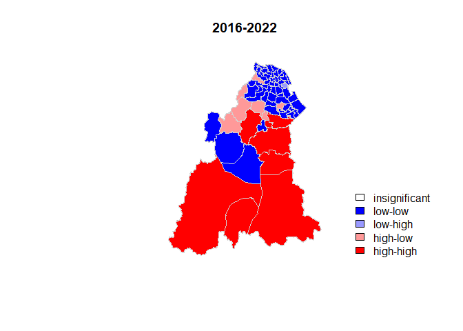<!-- -->

```r
#2016
m_lep16 <- count_lep16$n - mean(count_lep16$n) 
m_local_lep16 <- Local_Moran_lep16[,1]- mean(Local_Moran_lep16[,1]) 
signif <- 0.05 #significant threshold
quadrant_lep16 <- vector(mode="numeric",length = nrow(Local_Moran_lep16))
quadrant_lep16 [m_lep16>0 & m_local_lep16>0] <- 4
quadrant_lep16 [m_lep16<0 & m_local_lep16<0] <- 1
quadrant_lep16 [m_lep16<0 & m_local_lep16>0] <- 2
quadrant_lep16 [m_lep16>0 & m_local_lep16<0] <- 3
quadrant_lep16 [Local_Moran_lep16[,5]] <- 0
#plot LISA
brks <- c(0,1,2,3,4)
colors <- c("white", "blue",rgb(0,0,1,alpha=0.4),rgb(1,0,0,alpha = 0.4),"red")
plot(count_lep16[,5],main = "2016", las = 1, border="lightgray",col=colors[findInterval(quadrant_lep16,brks,all.inside = FALSE)])
legend("bottomright",legend = c("insignificant","low-low","low-high","high-low","high-high"),
       fill=colors,bty="n")
```

<!-- -->

```r
#2017
m_lep17 <- count_lep17$n - mean(count_lep17$n) 
m_local_lep17 <- Local_Moran_lep16[,1]- mean(Local_Moran_lep17[,1]) 
signif <- 0.05
quadrant_lep17 <- vector(mode="numeric",length = nrow(Local_Moran_lep17))
quadrant_lep17 [m_lep17>0 & m_local_lep17>0] <- 4
```

```
## Warning in m_lep17 > 0 & m_local_lep17 > 0: longer object length is not a
## multiple of shorter object length
```

```r
quadrant_lep17 [m_lep17<0 & m_local_lep17<0] <- 1
```

```
## Warning in m_lep17 < 0 & m_local_lep17 < 0: longer object length is not a
## multiple of shorter object length
```

```r
quadrant_lep17 [m_lep17<0 & m_local_lep17>0] <- 2
```

```
## Warning in m_lep17 < 0 & m_local_lep17 > 0: longer object length is not a
## multiple of shorter object length
```

```r
quadrant_lep17 [m_lep17>0 & m_local_lep17<0] <- 3
```

```
## Warning in m_lep17 > 0 & m_local_lep17 < 0: longer object length is not a
## multiple of shorter object length
```

```r
quadrant_lep17 [Local_Moran_lep17[,5]] <- 0
#plot LISA
brks <- c(0,1,2,3,4)
colors <- c("white", "blue",rgb(0,0,1,alpha=0.4),rgb(1,0,0,alpha = 0.4),"red")
plot(count_lep17[,5],main = "2017", las = 1, border="lightgray",col=colors[findInterval(quadrant_lep17,brks,all.inside = FALSE)])
```

```
## Warning in plot.sf(count_lep17[, 5], main = "2017", las = 1, border =
## "lightgray", : col is not of length 1 or nrow(x): colors will be recycled; use
## pal to specify a color palette
```

```r
legend("bottomright",legend = c("insignificant","low-low","low-high","high-low","high-high"),
       fill=colors,bty="n")
```

<!-- -->

```r
#2018
m_lep18 <- count_lep18$n - mean(count_lep18$n) 
m_local_lep18 <- Local_Moran_lep18[,1]- mean(Local_Moran_lep18[,1]) 
signif <- 0.05
quadrant_lep18 <- vector(mode="numeric",length = nrow(Local_Moran_lep17))
quadrant_lep18 [m_lep18>0 & m_local_lep18>0] <- 4
quadrant_lep18 [m_lep18<0 & m_local_lep18<0] <- 1
quadrant_lep18 [m_lep18<0 & m_local_lep18>0] <- 2
quadrant_lep18 [m_lep18>0 & m_local_lep18<0] <- 3
quadrant_lep18 [Local_Moran_lep18[,5]] <- 0
#plot LISA
brks <- c(0,1,2,3,4)
colors <- c("white", "blue",rgb(0,0,1,alpha=0.4),rgb(1,0,0,alpha = 0.4),"red")
plot(count_lep18[,5],main = "2018", las = 1, border="lightgray",col=colors[findInterval(quadrant_lep18,brks,all.inside = FALSE)])
```

```
## Warning in plot.sf(count_lep18[, 5], main = "2018", las = 1, border =
## "lightgray", : col is not of length 1 or nrow(x): colors will be recycled; use
## pal to specify a color palette
```

```r
legend("bottomright",legend = c("insignificant","low-low","low-high","high-low","high-high"),
       fill=colors,bty="n")
```

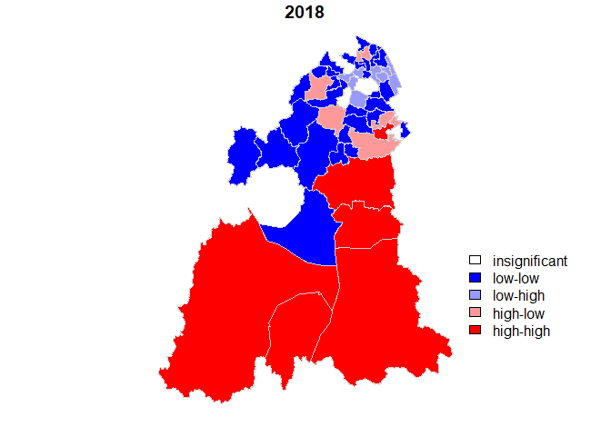<!-- -->

```r
#2019
m_lep19 <- count_lep19s$n - mean(count_lep19s$n) 
m_local_lep19 <- Local_Moran_lep19[,1]- mean(Local_Moran_lep19[,1]) 
signif <- 0.05
quadrant_lep19 <- vector(mode="numeric",length = nrow(Local_Moran_lep19))
quadrant_lep19 [m_lep19>0 & m_local_lep19>0] <- 4
quadrant_lep19 [m_lep19<0 & m_local_lep19<0] <- 1
quadrant_lep19 [m_lep19<0 & m_local_lep19>0] <- 2
quadrant_lep19 [m_lep19>0 & m_local_lep19<0] <- 3
quadrant_lep19 [Local_Moran_lep19[,5]] <- 0
#plot LISA
brks <- c(0,1,2,3,4)
colors <- c("white", "blue",rgb(0,0,1,alpha=0.4),rgb(1,0,0,alpha = 0.4),"red")
plot(count_lep19[,5],main = "2019", las = 1, border="lightgray",col=colors[findInterval(quadrant_lep19,brks,all.inside = FALSE)])
```

```
## Warning in plot.sf(count_lep19[, 5], main = "2019", las = 1, border =
## "lightgray", : col is not of length 1 or nrow(x): colors will be recycled; use
## pal to specify a color palette
```

```r
legend("bottomright",legend = c("insignificant","low-low","low-high","high-low","high-high"),
       fill=colors,bty="n")
```

<!-- -->

```r
#2022
m_lep22 <- count_lep22$n - mean(count_lep22$n) 
m_local_lep22 <- Local_Moran_lep22[,1]- mean(Local_Moran_lep22[,1]) 
signif <- 0.05
quadrant_lep22 <- vector(mode="numeric",length = nrow(Local_Moran_lep17))
quadrant_lep22 [m_lep19>0 & m_local_lep22>0] <- 4
```

```
## Warning in m_lep19 > 0 & m_local_lep22 > 0: longer object length is not a
## multiple of shorter object length
```

```r
quadrant_lep22 [m_lep19<0 & m_local_lep22<0] <- 1
```

```
## Warning in m_lep19 < 0 & m_local_lep22 < 0: longer object length is not a
## multiple of shorter object length
```

```r
quadrant_lep22 [m_lep19<0 & m_local_lep22>0] <- 2
```

```
## Warning in m_lep19 < 0 & m_local_lep22 > 0: longer object length is not a
## multiple of shorter object length
```

```r
quadrant_lep22 [m_lep19>0 & m_local_lep22<0] <- 3
```

```
## Warning in m_lep19 > 0 & m_local_lep22 < 0: longer object length is not a
## multiple of shorter object length
```

```r
quadrant_lep22 [Local_Moran_lep22[,5]] <- 0

#plot LISA
brks <- c(0,1,2,3,4)
colors <- c("white", "blue",rgb(0,0,1,alpha=0.4),rgb(1,0,0,alpha = 0.4),"red")
plot(count_lep22[,5],main = "2022", las = 1, border="lightgray",col=colors[findInterval(quadrant_lep22,brks,all.inside = FALSE)])
```

```
## Warning in plot.sf(count_lep22[, 5], main = "2022", las = 1, border =
## "lightgray", : col is not of length 1 or nrow(x): colors will be recycled; use
## pal to specify a color palette
```

```r
legend("bottomright",legend = c("insignificant","low-low","low-high","high-low","high-high"),
       fill=colors,bty="n")
```

<!-- -->

calculate Getis ord i* statistic for leptospirosis cases


```r
#2016
getis_ordlep16 <- localG(count_lep16$n, lw_lep16)

# join results to sf data
count_lep16$getis_ord <- getis_ordlep16

# plot map
GiLEP16 <- ggplot(data=count_lep16) +
  geom_sf(aes(fill=getis_ord)) +
  theme_bw() +
  scale_fill_gradient2(low="#2c7bb6", mid="#ffffbf", high="#d7191c",
                       name="Gi*") +
  labs(title="2016")
GiLEP16
```

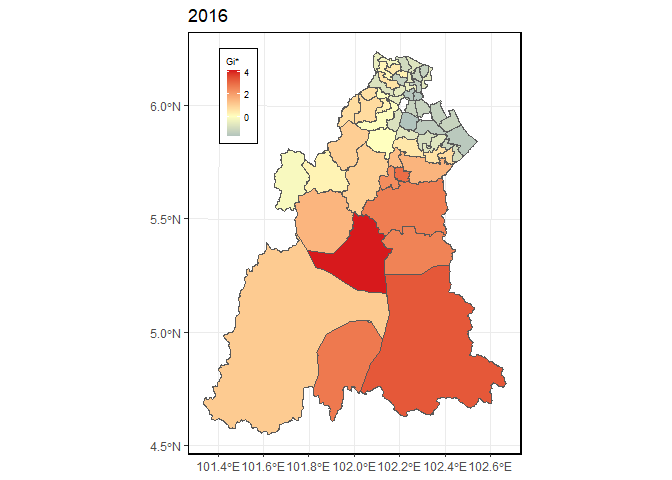<!-- -->

```r
#2017
getis_ordlep17 <- localG(count_lep17$n, lw_lep17)
count_lep17$getis_ord <- getis_ordlep17
GiLEP17 <- ggplot(data=count_lep17) +
  geom_sf(aes(fill=getis_ord)) +
  theme_bw() +
  scale_fill_gradient2(low="#2c7bb6", mid="#ffffbf", high="#d7191c",
                       name="Gi*") +
  labs(title="2017")
GiLEP17
```

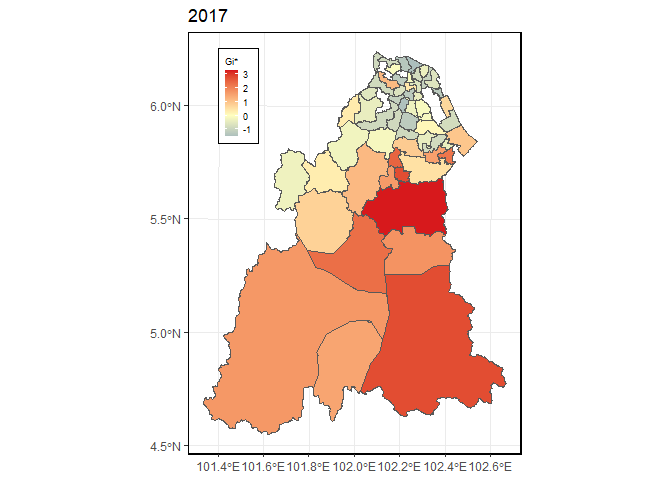<!-- -->

```r
#2018
getis_ordlep18 <- localG(count_lep18$n, lw_lep18)
count_lep18$getis_ord <- getis_ordlep18
GiLEP18 <- ggplot(data=count_lep18) +
  geom_sf(aes(fill=getis_ord)) +
  theme_bw() +
  scale_fill_gradient2(low="#2c7bb6", mid="#ffffbf", high="#d7191c",
                       name="Gi*") +
  labs(title="2018")
GiLEP18
```

<!-- -->

```r
#2019
getis_ordlep19 <- localG(count_lep19s$n, lw_lep19)
count_lep19s$getis_ord <- getis_ordlep19
GiLEP19 <- ggplot(data=count_lep19s) +
  geom_sf(aes(fill=getis_ord)) +
  theme_bw() +
  scale_fill_gradient2(low="#2c7bb6", mid="#ffffbf", high="#d7191c",
                       name="Gi*") +
  labs(title="2019")
GiLEP19
```

<!-- -->

```r
#2020
getis_ordlep20 <- localG(count_lep20$n, lw_lep20)
count_lep20$getis_ord <- getis_ordlep20
GiLEP20 <- ggplot(data=count_lep20) +
  geom_sf(aes(fill=getis_ord)) +
  theme_bw() +
  scale_fill_gradient2(low="#2c7bb6", mid="#ffffbf", high="#d7191c",
                       name="Gi*") +
  labs(title="2020")
GiLEP20
```

<!-- -->

```r
#2021
getis_ordlep21 <- localG(count_lep21$n, lw_lep21)
count_lep21$getis_ord <- getis_ordlep21
GiLEP21 <- ggplot(data=count_lep21) +
  geom_sf(aes(fill=getis_ord)) +
  theme_bw() +
  scale_fill_gradient2(low="#2c7bb6", mid="#ffffbf", high="#d7191c",
                       name="Gi*") +
  labs(title="2021")
GiLEP21
```

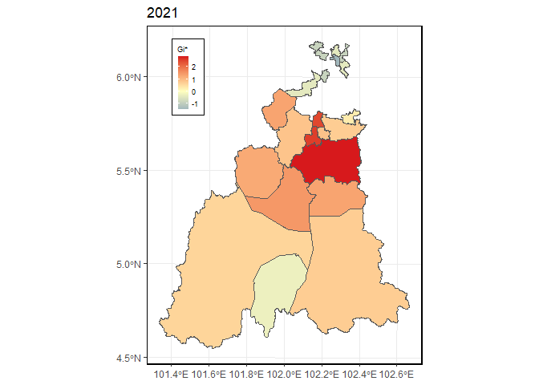<!-- -->

```r
#2022
getis_ordlep22 <- localG(count_lep22$n, lw_lep22)
count_lep22$getis_ord <- getis_ordlep22
GiLEP22 <- ggplot(data=count_lep22) +
  geom_sf(aes(fill=getis_ord)) +
  theme_bw() +
  scale_fill_gradient2(low="#2c7bb6", mid="#ffffbf", high="#d7191c",
                       name="Gi*") +
  labs(title="2022")
GiLEP22
```

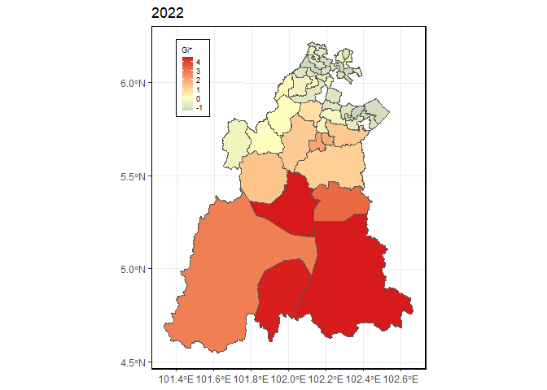<!-- -->

```r
#2016-2022
getis_ordlep <- localG(count_lep$n, lw_lep)
count_lep$getis_ord <- getis_ordlep
GiLEP <- ggplot(data=count_lep) +
  geom_sf(aes(fill=getis_ord)) +
  theme_bw() +
  scale_fill_gradient2(low="#2c7bb6", mid="#ffffbf", high="#d7191c",
                       name="Gi*") +
  labs(title="2016-2022")
GiLEP
```

<!-- -->


plot Getis ord Map for leptospirosis


```r
grid.arrange(GiLEP16, GiLEP17, GiLEP18, GiLEP19, GiLEP20, GiLEP21, GiLEP22, GiLEP, nrow=2, top=textGrob("Getis Ord Gi* Statistic Map of Leptospirosis Cases in Kelantan 2016-2022", gp = gpar(fontsize = 20)))
```

<!-- -->

## Spatial autocorrelation using incidence data

# enteric fever incidence 

Global Moran for enteric fever incidence 


```r
# 2016
inc_ent_kel16 <- count_ent16 %>% 
  mutate(inc_1000 = (n/JUMLAH_2016)*1000)
nb_ent_inc16 <- poly2nb(inc_ent_kel16, queen = TRUE) #set neigbouring queen
nb_ent_inc16 
```

```
## Neighbour list object:
## Number of regions: 29 
## Number of nonzero links: 72 
## Percentage nonzero weights: 8.561237 
## Average number of links: 2.482759 
## 1 region with no links:
## 13
```

```r
nb_ent_inc16s <-subset(nb_ent_inc16, subset=card(nb_ent_inc16) > 0)
inc_ent_kel16s <-inc_ent_kel16[-c(13),]
lw_ent_inc16 <- nb2listw(nb_ent_inc16s, style = "W" , zero.policy = TRUE) #assign weight
lep_ent_lag16 <- lag.listw(lw_ent_inc16, inc_ent_kel16s$inc_1000) #create lag function
moran.test(inc_ent_kel16s$inc_1000, lw_ent_inc16)
```

```
## 
## 	Moran I test under randomisation
## 
## data:  inc_ent_kel16s$inc_1000  
## weights: lw_ent_inc16    
## 
## Moran I statistic standard deviate = 0.59655, p-value = 0.2754
## alternative hypothesis: greater
## sample estimates:
## Moran I statistic       Expectation          Variance 
##        0.05611889       -0.03703704        0.02438563
```

```r
# 2017
inc_ent_kel17 <- count_ent17 %>% 
  mutate(inc_1000 = (n/JUMLAH_2017)*1000)
nb_ent_inc17 <- poly2nb(inc_ent_kel17, queen = TRUE) #set neigbouring queen
nb_ent_inc17 
```

```
## Neighbour list object:
## Number of regions: 18 
## Number of nonzero links: 20 
## Percentage nonzero weights: 6.17284 
## Average number of links: 1.111111 
## 7 regions with no links:
## 5 6 14 15 16 17 18
```

```r
nb_ent_inc17s <-subset(nb_ent_inc17, subset=card(nb_ent_inc17) > 0)
inc_ent_kel17s <-inc_ent_kel17[-c(5, 6, 14, 15, 16, 17, 18),]
lw_ent_inc17 <- nb2listw(nb_ent_inc17s, style = "W" , zero.policy = TRUE) #assign weight
lep_ent_lag17 <- lag.listw(lw_ent_inc17, inc_ent_kel17s$inc_1000) #create lag function
moran.test(inc_ent_kel17s$inc_1000, lw_ent_inc17)
```

```
## 
## 	Moran I test under randomisation
## 
## data:  inc_ent_kel17s$inc_1000  
## weights: lw_ent_inc17    
## 
## Moran I statistic standard deviate = 0.24936, p-value = 0.4015
## alternative hypothesis: greater
## sample estimates:
## Moran I statistic       Expectation          Variance 
##       -0.03126350       -0.10000000        0.07598555
```

```r
# 2018
inc_ent_kel18 <- count_ent18 %>% 
  mutate(inc_1000 = (n/JUMLAH_2018)*1000)
nb_ent_inc18 <- poly2nb(inc_ent_kel18, queen = TRUE) #set neigbouring queen
nb_ent_inc18 
```

```
## Neighbour list object:
## Number of regions: 18 
## Number of nonzero links: 30 
## Percentage nonzero weights: 9.259259 
## Average number of links: 1.666667 
## 3 regions with no links:
## 1 4 18
```

```r
nb_ent_inc18s <-subset(nb_ent_inc18, subset=card(nb_ent_inc18) > 0)
inc_ent_kel18s <-inc_ent_kel18[-c(1, 4, 18),]
lw_ent_inc18 <- nb2listw(nb_ent_inc18s, style = "W" , zero.policy = TRUE) #assign weight
lep_ent_lag18 <- lag.listw(lw_ent_inc18, inc_ent_kel18s$inc_1000) #create lag function
moran.test(inc_ent_kel18s$inc_1000, lw_ent_inc18)
```

```
## 
## 	Moran I test under randomisation
## 
## data:  inc_ent_kel18s$inc_1000  
## weights: lw_ent_inc18    
## 
## Moran I statistic standard deviate = 1.0606, p-value = 0.1444
## alternative hypothesis: greater
## sample estimates:
## Moran I statistic       Expectation          Variance 
##        0.17678637       -0.07142857        0.05476786
```

```r
# 2019
inc_ent_kel19 <- count_ent19 %>% 
  mutate(inc_1000 = (n/JUMLAH_2019)*1000)
nb_ent_inc19 <- poly2nb(inc_ent_kel19, queen = TRUE) #set neigbouring queen
nb_ent_inc19 
```

```
## Neighbour list object:
## Number of regions: 12 
## Number of nonzero links: 8 
## Percentage nonzero weights: 5.555556 
## Average number of links: 0.6666667 
## 5 regions with no links:
## 4 9 10 11 12
```

```r
nb_ent_inc19s <-subset(nb_ent_inc19, subset=card(nb_ent_inc19) > 0)
inc_ent_kel19s <-inc_ent_kel19[-c(4, 9, 10, 11, 12),]
lw_ent_inc19 <- nb2listw(nb_ent_inc19s, style = "W" , zero.policy = TRUE) #assign weight
lep_ent_lag19 <- lag.listw(lw_ent_inc19, inc_ent_kel19s$inc_1000) #create lag function
moran.test(inc_ent_kel19s$inc_1000, lw_ent_inc19)
```

```
## 
## 	Moran I test under randomisation
## 
## data:  inc_ent_kel19s$inc_1000  
## weights: lw_ent_inc19    
## 
## Moran I statistic standard deviate = -0.35406, p-value = 0.6384
## alternative hypothesis: greater
## sample estimates:
## Moran I statistic       Expectation          Variance 
##        -0.3450300        -0.1666667         0.2537821
```

```r
# 2020
inc_ent_kel20 <- count_ent20 %>% 
  mutate(inc_1000 = (n/JUMLAH_2020)*1000)
nb_ent_inc20 <- poly2nb(inc_ent_kel20, queen = TRUE) #set neigbouring queen
nb_ent_inc20 
```

```
## Neighbour list object:
## Number of regions: 10 
## Number of nonzero links: 14 
## Percentage nonzero weights: 14 
## Average number of links: 1.4 
## 2 regions with no links:
## 3 9
```

```r
nb_ent_inc20s <-subset(nb_ent_inc20, subset=card(nb_ent_inc20) > 0)
inc_ent_kel20s <-inc_ent_kel20[-c(3, 9),]
lw_ent_inc20 <- nb2listw(nb_ent_inc20s, style = "W" , zero.policy = TRUE) #assign weight
lep_ent_lag20 <- lag.listw(lw_ent_inc20, inc_ent_kel20s$inc_1000) #create lag function
moran.test(inc_ent_kel20s$inc_1000, lw_ent_inc20)
```

```
## 
## 	Moran I test under randomisation
## 
## data:  inc_ent_kel20s$inc_1000  
## weights: lw_ent_inc20    
## 
## Moran I statistic standard deviate = 1.0917, p-value = 0.1375
## alternative hypothesis: greater
## sample estimates:
## Moran I statistic       Expectation          Variance 
##        0.09617220       -0.14285714        0.04793718
```

```r
# 2021
inc_ent_kel21 <- count_ent21 %>% 
  mutate(inc_1000 = (n/JUMLAH_2021)*1000)
nb_ent_inc21 <- poly2nb(inc_ent_kel21, queen = TRUE) #set neigbouring queen
nb_ent_inc21 
```

```
## Neighbour list object:
## Number of regions: 5 
## Number of nonzero links: 4 
## Percentage nonzero weights: 16 
## Average number of links: 0.8 
## 1 region with no links:
## 3
```

```r
nb_ent_inc21s <-subset(nb_ent_inc21, subset=card(nb_ent_inc21) > 0)
inc_ent_kel21s <-inc_ent_kel21[-c(3),]
lw_ent_inc21 <- nb2listw(nb_ent_inc21s, style = "W" , zero.policy = TRUE) #assign weight
lep_ent_lag21 <- lag.listw(lw_ent_inc21, inc_ent_kel21s$inc_1000) #create lag function
moran.test(inc_ent_kel21s$inc_1000, lw_ent_inc21)
```

```
## 
## 	Moran I test under randomisation
## 
## data:  inc_ent_kel21s$inc_1000  
## weights: lw_ent_inc21    
## 
## Moran I statistic standard deviate = 1.3643, p-value = 0.08624
## alternative hypothesis: greater
## sample estimates:
## Moran I statistic       Expectation          Variance 
##         0.4739703        -0.3333333         0.3501684
```

```r
# 2022
inc_ent_kel22 <- count_ent22 %>% 
  mutate(inc_1000 = (n/JUMLAH_2022)*1000)
nb_ent_inc22 <- poly2nb(inc_ent_kel22, queen = TRUE) #set neigbouring queen
nb_ent_inc22 
```

```
## Neighbour list object:
## Number of regions: 12 
## Number of nonzero links: 10 
## Percentage nonzero weights: 6.944444 
## Average number of links: 0.8333333 
## 4 regions with no links:
## 1 3 8 10
```

```r
nb_ent_inc22s <-subset(nb_ent_inc22, subset=card(nb_ent_inc22) > 0)
inc_ent_kel22s <-inc_ent_kel22[-c(1, 3, 8, 10),]
lw_ent_inc22 <- nb2listw(nb_ent_inc22s, style = "W" , zero.policy = TRUE) #assign weight
lep_ent_lag22 <- lag.listw(lw_ent_inc22, inc_ent_kel22s$inc_1000) #create lag function
moran.test(inc_ent_kel22s$inc_1000, lw_ent_inc22)
```

```
## 
## 	Moran I test under randomisation
## 
## data:  inc_ent_kel22s$inc_1000  
## weights: lw_ent_inc22    
## 
## Moran I statistic standard deviate = 0.52042, p-value = 0.3014
## alternative hypothesis: greater
## sample estimates:
## Moran I statistic       Expectation          Variance 
##      -0.106743673      -0.142857143       0.004815466
```

```r
# 2016-2022
inc_ent_kel <- count_ent %>% 
  mutate(inc_1000 = (n/AVR)*1000)
nb_ent_inc <- poly2nb(inc_ent_kel, queen = TRUE) #set neigbouring queen
lw_ent_inc <- nb2listw(nb_ent_inc, style = "W" , zero.policy = TRUE) #assign weight
lep_ent_lag <- lag.listw(lw_ent_inc, inc_ent_kel$inc_1000) #create lag function
moran.test(inc_ent_kel$inc_1000, lw_ent_inc)
```

```
## 
## 	Moran I test under randomisation
## 
## data:  inc_ent_kel$inc_1000  
## weights: lw_ent_inc    
## 
## Moran I statistic standard deviate = -0.77361, p-value = 0.7804
## alternative hypothesis: greater
## sample estimates:
## Moran I statistic       Expectation          Variance 
##      -0.087743194      -0.019230769       0.007843121
```


# Leptospirosis incidence 

Global Moran for leptospirosis incidence 


```r
# 2016
inc_lep_kel16 <- count_lep16 %>% 
  mutate(inc_1000 = (n/JUMLAH_2016)*1000)
nb_lep_inc16 <- poly2nb(inc_lep_kel16, queen = TRUE) #set neigbouring queen
lw_lep_inc16 <- nb2listw(nb_lep_inc16, style = "W" , zero.policy = TRUE) #assign weight
lep_inc_lag16 <- lag.listw(lw_lep_inc16, inc_lep_kel16$inc_1000) #create lag function
moran.test(inc_lep_kel16$inc_1000, lw_lep_inc16)
```

```
## 
## 	Moran I test under randomisation
## 
## data:  inc_lep_kel16$inc_1000  
## weights: lw_lep_inc16    
## 
## Moran I statistic standard deviate = 5.5589, p-value = 1.357e-08
## alternative hypothesis: greater
## sample estimates:
## Moran I statistic       Expectation          Variance 
##        0.45130593       -0.01754386        0.00711349
```

```r
# 2017
inc_lep_kel17 <- count_lep17 %>% 
  mutate(inc_1000 = (n/JUMLAH_2017)*1000)
nb_lep_inc17 <- poly2nb(inc_lep_kel17, queen = TRUE) #set neigbouring queen
lw_lep_inc17 <- nb2listw(nb_lep_inc17, style = "W" , zero.policy = TRUE) #assign weight
lep_inc_lag17 <- lag.listw(lw_lep_inc17, inc_lep_kel17$inc_1000) #create lag function
moran.test(inc_lep_kel17$inc_1000, lw_lep_inc17)
```

```
## 
## 	Moran I test under randomisation
## 
## data:  inc_lep_kel17$inc_1000  
## weights: lw_lep_inc17    
## 
## Moran I statistic standard deviate = 2.0293, p-value = 0.02121
## alternative hypothesis: greater
## sample estimates:
## Moran I statistic       Expectation          Variance 
##       0.155086092      -0.017857143       0.007262764
```

```r
# 2018
inc_lep_kel18 <- count_lep18 %>% 
  mutate(inc_1000 = (n/JUMLAH_2018)*1000)
nb_lep_inc18 <- poly2nb(inc_lep_kel18, queen = TRUE) #set neigbouring queen
lw_lep_inc18 <- nb2listw(nb_lep_inc18, style = "W" , zero.policy = TRUE) #assign weight
lep_inc_lag18 <- lag.listw(lw_lep_inc18, inc_lep_kel18$inc_1000) #create lag function
moran.test(inc_lep_kel18$inc_1000, lw_lep_inc18)
```

```
## 
## 	Moran I test under randomisation
## 
## data:  inc_lep_kel18$inc_1000  
## weights: lw_lep_inc18    
## 
## Moran I statistic standard deviate = 3.1153, p-value = 0.0009188
## alternative hypothesis: greater
## sample estimates:
## Moran I statistic       Expectation          Variance 
##       0.274181310      -0.020000000       0.008917251
```

```r
# 2019
inc_lep_kel19 <- count_lep19 %>% 
  mutate(inc_1000 = (n/JUMLAH_2019)*1000)
nb_lep_inc19 <- poly2nb(inc_lep_kel19, queen = TRUE) #set neigbouring queen
nb_lep_inc19s <-subset(nb_lep_inc19, subset=card(nb_lep_inc19) > 0)
inc_lep_kel19s <-inc_lep_kel19[-c(8),]
lw_lep_inc19 <- nb2listw(nb_lep_inc19s, style = "W" , zero.policy = TRUE) #assign weight
lep_inc_lag19 <- lag.listw(lw_lep_inc19, inc_lep_kel19s$inc_1000) #create lag function
moran.test(inc_lep_kel19s$inc_1000, lw_lep_inc19)
```

```
## 
## 	Moran I test under randomisation
## 
## data:  inc_lep_kel19s$inc_1000  
## weights: lw_lep_inc19    
## 
## Moran I statistic standard deviate = 2.0521, p-value = 0.02008
## alternative hypothesis: greater
## sample estimates:
## Moran I statistic       Expectation          Variance 
##        0.25164972       -0.02702703        0.01844180
```

```r
# 2021
inc_lep_kel21 <- count_lep21 %>% 
  mutate(inc_1000 = (n/JUMLAH_2021)*1000)
nb_lep_inc21 <- poly2nb(inc_lep_kel21, queen = TRUE) #set neigbouring queen
lw_lep_inc21 <- nb2listw(nb_lep_inc21, style = "W" , zero.policy = TRUE) #assign weight
lep_inc_lag21 <- lag.listw(lw_lep_inc21, inc_lep_kel21$inc_1000) #create lag function
moran.test(inc_lep_kel21$inc_1000, lw_lep_inc21)
```

```
## 
## 	Moran I test under randomisation
## 
## data:  inc_lep_kel21$inc_1000  
## weights: lw_lep_inc21    
## 
## Moran I statistic standard deviate = 1.4274, p-value = 0.07673
## alternative hypothesis: greater
## sample estimates:
## Moran I statistic       Expectation          Variance 
##        0.18502302       -0.04545455        0.02607165
```

```r
# 2022
inc_lep_kel22 <- count_lep22 %>% 
  mutate(inc_1000 = (n/JUMLAH_2022)*1000)
nb_lep_inc22 <- poly2nb(inc_lep_kel22, queen = TRUE) #set neigbouring queen
lw_lep_inc22 <- nb2listw(nb_lep_inc22, style = "W" , zero.policy = TRUE) #assign weight
lep_inc_lag22 <- lag.listw(lw_lep_inc22, inc_lep_kel22$inc_1000) #create lag function
moran.test(inc_lep_kel22$inc_1000, lw_lep_inc22)
```

```
## 
## 	Moran I test under randomisation
## 
## data:  inc_lep_kel22$inc_1000  
## weights: lw_lep_inc22    
## 
## Moran I statistic standard deviate = 4.5118, p-value = 3.214e-06
## alternative hypothesis: greater
## sample estimates:
## Moran I statistic       Expectation          Variance 
##        0.41866094       -0.02127660        0.00950784
```

```r
# 2016-2022
inc_lep_kel <- count_lep %>% 
  mutate(inc_1000 = (n/AVR)*1000)
nb_lep_inc <- poly2nb(inc_lep_kel, queen = TRUE) #set neigbouring queen
lw_lep_inc <- nb2listw(nb_lep_inc, style = "W" , zero.policy = TRUE) #assign weight
lep_inc_lag <- lag.listw(lw_lep_inc, inc_lep_kel$inc_1000) #create lag function
moran.test(inc_lep_kel$inc_1000, lw_lep_inc)
```

```
## 
## 	Moran I test under randomisation
## 
## data:  inc_lep_kel$inc_1000  
## weights: lw_lep_inc    
## 
## Moran I statistic standard deviate = 8.5029, p-value < 2.2e-16
## alternative hypothesis: greater
## sample estimates:
## Moran I statistic       Expectation          Variance 
##       0.634597507      -0.015625000       0.005847827
```


```r
# 2020
inc_lep_kel20 <- count_lep20 %>% 
  mutate(inc_1000 = (n/JUMLAH_2020)*1000)
nb_lep_inc20 <- poly2nb(inc_lep_kel20, queen = TRUE) #set neigbouring queen
nb_lep_inc20s <-subset(nb_lep_inc20, subset=card(nb_lep_inc20) > 0)
inc_lep_kel20s <-inc_lep_kel20[-c(1, 5),]
lw_lep_inc20 <- nb2listw(nb_lep_inc20s, style = "W" , zero.policy = TRUE) #assign weight
lep_inc_lag20 <- lag.listw(lw_lep_inc20, inc_lep_kel20s$inc_1000) #create lag function
moran.test(inc_lep_kel20s$inc_1000, lw_lep_inc20)
```


local Moran for Leptospirosis incidence


```r
#2016
Local_Moran_lep16inc <- localmoran(inc_lep_kel16$inc_1000,lw_lep_inc16)
LEP16inc_poly <- cbind(inc_lep_kel16, Local_Moran_lep16inc)
#plot Local Moran
plotMlep16inc <- ggplot(data = LEP16inc_poly) +
  geom_sf(aes(fill=Ii)) +
  theme_bw() +
  scale_fill_gradient2(low="#2c7bb6", mid="#ffffbf", high="#d7191c",
                       name="Local Moran's I") +
  labs(title="2016")
plot(plotMlep16inc) 
```

<!-- -->

```r
#2017
Local_Moran_lep17inc <- localmoran(inc_lep_kel17$inc_1000,lw_lep_inc17)
LEP17inc_poly <- cbind(inc_lep_kel17, Local_Moran_lep17inc)
#plot Local Moran
plotMlep17inc <- ggplot(data = LEP17inc_poly) +
  geom_sf(aes(fill=Ii)) +
  theme_bw() +
  scale_fill_gradient2(low="#2c7bb6", mid="#ffffbf", high="#d7191c",
                       name="Local Moran's I") +
  labs(title="2017")
plot(plotMlep17inc) 
```

<!-- -->

```r
#2018
Local_Moran_lep18inc <- localmoran(inc_lep_kel18$inc_1000,lw_lep_inc18)
LEP18inc_poly <- cbind(inc_lep_kel18, Local_Moran_lep18inc)
#plot Local Moran
plotMlep18inc <- ggplot(data = LEP18inc_poly) +
  geom_sf(aes(fill=Ii)) +
  theme_bw() +
  scale_fill_gradient2(low="#2c7bb6", mid="#ffffbf", high="#d7191c",
                       name="Local Moran's I") +
  labs(title="2018")
plot(plotMlep18inc) 
```

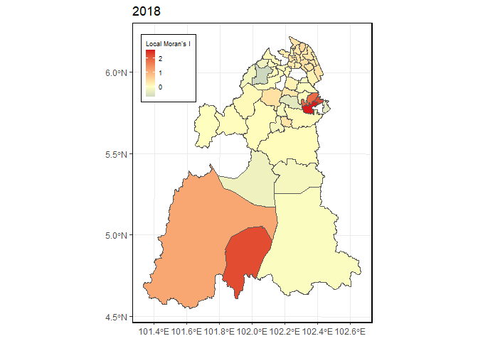<!-- -->

```r
#2019
Local_Moran_lep19inc <- localmoran(inc_lep_kel19s$inc_1000,lw_lep_inc19)
LEP19inc_poly <- cbind(inc_lep_kel19s, Local_Moran_lep19inc)
#plot Local Moran
plotMlep19inc <- ggplot(data = LEP19inc_poly) +
  geom_sf(aes(fill=Ii)) +
  theme_bw() +
  scale_fill_gradient2(low="#2c7bb6", mid="#ffffbf", high="#d7191c",
                       name="Local Moran's I") +
  labs(title="2019")
plot(plotMlep19inc)
```

<!-- -->

```r
#2021
Local_Moran_lep21inc <- localmoran(inc_lep_kel21$inc_1000,lw_lep_inc21)
LEP21inc_poly <- cbind(inc_lep_kel21, Local_Moran_lep21inc)
#plot Local Moran
plotMlep21inc <- ggplot(data = LEP21inc_poly) +
  geom_sf(aes(fill=Ii)) +
  theme_bw() +
  scale_fill_gradient2(low="#2c7bb6", mid="#ffffbf", high="#d7191c",
                       name="Local Moran's I") +
  labs(title="2021")
plot(plotMlep21inc)
```

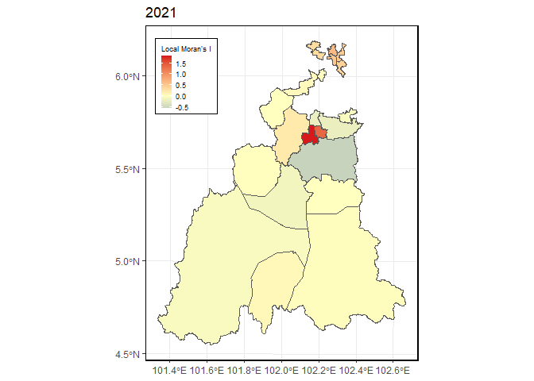<!-- -->

```r
#2022
Local_Moran_lep22inc <- localmoran(inc_lep_kel22$inc_1000,lw_lep_inc22)
LEP22inc_poly <- cbind(inc_lep_kel22, Local_Moran_lep22inc)
#plot Local Moran
plotMlep22inc <- ggplot(data = LEP22inc_poly) +
  geom_sf(aes(fill=Ii)) +
  theme_bw() +
  scale_fill_gradient2(low="#2c7bb6", mid="#ffffbf", high="#d7191c",
                       name="Local Moran's I") +
  labs(title="2022")
plot(plotMlep22inc)
```

<!-- -->

```r
#2016-2022
Local_Moran_lepinc <- localmoran(inc_lep_kel$inc_1000,lw_lep_inc)
LEPinc_poly <- cbind(inc_lep_kel, Local_Moran_lepinc)
#plot Local Moran
plotMlepinc <- ggplot(data = LEPinc_poly) +
  geom_sf(aes(fill=Ii)) +
  theme_bw() +
  scale_fill_gradient2(low="#2c7bb6", mid="#ffffbf", high="#d7191c",
                       name="Local Moran's I") +
  labs(title="2016-2020")
plot(plotMlepinc)
```

<!-- -->


```r
#2020
Local_Moran_lep20inc <- localmoran(inc_lep_kel20s$inc_1000,lw_lep_inc20)
LEP20inc_poly <- cbind(inc_lep_kel20s, Local_Moran_lep20inc)
#plot Local Moran
plotMlep20inc <- ggplot(data = LEP20inc_poly) +
  geom_sf(aes(fill=Ii)) +
  theme_bw() +
  scale_fill_gradient2(low="#2c7bb6", mid="#ffffbf", high="#d7191c",
                       name="Local Moran's I") +
  labs(title="2020")
plot(plotMlep20inc)
```


Plot Local Moran for Leptospirosis incidence
- 2020-2021 excluded (not significant)


```r
grid.arrange(plotMlep16inc, plotMlep17inc, plotMlep18inc, plotMlep19inc, plotMlep22inc, plotMlepinc,  nrow=2, top=textGrob("Local Moran's I Map of Leptospirosis Incidence in Kelantan 2016-2022", gp = gpar(fontsize = 20)))
```

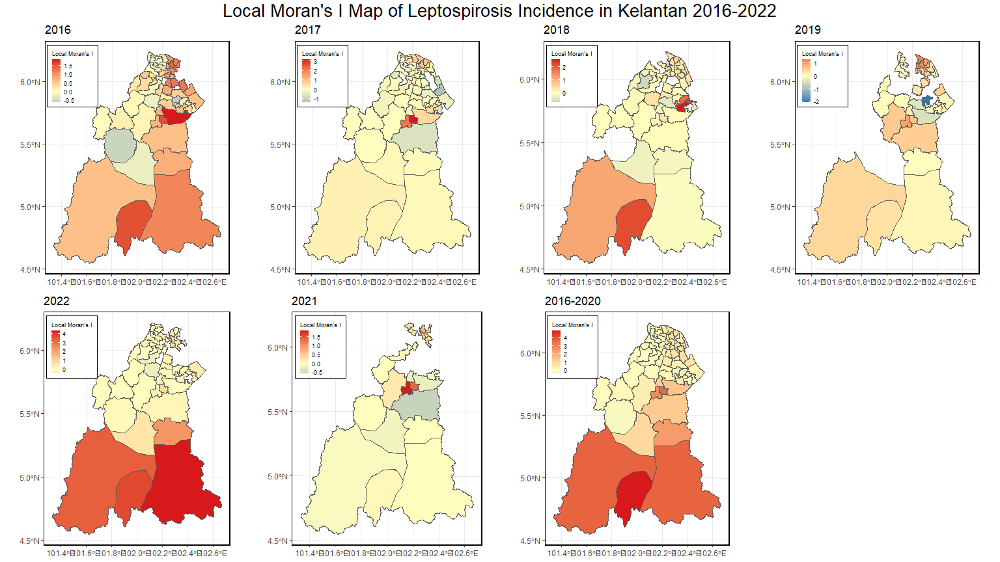<!-- -->


Local Moran's I p-values leptospirosis incidence


```r
LMp16i <- tm_shape(LEP16inc_poly) +
  tm_fill(col = "Pr.z....E.Ii..",
          breaks=c(-Inf, 0.001, 0.01, 0.05, 0.1, Inf),
          palette = "-Blues",
          title = "2016")+
  tm_borders(alpha = 0.5)

LMp17i <- tm_shape(LEP17inc_poly) +
  tm_fill(col = "Pr.z....E.Ii..",
          breaks=c(-Inf, 0.001, 0.01, 0.05, 0.1, Inf),
          palette = "-Blues",
          title = "2017")+
  tm_borders(alpha = 0.5)

LMp18i <- tm_shape(LEP18inc_poly) +
  tm_fill(col = "Pr.z....E.Ii..",
          breaks=c(-Inf, 0.001, 0.01, 0.05, 0.1, Inf),
          palette = "-Blues",
          title = "2018")+
  tm_borders(alpha = 0.5)

LMp19i <- tm_shape(LEP19inc_poly) +
  tm_fill(col = "Pr.z....E.Ii..",
          breaks=c(-Inf, 0.001, 0.01, 0.05, 0.1, Inf),
          palette = "-Blues",
          title = "2019")+
  tm_borders(alpha = 0.5)

LMp22i <- tm_shape(LEP22inc_poly) +
  tm_fill(col = "Pr.z....E.Ii..",
          breaks=c(-Inf, 0.001, 0.01, 0.05, 0.1, Inf),
          palette = "-Blues",
          title = "2022")+
  tm_borders(alpha = 0.5)

LMpi <- tm_shape(LEP_poly) +
  tm_fill(col = "Pr.z....E.Ii..",
          breaks=c(-Inf, 0.001, 0.01, 0.05, 0.1, Inf),
          palette = "-Blues",
          title = "2016-2022")+
  tm_borders(alpha = 0.5)
```

plot Local Moran's I p-values leptospirosis incidence


```r
# combine all local moran pvalue plot for leptospirosis  in one view
tmap_arrange(LMp16i, LMp17i, LMp18i, LMp19i, LMp22i, LMpi, ncol = 3) 
```

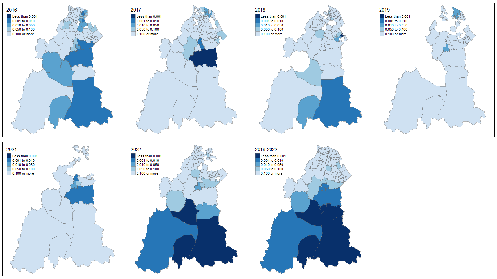<!-- -->


LISA map for leptospirosis incidence


```r
#LISA 2016-2022 leptospirosis incidence
m_lepinc <- inc_lep_kel$inc_1000 - mean(inc_lep_kel$inc_1000) #Center the variable of interest around its mean
m_local_lepinc <- Local_Moran_lepinc[,1]- mean(Local_Moran_lepinc[,1]) #Center the local Moran around the mean
signif <- 0.05 #significant threshold
quadrant_lepinc <- vector(mode="numeric",length = nrow(Local_Moran_lepinc))
#set classification - built data quadrant
quadrant_lep [m_lepinc>0 & m_local_lepinc>0] <- 4
quadrant_lep [m_lepinc<0 & m_local_lepinc<0] <- 1
quadrant_lep [m_lepinc<0 & m_local_lepinc>0] <- 2
quadrant_lep [m_lepinc>0 & m_local_lepinc<0] <- 3
quadrant_lep [Local_Moran_lepinc[,5]] <- 0
#plot LISA
brks <- c(0,1,2,3,4)
colors <- c("white", "blue",rgb(0,0,1,alpha=0.4),rgb(1,0,0,alpha = 0.4),"red")
plot(inc_lep_kel[,5],main = "2016-2022", las = 1, border="lightgray",col=colors[findInterval(quadrant_lep,brks,all.inside = FALSE)])
legend("bottomright",legend = c("insignificant","low-low","low-high","high-low","high-high"),
       fill=colors,bty="n")
```

<!-- -->

```r
#LISA 2016leptospirosis incidence
m_lepinc16 <- inc_lep_kel16$inc_1000 - mean(inc_lep_kel16$inc_1000) 
m_local_lepinc16 <- Local_Moran_lep16inc[,1]- mean(Local_Moran_lep16inc[,1]) 
signif <- 0.05 
quadrant_lep16inc <- vector(mode="numeric",length = nrow(Local_Moran_lep16inc))
quadrant_lep [m_lepinc16>0 & m_local_lepinc16>0] <- 4
quadrant_lep [m_lepinc16<0 & m_local_lepinc16<0] <- 1
quadrant_lep [m_lepinc16<0 & m_local_lepinc16>0] <- 2
quadrant_lep [m_lepinc16>0 & m_local_lepinc16<0] <- 3
quadrant_lep [Local_Moran_lep16inc[,5]] <- 0
brks <- c(0,1,2,3,4)
colors <- c("white", "blue",rgb(0,0,1,alpha=0.4),rgb(1,0,0,alpha = 0.4),"red")
plot(inc_lep_kel16[,5],main = "2016", las = 1, border="lightgray",col=colors[findInterval(quadrant_lep,brks,all.inside = FALSE)])
```

```
## Warning in plot.sf(inc_lep_kel16[, 5], main = "2016", las = 1, border =
## "lightgray", : col is not of length 1 or nrow(x): colors will be recycled; use
## pal to specify a color palette
```

```r
legend("bottomright",legend = c("insignificant","low-low","low-high","high-low","high-high"),
       fill=colors,bty="n")
```

<!-- -->

```r
#LISA 2017leptospirosis incidence
m_lepinc17 <- inc_lep_kel17$inc_1000 - mean(inc_lep_kel17$inc_1000) 
m_local_lepinc17 <- Local_Moran_lep17inc[,1]- mean(Local_Moran_lep17inc[,1]) 
signif <- 0.05 
quadrant_lep17inc <- vector(mode="numeric",length = nrow(Local_Moran_lep17inc))
quadrant_lep [m_lepinc17>0 & m_local_lepinc17>0] <- 4
quadrant_lep [m_lepinc17<0 & m_local_lepinc17<0] <- 1
quadrant_lep [m_lepinc17<0 & m_local_lepinc17>0] <- 2
quadrant_lep [m_lepinc17>0 & m_local_lepinc17<0] <- 3
quadrant_lep [Local_Moran_lep17inc[,5]] <- 0
brks <- c(0,1,2,3,4)
colors <- c("white", "blue",rgb(0,0,1,alpha=0.4),rgb(1,0,0,alpha = 0.4),"red")
plot(inc_lep_kel17[,5],main = "2017", las = 1, border="lightgray",col=colors[findInterval(quadrant_lep,brks,all.inside = FALSE)])
```

```
## Warning in plot.sf(inc_lep_kel17[, 5], main = "2017", las = 1, border =
## "lightgray", : col is not of length 1 or nrow(x): colors will be recycled; use
## pal to specify a color palette
```

```r
legend("bottomright",legend = c("insignificant","low-low","low-high","high-low","high-high"),
       fill=colors,bty="n")
```

<!-- -->

```r
#LISA 2018leptospirosis incidence
m_lepinc18 <- inc_lep_kel18$inc_1000 - mean(inc_lep_kel18$inc_1000) 
m_local_lepinc18 <- Local_Moran_lep18inc[,1]- mean(Local_Moran_lep18inc[,1]) 
signif <- 0.05 
quadrant_lep18inc <- vector(mode="numeric",length = nrow(Local_Moran_lep18inc))
quadrant_lep [m_lepinc18>0 & m_local_lepinc18>0] <- 4
quadrant_lep [m_lepinc18<0 & m_local_lepinc18<0] <- 1
quadrant_lep [m_lepinc18<0 & m_local_lepinc18>0] <- 2
quadrant_lep [m_lepinc18>0 & m_local_lepinc18<0] <- 3
quadrant_lep [Local_Moran_lep18inc[,5]] <- 0
brks <- c(0,1,2,3,4)
colors <- c("white", "blue",rgb(0,0,1,alpha=0.4),rgb(1,0,0,alpha = 0.4),"red")
plot(inc_lep_kel18[,5],main = "2018", las = 1, border="lightgray",col=colors[findInterval(quadrant_lep,brks,all.inside = FALSE)])
```

```
## Warning in plot.sf(inc_lep_kel18[, 5], main = "2018", las = 1, border =
## "lightgray", : col is not of length 1 or nrow(x): colors will be recycled; use
## pal to specify a color palette
```

```r
legend("bottomright",legend = c("insignificant","low-low","low-high","high-low","high-high"),
       fill=colors,bty="n")
```

<!-- -->

```r
#LISA 2019leptospirosis incidence
m_lepinc19 <- inc_lep_kel19s$inc_1000 - mean(inc_lep_kel19s$inc_1000) 
m_local_lepinc19 <- Local_Moran_lep19inc[,1]- mean(Local_Moran_lep19inc[,1]) 
signif <- 0.05 
quadrant_lep19inc <- vector(mode="numeric",length = nrow(Local_Moran_lep19inc))
quadrant_lep [m_lepinc19>0 & m_local_lepinc19>0] <- 4
quadrant_lep [m_lepinc19<0 & m_local_lepinc19<0] <- 1
quadrant_lep [m_lepinc19<0 & m_local_lepinc19>0] <- 2
quadrant_lep [m_lepinc19>0 & m_local_lepinc19<0] <- 3
quadrant_lep [Local_Moran_lep19inc[,5]] <- 0
brks <- c(0,1,2,3,4)
colors <- c("white", "blue",rgb(0,0,1,alpha=0.4),rgb(1,0,0,alpha = 0.4),"red")
plot(inc_lep_kel19[,5],main = "2019", las = 1, border="lightgray",col=colors[findInterval(quadrant_lep,brks,all.inside = FALSE)])
```

```
## Warning in plot.sf(inc_lep_kel19[, 5], main = "2019", las = 1, border =
## "lightgray", : col is not of length 1 or nrow(x): colors will be recycled; use
## pal to specify a color palette
```

```r
legend("bottomright",legend = c("insignificant","low-low","low-high","high-low","high-high"),
       fill=colors,bty="n")
```

<!-- -->

```r
#LISA 2022leptospirosis incidence
m_lepinc22 <- inc_lep_kel22$inc_1000 - mean(inc_lep_kel22$inc_1000) 
m_local_lepinc22 <- Local_Moran_lep22inc[,1]- mean(Local_Moran_lep22inc[,1]) 
signif <- 0.05 
quadrant_lep22inc <- vector(mode="numeric",length = nrow(Local_Moran_lep22inc))
quadrant_lep [m_lepinc22>0 & m_local_lepinc22>0] <- 4
quadrant_lep [m_lepinc22<0 & m_local_lepinc22<0] <- 1
quadrant_lep [m_lepinc22<0 & m_local_lepinc22>0] <- 2
quadrant_lep [m_lepinc22>0 & m_local_lepinc22<0] <- 3
quadrant_lep [Local_Moran_lep22inc[,5]] <- 0
brks <- c(0,1,2,3,4)
colors <- c("white", "blue",rgb(0,0,1,alpha=0.4),rgb(1,0,0,alpha = 0.4),"red")
plot(inc_lep_kel22[,5],main = "2022", las = 1, border="lightgray",col=colors[findInterval(quadrant_lep,brks,all.inside = FALSE)])
```

```
## Warning in plot.sf(inc_lep_kel22[, 5], main = "2022", las = 1, border =
## "lightgray", : col is not of length 1 or nrow(x): colors will be recycled; use
## pal to specify a color palette
```

```r
legend("bottomright",legend = c("insignificant","low-low","low-high","high-low","high-high"),
       fill=colors,bty="n")
```

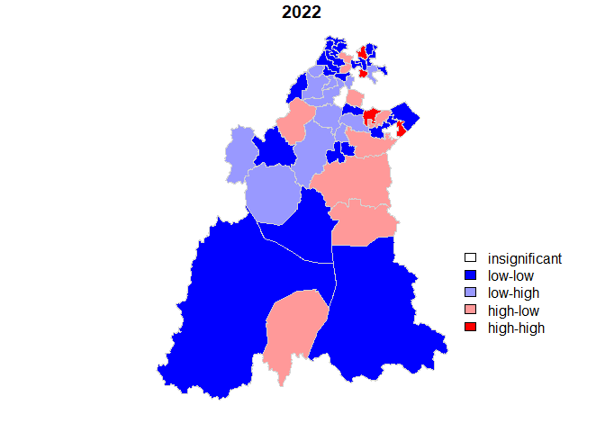<!-- -->

# corelation between cases abd population density

spatial relation of enteric fever cases to population by Lee's L test
- if not significant, the pattern of cases and population are not related to one another, the spatial pattern of cases is not strictly a result of population density in high-risk areas


```r
# 2016-2022
lee_testent <- lee.test(x=count_ent$n, y=count_ent$AVR, listw=lw_ent)            
lee_testent
```

```
## 
## 	Lee's L statistic randomisation
## 
## data:  count_ent$n ,  count_ent$AVR 
## weights: lw_ent  
## 
## Lee's L statistic standard deviate = 0.12651, p-value = 0.4497
## alternative hypothesis: greater
## sample estimates:
## Lee's L statistic       Expectation          Variance 
##       0.052922083       0.046273760       0.002761672
```

```r
# 2016
lee_testent16 <- lee.test(x=count_ent16s$n, y=count_ent16s$JUMLAH_2016, listw=lw_ent16)
lee_testent16
```

```
## 
## 	Lee's L statistic randomisation
## 
## data:  count_ent16s$n ,  count_ent16s$JUMLAH_2016 
## weights: lw_ent16  
## 
## Lee's L statistic standard deviate = -0.56244, p-value = 0.7131
## alternative hypothesis: greater
## sample estimates:
## Lee's L statistic       Expectation          Variance 
##       0.032957109       0.087861302       0.009529363
```

```r
# 2017
lee_testent17 <- lee.test(x=count_ent17s$n, y=count_ent17s$JUMLAH_2017, listw=lw_ent17)     
lee_testent17
```

```
## 
## 	Lee's L statistic randomisation
## 
## data:  count_ent17s$n ,  count_ent17s$JUMLAH_2017 
## weights: lw_ent17  
## 
## Lee's L statistic standard deviate = -0.30452, p-value = 0.6196
## alternative hypothesis: greater
## sample estimates:
## Lee's L statistic       Expectation          Variance 
##        -0.3487770        -0.2937281         0.0326780
```

```r
# 2018
lee_testent18 <- lee.test(x=count_ent18s$n, y=count_ent18s$JUMLAH_2018, listw=lw_ent18)     
lee_testent18
```

```
## 
## 	Lee's L statistic randomisation
## 
## data:  count_ent18s$n ,  count_ent18s$JUMLAH_2018 
## weights: lw_ent18  
## 
## Lee's L statistic standard deviate = -1.4486, p-value = 0.9263
## alternative hypothesis: greater
## sample estimates:
## Lee's L statistic       Expectation          Variance 
##       -0.36752221       -0.17155562        0.01829986
```

```r
# 2020
lee_testent20 <- lee.test(x=count_ent20s$n, y=count_ent20s$JUMLAH_2020, listw=lw_ent20)     
lee_testent20
```

```
## 
## 	Lee's L statistic randomisation
## 
## data:  count_ent20s$n ,  count_ent20s$JUMLAH_2020 
## weights: lw_ent20  
## 
## Lee's L statistic standard deviate = -0.51814, p-value = 0.6978
## alternative hypothesis: greater
## sample estimates:
## Lee's L statistic       Expectation          Variance 
##        0.02178849        0.19826158        0.11600221
```

```r
# 2021
lee_testent21 <- lee.test(x=count_ent21s$n, y=count_ent21s$JUMLAH_2021, listw=lw_ent21)     
```

```
## Warning in lee.test(x = count_ent21s$n, y = count_ent21s$JUMLAH_2021, listw =
## lw_ent21): Out-of-range p-value: reconsider test arguments
```

```r
lee_testent21
```

```
## 
## 	Lee's L statistic randomisation
## 
## data:  count_ent21s$n ,  count_ent21s$JUMLAH_2021 
## weights: lw_ent21  
## 
## Lee's L statistic standard deviate = NaN, p-value = NA
## alternative hypothesis: greater
## sample estimates:
## Lee's L statistic       Expectation          Variance 
##               NaN               NaN               NaN
```

```r
# 2022
lee_testent22 <- lee.test(x=count_ent22s$n, y=count_ent22s$JUMLAH_2022, listw=lw_ent22)     
lee_testent22
```

```
## 
## 	Lee's L statistic randomisation
## 
## data:  count_ent22s$n ,  count_ent22s$JUMLAH_2022 
## weights: lw_ent22  
## 
## Lee's L statistic standard deviate = 2.0767, p-value = 0.01891
## alternative hypothesis: greater
## sample estimates:
## Lee's L statistic       Expectation          Variance 
##        0.09523630       -0.27445724        0.03169109
```

```r
# 2019
lee_testent19 <- lee.test(x=count_ent19s$n, y=count_ent19s$JUMLAH_2019, listw=lw_ent19)     
lee_testent19
```

```
## 
## 	Lee's L statistic randomisation
## 
## data:  count_ent19s$n ,  count_ent19s$JUMLAH_2019 
## weights: lw_ent19  
## 
## Lee's L statistic standard deviate = -0.34283, p-value = 0.6341
## alternative hypothesis: greater
## sample estimates:
## Lee's L statistic       Expectation          Variance 
##       -0.23896174       -0.18561181        0.02421656
```

spatial relation of leptospirosis cases to population by Lee's L test
- if not significant, the pattern of cases and population are not related to one another, the spatial pattern of cases is not strictly a result of population density in high-risk areas


```r
# 2016-2022
lee_testlep <- lee.test(x=inc_lep_kel$n, y=inc_lep_kel$AVR, listw=lw_lep)            
lee_testlep
```

```
## 
## 	Lee's L statistic randomisation
## 
## data:  inc_lep_kel$n ,  inc_lep_kel$AVR 
## weights: lw_lep  
## 
## Lee's L statistic standard deviate = -0.32017, p-value = 0.6256
## alternative hypothesis: greater
## sample estimates:
## Lee's L statistic       Expectation          Variance 
##       0.073334864       0.087635091       0.001994959
```

```r
# 2016
lee_testlep16 <- lee.test(x=inc_lep_kel16$n, y=inc_lep_kel16$JUMLAH_2016, listw=lw_lep16)
lee_testlep16
```

```
## 
## 	Lee's L statistic randomisation
## 
## data:  inc_lep_kel16$n ,  inc_lep_kel16$JUMLAH_2016 
## weights: lw_lep16  
## 
## Lee's L statistic standard deviate = -1.3164, p-value = 0.906
## alternative hypothesis: greater
## sample estimates:
## Lee's L statistic       Expectation          Variance 
##       0.017399998       0.080129007       0.002270622
```

```r
# 2017
lee_testlep17 <- lee.test(x=inc_lep_kel17$n, y=inc_lep_kel17$JUMLAH_2017, listw=lw_lep17)
lee_testlep17
```

```
## 
## 	Lee's L statistic randomisation
## 
## data:  inc_lep_kel17$n ,  inc_lep_kel17$JUMLAH_2017 
## weights: lw_lep17  
## 
## Lee's L statistic standard deviate = -1.829, p-value = 0.9663
## alternative hypothesis: greater
## sample estimates:
## Lee's L statistic       Expectation          Variance 
##      -0.003599579       0.084373825       0.002313460
```

```r
# 2018
lee_testlep18 <- lee.test(x=inc_lep_kel18$n, y=inc_lep_kel18$JUMLAH_2018, listw=lw_lep18)
lee_testlep18
```

```
## 
## 	Lee's L statistic randomisation
## 
## data:  inc_lep_kel18$n ,  inc_lep_kel18$JUMLAH_2018 
## weights: lw_lep18  
## 
## Lee's L statistic standard deviate = -0.43488, p-value = 0.6682
## alternative hypothesis: greater
## sample estimates:
## Lee's L statistic       Expectation          Variance 
##       0.071614108       0.095715544       0.003071527
```

```r
# 2019
lee_testlep19 <- lee.test(x=inc_lep_kel19s$n, y=inc_lep_kel19s$JUMLAH_2019, listw=lw_lep19)
lee_testlep19
```

```
## 
## 	Lee's L statistic randomisation
## 
## data:  inc_lep_kel19s$n ,  inc_lep_kel19s$JUMLAH_2019 
## weights: lw_lep19  
## 
## Lee's L statistic standard deviate = -0.7183, p-value = 0.7637
## alternative hypothesis: greater
## sample estimates:
## Lee's L statistic       Expectation          Variance 
##        0.12367902        0.20527384        0.01290383
```

```r
# 2021
lee_testlep21 <- lee.test(x=inc_lep_kel21$n, y=inc_lep_kel21$JUMLAH_2021, listw=lw_lep21)
lee_testlep21
```

```
## 
## 	Lee's L statistic randomisation
## 
## data:  inc_lep_kel21$n ,  inc_lep_kel21$JUMLAH_2021 
## weights: lw_lep21  
## 
## Lee's L statistic standard deviate = -1.484, p-value = 0.9311
## alternative hypothesis: greater
## sample estimates:
## Lee's L statistic       Expectation          Variance 
##       -0.03764002        0.13213065        0.01308836
```

```r
# 2022
lee_testlep22 <- lee.test(x=inc_lep_kel22$n, y=inc_lep_kel22$JUMLAH_2022, listw=lw_lep22)
lee_testlep22
```

```
## 
## 	Lee's L statistic randomisation
## 
## data:  inc_lep_kel22$n ,  inc_lep_kel22$JUMLAH_2022 
## weights: lw_lep22  
## 
## Lee's L statistic standard deviate = -0.20502, p-value = 0.5812
## alternative hypothesis: greater
## sample estimates:
## Lee's L statistic       Expectation          Variance 
##       0.075754669       0.088327250       0.003760455
```


```r
# 2020
lee_testlep20 <- lee.test(x=inc_lep_kel20$n, y=inc_lep_kel20$JUMLAH_2020, listw=lw_lep20)
lee_testlep20
```

